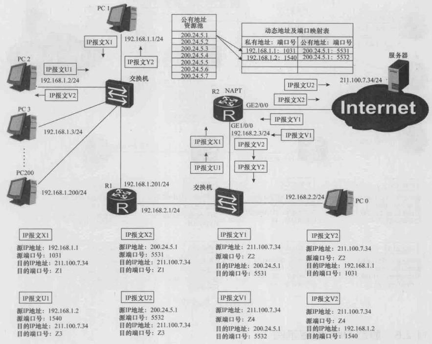
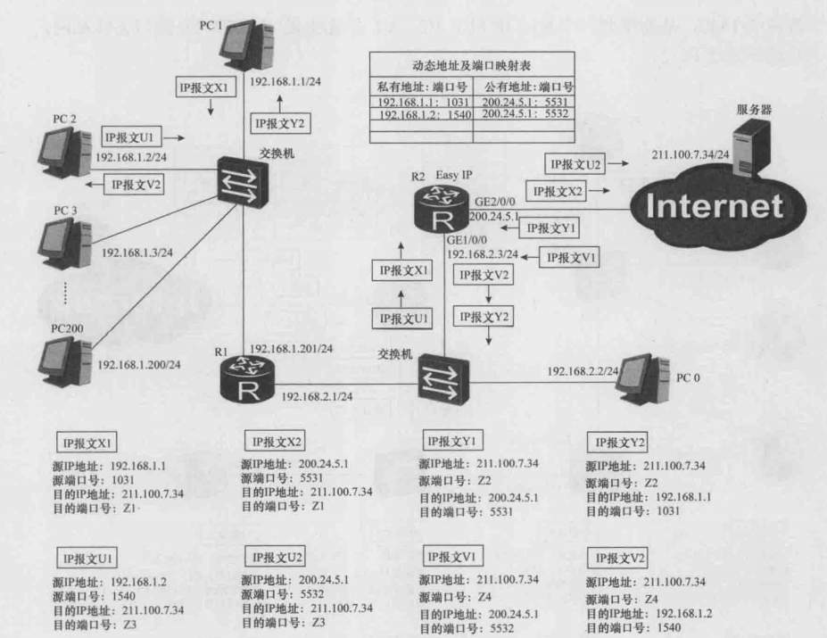

# NAT

## 一、网络地址转换技术

凡是 Internet（公网）上的网络设备，**均不会接收、发送或者转发源 IP 地址或目的 IP 地址为私网 IP 地址的 IP 报文**。简而言之，私网 IP 地址是不能出现在 Internet 上的。另外，在 Internet上，IP 地址还需要满足唯一性的要求。在同一个私网中，私有 IP 地址也需要满足唯一性的要求。**然而，在不同的私网中，私有 IP 地址则无需满足唯一性的要求**。

为了实现私网与 Internet 之间的通信，以及通过 Internet 实现私网与私网之间的通信，人们便引入了 NAT 技术。下面所列举的 NAT 技术本身都是基于这样一种假设：**在私网与公网进行通信时，发起通信的一方都是私网**。

### 1.静态 NAT 技术

为了能够实现私网与 Internet 之间的通信，我们可以在下图 R2 上部署静态 NAT。**静态 NAT 技术的核心内容就是建立并维护一张静态地址映射表**。静态地址映射表反映了公有 IP 地址与私有 IP 地址之间的一一对应关系。

    

上图中 R2 的 **`GE2/0/0`** 接口一侧是公网，而 **`GE1/0/0`** 是公司内部的私网，私网包含 192.168.1.0/24 和 192.168.2.0/24 两个网段，两个网段一共包含 7 个私网 IP 地址。并且该公司获得了 7 个公网 IP 地址。当 PC1 向服务器发送一个 IP 报文 X1 时（X1 的源地址是 192.168.1.1，目的地址是 211.100.7.34），当 X1 经过 R2 时，根据静态地址映射表，会将源地址 192.168.1.1 替换为公有地址 200.24.5.1，X1 变为 X2 发送给服务器。

同理，当服务器发送 IP 报文 Y1 给 PC1 时，Y1 经过 R2 时查找静态映射表，目的 IP 地址会被替换成 192.168.1.1，Y1 会变成 Y2 发送给 PC1。

### 2.动态 NAT 技术

仔细分析一下静态 NAT 技术，**其实每个用户所发起的绝大部分通信都是私网内部的通信，与 Internet 的通信只占极少的比例**。换句话说就是，私网中同时与 Internet 进行通信的用户数几乎不可能超过 7 个。基于这样的分析，我们可以在 R2 上部署动态 NAT，使用动态 NAT 技术来进行通信图如下所示：

    

动态 NAT 包含了一个公有 IP 地址资源池和一张动态地址映射表。当某个私网用户发起与 Internet 的通信时，**NAT 会先去检查公有 IP 地址资源池中是否还有可用的地址**。如果没有，则这次与Internet的通信就无法进行。如果有，则 NAT 会在公有地址资源池中选中一个公有 IP 地址，并在动态地址映射表中创建一个表项，该表项反映了该公有IP地址与该用户的私有 IP 地址之间的映射关系。

当该用户结束通信后，该表项会被清除，同时将该表项中的公有 IP 地址释放回公有地址资源池。**使用动态 NAT 技术，同一个公有 IP 地址可以分配给不同的私网用户使用，但在使用的时间上必须错开**。

### 3.NAPT 

当公司用户数量进一步发展时，同一时刻需要与 Internet 进行通信的用户数量可能超过 7 个，**无论是静态 NAT 还是动态 NAT，同一时刻一个公有 IP 地址只能与一个私有 IP 地址进行映射（绑定）**。为了进一步提高公有 IP 地址的利用率，使得同一个公有 IP 地址在同一时刻可以与多个私有 IP 地址进行映射，我们可以使用 NAPT 技术。NAPT 是 Network Address and Port Translation 的简称，其根本的原理就是**将 TCP 报文或 UDP 报文中的端口号作为映射参数纳入公有 IP 地址与私有 IP 地址之间的映射关系中**。NAPT 通信的详细流程图如下所示。

    

### 4.EasyIP 技术

Easy IP 技术是 NAPT 的一种简化情况。如下图所示，**Easy IP 无需建立公有 IP 地址资源池，因为 Easy IP 只会用到一个公有 IP 地址，该 IP 地址就是路由器 R2 的 GE2/0/0 接口的中地址**。Easy IP 也会建立并维护一张动态地址及端口映射表，并且，Easy IP 会将这张表中的公有 IP 地址绑定成 R2 的 GE2/0/0 接口的 IP 地址。R2 的 GE2/0/0 接口的 IP 地址如果发生了变化，那么，这张表中的公有IP地址也会自动跟着变化。GE2/0/0 接口的 IP 地址可以是手工配置的，也可以是动态分配的。EasyIP 技术的通信流程图如下所示：

    

## 二、源 NAT

