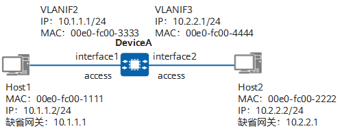

<div align="center">
    
</div>

如上图所示，用户主机 Host1 和 Host2 连接在同台设备上，分别属于 VLAN2 和 VLAN3，并位于不同的网段。在 DeviceA 上分别创建 VLANIF2 和 VLANIF3 并配置其 IP 地址，然后将用户主机的缺省网关设置为所属 VLAN 对应 VLANIF 接口的 IP 地址。

当用户主机Host1发送报文给用户主机Host2时，报文的发送过程如下（假设DeviceA上还未建立任何转发表项）。

1. Host1判断目的IP地址跟自己的IP地址不在同一网段，因此，它发出请求网关MAC地址的ARP请求报文，目的IP为网关IP地址10.1.1.1，目的MAC为全F。
2. 报文到达DeviceA的接口interface1，DeviceA给报文添加VID=2的Tag（Tag的VID=接口的PVID），然后将报文的“源MAC地址+VID+接口”的对应关系（00e0-fc00-1111， 2，interface1）添加进MAC表。
3. DeviceA检查报文是ARP请求报文，且目的IP是自己VLANIF2接口的IP地址，给Host1应答，并将VLANIF2接口的MAC地址00e0-fc00-3333封装在应答报文中，应答报文从interface1发出。同时，DeviceA会将Host1的IP地址与MAC地址的对应关系记录到ARP表。
4. Host1收到DeviceA的应答报文，将DeviceA的VLANIF2接口的IP地址与MAC地址对应关系记录到自己的ARP表中，并向DeviceA发送目的MAC为00e0-fc00-3333、目的IP为Host2的IP地址 10.2.2.2的报文。
5. 报文到达DeviceA的接口interface1，同样给报文添加VID=2的Tag。
6. DeviceA根据报文的“源MAC地址+VID+接口”的对应关系更新MAC表，并比较报文的目的MAC地址与VLANIF2的MAC地址，发现两者相等，进行三层转发，根据目的IP查找三层转发表，没有找到匹配项，上送CPU查找路由表。
7. CPU根据报文的目的IP去找路由表，发现匹配了一个直连网段（VLANIF3对应的网段），于是继续查找ARP表，没有找到，DeviceA会在目的网段对应的VLAN3的所有接口发送ARP请求报文，目的IP是10.2.2.2，从接口interface2发出。
8. Host2收到ARP请求报文，发现请求IP是自己的IP地址，就发送ARP应答报文，将自己的MAC地址包含在其中。同时，将VLANIF3的MAC地址与IP地址的对应关系记录到自己的ARP表中。
9. DeviceA的接口interface2收到Host2的ARP应答报文后，给报文添加VID=3的Tag，并将Host2的MAC和IP的对应关系记录到自己的ARP表中。然后，将Host1的报文转发给Host2，发送前，同样剥离报文中的Tag。同时，将Host2的IP地址、MAC地址、VID及出接口的对应关系记录到三层转发表中。

至此，Host1完成对Host2的单向访问。Host2访问Host1的过程与此类似。

CPU根据报文的目的IP去找路由表，发现匹配了一个直连网段（VLANIF3对应的网段），VLANIF3 配了 IP/掩码以后，设备的路由表里会自动出现一条“直连（Connected/Direct）路由”，并且这条路由的出接口就是 VLANIF3。所以当查路由表命中 10.2.2.0/24 时，直接从路由表项的出接口字段得出结论：这个网段直连在 VLANIF3 上。“直连网段属于 VLANIF3”这件事来自路由表本身：VLANIF3 的 IP/掩码自动生成直连路由，路由表项把出接口写死为 VLANIF3。

“出接口 = VLANIF3”只告诉 DeviceA：这个包要被送进 VLAN3 这个二层广播域里。至于具体从 VLAN3 的哪个物理端口发出去，要靠二层的“下一跳 MAC/端口”信息来决定（ARP + MAC 表）。

1) 三层只决定“去哪个 VLAN（哪个 VLANIF）”

路由查表命中直连 10.2.2.0/24 → 出接口 VLANIF3
对直连网段来说，“下一跳 IP”通常就是 目的 IP 本身（10.2.2.2），因为目标就在本 VLAN 里，不需要再转交给别的路由器。

2) 还缺一个东西：10.2.2.2 的 MAC 是多少（ARP）

DeviceA 查 ARP 表：
有：得到 10.2.2.2 → Host2-MAC
没有：就在 VLAN3 内发 ARP Request（广播），等 Host2 回 ARP Reply

3) 物理出端口怎么确定：看“Host2-MAC 在 VLAN3 的 MAC 表项指向哪个端口”

当 ARP Reply 从某个端口进来时，交换机会同时完成两件学习：

ARP 表：记录 10.2.2.2 → 00e0-fc00-2222
MAC 表（按 VLAN 维度）：记录 VLAN3: 00e0-fc00-2222 → interface2（因为 Host2 是从 interface2 接入的）

于是当它要把 Host1 的包转发出去时，会先构造新的二层头：

Dst MAC = 00e0-fc00-2222（Host2）
Src MAC = 00e0-fc00-4444（VLANIF3）
然后做一次 二层查表：

在 VLAN3 里查 00e0-fc00-2222 → 命中 interface2 ⇒ 于是就从 interface2 发出去（如果是 access 口就发 untagged；如果是 trunk 就按 egress 规则带 tag 或走 native）。

4) 如果 VLAN3 里有很多端口呢？

一样的逻辑：

- Host2 在哪个端口/上联方向出现，MAC 表就会学到它在哪个端口；
- 以后发给 Host2 的流量就只从那个端口单播出去；
- 如果 MAC 表没命中（未知单播），才会在 VLAN3 内 泛洪（除了入端口），直到学到为止。

```latex
Incoming Frame
\rightarrow \textbf{Ingress VLAN Classification} \;(\text{Access:PVID / Trunk:VID\&Allowed})
\rightarrow \textbf{Check Destination MAC}
\left\{
\begin{array}{ll}
\textbf{Match Local MAC}~(\text{SVI/VLANIF MAC, System/Virtual MAC}) \\
\quad \rightarrow \text{Deliver to L3/Control processing path} \\
\quad \rightarrow
\left\{
\begin{array}{ll}
\text{Dst IP is local (mgmt/ARP/ICMP to gateway IP)} \rightarrow \textbf{Control Plane (CPU) Terminate} \\
\text{Dst IP is non-local} \rightarrow \textbf{L3 Forwarding (usually in hardware; punt if exception)}
\end{array}
\right. \\[10pt]

\textbf{Broadcast / Multicast MAC} \\
\quad \rightarrow \textbf{L2 Replication/Flood within VLAN (data plane)} \\
\quad \rightarrow \text{CPU receives a copy only if required (e.g., ARP/ND, routing/mgmt/control)} \\[10pt]

\textbf{Unicast MAC (not local)} \\
\quad \rightarrow \textbf{Lookup L2 MAC Table} \\
\quad \rightarrow
\left\{
\begin{array}{ll}
\text{Hit} \rightarrow \textbf{Forward to egress port (data plane)} \\
\text{Miss (Unknown Unicast)} \rightarrow \textbf{Flood within VLAN (except ingress port)}
\end{array}
\right.
\end{array}
\right.
```

对于上述流程中关于交换机进行 3 层转发的过程，更详细的描述如下：

更准确的三层交换机 L3 转发流程（按逻辑顺序）
1.Ingress VLAN/接口归类（Access→PVID，Trunk→VID），决定该帧属于哪个 VLAN/接口域。
2.检查目的 MAC 是否为本机（SVI/VLANIF/System MAC）
- 不是本机：走二层交换（查 MAC 表/泛洪）。
- 是本机（发给网关）：进入三层处理/转发路径。
3.三层查表（FIB/路由表的转发表）
得到：
- 出接口（比如 VLANIF3 / 某个三层物理口）
- 下一跳 IP（直连网段时通常就是目的 IP 本身；非直连则是路由表里的 next-hop）
4.查邻居表（ARP/ND）拿到“下一跳 MAC”
- 命中：得到 next-hop MAC
- 未命中：触发 ARP/ND 解析（首包可能被丢弃/缓存/上送 CPU，取决于设备实现）
5.决定具体出端口（这一步是否需要“查 MAC 表”，取决于出接口类型）
- 出接口是 VLANIF/SVI（也就是“出到一个 VLAN/二层广播域”）：你拿到了 next-hop MAC（比如 Host2 的 MAC 或下游网关 MAC），还要在该 VLAN 的 MAC 表里查 MAC → 物理端口，才能知道从哪个口发出去。
  - 若 MAC 表命中：单播到对应端口
  - 若 MAC 表不命中：在该 VLAN 内未知单播泛洪（直到学到为止）
- 出接口是三层物理口（routed port，点到点或三层以太口，或者子接口 sub-interface）：
  - 出端口其实已经是那个物理口了（比如 GE0/0/1），无需再“MAC→端口”选择；只要用 ARP 得到的 next-hop MAC 重写二层头，然后直接从该口发。

场景 A：出接口是 VLANIF3（VLAN 里很多口）
路由查到：出接口 VLANIF3（表示“发进 VLAN3 这个广播域”）
ARP 查到：下一跳 MAC = Host2 的 MAC
还要查 MAC 表：Host2 的 MAC 在 VLAN3 的哪个物理端口？
00e0-fc00-2222 → interface2
然后从 interface2 发出

场景 B：出接口是 GE0/0/1（routed port）
路由查到：出接口 GE0/0/1（物理端口已确定）
ARP 查到：对端下一跳 MAC
直接从 GE0/0/1 发出（不需要 MAC 表选口）

实际上要满足哪些条件 VLAN 才能互通？
1.设备支持三层转发，并且开启三层转发功能（很多设备默认开启，但原则上要确保“IPv4 路由/转发”是打开的）。
2.每个需要互通的 VLAN 都要有对应的 VlanifX 并配置 IP。
3.终端默认网关要指向本 VLAN 的 Vlanif IP。
4.二层链路要让这些 VLAN 的报文能到达三层设备（trunk/allow-pass 等配置正确）。

每过一跳三层设备（路由器/三层交换机）就会变一次 MAC。

