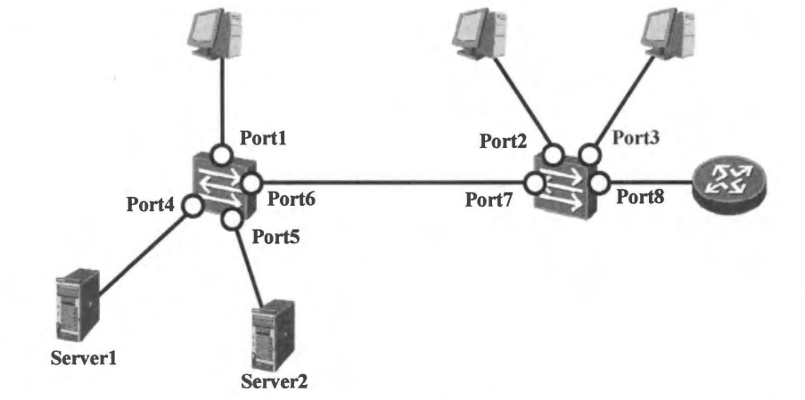
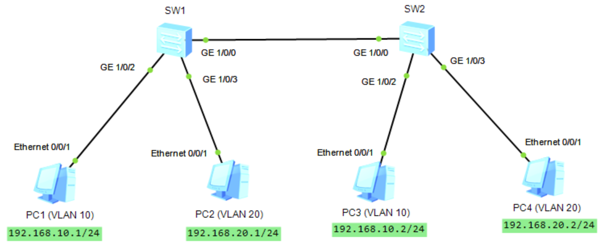

# VLAN 技术

## 一、VLAN 的作用

首先，我们来看看下图所示的网络。这是一个典型的交换网络，网络中只有终端计算机和交换机（注意，网络中不含路由器）。在这样的网络中，如果某一台计算机（比如 PC0）发送了一个广播帧，由于交换机总是对广播帧执行泛洪操作，结果所有其他的计算机都会收到这个广播帧。**<font color="red">我们把一个广播帧所能到达的整个范围称为二层广播域，简称为广播域（Broadcast Domain）。显然，一个交换网络其实就是一个广播域</font>**。

<div align="center">
    
</div>

下图所示的网络与上图所示的网络是同一个网络。在下图中，我们假定 PC0 向 PC10 发送了一个单播帧 Y。**<font color="red">假定此时 S1、S3、S7 的 MAC 地址表中存在关于 PC10 的 MAC 地址的表项</font>**，但 S2 和 S5 的 MAC 地址表中不存在关于 PC10 的 MAC 地址的表项，那么，S1 和 S3 将对 Y 帧执行点到点转发操作，S7 将对 Y 帧执行丢弃操作，S2 和 S5 将对 Y 帧执行泛洪操作。在下面的图片中，若目的 MAC 已知，但 **`出端口 = 入端口`**，需要执行过滤/丢弃（discard/filter）。所以 S7 丢弃而不是泛洪，泛洪只在"目的 MAC 未知"时发生，这里 S7 目的 MAC 已知，且在同一个入端口方向，因此直接丢弃。

最后的结果是，虽然目的主机 PC10 接收到了它应该接收到的 Y 帧，但同时 PC3、PC4、PC5、PC6、PC7、PC8 这几个非目的主机也接收到了它们不应该接收到的 Y 帧。这个例子向我们展示了两个我们不希望发生的问题，即一个是网络安全问题，一个是垃圾流量的问题。如果计算机可以轻易地接收到不应该接收的帧，那么就会存在安全隐患。另一个问题是垃圾流量问题，垃圾流量会浪费网络的带宽资源以及计算机的处理资源。

<div align="center">
    
</div>

为此，人们引入了 VLAN 技术：**<font color="red">通过在交换机上部署 VLAN 机制，可以将一个规模较大的广播域在逻辑上划分成若干个不同的、规模较小的广播域</font>**，由此便可以有效地提升网络的安全性，同时减少了垃圾流量，节约了网络资源。

特别需要说明的是，在一个广播域内，任何两台终端计算机之间都可以进行二层（数据链路层）通信。**所谓二层通信，是指通信的双方是以直接交换帧的方式来传递信息的**。也就是说，目的计算机所接收到的帧与源计算机发出的帧是一模一样的，帧的目的 MAC 地址、源 MAC 地址、类型值、载荷数据、CRC 等内容都没有发生任何改变。二层通信方式中，信息源发送的帧可能会通过交换机进行二层转发，但一定不会经过路由器（或具有三层转发功能的交换机）进行三层转发。

>在同一个二层广播域（同一 VLAN/同一网段的二层可达范围）里，两台主机可以用以太网帧直接通信，帧经过二层交换机转发时，帧头里的源/目的 MAC 不会被改。但一旦跨出这个广播域，需要经过路由器（或三层交换机）做三层转发时，设备会按下一跳重新封装一个新的二层帧，所以源/目的 MAC 会变化。**`新帧的源 MAC = 路由器出接口的 MAC`**，**`新帧目的 MAC = 下一跳设备的 MAC`**（可能是下一台路由器的 MAC，或者目标主机的 MAC——如果目标主机就在这个出接口直连的网段里）。

源计算机在向目的计算机传递信息时，如果源计算机发出的帧经过了路由器（或具有三层转发功能的交换机）的转发，那么目的计算机接收到的帧一定不再是源计算机发出的那个帧。**<font color="red">至少，目的计算机接收到的帧的目的 MAC 地址和源 MAC 地址一定不同于源计算机发出的帧的目的 MAC 地址和源 MAC 地址</font>**。在这样的情况下，源计算机与目的计算机之间的通信就不再是二层通信，而只能称为三层通信。

一个 VLAN 就是一个广播域，所以在同一个 VLAN 内部，计算机之间的通信就是二层通信。如果源计算机与目的计算机位于不同的 VLAN 中，那么它们之间是无法进行二层通信的，只能进行三层通信来传递信息。

使用 VLAN 具有如下优点：

- 隔绝广播：当交换机部署 VLAN 后，广播数据的泛洪被限制在 VLAN 内。利用 VLAN 技术可以将网络从原来的一个大的广播域切割成多个较小的广播域，从而减少了泛洪带来的带宽资源及设备性能的损耗。
- 提高网络组建的灵活度：VLAN 技术使得网络设计和部署更加灵活。同一个工作组的用户不再需要局限在同一个地理位置。
- 提高网络的可管理性：通过将不同的业务规划到不同的 VLAN，并且分配不同的 IP 网段，从而将每个业务划分成独立的单元，极大地方便了网络管理和维护。
- 提高网络的安全性：利用 VLAN 技术可以将不同的业务进行二层隔离。由于不同 VLAN 之间相互隔离，因此当一个 VLAN 发生故障，例如某个 VLAN 内发生 ARP 欺骗行为，不会影响到其他 VLAN。

## 二、VLAN 的基本原理

### 1.单交换机 VLAN 转发示例

如下图所示，一台交换机连接了 6 台计算机，本来只是一个广播域，现在通过 VLAN 技术将之划分成了两个较小的广播域，分别是 VLAN2 和 VLAN3。由于在交换机上进行了相关的 VLAN 配置，所以交换机知道了自己的 Port1、Port2、Port6 属于 VLAN2，Port3、Port4、Port5 属于 VLAN3。注意计算机本身是不能感知 VLAN 的，在计算机中完全没有 VLAN 的概念，在计算机上也不会进行任何有关 VLAN 的配置。

<div align="center">
    
</div>

如上图所示，假设 PC1 发送了一个广播帧 X。**<font color="red">因为 X 帧是从属于 VLAN2 的 Port1 进入交换机的，所以交换机会判定 X 帧属于 VLAN2，于是只会向同属于 VLAN2 的 Port2 和 Port6 进行泛洪</font>**。最后，只有 PC2 和 PC6 能够接收到 X 帧，而属于 VLAN3 的 PC3、PC4、PC5 是接收不到 X 帧的。

<div align="center">
    
</div>

如下图所示，假设 PC1 向 PC6 发送了一个单播帧 Y，另假设交换机的 VLAN2 的 MAC 地址表中存在关于 PC6 的 MAC 地址的表项。因为 Y 帧是从属于 VLAN2 的 Port1 进入交换机的，所以交换机会判定 Y 帧属于 VLAN2。交换机在查询了 VLAN2 的 MAC 地址表后，会将 Y 帧点到点地向同属于 VLAN2 的 Port6 进行转发。最后，PC6 便成功地接收到了 Y 帧，补充说明一下，如果交换机的 VLAN2 的 MAC 地址表中不存在关于 PC6 的 MAC 地址的表项，那么交换机会向 Port2 和 Port6 泛洪 Y 帧。PC2 收到 Y 帧后会将之丢弃；PC6 收到 Y 帧后不会将之丢弃，而是进行后续处理。

<div align="center">
    
</div>

如下图所示，假设 PC1 向 PC3 发送了一个单播帧 Z。因为 Z 帧是从属于 VLAN2 的 Port1 进入交换机的，所以交换机会判定 Z 帧属于 VLAN2。交换机的 VLAN2 的 MAC 地址表中在正常情况下是不存在关于 PC3 的 MAC 地址的表项的，所以交换机会向 Port2 和 Port6 泛洪 Z 帧。PC2 和 PC6 收到 Z 帧后会将之丢弃。最后的结果是，PC3 无法接收到 Z 帧，交换机阻断了 PC1 和 PC3 之间的二层通信。

<div align="center">
    
</div>

### 2.多交换机 VLAN 转发示例

我们再来看一个比较复杂的例子。如下图所示，3 台交换机和 6 台计算机组成了一个交换网络，该网络现在被划分成了两个 VLAN，分别是 VLAN2 和 VLAN3。由于在每台交换机上都进行了 VLAN 配置，**<font color="red">所以交换机知道自己的哪些端口属于 VLAN2，哪些端口属于 VLAN3，哪些端口既属于 VLAN2，又属于 VLAN3</font>**。

<div align="center">
    
</div>

如下图所示，假设 PC1 发送了一个广播帧 X。因为 X 帧是从交换机 1 的、属于 VLAN2 的 Port1 进入交换机 1 的，所以交换机 1 会判定 X 帧属于 VLAN2，于是会向 Port2 和 Port4 进行泛洪。交换机3 从其 Port1 收到 X 帧后，会通过某种方法识别出 X 帧是属于 VLAN2 的，于是会向 Port2 泛洪 X 帧。交换机 2 从其 Port4 收到 X 帧后，也会通过某种方法识别出 X 帧是属于 VLAN2 的，于是会向 Port1 泛洪 X 帧。最后，PC2 和 PC4 都会接收到 X 帧。

<div align="center">
    
</div>

如下图所示，假设 PC1 向 PC4 发送了一个单播帧 Y，**<font color="red">另假设所有交换机的 VLAN2 的 MAC 地址表中都存在关于 PC4 的 MAC 地址的表项</font>**。因为 Y 帧是从交换机 1 的、属于 VLAN2 的 Port1 进入交换机 1 的，所以交换机 1 会判定 Y 帧属于 VLAN2。交换机 1 在查询了自己的 VLAN2 的 MAC 地址表后，会将 Y 帧点到点地向 Port4 进行转发。

交换机 3 从其 Port1 收到 Y 帧后，会通过某种方法识别出 Y 帧是属于 VLAN2 的。交换机 3 在查询了自己的 VLAN2 的 MAC 地址表后，会将 Y 帧点到点地向 Port2 进行转发。交换机 2 从其 Port4 收到 Y 帧后，也会通过某种方法识别出 Y 帧是属于 VLAN2 的。交换机 2 在查询了自己的 VLAN2 的 MAC 地址表后，会将 Y 帧点到点地向 Port1 进行转发。最后，PC4 便会接收到 Y 帧。

<div align="center">
    
</div>

如下图所示，假设 PC1 向 PC6 发送了一个单播帧 Z。**<font color="red">所有交换机的 VLAN2 的 MAC 地址表中在正常情况下是不存在关于 PC6 的 MAC 地址的表项的</font>**。因为 Z 帧是从交换机 1 的、属于 VLAN2 的 Port1 进入交换机 1 的，所以交换机 1 会判定 Z 帧属于 VLAN2。交换机 1 在自己的 VLAN2 的 MAC 地址表中查不到关于 PC6 的 MAC 地址的表项，所以交换机 1 会向 Port2 和 Port4 泛洪 Z 帧。

交换机 3 从其 Port1 收到 Z 帧后，会通过某种方法识别出 Z 帧是属于 VLAN2 的。交换机 3 在自己的 VLAN2 的 MAC 地址表中查不到关于 PC6 的 MAC 地址的表项，所以交换机 3 会向 Port2 泛洪 Z 帧。交换机 2 从其 Port4 收到 Z 帧后，也会通过某种方法识别出 Z 帧是属于 VLAN2 的。交换机 2 在自己的 VLAN2 的 MAC 地址表中查不到关于 PC6 的 MAC 地址的表项，所以交换机 2 会向 Port1 泛洪 Z 帧。

最后，PC2 和 PC4 都会接收到 Z 帧，但都会将之丢弃。PC6 并不能接收到 PC1 发送给自己的 Z 帧，交换机阻断了 PC1 和 PC6 之间的二层通信。

<div align="center">
    
</div>

## 三、802.1Q 帧的格式

IEEE802.1D 定义了关于不支持 VLAN 特性的交换机的标准规范，IEEE802.1Q（也被称为 Dot1Q 规范）定义了关于支持 VLAN 特性的交换机的标准规范。IEEE802.1Q 的内容覆盖了 IEEE802.1D 的所有内容，并增加了有关 VLAN 特性的内容。

交换机在识别一个帧是属于哪个 VLAN 的时候，可以根据这个帧是从哪个端口进入自己的来进行判定，也可能需要根据别的信息来进行判定。通常，**<font color="red">交换机识别出某个帧是属于哪个 VLAN 后，会在这个帧的特定位置上添加上一个标签（Tag），这个 Tag 明确地表明了这个帧是属于哪个 VLAN 的</font>**。这样一来，别的交换机收到这个带 Tag 的帧后，就能轻易而举地直接根据 Tag 信息识别出这个帧是属于哪个 VLAN 的。IEEE802.1Q 定义了这种带 Tag 的帧的格式，满足这种格式的帧称为 IEEE802.1Q 帧，如下图所示。

<div align="center">
    
</div>

上图中的 VID 就用来表示该帧所属的 VLAN，VLAN ID 的取值范围是 0~4095。其中，**`VID=0/4095`** 为协议保留值，所以 VLAN ID 的有效取值范围是 1~4094。

如果一个帧的源 MAC 地址后面的两个字节的值是 **`0x8100`**，则说明这个帧是一个 Tagged 帧；如果一个帧的源 MAC 地址后面的两个字节的值不是 **`0x8100`**，则说明这个帧是一个传统的 Untagged 帧。另外，需要再次指出的是，计算机中是没有任何关于 VLAN 的概念的。**<font color="red">计算机不会产生并发送 Tagged 帧。如果计算机接收到了一个 Tagged 帧，由于它识别不出 `0x8100` 的含义，于是会直接将这个 Tagged 帧丢弃</font>**。

## 四、VLAN 的分类

刚才说到，计算机发送的帧都是不带 Tag 的。对于一个支持 VLAN 特性的交换网络来说，当计算机发送的 Untagged 帧一旦进入交换机后，交换机必须通过某种划分原则把这个帧划分到某个特定的 VLAN 中去。根据划分原则的不同，VLAN 便有了不同的类型。

### 1.基于端口的 VLAN

将 VLAN 的编号（VLAN ID）配置映射到交换机的物理端口上，**<font color="red">从某一物理端口进入交换机的、由终端计算机发送的 Untagged 帧都被划分到该端口的 VLAN ID 所表明的那个 VLAN</font>**。注意，对于这种类型的 VLAN，当计算机接入交换机的端口发生了变化时，该计算机发送的帧的 VLAN 归属可能会发生改变。基于端口的 VLAN 通常也称为物理层 VLAN，或一层 VLAN。

### 2.基于 MAC 地址的 VLAN

交换机内部建立并维护了一个 MAC 地址与 VLAN ID 的对应表，当交换机接收到计算机发送的 Untagged 帧时，**<font color="red">交换机将分析帧中的源 MAC 地址，然后查询 MAC 地址与 VLAN ID 的对应表，并根据对应关系把这个帧划分到相应的 VLAN 中</font>**。这种划分原则实现起来稍显复杂，但灵活性得到了提高。例如，当计算机接入交换机的端口发生了变化时，该计算机发送的帧的 VLAN 归属并不会发生改变（因为计算机的 MAC 地址不会发生变化）。但需要指出的是，这种类型的 VLAN 的安全性不是很高，因为一些恶意的计算机是很容易伪造自己的 MAC 地址的。基于 MAC 地址的 VLAN 通常也称为二层 VLAN。

### 3.基于协议的 VLAN

交换机根据计算机发送的 Untagged 帧中的帧类型字段的值来决定帧的 VLAN 归属。例如，可以将类型值为 **`0x0800`** 的帧划分到一个 VLAN，将类型值为 **`0x86dd`** 的帧划分到另一个 VLAN。这实际上是将载荷数据为 IPv4 Packet 的帧和载荷数据为 IPv6 Packet 的帧分别划分到了不同的 VLAN。基于协议的 VLAN 通常也称为三层 VLAN。

就目前来看，基于端口的 VLAN 在实际的网络中应用最为广泛。如无特别说明，后面所提到的 VLAN，均是指基于端口的 VLAN。

## 五、链路类型和端口类型

一个 VLAN 帧可能带有 Tag（称为 Tagged VLAN 帧，或简称为 Tagged 帧），也可能不带 Tag（称为 Untagged VLAN 帧，或简称为 Untagged 帧）。在谈及 VLAN 技术时，如果一个帧被交换机划分到 VLAN i，我们就把这个帧简称为一个 VLAN i 的帧。对于带有 Tag 的 VLAN i 帧，i 其实就是这个帧的 Tag 中的 VID 字段的取值。

**注意，对于 Tagged VLAN 帧，交换机显然能够从其 Tag 中的 VID 值判定出它属于哪个 VLAN；对于 Untagged VLAN 帧（例如终端计算机发出的帧），交换机需要根据某种原则（比如根据这个帧是从哪个端口进入交换机的）来判定或划分它属于哪个 VLAN**。

在一个支持 VLAN 特性的交换网络中，我们把交换机与终端计算机直接相连的链路称为 Access 链路（Access Link），把 Access 链路上交换机一侧的端口称为 Access 端口（Access Port）。同时，我们把交换机之间直接相连的链路称为 Trunk 链路（Trunk Link），把 Trunk 链路上两侧的端口称为 Trunk 端口（Trunk Port）。**<font color="red">但是当交换机的接口用于连接路由器时，如果路由器的接口工作在 3 层模式，并且没有部署子接口（sub-interface），那么交换机侧的该接口也应被配置为 Access 端口</font>**，如下图所示的 port8。

如果路由器这根物理口只承载一个网段/一个 VLAN，而且路由器侧没有做 802.1Q 子接口，那交换机侧就把对接口当作接入某个 VLAN 的无标签口来用——最常见就是配成 Access。当希望一根链路同时承载多个 VLAN（比如 VLAN10/20/30 都要送到路由器做三层网关或策略），**<font color="blue">路由器就需要在同一物理口下建多个 Sub-interface，并在每个子接口上配置 802.1Q **`encapsulation/dot1q VLAN ID`**，用 VLAN Tag 来区分不同 VLAN 的流量，这就是经典的 router-on-a-stick，此时交换机侧必须配 Trunk 去传递 VLAN Tag</font>，并放行相应 VLAN**。

比如在园区/企业网里，子接口最常见的用途就是配合 VLAN（802.1Q）做一线多 VLAN，一根链路承载多个 VLAN（典型单臂路由）。路由器在 GE0/0/1.10 上配置 **`encapsulation dot1q 10`** + 网关1 IP，在 GE0/0/1.20 上配置 **`encapsulation dot1q 20`** + 网关2 IP，交换机对接口配 Trunk，放行 VLAN 10/20，这样不同 VLAN 的流量通过同一物理口进入路由器，由不同子接口区分。

<div align="center">
    
</div>

**<font color="red">在一条 Access 链路上运动的帧只能是 Untagged 帧，并且这些帧只能属于某个特定的 VLAN；在一条 Trunk 链路上运动的帧只能是（或者说应该是）Tagged 帧，并且这些帧可以属于不同的 VLAN</font>**。一个 Access 端口只能属于某个特定的 VLAN，并且只能让属于这个特定 VLAN 的帧通过；一个 Trunk 端口可以同时属于多个 VLAN，并且可以让属于不同 VLAN 的帧通过，如下图所示。

<div align="center">
    
</div>

每一个交换机的端口（无论是 Access 端口还是 Trunk 端口）都应该配置一个 PVID（Port VLAN ID），**<font color="red">到达这个端口的 Untagged 帧将一律被交换机划分到 PVID 所指代的 VLAN</font>**。例如，如果一个端口的 PVID 被配置为 5，则所有到达这个端口的 Untagged 帧都将被认定为是属于 VLAN5 的帧。默认情况下，PVID 的值为 1。

概括地讲，链路上运动的帧，可能是 Tagged 帧，也可能是 Untagged 帧。**<font color="red">但一台交换机内部不同端口之间运动的帧则一定是 Tagged 帧</font>**。接下来，我们具体地描述一下 Access 端口和 Trunk 端口对于帧的处理和转发规则。

### 1.Access 端口的处理和转发规则

当 Access 端口从链路上收到一个 Untagged 帧后，交换机会在这个帧中添加上 VID 为 PVID 的 Tag，然后对得到的 Tagged 帧进行转发操作（泛洪、点到点转发、丢弃）。

当 Access 端口从链路上收到一个 Tagged 帧后，交换机会检查这个帧的 Tag 中的 VID 是否与 PVID 相同。如果相同，则对这个 Tagged 帧进行转发操作（泛洪、点到点转发、丢弃）；如果不同，则直接丢弃这个 Tagged 帧。

当一个 Tagged 帧从本交换机的其他端口到达一个 Access 端口后，交换机会检查这个帧的 Tag 中的 VID 是否与 PVID 相同。如果相同，则将这个 Tagged 帧的 Tag 进行剥离，然后将得到的 Untagged 帧从链路上发送出去；如果不同，则直接丢弃这个 Tagged 帧。

### 2.Trunk 端口的处理和转发规则

对于每一个 Trunk 端口，除了要配置 PVID 之外，还必须配置允许通过的 VLAN ID 列表。

当 Trunk 端口从链路（线路）上收到一个 Untagged 帧后，交换机会在这个帧中添加上 VID 为 PVID 的 Tag，然后查看 PVID 是否在允许通过的 VLAN ID 列表中。如果在，则对得到的 Tagged 帧进行转发操作（泛洪、点到点转发、丢弃）；如果不在，则直接丢弃得到的 Tagged 帧。

当 Trunk 端口从链路（线路）上收到一个 Tagged 帧后，交换机会查看这个帧的 Tag 中的 VID 是否在允许通过的 VLAN ID 列表中。如果在，则对该 Tagged 帧进行转发操作（泛洪、点到点转发、丢弃）；如果不在，则直接丢弃该 Tagged 帧。

当一个 Tagged 帧从本交换机的其他端口到达一个 Trunk 端口后，如果这个帧的 Tag 中的 VID 不在允许通过的 VLAN ID 列表中，则该 Tagged 帧会被直接丢弃。

当一个 Tagged 帧从本交换机的其他端口到达一个 Trunk 端口后，如果这个帧的 Tag 中的 VID 在允许通过的 VLAN ID 列表中，**<font color="red">且 VID 与 PVID 相同，则交换机会对这个 Tagged 帧的 Tag 进行剥离</font>**，然后将得到的 Untagged 帧从链路（线路）上发送出去。

当一个 Tagged 帧从本交换机的其他端口到达一个 Trunk 端口后，如果这个帧的 Tag 中的 VID 在允许通过的 VLAN ID 列表中，**<font color="red">但 VID 与 PVID 不相同，则交换机不会对这个 Tagged 帧的 Tag 进行剥离</font>**，而是直接将它从链路（线路）上发送出去。

给 trunk 端口配置允许通过的 VLAN ID 列表（allowed VLAN list），核心目的就是控制这个 trunk 口到底承载哪些 VLAN 的流量，避免所有 VLAN 默认都能过带来的安全和广播泛滥问题，并且让两端对 trunk 的 VLAN 规划一致，允许列表就类似于白名单，只放行明确需要的 VLAN。并且 trunk 两端必须对上，两边都允许同样的 VLAN 才能互通。**<font color="blue">PVID 解决的是 trunk 口收到/发送 untagged 帧时，把它归到哪个 VLAN（有些厂商称 native VLAN）</font>**。

下面继续解释一下从交换机转发出去（engress）到某个 Trunk 口时，到底要不要在链路上带 802.1Q Tag。关键点是 trunk 口允许同时承载多个 VLAN，但链路上总得有一种方式让对端知道这帧属于哪个 VLAN，要么靠 Tag，要么靠未打 Tag 的帧默认属于哪个 VLAN（也就是 **`PVID/Native VLAN`**）。

**<font color="red">如果 VID 在 allowed 内，且 `VID=PVID`，这表示这帧属于该 Trunk 口的 `Native VLAN/PVID VLAN`</font>**。既然这个 VLAN 被配置成在这条 trunk 上用 untagged 表示，那交换机在发出去之前就会剥离 Tag，以 Untagged 的形式在链路上发送。对端收到 untagged 帧时，会按自己的 **`PVID/Native VLAN`** 把它归类到对应 VLAN。

**<font color="red">如果 VID 在 allowed 内，但 `VID≠PVID`，这表示这帧属于 trunk 上的 非 native VLAN</font>**。非 native VLAN 在链路上如果不带 tag，对端就无法区分它属于哪个 VLAN（因为一条链路可能承载多个 VLAN）。所以交换机必须保留 tag，以 Tagged 的形式发送。

举例来说，在交换机 S1 与 S2 之间配置为 Trunk 链路，允许通过的 VLAN 为 VLAN10 和 VLAN20，并将该 Trunk 端口的 PVID 设置为 VLAN10。这样一来，属于 VLAN10 的报文在该链路上传输时可以不携带 VLAN Tag（即以 untagged 形式发送），而属于 VLAN20 的报文在该链路上传输时必须携带 VLAN Tag，且 **`VID=20`**（即以 tagged 形式发送）。因此，对端设备在接收该链路上的报文时，若收到的是 untagged 报文，会因为 PVID=VLAN10 而将其归类到 VLAN10；若收到的是带 Tag 且 **`VID=20`** 的报文，则会直接将其归类到 VLAN20。

>Access 口的定义：只能配置 1 个 VLAN，因此"单 VLAN 用 access 最直接/最常见（尤其接终端）"这句是符合主流定义的。An access port can have only one VLAN configured on the interface; it can carry traffic for only one VLAN.
>Trunk 口的定义：可以配置 2 个或更多 VLAN，因此如果同一根以太网链路要同时承载多个 VLAN，通常就要用 trunk（802.1Q tag） 来承载。A trunk port can have two or more VLANs configured on the interface; it can carry traffic for several VLANs simultaneously.Trunk 并不要求一定跑多个 VLAN。Cisco 明确说明 trunk 上默认允许所有 VLAN，但可以通过 allowed VLAN 列表把不需要的 VLAN 移除；所以 trunk 完全可以只允许 VLAN 10，最终效果就是这条 trunk 链路上只跑 1 个 VLAN。

### 3.Hybrid 端口的处理和转发规则

Hybrid 端口除了需要配置 PVID 外，还需要配置两个 VLAN ID 列表，一个是 Untagged VLAN ID 列表，另一个是 Tagged VLAN ID 列表。**<font color="red">这两个 VLAN ID 列表中的所有 VLAN 的帧都是允许通过这个 Hybrid 端口的</font>**。

当 Hybrid 端口从链路上收到一个 Untagged 帧后，交换机会在这个帧中添加上 VID 为 PVID 的 Tag，然后查看 PVID 是否在 Untagged VLAN ID 列表或 Tagged VLAN ID 列表中。如果在，则对得到的 Tagged 帧进行转发操作（泛洪、点到点转发、丢弃）；如果不在，则直接丢弃得到的 Tagged 帧。

当 Hybrid 端口从链路上收到一个 Tagged 帧后，交换机会查看这个帧的 Tag 中的 VID 是否在 Untagged VLAN ID 列表或 Tagged VLAN ID 列表中。如果在，则对该 Tagged 帧进行转发操作（泛洪、点到点转发、丢弃）；如果不在，则直接丢弃该 Tagged 帧。

当一个 Tagged 帧从本交换机的其他端口到达一个 Hybrid 端口后，如果这个帧的 Tag 中的 VID 既不在 Untagged VLAN ID 列表中，也不在 Tagged VLAN ID 列表中，则该 Tagged 帧会被直接丢弃。

当一个 Tagged 帧从本交换机的其他端口到达一个 Hybrid 端口后，**<font color="red">如果这个帧的 Tag 中的 VID 在 Untagged VLAN ID 列表中，则交换机会对这个 Tagged 帧的 Tag 进行剥离</font>**，然后将得到的 Untagged 帧从链路（线路）上发送出去。

当一个 Tagged 帧从本交换机的其他端口到达一个 Hybrid 端口后，**<font color="red">如果这个帧的 Tag 中的 VID 在 Tagged VLAN ID 列表中，则交换机不会对这个 Tagged 帧的 Tag 进行剥离</font>**，而是直接将它从链路（线路）上发送出去。

当 Hybrid 端口配置中的 Untagged VLAN ID 列表中有且只有 PVID 时，Hybrid 端口就等效于一个 Trunk 端口；当 Hybrid 端口配置中的 Untagged VLAN ID 列表中有且只有 PVID，并且 Tagged VLAN ID 列表为空时，Hybrid 端口就等效于一个 Access 端口。

## 六、VLAN 转发示例 

<div align="center">
    
</div>

如上图所示，**<font color="red">假定交换机 1 的 Port1 和 Port2 以及交换机 2 的 Port1 的 PVID 是 VLAN2，假定交换机 1 的 Port3 以及交换机 2 的 Port2 和 Port3 的 PVID 是 VLAN3</font>**，假定所有 Trunk 端口的 PVID 是 VLAN1，假定所有 Trunk 端口都允许 VLAN2 和 VLAN3 的帧通过。

假设 PC1 发送了一个 Untagged 广播帧 X，那么 X 帧从交换机 1 的 Port1 进入交换机 1 后，交换机 1 会给 X 帧打上 VID 为 VLAN2 的 Tag，然后向 Port2 和 Port4 进行泛洪；交换机 1 的 Port2 收到来自 Port1 的 Tagged X 帧后，会剥去 Tag，然后将 Untagged X 帧发送给 PC2；交换机 1 的 Port4 收到来自 Port1 的 Tagged X 帧后，会直接发送给交换机 3 的 Port1（因为 Port4 的 PVID 和 X 帧的 VID 不同，后面同理）。

交换机 3 会把从 Port1 进入的 Tagged X 帧直接向 Port2 泛洪；交换机 3 的 Port2 会直接将来自 Port1 的 Tagged X 帧发送给交换机 2 的 Port4。交换机 2 会对进入 Port4 的 Tagged X 帧直接向 Port1 泛洪；**<font color="red">交换机 2 的 Port1 收到来自 Port4 的 Tagged X 帧后，会剥去 Tag，然后将 Untagged X 帧发送给 PC4</font>**。最后 PC2 和 PC4 都会接收到不带 Tag 的 X 帧。

<div align="center">
    
</div>

如上图所示，**<font color="red">假定交换机 1 的 Port1 和 Port2 以及交换机 2 的 Port1 的 PVID 是 VLAN2，假定交换机 1 的 Port3 以及交换机 2 的 Port2 和 Port3 的 PVID 是 VLAN3</font>**，假定所有 Trunk 端口的 PVID 是 VLAN1，假定所有 Trunk 端口都允许 VLAN2 和 VLAN3 的帧通过，假定所有交换机的 VLAN2 的 MAC 地址表中都存在关于 PC4 的 MAC 地址的表项。

假设 PC1 向 PC4 发送了一个 Untagged 单播帧 Y，那么 Y 帧从交换机 1 的 Port1 进入交换机 1 后，交换机 1 会给 Y 帧打上 VID 为 VLAN2 的 Tag；交换机 1 在查询了自己的 VLAN2 的 MAC 地址表后，会将 Tagged Y 帧点到点地向 Port4 进行转发；交换机 1 的 Port4 收到来自 Port1 的 Tagged Y 帧后，会直接发送给交换机 3 的 Port1。

交换机 3 从其 Port1 收到 Tagged Y 帧后，查询自己的 VLAN2 的 MAC 地址表，然后将 Tagged Y 帧点到点地向 Port2 进行转发；交换机 3 的 Port2 会直接将来自 Port1 的 Tagged Y 帧发送给交换机 2 的 Port4。交换机 2 从其 Port4 收到 Tagged Y 帧后，查询自己的 VLAN2 的 MAC 地址表，然后将 Tagged Y 帧点到点地向 Port1 进行转发；**<font color="red">交换机 2 的 Port1 收到来自 Port4 的 Tagged Y 帧后，会剥去 Tag，然后将 Untagged Y 帧发送给 PC4</font>**。最后，PC4 便会接收到不带 Tag 的 Y 帧。

<div align="center">
    
</div>

如上图所示，**<font color="red">假定交换机 1 的 Port1 和 Port2 以及交换机 2 的 Port1 的 PVID 是 VLAN2，假定交换机 1 的 Port3 以及交换机 2 的 Port2 和 Port3 的 PVID 是 VLAN3</font>**，假定所有 Trunk 端口的 PVID 是 VLAN1，假定所有 Trunk 端口都允许 VLAN2 和 VLAN3 的帧通过。注意，所有交换机的 VLAN2 的 MAC 地址表中在正常情况下是不存在关于 PC6 的 MAC 地址的表项的。

假设 PC1 向 PC6 发送了一个 Untagged 单播帧 Z。Z 帧从交换机 1 的 Port1 进入交换机 1 后，交换机 1 会给 Z 帧打上 VID 为 VLAN2 的 Tag。交换机 1 在自己的 VLAN2 的 MAC 地址表中查不到关于 PC6 的 MAC 地址的表项，**所以交换机 1 会向 Port2 和 Port4 泛洪 Tagged Z 帧**。交换机 1 的 Port2 收到来自 Port1 的 Tagged Z 帧后，会剥去 Tag，然后将 Untagged Z 帧发送给 PC2。交换机 1 的 Port4 收到来自 Port1 的 Tagged Z 帧后，会直接发送给交换机 3 的 Port1。

交换机 3 从其 Port1 收到 Tagged Z 帧后，在自己的 VLAN2 的 MAC 地址表中查不到关于 PC6 的 MAC 地址的表项，所以交换机 3 会向 Port2 泛洪 Tagged Z 帧。交换机 3 的 Port2 会直接将来自 Port1 的 Tagged Z 帧发送给交换机 2 的 Port4。交换机 2 从其 Port4 收到 Tagged Z 帧后，在自己的 VLAN2 的 MAC 地址表中查不到关于 PC6 的 MAC 地址的表项，所以交换机 2 会向 Port1 泛洪 Tagged Z 帧。

交换机 2 的 Port1 收到来自 Port4 的 Tagged Z 帧后，会剥去 Tag，然后将 Untagged Z 帧发送给 PC4。最后，PC2 和 PC4 都会接收到不带 Tag 的 Z 帧，但都会将之丢弃。**<font color="red">PC6 并不能接收到 PC1 发送给自己的 Z 帧，交换机阻断了 PC1 和 PC6 之间的二层通信</font>**。

## 七、VLAN 实际案例

### 1.Access 与 Trunk 类型接口的基础配置

<div align="center">
    
</div>

SW1 的配置如下所示：

```java{.line-numbers}
[SW1]vlan batch 10 20                                # 批量创建 VLAN10 和 VLAN20

[SW1]interface gigabitethernet 1/0/2
[SW1-GigabitEthernet1/0/2]port link-type access      # 将该接口配置为 Access 类型
[SW1-GigabitEthernet1/0/2]port default vlan 10       # 接口添加到 VLAN10
[SW1-GigabitEthernet1/0/2]quit

[SW1]interface gigabitethernet 1/0/3
[SW1-GigabitEthernet1/0/3]port link-type access      # 将该接口配置为 Access 类型
[SW1-GigabitEthernet1/0/3]port default vlan 20       # 接口添加到 VLAN20
[SW1-GigabitEthernet1/0/3]quit

[SW1]interface gigabitethernet 1/0/0
[SW1-GigabitEthernet1/0/0]port link-type trunk      # 将接口配置为 Trunk 类型
[SW1-GigabitEthernet1/0/0]port trunk allow-pass vlan 10 20   # 配置允许通过该接口的 VLAN
```

SW2 的配置如下所示：

```java{.line-numbers}
[SW2]vlan batch 10 20                                # 批量创建 VLAN10 和 VLAN20

[SW2]interface gigabitethernet 1/0/2
[SW2-GigabitEthernet1/0/2]port link-type access
[SW2-GigabitEthernet1/0/2]port default vlan 10
[SW2-GigabitEthernet1/0/2]quit

[SW2]interface gigabitethernet 1/0/3
[SW2-GigabitEthernet1/0/3]port link-type access
[SW2-GigabitEthernet1/0/3]port default vlan 20
[SW2-GigabitEthernet1/0/3]quit

[SW2]interface gigabitethernet 1/0/0
[SW2-GigabitEthernet1/0/0]port link-type trunk
[SW2-GigabitEthernet1/0/0]port trunk allow-pass vlan 10 20
[SW2-GigabitEthernet1/0/0]quit
```

>注意，以华为 S5700 交换机为例，Trunk 类型的接口缺省时已经配置了 **`port trunk allow-pass vlan 1`** 命令，也就是说 Trunk 类型的接口缺省已允许 VLAN1 的流量通过。另外，该类型的接口缺省还配置了 **`port trunk pvid vlan 1`**，也就是将 VLAN1 指定为该接口的缺省 VLAN。这样无标记的数据帧从链路上到达该接口时，会被识别为来自 VLAN1 的流量；另外，交换机从该接口向外发送 VLAN1 的流量时，以无标记帧的形式发送。

完成上述配置后，使用 **`display vlan`** 命令查看 VLAN 信息，结果如下所示：

```java{.line-numbers}
[HUAWEI]display vlan
The total number of vlans is : 3

VID          Ports                                                          
--------------------------------------------------------------------------------
   1         UT:GE1/0/0(U)      GE1/0/1(D)      GE1/0/4(D)      GE1/0/5(D)      
                GE1/0/6(D)      GE1/0/7(D)      GE1/0/8(D)      GE1/0/9(D)      
                GE1/0/10(D)     GE1/0/11(D)     GE1/0/12(D)     GE1/0/13(D)     
                GE1/0/14(D)     GE1/0/15(D)     GE1/0/16(D)     GE1/0/17(D)     
                GE1/0/18(D)     GE1/0/19(D)     GE1/0/20(D)     GE1/0/21(D)     
                GE1/0/22(D)     GE1/0/23(D)     GE1/0/24(D)     GE1/0/25(D)     
                GE1/0/26(D)     GE1/0/27(D)     GE1/0/28(D)     GE1/0/29(D)     
                GE1/0/30(D)     GE1/0/31(D)     GE1/0/32(D)     GE1/0/33(D)     
                GE1/0/34(D)     GE1/0/35(D)     GE1/0/36(D)     GE1/0/37(D)     
                GE1/0/38(D)     GE1/0/39(D)     GE1/0/40(D)     GE1/0/41(D)     
                GE1/0/42(D)     GE1/0/43(D)     GE1/0/44(D)     GE1/0/45(D)     
                GE1/0/46(D)     GE1/0/47(D)                                     
  10         UT:GE1/0/2(U)                                                      
             TG:GE1/0/0(U)                                                      
  20         UT:GE1/0/3(U)                                                      
             TG:GE1/0/0(U)                                                      
                                                                                
VID  Type     Status  Property  MAC-LRN STAT    BC  MC  UC  Description
--------------------------------------------------------------------------------
   1 common   enable  default   enable  disable FWD FWD FWD VLAN 0001           
  10 common   enable  default   enable  disable FWD FWD FWD VLAN 0010           
  20 common   enable  default   enable  disable FWD FWD FWD VLAN20  
```

使用 **`display port vlan`** 命令查看端口 VLAN 信息，结果如下所示，PC1 可以正常访问 PC3，但是无法访问 PC2。

```java{.line-numbers}
[HUAWEI]display port vlan 
Port                    Link Type    PVID  Trunk VLAN List                      
---------------------------------------------------------------------
GE1/0/0                 trunk           1  1 10 20                                                       
GE1/0/1                 access          1  --                                                             
GE1/0/2                 access         10  --                                                              
GE1/0/3                 access         20  -- 
```

### 2.Access 与 Trunk 类型接口深入理解


