# VLAN 技术

## 一、VLAN 的作用

首先，我们来看看下图所示的网络。这是一个典型的交换网络，网络中只有终端计算机和交换机（注意，网络中不含路由器）。在这样的网络中，如果某一台计算机（比如 PC0）发送了一个广播帧，由于交换机总是对广播帧执行泛洪操作，结果所有其他的计算机都会收到这个广播帧。**我们把一个广播帧所能到达的整个范围称为二层广播域，简称为广播域（Broadcast Domain）。显然，一个交换网络其实就是一个广播域**。

    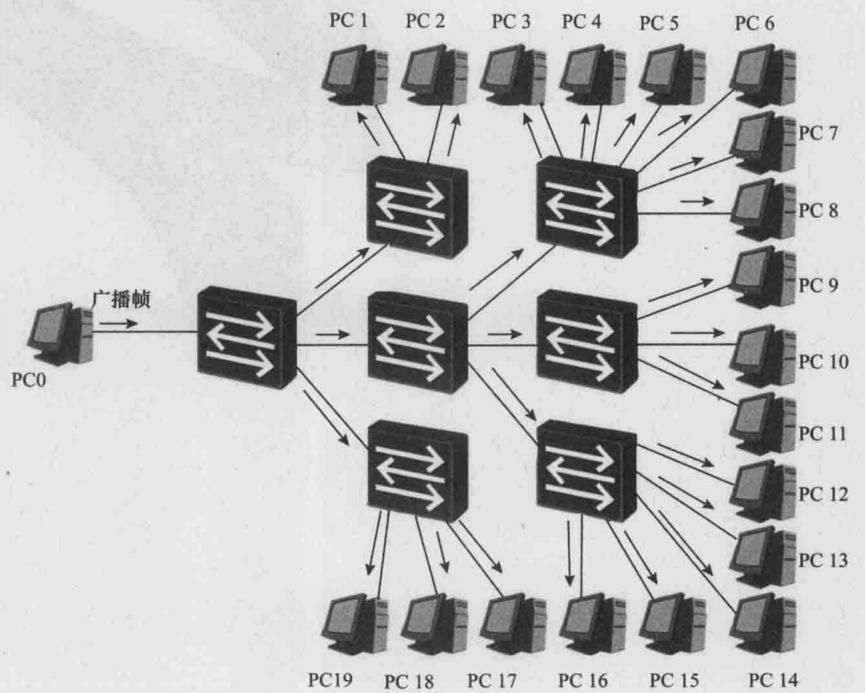

下图所示的网络与上图所示的网络是同一个网络。在下图中，我们假定 PC0 向 PC10 发送了一个单播帧 Y。**假定此时 S1、S3、S7 的 MAC 地址表中存在关于 PC10 的 MAC 地址的表项**，但 S2 和 S5 的 MAC 地址表中不存在关于 PC10 的 MAC 地址的表项，那么，S1 和 S3 将对 Y 帧执行点到点转发操作，S7 将对 Y 帧执行丢弃操作，S2 和 S5 将对 Y 帧执行泛洪操作。在下面的图片中，若目的 MAC 已知，但 **`出端口 = 入端口`**，需要执行过滤/丢弃（discard/filter）。所以 S7 丢弃而不是泛洪，泛洪只在"目的 MAC 未知"时发生，这里 S7 目的 MAC 已知，且在同一个入端口方向，因此直接丢弃。

最后的结果是，虽然目的主机 PC10 接收到了它应该接收到的 Y 帧，但同时 PC3、PC4、PC5、PC6、PC7、PC8 这几个非目的主机也接收到了它们不应该接收到的 Y 帧。这个例子向我们展示了两个我们不希望发生的问题，即一个是网络安全问题，一个是垃圾流量的问题。如果计算机可以轻易地接收到不应该接收的帧，那么就会存在安全隐患。另一个问题是垃圾流量问题，垃圾流量会浪费网络的带宽资源以及计算机的处理资源。

    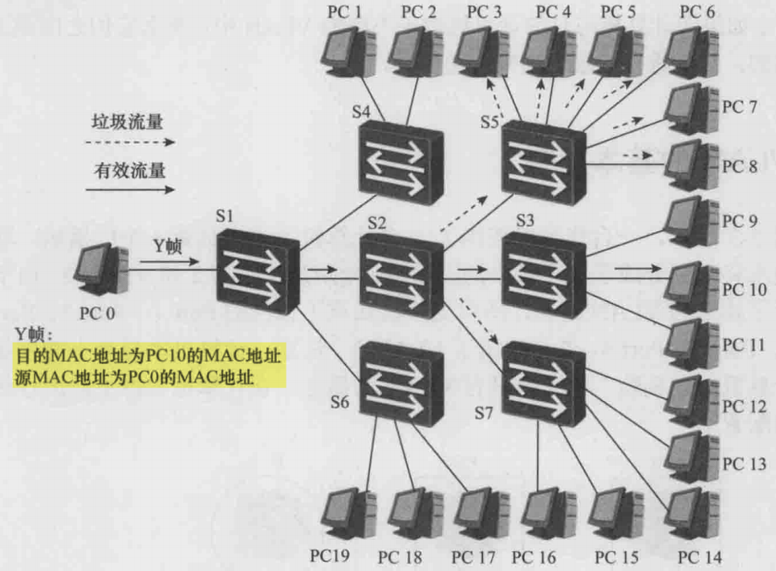

为此，人们引入了 VLAN 技术：**通过在交换机上部署 VLAN 机制，可以将一个规模较大的广播域在逻辑上划分成若干个不同的、规模较小的广播域**，由此便可以有效地提升网络的安全性，同时减少了垃圾流量，节约了网络资源。

特别需要说明的是，在一个广播域内，任何两台终端计算机之间都可以进行二层（数据链路层）通信。**所谓二层通信，是指通信的双方是以直接交换帧的方式来传递信息的**。也就是说，目的计算机所接收到的帧与源计算机发出的帧是一模一样的，帧的目的 MAC 地址、源 MAC 地址、类型值、载荷数据、CRC 等内容都没有发生任何改变。二层通信方式中，信息源发送的帧可能会通过交换机进行二层转发，但一定不会经过路由器（或具有三层转发功能的交换机）进行三层转发。

>在同一个二层广播域（同一 VLAN/同一网段的二层可达范围）里，两台主机可以用以太网帧直接通信，帧经过二层交换机转发时，帧头里的源/目的 MAC 不会被改。但一旦跨出这个广播域，需要经过路由器（或三层交换机）做三层转发时，设备会按下一跳重新封装一个新的二层帧，所以源/目的 MAC 会变化。**`新帧的源 MAC = 路由器出接口的 MAC`**，**`新帧目的 MAC = 下一跳设备的 MAC`**（可能是下一台路由器的 MAC，或者目标主机的 MAC——如果目标主机就在这个出接口直连的网段里）。

源计算机在向目的计算机传递信息时，如果源计算机发出的帧经过了路由器（或具有三层转发功能的交换机）的转发，那么目的计算机接收到的帧一定不再是源计算机发出的那个帧。**至少，目的计算机接收到的帧的目的 MAC 地址和源 MAC 地址一定不同于源计算机发出的帧的目的 MAC 地址和源 MAC 地址**。在这样的情况下，源计算机与目的计算机之间的通信就不再是二层通信，而只能称为三层通信。

一个 VLAN 就是一个广播域，所以在同一个 VLAN 内部，计算机之间的通信就是二层通信。如果源计算机与目的计算机位于不同的 VLAN 中，那么它们之间是无法进行二层通信的，只能进行三层通信来传递信息。

## 二、VLAN 的基本原理

### 1.单交换机 VLAN 转发示例

如下图所示，一台交换机连接了 6 台计算机，本来只是一个广播域，现在通过 VLAN 技术将之划分成了两个较小的广播域，分别是 VLAN2 和 VLAN3。由于在交换机上进行了相关的 VLAN 配置，所以交换机知道了自己的 Port1、Port2、Port6 属于 VLAN2，Port3、Port4、Port5 属于 VLAN3。注意计算机本身是不能感知 VLAN 的，在计算机中完全没有 VLAN 的概念，在计算机上也不会进行任何有关 VLAN 的配置。

    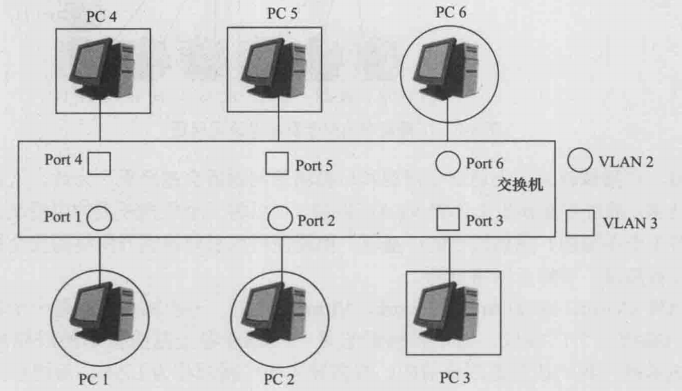

如上图所示，假设 PC1 发送了一个广播帧 X。**因为 X 帧是从属于 VLAN2 的 Port1 进入交换机的，所以交换机会判定 X 帧属于 VLAN2，于是只会向同属于 VLAN2 的 Port2 和 Port6 进行泛洪**。最后，只有 PC2 和 PC6 能够接收到 X 帧，而属于 VLAN3 的 PC3、PC4、PC5 是接收不到 X 帧的。

    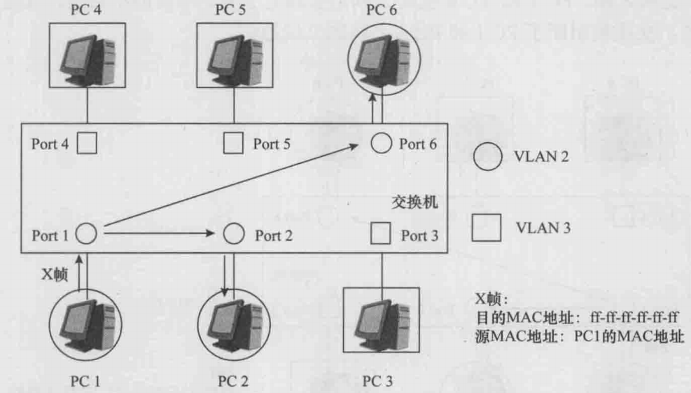

如下图所示，假设 PC1 向 PC6 发送了一个单播帧 Y，另假设交换机的 VLAN2 的 MAC 地址表中存在关于 PC6 的 MAC 地址的表项。因为 Y 帧是从属于 VLAN2 的 Port1 进入交换机的，所以交换机会判定 Y 帧属于 VLAN2。交换机在查询了 VLAN2 的 MAC 地址表后，会将 Y 帧点到点地向同属于 VLAN2 的 Port6 进行转发。最后，PC6 便成功地接收到了 Y 帧，补充说明一下，如果交换机的 VLAN2 的 MAC 地址表中不存在关于 PC6 的 MAC 地址的表项，那么交换机会向 Port2 和 Port6 泛洪 Y 帧。PC2 收到 Y 帧后会将之丢弃；PC6 收到 Y 帧后不会将之丢弃，而是进行后续处理。

    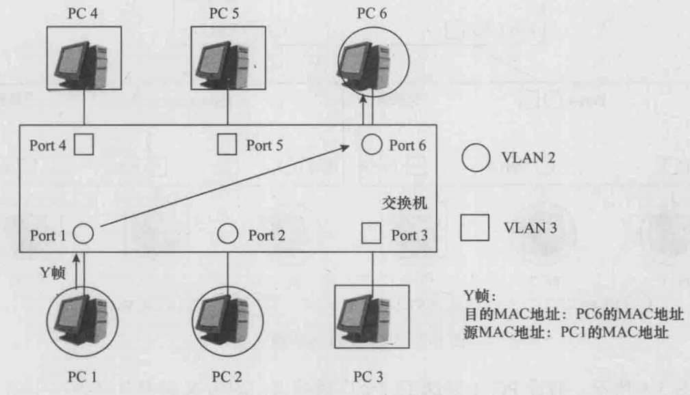

如下图所示，假设 PC1 向 PC3 发送了一个单播帧 Z。因为 Z 帧是从属于 VLAN2 的 Port1 进入交换机的，所以交换机会判定 Z 帧属于 VLAN2。交换机的 VLAN2 的 MAC 地址表中在正常情况下是不存在关于 PC3 的 MAC 地址的表项的，所以交换机会向 Port2 和 Port6 泛洪 Z 帧。PC2 和 PC6 收到 Z 帧后会将之丢弃。最后的结果是，PC3 无法接收到 Z 帧，交换机阻断了 PC1 和 PC3 之间的二层通信。

    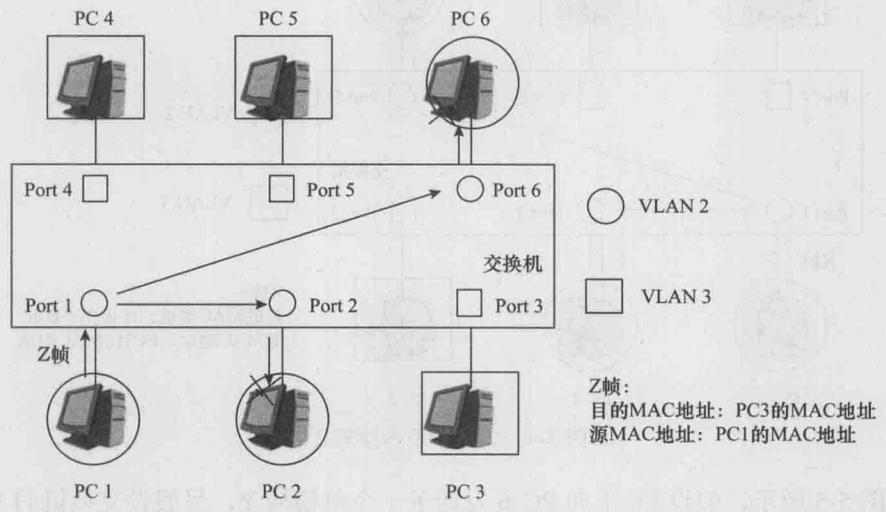

### 2.多交换机 VLAN 转发示例

我们再来看一个比较复杂的例子。如下图所示，3 台交换机和 6 台计算机组成了一个交换网络，该网络现在被划分成了两个 VLAN，分别是 VLAN2 和 VLAN3。由于在每台交换机上都进行了 VLAN 配置，**所以交换机知道自己的哪些端口属于 VLAN2，哪些端口属于 VLAN3，哪些端口既属于 VLAN2，又属于 VLAN3**。

    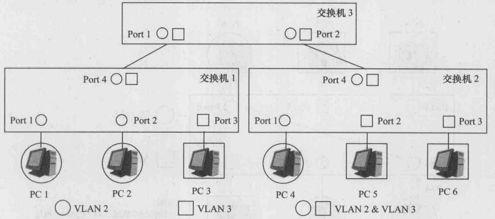

如下图所示，假设 PC1 发送了一个广播帧 X。因为 X 帧是从交换机 1 的、属于 VLAN2 的 Port1 进入交换机 1 的，所以交换机 1 会判定 X 帧属于 VLAN2，于是会向 Port2 和 Port4 进行泛洪。交换机3 从其 Port1 收到 X 帧后，会通过某种方法识别出 X 帧是属于 VLAN2 的，于是会向 Port2 泛洪 X 帧。交换机 2 从其 Port4 收到 X 帧后，也会通过某种方法识别出 X 帧是属于 VLAN2 的，于是会向 Port1 泛洪 X 帧。最后，PC2 和 PC4 都会接收到 X 帧。

    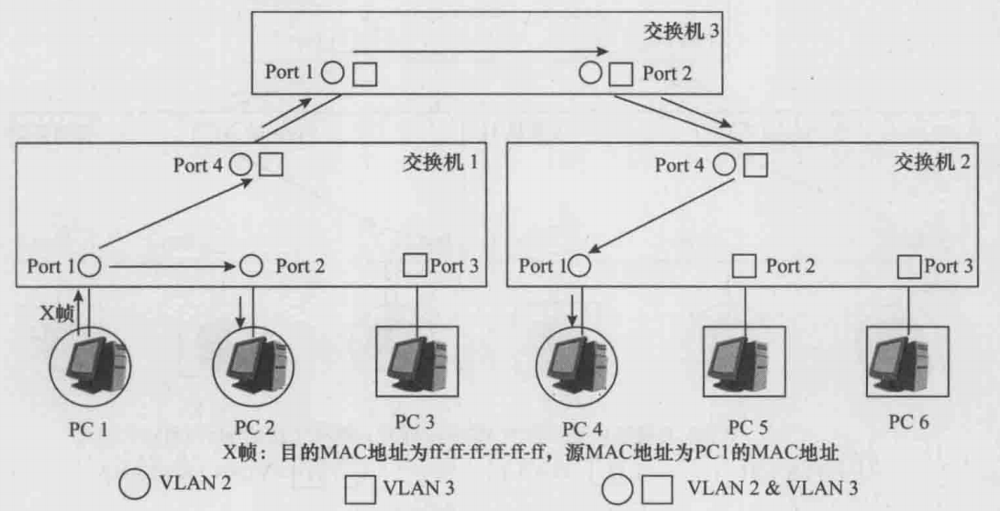

如下图所示，假设 PC1 向 PC4 发送了一个单播帧 Y，**另假设所有交换机的 VLAN2 的 MAC 地址表中都存在关于 PC4 的 MAC 地址的表项**。因为 Y 帧是从交换机 1 的、属于 VLAN2 的 Port1 进入交换机 1 的，所以交换机 1 会判定 Y 帧属于 VLAN2。交换机 1 在查询了自己的 VLAN2 的 MAC 地址表后，会将 Y 帧点到点地向 Port4 进行转发。

交换机 3 从其 Port1 收到 Y 帧后，会通过某种方法识别出 Y 帧是属于 VLAN2 的。交换机 3 在查询了自己的 VLAN2 的 MAC 地址表后，会将 Y 帧点到点地向 Port2 进行转发。交换机 2 从其 Port4 收到 Y 帧后，也会通过某种方法识别出 Y 帧是属于 VLAN2 的。交换机 2 在查询了自己的 VLAN2 的 MAC 地址表后，会将 Y 帧点到点地向 Port1 进行转发。最后，PC4 便会接收到 Y 帧。

    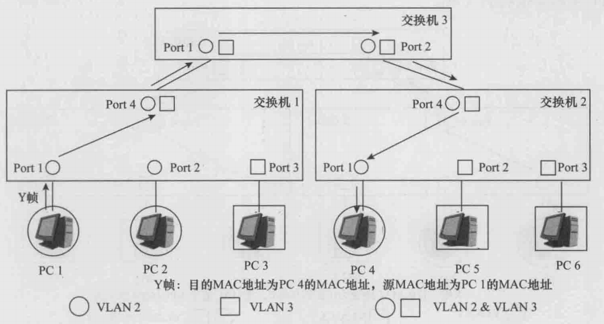

如下图所示，假设 PC1 向 PC6 发送了一个单播帧 Z。**所有交换机的 VLAN2 的 MAC 地址表中在正常情况下是不存在关于 PC6 的 MAC 地址的表项的**。因为 Z 帧是从交换机 1 的、属于 VLAN2 的 Port1 进入交换机 1 的，所以交换机 1 会判定 Z 帧属于 VLAN2。交换机 1 在自己的 VLAN2 的 MAC 地址表中查不到关于 PC6 的 MAC 地址的表项，所以交换机 1 会向 Port2 和 Port4 泛洪 Z 帧。

交换机 3 从其 Port1 收到 Z 帧后，会通过某种方法识别出 Z 帧是属于 VLAN2 的。交换机 3 在自己的 VLAN2 的 MAC 地址表中查不到关于 PC6 的 MAC 地址的表项，所以交换机 3 会向 Port2 泛洪 Z 帧。交换机 2 从其 Port4 收到 Z 帧后，也会通过某种方法识别出 Z 帧是属于 VLAN2 的。交换机 2 在自己的 VLAN2 的 MAC 地址表中查不到关于 PC6 的 MAC 地址的表项，所以交换机 2 会向 Port1 泛洪 Z 帧。

最后，PC2 和 PC4 都会接收到 Z 帧，但都会将之丢弃。PC6 并不能接收到 PC1 发送给自己的 Z 帧，交换机阻断了 PC1 和 PC6 之间的二层通信。

    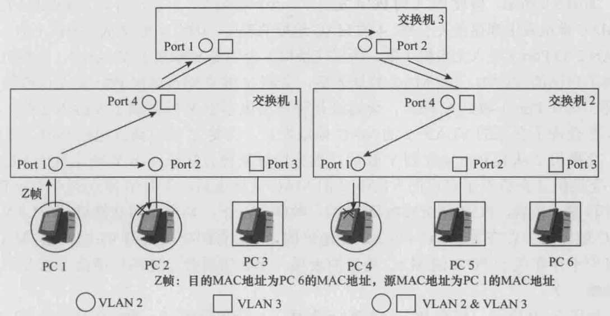

## 三、802.1Q 帧的格式

IEEE802.1D 定义了关于不支持 VLAN 特性的交换机的标准规范，IEEE802.1Q 定义了关于支持 VLAN 特性的交换机的标准规范。IEEE802.1Q 的内容覆盖了 IEEE802.1D 的所有内容，并增加了有关 VLAN 特性的内容。

交换机在识别一个帧是属于哪个 VLAN 的时候，可以根据这个帧是从哪个端口进入自己的来进行判定，也可能需要根据别的信息来进行判定。通常，**交换机识别出某个帧是属于哪个 VLAN 后，会在这个帧的特定位置上添加上一个标签（Tag），这个 Tag 明确地表明了这个帧是属于哪个 VLAN 的**。这样一来，别的交换机收到这个带 Tag 的帧后，就能轻易而举地直接根据 Tag 信息识别出这个帧是属于哪个 VLAN 的。IEEE802.1Q 定义了这种带 Tag 的帧的格式，满足这种格式的帧称为 IEEE802.1Q 帧，如下图所示。

    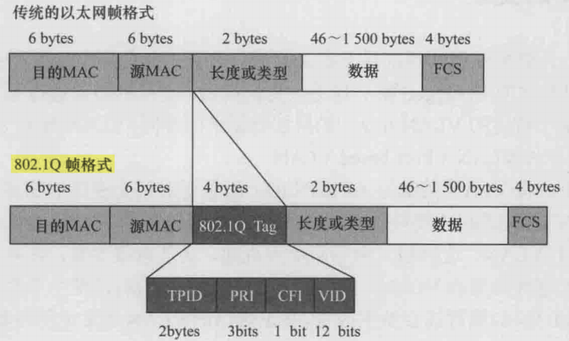

上图中的 VID 就用来表示该帧所属的 VLAN，VLAN ID 的取值范围是 0~4095。其中，**`VID=0/4095`** 为协议保留值，所以 VLAN ID 的有效取值范围是 1~4094。

如果一个帧的源 MAC 地址后面的两个字节的值是 **`0x8100`**，则说明这个帧是一个 Tagged 帧；如果一个帧的源 MAC 地址后面的两个字节的值不是 **`0x8100`**，则说明这个帧是一个传统的 Untagged 帧。另外，需要再次指出的是，计算机中是没有任何关于 VLAN 的概念的。**计算机不会产生并发送 Tagged 帧。如果计算机接收到了一个 Tagged 帧，由于它识别不出 `0x8100` 的含义，于是会直接将这个 Tagged 帧丢弃**。

## 四、VLAN 的分类

刚才说到，计算机发送的帧都是不带 Tag 的。对于一个支持 VLAN 特性的交换网络来说，当计算机发送的 Untagged 帧一旦进入交换机后，交换机必须通过某种划分原则把这个帧划分到某个特定的 VLAN 中去。根据划分原则的不同，VLAN 便有了不同的类型。

### 1.基于端口的 VLAN

将 VLAN 的编号（VLAN ID）配置映射到交换机的物理端口上，**从某一物理端口进入交换机的、由终端计算机发送的 Untagged 帧都被划分到该端口的 VLAN ID 所表明的那个 VLAN**。注意，对于这种类型的 VLAN，当计算机接入交换机的端口发生了变化时，该计算机发送的帧的 VLAN 归属可能会发生改变。基于端口的 VLAN 通常也称为物理层 VLAN，或一层 VLAN。

### 2.基于 MAC 地址的 VLAN

交换机内部建立并维护了一个 MAC 地址与 VLAN ID 的对应表，当交换机接收到计算机发送的 Untagged 帧时，**交换机将分析帧中的源 MAC 地址，然后查询 MAC 地址与 VLAN ID 的对应表，并根据对应关系把这个帧划分到相应的 VLAN 中**。这种划分原则实现起来稍显复杂，但灵活性得到了提高。例如，当计算机接入交换机的端口发生了变化时，该计算机发送的帧的 VLAN 归属并不会发生改变（因为计算机的 MAC 地址不会发生变化）。但需要指出的是，这种类型的 VLAN 的安全性不是很高，因为一些恶意的计算机是很容易伪造自己的 MAC 地址的。基于 MAC 地址的 VLAN 通常也称为二层 VLAN。

### 3.基于协议的 VLAN

交换机根据计算机发送的 Untagged 帧中的帧类型字段的值来决定帧的 VLAN 归属。例如，可以将类型值为 **`0x0800`** 的帧划分到一个 VLAN，将类型值为 **`0x86dd`** 的帧划分到另一个 VLAN。这实际上是将载荷数据为 IPv4 Packet 的帧和载荷数据为 IPv6 Packet 的帧分别划分到了不同的 VLAN。基于协议的 VLAN 通常也称为三层 VLAN。

就目前来看，基于端口的 VLAN 在实际的网络中应用最为广泛。如无特别说明，后面所提到的 VLAN，均是指基于端口的 VLAN。

## 五、链路类型和端口类型

一个 VLAN 帧可能带有 Tag（称为 Tagged VLAN 帧，或简称为 Tagged 帧），也可能不带 Tag（称为 Untagged VLAN 帧，或简称为 Untagged 帧）。在谈及 VLAN 技术时，如果一个帧被交换机划分到 VLAN i，我们就把这个帧简称为一个 VLAN i 的帧。对于带有 Tag 的 VLAN i 帧，i 其实就是这个帧的 Tag 中的 VID 字段的取值。

**注意，对于 Tagged VLAN 帧，交换机显然能够从其 Tag 中的 VID 值判定出它属于哪个 VLAN；对于 Untagged VLAN 帧（例如终端计算机发出的帧），交换机需要根据某种原则（比如根据这个帧是从哪个端口进入交换机的）来判定或划分它属于哪个 VLAN**。

在一个支持 VLAN 特性的交换网络中，我们把交换机与终端计算机直接相连的链路称为 Access 链路（Access Link），把 Access 链路上交换机一侧的端口称为 Access 端口（Access Port）。同时，我们把交换机之间直接相连的链路称为 Trunk 链路（Trunk Link），把 Trunk 链路上两侧的端口称为 Trunk 端口（Trunk Port）。

**在一条 Access 链路上运动的帧只能是 Untagged 帧，并且这些帧只能属于某个特定的 VLAN；在一条 Trunk 链路上运动的帧只能是（或者说应该是）Tagged 帧，并且这些帧可以属于不同的 VLAN**。一个 Access 端口只能属于某个特定的 VLAN，并且只能让属于这个特定 VLAN 的帧通过；一个 Trunk 端口可以同时属于多个 VLAN，并且可以让属于不同 VLAN 的帧通过，如下图所示。

    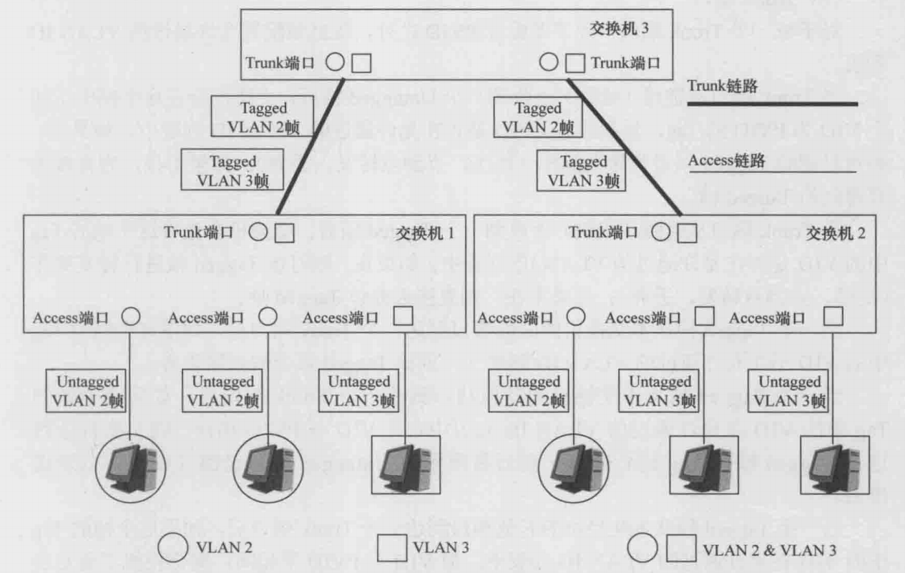

每一个交换机的端口（无论是 Access 端口还是 Trunk 端口）都应该配置一个 PVID（Port VLAN ID），**到达这个端口的 Untagged 帧将一律被交换机划分到 PVID 所指代的 VLAN**。例如，如果一个端口的 PVID 被配置为 5，则所有到达这个端口的 Untagged 帧都将被认定为是属于 VLAN5 的帧。默认情况下，PVID 的值为 1。

概括地讲，链路上运动的帧，可能是 Tagged 帧，也可能是 Untagged 帧。**但一台交换机内部不同端口之间运动的帧则一定是 Tagged 帧**。接下来，我们具体地描述一下 Access 端口和 Trunk 端口对于帧的处理和转发规则。

### 1.Access 端口的处理和转发规则

当 Access 端口从链路上收到一个 Untagged 帧后，交换机会在这个帧中添加上 VID 为 PVID 的 Tag，然后对得到的 Tagged 帧进行转发操作（泛洪、点到点转发、丢弃）。

当 Access 端口从链路上收到一个 Tagged 帧后，交换机会检查这个帧的 Tag 中的 VID 是否与 PVID 相同。如果相同，则对这个 Tagged 帧进行转发操作（泛洪、点到点转发、丢弃）；如果不同，则直接丢弃这个 Tagged 帧。

当一个 Tagged 帧从本交换机的其他端口到达一个 Access 端口后，交换机会检查这个帧的 Tag 中的 VID 是否与 PVID 相同。如果相同，则将这个 Tagged 帧的 Tag 进行剥离，然后将得到的 Untagged 帧从链路上发送出去；如果不同，则直接丢弃这个 Tagged 帧。

### 2.Trunk 端口的处理和转发规则

对于每一个 Trunk 端口，除了要配置 PVID 之外，还必须配置允许通过的 VLAN ID 列表。

当 Trunk 端口从链路（线路）上收到一个 Untagged 帧后，交换机会在这个帧中添加上 VID 为 PVID 的 Tag，然后查看 PVID 是否在允许通过的 VLAN ID 列表中。如果在，则对得到的 Tagged 帧进行转发操作（泛洪、点到点转发、丢弃）；如果不在，则直接丢弃得到的 Tagged 帧。

当 Trunk 端口从链路（线路）上收到一个 Tagged 帧后，交换机会查看这个帧的 Tag 中的 VID 是否在允许通过的 VLAN ID 列表中。如果在，则对该 Tagged 帧进行转发操作（泛洪、点到点转发、丢弃）；如果不在，则直接丢弃该 Tagged 帧。

当一个 Tagged 帧从本交换机的其他端口到达一个 Trunk 端口后，如果这个帧的 Tag 中的 VID 不在允许通过的 VLAN ID 列表中，则该 Tagged 帧会被直接丢弃。

当一个 Tagged 帧从本交换机的其他端口到达一个 Trunk 端口后，如果这个帧的 Tag 中的 VID 在允许通过的 VLAN ID 列表中，**且 VID 与 PVID 相同，则交换机会对这个 Tagged 帧的 Tag 进行剥离**，然后将得到的 Untagged 帧从链路（线路）上发送出去。

当一个 Tagged 帧从本交换机的其他端口到达一个 Trunk 端口后，如果这个帧的 Tag 中的 VID 在允许通过的 VLAN ID 列表中，**但 VID 与 PVID 不相同，则交换机不会对这个 Tagged 帧的 Tag 进行剥离**，而是直接将它从链路（线路）上发送出去。

给 trunk 端口配置允许通过的 VLAN ID 列表（allowed VLAN list），核心目的就是控制这个 trunk 口到底承载哪些 VLAN 的流量，避免所有 VLAN 默认都能过带来的安全和广播泛滥问题，并且让两端对 trunk 的 VLAN 规划一致，允许列表就类似于白名单，只放行明确需要的 VLAN。并且 trunk 两端必须对上，两边都允许同样的 VLAN 才能互通。**PVID 解决的是 trunk 口收到/发送 untagged 帧时，把它归到哪个 VLAN（有些厂商称 native VLAN）**。

下面继续解释一下从交换机转发出去（engress）到某个 Trunk 口时，到底要不要在链路上带 802.1Q Tag。关键点是 trunk 口允许同时承载多个 VLAN，但链路上总得有一种方式让对端知道这帧属于哪个 VLAN，要么靠 Tag，要么靠未打 Tag 的帧默认属于哪个 VLAN（也就是 **`PVID/Native VLAN`**）。

**如果 VID 在 allowed 内，且 `VID=PVID`，这表示这帧属于该 Trunk 口的 `Native VLAN/PVID VLAN`**。既然这个 VLAN 被配置成在这条 trunk 上用 untagged 表示，那交换机在发出去之前就会剥离 Tag，以 Untagged 的形式在链路上发送。对端收到 untagged 帧时，会按自己的 **`PVID/Native VLAN`** 把它归类到对应 VLAN。

**如果 VID 在 allowed 内，但 `VID≠PVID`，这表示这帧属于 trunk 上的 非 native VLAN**。非 native VLAN 在链路上如果不带 tag，对端就无法区分它属于哪个 VLAN（因为一条链路可能承载多个 VLAN）。所以交换机必须保留 tag，以 Tagged 的形式发送。

举例来说，在交换机 S1 与 S2 之间配置为 Trunk 链路，允许通过的 VLAN 为 VLAN10 和 VLAN20，并将该 Trunk 端口的 PVID 设置为 VLAN10。这样一来，属于 VLAN10 的报文在该链路上传输时可以不携带 VLAN Tag（即以 untagged 形式发送），而属于 VLAN20 的报文在该链路上传输时必须携带 VLAN Tag，且 **`VID=20`**（即以 tagged 形式发送）。因此，对端设备在接收该链路上的报文时，若收到的是 untagged 报文，会因为 PVID=VLAN10 而将其归类到 VLAN10；若收到的是带 Tag 且 **`VID=20`** 的报文，则会直接将其归类到 VLAN20。

>Access 口的定义：只能配置 1 个 VLAN，因此"单 VLAN 用 access 最直接/最常见（尤其接终端）"这句是符合主流定义的。An access port can have only one VLAN configured on the interface; it can carry traffic for only one VLAN.
>Trunk 口的定义：可以配置 2 个或更多 VLAN，因此如果同一根以太网链路要同时承载多个 VLAN，通常就要用 trunk（802.1Q tag） 来承载。A trunk port can have two or more VLANs configured on the interface; it can carry traffic for several VLANs simultaneously.Trunk 并不要求一定跑多个 VLAN。Cisco 明确说明 trunk 上默认允许所有 VLAN，但可以通过 allowed VLAN 列表把不需要的 VLAN 移除；所以 trunk 完全可以只允许 VLAN 10，最终效果就是这条 trunk 链路上只跑 1 个 VLAN。

### 3.Hybrid 端口的处理和转发规则

Hybrid 端口除了需要配置 PVID 外，还需要配置两个 VLAN ID 列表，一个是 Untagged VLAN ID 列表，另一个是 Tagged VLAN ID 列表。**这两个 VLAN ID 列表中的所有 VLAN 的帧都是允许通过这个 Hybrid 端口的**。

当 Hybrid 端口从链路上收到一个 Untagged 帧后，交换机会在这个帧中添加上 VID 为 PVID 的 Tag，然后查看 PVID 是否在 Untagged VLAN ID 列表或 Tagged VLAN ID 列表中。如果在，则对得到的 Tagged 帧进行转发操作（泛洪、点到点转发、丢弃）；如果不在，则直接丢弃得到的 Tagged 帧。

当 Hybrid 端口从链路上收到一个 Tagged 帧后，交换机会查看这个帧的 Tag 中的 VID 是否在 Untagged VLAN ID 列表或 Tagged VLAN ID 列表中。如果在，则对该 Tagged 帧进行转发操作（泛洪、点到点转发、丢弃）；如果不在，则直接丢弃该 Tagged 帧。

当一个 Tagged 帧从本交换机的其他端口到达一个 Hybrid 端口后，如果这个帧的 Tag 中的 VID 既不在 Untagged VLAN ID 列表中，也不在 Tagged VLAN ID 列表中，则该 Tagged 帧会被直接丢弃。

当一个 Tagged 帧从本交换机的其他端口到达一个 Hybrid 端口后，**如果这个帧的 Tag 中的 VID 在 Untagged VLAN ID 列表中，则交换机会对这个 Tagged 帧的 Tag 进行剥离**，然后将得到的 Untagged 帧从链路（线路）上发送出去。

当一个 Tagged 帧从本交换机的其他端口到达一个 Hybrid 端口后，**如果这个帧的 Tag 中的 VID 在 Tagged VLAN ID 列表中，则交换机不会对这个 Tagged 帧的 Tag 进行剥离**，而是直接将它从链路（线路）上发送出去。

当 Hybrid 端口配置中的 Untagged VLAN ID 列表中有且只有 PVID 时，Hybrid 端口就等效于一个 Trunk 端口；当 Hybrid 端口配置中的 Untagged VLAN ID 列表中有且只有 PVID，并且 Tagged VLAN ID 列表为空时，Hybrid 端口就等效于一个 Access 端口。

## 六、VLAN 转发示例 

    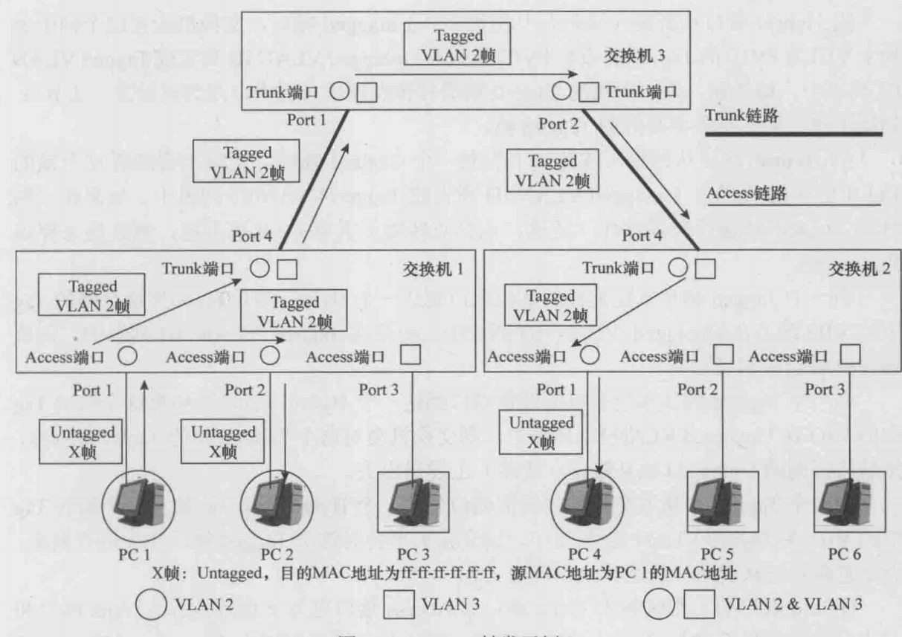

如上图所示，**假定交换机 1 的 Port1 和 Port2 以及交换机 2 的 Port1 的 PVID 是 VLAN2，假定交换机 1 的 Port3 以及交换机 2 的 Port2 和 Port3 的 PVID 是 VLAN3**，假定所有 Trunk 端口的 PVID 是 VLAN1，假定所有 Trunk 端口都允许 VLAN2 和 VLAN3 的帧通过。

假设 PC1 发送了一个 Untagged 广播帧 X，那么 X 帧从交换机 1 的 Port1 进入交换机 1 后，交换机 1 会给 X 帧打上 VID 为 VLAN2 的 Tag，然后向 Port2 和 Port4 进行泛洪；交换机 1 的 Port2 收到来自 Port1 的 Tagged X 帧后，会剥去 Tag，然后将 Untagged X 帧发送给 PC2；交换机 1 的 Port4 收到来自 Port1 的 Tagged X 帧后，会直接发送给交换机 3 的 Port1（因为 Port4 的 PVID 和 X 帧的 VID 不同，后面同理）。

交换机 3 会把从 Port1 进入的 Tagged X 帧直接向 Port2 泛洪；交换机 3 的 Port2 会直接将来自 Port1 的 Tagged X 帧发送给交换机 2 的 Port4。交换机 2 会对进入 Port4 的 Tagged X 帧直接向 Port1 泛洪；**交换机 2 的 Port1 收到来自 Port4 的 Tagged X 帧后，会剥去 Tag，然后将 Untagged X 帧发送给 PC4**。最后 PC2 和 PC4 都会接收到不带 Tag 的 X 帧。

    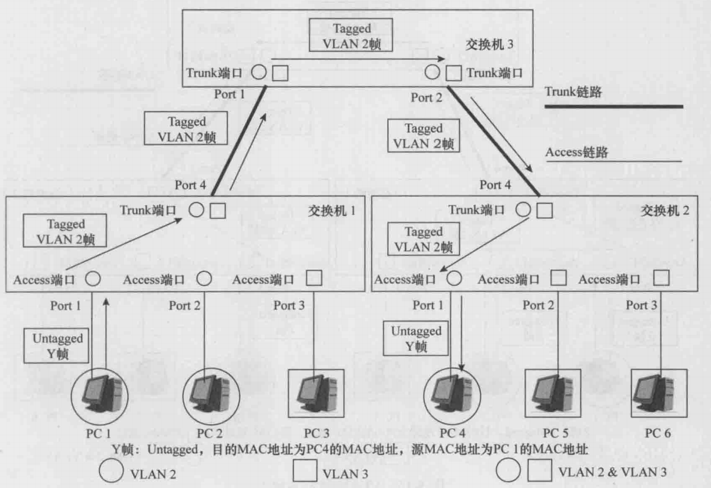

如上图所示，**假定交换机 1 的 Port1 和 Port2 以及交换机 2 的 Port1 的 PVID 是 VLAN2，假定交换机 1 的 Port3 以及交换机 2 的 Port2 和 Port3 的 PVID 是 VLAN3**，假定所有 Trunk 端口的 PVID 是 VLAN1，假定所有 Trunk 端口都允许 VLAN2 和 VLAN3 的帧通过，假定所有交换机的 VLAN2 的 MAC 地址表中都存在关于 PC4 的 MAC 地址的表项。

假设 PC1 向 PC4 发送了一个 Untagged 单播帧 Y，那么 Y 帧从交换机 1 的 Port1 进入交换机 1 后，交换机 1 会给 Y 帧打上 VID 为 VLAN2 的 Tag；交换机 1 在查询了自己的 VLAN2 的 MAC 地址表后，会将 Tagged Y 帧点到点地向 Port4 进行转发；交换机 1 的 Port4 收到来自 Port1 的 Tagged Y 帧后，会直接发送给交换机 3 的 Port1。

交换机 3 从其 Port1 收到 Tagged Y 帧后，查询自己的 VLAN2 的 MAC 地址表，然后将 Tagged Y 帧点到点地向 Port2 进行转发；交换机 3 的 Port2 会直接将来自 Port1 的 Tagged Y 帧发送给交换机 2 的 Port4。交换机 2 从其 Port4 收到 Tagged Y 帧后，查询自己的 VLAN2 的 MAC 地址表，然后将 Tagged Y 帧点到点地向 Port1 进行转发；**交换机 2 的 Port1 收到来自 Port4 的 Tagged Y 帧后，会剥去 Tag，然后将 Untagged Y 帧发送给 PC4**。最后，PC4 便会接收到不带 Tag 的 Y 帧。

    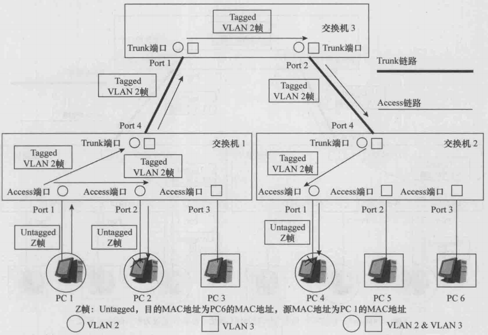

如上图所示，**假定交换机 1 的 Port1 和 Port2 以及交换机 2 的 Port1 的 PVID 是 VLAN2，假定交换机 1 的 Port3 以及交换机 2 的 Port2 和 Port3 的 PVID 是 VLAN3**，假定所有 Trunk 端口的 PVID 是 VLAN1，假定所有 Trunk 端口都允许 VLAN2 和 VLAN3 的帧通过。注意，所有交换机的 VLAN2 的 MAC 地址表中在正常情况下是不存在关于 PC6 的 MAC 地址的表项的。

假设 PC1 向 PC6 发送了一个 Untagged 单播帧 Z。Z 帧从交换机 1 的 Port1 进入交换机 1 后，交换机 1 会给 Z 帧打上 VID 为 VLAN2 的 Tag。交换机 1 在自己的 VLAN2 的 MAC 地址表中查不到关于 PC6 的 MAC 地址的表项，**所以交换机 1 会向 Port2 和 Port4 泛洪 Tagged Z 帧**。交换机 1 的 Port2 收到来自 Port1 的 Tagged Z 帧后，会剥去 Tag，然后将 Untagged Z 帧发送给 PC2。交换机 1 的 Port4 收到来自 Port1 的 Tagged Z 帧后，会直接发送给交换机 3 的 Port1。

交换机 3 从其 Port1 收到 Tagged Z 帧后，在自己的 VLAN2 的 MAC 地址表中查不到关于 PC6 的 MAC 地址的表项，所以交换机 3 会向 Port2 泛洪 Tagged Z 帧。交换机 3 的 Port2 会直接将来自 Port1 的 Tagged Z 帧发送给交换机 2 的 Port4。交换机 2 从其 Port4 收到 Tagged Z 帧后，在自己的 VLAN2 的 MAC 地址表中查不到关于 PC6 的 MAC 地址的表项，所以交换机 2 会向 Port1 泛洪 Tagged Z 帧。

交换机 2 的 Port1 收到来自 Port4 的 Tagged Z 帧后，会剥去 Tag，然后将 Untagged Z 帧发送给 PC4。最后，PC2 和 PC4 都会接收到不带 Tag 的 Z 帧，但都会将之丢弃。**PC6 并不能接收到 PC1 发送给自己的 Z 帧，交换机阻断了 PC1 和 PC6 之间的二层通信**。

## 七、VLAN 间的三层通信

### 1.通过多臂路由器实现 VLAN 间的三层通信

如下图所示，3 台交换机和 4 台 PC 组成了一个交换网络，在此网络上划分了两个基于端口的 VLAN，分别为 VLAN10 和 VLAN20，其中 PC1 和 PC2 属于 VLAN10，PC3 和 PC4 属于 VLAN20。

    

在上图中，PC1 与 PC4 之间是无法进行任何通信的，这是因为 PC1 和 PC4 属于不同的 VLAN，所以它们之间无法进行二层通信；同时，由于它们之间目前尚未存在一个“三层通道”，所以它们之间也无法进行三层通信。

那么，如何才能在 PC1 和 PC4 之间实现三层通信呢？方法之一便是引入一台路由器。**路由器的作用实质上就是在不同的二层网络（二层广播域）之间建立起三层通道。不同的 VLAN 其实就是不同的二层网络（二层广播域），所以路由器当然也可以在不同的 VLAN 之间建立起三层通道**。

我们看到，路由器 R 的 GE1/0/0 接口与交换机 S1 的属于 VLAN10 的 D1 端口相连，路由器 R 的 GE2/0/0 接口与交换机 S1 的属于 VLAN20 的 D2 端口相连。需要特别提醒的是，**与 PC 的接口一样，路由器 R 的 GE1/0/0 接口和 GE2/0/0 接口都是不能发送和接收 Tagged VLAN 帧的**。另外，从下图中我们也看到，路由器 R 分别从 GE1/0/0 接口和 GE2/0/0 接口各自引出了一条物理链路，每条物理链路可以被形象地称为路由器的一条"手臂"，所以这里的路由器 R 也常常被形象地称为"双臂路由器"，或泛泛地称为多臂路由器。

    

接下来，我们通过一个例子来说明 PC1 和 PC4 是如何实现三层通信的，也就是说，PC1 是如何将一个名为 P 的 IP 报文成功地发送给 PC4 的。上图中，交换机的 Access 端口有：S2 的 D1 端口和 D2 端口，S3 的 D1 端口和 D2 端口，S1 的 D1 端口和 D2 端口。交换机的 Trunk 端口有：S2 的 D3 端口，S3 的 D3 端口，S1 的 D3 端口和 D4 端口。

首先，P 是在 PC1 的网络层形成的，P 的目的 IP 地址为 **`192.168.200.40`**，源 IP 地址为 **`192.168.100.10`**。然后，根据 P 的目的 IP 地址，PC1 会进行 IP 路由表的查询工作。PC1 的 IP 路由表中有两条路由，其中一条为缺省路由。显然，P 的目的 IP 地址 **`192.168.200.40`** 只能匹配上那条缺省路由，该路由的出接口为 PC1 的 Ethernet0/0/1 接口，下一跳 IP 地址为路由器 R 的 GE1/0/0 接口的 IP 地址 **`192.168.100.1`**（**路由器 R 的 GE1/0/0 接口也因此被称为是 **`192.168.100.0/24`** 或 VLAN10 的缺省网关**）。

于是，根据这条缺省路由的指示，P 会被下发至 PC1 的 Ethernet0/0/1 接口，并被封装成一个帧。假设这个帧取名为 X，那么 X 帧的载荷数据就是 P，**X 帧的源 MAC 地址为 PC1 的 Ethernet0/0/1 接口的 MAC 地址，X 帧的目的 MAC 地址为路由器 R 的 GE1/0/0 接口的 MAC 地址**。注意，此时的 X 帧是一个不带 VLAN Tag 的帧。

接下来，PC1 会从 Ethernet0/0/1 接口将 Untagged X 帧发送出去。X 帧从 S2 的 D1 端口进入 S2 后，会被添加上 VLAN10 的 Tag，并且这个 Tagged X 帧会被 S2 转发至 S1。S1 会将 Tagged X 帧的 Tag 去掉，然后将它从自己的 D1 端口转发出去。

路由器 R 的 GE1/0/0 接口在收到 S1 转发过来的 Untagged X 帧后，会将 Untagged X 帧的目的 MAC 地址与自己的 MAC 地址进行比较。由于这两个 MAC 地址是相同的，所以 R 的 GE1/0/0 接口会根据这个帧的类型字段值 0x0800 将这个帧的数据载荷（也就是 P）上送给 R 的三层 IP 模块。R 的 IP 模块接收到 P 后，会根据 P 的目的 IP 地址 **`192.168.200.40`** 查询自己的 IP 路由表。**显然，`192.168.200.40` 这个 IP 地址只与 IP 路由表中的第二条路由匹配，该路由的出接口为 GE2/0/0 接口，下一跳 IP 地址是 GE2/0/0 接口的 IP 地址**（这说明 P 要去往的目的网络是与 GE2/0/0 接口直接相连的）。

于是，根据这条路由的指示，P 会被下发至 R 的 GE2/0/0 接口，并被封装成一个帧。假设这个帧取名为 Y，那么 Y 帧的载荷数据就是 P，Y 帧的类型字段的值为 0x0800，**Y 帧的源 MAC 地址为 GE2/0/0 接口的 MAC 地址，Y 帧的目的 MAC 地址为 P 的目的 IP 地址 `192.168.200.40` 所对应的 MAC 地址**。注意，此时的 Y 帧是一个不带 VLAN Tag 的帧。

R 通过其 GE2/0/0 接口将 Untagged Y 帧发送出去。Untagged Y 帧从 S1 的 D2 端口进入 S1 后，会被添加上 VLAN20 的 Tag，并且这个 Tagged Y 帧会被 S1 转发至 S3。S3 会将 Tagged Y 帧的 Tag 去掉，然后将它从自己的 D2 端口转发出去。

PC4 的 Ethernet0/0/1 接口在收到 S3 转发过来的 Untagged Y 帧后，会将 Untagged Y 帧的目的 MAC 地址与自己的 MAC 地址进行比较。由于这两个 MAC 地址是相同的，所以 PC4 的 Ethernet0/0/1 接口会根据这个帧的类型字段值 0x0800 将这个帧的数据载荷（也就是 P）上送给 PC4 的位于三层的 IP 模块。

至此，源于 PC1 的三层 IP 模块的 IP 报文 P 便成功地到达了 PC4 的三层 IP 模块，属于 VLAN10 的 PC1 与属于 VLAN20 的 PC4 之间成功地进行了一次三层通信。

### 2.通过单臂路由器实现 VLAN 间的三层通信

VLAN 间的三层通信可以通过多臂路由器来实现，但这种实现方法面临的一个主要问题是：**每一个 VLAN 都需要占用路由器上的一个物理接口**（也就是说，每一个 VLAN 都需要路由器从一个物理接口伸出一只手臂来）。如果 VLAN 数量众多，就需要占用大量的路由器接口。事实上，路由器的物理接口资源是非常宝贵而稀缺的，一台路由器上的物理接口数量通常都是非常有限的，无法支持数量较多的 VLAN。实际的网络部署中，几乎都不会通过多臂路由器来实现 VLAN 间的三层通信。

为了节省路由器的物理接口资源，我们还可以通过单臂路由器的方法来实现 VLAN 间的三层通信。采用这种方法时，仍然必须对路由器的物理接口进行子接口（Sub-Interface）划分。**一个路由器的物理接口可以划分为多个子接口，不同的子接口可以对应于不同的 VLAN，这些子接口的 MAC 地址均为衍生出它们的那个物理接口的 MAC 地址，但是它们的 IP 地址各不相同**。一个子接口的 IP 地址应当属于该子接口所对应的那个 VLAN 的缺省网关地址。子接口是一个逻辑上的概念，所以子接口也常常被称为虚接口。

如下图所示，路由器 R 的物理接口 **`GE1/0/0`** 被划分成了两个子接口，分别为 **`GE1/0/0.1`** 和 **`GE1/0/0.2`**。**`GE1/0/0.1`** 对应于 VLAN10，**`GE1/0/0.2`** 对应于 VLAN20。**`GE1/0/0.1`** 的 IP 地址为 **`192.168.100.1/24`**，也就是 VLAN10 的缺省网关地址；**`GE1/0/0.2`** 的 IP 地址为 **`192.168.200.1/24`**，也就是 VLAN20 的缺省网关地址。子接口 **`GE1/0/0.1`** 的 MAC 地址和 **`GE1/0/0.2`** 的 MAC 地址是一样的，都是物理接口 **`GE1/0/0`** 的 MAC 地址。

    

在上图中，交换机的 Access 端口有：S2 的 D1 端口和 D2 端口，S3 的 D1 端口和 D2 端口。**交换机的 Trunk 端口有：S2 的 D3 端口，S3 的 D3 端口，S1 的 D3 端口和 D1、D2 端口**。属于 VLAN10 的帧和属于 VLAN20 的帧都需要依次传递到 S1 的 D1 端口，因此 S1 与 R 之间的链路是一条 VLAN Trunk 链路（此链路上需要同时传递 VLAN10、VLAN20 的数据帧）。**该链路传送的帧必须是带有 VLAN Tag 的，这也意味着子接口 **`GE1/0/0.1`** 或 **`GE1/0/0.2`** 向外发送的帧也必须是带有 VLAN Tag 的**。

接下来，我们还是通过一个例子来说明上图中的 PC1 和 PC4 之间是如何实现三层通信的，也就是说，PC1 是如何将一个名为 P 的 IP 报文成功地发送给 PC4 的。

首先，P 是在 PC1 的网络层形成的，P 的目的 IP 地址为 **`192.168.200.40`**，源 IP 地址为 **`192.168.100.10`**。然后，根据 P 的目的 IP 地址，PC1 会进行 IP 路由表的查询工作。显然，P 的目的 IP 地址 **`192.168.200.40`** 只能匹配上那条缺省路由，该路由的出接口为 PC1 的 Ethernet0/0/1 接口，下一跳 IP 地址为路由器 R 的 **`GE1/0/0.1`** 子接口的 IP 地址 **`192.168.100.1`**（**路由器 R 的 **`GE1/0/0.1`** 子接口也因此被称为是 **`192.168.100.0/24`** 或 VLAN10 的缺省网关**）。

于是，根据这条缺省路由的指示，P 会被下发至 PC1 的 Ethernet0/0/1 接口，并被封装成一个帧。假设这个帧取名为 X，那么 X 帧的载荷数据就是 P，**X 帧的源 MAC 地址为 PC1 的 Ethernet0/0/1 接口的 MAC 地址，X 帧的目的 MAC 地址为路由器 R 的 `GE1/0/0.1` 子接口的 MAC 地址**。注意，此时的 X 帧是一个不带 VLAN Tag 的帧。

接下来，PC1 会从 Ethernet0/0/1 接口将 Untagged X 帧发送出去。Untagged X 帧从 S2 的 D1 端口进入 S2 后，会被添加上 VLAN10 的 Tag，并且这个 Tagged X 帧会被 S2 和 S1 转发至路由器的物理接口 **`GE1/0/0`**。

**路由器 R 的物理接口 **`GE1/0/0`** 在收到 S1 转发过来的 Tagged X 帧后，发现这个帧是属于 VLAN10 的，于是这个帧会交给子接口 **`GE1/0/0.1`** 来处理**。子接口 **`GE1/0/0.1`** 发现，Tagged X 帧的目的 MAC 地址正是自己的 MAC 地址，并且这个帧的类型字段的值是 0x0800，于是子接口 **`GE1/0/0.1`** 会将这个帧的载荷数据（也就是 P）上送给路由器 R 的三层 IP 模块。

路由器 R 的 IP 模块接收到 P 后，会根据 P 的目的 IP 地址 **`192.168.200.40`** 查询自己的 IP 路由表。显然，**`192.168.200.40`** 这个 IP 地址只与 IP 路由表中的第一条路由相匹配，该路由的出接口为子接口 **`GE1/0/0.2`**，下一跳 IP 地址是子接口 **`GE1/0/0.2`** 的 IP 地址（这说明 P 要去往的目的网络是与子接口 **`GE1/0/0.2`** 直接相连的）。

于是，根据这条路由的指示，P 会被下发至 R 的 **`GE1/0/0.2`** 子接口，并被封装成一个帧。假设这个帧取名为 Y，那么 Y 帧的载荷数据就是 P，Y 帧的类型字段的值为 0x0800，**Y 帧的源 MAC 地址为子接口 **`GE1/0/0.2`** 的 MAC 地址，Y 帧的目的 MAC 地址为 P 的目的 IP 地址 `192.168.200.40` 所对应的 MAC 地址**。注意，Y 帧还必须带上 VLAN20 的 Tag。

>**`GE1/0/0.2`** 这个子接口在配置上就绑定了 VLAN 20，所以当路由器要从 **`GE1/0/0.2`** 发出帧 Y 时，会按该子接口的封装规则把以太帧封装成 802.1Q tagged，并且 VID=20。

路由器 R 将 Tagged Y 帧从其子接口 **`GE1/0/0.2`** 发送出去之后（从物理直观上讲，就是从 GE1/0/0 这个物理接口发出去），该 Tagged Y 帧会到达交换机 S3 的 D2 端口。然后，S3 会将 Tagged Y 帧的 Tag 去掉，然后将它从自己的 D2 端口转发出去。

PC4 的 Ethernet0/0/1 接口在收到 S3 转发过来的 Untagged Y 帧后，会将 Untagged Y 帧的目的 MAC 地址与自己的 MAC 地址进行比较。由于这两个 MAC 地址是相同的，所以 PC4 的 Ethernet0/0/1 接口会根据这个帧的类型字段值 0x0800 将这个帧的数据载荷（也就是 P）上送给 PC4 的位于三层的 IP 模块。

至此，源于 PC1 的三层 IP 模块的 IP 报文 P 便成功地到达了 PC4 的三层 IP 模块，属于 VLAN10 的 PC1 与属于 VLAN20 的 PC4 之间成功地进行了一次三层通信。

### 3.通过三层交换机实现 VLAN 间的三层通信

#### 3.1 三层交换机讲解

VLAN 间的三层通信可以通过多臂路由器或单臂路由器来实现。通过单臂路由器来实现时，可以节约路由器的物理接口资源，但是，这种方式也有其不足之处。如果 VLAN 的数量众多，VLAN 间的通信流量很大时，单臂链路所能提供的带宽就难以有效支撑这些通信流量。另外，如果单臂链路一旦发生了中断，那么所有的 VLAN 间的通信也会因此而中断。为此，人们引入了一种被称为"三层交换机"的网络设备，并通过三层交换机来更经济、更快速、更可靠地实现 VLAN 间的三层通信。在说明什么是三层交换机之前，我们必须先解释一下关于"二层口"和"三层口"的概念。

通常，我们把交换机上的端口称为二层端口，或简称为二层口；同时，我们把路由器或计算机上的接口称为三层接口，或简称为三层口。二层口的行为特征与三层口的行为特征在明层的差异，具体如下。

- **二层口只有 MAC 地址，没有 IP 地址；三层口既有 MAC 地址，又有 IP 地址**。
- 设备的某个二层口在接收到一个广播帧后，会将这个广播帧从该设备的其他所有二层口泛洪出去。
- 设备的某个三层口在接收到一个广播帧后，会根据这个广播帧的类型字段的值将这个广播帧的载荷数据上送到该设备第三层的相关模块处理。
- 设备的某个二层口在接收到一个单播帧后，会查找设备自己的 MAC 地址表，并将这个帧转发到对应的二层口。如果表中查不到这个 MAC 地址，则直接泛洪该帧。如果表中存在该 MAC 地址对应的端口号，则从对应端口转发出去。
- **设备的某个三层口在接收到一个单播帧后，会比较该帧的目的 MAC 地址是否是该三层口的 MAC 地址。如果不是，则直接将这个帧丢弃**；如果是，则根据该帧的类型字段值将这个帧的载荷数据上送到该设备第三层的相关应模块去处理。

**交换机的端口都是二层口**，一台交换机的不同二层口之间不存在三层转发通道。交换机内部存在 MAC 地址表，用以进行二层转发，交换机内部不存在 IP 路由表。**路由器的端口都是三层口**，一台路由器的不同三层口之间只存在三层转发通道，不存在二层转发通道，路由器内部存在 IP 路由表，用以进行三层转发。路由器内部不存在 MAC 地址表。

三层交换机的原理性定义是：三层交换机是二层交换机与路由器的一种集成形式，它除了可以拥有一些二层口外，还可以拥有一些"混合端口"（简称为"混合口"）。混合口既具有三层口的行为特征，同时又具有二层口的行为特征。

**一台三层交换机上，不同的混合口之间既存在三层转发通道和二层转发通道，不同的二层口之间只存在二层转发通道，一个混合口与一个二层口之间也只存在二层转发通道**。三层交换机既存在 MAC 地址表，用以进行二层转发，又存在 IP 路由表，用以进行三层转发。一台三层交换机上可以只有混合口，而无二层口；一台三层交换机上也可以只有二层口，而无混合口（此时的三层交换机完全退化成了一台二层交换机）。

当一个三层交换机接收到一个以太帧时，其转发流程图如下所示：

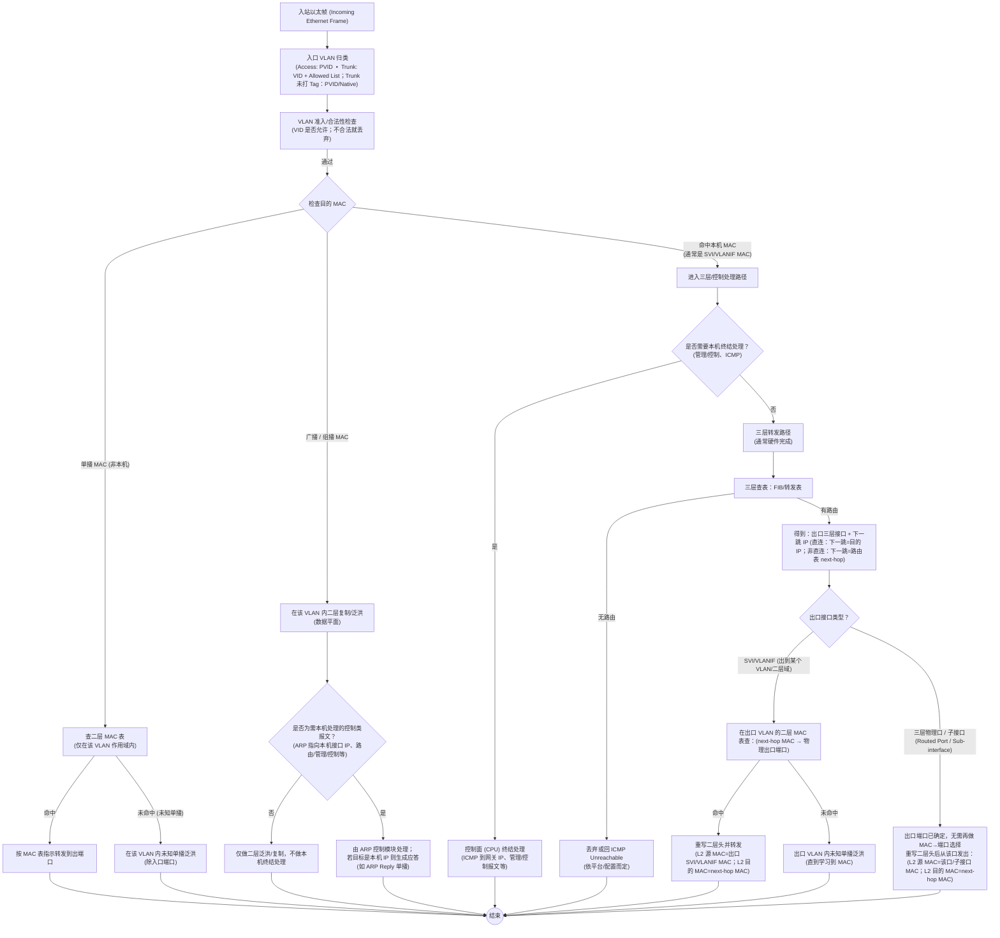

当 L3 交换机收到一个以太网帧时，首先需要将对该帧进行归类，确定该帧属于哪个 VLAN/哪个二层广播域中（因为同一台交换机上可能同时承载很多 VLAN）。这是因为后续检查是否命中本机 MAC/泛洪/查 MAC 表操作都依赖于 VLAN 归类结果。查 MAC 表要查的是该 VLAN 的 MAC 表；泛洪是只在所属 VLAN 的端口集合里泛洪；对于命中本机 MAC 来说，是指 SVI/VLANIF 的 MAC，其实是属于某个 VLAN 的三层网关接口，也依赖 VLAN 上下文，否则就不知道该把它交给 VLANIF10 还是 VLANIF20 作为网关入口。

当以太网帧的 VLAN 归类以及合法性检查通过后，L3 交换机会检查该帧的目的 MAC 地址。首先检查该目的 MAC 地址是一个单播 MAC 地址并且是否命中本机 MAC 地址，**在三层交换机里，命中本机 MAC 更准确的含义是——收到的以太帧目的 MAC 属于设备自己（或设备代表的虚拟网关），因此该帧不会按普通二层转发去查 MAC 表转发，而是进入本机终结（控制面处理）或三层转发（路由转发）的路径**。

其中最常见的就是目的 MAC 地址是 L3 交换机 SVI/VLANIF 接口的 MAC 地址，根据 Cisco 文档（如下所示），当三层交换机使用 SVI（Switch Virtual Interface，VLAN 的三层接口）时，交换机上的物理端口还是像以前一样工作——当二层端口用（**最核心，这也是使用 VLANIF 的一个前提**）。关键点是当一帧的目的 MAC 是某个 SVI 接口的 MAC（也就是该 VLAN 网关的 MAC）时，这帧会触发交换机进入要做三层处理的流程。进入三层处理后，就会做典型路由动作：把二层头去掉/提取出 IP 包、查路由表/转发表决定下一跳和出接口、然后重新封装新的二层头等。

>When Layer 3 switches use SVIs, the physical interfaces on the switches act like they always have: as Layer 2 interfaces. That is, the physical interfaces receive Ethernet frames. The switch learns the source MAC address of the frame, and the switch forwards the frame based on the destination MAC address. To perform routing, any Ethernet frames destined for any of the SVI interface MAC addresses trigger the processing of the Layer 3 switching logic, resulting in normal routing actions like stripping data-link headers, making a routing decision, and so on.

另外需要注意的是，如果 L3 交换机的端口在数据转发意义上是二层转发口，平时并不会作为网关被主机当作下一跳，所以正常业务流量几乎不会把目的 MAC 指向某个二层口的 MAC 地址。二层口收到的帧通常是目的 MAC 不是本机，然后查 VLAN 内的 MAC 表转发/泛洪（MAC 表条目是 **`MAC + VLAN + 出接口`** 这种结构）。

在命中本机 MAC 地址后，需要检查是否需要本机终结处理，**本机终结处理是指入站帧/包被设备判定为以本设备为最终目的地，因此不再作为转发（transit/forwarding）流量继续送往其他出接口，而是被送入设备的控制平面/主机协议栈（CPU/RE）处理**，处理结果通常是消费该报文并生成响应报文（例如 ARP Reply、ICMP Echo Reply 等）。通常当目的 IP 是设备本机地址，比如 SVI/VLANIF、三层口、Loopback、虚拟网关 IP 等时，就会触发本机终结处理，或者当二层/三层协议本身就是要由设备处理的控制类报文，比如 ICMP、ARP、SSH/Telnet 等。

接着设备在三层转发表（FIB）中依据目的 IP 进行查表，得到转发所需的出口三层接口（例如某个 VLANIF 或某个 routed port/子接口）以及下一跳 IP。如果 L3 交换机发现匹配了一个直连网段，比如 VLANIF3 对应的网段（VLANIF3 配了 IP/掩码以后，设备的路由表里会自动出现一条直连路由，并且这条路由的出接口就是 VLANIF3），那么 L3 交换机就会知道这个包要被送进 VLAN3 这个二层广播域里。至于具体从 VLAN3 的哪个物理端口发出去，要靠二层的 **`下一跳 MAC + 端口 + VLAN`** 信息来决定。即先查找 ARP 表，得到下一跳 IP 对应的 MAC 地址，然后在 VLAN3 的 MAC 表里查找该 MAC 地址对应的物理端口，最后从该端口发出去。最后重写二层头，源 MAC 是 VLANIF3 的 MAC，目的 MAC 是下一跳的 MAC。

#### 3.2 三层交换机 VLAN 间通信示例

