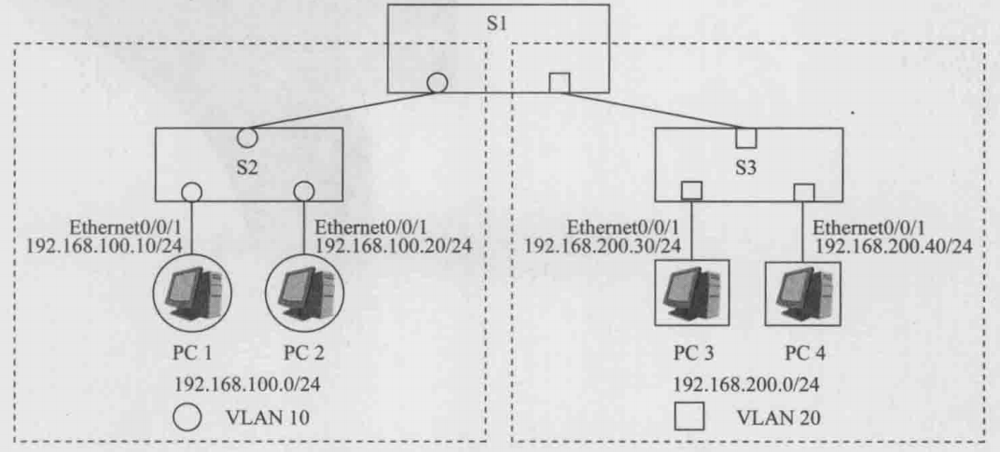
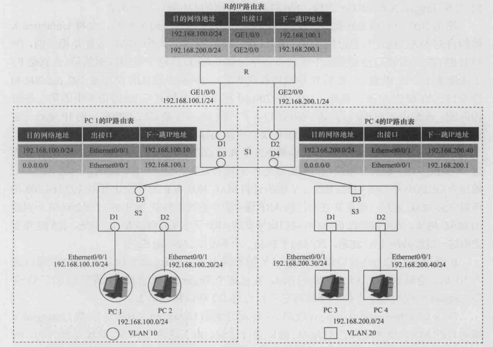
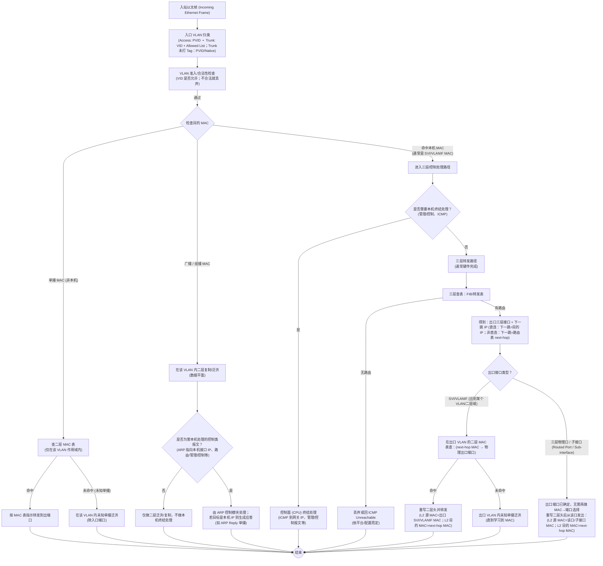
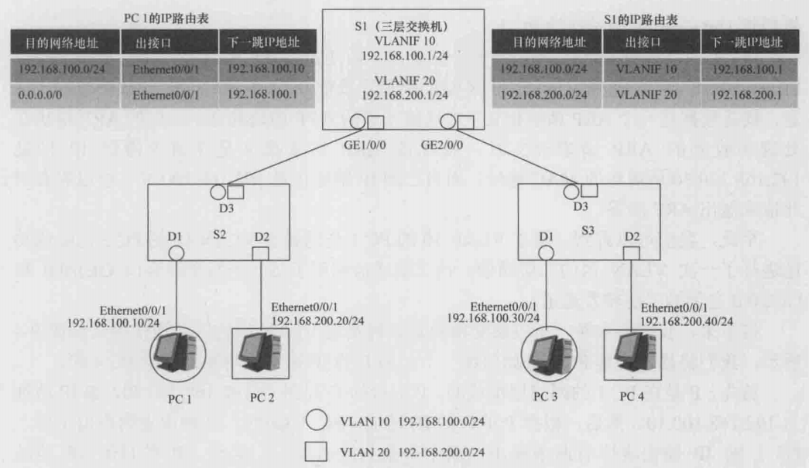
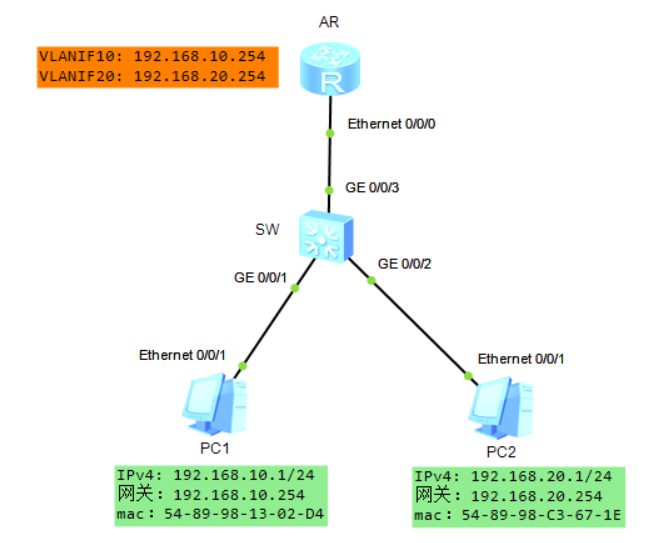
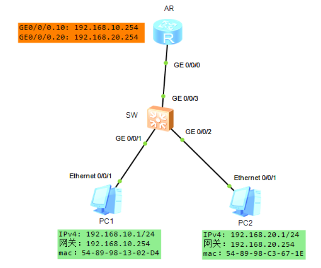
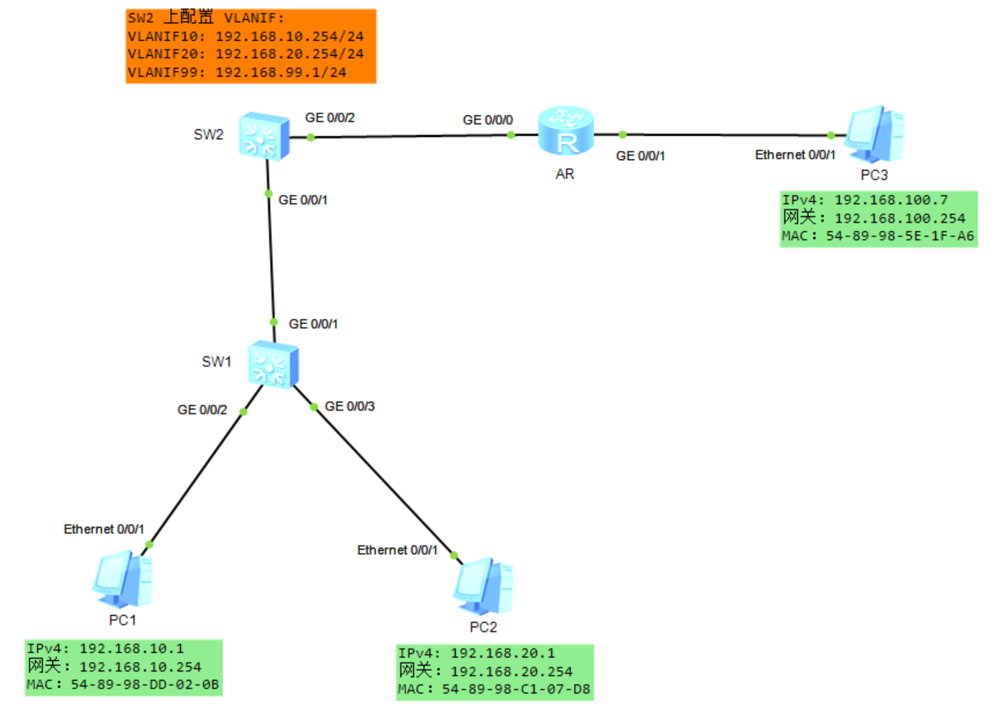

# VLAN 间的三层通信

## 一、通过多臂路由器实现 VLAN 间的三层通信

如下图所示，3 台交换机和 4 台 PC 组成了一个交换网络，在此网络上划分了两个基于端口的 VLAN，分别为 VLAN10 和 VLAN20，其中 PC1 和 PC2 属于 VLAN10，PC3 和 PC4 属于 VLAN20。

<div align="center">
    
</div>

在上图中，PC1 与 PC4 之间是无法进行任何通信的，这是因为 PC1 和 PC4 属于不同的 VLAN，所以它们之间无法进行二层通信；同时，由于它们之间目前尚未存在一个“三层通道”，所以它们之间也无法进行三层通信。

那么，如何才能在 PC1 和 PC4 之间实现三层通信呢？方法之一便是引入一台路由器。**<font color="red">路由器的作用实质上就是在不同的二层网络（二层广播域）之间建立起三层通道。不同的 VLAN 其实就是不同的二层网络（二层广播域），所以路由器当然也可以在不同的 VLAN 之间建立起三层通道</font>**。

我们看到，路由器 R 的 GE1/0/0 接口与交换机 S1 的属于 VLAN10 的 D1 端口相连，路由器 R 的 GE2/0/0 接口与交换机 S1 的属于 VLAN20 的 D2 端口相连。需要特别提醒的是，**<font color="red">与 PC 的接口一样，路由器 R 的 GE1/0/0 接口和 GE2/0/0 接口都是不能发送和接收 Tagged VLAN 帧的</font>**。另外，从下图中我们也看到，路由器 R 分别从 GE1/0/0 接口和 GE2/0/0 接口各自引出了一条物理链路，每条物理链路可以被形象地称为路由器的一条"手臂"，所以这里的路由器 R 也常常被形象地称为"双臂路由器"，或泛泛地称为多臂路由器。

<div align="center">
    
</div>

接下来，我们通过一个例子来说明 PC1 和 PC4 是如何实现三层通信的，也就是说，PC1 是如何将一个名为 P 的 IP 报文成功地发送给 PC4 的。上图中，交换机的 Access 端口有：S2 的 D1 端口和 D2 端口，S3 的 D1 端口和 D2 端口，S1 的 D1 端口和 D2 端口。交换机的 Trunk 端口有：S2 的 D3 端口，S3 的 D3 端口，S1 的 D3 端口和 D4 端口。

首先，P 是在 PC1 的网络层形成的，P 的目的 IP 地址为 **`192.168.200.40`**，源 IP 地址为 **`192.168.100.10`**。然后，根据 P 的目的 IP 地址，PC1 会进行 IP 路由表的查询工作。PC1 的 IP 路由表中有两条路由，其中一条为缺省路由。显然，P 的目的 IP 地址 **`192.168.200.40`** 只能匹配上那条缺省路由，该路由的出接口为 PC1 的 Ethernet0/0/1 接口，下一跳 IP 地址为路由器 R 的 GE1/0/0 接口的 IP 地址 **`192.168.100.1`**（**<font color="red">路由器 R 的 GE1/0/0 接口也因此被称为是 **`192.168.100.0/24`** 或 VLAN10 的缺省网关</font>**）。

于是，根据这条缺省路由的指示，P 会被下发至 PC1 的 Ethernet0/0/1 接口，并被封装成一个帧。假设这个帧取名为 X，那么 X 帧的载荷数据就是 P，**<font color="red">X 帧的源 MAC 地址为 PC1 的 Ethernet0/0/1 接口的 MAC 地址，X 帧的目的 MAC 地址为路由器 R 的 GE1/0/0 接口的 MAC 地址</font>**。注意，此时的 X 帧是一个不带 VLAN Tag 的帧。

接下来，PC1 会从 Ethernet0/0/1 接口将 Untagged X 帧发送出去。X 帧从 S2 的 D1 端口进入 S2 后，会被添加上 VLAN10 的 Tag，并且这个 Tagged X 帧会被 S2 转发至 S1。S1 会将 Tagged X 帧的 Tag 去掉，然后将它从自己的 D1 端口转发出去。

路由器 R 的 GE1/0/0 接口在收到 S1 转发过来的 Untagged X 帧后，会将 Untagged X 帧的目的 MAC 地址与自己的 MAC 地址进行比较。由于这两个 MAC 地址是相同的，所以 R 的 GE1/0/0 接口会根据这个帧的类型字段值 0x0800 将这个帧的数据载荷（也就是 P）上送给 R 的三层 IP 模块。R 的 IP 模块接收到 P 后，会根据 P 的目的 IP 地址 **`192.168.200.40`** 查询自己的 IP 路由表。**<font color="red">显然，`192.168.200.40` 这个 IP 地址只与 IP 路由表中的第二条路由匹配，该路由的出接口为 GE2/0/0 接口，下一跳 IP 地址是 GE2/0/0 接口的 IP 地址</font>**（这说明 P 要去往的目的网络是与 GE2/0/0 接口直接相连的）。

于是，根据这条路由的指示，P 会被下发至 R 的 GE2/0/0 接口，并被封装成一个帧。假设这个帧取名为 Y，那么 Y 帧的载荷数据就是 P，Y 帧的类型字段的值为 0x0800，**<font color="red">Y 帧的源 MAC 地址为 GE2/0/0 接口的 MAC 地址，Y 帧的目的 MAC 地址为 P 的目的 IP 地址 `192.168.200.40` 所对应的 MAC 地址</font>**。注意，此时的 Y 帧是一个不带 VLAN Tag 的帧。

R 通过其 GE2/0/0 接口将 Untagged Y 帧发送出去。Untagged Y 帧从 S1 的 D2 端口进入 S1 后，会被添加上 VLAN20 的 Tag，并且这个 Tagged Y 帧会被 S1 转发至 S3。S3 会将 Tagged Y 帧的 Tag 去掉，然后将它从自己的 D2 端口转发出去。

PC4 的 Ethernet0/0/1 接口在收到 S3 转发过来的 Untagged Y 帧后，会将 Untagged Y 帧的目的 MAC 地址与自己的 MAC 地址进行比较。由于这两个 MAC 地址是相同的，所以 PC4 的 Ethernet0/0/1 接口会根据这个帧的类型字段值 0x0800 将这个帧的数据载荷（也就是 P）上送给 PC4 的位于三层的 IP 模块。

至此，源于 PC1 的三层 IP 模块的 IP 报文 P 便成功地到达了 PC4 的三层 IP 模块，属于 VLAN10 的 PC1 与属于 VLAN20 的 PC4 之间成功地进行了一次三层通信。

## 二、通过单臂路由器实现 VLAN 间的三层通信

### 1.子接口基本概念

VLAN 间的三层通信可以通过多臂路由器来实现，但这种实现方法面临的一个主要问题是：**<font color="red">每一个 VLAN 都需要占用路由器上的一个物理接口</font>**（也就是说，每一个 VLAN 都需要路由器从一个物理接口伸出一只手臂来）。如果 VLAN 数量众多，就需要占用大量的路由器接口。事实上，路由器的物理接口资源是非常宝贵而稀缺的，无法支持数量较多的 VLAN。实际的网络部署中，几乎都不会通过多臂路由器来实现 VLAN 间的三层通信。

为了节省路由器的物理接口资源，我们还可以通过单臂路由器的方法来实现 VLAN 间的三层通信。采用这种方法时，仍然必须对路由器的物理接口进行子接口（Sub-Interface）划分。**<font color="red">一个路由器的物理接口可以划分为多个子接口，不同的子接口可以对应于不同的 VLAN，这些子接口的 MAC 地址均为衍生出它们的那个物理接口的 MAC 地址，但是它们的 IP 地址各不相同</font>**。一个子接口的 IP 地址应当属于该子接口所对应的那个 VLAN 的缺省网关地址。子接口是一个逻辑上的概念，所以子接口也常常被称为虚接口。

假设在路由器的物理接口 **`GE0/0/1`** 上创建两个子接口：**`GE0/0/1.10`** 及 **`GE0/0/1.20`**，这两个子接口的状态与物理接口 **`GE0/0/1`** 息息相关，**<font color="red">当 **`GE0/0/1`** 被关闭或者发生故障时，基于该物理接口所创建的所有子接口都将无法正常工作</font>**。请留意子接口的标识，以 **`GE0/0/1.10`** 为例，**`GE0/0/1`** 指的是物理接口类型及编号，而小数点 . 后面的数字则是子接口的编号。

以华为 AR2200 路由器为例，在一个千兆以太网接口上最多可以创建 4096 个子接口。值得注意的是，**子接口被创建后，需指定对接的 VLAN-ID，当该子接口向外发送数据帧时，数据帧将会被打上相应 VLAN 的 Tag**。为了能够与交换机顺利对接，路由器 **`GE0/0/1`** 对端的交换机接口必须配置为 Trunk 类型（或 Hybrid 类型），**<font color="red">而且要放通相应的 VLAN 并以标记帧的形式处理相关数据</font>**。路由器会把子接口当成是一个普通接口来对待。

### 2.子接口实际案例

如下图所示，路由器 R 的物理接口 **`GE1/0/0`** 被划分成了两个子接口，分别为 **`GE1/0/0.1`** 和 **`GE1/0/0.2`**。**`GE1/0/0.1`** 对应于 VLAN10，**`GE1/0/0.2`** 对应于 VLAN20。**`GE1/0/0.1`** 的 IP 地址为 **`192.168.100.1/24`**，也就是 VLAN10 的缺省网关地址；**`GE1/0/0.2`** 的 IP 地址为 **`192.168.200.1/24`**，也就是 VLAN20 的缺省网关地址。子接口 **`GE1/0/0.1`** 的 MAC 地址和 **`GE1/0/0.2`** 的 MAC 地址是一样的，都是物理接口 **`GE1/0/0`** 的 MAC 地址。

<div align="center">
    
</div>

在上图中，交换机的 Access 端口有：S2 的 D1 端口和 D2 端口，S3 的 D1 端口和 D2 端口。**<font color="red">交换机的 Trunk 端口有：S2 的 D3 端口，S3 的 D3 端口，S1 的 D3 端口和 D1、D2 端口</font>**。属于 VLAN10 的帧和属于 VLAN20 的帧都需要依次传递到 S1 的 D1 端口，因此 S1 与 R 之间的链路是一条 VLAN Trunk 链路（此链路上需要同时传递 VLAN10、VLAN20 的数据帧）。**<font color="red">该链路传送的帧必须是带有 VLAN Tag 的，这也意味着子接口 **`GE1/0/0.1`** 或 **`GE1/0/0.2`** 向外发送的帧也必须是带有 VLAN Tag 的</font>**。

接下来，我们还是通过一个例子来说明上图中的 PC1 和 PC4 之间是如何实现三层通信的，也就是说，PC1 是如何将一个名为 P 的 IP 报文成功地发送给 PC4 的。

首先，P 是在 PC1 的网络层形成的，P 的目的 IP 地址为 **`192.168.200.40`**，源 IP 地址为 **`192.168.100.10`**。然后，根据 P 的目的 IP 地址，PC1 会进行 IP 路由表的查询工作。显然，P 的目的 IP 地址 **`192.168.200.40`** 只能匹配上那条缺省路由，该路由的出接口为 PC1 的 Ethernet0/0/1 接口，下一跳 IP 地址为路由器 R 的 **`GE1/0/0.1`** 子接口的 IP 地址 **`192.168.100.1`**（**<font color="red">路由器 R 的 **`GE1/0/0.1`** 子接口也因此被称为是 **`192.168.100.0/24`** 或 VLAN10 的缺省网关</font>**）。

于是，根据这条缺省路由的指示，P 会被下发至 PC1 的 Ethernet0/0/1 接口，并被封装成一个帧。假设这个帧取名为 X，那么 X 帧的载荷数据就是 P，**X 帧的源 MAC 地址为 PC1 的 Ethernet0/0/1 接口的 MAC 地址，X 帧的目的 MAC 地址为路由器 R 的 `GE1/0/0.1` 子接口的 MAC 地址**。注意，此时的 X 帧是一个不带 VLAN Tag 的帧。

接下来，PC1 会从 Ethernet0/0/1 接口将 Untagged X 帧发送出去。Untagged X 帧从 S2 的 D1 端口进入 S2 后，会被添加上 VLAN10 的 Tag，并且这个 Tagged X 帧会被 S2 和 S1 转发至路由器的物理接口 **`GE1/0/0`**。

**<font color="red">路由器 R 的物理接口 **`GE1/0/0`** 在收到 S1 转发过来的 Tagged X 帧后，发现这个帧是属于 VLAN10 的，于是这个帧会交给子接口 **`GE1/0/0.1`** 来处理</font>**。子接口 **`GE1/0/0.1`** 发现，Tagged X 帧的目的 MAC 地址正是自己的 MAC 地址，并且这个帧的类型字段的值是 0x0800，于是子接口 **`GE1/0/0.1`** 会将这个帧的载荷数据（也就是 P）上送给路由器 R 的三层 IP 模块。

路由器 R 的 IP 模块接收到 P 后，会根据 P 的目的 IP 地址 **`192.168.200.40`** 查询自己的 IP 路由表。显然，**`192.168.200.40`** 这个 IP 地址只与 IP 路由表中的第一条路由相匹配，该路由的出接口为子接口 **`GE1/0/0.2`**，下一跳 IP 地址是子接口 **`GE1/0/0.2`** 的 IP 地址（这说明 P 要去往的目的网络是与子接口 **`GE1/0/0.2`** 直接相连的）。

于是，根据这条路由的指示，P 会被下发至 R 的 **`GE1/0/0.2`** 子接口，并被封装成一个帧。假设这个帧取名为 Y，那么 Y 帧的载荷数据就是 P，Y 帧的类型字段的值为 0x0800，**<font color="red">Y 帧的源 MAC 地址为子接口 **`GE1/0/0.2`** 的 MAC 地址，Y 帧的目的 MAC 地址为 P 的目的 IP 地址 `192.168.200.40` 所对应的 MAC 地址</font>**。注意，Y 帧还必须带上 VLAN20 的 Tag。

>**`GE1/0/0.2`** 这个子接口在配置上就绑定了 VLAN 20，所以当路由器要从 **`GE1/0/0.2`** 发出帧 Y 时，会按该子接口的封装规则把以太帧封装成 802.1Q tagged，并且 VID=20。

路由器 R 将 Tagged Y 帧从其子接口 **`GE1/0/0.2`** 发送出去之后（从物理直观上讲，就是从 GE1/0/0 这个物理接口发出去），该 Tagged Y 帧会到达交换机 S3 的 D2 端口。然后，S3 会将 Tagged Y 帧的 Tag 去掉，然后将它从自己的 D2 端口转发出去。

PC4 的 Ethernet0/0/1 接口在收到 S3 转发过来的 Untagged Y 帧后，会将 Untagged Y 帧的目的 MAC 地址与自己的 MAC 地址进行比较。由于这两个 MAC 地址是相同的，所以 PC4 的 Ethernet0/0/1 接口会根据这个帧的类型字段值 0x0800 将这个帧的数据载荷（也就是 P）上送给 PC4 的位于三层的 IP 模块。

至此，源于 PC1 的三层 IP 模块的 IP 报文 P 便成功地到达了 PC4 的三层 IP 模块，属于 VLAN10 的 PC1 与属于 VLAN20 的 PC4 之间成功地进行了一次三层通信。

## 三、通过三层交换机实现 VLAN 间的三层通信

### 1 三层交换机讲解

VLAN 间的三层通信可以通过多臂路由器或单臂路由器来实现。通过单臂路由器来实现时，可以节约路由器的物理接口资源，但是，这种方式也有其不足之处。如果 VLAN 的数量众多，VLAN 间的通信流量很大时，单臂链路所能提供的带宽就难以有效支撑这些通信流量。另外，如果单臂链路一旦发生了中断，那么所有的 VLAN 间的通信也会因此而中断。为此，人们引入了一种被称为"三层交换机"的网络设备，并通过三层交换机来更经济、更快速、更可靠地实现 VLAN 间的三层通信。在说明什么是三层交换机之前，我们必须先解释一下关于"二层口"和"三层口"的概念。

通常，我们把交换机上的端口称为二层端口，或简称为二层口；同时，我们把路由器或计算机上的接口称为三层接口，或简称为三层口。二层口的行为特征与三层口的行为特征在明层的差异，具体如下。

- **<font color="red">二层口只有 MAC 地址，没有 IP 地址；三层口既有 MAC 地址，又有 IP 地址</font>**。
- 设备的某个二层口在接收到一个广播帧后，会将这个广播帧从该设备的其他所有二层口泛洪出去。
- 设备的某个三层口在接收到一个广播帧后，会根据这个广播帧的类型字段的值将这个广播帧的载荷数据上送到该设备第三层的相关模块处理。
- 设备的某个二层口在接收到一个单播帧后，会查找设备自己的 MAC 地址表，并将这个帧转发到对应的二层口。如果表中查不到这个 MAC 地址，则直接泛洪该帧。如果表中存在该 MAC 地址对应的端口号，则从对应端口转发出去。
- **<font color="red">设备的某个三层口在接收到一个单播帧后，会比较该帧的目的 MAC 地址是否是该三层口的 MAC 地址。如果不是，则直接将这个帧丢弃</font>**；如果是，则根据该帧的类型字段值将这个帧的载荷数据上送到该设备第三层的相关应模块去处理。

**交换机的端口都是二层口**，一台交换机的不同二层口之间不存在三层转发通道。交换机内部存在 MAC 地址表，用以进行二层转发，交换机内部不存在 IP 路由表。**路由器的端口都是三层口**，一台路由器的不同三层口之间只存在三层转发通道，不存在二层转发通道，路由器内部存在 IP 路由表，用以进行三层转发。路由器内部不存在 MAC 地址表。

三层交换机的原理性定义是：三层交换机是二层交换机与路由器的一种集成形式，它除了可以拥有一些二层口外，还可以拥有一些"混合端口"（简称为"混合口"）。混合口既具有三层口的行为特征，同时又具有二层口的行为特征。

**<font color="red">一台三层交换机上，不同的混合口之间既存在三层转发通道和二层转发通道，不同的二层口之间只存在二层转发通道，一个混合口与一个二层口之间也只存在二层转发通道</font>**。三层交换机既存在 MAC 地址表，用以进行二层转发，又存在 IP 路由表，用以进行三层转发。一台三层交换机上可以只有混合口，而无二层口；一台三层交换机上也可以只有二层口，而无混合口（此时的三层交换机完全退化成了一台二层交换机）。

当一个三层交换机接收到一个以太帧时，其转发流程图如下所示：



当 L3 交换机收到一个以太网帧时，首先需要将对该帧进行归类，确定该帧属于哪个 VLAN/哪个二层广播域中（因为同一台交换机上可能同时承载很多 VLAN）。这是因为后续检查是否命中本机 MAC/泛洪/查 MAC 表操作都依赖于 VLAN 归类结果。查 MAC 表要查的是该 VLAN 的 MAC 表；泛洪是只在所属 VLAN 的端口集合里泛洪；对于命中本机 MAC 来说，是指 SVI/VLANIF 的 MAC，其实是属于某个 VLAN 的三层网关接口，也依赖 VLAN 上下文，否则就不知道该把它交给 VLANIF10 还是 VLANIF20 作为网关入口。

当以太网帧的 VLAN 归类以及合法性检查通过后，L3 交换机会检查该帧的目的 MAC 地址。首先检查该目的 MAC 地址是一个单播 MAC 地址并且是否命中本机 MAC 地址，**<font color="red">在三层交换机里，命中本机 MAC 更准确的含义是——收到的以太帧目的 MAC 属于设备自己（或设备代表的虚拟网关），因此该帧不会按普通二层转发去查 MAC 表转发，而是进入本机终结（控制面处理）或三层转发（路由转发）的路径</font>**。

其中最常见的就是目的 MAC 地址是 L3 交换机 SVI/VLANIF 接口的 MAC 地址，根据 Cisco 文档（如下所示），当三层交换机使用 SVI（Switch Virtual Interface，VLAN 的三层接口）时，交换机上的物理端口还是像以前一样工作——当二层端口用（**最核心，这也是使用 VLANIF 的一个前提**）。关键点是当一帧的目的 MAC 是某个 SVI 接口的 MAC（也就是该 VLAN 网关的 MAC）时，这帧会触发交换机进入要做三层处理的流程。进入三层处理后，就会做典型路由动作：把二层头去掉/提取出 IP 包、查路由表/转发表决定下一跳和出接口、然后重新封装新的二层头等。

>When Layer 3 switches use SVIs, the physical interfaces on the switches act like they always have: as Layer 2 interfaces. That is, the physical interfaces receive Ethernet frames. The switch learns the source MAC address of the frame, and the switch forwards the frame based on the destination MAC address. To perform routing, any Ethernet frames destined for any of the SVI interface MAC addresses trigger the processing of the Layer 3 switching logic, resulting in normal routing actions like stripping data-link headers, making a routing decision, and so on.

另外需要注意的是，如果 L3 交换机的端口在数据转发意义上是二层转发口，平时并不会作为网关被主机当作下一跳，所以正常业务流量几乎不会把目的 MAC 指向某个二层口的 MAC 地址。二层口收到的帧通常是目的 MAC 不是本机，然后查 VLAN 内的 MAC 表转发/泛洪（MAC 表条目是 **`MAC + VLAN + 出接口`** 这种结构）。

在命中本机 MAC 地址后，需要检查是否需要本机终结处理，**<font color="red">本机终结处理是指入站帧/包被设备判定为以本设备为最终目的地，因此不再作为转发（transit/forwarding）流量继续送往其他出接口，而是被送入设备的控制平面/主机协议栈（CPU/RE）处理</font>**，处理结果通常是消费该报文并生成响应报文（例如 ARP Reply、ICMP Echo Reply 等）。通常当目的 IP 是设备本机地址，比如 SVI/VLANIF、三层口、Loopback、虚拟网关 IP 等时，就会触发本机终结处理，或者当二层/三层协议本身就是要由设备处理的控制类报文，比如 ICMP、ARP、SSH/Telnet 等。

接着设备在三层转发表（FIB）中依据目的 IP 进行查表，得到转发所需的出口三层接口（例如某个 VLANIF 或某个 routed port/子接口）以及下一跳 IP。如果 L3 交换机发现匹配了一个直连网段，比如 VLANIF3 对应的网段（VLANIF3 配了 IP/掩码以后，设备的路由表里会自动出现一条直连路由，并且这条路由的出接口就是 VLANIF3），那么 L3 交换机就会知道这个包要被送进 VLAN3 这个二层广播域里。至于具体从 VLAN3 的哪个物理端口发出去，要靠二层的 **`下一跳 MAC + 端口 + VLAN`** 信息来决定。即先查找 ARP 表，得到下一跳 IP 对应的 MAC 地址，然后在 VLAN3 的 MAC 表里查找该 MAC 地址对应的物理端口，最后从该端口发出去。最后重写二层头，源 MAC 是 VLANIF3 的 MAC，目的 MAC 是下一跳的 MAC。

### 2 三层交换机 VLAN 间通信示例

<div align="center">
    
</div>

接下来，我们就通过几个例子来说明三层交换机是如何实现 VLAN 内的二层通信以及 VLAN 间的三层通信的。

如上图所示，PC1 和 PC3 被划分进了 VLAN10，PC2 和 PC4 被划分进了 VLAN20。S1 是一台三层交换机，S2 和 S3 都是二层交换机。为了能够支持 VLAN10 与 VLAN20 之间的三层通信，我们需要在 S1 上配置两个逻辑意义上的 VLAN 接口，这两个 VLAN 接口分别称为 VLANIF10 和 VLANIF20（注：VLANIF 中的 IF 是 Interface 的缩写）。**<font color="red">VLANIF10 和 VLANIF20 具有三层口的行为特征，并拥有自己的 IP 地址</font>**。我们把 VLANIF10 和 VLANIF20 的 IP 地址分别配置为 **`192.168.100.1/24`** 和 **`192.168.200.1/24`**，**<font color="red">这两个 IP 地址其实分别就是 VLAN10 和 VLAN20 的缺省网关地址</font>**。这样一来，S1 上的端口 **`GE1/0/0`** 和端口 **`GE2/0/0`** 就都成了混合口，这两个混合口一方面具有二层口的行为特征，同时又具有三层口的行为特征。

>这里说 **`GE1/0/0`** 和 **`GE2/0/0`** 成为混合口，具有三层口的行为特征，不是说将其修改为 routed port，**它们仍然是二层 trunk 口，主要负责 VLAN Tag 的收发、MAC 学习、二层转发/泛洪、STP 等，同 VLAN 的帧按二层 MAC 表转发**。跨 VLAN 的帧其目的 MAC 会指向网关 MAC（VLANIF/SVI），从而在入端口处触发三层转发流程。因此同一物理口看起来同时承载二层与三层相关流量，但配置语义上它仍是二层口，不是 routed port。Cisco 关于 routed port 的描述如下：A routed port is a physical port that acts like a port on a router; it does not have to be connected to a router. A routed port is not associated with a particular VLAN, as is an access port. A routed port behaves like a regular router interface. Routed ports can be configured with a Layer 3 routing protocol. A routed port is a Layer 3 interface only and does not support Layer 2 protocols, such as DTP and STP.

根据华为的官方文档，VLANIF 的定义如下：Hosts of different VLANs use VLAN interfaces to communicate at Layer 3. VLAN interfaces are virtual interfaces that do not exist as physical entities on devices. For each VLAN, you can create one VLAN interface and assign an IP address to it. The VLAN interface acts as the gateway of the VLAN to forward packets destined for another IP subnet at Layer 3.

注意，在上图中，交换机的 Access 端口有：S2 的 D1 端口和 D2 端口，S3 的 D1 端口和 D2 端口。交换机的 Trunk 端口有：S2 的 D3 端口，S3 的 D3 端口，S1 的 **`GE1/0/0`** 端口和 **`GE2/0/0`** 端口。

#### 2.1 同 VLAN 内的二层通信

现在，我们先来看一下三层交换机是如何实现同一 VLAN 内的二层通信的。如上图所示，假设 PC1 需要发送一个 ARP 请求，去询问 PC3 的 MAC 地址是多少，也就是询问 IP 地址 **`192.168.100.30`** 所对应的 MAC 地址是多少。我们需要描述清楚这个 ARP 请求是如何到达 PC3 的。

首先，PC1 的数据链路层（二层）需要准备好一个广播帧，假设这个广播帧取名为 X。X 帧的目的 MAC 地址为 **`ff-ff-ff-ff-ff-ff`**，源 MAC 地址为 PC1 的 Ethernet0/0/1 接口的 MAC 地址，X 帧的载荷数据是一个 ARP 请求报文，该 ARP 请求报文的作用是请求得到 IP 地址 **`192.168.100.30`** 所对应的 MAC 地址。注意，X 帧现在是不带 VLAN Tag 的。

PC1 通过其 Ethernet0/0/1 接口发送出 Untagged X 帧后，Untagged X 帧会从 S2 的 D1 端口进入 S2，并被 S2 添加上 VLAN10 的 Tag。然后，Tagged X 帧会到达 S1 的混合端口 **`GE1/0/0`**。

因为 S1 的 **`GE1/0/0`** 端口具有三层口的行为特征，并且 **`GE1/0/0`** 端口收到的 Tagged X 帧是一个广播帧，所以，**`GE1/0/0`** 端口会根据 Tagged X 帧的类型字段值 0x0806 将 Tagged X 帧的载荷数据（注意，载荷数据是一个 ARP 请求报文）上送给三层的 ARP 模块处理。**<font color="red">三层的 ARP 模块在处理所收到的 ARP 请求报文时，发现该 ARP 请求报文是在请求得到 IP 地址 **`192.168.100.30`** 所对应的 MAC 地址，不是本机 IP 地址</font>**，所以不会做出 ARP 应答，而是直接将这个 ARP 请求报文丢弃。

同时，因为 S1 的 **`GE1/0/0`** 端口又具有二层口的行为特征，并且 **`GE1/0/0`** 端口接收到的 Tagged X 帧是一个广播帧，所以，**`GE1/0/0`** 端口会将这个 Tagged X 帧从 **`GE2/0/0`** 端口泛洪出去。然后，Tagged X 帧会运动到 S3 的 D1 端口。S3 的 D1 端口会去掉 Tagged X 帧的 Tag，然后将 Untagged X 帧发送给 PC3。

>这里就是前面 L3 层交换机转发流程图中提到的 **<font color="red">二层泛洪/复制，不做本机终结处理</font>** 的过程。即 S1 先判断这个 ARP 广播帧不是发给自己的（目的 IP 不是本机 IP），因此不会做本机终结处理，而是作为二层流量在 VLAN10 内泛洪。

PC3 的 Ethernet0/0/1 接口是一个三层口，而 Untagged X 又是一个广播帧，所以 Ethernet0/0/1 接口会根据 Untagged X 帧的类型字段值 0x0806 将这个帧的载荷数据（注意，载荷数据是一个 ARP 请求报文）上送给三层的 ARP 模块处理。三层的 ARP 模块在处理所收到的 ARP 请求报文时，发现该 ARP 请求报文是在请求得到 IP 地址 **`192.168.100.30`** 所对应的 MAC 地址，而自己的 IP 地址正是 **`192.168.100.30`**，所以将会对此请求做出 ARP 应答。

至此，我们可以看到，属于 VLAN10 的 PC1 与同属于 VLAN10 的 PC3 已经成功地进行了一次 VLAN 内的二层通信。这二层通信利用了 S1 的两个混合口 **`GE1/0/0`** 和 **`GE2/0/0`** 之间的二层转发通道。

#### 2.2 不同 VLAN 间的三层通信

如上图所示，我们将描述清楚 PC1 是如何将一个名为 P 的 IP 报文成功地发送给 PC4 的。

首先，P 是在 PC1 的网络层形成的，P 的目的 IP 地址为 **`192.168.200.40`**，源 IP 地址为 **`192.168.100.10`**。然后，根据 P 的目的 IP 地址，PC1 会进行 IP 路由表的查询工作。PC1 的 IP 路由表中有两条路由，其中一条为缺省路由。显然，P 的目的 IP 地址 **`192.168.200.40`** 只能匹配上那条缺省路由，该路由的出接口为 PC1 的 Ethernet0/0/1 接口，下一跳 IP 地址为 S1 的 VLANIF10 的 IP 地址 **`192.168.100.1`**（**<font color="red">S1 的 VLANIF10 也因此被称为 **`192.168.100.0/24`** 或 VLAN10 的缺省网关</font>**）。

于是，根据这条缺省路由的指示，P 会被下发至 PC1 的 Ethernet0/0/1 接口，并被封装成一个单播帧。假设这个帧取名为 X，那么 X 帧的载荷数据就是 P，**<font color="red">X 帧的源 MAC 地址为 PC1 的 Ethernet0/0/1 接口的 MAC 地址，X 帧的目的 MAC 地址为 VLANIF10 的 IP 地址所对应的 MAC 地址</font>**。注意，此时的 X 帧是一个不带 VLAN Tag 的帧。

然后，PC1 会从 Ethernet0/0/1 接口将 Untagged X 帧发送出去。Untagged X 帧从 S2 的 D1 端口进入 S2 后，会被添加上 VLAN10 的 Tag，并且这个 Tagged X 帧会被送达至 S1 的 **`GE1/0/0`** 端口。

因为 S1 的 **`GE1/0/0`** 端口具有三层口的行为特征，并且 **`GE1/0/0`** 端口收到的 Tagged X 帧是一个单播帧，所以，**`GE1/0/0`** 端口会将这个帧的目的 MAC 地址与自己的 MAC 地址进行比较。由于这两个 MAC 是相同的，所以 **`GE1/0/0`** 端口会根据这个帧的类型字段值 0x0800 将载荷数据（也就是 P）上送给三层 IP 模块进行处理。这里就是前面 L3 交换机转发流程图中提到的 **<font color="red">命中本机 MAC 地址 → 三层转发路径</font>** 的过程。

S1 的 IP 模块接收到 P 后，会根据 P 的目的 IP 地址 **`192.168.200.40`** 查询自己的 IP 路由表。显然，**`192.168.200.40`** 这个 IP 地址只与 IP 路由表中的第二条路由匹配，该路由的出接口为 VLANIF20，下一跳 IP 地址是 VLANIF20 的 IP 地址（这说明 P 要去往的目的网络是与 VLANIF20 直接相连的，但目前还不清楚究竟是与 **`GE1/0/0`** 端口直接相连，还是与 **`GE2/0/0`** 端口直接相连）。

于是，根据这条路由的指示，P 会被下发至 VLANIF20 接口（但目前还不清楚，究竟应该下发至 **`GE1/0/0`** 端口，还是应该下发至 **`GE2/0/0`** 端口），并被封装成一个单播帧。

假设这个帧取名为 Y，那么 Y 帧的载荷数据就是 P，Y 帧的目的 MAC 地址应该是 P 的目的 IP 地址 **`192.168.200.40`** 所对应的 MAC 地址，但目前还不清楚 Y 帧的源 MAC 地址应该是 **`GE1/0/0`** 端口的 MAC 地址还是 **`GE2/0/0`** 端口的 MAC 地址。

假设 S1 现在还不知道 **`192.168.200.40`** 所对应的 MAC 地址，那么 S1 就需要通过其 **`GE1/0/0`** 和 **`GE2/0/0`** 端口向外发送 ARP 广播请求去获取这个 MAC 地址。注意，从 **`GE1/0/0`** 和 **`GE2/0/0`** 端口向外发送的 ARP 广播帧都必须带上 VLAN20 的 Tag。显然，最后的结果是，**`GE2/0/0`** 端口会收到 ARP 应答（从而学习到了 **`192.168.200.40`** 所对应的 MAC 地址），**`GE1/0/0`** 端口不会收到 ARP 应答。这样一来，Y 帧的源 MAC 地址现在就可以确定为 **`GE2/0/0`** 端口的 MAC 地址，Y 帧的出端口应该为 **`GE2/0/0`**。另外，Y 帧的目的 MAC 地址就是通过 ARP 机制而学习到的 MAC 地址。注意，Y 帧还必须带上 VLAN20 的 Tag。

这里就是前面 L3 交换机转发流程图中提到的 **<font color="red">命中本机 MAC 地址 -> 不需要 S1 进行本机终结 -> 查找 FIB/转发表/路由表 -> 得到下一跳出接口类型为 VLANIF20 -> 查找二层 MAC 表获取物理出端口 -> 重写二层头并转发</font>** 的过程。

然后，S1 将 Tagged Y 帧从 **`GE2/0/0`** 端口发送出去，该 Tagged Y 帧会到达交换机 S3 的 D2 端口。然后，S3 会将 Tagged Y 帧的 Tag 去掉，然后将它从自己的 D2 端口转发出去。

PC4 的 Ethernet0/0/1 接口在收到 S3 转发过来的 Untagged Y 帧后，会将 Untagged Y 帧的目的 MAC 地址与自己的 MAC 地址进行比较。由于这两个 MAC 地址是相同的，所以 PC4 的 Ethernet0/0/1 接口会根据这个帧的类型字段值 0x0800 将这个帧的载荷数据（也就是 P）上送给 PC4 的位于三层的 IP 模块。

#### 2.3 VLANIF 和子接口之间的区别

##### 2.3.1 VLANIF 适用场景

VLANIF 是绑定到某个 VLAN（二层广播域）上的三层逻辑接口，用来给该 VLAN 提供网关、参与三层转发（VLAN 间路由、设备管理 IP 等）。使用 VLANIF 的前置条件是该设备必须有对应 VLAN 的二层承载和广播域。

VLANIF 的适用前提是设备具备二层交换能力，也就是能创建 VLAN、端口能加入和关联 VLAN，能为端口设置 **`trunk/hybrid/access`** 类型，并且至少有 1 个加入该 VLAN 的物理端口处于启用/UP 状态。总结就是以下 2 点：

- **<font color="red">VLANIF 接口对应的 VLAN，必须已经创建</font>**；
- **<font color="red">必须有 Up 的物理接口或 Eth-Trunk 接口已经加入 VLANIF 对应的 VLAN</font>**。

相反，如果发现 VLANIF 接口的状态是 Down，那通常原因如下所示：

- 接口与 VLAN 没有关联，即没有接口加入 VLAN：使用命令 **`display vlan vlan-id [ verbose | to vlan-id2 ]`** 查看该 VLAN 下是否有接口，注意 **`port trunk/hybrid pvid vlan vlan-id`** 仅表示在 Trunk/Hybrid 接口上配置 PVID，并没有将接口加入 VLAN；
- 加入 VLAN 的各接口的物理状态全是 Down：排查加入 VLAN 的各接口 Down 的故障，只要有一个接口物理状态是 Up，VLANIF 接口状态就是 Up；
- VLANIF 接口下没有配置 IP 地址；
- VLANIF 接口被 Shutdown。

下面讲解一下如何关联接口和 VLAN：

- **Access 端口关联 VLAN**：在 Access 端口上使用命令 **`port default vlan vlan-id`**，配置接口的缺省 VLAN，并将接口加入到指定的 VLAN 中；
- **Trunk 端口关联 VLAN**：在 Trunk 端口上使用命令 **`port trunk allow-pass vlan { { vlan-id1 [ to vlan-id2 ] } &<1-40> | all }`**，将接口加入到指定的 VLAN 中；
- **Hybrid 端口关联 VLAN**：在 Hybrid 端口上使用命令 **`port hybrid untagged vlan { { vlan-id1 [ to vlan-id2 ] } &<1-10> | all }`**，将 Hybrid 接口以 Untagged 方式加入 VLAN。或者使用命令 **`port hybrid tagged vlan { { vlan-id1 [ to vlan-id2 ] } &<1-10> | all }`**，将 Hybrid 接口以 Tagged 方式加入 VLAN。

##### 2.3.2 子接口适用场景

子接口是把一条物理三层以太网口逻辑切分成多个三层子接口，每个子接口终结一个 VLAN Tag（802.1Q），并在子接口上配置 IP，来实现 VLAN 间三层互通。当设备通过三层以太网接口连接不同 VLAN/不同网段用户时，应在该三层口上配置 **`dot1q termination`** 和子接口 IP，从而实现 VLAN 间三层通信。

子接口的适用前提是 **<font color="red">上联是三层以太网接口（route port），接口本身不作为二层 VLAN 成员（或者设备根本不支持把该口切为二层口），仍需要在一条链路上承载多个 VLAN 的业务</font>**（典型的如单臂路由）。

## 四、VLAN 间通信实验

### 1.VLANIF 和子接口区别实验拓扑

<div align="center">
    
</div>

实验使用的网络拓扑图如上所示，其中 SW 是一台普通的二层交换机，AR 是一台路由器，其端口 **`Ethernet0/0/0`** 是一个普通的二层口，PC1 和 PC2 分别连接在 SW 的两个 Access 端口上。PC1 和 PC2 分别被划分进了 VLAN10 和 VLAN20。其中 **`Ethernet0/0/0`** 接口的信息如下所示，可以看到 **`Ethernet0/0/0`** 接口的是 Switch Port，是一个标准的二层口，满足 VLANIF 的适用前提。

```java{.line-numbers}
[Huawei]display interface e0/0/0
Ethernet0/0/0 current state : UP
Line protocol current state : UP
Description:HUAWEI, AR Series, Ethernet0/0/0 Interface
Switch Port, PVID :    1, TPID : 8100(Hex), The Maximum Frame Length is 1628
IP Sending Frames' Format is PKTFMT_ETHNT_2, Hardware address is 00e0-fc60-149e
Last physical up time   : 2026-01-05 13:33:30 UTC-08:00
Last physical down time : 2026-01-05 13:33:25 UTC-08:00
Current system time: 2026-01-05 13:41:16-08:00
Port Mode: COMMON COPPER
Speed :  100,  Loopback: NONE
Duplex: FULL,  Negotiation: ENABLE
Mdi   : AUTO
Last 300 seconds input rate 0 bits/sec, 0 packets/sec
Last 300 seconds output rate 472 bits/sec, 0 packets/sec
Input peak rate 608 bits/sec,Record time: 2026-01-05 13:34:36
Output peak rate 1024 bits/sec,Record time: 2026-01-05 13:34:36
```

二层交换机 SW 的配置如下所示：

```java{.line-numbers}
vlan batch 10 20
interface Vlanif1
interface GigabitEthernet0/0/1
 port link-type access
 port default vlan 10
interface GigabitEthernet0/0/2
 port link-type access
 port default vlan 20
interface GigabitEthernet0/0/3
 port link-type trunk
 port trunk allow-pass vlan 10 20
```

路由器 AR 的配置如下所示：

```java{.line-numbers}
vlan batch 10 20
interface Vlanif10
 ip address 192.168.10.254 255.255.255.0 
interface Vlanif20
 ip address 192.168.20.254 255.255.255.0 
interface Ethernet0/0/0
 port link-type trunk
 port trunk allow-pass vlan 10 20
```

在经过上述配置之后，可以实现 PC1 和 PC2 之间的 VLAN 间通信。接下来，我们将把路由器 AR 的 **`Ethernet0/0/0`** 接口修改为 **`G0/0/1`**，其它保持不变，此时 **`G0/0/1`** 的接口信息如下，可以看到 **`G0/0/1`** 接口的是 Route Port，是一个三层口。

```java{.line-numbers}
[Huawei]display interface g0/0/1
GigabitEthernet0/0/1 current state : UP
Line protocol current state : DOWN
Description:HUAWEI, AR Series, GigabitEthernet0/0/1 Interface
Route Port,The Maximum Transmit Unit is 1500
Internet protocol processing : disabled
IP Sending Frames' Format is PKTFMT_ETHNT_2, Hardware address is 00e0-fc60-149f
Last physical up time   : 2026-01-05 14:00:51 UTC-08:00
Last physical down time : 2026-01-05 13:33:25 UTC-08:00
Current system time: 2026-01-05 14:02:03-08:00
```

此时路由器 AR 上的 **`Vlanif10`** 和 **`Vlanif20`** 的状态如下所示，可以看到 **`Vlanif10`** 和 **`Vlanif20`** 的状态都是 Down，这样就验证了前面所说的，**<font color="red">VLANIF 的适用前提是设备具备二层交换能力，并且至少有 1 个加入该 VLAN 的物理端口处于启用/UP 状态</font>**。

```java{.line-numbers}
[Huawei]display interface vlanif10
Vlanif10 current state : DOWN
Line protocol current state : DOWN
Description:HUAWEI, AR Series, Vlanif10 Interface
Route Port,The Maximum Transmit Unit is 1500
Internet Address is 192.168.10.254/24
IP Sending Frames' Format is PKTFMT_ETHNT_2, Hardware address is 00e0-fc60-149e
Current system time: 2026-01-05 14:03:09-08:00
    Input bandwidth utilization  : --
    Output bandwidth utilization : --

[Huawei]display interface vlanif20
Vlanif20 current state : DOWN
Line protocol current state : DOWN
Description:HUAWEI, AR Series, Vlanif20 Interface
Route Port,The Maximum Transmit Unit is 1500
Internet Address is 192.168.20.254/24
IP Sending Frames' Format is PKTFMT_ETHNT_2, Hardware address is 00e0-fc60-149e
Current system time: 2026-01-05 14:05:03-08:00
    Input bandwidth utilization  : --
    Output bandwidth utilization : --
```

### 2.路由器子接口实现 VLAN 间通信

<div align="center">
    
</div>

实验的网络拓扑图如上所示，其中 SW 是一台普通的二层交换机，AR 是一台路由器，其端口 **`GigabitEthernet0/0/0`** 是一个三层口，PC1 和 PC2 分别连接在 SW 的两个 Access 端口上，分别属于 VLAN10 和 VLAN20。

路由器 AR 的配置如下所示，注意在配置子接口时，需要配置 **`arp broadcast enable`**，因为默认情况下，**`dot1q`** 终结子接口的 ARP 广播能力是不使能的。如果不配置这个命令，结果就是：

- PC 到网关：PC 直接对网关发 **`ARP/ICMP`**，网关作为本机地址还能回应（执行本机终结），所以可以 ping 通网关；
- PC1 到 PC2：路由器 AR 要把报文转发到 VLAN20 时，必须先在 VLAN20 里用 ARP 广播解析 PC2 的 MAC，但子接口不使能 ARP 广播时，无法泛洪 ARP 报文，转发就失败，所以 跨 VLAN 互 ping 不通；

```java{.line-numbers}
interface GigabitEthernet0/0/0.10
 dot1q termination vid 10
 ip address 192.168.10.254 255.255.255.0 
 arp broadcast enable
#
interface GigabitEthernet0/0/0.20
 dot1q termination vid 20
 ip address 192.168.20.254 255.255.255.0 
 arp broadcast enable
```

SW 的配置如下所示：

```java{.line-numbers}
vlan batch 10 20
interface GigabitEthernet0/0/1
 port link-type access
 port default vlan 10
interface GigabitEthernet0/0/2
 port link-type access
 port default vlan 20
interface GigabitEthernet0/0/3
 port link-type trunk
 port trunk allow-pass vlan 10 20
 ```

上述配置完成之后，AR 路由器的接口 IP 信息如下所示：

```java{.line-numbers}
[Huawei]display ip interface brief 
*down: administratively down
^down: standby
(l): loopback
(s): spoofing
The number of interface that is UP in Physical is 4
The number of interface that is DOWN in Physical is 1
The number of interface that is UP in Protocol is 3
The number of interface that is DOWN in Protocol is 2

Interface                         IP Address/Mask      Physical   Protocol  
GigabitEthernet0/0/0              unassigned           up         down      
GigabitEthernet0/0/0.10           192.168.10.254/24    up         up        
GigabitEthernet0/0/0.20           192.168.20.254/24    up         up        
GigabitEthernet0/0/1              unassigned           down       down      
NULL0                             unassigned           up         up(s) 

[Huawei]display ip routing-table 
Route Flags: R - relay, D - download to fib
------------------------------------------------------------------------------
Routing Tables: Public
         Destinations : 10       Routes : 10       

Destination/Mask    Proto   Pre  Cost      Flags NextHop         Interface

...
   192.168.10.0/24  Direct  0    0           D   192.168.10.254  GigabitEthernet0/0/0.10
   192.168.20.0/24  Direct  0    0           D   192.168.20.254  GigabitEthernet0/0/0.20
...
```

最后 PC1 和 PC2 都可以访问网关，并且 PC1 和 PC2 之间也可以实现 VLAN 间通信。

### 3.三层交换机 VLANIF 实现 VLAN 间通信

在下图中，SW1 是二层交换机，SW2 是三层交换机。SW1 下联着终端用户，上联 SW2，**<font color="red">在该网络中 SW2 作为汇聚层交换机，是终端用户的网关所在</font>**。内网为了区隔用户规划了两个 VLAN，分别是 VLAN10 及 VLAN20。 现在要完成各设备的配置，使得 VLAN10 及 VLAN20 的用户能够进行相互通信，而且都能访问 192.168.100.0/24。

<div align="center">
    
</div>

值得注意的是，网络中一共存在三个 VLAN，分别是 VLAN10、VLAN20 及 VLAN99。其中，VLAN10 及 VLAN20 是为终端用户规划的 VLAN，而 VLAN99 则是交换机 SW2 与 Router 互联的 VLAN。为了实现 SW2 与 Router 的对接，需要将 SW2 的 **`GE0/0/2`** 接口配置为 Access 类型，并且添加到 VLAN99，同时配置交换机的 VLANIF99。

在这套方案里，SW2 的 **`GE0/0/2`** 被配置为 **`access vlan 99`**，意味着这个物理口只承载 VLAN99 的二层流量，即 Router 从该口发出的无标签以太帧会被 SW2 归入 VLAN99，SW2 从 VLAN99 发向该口的帧也会以无标签形式送到 Router，因此 VLAN99 的二层广播能够在 SW2 与 Router 之间正常到达。同时，SW2 上配置 Vlanif99 的 IP 地址为 **`192.168.99.1/24`**，等价于在 VLAN99 这个二层广播域上创建了一个三层接口，使 SW2 在该广播域内拥有合法的三层地址与 **`192.168.99.0/24`** 直连网段的路由条目，从而具备在 VLAN99 上进行三层收发与转发的能力。

基于这两点，当 SW2 需要把命中默认路由的报文交给下一跳 **`192.168.99.2`** 时，它能够在 VLAN99 内发起 ARP 广播解析 **`99.2`** 的 MAC 并完成二层封装，把流量真正送到 Router；同理，当 Router 需要把去往 **`192.168.10.0/24`** 或 **`192.168.20.0/24`** 的回程流量交给下一跳 **`192.168.99.1`** 时，也能在同一广播域内通过 ARP 解析到对应的 MAC 并把报文发回 SW2。**<font color="red">于是 SW2 与 Router 之间就形成了稳定可用的三层邻接关系</font>**，最终三台 PC 才能在跨网段通信时保证正向与回程路径都成立，从而实现 PC1、PC2、PC3 的互相通信。

SW1 的配置如下：

```java{.line-numbers}
vlan batch 10 20
interface GigabitEthernet0/0/1
 port link-type trunk
 port trunk allow-pass vlan 10 20
interface GigabitEthernet0/0/2
 port link-type access
 port default vlan 10
interface GigabitEthernet0/0/3
 port link-type access
 port default vlan 20
```

SW2 的配置如下：

```java{.line-numbers}
vlan batch 10 20 99
interface Vlanif10
 ip address 192.168.10.254 255.255.255.0 
interface Vlanif20
 ip address 192.168.20.254 255.255.255.0 
interface Vlanif99
 ip address 192.168.99.1 255.255.255.0 
interface GigabitEthernet0/0/1
 port link-type trunk
 port trunk allow-pass vlan 10 20
interface GigabitEthernet0/0/2
 port link-type access
 port default vlan 99
ip route-static 0.0.0.0 0.0.0.0 192.168.99.2
```

AR 的配置如下：

```java{.line-numbers}
interface GigabitEthernet0/0/0
 ip address 192.168.99.2 255.255.255.0 
interface GigabitEthernet0/0/1
 ip address 192.168.100.254 255.255.255.0 
ip route-static 192.168.10.0 255.255.255.0 192.168.99.1
ip route-static 192.168.20.0 255.255.255.0 192.168.99.1
```

经过上述配置之后，SW1 接口的 VLAN 信息如下所示：

```java{.line-numbers}
[Huawei]display port vlan 
Port                    Link Type    PVID  Trunk VLAN List
-------------------------------------------------------------------------------
GigabitEthernet0/0/1    trunk        1     1 10 20
GigabitEthernet0/0/2    access       10    -                                   
GigabitEthernet0/0/3    access       20    -  
```

SW2 上的路由表如下所示，可以看到 **`192.168.10.0/24`**、**`192.168.20.0/24`** 以及 **`192.168.99.0/24`** 这三条直连路由,它们分别关联到了 VLANIF10、VLANIF20 及 VLANIF99，另外还有一条静态默认路由。接下来，解释一下第 2 条路由和第 3 条路由的区别：

- **`192.168.10.0/24`** **<font color="red">是直连网段路由，用于指导如何转发去往该网段内其他主机的数据</font>**。这条路由告诉转发引擎（ASIC/FIB），如果收到一个数据包，目的 IP 属于 **`192.168.10.X`** 这个范围，那么这个包应该从 Vlanif10 接口发出去（进行二层 ARP 解析和转发）。
- **`192.168.10.254/32`** **<font color="red">是本地主机路由，用于标识设备自身，指导发给网关本身的数据包上送 CPU 处理</font>**。这条路由告诉转发引擎，如果收到一个数据包，它的目的 IP 严格等于 **`192.168.10.254`**，不要进行转发（因为 next-hop 是 **`127.0.0.1`**）。如果不这么设计，如果没有这条 /32 指向 **`127.0.0.1`** 的路由，当 PC Ping 网关（**`192.168.10.254`**）时，交换机会查到 /24 的路由，然后试图去 ARP 解析 **`192.168.10.254`** 的 MAC 地址并转发出去。

```java{.line-numbers}
[Huawei]display ip routing-table
Route Flags: R - relay, D - download to fib
------------------------------------------------------------------------------
Routing Tables: Public
         Destinations : 9        Routes : 9        

Destination/Mask    Proto   Pre  Cost      Flags NextHop         Interface

        0.0.0.0/0   Static  60   0          RD   192.168.99.2    Vlanif99
   192.168.10.0/24  Direct  0    0           D   192.168.10.254  Vlanif10
 192.168.10.254/32  Direct  0    0           D   127.0.0.1       Vlanif10
   192.168.20.0/24  Direct  0    0           D   192.168.20.254  Vlanif20
 192.168.20.254/32  Direct  0    0           D   127.0.0.1       Vlanif20
   192.168.99.0/24  Direct  0    0           D   192.168.99.1    Vlanif99
   192.168.99.1/32  Direct  0    0           D   127.0.0.1       Vlanif99
```


