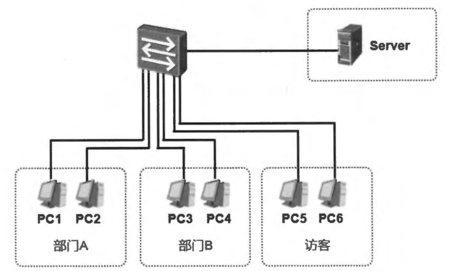
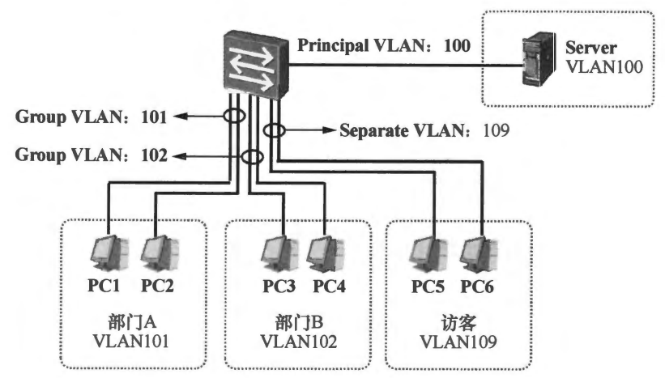
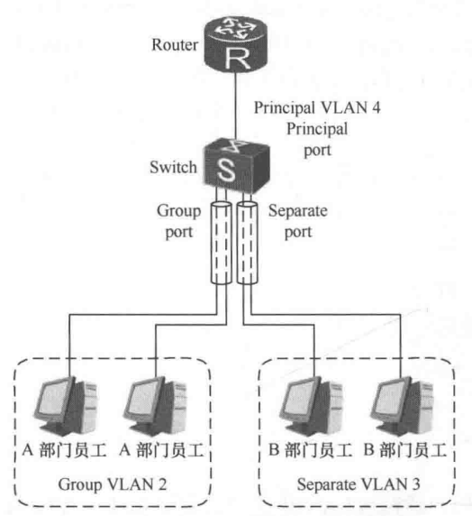
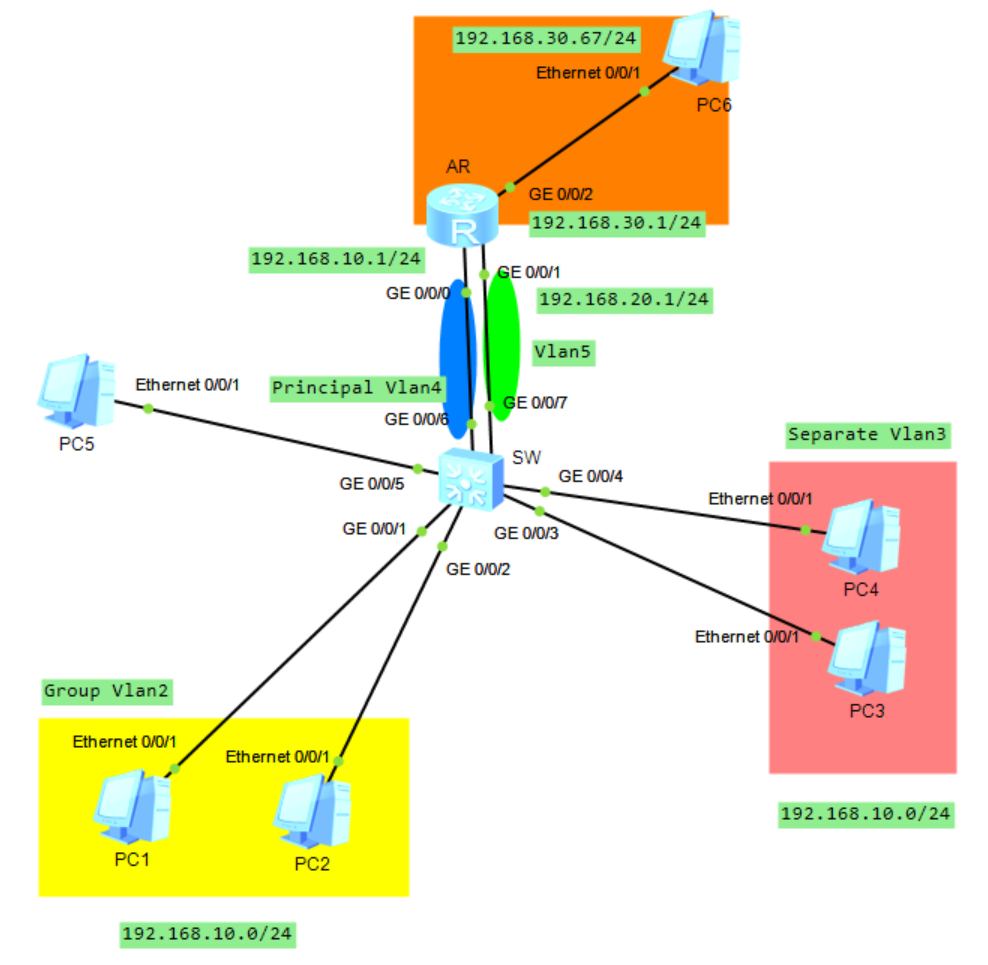
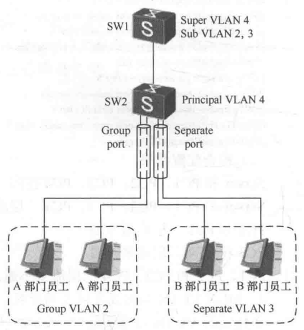
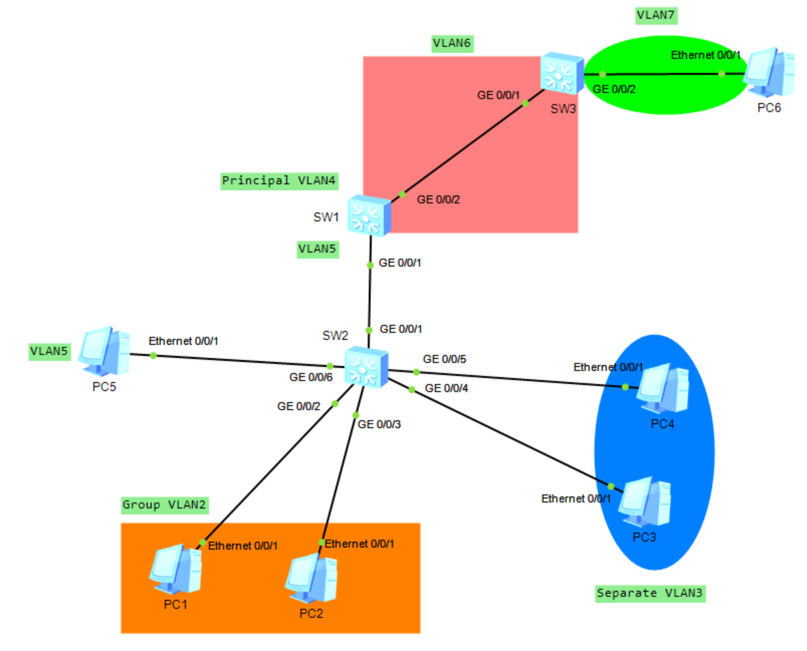

# VLAN 高级技术

## 一、MUX VLAN

在企业建立企业的数据网络时，我们可能经常会遇到各种流量隔离的需求。网络中有时候需要对不同用户进行网络隔离，以增强网络的安全。比如服务器商的 IDC，针对不同的客户托管的服务器需要进行网络隔离，传统的做法是为每个客户分配一个 VLAN。但这样做有很多缺点，比如交换机的 VLAN 数量会受到挑战（华为交换机最多支持 4094 个 VLAN），VLAN 越多，配置和管理也越复杂。

例如下图所示，该企业通过一台二层交换机连接着三个用户群体，分别是部门 A 的用户、部门 B 的用户以及访客，除此之外交换机上还连接着公共服务器（Server）。现在企业的需求是：

- A 部门内的用户之间能够进行二层通信，B 部门同理。但是 A、B 部门的用户之间不能进行二层通信。这个需求可以通过将 A、B 部门划到两个不同的 VLAN 来实现。
- 要求部门 A 以及部门 B 的用户都能访问公共服务器 Server。
- 要求访客区的任意一台 PC 除了能访问 Server 外，不能访问任何其他设备，包括其他访客 PC。

<div align="center">
    
</div>

这是需面对的第一个疑难点。因为部门 A 及部门 B 如果被规划到了不同的 VLAN 中，而这两个 VLAN 现在都要访问 Server，那么 Server 究竟该放置在哪一个 VLAN 呢？如果将 Server 放置在与部门 A 相同的 VLAN 中，那么部门 B 的用户将无法访问到 Server，此时就不得不借助三层设备，例如由路由器来实现 VLAN 间的通信，这就增加了经济成本。

MUX VLAN (Multiplex VLAN) 可以实现上述需求，先介绍 MUX VLAN 的几个基本概念。

- 主 VLAN (Principal VLAN)：加入 Principal VLAN 的接口也即 Principal Port，它们可以和 MUX VLAN 内的所有接口进行通信；
- 从 VLAN (Subordinate VLAN)：Subordinate VLAN 分为两种，一种是互通型 Subordinate VLAN (Group VLAN)，另一种是隔离型 Subordinate VLAN(Separate VLAN)。**<font color="red">每个 Group VLAN 及 Separate VLAN 必须与一个 Principal VLAN 绑定</font>**；

加入 Separate VLAN 的接口也即 Separate Port，Separate Port 只能与 Principal Port 通信，**<font color="red">而无法与其他类型的接口通信，包括同属一个 Separate VLAN 的其他 Separate Port</font>**。

加入 Group VLAN 的接口也即 Group Port，Group Port 可以和 Principal Port 通信，属于同一个 Group VLAN 的用户之间能够进行二层通信，而属于不同 Group VLAN 的用户之间就无法通信了，另外 Group Port 也无法与 Separate Port 通信。

**<font color="red">一个主 VLAN 可关联多个从 VLAN，在关联的从 VLAN 中可以包含多个互通型 VLAN，但只能有一个隔离型 VLAN</font>**。

主 VLAN 和从 VLAN 都能拥有自己的端口，主 VLAN 中的端口称为 Principal Port（主端口），隔离型 VLAN 中的端口称为 Separate Port（隔离端口），互通型 VLAN 中的端口称为 Group Port（组端口）。**<font color="blue">要注意的是，这些端口只能拥有一个 VLAN，而且必须是 `Access` 或 `Hybrid untagged` 类型的，如果某 Trunk 端口或端口上有多个 VLAN，是不能启用 MUX VLAN 功能的</font>**。

>禁止接口 MAC 地址学习功能或限制接口 MAC 地址学习数量将会影响 MUX VLAN 功能的正常使用。
>可以为 Principal VLAN（主 VLAN）创建 VLANIF 接口，不能为 Group VLAN（互通型从 VLAN）和 Separate VLAN（隔离型从 VLAN）创建 VLANIF 接口。
>使能 MUX VLAN 功能的接口不能加入同一个 MUX VLAN 组中的其他 VLAN。
>Access 类型接口只能加入一个 MUX VLAN 组，Trunk、Hybrid 类型接口可以加入多个 MUX VLAN 组，最大可以加入 32 个 MUX VLAN 组。

回到最开始的案例，在该网络中部署 MUX VLAN 即可实现相关需求。如下图所示，交换机创建了四个 VLAN，它们分别是 100、101、102 以及 109，这四个 VLAN 分别给 Server、部门 A、部门 B 以及访客使用。

<div align="center">
    
</div>

现在 VLAN100 被配置为 Principal VLAN，VLAN101 以及 VLAN102 被配置为 Principal VLAN 100 的 Group VLAN，如此一来，A 部门内的用户之间能够进行二层通信，B 部门同理，而这两个部门的用户之间则无法通信，同时由于 VLAN101 及 VLAN102 都是 VLAN100 的 Group VLAN，因此两个部门的用户都能与处于 VLAN100 的 Server 通信。接下来将 VLAN109 配置为 Principal VLAN 100 的 Separate VLAN，如此一来，属于 VLAN109 的访客只能与 Server 通信，而无法与其他任何接口通信，包括 VLAN109 中的其他访客。

## 二、MUX VLAN 实验配置

### 1.MUX VLAN 基础配置

### 2.使用上级路由器/三层接口作为网关

在传统的 VLAN 技术实现中，VLAN 用户通过 VLANIF 接口来实现和其他 VLAN 以及外网之间的三层通信，而华为 Sx7 系列交换在 v2v3 版本之后才新增 Mux VLAN 支持 VLANIF 接口的功能，之前的版本不支持。那么在旧版本交换机上如何让 MUX VLAN 用户能访问到其他网段或外网？这里提供两种网关设置方法。首先是使用上级路由器/三层接口作为网关。

#### 2.1 方法介绍

如下图所示，VLAN2 和 VLAN3 作为 MUX VLAN 的两个二级 VLAN，使用相同的子网。这里的交换机 Switch 只提供二层交换功能，上面的路由器充当三层交换和网关的功能。根据 MUX VLAN 中端口的访问规则，**<font color="red">隔离型 VLAN 和互通型 VLAN 中的端口都可以访问主 VLAN 中的端口，所以只需要将交换机的上联端口加入 MUX VLAN 中的主 VLAN（VLAN 4）成为主端口后，两部门的用户都能访问到网关了</font>**（Separate Vlan 以及 Group Vlan 都可以和 Principal Vlan 通信）。

<div align="center">
    
</div>

上图可以理解为用 MUX-VLAN 在交换机 Switch 上把用户之间的二层邻接切断（Vlan2 和 Vlan3 之间隔离，并且 Vlan3 中不同主机之间也相互隔离），同时又让 Vlan2 与 Vlan3 这两个二级 Vlan 采用同一个 IP 网段、同一个默认网关，通过主 Vlan（Vlan4）的主端口把所有去网关的流量汇聚到上级路由器

VLAN4 是 Principal VLAN（主 VLAN），交换机 Switch 连接上级路由器的上联口被定义为 principal port，也就允许所有二级 VLAN 去访问的出口端口，而 Vlan2 是 Group VLAN，A 部门用户接入口作为 group port，通常允许同组内互通；Vlan3 是 Separate VLAN，B 部门用户接入口作为 separate port，通常相互隔离。**<font color="red">因此实现了用户彼此不要形成直接的二层邻接关系，但用户必须能访问一个共同的网关出口，而这个出口就被集中放在主 VLAN（VLAN4）的主端口上</font>**。

#### 2.2 实验验证

<div align="center">
    
</div>

SW 的配置如下所示：

```java{.line-numbers}
vlan batch 2 to 5
vlan 4
 mux-vlan
 subordinate separate 3
 subordinate group 2
interface GigabitEthernet0/0/1
 port link-type access
 port default vlan 2
 port mux-vlan enable
interface GigabitEthernet0/0/2
 port link-type access
 port default vlan 2
 port mux-vlan enable
interface GigabitEthernet0/0/3
 port link-type access
 port default vlan 3
 port mux-vlan enable
interface GigabitEthernet0/0/4
 port link-type access
 port default vlan 3
 port mux-vlan enable
interface GigabitEthernet0/0/5
 port link-type access
 port default vlan 5
interface GigabitEthernet0/0/6
 port link-type access
 port default vlan 4
 port mux-vlan enable
interface GigabitEthernet0/0/7
 port link-type access
 port default vlan 5
```

AR 的完整配置如下所示：

```java{.line-numbers}
interface GigabitEthernet0/0/0
 ip address 192.168.10.1 255.255.255.0 
interface GigabitEthernet0/0/1
 ip address 192.168.20.1 255.255.255.0 
interface GigabitEthernet0/0/2
 ip address 192.168.30.1 255.255.255.0 
```

PC1-PC6 的配置如下所示：

```java{.line-numbers}
PC1：ip 192.168.10.11 255.255.255.0 192.168.10.1
PC2：ip 192.168.10.12 255.255.255.0 192.168.10.1
PC3：ip 192.168.10.21 255.255.255.0 192.168.10.1
PC4：ip 192.168.10.22 255.255.255.0 192.168.10.1
PC5：ip 192.168.20.31 255.255.255.0 192.168.20.1
PC6：ip 192.168.30.67 255.255.255.0 192.168.30.1
```

理解上述拓扑图的关键点就在不同 VLAN 怎么还能共用同一个网关这一步。正常的 VLAN 行为是主机 PC1 发 ARP 广播找网关 MAC，这个广播只能在本 VLAN2 内扩散，根本到不了 Vlan3/Vlan4，更到不了 VLAN4 上的主端口。但 MUX-VLAN 的访问规则打破了这个限制，**<font color="red">二级 VLAN（VLAN2/VLAN3）的端口被允许访问主 VLAN（VLAN4）的主端口，于是当 VLAN2/VLAN3 的主机为了出网而 ARP 询问网关 **`192.168.10.1`** 时，交换机 SW 并不会把这个找网关的 ARP 只限制在 VLAN2 或 VLAN3 内部，而是会把与去往主端口/主 VLAN 相关的流量引导到 principal port 上</font>**，让路由器能够收到并回复。之后主机学到网关 MAC，就把所有需要交给网关处理的流量都发往网关 MAC，交换机 SW 继续按 MUX-VLAN 规则把这些帧送到主端口，上级路由器再完成三层转发。

最后验证的结果如下：

- PC1 可以访问 PC2、PC5、PC6、网关，但是访问不了 Separate Vlan3；
- PC3 可以访问 PC5、PC6、网关，但是访问不了 Separate Vlan3 中其他主机以及 Group Vlan；
- PC5 可以访问网关以及 PC1-PC6；
- PC6 可以访问网关以及 PC1-PC5；

接下来解释一下，当 PC1 ping PC3 时，arp 数据包是否传送到 AR。首先在 AR 上开调试（实验环境用）：

```java{.line-numbers}
<AR> terminal monitor
<AR> terminal debugging
<AR> debugging arp packet
```

然后在 PC1 上 ping PC3，此时 AR 上出现如下日志，PC1(192.168.10.11) 发出的 ARP 广播确实到达了 AR，只是 AR 没把它写进 ARP 表，所以用 display arp 看不到 PC1 的映射。

```java{.line-numbers}
[Huawei]
Jan 11 2026 12:53:16.722.1-08:00 Huawei ARP/7/arp_rcv:Receive an ARP Packet, ope
ration : 256, sender_eth_addr : 5489-9834-1e5e, sender_ip_addr : 11.10.168.192, 
target_eth_addr : ffff-ffff-ffff, target_ip_addr : 21.10.168.192
[Huawei]
Jan 11 2026 12:53:17.722.1-08:00 Huawei ARP/7/arp_rcv:Receive an ARP Packet, ope
ration : 256, sender_eth_addr : 5489-9834-1e5e, sender_ip_addr : 11.10.168.192, 
target_eth_addr : ffff-ffff-ffff, target_ip_addr : 21.10.168.192
[Huawei]
Jan 11 2026 12:53:18.722.1-08:00 Huawei ARP/7/arp_rcv:Receive an ARP Packet, ope
ration : 256, sender_eth_addr : 5489-9834-1e5e, sender_ip_addr : 11.10.168.192, 
target_eth_addr : ffff-ffff-ffff, target_ip_addr : 21.10.168.192
[Huawei]
Jan 11 2026 12:53:19.712.1-08:00 Huawei ARP/7/arp_rcv:Receive an ARP Packet, ope
ration : 256, sender_eth_addr : 5489-9834-1e5e, sender_ip_addr : 11.10.168.192, 
target_eth_addr : ffff-ffff-ffff, target_ip_addr : 21.10.168.192
[Huawei]
Jan 11 2026 12:53:20.722.1-08:00 Huawei ARP/7/arp_rcv:Receive an ARP Packet, ope
ration : 256, sender_eth_addr : 5489-9834-1e5e, sender_ip_addr : 11.10.168.192, 
target_eth_addr : ffff-ffff-ffff, target_ip_addr : 21.10.168.192
[Huawei]display arp
IP ADDRESS      MAC ADDRESS     EXPIRE(M) TYPE        INTERFACE   VPN-INSTANCE 
                                          VLAN/CEVLAN PVC                      
------------------------------------------------------------------------------
192.168.10.1    00e0-fc16-60fa            I -         GE0/0/0
192.168.20.1    00e0-fc16-60fb            I -         GE0/0/1
192.168.30.1    00e0-fc16-60fc            I -         GE0/0/2
------------------------------------------------------------------------------
Total:3         Dynamic:0       Static:0     Interface:3   
```

### 3.在上级交换机使用 VLAN 聚合技术作为网关

#### 3.1 方法介绍

如下图所示的上级路由器换成一台三层交换机，并且该三层交换机的物理接口不支持三层功能。交换机 SW2 部署了 MUX-VLAN，VLAN4 是 **`Principal VLAN`**，VLAN2 和 VLAN3 分别是 **`Group VLAN`** 和 **`Separate VLAN`**。**<font color="red">为节省 IP 地址资源，VLAN2 和 VLAN3 共享一个子网和网关</font>**，因为 MUX VLAN 无法创建 VLANIF 接口（指的是无法在 SW2 上创建 VLANIF2 和 VLANIF3），**<font color="red">所以可以在 SW1 上使用 VLAN 聚合技术，将 VLAN4 配置成 Super-VLAN，而将 VLAN2 和 VLAN3 配置成 Sub-VLAN，为 VLAN4 创建 VLANIF 接口并配置 IP 地址，该接口作为底下 VLAN2 和 VLAN3 用户的网关</font>**。交换机 SW1 和 SW2 之间的链路要同时允许 VLAN2 和 VLAN3 通过。

<div align="center">
    
</div>

使用该方案不仅能够让 Mux-VLAN 用户访问到外网，还可以让不同的 Mux-VLAN 之间互通。**但是使用该方案要注意的一个问题就是在交换机 SW2 的上联接口无法使能 Mux-VLAN 功能，因为该接口允许了多个 VLAN 通过**。如果这时在 SW1 上将 VLAN4 的 VLANIF 接口的 ARP 代理功能开启，会导致两个部门之间可以相互通信，这与起初部署 MUX-VLAN 的目的不相符。

下面解释一下这么做的原因，首先我们想实现的是两拨用户（VLAN2/VLAN3）地址规划上使用同一个网段、默认网关也是同一个 IP。因此首先，我的目标是让 VLAN2 和 VLAN3 的终端都使用同一个子网（比如都在 192.168.10.0/24）并指向同一个默认网关（比如 192.168.10.1），**<font color="red">这通常意味着必须有一个三层接口持有这个网关 IP</font>**，因为网关本质上就是一个三层转发点，终端把发往外部或需要三层处理的流量交给它，它再负责路由转发。**<font color="red">所以网关必须配置在某个能配置 IP 的三层接口上</font>**。

接着问题来了，首先在 MUX-VLAN 场景里，VLAN2/VLAN3 只是从 VLAN，它们的作用是做二层隔离，在华为的交换机实现里从 VLAN（Separate VLAN 和 Group VLAN），不允许创建 VLANIF，即不能直接在 VLAN2 或 VLAN3 上建 **`Vlanif2/Vlanif3`** 并配置网关 IP，所以只能使用 Vlanif4 作为网关。同时，由于 SW1 作为一个三层交换机，它的物理口不支持三层路由口形态（不能把物理口切成 routed port，也不能在物理口上直接 ip 地址），它只能以二层 switchport 的方式工作，三层能力只能通过 VLANIF 来体现。

**<font color="red">因此就需要一个既能建 VLANIF、又能让 VLAN2/VLAN3 的用户共享它的承载体，这就是 VLAN 聚合</font>**。VLAN 聚合的思路是把一个 VLAN（这里选 VLAN4）配置为 Super VLAN，允许在它上面创建 Vlanif4 并配置网关 IP（例如 **`192.168.10.1/24`**），同时把 VLAN2 和 VLAN3 配置为 Sub VLAN，让它们在二层仍然保持各自独立的 VLAN 身份（用户接入口依旧分在 VLAN2 或 VLAN3，MUX-VLAN 的二层隔离规则仍在 SW2 上生效），但在三层意义上挂靠到 Super VLAN 的网关接口上使用同一个网关和同一网段。这样做的结果是 SW1 通过 Vlanif4 成为 VLAN2/VLAN3 共同的三层出口点。

>需要注意的是，既然使用 VLAN 聚合实现网关的功能只能在 SW1 上实现，但是无法在 SW2 上实现。也就是无法在 SW2 上实现把 VLAN4 做 Super VLAN（同时配置 Vlanif4）、VLAN2/3 做 Sub VLAN。首先第一个原因是，我们的前提条件是华为旧版本交换机 MUX-VLAN 不支持 VLANIF，因此在 SW2 上将 VLAN4 配置成 Principal 接口后，就无法在 SW2 上用 Vlanif4 承载网关 IP；第二个原因是如果指定 VLAN 已经用于 Principal VLAN、Group VLAN 和 Separate VLAN，那么此 VLAN 就不能再用于 Super-VLAN、Sub-VLAN 的配置中使用。**<font color="red">所以根据以上两个原因，SW2 只负责 MUX-VLAN，SW1 只负责 VLAN 聚合和三层网关（Vlanif）</font>**。

上述思维链总结为：

```java{.line-numbers}
SW2 配置 vlan4 为 mux-vlan -> SW2 上无法配置 Vlanif4（前提以及华为交换机限制）
                           -> SW2 上无法配置 Vlanif2/Vlanif3（mux-vlan 中的从 vlan 无法配置为 Vlanif）
                           -> 只能在 SW1 配置一个三层接口作为网关
                           -> SW1 的物理接口不支持三层功能
                           -> SW1 上只能通过配置 Vlanif 来实现三层接口同时作为网关
                           -> 使用 VLAN 聚合来实现 Vlanif 的网关配置以及 VLAN2/VLAN3 对其的共享
```

#### 3.2 实验验证

<div align="center">
    
</div>

如上所示，SW2 做 MUX-VLAN，其中 VLAN4 为 Principal，VLAN2 为 Group Vlan，VLAN3 为 Separate Vlan。SW1 用 VLAN 聚合造三层锚点，VLAN4 做 Super VLAN，VLAN2（PC1 和 PC2）和 VLAN3（PC3 和 PC4）做 Sub VLAN，在 Vlanif4 上配 **`192.168.10.1/24`** 给 A/B 共用网关与网段。Super VLAN 不接物理口，只建 Vlanif。PC5 属于普通 VLAN5，网关放 SW1 的 Vlanif5。SW1 到 SW3 之间使用 VLAN6 做三层互联，并且配置 Vlanif6。PC6 属于普通 VLAN7，网关放 SW3 的 Vlanif7。

实验 IP 配置规划如下所示：

```java{.line-numbers}
PC1：192.168.10.11/24 Gate-Way 192.168.10.1
PC2：192.168.10.12/24 Gate-Way 192.168.10.1
PC3：192.168.10.21/24 Gate-Way 192.168.10.1
PC4：192.168.10.22/24 Gate-Way 192.168.10.1
PC5：192.168.20.10/24 Gate-Way 192.168.20.1
PC6：192.168.40.10/24 Gate-Way 192.168.40.1
SW1 Vlanif6：10.0.6.1/30
SW1 Vlanif5：192.168.20.1/24
SW1 Vlanif4：192.168.10.1/24
SW3 Vlanif6：10.0.6.2/30
SW3 Vlanif7：192.168.40.1/24
```

SW2 的完整配置如下，在 vlan4 视图下执行 mux-vlan，那个 VLAN 就被定义为 Principal VLAN。但是 SW2 中没有任何端口属于 VLAN4（Principal 端口），同时在 SW1 上只是做 Vlanif4 以及 Super/Sub Vlan 配置，**<font color="red">这就导致 SW2 的 Principal VLAN4 在配置层面存在，但在转发层面并不承载流量，它更像是为了建立 MUX 关系而存在的逻辑主 VLAN</font>**。

```java{.line-numbers}
vlan batch 2 to 5
vlan 4
 mux-vlan
 subordinate separate 3
 subordinate group 2
# 因为 G0/0/1 允许多个 VLAN 帧通过，属于 trunk 口，不允许设置 mux-vlan
interface GigabitEthernet0/0/1
 port link-type trunk
 port trunk allow-pass vlan 2 to 3 5
interface GigabitEthernet0/0/2
 port link-type access
 port default vlan 2
 port mux-vlan enable
interface GigabitEthernet0/0/3
 port link-type access
 port default vlan 2
 port mux-vlan enable
interface GigabitEthernet0/0/4
 port link-type access
 port default vlan 3
 port mux-vlan enable
interface GigabitEthernet0/0/5
 port link-type access
 port default vlan 3
 port mux-vlan enable
interface GigabitEthernet0/0/6
 port link-type access
 port default vlan 5
```

SW1 的完整配置如下：

```java{.line-numbers}
vlan batch 2 to 6
vlan 4
 aggregate-vlan
 access-vlan 2 to 3
interface Vlanif4
 ip address 192.168.10.1 255.255.255.0 
interface Vlanif5
 ip address 192.168.20.1 255.255.255.0 
interface Vlanif6
 ip address 10.0.6.1 255.255.255.0 
interface GigabitEthernet0/0/1
 port link-type trunk
 port trunk allow-pass vlan 2 to 3 5
interface GigabitEthernet0/0/2
 port link-type access
 port default vlan 6
ip route-static 192.168.40.0 255.255.255.0 10.0.6.2
```

SW3 的完整配置如下：

```java{.line-numbers}
vlan batch 6 to 7
interface Vlanif6
 ip address 10.0.6.2 255.255.255.0 
interface Vlanif7
 ip address 192.168.40.1 255.255.255.0 
interface GigabitEthernet0/0/1
 port link-type access
 port default vlan 6
interface GigabitEthernet0/0/2
 port link-type access
 port default vlan 7
# 让 PC6 能够访问 PC1-PC5
ip route-static 192.168.10.0 255.255.255.0 10.0.6.1
ip route-static 192.168.20.0 255.255.255.0 10.0.6.1
```

验证结果如下：

- PC1 可以访问网关 Vlanif4，访问 PC6，访问 PC2 以及 PC5，但是无法访问 PC3-PC4；
- PC3 可以访问网关 Vlnaif4，访问 PC6，访问 PC5，但是访问不了 PC1、PC2、PC4；
- PC5 可以访问网关 Vlanif5，访问 PC1-PC6；
- PC6 可以访问网关 Vlanif6，可以访问 PC1-PC5；

SW1 上的各种表如下：

```java{.line-numbers}
[Huawei]display arp
IP ADDRESS      MAC ADDRESS     EXPIRE(M) TYPE INTERFACE      VPN-INSTANCE      
                                          VLAN 
------------------------------------------------------------------------------
192.168.10.1    4c1f-cce8-6e66            I -  Vlanif4
192.168.10.11   5489-98e5-1449  17        D-0  GE0/0/1
                                          2
192.168.10.22   5489-983d-6e19  20        D-0  GE0/0/1
                                          3
192.168.10.12   5489-9810-4f43  17        D-0  GE0/0/1
                                          2
192.168.10.21   5489-982e-3ddc  17        D-0  GE0/0/1
                                          3
192.168.20.1    4c1f-cce8-6e66            I -  Vlanif5
192.168.20.10   5489-98a8-16c5  17        D-0  GE0/0/1
                                          5
10.0.6.1        4c1f-cce8-6e66            I -  Vlanif6
10.0.6.2        4c1f-ccf9-23f2  20        D-0  GE0/0/2
                                          6
------------------------------------------------------------------------------
Total:9         Dynamic:6       Static:0     Interface:3 
[Huawei]display super-vlan 
VLAN ID   Sub-vlan        
--------------------------------------------------------------------------------
4         2-3 
[Huawei]display ip routing-table 
Route Flags: R - relay, D - download to fib
------------------------------------------------------------------------------
Routing Tables: Public
         Destinations : 9        Routes : 9        
Destination/Mask    Proto   Pre  Cost      Flags NextHop         Interface
       10.0.6.0/24  Direct  0    0           D   10.0.6.1        Vlanif6
       10.0.6.1/32  Direct  0    0           D   127.0.0.1       Vlanif6
      127.0.0.0/8   Direct  0    0           D   127.0.0.1       InLoopBack0
      127.0.0.1/32  Direct  0    0           D   127.0.0.1       InLoopBack0
   192.168.10.0/24  Direct  0    0           D   192.168.10.1    Vlanif4
   192.168.10.1/32  Direct  0    0           D   127.0.0.1       Vlanif4
   192.168.20.0/24  Direct  0    0           D   192.168.20.1    Vlanif5
   192.168.20.1/32  Direct  0    0           D   127.0.0.1       Vlanif5
   192.168.40.0/24  Static  60   0          RD   10.0.6.2        Vlanif6
```

PC5 访问 PC1 的过程为：PC5（**`192.168.20.10/24`**）要访问 PC1（**`192.168.10.11/24`**）时先判断目的地址不在本地网段，于是把报文交给默认网关 **`192.168.20.1`**（SW1 的 Vlanif5）。若 PC5 本地没有网关的 MAC 缓存，就会在 VLAN5 内广播 ARP 请求解析 **`192.168.20.1`** 的 MAC，SW2 在 VLAN5 内泛洪并通过上联 Trunk（携带 VLAN5 tag）转发给 SW1，SW1 用 Vlanif5 回 ARP，PC5 学到网关 MAC 后把真正的业务报文发出，IP 目的仍是 **`192.168.10.11`**，但二层目的 MAC 是网关 MAC，帧从 PC5 的 access VLAN5 口进入 SW2，再由 SW2 在 Trunk 上打 VLAN5 tag 送到 SW1。

SW1 收到后进行三层转发，查路由表发现 **`192.168.10.0/24`** 为直连网段（走 Vlanif4），如果 SW1 还不知道 PC1 的 MAC，就在对应的 Sub VLAN（VLAN2/VLAN3）里发 ARP 解析 **`192.168.10.11`**，PC1 回复后 SW1 得到 MAC 并把报文以 VLAN2 发回 SW2（Trunk 上带 VLAN2 tag），最后 SW2 在 VLAN2 内查表转发到 PC1 的 access 口，去掉 VLAN tag 后 PC1 收到并处理该报文。