# Eth-Trunk 协议

## 1.Eth-Trunk 技术简介

随着网络规模不断扩大，用户对骨干链路的带宽和可靠性提出越来越高的要求。在传统技术中，常用更换高速率的单板或更换支持高速率单板的设备的方式来增加带宽，但这种方案需要付出高额的费用，而且不够灵活。

Eth-Trunk 又叫以太网链路聚合，**它通过将多条以太网物理链路捆绑在一起成为一条逻辑链路，从而实现增加链路带宽的目的**。同时，这些捆绑在一起的链路通过相互间的动态备份，可以有效地提高链路的可靠性。

Eth-Trunk主要有以下三个优势：

- **增加带宽**：链路聚合接口的最大带宽可以达到各成员接口带宽之和。
- **提高可靠性**：当某条活动链路出现故障时，流量可以切换到其他可用的成员链路上，从而提高链路聚合接口的可靠性。
- **负载分担**：在一个链路聚合组内，可以实现在各成员活动链路上的负载分担。

在一个链路聚合组内，可以实现在各成员活动链路上的负载分担。

## 2.Eth-Trunk 技术原理

如下图 1 所示，DeviceA 与 DeviceB 之间通过三条以太网物理链路相连，将这三条链路捆绑在一起，就成为了一条逻辑链路，**这条逻辑链路的最大带宽等于原先三条以太网物理链路的带宽总和，从而达到了增加链路带宽的目的**；同时，这三条以太网物理链路相互备份，当某条活动链路出现故障时，流量可以切换到其他可用的成员链路上，有效地提高了链路的可靠性。

    
图 1 Eth-Trunk 示意图

    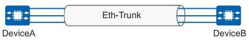

下面介绍Eth-Trunk的一些基本概念。

### 2.1 链路聚合组和链路聚合接口

如图 2 所示，链路聚合组 LAG（Link Aggregation Group）是指将若干条以太链路捆绑在一起所形成的逻辑链路，也称为 Eth-Trunk 链路。**每个聚合组唯一对应着一个逻辑接口，这个逻辑接口称之为链路聚合接口或 Eth-Trunk 接口**。Eth-Trunk 接口可以作为普通的以太网接口来使用，实现各种路由协议以及其他业务。与普通以太网接口的差别在于：**转发的时候链路聚合组需要从成员接口中选择一个或多个接口来进行数据转发**。

### 2.2 成员接口和成员链路

如图 2 所示，组成 Eth-Trunk 接口的各个物理接口称为成员接口。成员接口对应的链路称为成员链路。

    
图 2 链路聚合组与链路聚合接口、成员接口和成员链路的关系示意图

    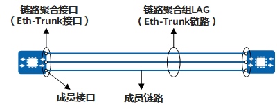

### 2.3 活动接口和非活动接口、活动链路和非活动链路

Eth-Trunk 接口的成员接口存在活动接口和非活动接口两种。**转发数据的接口称为活动接口，不转发数据的接口称为非活动接口**。活动接口对应的链路称为活动链路，非活动接口对应的链路称为非活动链路。

### 2.4 活动接口数上限阈值

设置活动接口数上限阈值的目的是在保证带宽的情况下提高网络的可靠性。**当活动接口数目达到上限阈值时，再向 Eth-Trunk 接口中添加成员接口，不会增加 Eth-Trunk 活动接口的数目，超过上限阈值的链路状态将被置为 Down，作为备份链路**。

例如，有 8 条无故障链路在一个 Eth-Trunk 接口内，每条链路都能提供 1G 的带宽，现在最多需要 5G 的带宽，那么上限阈值就可以设为 5 或者更大的值。其他的链路就自动进入备份状态以提高网络的可靠性。手工模式链路聚合不支持活动接口数上限阈值的配置。

### 2.5 活动接口下限阈值

设置活动接口数下限阈值是为了保证最小带宽，当活动链路数目小于下限阈值时，Eth-Trunk 接口的状态转为 Down。在多链路冗余场景下，可以通过设置活动接口数下限阈值，保证主链路带宽不够的情况下切换至备用链路。

比如假设主链路是一个 **`4×10G`** 的 Eth-Trunk，而用户的业务要求主链路至少要有 30G 才算够用，那就可以把下限阈值设成 3。还剩 4 条或 3 条成员链路时，Eth-Trunk 继续保持 Up。一旦只剩 2 条，虽然物理上还有 20G，并不是完全断了，**但因为 eth-trunk 的链路带宽已经低于用户所需的最小带宽要求，设备会把整个 Eth-Trunk 逻辑接口判定为 Down**。这样一来，任何依赖接口状态来做主备选择的上层机制，就会把这条主链路视为不可用，从而转去备用链路。

### 2.6 链路聚合模式

根据是否启用链路聚合控制协议 LACP（Link Aggregation Control Protocol），链路聚合的模式分为手工模式和 LACP 模式。

## 3.LACP 模式 Eth-Trunk

LACP 模式 Eth-Trunk，**Eth-Trunk 的建立、成员接口的加入也需要手工配置**，最大的区别就是链路聚合控制协议 LACP 的参与。

作为链路聚合技术，手工模式 Eth-Trunk 可以实现多个物理接口聚合成一个 Eth-Trunk 接口来提高带宽，同时能够检测到同一聚合组内的成员链路有断路等有限故障，但是无法检测到链路层故障、链路错连等故障。

也就是说手工模式 Eth-Trunk 能够基于成员接口的物理状态变化，感知链路断开、光信号中断、接口物理 Down 等物理层故障。**但由于其不具备 LACP 协商与状态通告机制，无法进一步校验该物理 UP 的链路是否连接到正确对端、是否与对端处于同一聚合组等问题**。因此，对于接口物理状态正常，但链路在二层逻辑上已经异常的场景，例如链路错连、对端聚合配置不一致、成员链路未真正加入同一聚合组等，手工模式 Eth-Trunk 通常无法有效识别。

为了提高 Eth-Trunk 的容错性，同时能提供备份功能，保证成员链路的高可靠性，出现了链路聚合控制协议 LACP（Link Aggregation Control Protocol）。LACP 是基于 IEEE802.3ad 标准的一种实现链路动态聚合与解聚合的协议，**以供设备根据自身配置自动形成聚合链路并启动聚合链路收发数据**，LACP 模式就是采用 LACP 的一种链路聚合模式。聚合链路形成以后，LACP 负责维护链路状态，在聚合条件发生变化时，自动调整链路聚合。

如下图 3 所示，DeviceA 与 DeviceB 之间创建 Eth-Trunk，需要将 DeviceA 上的四个接口与 DeviceB 捆绑成一个 Eth-Trunk。由于错将 DeviceA 上的一个接口与 DeviceC 相连，这将会导致 DeviceA 向 DeviceB 传输数据时可能会将本应该发到 DeviceB 的数据发送到 DeviceC 上。而手工模式的 Eth-Trunk 不能及时检测到此故障。

    
图 3 Eth-Trunk 错连示意图

    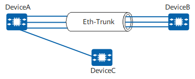

如果在 DeviceA 和 DeviceB 上都启用 LACP 协议，经过协商后，Eth-Trunk 就会选择正确连接的链路作为活动链路来转发数据，从而 DeviceA 发送的数据能够正确到达 DeviceB。

### 3.1 LACP 模式下 Eth-Trunk 建立过程

LACP 通过链路聚合控制协议数据单元 LACPDU（Link Aggregation Control Protocol Data Unit）与对端交互信息。在 LACP 模式的 Eth-Trunk 中加入成员接口后，这些接口将通过发送 LACPDU **向对端通告自己的系统优先级、MAC 地址、接口优先级、接口号和操作 Key（用来判断各接口相连对端是否在同一聚合组以及各接口带宽是否一致等）** 等信息。对端接收到这些信息后，将这些信息与自身接口所保存的信息比较，用以选择能够聚合的接口，双方对哪些接口能够成为活动接口达成一致，确定活动链路。

当设备上的各个本地成员接口收到对端发送的 LACPDU 后，会分别记录对端通告的关键信息。随后，设备会对不同本地接口所学习到的这些对端信息进行比较。如果多条链路对应的是同一个对端系统，并且操作 Key 等聚合条件保持一致，那么这些链路就可以被认为属于同一个聚合对象。相反，如果某条链路学习到的对端信息与其他链路不一致，例如实际连接到了另一台设备，或者对应的是不同的聚合组，那么这条链路就不会被视为可聚合成员。

LACP 模式中，系统 LACP 优先级和接口 LACP 优先级是两个重要的参数，直接影响链路聚合主动端和活动接口的选择。

- 系统 LACP 优先级：系统 LACP 优先级是为了区分两端设备优先级的高低而配置的参数。LACP 模式下，两端设备所选择的活动接口必须保持一致，否则链路聚合组就无法建立。**此时可以使其中一端具有更高的优先级，另一端根据高优先级的一端来选择活动接口即可**。系统 LACP 优先级值越小优先级越高。
- 接口 LACP 优先级：接口 LACP 优先级是为了区别同一个 Eth-Trunk 接口中的不同成员接口被选为活动接口的优先程度，**优先级高的接口将优先被选为活动接口**。接口 LACP 优先级值越小，优先级越高。

Eth-trunk 建立的过程可以分为两个步骤：

- **第一个层面是聚合组成员资格判定**，也就是判断这些链路是否连接到了同一个对端，是否属于同一个聚合组，以及相关属性是否一致，从而确定它们是否可以聚合。
- **第二个层面是确定主动端和活动链路**，也就是在已经满足聚合条件的链路中，进一步确定哪些链路作为活动接口参与实际转发和负载分担，哪些链路暂时处于备用状态。

#### 3.1.1 聚合组成员资格判定

在 LACP 模式的 Eth-Trunk 中加入成员接口后，两端互相发送 LACPDU 报文。如下图 4 所示，在 DeviceA 和 DeviceB 上创建 Eth-Trunk 并配置为 LACP 模式，然后向 Eth-Trunk 中手工加入成员接口。此时成员接口上便启用了 LACP 协议，两端互发 LACPDU 报文。

    
图 4 LACP 模式 Eth-Trunk 互发 LACPDU

    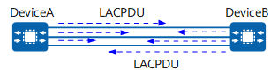

#### 3.1.2 确定主动端和活动链路选择

如下图 5 所示，两端设备均会收到对端发来的 LACPDU 报文。以 DeviceB 为例，当 DeviceB 收到 DeviceA 发送的报文时，DeviceB 会查看并记录对端信息，然后比较系统优先级字段，如果 DeviceA 的系统优先级高于本端的系统优先级，则确定 DeviceA 为 LACP 主动端。如果 DeviceA 和 DeviceB 的系统优先级相同，比较两端设备的 MAC 地址，MAC 地址小的一端为 LACP 主动端。

    
图 5 LACP 模式 Eth-Trunk 确定主动端和活动链路

    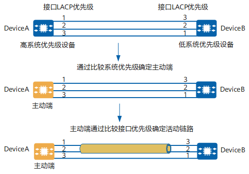

**选出主动端后，两端都会以主动端的接口优先级来选择活动接口**，如果主动端的接口优先级都相同则选择接口编号比较小的为活动接口。两端设备选择了一致的活动接口后，活动链路组便可以建立起来，这些活动链路以负载分担的方式转发数据。

### 3.2 LACP 抢占

如下图 6 所示，接口 Port1、Port2 和 Port3 为 Eth-Trunk 的成员接口，DeviceA 为主动端，活动接口数上限阈值为 2，三个接口的 LACP 优先级分别为 10、20、30。当通过 LACP 协议协商完毕后，接口 Port1 和 Port2 因为优先级较高被选作活动接口，Port3 成为备份接口。

    
图 6 LACP 抢占场景

    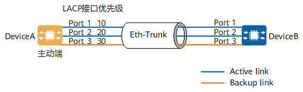

使能 LACP 抢占功能后，聚合组会始终保持高优先级的接口作为活动接口的状态。以下两种情况需要使能 LACP 抢占功能：

- **故障恢复触发的抢占**：Port1 接口出现故障而后又恢复了正常。当接口 Port1 出现故障时被 Port3 所取代，**如果 Eth-Trunk 接口未使能 LACP 抢占功能，则故障恢复时 Port1 将处于备份状态**。如果使能了 LACP 抢占功能，当 Port1 故障恢复时，**由于接口优先级比 Port3 高，Port1 将重新成为活动接口，Port3 再次成为备份接口**。
- **备份口优先级变高触发的抢占**：如果希望 Port3 接口替换 Port1、Port2 中的一个接口成为活动接口，可以使能 LACP 抢占功能，并配置 Port3 的接口 LACP 优先级较高。**如果没有使能 LACP 抢占功能，即使将备份接口的优先级调整为高于当前活动接口的优先级，系统也不会重新选择活动接口**。

### 3.3 LACP 模式的抢占延时

抢占延时是 LACP 抢占发生时，**处于备用状态的链路将会等待一段时间后再切换到转发状态**。配置抢占延时是为了避免由于某些链路状态频繁变化而导致 Eth-Trunk 数据传输不稳定的情况。如图 6 所示，Port1 由于链路故障切换为非活动接口，此后该链路又恢复了正常。若系统使能了 LACP 抢占功能并配置了抢占延时，Port1 重新切换回活动状态就需要经过抢占延时的时间。

>当链路两端设备配置的抢占等待时间不一致时，以等待时间最长的作为实际抢占等待时间。

### 3.4 活动链路与非活动链路切换

LACP 模式 Eth-Trunk 两端设备中任何一端检测到以下事件，都会触发聚合组的链路切换：

- 链路 Down 事件；
- LACP 协议发现链路故障；
- 接口不可用；
- 在使能了 LACP 抢占功能的前提下，更改备份接口的优先级高于当前活动接口的优先级；

在以上故障场景中，可以按照如下步骤进行切换：

- 关闭故障链路；
- 从备份链路中选择优先级最高的链路接替活动链路中的故障链路；
- 优先级最高的备份链路转为活动状态并转发数据，完成切换；

### 3.5 LACP 模式实现方式

链路聚合协议 LACP 分为静态 LACP 模式和动态 LACP 模式，其特点如下。

#### 3.5.1 静态 LACP 模式

如图 7 所示，两台直接相连的设备都支持 LACP 协议，在两台设备上配置静态 LACP 模式 Eth-Trunk 接口，实现流量的负载分担与链路的冗余备份。静态 LACP 模式应用场景比较广泛，**在向用户提供备份链路的同时，又提供一定的故障保护能力。当有一条链路出现故障时，系统能够自动选择一条优先级最高的可用备份链路变为活动链路**。

    
图 7 静态 LACP 模式 Eth-Trunk 接口示意图

    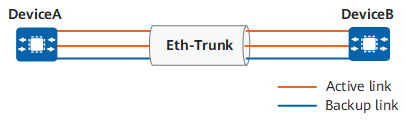

#### 3.5.2 动态 LACP 模式

静态 LACP 模式和动态 LACP 模式在 LACP 协议交互方面没有区别，区别在于两种模式在 LACP 协商失败后的处理不一致：

- **静态 LACP 模式**：当两端设备的 LACP 协商失败时，**系统会将 Eth-Trunk 接口置为 Down 状态**，无法转发数据。
- **动态 LACP 模式**：当两端设备的 LACP 协商失败时，**Eth-Trunk 接口变为 Down 状态，但其成员接口继承 Eth-Trunk 的 VLAN 属性状态变为 Indep，可独立进行二层数据转发**。

动态和静态 LACP 模式的区别是静态 LACP 协商失败时，设备把整条链路当成聚合未建立，因此逻辑口直接不可用。动态 LACP 协商失败时，虽然逻辑聚合口同样未建立成功，但设备允许成员口以单独的状态继承 Eth-Trunk 的二层属性，临时按独立物理口继续进行二层转发。

当部署动态 LACP 模式 Eth-Trunk 接口的设备能够收到对端的 LACP 协议报文时，两端设备将通过 LACP 协议报文进行聚合参数协商。协商成功后的聚合链路功能与两端都配置为静态 LACP 模式 Eth-Trunk 接口的链路一样。动态 LACP 模式下的 Eth-Trunk 通常应用于设备和服务器直连的场景，如图 8 所示，服务器 A 需要通过 DeviceA 从文件服务器 B 获取配置文件。

- 当服务器 A 重启后为空配置时，LACP 协商失败，此时动态 LACP 协议可保证服务器 A 通过 Eth-Trunk 成员接口从文件服务器 B 获取到配置文件。
- 当 DeviceA 收到服务器 A 的 LACP 协议报文时，服务器 A 和 DeviceA 将通过 LACP 协议报文进行聚合参数协商。

    
图 8 动态 LACP 模式 Eth-Trunk 接口示意图

    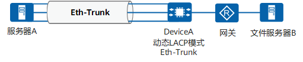

>动态 LACP 模式 Eth-Trunk 仅用于华为公司设备与服务器互连的场景。**其他场景下，建议部署静态 LACP 模式 Eth-Trunk，如果部署动态 LACP，则网络会有成环风险**。

#### 3.5.3 手工模式 eth-trunk

手工模式 Eth-Trunk，**Eth-Trunk 的建立、成员接口的加入由手工配置，没有链路聚合控制协议 LACP 的参与**。如果某条活动链路故障，链路聚合组自动在剩余的活动链路中平均分担流量。当需要在两个直连设备之间提供一个较大的链路带宽，而其中一端或两端设备都不支持 LACP 协议时，可以配置手工模式 Eth-Trunk。

如图 9 所示，DeviceA 与 DeviceB 之间创建 Eth-Trunk，手工模式下三条活动链路都参与数据转发并分担流量。当一条链路故障时，故障链路无法转发数据，链路聚合组自动在剩余的两条活动链路中分担流量。

    
图 9 手工模式Eth-Trunk

    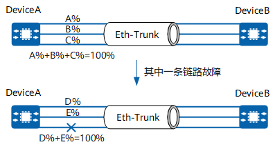

## 4.Eth-Trunk 负载均衡

### 4.1 逐流负载分担下的数据流转发机制

在使用 Eth-Trunk 转发数据时，由于 Eth-Trunk 接口两端设备之间有多条物理链路，**就会产生同一数据流的第一个数据帧在一条物理链路上传输，而第二个数据帧在另外一条物理链路上传输的情况**。这样一来同一数据流的第二个数据帧就有可能比第一个数据帧先到达对端设备，从而产生接收数据包乱序的情况。

为了避免这种情况的发生，Eth-Trunk 采用逐流负载分担的机制，这种机制把数据帧中的地址通过 HASH 算法生成 HASH-KEY 值，然后根据这个数值在 Eth-Trunk 转发表中寻找对应的出接口，不同的 MAC 或 IP 地址 HASH 得出的 HASH-KEY 值不同，从而出接口也就不同，**这样既保证了同一数据流的帧在同一条物理链路转发，又实现了流量在聚合组内各物理链路上的负载分担，即逐流的负载分担**。

如图 10 所示，Eth-Trunk 位于 MAC 与 LLC 子层之间，属于数据链路层。

    
图 10 Eth-Trunk 接口在以太网协议栈的位置

    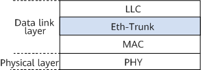

Eth-Trunk 模块内部维护一张转发表，这张表由以下两项组成。

- **`HASH-KEY`** 值：**`HASH-KEY`** 值是根据数据帧的 MAC 地址或 IP 地址等，经 HASH 算法计算得出。
- **`接口号`**：Eth-Trunk 转发表表项分布和设备每个 Eth-Trunk 支持加入的成员接口数量相关，不同的 **`HASH-KEY`** 值对应不同的出接口。

Eth-Trunk 模块根据转发表转发数据帧的过程如下：

- Eth-Trunk 模块从 MAC 子层接收到一个数据帧后，根据负载分担方式提取数据帧的源 MAC 地址/IP 地址或目的 MAC 地址/IP 地址。
- 根据 HASH 算法进行计算，得到 HASH-KEY 值。
- Eth-Trunk 模块根据 HASH-KEY 值在转发表中查找对应的接口，把数据帧从该接口发送出去。

### 4.2 负载分担方式的选择

逐流负载分担基于数据流的属性，如源 MAC 地址、目的 MAC 地址、源 IP 地址、目的 IP 地址、TCP/UDP 的源端口号或 TCP/UDP 的目的端口号来分担负载。用户可以根据流量模型设置基于不同属性的负载分担方式，**流量中某个参数变化越频繁，选择对应负载分担方式的流量就越均衡**。例如，在网络中，如果报文的 IP 地址变化较频繁，那么选择基于目的 IP 地址、源 IP 地址或源 IP 和目的 IP 地址的负载分担模式更有利于流量在各物理链路间合理的负载分担；如果报文的 MAC 地址变化较频繁，IP 地址比较固定，那么选择基于目的 MAC 地址、源 MAC 地址或源 MAC 和目的 MAC 地址的负载分担模式更有利于流量在各物理链路间合理的负载分担。

例如，DeviceA 的一条 TCP 报文流的源 IP 地址为 **`192.168.1.1`**（MAC 地址：**`a-a-a`**，源端口号：50），目的 IP 地址为 **`172.16.1.1`**（MAC 地址：**`b-b-b`**，目的端口号：2000），另一条 TCP 报文流的源 IP 地址为 **`192.168.1.1`**（MAC 地址：**`a-a-a`**，源端口号：60），目的 IP 地址为 **`10.1.1.1`**（MAC 地址：**`c-c-c`**，目的端口号：2000）。如果在 DeviceA 上配置基于报文的源 MAC 地址进行负载分担，则报文出接口仅有 1 个；如果在 DeviceA 上配置基于报文的目的 IP 地址进行负载分担，则报文出接口有两个，去往不同目的 IP 的报文会从不同的出接口转发。

配置负载分担方式时，请注意：

- **负载分担方式只在流量的出接口上生效，如果发现各入接口的流量不均衡，请修改上行出接口的负载分担方式**。
- 尽量将数据流通过负载分担在所有活动链路上传输，避免数据流仅在一条链路上传输，造成流量拥堵，影响业务正常运行。

### 4.3 动态负载分担

采用逐流机制的静态负载分担能保证包的顺序，但不能保证带宽利用率，可能会出现成员链路之间的负载分担不均衡，尤其当大数据流出现时会加剧所选中成员链路的拥塞甚至引起丢包。动态负载分担可以较好的解决这一问题，它在转发数据报文时，可以考虑负载分担链路中各成员链路的利用率，从而为转发报文选取当前负载分担链路中负载较轻的成员链路进行转发。动态负载分担共有三种模式：Eligible 模式、Spray 模式、Fixed 模式。推荐使用 Eligible 模式。

#### 4.3.1 Eligible 模式

两个直连设备之间的链路上存在链路传输时延。**若待发送的两个数据包之间的时间间隔大于负载分担链路中各成员链路的最大链路传输时延，则这两个数据包使用不同的成员链路进行转发后，到达接收端时就不会出现报文乱序的问题**。这句话的意思是，当相邻两个报文的发送时间间隔，已经超过各成员链路可能带来的最大传输时延差异时，这两个报文即使走不同链路，接收端一般也能按正确顺序收到它们。**这其实就是在说后一个报文发得足够晚，不会因为换了一条更快或更短时延的链路而追上前一个报文**。

>在多路径负载分担场景下，当同一数据流内相邻数据包的发送时间差，**超过了所有成员链路中的最大绝对传输延迟时，系统即可判定前序数据包已抵达接收端**。此时，对后续数据包执行跨链路的动态调度，便不会引发报文到达顺序倒置（即乱序）的问题。

Eligible 模式的动态负载分担就是基于这个原理进行实现的。在 Eligible 模式下，设备在转发数据包时会判断**待转发数据包与其所属 Flow 中上一个数据包之间的时间间隔**，若大于负载分担链路中各成员链路的最大链路传输时延，则认为待转发数据包是一个新 Flowlet 的首包；若小于或等于负载分担链路中各成员链路的最大链路传输时延，则与上一个数据包作为同一个 Flowlet。**设备基于 Flowlet 选取当前负载分担链路中负载较轻的成员链路进行转发，同一 Flowlet 中的数据包选取相同的成员链路进行转发**。

    
图 11 Eligible 模式的动态负载分担

    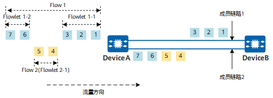

下面以图 11 为例，详细介绍 Eligible 模式的动态负载分担的实现原理。

- DeviceA 收到数据包 1 时，发现它是 Flow1 的第一个报文，认为其是新的 Flowlet（Flowlet1-1）的首包，并为其选取当前负载分担链路中负载较轻的成员链路进行转发。此时成员链路 1 和成员链路 2 的负载相同（都没有负载），因此随机选取一条进行转发，假设选取的是成员链路 1。
- DeviceA 收到数据包 2 时，发现它与其所属 Flow 中上一个数据包（数据包 1）之间的时间间隔小于或等于负载分担链路中各成员链路的最大链路传输时延，则与数据包 1 作为同一个 Flowlet，选取数据包 1 的转发路径（成员链路 1）进行转发。
- DeviceA 收到数据包 3 时，发现它与其所属 Flow 中上一个数据包（数据包 2）之间的时间间隔小于或等于负载分担链路中各成员链路的最大链路传输时延，则与数据包 2 作为同一个 Flowlet，选取数据包 2 的转发路径（成员链路 1）进行转发。
- DeviceA 收到数据包 4 时，发现它是 Flow2 的第一个报文，认为其是新的 Flowlet（Flowlet2-1）的首包，并为其选取当前负载分担链路中负载较轻的成员链路（成员链路 2）进行转发。
- DeviceA 收到数据包 5 时，发现它与其所属 Flow 中上一个数据包（数据包 4）之间的时间间隔小于或等于负载分担链路中各成员链路的最大链路传输时延，则与数据包 4 作为同一个 Flowlet，选取数据包 4 的转发路径（成员链路 2）进行转发。
- DeviceA 收到数据包 6 时，发现它与其所属 Flow 中上一个数据包（数据包 3）之间的时间间隔大于负载分担链路中各成员链路的最大链路传输时延，则认为其是新的 Flowlet（Flowlet1-2）的首包，并为其选取当前负载分担链路中负载较轻的成员链路（成员链路 2）进行转发。
- DeviceA 收到数据包 7 时，发现它与其所属 Flow 中上一个数据包（数据包 6）之间的时间间隔小于或等于负载分担链路中各成员链路的最大链路传输时延，则与数据包 6 作为同一个 Flowlet，选取数据包 6 的转发路径（成员链路 2）进行转发。

#### 4.3.2 Spray 模式

Spray 模式的动态负载分担采用的是逐包负载分担机制，即设备基于数据包选取当前负载分担链路中负载较轻的成员链路进行转发。这种机制下，若两个相邻转发的数据包属于同一 Flow，它们之间的时间间隔小于或等于负载分担链路中各成员链路的最大链路传输时延，且设备为这两个数据包选取的转发链路不一样时，则在接收端有可能会出现报文乱序的问题。**因此，该模式下需要确保流量接收的设备或终端支持报文乱序组包的功能**。

    
图 12 Spray 模式的动态负载分担

    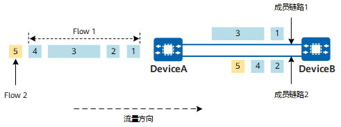

这里假设数据包 1、数据包 2、数据包 4、数据包 5 的报文大小一样，数据包 3 的报文大小是数据包 1 的 4 倍，这时，数据包 2、数据包 4 会比数据包 3 先被 DeviceB 接收，从而导致报文乱序。

#### 4.3.3 Fixed 模式

Fixed 模式的动态负载分担下，待转发的数据包选取其所属 Flow 中上一个数据包的转发路径进行转发，若待转发的数据包是其所属 Flow 中的第一个数据包，则按照静态负载分担的方式根据 HASH 结果为其选取成员链路进行转发。

    
图 13 Fixed 模式的动态负载分担

    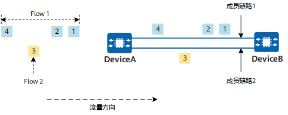

