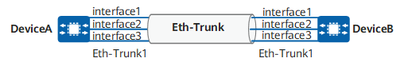
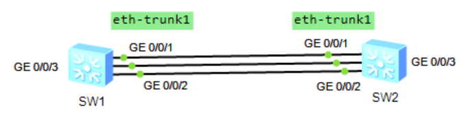
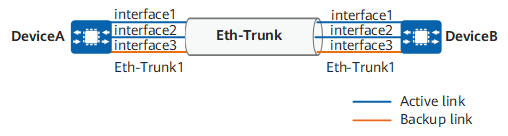
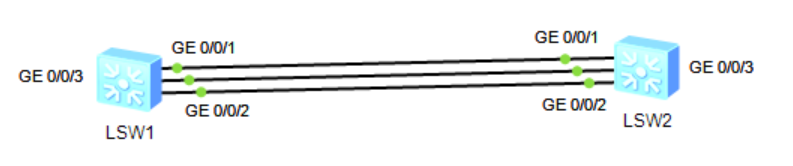
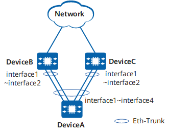

# Eth-Trunk 协议实验

## 1.配置手工模式 Eth-Trunk

如下图所示，DeviceA 和 DeviceB 之间存在多条链路，需要提供较大的带宽来实现流量负载分担，同时也希望能够提供一定的冗余度，保证数据传输和链路的可靠性。下图中的 interface1、interface2、interface3 分别代表 **`10GE1/0/1`**、**`10GE1/0/2`**、**`10GE1/0/3`**。

<div align="center">
    
</div>

在 ensp 中创建的网络拓扑如下所示：

<div align="center">
    
</div>

SW1 的配置如下所示：

```java{.line-numbers}
<HUAWEI> system-view
[HUAWEI] sysname DeviceA
[DeviceA] interface eth-trunk 1
// 将 Eth-Trunk 接口切换为二层模式，当需要将 Eth-Trunk 接口加入 VLAN 或进行二层转发时，需要配置二层 Eth-Trunk 接口，此时 Eth-Trunk 接口的三层功能和标识被禁止，并将采用系统 MAC 地址
[DeviceA-Eth-Trunk1] portswitch
// manual load-balance 表示手工模式 Eth-Trunk，该模式下所有链路都参与负载分担
[DeviceA-Eth-Trunk1] mode manual load-balance
[DeviceA-Eth-Trunk1] trunkport GigabitEthernet 0/0/1 to 0/0/3
```

SW2 的配置如下所示:

```java{.line-numbers}
<HUAWEI> system-view
[HUAWEI] sysname DeviceB
[DeviceB] interface eth-trunk 1
[DeviceB-Eth-Trunk1] portswitch
[DeviceB-Eth-Trunk1] mode manual load-balance
[DeviceB-Eth-Trunk1] trunkport GigabitEthernet 0/0/1 to 0/0/3
```

在任意视图下执行 **`display eth-trunk 1`** 命令，检查 Eth-Trunk 是否创建成功，及成员接口是否正确加入。

```c{.line-numbers}
[DeviceA-Eth-Trunk1]display eth-trunk 1
Eth-Trunk1's state information is:
WorkingMode: NORMAL         Hash arithmetic: According to SIP-XOR-DIP         
Least Active-linknumber: 1  Max Bandwidth-affected-linknumber: 8              
Operate status: up          Number Of Up Port In Trunk: 3                     
--------------------------------------------------------------------------------
PortName                      Status      Weight 
GigabitEthernet0/0/1          Up          1      
GigabitEthernet0/0/2          Up          1      
GigabitEthernet0/0/3          Up          1  

[DeviceA-Eth-Trunk1]display interface brief 
PHY: Physical
*down: administratively down
(l): loopback
(s): spoofing
(b): BFD down
(e): ETHOAM down
(dl): DLDP down
(d): Dampening Suppressed
InUti/OutUti: input utility/output utility
Interface                   PHY   Protocol InUti OutUti   inErrors  outErrors
Eth-Trunk1                  up    up          0%     0%          0          0
  GigabitEthernet0/0/1      up    up          0%     0%          0          0
  GigabitEthernet0/0/2      up    up          0%     0%          0          0
  GigabitEthernet0/0/3      up    up          0%     0%          0          0
```

在使用 **`display eth-trunk 1`** 命令时，可以看到 Eth-Trunk 的工作模式信息。

- **`WorkingMode: NORMAL`**，表示这条 Eth-Trunk 说明是手工负载分担模式 Eth-Trunk，不是 LACP 模式。
- **`Hash arithmetic: According to SIP-XOR-DIP`**，表示这条 Eth-Trunk 的负载分担算法是 基于源 IP 和目的 IP 做异或运算来选出转发成员链路。
- **`Least Active-linknumber: 1`**，表示这条 Eth-Trunk 配置的活动成员链路数下限是 1。只要处于 Up 状态的成员链路数不少于 1，这条 Eth-Trunk 就可以保持可用，如果少于这个下限，Eth-Trunk 就会变成 Down。

## 2.配置静态 LACP 模式 Eth-Trunk

DeviceA 和 DeviceB 之间存在多条链路，在两台设备上配置静态 LACP 模式链路聚合组，提高两设备之间的带宽与可靠性，具体要求如下：

- 两条活动链路具有负载分担的能力。
- **<font color="red">两设备间的链路具有 1 条冗余备份链路，当活动链路出现故障链路时，备份链路替代故障链路</font>**，保持数据传输的可靠性。

<div align="center">
    
</div>

在 ensp 中创建的网络拓扑如下所示：

<div align="center">
    
</div>

SW1 的配置如下所示，在 DeviceA 上创建 Eth-Trunk1 并配置为静态 LACP 模式，向 DeviceA 的 Eth-Trunk1 中加入 **`G0/0/1`**、**`G0/0/2`**、**`G0/0/3`** 三条链路，在 DeviceA 上配置系统优先级为 100，DeviceB 上保持缺省值，使 DeviceA 成为 LACP 主动端（以 DeviceA 上的活动接口为准）。在 DeviceA 上配置活动接口上限阈值为 2，剩余一条作为冗余备份链路。并且在 DeviceA 上配置 **`G0/0/1`** 和 **`G0/0/2`** 的 LACP 优先级为 100，使它们成为活动链路，**`G0/0/3`** 的 LACP 优先级保持缺省值，使其成为备份链路。

```java{.line-numbers}
#
sysname DeviceA
#
lacp priority 100
#
interface Eth-Trunk1
 mode lacp-static
 max active-linknumber 2
#
interface GigabitEthernet0/0/1
 eth-trunk 1
 lacp priority 100
#
interface GigabitEthernet0/0/2
 eth-trunk 1
 lacp priority 100
#
interface GigabitEthernet0/0/3
 eth-trunk 1
```

SW2 的配置如下所示：

```java{.line-numbers}

#
sysname DeviceB
#
interface Eth-Trunk1
 mode lacp-static
#
interface GigabitEthernet0/0/1
 eth-trunk 1
#
interface GigabitEthernet0/0/2
 eth-trunk 1
#
interface GigabitEthernet0/0/3
 eth-trunk 1
```

DeviceA 上执行 **`display eth-trunk 1`** 命令，检查 Eth-Trunk 是否创建成功，及成员接口是否正确加入。

```java{.line-numbers}
[DeviceA]display eth-trunk 1
Eth-Trunk1's state information is:
Local:
LAG ID: 1                   WorkingMode: STATIC                               
Preempt Delay: Disabled     Hash arithmetic: According to SIP-XOR-DIP         
System Priority: 100        System ID: 4c1f-cc38-5738                         
Least Active-linknumber: 1  Max Active-linknumber: 2                          
Operate status: up          Number Of Up Port In Trunk: 2                     
--------------------------------------------------------------------------------
ActorPortName          Status   PortType PortPri PortNo PortKey PortState Weight
GigabitEthernet0/0/1   Selected 1GE      100     2      305     10111100  1     
GigabitEthernet0/0/2   Selected 1GE      100     3      305     10111100  1     
GigabitEthernet0/0/3   Unselect 1GE      32768   4      305     10100000  1     

Partner:
--------------------------------------------------------------------------------
ActorPortName          SysPri   SystemID        PortPri PortNo PortKey PortState
GigabitEthernet0/0/1   32768    4c1f-cccd-3d16  32768   2      305     10111100
GigabitEthernet0/0/2   32768    4c1f-cccd-3d16  32768   3      305     10111100
GigabitEthernet0/0/3   32768    4c1f-cccd-3d16  32768   4      305     10110000
```

DeviceB 上执行 **`display eth-trunk 1`** 命令，检查 Eth-Trunk 是否创建成功，及成员接口是否正确加入。

```java{.line-numbers}
[DeviceB]display eth-trunk 1
Eth-Trunk1's state information is:
Local:
LAG ID: 1                   WorkingMode: STATIC                               
Preempt Delay: Disabled     Hash arithmetic: According to SIP-XOR-DIP         
System Priority: 32768      System ID: 4c1f-cccd-3d16                         
Least Active-linknumber: 1  Max Active-linknumber: 8                          
Operate status: up          Number Of Up Port In Trunk: 2                     
--------------------------------------------------------------------------------
ActorPortName          Status   PortType PortPri PortNo PortKey PortState Weight
GigabitEthernet0/0/1   Selected 1GE      32768   2      305     10111100  1     
GigabitEthernet0/0/2   Selected 1GE      32768   3      305     10111100  1     
GigabitEthernet0/0/3   Unselect 1GE      32768   4      305     10110000  1     

Partner:
--------------------------------------------------------------------------------
ActorPortName          SysPri   SystemID        PortPri PortNo PortKey PortState
GigabitEthernet0/0/1   100      4c1f-cc38-5738  100     2      305     10111100
GigabitEthernet0/0/2   100      4c1f-cc38-5738  100     3      305     10111100
GigabitEthernet0/0/3   100      4c1f-cc38-5738  32768   4      305     10100000
```

可以看到，在 DeviceA/DeviceB 上，**`G0/0/1`** 和 **`G0/0/2`** 处于 Selected 状态，成为活动链路，**`G0/0/3`** 处于 Unselect 状态，成为备份链路。此时两设备间的 Eth-Trunk1 具有两条活动链路和一条冗余备份链路，当任意一条活动链路出现故障时，备份链路会自动替代故障链路保持 Eth-Trunk 的正常工作。接下来，当我们将 DeviceA 上的 **`G0/0/1`** 端口 shutdown 后，执行 **`display eth-trunk 1`** 命令检查 Eth-Trunk1 的状态：

```java{.line-numbers}
[DeviceA-GigabitEthernet0/0/1]display eth-trunk 1
Eth-Trunk1's state information is:
Local:
LAG ID: 1                   WorkingMode: STATIC                               
Preempt Delay: Disabled     Hash arithmetic: According to SIP-XOR-DIP         
System Priority: 100        System ID: 4c1f-cc38-5738                         
Least Active-linknumber: 1  Max Active-linknumber: 2                          
Operate status: up          Number Of Up Port In Trunk: 2                     
--------------------------------------------------------------------------------
ActorPortName          Status   PortType PortPri PortNo PortKey PortState Weight
GigabitEthernet0/0/1   Unselect 1GE      100     2      305     10100010  1     
GigabitEthernet0/0/2   Selected 1GE      100     3      305     10111100  1     
GigabitEthernet0/0/3   Selected 1GE      32768   4      305     10111100  1     

Partner:
--------------------------------------------------------------------------------
ActorPortName          SysPri   SystemID        PortPri PortNo PortKey PortState
GigabitEthernet0/0/1   0        0000-0000-0000  0       0      0       10100011
GigabitEthernet0/0/2   32768    4c1f-cccd-3d16  32768   3      305     10111100
GigabitEthernet0/0/3   32768    4c1f-cccd-3d16  32768   4      305     10111100
```

可以看到，**`G0/0/1`** 端口状态变为 Unselect，**`G0/0/3`** 端口状态由 Unselect 变为 Selected，成为新的活动链路，替代 **`G0/0/1`** 继续保持 Eth-Trunk1 的正常工作。由于 DeviceA 没有开启抢占，因此当 **`G0/0/1`** 端口恢复 Up 状态后，**`G0/0/3`** 端口仍然保持 Selected 状态，**`G0/0/1`** 端口仍然保持 Unselect 状态。

```java{.line-numbers}
[DeviceA-GigabitEthernet0/0/1]undo shutdown
[DeviceA-GigabitEthernet0/0/1]display eth-trunk 1
Eth-Trunk1's state information is:
Local:
LAG ID: 1                   WorkingMode: STATIC                               
Preempt Delay: Disabled     Hash arithmetic: According to SIP-XOR-DIP         
System Priority: 100        System ID: 4c1f-cc38-5738                         
Least Active-linknumber: 1  Max Active-linknumber: 2                          
Operate status: up          Number Of Up Port In Trunk: 2                     
--------------------------------------------------------------------------------
ActorPortName          Status   PortType PortPri PortNo PortKey PortState Weight
GigabitEthernet0/0/1   Unselect 1GE      100     2      305     10100000  1     
GigabitEthernet0/0/2   Selected 1GE      100     3      305     10111100  1     
GigabitEthernet0/0/3   Selected 1GE      32768   4      305     10111100  1     

Partner:
--------------------------------------------------------------------------------
ActorPortName          SysPri   SystemID        PortPri PortNo PortKey PortState
GigabitEthernet0/0/1   32768    4c1f-cccd-3d16  32768   2      305     10110000
GigabitEthernet0/0/2   32768    4c1f-cccd-3d16  32768   3      305     10111100
GigabitEthernet0/0/3   32768    4c1f-cccd-3d16  32768   4      305     10111100
```

>如果想要配置 lacp 动态模式，只需要将 Eth-Trunk1 的工作模式改为 **`lacp-dynamic`** 即可。

## 3.配置 LACP 模式的跨设备 Eth-Trunk

如下图所示，DeviceA 跨设备接入 DeviceB 和 DeviceC，在 DeviceA 上部署 LACP 模式的 Eth-Trunk 接口，成员接口分别与 DeviceB 和 DeviceC 的 **`10GE1/0/1～10GE1/0/2`** 连接，**`10GE1/0/1～10GE1/0/2`** 的接口速率和双工模式相同，现在需要使流量可以在两台设备上负载分担。

<div align="center">
    
</div>

采用如下的思路配置跨设备 LACP 模式链路聚合：

- 分别在 DeviceA、DeviceB、DeviceC 上创建 Eth-Trunk1，并配置为静态 LACP 模式，将成员接口加入 Eth-Trunk1。
- 在 DeviceB 和 DeviceC 上配置相同的 LACP 系统 ID。
- 在 DeviceB 和 DeviceC 上配置相同的系统 LACP 优先级。
- 在 DeviceC 上配置 Eth-Trunk 成员接口在 LACP 协议中的编号扩展，使成员接口编号均增加 32768，避免和设备 DeviceB 上的成员接口在 LACP 协议中的编号相同。

这组配置的核心目的，是让 DeviceA 虽然物理上分别连接到 DeviceB 和 DeviceC，但在 LACP 协商时，把这两台设备看成同一个逻辑对端。**<font color="red">这样，DeviceA 上的 4 条链路才能被识别为同一个 Eth-Trunk 的成员链路，统一参与聚合和转发</font>**。如果不这样处理，DeviceA 会认为自己面对的是两个不同的 LACP 对端，那么这 4 条链路就无法按预期组成一个跨设备的聚合组。

在 **`DeviceA/DeviceB/DeviceC`** 上创建 **`eth-trunk 1`** 接口并且将对应的物理接口加入进去之后，DeviceB 和 DeviceC 之所以要配置相同的 LACP 系统 ID 和相同的系统优先级，就是为了让它们在 LACP 看来像是同一台设备。因为 LACP 在判断链路是否属于同一个聚合对象时，不只是看物理连通状态，还会看对端的系统身份信息。如果 DeviceB 和 DeviceC 的系统 ID 或系统优先级不一致，那么 DeviceA 收到的 LACPDU 就会把它们识别成两个不同的系统，进而认为这些链路不属于同一个聚合对端，聚合关系就无法按这个拓扑建立起来。

>根据华为文档官方的描述，为了保证 Eth-Trunk 协商成功，需要保证 DeviceB 和 DeviceC 具有相同的 LACP 系统优先级、Eth-Trunk 接口具有相同的接口 ID 和相同的 LACP 系统 ID。**<font color="red">同时，还要求两台 Device 上的 Eth-Trunk 成员口在 LACP 协议中的编号不同，以防止 LACP 协商不成功</font>**。

另外还必须保证这台逻辑设备下面的每一条成员链路都能被唯一识别。也正因为如此，才**需要在 DeviceC 上开启 **`lacp port-id-extension enable`**，把 DeviceC 的成员接口在 LACP 协议中的编号统一增加 32768**。这样做的目的，是避免 DeviceB 和 DeviceC 的成员接口编号发生重复。

所以，整套配置其实是在同时解决两个问题：第一，让 DeviceB 和 DeviceC 对外表现为同一个 LACP 对端；第二，让这个统一对端下面的各条成员链路仍然保持唯一身份。

>上述配置只适用于 CloudEngine 16800, 12800, 12800E, 9800, 8800, 7800, 6800, 5800 系列产品 V200R003C00 或更高版本。

DEVICEA 的配置如下所示：

```java{.line-numbers}
#
sysname DeviceA
#
interface MEth0/0/0
 undo shutdown
#
interface Eth-Trunk1
 mode lacp-static
#
interface GE1/0/0
 undo shutdown
 eth-trunk 1
#
interface GE1/0/1
 undo shutdown
 eth-trunk 1
#
interface GE1/0/2
 undo shutdown
 eth-trunk 1
#
interface GE1/0/3
 undo shutdown
 eth-trunk 1
```

DEVICEB 的配置如下所示：

```java{.line-numbers}
#
sysname DeviceB
#
lacp priority 100
#
interface MEth0/0/0
 undo shutdown
#
interface Eth-Trunk1
 mode lacp-static
 lacp system-id 00e0-fc00-0000
#
interface GE1/0/0
 undo shutdown
 eth-trunk 1
#
interface GE1/0/1
 undo shutdown
 eth-trunk 1
```

DEVICEC 的配置如下所示，在 DeviceC 上配置 Eth-Trunk 成员接口编号扩展，使成员接口编号均增加 32768。

```java{.line-numbers}
#
sysname DeviceC
#
lacp priority 100
#
interface MEth0/0/0
 undo shutdown
#
interface Eth-Trunk1
 mode lacp-static
 lacp system-id 00e0-fc00-0000
 lacp port-id-extension enable
#
interface GE1/0/2
 undo shutdown
 eth-trunk 1
#
interface GE1/0/3
 undo shutdown
 eth-trunk 1
```

DeviceA 上执行 **`display eth-trunk 1`** 命令，检查 Eth-Trunk 是否创建成功，及成员接口是否正确加入。

```java{.line-numbers}
[~DeviceA-GE1/0/3]display eth-trunk 1
Eth-Trunk1's state information is:
Local:
LAG ID: 1                       Working Mode: Static
Preempt Delay: Disabled         Hash Arithmetic: According to flow
System Priority: 32768          System ID: 707b-e8c8-2c41
Least Active-linknumber: 1      Max Active-linknumber: 32 
Operating Status: up            Number Of Up Ports In Trunk: 4
Timeout Period: Slow          
--------------------------------------------------------------------------------
ActorPortName          Status   PortType PortPri PortNo PortKey PortState Weight
GE1/0/0                Selected 100M     32768   1      289     10111100  1     
GE1/0/1                Selected 100M     32768   2      289     10111100  1     
GE1/0/2                Selected 100M     32768   3      289     10111100  1     
GE1/0/3                Selected 100M     32768   4      289     10111100  1     

Partner:
--------------------------------------------------------------------------------
ActorPortName          SysPri   SystemID        PortPri PortNo PortKey PortState
GE1/0/0                100      00e0-fc00-0000  32768   1      289     10111100 
GE1/0/1                100      00e0-fc00-0000  32768   2      289     10111100 
GE1/0/2                100      00e0-fc00-0000  32768   32769  289     10111100 
GE1/0/3                100      00e0-fc00-0000  32768   32770  289     10111100 
```

DeviceB 上执行 **`display eth-trunk 1`** 命令，检查 Eth-Trunk 是否创建成功，及成员接口是否正确加入。

```java{.line-numbers}
[~DeviceB-GE1/0/1]display eth-trunk 1
Eth-Trunk1's state information is:
Local:
LAG ID: 1                       Working Mode: Static
Preempt Delay: Disabled         Hash Arithmetic: According to flow
System Priority: 100            System ID: 00e0-fc00-0000
Least Active-linknumber: 1      Max Active-linknumber: 32 
Operating Status: up            Number Of Up Ports In Trunk: 2
Timeout Period: Slow          
--------------------------------------------------------------------------------
ActorPortName          Status   PortType PortPri PortNo PortKey PortState Weight
GE1/0/0                Selected 100M     32768   1      289     10111100  1     
GE1/0/1                Selected 100M     32768   2      289     10111100  1     

Partner:
--------------------------------------------------------------------------------
ActorPortName          SysPri   SystemID        PortPri PortNo PortKey PortState
GE1/0/0                32768    707b-e8c8-2c41  32768   1      289     10111100 
GE1/0/1                32768    707b-e8c8-2c41  32768   2      289     10111100 
```

DeviceC 上执行 **`display eth-trunk 1`** 命令，检查 Eth-Trunk 是否创建成功，及成员接口是否正确加入。

```java{.line-numbers}
<DeviceC>display eth-trunk 1
Eth-Trunk1's state information is:
Local:
LAG ID: 1                       Working Mode: Static
Preempt Delay: Disabled         Hash Arithmetic: According to flow
System Priority: 100            System ID: 00e0-fc00-0000
Least Active-linknumber: 1      Max Active-linknumber: 32 
Operating Status: up            Number Of Up Ports In Trunk: 2
Timeout Period: Slow          
--------------------------------------------------------------------------------
ActorPortName          Status   PortType PortPri PortNo PortKey PortState Weight
GE1/0/2                Selected 100M     32768   32769  289     10111100  1     
GE1/0/3                Selected 100M     32768   32770  289     10111100  1     

Partner:
--------------------------------------------------------------------------------
ActorPortName          SysPri   SystemID        PortPri PortNo PortKey PortState
GE1/0/2                32768    707b-e8c8-2c41  32768   3      289     10111100 
GE1/0/3                32768    707b-e8c8-2c41  32768   4      289     10111100 
```

通过以上显示信息可以看到，各 Device 的 **`Operating Status`** 均为 Up，表明 Eth-Trunk1 已经协商成功。DeviceB 和 DeviceC 上的成员接口成为活动接口，处于 Selected 状态，表示 DeviceB 和 DeviceC 上的成员接口均可以负载分担。DeviceC 的 PortNo 显示成员接口的 LACP 编号已经增加 32768。