# iStack 和 CSS 配置和管理

## 零、istack 和 css 简介

交换机设备在网络中除了可以单独接入网络使用外，还可以通过部署堆叠或集群接入网络进行组合使用，在华为交换机中分别对应 iStack、CSS 功能。

华为交换机中的 iStack 功能就是通常所说的交换机堆叠功能，**<font color="red">在华为盒式系列交换机中支持，可把多台交换机配置成一台交换机来使用和管理，主要目的是解决单一交换机端口不足的问题，同时也可以提高单台交换机的可靠性</font>**。

<div align="center">
    <div align="center" style="color: #F14; font-size:13px; font-weight:bold">图 1 istack 堆叠</div>
    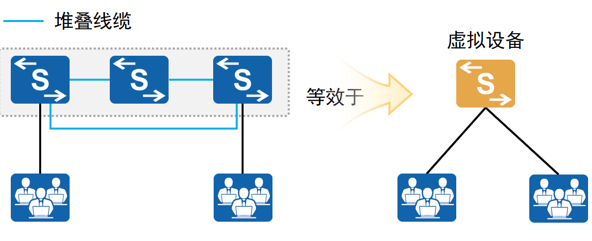
</div>

华为交换机中的 CSS 功能就是通常所说的交换机集群，**<font color="red">在华为框式系列交换机中支持，目前最多可把两台交换机配置成一台交换机来使用和管理，主要目的是解决单一交换机性能不足的问题，同时也可提高单台交换机的可靠性</font>**。

<div align="center">
    <div align="center" style="color: #F14; font-size:13px; font-weight:bold">图 2 css 集群</div>
    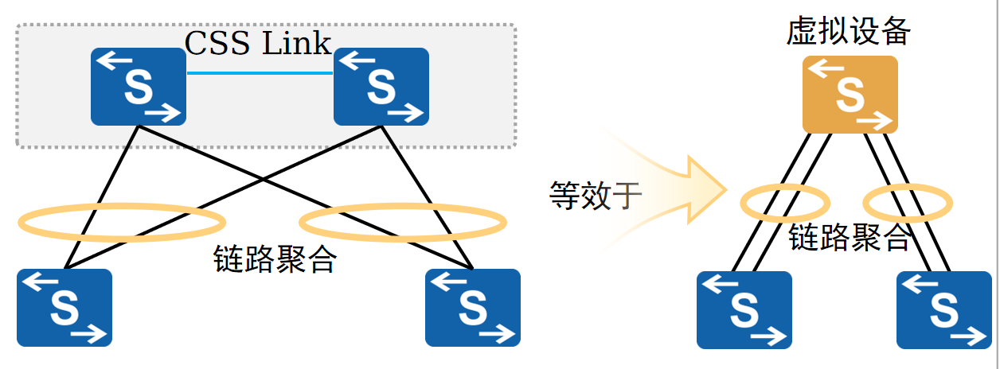
</div>

>盒式交换机：端口数量与类型在出厂时基本就定好了，后期通常不能像插卡那样继续扩展（要扩端口往往就是换更大型号或再加一台）。这种形态成本相对更友好、部署更简单，常见于园区网接入层/小型汇聚等场景；如果需要更高可用性，很多盒式机型会通过堆叠把多台逻辑上合成一台来管理与冗余。
>框式交换机：机框本身提供槽位，你按需插入线卡（端口模块）、主控/监督模块（Supervisor）、电源和风扇等部件，随着规模增长可以逐步加卡扩容。它的优势通常体现在更强的可扩展性与高可用设计，因此更常用于核心层或大型汇聚/数据中心等对性能与可靠性要求更高的场景。

使用堆叠、集群技术将独立的交换机虚拟化成一台逻辑的交换机，**一般接入、汇聚层盒式交换机采用堆叠技术，汇聚、核心层交换机采用集群技术**。在逻辑交换机之间使用链路聚合 eth-trunk 技术，无需部署 STP、VRRP 实现高可靠性。

<div align="center">
    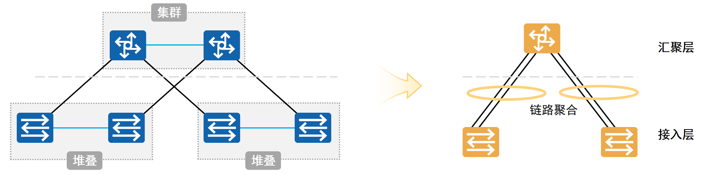
</div>

## 一、istack 基础

### 1.istack 基础

交换机堆叠技术（Intelligent Stack）是将多台支持堆叠特性的交换机组合在一起，从逻辑上组合成一台整体交换机，这样不仅**可以通过一个命令行界面、一个 IP 地址对这些交换机进行集中管理**，还可以提高单台交换机的转发性能和可靠性，实现各成员交换机间的负载均衡。在如下图所示的拓扑结构中，左图中间的两台交换机通过堆叠就可看成右图中间的那一台交换机，这就是交换机堆叠的最直接、外在的表现形式。

<div align="center">
    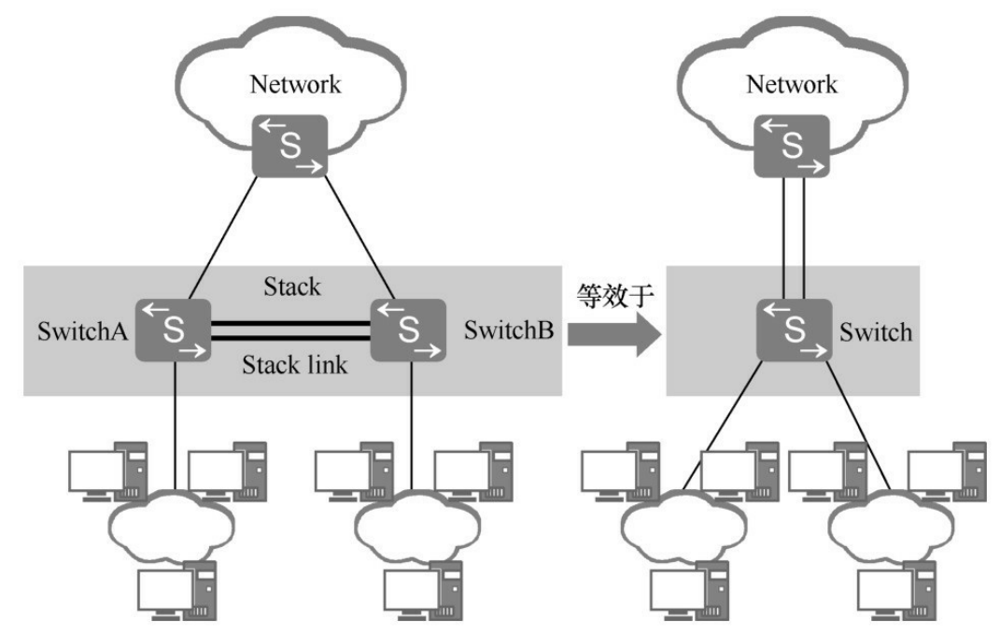
</div>

istack 是华为 S 系列交换机的基本特性，无需获得 License 许可即可应用此功能。多台（最多 9 台）之间组成堆叠，相邻交换机间必须直接连接，中间不能有其他的交换机。istack 具有如下特性：

- 高可靠性：堆叠系统中的多台成员交换机之间可实现冗余备份，同时，istack 堆叠支持跨设备的链路聚合功能，故又可实现跨设备的链路冗余备份。
- 强大的网络扩展能力：通过增加成员交换机，**可以轻松地扩展堆叠系统的端口数、带宽和处理能力**。
- 简化设备配置和管理。一方面，**用户可以通过任何一台成员交换机登录堆叠系统，对堆叠系统所有成员交换机进行统一的配置和管理**；另一方面，堆叠形成后，不需要配置复杂的二层破环协议和三层保护倒换协议，简化了网络配置。

下面分别简单介绍一下 三层保护倒换协议和二层破环协议，**在没有堆叠的传统网络中，为了防止核心交换机坏掉导致全网断网，通常会放两台核心交换机（Switch A 和 Switch B）**。在终端侧（如电脑）通常只能配置一个默认网关地址，如果网关直接指向 Switch A 的三层接口，一旦 A 故障，终端就会失去网关而无法继续访问外网，填 Switch B 的 IP 地址也是同理，也就是正常情况下无法实现网关侧的冗余与主备切换。

因此在双网关场景中常用 VRRP 来实现三层网关冗余：**<font color="red">在 Switch A 与 Switch B 上为同一 VLAN/网段建立 VRRP 组，对外共同提供一个固定的虚拟网关（Virtual IP，通常还会对应一个虚拟 MAC），终端只需要把默认网关设置为该虚拟 IP 即可</font>**。VRRP 组内通过周期性发送 VRRP 通告报文来维持主备状态，正常情况下由优先级更高的设备担任 Master 负责对外转发，另一台作为 Backup 处于监听待命。当 Master 发生故障或链路异常导致通告报文消失时，Backup 在检测到超时后会提升为 Master，继承并接管该虚拟 IP（以及虚拟 MAC）继续对外提供网关转发能力，终端侧无需修改任何配置即可恢复通信。上述由主设备失效到备设备接管虚拟网关并恢复转发的过程，就是常说的三层保护倒换。

接下来说明二层破坏协议，二层破环是指当堆叠中的各成员交换机之间形成环形结构时消除二层环路，istack 有自己的破环机制，可以按以下计算公式快速找到用于消除二层环路的破环线：**<font color="red">从主设备堆叠端口 ID 较大的堆叠口开始数起，数 **`(n/2)+1`** 段链路后得到的这根网线就是破环线，它两端的端口都在阻塞状态</font>**。n 为堆叠环境中的设备数目，而且 **`(n/2)+1`** 取整数，不是四舍五入。

从 Master (switch1) 的较大堆叠口开始，假设 stack2 端口的堆叠 ID 大于 stack1 端口的堆叠 ID，所以从 switch1 的 stack2 接口出发数起。下图中有 4 台设备组成了环形堆叠，故 n=4，那么 **`(n/2)+1=3`**，也就是从主设备的 stack2 堆叠口开始数 3 段链路，第 3 段链路的网线（**`switch4/stack1 -> switch2/stack2`**）就是破环线。即 switch4 的 stack1 口和 switch2 的 stack2 口处于阻塞状态，因此 4 台交换机之间虽然物理上虽然连成了环，但逻辑上这条线断了，数据流向变成了马蹄形（链状），消除了二层环路。

<div align="center">
    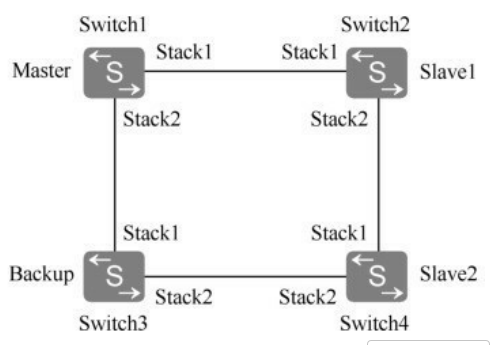
</div>

### 2 istack 基本概念

**（1）交换机角色**

在 istack 堆叠中，所有的单台交换机都称为成员交换机，按照各自功能的不同又可以分为以下 3 种角色：

- 主交换机（Master）：负责整个堆叠系统的管理，一个堆叠只有一台主交换机；
- 备交换机（Standby）：是主交换机的备用交换机，用于当原主交换机出现故障时接替原主交换机的工作，管理整个堆叠系统。与主交换机一样，一个堆叠也只有一台备交换机；
- 从交换机（Slave）：**<font color="red">除了主交换机外的其他所有交换机（包括备交换机）都是从交换机。主要用于业务转发</font>**，从交换机的数量越多，堆叠系统的转发能力越强；

>注意，堆叠系统中的所有交换机都同时工作，并不是只有主交换机工作。

**（2）堆叠 ID**

堆叠 ID 为成员交换机在堆叠系统中的槽位号（Slot ID），用来标识和管理成员交换机，堆叠中所有成员交换机的堆叠 ID 都是唯一的。

华为智能堆叠（iStack）技术的核心逻辑，是将多台物理上独立的盒式交换机通过堆叠线缆互联，在控制平面和数据平面上虚拟化为一台逻辑交换机。系统通过堆叠 ID 这唯一的数字标识符来区分和定位堆叠系统中的每一台物理成员设备，从而实现对底层硬件资源的统一调度与管理。

在同一个堆叠域（Stack Domain）内，堆叠 ID 必须具有唯一性。**<font color="red">华为交换机的接口编号遵循 **`接口类型 堆叠 ID/子卡号/端口号`** 的三维格式，在单机运行模式下，由于设备/堆叠 ID 默认为 0，接口通常标识为 **`GigabitEthernet 0/0/1`**。一旦设备加入堆叠，其接口编号将强制与堆叠 ID 关联</font>**。

以两台华为 S5700 交换机组网为例，在独立状态下，两台设备的第一个千兆接口均显示为 **`GigabitEthernet 0/0/1`**。当构建堆叠系统并将第一台设备 ID 配置为 1，第二台设备 ID 配置为 2 后，接口索引将自动刷新，原第一台设备的接口变更为 **`GigabitEthernet 1/0/1`**，原第二台设备的接口则变更为 **`GigabitEthernet 2/0/1`**。

**（3）堆叠优先级**

堆叠优先级用于在堆叠角色选举过程中确定主交换机和备交换机的角色。**<font color="red">优先级值越大表示优先级越高，优先级越高当选为主交换机和备交换机的可能性越大</font>**。

### 3.堆叠链接方式

华为 S 系列交换机支持采用两种接口（专门的堆叠卡上的接口和普通业务接口）连接的方式来组建 istack 堆叠，故又分为两种堆叠连接方式：堆叠卡堆叠和业务口堆叠。

#### 3.1 堆叠卡堆叠

堆叠卡堆叠是各成员交换机间采用专用堆叠卡上的接口和专用堆叠线缆进行连接。

#### 3.2 业务口堆叠

业务口堆叠指的是交换机之间通过与逻辑堆叠端口绑定的普通业务端口连接，不需要采用专用的堆叠插卡连接。业务口堆叠涉及到如下两种端口的概念：

**（1）物理成员端口**

成员交换机之间用于堆叠连接的物理端口（就是交换机面板上那些普通的网口，比如万兆光口 XGE 等），是普通的业务端口，用于转发需要跨成员交换机的业务报文或成员交换机之间的堆叠协议报文。

**（2）逻辑堆叠端口**

逻辑堆叠端口是专用于堆叠的逻辑端口，但需要和前面介绍的物理成员端口进行绑定才能起作用，这是交换机操作系统内部虚拟出来的堆叠专用接口（逻辑堆叠端口是虚拟的，不能直接插网线），就像是一个容器。**<font color="red">堆叠的每台成员交换机上支持两个逻辑堆叠端口，分别为 **`stack-port n/1`** 和 **`stack-port n/2`**，其中 n 为成员交换机的堆叠 ID</font>**，以便实现成员交换机间的冗余链路连接，可提高堆叠连接的可靠性，但也可以仅通过一条链路连接。逻辑堆叠端口和物理成员端口之间的关系如下所示：

<div align="center">
    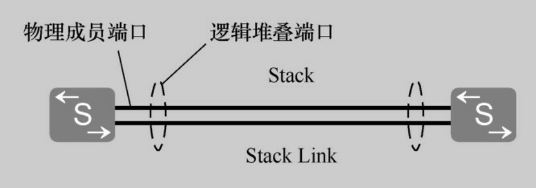
</div>

在业务口堆叠中，各成员交换机间通过物理成员端口的连接线缆又分为两种：普通线缆堆叠和专用线缆堆叠。

**（3）专用线缆堆叠**

专用堆叠线缆的两端区分主和备，**<font color="red">带有 Master 标签的一端为主端，不带有标签的一端为备端</font>**。使用专用线缆堆叠时，专用堆叠线缆按照规则插入物理成员端口后，交换机就可以自动组建堆叠，无需对逻辑堆叠端口进行额外的配置。

**（4）普通线缆堆叠**

在业务口堆叠中也可使用普通堆叠线缆连接，包括光线缆、双绞网线和高速电缆。使用普通线缆堆叠时，需要手动配置物理成员端口对应的逻辑堆叠端口，否则无法完成堆叠的组建（**<font color="red">因为交换机不知道用户想用哪根网线做堆叠</font>**，所以用户必须手动敲命令把物理口加入到逻辑堆叠口中。如果不配置，插上线没有任何反应，堆叠无法建立）。

假设我们有两台交换机，我们想用普通光纤进行业务口堆叠。设备 A 的堆叠 ID 配置为 1，设备 B 的堆叠 ID 配置为 2。我们想用两台机器的万兆口 (XGigabitEthernet) 第 51 号端口相连。

```java{.line-numbers}
// 第一步：在设备 A (ID 1) 上操作
// 我们需要把物理口 XGE 0/0/51 绑定到逻辑口 stack-port 1/1 中。
// 进入 ID 为 1 的交换机的第 1 个逻辑堆叠口
[SwitchA] interface stack-port 1/1      
// 这就完成了绑定。现在，插在51号口的网线传输的数据，会被送入 stack-port 1/1 进行处理。
[SwitchA-stack-port1/1] port interface XGigabitEthernet 0/0/51 enable
// 第二步：在设备 B (ID 2) 上操作
// 我们需要把物理口 XGE 0/0/51 绑定到逻辑口 stack-port 2/1 中。
// 进入 ID 为 2 的交换机的第 1 个逻辑堆叠口
[SwitchB] interface stack-port 2/1      
[SwitchB-stack-port2/1] port interface XGigabitEthernet 0/0/51 enable
```

### 4.堆叠的建立流程

要成功组建一个堆叠系统，需要按照以下流程进行：

- 物理连接：根据网络需求，按照上节的介绍选择适当的堆叠连接方式和连接拓扑，组建堆叠网络。
- 主交换机选举：在一个堆叠系统中只有一台交换机可成为主交换机。主交换机是通过选举确定的。
- 拓扑收集和备交换机选举：堆叠系统的主交换机确定后，**<font color="red">主交换机会收集所有成员交换机的拓扑信息，并向所有成员交换机分配堆叠 ID，之后选出堆叠系统的备交换机</font>**。
- 稳定运行：主交换机将整个堆叠系统的拓扑信息同步给所有成员交换机，成员交换机同步主交换机的系统软件和配置文件，之后进入稳定的运行状态。

#### 4.1 物理连接

每种连接方式都可组成链式连接以及环形连接这 2 种拓扑。

对于链式连接来说，优点是首尾不需要有物理连接，适合长距离堆叠，缺点就是可靠性低，其中一条堆叠链路出现故障，就会造成堆叠分裂。**<font color="red">链式连接适用于堆叠成员交换机距离较远时，组建环形连接比较困难，可以使用链形连接</font>**。

<div align="center">
    <div align="center" style="color: #F14; font-size:13px; font-weight:bold">链式连接</div>
    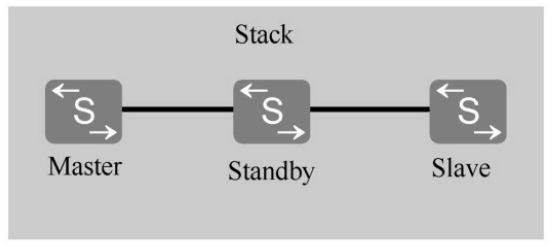
</div>

对于环形连接来说，优点是可靠性高，其中一条堆叠链路出现故障，环形拓扑变成链形拓扑，不影响堆叠系统正常工作。首尾需要有物理连接，不适合长距离堆叠。**<font color="red">适用场景为堆叠成员交换机距离较近时，建议使用环形连接</font>**。

<div align="center">
    <div align="center" style="color: #F14; font-size:13px; font-weight:bold">环形连接</div>
    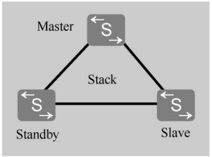
</div>

#### 4.2 主交换机选举

确定好堆叠的连接方式和连接拓扑，完成成员交换机之间的物理连接之后，给所有成员交换机上电。此时堆叠系统开始进行主交换机的选举。主交换机的选举规则如下（依次从第一步开始判断，直至找到最优的交换机为止）：

1. **<font color="red">已经运行的交换机比处于启动状态的交换机优先竞争为主交换机。如果希望指定某一成员交换机为主交换机，则可以先为其上电</font>**，待其启动完成后再给其他成员交换机上电；

堆叠主交换机选举超时时间为 20s，堆叠成员交换机上电或重启时，由于不同成员交换机所需的启动时间可能差异比较大，因此不是所有成员交换机都有机会参与主交换机的第一次选举。后启动的交换机加入堆叠系统时，**<font color="red">最终的主交换机选举结果会因后启动的交换机在堆叠中所处位置的不同，以及先启动交换机间是否已成功组建一个统一的堆叠系统而有所不同</font>**。

比如有 **`A-B-C`** 连接方式的 3 台设备组建链形堆叠：

- 如果 A、B 先启动，C 后启动。此时 A、B 已组建成了一个堆叠系统，故 C 后面加入时，只能被动加入堆叠成为非主交换机。
- 如果 A、C 先启动。此时 A、C 各自成为自己堆叠系统的主交换机，没有形成统一的堆叠系统。在 B 启动加入堆叠系统时，A 和 C 会根据启动时间重新进行新的统一堆叠系统中的主交换机的竞争，竞争主交换机失败的交换机会重启，再以非主交换机加入堆叠。

2. 如果两台竞争主机交换机的成员交换机是同时启动的，此时再看哪台成员交换机的堆叠优先级高，堆叠优先高的交换机优先为主交换机。
3. 当有多台成员交换机同时启动，并且堆叠优先级也相同时，MAC 地址（设备的 MAC 地址）小的交换机优先竞争为主交换机。

#### 4.3 拓扑收集和备交换机选举

主交换机选举完成后，主交换机会收集所有成员交换机的拓扑信息，根据拓扑信息计算出堆叠转发表项和破环点（如果是环形堆叠结构时）信息，下发给堆叠中的所有成员交换机，并向所有成员交换机分配堆叠 ID。之后进行备交换机的选举。

**<font color="red">除主交换机外，最先完成设备启动的交换机优先被选为备份交换机</font>**。当除主交换机外其他交换机同时完成启动时，备交换机的选举规则如下（依次从第一步开始判断，直至找到最优的交换机为止）。

1. 堆叠优先级最高的设备成为备交换机；
2. 堆叠优先级相同时，MAC 地址最小的成为备交换机；

除主交换机和备交换机之外，剩下的其他成员交换机作为从交换机加入堆叠。

### 5.堆叠的登陆和访问

istack 堆叠建立好后，多台成员交换机就组成了一台虚拟设备存在于网络中，堆叠系统的接口编号规则以及登录与访问的方式都发生了变化。

堆叠系统的接口编号采用堆叠 ID 作为标识信息，所有成员交换机的堆叠 ID 都是唯一的。对 **<font color="red">于单台没有运行堆叠的设备，接口编号采用：`槽位号/子卡号/端口号`（支持 istack 堆叠功能的 S 系列交换机均为盒式设备，槽位号固定为 0）。设备加入堆叠后，接口编号采用：`堆叠 ID/子卡号/端口号`</font>**。

从以上可以看出，**设备加入堆叠前后，接口编号变化的只是其组成的第一部分，由原来的 0 变成了对应的堆叠 ID**。子卡号与端口号的编号规则与单机状态下一致。如果设备没有运行堆叠时，某个接口的编号为 **`GigabitEthernet0/0/1`**；当该设备加入堆叠后，如果堆叠 ID 为 2，则该接口的编号将变为 **`GigabitEthernet2/0/1`**。

如果设备曾加入过堆叠，在退出出堆叠后，仍然会使用组成堆叠时的堆叠 ID 作为自身的槽位号。但对于管理网口，无论系统是否运行堆叠以及运行堆叠后堆叠 ID 是多少，每台成员交换机的管理网口的编号均固定为 **`MEth 0/0/1`**，但此时并不是每台成员交换机的管理网口均可使用了。

>在华为以及几乎所有企业级交换机中，管理 IP 的来源通常有两种方式，分别对应带外管理和带内管理：
>1.使用专用的物理管理口（带外管理，Out-of-Band）：交换机面板上通常印有 MGMT 或 **`MEth0/0/1`** 的独立网口。**<font color="red">这个网口内部连接到 CPU 的通道与普通数据流量/业务流量是物理隔离的</font>**。IP 直接配置在 **`MEth0/0/1`** 接口上。带外管理口即使交换机业务数据拥塞（比如全网广播风暴、DDoS 攻击），业务网口都 down 掉，依然可以通过这个专用口 SSH 去维护。
>2.使用业务接口的虚拟接口（带内管理，In-Band）：**<font color="red">使用传输用户数据的普通网口（如 **`GigabitEthernet 1/0/1`**）</font>**。IP 配置在 VLANIF 接口或 Loopback 接口 上。创建一个 VLAN（例如 VLAN 100，专门作为管理 VLAN），给这个 VLAN 配置一个三层接口 IP（**`interface Vlanif 100 -> ip address 192.168.100.1`**）。把交换机的某个物理网口划入 VLAN 100。只要电脑能通过网络连通到这个 IP，就可以 SSH 登录。

堆叠系统中所有成员交换机都看成一体了，因此可通过任意成员交换机的 Console 口进行本地登录，但远程登录时需要用到管理 IP 地址，而这个管理 IP 地址又与当前堆叠系统使用的有效配置文件有关，所以不能随意选择。

有管理网口的设备组建堆叠后，只有一台成员交换机的管理网口生效，称为主用管理网口。**<font color="red">堆叠系统启动后默认选取主交换机的管理网口为主用管理网口</font>**，若主交换机的管理网口异常或不可用，则选取其他成员交换机的管理网口为主用管理网口。**<font color="red">通过管理网口 IP 进行远程登录时，一定要使用主用管理网口 IP 地址</font>**。如果使用非主用管理网口 IP 地址，或者通过 PC 直连到非主用管理网口，都无法正常登录堆叠系统。

另外堆叠建立后，主交换机的配置文件生效，故如果远程登录堆叠系统，需要主交换机的 IP 地址。不管通过哪台成员交换机登录到堆叠系统，实际登录的都是主交换机。主交换机负责将用户的配置下发给其他成员交换机，统一管理堆叠系统中所有成员交换机的资源。

### 6.堆叠 ID 分配

在 istack 堆叠中，每台成员交换机的堆叠 ID 缺省均为 0。堆叠时由主交换机对各成员交换机的堆叠 ID 进行分配和管理。当堆叠系统有新成员加入时，如果新成员与已有成员堆叠 ID 冲突，则主交换机会从 **`0～最大的堆叠 ID`** 进行遍历，找到第一个空闲的 ID 分配给该新成员。

新建堆叠或堆叠成员变化时，**如果不在堆叠建立前手动指定各设备的堆叠 ID，则由于启动顺序等原因，最终堆叠系统中各成员的堆叠 ID 是随机的**，无法实现对各成员堆叠 ID 的有效控制。因此，在建立堆叠时建议提前规划好设备的堆叠 ID，或通过特定的操作顺序，使设备启动后的堆叠 ID 与规划的堆叠 ID 一致。

### 7.堆叠成员的加入和退出

在网络维护过程中，经常会根据实际需要对原有堆叠系统进行成员更新，有时会因为端口数或性能扩展需要添加一些新成员，有时又会因堆叠中某台设备出现了故障，或者因为公司的网络结构发生了变化，原有堆叠系统中不再需要那么多成员交换机了。

#### 7.1 堆叠成员的加入

堆叠成员的加入是指向已经稳定运行的堆叠系统添加一台新交换机。堆叠成员的加入分为带电加入和不带电加入两种，不带电加入的过程如图所示，具体描述如下：

- 新加入的交换机连线上电启动后，进行角色选举，被选举为从交换机，堆叠系统中原有主备从角色不变；
- 角色选举结束后，主交换机更新堆叠拓扑信息，同步到其他成员交换机上，并向新加入的交换机分配堆叠 ID（新加入的交换机没有配置堆叠 ID 或配置的堆叠 ID 与原堆叠系统的冲突时）。
- 新加入的交换机更新堆叠 ID，并同步主交换机的配置文件和系统软件，之后进入稳定运行状态。

<div align="center">
    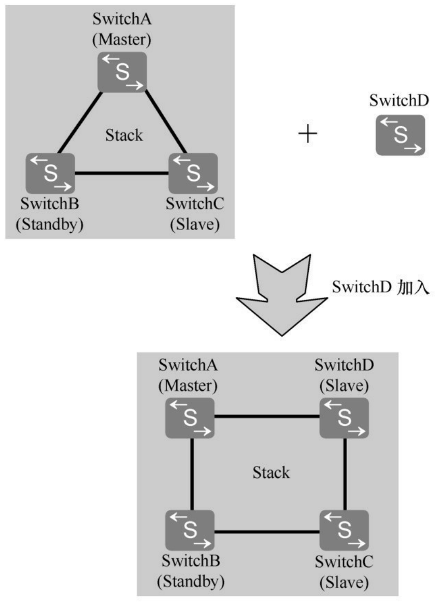
</div>

用户可按照以下操作完成堆叠成员的加入。

- 分析当前堆叠的物理连接，选择适当的加入点：
  - **<font color="red">如果是链形连接，新加入的交换机建议添加到链形的两端，这样对现有的业务影响最小</font>**；
  - **<font color="red">如果是环形连接，需要把当前环形拆成链形，然后在链形的两端添加设备</font>**；
- 进行堆叠的配置：如果是业务口堆叠，新加入的交换机需要配置物理成员端口加入逻辑堆叠端口。并且链形连接时，当前堆叠系统链形两端（或一端）的成员交换机也需要配置物理成员端口加入逻辑堆叠口。为了便于管理，建议为新加入的交换机配置堆叠 ID。如果不配置，堆叠系统会为其分配一个堆叠 ID。
- 新加入的交换机下电后连接堆叠线缆，然后重新上电。
- 如果需要加入多台交换机，重复上述①～③步的过程。
- 保存配置。

这里解释一下，为什么将新加入的交换机添加到链形的中间对现有的业务有很大的影响。假设现在的堆叠系统是 链形拓扑，由 A、B、C 三台交换机组成：**`[A] —— [B] —— [C]`**。在链形拓扑架构下，设备间不存在冗余链路。若试图将新成员交换机 D 接入现有成员 B 与 C 之间，工程上必须断开 B 与 C 之间的堆叠线缆。这一物理操作将直接导致堆叠系统数据转发平面瞬间被阻断。由此产生的后果是，跨越该断点的所有业务流量（例如从 A/B 流向 C 的数据）将立即丢包，导致业务出现硬性中断。

链路断开会导致原有的统一堆叠系统分裂为两个独立的故障域（例如 **`A+B`** 作为一个堆叠，C 单独作为一个堆叠），这种现象在技术上称为堆叠分裂（Stack Split）。分裂后，原本作为从属设备的 C 因无法侦听到原主设备的心跳报文，将误判主设备故障并触发自身的角色竞选机制，升级为新的 Master。此时，网络中将同时存在两个拥有相同全局配置（如管理 IP、系统 MAC 地址）的 Master 设备，即双主（Dual Active）场景。

当完成新设备 D 的线缆连接后，分裂的两个堆叠系统会尝试重新合并，进入堆叠合并（Stack Merge）流程。在此过程中，系统必须重新进行全网的角色竞选（Master Election）以确定唯一的管理节点。**<font color="red">根据堆叠协议机制，竞选失败的一方（通常是其中一个分裂域）必须强制执行系统重启（System Reboot）以清除旧状态并同步新 Master 的配置。这一过程不仅耗时较长，还会导致网络经历第二次长时间的业务不可用</font>**，极大延长了故障恢复时间（RTO）。

#### 7.2 堆叠成员的退出

堆叠成员的退出是指成员交换机从当前堆叠系统中离开。根据退出成员交换机角色的不同，对堆叠系统的影响也有所不同。

- 当主交换机退出时，备份交换机升级为主交换机，重新计算堆叠拓扑并同步到其他成员交换机，指定新的备交换机，之后进入稳定运行状态。
- 当备交换机退出时，主交换机重新指定备交换机，重新计算堆叠拓扑并同步到其他成员交换机，之后进入稳定运行状态。
- 当从交换机退出时，主交换机重新计算堆叠拓扑并同步到其他成员交换机，之后进入稳定运行状态。

堆叠成员交换机退出的过程，主要就是拆除堆叠线缆和移除交换机的过程。

- 对于环形堆叠：成员交换机退出后，为保证网络的可靠性还需要把退出交换机连接的两个端口通过堆叠线缆进行连接。
- 对于链形堆叠：拆除中间交换机会造成堆叠分裂。这时需要在拆除前进行业务分析，尽量减少对业务的影响。

### 8.堆叠的合并

堆叠合并是指稳定运行的两个堆叠系统合并成一个新的堆叠系统。如下图所示，两个堆叠系统的主交换机通过竞争，选举出一个更优的作为新堆叠系统的主交换机。

<div align="center">
    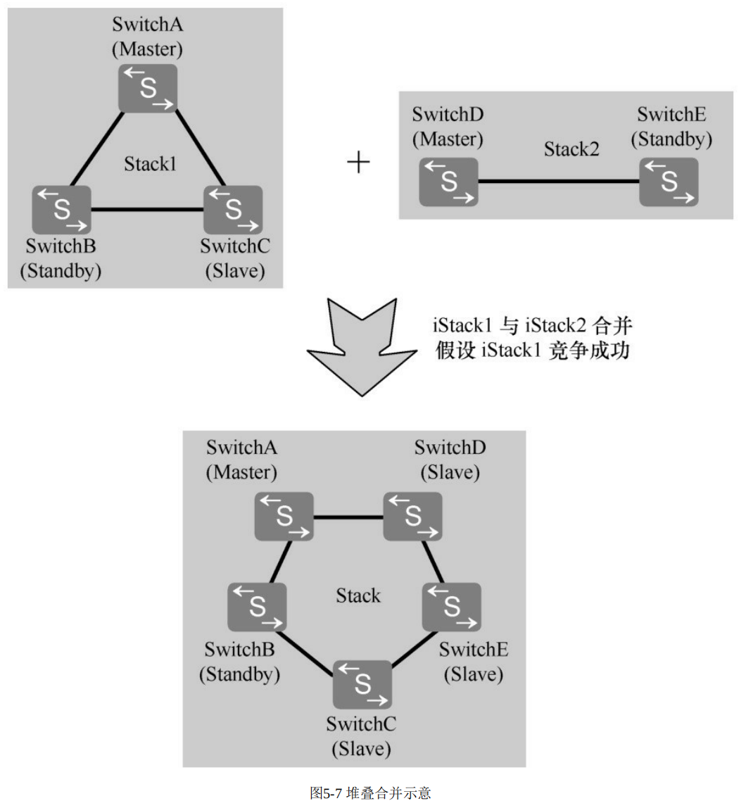
</div>

堆叠合并时主交换机的选举规则如下：

- 先比较运行时间，运行时间较早的堆叠系统竞争为主，此时该堆叠系统的主交换机将成为合并后的堆叠系统的主交换机。
- 如果两个堆叠系统的运行时间一样，其主交换机的选举规则与堆叠建立时一样，**<font color="red">不过此时是直接在两个堆叠系统中的主交换机之间选举合并后堆叠系统的主交换机</font>**。

在以上堆叠合并过程中，**<font color="red">竞争成功的主交换机所在的堆叠系统将保持原有主备从角色和配置不变</font>**，业务也不会受到影响。**<font color="red">而另外一个堆叠系统的所有成员交换机将重新启动，以从交换机的角色加入到新堆叠系统</font>**，其堆叠 ID 将由新主交换机重新分配，并将同步新主交换机的配置文件和系统软件，该堆叠系统的原有业务也将中断。

堆叠合并通常在以下两种情形下出现。
- 堆叠链路或设备故障导致堆叠分裂，链路或设备故障恢复后，分裂的堆叠系统重新合并。
- 待加入堆叠系统的交换机配置了堆叠功能，在不下电的情况下，使用堆叠线缆连接到正在运行的堆叠系统。通常情况下，不建议使用该方式形成堆叠，**因为在合并的过程中可能会导致正在运行的堆叠系统重启，影响业务运行**，下面介绍为什么会影响现网业务运行：

假设现网环境中存在两个独立的堆叠域：

- 现网运行堆叠系统 (System A)：处于 Active 状态，承载核心业务流量。该系统由 Switch 1 和 Switch 2 组成，其中 Switch 1 为当前主交换机（Master），其堆叠优先级配置为默认值或特定值，例如 100。
- 待加入新设备 (System B)：处于已上电状态，且堆叠功能已激活。由于这是一台独立运行的设备，它在本地逻辑上认为自己是 Master。并且该设备可能残留测试配置，其堆叠优先级被设定为 200，高于现网系统 A。

当运维人员在未将 System B 下电的情况下，直接通过堆叠线缆将其与 System A 进行物理连接，两个系统即刻进入堆叠合并流程。此时，双方控制平面立即开始交互堆叠协议报文。系统将检测到网络中存在两个处于 Master 状态的设备，进而触发全网范围内的 Master 角色竞选。

根据堆叠协议的竞选算法，系统将依次比较优先级、MAC 地址等参数。由于新加入设备 System B 的优先级（200）高于现网主设备 System A（100），竞选结果判定 System B 胜出，成为新堆叠系统的唯一 Master。执行动作： 竞选失败的一方（即承载现网业务的 System A）根据协议机制，必须放弃当前的 Master 状态。为了清除旧的堆叠拓扑信息并作为从设备加入新的管理域，System A（包括 Switch 1 和 Switch 2）将被强制执行系统重启。

这一竞选结果将导致灾难性的运维后果：

- 数据平面中断： 在 System A 重启期间，所有经过 Switch 1 和 Switch 2 的现网业务流量将被彻底阻断，导致全网业务瘫痪。
- 管理平面冲突： 重启完成后，System A 将作为 Slave 加入 System B。根据堆叠同步机制，从设备必须同步主设备的配置文件。这意味着，现网原有的正确配置（VLAN、路由、安全策略）可能被 System B 的错误配置强制覆盖，导致网络恢复后依然无法连通，造成严重的生产事故。

### 9.堆叠的分裂与多主检测

堆叠分裂是指稳定运行的堆叠系统中带电移出部分成员交换机，或者堆叠线缆多点故障导致一个堆叠系统变成多个堆叠系统。另外，**<font color="red">由于堆叠系统中所有成员交换机都使用同一个 IP 地址和 MAC 地址（堆叠系统 MAC），一个堆叠分裂后，可能产生多个具有相同 IP 地址和 MAC 地址的堆叠系统，形成冲突</font>**，为此需要进行阻止，这就是后面将要介绍的多主检测功能。

根据原堆叠系统主备交换机分裂后所处位置的不同，堆叠分裂可分为以下两类。

#### 9.1 堆叠分裂

**（1）堆叠分裂后，原主备交换机被分裂到同一个堆叠系统中**

此时，原主交换机会重新计算堆叠拓扑，将移出的成员交换机的拓扑信息删除，并将新的拓扑信息同步给其他成员交换机。而移出的成员交换机检测到堆叠协议报文超时，将自行复位，重新进行选举。如下图所示，堆叠系统分裂后，原主交换机 SwitchA 删除 SwitchD 和 SwitchE 的拓扑信息，并将新的拓扑信息同步给 SwitchB 和 SwitchC，SwitchD 和 SwitchE 重启后，重新进行堆叠建立。

<div align="center">
    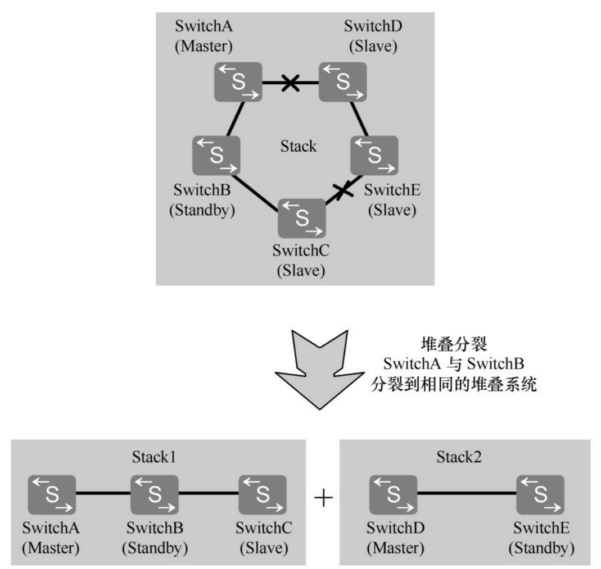
</div>

**（2）堆叠分裂后，原主备交换机被分裂到不同的堆叠系统中**

此时，原主交换机所在堆叠系统重新指定备交换机，重新计算拓扑信息并同步给其他成员交换机。原备交换机所在堆叠系统将升为主交换机，重新计算堆叠拓扑并同步到其他成员交换机，并指定新的备交换机。

如下图所示，堆叠系统分裂后，原主交换机 SwitchA 指定 SwitchD 作为新的备交换机，重新计算拓扑信息，并将新的拓扑信息同步给 SwitchD 和 SwitchE。原备交换机 SwitchB 升级为主交换机，重新计算堆叠拓扑并同步给 SwitchC，并指定 SwitchC 作为新的备交换机。

#### 9.2 多主检测

为防止堆叠分裂后，产生多个具有相同 IP 地址 和 MAC 地址 的堆叠系统，引起网络故障，必须进行 IP 地址 和 MAC 地址 的冲突检查。MAD（Multi-Active Detection， 多主检测）是一种检测和处理堆叠分裂的协议。链路故障导致堆叠系统分裂后，MAD 可以实现堆叠分裂的检测、冲突处理和故障恢复，降低堆叠分裂对业务的影响。

MAD 检测方式有两种：直连检测方式和代理检测方式。在同一个堆叠系统中，两种检测方式互斥，不可以同时配置。

**（1）直连检测**

**<font color="red">直连检测方式是指堆叠成员交换机间通过普通线缆直连的专用链路进行多主检测</font>**。在直连检测方式中，堆叠系统正常运行时不发送 MAD 报文。堆叠系统分裂后，分裂后的两台交换机以 1s 为周期通过检测链路发送 MAD 报文 以进行多主冲突处理。直连检测的连接方式又包括通过中间设备直连和堆叠成员交换机 Full-mesh 方式直连两种方式。

- 通过中间设备直连：如下图所示，堆叠系统的所有成员交换机之间至少有一条检测链路与中间设备（SwitchD）相连。通过中间设备直连可以实现通过中间设备缩短堆叠成员交换机之间的检测链路长度；适用于成员交换机相距较远的场景。

<div align="center">
    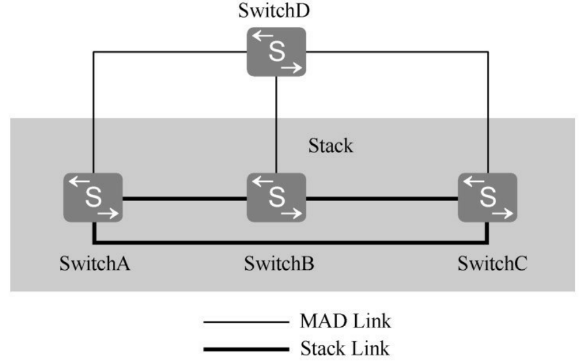
</div>

- Full-mesh 方式直连：如下图所示，堆叠系统的各成员交换机之间通过检测链路建立 Full-mesh 全连接，即每两台成员交换机之间至少有一条检测链路。

<div align="center">
    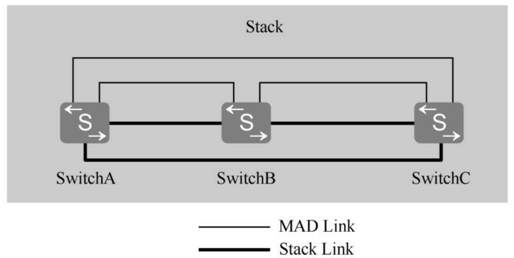
</div>

与通过中间设备直连相比，Full-mesh 方式的直连检测方式无需额外的中间设备，可以避免由中间设备故障导致的 MAD 检测失败，但是每两台成员交换机之间都建立全连接会占用较多的接口，所以该方式适用于成员交换机数目较少的场景。