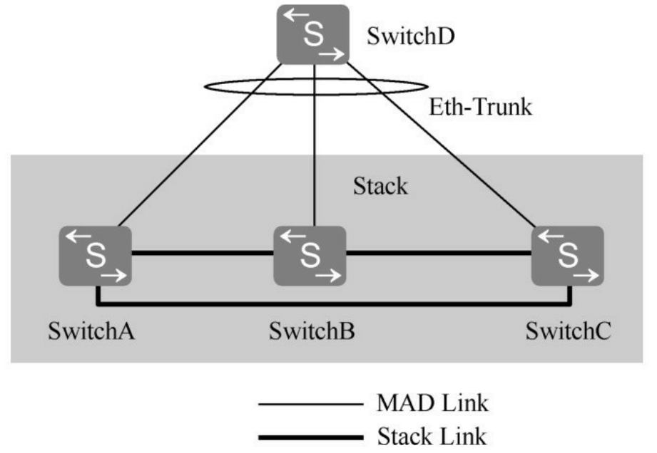
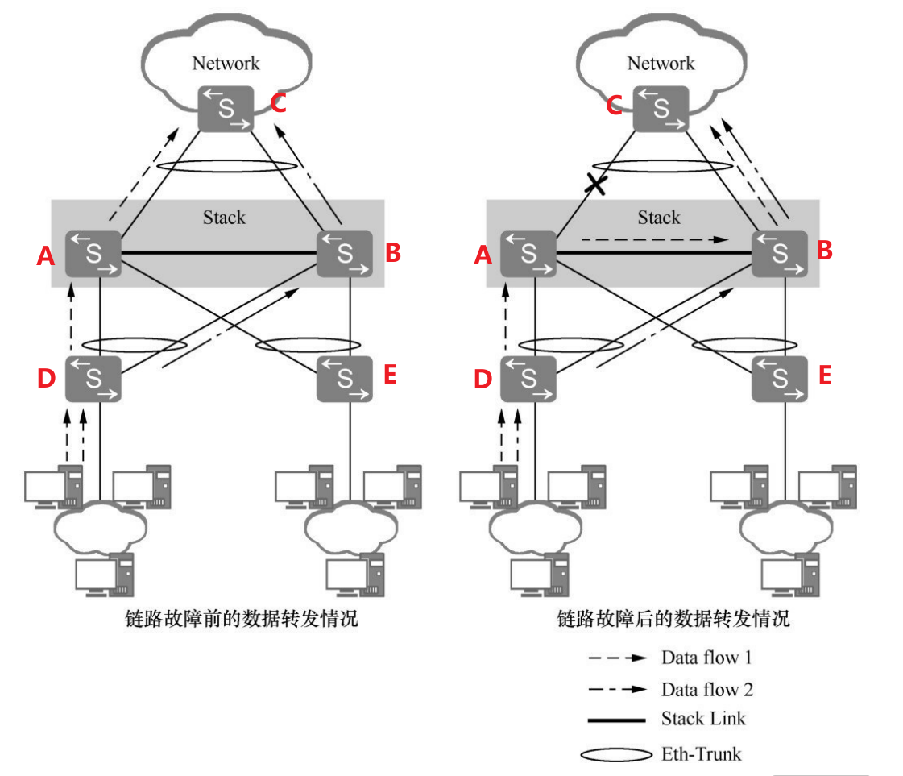
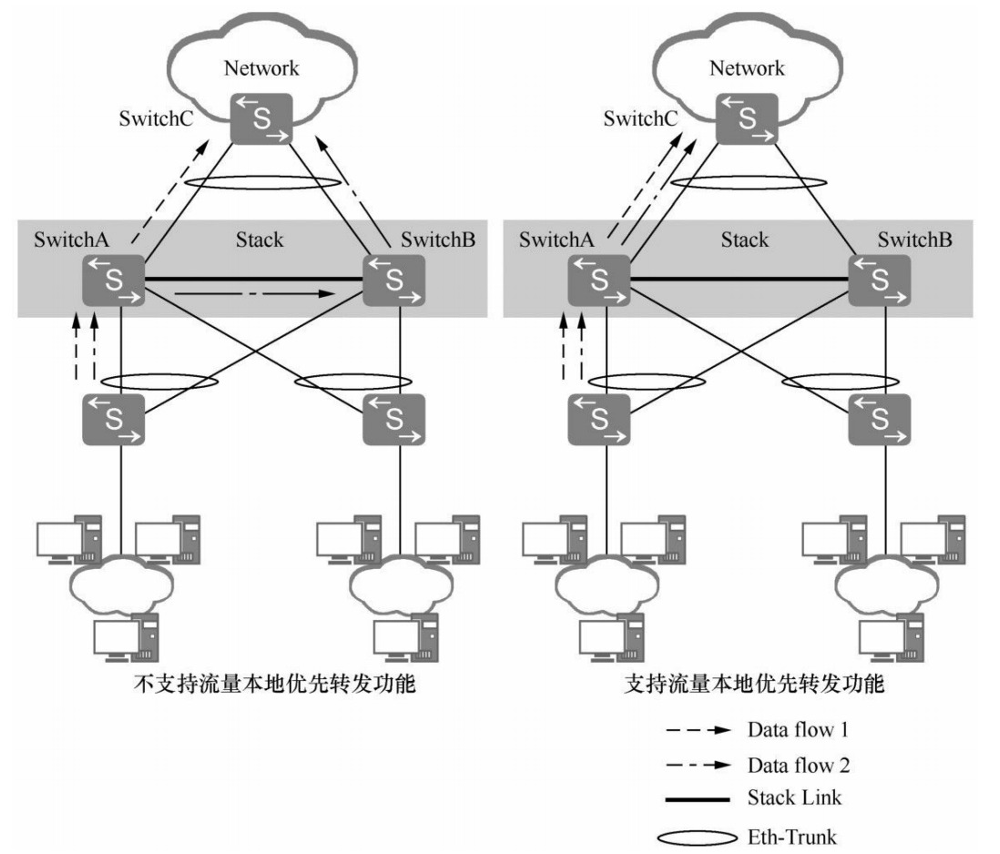
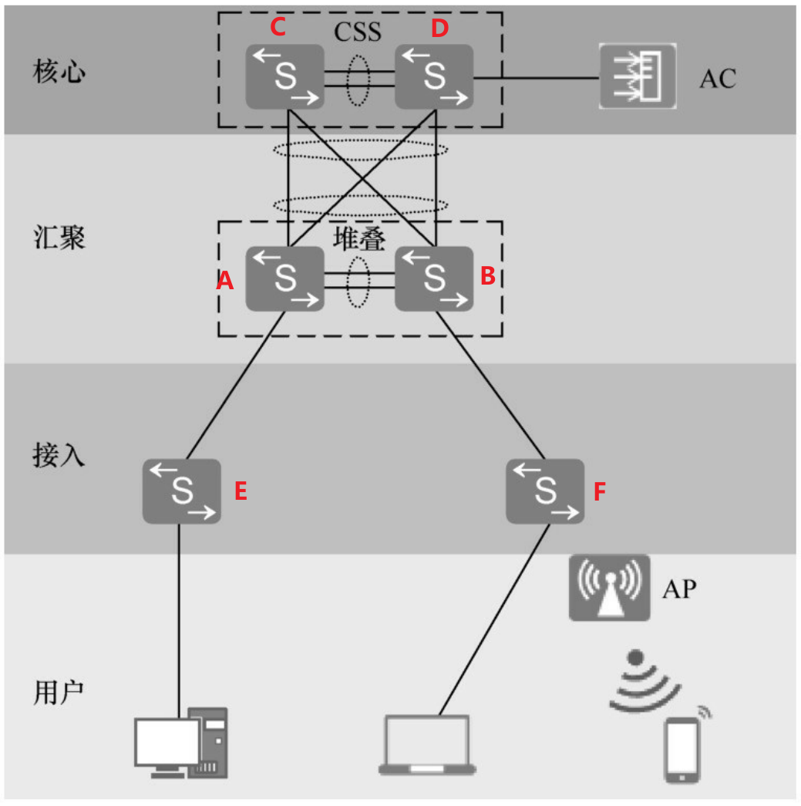
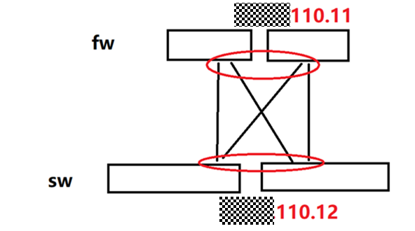
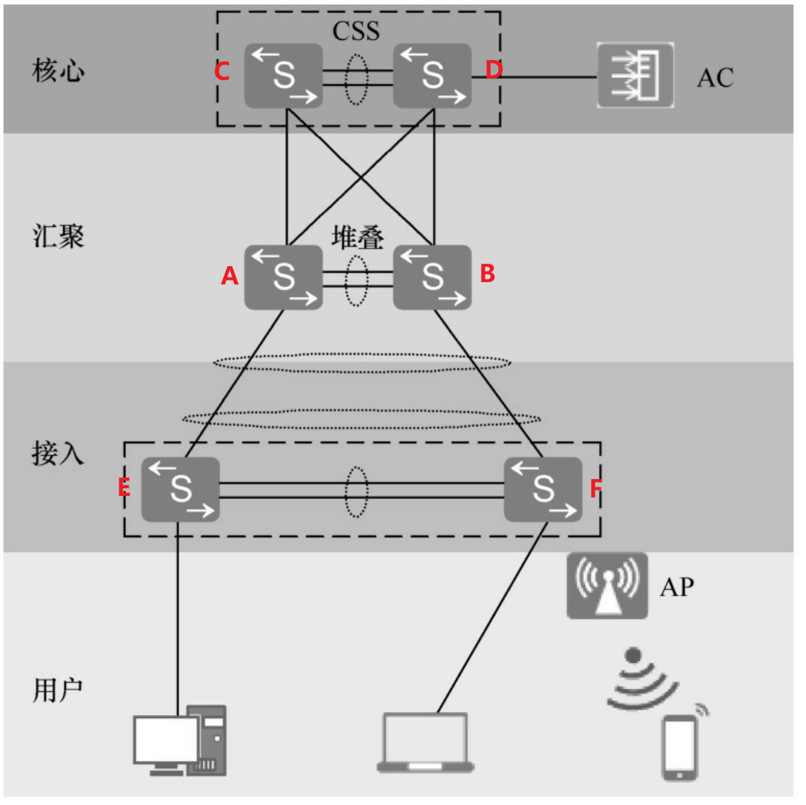
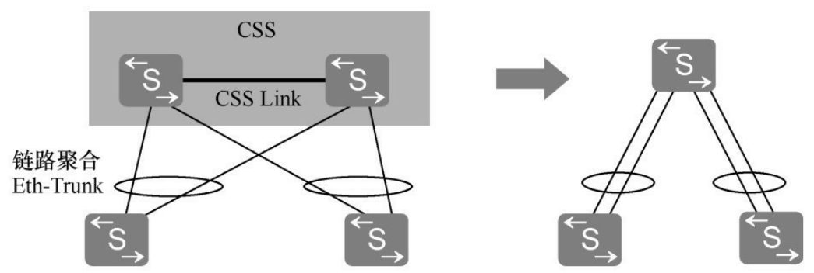
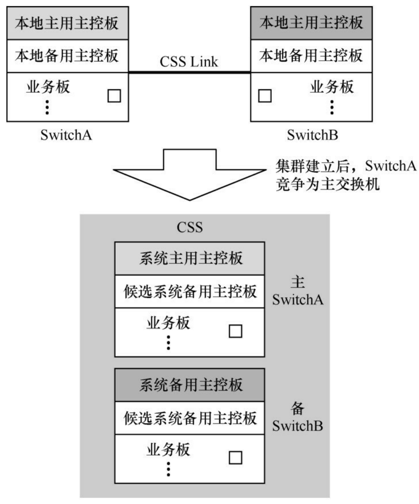
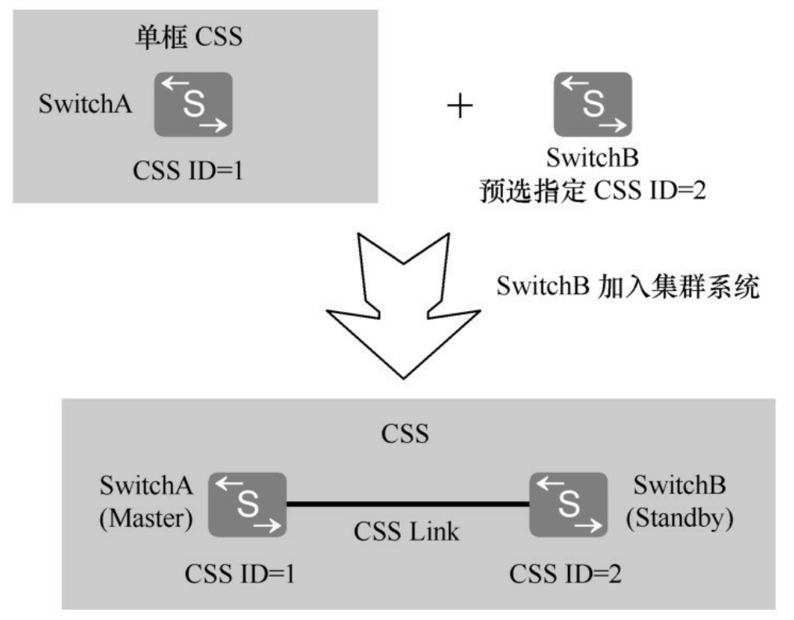
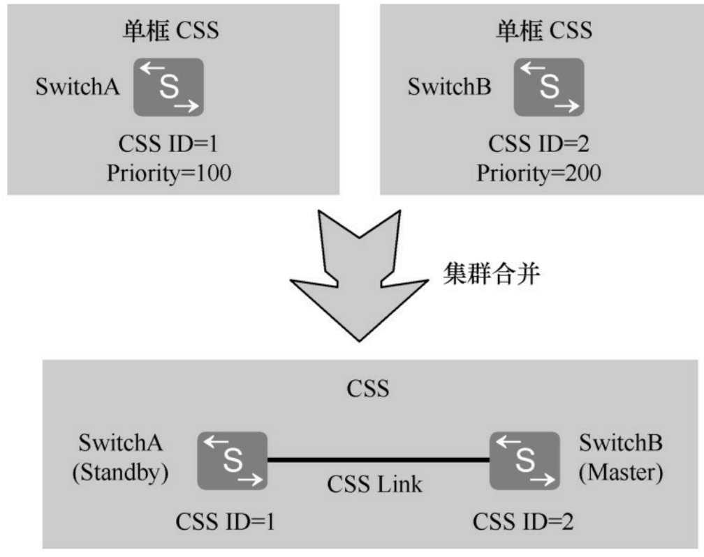

## 三、istack 可靠性

### 1.堆叠的分裂与多主检测

堆叠分裂是指稳定运行的堆叠系统中带电移出部分成员交换机，或者堆叠线缆多点故障导致一个堆叠系统变成多个堆叠系统。另外，**由于堆叠系统中所有成员交换机都使用同一个 IP 地址和 MAC 地址（堆叠系统 MAC），一个堆叠分裂后，可能产生多个具有相同 IP 地址和 MAC 地址的堆叠系统，形成冲突**，为此需要进行阻止，这就是后面将要介绍的多主检测功能。

根据原堆叠系统主备交换机分裂后所处位置的不同，堆叠分裂可分为以下两类。

#### 1.1 堆叠分裂

**（1）堆叠分裂后，原主备交换机被分裂到同一个堆叠系统中**

此时，原主交换机会重新计算堆叠拓扑，将移出的成员交换机的拓扑信息删除，并将新的拓扑信息同步给其他成员交换机。而移出的成员交换机检测到堆叠协议报文超时，将自行复位，重新进行选举。如下图所示，堆叠系统分裂后，原主交换机 SwitchA 删除 SwitchD 和 SwitchE 的拓扑信息，并将新的拓扑信息同步给 SwitchB 和 SwitchC，SwitchD 和 SwitchE 重启后，重新进行堆叠建立。

    

**（2）堆叠分裂后，原主备交换机被分裂到不同的堆叠系统中**

此时，原主交换机所在堆叠系统重新指定备交换机，重新计算拓扑信息并同步给其他成员交换机。原备交换机所在堆叠系统将升为主交换机，重新计算堆叠拓扑并同步到其他成员交换机，并指定新的备交换机。

如下图所示，堆叠系统分裂后，原主交换机 SwitchA 指定 SwitchD 作为新的备交换机，重新计算拓扑信息，并将新的拓扑信息同步给 SwitchD 和 SwitchE。原备交换机 SwitchB 升级为主交换机，重新计算堆叠拓扑并同步给 SwitchC，并指定 SwitchC 作为新的备交换机。

#### 1.2 多主检测

为防止堆叠分裂后，产生多个具有相同 IP 地址 和 MAC 地址 的堆叠系统，引起网络故障，必须进行 IP 地址 和 MAC 地址 的冲突检查。MAD（Multi-Active Detection， 多主检测）是一种检测和处理堆叠分裂的协议。链路故障导致堆叠系统分裂后，MAD 可以实现堆叠分裂的检测、冲突处理和故障恢复，降低堆叠分裂对业务的影响。

>堆叠分裂的检测：堆叠系统建立后，主/备（以及成员间）会在堆叠链路上持续交互堆叠控制报文（心跳报文）。当堆叠线缆/板卡故障、设备重启/下电等导致两边失去堆叠通信时，就判定为堆叠分裂成独立设备。
>多主检测：指 MAD 在检测链路上检测到网络里存在另一套同堆叠 ID/同系统 MAC/IP 的活动系统，从而判定发生了多主，并进入 **`Detect/Recovery`** 等冲突处理与恢复流程。**即堆叠分裂成多部分后互发竞争报文，胜者保持 Detect 状态正常转发，竞争失败者除保留端口外其余端口关闭，进入 Recovery 停止转发**。

MAD 检测方式有两种：直连检测方式和代理检测方式。在同一个堆叠系统中，两种检测方式互斥，不可以同时配置。

**（1）直连检测**

**直连检测方式是指堆叠成员交换机间通过普通线缆直连的专用链路进行多主检测**。在直连检测方式中，堆叠系统正常运行时不发送 MAD 报文。堆叠系统分裂后，分裂后的两台交换机以 1s 为周期通过检测链路发送 MAD 报文 以进行多主冲突处理。直连检测的连接方式又包括通过中间设备直连和堆叠成员交换机 Full-mesh 方式直连两种方式。

- 通过中间设备直连：如下图所示，堆叠系统的所有成员交换机之间至少有一条检测链路与中间设备（SwitchD）相连。通过中间设备直连可以实现通过中间设备缩短堆叠成员交换机之间的检测链路长度；适用于成员交换机相距较远的场景。

    

- Full-mesh 方式直连：如下图所示，堆叠系统的各成员交换机之间通过检测链路建立 Full-mesh 全连接，即每两台成员交换机之间至少有一条检测链路。

    

与通过中间设备直连相比，Full-mesh 方式的直连检测方式无需额外的中间设备，可以避免由中间设备故障导致的 MAD 检测失败，但是每两台成员交换机之间都建立全连接会占用较多的接口，所以该方式适用于成员交换机数目较少的场景。

**（2）代理检测方式**

    

代理检测方式是在堆叠系统 **`Eth-Trunk`** 上启用代理检测，在代理设备上启用 MAD 检测功能。**此种检测方式要求堆叠系统中的所有成员交换机都与代理设备连接，并将这些链路加入同一个 `Eth-Trunk` 内**。与直连检测方式相比，代理检测方式无需占用额外的接口，因为 Eth-Trunk 接口可同时运行 MAD 代理检测和其他业务。

这里解释一下，为什么说代理检测方式无需占用额外的接口，因为在实际组网中，核心堆叠系统（A/B/C）本来就必须通过上行链路连接到汇聚/核心交换机（SwitchD）来传输用户的上网数据、服务器访问数据等业务流量。现在直接利用这条现成的业务 **`Eth-Trunk`** 链路，大部分情况下它传输正常的业务数据帧，但是少数时候它传输 MAD 检测协议报文。因此不仅不需要专门拉线，甚至不需要专门预留端口，直接在承载业务的 **`Eth-Trunk`** 上敲一条命令开启 MAD 功能即可。

在代理检测方式中，堆叠系统正常运行时，堆叠成员交换机以 30s 为周期通过检测链路发送 MAD 报文：

- 堆叠成员交换机对在正常工作状态下收到的 MAD 报文不做任何处理；
- 堆叠分裂后，分裂后的两台交换机以 1s 为周期通过检测链路发送 MAD 报文以进行多主冲突处理；

MAD 进行多主检测的原理：**MAD 报文携带能表征当前 Master 的标识（active ID 等同于 master 的 member ID/堆叠 ID），若在同一 domain 下观察到不同 active ID，则表明出现了多主片段**。

在 IRF/MAD 的公开定义里，MAD 报文会携带 domain ID 与 active ID，domain ID 用来唯一标识一个逻辑堆叠/IRF 系统，active ID 等同于该系统 master 设备的 member ID。判定逻辑可以写成下面这样：

- 若 domain ID 不同：说明不是同一个堆叠系统；
- 若 domain ID 相同 且 active ID 不同：说明在同一个逻辑系统域里，出现了不止一个当前 Master；

在堆叠进入分裂状态时，如果底部堆叠线缆全部断开，SwitchA 与 SwitchB 会分别形成各自独立的堆叠，并且都认为自己是 Master。此时两台交换机会通过各自的上行链路向 SwitchD 发送 MAD 报文，报文内容会声明自身的 Master 身份（**`active ID`**）以及所在的堆叠信息（**`domain ID`**）。

SwitchD 作为代理设备开启了 MAD Relay 功能后，在收到来自 SwitchA 的 MAD 报文时，会将该报文从同一 **`Eth-Trunk`** 的其他成员接口转发出去，使连接在其他成员口上的 SwitchB（以及可能的 SwitchC）也能收到同样的检测信息，SwitchD 也同理。当 SwitchA 与 SwitchB 分别收到对端转发过来的 MAD 报文后，就会基于报文字段判定是否出现多主冲突。

#### 1.3 eth-trunk 和跨设备冗余保护

在该拓扑里，堆叠把 Switch A/B/C 虚拟成一个逻辑设备，而 **`Eth-Trunk`** 把三条上行虚拟成一个逻辑端口。这样从生成树视角看，上游 SwitchD 到堆叠侧只有一条逻辑链路，STP 不会在这三条成员链路里阻塞成员口。除此之外，还具有如下功能：

    

**（1）跨设备冗余保护**

假设 SwitchA 突然断电，或者 SwitchA 与 SwitchD 之间的光纤中断。SwitchD 和堆叠系统之间的 LACP 协议会立即检测到 SwitchA 对应的成员端口失效。**`Eth-Trunk`** 逻辑接口保持 UP 状态（只要还有一条成员链路是通的，逻辑口就不会挂）。系统只需从哈希表中剔除故障链路。原本哈希到 SwitchA 链路的流量，会分担到 SwitchB 和 SwitchC 的链路上。

**（2）流量负载分担与本地优先转发**

- 下行流量（**`SwitchD -> 堆叠`**）：SwitchD 采用标准的哈希算法将流量均匀地撒在三条链路上，分别到达 **`SwitchA、B、C`**。
- 上行流量（**`堆叠 -> SwitchD`**）：根据流量本地优先转发。如果数据包进入了 SwitchA 的业务口，且目的地是 SwitchD。交换机 A 会优先选择自己的物理出口转发数据。避免数据包先转发到 SwitchB，再从 SwitchB 上行。**只有当 SwitchA 自己的上行链路断开时，它才会把数据跨设备转发给 B 或 C 进行上行**。

#### 1.4 MAD 冲突处理

堆叠分裂后，MAD 冲突处理机制会使分裂后的堆叠系统处于 Detect 状态或 Recovery 状态。Detect 状态表示堆叠的正常工作状态，Recovery 状态表示堆叠的禁用状态。

MAD 分裂检测机制会检测到网络中存在多个处于 Detect 状态的堆叠系统，**这些堆叠系统之间相互竞争，竞争成功的堆叠系统保持 Detect 状态，竞争失败的堆叠系统会转入 Recovery 状态**。并且在 Recovery 状态堆叠系统的所有成员交换机上，关闭除保留端口以外的其他所有物理端口，以保证该堆叠系统不再转发业务报文。

#### 1.5 MAD 故障修复

通过修复故障链路，分裂后的堆叠系统会重新合并为一个堆叠系统，重新合并的方式有以下两种。

- 堆叠链路修复后，处于 Recovery 状态的堆叠系统重新启动，与 Detect 状态的堆叠系统合并，同时将被关闭的业务端口恢复 Up，整个堆叠系统恢复。
- 如果故障链路修复前，承载业务的 Detect 状态的堆叠系统也出现了故障。此时，可以先将 Detect 状态的堆叠系统从网络中移除，再通过命令行启用 Recovery 状态的堆叠系统，接替原来的业务，然后再修复原 Detect 状态堆叠系统的故障及链路故障。故障修复后，重新合并堆叠系统。

### 10.跨设备链路聚合与流量本地优先转发

华为 S 系列交换机的 istack 堆叠系统支持跨设备链路聚合技术，通过配置跨设备 **`Eth-Trunk`** 接口实现。**用户可以将不同成员交换机上的物理以太网端口配置成一个聚合端口，连接到上游或下游设备上，实现多台设备之间的链路聚合**。当其中一条聚合链路故障或堆叠中某台成员交换机故障时，**`Eth-Trunk`** 接口通过堆叠线缆将流量重新分布到其他聚合链路上，实现了链路间和设备间的备份，保证了数据流量的可靠传输。

如下图所示，流向网络核心的流量将均匀分布在聚合链路上，当某条聚合链路失效，**`Eth-Trunk`** 接口将流量重新分布到其他聚合链路上，实现了链路间的备份。最开始 **`D->C`** 的流量被分担到 **`D->A->C/D->B->C`** 这 2 条链路上，当 **`A->C`** 之间的链路中断时，此时流量被重新分布到其他聚合链路上，也就是 **`B->C`**。因此此时 **`D->C`** 的流量走向为 **`D->A->B->C/D->B->C`**。

    

**现代交换机在做链路聚合时，采用的通常是逐流负载分担，而不是把每个数据包按轮询方式均匀撒到不同链路上**。电脑上正在进行的一次电影下载连接、一次视频会议会话、浏览器到某个网站的一条 TCP 连接，都可以被看作是一条流。交换机对流做哈希运算，根据这个结果将流映射到某一条具体的成员链路上。

这么做的根本原因是要避免同一条流在不同路径上产生不同的时延和抖动。假设第 1 个包走了更短、更快的路径先到，而第 2 个包因为绕了一跳（多了 B 的中转）延迟更大反而后到，就会出现接收端收到的报文乱序。在 TCP 场景下，乱序会触发接收端的重排缓存等，严重时甚至被误认为丢包而引发重传。

>注意，在上图中，当 **`A->C`** 的链路出现故障时，流量 1 走的路径变成了 **`D->A->B->C`**，并没有遵循流量本地优先转发，这是因为本地优先转发是有本地路可走时尽量本地走，**当本地上联/本地 **`Eth-Trunk`** 活动口故障时，为了不中断业务，会自动退化为跨成员转发**。

如下图所示，流向网络核心的流量将均匀分布在聚合链路上，当某台成员交换机故障时，Eth-Trunk 接口也可将流量重新分布到其他聚合链路上，实现了设备间的备份。

    

跨设备链路聚合实现了数据流量的可靠传输和堆叠成员交换机的相互备份。**但是由于堆叠设备间堆叠线缆的带宽有限，跨设备转发流量增加了堆叠线缆的带宽承载压力**，同时也降低了流量转发效率。为了提高转发效率，减少堆叠线缆上的转发流量，设备支持流量本地优先转发。**设备使能流量本地优先转发后，从本设备进入的流量，优先从本设备相应的接口转发出去，当本设备无出接口或者出接口全部故障时，才会从其他成员交换机的接口转发出去**。

    

如果在堆叠系统中没有使能本地优先转发，则从 SwitchA 进入的流量，根据当前 Eth-Trunk 的负载分担方式，会有一部分经过堆叠线缆从 SwitchB 的物理接口转发出去。但使能本地优先转发之后，从 SwitchA 进入的流量只会从 SwitchA 的接口转发。

>缺省情况下，设备已使能本地优先转发功能。

### 2.istack 的主要使用场景

#### 2.1 场景一：堆叠系统工作在汇聚层

该场景是汇聚交换机堆叠最常见的场景，如下图所示。在该场景下，堆叠系统中的每台交换机上行通过 **`Eth-Trunk`** 接口连接到核心设备上。此堆叠系统简化了汇聚设备的管理，提升了接入设备上行的可靠性。

    

拓扑图的最上层核心区由 C、D 两台核心交换机组成 CSS，对外呈现为一台逻辑核心设备。中间的汇聚区由 A、B 两台汇聚交换机组成堆叠，同样对外表现为一台逻辑汇聚设备。接入区的 E、F 则负责用户与 AP 的实际接入，上连汇聚、下接终端，形成典型园区网络分层结构。汇聚层做堆叠和核心层使用 CSS 集群，显著提升可靠性和简化管理。

Eth-Trunk 把多条物理链路绑定成一个逻辑接口，对上层协议与转发来说就像一根更粗的线。这样既可以实现带宽叠加（例如多条 10G/25G 并行提升总吞吐），另一方面提供链路级冗余（任意一条成员链路故障，聚合口仍保持 Up，流量自动切到剩余链路）。在正常状态下，**`Eth-Trunk`** 还会通过哈希机制对流量做负载分担，从整体上实现多流并行承载。**不过需要注意的是单条会话/单条流一般固定走其中一条成员链路，以避免数据包乱序，但多会话叠加后能够体现明显的分摊效果**。

图中汇聚到核心采用的是典型的交叉上联，A 分别上联到 C、D，B 也分别上联到 C、D，形成 X 形连接，目的是消除单设备/单链路故障带来的单点风险。如果在传统二层架构下、这种交叉二层上联天然会引入环路，需要依赖 STP 阻塞部分链路导致带宽浪费。

而上述拓扑使用堆叠 + CSS 先把多台设备分别虚拟成单台逻辑设备（A + B 使用堆叠虚拟化成单台设备，C + D 使用 CSS 集群虚拟化成单台设备），再用 Eth-Trunk 把多条交叉物理链路聚合成单条逻辑链路。**最终效果是这些跨设备的交叉链路不再被视为二层环路，而是一个统一的逻辑 Eth-Trunk，链路无需被 STP 阻塞即可全部参与转发，既获得最大化的可用带宽，也具备设备级与链路级的冗余能力**。

如果将多根物理线捆成一根逻辑线时，聚合口的对端必须在逻辑上被认为是同一个设备。比如下面的堆叠交换机用一个 Eth-Trunk 同时去连主备两台防火墙（两台防火墙并没有做堆叠/虚拟化）。结论是这些口不能绑定在同一个 Eth-Trunk 里。

    

For stack switch to connect with 2 Firewall, the port cannot be bind into the same Eth-trunk. As switches can be stacked as one switch, we can bind ports from both switches into the same Eth-trunk and act as one interface connect to the peer. However, Active and Standby firewall cannot do stacking, thus they are still 2 different firewalls, **_and two different firewalls need to connect to two different peer interfaces_**. If we bind all 4 ports on the stack switch into one Eth-trunk and connect to 2 firewalls, **_both firewalls will see this Eth-trunk as one port, which means now both the firewall is connecting to the same interface, which is logically incorrect_**.

#### 2.2 场景二：堆叠系统工作在接入层

该场景是二层接入交换机堆叠最常见的场景，如下图所示。在该场景下，堆叠系统中的每台交换机的上行通过 Eth-Trunk 接口连接到汇聚设备上。此堆叠系统简化了接入设备的管理，提升了接入设备上行的可靠性。

    

场景二的拓扑图变化在于，接入侧 E/F 也做成堆叠，E 与 F 对外呈现为一台逻辑接入交换机。在此基础上，接入堆叠的上行链路不再是两条彼此独立的上联，而是把 E、F 各自的一条上行端口纳入同一个 Eth-Trunk，形成一条逻辑上行通道。这样设计的结果是，**`接入 <-> 汇聚`** 链路具备了 Active-Active 的并行转发能力，同时也具备链路级冗余，断一条成员链路业务仍可继续。

## 四、CSS 基础

随着数据中心数据访问量的逐渐增大以及网络可靠性的要求越来越高，单台交换机已经无法满足需求，而通过交换机的集群能够实现数据中心大数据量转发和网络的高可靠性。与其他交换机集群技术一样，它也是将多台支持集群特性的交换机组合在一起，从逻辑上组合成一台整体交换机。

从外在表现看，CSS 是指将两台支持集群特性的交换机设备从逻辑上组合在一起，形成一台交换设备。**只不过一个 CSS 中只能包括两台交换机，而一个 istack 最多可包含 9 台交换机**。

    

### 1.css 集群的基本概念

在华为 CSS 集群组建、配置过程中主要涉及以下基本概念。

- 角色：目前华为 S 系列交换机仅支持两台交换机的集群，集群中两台交换机都称为成员交换机。按照功能的不同，它们分为以下两种角色。
  - 主交换机：Master，负责管理整个集群系统。集群系统中只有一台主交换机。
  - 备交换机：Standby，是主交换机的备份交换机。当主交换机故障时，备交换机会接替原主交换机的所有业务。集群系统中只有一台备交换机。
- 集群 ID：**即 CSS ID，用来标识和管理成员交换机，集群中成员交换机的集群 ID 是唯一的**。
- 集群优先级：**即 Priority，是成员交换机的一个属性，主要用于角色选举过程中确定成员交换机的角色**，优先级值越大表示优先级越高，优先级越高当选为主交换机的可能性越大。

### 2.集群建立的原理

华为交换机的 CSS 集群只能连接两台交换机，两台交换机使用集群线缆连接好，分别使能集群功能并重启，集群系统会自动建立。集群建立时，成员交换机间相互发送集群竞争报文，通过竞争，一台成为主交换机，负责管理整个集群系统，另一台则成为备交换机。整个集群建立过程如下所示：

#### 2.1 角色选举

在 CSS 集群中，要选举一台交换机作为主交换机（另一台就自动成为备交换机），负责整个集群的管理。主交换机选举规则如下：

- 最先完成启动，并进入单框集群运行状态的交换机成为主交换机。
- 当两台交换机同时启动时，集群优先级高的交换机成为主交换机。
- 当两台交换机同时启动，且集群优先级又相同时，MAC 地址小的交换机成为主交换机。
- 当两台交换机同时启动，且集群优先级和 MAC 地址都相同时，集群 ID 小的交换机成为主交换机。

集群系统建立后，在控制平面上，主交换机的主用主控板成为集群系统的主用主控板，作为整个集群系统的管理主角色。备交换机的主用主控板成为集群系统的备用主控板，作为集群系统的管理备角色。主交换机和备交换机的备用主控板作为集群系统候选备用主控板，如下图所示。

    

#### 2.2 版本同步

#### 2.3 配置同步

CSS 集群具有严格的配置文件同步机制，来保证集群中的两台交换机能够像一台设备一样在网络中工作。

集群中的备交换机在启动时，会将主交换机的当前配置文件同步到本地。**集群正常运行后，用户所进行的任何配置，都会记录到主交换机的当前配置文件中，并同步到备交换机**。通过即时同步，集群中的所有交换机均保存相同的配置，这样就使得即使主交换机出现故障，备交换机仍能够按照相同的配置执行各项功能。

#### 2.4 配置备份

交换机从非集群状态进入集群状态后，会自动将原有的非集群状态下的配置文件加上 **`.bak`** 的扩展名进行备份，以便在去使能集群功能后恢复原有配置。例如，原配置文件扩展名为 **`.cfg`**，则备份配置文件扩展名为 **`.cfg.bak`**。去使能交换机集群功能时，用户如果希望恢复交换机的原有配置，可以更改备份配置文件名，并指定其为下一次启动的配置文件，然后重新启动交换机，恢复原有配置。

### 3.集群登陆与访问

集群建立后，两台成员交换机组成一台虚拟设备存在于网络中，集群系统的接口编号规则以及登录与访问的方式都发生了变化。

#### 3.1 接口编号规则

对于单台没有使能集群的交换机，接口编号采用三维格式：**`槽位号/子卡号/端口号`**。交换机使能集群后，使用集群 ID 区分不同的成员交换机，接口编号采用四维格式：**`集群 ID/槽位号/子卡号/端口号`**。

例如：设备没有使能集群时，某个接口的编号为 **`GigabitEthernet1/0/1`**；当该设备使能集群后，如果集群 ID 为 2，则该接口的编号将变为 **`GigabitEthernet2/1/0/1`**。对于集群系统的管理网口，接口编号为 **`Ethernet0/0/0/0`**。

>单台交换机使能集群功能后重启，接口编号也将采用四维格式，此种情况属于单框集群。集群去使能后不能自动将接口的四维格式转换为三维格式，此时需要手工配置。因为集群使能后，系统会自动备份原非集群状态的配置文件（原配置文件扩展名后加上 **`.bak`**），**所以在集群去使能之前，将改名后的原非集群状态的配置文件设置为下次启动配置文件。设置好后，将集群去使能，然后重启设备即可恢复为三维格式**。

#### 3.2 集群系统的登陆

两台交换机上任意主控板的管理网口以及其他三层接口，只要路由可达即可通过 Telnet、STelnet、Web 以及 SNMP 等方式远程登录集群。**无论通过哪台成员交换机登录到集群系统，实际登录的都是主交换机**。主交换机负责将用户的配置下发给备交换机，统一管理所有集群成员交换机的资源。

### 4.集群成员的加入与集群合并

在实际的 CSS 集群配置中，**往往是先在一台交换机上使能 CSS 集群功能，然后再通过集群方式连接另一台成员交换机，然后使能集群功能，此时就相当于向现有 CSS 集群中添加成员交换机**。当然，也可以先把两成员交换机分别使能他们的 CSS 集群功能，然后再通过集群方式连接在一起，此时就相当于两个 CSS 集群的合并。

#### 4.1 集群成员的加入

集群成员加入是指向稳定运行的单框集群系统中添加一台新的交换机（使能了集群功能的单台交换机即为单框集群）。如下图所示，新交换机 SwitchB 将加入单框集群系统从而形成新的集群系统。原单框集群的交换机成为主交换机，新加入的交换机成为备交换机。

    
集群成员加入

    

#### 4.2 集群合并

集群合并是指稳定运行的两个单框集群系统合并成一个新的集群系统。如下图所示，两个单框集群系统将自动选出一个更优的交换机作为合并后集群系统的主交换机。被选为主交换机的配置不变，业务也不会受到影响，框内的备用主控板将重启。而备交换机将整框重启，以集群备用的角色加入新的集群系统，并将同步主交换机的配置，该交换机原有的业务也将中断。

    

集群合并通常在以下两种情形下出现。

- **将两台交换机分别使能集群功能后重启（重启后的两台交换机都属于单框集群），再使用集群线缆将两台交换机连接，之后会进入集群合并流程**。但通常情况下，不建议使用该方式形成集群。
- 集群链路或设备故障导致集群分裂。故障恢复后，分裂后的两个单框集群系统重新合并。

