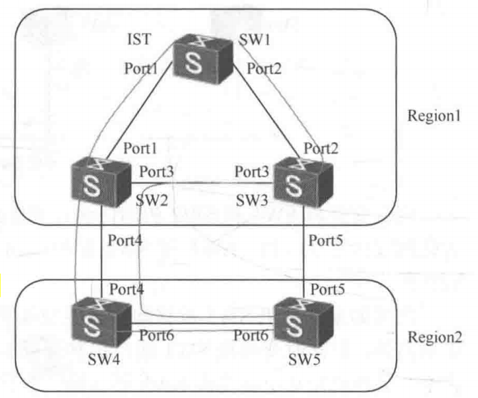
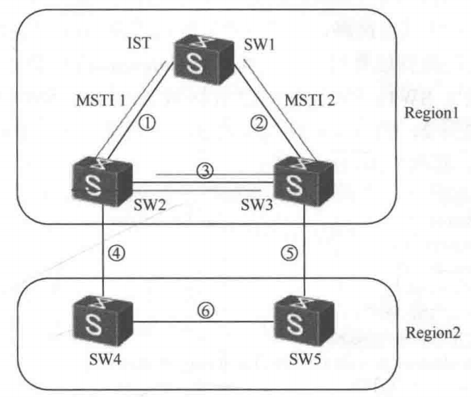
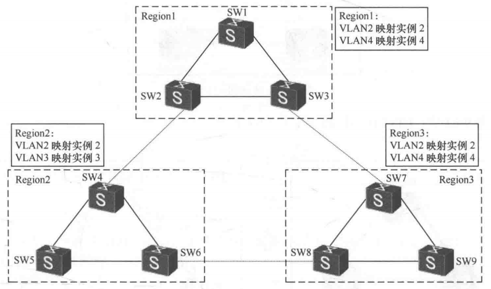
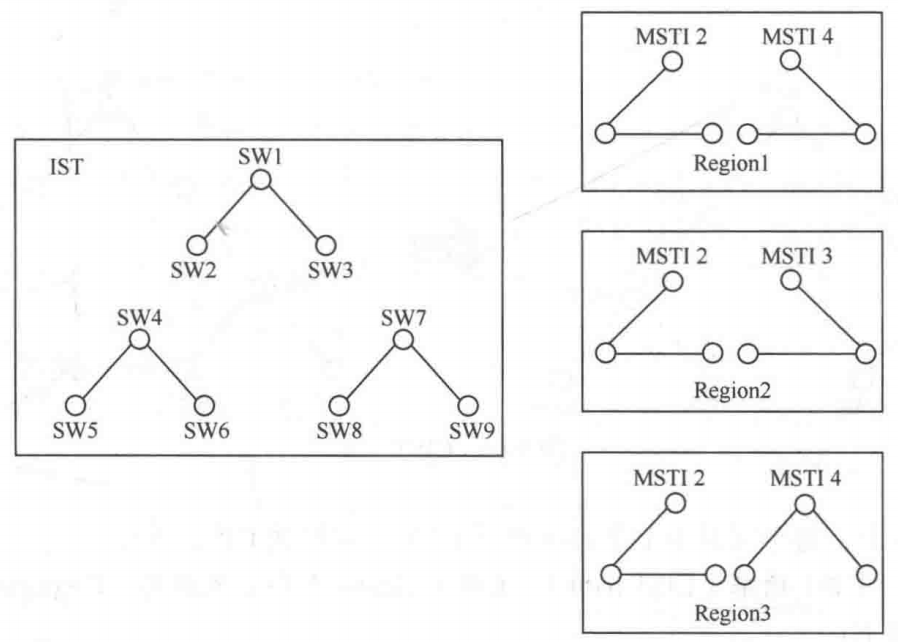
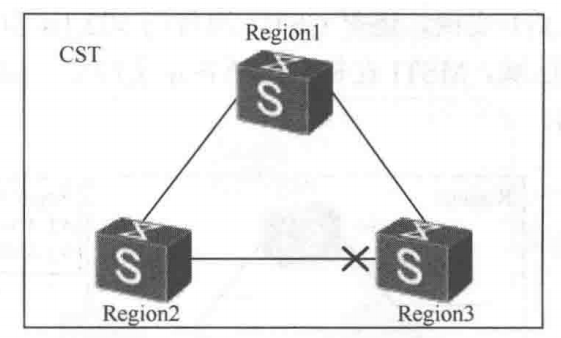
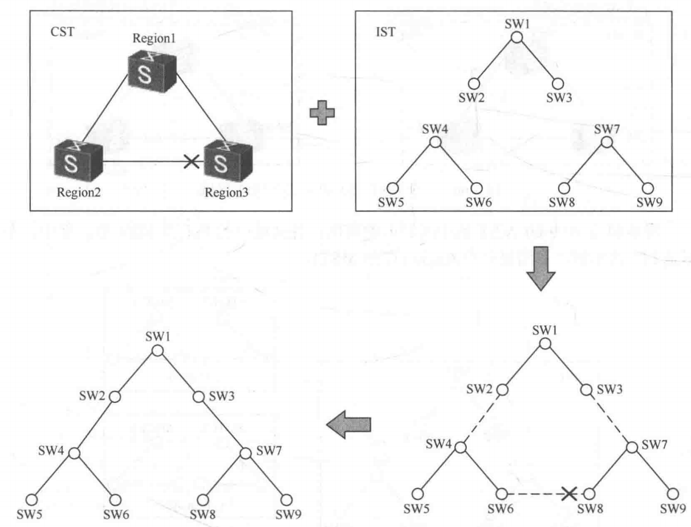
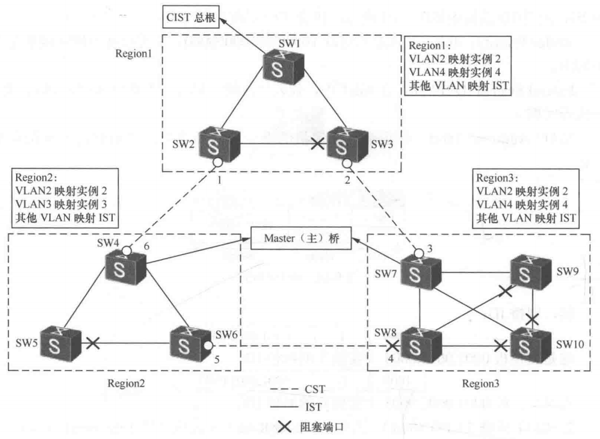
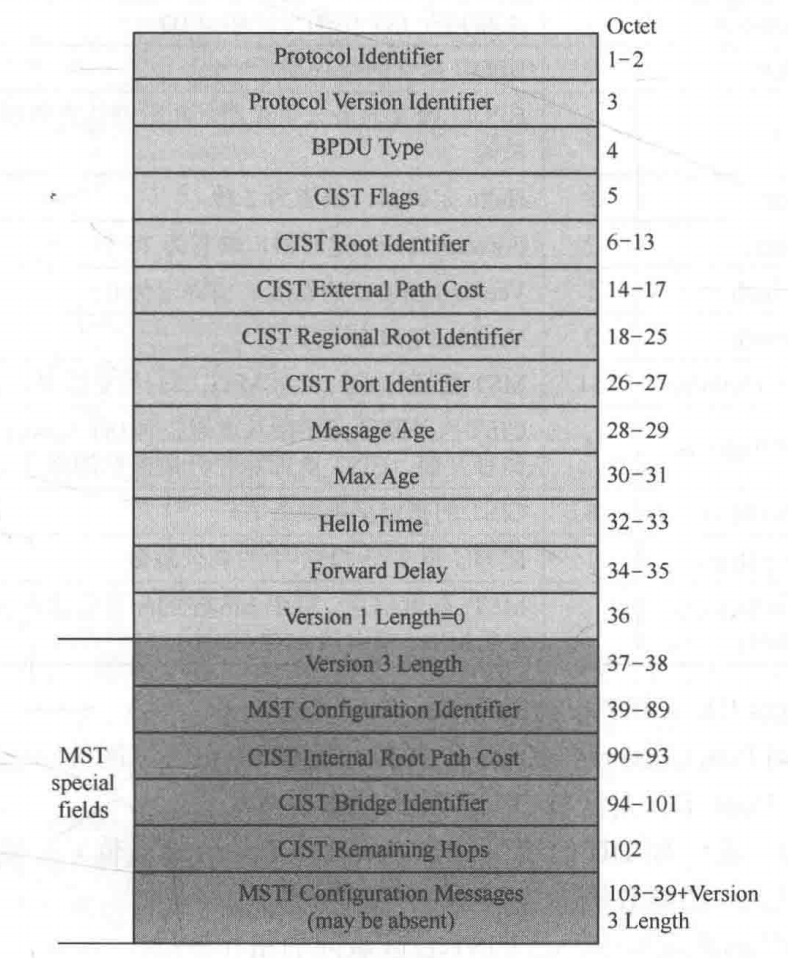
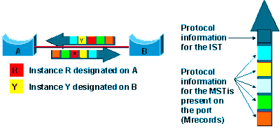
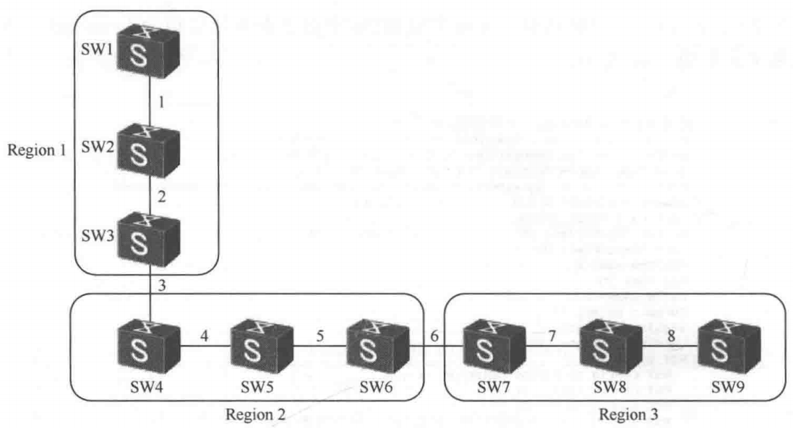

# MSTP 协议

## 1.MSTP 和 STP/RSTP 的比较

华为现有的生成树技术 STP 及 RSTP 在交换机上仅有一个生成树实例，**<font color="red">而 MSTP 可以自定义多个生成树实例，这允许用户映射多个 VLAN 到不同的生成树实例</font>**（生成树拓扑）。**<font color="red">每个生成树实例的拓扑不同，使网络流量（基于 VLAN）按不同的拓扑转发，提高网络链路的使用效率</font>**，避免链路闲置。**这种流量的负载分担是实例间的负载分担**。目前没有任何一种生成树协议能做到在单个实例内多条链路间负载分担（不考虑 Eth-Trunk 技术）。

相比于 STP 及 RSTP 协议，MSTP 的优点是：

- 负载分担：多个 VLAN 的流量使用不同的拓扑来分担网络的流量；
- 冗余性：一个实例的拓扑发生变化，不会影响到其他实例拓扑。

MSTP 的缺点是：

- 相比于单拓扑模型的 STP 和 RSTP，MST 开销稍大；
- **<font color="blue">在多区域（Region）场景下，MST 在区域边界上没有负载分担的能力</font>**；
- **<font color="blue">在 MST 的多区域中，会存在次优路径问题</font>**；

## 2.MST 原理

MSTP 目前是华为交换机上默认的生成树协议，它最大的优点是可以自定义多个生成树实例，**但它可自定义多个实例的这个优点仅限于在单个 Region 中**。MST 把两层交换平面划分为多个 Region，任何一台交换机只能属于一个 Region。它的区域划分方式有些像 IS-IS 的区域划分，区域边界在链路上。MST 的多实例特性是 Region 内的概念，**<font color="red">Region 间享受不到多实例的优点，任何 VLAN 的流量在 Region 间都是按一个拓扑转发的</font>**。建议尽量使用单 Region 设计，使用多个 Region 会增加设计的复杂性，并丧失多实例的负载分担的优点，如下例所示。

>MSTP 的多实例优势，主要发生在 Region 内；**一旦跨 Region，网络就要按 CIST 这一棵公共树来协同**。

<div align="center">
    <div align="center" style="color: #F14; font-size:13px; font-weight:bold">图 1 MST 多区域</div>
    
</div>

在上图中有五台交换机，分布在两个 Region 中，每个 Region 内各自定义了多个实例，Region1 和 Region2 内 PC 节点间流量互访只能使用两根区域间链路中的一根。上图选择 SW2 和 SW4 间端口 4 转发区域间流量。

### 2.1 MST Configuration ID

MST 交换机使用 MST Configuration ID 来标识自己，Configuration ID 由以下三个参数构成。**处在同一个 Region 中的交换机其 Configuration ID 必须一样**。每台 MST 交换机在配置 MST 时都会配置以下参数。

- 区域名字（Region name）：用来定义区域名，大小写敏感，默认值为空；
- 修订号码（Revision-level）：数值范围为 0～65535，默认是 0；
- VLAN 和实例（Instance）的映射关系：为每个实例映射多个 VLAN，默认下所有 VLAN 都映射到一个实例；

BPDU 中包含上述 Configuration ID，**<font color="red">但 BPDU 中并没有直接携带 VLAN 和实例的映射，BPDU 携带的是 VLAN 和实例映射内容被 Hash 计算后所生成的 Hash 值</font>**，这可减少携带内容大小，参考后面 MST 报文结构。

### 2.2 Region

交换机启动之初会互发 MST BPDU，BPDU 中包含 Configuration ID，**如果交换机的 Configuration ID 一致，则两台交换机在同一个 Region 中**，否则交换机彼此不在同一个 Region 中。MST 交换机构成的网络，称为 MST Domain（MST 交换域）。**而其中 Configuration ID 一致的交换机所构成的区域称为 MST Region（MST 区域）**。一个 MST Domain 可以由一个或多个 MST Region 构成。

交换机依据其所在的位置而称为区域内交换机和区域边界交换机。连接其他区域的链路是区域间链路，这个端口称为区域边界端口。

在上图 1 中，SW1 是区域内交换机，端口 1 和 2 是区域内端口，SW2 是区域边界交换机，其端口 1 和 3 是区域内端口，而端口 4 是区域边界端口。同理，SW3、SW4、SW5 都是边界交换机，它们都有边界端口（收到不同 Configuration ID）。**在上图 1 中，SW1、SW2 和 SW3 在区域 ABC 中（Region1），SW4 和 SW5 在区域 CDE 中（Region2），VLAN10 使用实例 2，VLAN20 使用实例 3**，上述需求的 MST 配置如下所示：

```java{.line-numbers}
#
[SW4]stp region-configuration
[SW4-mst-region]region-name CDE
[SW4-mst-region]revision-level 10
[SW4-mst-region]instance 2 vlan 10
[SW4-mst-region]instance 3 vlan 20
[SW4-mst-region]active region-configuration
Info: This operation may take a few seconds. Please wait for a moment...done.
[SW4-mst-region]quit
#
[SW4]dis stp region-configuration
    Oper configuration
        Format selector      :0
        Region name          :CDE
        Revision level       :10

    Instance    VLANs Mapped
    0           1 to 9, 11 to 19, 21 to 4094
    2           10
    3           20
#
```
>说明：上述 MST 配置一定要使用 **`active region-configuration`** 命令激活，否则不会生效。另外，**`revision-level`** 可以不定义，默认值为 0。

### 2.3 生成树实例——MSTI 和 IST

MST 引入了生成树实例的概念，每个生成树实例就是一个独立的生成树拓扑，**<font color="red">MST 定义要求每个自定义的生成树实例仅出现在区域内。一个区域内的链路可以同时出现在多个生成树实例中，但其角色和状态可能不一样，而区域间边界链路上不存在多个实例，端口只有一种状态，转发或阻塞</font>**，这依据边界端口在实例中的角色而定。

MST 实例分系统默认实例（实例 0）和用户自定义实例（实例 1、实例 2 等）。在区域内，**<font color="red">每个自定义的实例称为 MSTI（MST Instance）</font>**，每个实例有对应的 ID（1-4094）。自定义的多个实例可以使用不同的拓扑，流量可以使用不同的转发路径，所以在区域内可以很容易实现负载分担。

**<font color="red">IST（Internal Spanning Tree Instance）是 MST 交换机上默认存在的生成树实例，它是特殊的 MST 实例，实例 ID 为 0，所有 VLAN 默认都映射到 IST 实例</font>**。如果没有定义其他 MST 实例，任何 VLAN 的数据默认都使用生成树实例 0 的拓扑转发，**而交换机则相当于单实例的 RSTP 模式交换机**。下图中，在 Region1 内定义 MST 实例 1 和 MST 实例 2，实例间彼此独立。

<div align="center">
    <div align="center" style="color: #F14; font-size:13px; font-weight:bold">图 2 MST 多实例—MSTI1 和 MSTI2</div>
    
</div>

MST 实例（MSTI）的特点：

- MSTI 可以与一个或者多个 VLAN 对应，但一个 VLAN 只能与一个 MSTI 对应；
- 每个 MSTI 独立计算自己的生成树，互不干扰；
- 每个 MSTI 的生成树计算使用 802.1w 算法；
- **每个 MSTI 的生成树可以有各自不同的根、不同的拓扑，各自的树根称为区域根**；
- 每个端口在不同 MSTI 上的生成树参数可以不同；
- 每个端口在不同 MSTI 上的角色、状态可以不同；
- 每个 MSTI 的拓扑通过命令配置决定；
- **每个 MSTI 中的端口都是区域内端口，非边界端口**；
- 区域中所有 MSTI 共用区域间端口。

在图 2 中，区域 ABC 中包含 SW1、SW2 和 SW3 交换机，通过命令调整树根的位置，使实例 1 的根桥是 SW2，实例 2 的根桥是 SW3。如果各实例的当前根桥失效，使 SW2 是实例 2 的根桥，SW3 是实例 1 的根桥。

```java{.line-numbers}
[SW2]STP instance 1 root primary
[SW2]STP instance 2 root secondary
#
[SW3]STP instance 2 root primary
[SW3]STP instance 1 root secondary
```

### 2.4 CIST

MST 实例仅出现在每个区域内，并不出现在区域间，**<font color="red">如果把每个区域看作是一台大的交换机，则连接这些交换机的树称为 CST（Common Spanning Tree）</font>**。CST 在区域间连接每个区域的 IST/MST 实例。**<font color="blue">区域内 IST 和区域间的 CST 连接在一起构成的这棵树称为 CIST（Common and Internal Spanning Tree）</font>**。CIST 是遍及整个 MST 域（Domain）中交换机的一棵树。这棵树在区域内的部分就是每个区域中实例 0，在区域间的部分就是 CST。

>不论是 MST 实例、IST 实例，还是 CST，都使用 802.1w 算法来计算树的拓扑。

下图 3 中共有 3 个区域，MSTI 在每个区域中各定义两个，如下图所示，在区域 1 中定义了 MSTI2 和 MSTI4。

<div align="center">
    <div align="center" style="color: #F14; font-size:13px; font-weight:bold">图 3 一个 MST 交换域，三个 MST 区域</div>
    
</div>

下图 4 是图 3 MST 域中各区域内的实例：各区域中的 IST 及 MSTI，其中左图是 IST 的实例，右图是每个 Region 中的 MSTI。

<div align="center">
    <div align="center" style="color: #F14; font-size:13px; font-weight:bold">图 4 三个区域中的 IST 和 MSTI 实例</div>
    
</div>

区域间的 CST：三台大交换机中，上面的交换机是根桥交换机（CIST root 在区域 1 中）。下图 5 中，交换机间链路拓扑即是 CST。

<div align="center">
    <div align="center" style="color: #F14; font-size:13px; font-weight:bold">图 5 区域间的 CST 树</div>
    
</div>

图 6 中，CIST 由各区域 IST 和 CST 构成。

<div align="center">
    <div align="center" style="color: #F14; font-size:13px; font-weight:bold">图 6 CIST 构成</div>
    
</div>

在上图 6 中，**每个区域中 IST 和区域间 CST 一起构成 CIST 拓扑**。

### 2.5 CIST 树根（CIST root）、主桥（Master）和区域根桥（Regional root）

#### 2.5.1 网桥 ID

在 MST 网络中，**<font color="red">如果交换机上有多个实例，则交换机在每个实例中都有唯一的网桥 ID</font>**，网桥 ID 的构成如下所示，包含 3 个字段：

- **`Bridge Priority`**：4bit，默认是二进制 **`1000.000000000000`**，它可以在不同实例中定义不同的值；
- **`Extend System ID`**：12 bit，在 MST 中，代表生成树实例号，为 0 时则代表 IST，为 1 则代表实例 1；
- **`MAC Address`**：48bit，标识每台交换机的唯一的硬件地址，该值在每个实例中都一样；

```c{.line-numbers}
                    Bridge ID - 8 Bytes
┌────────────────┬────────────────────┬──────────────────────────────┐
│ Bridge         │ Extend             │ MAC Address                  │
│ Priority       │ System ID          │                              │
├────────────────┼────────────────────┼──────────────────────────────┤
│ 4 bits         │ 12 bits            │ 48 bits                      │
└────────────────┴────────────────────┴──────────────────────────────┘
```

#### 2.5.2 CIST 树根（CIST root）、主桥（Master）和区域根桥（Regional root）

CIST 树的树根称为 CIST 树根。**<font color="red">整个交换域中，每台交换机上都有实例 0，其中网桥 ID 最小的那台交换机就是 CIST 树的树根</font>**。在图 3 中 SW1 就是 CIST 的树根。

- **区域根（RegRoot）是在每个区域中的 MST 实例的根桥，它是该实例中桥 ID 最小的那台交换机。<font color="red">实例 0 的根桥也可以称为区域根桥（同时也是主桥）</font>**。
- CIST 根桥，全网络就一个。**在 MST Domain 中，CIST 根桥是实例 0 中桥 ID 最小的那台交换机**。
- 主桥，每个区域各一个。**主桥是在每个区域中的 IST 的根桥。在 CIST 根桥所在的区域中，主桥就是 CIST 根桥**。在其他区域中，主桥一定是距离 CIST 根桥最近的交换机。这个最近是仅考虑区域间路径而言的。可把每个 Region 看成一台大的交换机，**<font color="red">这台交换机内部的路径成本不在考虑范围之内</font>**。区域中主桥的选择不一定是桥 ID 最小的那台交换机，非 CIST 根桥所在的区域，主桥一定是边界交换机。
- 区域根桥，每个区域中每个实例都有各自的区域内根桥。

>Within an MSTP (Multiple Spanning Tree Protocol) region, **the bridge with the lowest path cost to the CIST root bridge is the CIST regional root bridge**. The path cost, also known as the CIST external path cost, is a function of the link speed and number of hops. If there is more than one bridge with the same path cost, the bridge with the lowest bridge ID becomes the CIST regional root（主桥）. **If the CIST root is inside an MSTP region, the same bridge is the CIST regional root for that region because it has the lowest path cost to the CIST root**. If the CIST root is outside an MSTP region, all regions connect to the CIST root via their CIST regional roots.

MSTP 会把每个 MST Region 在区域外抽象成一台虚拟交换机，区域之间跑的是 CIST（Common and Internal Spanning Tree）。当 CIST 根桥不在本 Region 时，本 Region 必须从边界交换机（boundary bridge）里选出一个代表本区域对外的设备作为 CIST Regional Root（也叫 IST Master）。

<div align="center">
    <div align="center" style="color: #F14; font-size:13px; font-weight:bold">图 7 多个区域构成的 MST 交换网络</div>
    
</div>

在上图 7 中，区域间链路 **`SW2-SW4`**、**`SW3-SW7`** 及 **`SW6-SW8`** 的链路成本各为 20000，用交换机编号作为网桥 ID。SW1 的桥 ID 最小，SW10 桥 ID 最大。图 7 中 SW1 是所有 IST 中桥 ID 最小的交换机，所以它是 CIST 根桥（CIST Root）。图 7 中有三个区域，在区域 1 中，主桥即是 CIST 根桥，图中 SW1 是主桥；**<font color="red">在区域 2 中，主桥是 SW4，区域 3 中主桥是 SW7（区域内路径不参与计算，区域间的路径成本是选择 Region2 和 Region3 中主桥的依据）</font>**。

### 2.6 端口角色

在 STP/RSTP 中，端口角色分为 RP、DP、AP、BP，但是在 **`802.1s`** 中，又在上述基础之上新增了边缘端口（Boundary Port）和主端口（Master Port）。以下称 CIST 根桥为总根。

1. **域边缘端口（Boundary Port）**：位于 MST 域的边缘并连接其他 MST 区域的端口。域边缘端口出现在 CST/CIST 上，是 CST/CIST 的端口状态，主端口也是域边缘端口。在上图 7 中端口 1～6 都是域边缘端口。
2. **主端口（Master Port）**：**<font color="red">在非 CIST 根桥所在区域中的主桥交换机上，实例 0 的 RP 端口在其他 MST 实例中被称为主端口（Master Port）</font>**，它是区域中其他实例到 CIST 根桥的最近端口，也是主桥交换机上的边界端口，它的端口状态和 IST 实例中的 RP 端口一样，其最终状态一定是转发状态的端口，一定是区域内所有其他实例的数据访问 CIST 根桥所要经过的端口。图 7 中，端口 6 是区域 2 中的 Master 端口，端口 3 是区域 3 中的 Master 端口。

>说明在 CIST 根桥所在的区域，主桥上没有主端口。

### 2.7 MST BPDU

#### 2.7.1 报文结构

MST 中可以定义多个实例，**<font color="red">但所有自定义的实例和 IST 实例的拓扑都是用一份 BPDU 来传递的</font>**。网络中定义的 MST 实例使用 M 记录（M-Record）来承载其拓扑信息。**<font color="red">一个 Region 中定义多少 MST 实例，BPDU 中就包含多少个 M 记录</font>**。MSTP 报文格式如下图所示。

<div align="center">
    <div align="center" style="color: #F14; font-size:13px; font-weight:bold">图 8 MSTP BPDU 报文结构</div>
    
</div>

There is no limit to the number of regions in the network, _**but every region can support a maximum of 16 MSTIs**_. Instance 0 is a special instance for a region, known as the Internal Spanning Tree (IST) instance. All other instances are numbered from 1 to 4094. **_IST is the only spanning-tree instance that sends and receives BPDUs (typically, BPDUs are untagged)_**. All other spanning-tree instance information is included in MSTP records (M-records), which are encapsulated within MSTP BPDUs. This means that a single BPDU carries information for multiple MSTIs, which reduces overhead of the protocol. Any MSTI is local to an MSTP region and completely independent from an MSTI in other MST regions. **Two redundantly connected MST regions use only a single path for all traffic flows (no load balancing between MST regions or between MST and SST region)**.

MSTIs do not send independent individual BPDUs. Inside the MST region, bridges exchange MST BPDUs that can be seen as normal RSTP BPDUs for the IST and also contain additional information for each MSTI. This diagram shows a BPDU exchange between Switches A and B inside an MST region. Each switch only sends one BPDU, but each includes one MRecord per MSTI present on the ports.

<div align="center">
    <div align="center" style="color: #F14; font-size:13px; font-weight:bold">图 9 MSTP BPDU 报文中多个 M 记录</div>
    
</div>

#### 2.7.2 BPDU 报文格式

MST 报文内容说明如下：

- **`Protocol Identifier`**：协议标识符；
- **`Protocol Version Identifier`**：协议版本标识符，STP 为 0，RSTP 为 2，MSTP 为 3；
- **`BPDU Type`**：BPDU 类型，STP 的 Configuration BPDU 是 0x00，STP 的 TCN BPDU（Topology Change Notification BPDU）是 0x80，RST BPDU 或 MST BPDU 是 0x02；
- **`CIST Flags`**：CIST 标志字段；
- **`CIST Root Identifier`**：CIST 根桥设备 ID；
- **`CIST External Path Cost`**：**<font color="red">CIST 外部路径开销指从本交换设备所属的 MST 域到 CIST 根交换设备所属的 MST 域的累计路径开销</font>**。CIST 外部路径开销根据链路带宽计算；
- **`CIST Regional Root Identifier`**：**CIST 的域根交换设备 ID**，即 IST Master（主桥）的 ID。如果总根在这个域内，那么域根交换设备 ID 就是总根交换设备 ID；
- **`CIST Port Identifier`**：本端口在 IST 中的指定端口 ID；
- **`Message Age`**：BPDU 报文的生存期；
- **`Max Age`**：BPDU 报文的最大生存期，超时则认为到根交换设备的链路故障；
- **`Hello Time`**：Hello 定时器，缺省为 2 秒；
- **`Forward Delay`**：Forward Delay 定时器，缺省为 15 秒；
- **`Version1 Length`**：Version1 BPDU 的长度，值固定为 0；
- **`Version3 Length`**：Version3 BPDU 的长度；
- **`MST Configuration Identifier`**：MST 配置标识，表示 MST 域的标签信息，包含 4 个字段；
- **`CIST Internal Root Path Cost`**：**<font color="red">CIST 内部路径开销指从本端口到 IST Master 交换设备的累计路径开销</font>**。CIST 内部路径开销根据链路带宽计算；
- **`CIST Bridge Identifier`**：CIST 的指定交换设备 ID；
- **`CIST Remaining Hops`**：BPDU 报文在 CIST 中的剩余跳数；
- **`MSTI Configuration Messages`**：MSTI 配置信息。每个 MSTI 的配置信息占 16Bytes，如果有 n 个 MSTI 就占用 **`n×16Bytes`**；

CIST Root ID（CIST 根桥的桥 ID）、CIST External Path Cost（区域间路径成本）、CIST Master Root ID（是区域中 IST 实例的主桥 ID）、CIST Port ID（流出 BPDU 的端口 ID，端口优先级必须是 16 的倍数）是 CIST 在区域间的拓扑信息，**<font color="red">它们在 BPDU 标准部分中携带</font>**。

**<font color="red">而 CIST Internal Root Path Cost（CIST 内部到主桥的路径成本）和 CIST Bridge ID（CIST 指定交换设备 ID）是 CIST 在区域内的 IST 实例的拓扑信息，它们在 BPDU MST 扩展部分中携带</font>**。

>在每个 Region 内的 MST 实例的拓扑信息仅在 Region 有效且有意义，不在 Region 间通告。
>说明：域边界交换机上，边界端口中 DP 端口在所有的实例中都是 DP 端口，从位置上看端口是边界端口，但该端口并没有收到任何 BPDU，并无法判定自己是边界端口，所以通告的 BPDU 中，Region 内的 MST 实例信息依然出现在 BPDU 内，下游的接收交换机是边界交换机，并不关心其他 Region 中的 MST 实例信息，会忽略该信息，仅需要了解 CIST 实例的信息。

MSTP 是靠收到的 BPDU 来判断本交换机是否为边界交换机：

- 收到 802.1D STP（v0） BPDU；
- 收到 RSTP（v2） BPDU；
- 收到 MSTP（v3）但 Region 参数不匹配（名字/修订号/配置摘要 digest 不同）；

但该端口并没有收到任何 BPDU，并无法判定自己是边界端口，所以通告的 BPDU 中，Region 内的 MST 实例信息依然出现在 BPDU 内。这句话的意思是，**在某个时刻，交换机还没有收到能够证明对端属于别的 Region/别的协议版本的 BPDU，因此它还不能把这个口正式判定为边界端口**，从而继续将 Region 内的 MST 实例信息通告给其他交换机。

#### 2.7.3 BPDU 报文格式

MSTP 的 BPDU 报文存在两种格式，一种是 **`IEEE 802.1s`** 规定的标准格式，一种是华为私有格式，当和第三方设备互操作时，华为交换机会自动匹配使用的格式。华为的端口收发 MSTP 报文格式可配置（stp compliance）功能，能够实现对 BPDU 报文格式的自适应——auto、dot1s、legacy。默认是自适应。

#### 2.7.4 MSTI 和 IST 的拓扑信息

MSTI 和 CIST 都是根据优先级向量来计算各自的拓扑，这些优先级向量信息都包含在上述 MST BPDU 中。交换机间互相交换 MST BPDU 来计算生成各自实例的拓扑。

- 优先级向量：参与 CIST 计算的优先级向量为 **`{ CIST 根桥 ID，区域外部路径开销，主桥 ID，区域内部路径开销，指定交换机桥 ID，指定端口 ID，接收端口 ID }`**；
- 参与 MSTI 计算的优先级向量为：**`{ 区域根桥 ID，区域内部路径开销，指定交换机桥 ID，指定端口 ID，接收端口 ID }`**；

#### 2.7.5 区域内和区域间 BPDU 内容分析

下图 10 包含 3 个区域，分别是 Region1、Region2 和 Region3。其中，SW1 是 CIST 根桥。分析 BPDU 转发到 SW9 的过程。图中 1，2，…，8 数字是交换机间生成树端口成本。

<div align="center">
    <div align="center" style="color: #F14; font-size:13px; font-weight:bold">图 10 Region 间 BPDU 变化</div>
    
</div>

BPDU 从 CIST 根桥产生，**<font color="red">BPDU 在区域内传递时，区域间的 CIST 部分的拓扑信息不变化，仅实例的拓扑信息变化</font>**，实例包含 IST 和 MST 实例。BPDU 在区域间传递时，区域内的拓扑信息对邻居区域没有影响。以下内容是按照 BPDU 的内容来排列拓扑信息的，并非按优先级向量的比较顺序排列。

```java{.line-numbers}
1．SW1 是 CIST Root，由 SW1 到 SW2 的 BPDU：
CIST RootID             = SW1
（external）PathCost    = 0
RegionalBID             = SW1
PortID                  = SW1 Port ID
InternalPathCost        = 0
BID                     = SW1

2．在 Region1 中，SW2 流给 SW3 的 BPDU
CIST RootID             = SW1
（external）PathCost    = 0
RegionalBID             = SW1
PortID                  = SW2 Port ID
InternalPathCost        = 0+1
BID                     = SW2

3．从 SW3 流出时
RootID                  = SW1
（external）PathCost    = 0
RegionalBID             = SW1
PortID                  = SW3 Port ID
InternalPathCost        = 1+2
BID                     = SW3

4．SW4 流出时
RootID                  = SW1
（external）PathCost    = 3
RegionalBID             = SW4
PortID                  = SW4 port id
InternalPathCost        = 0
BID                     = SW4

5．SW5 流出时
RootID                  = SW1
（external）PathCost    = 3
RegionalBID             = SW4
PortID                  = SW5 port id
InternalPathCost        = 4
BID                     = SW5

6．SW6 流出时
RootID                  = SW1
（external）PathCost    = 3
RegionalBID             = SW4
PortID                  = SW6 port id
InternalPathCost        = 9
BID                     = SW6

7．SW7 流出时
RootID                  = SW1
（external）PathCost    = 9
RegionalBID             = SW7
PortID                  = SW7 port id
InternalPathCost        = 0
BID                     = SW7

8．SW8 流出时
RootID                  = SW1
（external）PathCost    = 9
RegionalBID             = SW7
PortID                  = SW8 port id
InternalPathCost        = 7
BID                     = SW8
```
