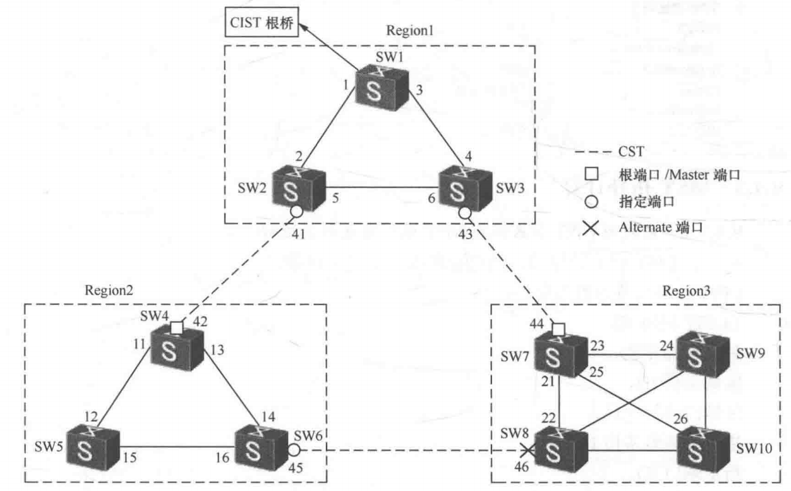
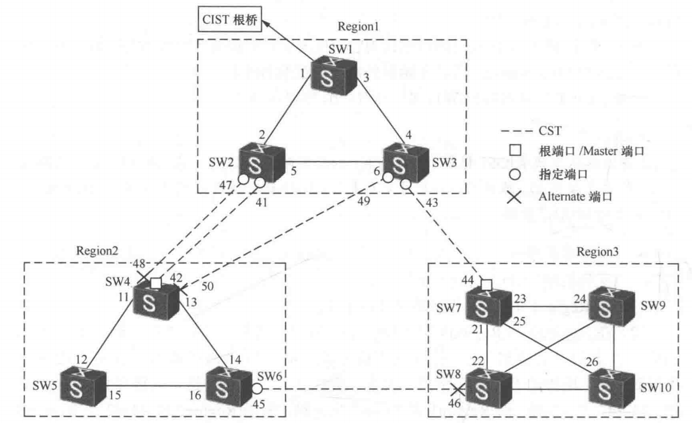
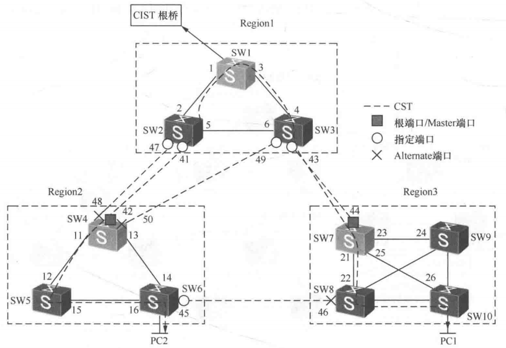
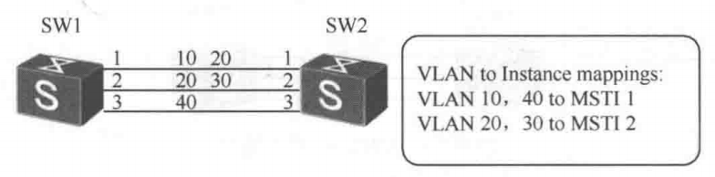
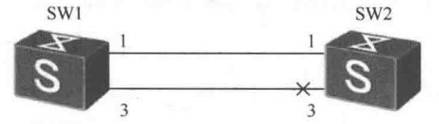
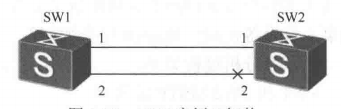

# MSTP 协议之二

## 3.MST 拓扑计算

### 3.1  区域间 CIST 和区域内 MST 端口角色计算过程

在 CIST 树上计算端口角色使用以下优先级向量，CIST 计算向量内容及顺序：

```java{.line-numbers}
{ CIST 根桥 ID，
  外部路径开销，
  区域主桥 ID，
  区域内路径开销，
  指定交换设备桥 ID，
  指定端口 ID，
  接收端口 ID }
```

在区域内的 MST 实例上计算端口角色使用以下向量，MSTI 计算比较向量：

```java{.line-numbers}
{ 区域根桥 ID，
  区域内部路径开销，
  指定交换设备桥 ID，
  指定端口 ID，
  接收端口 ID }
```

计算及比较原则，**<font color="red">任何实例下的任何交换机在收到 BPDU 后都开始选择收到最好 BPDU 的端口为根端口</font>**。

首先，比较根桥交换机 ID。如果 CIST 根桥交换机 ID 相同，再比较外部路径开销。如果外部路径开销相同，再比较区域主桥 ID。如果区域主桥 ID 仍然相同，再比较内部路径开销。如果内部路径仍然相同，再比较指定交换设备 ID。如果指定交换设备 ID 仍然相同，再比较指定端口 ID。如果指定端口 ID 还相同，再比较接收端口 ID。

<div style="display:flex; justify-content:center;">
  <div style="zoom:0.95;">
      <div style="text-align:center; color:#d00; font-weight:750; margin:0 0 8px 0;">MST BPDU 计算比较流程</div>
    <pre class="mermaid">
%%{init: {'flowchart': {'useMaxWidth': false, 'nodeSpacing': 15, 'rankSpacing': 30, 'useMaxHeight': false}, 'themeVariables': {'fontSize': '12px'}}}%%
flowchart TD
    A[开始：收到多个候选 BPDU] --> B[比较 CIST 根桥 ID]
    B --> D[比较外部路径开销]
    D --> F[比较区域主桥 ID]
    F --> H[比较内部路径开销]
    H --> J[比较指定交换设备 ID]
    J --> L[比较指定端口 ID]
    L --> N[比较接收端口 ID]
    N --> P[两份 BPDU 完全一致]
    P --> Z[确定最优 BPDU，将收到该 BPDU 的端口选为根端口 RP]
    </pre>
  </div>
</div>

### 3.2  区域间 CIST 实例拓扑计算

给出图 11 的 CIST 拓扑中各端口角色的计算过程，假定所有端口成本为 1，图中数字是端口号，交换机桥 ID 是 **`SW1<SW2<SW3<···<SW10`**，端口 ID 依端口序号而定，如 41 是 SW2 上边界端口的端口 ID。

<div align="center">
    <div align="center" style="color: #F14; font-size:13px; font-weight:bold">图 11 MST 多区域</div>
    
</div>

分析思路：

- 第 1 步，**先选出 CIST 根桥**；
- 第 2 步，**在每个区域中选出主桥（Master 交换机）**；
- 第 3 步，**在主桥上选出 RP 端口**；
- 第 4 步，**在其他区域间链路上计算出 DP 及 AP/BP**；
- 第 5 步，**在每个区域中，IST 和 MST 上计算出相应角色的端口**。

计算过程如下：

**（1）第 1 步选择 CIST 根**

在 MST 交换域中，**<font color="red">SW1 因实例 0 中桥 ID 最小而成为区域 1 中的主桥，同时也是 MST 交换域中的 CIST 根桥</font>**。在图 11 中 10 台交换机启动时都认为自己既是 CIST 根桥，同时也是区域主桥，所有端口都是 **`DP/Discarding`**，所以开始向外发送自己的 BPDU。例如 CIST 向量内容 **`{ SW1，0，SW1，0，SW1，X }`**。

上述 CIST 向量内容依次代表 CIST 根桥 ID，到 CIST 的外部路径开销，区域主桥 ID，区域内路径开销，指定交换机 ID，端口 ID（此处用 X 来表示）。

**（2）第 2 步：选择区域主桥**

先比较区域边界交换机到 CIST 根的外部路径成本，如果成本一样，再比较区域边界交换机的桥 ID，值越小越好。

在 Region1 中 CIST 根桥就是该区域主桥。在 Region2 和 Region3 中主桥一定是边界交换机。**<font color="red">计算过程就是把三个 Region 看成三台大的交换机，选择区域主桥并不关心区域内路径成本，仅关心边界交换机到 CIST 根桥的区域间路径成本</font>**。所以 3 台大交换机间链路依次为：**`41-42`**，**`43-44`**，及 **`45-46`**。而 Region1 是 root 交换机，所以 Region2 经 **`41-42`** 及 Region3 经 **`43-44`** 链路到 CIST 根桥为最短路径成本，所以 SW4 和 SW7 是各自相应区域的主桥。

而如果 **`41-42`** 链路成本改为 2，而 **`43-44`** 及 **`45-46`** 链路成本都为 1。在此种情况下，在 Region2 中 SW4 和 SW6 边界交换机到 CIST 根桥的区域间成本一致，要继续比较两台边界交换机的（实例 0 中）桥 ID。由于 SW4 优于 SW6，所以 SW4 是 Region2 中主桥。

**（3）第 3 步：决定 RP 端口**

在主桥交换机上选择 RP 端口。**<font color="red">它是主桥到 CIST 根桥的最小路径成本端口。比较后，如果成本一样，则继续比较发送 BPDU 的指定交换机的桥 ID，数值越小越好。如果指定桥 ID 仍然一样，则继续比较指定交换机上发送端口的端口 ID</font>**。

<div align="center">
    <div align="center" style="color: #F14; font-size:13px; font-weight:bold">图 12 MST 多区域——区域 2 主桥上有 3 个区域边界端口</div>
    
</div>

在上图 12 中，SW4 主桥上端口 42、端口 48 及端口 50，到 CIST 根桥的成本一样是 1，其他区域间链路的成本也是 1。**主桥上的 RP 端口是 Region2 中数据访问 CIST 根桥的必经之路**。根据 CIST 向量 **`{ CIST root，external path cost，master root，internal path cost，Bridge ID，port ID }`** 的内容，先比较每个端口收到的 BPDU，依次比较 CIST Root ID 及 External path cost，值最小者最好。如果一致，再依次比较指定交换机桥 ID 及端口 ID，值最小者好。

图中，SW4 到 CIST 根桥的三条区域间路径上的外部路径成本一样，链路 **`47-48`** 和链路 **`41-42`** 上指定交换机是 SW2，而链路 **`49-50`** 上指定交换机是 SW3，**`SW2<SW3`**，**<font color="red">且 SW2 交换机上端口 41 的端口 ID 比端口 47 小，所以 SW4 上端口 42 是 RP 端口。同时主桥上其他非 RP 端口则是 AP 端口</font>**。

**（4）第 4 步，Region 中其他边界交换机上的端口可能是 DP/AP 或 BP**

CIST 根桥所在 Region 的边界交换机的端口都是 DP 端口，所以图 12 中 **`41、43、47、49`** 端口都是 DP 端口。端口 45 及 46 分别处在两个 Region 的边界链路上，在该链路上比较两个 Region 的 BPDU，分别是 **`{ SW1，1，SW4，1，SW6，端口 45 ID }`**、**`{ SW1，1，SW7，1，SW8，端口 46 ID }`**。主桥 ID 不同，所以 SW6 通告的 BPDU 优于 SW8 通告的 BPDU，端口 45 是 DP 端口，而端口 46 则是 AP 端口。

**（5）第 5 步，在每个 Region 内的 IST 或 MST 实例上计算端口**

具体参考下节。

### 3.3  区域内拓扑计算—MST 实例拓扑计算和 IST 拓扑计算

区域内 IST 和 MSTI 都是独立的实例，有各自的树根，IST 实例的树根是本区域中的主桥。计算拓扑根据 BPDU 中相应实例的向量信息计算，IST/MST 实例使用 **`{ 主桥 ID，Internal path cost，BID，Port ID }`**，如果向量信息一致，则最后可根据自己接收端口的 Port ID 来决定。

**<font color="red">在区域中，主桥上 IST 实例中的 RP 端口（边界端口）同时也是其他 MST 实例中的 Master 端口</font>**。如果边界端口在 IST 实例中为转发状态，则在其他实例中也一定为转发状态。如果边界端口在 IST 实例里阻塞，在其他实例里也阻塞。

下图 13 中整个 MST 域是一个交换环境，也是一个大的广播平面，以 VLAN10 为例，在所有交换机上添加 VLAN10，并在 Region1 中，把 VLAN10 映射给 IST，在 Region2 中把 VLAN10 映射到 MST 实例 2，在 Region3 中把 VLAN10 映射给 MST 实例 4。

<div align="center">
    <div align="center" style="color: #F14; font-size:13px; font-weight:bold">图 13 VLAN10 在 Region 间的访问路径</div>
    
</div>

如果 VLAN10 中有主机 PC1，它接在 Region3 中 SW10 交换机上，该主机需要访问 Region2 中 SW6 上的 VLAN10 主机 PC2，转发路径是：在区域 3 中，源自 PC1 的 VLAN10 数据帧沿 MST4 实例拓扑走到主桥（SW7）上 Master 端口，经 SW3 进入区域 1，并沿 IST 实例拓扑流到边界端口 41，经 SW4 进入区域 2，在区域 2 中经主桥上 Master 端口进来，沿区域 2 中 MST2 的拓扑转发到 PC2。回程路径一致。

### 3.4 区域内拓扑计算—MSTI 和 IST 实例逻辑拓扑计算

#### 3.4.1 逻辑拓扑计算

下图 14 中有两台交换机 SW1 及 SW2，**`SW1 桥 ID<SW2 桥 ID`**，使用三条链路互联，链路为 Trunk，链路 1 上仅允许 VLAN10 及 20，链路 2 上仅允许 VLAN20 及 30，链路 3 仅允许 VLAN40。请分析图 14 中 SW1、SW2 上 VLAN10、20、30 和 40 的 VLAN 内主机能否互相通信？

<div align="center">
    <div align="center" style="color: #F14; font-size:13px; font-weight:bold">图 14 计算实例的逻辑拓扑</div>
    
</div>

>**在 MSTP 中，VLAN 先映射到某个 MSTI，每个 MSTI 独立计算自己的生成树拓扑**；一个 VLAN 在端口上的转发/阻塞状态，由其所属 MSTI 的端口状态决定。**<font color="red">因而在分析某个 MSTI 的逻辑拓扑时，通常只需要考虑那些实际承载了该 MSTI 所含 VLAN 的链路</font>**。

首先要先按 MST 实例来看逻辑拓扑。**<font color="blue">因为在 MSTP 中，VLAN 不是各自单独计算生成树，而是先映射到某个 MSTI，再由该 MSTI 统一计算端口角色和转发状态</font>**。也就是说，某个实例只会关注承载了本实例所含 VLAN 的链路。

因此，MSTI 1 对应 VLAN 10 和 VLAN 40，**它看到的逻辑拓扑只包含链路 1 和链路 3**；链路 2 只承载 VLAN 20、30，不属于 MSTI 1 的计算范围。类似地，MSTI 2 对应 VLAN 20 和 VLAN 30，**所以它看到的逻辑拓扑只包含链路 1 和链路 2**，而链路 3 不参与 MSTI 2 的生成树计算。

接下来，要在每个实例的逻辑拓扑中分别进行生成树选举。题目给出的条件是 SW1 的桥 ID 小于 SW2，因此在 MSTI1 和 MSTI2 这两个实例中，SW1 发出的 BPDU 都更优。对于 MSTI 1，SW2 需要在链路 1 和链路 3 之间选择一个更优的 RP 端口。**由于两条链路到 SW1 的路径开销相同、对端桥也相同，最终就只能继续比较发送端口 ID**。因为 SW1 的端口 1 优先于 SW1 的端口 3，所以 SW2 通过链路 1 收到的 BPDU 更优，最终 SW2 的端口 1 成为 RP 端口，端口 3 成为 AP 端口并进入阻塞状态。因此，MSTI 1 实际留下的转发路径只有链路 1。

<div align="center">
    <div align="center" style="color: #F14; font-size:13px; font-weight:bold">图 15 MSTI1 的实例拓扑</div>
    
</div>

对于 MSTI 2，分析过程类似，只不过参与比较的是链路 1 和链路 2。**两条链路到 SW1 的路径开销仍然相同，对端桥也相同，因此最后还是比较对端发送端口 ID**。由于 SW1 的端口 1 优先于端口 2，所以 SW2 的端口 1 在 MSTI 2 中成为根端口，端口 2 被阻塞。这样一来，MSTI 2 最终真正处于转发状态的，也只剩下链路 1。

<div align="center">
    <div align="center" style="color: #F14; font-size:13px; font-weight:bold">图 16 MSTI2 的实例拓扑</div>
    
</div>

#### 3.4.2 场景练习


所以，综合这些规则，那句“域边缘端口保存的 IRPC 大于非域边缘端口保存的 IRPC”，本质上是在表达一种协议意图：

在域内比较‘谁更适合当我去域根的上游方向’时，普通内部端口应当优先于普通边界端口。
也就是：

非域根交换机，应该先在域内找到去域根的那条内部最优路径；

只有真正承担“出域去找 CIST root”职责的那台区域主桥，才通过它的主端口/边界端口对外。

这样做，才能保证整个 Region 对外表现得像“一台虚拟交换机”，而不是 Region 里的每台交换机都想各自从边界端口往外“抄近路”。这和 Cisco、H3C 对 MSTP 的整体描述是一致的：域内按 IST/MSTI 转发，域间按 CST/CIST 转发。