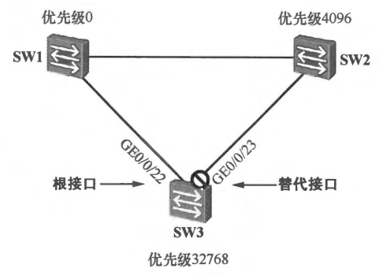
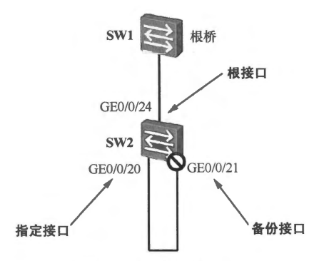
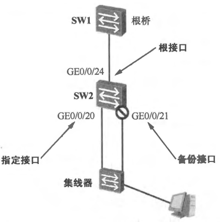
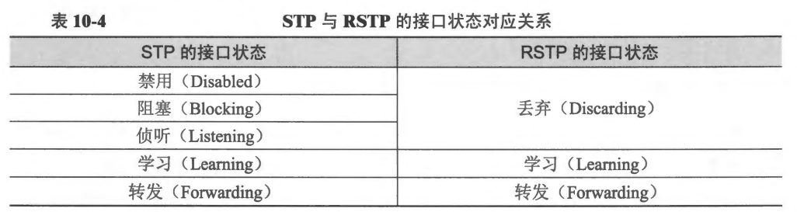
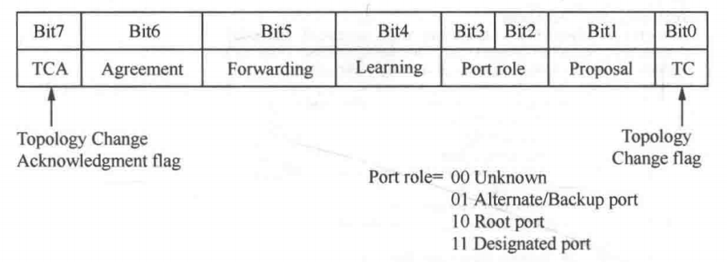
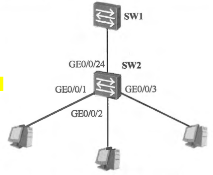
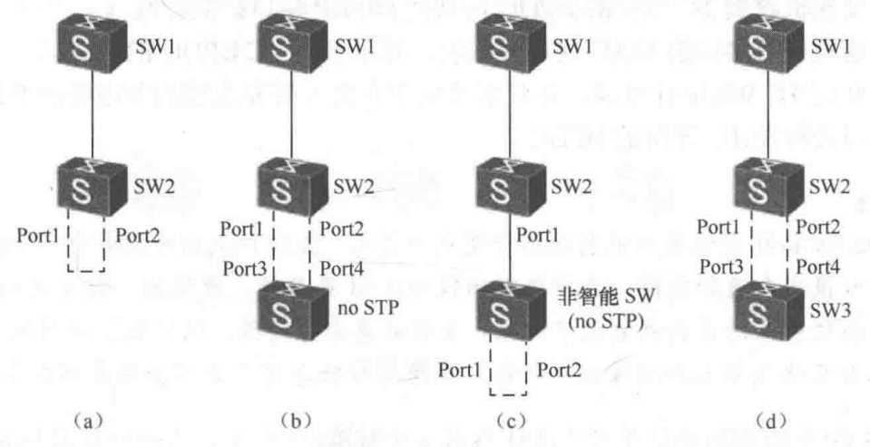
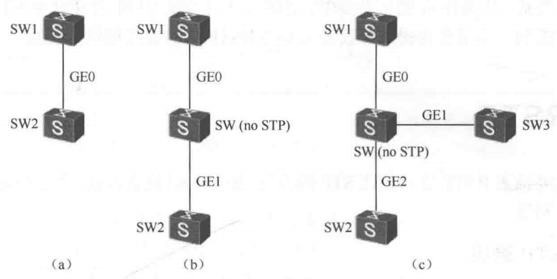
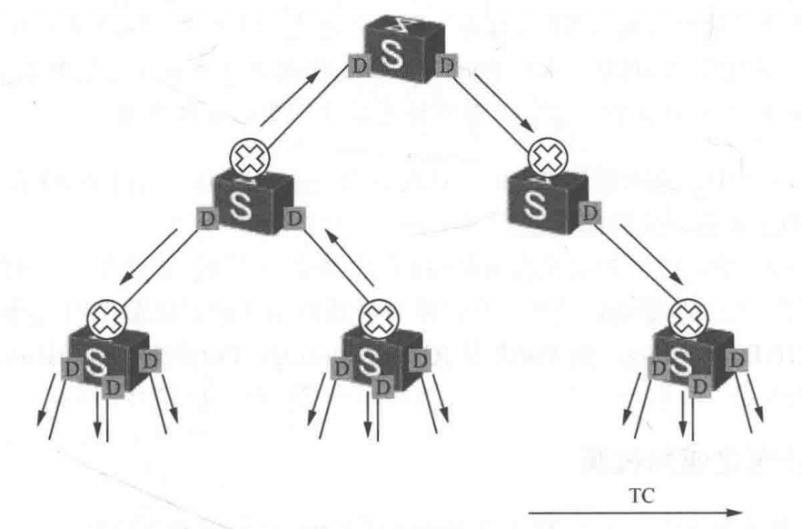

# RSTP 协议

## 1.RSTP 介绍

IEEE 802.1w 中定义的 RSTP（Rapid Spanning Tree Protocol，快速生成树协议）可以视为 STP 的改进版本，RSTP 在许多方面对 STP 进行了优化，它的收敛速度更快，而且能够兼容 STP。

RSTP 引入了新的接口角色，其中替代接口的引入使得交换机在根接口失效时，能够立即获得新的路径到达根桥。**<font color="red">RSTP 引入了 P/A 机制，使得指定接口被选举产生后能够快速地进入转发状态，而不用像 STP 那样经历转发延迟时间</font>**。另外，RSTP 还引入了边缘接口的概念，这使得交换机连接终端设备的接口在初始化之后能够立即进入转发状态，提高了工作效率。

## 2.RSTP 接口角色

RSTP 在 STP 的基础上，增加了两种接口角色，它们是替代（Alternate）接口和备份（Backup）接口。因此，在 RSTP 中，共有 4 种接口角色：根接口、指定接口、替代接口和备份接口。

### 2.1 替代接口

替代接口可以简单地理解为根接口的备份，它是一台设备上，由于收到了其他设备所发送的 BPDU 从而被阻塞的接口。如果设备的根接口发生故障，那么替代接口可以成为新的根接口，这加快了网络的收敛过程。

在下图，SW1 是网络中的根桥，对于 SW3 而言，它有两个接口接入了该网络，由于从 **`GE0/0/22`** 接口到达根桥的 RPC 更小，因此该接口成为该设备的根接口。而 **`GE0/0/23`** 则由于收到了 SW2 所发送的 BPDU，并且经 SW3 计算后决定阻塞，成为该设备的替代接口。

<div align="center">
    
</div>

>AP 可以理解为端口收到对方更优质的 BPDU，但是本端口不能成为 RP，本端口就是 AP。这条端口所在的链路上，对端给出的 BPDU 是更优，说明在这条链路/这个网段上，对端是 Designated（指定端口那一侧），这端不是 Designated。但在这台桥上做 Root Port 选择时，还有另一条端口提供了更好的到 Root 的路径，所以这条端口不会被选成 Root Port（RP），就变成 Alternate（备选的根端口），通常处于 Discarding（阻塞）状态，随时待命。

此时在 SW3 上执行 **`display stp brief`** 命令能看到如下输出：

```java{.line-numbers}
<SW3>display stp brief
MSTID  Port                     Role   STP State   Protection
0      GigabitEthernet0/0/22    ROOT   FORWARDING  NONE
0      GigabitEthernet0/0/23    ALTE   DISCARDING  NONE
```

**<font color="red">一台设备如果是非根桥，那么它有且只能有一个根接口，但是该设备可以没有替代接口，也可以有</font>**，当存在替代接口时，可存在一个或多个。当设备的根接口发生故障时，最优的替代接口将成为新的根接口。

### 2.2 备份接口

备份接口是一台设备上由于收到了自己所发送的 BPDU 从而被阻塞的接口。**<font color="red">如果一台交换机拥有多个接口接入同一个网段，并且在这些接口中有一个被选举为该网段的指定接口，那么这些接口中的其他接口将被选举为备份接口</font>**。备份接口将作为该网段到达根桥的冗余接口。通常情况下，备份接口处于丢弃状态。

```c{.line-numbers}
if(rstpCompareBridgeAddr(addr, &context->bridgeId.addr) == 0 && rstpGetBridgePort(context, portId) != NULL) {
    //selectedRole is set to BackupPort and updtInfo is reset
    port->selectedRole = STP_PORT_ROLE_BACKUP;
    port->updtInfo = FALSE;
// 否则本端口就是 Alternate Port 了    
}
```

从上面的代码可以看出，如果收到的 **`portPriority/BPDU`** 里宣告的 **`designated bridge`** 地址等于本桥自己的桥地址，也就是 **`designatedBridge`** 是我自己；如果收到的 **`portPriority/BPDU`** 里宣告的 **`designatedPortId`**，确实对应本桥上的某个端口，即 **`designatedPort`** 是我桥上的另一个端口。**<font color="red">这正是 RSTP 里 Backup Port 的语义，同一台桥在同一个 LAN 段上有两个端口，其中一个端口是 DP 端口，另一个端口作为 DP 的备份而阻塞</font>**。

如下图所示，SW1 是根桥。对于 SW2，**`GE0/0/20`** 和 **`GE0/0/21`** 两个接口构成了环路。RSTP 能够检测到该环路，并在两个接口中选择一个将其阻塞。在没有其他配置的情况下，接口 ID 较小的接口将成为指定接口。在该例中，**`GE0/0/20`** 的接口 ID 小于 **`GE0/0/21`**，因此 **`GE0/0/20`** 成为指定接口，而 **`GE0/0/21`** 将成为备份端口，即被阻塞。

<div align="center">
    
</div>

此时，在 SW2 上执行 **`display stp brief`** 命令应该能看出如下状态：

```java{.line-numbers}
[SW2]display stp brief
 MSTID  Port                        Role  STP State     Protection
     0  GigabitEthernet0/0/24       ROOT  FORWARDING      NONE
     0  GigabitEthernet0/0/20       DESI  FORWARDING      NONE
     0  GigabitEthernet0/0/21       BACK  DISCARDING      NONE
```

在 Cyclone RSTP 的端口角色选择过程中，当某个端口当前的信息状态是 **`infoIs == RECEIVED`** 并且该端口又不是 RP 时，Cyclone RSTP 协议实现中会先把如果我把自己当作该链路上的指定端口时，我应当宣称出来的那套优先级向量构造成 **`designatedPriority`**，同时该端口也已经保存了一份从对端 BPDU 记录下来的 **`portPriority`**。

接下来 Cyclone 通过 **`rstpComparePriority(designatedPriority, portPriority)`** 对这两套优先级向量做严格比较：如果比较结果大于 0，含义就是我这套（以我的端口 ID 作为 **`designatedPortId`** 的宣称）整体更优，那么端口就会被直接赋予 **`selectedRole = DESIGNATED`**，即由该端口承担指定端口职责、向该段发送更优 BPDU。反之，如果比较结果不大于 0，说明本端口提出的 **`designatedPriority`** 并不优于它所收到并记录的那套 **`portPriority`**，此时 Cyclone 还不会立刻把它定为普通的替代/阻塞角色，而是会继续做同桥绕回。

Cyclone RSTP 协议会检查收到的 **`portPriority.designatedBridgeId`** 是否等于本桥的 bridgeId，并进一步用 **`rstpGetBridgePort(context, designatedPortId)`** 去本桥的端口表中查询，如果这个 **`designatedPortId`** 在本桥确实能找到对应端口，就意味着对端 BPDU 里宣称的指定端口其实就是我这台桥上的另一个端口，换句话说，当前端口所面对的更优宣称并不是来自另一台交换设备，而是来自同一台交换机的另一个端口绕回来的信息。

因此在这种情况下，Cyclone 会把该端口明确选为 **`selectedRole = BACKUP`**（备份端口），从机制上保证：**<font color="red">当同一冲突域里存在两个来自同一桥的候选指定端口时，只允许优先级更优的一侧继续转发并担当指定端口，而另一侧必须退化为备份端口进入阻塞状态，从而切断环路并维持无环拓扑</font>**。具体源码如下：

```java{.line-numbers}
// 比较本端口应该宣告的 designatedPriority 与从对端收到并记录下来的 portPriority
// 如果本端应宣告的 designatedPriority 更优，就把该端口选为 Designated Port，updtInfo=TRUE，让 PIM 进入 UPDATE
// 把 portPriority/Times 刷新为 designatedPriority/Times，并准备发出新的 BPDU
if(rstpComparePriority(&port->designatedPriority, &port->portPriority) > 0) {
    port->selectedRole = STP_PORT_ROLE_DESIGNATED;
    port->updtInfo = TRUE;
} else {
    // 否则对端（或该段上其他桥）给出的信息不比我差，本端口不能成为 Designated，需要在 Backup/Alternate 之间做区分
    MacAddr *addr;
    uint16_t portId;

    // Retrieve the designated bridge and designated port components of the port priority vector
    addr = &port->portPriority.designatedBridgeId.addr;
    portId = port->portPriority.designatedPortId;

    // 如果收到的 portPriority 里宣告的 designated bridge 地址 == 本桥自己的桥地址/designatedBridge 是我自己
    // 收到的 portPriority 里宣告的 designatedPortId，确实对应本桥上的某个端口/designatedPort 是我桥上的另一个端口
    // 这正是 RSTP 里 Backup Port 的语义，同一台桥在同一个 LAN 段上有两个端口，其中一个端口是 designated，另一个端口作为 designated 的备份而阻塞
    if(rstpCompareBridgeAddr(addr, &context->bridgeId.addr) == 0 && rstpGetBridgePort(context, portId) != NULL) {
        //selectedRole is set to BackupPort and updtInfo is reset
        port->selectedRole = STP_PORT_ROLE_BACKUP;
        port->updtInfo = FALSE;
    // 否则本端口就是 Alternate Port 了    
    } else {
        // selectedRole is set to AlternatePort and updtInfo is reset
        port->selectedRole = STP_PORT_ROLE_ALTERNATE;
        port->updtInfo = FALSE;
    }
}
```

上面这个场景看起来并没有实际意义，毕竟通过一条链路进行自环看起来确实没有什么必要，这可能是由于人为的疏忽误接线造成的，更有意义的备份场景如下图所示。如下图所示，SW2 通过两个接口连接到了一台 Hub（集线器）。由于 Hub 不运行 STP 或 RSTP，它会把收到的所有数据都泛洪给除入接口以外的其他所有接口，因此，SW2 从 **`GE0/0/20`** 接口发出的 BPDU 会被集线器接收并发往 SW2 的 **`GE0/0/21`** 接口，反之亦然。

<div align="center">
    
</div>

### 2.3 RSTP 接口状态

STP 定义了 5 种接口状态：**`Disabled`**、**`Blocking`**、**`Listening`**、**`Learning`** 和 **`Forwarding`**。RSTP 把原来 STP 的 **`Disabled`**、**`Blocking`** 和 **`Listening`** 状态合并为 **`Discarding`** 状态。接口状态的对应关系如下表所示。
 
<div align="center">
    
</div>

从上表可以看出，RSTP 的接口状态规范把 STP 接口状态中的 **`Disabled`**、**`Blocking`** 和 **`Listening`** 状态都归结为 **`Discarding`** 状态。处于 **`Discarding`** 状态的接口，既不转发用户流量，也不学习 MAC 地址。

### 2.4 BPDU

RSTP 的配置 BPDU 被称为 RST BPDU，其格式与 STP 的配置 BPDU 格式非常相似，但 RSTP 对配置 BPDU 中的部分字段进行了修改。RST BPDU 的 **`Protocol Version ID`** 字段值为 **`0x02`**，**`BPDU Type`** 字段值为 **`0x02`**。RSTP 对配置 BPDU 修改最大的字段是 Flags 字段。

<div align="center">
    
</div>

>在 RSTP 协议中，TCA 标志位不再被使用。

**<font color="red">在 STP 的配置 BPDU 中，Flags 字段虽然定义了 8 位，但是只使用了最低位和最高位。在 RSTP 的 RST BPDU 中，其余的 6 位也被利用起来了，并在 RSTP 协议计算中发挥着重要的作用</font>**。RST BPDU 的格式如上图所示。

STP 只使用了该字段的最高及最低比特位，在 RST BPDU 中这两个比特位的定义及作用不变。另外，Agreement（同意）及 Proposal（提议）比特位用于 RSTP 的 P/A（**`Proposal/Agreement`**）机制，该机制大大地提升了 RSTP 的收敛速度。其中位 1 就作用于 proposal 提议，**当端口是 `DP/Discarding` 或者 `DP/learning` 状态时置 1**。Port Role（接口角色）比特位的长度为 2bit，它用于标识该 RST BPDU 发送接口的接口角色：

- **`01`**:表示根接口
- **`10`**:表示替代接口
- **`11`**:表示指定接口
- **`00`**:则被保留使用

最后，Forwarding（转发）及 Learning（学习）比特位用于表示该 RST BPDU 发送接口的接口状态。RSTP 与 STP 不同，在网络稳定后，无论是根桥还是非根桥，都将周期性地发送 RST BPDU。也就是说对于非根桥而言，它们不用在根接口上收到 BPDU 之后，才被触发而产生自己的配置 BPDU，而是自主地、周期性发送 BPDU。在后续的内容中，除非特别强调，BPDU 指的都是 RST BPDU。

在端口侧，**<font color="red">PTI 计时器状态机会在 tick 时把所有非 0 的计时变量统一递减，其中就包括负责 BPDU 周期节拍的 helloWhen</font>**。当某端口的 helloWhen 被递减到 0 后，PTX 发送状态机在 IDLE 状态里会检测到 **`port->helloWhen == 0`**，从而切到 **`TRANSMIT_PERIODIC`**。而在 **`TRANSMIT_PERIODIC`** 的入状态动作中，只要该端口当前角色是 **`DESIGNATED`**，就会把 **`port->newInfo = TRUE`**，含义就是需要周期性发送一次 RST BPDU 信息。随后状态机回到 IDLE 时会用 **`port->helloWhen = rstpHelloTime(port)`** 重新装载 Hello 计时器，为下一轮周期做准备。而一旦 newInfo 被置位，IDLE 分支还会在发送限速条件满足时真正进入发送动作。因此综上所述，在 RSTP 协议中，无论根桥还是非根桥，都会周期性（helloWhen）发送 RST BPDU。

```c{.line-numbers}
switch (port->ptxState) {
    case RSTP_PTX_STATE_TRANSMIT_INIT:
    case RSTP_PTX_STATE_TRANSMIT_PERIODIC:
    case RSTP_PTX_STATE_TRANSMIT_CONFIG:
    case RSTP_PTX_STATE_TRANSMIT_TCN:
    case RSTP_PTX_STATE_TRANSMIT_RSTP:
        rstpPtxChangeState(port, RSTP_PTX_STATE_IDLE);
        break;

    case RSTP_PTX_STATE_IDLE:
        // selected : 端口角色/选择已稳定，updtInfo : 角色选择要求端口信息更新时，暂缓发送，避免发出未对齐信息
        if (port->selected && !port->updtInfo) {
            // 周期性发送触发：helloWhen 倒计时到 0
            // helloWhen 是 HelloTime 的倒计时。当它归零，表示到了至少该发一帧 BPDU 的周期点。标准明确要求至少每个 HelloTime 要发 1 个 BPDU。
            // 进入 TRANSMIT_PERIODIC 通常会装载 helloWhen=HelloTime，并可能置位 newInfo
            if (port->helloWhen == 0) {
                rstpPtxChangeState(port, RSTP_PTX_STATE_TRANSMIT_PERIODIC);
            } else {
                // 事件触发发送 newInfo 表示需要发送 BPDU
                if (port->newInfo) {
                    // 发送速率限制：txCount 每发一个 BPDU 自增，达到 TxHoldCount 时必须延迟发送，避免 1 秒内发太多帧 BPDU。
                    if (port->txCount < rstpTxHoldCount(context)) {
                        // sendRstp 决定发送 BPDU 类型：
                        // TRUE  -> 发送 RST BPDU（RSTP）
                        // FALSE -> 走 STP 兼容：根端口发 TCN，指定端口发 Config
                        if (port->sendRstp) {
                            // 发送 RSTP BPDU
                            rstpPtxChangeState(port, RSTP_PTX_STATE_TRANSMIT_RSTP);
                        } else {
                            // STP 兼容模式下，根据端口角色选择 BPDU 类型
                            // 代码省略....
                        }
                    } else {
                    }
                } else {
                }
            }
        } 
        break;
}
```

RSTP 在 BPDU 的处理上的另一点改进是对于次优（Inferior）BPDU 的处理。运行 STP 的交换机在每个接口上保存一份 BPDU，**<font color="red">对于根接口及非指定接口而言，交换机保存的是发送自上游交换机的 BPDU，而对于指定接口而言，交换机保存的是自己根据根接口的 BPDU 所计算出的 BPDU</font>**。

**<font color="red">如果接口收到一份 BPDU，而且该接口当前所保存的 BPDU 比接收的 BPDU 更优，那么后者对于前者而言，就是次优 BPDU</font>**。在 STP 中，当指定接口收到次优 BPDU 时，它将立即发送自己的 BPDU；而对于非指定接口，当其收到次优 BPDU 时，它将等待接口所保存的 BPDU 老化之后，再重新计算新的 BPDU，并将新的 BPDU 发送出去，这将导致非指定接口需要最长约 20s 的时间才能启动状态迁移。在 RSTP 中，无论接口的角色如何，只要接口收到次优 BPDU，便立即发送自己的 BPDU，这个变化使得 RSTP 的收敛更快。

### 2.5 边缘接口

#### 2.5.1 边缘接口简介

我们已经知道，运行了 STP 的交换机，其接口在初始启动之后，首先会进入阻塞状态。如果该接口被选举为根接口或指定接口，那么它还需要经历侦听及学习状态，最终才能进入转发状态，也就是说，一个接口从初始启动之后到进入转发状态至少需要花费 约 30s 的时间。

对于交换机上连接到交换网络的接口而言，经历上述过程是必要的，毕竟该接口存在产生环路的风险，然而有些接口引发环路的风险是非常低的，例如交换机连接终端设备（PC 或服务器等）的接口，这些接口如果启动之后依然需要经历上述过程就太低效了，而且用户当然希望将一台 PC 接入交换机后 PC 能够立即连接到网络，而不用耗费时间去等待。

<div align="center">
    
</div>

可以将交换机的接口配置为边缘接口（Edge Port）来解决上述问题。如上图所示，交换机 SW2 的 **`GE0/0/1`**、**`GE0/0/2`** 及 **`GE0/0/3`** 均可被配置为边缘接口。**<font color="red">边缘接口既不参与生成树计算，当边缘接口被激活之后，它可以立即切换到转发状态并开始收发业务流量，而不用经历转发延迟时间</font>**，因此工作效率大大提升了。

#### 2.5.2 边缘接口特点

802.1w 定义的边缘端口具备如下特性：

- 边缘端口状态变化不会触发拓扑变化通知；
- 边缘端口不参与 STP 计算，端口启动后可以直接进入转发状态，从而跳过丢弃（Discarding）和学习（Learning）状态；
- 边缘端口会向外周期通告 BPDU，但若边缘端口接收到 BPDU，该端口会立即丧失边缘端口特性，切换回普通生成树端口并根据收到的 BPDU 重新计算端口角色；
- P/A 协商过程中，同步（Sync）过程并不会阻塞边缘端口，同时 TC 通知 BPDU 也不清空边缘端口的 MAC 表项（TC BPDU 并不向边缘端口转发）；

**（1）边缘端口启动后直接进入转发状态**

在 Cyclone RSTP 的实现中，边缘接口之所以能够激活后立即进入转发，因为 PRT 状态机的 **`rstpPrtDesignatedPortFsm()`** 函数在推进 designated 端口角色时，把 operEdge 当作一种快速放行条件，从而绕过原本需要等待的定时器与握手约束。具体来说，当端口处于 designated 相关状态，准备进一步从同步/协商阶段推进到学习/转发阶段时，PRT 的判断条件为 **`(fdWhile == 0 || agreed || operEdge)`**。

这意味着在普通非边缘端口场景下，端口通常要么等待 fdWhile 归零，要么等待 agreed（P/A 协商完成）成立，才能进入学习或转发。但只要该端口是边缘端口（**`operEdge == TRUE`**），PRT 会立即允许端口直接进入 **`DESIGNATED_LEARN`**，从逻辑上跳过必须等待这一段。相关源代码如下：

```c{.line-numbers}
else if ((port->fdWhile == 0 || port->agreed || port->operEdge) && (port->rrWhile == 0 || !port->reRoot) && !port->sync) {
    // Cyclone 实现中区分了 learn/learning、forward/forwarding 两组变量，前者是端口请求进入该状态的标志，后者是端口实际处于该状态的标志
    // 1.当前端口还没有发起进入学习的请求，因此先切到 DESIGNATED_LEARN 去发请求并启动必要的 delay
    // 2.当前端口已经发起了学习请求，但还没有发起转发请求，因此切到 DESIGNATED_FORWARD 去发起转发请求
    if (!port->learn) {
        // Switch to DESIGNATED_LEARN state
        rstpPrtDesignatedPortChangeState(port, RSTP_PRT_STATE_DESIGNATED_LEARN);
    }
    else if (port->learn && !port->forward) {
        // Switch to DESIGNATED_FORWARD state
        rstpPrtDesignatedPortChangeState(port, RSTP_PRT_STATE_DESIGNATED_FORWARD);
    }
    else {
        // Just for sanity
    }
}
```

另外，边缘接口的关闭或激活并不会触发 RSTP 拓扑变更。在实际项目中，我们通常会把用于连接终端设备的接口配置为边缘接口。以 SW2 为例，将其 **`GE0/0/1`** 接口配置为边缘接口的命令如下：

```c{.line-numbers}
[SW2]interface GigabitEthernet 0/0/1
[SW2-GigabitEthernet0/0/1]stp edged-port enable
```

**（2）边缘接口收到 BPDU 后丧失边缘接口特性**

值得注意的是，由于人为疏忽，边缘接口也可能会被误接交换设备，一旦交换设备连接到边缘接口，那么便引入了环路隐患。**<font color="red">因此如果边缘接口连接了交换设备并且收到了 BPDU，则该接口立即变成一个普通的生成树接口</font>**，在这个过程中，可能引发网络中的 RSTP 重计算，从而对网络造成影响。

当端口收到一份合法 BPDU 后，协议栈 **`rstpPrxFsm()`** 函数会把 **`port->rcvdBpdu`** 置位，PRX 状态机在 **`DISCARD/RECEIVE`** 的条件判断里检测到 **`rcvdBpdu && portEnabled`** 就会进入 RECEIVE 状态。进入 RECEIVE 状态时，Cyclone 会执行一组收到 BPDU 后的标准动作，其中最关键的就是 **`port->operEdge = FALSE`**。同时还会清掉 rcvdBpdu、置 **`rcvdMsg = TRUE`** 并把 edgeDelayWhile 重新装载为 **`rstpMigrateTime()`**。这一步在语义上就等价于只要收到 BPDU，就不再把该端口当作边缘端口对待。相关源代码如下：

```c{.line-numbers}
void rstpPrxFsm(RstpBridgePort *port) {
    case RSTP_PRX_STATE_RECEIVE:
        if(port->rcvdBpdu && port->portEnabled && !port->rcvdMsg) {
          rstpPrxChangeState(port, RSTP_PRX_STATE_RECEIVE);
        }
        break;
}

void rstpPrxChangeState(RstpBridgePort *port, RstpPrxState newState) {
    case RSTP_PRX_STATE_RECEIVE:
        rstpUpdtBpduVersion(port);
        // 将边缘端口设置为 false，此时不再将该端口作为边缘端口
        port->operEdge = FALSE;
        port->rcvdBpdu = FALSE;
        port->rcvdMsg = TRUE;
        port->edgeDelayWhile = rstpMigrateTime(port->context);
        break;
}
```

一个接口被配置为边缘接口后，该接口依然会周期性地发送 BPDU，然而正如上文所述，边缘接口通常用于连接终端设备，BPDU 对于这些设备而言其实是多余的，此时可以在接口的配置视图下增加 **`stp bpdu-filter enable`** 命令，这条命令用于激活该接口的 BPDU 过滤功能。在交换机的接口上激活 BPDU 过滤功能 后，该接口将不再发送 BPDU，而当其收到 BPDU 时，也会直接忽略。

**（3）边缘端口状态变化不会触发拓扑变化通知**

在 Cyclone RSTP 的 TCM（Topology Change Management）状态机中，边缘端口被显式从拓扑变更检测与传播链路中排除，这是通过关键状态转移的 guard 条件实现的。DETECTED（拓扑变更检测）的进入条件包含 **`!port->operEdge`**。因此即使端口当前处于转发相关状态（例如 **`forward==TRUE`**），只要该端口被判定为边缘端口，就不会进入 **`RSTP_TCM_STATE_DETECTED`** 状态，从而无法进入变更监测的 **`RSTP_TCM_STATE_ACTIVE`** 状态，也就无法检测到拓扑变化以及启动 TC 处理的状态迁移，从根源上避免在 edge 端口上启动拓扑变更流程。

PROPAGATING（拓扑变更传播）的进入条件（在 **`rstpTcmFsm()`** 函数中）同样要求 **`tcProp && !port->operEdge`**。也就是说，只有在端口被置为需要传播拓扑变化（**`tcProp==TRUE`**）且端口非边缘的情况下，TCM 才会进入传播态并执行后续动作，如启动 tcWhile 计时器，当端口的 tcWhile 计时器不为 0 时会不断发出 TC 报文；以及设置 **`fdbFlush = True`**，调用 **`rstpRemoveFdbEntries()`** 函数清除转发表，这就是前面所说的 **<font color="red">TC 通知 BPDU 也不清空边缘端口的 MAC 表项</font>**。边缘端口即使被置位 **`tcProp`**，也会因为 **`!operEdge`** 不成立而不会进入传播路径。

```c{.line-numbers}
void rstpTcmFsm(RstpBridgePort *port) {

    switch (port->tcmState) {
    case RSTP_TCM_STATE_INACTIVE:
    case RSTP_TCM_STATE_LEARNING:
        // 如果端口角色是 Root/Designated，且端口允许转发 (forward=TRUE)，并且不是边缘端口 (operEdge=FALSE)，
        // 说明一个树端口进入了可以转发的阶段——这在 RSTP 中被视为一次拓扑变化触发点，转到 DETECTED 去启动 tcWhile、触发传播等动作
        // In RSTP, only non-edge ports that move to the forwarding state cause a topology change. This means that a loss of connectivity is not considered as a topology change any more, contrary to 802.1D (that is, a port that moves to blocking no longer generates a TC)
        // 只有非边缘端口切换到转发状态时才被定义为拓扑变动，非边缘端口丢失连接不会触发拓扑变化通知
        else if ((port->role == STP_PORT_ROLE_ROOT ||
                    port->role == STP_PORT_ROLE_DESIGNATED) &&
                   port->forward && !port->operEdge) {
            rstpTcmChangeState(port, RSTP_TCM_STATE_DETECTED);
        } 
        break;

    case RSTP_TCM_STATE_ACTIVE:
        else if (port->tcProp && !port->operEdge) {
            rstpTcmChangeState(port, RSTP_TCM_STATE_PROPAGATING);
        } 
        break;
    }
}

void rstpTcmChangeState(RstpBridgePort *port, RstpTcmState newState) {
    port->tcmState = newState;

    switch (port->tcmState) {
    case RSTP_TCM_STATE_DETECTED:
        // 根据 ieee 802.1d-2004 规范，If the value of tcWhile is zero and sendRstp is true, this procedure sets the value of tcWhile to HelloTime plus one second and sets newInfo true.
        rstpNewTcWhile(port);
        rstpSetTcPropTree(port);
        port->newInfo = TRUE;
        break;
    case RSTP_TCM_STATE_NOTIFIED_TC:
        port->rcvdTcn = FALSE;
        port->rcvdTc = FALSE;
        if (port->role == STP_PORT_ROLE_DESIGNATED) {
            port->tcAck = TRUE;
        }
        rstpSetTcPropTree(port);
        break;
    case RSTP_TCM_STATE_PROPAGATING:
        rstpNewTcWhile(port);
        port->fdbFlush = TRUE;
        port->tcProp = FALSE;
        break;
    default:
        break;
    }

    port->context->busy = TRUE;
}
```

#### 2.5.3 边缘接口使用说明

使用说明如下：

- 华为交换机可在 STP 及 RSTP 模式下开启边缘端口，端口上输入命令：**`stp edged-port enable`**；
- 边缘端口是为连接终端设备，如 PC、服务器、路由器、防火墙等设备使用。若连接交换设备，易于出现环路；
- 边缘端口的频繁抖动对网络没有影响，不产生拓扑变化通知，同时交换机也不向边缘端口转发拓扑变化通知；
- **<font color="red">边缘端口的角色为 DP，并保持转发状态</font>**；
- 为避免边缘端口下连接交换设备或防止攻击者伪造 BPDU 报文导致边缘端口属性变成非边缘端口，可将边缘端口连同 BPDU 防护特性一起使用，使边缘端口收到 BPDU，端口会 shutdown，以保护边缘端口，同时边缘端口特性不变；

SW1 和 SW2 为 RSTP 交换机。请简单分析边缘端口按照图 9-55 方式相连有什么问题？

<div align="center">
    
</div>

上图（a）为边缘端口的 Port1 和 Port2 被用户通过网线互联后，由于端口启动之初没有收到任何 BPDU，所以两个端口均直接进入转发状态。所以初期会有短暂的环路发生，**<font color="red">但边缘端口若互相收到对方的 BPDU，则失去边缘端口的特性，变成普通端口，端口阻塞数据，并重新根据各自收到的 BPDU 计算端口角色</font>**。网络稳定后，端口 Port1 应该是 **`DP/Forwarding`**，而 Port2 是 **`BP/Discarding`**。

上图（b）中，Port1 和 Port2 端口连接到一台交换机，如果交换机是普通交换机且无 STP，交换机则可透传 BPDU，Port1 和 Port2 互相收到对方的 BPDU，其效果等同于图（a）。

但若该交换机是华为交换机，华为交换机在端口上输入 **`STP disable`**，端口会过滤 STP 报文，SW2 交换机 Port1 和 Port2 端口互相收不到对方的 BPDU，所以 Port1 和 Port2 的端口角色和状态依然不变，都是转发状态。这时端口 **`Port1/Port2/Port3/Port4`** 都可转发数据，所以环路出现。

上图（d）中，把华为交换机 SW3 接在边缘端口下面。边缘端口一旦收到 BPDU，端口阻塞数据，失去边缘端口特性，开始重新计算端口角色。如果 SW1 是根桥，则 Port1 和 Port2 是 **`DP/Forwarding`**，而 Port3 是 **`RP/Forwarding`**，Port4 是 **`AP/Discarding`**。整个过程无环路发生。

在 Cyclone RSTP 里，SW3 之所以把 p3 选为 RP，SW3 的 p3 和 p4 都是从同一个上游桥 SW2 收到 BPDU。因此比较时 **`rootBridgeId`** 一样（都是 SW1），**`designatedBridgeId`** 也一样（都是 SW2），如果两条链路代价一致，则 rootPathCost 也会相等。这样一来，继续比较 BPDU 里的 **`designatedPortId`**，也就是 SW2 的 **`Port1/Port2`**。一般情况下 Port1 的 PortID 小于 Port2，所以对应 SW3 的 p3 拿到的向量更优，最终 p3 被选为 rootPort，角色自然就是 RP。

另外在 SW3 这里，**<font color="blue">对端是更靠近根桥的 SW2，收到的向量通常更优，因此 SW3 的 p4 不可能赢过对端成为 Designated</font>**。因此 SW3 的 p4 端口就会被归类为 Alternate Port（AP），并保持在丢弃（Discarding）以提供备份路径。

## 3.RSTP 链路类型

**`802.1d`** 对连接交换机的链路或网段是没有要求的, 任两台交换机间网段 (Segment) 上可以接有多台交换机或使用共享链路 (Half-Duplex) 互连。而 **`802.1w`** 则对链路有严格的要求, 不同链路类型可影响到收敛速度及工作机制。

- Point-to-Point 链路类型：交换机间 Full Duplex 链路。
- 共享链路：交换机间半双工链路互联，可以连接 Hub 或其他 Half Duplex 的链路。

RSTP 很多快速收敛的机制都一定要工作在 P2P 全双工的场景下，如果不是点到点链路类型，则 RSTP 使用类似 **`802.1d`** 的慢收敛机制（即基于 Timer 的被动收敛）。**<font color="red">在下图中，如果端口都是全双工状态，则 SW1 和 SW2 都认为互联的链路类型是 P2P</font>**。华为设备默认自动检测端口类型，可使用命令 **`stp point-to-point {auto | force-false | force-true}`** 去强制端口类型。Auto 代表自动检测，是端口默认值。

<div align="center">
    
</div>

- 手工设置端口类型优于端口检测的结果；
- 处于 DP/discarding 状态的端口能否快速进入转发状态，依赖于端口是否是 P2P（点对点）全双工；

下面解释一下，在 Cyclone RSTP 中，DP 端口处于 **`Discarding/Learning`** 的端口会进入 **`DESIGNATED_PROPOSE`**，把 **`proposing=TRUE`** 并在 TxRstp 里置 **`Proposal(P)`** 位。DP 端口要想快速从 Discarding 进入 **`Learning/Forwarding`**，依赖 **`agreed==TRUE`** 这个条件满足，否则就只能等待计时器 fdWhile 等于 0。而 agreed 只能在 **`rstpRecordAgreement()`** 中满足 **`rstpVersion && operPointToPointMac && 收到 Agreement(A)`** 位时置位，所以是否点对点全双工就成了能否快速转发的关键门槛。

```c{.line-numbers}
void rstpRecordAgreement(RstpBridgePort *port) {
    const RstpBpdu *bpdu;

    // Point to the received BPDU
    bpdu = &port->context->bpdu;

    // If rstpVersion is TRUE, operPointToPointMAC is TRUE, and the received Configuration Message has the Agreement flag set, the agreed flag is set
    // and the proposing flag is cleared. Otherwise, the agreed flag is cleared
    // 只有当运行在 RSTP 版本，且端口被判定为点到点链路，且收到的 BPDU Agreement 位=1 时，才把 port->agreed 置 TRUE，并清掉 port->proposing
    if (rstpVersion(port->context) && port->operPointToPointMac && (bpdu->flags & RSTP_BPDU_FLAG_AGREEMENT) != 0) {
        port->agreed = TRUE;
        port->proposing = FALSE;
    } else {
        port->agreed = FALSE;
    }
}
```

- AP 端口成为 RP 端口，不依赖端口是否是 Point-to-Point 全双工。
- 如果当前端口工作在全双工模式，则当前端口所连的链路是点到点链路，可以选择参数 **`force-true`**。
- 如果当前端口工作在半双工模式，可通过执行命令 **`stp point-to-point force-true`** 强制链路类型为点到点链路，实现快速收敛。

## 4.拓扑变化通知机制

在 802.1w 协议规范中，定义 TC（Topology Change） 具备如下特性。

**（1）触发条件**

**<font color="red">只有非边缘端口切换到转发状态时才被定义为拓扑变动，非边缘端口丢失连接不会触发拓扑变化通知</font>**。

在 Cyclone 的 **`rstpTcmFsm()`** 中，拓扑变动（TC）的触发点为：当状态机处于 LEARNING 时，端口角色必须是 Root 或 Designated，也就是这类端口会对树的连通性产生实质影响，同时 **`port->forward`** 必须为真，表示端口即将进入转发，并且端口不能是边缘端口 **`!operEdge`**。

一旦满足这三个条件，TCM 立即切到 **`RSTP_TCM_STATE_DETECTED`**，并在该状态的入态动作里执行：计算并启动/刷新 tcWhile，调用 **`rstpSetTcPropTree()`** 标记本桥其它端口的 tcProp 属性为 True，后续其他被标记的端口 **`port->tcProp && !port->operEdge`** 条件判断通过进入 **`RSTP_TCM_STATE_PROPAGATING`** 状态继续扩散 TC BPDU 报文。同时置 newInfo=TRUE 促使尽快发出携带 TC 标志的 BPDU，把变化快速扩散出去。

```c{.line-numbers}
void rstpTcmFsm(RstpBridgePort *port) {
    switch (port->tcmState) {
    case RSTP_TCM_STATE_LEARNING:
        // 如果端口角色是 Root/Designated，且端口允许转发 (forward=TRUE)，并且不是边缘端口 (operEdge=FALSE)，
        // 说明一个树端口进入了可以转发的阶段——这在 RSTP 中被视为一次拓扑变化触发点，转到 DETECTED 去启动 tcWhile、触发传播等动作
        // In RSTP, only non-edge ports that move to the forwarding state cause a topology change. This means that a loss of connectivity is not considered as a topology change any more, contrary to 802.1D (that is, a port that moves to blocking no longer generates a TC)
        // 只有非边缘端口切换到转发状态时才被定义为拓扑变动，非边缘端口丢失连接不会触发拓扑变化通知
        else if ((port->role == STP_PORT_ROLE_ROOT || port->role == STP_PORT_ROLE_DESIGNATED) && port->forward && !port->operEdge) {
            rstpTcmChangeState(port, RSTP_TCM_STATE_DETECTED);
        } 
        break;
    }
}
```

**（2）拓扑变化交换机，产生通知**

- TC 置位的 BPDU 向所有处于转发状态的非边缘的 DP 和 RP 端口去扩散。
- 为转发端口开启 TC While 计时器，时长是 2 个 Hello 间隔。
- 清空所有接口 MAC 地址关联表（边缘端口除外）。

一旦检测到拓扑发生变化，将进行如下处理：

- 为本交换设备的所有非边缘指定端口启动一个 TC While Timer，该计时器值是 Hello Time 的两倍；
- 在这个时间内，清空状态发生变化的端口上学习到的 MAC 地址；
- 同时，由这些端口向外发送 RST BPDU，其中 TC 置位；
- 一旦 TC While Timer 超时，则停止发送 RST BPDU；

**<font color="red">802.1w 拓扑变化通知机制以拓扑变化点为源，直接向周边链路扩散 TC 置位 BPDU</font>**，不需要 TCN 报文来通知根桥，这种机制相较 802.1d 更直接、更快速、效率更高。如此，网络中就会产生 RST BPDU 的泛洪。如下图所示。

<div align="center">
    
</div>

802.1w 这种 TC 机制会从故障点在一个很短的时间内刷新整个网络的转发表，清除 MAC 及快速地通知，可加速清除网络中错误 MAC 的机制。消息快速地泛洪给整个网络，此时的 TC 传播为一步完成。事实上，拓扑变动的发起者会在整个网络中泛洪该信息，而不是像 802.1d 只有根网桥可以进行 TC 信息泛洪。这种机制会比 802.1d 更加快速。