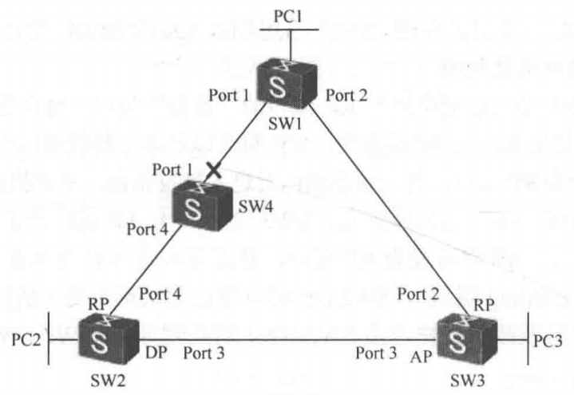
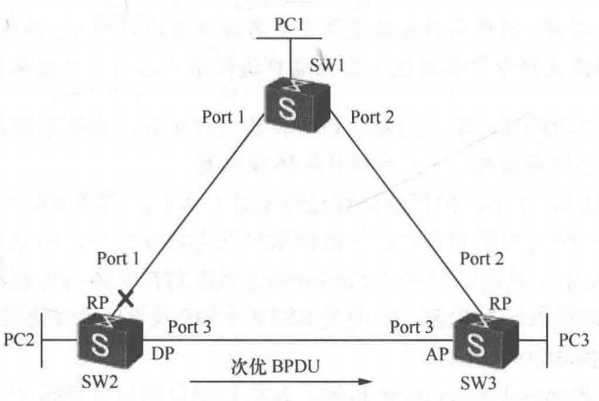
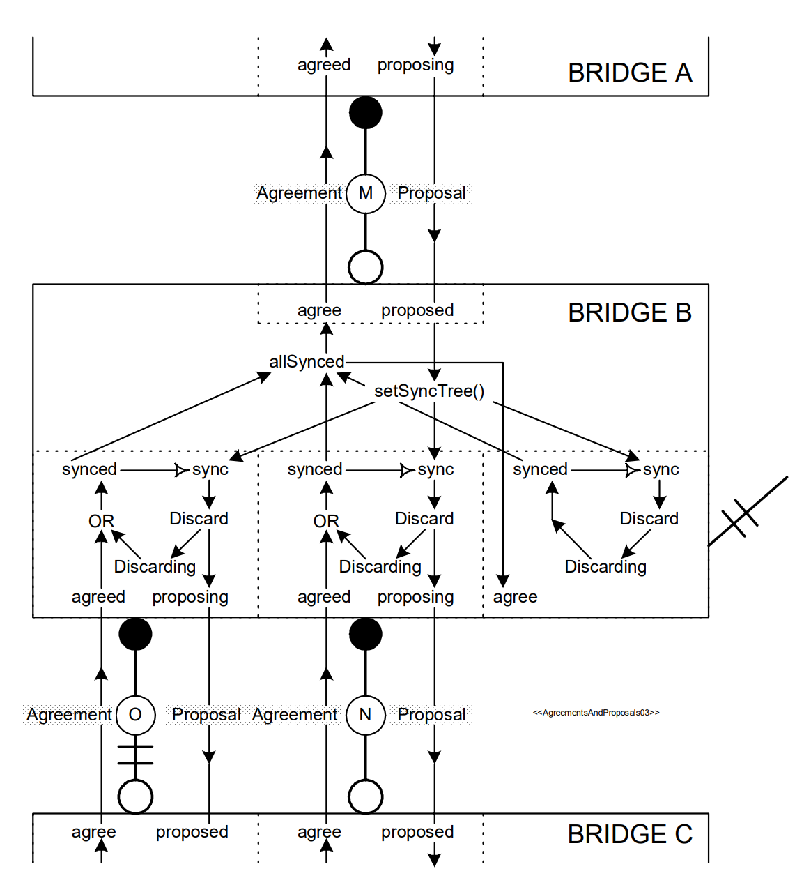
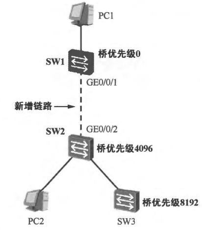
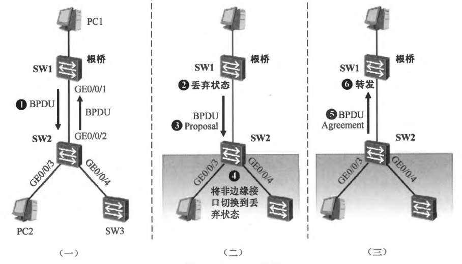

# RSTP 协议

## 5.快速收敛机制

任何端口的初始角色都是指定端口，状态是 Discarding。即使是 RP 端口，初始状态也是 Discarding。DP 和 RP 最终的端口状态都是 Forwarding，**`802.1w`** 定义了状态快速迁移的机制。**<font color="blue">当端口为 DP 或 RP 时，状态由 Discarding 立即进入到 Forwarding 或通过 P/A 协商而快速进入 Forwarding，端口状态都实现了快速切换</font>**，避免了 802.1d 下慢收敛而致的路由协议的抖动、用户数据访问中断时间过长等问题。

桥刚启动时，Cyclone 在 rstpUpdtRolesTree() 里会把根桥相关的优先级向量初始化成自己就是 RootBridge，也是 DesignatedBridge 的状态。换句话说，**<font color="red">Cyclone RSTP 协议一开始默认我就是根桥，因此在还没接收到任何外部更优 BPDU 之前，本桥对外宣告的信息天然是我这边更优，因此就会默认本桥上的端口为指定端口</font>**。

```c{.line-numbers}
void rstpUpdtRolesTree(RstpBridgeContext *context) {
    uint_t i;
    RstpBridgePort *port;
    RstpBridgePort *rootPort;
    RstpPriority rootPathPriority;

    // 假设本桥就是根桥，然后再去遍历本桥的各个端口的信息，查看是否有比本桥作为根桥更优的信息
    // rootPriority 和 bridgePriority 都属于生成树优先级向量，先假设本桥就是根，把 rootPriority 初始化为 bridgePriority
    context->rootPriority = context->bridgePriority;
    // 在本桥是根桥的假设下，根端口并不存在，这里用一个本桥自己的 bridgePortId 字段当占位/默认值
    context->rootPortId = context->bridgePriority.bridgePortId;
    // bridgeTimes 的类型是 RstpTimes 结构体，表示本桥应当遵循的根计时参数合集，根桥用自己的 BridgeTimes 作为全网计时基准
    context->rootTimes = context->bridgeTimes;
    //The port the root priority vector is derived from
    rootPort = NULL;

    // 遍历本桥的所有端口，选出本桥的最佳根信息（rootPriority/rootTimes）与 RootPort
    for(i = 0; i < context->numPorts; i++) {
        port = &context->ports[i];
        if(port->infoIs == RSTP_INFO_IS_RECEIVED) {
            // 先把该端口收到的 portPriority 复制出来
            rootPathPriority = port->portPriority;
            // 再把本端口 path cost 加到 rootPathCost 上，得到经由该端口到根的代价
            rootPathPriority.rootPathCost += port->portPathCost;

            // 一个桥有多个转发端口，每个端口有一个 MAC 地址，通常我们把端口号最小的那个端口的 MAC 地址作为整个桥的 MAC 地址
            // rootPathPriority.designatedBridgeId.addr 表示从该端口收到并记录的 BPDU（portPriority）里带来的 Designated Bridge ID 的桥 MAC
            // bridgePriority.designatedBridgeId.addr 表示桥自身的 bridgePriority 里的 Designated Bridge ID 的桥 MAC
            // 这个判断条件是为了避免把本桥自己发出的/源自本桥的信息当成外部候选来参与根选择，否则在某些拓扑下会产生不合理的根路径候选，甚至导致角色选择不稳定
            // 比如本桥的两个端口被外部线路/Hub/错误接线形成回环，导致本桥从端口 A 发出的 BPDU 被端口 B 收到了
            // 在桥级的 context->bridgePriority 这个桥级基准向量中，designatedBridgeId 就是本桥的 bridgeId
            if(rstpCompareBridgeAddr(&rootPathPriority.designatedBridgeId.addr, &context->bridgePriority.designatedBridgeId.addr) != 0) {
                // 比较从该端口收到的优先级向量与当前桥的 rootPriority，比较顺序也是：Root ID -> Path Cost -> Designated Bridge ID -> Designated Port ID -> Bridge Port ID
                // 如果从该端口收到的优先级向量更优（rstpComparePriority 返回值 > 0），就更新桥的 rootPriority
                if(rstpComparePriority(&rootPathPriority, &context->rootPriority) > 0) {
                    //Save current root path priority vector
                    context->rootPriority = rootPathPriority;
                    context->rootPortId = rootPathPriority.bridgePortId;

                    rootPort = port;

                    context->rootTimes = port->portTimes;
                    // 从邻居收到的计时参数转为本桥 rootTimes 时，消息年龄加 1
                    context->rootTimes.messageAge++;
                }
            }
        }
    }

    // 为每个端口计算如果我在该段成为 Designated 时应该通告出去的 designatedPriority/designatedTimes
    for(i = 0; i < context->numPorts; i++) {
        port = &context->ports[i];

        port->designatedPriority.rootBridgeId = context->rootPriority.rootBridgeId;
        port->designatedPriority.rootPathCost = context->rootPriority.rootPathCost;
        port->designatedPriority.designatedBridgeId = context->bridgeId;
        port->designatedPriority.designatedPortId = port->portId;
        port->designatedPriority.bridgePortId = port->portId;
        port->designatedTimes = context->rootTimes;
        port->designatedTimes.helloTime = context->bridgeTimes.helloTime;
    }
}
```

在 Cyclone RSTP 的实现里，端口状态迁移状态机（PST）的初始化逻辑非常明确 **`rstpPstInit()`** 一开始就直接调用 **`rstpPstChangeState(port, RSTP_PST_STATE_DISCARDING)`**，把端口状态机强制切到 DISCARDING，因此在协议刚启动或端口刚参与生成树时，状态机的固定起点都是 Discarding。相关源代码如下所示：

```c{.line-numbers}
void rstpPstInit(RstpBridgePort *port) {
   //Enter initial state
   rstpPstChangeState(port, RSTP_PST_STATE_DISCARDING);
}

void rstpPstChangeState(RstpBridgePort *port, RstpPstState newState) {
   //Switch to the new state
   port->pstState = newState;

    switch(port->pstState) {
    case RSTP_PST_STATE_DISCARDING:
        //Disable learning and forwarding
        rstpDisableLearning(port);
        port->learning = FALSE;
        rstpDisableForwarding(port);
        port->forwarding = FALSE;
        break;
    }

   port->context->busy = TRUE;
}
```

**`802.1w`** 相比于 **`802.1d`** 增加了如下快速收敛机制：

- RP 端口的快速切换机制，当 RP 端口消失时，AP 端口立即成为 RP 端口及转发状态；
- DP 端口主动 P/A 协商进入到 Forwarding 状态；
- 至少 3 个 Hello 间隔收不到 BPDU 端口角色便发生重新计算，或收到次的 BPDU 端口角色时也立即重新计算；

### 5.1 BPDU 老化/超时机制

华为 IEEE 802.1w 协议实现机制：端口会缓存收到的最好的 BPDU，**<font color="red">如果至少 3 个连续的 Hello 间隔没有收到 BPDU，端口失去原有角色，并立即对该端口重新计算</font>**，华为交换设备默认的超时时间为 18s，和华为 STP 实现一样。

在 Cyclone RSTP 里，当端口处于 CURRENT 状态并且当前端口信息来源是 RECEIVED（说明端口正在依赖之前收到的更优的 BPDU 信息）时，PIM 会持续监测信息的有效期计时器 **`rcvdInfoWhile`**。一旦出现 **`rcvdInfoWhile == 0`**，并且此时既没有正在进行的信息更新（updtInfo 为假），也没有新 BPDU 正在等待处理（rcvdMsg 为假），PIM 就认为这份收到的信息已经过期失效，因此会立即从 CURRENT 切换到 AGED 状态。进入 AGED 后，PIM 的入态动作会把端口的 infoIs 明确设置为 AGED，这等价于宣告该端口原先依赖的收到的信息已经老化无效，不能再作为角色选择的依据。**同时它会置 **`reselect = TRUE`** 并清 **`selected = FALSE`**，用来强制唤醒 PRS 去重新计算整棵树的角色分配**。

```c{.line-numbers}
void rstpPimFsm(RstpBridgePort *port) {
    case RSTP_PIM_STATE_CURRENT:
        // 只有在真的没有新报文、也没有待提交更新的情况下，才把 RECEIVED 判定为过期，避免出现计时器刚好到 0 但新 BPDU 同时来了时的无谓 AGED 之间的 RECEIVE 来回震荡。
        else if (port->infoIs == RSTP_INFO_IS_RECEIVED && port->rcvdInfoWhile == 0 && !port->updtInfo && !port->rcvdMsg) {
            //Switch to AGED state
            rstpPimChangeState(port, RSTP_PIM_STATE_AGED);
        }  else {
            //Just for sanity
        }
        break;
}

void rstpPimChangeState(RstpBridgePort *port, RstpPimState newState) {
    port->pimState = newState;

    switch (port->pimState) {
    case RSTP_PIM_STATE_AGED:
        port->infoIs = RSTP_INFO_IS_AGED;
        // 设置 reselect 为 true，只要任一端口 reselect==TRUE 就重算生成树信息，
        port->reselect = TRUE;
        port->selected = FALSE;
        break;
    }
}
```

在下图中，**`SW1-SW4`** 链路失效，SW2 的 RP 端口会在 18s 后超时并失去 RP 端口角色。18s 后，SW2 开始声称自己是根桥，发送次的 BPDU，SW3 接收到后，端口 3 立即重新计算而成为 DP/Discarding，SW2 和 SW3 间经过 P/A 协商之后，成为新的转发链路。在此场景中，SW2 判定链路失效消耗了 18s，在此之后，一秒内完成 **`SW2-SW3`** 状态切换。PC2 访问 PC1 经过路径 **`SW2-SW3-SW1`**。

<div align="center">
    
</div>

### 5.2 接收次优 BPDU

在 **`802.1w`** 标准中，当一台下游交换机从上游交换机接收到次的 BPDU 后，并不是等待端口缓存 BPDU 的 MaxAge 超时（华为交换机不再需要 MaxAge 机制），而是立即接收并重新计算端口角色（端口角色变为 DP 端口），这可加速收敛。

在 **`rstpUpdtRolesTree()`** 函数里，当端口的 **`infoIs==RECEIVED`** 时，并且该端口又不是 RP 时，Cyclone RSTP 协议实现中会先把如果我把自己当作该链路上的指定端口时，我应当宣称出来的那套优先级向量构造成 **`designatedPriority`**，同时该端口也已经保存了一份从对端 BPDU 记录下来的 **`portPriority`**。接下来 Cyclone 通过 **`rstpComparePriority(designatedPriority, portPriority)`** 对这两套优先级向量做严格比较。

一旦 designatedPriority 更优，就会选择 **`selectedRole=DESIGNATED`**（该端口变为 DP 端口），并置 **`updtInfo=TRUE`**。随后进入 PIM，**`updtInfo=TRUE`** 条件会被消化为真正可发送的标志，当端口满足 **`selected && updtInfo`** 条件时，PIM 会转入 UPDATE 状态，并在入状态动作里完成一组关键赋值，用本端的 designatedPriority 覆盖 portPriority，用 designatedTimes 覆盖 portTimes，然后清掉 updtInfo、并把 **`newInfo=TRUE`** 置位。随后本桥就将本端口存储的更优的 BPDU 信息发送出去。Cyclone RSTP 协议的相关源代码如下所示：

```c{.line-numbers}
// rstpUpdtRolesTree 函数
if(rstpComparePriority(&port->designatedPriority, &port->portPriority) > 0) {
    port->selectedRole = STP_PORT_ROLE_DESIGNATED;
    port->updtInfo = TRUE;
}

// rstpPimFsm 函数
// 本轮全桥的角色/优先级计算已经提交完成 并且需要更新 portPriority 和 portTimes，UPDATE 就是把端口信息更新为本桥计算出的 designated 信息
// 第一步必须先检测 updtInfo，然后有必要的话及时更新 port 的 portPriority 和 portTimes，因为后续 rstpRcvInfo 函数需要根据 portPriority 和 portTimes 来判定类型
if (port->selected && port->updtInfo) {
    rstpPimChangeState(port, RSTP_PIM_STATE_UPDATE);
}

// rstpPimChangeState 函数
void rstpPimChangeState(RstpBridgePort *port, RstpPimState newState) {
    case RSTP_PIM_STATE_UPDATE:
        port->proposing = FALSE;
        port->proposed = FALSE;
        port->agreed = port->agreed && rstpBetterOrSameInfo(port, RSTP_INFO_IS_MINE);

#if defined(RSTP_PIM_WORKAROUND_1)
        //Errata
        if (port->forward) {
            port->agreed = port->sendRstp;
        }
#endif

        port->synced = port->synced && port->agreed;
        port->portPriority = port->designatedPriority;
        port->portTimes = port->designatedTimes;
        port->updtInfo = FALSE;
        // 只有 updtInfo 为 true 时，才需要将 infoIs 设置为 RSTP_INFO_IS_MINE
        // 因为这说明端口的 portPriority 是使用本桥的信息进行更新的，所以将 infoIs 设置为 RSTP_INFO_IS_MINE
        port->infoIs = RSTP_INFO_IS_MINE;
        port->newInfo = TRUE;
        break;
}

// rstpTxRstp 函数
void rstpTxRstp(RstpBridgePort *port) {
    // ===== 6.填优先级向量（designatedPriority）：我准备在这个端口上宣告的根与路径信息 =====
    // Root Identifier（Root Bridge ID = priority + MAC）
    bpdu.rootId.priority = htons(port->designatedPriority.rootBridgeId.priority);
    bpdu.rootId.addr = port->designatedPriority.rootBridgeId.addr;
    // Root Path Cost：到根的累计代价
    bpdu.rootPathCost = htonl(port->designatedPriority.rootPathCost);
    // Bridge Identifier：Designated Bridge ID
    bpdu.bridgeId.priority = htons(port->designatedPriority.designatedBridgeId.priority);
    bpdu.bridgeId.addr = port->designatedPriority.designatedBridgeId.addr;
    // Port Identifier：Designated Port ID
    bpdu.portId = htons(port->designatedPriority.designatedPortId);
}
```

SW3 到根交换机 SW1 有两条路径，**`SW1-SW3`** 为最优路径，转发状态。**`SW1-SW2-SW3`** 为次优路径，阻塞端口。当 **`SW1-SW2`** 间链路故障时，SW2 交换机立即产生自己的 BPDU（次优 BPDU）给 SW3，SW3 会立即开始计算端口角色。下图中，收到次优 BPDU 后，无需等待任何超时，**<font color="red">SW3 的 AP 端口在收到 SW2 发送的次优 BPDU 之后会成为 DP 端口并且会发送端口自身的更优 BPDU 报文</font>**。经过此次互发报文，SW3 的 Port3 保持为 DP 端口，SW2 的 Port3 变为 RP 端口，其和 SW2 的 DP 端口同时为 Discarding 状态，并开始 P/A 协商，能够快速收敛。

<div align="center">
    
</div>

>任何一台交换机的根端口消失，同时没有 AP 端口，此时交换机会置其他所有端口为 DP 端口角色，并产生自己的 BPDU。

### 5.3 根端口快速切换

替代端口（AP）是当前交换机上 RP 端口的备份端口，每台交换机上到达根交换机的路径有多个，如果 RP 端口路径丢失，交换机可以从多个替代端口中，把最好的替代端口（AP）立即切换为 RP 端口，并且状态也同时进入转发状态，从而提高网络收敛速度。

当 RP 路径丢失时，Cyclone RSTP 的 PIM 状态机在 CURRENT 状态会命中 **`rcvdInfoWhile == 0 && !updtInfo && !rcvdMsg`** 的条件，把端口切换到 AGED，表示该端口原先基于上游 BPDU 的 RECEIVED 信息已经不再可信。信息一旦过期，Cyclone RSTP 协议就会触发重新选根端口（重选 RP）。在 **`rstpUpdtRolesTree()`** 中，协议会遍历所有端口，基于优先级向量比较寻找最优根路径来自哪个端口。一旦发现某个端口的根路径更优，就把 rootPort 指向该端口。因此，当原 RP 端口因为进入 AGED 而不再能提供有效的最优根路径依据时，此前处于 AP 的备用路径只要仍然保有更优的向量，就会在这轮比较中胜出，被选为新的 Root Port。

假设一个 AP 端口不是根端口，但是如果在 **`rstpFsm()`** 函数的状态机循环中，调用 **`rstpPrsFsm()`** 函数，重新对端口 P 进行角色选举，发现端口 P 现在变成了根端口，那么它在调用 **`rstpPrtFsm()`** 函数时，由于 **`if(port->role != port->selectedRole)`** 初次判断不通过，所以会调用 **`rstpPrtRootPortChangeState(port, RSTP_PRT_STATE_ROOT_PORT);`** 函数，将 **`port->role`** 设置为 **`STP_PORT_ROLE_ROOT`**，并刷新 rrWhile 计时器为 rstpFwdDelay。后续第二次调用 **`rstpPrtFsm()`** 函数时，由于此时 **`port->role`** 和 **`port->selectedRole`** 已经相等了，所以会进入 **`rstpPrtRootPortFsm()`** 函数的 **`RSTP_PRT_STATE_ROOT_PORT`** 状态分支，由于 **`else if(!port->forward && !port->reRoot)`** 判断通过，因为此时只是将 AP 端口设置为根端口，没有进行数据转发，也没有进入 reRoot 流程。

后续调用 **`rstpSetReRootTree(port->context);`** 函数，把全桥所有端口 reRoot 置 True。后续此新根端口 RP 想要进入转发状态必须满足两个条件，要么 **`port->fdWhile == 0`** 为真，要么 **`rstpReRooted(port) && port->rbWhile == 0 && rstpVersion(port->context)`** 为真。第一个条件是让计时器的时间走完，第二个条件主要是 **`rstpReRooted(port)`** 为真，表示全桥所有其它端口的 rrWhile 都已经归零，表示所有近期根端口都已被退役/解除，根端口 RP 才能进入学习状态，进而进入转发状态。

此时本桥之前根端口 RP 变为 AP 端口，其状态机函数 **`rstpPrtAlternatePortFsm()`** 会进入 **`RSTP_PRT_STATE_ALTERNATE_PORT`** 状态分支，由于 **`if(port->reRoot)`** 判断通过，所以会调用 **`rstpPrtAlternatePortChangeState(port, RSTP_PRT_STATE_ALTERNATE_PORT);`** 函数，将端口的 learn 和 forward 都设置为 false，确保端口不会进入转发状态。同时 rrWhile 计时器会被清 0，reBoot 设置为 false，表示端口已经稳定，退出 reRoot 流程，并且 synced 设置为 True。

本桥之前根端口 RP 变为 DP 端口，其状态机函数 **`rstpPrtDesignatedPortFsm()`** 会进入 **`RSTP_PRT_STATE_DESIGNATED_PORT`** 状态分支，由于 **`port->reRoot && port->rrWhile != 0`** 判断通过，所以会调用 **`rstpPrtDesignatedPortChangeState(port, RSTP_PRT_STATE_DESIGNATED_DISCARD);`** 函数，将端口的 learn 和 forward 都设置为 false，之后此 DP 端口会开始进行 P/A 协商，DP 发送 Proposal，然后接收 Agreement，并且将 agreed 设置为 true。因此在变为 DP 端口后会进入 **`rstpPrtDesignatedPortChangeState(port, RSTP_PRT_STATE_DESIGNATED_SYNCED);`** 函数将 rrWhile 清零。

所以新的根端口 RP 会通过 **`rstpReRooted(port) && port->rbWhile == 0 && rstpVersion(port->context)`** 此判断条件，然后进入 **`LEARNING`** 状态，进而进入 **`FORWARDING`** 状态，实现快速收敛转发数据。

```c{.line-numbers}
void rstpPrtRootPortFsm(RstpBridgePort *port) {
    // 只要 rstpReRooted 函数返回 true，即可快速进入 learn/forward 状态，即快速进行转发
    else if (port->fdWhile == 0 || (rstpReRooted(port) && port->rbWhile == 0 && rstpVersion(port->context))) {
        // The Root port can transition to Learning and to Forwarding
        // 还没请求进入 Learning：先切 ROOT_LEARN（entry: learn=1, fdWhile=forwardDelay）
        if (!port->learn) {
            rstpPrtRootPortChangeState(port, RSTP_PRT_STATE_ROOT_LEARN);
        }
        // 已经 learn 了但还没请求进入 Forwarding：切 ROOT_FORWARD（entry: forward=1, fdWhile=0）
        else if (port->learn && !port->forward) {
            rstpPrtRootPortChangeState(port, RSTP_PRT_STATE_ROOT_FORWARD);
        } else {
            // Just for sanity
        }
    }
}

void rstpPrtRootPortChangeState(RstpBridgePort *port, RstpPrtState newState) {
    // Root Port 角色的 PRT（Port Role Transition）状态机：切换状态并执行 entry action
    port->prtState = newState;
    switch (port->prtState) {
    case RSTP_PRT_STATE_ROOT_PORT:
        // Root Port 稳态：更新端口角色，并刷新 rrWhile（Recent Root timer）
        port->role = STP_PORT_ROLE_ROOT;
        port->rrWhile = rstpFwdDelay(port);
        break;
    case RSTP_PRT_STATE_REROOT:
        // 启动 reroot：对全桥端口置 reRoot 标志，触发重收敛流程
        rstpSetReRootTree(port->context);
        break;
    }
    // 通知全局调度器：本轮发生了状态变化，需要继续迭代推进其它状态机
    port->context->busy = TRUE;
}

void rstpSetReRootTree(RstpBridgeContext *context) {
    uint_t i;

    // 作用：把整桥所有端口的 reRoot 变量置为 TRUE，用于触发重新定根（re-root）流程。
    for (i = 0; i < context->numPorts; i++) {
        context->ports[i].reRoot = TRUE;
    }
}

bool_t rstpReRooted(RstpBridgePort *port) {
    uint_t i;
    RstpBridgeContext *context;
    // 获取桥上下文（包含端口数组与端口数量）
    context = port->context;
    // 遍历桥上的所有端口，检查其它端口是否仍处于 Recent Root 窗口期
    // 注意：需要跳过本端口自身；本端口的 rrWhile 在流程中允许为非 0
    for (i = 0; i < context->numPorts; i++) {
        if (&context->ports[i] != port && context->ports[i].rrWhile != 0) {
            // 发现至少一个其它端口仍未完成 reRoot（Recent Root 计时器仍在运行）
            return FALSE;
        }
    }
    // 除本端口外，所有端口 rrWhile 均为 0，认为整桥 reRoot 流程已完成
    return TRUE;
}

void rstpPrtAlternatePortFsm(RstpBridgePort *port) {
    // 端口角色转换（PRT）状态机：持续评估当前状态的所有转移条件，满足任一条件即发生状态迁移
    switch (port->prtState) {
    // 处于 ALTERNATE_PORT（替代端口稳定态）时，按握手/同步/计时器等条件决定是否进入其它子状态
    case RSTP_PRT_STATE_ALTERNATE_PORT:
        if (port->selected && !port->updtInfo) {
            else if (port->fdWhile != rstpForwardDelay(port) || port->sync || port->reRoot || !port->synced) {
                rstpPrtAlternatePortChangeState(port, RSTP_PRT_STATE_ALTERNATE_PORT);
            } else {
                //Just for sanity
            }
        }
        break;
    }
}

void rstpPrtAlternatePortChangeState(RstpBridgePort *port, RstpPrtState newState) {
    // 切换到新的 PRT（Port Role Transition）状态：用于 Alternate/Backup 端口角色的状态入口处理
    port->prtState = newState;

    switch (port->prtState) {
    // ALTERNATE_PORT：标准 Alternate 端口状态
    case RSTP_PRT_STATE_ALTERNATE_PORT:
        // 勘误处理：按 802.1Q-2018 13.37 的建议，在进入 Alternate 时重装 fdWhile
        port->fdWhile = rstpForwardDelay(port);
        // 进入 Alternate 后，认为端口处于已同步状态，并清理同步/重根控制变量
        port->synced = TRUE;
        port->rrWhile = 0;
        port->sync = FALSE;
        port->reRoot = FALSE;
        break;
    }
    port->context->busy = TRUE;
}

void rstpPrtDesignatedPortChangeState(RstpBridgePort *port, RstpPrtState newState) {
    // 切换到新状态（注意：这是 PRT 状态机的状态，不是端口的转发状态）
    port->prtState = newState;
    // 进入某个状态时，需要执行该状态定义的入口动作（entry actions），并且只执行一次。
    switch (port->prtState) {
        case RSTP_PRT_STATE_DESIGNATED_SYNCED:
            // 标记本端口达到"已同步/安全"的语义：
            // synced=TRUE，满足同步条件，并且将 sync 设置为 FALSE，清掉同步请求，避免反复被拉回 discard
            port->rrWhile = 0;
            port->synced = TRUE;
            port->sync = FALSE;
            break;
    }
    port->context->busy = TRUE;
}
```

下图中，**`SW1-SW3`** 间链路失效，SW3 交换机上 AP 端口处于 Discarding 状态，当 RP 端口 Down 后，AP 立即成为 RP 端口，状态立即进入转发状态（无需 P/A 协商，因为不存在 DP/Discarding 端口），SW2 DP 端口角色及状态不变。所以 PC3 访问 PC1 时流量几乎没有中断转发路径就快速由 **`SW3-SW1`** 切换到 **`SW3-SW2-SW1`**。

<div align="center">
    
</div>

>**<font color="red">若 SW3 有 DP 端口，则根端口在由端口 2 变为端口 3 的过程中，其状态及角色不变化，即 RP 端口快速切换过程中，交换机上其他端口通信不受影响，数据未中断</font>**。

## 6.P/A 机制

### 6.1 ieee-802.1d 规范介绍

Port Role Transitions 状态机为了让一个 Designated Port（指定端口）从非转发快速进入 Forwarding，会用到 **`Proposal/Agreement`** 的消息交换，并依赖下面这些布尔变量：

- **`proposing`**：当一个端口是指定端口但还没处于 Forwarding 时，它可以置位 proposing，并在发出的 RST BPDU 里把 Proposal 位带出去，相当于表达我想快速转发，你能不能配合？对上图中从 **`BRIDGE A -> BRIDGE B`** 的竖向下箭头 Proposal，上方标着 proposing；
- **`proposed`**：当本端（BRIDGE B）收到一个 BPDU，里面声明对端这个口是 Designated role，并且 Proposal 位=1，就把本端对应端口的 proposed 置位，表示我收到了对端的提议。注意，如果当前还没准备好同意（agree 还没能置位），那么 proposed 会触发把本桥的其他端口都置 sync，也就是让全桥 B 先同步到安全状态。对应上图中在 BRIDGE B 顶部，靠近端口的虚线框里有 proposed；并且从那里指向 **`setSyncTree()`**，再分叉到 B 的其他端口；
- **`sync`**：sync 是把端口拉回安全态的请求位。只要 sync=1，端口就会被驱动去 Discarding——除非它是 Edge Port，或者它已经是 synced=1（已经处在安全/已同步状态）。对应上图中 BRIDGE B 内部每个端口小状态图里都有 **`synced -> sync -> Discard -> Discarding`** 的路径。
- **`synced`** ：synced 表示这个端口已经处在不会形成环路的安全状态。标准给的两个典型来源：端口已经在 Discarding 或这个端口已经拿到了 agreed。对应上图中看到每个端口里有一个 OR 汇合 Discarding 或 agreed 都能导向 synced。

<div align="center">
    
</div>

>这里解释一下第 2 个来源，这里最关键的点在于 agreed 并不是一个随便的标志位，它代表的是对端已经完成了必要的同步动作（例如把其余端口同步到安全态、满足 allSynced 等条件），并且通过 Agreement 明确授权本端端口可以无额外延迟进入转发。如果不把 agreed 视作 synced 的一种来源，就会出现逻辑上的反直觉：**<font color="red">端口刚刚通过 `Proposal/Agreement` 握手完成了我可以安全快速转发的证明，结果下一次 sync 触发的全桥同步又会把它强行拉回 Discarding，等于是把刚刚建立的安全确认与快速收敛成果全部推翻</font>**，不但浪费握手过程，还会让收敛退化回更慢、更保守的路径。

- **`agree`**：当且仅当本桥除了收到 Proposal 的那个端口之外，其他所有端口都 synced=1（即 allSynced），本桥才会在该端口置位 agree，并发送带 Agreement 位的 RST BPDU 给对端。agree 第一次置位时会触发发送 Agreement，并把 proposed 清掉（表示这个提议已经处理完/进入下一阶段）。对应上图中 BRIDGE B 中间有 allSynced 指向 agree，并且从 **`BRIDGE B -> BRIDGE A`** 有竖向上箭头 Agreement。
- **`agreed`**：当本端收到带 Agreement 位的 RST BPDU，且对端端口角色是 **`Root/Alternate/Backup`**，并且该 BPDU 的优先级不比本端更好（即不会因为更优 BPDU 导致角色又要重新选），就置位 agreed。

**<font color="red">任何一个 DP 端口一旦转换到 Discarding 状态，就会向其相邻网桥请求许可，以便随后能够转换到 Forwarding 状态</font>**。其结果是在当前活动拓扑中形成的一个切口（cut）（可以理解为转发路径被临时切断/阻塞的边界）会从根桥方向向网络外缘逐步传播，直到它在最终稳定的活动拓扑中到达其应处的位置，或一直传播到网络边缘为止。

把端口切到 Discarding 不会带来数据环路风险；但切到 Forwarding 必须与该端口所处局部区域内其它端口的角色/状态保持一致。当一个端口因为生成树信息变化而被分配为 Root 或 Designated 时，桥只有在满足以下条件之一时，才知道它可以进入 Forwarding：

- 已经过去了足够长的时间，使得新信息能传播到该区域内所有桥，并且任何矛盾信息也来得及返回/被收到；
- 该端口现在是 Root Port，并且本桥上任何曾经是 Root Port 的端口现在都不是、且在生成树信息传播到网络其它桥之前也不会成为 Forwarding 状态；
- 该端口是 Designated Port，它所连接的 LAN 上至多还有一台其它桥；且那台桥的端口状态要么与生成树信息一致、要么处于 Discarding；并且通过它们的 Forwarding 端口再连接出去的更远端桥，也同样满足一致或 Discarding；
- **该端口是 Edge Port**；

### 6.2 P/A 机制示例

如下图所示，网络管理员在 SW1 与 SW2 之间新增了一条链路，由于 SW1 是此时网络中桥优先级最高的交换机，因此它将成为该网络的根桥，它的 **`GE0/0/1`** 接口将成为指定接口，而 SW2 的 **`GE0/0/2`** 接口将成为根接口。

<div align="center">
    
</div>

如果网络中运行 STP，那么虽然这两个接口的角色分别是指定接口及根接口，但是它们必须经历侦听和学习状态之后才能进入转发状态，在这段时间内，PC2 显然是无法与 PC1 通信的。而如果网络中运行的是 RSTP，那么这个过程可能仅仅需要耗费数秒。**<font color="red">RSTP 通过 **`Proposal/Agreement`** 机制来保证一个指定接口得以从丢弃状态快速进入转发状态，从而加速了生成树的收敛</font>**。如果网络中运行的是 RSTP，当 SW1 与 SW2 之间新增了一条链路后：

<div align="center">
    
</div>

1. SW1 及 SW2 立即在各自的接口上发送 BPDU，初始时双方都认为自己是根桥，如上图（一）所示；
2. 经过 BPDU 交互后，SW2 将认为 SW1 才是当前的根桥，**<font color="red">此时 SW1 的 **`GE0/0/1`** 接口是指定接口，而 SW2 的 **`GE0/0/2`** 接口则成为根接口，该接口将立即停止发送 BPDU。这两个接口当前都处于丢弃状态</font>**；
3. 接下来 P/A 过程将在 SW1 与 SW2 之间发生。由于 SW1 的 **`GE0/0/1`** 接口为指定接口且处于丢弃状态，因此 SW1 从 **`GE0/0/1`** 接口发送 Proposal 置位的 BPDU，如上图（二）所示；
4. SW2 收到 Proposal 置位的 BPDU 后，立即启动一个同步过程。此时 RSTP 的机制是确保指定接口（SW1 的 **`GE0/0/1`**）能够快速地进入转发状态，为了达到这个目的，必须确保该接口进入转发状态后网络中不存在环路，因此 SW2 的思路是：**<font color="red">先将本地的所有非边缘接口全部阻塞，然后答复 SW1 它这里并不存在环路，后者可以放心大胆地将接口切换到转发状态</font>**。已经处于丢弃状态的接口自然即可完成同步，而边缘接口则不参与该过程，除此之外，交换机处于转发状态的指定接口需切换到丢弃状态以便完成同步。在上图（二）中，SW2 收到 SW1 发送的 Proposal 置位的 BPDU 后便立即启动同步过程，假设 **`GE0/0/3`** 接口被配置为边缘接口，**`GE0/0/4`** 接口是非边缘指定接口，那么 **`GE0/0/3`** 接口不参与该过程，而 **`GE0/0/4`** 接口则被立即切换到丢弃状态。
5. 现在 SW2 的所有接口均已完成了同步，SW2 清楚地知道本地的接口不存在环路，它立即将根接口 **`GE0/0/2`** 切换到转发状态，并从该接口向 SW1 发送 Agreement 置位的 BPDU，如上图（三）所示。
6. SW1 在 **`GE0/0/1`** 接口上收到 Agreement 置位的 BPDU 后，立即将该接口切换到转发状态，此时 PC2 与 PC1 便可以实现通信了。

整个 P/A 过程以非常快的速度完成，在新增链路出现后的极短时间内，PC2 即可与 PC1 实现通信。另外，由于 SW2 的指定接口 **`GE0/0/4`** 此时依然处于丢弃状态，因此该接口也将向下游交换机发起一个 P/A 过程，具体操作不再赘述。从以上描述大家可以看到，P/A 机制的引入使得 RSTP 的收敛效率大大地提升了。

当 SW2 在根端口（或 Alternate 端口）收到带 Proposal 置位的 BPDU 后，PRT 的根端口状态机会在 **`ROOT_PORT`** 状态检测到 **`port->proposed && !port->agree`**，立刻切到 **`ROOT_PROPOSED`**。进入 **`ROOT_PROPOSED`** 的入状态动作里，Cyclone 直接调用 **`rstpSetSyncTree(context)`**，把需要同步的标志扩散到本桥整棵树（所有端口），并清掉 proposed。这一步就是前面所描述的立即启动同步过程的源码落点。

```c{.line-numbers}
void rstpRecordProposal(RstpBridgePort *port) {
    uint8_t role;
    const RstpBpdu *bpdu;

    // bpdu 指向端口 p 接收到的 BPDU 报文
    bpdu = &port->context->bpdu;
    role = bpdu->flags & RSTP_BPDU_FLAG_PORT_ROLE;
    // 只有当收到的 BPDU 端口角色=Designated，且 Proposal 位=1 时，才把 port->proposed = TRUE
    if (role == RSTP_BPDU_FLAG_PORT_ROLE_DESIGNATED) {
        if ((bpdu->flags & RSTP_BPDU_FLAG_PROPOSAL) != 0) {
            port->proposed = TRUE;
        }
    }
}

void rstpPrtRootPortFsm(RstpBridgePort *port) {
   // 收到 Proposal（proposed=1），但还没有准备发 Agreement（agree=0），进入 ROOT_PROPOSED，触发全树 sync（通常会先阻断其它可能成环端口）
   if (port->proposed && !port->agree) {
        rstpPrtRootPortChangeState(port, RSTP_PRT_STATE_ROOT_PROPOSED);
   }
}

void rstpPrtRootPortChangeState(RstpBridgePort *port, RstpPrtState newState) {
    case RSTP_PRT_STATE_ROOT_PROPOSED:
        // 收到 Proposal（同步请求）后：对全桥下发需要同步的命令，目的把除 Root Port 以外的端口同步到安全状态（常见是转 Discarding），再回 Agreement
        rstpSetSyncTree(port->context);
        // 消费 proposed 事件
        port->proposed = FALSE;     
        break;
}

void rstpSetSyncTree(RstpBridgeContext *context) {
    uint_t i;
    // 作用：把整桥所有端口的 sync 变量置为 TRUE，用于触发同步（sync）流程。
    // - 当 Root/Alternate 端口处于 Proposal/Agreement 握手流程时，需要先让相关端口进入同步状态，以避免在拓扑快速切换时形成临时二层环路。
    // - 各端口的状态机会根据 sync 标志，去做相应的阻塞/等待/状态收敛动作，当同步完成后，再由状态机清除 sync 或设置 synced 等标志。
    for (i = 0; i < context->numPorts; i++) {
        context->ports[i].sync = TRUE;
    }
}
```

接下来，转发中的 DP 接口要切回 Discarding 状态发生在 PRT 的 Designated 端口状态机里，在 **`DESIGNATED_PORT`** 状态评估条件时，代码有一条分支，只要满足 **`port->sync && !port->synced`**，即同步已启动但该端口尚未 synced，并且端口不是边缘口 **`!port->operEdge`**，同时该端口当前还在学习或转发路径上 **`port->learn || port->forward`**，就会立刻切到 **`DESIGNATED_DISCARD`**。注意这就是前面所说的 **<font color="red">交换机处于转发状态的指定接口需切换到丢弃状态以便完成同步</font>**。

```c{.line-numbers}
void rstpPrtDesignatedPortFsm(RstpBridgePort *port) {
   // 1.上层要求同步（比如调用了 rstpSetSyncTree() 函数将本桥的所有端口设置为 sync=1），并且当前端口还没处于 synced 状态，即未同步完成
   // 2.端口为非边缘口
   // 3.端口正要学习或转发数据帧，必须拉回 discarding 状态以阻断潜在环路，如果本来就在 Discarding，一般 learn/forward 已经是 FALSE，再切状态没意义
   // 只要出现必须先确保拓扑安全的事件（sync 未完成），并且该端口不是 edge 口（edge 口不存在形成环路的可能），而且端口正要学习或转发，那么必须先进入丢弃（Discarding）以阻断潜在环路。
   else if (((port->sync && !port->synced) || (port->reRoot && port->rrWhile != 0) || port->disputed) && !port->operEdge && (port->learn || port->forward)) {
         // Switch to DESIGNATED_DISCARD state
         rstpPrtDesignatedPortChangeState(port, RSTP_PRT_STATE_DESIGNATED_DISCARD);
   }
}

void rstpPrtDesignatedPortChangeState(RstpBridgePort *port, RstpPrtState newState) {
    case RSTP_PRT_STATE_DESIGNATED_DISCARD:
        // DESIGNATED_DISCARD：强制端口回到 Discarding（安全优先，避免临时环路），将 learn/forward 置 FALSE，明确不要学习/不要转发。
        port->learn = FALSE;
        port->forward = FALSE;
        port->disputed = FALSE;
        port->fdWhile = rstpForwardDelay(port);
        break;
}
```

在 Cyclone RSTP 里，Agreement 的发送时机被严格卡在同步完成之后。具体体现在 Root Port 的 PRT 状态机 **`ROOT_PORT`** 中：当满足 **`(rstpAllSynced(context) && !agree) || (proposed && agree)`** 这个条件分支时，Root Port 会切换到 **`ROOT_AGREED`**。进入 **`ROOT_AGREED`** 状态之后，Cyclone RSTP 协议会置 **`port->agree = TRUE`**，同时置 **`port->newInfo = TRUE`**，**`sync = FALSE`**，**`proposed = FALSE`**。随后由 PTX（发送状态机）在 IDLE 分支检测到 **`newInfo==TRUE`**，再进入发送路径并调用 **`rstpTxRstp()`** 发出带 Agreement 标志位的 RST BPDU。

RP 在发送完 Agreement 报文之后并不会直接把端口状态改成 Forwarding，但 RP 端口在同步完成之后，会直接对 **`(port->fdWhile == 0 || (rstpReRooted(port) && port->rbWhile == 0 && rstpVersion(port->context)))`** 条件进行判断。只要满足这些条件，代码就允许 Root Port 进入学习与转发，先在需要时进入 **`ROOT_LEARN`**，再在 **`learn==TRUE`** 且 **`forward==FALSE`** 时进入 **`ROOT_FORWARD`**。随后 PST 依据 learn/forward 这两个标志完成真正的端口状态切换。

```c{.line-numbers}
void rstpPrtRootPortFsm(RstpBridgePort *port) {
    // 两种情况可以进入 ROOT_AGREED（准备/需要发 Agreement）：
    // 1) 全树 allSynced 成立 && 我还没 agree
    // 2) proposed=1 且 agree=1，这是重复 proposal 的情况
    // 最终会导致 ROOT_AGREED entry 会置 agree=1 并置 newInfo=1 触发发 BPDU
    else if ((rstpAllSynced(port->context) && !port->agree) || (port->proposed && port->agree)) {
        rstpPrtRootPortChangeState(port, RSTP_PRT_STATE_ROOT_AGREED);
    // 省略代码.....
    else if (port->fdWhile == 0 || (rstpReRooted(port) && port->rbWhile == 0 && rstpVersion(port->context))) {
        // The Root port can transition to Learning and to Forwarding
        // 还没请求进入 Learning：先切 ROOT_LEARN（entry: learn=1, fdWhile=forwardDelay）
        if (!port->learn) {
            rstpPrtRootPortChangeState(port, RSTP_PRT_STATE_ROOT_LEARN);
        }
        // 已经 learn 了但还没请求进入 Forwarding：切 ROOT_FORWARD（entry: forward=1, fdWhile=0）
        else if (port->learn && !port->forward) {
            rstpPrtRootPortChangeState(port, RSTP_PRT_STATE_ROOT_FORWARD);
        } else {
            // Just for sanity
        }
    }
}

void rstpPrtRootPortChangeState(RstpBridgePort *port, RstpPrtState newState) {
    case RSTP_PRT_STATE_ROOT_AGREED:
        // 准备发送 Agreement：
        // - 清 proposed（proposal 已处理）
        // - 清 sync（本端口同步流程可结束）
        // - 置 agree（Agreement 语义）
        // - 置 newInfo（触发 PTX 去发送 RSTP BPDU）
        port->proposed = FALSE;
        port->sync = FALSE;
        port->agree = TRUE;
        port->newInfo = TRUE;
}
```

### 6.3 P/A 机制的使用说明

- 一旦 P/A 协商不成功，指定端口的选择就需要等待两个 Forward Delay，协商过程与 STP 一样。这个根据 **`rstpPrtDesignatedPortFsm()`** 函数的 **`else if ((port->fdWhile == 0 || port->agreed || port->operEdge) && (port->rrWhile == 0 || !port->reRoot) && !port->sync)`** 判断条件得出，要么 DP 端口是边缘端口，要么收到 Agreement BPDU 报文，要么就是 fdWhile 计时器到期归零；
- P/A 机制仅发生在点对点全双工链路上；
- P/A 之间一定要全双工直连，如果是全双工但非直连，则会出现短暂环路；
- **<font color="blue">P/A 机制是当上游是 DP 端口，下游是 RP/AP 端口时，才快速协商进入转发状态</font>**；
- P/A 机制中，Proposal BPDU 是 DP 发送给对端的 BPDU，Agreement BPDU 是下游交换机把其 RP 端口收到的 BPDU 经计算后向上游回复。其中，Flag 置位如下：RP 角色，Forwarding 状态，Agreement 置位；
- **<font color="red">RSTP 网络的 P/A 协商行为是渐进性的，逐段由根桥向网络边缘扩散</font>**。下游交换机在收到 Proposal 后，回应 Agreement，完成 P/A 协商后，其他 DP/Discarding 端口再继续开始 P/A 协商，直至到达网络边缘；