# RSTP 协议实验

## 1.RSTP P/A 机制详解

<div align="center">
    <div align="center" style="color: #F14; font-size:13px; font-weight:bold">P/A机制实验</div>
    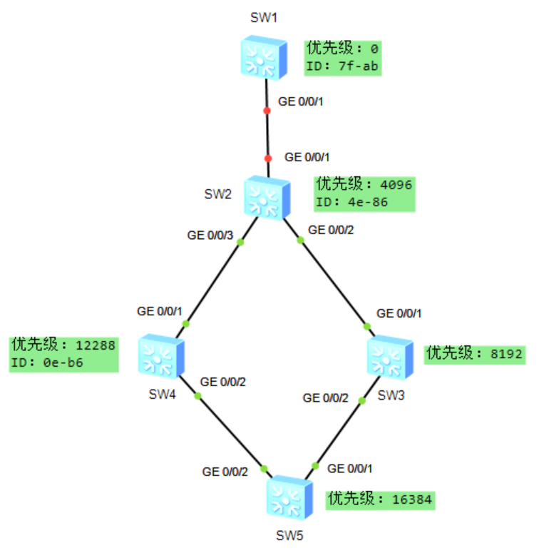
</div>

SW1 的配置如下所示：

```java{.line-numbers}
sysname SW1
#
stp mode rstp
stp instance 0 priority 0
interface Vlanif1
#
interface MEth0/0/1
#
interface GigabitEthernet0/0/1
 shutdown
 port link-type access
 stp edged-port disable
 stp point-to-point force-true
```

SW2 的配置如下所示：

```java{.line-numbers}
sysname SW2
#
stp mode rstp
stp instance 0 priority 4096
#
interface Vlanif1
#
interface GigabitEthernet0/0/1
 shutdown
 port link-type access
 stp edged-port disable
 stp point-to-point force-true
#
interface GigabitEthernet0/0/2
 port link-type access
 stp edged-port disable
 stp point-to-point force-true
#
interface GigabitEthernet0/0/3
 port link-type access
 stp edged-port disable
 stp point-to-point force-true
```

SW3 的配置如下所示：

```java{.line-numbers}
#
sysname SW3
#
stp mode rstp
stp instance 0 priority 8192
#
interface Vlanif1
#
interface GigabitEthernet0/0/1
 port link-type access
 stp edged-port disable
 stp point-to-point force-true
#
interface GigabitEthernet0/0/2
 port link-type access
 stp edged-port disable
 stp point-to-point force-true
```

SW4 的配置如下所示：

```java{.line-numbers}
#
sysname SW4
#
stp mode rstp
stp instance 0 priority 12288
#
interface Vlanif1
#
interface GigabitEthernet0/0/1
 port link-type access
 stp edged-port disable
 stp point-to-point force-true
#
interface GigabitEthernet0/0/2
 port link-type access
 stp edged-port disable
 stp point-to-point force-true
```

SW5 的配置如下所示：

```java{.line-numbers}
#
sysname SW5
#
stp mode rstp
stp instance 0 priority 16384
#
interface Vlanif1
#
interface GigabitEthernet0/0/1
 port link-type access
 stp edged-port disable
 stp point-to-point force-true
#
interface GigabitEthernet0/0/2
 port link-type access
 stp edged-port disable
 stp point-to-point force-true
```

### 1.1 SW1-SW2 之间的 P/A 机制

RSTP 的 P/A 机制用来缩短上游端口进入 Forwarding 的等待时间，且只适用于两台交换设备之间的 P2P 全双工链路。在上面首先将 SW1 的 **`G0/0/1`** 端口配置 shutdown，这样 SW2 变成临时根桥。等到网络稳定后再把 SW1 的 **`G0/0/1`** 端口设置为 **`undo shutdown`**，重新启动，SW1（优先级更低为 0）接入，触发拓扑变更，此时 **`SW1—SW2`** 之间先触发 P/A 机制。下图是对 SW2 的 **`G0/0/1`** 端口进行抓包的结果。

<div align="center">
    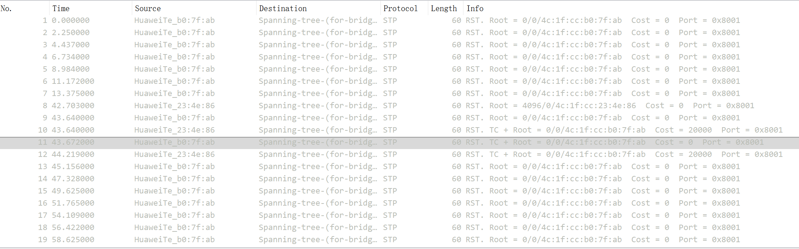
</div>

在 0-13 秒的时候，SW1 的 **`G0/0/1`** 端口处于正常转发状态，在第 13 秒的时候，SW1 的 **`G0/0/1`** 端口被配置为 shutdown，SW2 变成临时根桥。在第 42 秒的时候，SW1 的 **`G0/0/1`** 端口被重新启动（设置为 **`undo shutdown`**），触发拓扑变更，**<font color="red">首先 SW1 和 SW2 之间相互发送 Proposal 消息，并且 SW1 和 SW2 的 **`G0/0/1`** 端口此时都是指定端口</font>**。

在第 42 秒的时候，此时 SW2 的 **`G0/0/1`** 端口变为 DP 端口，并且发送 Proposal 消息，消息的具体内容如下所示。可以看出，SW2 的 **`G0/0/1`** 端口在发送 Proposal 消息时，状态为 Discarding（Forwarding 和 Learning 状态都为 no），且 Proposal 消息的 **`Flags`** 字段中包含 **`Proposal`** 标志位，表示这是一个 Proposal 消息。SW2 发送的 Proposal 消息的 **`Port Role`** 字段为 Designated Port，表示 SW2 的 **`G0/0/1`** 端口目前的状态是指定端口。**<font color="red">并且发送的 Proposal 消息以 SW2 的 Bridge ID 作为 Root ID，也就是 SW2 认为自己是根桥，因此到根桥的路径成本为 0</font>**。

<div align="center">
    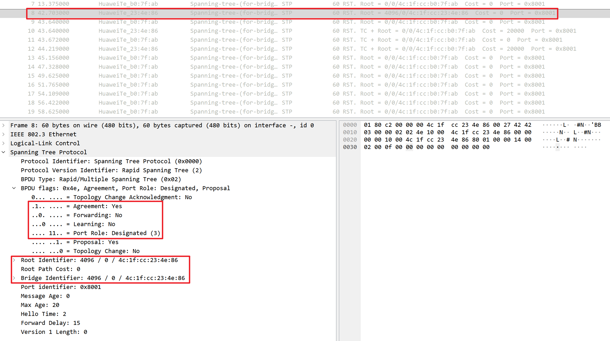
</div>

在第 43 秒的时候，此时 SW1 的 **`G0/0/1`** 端口变为 DP 端口，并且发送 Proposal 消息，消息的具体内容如下所示。可以看出，SW1 的 **`G0/0/1`** 端口在发送 Proposal 消息时，状态为 Discarding（Forwarding 和 Learning 状态都为 no），且 Proposal 消息的 **`Flags`** 字段中包含 **`Proposal`** 标志位，表示这是一个 Proposal 消息。SW1 发送的 Proposal 消息的 **`Port Role`** 字段为 Designated Port，表示 SW1 的 **`G0/0/1`** 端口目前的状态是指定端口。并且发送的 Proposal 消息以 SW1 的 Bridge ID 作为 Root ID，也就是 SW1 认为自己是根桥，因此到根桥的路径成本为 0。

<div align="center">
    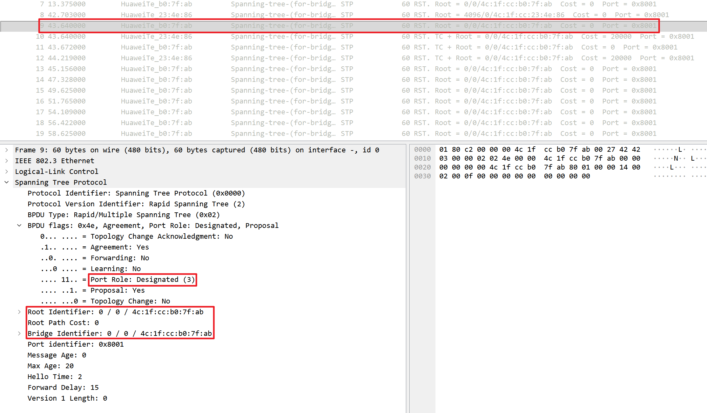
</div>

根据 **`SW1/SW2`** 之间互相发送的 Proposal 消息中 **`RootBridgeId`**、**`RootPathCost`** 等字段的比较结果，SW2 将 SW1 确认为根桥，因此 SW2 的 **`G0/0/1`** 端口变为 RP 端口，并且发送 Agreement 消息，消息的具体内容如下所示。并且可以看到发送的 Agreement 消息以 SW1 的 Bridge ID 作为 Root ID，也就是 SW2 认为 SW1 是根桥，因此到根桥的路径成本变为 20000，此时 SW2 的 **`G0/0/1`** 端口进入 Forwarding 转发状态。

<div align="center">
    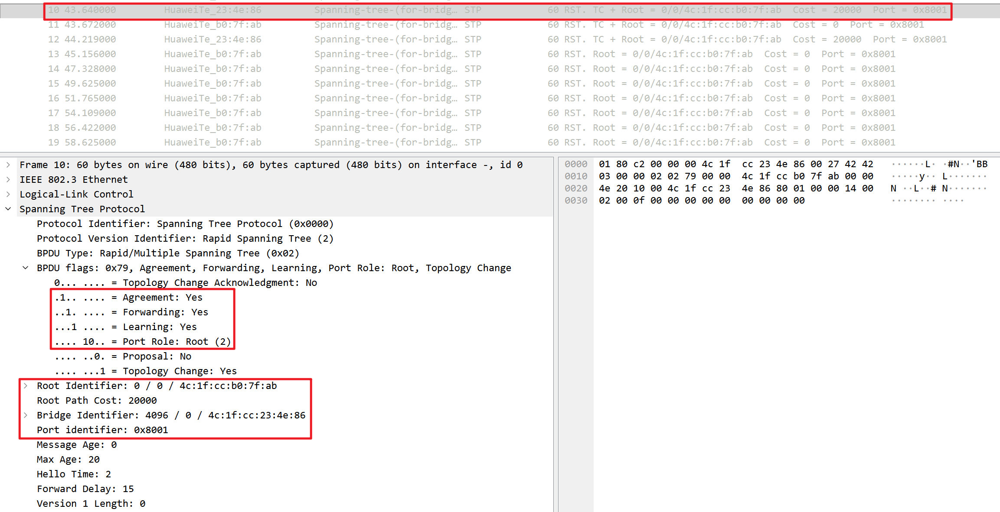
</div>

此时，SW1 和 SW2 之间的 P/A 机制已经协商完成，SW1 的 **`G0/0/1`** 端口变为 DP 端口，SW2 的 **`G0/0/1`** 端口都变为 RP 端口，并且都进入 Forwarding 状态。在随后 SW1 发送的 RST 消息内容如下所示。

<div align="center">
    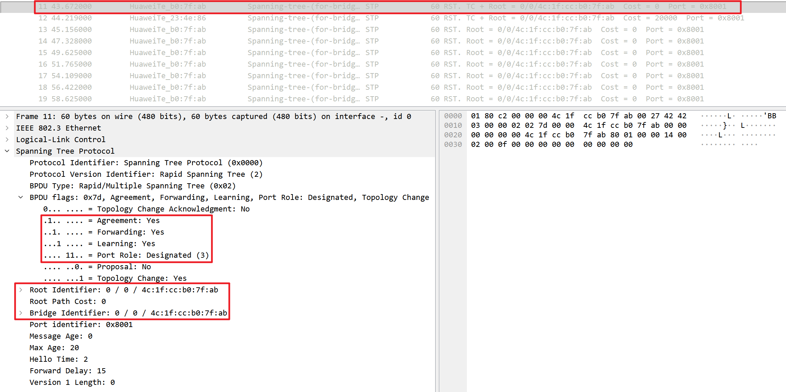
</div>

### 1.2 SW2-SW4 之间的 P/A 机制

据前所述，首先将 SW1 的 **`G0/0/1`** 端口配置 shutdown，这样 SW2 变成临时根桥。等到网络稳定后再把 SW1 的 **`G0/0/1`** 端口设置为 **`undo shutdown`**，重新启动，SW1（优先级更低为 0）接入，触发拓扑变更。下图是对 SW2 的 **`G0/0/3`** 端口进行抓包的结果。

<div align="center">
    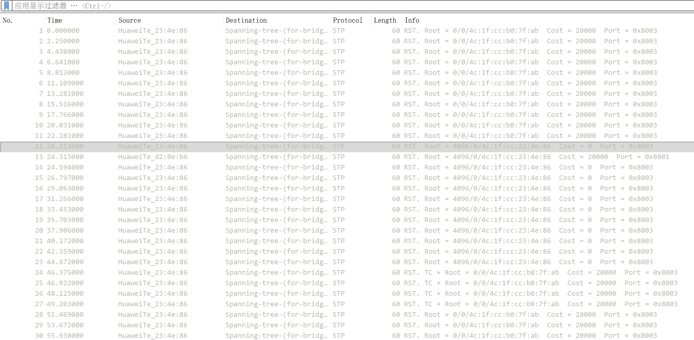
</div>

在第 0-22 秒的时候，SW1 的 **`G0/0/1`** 端口处于正常转发状态，在第 24 秒的时候，SW1 的 **`G0/0/1`** 端口被配置为 shutdown，SW2 变成临时根桥。根据前面的结论，**<font color="red">任何一台交换机的根端口消失，同时没有 AP 端口，此时交换机会置其他所有端口为 DP 端口角色，并产生自己的 BPDU</font>**。因此当 SW1-SW2 之间的链路断开时，SW2 的 **`G0/0/3`** 端口会发送 Proposal 消息，消息的具体内容如下所示。SW2 发送的 Proposal 消息的 **`Port Role`** 字段为 Designated Port，表示 SW2 的 **`G0/0/3`** 端口目前的状态是指定端口，并且发送的 Proposal 消息以 SW2 的 Bridge ID 作为 Root ID，也就是 SW2 认为自己是根桥，因此到根桥的路径成本为 0（也就是产生自己的 BPDU）。

<div align="center">
    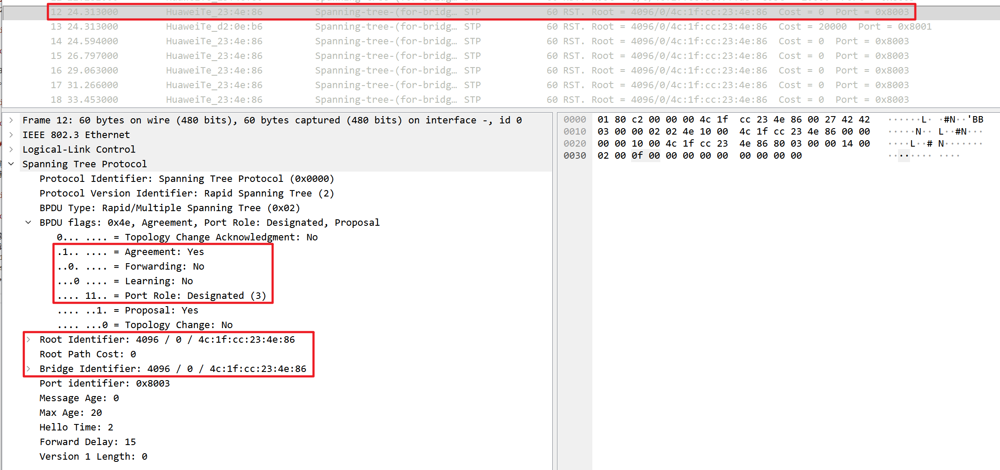
</div>

随后，SW4 的 **`G0/0/1`** 端口（此端口的状态为 RP）收到 SW2 发送的 Proposal 消息后，发送 Agreement 消息，消息的具体内容如下所示。并且可以看到发送的 Agreement 消息以 SW2 的 Bridge ID 作为 Root ID，也就是 SW4 认为 SW2 是根桥，因此到根桥的路径成本变为 20000，此时 SW4 的 **`G0/0/1`** 端口进入 Forwarding 转发状态，此时 SW2-SW4 之间的 P/A 机制协商完成，SW2 的 **`G0/0/3`** 端口进入 **`agreed`** 状态。

<div align="center">
    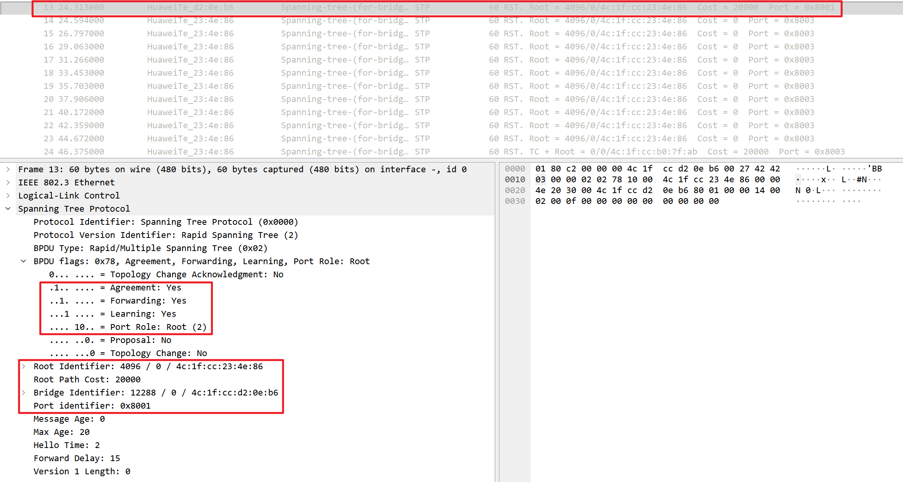
</div>

当本端（BRIDGE）收到一个 BPDU，里面声明对端这个口是 Designated role，并且 Proposal 位=1，就把本端对应端口的 proposed 置位，表示我收到了对端的提议。然后就进入同步阶段，**<font color="red">已经处于丢弃状态或者处于 agreed 状态的接口缺省即已完成同步，而边缘接口则不参与该过程</font>**，除此之外，交换机处于转发状态的指定接口需切换到丢弃状态以便完成同步。因此由于 SW2 的 **`G0/0/3`** 端口经过 P/A 协商后进入 **`agreed`** 状态，当后续再恢复 SW1-SW2 之间的链路时，SW2 的 **`G0/0/3`** 端口不需要再进行 P/A 协商，一直保持 Forwarding 状态。下图是对 SW2 的 **`G0/0/3`** 端口进行抓包的结果。

## 2.RSTP 接收次优 BPDU

如下图所示，SW1、SW2、SW3 之间形成三角形拓扑结构，SW1 到 SW3 的优先级逐步减小（优先级数值越大越小），SW1 是根交换机，所以它的所有端口都是 DP 端口，SW2 的 **`G0/0/1`** 端口是 RP 端口，**`G0/0/2`** 端口是 DP 端口；SW3 的 **`G0/0/3`** 端口是 RP 端口，**`G0/0/1`** 端口是 AP 端口，处于 DISCARDING 状态。这里解释一下，为什么 SW3 的 **`G0/0/1`** 端口是 AP 端口，**<font color="red">因为 SW3 的优先级为 8192 低于 SW2 的优先级 4096，所以 **`G0/0/1`** 端口不可能是 DP，同时 **`G0/0/1`** 端口在 SW3 上又无法成为 RP，因此 **`G0/0/1`** 端口为 AP 端口</font>**。下面使用此拓扑结构做 2 个实验：

- 将 SW2 的 **`G0/0/1`** 端口关闭（shutdown），观察 SW3 与 SW2 端口之间的交互；
- 将 SW2 的 **`G0/0/1`** 端口重新启动（undo shutdown），观察 SW3 与 SW2 之间的交互以及 SW1 和 SW2 之间的交互；

<div align="center">
    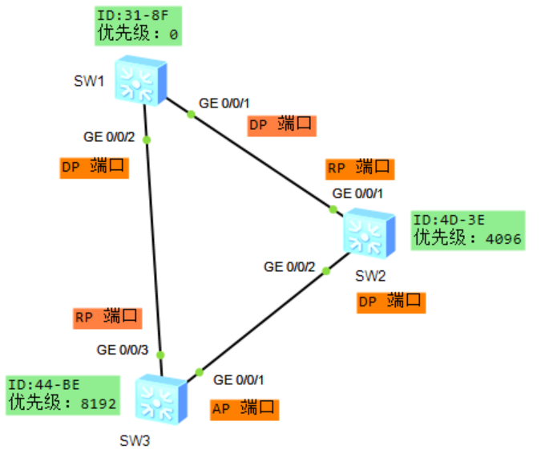
</div>

### 2.1 关闭 SW2 的 **`G0/0/1`** 端口

我们将 SW2 的 **`G0/0/1`** 端口配置为 shutdown，同时对 SW2 的 **`G0/0/2`** 端口进行抓包。在关闭 SW2 的 **`G0/0/1`** 端口后，SW2 向 SW3 发送 proposal 消息，消息的具体内容如下所示。可以看出，SW2 发送的 Proposal 消息以 SW2 的 Bridge ID 作为 Root ID，也就是 SW2 认为自己是根桥，因此到根桥的路径成本为 0（也就是产生自己的 BPDU）。**注意此时 SW2 发送的 Proposal 消息中，SW2 的 **`G0/0/2`** 端口的 Port Role 字段仍然是 DP，状态为 Discarding**。

>**<font color="red">因为上述 RST BPDU 的 source 是 **`4d-3e`**，因此该 RST BPDU 是 SW2 发送的</font>**。

<div align="center">
    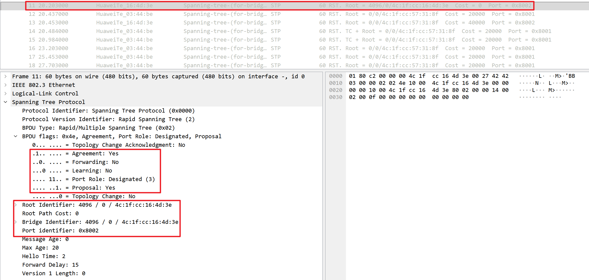
</div>

接着，**SW3 在收到次优的 RST BPDU 后**向 SW2 发送 proposal 消息，消息的具体内容如下所示。可以看出，SW3 发送的 Proposal 消息以 SW1 的 Bridge ID 作为 Root ID，也就是 SW3 认为 SW1 是根桥，因此到根桥的路径成本为 20000。**<font color="red">并且 SW3 的 Proposal 消息中 Flags 字段包含 Proposal 标志位，表示这是一个 Proposal 消息</font>**。注意，**<font color="blue">此时 SW3 发送的 proposal 消息中，SW3 的 **`G0/0/1`** 端口的 Port Role 字段由 AP 变为 DP，状态为 Discarding</font>**。

<div align="center">
    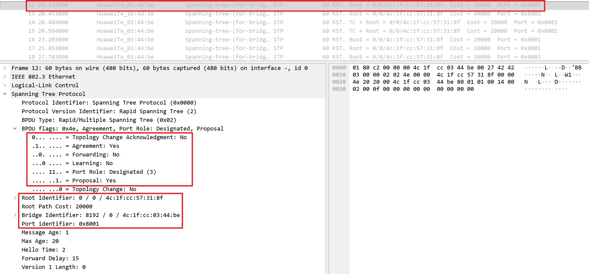
</div>

SW2 的 **`G0/0/2`** 端口收到 SW3 发送的 BPDU Proposal 消息后，**<font color="red">SW2 认为 SW3 的 Proposal 消息更优，因此 SW2 的 **`G0/0/2`** 端口变为 RP 端口</font>**，并且发送 Agreement 消息，消息的具体内容如下所示。可以看出，SW2 发送的 Agreement 消息变为以 SW1 的 Bridge ID 作为 Root ID，因此到根桥的路径成本变为 40000，此时 SW2 的 **`G0/0/2`** 端口进入 Forwarding 转发状态。

<div align="center">
    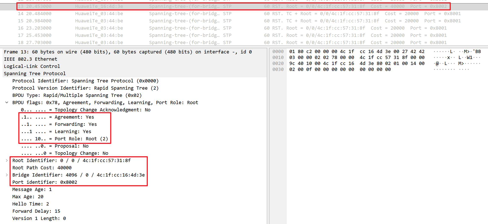
</div>

接着 SW3 向 SW2 发送普通的 RST BPDU 消息，消息的具体内容如下所示。可以看出，SW3 的 **`G0/0/1`** 端口进入 Forwarding 转发状态，并且状态为 DP。

<div align="center">
    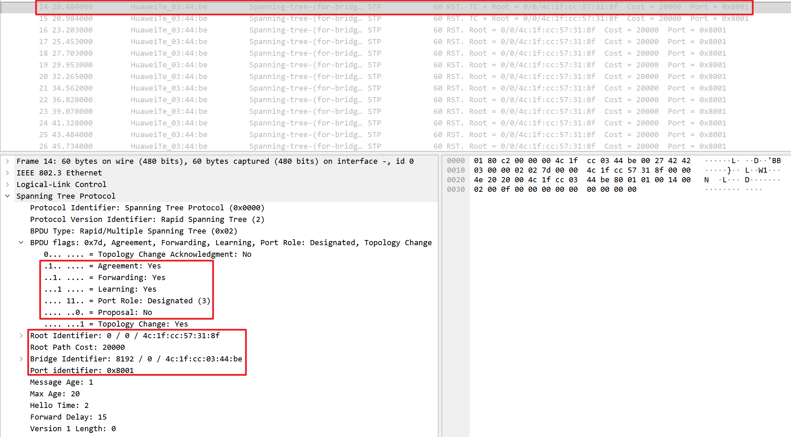
</div>

因此，总结来说 SW3 到根交换机 SW1 有两条路径，**`SW1-SW3`** 为最优路径，转发状态。**`SW1-SW2-SW3`** 为次优路径，阻塞端口。当 **`SW1-SW2`** 间链路故障时，SW2 交换机立即产生自己的 BPDU（次优 BPDU）给 SW3，SW3 会立即开始计算端口角色。下图中，收到次优 BPDU 后，无需等待任何超时，**<font color="red">SW3 的 AP 端口在收到 SW2 发送的次优 Proposal BPDU 之后会成为 DP 端口并且会发送端口自身的更优 Proposal BPDU 报文</font>**。经过此次互发报文以及 P/A 协商，SW3 的 Port3 保持为 DP 端口，SW2 的 Port3 变为 RP 端口，并均进入转发状态，因此能够快速收敛。此时 **`SW1/SW2/SW3`** 的端口如下所示：

<div align="center">
    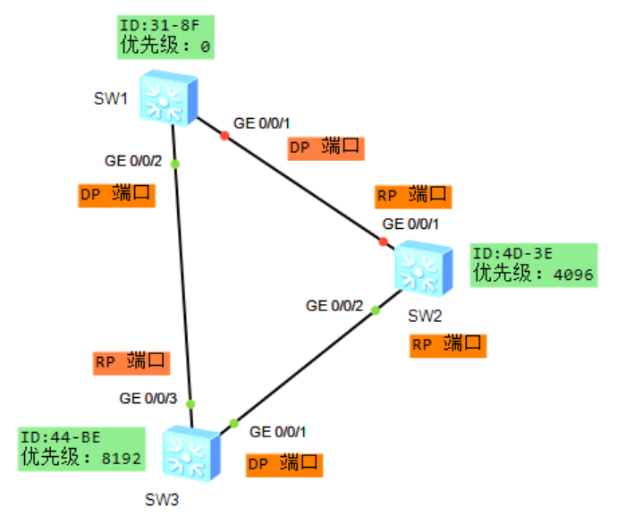
</div>

### 2.2 重新启动 SW2 的 **`G0/0/1`** 端口

#### 2.2.1 SW1-SW2 之间的交互

重新将 SW2 的 **`G0/0/1`** 端口配置为 **`no shutdown`**，此时 SW1 与 SW2 之间重新开始进行 P/A 协商。

SW2 的 **`G0/0/1`** 端口首先发送 Proposal 消息，消息的具体内容如下所示。可以看出，SW2 发送的 Proposal 消息以 SW1 的 Bridge ID 作为 Root ID，此时到根桥的路径为 **`SW2-SW3-SW1`**，因此其路径成本 RPC 为 40000。**<font color="red">并且 SW2 发送的 Proposal 消息中，SW2 的 **`G0/0/1`** 端口的 Port Role 字段仍然是 DP，状态为 Discarding</font>**。

<div align="center">
    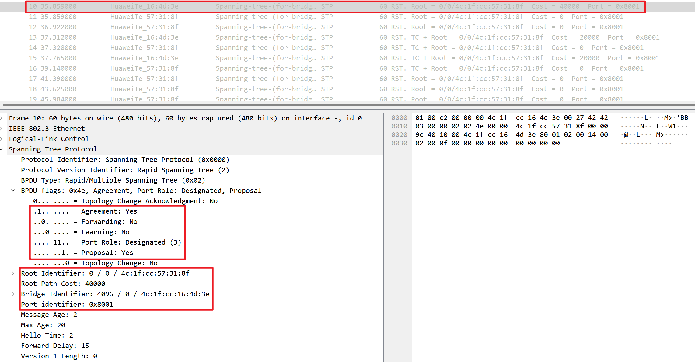
</div>

然后 SW1 也向 SW2 发送 proposal 消息，消息的具体内容如下所示。可以看出，SW1 发送的 proposal 消息以 SW1 自身的 Bridge ID 作为 Root ID，到根桥的路径成本为 0，此时 SW1 的 **`G0/0/1`** 端口状态为 DP，并且状态为 Discarding。

<div align="center">
    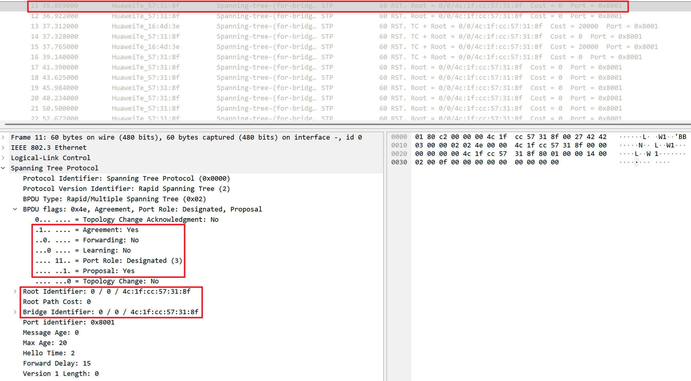
</div>

SW2 的 **`G0/0/1`** 端口收到 SW1 发送的 Proposal 消息后，**<font color="red">SW2 认为 SW1 的 Proposal 消息更优，因此 SW2 的 **`G0/0/1`** 端口变为 RP 端口</font>**，发送 Agreement 消息，并且端口的状态变为 Forwarding。SW1 的 **`G0/0/1`** 端口收到 SW2 发送的 Agreement 消息后，端口为 DP 端口，状态变为 Forwarding。P/A 协商完成，进入快速转发状态。此时 **`SW1/SW2/SW3`** 的端口如下所示：

<div align="center">
    
</div>

#### 2.2.2 SW2-SW3 之间的交互

当 SW2 的 **`G0/0/1`** 端口重新启动后，SW2 的 **`G0/0/1`** 端口在收到 SW1 发送的 proposal 报文之后进入 sync 同步状态，SW2 的 **`G0/0/2`** 端口因此由 **`RP/Forwarding`** 状态变为 **`DP/Discarding`** 状态，并因此触发发送 proposal 的消息给 SW3。SW3 的 **`G0/0/1`** 端口恢复为 AP 状态，此时 SW2 向其不断发送 Proposal 消息，但是由于 SW3 的端口状态为 AP，因此 SW3 会忽略 SW2 发送的 Proposal 消息，不会向 SW2 发送 Agreement 消息。

因此 SW2 的 **`G0/0/2`** 端口为 DP 端口，状态首先为 Discarding，经过 15 秒之后进入 Learning 状态，再经过 15 秒之后进入 Forwarding 状态。SW3 的 **`G0/0/1`** 端口保持为 AP 端口，状态保持为 Discarding。

SW2 的 **`G0/0/2`** 端口抓包结果如下所示，SW2 的 **`G0/0/2`** 端口在第 44-60 秒的时候处于 DP/Discarding 状态，在第 60 秒的时候进入 DP/Learning 状态，在第 76 秒的时候进入 DP/Forwarding 状态。

<div align="center">
    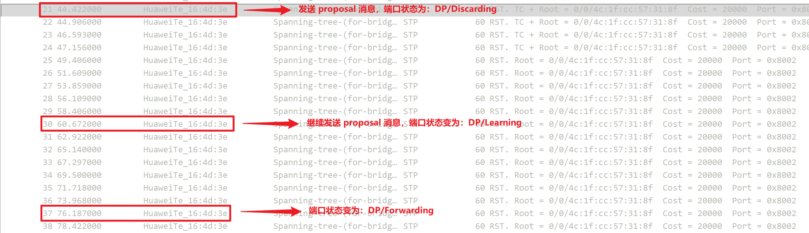
</div>

## 3.RSTP 根端口快速切换

如下图所示，SW1、SW2、SW3 之间形成三角形拓扑结构，SW1 到 SW3 的优先级逐步减小（优先级数值越大越小），SW1 是根交换机，所以它的所有端口都是 DP 端口，SW2 的 **`G0/0/1`** 端口是 RP 端口，**`G0/0/2`** 端口是 DP 端口；SW3 的 **`G0/0/3`** 端口是 RP 端口，**`G0/0/1`** 端口是 AP 端口，处于 DISCARDING 状态。下面将 SW3 的 **`G0/0/3`** 端口关闭，观察 SW3 的 AP 端口状态变化情况。

<div align="center">
    
</div>

初始时，SW3 上各端口的状态如下所示：

```c{.line-numbers}
<SW3>display stp brief 
 MSTID  Port                        Role  STP State     Protection
   0    GigabitEthernet0/0/1        ALTE  DISCARDING      NONE
   0    GigabitEthernet0/0/3        ROOT  FORWARDING      NONE
```

将 SW3 的 **`G0/0/3`** 端口配置为 shutdown 后，SW3 的 **`G0/0/1`** 端口由 AP 端口快速变为 RP 端口，并且状态由 Discarding 直接变为 Forwarding。

```c{.line-numbers}
[SW3-GigabitEthernet0/0/3]display stp brief 
 MSTID  Port                        Role  STP State     Protection
   0    GigabitEthernet0/0/1        ROOT  FORWARDING      NONE
```

SW3 的 **`G0/0/1`** 端口的抓包结果如下，在第 12 秒的时候，SW3 的 **`G0/0/3`** 端口被配置为 shutdown，此时 SW3 的 **`G0/0/1`** 端口由 AP 端口快速变为 RP 端口，并且状态由 Discarding 直接变为 Forwarding。

<div align="center">
    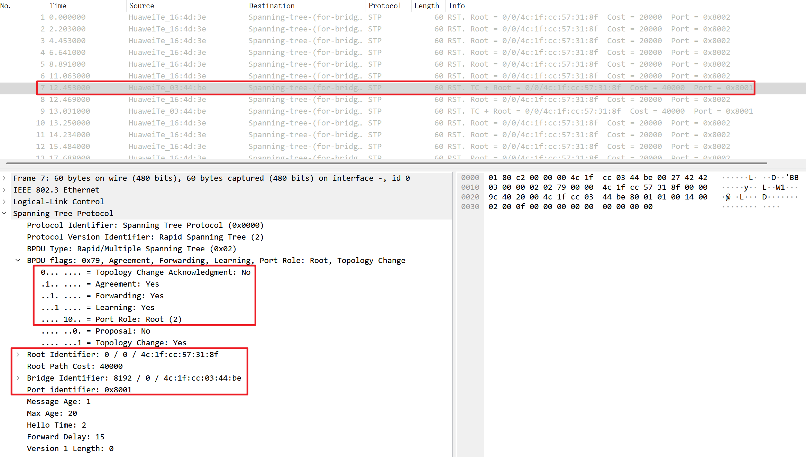
</div>