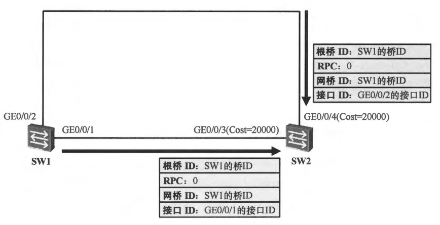
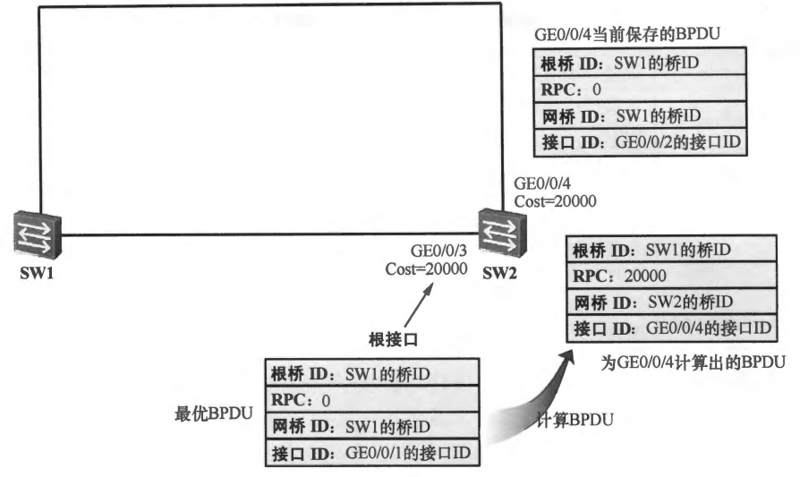
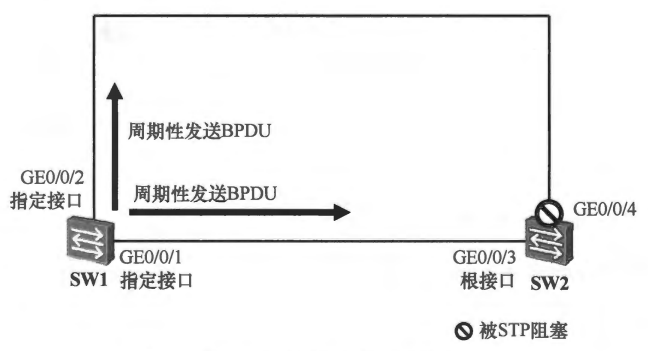

# STP 协议

## 一、STP 协议概述

### 1.环路问题

**STP (Spanning Tree Protocol) 是一种由交换机运行的、用来解决交换网络中环路问题的数据链路层协议**。交换机组成的网络中如果存在环路，可能会产生 MAC 地址表翻摆、广播风暴、多帧复制问题。以下图有环网络为例：

    

#### 1.1 MAC 地址表翻摆

假设 PC1 发送一个广播帧 X，交换机 S1、S2、S3 都会对 X 帧进行泛洪，因此 X 帧存在顺时针与逆时针两个运动轨迹。

顺时针的运动轨迹为：**`S1-P2 -> S3-P2 -> S3-P1 -> S2-P2 -> S2-P1 -> S1-P1 -> S1-P2 ->....`**
逆时针的运动轨迹为：**`S1-P1 -> S2-P1 -> S2-P2 -> S3-P1 -> S3-P2 -> S1-P2 -> S1-P1 ->....`**

这样每当帧 X 从 port1 进入 S1 时，S1 中的 MAC 地址表项会变为 **`PC1 的 MAC 地址 -> port1`**，当帧 X 从 port2 进入 S1 时，S1 中的 MAC 地址表项会变为 **` PC1 的 MAC 地址 -> port2`**，这就是 MAC 地址表快速翻摆现象，MAC 地址表的快速翻摆会消耗大量的交换机资源。

#### 1.2 广播风暴

X 帧的一个拷贝会永不停止地逆时针快速旋转，另外一个拷贝会不停地顺时针快速旋转，而每台交换机 $\scriptsize{S_i}$ 在收到 X 帧的拷贝后就会不停地执行泛洪操作。**$\scriptsize{S_i} (i=1，2，3)$ 每执行一次泛洪操作，$\scriptsize{PC_i(i=1，2，3)}$ 都会收到一个 X 帧的拷贝，这就产生了广播风暴的问题（Broadcast storm）**，广播风暴会大量地消耗网络的带宽资源以及计算机的处理资源，很可能导致计算机瘫痪。

#### 1.3 多帧复制

假设 PC1 向 PC2 发送了一个单播帧 Y，并且假设 S1 的 MAC 地址表中不存在关于 PC2 的 MAC 地址的表项，S2 的 MAC 地址表中存在表项 **`PC2 的 MAC 地址 <- Port3`**，S3 的 MAC 地址表中存在表项 **`PC2 的 MAC 地址 <- Port1`**。显然，S1 会对 Y 帧执行泛洪操作，S2 和 S3 都会对 Y 帧执行点对点转发操作。**最后的结果是，PC2 会收到两个 Y 帧的拷贝，这种现象称为多帧复制**。

交换网络中环路的存在，会导致 MAC 地址表翻摆、广播风暴、多帧复制等现象，**但环路能提高网络连接的可靠性**。在上图交换机网络中，因为有环路的存在，即使某两台交换机之间的链路因故障而中断了，整个网络仍然会保持其连通性，而这在无环网络中是无法做到的。

### 2.STP 协议的概念

因此，IEEE 802.1D-1998 中定义了 STP (Spanning Tree Protocol) 协议。在描述 STP 协议之前，我们还需要了解几个基本术语：桥（Bridge）、桥的 MAC 地址、桥 ID（BID）、端口 ID（PID）。

#### 2.1 桥

因为性能方面的限制等因素，**早期的交换机一般只有两个转发端口（如果端口多了，交换的转发速度就会慢得无法接受），所以那时的交换机常常被称为 "网桥"，或简称 "桥"**。在 IEEE 的术语中，"桥"这个术语一直沿用至今，但并不只是指只有两个转发端口的交换机了，而是泛指具有任意多端口的交换机。

#### 2.2 桥的 MAC 地址

一个桥有多个转发端口，每个端口有一个 MAC 地址。**通常，我们把端口编号最小的那个端口的 MAC 地址作为整个桥的 MAC 地址**。

#### 2.3 桥 ID

如下图所示，一个桥 (交换机) 的桥 ID 由两部分组成，**前面 2 个字节是这个桥的桥优先级，后面 6 个字节是这个桥的 MAC 地址**。桥优先级的值可以人为设定，缺省值为 0x8000，相当于十进制 32768。

    

#### 2.4 端口 ID（Portal Identifier, PID）

下图是两种常用的端口 ID 的定义方法。端口优先级的值是可以人为设定的。不同的设备商所采用的 PID 定义方法可能不同。在下图的第一种定义中，端口 ID 由两个字节组成，第一个字节是该端口的端口优先级，后一个字节是该端口的端口编号。在第二种定义中，端口 ID 由 16 个比特组成，前 4 个比特是该端口的端口优先级，后 12 比特是该端口的端口编号。

    

## 二、STP 树的生成

STP 协议的基本原理：**在一个具有物理环路的交换网络中，交换机通过运行 STP 协议，自动生成一个没有环路的工作拓扑。该无环工作拓扑也称为 STP 树 (STP Tree)，树节点为某些特定的交换机，树枝为某些特定的链路。一棵 STP 树包含了唯一的一个根节点，任何一个节点到根节点的工作路径不但是唯一的，而且是最优的。当网络拓扑发生变化时，STP 树也会自动地发生相应的改变**。

STP 树的生成过程为：首先选举根桥（Root Bridge）、然后确定根端口（Root Port，RP）和指定端口（Designated Port，DP），最后阻塞备用端口（Alternate Port，AP）。

### 1.选举根桥

**根桥是 STP 树的根节点。要生成一棵 STP 树，首先要确定出一个根桥**，STP 协议的计算需要一个参考点，而根桥就是这个参考点。运行 STP 协议的交换机 (简称为 STP 交换机) 会相互交换 STP 协议帧，这些协议帧的载荷数据被称为 BPDU（Bridge Protocol Data Unit，网桥协议数据单元）。虽然 BPDU 是 STP 协议帧的载荷数据，但它并非网络层的数据单元。

BPDU 的产生者、接收者、处理者都是 STP 交换机本身，而非终端计算机。STP 交换机初始启动之后，都会认为自己是根桥，并在发送给别的交换机的 BPDU 中宣告自己是根桥。当交换机从网络中收到其他设备发送过来的 BPDU 的时候，会比较 BPDU 中指定的根桥 BID 和自己的 BID。**交换机不断地交互 BPDU，同时对 BID 进行比较，直至最终选举出一台 BID 最小的交换机作为根桥**。

如下图所示，交换机 S1、S2、S3 都使用了默认的桥优先级 32768。由于 S1 交换机的 MAC 地址最小，因此 S1 的 BID 最小，所以最终 S1 将被选举为根桥。

    

>**值得注意的是，根桥的地位是具有可抢占性的**，以上图拓扑为例，在 STP 完成收敛后，如果网络中接入了一台新的交换机，而且这台新增的交换机的 BID，比现有根桥 SW1 的 BID 更小，那么该新增的交换机将成为网络中的新根桥。与此同时，STP 将重新收敛、重新计算网络拓扑，在这个过程中有可能引发网络震荡，从而对业务流量的正常转发造成影响。

### 2.确定根端口

根桥确定后，其他没有成为根桥的交换机都被称为非根桥。一台非根桥设备上可能会有多个端口与网络相连，为了保证从某台非根桥设备到根桥设备的工作路径是最优且唯一的，就必须从该非根桥设备的端口中确定出一个被称为根端口（Root Port）的端口，**由根端口来作为该非根桥设备与根桥设备之间进行报文交互的端口。一台非根桥设备上最多只能有一个根端口**。

交换机每个开启了 STP 协议的端口都会维护一组反映当前生成树判优结果的端口信息（例如当前根桥 ID、到根路径开销、指定桥 ID、指定端口 ID 等）。**当端口接收到更优的 Configuration BPDU 报文时，会用该 BPDU 报文携带的判优信息更新本端口所保存的本地信息**。随后，**非根桥会在所有参与 STP 的端口中，按类似的判优规则选出使最优的那个端口，并将其作为根端口（Root Port）**，即本桥朝向根桥的最佳转发入口。

在 STP 收敛完成之后，根桥依然会周期性地向网络中发送 BPDU，而非根桥则会周期性地在自己的根接口上收到 BPDU，并沿着 STP 树向下游转发。

STP 协议把根路径开销作为确定根端口的一个重要依据。一个运行 STP 协议的网络中，我们将某个交换机的端口到根桥的累计路径开销称为这个端口的根路径开销 (Root Path Cost，RPC)。链路的路径开销 (Path Cost) 与端口速率有关，端口转发速率越大，则路径开销越小。

    

在上图中，在 STP 协议收敛的过程中，**S3 的 **`GE0/0/1`** 和 **`GE0/0/2`** 端口上都会收到 Configuration BPDU 报文，然后会和端口本地保存的生成树判优信息进行比较更新，最后依据 **`GE0/0/1`** 和 **`GE0/0/2`** 端口各自缓存的生成树判优信息进行比较，选出最优的端口作为根端口**。因此假定 S1 被选举为根桥，S3 的 **`GE0/0/1`** 端口的 RPC 为 20000，S3 的 **`GE0/0/2`** 端口的 RPC 为 200000 + 20000 = 220000，因此 GE0/0/1 最终被确定为 S3 的根端口。

在一台非根桥设备上筛选根端口的 BPDU 比较原则如下所示：

  

  
筛选根端口 BPDU 比较原则

    <pre class="mermaid">
flowchart TD
    A[比较本桥 ID（br->bridge_id）和端口 p 所在网段最优 BPDU 里宣告的根桥 ID（p->designated_root）] -- 如果 br->bridge_id 大于 p->designated_root --> B[比较端口 p->designated_root 根桥 BID 和端口 rp->designated_root 根桥 BID]
    B -- 如果端口 p 和 rp 的根桥 BID 相同 --> C[比较端口 p 和端口 rp 到根桥的 RPC]

    C -- 如果端口 p 和端口 rp 到根桥的 RPC 相同 --> D[比较端口 p 和端口 rp 所连接网段中的指定桥 BID]
    D -- 如果端口 p 和端口 rp 的指定桥 BID 相同 --> E[比较端口 p 和端口 rp 所连接网段中的指定端口 PID]
    E -- 如果端口 p 和端口 rp 的指定端口 PID 相同 --> F[比较端口 p 和端口 rp 本身的端口 PID]
</pre>
  

如下图所示，S1 是根桥，假设 S4 的 **`GE0/0/1`** 端口的 RPC (路径 1 的开销)与 **`GE0/0/2`** 端口的RPC (路径 2 的开销)相同，则 S4 会对上行设备 S2 和 S3 的 BID 进行比较，假设 S2 的 BID 比较小，S4 的 **`GE0/0/1`** 端口就会称为根端口。

对于S5而言，假设其 **`GE0/0/1`** 端口的 RPC 与 **`GE0/0/2`** 端口的 RPC 相同，由于这两个端口的上行设备同为 S4，所以 S5 还会对 S4 的 **`GE0/0/3`** 端口的 PID 和 S4 的 **`GE0/0/4`** 端口的 PID 进行比较。

    

### 3.确定指定端口

根端口保证了 **交换机与根桥之间工作路径的唯一性和最优性。为了防止工作环路的存在，网络中每个网段与根桥之间的工作路径也必须是唯一的且最优的**。当一个网段有两条及两条以上的路径通往根桥时（该网段连接了不同的交换机，或者该网段连接了同台交换机的不同端口），**与该网段相连的交换机（可能不止一台）就必须确定出一个唯一的指定端口**。指定端口的确定也需要进行比较判优，具体的流程如下所示：

  

  
筛选指定端口比较原则

    <pre class="mermaid">
flowchart TD
    A[比较本桥 RPC 和端口 p 所连接网段上，当前被判定为最优 BPDU 中所携带的到根桥的路径代价 RPC，较小者为指定端口] -- 如果两者相同 --> B[比较本桥 BID 和端口 p 所连网段的指定桥的 BID，较小者为指定端口]
    B -- 如果两者相同 --> C[比较端口 p 自身的 PID 和端口 p 所连网段的指定端口 PID，较小者为指定端口]
</pre>
  

对于非根桥而言，其所有接口中收到最优 BPDU 的接口将成为该设备的根接口，**随后该非根桥使用自己接收的最优 BPDU，为本设备上的其他接口各计算一个 BPDU，然后使用计算出的 BPDU 与接口上所维护的 BPDU（接口自身也会从网络中收到 BPDU，并将 BPDU 保存起来）进行比较**，如果前者更优，那么该接口将成为指定接口，并且其所保存的 BPDU 也被前者替代，交换机将替代后的 BPDU 从该指定接口转发给下游交换机；如果后者更优，那么该接口将成为非指定接口（非指定接口指的是既不是根接口，又不是指定接口的接口）。

综上所述，对于非根桥而言，根接口的选举过程是非根桥将自己所收到的所有 BPDU 进行比较，而指定接口的选举过程则是非根桥用自己计算出的 BPDU 跟别的设备发过来的 BPDU 进行比较。

>解释一下，为什么对于非根桥而言，其所有接口中收到的最优 BPDU 接口将成为该设备的根接口：在非根桥上，每个端口都会缓存自己收到的最佳（最优）BPDU，其优劣按 **`Root ID -> Root Path Cost -> 发送者 Bridge ID -> 发送者 Port ID`** 依次比较决定（调用 **`br_supersedes_port_info`** 函数）；然后设备把所有端口保存的最佳 BPDU 再做一次横向比较，对应 BPDU 最优的那个端口 就被选为 Root Port（根端口）。

下图中，在 SW1 与 SW2 之间的网段中，SW1 的 Port1 被选举为指定接口；在 SW1 与 SW3 之间的网段中，SW1 的 Port2 被选举为指定接口。**一般而言，根桥的所有接口都是指定接口**。另外，STP 还会在 SW2 及 SW3 之间的网段中选举一个指定接口，最终 SW2 的 Port2 接口胜出，成为该网段的指定接口。

    

### 4.阻塞备用端口

**在确定了根端口和指定端口之后，交换机上所有剩余的非根端口和非指定端口统称为备用端口**。STP 会对这些备用端口进行逻辑阻塞。所谓逻辑阻塞，**是指这些备用端口不能转发由终端计算机产生并发送的帧，这些帧也被称为用户数据帧**。不过，备用端口可以接收并处理 BPDU 报文，但是不能发送 BPDU 报文。根端口和指定端口既可以发送和接收 BPDU 报文，又可以转发用户数据帧。

阻塞备用端口是生成 STP 树的最后一个步骤，至此，STP 树（无环工作拓扑）的生成过程如下所示：

    

## 三、STP 报文

**STP 交换机通过交换 STP 协议帧来建立和维护 STP 树，并在网络的物理拓扑发生变化时重建新的 STP 树**。STP 协议帧采用了 IEEE802.3 封装格式，其载荷数据被称为 BPDU。BPDU 有两种：Configuration BPDU 和 TCN (Topology Change Notification) BPDU。这两种 BPDU 各有各的用途。BPDU 载荷被直接封装在以太网数据帧中，数据帧的目的 MAC 地址是组播 MAC 地址：**`0180-c200-0000`**。

### 1.配置 BPDU（Configuration BPDU）

配置 BPDU 是 STP 进行拓扑计算的关键。在交换网络的初始化过程中，每台交换机都从自己激活了 STP 的接口向外发送配置 BPDU。**当 STP 收敛完成后，只有根桥才会周期性地发送配置 BPDU**（缺省时，以 2s 为周期发送配置 BPDU，可以在设备的系统视图下使用 **`stp timer hello`** 命令修改发送周期）。根据 **`br_received_config_bpdu`** 函数的源代码，**而非根桥则会在自己的根接口上收到上游发送过来的配置 BPDU，并立即被触发而产生自己的配置 BPDU，然后从自己的指定接口发送出去**。这一过程看起来就像是根桥发出的配置 BPDU 逐跳地经过了其他的交换机。

Configuration BPDU 中携带的参数可以分为 3 类：

1. BPDU 对自身的标识，包括协议标识、版本号、BPDU 类型和 Flags（长度为 1 个字节，最低位为 **`Topology Change, TC`** 标识，最高位为 **`TC Acknowledgment, TCA`** 标识）。
2. BPDU 用于进行 STP 计算的参数，包括发送该 BPDU 的交换机的 BID，当前根桥的 BID，发送该 BPDU 的端口的 PID，以及发送该 BPDU 的端口的 RPC。
3. 第三类是时间参数，分别是 Hello Time、Forward Delay、Message Age、Max Age。

### 2.TCN BPDU

如果网络中某条链路发生了故障，导致工作拓扑发生了改变，则位于故障点的交换机可以通过端口状态直接感知到这种变化，但是其他的交换机是无法直接感知到这种变化的。这时，**位于故障点的交换机会以 Hello Time 为周期通过其根端口不断向上游交换机发送 `TCN BPDU`，直到接收到从上游交换机发来的、TCA 标志置 1 的 Configuration BPDU**。上游交换机在收到 TCN BPDU 后，一方面会通过其指定端口回复 TCA 标志置 1 的 Configuration BPDU，另一方面会以 Hello Time 为周期通过其根端口不断向它的上游交换机发送 TCN BPDU。此过程一直重复，直到根桥接收到 TCN BPDU。**根桥接收到 TCN BPDU 后，会发送 `TC 标志置 1 的 Configuration BPDU`，通告所有交换机网络拓扑发生了变化，需要尽快老化自己的 MAC 地址表项，以便适应新的网络拓扑**。

    

TCN BPDU 的格式非常简单，只有协议 ID、协议版本 ID 以及 BPDU 类型三个字段，并且 BPDU 类型字段的值为 0x80。TCN BPDU 用于在网络拓扑发生变化时向根桥通知变化的发生。当拓扑稳定时，网络中只会出现配置 BPDU，而当拓扑发生变更时，STP 会使用 TCN BPDU，以及两种特殊的配置 BPDU

#### 2.1 标志字段中 TCA 比特位被设置为 1 的配置 BPDU

STP 要求 TCN BPDU 从发现拓扑变更的交换机传递到根桥的过程是可靠的，因此当一台交换机收到下游发送上来的 TCN BPDU 后，需使用标志字段中 TCA 比特位被设置为 1 的配置 BPDU 回应对方并向自己的上游发送 TCN BPDU。这个过程将一直持续，直到根桥收到该 TCN BPDU。

在 stp 协议的实现中，非根桥收到 TCN BPDU 时，入口是 **`br_received_tcn_bpdu()`**，它收到 TCN 报文之后会做两件事：一是调用 **`br_topology_change_detection(br)`**，从本桥的 root port 发送一个 TCN 报文，并且调用 **`br_topology_change_acknowledge(p)`** 函数在收到 TCN 报文的这个端口上回一个带 TCA 位的配置 BPDU，让下行设备停止重复上报和重传。所以 TCN 从变化点位逐跳向根桥方向传递，每一跳都在指定端口 DR 上给下行设备回 TCA 报文，同时沿 root port 继续往上报。

根桥收到 TCN BPDU 时，入口是 **`br_received_tcn_bpdu()`**，同样会调用 **`br_topology_change_acknowledge(p)`** 函数在该端口回 TCA 给下行确认。但区别在 **`br_topology_change_detection()`** 函数中，根桥不需要再向上行设备发送 TCN 报文，因为根桥就是上报链的终点，所以根桥分支会直接调用 **`__br_set_topology_change`** 函数把本桥的 **`topology_change`** 状态置 1，同时还会把转发表的 MAC 老化时间临时缩短（典型是 **`2×forward_delay`**），其目的就是让全网更快把可能指向旧拓扑的 MAC 表项淘汰掉，从而加速拓扑变化后的流量收敛。

#### 2.2 标志字段中 TC 比特位被设置为 1 的配置 BPDU

根桥收到 TCN BPDU 后，也就意识到了拓扑变化的发生，接下来它要将该变化通知到全网，它将向网络中泛洪标志字段中 TC 比特位被设置为 1 的配置 BPDU，网络中的交换机收到该配置 BPDU 后，会将自己的 MAC 地址表的老化周期（缺省为 300s）缩短为 **`Forward Delay`** 的时间长度（缺省为 15s），加速老化（因为之前的 MAC 地址表项因为网络拓扑的更改而不正确），以便适应新的网络拓扑。

根桥把 TC 扩散到整个网络的主要过程：根桥一旦设置 **`br->topology_change=1`**，接下来每次 hello 定时器触发 Config BPDU 生成/发送时，调用 **`br_config_bpdu_generation()`** 函数，在构造 BPDU 时都会把 **`bpdu.topology_change`** 置为 1，也就是 TC=1，然后调用 **`br_transmit_config`** 函数从根桥的所有指定端口发出 config BPDU 报文。**下游交换机在 **`br_received_config_bpdu`** 函数中自己的 **`root_port`** 收到这种带 TC=1 的配置 BPDU 后，会在 **`br_record_config_timeout_values()`** 里将 TC=1 的配置同步到本桥，同样临时缩短自己的 MAC 老化时间**，并且调用 **`br_config_bpdu_generation()`** 函数把带 TC=1 的 Config BPDU 从自己的指定端口再向下游扩散，于是 TC 标志就沿生成树逐跳传播到全网。

### 3.STP 时间参数

- **`Hello Time（Hello 时间）`**：运行了 STP 的交换机发送配置 BPDU 的时间间隔，缺省为 2s。如需修改 STP 发送配置 BPDU 的时间间隔，那么必须在根桥上修改，修改完成后，所有的非根桥都与根桥对齐该时间值。当网络拓扑及 STP 树稳定之后，全网使用根桥指定的 Hello Time。
- **`Forward Delay（转发延迟）`**：运行了 STP 的接口从侦听状态进入学习状态，或者从学习状态进入转发状态的延迟时间，缺省为 15s。**为了避免在生成树收敛过程中网络中可能出现的临时环路，或者短暂的数据帧泛洪现象，STP 定义了侦听和学习这两种接口状态，并要求接口从阻塞状态进入转发状态前必须先经历这两个状态**，而且分别在这两个状态各停留一个转发延迟时间。这意味着对于 STP 而言，一个被阻塞的接口被选举为根接口或指定接口后，进入转发状态之前至少需要经历 30s 的时间。
- **`Max Age（最大生存时间）`**：Configuration BPDU 的最大生命周期，也被称为 BPDU 的老化时间，缺省为 20s。以非根桥的根接口为例，该设备将会在这个接口上保存来自上游的最优 BPDU，这个 BPDU 关联着一个最大生存时间，如果在该 BPDU 到达最大生存时间之前，接口再一次收到了 BPDU，那么其最大生存时间将会被重置，**而如果接口一直没有再收到 BPDU 从而导致该接口上保存的 BPDU 到达最大生存时间，那么该 BPDU 将被老化**。此时设备将会重新在接口上选择最优 BPDU，也就是重新进行根接口的选举。
>STP 交换机收到 Configuration BPDU 后（在 **`br_stp_rcv`** 函数中），首先校验 Message Age 与 Max Age。若 **`Message Age > Max Age`**，则该 BPDU 被直接丢弃，不进入后续处理逻辑，因此不会引起端口/桥的配置状态更新，也不会触发新的 Configuration BPDU 发送。若 **`Message Age ≤ Max Age`**，则该 BPDU 进入 STP 处理流程，当该 BPDU 被判定为优于端口当前维护的信息并导致端口/桥状态更新时，将通过 STP 的计时器与状态机机制对外发送更新后的 Configuration BPDU。
- **`Message Age`**：实际的实现中，Configuration BPDU 每经过一个桥，Message Age 增加 1。从根桥发出的 Configuration BPDU 的 Message Age 为 0。

## 四、BPDU 的比较原则

对于 STP 而言，最重要的工作就是在交换网络中计算出一个无环拓扑，并在网络中存在二层环路的情况下打破环路。在拓扑计算的过程中，一个非常重要的内容就是配置 BPDU 的比较。**在配置 BPDU 中，有四个字段非常关键，它们是根桥 ID、RPC、网桥 ID 以及接口 ID**，这四个字段便是交换机进行配置 BPDU 比较的关键内容。

STP 按照如下顺序选择最优的配置 BPDU。

- 最小的根桥 ID；
- 最小的 RPC；
- 最小的网桥 ID；
- 最小的接口 ID；

在这四条原则中（每条原则都对应配置 BPDU 中的相应字段），**第一条原则主要用于在网络中选举根桥，后面的原则主要用于选举根接口及指定接口**。假设有两个 BPDU，第一个 BPDU 中根桥 ID、RPC、网桥 ID 以及接口 ID 字段的内容分别是：**`32768 0025-9ef8-0e70、20000、32768 0025-0201-0132、128 15`**，另一个 BPDU 是：**`32768 0025-9ef8-0e70、20000、32768 0025-0201-a298、128 19`**，首先这两个配置 BPDU 的根桥 ID 字段都相同，其次 RPC 字段也相同，而前者的网桥 ID 字段值小于后者（网桥 MAC 地址更小），因此前者更优。

### 1.BPDU 的交互与拓扑计算

初始情况下，交换网络中的所有交换机都认为自己是根桥，这些设备开始运行后从自己所有激活了 STP 的接口发送 BPDU。如下图所示，SW1 及 SW2 均在自己的接口上发送自己的 BPDU，图中只为大家展示了 BPDU 中最重要的四个字段。

    

1. 由于两者都认为自己是根桥，因此在它们各自发送的 BPDU 中，根桥 ID 字段均填写的是自己的桥 ID，而 RPC 字段则填写的是 0。根桥发出的 BPDU 中 RPC 始终为 0，毕竟根桥到达自己无需付出任何成本。**另外网桥 ID 字段填写的是该 BPDU 发送者的桥 ID，而接口 ID 字段则填写的是发送该 BPDU 的接口的接口 ID**。
2. SW1 及 SW2 都将收到对方发送过来的 BPDU 并开始进行 BPDU 的比较——将对方的 BPDU 与自己接口上的 BPDU 进行比较，按照上述 BPDU 的比较原则依序进行。实际上，在第一个原则（最小的根桥 ID）的比较中，SW2 便已经判断出对方发送的 BPDU 要比本地的更优。现在 SW2 接受了 SW1 为根桥的事实，而 SW1 则认定自己是根桥，它将忽略 SW2 发送的 BPDU，并继续周期性地从自己的接口发送 BPDU。
3. 接下来，SW2 将开始根接口选举。由于 SW2 在 **`GE0/0/3`** 及 **`GE0/0/4`** 接口上收到的 BPDU 都比自己本地的 BPDU 更优，因此它使用对方的 BPDU 更新自己本地的 BPDU，如下图所示。然后 SW2 将比较自己所有接口上的 BPDU，拥有最优 BPDU 的接口将成为其根接口。

    

对于 SW2 在 **`GE0/0/3`** 及 **`GE0/0/4`** 接口上保存的这两个 BPDU，它们的根桥 ID 字段是相同的，而它通过这两个接口到达根桥的 RPC 又都是 20000（以 **`GE0/0/3`** 接口为例，**SW2 从该接口到达根桥的 RPC 等于它在该接口上收到的 BPDU 中的 RPC 加上该接口的 Cost**，也就是 0+20000，结果等于 20000。GE0/0/4 同理）。另外，这两个 BPDU 的网桥 ID 字段也相同，因此 SW2 将比较这两个 BPDU 的接口 ID 字段。

由于在 **`GE0/0/3`** 接口上到达的 BPDU 是由 SW1 的 **`GE0/0/1`** 接口发出，而在 **`GE0/0/4`** 接口上到达的 BPDU 是由 SW1 的 **`GE0/0/2`** 接口发出，故此时其实比较的是 SW1 的 **`GE0/0/1`** 及 **`GE0/0/2`** 的接口 ID。大家都知道，接口 ID 包含两部分：接口优先级和接口编号，接口优先级的值最小的将胜出，而如果接口优先级都相等，那么接口编号最小的将胜出。

在本例中，这两个接口的优先级相同，而由于 **`GE0/0/1`** 的接口编号比 **`GE0/0/2`** 更小，所以对于 SW2 而言，在其 **`GE0/0/3`** 接口上到达的 BPDU 更优，于是该接口成为 SW2 的根接口。

4. SW2 的根接口选举出来后，它使用当前在根接口上保存的最优 BPDU 为其他接口计算 BPDU。以 SW2 为其 **`GE0/0/4`** 接口计算的 BPDU 为例，具体的做法是，如下图所示。

    

- 在根桥 ID 字段中写入最优 BPDU 中的根桥 ID，也就是 SW1 的桥 ID。
- 在 RPC 字段中写入最优 BPDU 中的 RPC 与根接口（**`GE0/0/3`**）的 Cost 之和，也就是 20000。
- 在网桥 ID 字段中写入本设备的桥 ID，也就是 SW2 的桥 ID。
- 在接口 ID 字段中写入本接口的 ID，也就是 **`GE0/0/4`** 接口的 ID。

完成上述操作后，SW2 将其为 **`GE0/0/4`** 计算出的 BPDU 与该接口当前保存的 BPDU 进行比较，很明显后者更优，于是 SW2 将该接口 **`GE0/0/4`** 认定为非指定接口。SW2 继续在 **`GE0/0/4`** 接口上保存 SW1 发送的 BPDU，并且持续侦听该 BPDU。

5. 到目前为止，网络的拓扑已经计算完毕，SW2 的 **`GE0/0/4`** 接口将被阻塞，从而网络中的二层环路被打破，如下图所示。

    

### 4.STP 端口状态

STP 交换机的端口分为以下 5 种状态：

1. 去能（Disabled）：去能状态的端口无法接收和发出任何帧，端口处于关闭（Down）状态；
2. 阻塞（Blocking）：阻塞状态的端口只能接收 STP 协议帧，不能发送 STP 协议帧，也不能转发用户数据帧；
3. 侦听（Listening）：侦听状态的端口可以接收并发送 STP 协议帧，但不能进行 MAC 地址学习，也不能转发用户数据帧；
4. 学习（Learning）：学习状态的端口可以接收并发送 STP 协议帧，也可以进行 MAC 地址学习，但不能转发用户数据帧；
5. 转发（Forwarding）：转发状态的端口可以接收并发送 STP 协议帧，也可以进行 MAC 地址学习，同时能够转发用户数据帧；

STP 交换机的端口在初始启动时，首先会从 Disabled 状态进入到 Blocking 状态。在 Blocking 状态，端口只能接收和分析 BPDU，但不能发送 BPDU。**如果端口被选为根端口或指定端口，则会进入 `Listening` 状态**，此时端口接收并发送 BPDU，这种状态会持续一个 Forward Delay 的时间长度，缺省为15s。然后，该端口会进入到 Learning 状态，并在此状态持续一个 Forward Delay 的时间长度。**处于 Learning 状态的端口可以接收和发送 BPDU，同时开始构建 MAC 地址映射表，为转发用户数据帧做好准备**。处于 Learning 状态的端口仍然不能开始转发用户数据帧，因为此时网络中可能还存在因 STP 树的计算过程不同步而产生的临时环路。最后，端口由 Learning 状态进入 Forwarding 状态（即前面 3.1 节所述，为了防止 STP 树计算收敛之前产生的临时环路，**待 2 倍的 Forward Delay 超时后，才能进入用户数据帧转发状态**），开始用户数据帧的转发工作。

端口转换的状态图如下所示：

    

