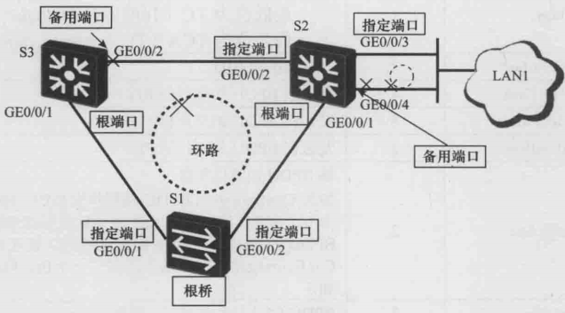

# STP 协议

## 1.环路问题

交换机组成的网络中如果存在环路，可能会产生 MAC 地址表翻摆、广播风暴、多帧复制问题。以下图有环网络为例：

    

### 1)MAC 地址表翻摆

假设 PC1 发送一个广播帧 X，交换机 S1、S2、S3 都会对 X 帧进行泛洪，因此 X 帧存在顺时针与逆时针两个运动轨迹。

顺时针的运动轨迹为：**`S1-P2 -> S3-P2 -> S3-P1 -> S2-P2 -> S2-P1 -> S1-P1 -> S1-P2 ->....`**
逆时针的运动轨迹为：**`S1-P1 -> S2-P1 -> S2-P2 -> S3-P1 -> S3-P2 -> S1-P2 -> S1-P1 ->....`**

这样每当帧 X 从 port1 进入 S1 时，S1 中的 MAC 地址表项会变为 **`PC1 的 MAC 地址 -> port1`**，当帧 X 从 port2 进入 S1 时，S1 中的 MAC 地址表项会变为**` PC1 的 MAC 地址 -> port2`**，这就是 MAC 地址表快速翻摆现象，MAC 地址表的快速翻摆会消耗大量的交换机资源。

### 2)广播风暴

X 帧的一个拷贝会永不停止地逆时针快速旋转，另外一个拷贝会不停地顺时针快速旋转，而每台交换机 Si 在收到 X 帧的拷贝后就会不停地执行泛洪操作。Si (i=1，2，3) 每执行一次泛洪操作，PCi(i=1，2，3) 都会收到一个 X 帧的拷贝，这就产生了广播风暴的问题（Broadcast storm），广播风暴会大量地消耗网络的带宽资源以及计算机的处理资源，很可能导致计算机瘫痪。

### 3)多帧复制

假设 PC1 向 PC2 发送了一个单播帧 Y，并且假设 S1 的 MAC 地址表中不存在关于 PC2 的 MAC 地址的表项，S2 的 MAC 地址表中存在表项 **`PC2 的 MAC 地址 <- Port3`**，S3 的 MAC 地址表中存在表项 **`PC2 的 MAC 地址 <- Port1`**。显然，S1 会对 Y 帧执行泛洪操作，S2 和 S3 都会对 Y 帧执行点对点转发操作。**最后的结果是，PC2 会收到两个 Y 帧的拷贝，这种现象称为多帧复制**。

交换网络中环路的存在，会导致 MAC 地址表翻摆、广播风暴、多帧复制等现象，**但环路能提高网络连接的可靠性**。在上图交换机网络中，因为有环路的存在，即使某两台交换机之间的链路因故障而中断了，整个网络仍然会保持其连通性，而这在无环网络中是无法做到的。

因此，IEEE 802.1D 中定义了 STP (Spanning Tree Protocol) 协议。在描述 STP 协议之前，我们还需要了解几个基本术语：桥（Bridge）、桥的 MAC 地址、桥 ID（BID）、端口 ID（PID）。

### 4)桥（Bridge）

因为性能方面的限制等因素，**早期的交换机一般只有两个转发端口（如果端口多了，交换的转发速度就会慢得无法接受），所以那时的交换机常常被称为 "网桥"，或简称 "桥"**。在 IEEE 的术语中，"桥"这个术语一直沿用至今，但并不只是指只有两个转发端口的交换机了，而是泛指具有任意多端口的交换机。

### 5)桥的 MAC 地址（Bridge MAC Address）

一个桥有多个转发端口，每个端口有一个 MAC 地址。**通常，我们把端口编号最小的那个端口的 MAC 地址作为整个桥的 MAC 地址**。

### 6)桥 ID（Bridge Identifier, BID）

如下图所示，一个桥 (交换机) 的桥 ID 由两部分组成，**前面 2 个字节是这个桥的桥优先级，后面 6 个字节是这个桥的 MAC 地址**。桥优先级的值可以人为设定，缺省值为 0x8000。

    

### 7)端口 ID（Portal Identifier, PID）

下图是两种常用的端口 ID 的定义方法。端口优先级的值是可以人为设定的。不同的设备商所采用的 PID 定义方法可能不同。

    

## 2.STP 树的生成

STP 协议的基本原理：***在一个具有物理环路的交换网络中，交换机通过运行 STP 协议，自动生成一个没有环路的工作拓扑。该无环工作拓扑也称为 STP 树 (STP Tree)，树节点为某些特定的交换机，树枝为某些特定的链路。一棵 STP 树包含了唯一的一个根节点，任何一个节点到根节点的工作路径不但是唯一的，而且是最优的。当网络拓扑发生变化时，STP 树也会自动地发生相应的改变***。

STP 树的生成过程为：首先选举根桥（Root Bridge）、然后确定根端口（Root Port，RP）和指定端口（Designated Port，DP），最后阻塞备用端口（Alternate Port，AP）。

### 1)选举根桥

**根桥是 STP 树的根节点。要生成一棵 STP 树，首先要确定出一个根桥**。运行 STP 协议的交换机 (简称为 STP 交换机) 会相互交换 STP 协议帧，这些协议帧的载荷数据被称为 BPDU（Bridge Protocol Data Unit，网桥协议数据单元）。虽然 BPDU 是 STP 协议帧的载荷数据，**但它并非网络层的数据单元**。

BPDU 的产生者、接收者、处理者都是 STP 交换机本身，而非终端计算机。**STP 交换机初始启动之后，都会认为自己是根桥，并在发送给别的交换机的 BPDU 中宣告自己是根桥**。当交换机从网络中收到其他设备发送过来的 BPDU 的时候，会比较 BPDU 中指定的根桥 BID 和自己的 BID。交换机不断地交互 BPDU，同时对 BID 进行比较，直至最终选举出一台 BID 最小的交换机作为根桥。

如下图所示，交换机 S1、S2、S3 都使用了默认的桥优先级 32768。显然，S1 的 BID 最小，所以最终 S1 将被选举为根桥。

    

### 2)确定根端口

**根桥确定后，其他没有成为根桥的交换机都被称为非根桥**。一台非根桥设备上可能会有多个端口与网络相连，为了保证从某台非根桥设备到根桥设备的工作路径是最优且唯一的，就必须从该非根桥设备的端口中确定出一个被称为 "根端口" 的端口，**由根端口来作为该非根桥设备与根桥设备之间进行报文交互的端口**。一台非根桥设备上最多只能有一个根端口。

STP 协议把根路径开销作为确定根端口的一个重要依据。一个运行 STP 协议的网络中，**我们将某个交换机的端口到根桥的累计路径开销称为这个端口的根路径开销** (Root Path Cost，RPC)。链路的路径开销 (Path Cost) 与端口速率有关，端口转发速率越大，则路径开销越小。

    

在上图中，假定 S1 被选举为根桥，S3 的 GE0/0/1 端口的 RPC 为 20000，S3 的 GE0/0/2 端口的 RPC 为 200000 + 20000 = 220000，因此 GE0/0/1 最终被确定为 S3 的根端口。

当一台非根桥设备上不同端口的 RPC 可能相同，此时必须按照下图流程来确定根端口。

    

如下图所示，S1 是根桥，假设 S4 的 GE0/0/1 端口的 RPC (路径 1 的开销)与 GE0/0/2 端口的RPC (路径 2 的开销)相同，则 S4 会对上行设备 S2 和 S3 的 BID 进行比较，假设 S2 的 BID 比较小，S4 的 GE0/0/1 端口就会称为根端口。

对于S5而言，假设其 GE0/0/1 端口的 RPC 与 GE0/0/2 端口的 RPC 相同，由于这两个端口的上行设备同为 S4，所以 S5 还会对 S4 的 GE0/0/3 端口的 PID 和 S4 的 GE0/0/4 端口的 PID 进行比较。

    

### 3)确定指定端口

根端口保证了交换机与根桥之间工作路径的唯一性和最优性。**为了防止工作环路的存在，网络中每个网段与根桥之间的工作路径也必须是唯一的且最优的**。当一个网段有两条及两条以上的路径通往根桥时（该网段连接了不同的交换机，或者该网段连接了同台交换机的不同端口），**与该网段相连的交换机（可能不止一台）就必须确定出一个唯一的指定端口**。指定端口的确定也需要比较 RPC、BID、PID，具体的流程如下所示：

    

如下图所示，假定 S1 已被选举为根桥，并且假定各链路的开销均相等。显然，S3 的 **`GE0/0/1`** 端口的 RPC 小于 S3 的 **`GE0/0/2`** 端口的 RPC，所以 **`GE0/0/1`** 端口被确定为 S3 根端口。类似地，S2 将自己的 **`GE0/0/1`** 端口确定为自己的根端口。

对于 S3 的 GE0/0/2 和 S2 的 GE0/0/2 之间的网段来说，**S3 的 GE0/0/2 端口的 RPC 是与 S2 的 GE0/0/2 端口的 RPC 相等的，所以需要比较 S3 的 BID 和 S2 的 BID**。假定 S2 的 BID 小于 S3 的 BID，则 S2 的 GE0/0/2 端口将被确定为 S3 的 GE0/0/2 和 S2 的 GE0/0/2 之间的网段的指定端口。

对于网段 LAN1 来说，上行交换机只有 S2。在这种情况下，就需要比较 S2 的 GE0/0/3 端口的 PID 和 GE0/0/4 端口的 PID。假定 GE0/0/3 端口的 PID 小于 GE0/0/4 端口的 PID，则 S2 的 GE0/0/3 端口将被确定为网段 LAN1 的指定端口。最后需要指出的是，根桥上不存在任何根端口，只存在指定端口。

    

### 4)阻塞备用端口

**在确定了根端口和指定端口之后，交换机上所有剩余的非根端口和非指定端口统称为备用端口**。STP 会对这些备用端口进行逻辑阻塞。所谓逻辑阻塞，**是指这些备用端口不能转发由终端计算机产生并发送的帧，这些帧也被称为用户数据帧**。不过，备用端口可以接收并处理STP 协议帧。根端口和指定端口既可以发送和接收 STP 协议帧，又可以转发用户数据帧。

阻塞备用端口是生成 STP 树的最后一个步骤，至此，STP 树（无环工作拓扑）的生成过程如下所示：

    

## 3.STP 报文格式

**STP 交换机通过交换 STP 协议帧来建立和维护 STP 树，并在网络的物理拓扑发生变化时重建新的 STP 树**。STP 协议帧采用了 IEEE802.3 封装格式，其载荷数据被称为 BPDU。BPDU 有两种：Configuration BPDU 和 TCN (Topology Change Notification) BPDU。

### 3.1 Configuration BPDU

在初始形成 STP 树的过程中，**各 STP 交换机都会周期性地（缺省为 2s）主动产生并发送** Configuration BPDU。在 STP 树形成后的稳定期，只有根桥才会周期性地（缺省为 2s）主动产生并发送 Configuration BPDU；相应地，非根交换机会从自己的根端口周期性地接收到 Configuration BPDU，并立即被触发而产生自己的 Configuration BPDU，且从自己的指定端口发送出去。

Configuration BPDU 中携带的参数可以分为 3 类：

1. BPDU 对自身的标识，包括协议标识、版本号、BPDU 类型和 Flags（长度为 1 个字节，最低位为 **`Topology Change, TC`** 标识，最高位为 **`TC Acknowledgment, TCA`** 标识）。
2. BPDU 用于进行 STP 计算的参数，包括发送该 BPDU 的交换机的 BID，当前根桥的 BID，发送该 BPDU 的端口的 PID，以及发送该 BPDU 的端口的 RPC。
3. 第三类是时间参数，分别是 Hello Time、Forward Delay、Message Age、Max Age。

**`Hello Time`**：交换机发送 Configuration BPDU 的时间间隔。当网络拓扑及 STP 树稳定之后，全网使用根桥指定的 Hello Time。如果要修改该时间参数，则必须在根桥上修改才有效。
**`Forward Delay`**：端口状态迁移的延迟时间。**如果新选出的根端口和指定端口立刻就开始进行用户数据帧的转发的话，可能会造成临时工作环路**。为此，STP 引入了 Forward Delay 机制，**新选出的根端口和指定端口需要经过 2 倍的 Forward Delay 延时后才能进入用户数据帧的转发状态**，以保证此时的工作拓扑已无环路。
**`Message Age`**：实际的实现中，Configuration BPDU 每"经过"一个桥，Message Age 增加 1。从根桥发出的 Configuration BPDU 的 Message Age 为 0。
**`Max Age`**: Configuration BPDU 的最大生命周期。Max Age 的值由根桥指定，缺省值为 20s。STP 交换机在收到 Configuration BPDU 后，会对其中的 Message Age 和 Max Age
进行比较。如果 Message Age 小于等于 Max Age，则该 Configuration BPDU 会触发该交
换机产生并发送新的 Configuration BPDU，否则该 Configuration BPDU 会被丢弃(忽略)，
并且不会触发该交换机产生并发送新的 Configuration BPDU。

### 3.2 TCN BPDU

如果网络中某条链路发生了故障，导致工作拓扑发生了改变，则位于故障点的交换机可以通过端口状态直接感知到这种变化，但是其他的交换机是无法直接感知到这种变化的。这时，**位于故障点的交换机会以 Hello Time 为周期通过其根端口不断向上游交换机发送 `TCN BPDU`，直到接收到从上游交换机发来的、`TCA 标志置 1 的 Configuration BPDU`**。上游交换机在收到 TCN BPDU 后，一方面会通过其指定端口回复 TCA 标志置 1 的 Configuration BPDU，另一方面会以 Hello Time 为周期通过其根端口不断向它的上游交换机发送 TCN BPDU。此过程一直重复，直到根桥接收到 TCN BPDU。**根桥接收到 TCN BPDU 后，会发送 `TC 标志置 1 的 Configuration BPDU`，通告所有交换机网络拓扑发生了变化**。

    

在交换机收到 TC 标志置 1 的 **`Configuration BPDU`** 后，会将自己的 MAC 地址表的老化周期（缺省为 300s）缩短为 **`Forward Delay`** 的时间长度（缺省为 15s），加速老化（因为之前的 MAC 地址表项因为网络拓扑的更改而不正确）。

### 3.3 STP 端口状态

STP 交换机的端口分为以下 5 种状态：

1. 去能（Disabled）：去能状态的端口无法接收和发出任何帧，端口处于关闭（Down）状态；
2. 阻塞（Blocking）：阻塞状态的端口只能接收 STP 协议帧，不能发送 STP 协议帧，也不能转发用户数据帧；
3. 侦听（Listening）：侦听状态的端口可以接收并发送 STP 协议帧，但不能进行 MAC 地址学习，也不能转发用户数据帧；
4. 学习（Learning）：学习状态的端口可以接收并发送 STP 协议帧，也可以进行 MAC 地址学习，但不能转发用户数据帧；
5. 转发（Forwarding）：转发状态的端口可以接收并发送 STP 协议帧，也可以进行 MAC 地址学习，同时能够转发用户数据帧；

STP 交换机的端口在初始启动时，首先会从 Disabled 状态进入到 Blocking 状态。在 Blocking 状态，端口只能接收和分析 BPDU，但不能发送 BPDU。**如果端口被选为根端口或指定端口，则会进入 `Listening` 状态**，此时端口接收并发送 BPDU，这种状态会持续一个 Forward Delay 的时间长度，缺省为15s。然后，该端口会进入到 Learning 状态，并在此状态持续一个 Forward Delay 的时间长度。**处于 Learning 状态的端口可以接收和发送 BPDU，同时开始构建 MAC 地址映射表，为转发用户数据帧做好准备**。处于 Learning 状态的端口仍然不能开始转发用户数据帧，因为此时网络中可能还存在因 STP 树的计算过程不同步而产生的临时环路。最后，端口由 Learning 状态进入 Forwarding 状态（即前面 3.1 节所述，为了防止 STP 树计算收敛之前产生的临时环路，**待 2 倍的 Forward Delay 超时后，才能进入用户数据帧转发状态**），开始用户数据帧的转发工作。

端口转换的状态图如下所示：

    

