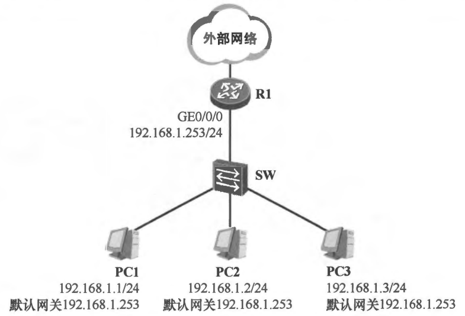
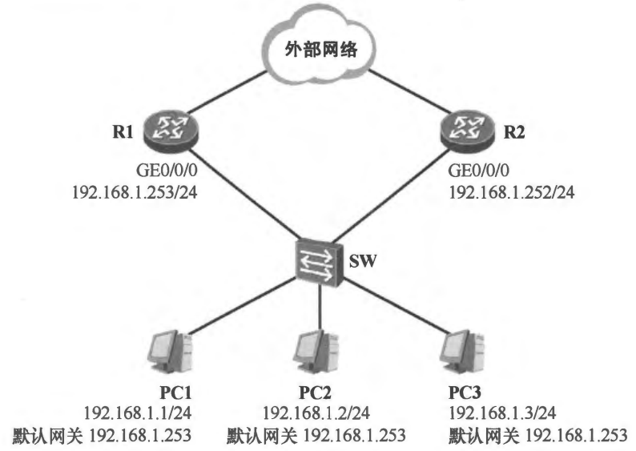
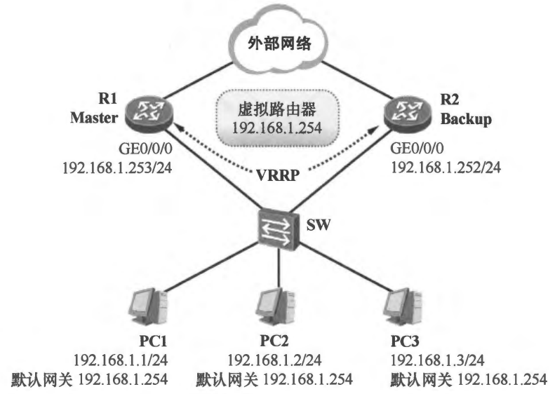
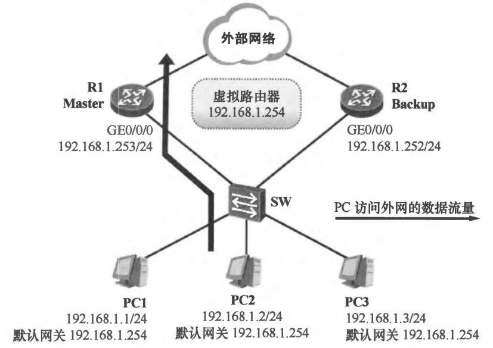
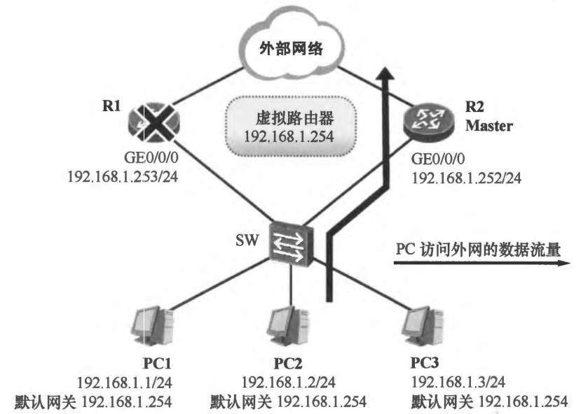
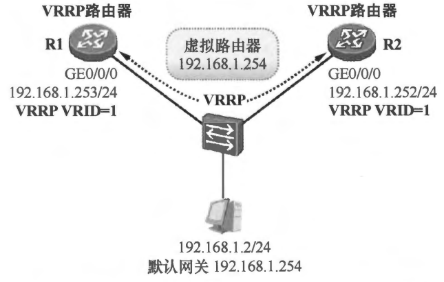
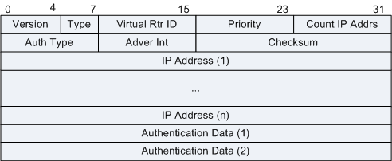
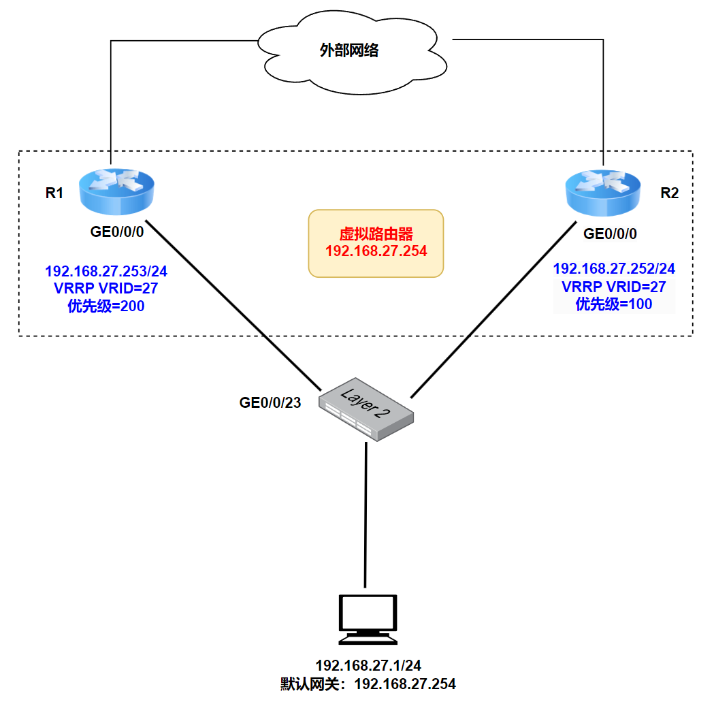
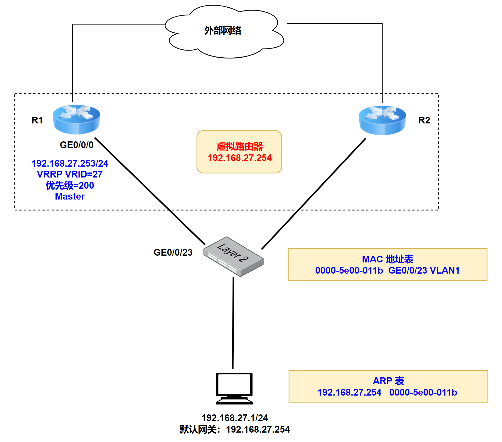
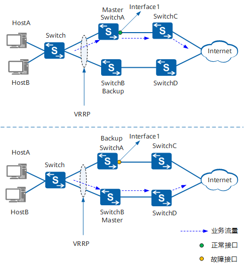

# VRRP 协议

## 1.VRRP 概述

在下图 1 所示的网络中，多台 PC 连接在接入层交换机 SW 上，SW 通过单链路上联路由器 R1。这些 PC 属于相同的 IP 网段，并且均将默认网关地址配置为 R1 的 **`GE0/0/0`** 接口的 IP 地址 **`192.168.1.253`**。这个网络确实能够满足基本的通信需求，当 PC 发送数据到外部网络时，它们将数据包发给 R1，再由 R1 将数据包转发出去。然而该网络在可靠性上却存在极大的短板——PC 的默认网关没有冗余性，也就是说当 SW 与 R1 之间的互联链路发生故障时，或者 R1 发生故障时，PC 就丢失了与默认网关的连通性，它们与外部网络的通信也就断开了，业务自然会受到影响。

    
图 1 网络的可靠性存在短板

    

可以在网络中增加一台路由器，作为冗余的网关，如图 2 所示。现在当网络正常时，PC 将默认网关设置为 **`192.168.1.253`**，而当 R1 发生故障时，则由用户更改 PC 网卡的配置，将默认网关修改为 **`192.168.1.252`**。显然这种方法是非常低效的，手工的配置变更增加了工作成本，当 PC 的数量特别多时，这部分工作量将变得非常大。**我们需要的解决方案是当故障发生时，网络要能够自动感知并且实现自动切换，网络对故障的响应过程对业务无影响，PC 端对此无感知**。

    
图 2 在网络中增加一台路由器

    

VRRP（Virtual Router Redundancy Protocol，虚拟路由器冗余协议）使得多台同属一个广播域的网络设备能够协同工作，实现设备冗余，从而提高网络的可靠性。**VRRP 目前有两个版本：VRRPv2 和 VRRPv3，其中 `VRRPv2` 仅适用于 IPv4 网络，而 `VRRPv3` 适用于 IPv4 和 IPv6 两种网络**。

如下图所示，在 R1 及 R2 的 **`GE0/0/0`** 接口上部署 VRRP，使得两者能够协同工作，可以实现网关冗余。当 VRRP 开始工作后，它将产生一台虚拟路由器，这台虚拟路由器的 IP 地址为 **`192.168.1.254`**（**该地址由网络管理员指定**），PC 将自己的默认网关设置为该虚拟路由器的 IP 地址。如此一来，当 PC 向外部网络发送数据时，数据将被发送给虚拟路由器。

    
图 3 在 R1 以及 R2 上部署 VRRP

    

值得注意的是，虚拟路由器是一台逻辑设备，它只是 VRRP 虚拟出来的一台路由器，当 VRRP 开始工作后，R1 及 R2 会进行选举，胜出的路由器成为 Master（主）路由器，其他的路由器则成为 Backup（备份）路由器。

Master 路由器承担虚拟路由器的具体工作，如此一来当 PC 需要发送数据包到外部网络时，数据包实际被发给 Master 路由器 R1（如下图 4 所示），**而当 R1 发生故障时，通过 VRRP 协议的运作，R2 能感知到当前的 Master 路由器发生了故障，从而将自己的状态自动地切换到 Master**，接下来它将接替原来属于 R1 的工作（如下图 5 所示）。在整个 VRRP 的切换过程中，用户是完全无感知的，PC 的配置也不需要做任何变更。

    
图 4 R1 作为 Master 路由器转发 PC 发往外部网络的数据

    

    
图 5 VRRP 实现网关设备的平滑迁移

    

## 2.VRRP 基本概念

### 2.1 VRRP 路由器

我们将运行 VRRP 的路由器称为 VRRP 路由器。**实际上，VRRP 是配置在路由器的接口上的，而且也是基于接口来工作的**。如图 6 所示，R1 及 R2 均在各自的 **`GE0/0/0`** 上配置了 VRRP，VRRP 一旦被激活，路由器的接口便开始发送及侦听 VRRP 协议报文。

    
图 6 R1 及 R2 的接口上配置 VRRP 并加入相同的 VRRP 组

    

需要协同工作的 VRRP 路由器（的接口）必须属于同一个广播域，否则 VRRP 报文无法正常交互。在本例中，R1 的 **`GE0/0/0`** 接口与 R2 的 **`GE0/0/0`** 接口连接在同一台二层交换机上，**而且交换机连接这两台路由器的接口属于相同的 VLAN，因此 R1 及 R2 的这两个接口即属于相同的广播域**。一旦交换机上的 VLAN 配置错误导致 R1 及 R2 属于不同 VLAN，那么 VRRP 的工作也将出现问题。

### 2.2 VRRP 组以及 VRID

一个 VRRP 组（VRRP Group）由多台协同工作的路由器（的接口）组成，使用相同的 VRID（Virtual Router Identifier，虚拟路由器标识符）进行标识。属于同一个 VRRP 组的路由器之间交互 VRRP 协议报文并产生一台虚拟路由器。**一个 VRRP 组中只能出现一台 Master 路由器**。

在上图 6 中，R1 的 **`GE0/0/0`** 接口及 R2 的 **`GE0/0/0`** 接口协同工作，为 PC 实现冗余网关，因此这两个接口需加入同一个 VRRP 组，如果 R1 使用的 VRID 为 1，那么 R2 在进行 VRRP 的相关配置时也必须使用相同的 VRID。一个接口可以加入单个 VRRP 组，也可以加入多个 VRRP 组。不同的 VRRP 组需使用不同的 VRID 进行区分。

### 2.3 虚拟路由器、虚拟 IP 地址及虚拟 MAC 地址

VRRP 为每一个组抽象出一台虚拟路由器，该路由器并非真实存在的物理设备，而是由 VRRP 虚拟出来的逻辑设备。它拥有自己的 IP 地址以及 MAC 地址，其中虚拟路由器的 IP 地址（虚拟 IP 地址）由网络管理员在配置 VRRP 时指定，一台虚拟路由器可以有一个或多个 IP 地址。**而虚拟 MAC 地址的格式是 **`0000-5e00-01xx`**，其中 xx 为 VRID**，例如当 VRID 为 1 时，则虚拟 MAC 地址为 **`0000-5e00-0101`**。一个 VRRP 组只会产生一台虚拟路由器。

当 Master 路由器收到请求虚拟路由器 MAC 地址的 ARP Request 时，**它在 ARP Reply 中回应的 MAC 地址是虚拟 MAC 地址，而不是其物理接口的 MAC 地址**。

在上图 6 所示的网络中，R1 的 **`GE0/0/0`** 接口的 IP 地址为 **`192.168.1.253`**，R2 的 **`GE0/0/0`** 接口的 IP 地址为 **`192.168.1.252`**，而 VRRP 所产生的虚拟路由器的 IP 地址为 **`192.168.1.254`**，实际上 **`192.168.1.254`** 不属于本网络中的任何一个物理接口，它专用于 VRRP 虚拟路由器，**该地址将作为 PC 的默认网关地址**。对于 PC 而言，当 PC 访问外部网络时，**数据包被发往 **`192.168.1.254`**，而实际上接收及转发这些数据包的路由器就是 Master 路由器 R1**。

通常情况下，VRRP 路由器的接口 IP 地址不会与虚拟路由器的 IP 地址重叠，当然也存在一个特殊的情况，例如在某些网络中也有可能会将某台路由器的接口 IP 地址用于虚拟路由器，此时该路由器将无条件成为 Master。

### 2.4 Master 路由器、Backup 路由器

Master 路由器是接口处于 Master 状态的路由器，也被称为主路由器。Master 路由器在一个 VRRP 组中承担报文转发任务。**在每一个 VRRP 组中，只有 Master 路由器才会响应针对虚拟 IP 地址的 ARP Request**。Master 路由器会以一定的时间间隔周期性地发送 VRRP 报文，以便通知同一个 VRRP 组中的 Backup 路由器关于自己的存活情况。

Backup 路由器是接口处于 Backup 状态的路由器，也被称为备份路由器。Backup 路由器将会实时侦听 Master 路由器发送出来的 VRRP 报文，它随时准备接替 Master 路由器的工作。

VRRP 首先通过优先级（Priority）来从一个组中选举出 Master 路由器。VRRP 优先级的值越大则路由器越有可能成为 Master 路由器。在优先级相等的情况下，接口 IP 地址越大的路由器越有可能成为 Master 路由器。

### 2.5 抢占模式

**如果 Backup 路由器激活了抢占功能（Preempt Mode），那么当它发现 Master 路由器的优先级比自己更低时，它将立即切换至 Master 状态**，成为新的 Master 路由器，而如果 Backup 路由器没有激活抢占功能，那么即使它发现 Master 路由器的优先级比自己更低，也只能依然保持 Backup 状态，直到 Master 路由器失效。

### 2.6 VRRP 虚拟网关的转发机制

下面我们以图 6 所示的网络为例，来分析一下 VRRP 虚拟网关的转发机制。在这张拓扑里，PC 虽然看到的默认网关是 **`192.168.1.254`**，对 PC 来说，它并不知道实际上有 R1 和 R2 两台路由器在协同工作，它只会把 **`192.168.1.254`** 当作自己的下一跳。**当 PC 要访问非本地网段的目的地址时，会先判断目标 IP 不在本网段内，于是决定把报文交给默认网关转发**。由于这时只知道目标 IP，还不知道目标 MAC，所以 PC 首先会对 **`192.168.1.254`** 发起 ARP 请求，ARP 请求会广播泛洪到整个网络，R1 和 R2 都会收到 ARP 请求。

在 VRRP 机制下，只有当前负责转发业务的 Master R1 会回应这个 ARP 请求，并返回对应的虚拟 MAC 地址，而不是自己的物理 MAC 地址。**这样做的目的是让主机始终把默认网关 IP 解析为同一个稳定的二层地址，而不受主备切换的影响**。以图中的 VRID 1 为例，PC 学到的通常会是 **`192.168.1.254 -> 00-00-5E-00-01-01`** 这样的映射关系。这样一来，后续 PC 发送给默认网关的所有数据帧，在二层封装时，目的 MAC 都会是这个 VRRP 虚拟 MAC；而在三层上，源 IP 仍然是 PC 自己的地址，目的 IP 则仍然是最终要访问的远端主机地址。

接下来，交换机 SW 会根据这个虚拟 MAC 来完成二层转发。这里需要特别说明的是，交换机本身并不理解 VRRP 的主备关系，也不会主动判断哪台路由器是 Master。它做的事情仍然只是标准的二层交换：学习源 MAC、查询目的 MAC、再根据 MAC 地址表把数据帧转发到对应端口。因此 SW 之所以能够把用户流量送到 Master，是因为它已经把这个 VRRP 虚拟 MAC 学习到了 Master 所连接的那个端口上。之后 PC 发来的报文只要目的 MAC 是这个虚拟 MAC，交换机查表后就会把帧发往当前 Master 所在的接口。

那么，交换机是怎么知道这个虚拟 MAC 应该对应哪一个端口的？**关键就在于当前的 Master 会发送带有虚拟 IP 和虚拟 MAC 信息的免费 ARP，用来刷新主机和交换机上的表项**。交换机在收到这类报文后，会按照正常的 MAC 学习机制，把这个虚拟 MAC 更新到新 Master 所在的端口上。这样，交换机只要看到此虚拟 MAC 现在从哪个端口过来，就会把后续发往该虚拟 MAC 的流量转到那个端口。因此，从交换机的角度看，它处理的始终只是一个普通的目的 MAC 转发表项，只不过这个 MAC 恰好是 VRRP 的虚拟 MAC。

当报文真正到达 Master 后，Master 才会把这部分流量当作发往虚拟网关的流量来处理，并执行正常的三层路由转发。这里有一个容易忽略的点是：VRRP 的虚拟 MAC 只在"主机到默认网关"这一跳上起作用。

这也解释了为什么 当 Master 发生切换时，PC 通常几乎无感知。因为在整个过程中真正发生变化的，只是交换机上"这个虚拟 MAC 对应哪个端口"的映射关系。当原来的 Master 故障、Backup 升为新的 Master 后，新 Master 会立即发送免费 ARP 来刷新网络中的相关表项，从而完成业务切换。

## 3.工作机制

### 3.1 报文格式

VRRP 协议的正常工作依赖于 VRRP 报文的正确收发。**VRRP 只定义了一种报文格式，即通告（Advertisement）报文，它被封装在 IP 报文中**，IP 头部的协议号字段值为 112，报文的目的 IP 地址是组播地址 **`224.0.0.18`**。在后面的内容中，VRRP 报文指的便是通告报文。下图 7 展示了 VRRP 报文的格式。

    
图 7 VRRP 报文格式

    

各个字段的含义如下。

- 版本（Version）：对于 VRRPv2 来说，该字段的值恒为 2；
- 类型（Type）：VRRP 只定义了通告报文这一种报文类型。该字段的值恒为 1；
- 虚拟路由器 ID（VRID）：虚拟路由器的标识符，取值范围是 1～255，属于同一个 VRRP 组的路由器需使用相同的 VRID；
- 优先级（Priority）：**取值范围是 0～255，该值越大，则 VRRP 优先级越高，路由器也就越有可能成为 Master。在华为路由器上，缺省的 VRRP 优先级为 100**；
- IP 地址个数（Count IP Address）：VRRP 组中虚拟 IP 地址的个数。这个字段的值指示了该报文后续的 IP 地址字段的个数；
- 认证类型（Authentication Type）：VRRP 报文的认证类型，有以下三种情况：
  - 当该字段为 0 时，表示无认证（Non Authentication）；
  - 当该字段为 1 时，表示明文认证方式（Simple Text Password）：发送 VRRP 通告报文的设备将认证方式和认证字填充到通告报文中，而收到通告报文的设备则会将报文中的认证方式和认证字与本端配置的认证方式和认证字进行匹配。如果相同，则认为接收到的报文是合法的 VRRP 通告报文；否则认为接收到的报文是一个非法报文，并丢弃这个报文；
  - 当该字段为 2 时，表示 MD5 认证方式（IP Authentication Header）：发送 VRRP 通告报文的设备利用 MD5 算法对认证字进行加密，加密后保存在 Authentication Data 字段中。收到通告报文的设备会对报文中的认证方式和解密后的认证字进行匹配，检查该报文的合法性；
- 通告间隔（Advertisement Interval）：**VRRP 报文的发送时间间隔（单位为秒），缺省情况下，VRRP 的报文发送时间间隔为 1s**；
- 校验和（Checksum）：校验和；
- IP 地址（IP Address）：VRRP 虚拟 IP 地址；
- 认证数据（Authentication Data）：VRRP 认证数据，当 VRRP 明文认证或 MD5 认证被激活时，该字段则填充相应的数据；

### 3.2 状态机

VRRP 定义了三种状态，RFC3768（Virtual Router Redundancy Protocol）详细地描述了这些状态。

#### 3.2.1 Initialize

Initialize 状态是 VRRP 的初始状态。**在接口配置 VRRP 后，如果该接口是 Down 的（例如接口被关闭，或者没有连接任何线缆），那么该接口的 VRRP 状态将会停滞在 Initialize**。

当接口 Up 之后，如果其 VRRP 优先级为 255（这种情况发生在该接口的实际 IP 地址是 VRRP 虚拟 IP 地址的情况），那么接口的 VRRP 状态将由 Initialize 切换到 Master；而如果接口的 VRRP 优先级不为 255，则进入 Backup 状态。

#### 3.2.2 Backup

处于 Backup 状态的路由器是 VRRP 组中的备份路由器，作为一台备份设备，它并不会参与数据转发工作，但是它会实时监控当前 Master 路由器的状态，并随时准备接替它的工作。Backup 路由器会进行如下工作：

- 对关于 VRRP 虚拟 IP 地址的 ARP 请求不予回应。
- **丢弃目的 MAC 地址为 VRRP 虚拟 MAC 地址的数据帧**（目的 MAC 地址为 VRRP 虚拟 MAC 地址的数据帧由 Master 路由器处理）。
- 不接收目的 IP 地址为 VRRP 虚拟 IP 地址的数据包（目的 IP 地址为 VRRP 虚拟 IP 地址的数据包由 Master 路由器处理）。
- 实时侦听 Master 路由器发送的 VRRP 报文，以便了解其工作状态。
- 当其收到一个 VRRP 报文时。
  - 若该 VRRP 报文的优先级为 0（这可能意味着当前 Master 路由器希望主动放弃 Master 状态），则将 **`Master_Down_Timer`** 设置为 **`Skew_Time`**。
  - 若该 VRRP 报文的优先级不为 0，则当抢占模式（Preempt Mode）未激活时，或者当 VRRP 报文中的优先级大于本接口优先级时，将 **`Master_Adver_Interval`** 设置为 VRRP 报文中的 Advertisement Interval，并重置 **`Master_Down_Timer`**，将 **`Master_Down_Timer`** 的时间设置为 **`Master_Down_Interval`**，党收到 VRRP 报文中的优先级等于本接口优先级时，则重置定时器，不进一步比较 IP 地址大小；
  - 若该 VRRP 报文的优先级不为 0，则当抢占模式激活并且 VRRP 报文中的优先级小于本接口优先级时，忽略该 VRRP 报文，立即切换到 Master 状态。

>**`Master_Adver_Interval`**：Master 路由器所发送的 VRRP 报文中，Advertisement Interval 字段所填充的值，缺省时该值为 1s。该时间间隔即 Master 路由器周期性发送 VRRP 报文的间隔。
>**`Master_Down_Timer`**：Backup 路由器将持续接收来自当前 Master 路由器的 VRRP 报文，每当报文到达时，Backup 路由器上的 **`Master_Down_Timer`** 会被重置。如果一定时间内没有收到来自 Master 路由器的 VRRP 报文并导致 **`Master_Down_Timer`** 超时，那么 Backup 路由器将认为 Master 路由器已经失效。
>**`Master_Down_Interval`**：一定时间没有收到来自 Master 路由器的 VRRP 报文后，Backup 路由器可以认为当前 Master 路由器已经失效。**`Master_Down_Interval =（3×Master_Adver_Interval）+Skew_time`**。
>**`Skew_Time`**：一个偏移时间，**`Skew_Time =（（256－VRRP 优先级）×Master_Adver_Interval）/256`**。当 Master 设备主动放弃 Master 地位（如 Master 设备退出备份组）时，会发送优先级为 0 的通告报文，用来使 Backup 设备快速切换成 Master 设备，而不用等到 **`Master_Down_Interval`** 定时器超时。这个切换的时间称为 **`Skew time`**。

前面说过，在收到 VRRP 报文的优先级不为 0，则当抢占模式未激活且 VRRP 报文中的优先级大于或等于本接口优先级时，会更新 **`Master_Adver_Interval`**。之所以需要先将 **`Master_Adver_Interval`** 更新为收到报文中的 Advertisement Interval，是因为后续 **`Skew_Time`** 和 **`Master_Down_Interval`** 的计算都要以它为基础。

也就是说，Backup 设备在收到主设备新的通告后，需要先同步主设备当前实际使用的发送周期（**`Master_Adver_Interval`**），再据此重新计算后续的超时检测时间（**`Master_Down_Interval`**）。**否则，如果仍沿用旧的 **`Master_Adver_Interval`**，计算出来的超时窗口就可能与当前主设备的实际发送节奏不一致，从而影响主备状态判断的准确性**。

在此基础上重置 **`Master_Down_Timer`**，本质上有两层含义：一方面，它表明备份设备刚刚收到了来自主设备的有效通告，因此不能将主设备判定为故障；另一方面，它也意味着主设备故障检测计时需要按照最新的通告周期重新开始。因为对于 Backup 来说，只有在持续一段时间未收到 Master 的通告后，才会认为主设备失效，而这段等待时间正是由 **`Master_Down_Interval`** 决定的。

- 当 **`Master_Down_Timer`** 超时（这意味着它认为当前的 Master 路由器已经失效）。
  - 将接口的状态切换到 Master；
  - 开始从接口发送自己的 VRRP 报文；
  - **从接口发送一个免费 ARP Request（Gratuitous ARP Request）广播帧，该 ARP Request 携带了 VRRP 虚拟 IP 地址及虚拟 MAC 地址的绑定信息，用于刷新该接口所直连的广播域内的设备的 ARP 表、MAC 地址表**；

>在性能不稳定的网络中，网络堵塞可能导致 Backup 设备在 **`Master_Down_Interval`** 期间没有收到 Master 设备的报文，Backup 设备则会主动切换为 Master。如果此时原 Master 设备的报文又到达了，新 Master 设备将再次切换回 Backup。如此则会出现 VRRP 备份组成员状态频繁切换的现象。为了缓解这种现象，可以配置抢占延时，使得 Backup 设备在等待了 **`Master_Down_Interval`** 后，再等待抢占延迟时间。如在此期间仍没有收到通告报文，Backup 设备才会切换为 Master 设备。

#### 3.2.3 Master

处于 Master 状态的路由器是当前 VRRP 组的主路由器，它承担数据转发任务。Master 路由器会进行如下工作。

- 当收到关于虚拟 IP 地址的 ARP 请求时，以虚拟 MAC 地址进行回应；
- 转发目的 MAC 地址为虚拟 MAC 地址的报文；
- 周期性地发送 VRRP 报文，时间间隔缺省为 1s；
- 当其收到一个 VRRP 报文时：
  - 若该 VRRP 报文的优先级为 0，则继续发送自己的报文；
  - **若该 VRRP 报文的优先级不为 0，并且比本接口的 VRRP 优先级值更大，或者 VRRP 优先级相等但是 VRRP 报文的源 IP 地址比本接口 IP 地址更大，则将接口的状态切换到 Backup**；
  - 若该 VRRP 报文的优先级不为 0，并且比本接口的 VRRP 优先级值更小，则忽略该 VRRP 报文；

通过 Master 和 Backup（不开抢占模式）接收到比自己优先级更高的 VRRP 报文的不同处理，Master 是直接切换到 Backup 状态，而 Backup 则是直接忽略该报文并继续保持 Backup 状态。之所以表现出不同的处理方式，本质上是在两个目标之间做平衡：**一方面要保证同一时刻 VRRP 组内只能有一个合法的 Master，另一方面又要尽量减少不必要的主备切换，维持网络运行的稳定性**。

对 Master 来说，只要它收到一个更强的通告——例如对方优先级更高，或者优先级相同但对方的主 IP 地址更大——它就必须将自己的状态切换为 Backup。这样做的意义是为了尽快消除可能出现的双主冲突，即两台设备都同时坚持认为自己是 Master/Active，又都不主动退让。此时对虚拟 IP 的 ARP 应答、对虚拟 MAC 的归属以及实际的流量转发路径都会造成混乱。

而对 Backup 来说，这一侧更强调的是稳定性。**当设备处于 Backup 状态，且没有开启抢占模式时，只要它收到的是一个优先级不为 0 的合法 Advertisement，就继续认为当前 Master 仍然有效，并保持自己的 Backup 状态**。这样设计的目的就是为了避免频繁的 failback 或 flap，减少业务扰动，让已经稳定下来的转发路径尽量保持不变。

### 3.3 Master 路由器的选举过程

在一个 VRRP 组中，正常情况下只能存在一台 Master 路由器。VRRP 根据优先级和 IP 地址来决定哪台路由器充当 Master。优先级的范围是 0～255，优先级的值越大，则路由器越有可能成为 Master，其中 0 及 255 是两个特殊的优先级，不能被直接配置。当路由器的接口 IP 地址与 VRRP 虚拟 IP 地址相同时，它的优先级将自动变成最大值 255，此时该路由器被称为 IP 地址拥有者（IP Address Owner）。**0 是另一个特殊的优先级，它出现在 Master 路由器主动放弃 Master 角色时**，例如当接口的 VRRP 配置被手工删掉时，该 Master 路由器会立即发送一个优先级为 0 的 VRRP 报文，用来通知网络中的 Backup 路由器。

当一个激活了 VRRP 的接口 Up 之后，如果接口的 VRRP 优先级为 255，那么其 VRRP 状态将直接从 Initialize 切换到 Master，**而如果接口的 VRRP 优先级不为 255，则首先切换到 Backup 状态，然后再视竞争结果决定是否能够切换到 Master 状态**。

如果在同一个广播域的同一个 VRRP 组内出现了两台 Master 路由器，那么它们将比较自己与对方的优先级，优先级的值更大的设备胜出，继续保持 Master 状态，而竞争失败的路由器则切换到 Backup 状态。如果这两台 Master 路由器的优先级相等，那么接口 IP 地址更大的路由器接口将会保持 Master 状态，而另一台设备则切换到 Backup 状态。当然，一个网络在稳定运行时，同一个 VRRP 组内不应该同时出现两台 Master 路由器。

处于 Master 状态的路由器会周期性地发送 VRRP 报文，并在报文中描述自己的优先级、IP 地址等信息。同一个广播域中、同一个 VRRP 组的 Backup 路由器会侦听这些报文。如果此时网络中新出现了一台 Backup 路由器（其优先级高于当前 Master 路由器），激活了抢占功能，那么它会忽略收到的 VRRP 报文，并且切换到 Master 状态，同时发送自己的 VRRP 报文并在报文中描述其优先级等信息，而此前的 Master 路由器在收到了该 VRRP 报文后，则切换到 Backup 状态。

## 4.工作过程

接下来通过一个简单的例子讲解 VRRP 的基本工作过程。以图 8 所示的网络为例，PC、R1 及 R2 连接在同一台交换机上，它们都处于同一个广播域中，VRRP 的工作过程如下：

    
图 8 VRRP 的工作过程

    

    
图 9 R1 成为 Master 路由器

    

（1）假设 R1 率先启动，其 **`GE0/0/0`** 接口的 VRRP 首先进入 Initialize 状态，当接口 Up 后，其 VRRP 状态将从 Initialize 切换到 Backup，并且在 **`Master_Down_Timer`** 超时后切换到 Master 状态，R1 将成为 Master 路由器。随后它会立即发送一个免费 ARP 报文，PC 在收到这个 ARP 报文后，就获悉了虚拟 IP 地址（**`192.168.27.254`**）与虚拟 MAC 地址（**`0000-5e00-011b`**）的对应关系，当然交换机也会学习到关于该虚拟 MAC 地址的 MAC 表项（如图 9 所示）。此后 R1 将以 1 秒为间隔，周期性地发送 VRRP 报文。

（2）R2 开始工作后，它的 **`GE0/0/0`** 接口将从 Initialize 状态切换到 Backup 状态，并且会收到 R1 所发送的 VRRP 报文，从这些报文中，它得知自己的 VRRP 优先级小于对方的优先级，因此它将其 VRRP 状态保持在 Backup。

（3）现在 PC 要发送数据给外部网络，由于目的 IP 地址并不在本地网段中，因此它将数据包发往自己的默认网关，也就是 **`192.168.27.254`**，查询 ARP 表后，它发现网关的 IP 地址对应的 MAC 地址为 **`0000-5e00-011b`**，于是为报文封装以太网帧头，该数据帧的目的 MAC 地址是 **`0000-5e00-011b`**。接下来数据帧被发往交换机，交换机查询 MAC 表后，将该帧从相应的接口转发给 R1。最后 R1 将数据转发到外部网络。

（4）当 R1 与交换机的互联链路发生故障时（或者当 R1 发生故障时），R2 将无法再收到前者发送的 VRRP 报文，在 **`Master_Down_Timer`** 超时后，R2 将 VRRP 状态切换到 Master，于是它成为了新的 Master 路由器，**它立刻从 **`GE0/0/0`** 接口发送一个免费 ARP 报文，如此一来交换机的 MAC 地址表将被立即刷新，VRRP 虚拟 MAC 地址 **`0000-5e00-011b`** 的表项会关联到新的接口上**，PC 发往该目的 MAC 地址的数据帧将被引导至 R2。整个过程对于 PC 而言是无感知的。

（5）接下来，R1 及其与交换机的互联链路从故障中恢复，R1 的 **`GE0/0/0`** 接口的 VRRP 状态将从 Initialize 切换到 Backup，同时它将收到 R2 发送的 VRRP 报文，并发现对方的优先级比自己更低，此时如果 R1 激活了抢占功能，那么它会忽略 R2 所发送的 VRRP 报文，并且将 VRRP 状态切换到 Master，同时从 **`GE0/0/0`** 接口发送一个免费 ARP 报文（用于刷新交换机的 MAC 地址表项），并开始从 **`GE0/0/0`** 接口发送 VRRP 报文（**缺省情况下 VRRP 的抢占功能就处于激活状态，而且抢占的延迟时间为 0 秒，也就是立即执行抢占**）。经过上述过程后，R1 成为新的 Master 路由器。当然如果 R1 没有激活抢占功能，那么它将保持 Backup 状态。

（6）R2 在收到 R1 发送的 VRRP 报文后，发现自己的优先级比对方更低，因此它从 Master 状态切换到 Backup 状态（**无条件从 Master 切换到 Backup 状态，防止出现双主状态**）。

## 5.VRRP 监视上行链路

VRRP 主备备份功能有时需要额外的技术来完善其工作。例如 Master 设备到达某网络的链路突然断掉时，VRRP 无法感知故障进行切换，此时主机无法通过 Master 设备远程访问该网络。此时，可以通过 VRRP 监视指定接口或上行链路，解决这个问题。

**当 Master 设备发现上行接口或链路发生故障时，Master 设备降低自己的优先级（使得 Master 设备的优先级低于 Backup 设备的优先级），并立即发送 VRRP 报文**。Backup 设备接收到优先级比自己低的 VRRP 报文后切换至 Master 状态，充当 VRRP 备份组中新的 Master 设备，从而保证了流量的正常转发。

    
图 10 VRRP 监视上行链路典型组网图

    

如图所示，SwitchA 和 SwitchB 之间配置 VRRP 备份组，其中 SwitchA 为 Master 设备，SwitchB 为 Backup 设备，SwitchA 和 SwitchB 皆工作在抢占方式下。在 SwitchA 上配置 VRRP 监视上行接口 Interface1，当 Interface1 故障时，SwitchA 降低自身优先级，通过报文协商，SwitchB 抢占成为 Master，确保用户流量正常转发。