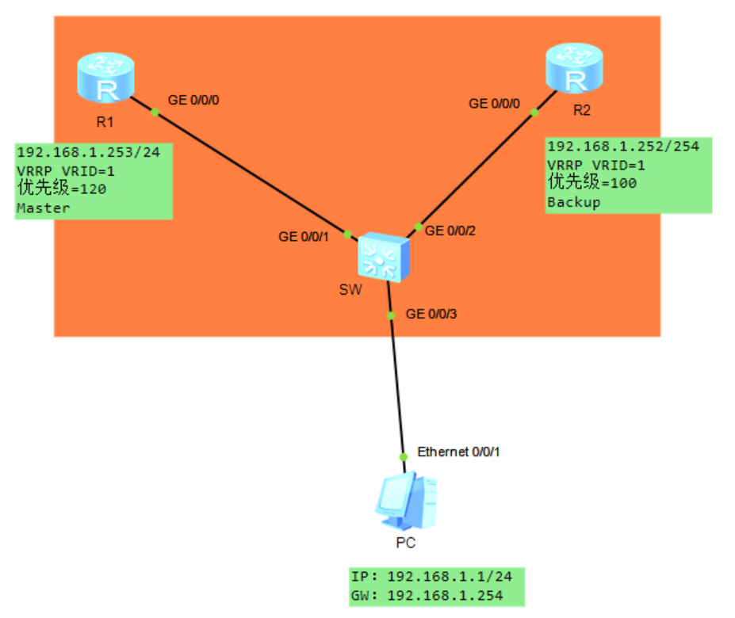
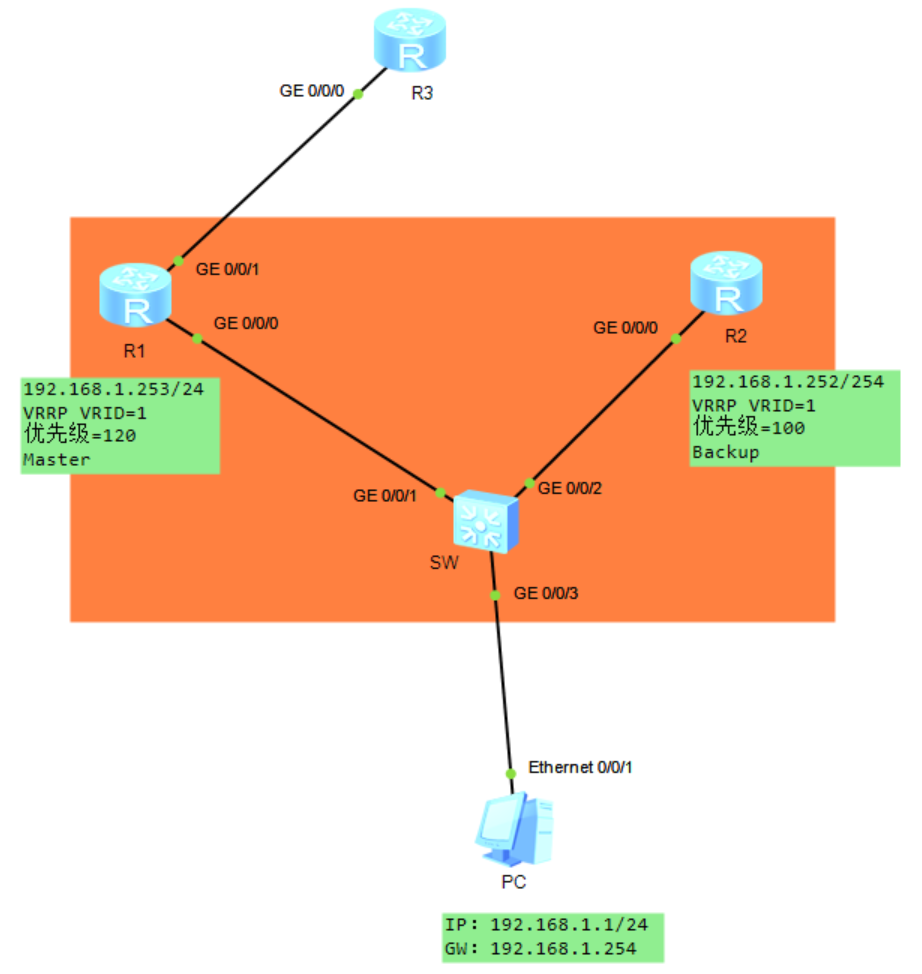
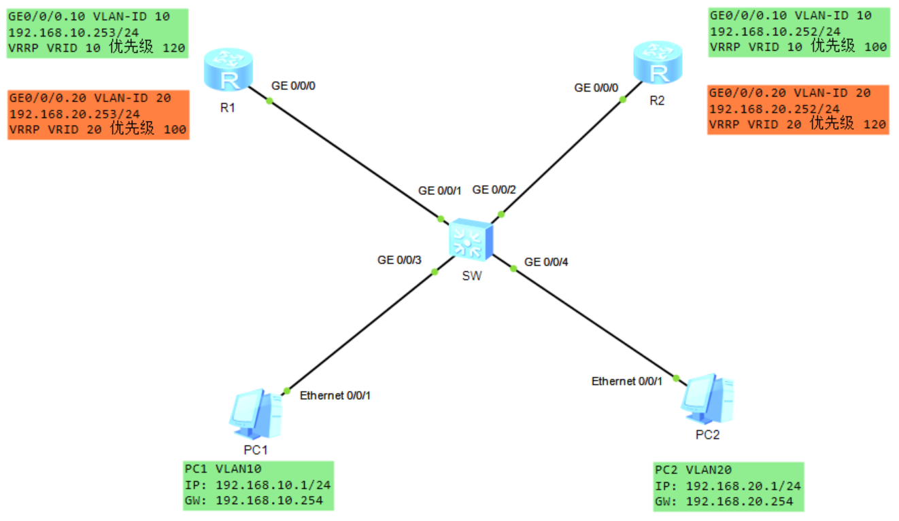
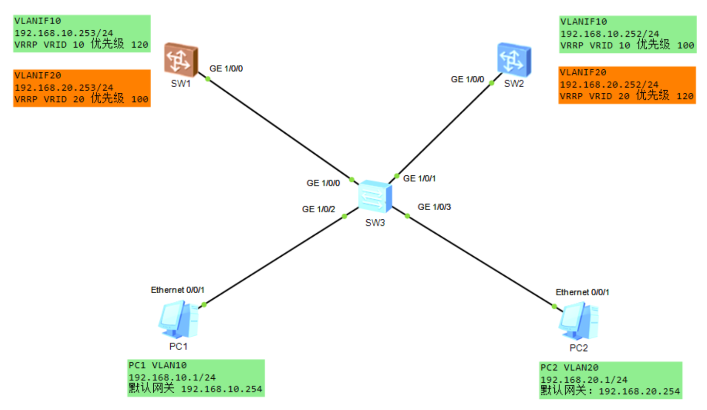

# VRRP 协议实验

## 1.案例一：基础 VRRP 实验

以下图所示的网络为例，PC、R1 及 R2 连接在同一台交换机上，处于同一个广播域中。IP 地址及 VRRP 相关数据的规划如图所示。我们将在 R1 及 R2 上完成相应的配置，使得它们能够为 PC 实现网关冗余。

<div align="center">
    <div align="center" style="color: #F14; font-size:13px; font-weight:bold">图 11 VRRP 基础配置</div>
    
</div>

R1 上的配置如下所示：

```java{.line-numbers}
#
interface GigabitEthernet0/0/0
 ip address 192.168.1.253 255.255.255.0 
 vrrp vrid 1 virtual-ip 192.168.1.254
 vrrp vrid 1 priority 120
 vrrp vrid 1 preempt-mode timer delay 60
```

在以上配置中，**`vrrp vrid 1 virtual-ip 192.168.1.254`** 命令用于创建一个 VRID 为 1 的 VRRP 组，其中虚拟 IP 地址为 **`192.168.1.254`**。**`Vrrp vrid 1 priority 120`** 命令用于配置该接口在这个 VRRP 组中的优先级（缺省时，优先级为 100）。缺省情况下 VRRP 的抢占机制已经激活（可以使用 **`vrrp vrid 1 preempt-mode disable`** 命令关闭抢占功能），**`vrrp vrid 1 preempt-mode timer delay 60`** 命令用于将抢占的延迟时间设置为 60 秒。

R2 上的配置如下所示：

```java{.line-numbers}
#
interface GigabitEthernet0/0/0
 ip address 192.168.1.252 255.255.255.0 
 vrrp vrid 1 virtual-ip 192.168.1.254
```

需注意的是，由于 R2 与 R1 被规划在同一个 VRRP 组中，因此两者需使用相同的 VRID，并且配置相同的虚拟 IP 地址。另外，R2 的 VRRP 优先级并未配置，因此保持缺省值 100。完成配置后，在 R1 上使用 **`display vrrp`** 检查一下配置结果：

```java{.line-numbers}
<R1>display vrrp
  GigabitEthernet0/0/0 | Virtual Router 1
    State : Master
    Virtual IP : 192.168.1.254
    Master IP : 192.168.1.253
    PriorityRun : 120
    PriorityConfig : 120
    MasterPriority : 120
    Preempt : YES   Delay Time : 60 s
    TimerRun : 1 s
    TimerConfig : 1 s
    Auth type : NONE
    Virtual MAC : 0000-5e00-0101
    Check TTL : YES
    Config type : normal-vrrp
    Backup-forward : disabled
    Create time : 2026-03-18 21:21:50 UTC-08:00
    Last change time : 2026-03-18 21:21:54 UTC-08:00
```

从以上输出可以看出，R1 的 **`GE0/0/0`** 接口目前的 VRRP 状态为 Master，因此它是 VRRP 组的 Master 路由器。在 R2 上检查 VRRP 的运行状态，这次使用 **`display vrrp brief`** 命令：

```java{.line-numbers}
<R2>display vrrp brief 
Total:1     Master:0     Backup:1     Non-active:0      
VRID  State        Interface                Type     Virtual IP     
----------------------------------------------------------------
1     Backup       GE0/0/0                  Normal   192.168.1.254  
```

相比之下，以上输出更加精简和直观。R2 当前的 VRRP 状态为 Backup。

## 2.案例二：监视上行链路

上文中已介绍，Master 路由器会周期性地发送 VRRP 报文，以便告知同一个 VRRP 组中的 Backup 路由器自己的存活情况。在图 11 中，当 R1 的 **`GE0/0/0`** 接口或者 R1 整机发生故障时，R2 能够通过 VRRP 报文感知该变化并且实现主备切换，**但是如果是 R1 的 **`GE0/0/1`** 接口或者该接口所连接的上行链路发生故障的话，缺省时 VRRP 是无法感知的**，因此 R1 的 **`GE0/0/0`** 接口依然在该 VRRP 组中处于 Master 状态，PC 到达外部网络的上行数据还是会被牵引至 R1，但是此时 R1 已经丢失了与外部网络的连通性，数据包将在这里被丢弃。

我们可以在 R1 上部署 VRRP 监视（Track）功能，通过这个功能来监视上行接口 **`GE0/0/1`**，当 R1 感知到这个接口的状态切换到 Down 时，会自动将 VRRP 的优先级减去一个值，从而退位让贤。

<div align="center">
    <div align="center" style="color: #F14; font-size:13px; font-weight:bold">图 12 VRRP 监视上行链路配置</div>
    
</div>

R1 上的配置如下所示：

```java{.line-numbers}
#
interface GigabitEthernet0/0/0
 ip address 192.168.1.253 255.255.255.0 
 vrrp vrid 1 virtual-ip 192.168.1.254
 vrrp vrid 1 priority 120
 vrrp vrid 1 preempt-mode timer delay 60
 vrrp vrid 1 track interface GigabitEthernet0/0/1 reduced 30
#
interface GigabitEthernet0/0/1
```

在 R1 上部署的配置中，**`vrrp vrid 1 track interface GigabitEthernet0/0/1 reduced 30`** **<font color="red">命令用于配置监视功能，这条命令被配置后，R1 将会监视其 `GE0/0/1` 接口，如果该接口的状态变为 Down（无论是协议状态还是物理状态），那么 VRRP 优先级将被立即减去 30，变为 90</font>**，R1 将在其从 **`GE0/0/0`** 接口发送出去的 VRRP 报文中携带这个新的 VRRP 优先级。如此一来，当 R2 收到 R1 发送的 VRRP 报文后，它意识到自己的优先级（100）比对方更高，由于抢占功能缺省已激活，因此它将自动切换到 Master 状态，成为新的 Master 路由器并发送自己的 VRRP 报文，而 R1 则会在收到 R2 发送的 VRRP 报文后切换到 Backup 状态。

网络正常时，R1 的 VRRP 状态如下：

```java{.line-numbers}
<R1>display vrrp
  GigabitEthernet0/0/0 | Virtual Router 1
    State : Master
    Virtual IP : 192.168.1.254
    Master IP : 192.168.1.253
    PriorityRun : 120
    PriorityConfig : 120
    MasterPriority : 120
    Preempt : YES   Delay Time : 60 s
    TimerRun : 1 s
    TimerConfig : 1 s
    Auth type : NONE
    Virtual MAC : 0000-5e00-0101
    Check TTL : YES
    Config type : normal-vrrp
    Backup-forward : disabled
    Track IF : GigabitEthernet0/0/1   Priority reduced : 30
    IF state : UP
    Create time : 2026-03-18 21:21:50 UTC-08:00
    Last change time : 2026-03-18 22:49:48 UTC-08:00
```

现在我们将 R1 的 **`GE0/0/1`** 接口 shutdown，来模拟接口故障的情况，R1 的 VRRP 状态如下，已经变为 Backup 备用状态。

```java{.line-numbers}
[R1-GigabitEthernet0/0/1]display vrrp
  GigabitEthernet0/0/0 | Virtual Router 1
    State : Backup
    Virtual IP : 192.168.1.254
    Master IP : 192.168.1.252
    PriorityRun : 90
    PriorityConfig : 120
    MasterPriority : 100
    Preempt : YES   Delay Time : 60 s
    TimerRun : 1 s
    TimerConfig : 1 s
    Auth type : NONE
    Virtual MAC : 0000-5e00-0101
    Check TTL : YES
    Config type : normal-vrrp
    Backup-forward : disabled
    Track IF : GigabitEthernet0/0/1   Priority reduced : 30
    IF state : DOWN
    Create time : 2026-03-18 21:21:50 UTC-08:00
    Last change time : 2026-03-18 23:00:34 UTC-08:00
```

## 3.案例三：在路由器子接口上部署 VRRP

在图 13 中，正常情况下从 PC 到达外部网络的数据始终被发往 Master 路由器 R1，而在 R1 发生故障之前，Backup 路由器 R2 始终不承担数据转发任务，交换机与 R2 之间的这段链路也不会承载业务数据，这就造成了设备资源和链路带宽的浪费。在某些网络中，网关路由器的性能以及链路的带宽足以承载所有的业务流量，这种一主一备的 VRRP 工作方式确实能够满足需求，**然而当业务流量特别大而路由器的性能及链路带宽又存在瓶颈时，就不得不考虑让另一台路由器也参与到业务流量转发的工作中来**。

<div align="center">
    <div align="center" style="color: #F14; font-size:13px; font-weight:bold">图 13 在路由器子接口上部署 vrrp</div>
    
</div>

在图 13 中，交换机 SW 连接着两个用户 VLAN，它们分别是 VLAN10 及 VLAN20。SW 同时还连接着两台路由器：R1 及 R2，这两台路由器将充当 PC 的默认网关，它们连接着外部网络。该网络的需求是：正常情况下，VLAN10 内的 PC 通过 R1 到达外部网络，而当 R1 发生故障时，这些 PC 访问外部网络的上行流量需自动切换到 R2；VLAN20 内的 PC 则通过 R2 到达外部网络，当 R2 发生故障时，这些 PC 访问外部网络的上行流量需自动切换到 R1。

在本案例中，SW 的配置如下所示，需注意的是，SW 的 **`GE0/0/1`** 及 **`GE0/0/2`** 接口需被配置为 Trunk 类型，并且允许 VLAN10 及 VLAN20 的流量通过。

```java{.line-numbers}
#
sysname SW
#
vlan batch 10 20
#
interface GigabitEthernet0/0/1
 port link-type trunk
 port trunk allow-pass vlan 10 20
#
interface GigabitEthernet0/0/2
 port link-type trunk
 port trunk allow-pass vlan 10 20
#
interface GigabitEthernet0/0/3
 port link-type access
 port default vlan 10
#
interface GigabitEthernet0/0/4
 port link-type access
 port default vlan 20
```

以 R1 为例，其 **`GE0/0/0`** 接口需处理 VLAN10 及 VLAN20 的标记帧，因此我们要在该接口上创建两个子接口，分别对应这两个 VLAN，R2 同理。另外，为了实现 VLAN10 及 VLAN20 的网关冗余，还需在 R1 及 R2 的两个子接口上各部署一组 VRRP，并且对优先级进行合理把控。

R1 的配置如下所示：

```java{.line-numbers}
#
interface GigabitEthernet0/0/0.10
 dot1q termination vid 10
 ip address 192.168.10.253 255.255.255.0 
 vrrp vrid 10 virtual-ip 192.168.10.254
 vrrp vrid 10 priority 120
 arp broadcast enable
#
interface GigabitEthernet0/0/0.20
 dot1q termination vid 20
 ip address 192.168.20.253 255.255.255.0 
 vrrp vrid 20 virtual-ip 192.168.20.254
 arp broadcast enable
```

在以上配置中，我们基于 R1 的 **`GE0/0/0`** 接口创建了两个子接口，它们分别是 **`GE0/0/0.10`** 及 **`GE0/0/0.20`**，其中子接口 **`GE0/0/0.10`** 对应 VLAN10，该子接口加入了一个 VRRP 组，其 VRID 为 10，虚拟 IP 地址为 **`192.168.10.254`**，并且优先级为 120。另外，**`GE0/0/0.20`** 子接口对应 VLAN20，它加入了另一个 VRRP 组，VRID 为 20，虚拟 IP 地址为 **`192.168.20.254`**，并且优先级保持缺省，也就是 100。

R2 的配置如下：

```java{.line-numbers}
#
interface GigabitEthernet0/0/0
#
interface GigabitEthernet0/0/0.10
 dot1q termination vid 10
 ip address 192.168.10.252 255.255.255.0 
 vrrp vrid 10 virtual-ip 192.168.10.254
 arp broadcast enable
#
interface GigabitEthernet0/0/0.20
 dot1q termination vid 20
 ip address 192.168.20.252 255.255.255.0 
 vrrp vrid 20 virtual-ip 192.168.20.254
 vrrp vrid 20 priority 120
 arp broadcast enable
```

R2 的配置与 R1 相呼应，以上配置基于其 **`GE0/0/0`** 接口创建了两个子接口，其中子接口 **`GE0/0/0.10`** 对应 VLAN10，该子接口加入了一个 VRRP 组，VRID 为 10（必须与 R1 对应的子接口使用相同的 VRID），虚拟 IP 地址为 **`192.168.10.254`**，并且优先级保持缺省，这使得 R1 的 **`GE0/0/0.10`** 子接口成为该 VRRP 组的 Master。**`GE0/0/0.20`** 这个子接口对应 VLAN20，它加入了另一个 VRRP 组，VRID 为 20，虚拟 IP 地址为 **`192.168.20.254`**，并且优先级为 120，而这则使得该子接口成为这个 VRRP 组的 Master。

完成上述配置后，R1 的 VRRP 状态如下：

```java{.line-numbers}
<R1>display vrrp
  GigabitEthernet0/0/0.10 | Virtual Router 10
    State : Master
    Virtual IP : 192.168.10.254
    Master IP : 192.168.10.253
    PriorityRun : 120
    PriorityConfig : 120
    MasterPriority : 120
    Preempt : YES   Delay Time : 0 s
    TimerRun : 1 s
    TimerConfig : 1 s
    Auth type : NONE
    Virtual MAC : 0000-5e00-010a
    Check TTL : YES
    Config type : normal-vrrp
    Backup-forward : disabled
    Create time : 2026-03-19 14:43:11 UTC-08:00
    Last change time : 2026-03-19 14:43:18 UTC-08:00

  GigabitEthernet0/0/0.20 | Virtual Router 20
    State : Backup
    Virtual IP : 192.168.20.254
    Master IP : 192.168.20.252
    PriorityRun : 100
    PriorityConfig : 100
    MasterPriority : 120
    Preempt : YES   Delay Time : 0 s
    TimerRun : 1 s
    TimerConfig : 1 s
    Auth type : NONE
    Virtual MAC : 0000-5e00-0114
    Check TTL : YES
    Config type : normal-vrrp
    Backup-forward : disabled
    Create time : 2026-03-19 14:43:11 UTC-08:00
    Last change time : 2026-03-19 14:43:51 UTC-08:00
```

再看一下 R2 的 VRRP 简要状态：

```java{.line-numbers}
<R2>display vrrp brief 
Total:2     Master:1     Backup:1     Non-active:0      
VRID  State        Interface                Type     Virtual IP     
----------------------------------------------------------------
10    Backup       GE0/0/0.10               Normal   192.168.10.254 
20    Master       GE0/0/0.20               Normal   192.168.20.254 
```

注意，在子接口上需要配置 **`arp broadcast enable`**，当 IP 报文需要从终结子接口发出，但是没有相应的 ARP 表项时：

- 接入设备能够主动发送 ARP 报文，不需要配置终结子接口的 ARP 广播功能，就可以实现从该终结子接口的转发。
- 接入设备不能够主动发送 ARP 报文：
  - 如果终结子接口上没有配置 **`arp broadcast enable`** 命令，那么系统会直接把该 IP 报文丢弃。此时该终结子接口的路由可以看作是黑洞路由。
  - 如果终结子接口上配置了 **`arp broadcast enable`** 命令，那么系统会构造带 Tag 的 ARP 广播报文，然后再从该终结子接口发出。

## 4.案例四：在三层交换机上部署 VRRP

前面介绍了在华为路由器上实现 VRRP 的一些场景，实际上，许多交换机及防火墙产品也是支持 VRRP 的。在传统的双核心园区网络中，企业会部署两台核心层交换机作为内网用户的网关设备，并在这两台交换机上采用 VRRP 来实现网关的冗余，这已经成为一个经典的解决方案。

下图 14 为我们展示了一个简单的示例，接入层交换机 SW3 下挂着 2 个 VLAN，它们分别是 VLAN10 及 VLAN20，核心层交换机 SW1 及 SW2 作为这两个 VLAN 的网关设备。企业要求当网络正常时，VLAN10 的用户通过 SW1 到达外部网络，而当 SW1 发生故障时，上行流量需自动切换到 SW2；VLAN20 的用户在网络正常时则通过 SW2 到达外部网络，当 SW2 发生故障时，上行流量需自动切换到 SW1。

<div align="center">
    <div align="center" style="color: #F14; font-size:13px; font-weight:bold">图 14 在 3 层交换机上部署 vrrp</div>
    
</div>

SW1 的配置如下所示：

```java{.line-numbers}
#
vlan batch 10 20
#
interface Vlanif10
 ip address 192.168.10.253 255.255.255.0
 vrrp vrid 10 virtual-ip 192.168.10.254
 vrrp vrid 10 priority 120
#
interface Vlanif20
 ip address 192.168.20.253 255.255.255.0
 vrrp vrid 20 virtual-ip 192.168.20.254
#
interface GE1/0/0
 undo shutdown
 port link-type trunk
 port trunk allow-pass vlan 10 20
#
```

SW2 的配置如下所示:

```java{.line-numbers}
#
vlan batch 10 20
#
interface Vlanif10
 ip address 192.168.10.252 255.255.255.0
 vrrp vrid 10 virtual-ip 192.168.10.254
#
interface Vlanif20
 ip address 192.168.20.252 255.255.255.0
 vrrp vrid 20 virtual-ip 192.168.20.254
 vrrp vrid 20 priority 120
#
interface GE1/0/0
 undo shutdown
 port link-type trunk
 port trunk allow-pass vlan 10 20
```

SW3 的配置如下所示：

```java{.line-numbers}
#
vlan batch 10 20
#
interface GE1/0/0
 undo shutdown
 port link-type trunk
 port trunk allow-pass vlan 10 20
#
interface GE1/0/1
 undo shutdown
 port link-type trunk
 port trunk allow-pass vlan 10 20
#
interface GE1/0/2
 undo shutdown
 port default vlan 10
#
interface GE1/0/3
 undo shutdown
 port default vlan 20
```

SW1 上的 VRRP 协议如下所示：

```java{.line-numbers}
<SW1>display vrrp verbose 
Vlanif10 | Virtual Router 10
State          : Master
Virtual IP     : 192.168.10.254
Master IP      : 192.168.10.253
PriorityRun    : 120
PriorityConfig : 120
MasterPriority : 120
Preempt        : YES   Delay Time : 0s   Remain : --
Hold Multiplier: 3
TimerRun       : 1s
TimerConfig    : 1s
Auth Type      : NONE
Virtual MAC    : 0000-5e00-010a
Check TTL      : YES
Config Type    : Normal
Create Time       : 2026-03-19 15:09:14
Last Change Time  : 2026-03-19 15:16:52

Vlanif20 | Virtual Router 20
State          : Backup
Virtual IP     : 192.168.20.254
Master IP      : 192.168.20.252
PriorityRun    : 100
PriorityConfig : 100
MasterPriority : 120
Preempt        : YES   Delay Time : 0s   Remain : --
Hold Multiplier: 3
TimerRun       : 1s
TimerConfig    : 1s
Auth Type      : NONE
Virtual MAC    : 0000-5e00-0114
Check TTL      : YES
Config Type    : Normal
Create Time       : 2026-03-19 15:09:14
Last Change Time  : 2026-03-19 15:26:46
```