# 以太网

## 1.MAC 地址

1980 年 2 月，美国电气和电子工程师协会（IEEE）召开了一次会议，此次会议启动了一个庞大的技术标准化项目，称为 IEEE 802 项目（IEEE Project 802）。802 中的 80 是指 1980 年，2 是指 2 月份。IEEE 802 项目旨在制定一系列的关于局域网（LAN）的标准。以太网标准（IEEE 802.3）、令牌环网络标准（IEEE 802.5）、令牌总线网络标准（IEEE 802.4）等局域网标准都是 IEEE 802 项目的成果。我们把 IEEE 802 项目所制定的各种标准统称为 IEEE 802 标准。

MAC（Medium Access Control）地址是在 IEEE 802 标准中定义并规范的，**凡是符合 IEEE 802 标准的网络接口卡（如以太网卡、令牌环网卡等）都必须拥有一个 MAC 地址**。每块网卡也拥有一个用来标识自己的号码，这个号码就是 MAC 地址；其长度为 48bit（6 个字节）。不同的网卡，其 MAC 地址也不相同。也就是说，**一块网卡的 MAC 地址是具有全球唯一性的**。

一个制造商在生产制造网卡之前，必须先向 IEEE 注册，以获取到一个长度为 24bit（3 个字节）的厂商代码，也称为 OUI（Organizationally-Unique Identifier）。制造商在生产制造网卡的过程中，会往每一块网卡中的 ROM（Read Only Memory）中烧入一个 48bit 的 BIA 地址（Burned-In Address，固化地址），BIA 地址的前 3 个字节就是该制造商的 OUI，后 3 个字节由该制造商自己确定，但不同的网卡，其 BIA 地址的后 3 个字节不能相同。**烧入进网卡的 BIA 地址是不能被更改的，只能被读取出来使用**。下图显示了 BIA 地址的格式。

    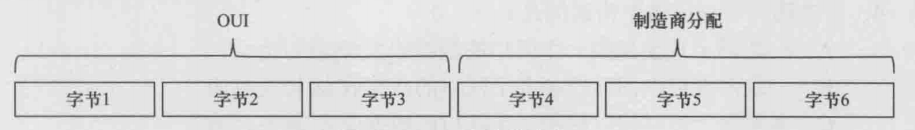

注意，BIA 地址只是 MAC 地址的一种，更准确地说，BIA 地址是一种单播 MAC 地址。MAC 地址共分为 3 种，分别为单播 MAC 地址、组播 MAC 地址、广播 MAC 地址。这 3 种 MAC 地址的定义分别如下：

- **单播 MAC 地址是指第一个字节的最低位是 0 的 MAC 地址**。
- **组播 MAC 地址是指第一个字节的最低位是 1 的 MAC 地址**。
- **广播 MAC 地址是指每个比特都是 1 的 MAC 地址。广播 MAC 地址是组播 MAC 地址的一个特例**。

    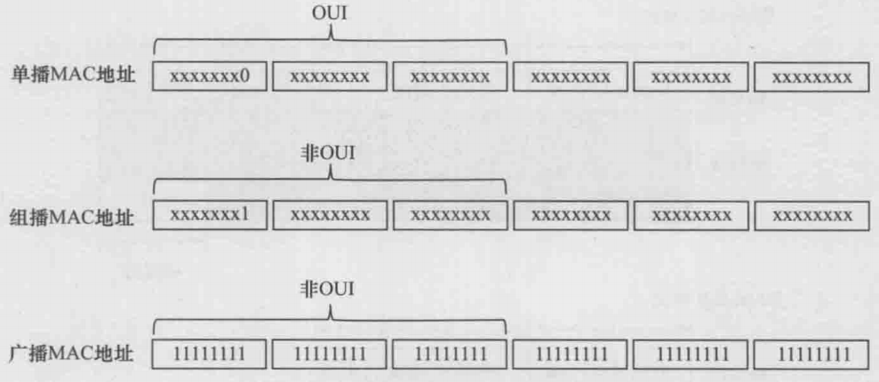

一个单播 MAC 地址（例如 BIA 地址）标识了一块特定的网卡；一个组播 MAC 地址标识的是一组网卡；广播 MAC 地址是组播 MAC 地址的一个特例，它标识了所有的网卡。**从上图中我们可以发现，并非任何一个 MAC 地址的前 3 个字节都是 OUI，只有单播 MAC 地址的前 3 个字节才是 OUI**，而组播或广播 MAC 地址的前 3 个字节一定不是 OUI。特别需要说明的是，OUI 的第一个字节的最低位一定是 0。

一个 MAC 地址有 48bit，为了方便起见，通常采用十六进制数的方式来表示一个 MAC 地址：每两位十六进制数 1 组（即 1 个字节），一共 6 组，中间使用中划线连接；也可以每四位十六进制数 1 组（即 2 个字节），一共 3 组，中间使用中划线连接。

需要特别说明的是，根据目的 MAC 地址的不同，以太网帧可以分为以下 3 种不同的类型：

- 单播以太帧（或简称单播帧）：目的 MAC 地址为一个单播 MAC 地址的帧。
- 组播以太帧（或简称组播帧）：目的 MAC 地址为一个组播 MAC 地址的帧。
- 广播以太帧（或简称广播帧）：目的 MAC 地址为广播 MAC 地址的帧。

## 2.以太网交换机

如果交换机转发数据的端口都是以太网口，则这样的交换机称为以太网交换机（Ethernet Switch）；如果交换机转发数据的端口都是令牌环端口，则这样的交换机称为令牌环交换机（Token Ring Switch），如此等等。以太网交换机、令牌环交换机等都是局域网交换机（LAN Switch）这个家庭中的成员。从理论上讲，局域网交换机的成员有很多，但实际上，除了以太网交换机外，其他成员基本上已被市场机制所淘汰。**所以，目前以太网交换机与局域网交换机几乎成了同一个概念**。以下所说的交换机，如无特别说明，都是指以太网交换机。

### 2.1 3 种转发操作

交换机会对通过传输介质进入其端口的每一个帧都进行转发操作，交换机的基本作用就是用来转发帧的。交换机对于从传输介质进入其某一端口的帧的转发操作一共有 3 种：泛洪（Flooding）、转发（Forwarding）、丢弃（Discarding）。

- **泛洪**：交换机把从某一端口进来的帧通过所有其他的端口转发出去（**注意，所有其他的端口是指除了这个帧进入交换机的那个端口以外的所有端口**）。泛洪操作是一种点到多点的转发行为。
- **转发**：交换机把从某一端口进来的帧通过另一个端口转发出去（注意，另一个端口 **不能是这个帧进入交换机的那个端口**）。这里的转发操作是一种点到点的转发行为。
- **丢弃**：交换机把从某一端口进来的帧直接丢弃。丢弃操作其实就是不进行转发。

    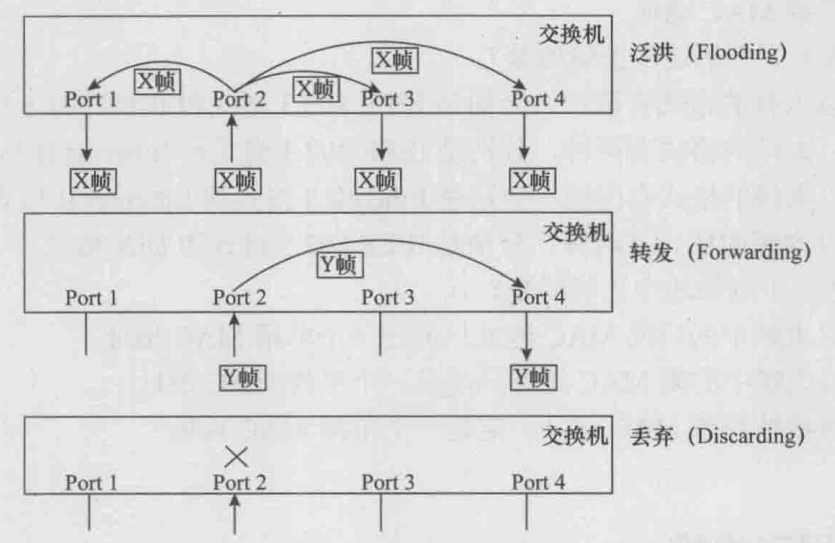

### 2.2 交换机的工作原理

每台交换机中都有一个 MAC 地址表，它存放了 MAC 地址与交换机端口编号之间的映射关系。MAC 地址表存在于交换机的工作内存中，**交换机刚上电时，MAC 地址表中没有任何内容，是一个空表**。随着交换机不断地转发数据并进行地址学习，MAC 地址表的内容会逐步丰富起来。当交换机下电或重启时，MAC 地址表的内容会完全丢失。交换机的基本工作原理（转发原理）可以概括地描述如下：

- 如果从传输介质进入交换机的某个端口的帧是一个单播帧，则交换机会去 MAC 地址表中查找这个帧的目的 MAC 地址。
  - 如果查不到这个 MAC 地址，则交换机将对该帧执行泛洪操作。
  - 如果查到了这个 MAC 地址，则比较这个 MAC 地址在 MAC 地址表中对应的端口编号是不是这个帧从传输介质进入交换机的那个端口的端口编号。
    - 如果不是，则交换机将对该帧执行转发操作（将该帧送至该帧的目的 MAC 地址在 MAC 地址表中对应的那个端口，并从那个端口发送出去）。
    - 如果是，则交换机将对该帧执行丢弃操作。
- 如果从传输介质进入交换机的某个端口的帧是一个广播帧，则交换机不会去查 MAC 地址表，而是直接对该广播帧执行泛洪操作。
- 如果从传输介质进入交换机的某个端口的帧是一个组播帧，则交换机的处理行为比较复杂。

另外，交换机还具有 MAC 地址学习能力。当一个帧（无论是单播帧、组播帧，还是广播帧）从传输介质进入交换机后，交换机会检查这个帧的源 MAC 地址，并将该源 MAC 地址与这个帧进入交换机的那个端口的端口编号进行映射，然后将这个映射关系存放进 MAC 地址表。

### 2.3 单交换机的数据转发示例

#### 2.3.1 泛洪转发示例

如图所示，4 台计算机分别通过双绞线与同一台交换机相连。交换机有 4 个端口（Port），Port 后面的阿拉伯数字就是端口编号（Port No.），分别为 1、2、3、4。注意，双绞线两端所连接的其实分别是计算机上的网卡和交换机上的网卡。假设这 4 台计算机的网卡的 MAC 地址分别是 MAC1、MAC2、MAC3、MAC4；另外假设交换机的 MAC 地址表此刻为空。

    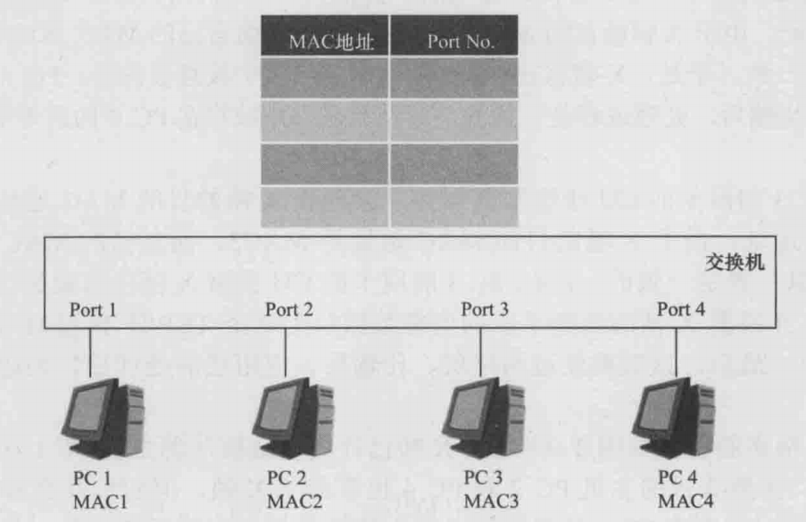

现在，假设 PC 1 需要向 PC 3 发送一个单播帧 X（特别假设 PC 1 已经知道了 PC 3 的网卡的 MAC 地址为 MAC3），因此把 PC 1 称为源主机，PC 3 称为目的主机。下面的步骤描述了 X 帧从 PC 1 运动到 PC 3 的全过程。

**（1）步骤一**

PC1 的应用软件所产生的数据经 TCP/IP 模型的应用层、传输层、网络层处理后，得到数据包（Packet）。数据包下传给 PC1 的网卡的后，会将之封装成帧。假设封装的第一个帧叫 X 帧，网卡会将 MAC3 作为 X 帧的目的 MAC 地址，然后会从自己的 ROM 中读出 MAC1 地址，并将 MAC1 地址作为 X 帧的源地址。

**（2）步骤二**

X 帧到达 Port1 的网卡后，交换机会去 MAC 地址表中查找 X 帧的目的 MAC 地址 MAC3。由于此时 MAC 地址表是空表，所以在 MAC 地址表中查不到 MAC3。根据交换机的转发原理，交换机会对 X 帧执行泛洪操作。然后，交换机还要进行地址学习：**因为 X 帧是从 Port1 进入交换机的，并且 X 帧的源 MAC 地址为 MAC1，所以，交换机会将 MAC1 映射到 Port1，并将这一映射关系作为一个条目写进 MAC 地址表**。

**（3）步骤三**

PC2 的网卡在收到 X 帧后，会检查 X 帧的目的 MAC 地址是不是自己的 MAC 地址。由于 X 帧的目的 MAC 地址是 MAC3，而自己的 MAC 地址是 MAC2，所以二者不一致。于是，X 帧将在 PC2 的网卡中被直接丢弃。PC4 的网卡在收到 X 帧后，处理过程是一样的被直接丢弃。

**（4）步骤四**

PC3 的网卡在收到 X 帧后，会检查 X 帧的目的 MAC 地址是不是自己的 MAC 地址。由于二者是一致的。于是，PC3 的网卡会将 X 帧中的数据包（Packet）抽取出来，并根据 X 帧的类型字段的值将数据包上送至 TCP/IP 模型的网络层的相应处理模块。

至此，网络的状态如下图所示。X 帧已经成功地被从源主机 PC1 送达至目的主机 PC3，虽然非目的主机 PC2 和 PC4 也收到了 X 帧，但它们都会将 X 帧直接丢弃。X 帧在 PC2 和 PC4 的双绞线上产生的流量并没有实际的用处，这样的流量被称为垃圾流量。显然，这里的垃圾流量是因为交换机对 X 帧执行了泛洪操作而引起的。

    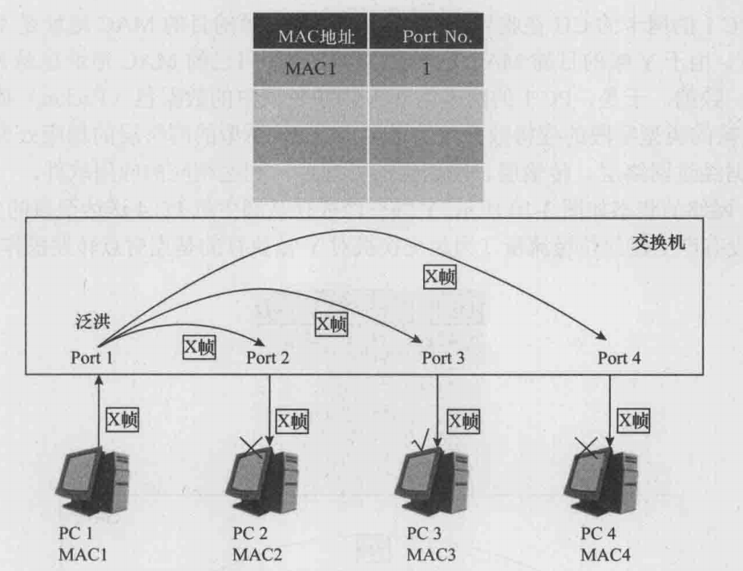

#### 2.3.2 单播转发示例

现在，在上图所示的网络状态下，假设 PC4 需要向 PC1 发送一个单播帧 Y（特别假设：PC4 已经知道了 PC1 的网卡的 MAC 地址为 MAC1）。此时，PC4 为源主机，PC1 为目的主机。下面的步骤描述了 Y 帧从 PC4 运动到 PC1 的全过程。

**（1）步骤一**

PC4 的应用软件所产生的数据经 TCP/IP 模型的应用层、传输层、网络层处理后，得到数据包（Packet）。数据包下传给 PC4 的网卡后，会被封装成帧。假设封装的第一个帧叫 Y 帧，网卡会将 MAC1 作为 Y 帧的目的 MAC 地址，然后会从自己的 ROM 中读出 MAC4 作为 Y 帧的源地址。

**（2）步骤二**

Y 帧到达 Port4 的网卡后，交换机会去 MAC 地址表中查找 Y 帧的目的 MAC 地址 MAC1。查表的结果是，MAC1 对应了 Port1，而 Port1 不是 Y 帧的入端口 Port4。根据交换机的转发原理，交换机会对 Y 帧执行点到点转发操作。然后，**交换机还要进行地址学习：因为 Y 帧是从 Port4 进入交换机的，并且 Y 帧的源 MAC 地址为 MAC4，所以，交换机会将 MAC4 映射到 Port4**，并将这一映射关系作为一个新的条目写进 MAC 地址表。

**（3）步骤三**

PC1 的网卡的 CU 在收到 Y 帧后，会检查 Y 帧的目的 MAC 地址是不是自己的 MAC 地址，在这里二者是一致的。于是，PC1 的网卡会将 Y 帧中的数据包（Packet）抽取出来，并根据 Y 帧的类型字段的值将数据包上送至 TCP/IP 模型的网络层的相应处理模块。

至此，网络的状态如下图所示。Y 帧已经成功从源主机 PC4 送达至目的主机 PC1，并且这次没有产生任何垃圾流量（因为交换机对 Y 帧执行的是点对点转发操作）。

    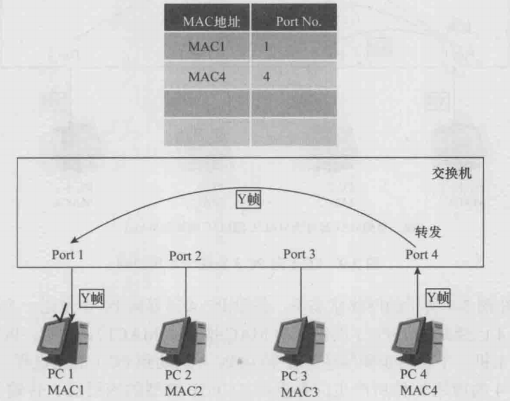

#### 2.3.3 丢弃转发示例

现在，在上图所示的网络状态下，假设 PC1 将发送一个单播帧 Z。由于某种未知的原因（比如由于 Bug 的原因），在 PC1 的网卡形成的 Z 帧的目的 MAC 地址为 MAC1，源 MAC 地址为 MAC5。Z 帧到达 Port1 的网卡后，交换机会去 MAC 地址表中查找 Z 帧的目的 MAC 地址 MAC1。查表的结果是，MAC1 对应了 Port1，而 Port1 正是 Z 帧的入端口。根据交换机的转发原理，交换机会对 Z 帧执行丢弃操作。**然后，交换机还要进行地址学习：因为 Z 帧是从 Port1 进入交换机的，并且 Z 帧的源 MAC 地址为 MAC5，所以，交换机会将 MAC5 映射到 Port1，并将这一映射关系作为一个新的条目写进 MAC 地址表**。至此，网络的状态如下图所示。

    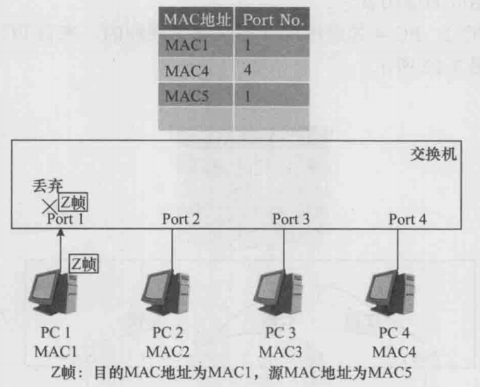

#### 2.3.4 广播帧转发示例

假定目前的网络状态如上图所示，而 PC3 将要发送一个广播帧 W。下面的步骤描述了 W 帧的运动轨迹。

**（1）步骤一**

PC3 希望把应用软件所产生的数据同时发送给所有其他的计算机。数据包下传给 PC3 的网卡后，网卡会将之封装成广播帧 W。并且网卡会将广播地址作为 W 帧的目的 MAC 地址，然后会从自己的 ROM 中读出 MAC3 地址，并将 MAC3 地址作为 W 帧的源地址。

**（2）步骤二**

W 帧到达 Port3 的网卡后，交换机不会去查 MAC 地址表，而是直接对 W 帧执行泛洪操作，这是因为交换机能判断出 W 帧是一个广播帧。**然后，交换机还要进行地址学习：因为 W 帧是从 Port3 进入交换机的，并且 W 帧的源 MAC 地址为 MAC3，所以，交换机会将 MAC3 映射到 Port3**，并将这一映射关系作为一个新的条目写进 MAC 地址表。

**（3）步骤三**

PC i（i = 1，2，4）的网卡在收到 W 帧后，判断出 W 帧是一个广播帧，于是会将 W 帧中的数据包（Packet）抽取出来，并根据 W 帧的类型字段的值将数据包上送至 TCP/IP 模型的网络层的相应处理模块。至此，PC1、PC2、PC4 的应用软件都收到了同样的、来自 PC3 的应用软件的数据。

总结如下所示：

- 当计算机的网卡收到一个单播帧时，会将该单播帧的目的 MAC 地址与自己的 MAC 地址进行比较。如果二者相同，则网卡会根据该单播帧的类型字段的值将该单播帧中的载荷数据上送至网络层中的相应处理模块。如果二者不同，则网卡会将该单播帧直接丢弃。
- 当计算机的网卡收到一个广播帧时，会直接根据该广播帧的类型字段的值将该广播帧中的载荷数据上送至网络层中的相应处理模块。
- 当交换机的网卡收到一个单播帧时，不会将该单播帧的目的 MAC 地址与自己的 MAC 地址进行比较，而是直接去查 MAC 地址表，并根据查表的结果决定对该单播帧执行 3 种转发操作的哪一种。
- 当交换机的网卡收到一个广播帧时，直接对该广播帧执行泛洪操作。

    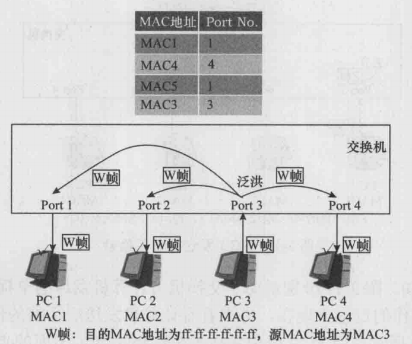

### 2.4 多交换机的数据转发示例

    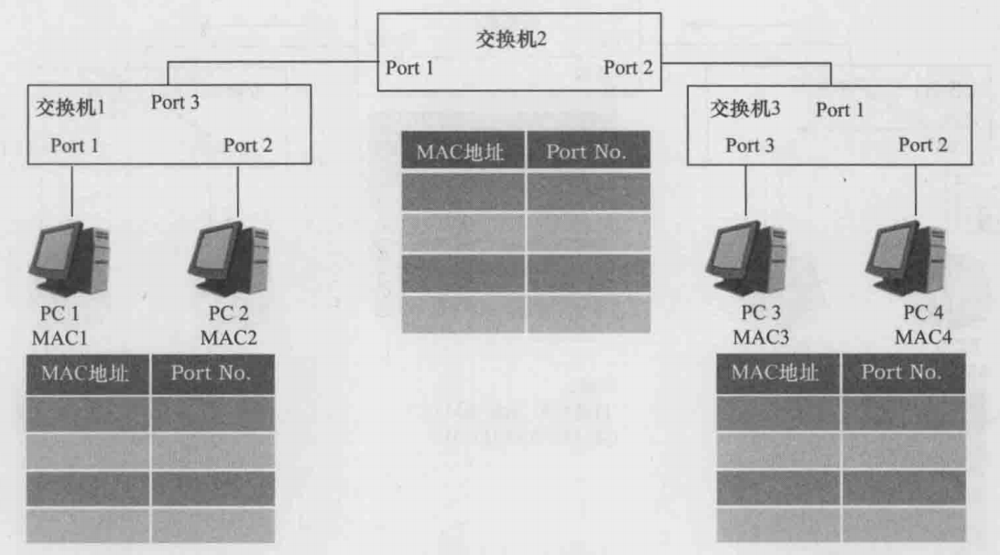

现在，假设 PC1 需要向 PC3 发送一个单播帧 X（特别假设，PC1 已经知道了 PC3 的网卡的 MAC 地址为 MAC3）。下面的步骤描述了 X 帧从 PC1 运动到 PC3 的全过程。

- PC1 的网卡完成 X 帧的封装；X 帧的目的 MAC 地址为 MAC3，源 MAC 地址为 MAC1。
- 交换机 1 对 Port1 的网卡中的 X 帧执行泛洪操作，一路通过交换机 1 的 Port3 到达交换机 2 的 Port1，另一路通过交换机 1 的 Port2 到达 PC2。交换机 1 将 MAC1 与 Port1 的对应关系写进自己的 MAC 地址表。
- 交换机 2 对 Port1 的网卡中的 X 帧执行泛洪操作，X 帧通过交换机 2 的 Port2 到达交换机 3 的 Port1。交换机 2 将 MAC1 与 Port1 的对应关系写进自己的 MAC 地址表。
- 交换机 3 对 Port1 的网卡中的 X 帧执行泛洪操作，一路通过交换机 3 的 Port3 到达 PC3，另一路通过交换机 3 的 Port2 到达 PC4。交换机 3 将 MAC1 与 Port1 的对应关系写进自己的 MAC 地址表。
- PC2 和 PC4 的网卡会将收到的 X 帧丢弃。PC3 会将 X 帧的载荷数据上送给网络层。

至此，网络的状态如下图所示。X 帧已经成功从源主机 PC1 送达至目的主机 PC3，虽然非目的主机 PC2 和 PC4 也收到了 X 帧，但它们都会将 X 帧直接丢弃。

    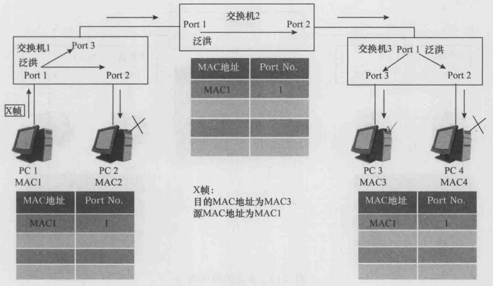

现在，在上图所示的网络状态下，假设 PC4 需要向 PC1 发送一个单播帧 Y（特别假设 PC4 已经知道了 PC1 网卡的 MAC 地址为 MAC1）。下面的步骤描述了 Y 帧从 PC4 运动到 PC1 的全过程。

- PC 4 的网卡完成 Y 帧的封装；Y 帧的目的 MAC 地址为 MAC1，源 MAC 地址为 MAC4。
- 交换机 3 的 Port2 对 Y 帧执行点对点转发操作，Y 帧通过交换机 3 的 Port1 到达交换机 2 的 Port2。交换机 3 将 MAC4 与 Port2 的对应关系写进自己的 MAC 地址表。
- 交换机 2 的 Port2 对 Y 帧执行点对点转发操作，Y 帧通过交换机 2 的 Port1 到达交换机 1 的 Port3。交换机 2 将 MAC4 与 Port2 的对应关系写进自己的 MAC 地址表。
- 交换机 1 的 Port3 对 Y 帧执行点对点转发操作，Y 帧通过交换机 1 的 Port3 到达 PC1。交换机 1 将 MAC4 与 Port3 的对应关系写进自己的 MAC 地址表。
- PC1 会将收到的 Y 帧的载荷数据上送给网络层。

至此，网络的状态如下图所示。Y 帧已经成功从源主机 PC4 送达至目的主机 PC1，并且这次没有产生任何垃圾流量。

    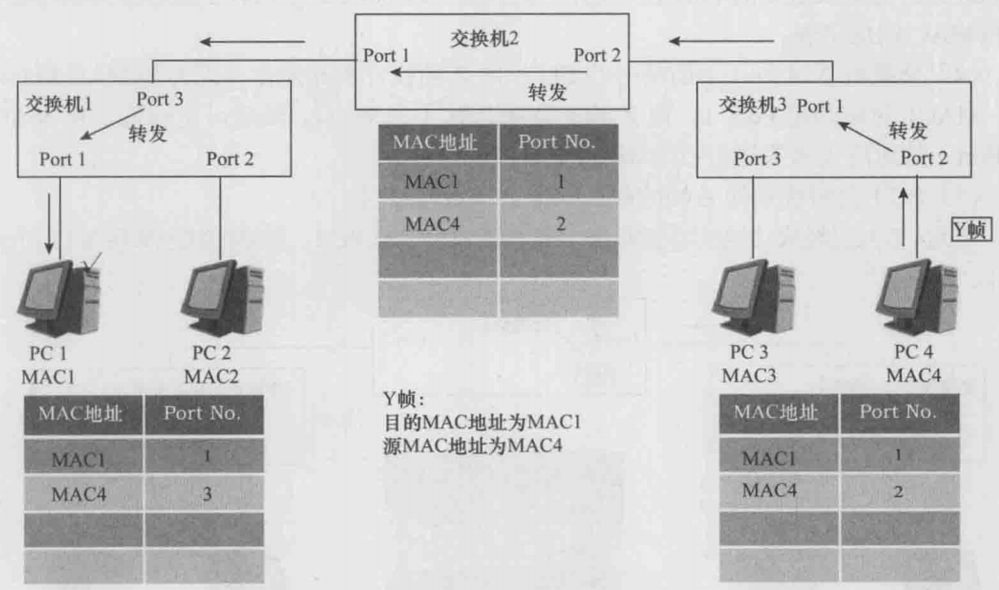

接下来，我们假定此时的网络状态如下图所示，PC2 需要向 PC1 发送一个单播帧 Z（特别假设 PC2 已经知道了 PC1 的网卡的 MAC 地址为 MAC1）。**注意，此时交换机 1 的 MAC 地址表中并没有关于 MAC1 的条目，但交换机 2 的 MAC 地址表中存在关于 MAC1 的条目**。

    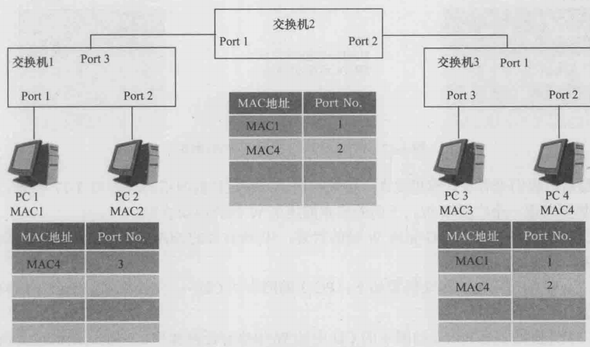

下面的步骤描述了 Z 帧从 PC2 运动到 PC1 的全过程。

- PC2 的网卡完成 Z 帧的封装，Z 帧的目的 MAC 地址为 MAC1，源 MAC 地址为 MAC2。
- 交换机 1 对 Port2 的网卡中的 Z 帧执行泛洪操作（因为此时 MAC 地址表中查不到 MAC1）。Z 帧一路通过交换机 1 的 Port1 到达 PC1，另一路通过交换机 1 的 Port3 到达交换机2 的 Port1。然后，交换机 1 将 MAC2 与 Port2 的对应关系写进自己的 MAC 地址表。
- 交换机 2 对 Port1 的网卡中的 Z 帧执行丢弃操作（因为在 MAC 地址表中，MAC1 对应的是 Port1，而 Z 帧正是从 Port1 进来的）。然后，交换机 2 将 MAC2 与 Port1 的对应关系写进自己的 MAC 地址表。
- PC1 会将收到的 Z 帧的载荷数据上送给网络层。

至此，Z 帧已经成功地从源主机 PC2 送到目的主机 PC1，网络状态如下所示：

    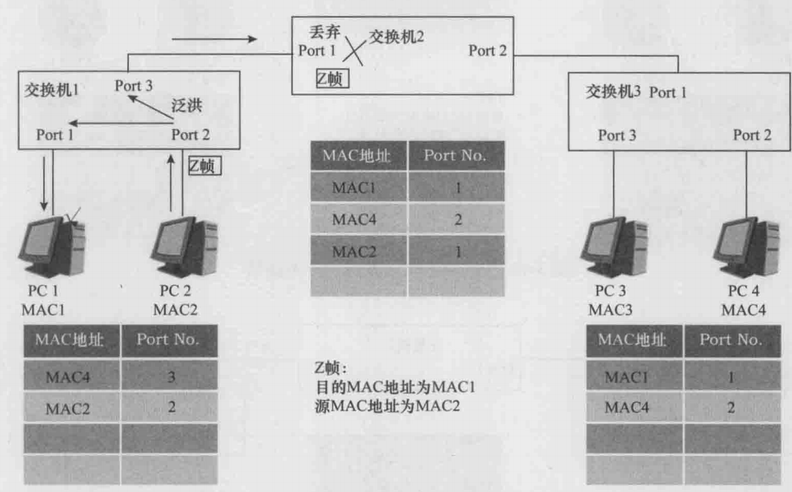

最后，我们来看看计算机发送广播帧的例子。假定目前网络的状态如上图所示，而 PC3 将要发送一个广播帧 W。下面的步骤描述了 W 帧的运动轨迹。

- PC3 的网卡完成 W 帧的封装；W 帧的目的 MAC 地址为 **`ff-ff-ff-ff-ff-ff`**，源 MAC 地址为 MAC3。
- 交换机 3 对 Port3 的网卡中的 W 帧执行泛洪操作，W 帧一路通过交换机 3 的 Port1 到达交换机 2 的 Port2，另一路通过交换机 3 的 Port2 到达 PC4。然后，交换机 3 将 MAC3 与 Port3 的对应关系写进自己的 MAC 地址表。
- 交换机 2 对 Port2 的网卡中的 W 帧执行泛洪操作，W 帧通过交换机 2 的 Port1 到达交换机 1 的 Port3。然后，交换机 2 将 MAC3 与 Port2 的对应关系写进自己的 MAC 地址表。
- 交换机 1 对 Port3 的网卡中的 W 帧执行泛洪操作，W 帧通过交换机 1 的 Port1 和 Port2 分别到达 PC1 和 PC2。然后，交换机 1 将 MAC3 与 Port3 的对应关系写进自己的 MAC 地址表。
- PC4、PC2、PC1 的网卡在收到 W 帧后，会将 W 帧的载荷数据上送到网络层。

至此，PC1、PC2、PC4 都接收到了来自 PC3 的广播帧 W，网络的状态如下图所示。

    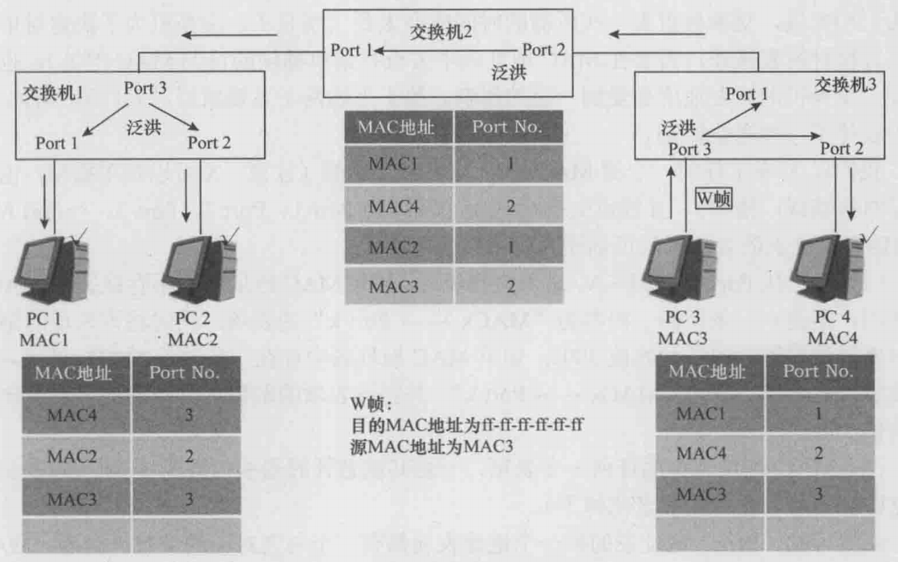   

### 2.5 MAC 地址表

交换机的 MAC 地址表也称为 MAC 地址映射表，其中的每一个条目也称为一个地址表项，地址表项反映了 MAC 地址与端口的映射关系。前面已经描述了交换机是如何学习 MAC 地址与端口的映射关系，并将这种映射关系作为地址表项写进 MAC 地址表的。

在现实中，如果交换机或计算机的位置真的发生了变化，那么交换机的 MAC 地址表中某些原来的地址表项很可能会错误地反映当前 MAC 地址与端口的映射关系。另外，MAC 地址表中的地址表项如果太多，那么平均来说，交换机查表一次所需的时间就会太长，也就是说，交换机的转发速度会受到一定的影响。鉴于上述两个主要原因，人们为 MAC 地址表设计了一种老化机制。

**我们以 X 表示任何一个源 MAC 地址为 MACx 的帧**（注意，X 可以是单播帧，也可以是组播帧或广播帧），并假设交换机的 N 个端口为 Port1、Port2、Port3、……PortN，则 MAC 地址表的老化机制可描述为以下两条原则。

- **当 X 从 $\bold{\scriptsize{Port_k}}$（$\scriptsize{1≤k≤N}$）进入交换机时，如果 MAC 地址表中不存在关于 $\bold{\scriptsize{MAC_x}}$ 的表项，则建立一条新的、内容为 $\scriptsize\bold{MAC_x \leftrightarrow Port_k}$ 的表项，同时将该表项的倒数计时器的值设置为缺省初始值 300s**；如果 MAC 地址表中存在一条关于 $\bold{\scriptsize{MAC_x}}$ 的表项，则该表项的内容更新为 $\scriptsize\bold{MAC_x \leftrightarrow Port_k}$，并将该表项的倒数计时器的值重置为缺省初始值 300s。
- MAC 地址表中的任何一个表项，一旦其倒数计时器的值降为 0 时，则该表项将立即被删除（也就是被老化掉了）。

从上可知，MAC 地址表的每一个地址表项都有一个与之对应的倒数计时器。MAC 地址表的内容是动态的，新的表项不断被建立，老的表项不断被更新或被删除。

## 3 ARP

### 3.1 ARP 的基本原理

一个源设备开始是不知道目的设备的 MAC 地址的。源设备总是通过某种机制（例如 DNS，Domain Name System）先获取到目的设备的 IP 地址，然后利用 ARP 协议对该 IP 地址进行解析，从而获取到目的设备的 MAC 地址。当然，一个设备总是知道自己的 MAC 地址和 IP 地址的。

源设备需要解析一个 IP 地址时，会发出一个广播帧，广播帧的载荷数据是一个 ARP 请求报文。目的设备在接收到 ARP 请求报文后，会向源设备发送一个单播帧，该单播帧的载荷数据是一个 ARP 应答报文，该 ARP 应答报文中包含了目的设备的 MAC 地址。下面通过一个例子来说明 ARP 的基本工作原理。

    

如上图所示，假设源主机 PC1 已经知道了目的主机 PC2 的 IP 地址为 **`10.0.0.2`**，现在需要获取 PC2 的 MAC 地址。PC1 获取 PC2 的 MAC 地址的过程如下。

- PC1 会发送一个广播帧，该广播帧的源 MAC 地址为 MAC1，类型字段的值是 **`0x0806`**，表明该广播帧的载荷数据是一个 ARP 报文（具体为 ARP 请求报文）。该 ARP 请求报文的含义是：我的 IP 地址是 **`10.0.0.1`**，我的 MAC 地址是 MAC1，请问 IP 地址 **`10.0.0.2`** 所对应的 MAC 地址是多少？
- 因为 PC1 发送的是一个广播帧，所以 PC2 和 PC3 都会接收到它，并根据其类型字段的值（**`0x0806`**）将其中的 ARP 请求报文上送给网络层的 ARP 处理模块进行处理。
- PC3 的 ARP 处理模块会发现，**`10.0.0.2`** 并不是自己的 IP 地址，所以不会进行应答，而是将 ARP 请求报文中 **`10.0.0.1`** 与 MAC1 的对应关系存放进自己的 ARP 缓存表，然后将此 ARP 请求报文丢弃。
- PC2 的 ARP 处理模块会发现，**`10.0.0.2`** 正是自己的 IP 地址，所以会进行应答。PC2 会向 PC1 发送一个单播帧，该帧的目的 MAC 地址为 MAC1，源 MAC 地址为 MAC2，类型字段的值还是 **`0x0806`**。该帧的载荷数据是一个 ARP 应答报文，应答报文中包含了 PC2 的 IP 地址 **`10.0.0.2`** 和 MAC 地址 MAC2。另外，PC2 也要将所收到的 ARP 请求报文中的 **`10.0.0.1`** 与 MAC1 的对应关系存放进自己的 ARP 缓存表。
- PC1 在收到 PC2 发送的单播帧后，会将其中的 ARP 应答报文上送给三层的 ARP 处理模块。PC1 的 ARP 处理模块会从该应答报文中获取到 PC2 的 MAC 地址 MAC2。另外，PC1 也会将 **`10.0.0.2`** 与 MAC2 的对应关系存放进自己的 ARP 缓存表。

设备中的 ARP 缓存表是用来临时存放 IP 地址与 MAC 地址的对应关系的。**当某一设备需要向目的设备发送单播帧时，会首先查看自己的 ARP 缓存表中是否已经有了目的设备的 MAC 地址**。如果有，就直接使用它；如果没有，就会发起 ARP 请求来获取它。

ARP 缓存表也具有动态特性：一个条目（即一个 IP 地址与 MAC 地址的对应关系）从其被建立或最近一次被使用算起，会有 180s（该时间值可通过配置进行修改）的生存期；一旦过了生存期，该条目就会被删除。某个条目在每次被使用时，该条目的生存期都会被重新设置为 180s。

### 3.2 ARP 代理

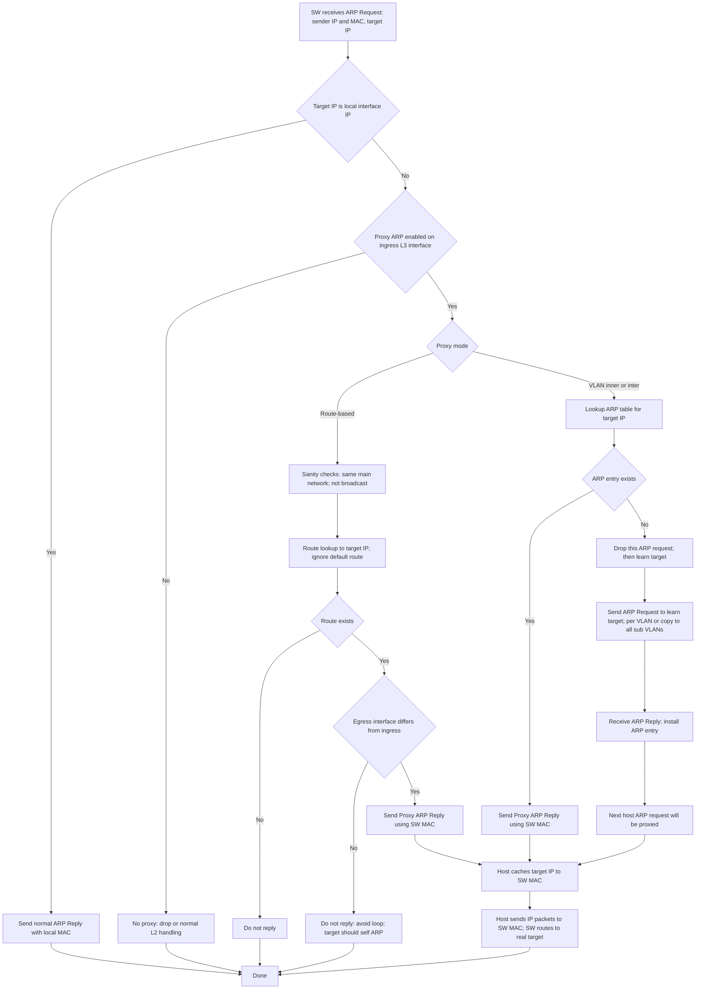

#### 3.2.1 路由式 ARP

#### 3.2.2 ARP 任意代理

#### 3.2.3 VLAN 内 ARP 代理

#### 3.2.4 VLAN 间 ARP 代理