# RIP 路由

## 3.RIP 协议

### 3.1 距离矢量路由选择协议

使用距离矢量路由协议的路由器并不了解网络的拓扑结构。该路由器只知道：
- 自身与目的网络之间的距离
- 应该往哪个方向或者使用哪个接口转发数据包

下面以 RIP 协议为例，分析路由器中路由表的生成。

<div align="center">
    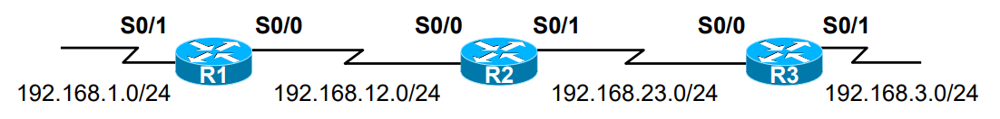
</div>

**1）直连路由写入路由表**

首先，当路由器启动时，会根据自己直连的网络，增加路由条目，这样 R1、R2 和 R3 都会有两个路由条目。如下所示：

<div align="center">
    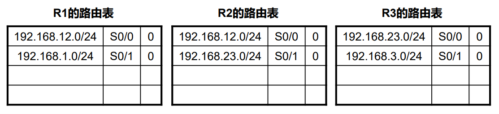
</div>

**2）初次交换路由信息**

接着，R1 和 R2、R2 和 R3 之间彼此交换路由信息，R1 学习到了 R2 中的 192.168.23.0/24 这条路由，同时将距离由 0 再加上 1 得到 1，这是因为 R2 与 23.0 这个网络是直接相连的，距离为 0，但是 R1 距离这个网络还需要再经过 R2 转发，所以距离为 1。路由表如下所示：

<div align="center">
    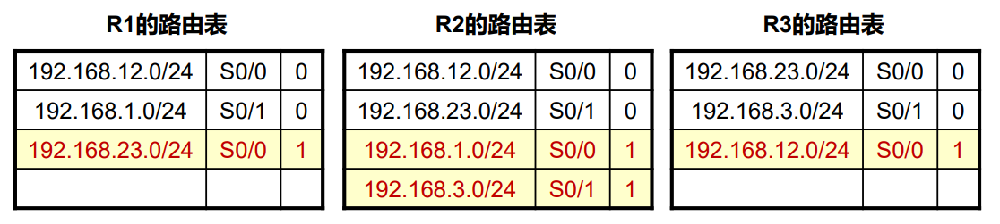
</div>

**3）下一个更新周期到来**

在初次交换路由信息之后，R1 和 R3 还没有所有网络的路由信息，因此只有在下一次更新周期时，再次交换路由表，才能得到整个网络的信息。最终生成的路由表如下所示：

<div align="center">
    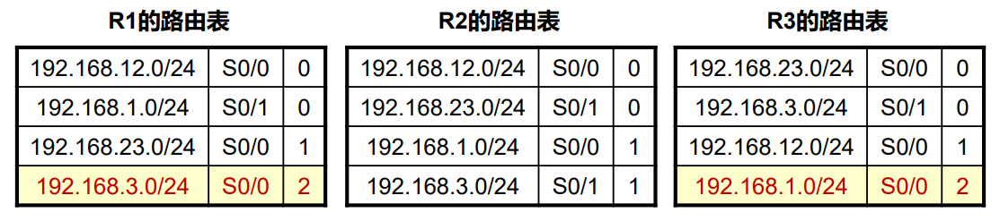
</div>

当所有的路由表包含相同网络可达性信息时，网络（路由）进入了一个稳态，说明路由器收敛完成，或者说当无新路由信息被更新时收敛结束。注意，网络在达到收敛前无法完全正常工作。

RIP 是应用及开发较早的路由协议，是典型的距离矢量路由协议，适用于小型网络，最大跳数 15 跳（16 跳视为不可达），另外 RIP 是基于 UDP 的，使用端口号 520。

### 3.3 环路的产生

距离矢量路由选择协议是周期性地泛洪整张路由表，并且是依照传闻进行更新，逐跳更新。但是这样距离矢量路由选择协议很不稳定，可能会产生环路，并且收敛很慢。。如下所示：

#### 3.3.1 链路出现故障

<div align="center">
    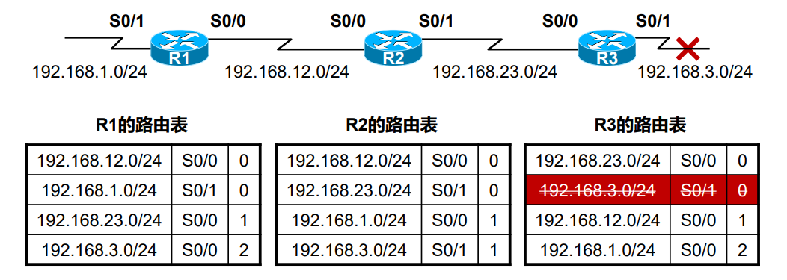
</div>

R3 右侧的链路出现故障，然后 R3 将网络号 192.168.3.0/24 从路由表中删除。

#### 3.3.2 RIP 路由更新（R2->R3）

<div align="center">
    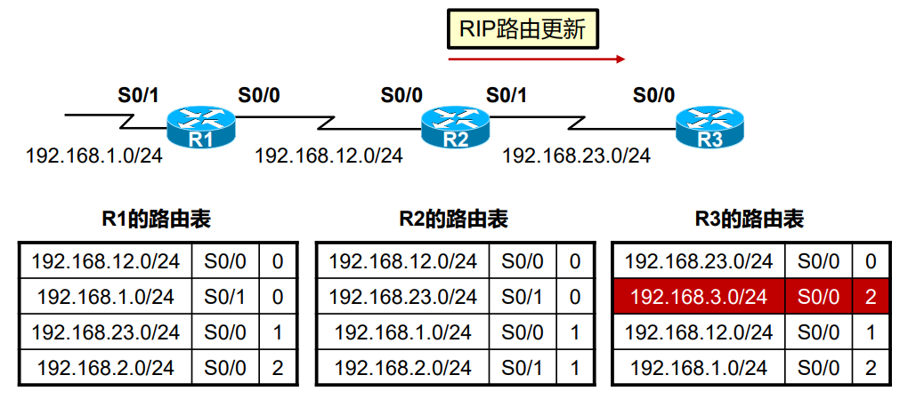
</div>

在更新周期到来时，R2向R3发送了更新的路由表，其中包括到达 192.168.3.0/2 4网络的路由条目。因此 R3 误以为通过 R2 可以到达 192.168.3.0/24 网络，将其添加到自身的路由表中，度量值加一，变成 2，下一跳路由器变为 R2。这样就形成了一个环路，比如一台 PC 发送一个 IP 数据包到目的网络 192.168.3.0/24，当这个 IP 数据包送到 R2 时，它会被转发给 R3，当被送达 R3 时，又会被转发给 R2，这样不断循环。

#### 3.3.3 RIP 路由更新（R3->R2，R2->R1）

<div align="center">
    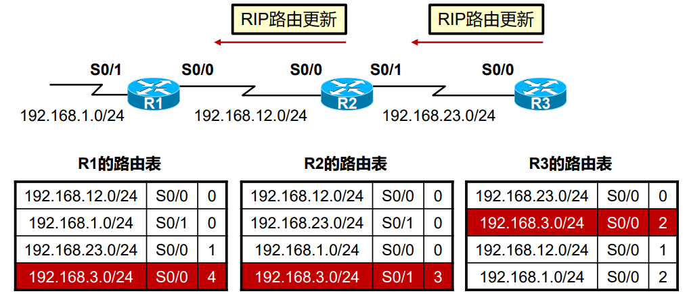
</div>

在下一个更新周期到来时，R3 会将自己的路由表发给 R2，R2 会将路由表中 192.168.3.0/24 条目中的度量值由 1 变为 3，然后 R2 再把自己的路由表发送给 R1，同理，R1 会将 192.168.3.0/24 条目中的度量值由 2 变为 4，然后 R2 又把自己的路由表信息发送给 R3，这样 R3 中 3.0/24 网络的度量值变为 3，R3 再依次向 R2 和 R1 发送路由表，这样不断循环，使得三台路由器中 3.0/24 网络的度量值不断变大。

### 3.4 RIP 协议消除环路机制

#### 3.4.1 定义最大跳数

在 RIP 协议中，定义跳数的最大值为 15 跳，16 跳表示不可达，以避免路由选择环路。

#### 3.4.2 水平分割（split horizon）

水平分割是距离矢量路由协议的特征之一，它可以防止路由环路。 此功能可防止路由器将路由通告回其获悉的接口。

即从一个接口学习到的路由不会再广播回该接口，cisco 可以对每个接口关闭水平分割功能。如上图所示，R3 将 3.0/24 网络的路由信息发送给 R2，那么当 3.0/24 网络出现故障时，R2 就不会再把这条路由发回给 R3，让 R3 误以为通过 R2 可以到达 3.0/24，这样就从一开始避免了形成环路。

#### 3.4.3 毒性路由（route posion）

毒性路由是距离矢量路由协议采用的另一种防止路由环路的方法。当路由器检测到其直接的网络之一出现故障时，它会为该路由发送具有无穷大度量值（毒性路由）的通告（泛洪）。收到更新的路由器知道此条路由失效而不再使用它。

<div align="center">
    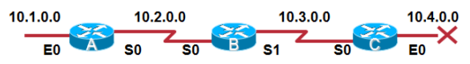
</div>

当 10.4.0.0 挂掉的时候，C 会立即发一条路由中毒消息（10.4.0.0 16 跳）然后通告出去；B 收到这条中毒消息后，将 10.4.0.0 从路由表里抹去，但仍存在在 rip database 里，状态是 possible down，垃圾收集时间（Garbage colletion CISCO 默认 60S）到后，路由被从 B 的 database 抹去。

#### 3.4.4 毒性逆转（poison reverse）

同上图，4.0 挂掉后，C 会发送中毒消息消息，理论上 4.0 的路由是 C 通告给 B 的，根据水平分割原则，B 不能向 C 通告 4.0 的信息，但是带毒性逆转的水平分割打破了这个原则。B 在收到了中毒消息之后，会定期向 C 发送 4.0 的毒性逆转消息，以让 C 知道，他的邻居知道了 4.0 挂掉的消息并且在等待着 4.0 恢复正常。

这样做让 C 也知道从 B 不可以到达 4.0 网络，从而避免了环路。另外，毒性路由指的就是度量值为 16 的路由信息，毒性路由一般是由直连的网络出现故障的路由器 C 发送给其它路由器 B，但是在这里，是由 B 发送给 C，这就是毒性逆转了。

#### 3.4.5 触发更新（trigger update）

一旦检测到路由崩溃，立即广播路由刷新报文，而不是等到下一个刷新周期。要实现触发更新，只需添加一条规则，每当路由器中某一个路由条目的度量值发生改变时，路由器都需要立即发送更新消息，即使还没有到下一个更新周期（时间细节因协议而异，一些距离矢量协议（包括 RIP）指定了一个小的时间延迟，以避免触发更新产生过多的网络流量）。

假设路由器到目的地 N 的路由经过路由器 G。如果更新来自 G 本身，则接收路由器会相信新信息，无论信息中新的度量值高于还是低于旧的度量值。如果度量值发生变化，则接收路由器将向所有直接连接到它的主机和路由器发送触发更新，他们又可以各自向他们的邻居发送更新。

#### 3.4.6 抑制计时器（holdown timer）

抑制定时器是距离矢量路由协议采用的另外一种防止路由环路的方法。为了降低接受错误路由选择信息的可能性，**抑制计时器（Holddown Timer）引入某种程度的怀疑量**。如果到一个目标的距离增加 (例如，跳数由 2 增加到 4，或者增加到 16，表示不可达)，那么路曲器将为该路由设置抑制计时器。直到计时器超时，路由器才可以接受有关此路由的更新信息。显然，这也是一种折衷办法。错误路由选择信息进入路由表的可能性被减小了，但是重新收敛的时间也被耗费了。

<div align="center">
    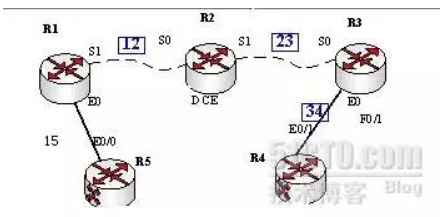
</div>

假设上面 5 台路由器都已经运行 RIP（RIP 版本无所谓，假设为 V1)，R5 的 loopback1上 为 9.9.9.9/24。在网络收敛后，R2 上会看到 R1 发过来的 9.0.0.0 的路由并且开销为 2。如果此时在R1 与 R2 的链路上出了问题，导致不能在无效计时器（默认 180 秒）内发送更新给 R2，那么 R2 会认为 9.0.0.0 这个网络可能不可达了（在路由表里可以看到 9.0.0.0/8 is possibly down），紧接着如果 R2 在另一个接口 S1 上收到 9.0.0.0 这个路由（这条路由的度量值大于先前的度量值 2），那么抑制计时器就会被立即触发，并且开始计时。

一旦计时，R2 会将从任何接口收到的 9.0.0.0 路由更新，不管开销大小，在抑制计时器超时前都会忽略。只有抑制计时器超时后，才会选择一个最佳 9.0.0.0 的路由放在路由表里（也就是直到计时器超时，路由器才可以接受有关此路由的更新信息）。

## 4.ICMP 协议

### 4.1 ICMP 重定向

ICMP 重定向被路由器用于通知主机去往指定目标的网关，是数据链路上的另外一台路由器。

<div align="center">
    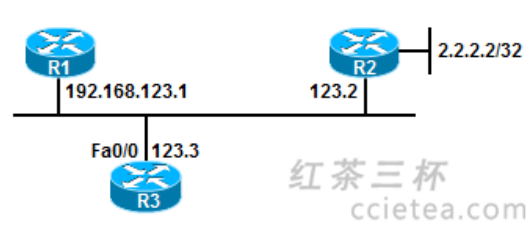
</div>

R3 的网关为 R1，R1 本身又有静态路由到 2.2.2.2，下一跳为 R2，注意这是个 MA 网络，三个接口都是同网段的，这个很关键。R3 将去往 2.2.2.2 时，将数据丢给自己的网关 192.168.123.1，这时 R1 经过路由表查找后，发现数据的下一跳是与本地入接口同一个网段的 123.2，因此他认为 123.2（也就是 R2）比自己距离目标更近。因此 R3 要发送去往 2.2.2.2 的数据包时，应该交给 R2 让其进行转发。

因此给源也就是 R3 发送了一个 ICMP 重定向消息（要求 R1 的以太网接口开启 ip redirects），告诉 R3 所 192.168.123.2 为更优的下一跳，那么 R3 后续的报文将发给 R2。

R1 的配置如下，给 R1 上的路由表添加了一条静态路由，到 2.2.2.0/24 网络的 IP 数据包被转发给 192.168.123.2：
```shell
ip route 2.2.2.0 255.255.255.0 192.168.123.2
```
R3 的配置如下，给 R3 上的路由表添加了一个默认网关，0.0.0.0 表示和任何 IP 地址相匹配，即发往任意网络地址的 IP 数据包都会被转发给 192.168.123.1：
```shell
ip route 0.0.0.0 0.0.0.0 192.168.123.1
```
在 R3 上开启 debug ip icmp，现在 R3 去 ping 2.2.2.2：
```shell
*Mar 1 00:11:47.887: ICMP: redirect rcvd from 192.168.123.1- for 2.2.2.2 use gw 192.168.123.2
*Mar 1 00:11:47.891: ICMP: echo reply rcvd, src 2.2.2.2, dst 192.168.123.3
*Mar 1 00:11:47.951: ICMP: echo reply rcvd, src 2.2.2.2, dst 192.168.123.3
*Mar 1 00:11:47.999: ICMP: echo reply rcvd, src 2.2.2.2, dst 192.168.123.3
*Mar 1 00:11:48.023: ICMP: echo reply rcvd, src 2.2.2.2, dst 192.168.123.3
*Mar 1 00:11:48.043: ICMP: echo reply rcvd, src 2.2.2.2, dst 192.168.123.3
```
另一方面，我们抓包 ICMP 重定向报文可得：

<div align="center">
    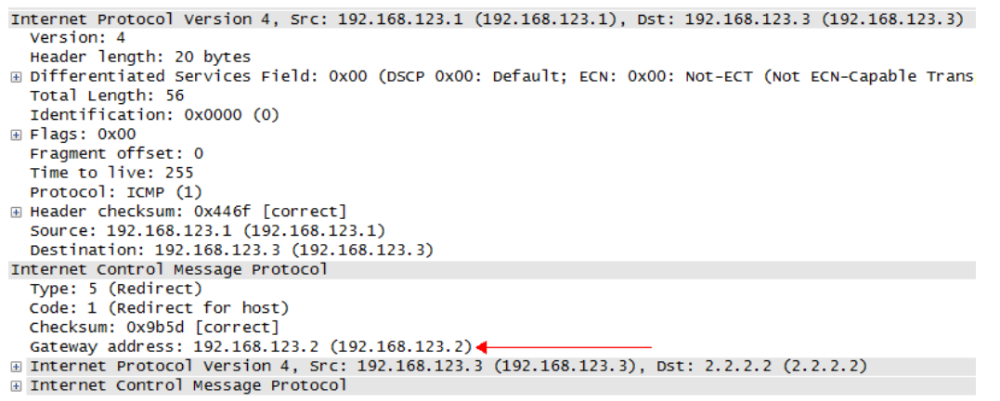
</div>

ICMP 报文是封装在 IP 数据包的载荷（pay load）部分，从第一行可以看出，此 ICMP 重定向报文是 R1 （192.168.123.1）发给 R3 （192.168.123.3）的。并且在 ICMP 报文中的 Gateway address 指明了比自己（R1）距离目的地更近的下一跳 IP（R2）。如果需要关闭 ICMP 重定向，需要在接口上，使用 no ip redirects。

由于我们在 R3 上 Ping 2.2.2.2，这个 Ping 包本身就是一个 ICMP 报文，其结构如下所示。因此当 R1 需要进行重定向时，就会把此 Ping 包的 IP 数据包首部（192.168.123.3->2.2.2.2）和后面 8 个字节（即 ICMP 报文的前 8 个字节）一起作为重定向报文的数据部分。

<div align="center">
    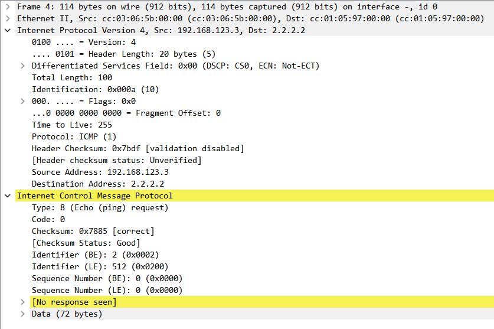
</div>