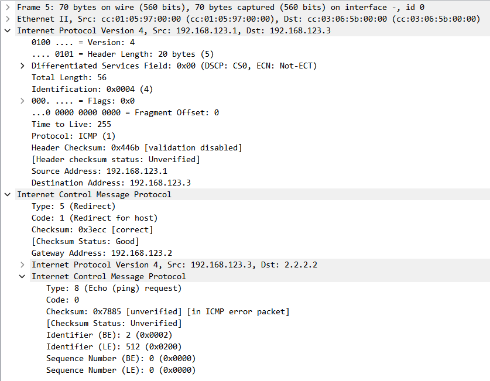

# RIP 路由

## 1.RIP 协议

RIP (Routing Information Protocol，路由信息协议) 是最典型的距离矢量路由协议，常被用于在小型的网络中交互路由信息，它是最先得到广泛使用的 IGP 协议，由于其工作机制相对简单，因此一直以来都作为数通领域入门动态路由技术的协议被大家所熟知。

### 1.1 距离矢量路由选择协议

使用距离矢量路由协议的路由器并不了解网络的拓扑结构。该路由器只知道：

- 自身与目的网络之间的距离
- 应该往哪个方向或者使用哪个接口转发数据包

每台 RIP 路由器都维护着一个 RIP 数据库 (Database)，在该数据库中保存着路由器发现的所有 RIP 路由，**其中包括自己发现的直连路由以及从其他路由器收到的路由**。在RIP数据库中的每个路由条目都包含:目的网络地址/网络掩码、度量值、下一跳地址、老化计时器以及路由状态标识等信息。RIP数据库中的有效路由条目被加载到路由器的全局路由表中。

每台运行 RIP 的路由器周期性地将自己的路由表通告出去，当路由器收到 RIP 路由更新时，如果这些路由是自己并未发现的并且是有效的，则将其加载到路由表，同时设置路由的度量值和下一跳地址。下面详细介绍 RIP 路由协议的技术细节。

**1）路由器的初始启动**

在下图所示的网络中，R1、R2 和 R3 三台路由器直连。在初始情况下，所有的路由器都能自动发现自己的直连路由，并且将直连路由写入路由表。在华为数通产品上，RIP 将直连路由的度量值视为 0 跳，所谓的"0 跳"指的是到达该网段不需要经过任何一台路由器。

<div align="center">
    
</div>

**2）初次交换路由信息**

由于 R1、R2 及 R3 都运行了 RIP，因此它们都将自己路由表中的路由通过 RIP 协议报文周期性地从**所有激活了 RIP 的接口通告出去**(RPv1 使用广播地址作为协议报文的目的P地址，而 RIPv2 则使用组播地址)。**路由器在将自己路由表中的路由通告出去时将跳数加 1**，而收到该路由更新的 RIP 路由器将路由保存到自己路由表时则使用这个度量值。

比如 R2 会将 192.168.23.0/24 这条路由通过 GE0/0/0 这个接口发送出去到 R1，并且将度量值加 1，这说明 R1 要到达此目的地址需要经过 R2 这一跳。R1 在收到路由信息后，使用新的度量值，并将下一跳地址更改为 R2。

<div align="center">
    
</div>

最后经过这一轮的路由学习，R1 会学到 192.168.23.0/24 网络，而 R2 会学习到 1.0.0.1/8 和 3.0.0.3/8 这两个网络，而 R3 会学习到 192.168.12.0/24 的网络。

**3）路由完成收敛**

在下一个更新周期到来时，所有的路由器会再次将自己的路由表通告出去。在这一轮周期结束后，**三台路由器都拥有了到达全网各个网段的路由，而且设备的路由表已经稳定，这被称为"网络中的路由已经完成收敛"**。虽然已经收敛，但是网络中的路由器依然会周期性地将自己的路由表通告出去，确保路由的有效性。

<div align="center">
    
</div>

RIP 是应用及开发较早的路由协议，是典型的距离矢量路由协议，适用于小型网络，最大跳数 15 跳（16 跳视为不可达），另外 RIP 是基于 UDP 的，使用端口号 520。

### 1.2 RIP 路由更新与路由表

从单台 RIP 路由器来看，它只是简单地监听直连的 RIP 路由器所通告的 RIP 路由更新，并且从该更新中发现 RIP 路由，并将学习到的路由加载到路由表中。另一方面，它也将自己路由表中的 RIP 路由通告出去，以便直连的 RIP 路由器能够学习到。

### 1.3 度量值

度量值就是指到达目的网络所需的代价或者成本，不同的路由协议可以定义不同的度量值。例如有的路由协议（RIP）使用到达目的网络沿途需经过的路由器个数作为路由的度量值，而有的协议则基于链路带宽计算路由度量值。度量值的大小将直接影响路由器对到达某个目的网段的路由（或者说路径）的优选。

例如当一台路由器发现两条路径可以到达同一个目的地，并且这两条路由都是通过**同一种路由协议**发现的，那么通常情况下度量值更优的那条路由会被优选，而度量次优的路由则作为备份，**只有当最优路由失效时，次优路由才会被使用**。

RIP 以跳数作为路由的度量值（非负整数），也就是到达目的网络所需要经过的路由器的个数，跳数越少，路由被认为更优。这样就使得路由器能够直观地知道自己距离目的网络的"远近"。

通过跳数来度量到达目的网络的远近确实非常简单和直观，但也有一些缺点。如果网络链路的带宽不同，那么使用跳数度量的路由协议就会出现路径选择不合理的问题，这可能导致选择的路径带宽不足而影响网络性能。

### 1.4 报文类型

RIP 的协议报文采用 UDP 封装，报文的源、目的端口均是 UDP 520 端口。RIP 定义了两种报文，它们分别是请求 (Request) 报文和响应 (Response) 报文。RIPv1 和 RIPv2 在协议报文各个字段的定义中存在些许差异。Request 报文用于向邻居请求全部或部分 RIP 路由信息，而 Response 报文则用于发送 RIP 路由更新，在 Response 报文中携带着路由以及该路由的度量值等信息。

一旦路由器的某个接口激活 RIP 后，该接口立即发送一个 Request 报文和 Response 报文，并开始侦听 RIP 协议报文。**随后接口开始 Response 报文的周期性发送**。RIPv1 使用广播地址 255.255.255.255 作为协议报文的目的 IP 地址，而 RIPv2 则不同，它使用组播 IP 地址 224.0.0.9 作为协议报文的目的 IP 地址。当 RIP 路由器收到 Request 报文后，会使用 Response 报文进行回应，在该报文中携带对方所请求的路由信息。

### 1.5 计时器

RIP 定义了多个计时器，其中最重要的三个计时器如下。

**1.更新计时器（Update Timer）**

该计时器的时间为 RIP 路由器周期性泛洪路由表（周期性在接口上发送 Response 报文）的时间间隔。在缺省情况下，路由器以 30s 为周期从已经激活 RIP 的接口向外发送 Response 报文。

如果一个网络中有多台 RIP 路由器接入，每台路由器所有激活 RIP 的接口如果在更新计时器超时后一齐泛洪 Response 报文，就有可能使得同一时间内网络中充斥着大量的 RIP 广播或组播报文。为了避免这个问题，RIP 引入一个随机的偏移量，**也就是路由器不以严格的 30s 为周期发送 RIP 报文，而是在该时间的基础上关联一个随机的、细小的偏移量（加/减 0~5s）**。

**2.老化计时器（Age Timer）**

当一条 RIP 路由被学习并加载到路由表时，路由器立即为该路由启动老化计时器（缺省 180s），该计时器被启动后即开始计时。此后每当更新周期来临时，当路由器再次收到该条路由的更新时，老化计时器又被重置并重新开始计时。

若一条路由持续未被刷新并最终导致老化计时器超时，路由则变为不可用并从路由表中删除，**虽然被立即从路由表（前面介绍的全局路由表）中删除，但该条路由依然被保存在 RIP 数据库中（以便路由随时能够恢复）**。

**3.垃圾回收计时器（Garbage-Collect Timer）**

在前面老化计时器超时的同时，该路由的垃圾回收计时器也被立即启动。对于老化计时器已超时的失效 RIP 路由，依然会被包含在路由器对外发送的 Response 报文中，只不过路由的度量值被设置为 16 跳，即不可达，来告知其它路由器该网络不可达情况。若连该计时器也超时，则路由便会被彻底删除。

### 1.6 Silent-Interface

在缺省情况下，一旦路由器的某个接口激活了 RIP，RIP 就开始在该接口周期性地发送 Response 报文，同时也在该接口上侦听 RIP 报文。在上图中，为了让 PC 能够访问 192.168.2.0/24，因此必须要在 R1 的接口（GE0/0/1 和 GE0/0/0）上开启 RIP 协议，对于 R2 也是同理。

<div align="center">
    
</div>

这里要注意，**如果一个路由的接口没有开启 RIP 协议，那么该接口的 IP 地址不会通过 RIP 协议通告出去**。这是因为 RIP 协议只会在开启了 RIP 的接口之间进行信息交换，而没有开启 RIP 的接口不会参与 RIP 的路由信息交换过程（这就是为什么需要在 R1 上同时开启 GE0/0/1 和 GE0/0/0）。但是如果开启 GE0/0/1 之后，R1 也会在这个接口上周期性地发送 Response 报文，而 PC 并没有解析 RIP 报文的能力，增加了额外负担。

因此需要可以使用 Silent-Interface 特性来解决，**一个 RIP 接口一旦被指定为 Silent-Interface，则该接口将不再发送 RIP 报文，而只是被动地接收 RIP 报文**。因此，可以在 R1 的 GE0/0/1 接口上配置。另一方面，虽然 GE0/0/1 接口被指定为 Silent--Interface，但是由于该接口已经激活了 RIP，因此当 R1 从其他接口发送 Response 报文时，依然会在报文中携带 192.168.1.0/24 路由信息。

## 2 RIP 的防环机制

### 2.1 环路的产生

距离矢量路由选择协议是周期性地泛洪整张路由表，并且是依照传闻进行更新，逐跳更新。但是这样距离矢量路由选择协议并不知道网络的整个拓扑结构，可能会出现环路，下面举例说明。

<div align="center">
    
</div>

如上图所示，假设 R1 和 R2 之间正常运行 RIP 协议，但是 R1 的 GE0/0/1 接口突然出现故障，网段 1.0.0.0/8 不可达，此时 R1 将 1.0.0.0/8 从路由表中删除，并且准备在 R1 的下一个更新周期到来时通告出去。但此时，R2 更新周期到来，R2 将自己的路由表（包括到达 1.0.0.0/8 的路由）通告给 R1，R1 误以为从 R2 可以到达此网段，因此将其又添加到路由表中，并且将下一跳设置为 R2，度量值加一变成 2，这样环路就产生了。

<div align="center">
    
</div>

此外，由于 RIP 协议会每隔 30s 泛洪一次路由表，因此 1.0.0.0/8 路由会在每个更新周期到来时随着 Response 报文在网络中不停地被泛洪。在 R1 下一次更新周期到来时，R1 将 1.0.0.0/8 发送给 R2，并且将跳数设置为 3 跳，如下图所示，随后 R2 也将 1.0.0.0/8 发送给 R1，并且将度量值加一变为 4 跳，如此反复，1.0.0.0/8 路由的度量值会在不断的泛洪中被更新为无穷大。

<div align="center">
    
</div>

下面介绍 RIP 协议的环路消除机制。

### 2.2 定义最大跳数

在 RIP 协议中，定义跳数的最大值为 15 跳，16 跳表示路由不可用，路由指向的网段不可达，但是这种做法也限制了网络的规模。另外，最大跳数虽然避免了 RIP 路由在网络中被无休止的泛洪，但是却没有解决环路问题。

另外，当路由器 R1 收到一个度量值为 16 的路由时（毒性路由），R1 意识到该路由指明的网段已经不可达，因此将该路由从路由表中移除。但是该路由虽然从路由表中被删除，但是依然将其保存在 RIP 数据库中，同时为其启动垃圾回收计时器，垃圾回收计时器超时之后，就会彻底删除掉。

### 2.3 水平分割（split horizon）

水平分割是距离矢量路由协议的特征之一，它可以防止路由环路。水平分割（Split Horizon） 的原理是，RIP 路由器从某个接口收到的路由，该路由不会再从该接口通告回去。这个机制在很大程度上消除了 RIP 路由的环路隐患。

<div align="center">
    
</div>

如上图所示，R1 直连 1.0.0.0/8 网段，然后当更新周期到来时，R1 将 1.0.0.0/8 网段放入到 Response 报文并发送给 R2 的 GE0/0/0 接口，并且将此网段的跳数增加一（变成 1 跳），随后 R2 将其保存到自己的路由表中。当 R2 更新周期到来时，如果 R2 的 GE0/0/0 接口没有开启水平分割的话，就会把 1.0.0.0/8 发送给 R1（下一跳为 R2），并且再将其跳数增加一，变为 2 跳。但是在 R1 的路由表中，1.0.0.0/8 网段的下一跳为 R1 自身的接口，而不是 R2，并且由于度量值大于 R1 本身保存的 1.0.0.0/8 的度量值 0 跳，因此 R1 直接忽略此路由。但是如果 1.0.0.0/8 网段失效，此时 R1 就会误认为通过 R2 可以达到，有形成环路的风险。

如果 R2 的 GE0/0/0 开启了水平分割，那么当 R2 的更新周期到来时，1.0.0.0/8 就不会被 R2 发送给 R1。水平分割是距离矢量路由协议防环中的重要机制之一。

<div align="center">
    
</div>

### 2.4 毒性路由（route poison）

当路由器检测到其直连的网络出现故障时，它会为该路由发送度量值为 16 的路由更新来通知网络中的路由器，目标网段已经不可达，这种路由被称为毒性路由。收到更新的路由器知道此条路由失效而不再使用它。

<div align="center">
    
</div>

如上图，当 R1 直连的 1.0.0.0/8 路由出现故障时，**R1 将立即发送 Response 报文（触发更新机制使然）用于通告这个更新**，在其发送给 R2 的这个 Response 报文中，包含着 1.0.0.0/8 路由，最重要的是这条路由的度量值被设置为 16。R2 收到这个 Response 报文后，就立即意识到该网段已经不可达了，于是将该路由从路由表中移除。**值得注意的是，R2 虽然将该路由从路由表中删除**，但是依然将其保存在 RIP 数据库中，同时为其启动垃圾回收计时器。

### 2.5 毒性逆转（poison reverse）

毒性逆转的原理是，RIP 从某个接口学到路由后，当它从该接口发送 Response 报文时会携带这些路由，但是这些路由度量值被设置为 16 跳。利用这种方式，可以清除对方路由表中的无用路由。毒性逆转也可以防止产生路由环路。

<div align="center">
    
</div>

在上图中，R1 及 R2 两台路由器运行了 RIP，彼此开始交互 RIP 路由。R1 将路由 1.0.0.0/8 通过 RIP 通告给 R2。如果 R2 激活毒性逆转，那么当它从 GE0/0/0 接口周期性发送 Response 报文时，报文中会包含从该接口学习到的 l.0.0.0/8 路由，但是路由的度量值被设置为 16 跳。

毒性逆转的思路是这样，由于 R2 到达 1.0.0.0/8 是从 R1 获知的，那么就说明 R1 不会从 R2 到达 1.0.0.0/8。因为这样的话，R1 中 1.0.0.0/8 的下一跳地址为 R2（R1 从 R2 到达），而 R2 上 1.0.0.0/8 的下一跳地址为 R1（R2 从 R1 获知），这样就形成了环路。因此"**既然这条路由是 R1 给我的，那么 R1 就不可能从我这里到达该网段，所以我就告诉 R1，这个网络从我这走是不可达的**"。这条不可达路由可以彻底杜绝 R1 误认为从 R2 可以到达 1.0.0.0/8 从而出现环路的可能性。 

### 2.6 触发更新（trigger update）

据前文所述，路由器会在激活了 RIP 的接口上周期性地发送 Response 报文，在缺省情况下，RIP 会以 30s 为周期进行报文发送，这在网络稳定的情况下是没有问题的，但是一旦拓扑出现变更，如果依然要等待下一个更新周期到来才发送路由更新，这显然是不合理的，而且也非常容易引发路由环路。

触发更新机制指的是， **当路由器感知到拓扑发生变更或 RIP 路由度量值变更时**， 它无需等待下一个更新周期到来即可立即发送 Response 报文。注意，当路由感知到拓扑发生变化，比如出现新的网段以及旧网段失效，都会立即发送 Response 报文；当到某网段的度量值发生变化时，也会立即发送 Response 报文。

最后总结一下，当一个路由器 R1 发现其直连的网段 N 失效时，**会进行触发更新，立即发送一个 Response 报文通告这个更新**，并且将度量值设置为 16（毒性路由），并且该路由从 R1 的路由表中删除，但是还是保存到 R1 的 RIP 数据库中，并且启动垃圾回收计时器，在 R1 周期性更新时，此路由仍然包含在 Response 报文中，但是度量值为 16，直到垃圾回收计时器超时，此路由会被彻底删除。

R2 收到这个 Response 报文后，就立即意识到网段 N 已经不可达了（度量值为 16），于是将该路由从路由表中移除。**值得注意的是，R2 虽然将该路由从路由表中删除**，但是依然将其保存在 RIP 数据库中，同时为其启动垃圾回收计时器。

## 4.RIPv2

### 4.1 RIPv1 不支持 VLSM

RFC 1058 描述了 RIPv1，RIPv1 是一个典型的有类路由协议(Classful Routing Protocol)。RIPv1 不支持 VLSM，其 Response 报文中所携带的路由信息只有 IP 地址 (目的网络地址) 而没有目的网络掩码，这就使得 RIPv1 在部署了 VLSM 的网络中工作时会出现问题。

比如自动汇总的问题，即在不连续的主类网络中使用 RIPv1 时，RIPv1 会自动汇总同一主类网络的路由信息。**这意味着，在不同的子网中如果使用相同的主类网络号，RIPv1 会将它们汇总为同一个路由**。这将导致在不连续的主类网络中，可能会使不同的子网被视为相同的路由，导致路由环路或路由错误。下面举例说明。

<div align="center">
    
</div>

在上图中展示了一个 VLSM 网络，R1 连接着主类网络 172.16.0.0 的一个子网 172.16.1.0/24，而 R3 则连接着另外一个子网 172.16.3.0/24，并且 B 类网络 172.16.0.0 被两个 C 类网络 192.168.12.0/24 和 192.168.23.0/24 隔开，这种网络又被称为"不连续的主类网络"。现在 R1、R2 和 R3 上都运行 RIPv1 协议，**而如果 RIPv1 路由器处于主类网络边界，当它将一个主类网络的子网路由通告到另一个主类网络时，会将前者自动汇总成主类路由进行通告**。

在上图中，R1 处于主类网络 172.16.0.0/16 及 192.168.12.0/24 的边界，因此当它向
192.168.12.0/24 网络通告 172.16.1.0/24 这个子网路由时，会将该子网路由汇总成主类路由：172.16.0.0（注意 R1 将该路由通过 Response 报文通告给 R2 时是不携带目的网络掩码的）。R2 收到这条路由更新后，为 172.16.0.0 附上该地址的缺省掩码，也就是 255.255.0.0，因此最终 R2 将 172.16.0.0/16 路由加载到路由表中，该路由的下一跳为 R1。

由于 R1 及 R3 都处于主类网络边界，因此它们向 R2 发送的 Response 报文都将包含 172.16.0.0 路由（都执行自动汇总），**这将使得 R2 将这两条路由都加载到路由表中，如此一来，R2 的路由表中的 172.16.0.0/16 路由将在 R1 及 R3 这两个下一跳执行等价负载分担**。这造成的一个直接结果是 R2 转发到达 172.16.3.0/24 的数据包时，有可能会将其送往 R1 从而导致通信故障。

这就是 RIPv1 面对不连续的主类网络时存在的问题。解决这个问题的方法有几个，最为推荐的方法是使用 RIPv2 而不是 RIPv1。

### 4.2 报文认证

RIPv2 支持报文认证，而 RIPv1 不支持报文认证，它只会对接收到的 Response 报文进行简单的校验，比如检查报文的源 IP 地址是不是与自己接口的 IP 地址是否位于同一网段。这样就存在一定的安全隐患。

<div align="center">
    
</div>

如上图所示，R1 与 R2 之间运行 RIP 路由协议，并互相发送路由表信息。但此时一个攻击者 R3 连接到交换机上，并开始泛洪 Response 报文，这些 Response 报文中包含大量伪造的 RIP 路由，这将造成 R1 及 R2 的路由出现紊乱，或者路由表被大量垃圾路由填充，设备资源也将被大量消耗。

RIPv2 给出了解决方案: RIP 报文认证。通过在 R1 及 R2 的接口上激活 RIP 认证并在两端配置相同的认证口令，可使 RIP 报文的交互更为安全，**只有当接口上收到的 RIP 报文中相关认证字段匹配本地配置的认证口令，该报文才被认为是有效的**，否则被认为是非法报文并被丢弃。

### 4.3 下一跳字段

RIPv2 定义了"下一跳"字段，使得路由器在多路访问网络上可以避免次优路径现象。在下图中，R1、R2 及 R3 连接在同一台以太网交换机上，R1、R3 运行 RIPv2 协议，但是 R2 不支持 RIP，因此为了使 R1 能访问 2.0.0.0/8 网段，我们可以在 R1 上配置静态路由：ip route-static 2.0.0.0/8 192.168.123.2。

之后，R1 会将此路由通过定期更新发送给 R3，但是 R3 学习到此路由之后，将下一跳设置为 R1，这显然不是最优方案。因此 RIPv2 定义了"下一跳"字段，当 R1 将 2.0.0.0/8 的路由发送给 R3 时，Response 报文除了携带该路由的目的网络地址、目的网络掩码、度量值，还会设置"下一跳"字段，该字段的值为 192.168.123.2（即静态路由中的下一跳）。R3 收到该路由之后便会将 R2 设置为下一跳地址。

<div align="center">
    
</div>

**不过在大多数情况下，当 RIP 路由器发送路由更新时，路由的"下一跳"字段为 0.0.0.0**，其他 RIP 路由器接收该路由更新后，将路由的通告者视为到达目的网段的下一跳。

### 4.4 路由汇总

RIP 支持路由自动汇总，所谓路由自动汇总指的是**如果 RIP 路由器处于主类网络边界，当它将一个主类网络的子网络由通告到另一个主类网络时，自动将该子网络由汇总成主类网络路由**，只将主类网络路由通告给直连 RIP 路由器的行为。

RIPv1 及 RIPv2 对于路由自动汇总的支持情况有所不同：

- 在 RIPv1 中，路由自动汇总功能缺省已被激活，而且不能被关闭；
- 在 RIPv2 中，路由自动汇总功能缺省已被激活，但是可以通过命令关闭。

<div align="center">
    
</div>

以 RIPv2 为例，我们看看路由自动汇总的执行过程。R1 及 R2 运行了 RIPv2，R1 激活了 RIP 路由自动汇总功能，显然 R1 处于两个主类网络的边界（B 类主网 172.16.0.0/16 和 C 类主网 10.0.0.0/8），因此当其向 R2 通告 172.16.0.0/16 的子网路由时，R1 将会执行路由自动汇总，将这些明细路由汇总成主类网络路由 172.16.0.0/16 通告给 R2。

**RIP 路由自动汇总对本地始发的 RIP 路由生效，也对其他路由器通告的 RIP 路由生效**。如下图所示，如果在 R1 上关闭自动汇总功能，而 R2 激活该功能，则 R1 将向 R2 通告所有明细路由，R2 收到这些路由后，加载到自己的路由表。当其向 R3 通告这些路由时，由于激活了路由自动汇总功能，因此它仅向 R3 通告汇总路由 172.16.0.0/16。

<div align="center">
    
</div>

值得注意的是， RIP 路由自动汇总只能将明细路由汇总成主类网络路由，这在某些场景下会存在"颗粒度过大"的问题。为了解决这个问题，我们可以通过手工汇总来指定 RIP 通告的精确汇总路由。手工汇总的方式可以自定义汇总路由的目的网络地址及网络掩码，而不受地址类别的限制。

## 5.ICMP 协议

### 5.1 ICMP 重定向

ICMP 重定向被路由器用于通知主机去往指定目标的网关，是数据链路上的另外一台路由器。

<div align="center">
    
</div>

R3 的网关为 R1，R1 本身又有静态路由到 2.2.2.2，下一跳为 R2，注意这是个 MA 网络，三个接口都是同网段的，这个很关键。R3 将去往 2.2.2.2 时，将数据丢给自己的网关 192.168.123.1，这时 R1 经过路由表查找后，发现数据的下一跳是与本地入接口同一个网段的 123.2，因此他认为 123.2（也就是 R2）比自己距离目标更近。因此 R3 要发送去往 2.2.2.2 的数据包时，应该交给 R2 让其进行转发。

因此给源也就是 R3 发送了一个 ICMP 重定向消息（要求 R1 的以太网接口开启 ip redirects），告诉 R3 所 192.168.123.2 为更优的下一跳，那么 R3 后续的报文将发给 R2。

R1 的配置如下，给 R1 上的路由表添加了一条静态路由，到 2.2.2.0/24 网络的 IP 数据包被转发给 192.168.123.2：
```shell
ip route 2.2.2.0 255.255.255.0 192.168.123.2
```
R3 的配置如下，给 R3 上的路由表添加了一个默认网关，0.0.0.0 表示和任何 IP 地址相匹配，即发往任意网络地址的 IP 数据包都会被转发给 192.168.123.1：
```shell
ip route 0.0.0.0 0.0.0.0 192.168.123.1
```
在 R3 上开启 debug ip icmp，现在 R3 去 ping 2.2.2.2：
```shell
*Mar 1 00:11:47.887: ICMP: redirect rcvd from 192.168.123.1- for 2.2.2.2 use gw 192.168.123.2
*Mar 1 00:11:47.891: ICMP: echo reply rcvd, src 2.2.2.2, dst 192.168.123.3
*Mar 1 00:11:47.951: ICMP: echo reply rcvd, src 2.2.2.2, dst 192.168.123.3
*Mar 1 00:11:47.999: ICMP: echo reply rcvd, src 2.2.2.2, dst 192.168.123.3
*Mar 1 00:11:48.023: ICMP: echo reply rcvd, src 2.2.2.2, dst 192.168.123.3
*Mar 1 00:11:48.043: ICMP: echo reply rcvd, src 2.2.2.2, dst 192.168.123.3
```
另一方面，我们抓包 ICMP 重定向报文可得：

<div align="center">
    
</div>

ICMP 报文是封装在 IP 数据包的载荷（pay load）部分，从第一行可以看出，此 ICMP 重定向报文是 R1 （192.168.123.1）发给 R3 （192.168.123.3）的。并且在 ICMP 报文中的 Gateway address 指明了比自己（R1）距离目的地更近的下一跳 IP（R2）。如果需要关闭 ICMP 重定向，需要在接口上，使用 no ip redirects。

由于我们在 R3 上 Ping 2.2.2.2，这个 Ping 包本身就是一个 ICMP 报文，其结构如下所示。因此当 R1 需要进行重定向时，就会把此 Ping 包的 IP 数据包首部（192.168.123.3->2.2.2.2）和后面 8 个字节（即 ICMP 报文的前 8 个字节）一起作为重定向报文的数据部分。

<div align="center">
    
</div>