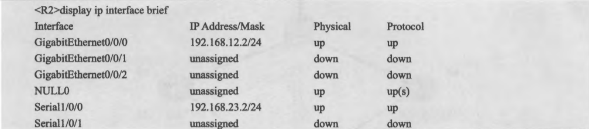
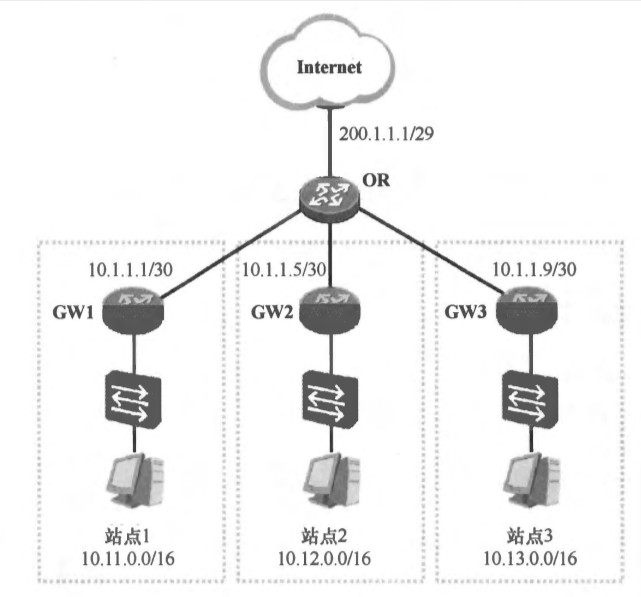

# 路由基础

## 1. IP 路由概述

### 1.1 关于 IP 路由

在一个 IP 网络中，路由(Routing)是个非常基本的概念。网络的基本功能，就是使得处于网络中的两个 IP 节点能够进行通信，而通信实际上就是数据交互的过程，数据交互则需要网络设备帮助我们来将数据在两个通信节点之间进行传输。

当路由器（或者其他三层设备）收到一个 IP 数据包，路由器会找出 IP 包三层头中的目的 IP 地址，然后拿着目的 IP 地址到自己的路由表中进行查找，找到"最匹配"的条目后，将数据包根据路由条目所指示的出接口或下一跳 IP 转发出去，这就是 IP 路由（IP routing）。

而每台路由器都会在本地维护一个路由表（Routing Table），路由表中装载着路由器获知的路由条目（Routes），路由条目由路由前缀（路由所关联的目的地)路由信息来源、出接口或下一跳 IP 等元素构成。路由器通过静态的或者动态的方式获取路由条目并维护自己的路由表。

### 1.2 IP 路由表（IP Routing Table）

任何一台支持路由功能的设备要想正确地执行路由查询及数据转发的操作，就必须维护一张路由表。在具备路由功能的华为数据通信产品上查看路由表的命令是 **display ip routingtable**。下图展示了一个路由表的示例，路由表中的每一行就是一个路由条目（或者路由表项)。每个路由条目都采用目的网络地址 (Destination Network Address) 及网络掩码 (Netmask) 进行标识。从路由表的输出可以看出，每个路由条目都包括多个信息元素。

<div align="center">
    
</div>

路由表中每个信息元素的含义如下：

- **目标网络地址/网络掩码**：每一条路由都指向网络中的某个目的网络（或者说目的网段)。目的网络的网络地址(目的网络地址)及网络掩码(路由表中的 "Destination/Mask" 列)用于标识一条路由。在上图中，2.2.2.0/24 就标识了一个目的网络，其中目的网络地址为 2.2.2.0，掩码长度为24 (或者说网络掩码为255.255.255.0)。
- **路由协议**：表示该路由的协议类型,或者该路由是通过什么途径学习到的。路由表中的“Proto”列显示了该信息。
- **优先级**：路由表中路由条目的获取来源有多种，每种类型的路由对应不同的优先级，路由优先级的值越小则该路由的优先级越高。路由表中的 "Pre" 列显示了该条路由的优先级。当一台路由器同时从多种不同的来源学习到去往同一个目的网段的路由时，它将选择优先级值最小的那条路由。
- **开销**：Cost 指示了本路由器到达目的网段的代价值，在许多场合它也被称为度量值 (Metric)，度量值的大小会影响到路由的优选。在华为路由器的路由表中，"Cost" 列显示的就是该条路由的度量值。直连路由及静态路由缺省的度量值为 0。
- **下一跳**：该信息描述的是路由器转发到达目的网段的数据包所使用的下一跳地址。
- **出接口**：指示的是数据包被路由后离开本路由器的接口。

### 1.3 路由信息的来源

路由信息的来源有以下三种：

- 直连路由：路由器的直连接口所在的网络
- 静态路由：手工为路由器配置的路由条目
- 动态路由：路由器动态学习到的路由

在路由表中的 Proto 列显示了该条路由是从什么来源获取到的。

#### 1.3.1. 直连路由

<div align="center">
    
</div>

路由器能够自动获取本设备直连接口的路由并将路由写入路由表，该种路由被称为直连路由 (Direct Route)，直连路由的目的网络一定是路由器自身某个接口所在的网络。直连路由的发现是路由器自动完成的，无需人为干预。直连路由的协议类型为 Direct。另外路由优先级为 0（直连路由的优先级最高），度量值也为 0 (直连网络就在"家门口"，因此度量值为0)。上图 R2 路由器直接相连的 192.168.12.0/24 和 192.168.23.0/24 这两个网络被添加到 R2 的路由表中。

<div align="center">
    
</div>

值得注意的是，一个接口的直连路由被加载到路由表的前提是该接口的物理状态 (Physical Status) 及协议状态 (Protocol Status) 都必须是 Up 的。接口的物理及协议状态可以通过 **display ip interface brief**来查看。

以上输出的就是 R2 各个接口的 IP 地址、物理状态及协议状态。以 R2 的 Serial1/0/0 接口为例，如果该接口所连接的线缆被拔除，则接口的物理及协议状态都将变成 Down (关闭)，此时接口的直连路由也就从 R2 的路由表中消失。现在考虑另一种情况，如果 R2 及 R3 采用 PPP(Point-to-Point Protocol），点对点协议) 链路互联，即 R2 的 Serial0/0/0 与 R3 的 Serial1/0/0 接口均采用 PPP 作为数据链路层封装协议，并且这段链路使用 PPP 认证，R3 作为 PPP 认证方，若此时 R2 接口上配置的用于 PPP 认证的用户名或密码有误，就会导致 PPP 认证不成功，这样一来 R2 及 R3 的 Serial 1/0/0 接口就会出现物理状态为 Up 但是协议状态为 Down 的情况。当出现这种情况时，路由器认为该接口不可用，当然，该接口的直连路由也就不会出现在路由表中。

#### 1.3.2 静态路由

<div align="center">
    
</div>

手工为路由器添加路由条目

#### 1.3.3 动态路由协议

<div align="center">
    
</div>

通过在路由器上运行动态路由协议，使得路由器之间能够交互"用于路由计算的信息"，从而路由器动态的"学习"到网络中的路由。

动态路由协议按照工作区域可以分为如下两类：
- IGP（Interior Gateway Protocols）内部网关协议：RIP、OSPF、EIGRP、ISIS
- EGP（Exterior Gateway Protocols）外部网关协议：BGP

按照工作机制以及算法可以分为如下两类：
- 距离矢量路由协议（Distance Vector Routing Protocols）:RIP、IGRP、EIGRP
- 链路状态路由协议（Link-State Routing Protocol）：OSPF、ISIS

### 1.4 路由的优先级

路由器可以通过多种途径获知路由条目：如静态手工配置、各种动态路由协议等等。当路由器从两种不用的途径获知去往同一个目的地的两条路由，那么路由器会比较这两条路由的优先级，优选优先级比较小的路由。如果优先级相等，例如是同种路由协议，则进一步比较 metric 度量值。

如下图所示，R2 同时运行 RIPv2 协议和 OSPF 协议，它收到了 R1 和 R3 发送给它的到 10.1.1.0/24 这个网络的路由，但是 R2 只选取其中优先级比较小的（协议不同，路由中的 metric 度量比较无意义），又因为 RIPv2 的度量值为 120，而 OSPF 的度量值为 110，因此选择 R3 给出的路由。

<div align="center">
    
</div>

总结如下：

- 一台路由器，当它从两种不同的动态路由选择协议中，学习到去往同一个目的地的路由，比较优先级，取信小的，将路由装入路由表，进行数据转发；**另外一条路径，只有当优选的路径 DOWN 掉的时候，才会出现和使用**。
- 一台路由器，当它从同种动态路由协议，但不同方向（邻居）学习去往同一个目的地的路由，则比较 metric 度量值，选择优的，装入路由表，进行数据转发使用。

### 1.5 路由的度量值

影响路由优选的因素除了路由优先级之外，还有一个重要的因素，那就是度量值 (Metric)。路由表中"Cost"这一列显示的就是该条路由的度量值，因此度量值也被称为开销。所谓度量值就是设备到达目的网络的代价值。直连路由的度量值为 0。另外，静态路由的度量值缺省也为 0，而不同的动态路由协议定义的度量值是不同的，例如 RIP 路由是以跳数（到达目的网络所需经过的路由器的个数）作为度量值，而 OSPF 则以开销（与链路带宽有关）作为度量值。

## 2. 静态路由

### 2.1 什么是静态路由

<div align="center">
    
</div>

PC 要出外网，将数据丢给自己的网关 GW，可是网关除了自己本地直连的路由外，并不知道远程的网络（没有路由）。可以在 GW 上，通过手工配置的方式为其创建静态路由，"告诉" GW 去往远端网络的路径。静态路由有如下特点：
- 需要通过手工的方式进行添加及维护
- 适用于组网规模较小的场景，如果网络规模较大，则配置及维护的成本就会很高
- 无法根据拓扑的变化进行动态的响应（各厂商开发了扩展特性，以便弥补静态路由在这点上的不足）
- 在大型的网络中，往往采用动、静态路由结合的方式进行部署

### 2.2 静态路由配置须知

在华为的数通产品中，我们可以在设备的系统视图中使用 ip route-static 命令来为设备添加静态路由，在该命令中需要指定静态路由的目的网络地址、网络掩码（或者掩码长度）、下一跳 IP 地址以及出接口等信息。针对不同的出接口类型，静态路由的配置要求是不同的。

<div align="center">
    
</div>

**（1）如果出接口类型为 BMA（Broadcast Multiple Access，广播型多路访问）类型，则静态路由需要指定下一跳 IP 地址**。

以太网接口就是一种非常典型的 BMA 类型的接口，BMA 接口接入一个广播网络，该网络中往往还同时接入了多台设备，因此如果仅仅为静态路由指定出接口，那么路由器将无法判断究竟该将数据包发往哪一个下一跳设备。在上图中，R1 及 R2 通过 GE0/0/0 接口连接到一台以太网交换机上，现在我们要为 R1 配置一条到达2.2.2.0/24 的静态路由，由于 R1 的出接口 GE0/0/0 是一个BMA 接口，**因此根据要求必须在该静态路由中指定下一跳 IP 地址**，所以可以使用如下配置：

```shell
[R1]ip route-static 2.2.2.0 255.255.255.0 GigabitEthernet0/0/0 10.1.12.2
```
或者如下配置：
```shell
[R1]ip route-static 2.2.2.0 255.255.255.0 10.1.12.2
```

以上两种方式都指定了具体的下一跳 IP 地址，因此都是可行的。而如果将静态路由改写为：
```shell
[R1]ip route-static 2.2.2.0 255.255.255.0 GigabitEthernet0/0/0
```

那么 R1 可能就无法到达 2.2.2.0/24 了，正如上面所说，它并不知道要将到达该网段的报文转发给哪一个下一跳设备。因为只配置出接口的话，**R1 会认为 2.2.2.0/24 这个网段从自己的 GE0/0/0 接口出去即可到达，换句话说，R1 认为该目标网段是 GE0/0/0 接口的直连网段**，加上该接口是一个 BMA 接口，因此，当R1 转发到达 2.2.2.0/24 的数据包时（例如到达 2.2.2.2），会从该接口广播 ARP Request 报文，用于查询处于本地直连网段中的（至少 R1 是这么认为的）2.2.2.2 的 MAC 地址。R2 会收到这个 ARP Request，缺省情况下它是不会回应的，毕竟 R2 的 GE0/0/0 接口的 IP 地址不是 2.2.2.2。

所以，此时 R1 无法将目的 IP 地址为 2.2.2.2 的数据包转发出去（因为它无法获得关于 2.2.2.2 的 MAC 地址）。这也是为什么要求当静态路由的出接口为 BMA 接口时必须为该路由指定下一跳 IP 地址的原因。当然在这个场景中可以通过一个小伎俩来解决 R1 配置了上述静态路由后到 2.2.2.0/24 不可达的问题，那就是在 R2 的 GE0/0/0 接口上激活 ARP 代理 (ARP-Proxy) 功能：

```shell
[R2]interface GigabitEthernet0/0/0 
[R2-GigabitEthernet0/0/0]arp-proxy enable
```

R2 完成上述配置后，它的 GE0/0/0 接口即激活了 ARP 代理功能，当该接口再收到 R1 发送的、用于请求2.2.2.2 的 ARP Request 时，由于 R2 自己直连着 2.2.2.0/24 网段，**因此它将回应这个 ARP Request，并且以自己的 GE0/0/0 接口的 MAC 地址（替代 2.2.2.2 对应的真实 MAC 地址）进行回应**，如此一来，R1 会在其 ARP 表中创建一个表项，将 IP 地址 2.2.2.2 与 R2 的 GE0/0/0 接口的 MAC 地址进行绑定。此时，当 R1 转发到达 2.2.2.2 的数据时，它将数据帧的目的 MAC 地址设置为 R2 的 GE0/0/0 接口 MAC，然后发送出去，R2 收到这个数据帧后，将其转发到目的地。

**（2）如果出接口的类型为 P2P（Point-to-Point，点对点）类型，则静态路由仅需指定出接口**。

P2P 类型的接口仅与一台设备对接。在上图中，R1 安装了一个广域网接口卡，并通过该接口卡上的广域网接口 Serial1/0/0 与 R4 直连，链路两端的接口均采用 PPP 封装，因此 R1 的 Serial1/0/0 是一个典型的 P2P 接口。此时要为 R1 配置一条静态路由，使其能够到达 4.4.4.0/24，那么 R1 可以采用如下配置:

```shell
[R1]ip route-static 4.4.4.0 24 Serial 1/0/0
```

**（3）如果出接口为 NBMA (Non-Broadcast Multiple Access，非广播多路访问）类型，则静态路由需指定下一跳 IP 地址**。

采用帧中继 (Frame Relay) 封装的接口是一种典型的 NBMA 类型接口，这种接口同样能够连接一台或多台设备，但是并不支持广播。拥有帧中继接口的路由器维护着一张帧中继映射表，用于存储帧中继链路对端设备的 IP 地址及本地 DLCI (Data LinkConnection Identifier，数据链路连接标识) 的对应关系。

当路由器要通过帧中继接口向链路对端的某台路由器发送数据时，路由器在帧中继映射表中查询下一跳 IP 地址(帧中继链路对端的设备 IP 地址)及 DLCI 的映射，并为数据包进行帧中继的封装，在帧头中写入 DLCI 号，数据包被送入帧中继网络后，DLCI 号用于确保数据能够顺利到达对端。

综上，由于路由器使用的帧中继接口可以连接多台设备，而且在通过帧中继接口发送数据时，需要用到数据包下一跳 IP 地址对应的 DLCI，因此在为其配置静态路由时，如果出接口类型为 NBMA，则必须指定下一跳 IP 地址。

### 2.3 缺省路由（默认路由）

<div align="center">
    
</div>

在上图中，GW1、GW2、GW3 是该企业各个站点的网关路由器，这些路由器各下联一台以太网交换机，同时上联出口路由器 OR。以太网交换机连接着终端用户，出口路由器则连接着Internet。在该场景中，以 OR 为例，由于其连接着 Internet，是整个网络的出口，因此它将负责把内网到达 Internet 的数据包转发出去。

不过网络管理员不太可能在 OR 路由器上配置到达 Internet 每一个网段的明细（因为网段实在是太多了）。在这个场景下，**可以使用默认路由（Default Route，也称为缺省路由），是目的网络地址以及网络掩码均为 0 的路由，即 0.0.0.0/0 或者 0.0.0.0 0.0.0.0。这是一条非常特殊的路由，所有的目的 IP 地址都能被这条路由匹配**。

当各个站点想要访问互联网时，数据包被各自的网关路由器转发给 OR 路由器，最后匹配 OR 上的默认路由被转发到互联网。默认路由的匹配优先级实际上是最低的，**如果路由表中存在默认路由，则只有当路由器没有发现匹配报文目的 IP 地址的任何具体路由之后，才会使用这条默认路由来转发数据**，因此默认路由的下一跳又被视为"最后的求助对象"。

### 2.4 Loopback 接口

<div align="center">
    
</div>

Loopback 接口，也叫环回口，是一个逻辑的、虚拟的接口。在上图中，分别给 R1 和 R3 配置了 Loopback 接口，因此 R1 可以看成通过 S0/0 接口连接到 192.168.12.0/24 网段，也通过 Looback0 接口连接到 1.1.1.0/24 网段。我们可以使用全局配置命令 interface loopback 加上接口编号可创建一个 Loopback 接口，创建完成后即可为接口配置 IP 地址。Loopback 接口在手工创建后，除非人为 shutdown，否则不会 down 掉。配置命令如下所示：

```shell
R1(config)#Interface loopback 0
R1(config-if)#ip address 1.1.1.1 255.255.255.0
```
Loopback接口常用于：
- 模拟路由器的直连网段，可用于测试；
- 可用于设备管理（Loopback 接口比较稳定）；
- 供其他协议使用，例如 OSPF、BGP、MPLS 等；
- SNMP Traps 消息的源地址；
- 其他用途（Loopback 接口的用途十分广泛）。

最后再介绍一下路由器中常用的命令：

- ping：测试连通性
- traceroute：追踪到达目标沿途中的每一跳
- show ip route：显示路由表
- show ip interface brief：接口信息摘要
- show cdp neighbors detail：用于收集 CDP 邻居信息

### 2.5 浮动静态路由

<div align="center">
    
</div>

对于 R2 来说，要去往 10.9.9.0/24，通过 R1 以及 R3 都可达。R2 配置了如下的静态路由：

```shell
[R2]ip route-static 10.9.9.0 24 10.1.12.1
[R2]ip route-static 10.9.9.0 24 10.1.23.3
```
以上配置的两条静态路由的目的网络和掩码长度都相同，并且下一跳地址也不同，在这时，R2 会比较这两条路由的优先级，由于这两条路由都是静态路由，优先级均为 60，度量值也都为 0，因此这两条路由会被同时加载到 R2 的路由表。

**这种现象被称为路由的等价负载分担。最终的结果是，R2 转发到达 10.9.9.0/24 的流量时，有可能会同时采用 R1 及 R3 作为下一跳**。负载分担带来的利好是路由器能够在多条路径上进行流量的分担，从而避免某条链路带宽消耗过大而其他链路空载的情况，提高了链路的利用率。但是在某些情况下，我们可能会希望 R2发往 10.9.9.0/24 的流量始终走单边(如 R1)，当 R1 宕机或 R1-R2 之间的互联链路发生故障时，R2 能够自动将流量切换到 R3，这该如何实现？

通过部署浮动静态路由（Floating Static Route）可以轻松地实现上述需求。如下所示：

```shell
[R2]ip route-static10.9.9.02410.1.12.1 #该路由的优先级为缺省值60
[R2]ip route-static 10.9.9.0 24 10.1.23.3 preference 80 #该路由的优先级被设置为80
```

<div align="center">
    
</div>

通过上述配置，第一条路由（优先级值较小的路由）将最终被加载到路由表并作为数据转发的依据，另一条优先级为 80 的路由则"潜藏"起来，并不出现在路由表中。因此报文始终被转发给 R1，当 R1 宕机或者 R1-R2 之间的链路发生故障时，第一条静态路由失效，第二条静态路由浮现出来，如上图所示。所以浮动静态路由是一种不错的路由备份机制，在某种程度上提高了静态路由的灵活度和网络的容错性。

## 3.案例解析

### 3.1 案例一 静态路由与 BFD 联动

<div align="center">
    
</div>

静态路由配置起来非常方便、简单，不过短板就是无法根据拓扑的变化作出动态响应。在上图中，R2通过以太网链路分别连接到出口路由器 R1 及 R3。在 R1 与 R2 之间隔着一台以太网交换机 SW2，这台以太网交换机不做任何配置，在该网络中仅发挥数据帧透传的作用。

现在我们的需求就是 R2 能够访问 10.9.9.4/24，而且在网络正常时，R2 将到达 10.9.9.4/24 的数据包转发给 R1，而且当 R1 发生故障时，或者 R1 与 R2 之间的某段链路发生故障时，R2 自动将到达该网段的数据包转发给 R3。为了实现网络故障时路径的自动切换，我们可以使用浮动静态路由，如下所示：

```shell
[R2]ip route-static 10.9.9.0 24 10.1.12.1 
[R2]ip route-static 10.9.9.0 24 10.1.23.3 preference 80
```

但是，当 R2 的 GE0/0/0 接口发生故障或者 R2 与 SW2 之间的链路发生故障时，R2 可以感知到。这时 **ip route-static 10.9.9.0 24 10.1.12.1** 这条路由被删除，而备用的 **ip route-static 10.9.9.0 24 10.1.23.3 preference 80** 路由被添加到路由表中，实现了路径的切换。但是当 R1 的 GE0/0/0 接口或者 R1 至 SW2 之间的链路出现故障时，R2 无法感知到，这样即使 R1 已经失效，**ip route-static 10.9.9.0 24 10.1.12.1** 路由仍然保存在 R2 的路由表中，数据包还是发往 R1（会被丢弃），无法实现路径的平滑切换。而根本原因就是静态路由无法感知网络拓扑的变化。

在上图中，可以在 R1 及 R2 上部署 BFD 来检测双方直连接口的 IP 连通性。BFD 在 R1 及 R2 之间开始工作后，两者便会周期性地交互 BFD 报文，当 R1 及 R2 之间的连通性产生问题时，双方的BFD 报文交互也将发生问题，此时 R1 及 R2 都能通过 BFD 感知到网络的变化。

而当我们在 R2 上配置静态路由时，**可将下一跳为 R1 的去往 10.9.9.0 网络的静态路由与 BFD 进行联动**，当 BFD 的检测状态为 Up 时，这条静态路由能够正常工作，而当 BFD 检测状态为 Down 时，与之关联的静态路由会立即失效，从而使得备份路由能够浮现。

R1 上的 BFD 配置如下所示：

```shell
#激活 BFD 功能：
[R1]bfd 
[R1-bfd]quit 

#创建一个 BFD 会话，会话名称为 ab(该名称可自定义)，对端 IP 地址为 10.1.12.2：
#BFD 会话的名称只在本地有意义，双方无需相同
[R1]bfd ab bind peer-ip 10.1.12.2 
[R1-bfd-session-ab]discriminator local 10 #该 BFD 会话的本地标识符 
[R1-bfd-session-ab]discriminator remote 20 #该 BFD 会话的远端标识符 
[R1-bfd-session-ab]commit #提交配置
```

R2 上的 BFD 配置如下所示：

```shell
[R2]bfd 
[R2-bfd]quit 

[R2]bfd ba bind peer-ip 10.1.12.1 
[R2-bfd-session-ba]discriminator local 20 
[R2-bfd-session-ba]discriminator remote 10 
[R2-bfd-session-ba]commit 
[R2-bfd-session-ba]quit 
#将下一跳为R1的静态路由与BFD会话ba进行联动:
[R2]ip route-static 10.9.9.0 24 10.1.12.1 track bfd-session ba 
#配置浮动静态路由，下一跳为R3:
[R2]ip route-static 10.9.9.0 24 10.1.23.3 preference 80
```

完成上述配置后，R1 与 R2 便可以进行 BFD 报文的交互，R2 上的 BFD 状态为：

<div align="center">
    
</div>

此时 R2 的路由表为：

<div align="center">
    
</div>

可以看到 R2 发往 10.9.9.0 的数据包还是经过 R1 进行转发，接下来关闭掉 R1 的 GE0/0/0 接口，在 R1 上弹出如下日志：

<div align="center">
    
</div>

然后 R2 上的 BFD Session 的状态为：

<div align="center">
    
</div>

R2 上的路由表为：

<div align="center">
    
</div>

可以看出，当 BFD Session 的状态变为 down 之后，R2 发往 10.9.9.0 的数据包就发往 10.1.23.3，实现了路径的平滑切换。

### 3.2 案例二：A 与 B 互 ping 的问题

A 能 ping 通 B，但是 B 不能 ping 通 A 有两种可能的原因，第一种是防火墙只允许 Trust 区域向 Untrust 区域发送流量（包括去程流量和回程流量），但是不允许 Untrust 区域主动向 Trust 区域发送流量。**第二种是在纯路由组网中，A ping B 与 B ping A 时，报文的源 IP 地址和目的 IP 地址不同，转发路径也不相同**。

<div align="center">
    
</div>

A 能 ping 通 B，但是 B 无法 ping 通 A 的一个典型场景是在防火墙组网中位于两个不同安全区域(Security Zone)的主机构成的拓扑。在上图所示的网络中存在一台防火墙，PC1 及 PC2 分别处于防火墙的两个不同安全区域中。PC1 位于安全级别较高的可信赖区域 (Trust)，而 PC2 则位于安全级别较低的非可信赖区域 (Untrust)。

为了保证 Trust 区域内 PC 的安全，可在防火墙上部署安全策略，允许 Trust 区域内的 PC 主动向 Untrust 区域内的 PC 发起访问，反之则禁止。因此在这个环境中，当 PC1 主动访问 PC2 时，去程流量能够被防火墙检测通过并放行（因为安全策略允许了这些流量），而 PC1 访问 PC2 后所触发的、PC2 发送的回程流量，也能够被防火墙放行，因此在这个场景中，PC1 是能够 ping 通 PC2的。然而 PC2 是无法主动向 PC1 发起访问的，换句话说，PC2 是无法 ping 通 PC1 的。PC2 主动访问 PC1 时所产生的流量由于不被防火墙的安全策略所允许，因此将被防火墙直接丢弃，如下图所示：

<div align="center">
    
</div>

### 3.3 案例三 静态路由在以太网接口中的写法以及路由器的操作

当出接口的类型为 BMA 类型（例如以太网接口）时，静态路由的不同书写方法将导致路由器执行不同的操作。以下所有的配置都依据如下拓扑图，并且以 R1 到达 3.3.3.3/24 这一网络为目标。

<div align="center">
    
</div>

**1.配置场景一**

当 R1 采用如下配置时：
```shell
[R1]ip route-static 3.3.3.0 24 10.1.12.2
```
这是一种非常典型、也是通常推荐的静态路由配置方法，该路由指定了明确的下一跳 IP 地址。这条静态路由书写完成后，R1 会将其添加到路由表中，由于该条静态路由并未指定出接口，**因此 R1 继续在路由表中查询到达该路由下一跳 IP 地址 10.1.12.2 的路由**，它发现该 IP 地址是本地接口 GE0/0/0 所直连的网段中的地址，于是将路由 3.3.3.0/24 关联到出接口 GE0/0/0。**R1 的这个操作被称为递归(Recursion)查询，也被称为路由迭代**。

**2.配置场景二**

当 R1 采用如下配置时：
```shell
[RI]ip route-static 3.3.3.0 24 GigabitEthernet 0/0/0
```
该条静态路由只关联了出接口，而并未指定下一跳 IP 地址信息。完成上述配置后，R1 将认为 3.3.3.0/24 从 GE0/0/0 接口出去即可到达，由于没有明确的下一跳 IP 地址信息，因此当其转发到达3.3.3.0/24 的报文时（以目的主机 3.3.3.3 为例），它将直接从 GE0/0/0 接口发送 ARP Request 广播数据帧，试图获知 3.3.3.3 对应的 MAC 地址。**此时如果 R2 的 GE0/0/0 接口激活了 ARP-Proxy，并且其存在到达 3.3.3.0/24 的路由，则 R2 会回应 R1 关于 3.3.3.3 的 ARP Request，并且以自己 GE0/0/0 接口的 MAC 地址进行回应**。如此一来，R1 即可将到达 3.3.3.3 的数据帧转发给 R2，再由后者进一步转发。

当然，如果 R2 没有在 GE0/0/0 接口上激活ARP-Proxy，那么在本环境中，R1 所发出的 ARP Request 将势必无法收到任何回应，它自然也就无法将到达 3.3.3.3 的流量顺利转发出去。

**3.配置场景三**

当 R1 采用如下配置时：
```shell
[R1]ip route-static 3.3.3.0 24 GigabitEthernet 0/0/0 10.1.23.3
```
该静态路由既指定了下一跳 IP 地址又指定了出站接口，因此这条路由拥有了足够的转发信息，它将被直接加载到 R1 的路由表中。

虽然，初始时 R1 的路由表中并没有到达 10.1.23.0/24 的任何路由信息。**此时 R1 认为 3.3.3.0/24 以通过 GE0/0/0 接口所直连的 10.1.23.3 到达**，因此 R1 并不会在路由表中对下一跳地址 10.1.23.3 进行递归查询。

当有去往 3.3.3.0/24 的流量到达 R1 时，R1 将直接在 GE0/0/0 接口上发送 ARP Request，尝试请求 10.1.23.3 这个 IP 地址对应的 MAC 地址。此时如果 R2 的 GE0/0/0 接口激活了ARP-Proxy，则会以自己的接口 MAC 地址进行回应，数据帧则可以到达 R2，再由 R2 转发到目的地，否则数据帧无法被 R1 顺利发出。当然，这种静态路由的配置方式并不被建议。

**4.配置场景四**

当 R1 采用如下配置时：
```shell
[R1]ip route-static 3.3.3.0 24 10.1.23.3
```    
初始时，该路由并不会被加载到 R1 的路由表，因为其下一跳 IP 地址 10.1.23.3 无法经递归查询确认直连的出接口（该路由本身并未指定出接口，与此同时 R1 在路由表中也无法查询到去往 10.1.23.3 的路由)。

此时在 R1 上增加静态路由：**ip route-static 10.1.23.0 255.255.255.0 10.1.12.2**，则上面配置的到达 3.3.3.0/24 的路由会出现在 R1 的路由表中。首先 R1 到路由表中进行递归查询，它能够找到匹配 10.1.23.3 的路由表项，并且该表项的下一跳 IP 地址为 10.1.12.2，进一步在路由表中查询 10.1.12.2（两次递归查询），则发现该 IP 地址处于本地直连网段 10.1.12.0/24 中，且出接口为 GE0/0/0。因此 R1 获取了足够的转发信息，当其转发到达 3.3.3.3 的流量时，将其从 GE0/0/0 接口发出，下一跳为 10.1.12.2。

## 4.路由汇总

路由汇总（Route Summarization 或 Route Aggregation）是一种将一组有规律的路由汇聚成一条路由的方法，以减小设备路由表规模和提高路由查询效率。

在一个大规模的网络中，路由器需要维护大量的路由表项，这会耗费大量的资源，而路由汇总可以将精细路由汇聚成更为简洁的汇总路由，减小路由表规模，提高设备的路由查询效率。路由汇总通常基于 IP 编址（即按照网络层次结构规划地址），将同一级别的网络地址聚合成一个路由，如将一组网络地址为 10.1.0.0/16 至 10.1.255.0/16 的精细路由汇聚成一个路由 10.1.0.0/16。

路由汇总还可以进一步优化路由表，例如使用默认路由（Default Route）将所有不在路由表中的流量都发送到同一个出口，这样可以减少路由表项数量，提高设备资源利用率。**在实际应用中，路由汇总常用于大规模企业网络和互联网服务提供商（ISP）网络中，以提高网络的可扩展性和稳定性**。

路由的汇总实际上是通过对目的网络地址和网络掩码的灵活操作实现的，形象的理解就是，用一个能够囊括这些小网段的大网段来替代它们。然而汇总路由的计算是要非常谨慎和精确的，否则可能导致路由的紊乱，如下图所示的例子。

<div align="center">
    
</div>

为了让 R2 能够到达 R1 左侧的网段，出于网络优化的目的，我们为其配置了一条静态的汇总路由：
```shell
[R2] ip route-static 172.16.0.0 16 10.1.12.1
```
虽然这确实起到了网络优化的目的，但是，这条汇总路由太“粗犷”了，它甚至将 R3 右侧的网段也囊括在内。如此一来，去往 R3 右侧网段的数据包在到达 R2 后，就有可能被 R2 转发到 R1，从而导致数据包的丢失。我们称这种路由汇总行为不够精确。因此，一种理想的方式是，为 R2 配置一条"刚刚好"囊括所有明细路由（例如 R1 左侧的这些网段）的汇总路由，这样一来就可以避免汇总不够精确的问题。因此我们可以进行如下配置：

```shell
[R2]ip route-static 172.16.0.01910.1.12.1 
[R2]ip route-static 172.16.32.01910.1.23.3
```

路由汇总如果处理不当，也有可能带来数据转发的环路。在下图中，R1 左侧连接着 192.168.0.0/24、192.168.1.0/24 及 192.168.2.0/24 三个网段，为了让它们能够访问 Internet，R1 配置了指向 R2 的默认路由。而为了让这些网段访问 Internet 的回程流量能够顺利返回，又为了精简路由表，R2 配置了一条静态汇总路由 192.168.0.0/22，且下一跳为 R1。

<div align="center">
    
</div>

考虑这样一种情况:有一个网络攻击者连接到了 R1，它开始向 R1 发送大量垃圾数据包，这些数据包的目的 IP 地址是 192.168.3.0/24 子网中的随机地址(该子网在 R1 上并不存在)，以发往 192.168.3.1 的垃圾报文为例，该报文首先被发送到 R1，后者通过路由表查询后发现数据包的目的 IP 地址只能匹配默认路由，因此将其转发给默认路由的下一跳 R2，然而 R2 经过路由表查询后，发现数据包的目的IP地址匹配路由表中的汇总路由 192.168.0.0/22，因此又将数据包转发给 R1，R1 又将报文转发回 R2，**至此就产生了环路，发往 192.168.3.1 的垃圾报文将不断地在 R1 与 R2 之间被来回转发，直到它们的 TTL(Time To Live) 值递减到 0 时才被丢弃**。

为了解决这个问题，我们可以在 R1 上配置一条黑洞路由，**ip route-static 192.168.0.0 22 Null0**，其中 Null0 为系统保留的一个逻辑接口，当路由器转发某些数据包时，如果匹配出接口为 Null0 的路由，那么这些数据包被直接丢弃。因此配置好黑洞路由之后，当目的地址为 192.168.3.1 的数据包被转发给 R1 时，会被直接丢弃，而 192.168.0.0/24、192.168.1.0/24、192.168.2.0/24 的数据包则会被正常转发（最长前缀匹配原则）。

## 5.黑洞路由

一般来说，一条路由无论是静态还是动态，都需要关联到一个出接口，**而 Null0 是一个系统保留的逻辑接口，当网络设备在转发某些数据包时，如果使用出接口为 Null0 的路由，那么这些报文将被直接丢弃**，就像被扔进了一个黑洞里，因此出接口为 Null0 的路由又被称为黑洞路由。

<div align="center">
    
</div>

在实际使用中，我们可以使用黑洞路由实现简单的流量过滤功能，如下图所示，PC 的默认网关为 R1 的 GE0/0/0 接口，并且在 R1 上配置了指向 R2 的默认路由。现在假设有这么一个需求，服务器网络中有一个网段 192.168.200.0/24 不希望被 PC 所访问，那么我们可以在 R1 上配置一条黑洞路由来实现。

```shell
[R1]ip route-static 192.168.200.0 255.255.255.0 NULL0
```

配置完成之后，如果 R1 收到 PC 发送的去往 192.168.200.0 网段的数据包都会被直接丢弃掉，从而实现了简单的流量过滤。

## 6.路由表和 FIB 表

具备路由功能的华为数通产品（例如路由器、三层交换机等）都维护着两种非常重要的数据表：一是路由表 (Routing table)，也被称为路由信息库 (Routing Information Base, RIB)；二是数据转发表，也被称转发信息库 (Forwarding Information Base, FIB)。

首先，每台路由器都维护着一张全局路由表（使用 display ip routing-table 命令输出），另外路由器所运行的每种路由协议也维护着该协议自己的路由表。**每一种动态路由协议所获知的路由信息首先存储于该协议自己的路由表中，然后路由器根据路由优先级和度量值等信息来进行路由的优选，并将被优选路由加载到全局路由表中**。

<div align="center">
    
</div>

路由表视位于路由器的控制平面，实际上路由表并不直接指导数据转发。真正指导数据转发的是数据平面的 FIB 表，**位于控制层面的路由表只是提供了路由信息而已**。路由器将路由表中的活跃路由下载到 FIB 表，此后如果路由表中的相关表项发生变化，FIB 表也将立即同步。

FIB 表的外观和路由表非常相似，其表项被称为转发表项，每条转发表项都指定要到达某个目的地所需通过的**出接口以及下一跳 IP 地址信息**。路由器将优选的路由存储在路由表中，而将路由表中活跃的路由下载到 FIB 表，并使用 FIB 表转发数据。路由表通常是存储在设备的动态内存中，例如 RAM (Random Access Memory, 随机存取存储器)，而 **FIB 表中的数据则往往被存储在一个 ASIC (Application Specific Integrated Circuit, 专用集成电路)中**，这使得设备在 FIB 中进行数据查询时，可以实现相当高的速度。

首先，在路由表中，如果 Flags 出现 D 则说明该条路由已经被下载到了 FIB 表中，而出现 R 则说明该条路由需要进行递归查询得到真正的下一跳 IP 地址以及出接口。最后在 FIB 表中，**针对每一条路由都完成了递归查询操作并得到路由的出接口以及在直连网络中的下一跳 IP 地址**。