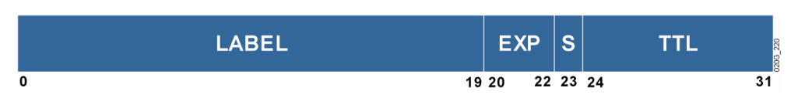
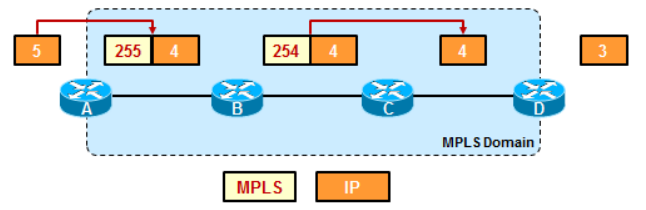

## MPLS: 多协议标签交换

## 1.MPLS 概述

**多协议（Multi-Protocol）**：可以基于多种不同的 3 层协议来生成 2.5 层的标签信息。因为标签交换需要基于路由协议产生的路由表，来生成标签转发表（LFIB）和标签号（LIB），比如第三层使用 IPv4 或者 IPv6 协议，MPLS 都可以生成 LFIB 表，也就是兼容多种不同的第三层协议。

**标签转发（Label Swicthing）**：在所承载的报文前加上标签栈（Label Stack），基于标签做转发。 

MPLS 多协议标签交换的重点如下：

- MPLS 是一种新的转发机制，对标的是网络层的包交换。包交换需要检索两张表（路由表，ARP 高速缓存），MPLS 只需要检索 LFIB（标签转发信息表），因此 MPLS 转发的速率相比包交换更快一些
- 一般而言，MPLS 协议分配的一个标签对应路由表中的一个目的地址（路由前缀）
- MPLS 依赖 IP 路由以及 CEF 交换（需要查找 CEF 中的 FIB 表）
- MPLS 基于报文头部的标签进行数据转发
- MPLS 能够支持多种网络层的协议

协议数据单元，是指在分层网络结构，例如在开放式系统互联（OSI）模型中，在传输系统的每一层都将建立协议数据单元（PDU）。TCP/IP 5 层模型的 pdu 分别如下所示：

- 应用层：报文
- 传输层：段
- 网络层：包
- 数据链路层：帧
- 物理层：比特流

### 1.1 包交换

包交换 -- 路由器基于 3 层首部中的 IP 地址转发数据的行为，也叫路由行为。当路由器在转发数据报时，先根据数据报首部中的目的 IP 地址查找路由表，获取到下一跳的主机或者路由器的 IP 地址，然后使用 ARP 协议将此 IP 地址转换为 MAC 硬件地址，然后真正进行转发。因此包交换需要查找两张表，一张为路由表，另外一张为 ARP 表，极大地增加了网络转发延时。

包交换的方式如下所示，默认情况下，思科路由器会启动 Fast Switching 或 Optimum Switching 或者 CEF Switching，而不是 Process Switching，所以我们只能通过 no ip cache 来禁用 Fast Switching，这在另一种意义上正是开启 Processing Switching。

1. 进程交换（Process Switching）：在这种模式下，一条数据流（flow）中的第一个包（packet）将被置入系统缓存（system buffer），其目的地址将会拿到路由表中去查询比对，路由器的处理器同时将进行 CRC 校验，检查包是否正确。然后数据包的二层 MAC 地址将会被重写替换为下一跳接口的 MAC 地址，这样的过程将会继续，对这条数据流（flow）中的第 2 个、第 3 个数据包....相同的操作，包括查询路由表、重写 MAC 地址，CRC 校验等。这种方式无疑是延迟最大的，因为它要利用 system buffer 以及 processor 去处理每个收到的包。但是我们仍然有机会使用这种交换方式，比如在基于每个包的负载均衡时，或者是 debug ip packet 时。
2. 快速交换（Fast Switching）：**可以简单概括为一次路由，多次交换**，快速交换要优于进程交换，它采用了 route cache（路由缓存）来存储关于某条数据流（flow）的特定信息，当然会包括诸如目的 MAC 地址，目的等内容。这时我们只需要对一条数据流（flow）中的第一个包做 Process Switching，并且把信息存入 cache，所有后续的数据包就不必再中断 System Processor 去执行查询等操作，直接从 cache 中提取目的接口，目的 MAC 地址等，这样大大加速了包转发速度。**Fast Switching 在某些资料上可能被称为 route-cache switching，我们可以使用 ip route-cache 命令，在接口上启用 Fast Switching，同时可以通过 show ip cache 来检查 Fast Switching 的相关信息。**
3. 特快交换（Cisco Express Forwarding，CEF）：**无需路由，直接交换**，CEF-cisco 特快交换，为 cisco 私有的技术，但是非 cisco 厂商设备均存在和 CEF 转发机制相同的技术。CEF 不仅仅将数据都存入 System Buffer，而是将整个路由表、拓扑表，以及所有下一跳的地址，MAC 地址全部进行"预存"，只要将路由表，拓扑表中存在的条目，无论是否有数据请求发往其目的地址，都会提前预读取，预设置缓存，缓存的表称为 FIB（**Forwarding Information Base，转发信息数据库**）。这样，当有新的数据请求发送时，就不需要 CPU 去查询目的接口，目的 MAC 地址等信息。而是直接从缓存中读取，从而使转发速度大大提高。FIB 表如下所示：

    

上表中一串 16 进制的数字表示目标 MAC 地址、源 MAC 地址以及第三层协议的类型号。

标签交换 -- 基于 2.5 层报头（标签号）转发数据报，并且在转发的过程中只需要查找一张表 LFIB（标签转发信息数据库），并且 LFIB 表是基于路由表和 ARP 表计算得到的，比如从路由表获取到该从路由器哪一个接口转发出去，以及下一跳的 MAC 地址。另外 MPLS 协议只是一个转发协议，它不是路由协议，无法生成路由表，还是必须使用 RIP，OSPF 来生成路由表。  

简而言之，MPLS 协议在 2 层与 3 层的报头中间压入标签号，让其他的路由器基于标签号查询本地的 LFIB 表进行数据转发。

### 1.2 MPLS 的优缺点和应用

标签交换的优点：

- 采用 MPLS，可以避免 IP 路由逐跳转发的情况，减少对数据包的深入分析，借助标签建立二层的快速转发路径，使得数据沿着一条预先建立的路径快速的转发。
- 数据包在进入 MPLS 网络的入口路由器上被进行一次三层查找，而在之后的 LSR 只是进行简单的标签交换动作，无需进一步分析三层信息
- 每个 LSR 必须在数据转发之前需要建立好 LIB（标签信息库），以及 LFIB（标签转发信息库）。当 LSR 收到一个标签数据帧时，将数据帧中的标签在 LFIB 表中进行查找，再根据 LFIB 表中指示的相关动作对标签进行压入、弹出、交换、移除等动作。

标签交换的缺点：MPLS 协议虽然只查一张表，但是可能加速有限，因为 LRS 路由器在转发数据报的时候需要压入、弹出标签号，这个操作会耗时，另外，由于在第二层和第三层的首部之间多增加了字段，有可能会导致第二层链路层的帧太大，从而分包，增加了链路带宽的转发耗时。

最开始使用 MPLS 技术是为了提高网络层分组转发的速率，但是由于包交换的改进和升级（使用了快速交换和特快交换），MPLS 在分组转发速率方面的优势已经没有那么突出了，现在 MPLS 主要使用在一下三个方面：

- 解决 BGP 的路由黑洞
- MPLS VPN 是目前所有 VPN 技术中最像专网
- MPLS TE 流量工程

另外，随着包交换的加速，使得今天的 MPLS 技术也开始基于 FIB 表来工作，来提高 MPLS 的工作效率

### 1.3 MPLS 名词解析

**1）MPLS domain: MPLS 的工作半径**

Label Switch Router（LSR）标签交换路由器：是一台支持 MPLS 的路由器，能够理解 MPLS 标签并且能够在数据链路层面对 MPLS 标签包进行交换。有以下三种类型的 LSR：
- Ingress LSRs: Ingress LSRs receive a packet that is not labeled yet, insert a label (stack) in front of the packet, and send it on a data link.
- Egress LSRs: Egress LSRs receive labeled packets, remove the label(s), and send them on a data link. Ingress and Egress LSRs are edge LSRs.
- Intermediate LSRs

**2）Forwarding Equivalence Class (FEC) 转发等价类**

FEC is a group or flow of packets that are forwarded along the same path and are treated the same with regard to the forwarding treatment.
- 在转发的过程中，具有相同处理方式的一组数据，可以通过地址、隧道、CoS等方式来标识，通常在一台设备上，对于一个 FEC 分配相同的标签。
- 属于一个 FEC 的流量具有相同的转发方式，转发路径和转发待遇。但是并不是所有拥有相同标签的报文都属于同一个 FEC，因为这些报文的 EXP 值可能不相同，执行方式可能不同，因此他们可能属于不同的 FEC。
- 决定报文属于哪一个 FEC 的路由器是入站 LSR，因为是它对报文进行分类和压入标签

**3）LSP（Label Switched Path）**

LSP: is a sequence of LSRs that switch a labeled packet through an MPLS network or part of an MPLS network. Basically, the LSP is the path through the MPLS network or a part of it that pakcets take.实际上，LSP 是报文穿越 MPLS 网络或者部分 MPLS 网络时的路径（单向路径）。

**4）MPLS 标签**

    

- Label: 标签号
- BoS：栈底位，这一位置为 1，则为最后一个标签，可以给一个数据包压入多层标签，最后一个标签的 BoS 位置为 1
- TTL：最大 255，通常在加上标签的时候，把普通报文的 IP 报文的 TTL 直接 copy 进来
- EXP：实验位，用于 QoS

    

- 二层帧头（例如以太网帧头）都有一个字段用于标识上层协议，对于以太网帧中，协议字段使用 8847（单播）或者 8848（组播）来标识承载的是 MPLS 报文，如果上层是 IPv4 报头，则为 0x0800。LSR 路由器根据二层帧头中的协议类型来判断是带有标签的还是不带标签的 IP 数据包
- 允许多标签存在，标签中的 BoS 位标识是否为栈底
- 对于一个 LSR 来说，只处理第一个标签。每一层标签都有个 BoS 栈底位，用来表示是否已经是标签栈的栈底，最后一个标签的 BoS=1

MPLS 标签的处理方式有以下三种：

- Insert（impose or push）
- Swap
- Remove（pop, untag）：pop 是弹出栈顶的标签，而 untag 是移除掉所有的标签栈

## 2.MPLS 单播路由

### 2.1 MPLS 单播路由的结构

    

LSR 路由器的结构由两部分组成：控制平面和数据平面。在控制平面中，会根据 RIP、OSPF、ISIS、BGP 等路由协议来生成路由表，也就是控制层面发送路由协议的数据包，用来获取和路由相关的信息，生成并维护路由表。如果路由器使用了 CEF 技术（Cisco Express Forwarding, 思科特快交换），那么就会在数据平面生成一个 FIB 表，进行 IP 数据报的转发。

同时，在控制平面还存在 LDP 协议，用来给路由表中的每一个条目分配标签号，并且保存到 LIB 表中，同时和周围邻接的路由器互相交换标签号，这些标签号（本地 + 邻接）会也会保存到 FIB 和 LFIB 表中。LFIB 表位于数据层面。

总的来说就是，控制层面用来根据路由协议生成路由表，数据层面用来根据路由表转发数据包。

    

如上图所示，对于 MPLS 协议来说，有以下四种转发场景：

- 一个普通的 IP 数据报（不携带标签）到达 LSR 路由器，通过 FIB 表（FIB 表中对应条目没有标签号）进行转发，并且转发之后还是普通 IP 数据报（普通的特快交换）
- 一个普通的 IP 数据报到达 LSR 路由器，仍然通过 FIB 表（FIB 表中对应条目有标签号）进行转发，但是转发之后变成携带标签的数据报
- 一个带有标签的 IP 数据报到达 LSR 路由器，通过查找 LFIB 表进行转发，转发之后仍然是一个带有标签的 IP 数据报
- 一个带有标签的 IP 数据报到达 LSR 路由器，通过查找 LFIB 表进行转发，但是标签被弹出，变成一个普通的 IP 数据报

注意，LDP 或者 TDP 只会对 IGP 协议的路由条目产生标签，而不会对 BGP 的路由条目产生标签

## 3.MPLS 的工作过程

### 3.1 控制平面

1. 在没有 MPLS 时，控制层面仅仅生成 RIB（路由表）和 FIB（转发信息数据库），并且 FIB 是基于 RIB 生成的；
2. MPLS 协议会启动 TDP (cisco 私有) 或者 LDP (Label Distribution Protocol, 公有) 协议，直连设备间将建立邻居关系；具体的过程就是，LDP 基于 UDP 和 TCP 的 646 端口工作，先使用 UDP 发送组播 hello 包发现邻居，获取到邻居的 IP 地址，再和该直连邻居建立 TCP 会话。因此，正常在使用 LDP 协议建立邻居关系前，路由协议就已经收敛完成，RIB 和 FIB 表已经生成。
3. MPLS 在建立邻居关系后，生成邻居表；LDP 协议再基于本地 FIB 表中学习到的路由条目生成标签号
4. 标签号生成之后，将存储于本地的 LIB 表 -- 标签信息数据库，LIB 表将在邻居间共享，LIB 表中装载本地以及邻居为每条路由分发的标签号
5. 运行 MPLS 协议的设备，将 LIB 和 FIB 表进行结合，将标签号和最佳路径的映射关系映射生成 LFIB 表（标签转发信息数据库）

注意：RIB -> FIB -> LIB -> LFIB，其中前两张表为路由协议工作后生成，后两张表为 MPLS 的 LDP 协议生成

### 3.2 数据层面

1. 在没有 MPLS 协议时，基于 FIB 表正常转发即可
2. 当流量进入到第一台 PE 设备时，在没有特快交换之前，路由器基于目标 IP 地址查询本地的 RIB，之后还要在 LIB 表中对应才能确定流量是否应该压入标签，需要两张表的查询。在存在特快交换时，流量进入第一台 PE 设备时，直接查询 FIB 表，表中关联标签号，将直接确定是否压入标签。流量再到 P 路由器，接收到流量中若存在标签则基于 LFIB 表进行转发，若没有标签，则基于 FIB 表即可；流量从最后一台边界离开 MPLS 域时将弹出标签。

**存在标签号的流量，在进入路由器时，入标签表应该为本地路由器分配的编号，出标签为本地下一游（下一跳）设备分配的标签号；上下游的概念基于数据层面进行标定**

### 3.3 工作流程简介

- 根据 IP 路由协议（OSPF、ISIS、EIGRP 等）构造好 IP 路由表
- 每一个 LSR 路由器给 IP 路由表中的每一个目的地址分配一个标签（不同目的地址，标签值不一样），这些标签值保存在 LIB 表中
- 每一个 LSR 路由器将它们分配的标签情况通知周围邻接的路由器
- 然后每一个 LSR 路由器根据收到的标签，构造它们自己的 LIB、LFIB、FIB 表

下面这三张表中会包含标签信息：

- LIB（Label Information Base，标签信息数据库），位于控制平面。在 LIB 表中每一个网络或者说网段地址都有对应的本地或者其它 LSR 路由器给这个网段分配的标签号。这也就是说，LIB 表中一个目的网络地址可能有多个条目，对应多个标签号（本地分配的一个，其它 LSR 路由器分配的多个）
- LFIB（Label Forwarding Information Base，标签转发信息数据库），位于数据层面。LFIB 表用来转发带有标签的 IP 数据报，并且在 LFIB 表中，网络 X 在本地的标签被映射为 X 在下一跳路由器上被分配的标签，并且指出了下一跳路由器
- FIB（Forwarding Information Base，转发信息数据库），位于数据层面。FIB 表用于转发不带标签的 IP 数据报，FIB 表可以进行一般的路由转发。但是 FIB 表中也包含了标签信息。这是因为位于 MPLS 网络边缘的 LSR 路由器（Edge LSR）会接收到不带标签的 IP 数据报，然后将其转发为带标签的 IP 数据报，进入 MPLS 网络，压入的标签为下一跳路由器给目的网络 X 分配的标签号。

下面结合实际介绍 MPLS 的 LDP 协议的工作过程。

1.构造 IP 路由表（Building IP Routing Table）

    

首先在所有的 LSR 路由器上面，根据路由协议构造路由表，然后在路由表的基础上构造 FIB 表。但是此时 FIB 表中还没有任何标签号，因为现在还只是在控制平面交换路由信息，这些携带路由信息的 IP 数据报上没有携带标签。

2.分配标签号（Allocating Labels）

    

LSR 给路由表上的每一个目的地址分配一个标签号。在上图中，B 路由器给目的网络 X 分配了 25 标签号。另外每一个 LSR 路由器分配标签号都是各自独立进行。

3.LIB 和 LFIB 建立（LIB and LFIB Set-up)

    

一旦给目的网络地址分配了一个标签号后，它被保存到以下两张表中：

- LIB 表会维护目的网络地址（比如网络 X）到各个 LSR 路由器给这个网络地址（网络 X）分配的标签号之间的映射关系。比如图中是网络 X 到本地标签号 25 之间的映射，等到邻接路由器（比如 C）把自己给 X 分配的标签号告知 B 以后，LIB 表中 X 会对应/映射两个标签号，依次类推
- LFIB 表根据 LIB 表和 FIB 表生成，并且 LFIB 表用来进行标签交换。Label 表示进入到当前路由器的 IP 数据报所携带的标签号（比如 25），Action 表示要替换的标签号，也就是下一跳路由器（图中就是 C）给目的网络地址分配的标签号。但是图中为 pop，说明 B 没有收到 C 发送过来标签号信息，所以当 IP 数据报到达 B 时，B 路由器会将其标签弹出。
  
4.标签分发（Label Distribution）

    

B 路由器将其分配的标签号告知给所有和它相邻的 LSR 路由器，不管这些 LSR 路由器位于 B 的上游还是下游。

5.收到标签通知信息（Receiving Label Advertisement）

    

图中 A,E,C 三个 LSR 路由器将收到的标签信息存储在各自的 LIB 表中。同时位于 MPLS 网络边缘的路由器（Edge LSR）在收到下一跳路由器发过来的标签号之后，还会将其保存到 FIB 表中。这样一个普通的 IP 数据报经过此 Edge LSR 转发之后（普通 IP 数据报转发要查询 FIB 表），就会变成一个带标签的 IP 数据报。最后 A 中的 LFIB 表也会被更新，Action 中的操作由 pop 变为 25，之后通过 LFIB 表可以进行标签交换操作。

6.临时数据报转发（Interim Packet Propagation）

    

经过前面的 5 个步骤，这里假设一个普通 IP 数据报到达路由器 A，目的地址为 X。当到达路由器 A 时，查找 FIB 表（不带标签的数据报查找 FIB 表），压入标签 25，随后转发给下一跳路由器 B。在路由器 B 上查找 LFIB 表（带标签的数据报查找 LFIB 表），由于 Action 为 pop，因此弹出标签号，转发给下一跳路由器 C。

7.继续进行标签分配（Further Label Allocation）

    

之前 B 路由器给网络地址 X 分配了标签号，并且进行了分发。现在 C 路由器给 X 分配了标签号 47，然后也进行分发，告知给相邻的路由器 B,E。同时 C 路由器将 47 标签号保存到 LIB、LFIB 表中。其余路由器也会进行上述操作（分配标签，分发通知）。

8.收到标签通知信息（Receiving Label Advertisement）

    

B,E 收到 C 发过来的标签号信息，以 B 为例，它会将标签号存储在 LIB 表中，同时修改 FIB 表，将 47 标签信息存储到 Label 字段中，最后会更新 LFIB 表，将 Action 由 pop 替换为 47。

此时 LSR A 的 LFIB 表中，X 地址对应的 Action 为 25；在 LSR B 的 LFIB 表中，X 地址对应的 Action 为 47；在 LSR C 的 LFIB 表中，X 地址对应的 Action 仍然为 pop，因为 C 还没有收到 D 发送过来的标签号信息。

9.数据报传递通过整个 MPLS 网络（Packet Propagation Across MPLS Network）

    

一个普通的 IP 数据报送达 LSR A 路由器，查找 FIB 表转发给下一跳路由器 B，同时压入标签号 25；B 收到数据报之后，查找 LFIB 表，根据 Action 的值将标签 25 替换为 47，并发送给下一跳路由器 C；C 在收到数据报之后，查找 LFIB 表，根据 Action 将标签号弹出，变成普通数据报，发送给下一跳路由器 D。

### 3.4 MPLS 的次末跳

**如果没有 PHP 机制**

    

在上图中，第一个边界路由器只需要查表一次，即直接查找 LFIB 表就可以得出下一跳应该转发给谁；最后一跳路由器需要查表两次，第一次查 LFIB 表，action 为 untagged，取消掉 IP 数据报上面的标签。但是在此 LFIB 表中没有关于下一跳的地址（其它 LFIB 表中有），因为 MPLS 域外没有 LRS 路由器可以和它交换信息。因此在弹出标签后，还需要查找一次 FIB 表来获取下一跳的转发地址。

**如果有了 PHP 机制**

    

边界 LSR 将本地的**直连网段**传递给 MPLS 域内的邻居后，LDP 分配的标签号为 3（等同于 pop，标签号 3 是不可能出现在数据包中的），告知倒数第二跳设备它的身份；导致倒数第二跳设备在查询 LFIB 表后，**已知转发路径的前提下**提前弹出标签，使得最后一跳路由器均只需要查询 FIB 表；

LDP 在帧模式(Frame Mode)下，LSR 会为每一条路由分配一个标签；而为本地的直连路由分配的是POP 标签。

倒数第二跳弹出机制有两种标签，一是 POP 或 implicit null，在 LDP 中标签值为 3；另一个是explicit null，在 LDP 中标签值为 0。如果收到邻居发送来的关于某条路由分配的标签值为 3，则我发送数据给该邻居时，我会将该标签弹出，再将内层数据转给邻居。而如果邻居关于某条路由分配的标签值为 0，那么本地在转数据给邻居时，会带上标签（为 0 的），一并发给邻居。

这里要留意的是，如果收到一个标签包，标签为 0，则直接弹出标签，并将数据交给 FIB 进行查找，不会有两次查找的损耗。标签为 0 的标签包，为什么不干脆将标签去掉（分配个 3 值给路由下一跳让下一跳将标签去掉啊)，为什么还要保留这个为 0 的标签头呢？这是为了在某种情况下保持网络规划的统一性，例如部署了 MPLS 的 QoS，则需使用标签包中的 EXP 字段，那么就需要有标签。在实施 QoS 时，最后一跳必须携带 EXP 位，因此标签不能被弹出，需配置 mpls ldp explicit-null此时分配给特定路由的标签值为 0 并传递给 LDP 邻居（如倒数第二跳）。

最后，标签 3 不可能出现在数据包中，但是 0 可以。

### 3.5 保留的标签

标签 0-15 都是被保留的标签，以下是一些有特定作用的保留标签：

- 标签 0：显式空标签
- 标签 3：隐式空标签
- 标签 1：路由器报警标签
- 标签 14：OAM 报警标签
  
其他 0-15 之间的被保留标签的功能目前暂时没有定义。因此我们的可用标签是 16 至 2^20 - 1.

#### 1) 隐式空标签

在 PHP 中，我们已经了解了隐式空标签的作用，当然，隐式空标签不局限在 PHP 中。它还可以运用在标签栈中有 2、3 个或者更多的标签的报文中。在出站 LSR 上使用隐式空标签(在 LDP 中，值为3)将会通知倒数第二跳路由器移除顶层标签，而向出站 LSR 传递的带标签报文其标签数量就会少一个，这样的话，出站 LSR 就不需要执行两个标签的查找了。注意，使用隐式空标签并不是必须将标签栈中的所有标签都弹出，而是弹出顶层标签。

尽管隐式空标签也使用了一个标签值为 3 的标签,但是标签 3 永远不会出现在 MPLS 报文的标签栈中，这也正是其叫隐式空标签的原因。

    

#### 2）显式空标签

在 IPv4 中，显示空标签为 0，Ipv6 中为 2。

上面的隐式空标签已经介绍过了，它确实可以增加效率，但是也有一个问题，因为如果我收到一个下游邻居发送过来的关于某个特定前缀捆绑的隐式空标签，那么我在转发标签数据给该邻居之前，我会先将顶层标签弹出，那么这个弹出的动作，实际上是将整个顶层标签头都弹出了，也就是连带着标签字段、EXP 等字段都吲弹出了，而EXP我们知道，用于做 QoS 的，它也被弹出了，意味着这里就丢失了用于QoS 的部分信息。

因此我们又定义了显式空标签，用于应对上面描述的场景。

    

我们看上图，C 针对 30.0/24 的前缀捆绑了标签 0，也就是显式空标签，然后将标签映射发给 B，B 也产生自己的标签映射然后发给 A。那么这时候，如果 B 收到来自 A 的一个标签包，顶层标签的值为 20，那么 B 查找自己的 LFIB，发现要标签要转换成 0。于是，B 将顶层标签替换成 0，然后转发给 C，那么这个时候对于 C 来说，它就收到了一个标签值为 0 的标签包，C 只是仅仅弹出 0 标签也就是显式空标签，然后到 FIB 表中去查找，这样 C 就可以通过查看标签头的 EXP 位来获得该报文的 QoS 信息了。

#### 3）路由器报警标签

标签值为 1，这个标签可以出现在标签栈的任何位置，除了栈底位外。

当路由器报警标签位于栈顶时，它向 LSR 发出警告说该报文需特别注意。这样一来该报文就不会通过硬件传输，而是通过软件进程传输。一旦这个报文开始被转发，标签 1 首先被移除，接下来 LSR 在 LFIB 中对标签栈中的下一个标签进行查找然后执行相应的标签操作(添加、移除、交换)标签 1 又会被添加到标签栈的顶部，最后才被转发出去。

### 3.6 MPLS 模式

MPLS 的参数有以下四种：

1. 标签分配（Label Allocation）：本地为一条前缀绑定一个标签的前提条件
    - 独立控制模式（Independent Control）：只要本地通过 IGP 学习到路由前缀，就会为这条路由前缀分配标签（本地也会为直连路由分配 POP 标签）
    - 有序控制模式（Ordered Control）：本地通过 IGP 学习到路由前缀，但必须该路由前缀的下一跳路由器将该前缀所对应的标签映射消息通告给本地，本地才会为该前缀分配标签
2. 标签分发（Label Distribution）：本地将一个标签映射消息通告给邻居的前提条件
    - 下游主动模式（Downstream Unsolicited）：本地会主动将所生成的标签映射消息通告给所有 LDP 邻居
    - 下游按需模式（Downstream On Demand）：只有邻居向本地请求某条前缀的标签映射消息时，本地才会通告标签映射消息给邻居
3. 标签保留（Label Retention）：本地是否会在数据库中保留从邻居接收到的所有标签映射消息
    - 自由模式（Liberal Retention）：本地将从邻居接收的所有标签映射消息都保存在数据库
    - 保守模式（Conservative Retention）：本地仅保存最优路由下一跳邻居所通告的该路由前缀的标签映射消息
4. 标签空间（Label Space）：本地所通告出去的标签是对局部(接口)有意义还是对全局有意义
    - 基于平台（Per-Platform）：本地通告出去的标签映射消息对全局有意义，从不同的接口通告出去的同一 FEC 所对应的标签相同
    - 基于接口（Per-Interface）：本地通告出去的标签映射消息对局部有意义，从不同的接口通告出去的同一 FEC 所对应的标签不同

在 MPLS 的帧模式（Frame Mode）中的标签行为：

- 标签分配：独立控制模式
- 标签分发：下游主动控制模式
- 标签保留：自由模式
- 标签空间：基于平台

## 4.标签交换协议（Label Distribution Protocol）

### 4.1 LDP 协议概述

对 IP 路由表中的每一条 IGP（不支持 BGP 路由表）的 IP 前缀来说，每一台运行 LDP 协议的 LSR 都会进行本地捆绑,也就是说,为 IPv4 前缀分配标签，然后 LSR 再将该分配的标签分发给所有的 LSR 邻居。这些接收到的标签转换为远程标签remote label，之后邻居将该远程标签和本地标签存储于一张特殊的表中，这个表就是标签信息库 LIB，通常一台 LDP 路由器会有多个 LDP 邻居，那么这些邻居都会给路由分配标签然后将这些标签传给自己。

在所有捆绑某一特定前缀的 remote label 中，LSR 只使用其中一个标签来确定该前缀的出站标签。RIB，也就是路由表来决定IPv4 前缀的下一跳是什么。而 LSR 从下游 LSR 收到的远程标签中选择其路由表中到达该前缀的下一跳的标签。LSR 用这样的信息来创建它自己的标签转发信息库 LFIB。

### 4.2 LDP 邻接建立过程

1.两个过程：**邻居发现过程、会话建立过程**

2.除了 HELLO 报文基于 UDP 646 端口外，其它报文基于 TCP 端口号 646，HELLO 包发向组播的地址为 224.0.0.2，源地址为 LSR 路由器的接口 IP

3.LDP 邻居发现：

    

- 邻居发现是借助 UDP 的 Hello 包来进行的，这个 Hello 包的源和目的端口都是 **UDP 646**
- 发现到邻居之后，传输地址大的一方为主动发起方；注意，这里 TCP 握手报文，**源地址是本地的 Transport Address，目的地址是对端的 Transport Address**。传输地址默认情况下为路由器的 LDP Router-ID。所以必须保证两个 Transport Address 之间是路由可达的。另外，需要注意的是，即使 LSR 已经和周围的 LSR 路由器建立好了 LDP 连接，还是会周期性的发送 HELLO 报文，进行保活。

4.LDP 会话建立

    

在连接建立成功之后，就开始交互初始化消息，初始化消息中包含各种参数。2.2.2.2 也发送自己的初始化消息，并且如果接受 1.1.1.1 的初始化消息中的各项参数，则发送一个 KeepAlive 消息表示接受，最后如果 1.1.1.1 也接受 2.2.2.2 发送过来的消息，那么就发送 KeepAlive 消息。到此 LDP 的邻居关系就建立起来了，接下来就可以互相传递标签映射消息了。

5.LDP 非直连邻居

LDP 允许非直连邻居，这样一来邻居发现无需借助**组播的 HELLO 包**，而是采用单播包。之后建立连接的流程就和 LDP 直连邻居一样。

### 4.3 标签空间

    

介绍 LDP 空间之前，先介绍 LDP ID，LDP ID 是一个 6B 的字段，是 LSR 的 LDP 标识符。包含 4B 的 LSR 标识符和 2B 的标签空间。当存在 loopback 接口时，LDP ID 的前 4B 是 loopback 接口的最大 IP，如果没有 IP 接口，则是活动物理接口的最大 IP。

如果 2B 的标签空间为 0，那么就是基于设备的标签空间；如果为非 0，就说明用的是基于接口的标签空间。在这种情况下，可以使用多个 LDP ID，这些 LDP ID 的前 4 个字节都是相同的，但是后面 2 个字节标识不同的标签空间，基于每个接口的标签空间用于 LC-ATM.

默认的 LDP 标签空间是基于平台的 per-platform 或者说基于设备的。什么意思呢，我们看 B 路由器，它为前缀 X 捆绑了标签 34，并且将这个标签捆绑信息发布给所有的 LDP 邻居，给大家的都一样，而且人人有份，都是标签34,这就是基于平台。那么除此之外还有基于接口的标签空间，LSR 通过不同的接口连接其它不同的 LSR 路由器，此时同一个网络前缀，LSR 通过不同的接口分发的标签是不同的。

#### Label Space: Per-Platform

    

- 基于平台（Per-platform label allocation）：本地通告出去的标签映射消息对全局有意义，从不同的接口通告出去的同一 FEC 所对应的标签相同。
- 基于接口（Per-interface label allocation）：本地通告出去的标签映射消息对局部有意义，从不同的接口通告出去的同一 FEC 所对应的标签不同

关于 Per-platform 模式还有如下需要注意的地方：

- Label Space ID 一般为 0，表示我们的标签是基于平台 (Per-platform) 的标签空间 
- LFIB 表不包含入接口信息，从上图的 LFIB 表可知，只包含网络前缀、本地标签、出接口信息以及出接口的标签
- 为前缀分配的标签在本地任意 MPLS 接口可用并且会分发给所有 LSR 邻居
- 本地分配的标签会分发给邻居，如果与单个邻居有多条连接，则该标签在所有连接上均有效。那么不管本地从哪个接口上收到一个标签包，只要有这个标签，都会对其进行交换

但是基于平台 (per-platform) 的标签空间相比于基于接口（per-interface) 的标签空间安全性要更低。如下图所示，B 没有发送标签号 25 （25 是分配给目的网络前缀 X 的标签号）给相邻的红色 LSR 路由器（标签过滤），但是由于同一个网络前缀，B 发送给所有相邻路由器的标签都是相同的，因此红色路由器同样可以发送 25 号标签数据包给 B，进行标签转发，这就是 Per-platform 潜在的缺点。

但是 Per-platform 的优点就是生成的 LIB 和 LFIB 表体积更小，标签交换的速率更快。

    

#### Negotiating Label Space

- LSRs （两个相邻的 LSR 之间）为每一个标签空间只维护一个 LDP Session，基于平台（Per-platform）的标签空间只需要一条 LDP Session，即使在 LDP 邻居间存在多条冗余链路
- 基于平台（Per-platform）的标签空间 label space id = 0，如 LDP ID = 1.1.1.1:0

### 4.4 LDP 防环（Loop Detection）

LDP 的环路检测机制依赖于 IGP 协议，如果出现了环路（一般是 IGP 出了问题，如静态路由的配置出现错误），标签头中的 TTL 将防止标签包无止尽的被转发。标签头中的 TTL 与 IP 头中的 TTL 值是一样的，通常拷贝自 IP 头中的 TTL 值（当一个 IP 包进入到 MPLS 网络中时），这就是 TTL Propagation.

#### 1. 传统的 TTL 操作

    

数据包被 A 压上标签，标签的头的 TTL 值拷贝 IP 头中的 TTL(当然要先减 1)，并且随着数据帧在 MPLS 网络中传输, MPLS 头中的 TTL 值在递减，到 0 则丢弃，直到数据帧出了 MPLS 域，那么 IP 头中的 TTL 才开始工作。在出站时，标签头中的 TTL 减 1 后拷贝到 IP 头中的 TTL。

这里实际上存在一定的隐患，例如使用 traceroute，可能会暴露网络内部结构（TTL=0 后，路由器会返回差错消息，就可能会暴露网络信息）。这时可以选择关闭 TTL Propagation（CISCO 路由器默认开启）

#### 2.关闭 TTL Propagation

    

在 A 设备（一般在边界设备）上配置该特性 no mpls ip propagate-ttl。这样一来在边界设备上将 P 包加标签头的时候，就不去拷贝原 P 头里的 TTL 值了，而是用一个如 255 的 TTL 放入标签头。关闭 TTL propagation 可以避免 MPLS 网络被暴露（通过 traceroute 方式）。

#### 3.在 SWAP、PUSH、POP 操作中标签到标签的 TTL 扩散行为

    

前面描述的是 P 标签包的 TTL 扩散过程，现在来看一下标签到标签的 TTL 扩散过程。

- SWAP 这个过程很好理解，注意，LSR 在处理标签栈中有多个标签的标签数据时，只会处理顶层标签。因此 SWAP 这个过程，标签在交换后，出栈标签 TTL - 1，然后拷贝到入栈标签 TTL。
- PUSH 也是类似的理解，只对顶层标签操作，首先出栈顶层标签的 TTL 249 先减 1，然后新压入的标签头 TTL 拷贝这个值。
- POP 则是顶层标签的 TTL 先减去 1，然后弹出，新的 TTL 值被写入到入栈数据的顶层标签上。

## 5 LDP 和 IGP 的同步

### 5.1 关于 LDP 与 IGP 的同步

    

MPLS 网络中的一个很重要的问题就是 LDP 和 IGP 的同步，所谓的同步的是意思是，IGP 和 LDP 都认可某条链路为待转发报文的出站链路。例如上图中，四台路由器都运行 OSPF，同时激活 LDP。那么在 R1 上，如果其去往 3.3.3.3/32 的路由，在路由表中下一跳为 R2(假设我们调了 cost)，同时又收到了 R2 发过来的针对 3.3.3.3/32 前缀捆绑的标签 401，那么这时候，IGP 和 LDP 就同步了，R1 可以正常的使用 R2 作为下一跳来转发 MPLS 标签报文。

    

然而可能出现这样一个问题，R1、R2 之间的 LDP 连接，由于某种原因断掉了，但是 R1、R2 之间的 OSPF 邻接没 DOWN，那么 R1 的路由表中，关于 3.3.3.3/32 依然选择 R2 作为下一跳，这就出问题了。R1 上的 LFIB 里，关于 3.3.3.3/32 的条目可能是这样的：

    

这样 R1 发送数据去往 3.3.3.3 就有直接以 IPv4 报文的形式发送出去了。这在本拓扑中看似没什么问题，确实能够通，但是，在 MPLS VPN 环境中就可能出问题了。因为报文在 MPLS VPN Backbone 中传输往往是需要带标签的。

另一个造成 IGP 和 LDP 不同步的例子是，LSR 重启的时候，IGP 可以很快就建立起邻接关系，而LDP 的会话建立起来可能就慢点，也就是说，在 LFIB 装载必须的信息来进行正确的标签交换之前，IGP 的转发就已经开始了。可以使用 MPLS LDP-GP 同步来解决这个问题。注意，MPLS LDP-IGP 的解决方案不能用于 BGP 的标签分发。

### 5.2 MPLS LDP-IGP 同步如何工作

当在一个接口上激活了"MPLS LDP-IGP 同步"之后，IGP 将会通告该链路的度量值为最大，一直到同步完成或者 LDP 会话在该接口上成功建立。在 OSPF 中，metric 最大为 65535，这样一来，可以保证在 LDP 处于断开状态的时候不会有路径会经过该接口。在 LDP 会话成功建立并且标签捆绑已经开始进行交换以后，IGP 才会用正常的 IGP 度量值来通告该链路。这个时候穿越这个接口的流量就是进行标签交换的流量了。基本上说，如果 LDP 会话没有建立，OSPF 是不会在这个链路上建立邻接关系的，压根不发 HELLO (当然，这里有个基本上说的字眼，也就说，还有二般情况)。

一直到 LDP 会话成功建立，或者"同步保持时间”超时，否则 OSPF 邻接关系是不会建立的。这里的同步表示本地标签捆绑已经通过 LDP 会话发送给了 LDP 对等体。但是如果路由器上 A 激活了"MPLS LDP-IGP同步"，并且 A 和 B 之间只有一条链路，而没有其他可用路径到 B 的话，OSPF 邻接关系将永远不会建立。

因为 OSPF 会等待 LDP 会话的建立，但是 LDP 会话根本无法建立，因为 A 没办法在它的路由表中学习到 B 的 LDP routerID 路由，这样就进入了一个死循环，OSPF 和 LDP 的邻接关系将永远无法建立。对于这种情况，LDP-IGP 同步会无条件激活 OSPF 的邻接关系，这样一来链路将通告最大的 metric 值，直到同步完成。

然而在某些环境中，LDP 会话的这个问题可能永远无法解决，因此可能并不希望永远等待 IGP 邻接关系的建立。那么可以通过配置"同步保持时间"。

### 5.3 MPLS 协议的收敛问题

#### 1) Steady State Description

    

当通过 IGP 和 LDP 协议生成了 IP 主路由表、LIB 表、FIB 表以及 LFIB 表之后，MPLS 协议就可以正常工作。相比于 IGP 协议生成路由表或者 FIB 表，LDP 协议要滞后一些才能完成标签的交换，但是如果当标签交换还没有完成，网络也是可以正常工作的，因为有 FIB 表对 IPv4 数据包进行转发。

#### 2）Link Failure Actions

    

接下来，B 和 C 路由器之间的链路出现了故障，不再可用，因此会将 C 路由器的条目从 LIB 表和 LFIB 表中删除（图中路由表、FIB 表中的红色横线有误，不应该存在）

#### 3）Routing Protocol Convergence

    

B 上的 IGP 协议会收敛，选择 E 作为目的网络 X 的下一跳路由，然后调整 IP 路由表和 FIB 表中的相关条目。

#### 4）MPLS Convergence

    

在 IGP 协议收敛并且更改 FIB 表之后，MPLS 也会相应收敛，根据 FIB 表中的路由条目，修改 LFIB 表中去往目的网络 X 的下一跳路由，以及对应要交换的标签。由于帧模式中，保留模式使用的是自由模式，即 LSR 路由器接收所有邻居发送过来的标签映射，然后保存到 LIB 表中。因此，当 IGP 协议重新收敛之后，MPLS 会根据 LIB 表中的标签，重新生成另外一条 LSP 路径（即更改 LFIB 表中的条目）。

#### 5）Link Recovery Actions and IP Routing Convergence

    

现在，B 和 C 路由器之间的连接又恢复了，然后 B 路由器上的 IGP 协议就会检测到这种变化，然后再次将 C 作为去往目的网络 X 的下一跳。然后更改 IP 路由表以及 FIB 表，但是由于 LIB 表中路由器 C 给目的网络 X 分配的标签号被删除，因此根据 FIB 和 LIB 生成的 LFIB 表中，去往目的网络 X 的 Action 被设置为 pop。

然后必须等到 B 与 C 之间 LDP Session 连接重建完毕（LDP 收敛），C 将自己的标签映射信息发给 B 之后，才能真正完善 LFIB 表。但是 LDP 的收敛不影响整个网络的可用性，因为可以通过 FIB 表对 IPv4 包进行转发，直到 LDP 协议收敛完毕。

因此总结一下就是，当路由器之间的链路恢复正常时，IGP 协议会感知到这种链路的变化，然后更改路由器中的条目。但是当 IGP 协议收敛完毕时，有可能 LIB 表中不存在新的下一跳路由对应的标签，还需要等到 LDP 协议也收敛完毕，建立好 LDP Session 连接之后，才能完善 LFIB 表。在 LDP 协议收敛之前，可能得通过 FIB 表进行传统的 IP 路由转发。

