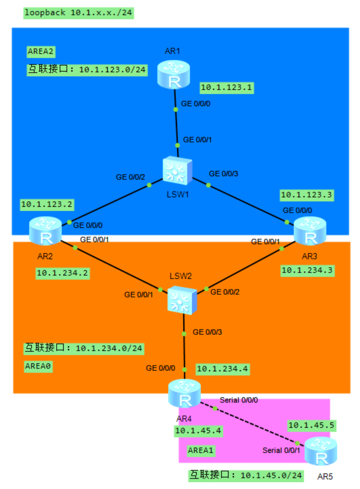
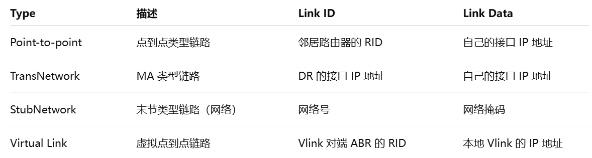
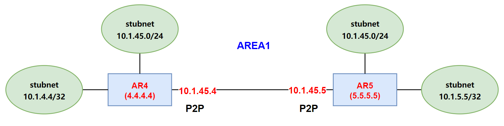
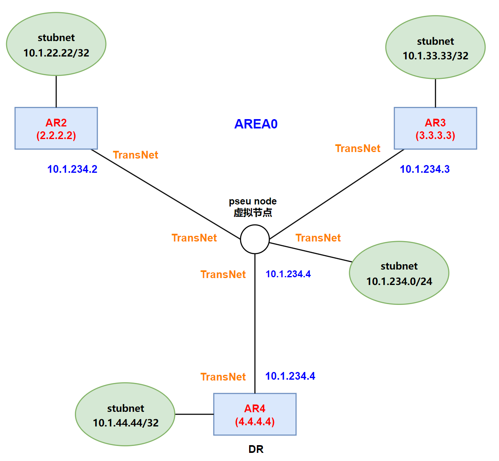
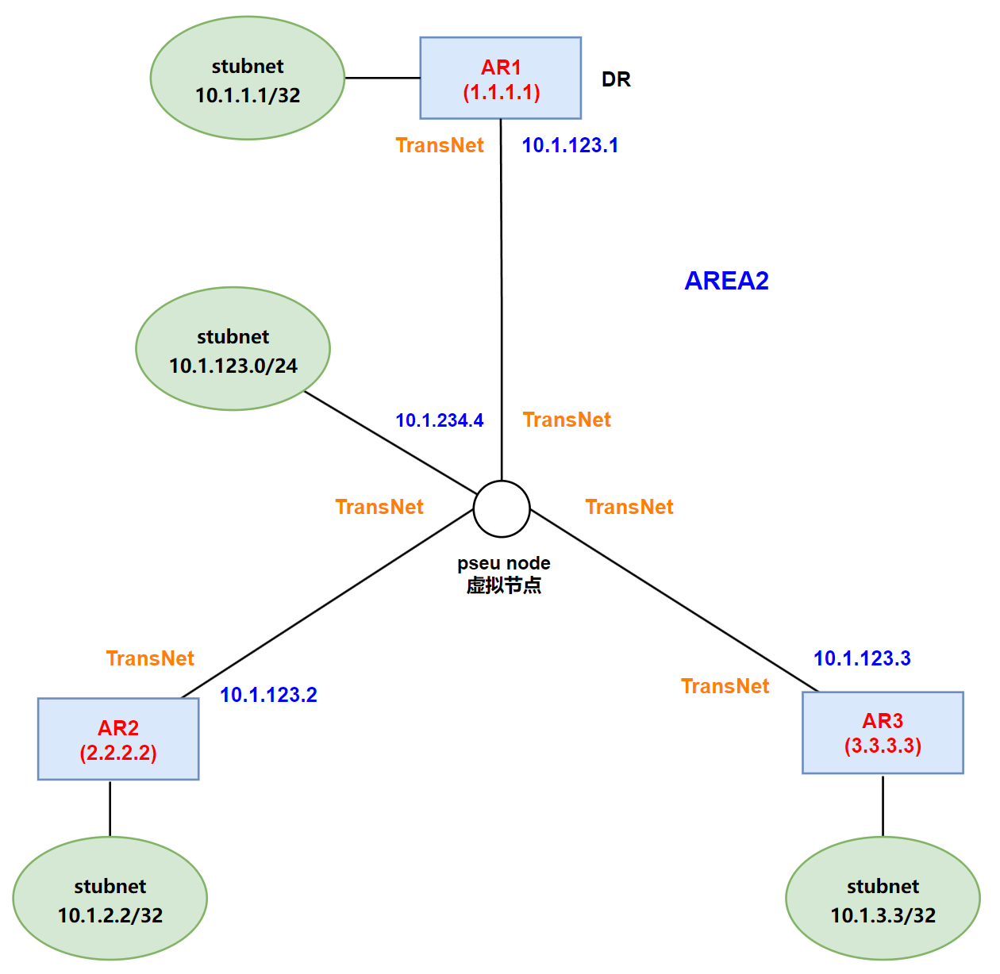

# OSPF 拓扑描述及路由计算

## 1.实验案例

我们以下面这个 OSPF 实验案例来分析一下 LSA1 和 LSA2 的内容，拓扑图如下所示：

<div align="center">
    
</div>

按图中的网段规划，Area1 的网段为 **`10.1.45.0/24`**，Area2 的网段为 **`10.1.123.0/24`**，Area0 的网段为 **`10.1.234.0/24`**。并且不同的区域中网络类型不同，Area1 中的网络类型是点对点，Area2 中的网络类型是 NBMA，Area0 中的网络类型是广播。

AR1 的配置信息如下所示，AR1 的 dr-priority 设置为 100，为了让实验结果稳定，将 AR1 设置为 AR1-AR3 中 dr-priority 最高的路由器。

```java{.line-numbers}
#
 sysname AR1
#
interface GigabitEthernet0/0/0
 ip address 10.1.123.1 255.255.255.0 
 ospf network-type nbma
 ospf dr-priority 100
#
interface LoopBack0
 ip address 10.1.1.1 255.255.255.0 
#
ospf 1 router-id 1.1.1.1 
 peer 10.1.123.2
 peer 10.1.123.3
 area 0.0.0.2 
  network 10.1.1.1 0.0.0.0 
  network 10.1.123.1 0.0.0.0 
```

AR2 的配置信息如下所示，AR2 有 2 个 loopback 接口，分别是 LoopBack0 和 LoopBack1，LoopBack0 位于 Area2 中，LoopBack1 位于 Area0 中。并且由于 Area2 的网络类型是 NBMA，而且由于 NBMA 网络无法靠组播 hello 报文来发现邻居，所以我们在 AR2 和 AR3 上都配置了 peer 命令来手动指定邻居，**<font color="red">同时由于 NBMA/Broadcast 网络都是全互联网络，因此 AR2 上需要使用 peer 命令来指定 AR1 和 AR3 这两个邻居，而 AR3 上也同理</font>**。

```java{.line-numbers}
#
 sysname AR2
#
interface GigabitEthernet0/0/0
 ip address 10.1.123.2 255.255.255.0 
 ospf network-type nbma
 ospf dr-priority 50
#
interface GigabitEthernet0/0/1
 ip address 10.1.234.2 255.255.255.0
 ospf network-type broadcast
 ospf dr-priority 50
#
interface LoopBack0
 ip address 10.1.2.2 255.255.255.0 
#
interface LoopBack1
 ip address 10.1.22.22 255.255.255.0
#
ospf 1 router-id 2.2.2.2 
 peer 10.1.123.1
 peer 10.1.123.3
 area 0.0.0.0 
  network 10.1.234.2 0.0.0.0
  network 10.1.22.22 0.0.0.0
 area 0.0.0.2 
  network 10.1.2.2 0.0.0.0 
  network 10.1.123.2 0.0.0.0 
```

AR3 的配置信息如下所示，AR3 也有 2 个 loopback 接口，分别是 LoopBack0 和 LoopBack1，LoopBack0 位于 Area2 中，LoopBack1 位于 Area0 中。

```java{.line-numbers}
#
 sysname AR3
#
interface GigabitEthernet0/0/0
 ip address 10.1.123.3 255.255.255.0 
 ospf network-type nbma
 ospf dr-priority 15
#
interface GigabitEthernet0/0/1
 ip address 10.1.234.3 255.255.255.0
 ospf network-type broadcast
 ospf dr-priority 15
#
interface LoopBack0
 ip address 10.1.3.3 255.255.255.0 
#
interface LoopBack1
 ip address 10.1.33.33 255.255.255.0 
#
ospf 1 router-id 3.3.3.3 
 peer 10.1.123.1
 peer 10.1.123.2
 area 0.0.0.0 
  network 10.1.234.3 0.0.0.0 
  network 10.1.33.33 0.0.0.0
 area 0.0.0.2 
  network 10.1.3.3 0.0.0.0 
  network 10.1.123.3 0.0.0.0 
```

AR4 的配置信息如下所示：

```java{.line-numbers}
#
sysname AR4
#
interface Serial0/0/0
 link-protocol ppp
 ip address 10.1.45.4 255.255.255.0 
#
interface GigabitEthernet0/0/0
 ip address 10.1.234.4 255.255.255.0
 ospf network-type broadcast
 ospf dr-priority 100
#
interface LoopBack0
 ip address 10.1.4.4 255.255.255.0
#
interface LoopBack1
 ip address 10.1.44.44 255.255.255.0
#
ospf 1 router-id 4.4.4.4 
 area 0.0.0.0 
  network 10.1.234.4 0.0.0.0
  network 10.1.44.44 0.0.0.0
 area 0.0.0.1 
  network 10.1.45.4 0.0.0.0
  network 10.1.4.4 0.0.0.0
```

AR5 的配置信息如下所示：

```java{.line-numbers}
#
sysname AR5
#
interface Serial0/0/1
 link-protocol ppp
 ip address 10.1.45.5 255.255.255.0 
#
interface LoopBack0
 ip address 10.1.5.5 255.255.255.0 
#
ospf 1 router-id 5.5.5.5 
 area 0.0.0.1 
  network 10.1.45.5 0.0.0.0 
  network 10.1.5.5 0.0.0.0 
```

## 2.LSA1 和 LSA2

### 2.1 LSA1 和 LSA2 报文内容

每台路由器会为自己所处的每个区域产生一份 Router LSA，该 Router LSA 包含属于该区域的所有链路的链路状态信息。在上述拓扑的 AREA2 中 AR2 收到 AR3 发送的  Router-LSA 报文格式如下所示。

```java{.line-numbers}
Number of LSAs: 1
LSA-type 1 (Router-LSA), len 48
    .000 0000 0000 0001 = LS Age (seconds): 1
    0... .... .... .... = Do Not Age Flag: 0
    Options: 0x02, (E) External Routing
        0... .... = DN: Not set
        .0.. .... = O: Not set
        ..0. .... = (DC) Demand Circuits: Not supported
        ...0 .... = (L) LLS Data block: Not Present
        .... 0... = (N) NSSA: Not supported
        .... .0.. = (MC) Multicast: Not capable
        .... ..1. = (E) External Routing: Capable
        .... ...0 = (MT) Multi-Topology Routing: No
    LS Type: Router-LSA (1)
    Link State ID: 3.3.3.3
    Advertising Router: 3.3.3.3
    Sequence Number: 0x80000007
    Checksum: 0x3dc4
    Length: 48
    Flags: 0x01, (B) Area border router
    Number of Links: 2
    Type: Transit   ID: 10.1.123.1       Data: 10.1.123.3        Metric: 1
    Type: Stub      ID: 10.1.3.3         Data: 255.255.255.255   Metric: 0
```

Router LSA 包含以下几项：

- **`LS Age`**：16 位数，后 15 位数用来表示 age，LSA 初始产生时，age 数值为 0；**<font color="red">最高位有特殊含义，置位则代表该 LSA 在 LSDB 中年龄不老化过期（DoNotAge）</font>**；若没有置位，则 age 正常老化，即在 LSDB 中年龄老化。
- **`LS Type`**：LSA 的类型，Type=1。
- **`Link State ID`**：产生该 LSA 的路由器的 RouterID。
- **`Advertising Router`**：产生该 LSA 的路由器 RouterID。
- **`SequenceNumber`**：线性的序列号，初始值从 **`0x80000001`** 开始递增。新的 LSA 序列号会增加。
- **`Checksum`**：对整个 LSA 做 CheckSum（除去 Age 字域）。
- **`Flags`**：**<font color="red">V 若置位，代表是 Vlink endpoint；B 若置位，代表是 ABR；E 若置位代表是 ASBR</font>**。
- **`Number of Links`**：Link 的数量，代表 OSPF 画出的有向图上的 Link 的数量，而非物理路由器接口的数量。

Network LSA，简称为 LSA2，用来描述多点网络上的拓扑关系。**`Network LSA 仅会出现在网络类型是 Broadcast 或 NBMA 的网络`**上。Broadcast 和 NBMA 网络上会选举 DR，选举出来的 DR 除用于数据库同步外，DR 也负责产生 LSA2。LSA2 用于描述虚节点周边的连接关系。这个 LSA2 用 DR 路由器的接口 IP 来标识。

```java{.line-numbers}
v LS Update Packet
    Number of LSAs: 2
  > LSA-type 1 (Router-LSA), len 48
  v LSA-type 2 (Network-LSA), len 36
        .000 0000 0000 0001 = LS Age (seconds): 1
        0... .... .... .... = Do Not Age Flag: 0
      v Options: 0x02, (E) External Routing
            0... .... = DN: Not set
            .0.. .... = O: Not set
            ..0. .... = (DC) Demand Circuits: Not supported
            ...0 .... = (L) LLS Data block: Not Present
            .... 0... = (N) NSSA: Not supported
            .... .0.. = (MC) Multicast: Not capable
            .... ..1. = (E) External Routing: Capable
            .... ...0 = (MT) Multi-Topology Routing: No
        LS Type: Network-LSA (2)
        Link State ID: 10.1.234.4
        Advertising Router: 4.4.4.4
        Sequence Number: 0x8000000a
        Checksum: 0xe33b
        Length: 36
        Netmask: 255.255.255.0
        Attached Router: 4.4.4.4
        Attached Router: 2.2.2.2
        Attached Router: 3.3.3.3
```

Network LSA 包含内容如下：

- **`LS Age`**：同 LSA1；
- **`LS Type`**：type=2；
- **`Link State ID`**：**`DR 的接口 IP 地址`**；
- **`Advertising Router`**：产生 LSA2 的通告路由器。
- **`SequenceNumber`**：第一份 **`SequenceNumber`** 为 **`0x80000001`**，每次更新 Sequence Number 增 1；
- **`Checksum`**：对除 Age 外的 LSA 内容做计算；
- **`Netmask`**：和 Link State ID 执行与运算，得出 LSA2 所代表的网络号；
- **`Attached Router`**：连接到本网络的所有邻居路由器的 RouterID；

根据上面报文中的 LinkStateID 和 Netmask，可计算出 LSA2 代表网络 **`10.1.234.0/24`**，并根据 Attached Router 的表述，得知该网络同时连接 3 台路由器——R2、R3、R4。**<font color="red">所以 LSA2 作用是通告 TransNet 网络号及描述该网络和路由器的连接关系</font>**。因为该 LSA2 中既包含拓扑连接的信息，又包含网络信息。所以，当网络变化时，即使物理拓扑没有变化，同样会触发重新产生 LSA2，并致每台路由器都重新发生 SPF 计算。

LSA2 是由 MA 网络上的 DR 路由器产生的，使用 DR 接口 IP 地址作为 LSA2 的 Link State ID。相比于 LSA1 是由实节点产生并描述实节点的周边的连接关系和网络，LSA2 是由 DR 为虚节点产生，描述虚节点周边的连接关系和网络信息。

每个节点（除虚节点外）外出方向的链路成本为接口成本（可使用 OSPF Cost 修改），而虚节点是代表中间网络虚拟出来的节点，处在拓扑中间，不能引入额外成本，所以由其向外延伸的链路成本为 0。

### 2.2 Link 类型及描述

Router LSA 中的 Link 类型有以下几种：

OSPF 定义了 4 种类型 Link，路由器接口的 OSPF 网络类型不同，产生的 Link 也不同，路由器把所有接口的 Link 放到 RouterLSA 中在区域内泛洪。RFC2328 定义 OSPF Router LSA 只用 4 种类型的 Link 来描述各种类型的网络，每种 Link 的含义及构成见下表所示。

<div align="center">
    <div align="center" style="color: #F14; font-size:13px; font-weight:bold">表 1 Router-LSA 所定义的四种 Link 类型</div>
    
</div>

### 2.3 Link 类型 1：P2P 类型

OSPF 节点间为点到点链路，如 PPP 或 HDLC 链路，OSPF 默认的网络类型为 **`ospf network point-to-point`**，则节点在表述拓扑关系时，使用 P2P 类型 Link。在上面的拓扑图中，AR4 和 AR5 之间的链路就是点对点链路，因此在 AR4 和 AR5 的 Router LSA 中都会有一个 Link 类型为 P2P 的 Link 来描述这条链路。

AR4 上 ospf lsdb 中的 router lsa 如下所示：

```java{.line-numbers}
        Area: 0.0.0.1
		Link State Database 

  Type      : Router
  Ls id     : 4.4.4.4
  Adv rtr   : 4.4.4.4  
  Ls age    : 639 
  Len       : 60 
  Options   :  ABR  E  
  seq#      : 80000007 
  chksum    : 0x42e
  Link count: 3
   * Link ID: 5.5.5.5      
     Data   : 10.1.45.4    
     Link Type: P-2-P        
     Metric : 1562
   * Link ID: 10.1.45.0    
     Data   : 255.255.255.0 
     Link Type: StubNet      
     Metric : 1562 
     Priority : Low
   * Link ID: 10.1.4.4     
     Data   : 255.255.255.255 
     Link Type: StubNet      
     Metric : 0 
     Priority : Medium

  Type      : Router
  Ls id     : 5.5.5.5
  Adv rtr   : 5.5.5.5  
  Ls age    : 642 
  Len       : 60 
  Options   :  E  
  seq#      : 80000007 
  chksum    : 0xe348
  Link count: 3
   * Link ID: 4.4.4.4      
     Data   : 10.1.45.5    
     Link Type: P-2-P        
     Metric : 1562
   * Link ID: 10.1.45.0    
     Data   : 255.255.255.0 
     Link Type: StubNet      
     Metric : 1562 
     Priority : Low
   * Link ID: 10.1.5.5     
     Data   : 255.255.255.255 
     Link Type: StubNet      
     Metric : 0 
     Priority : Medium
```

第一条 Router LSA 的 **`Adv rtr`** 和 **`Ls id`** 都是 **`4.4.4.4`**，代表该 Router LSA 是由 AR4 产生的。该 Router LSA 中第一个 Link 类型为 P2P，用来描述 AR4 和 AR5 之间的链路关系，Link ID 是邻居路由器的 RID，也就是 AR5 的 RID，Data 是 AR4 上该接口（**`S0/0/0`**）的 IP 地址 **`10.1.45.4`**；第二个 Link 类型为 StubNet，用来描述 AR4 上 **`S0/0/0`** 接口所在的网段 **`10.1.45.4/24`**，Link ID 是网段的网络地址，Data 是该网段的子网掩码；第三个 Link 类型也是 StubNet，用来描述 AR4 上 **`loopback0`** 接口所在的网段 **`10.1.4.4/32`**。第二条 Router LSA 同理。

根据上面的 router lsa 的内容，我们可以画出 AR4 和 AR5 之间的点到点逻辑拓扑图如下所示：

<div align="center">
    
</div>

### 2.4 Link 类型 2：StubNet 类型

**<font color="red">StubNet 代表一个网络，用末节节点来表示，附着（挂在）在实节点上，不表示任何连接关系，其实是实节点上的网络</font>**。在 OSPF 逻辑图上，StubNet 类型 Link 可以表示挂在实节点上的叶子节点。上面的 AR4 和 AR5 之间的 P2P 逻辑拓扑图表示 AR4 上有 2 个 **`StubNet`** 网络，也就有 2 个 **`StubNet`** 网络的叶子节点，挂在 AR4 上。

### 2.5 Link 类型 3：TransNet 类型

**<font color="red">在 OSPF 中，多路访问网络上如果有多个 OSPF 节点，彼此之间会形成全互联的邻居关系</font>**。

#### 2.5.1 Area0 中 Broadcast 网络

在上面的拓扑图中，Area0 中的 AR2、AR3、AR4 之间的网络类型是 Broadcast，因此在 AR2、AR3、AR4 的 Router LSA 中都会有一个 Link 类型为 TransNet 的 Link 来描述该网络。

```java{.line-numbers}
<AR2>display ospf lsdb router

	 OSPF Process 1 with Router ID 2.2.2.2
		         Area: 0.0.0.0
		 Link State Database 

  Type      : Router
  Ls id     : 4.4.4.4
  Adv rtr   : 4.4.4.4  
  Ls age    : 508 
  Len       : 48 
  Options   :  ABR  E  
  seq#      : 80000010 
  chksum    : 0x8833
  Link count: 2
   * Link ID: 10.1.234.4   
     Data   : 10.1.234.4   
     Link Type: TransNet     
     Metric : 1
   * Link ID: 10.1.44.44   
     Data   : 255.255.255.255 
     Link Type: StubNet      
     Metric : 0 
     Priority : Medium

  Type      : Router
  Ls id     : 2.2.2.2
  Adv rtr   : 2.2.2.2  
  Ls age    : 511 
  Len       : 48 
  Options   :  ABR  E  
  seq#      : 8000000e 
  chksum    : 0x53a8
  Link count: 2
   * Link ID: 10.1.234.4   
     Data   : 10.1.234.2   
     Link Type: TransNet     
     Metric : 1
   * Link ID: 10.1.22.22   
     Data   : 255.255.255.255 
     Link Type: StubNet      
     Metric : 0 
     Priority : Medium

  Type      : Router
  Ls id     : 3.3.3.3
  Adv rtr   : 3.3.3.3  
  Ls age    : 510 
  Len       : 48 
  Options   :  ABR  E  
  seq#      : 8000000d 
  chksum    : 0xf1eb
  Link count: 2
   * Link ID: 10.1.234.4   
     Data   : 10.1.234.3   
     Link Type: TransNet     
     Metric : 1
   * Link ID: 10.1.33.33   
     Data   : 255.255.255.255 
     Link Type: StubNet      
     Metric : 0 
     Priority : Medium
```

以 AR2 的 Router LSA 为例。第一条 Router LSA 的 **`Adv rtr`** 和 **`Ls id`** 都是 **`4.4.4.4`**，表示由 AR4 产生的 Router LSA，该 Router LSA 中有一个 Link 类型为 TransNet 的 Link 来描述 AR4 和 AR2 之间的 Broadcast 网络，Link ID 是 DR 的接口 IP 地址，也就是 **`10.1.234.4`**，Data 是 AR4 自己的接口 IP 地址。第二个 Link 类型为 StubNet，用来描述 AR2 上 loopback1 接口所在的网段。

第二条 Router LSA 的 **`Adv rtr`** 和 **`Ls id`** 都是 **`2.2.2.2`**，表示由 AR2 产生的 Router LSA。该 Router LSA 中的类型为 TransNet 的 Link 用来描述 AR2 和 AR4 之间的 Broadcast 网络，Link ID 是 DR 的接口即 **`10.1.234.4`** 的 IP 地址，Data 是 AR2 自己的接口 IP 地址 **`10.1.234.2`**。第二个 Link 类型为 StubNet，用来描述 AR2 上 loopback1 接口所在的网段。

AR2 上的 network lsa 如下所示：

```java{.line-numbers}
<AR2>display ospf lsdb network 

	 OSPF Process 1 with Router ID 2.2.2.2
		         Area: 0.0.0.0
		 Link State Database 

  Type      : Network
  Ls id     : 10.1.234.4
  Adv rtr   : 4.4.4.4  
  Ls age    : 1712 
  Len       : 36 
  Options   :  E  
  seq#      : 8000000b 
  chksum    : 0xe13c
  Net mask  : 255.255.255.0
  Priority  : Low
     Attached Router    4.4.4.4
     Attached Router    2.2.2.2
     Attached Router    3.3.3.3
```

根据上面 AR2 的 Router LSA 和 Network LSA 的内容，我们可以画出 AR2、AR3、AR4 之间的 Broadcast 逻辑拓扑图如下所示：

<div align="center">
    
</div>

#### 2.5.2 Area2 中 NBMA 网络

在上面的拓扑图中，Area0 中的 AR2、AR3、AR4 之间的网络类型是 NBMA，因此在 AR2、AR3、AR4 的 Router LSA 中都会有一个 Link 类型为 TransNet 的 Link 来描述该网络。

```java{.line-numbers}
        Area: 0.0.0.2
    Link State Database 

  Type      : Router
  Ls id     : 2.2.2.2
  Adv rtr   : 2.2.2.2  
  Ls age    : 1173 
  Len       : 48 
  Options   :  ABR  E  
  seq#      : 8000000e 
  chksum    : 0x42c3
  Link count: 2
   * Link ID: 10.1.123.1   
     Data   : 10.1.123.2   
     Link Type: TransNet     
     Metric : 1
   * Link ID: 10.1.2.2     
     Data   : 255.255.255.255 
     Link Type: StubNet      
     Metric : 0 
     Priority : Medium
 
  Type      : Router
  Ls id     : 1.1.1.1
  Adv rtr   : 1.1.1.1  
  Ls age    : 1179 
  Len       : 48 
  Options   :  E  
  seq#      : 8000000f 
  chksum    : 0x50c0
  Link count: 2
   * Link ID: 10.1.123.1   
     Data   : 10.1.123.1   
     Link Type: TransNet     
     Metric : 1
   * Link ID: 10.1.1.1     
     Data   : 255.255.255.255 
     Link Type: StubNet      
     Metric : 0 
     Priority : Medium

  Type      : Router
  Ls id     : 3.3.3.3
  Adv rtr   : 3.3.3.3  
  Ls age    : 1181 
  Len       : 48 
  Options   :  ABR  E  
  seq#      : 8000000e 
  chksum    : 0x2fcb
  Link count: 2
   * Link ID: 10.1.123.1   
     Data   : 10.1.123.3   
     Link Type: TransNet     
     Metric : 1
   * Link ID: 10.1.3.3     
     Data   : 255.255.255.255 
     Link Type: StubNet      
     Metric : 0 
     Priority : Medium
```

AR2 上的 network lsa 如下所示：

```java{.line-numbers}
        Area: 0.0.0.2
    Link State Database 

  Type      : Network
  Ls id     : 10.1.123.1
  Adv rtr   : 1.1.1.1  
  Ls age    : 1498 
  Len       : 36 
  Options   :  E  
  seq#      : 8000000a 
  chksum    : 0xbfe9
  Net mask  : 255.255.255.0
  Priority  : Low
     Attached Router    1.1.1.1
     Attached Router    2.2.2.2
     Attached Router    3.3.3.3
```

根据上面 AR2 的 Router LSA 和 Network LSA 的内容，我们可以画出区域 2 中 AR1、AR2、AR3 之间的 NBMA 逻辑拓扑图如下所示：

<div align="center">
    
</div>

总结来说，OSPF 网络接口类型的区别如下所示：

- P2P 网络类型适用于广域网点对点网络的场景，不选举 DR/BDR，会主动发送组播 hello 报文；
- Broadcast 网络类型适用于广播网络的全互联网络场景，选举 DR/BDR，会主动发送组播 hello 报文；
- NBMA 网络类型适用于非广播网络的全互联网络的场景，选举 DR/BDR，不会主动发送组播 hello 报文；
- P2MP 适用于部分互联的网络场景，不会选举 DR/BDR，会主动发送组播 hello 报文，会产生 32 位 OSPF 主机路由；
