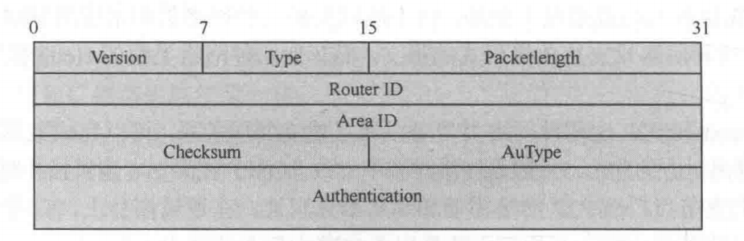
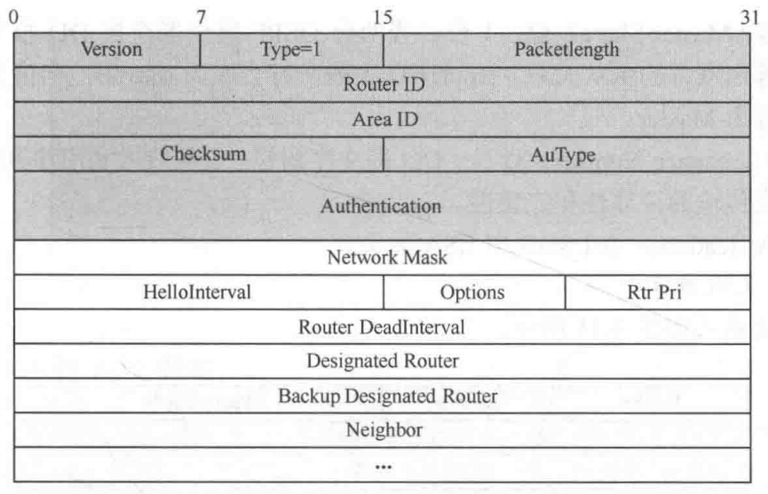
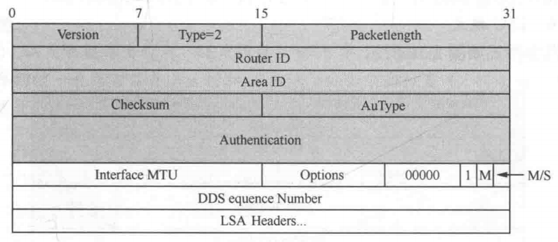
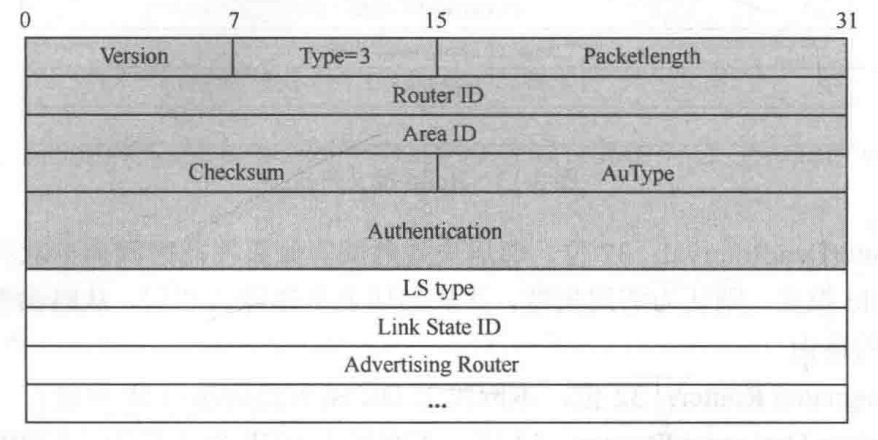
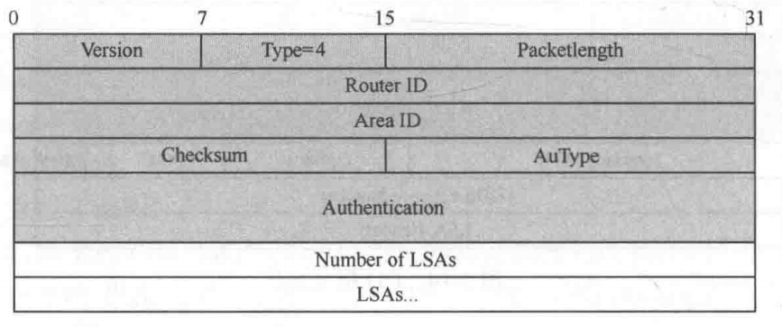
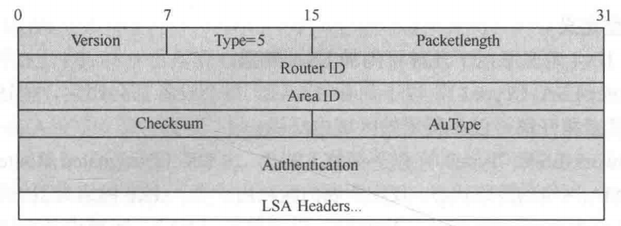
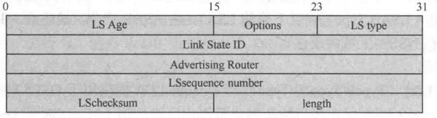
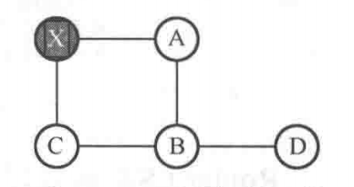

# OSPF 数据库同步及泛洪机制

## 一、OSPF 报文结构

### 1.报文类型

OSPF 共有 5 种类型的协议报文：

- Hello 报文：周期性发送，用来发现和维持 OSPF 邻居关系。
- DD 报文（DataBase Description Packet）：**描述了本地 LSDB 的摘要信息，用于两台路由器进行数据库同步**。
- LSR 报文（Link State Request Packet）：向对方请求所需的 LSA，只有在双方成功开始交换 DD 报文后才会向对方发出 LSR 报文。
- LSU 报文（Link State Update Packet）：向对方发送其所需要的 LSA 或者泛洪自己更新的 LSA。
- LSAck 报文（Link State Acknowledgment Packet）：用来对收到的 LSA 进行确认。

OSPF 工作在 IP 层，是个可靠的协议，协议内部包含确认机制。OSPF 报文中不需要确认的报文有 Hello 和 LSAck 报文。

### 2.OSPF 报文头

    
图 1 OSPF 报文头格式

    

- Version：8 位 OSPF 的版本号。对于 OSPFv2 来说，其值为 2；对 OSPFv3 来说，其值为 3；
- Type：8 位 OSPF 报文的类型；
  - 1：Hello 报文；
  - 2：DD 报文；
  - 3：LSR 报文；
  - 4：LSU 报文；
  - 5：LSAck 报文；
- Router ID：32 位，发送该报文的路由器标识。
- Area ID：32 位，**发送该报文的路由器所属区域**。
- AuType：16 位，验证类型如下。
  - 0：不验证；
  - 1：简单明文认证；
  - 2：MD5 认证。

### 3.Hello 报文

    
图 2 Hello 报文格式

    

Hello本报文本身并不承载 LSA 正文，RFC 2328 对 Hello 的总定义是：**`establish and maintain neighbor relationships`**，并且在支持广播/组播的网络上还能动态发现邻居。Hello 报文的作用可以总结为以下 5 点：

#### 3.1 发现邻居

Hello 会周期性从接口发出，在支持广播或组播能力的网络上，Hello 报文还能让路由器动态发现同网段里的其他 OSPF 路由器。Hello 报文能动态发现邻居依赖于 IP 组播技术，RFC 2328 规定，AllSPFRouters 组播地址为 **`224.0.0.5`**，**所有运行 OSPF 的路由器都应能够接收发往该地址的报文，且 Hello 报文始终发送到该地址**。当在路由器的某个接口上激活 OSPF 时，该接口会自动监听 AllSPFRouters 组播地址。因此路由器 A 不需要提前知道路由器 B 的 IP 地址，只要向 AllSPFRouters 发送报文，路由器 B 就能从中提取出路由器 A 的源 IP 和 Router ID，从而动态发现了 A 的存在。

另外，Hello 报文只能发现同网段内的路由器，根据 RFC 2328 文档，发送到 OSPF 组播地址的报文不应被转发，它们的设计目标就是只在单跳范围内传播；为确保这一点，这类报文的 IP TTL 必须设置为 1。因此，OSPF 的组播 Hello 只能在本地链路内传播，也就是当前二层广播域或当前 VLAN 内。

**在广播网络和物理点到点网络上，Hello 报文每隔 HelloInterval 秒发送一次，目的地址是 IP 组播地址 AllSPFRouters**。在虚链路上，Hello 报文以单播方式发送，也就是直接发给虚链路另一端的路由器，发送周期同样是 HelloInterval。在 **`Point-to-MultiPoint`** 网络上，每隔 HelloInterval 秒，会分别向每一个直连邻居发送独立的 Hello 报文。

#### 3.2 维持邻居关系（保活）

Hello 报文要持续发送、持续接收。Hello 报文中携带 **`RouterDeadInterval`**，它定义了本路由器多长时间收不到对方报文，就不再认为对方活跃，则认为邻居失效，并从邻居表里移除该邻居，从路由表里撤销指向其的路由。同时 Hello 报文中还包含该接口发送 Hello 报文的时间间隔，即 **`HelloInterval`**。

#### 3.3 参数校验

Hello 报文还承担参数一致性检查的职责。RFC 10.5 规定，收到 Hello 后必须检查 **`Network Mask`**、**`HelloInterval`** 和 **`RouterDeadInterval`** 是否与本接口配置一致；不一致就停止处理并丢弃。对于区域能力，还要检查 Options 字段中的 E-bit 是否与该区域的 **`ExternalRoutingCapability`** 匹配，如果区域是 Stub，则 E-bit 必须清零，否则必须置位，错了也要丢弃。

>E-bit 置位表示该区域（普通区域或者骨干区域）支持引入 Type 5 LSA 外部路由，E-bit 清零表示该区域（Stub 区域）不支持引入 Type 5 LSA 外部路由。

#### 3.4 建立并确认双向通信

Hello 报文里有一个邻居列表，表示最近收到过哪些路由器的 Hello 报文，如果本路由器出现在对方 Hello 的邻居列表中，就触发 **`2-WayReceived`**，否则触发 **`1-WayReceived`**，并停止继续处理。

系统会尝试将 Hello 报文的发送方与接收接口的某个邻居对应起来。如果接收接口连接的是广播网络、Point-to-MultiPoint 网络或 NBMA 网络，则通过 Hello 报文 IP 首部中的源 IP 地址来识别发送方。如果接收接口连接的是 P2P 或虚链路，则通过 Hello 报文 OSPF 首部中的 Router ID 来识别发送方。 

接口当前的邻居列表保存在接口的数据结构中。**如果找不到匹配的邻居（也就是说，这是第一次检测到这个邻居），就创建一个新的邻居并添加到邻居列表中。新创建的邻居，其初始状态设为 Down**。

#### 3.5 支持 DR/BDR 选举。

Hello 报文之所以能参与 DR/BDR 选举，是因为它已经携带了选举算法所需的关键信息：Router Priority、发送者当前认为的 Designated Router、发送者当前认为的 Backup Designated Router，以及邻居列表。根据 RFC 文档，The Designated Router is elected by the Hello Protocol. 

在上图 2 中的 **`Designated Router`** 表示本网段上 DR 路由器的 **接口** IP 地址，**`Backup DesignatedRouter`** 表示本网段上 BDR 路由器的 **接口** IP 地址（DR 和 BDR 都是接口的概念）。**`Neighbor`** 表示邻居列表，用 Router ID 标识，记录当前路由器已知的链路上所有邻居的 RID。**`Rtr Pri`** 表示 DR 优先级，默认为 1，如果为 0，则路由器不能参与 DR 或 BDR 的选举。Network Mask 表示发送 Hello 报文的接口所在网络的掩码。

### 4.DD 报文

    
图 3 DD 报文格式

    

DD 报文（Database Description，Type 2）的主要作用，并不是直接传送完整的链路状态信息，而是让两台路由器先对彼此的 LSDB 进行比对。DD 报文先告诉对端我这里有哪些 LSA、版本，从而让对端能够判断哪些 LSA 是一致的，哪些 LSA 缺失，哪些 LSA 版本较旧。因此 DD 报文只在邻接建立的 exstart 和 exchange 阶段使用，而真正缺失或需要更新的完整 LSA，则由后续的 LSR/LSU 机制来请求和传送。

在 exstart 阶段，双方发送的是空的 DD 报文，此时 DD 报文承担了协商功能，双方通过 DD 报文中的 I、M、MS 标志位来确定主从关系和初始序列号，后续再进入 exchange 过程。

在 exchange 阶段，DD 报文传递的并不是完整的 LSA，而是 LSDB 的摘要。RFC 2328 规定，LSDB 中的每一条 LSA 在 DD 报文中都是通过 LSA Header 的形式来描述的，并且只有当前一个 DD 报文被确认之后，才继续发送下一部分。当路由器收到并接受邻居发来的 DD 报文后，会逐条检查其中列出的 LSA Header，并与本地 LSDB 中对应的条目进行比较。如果发现本地没有该 LSA，或者本地已有副本但版本较旧，那么这条 LSA 就会被加入请求列表。后续，路由器再通过 LSR 报文向邻居请求这些具体的 LSA，而邻居则通过 LSU 报文返回完整内容。

DD 报文之所以能可靠地完成链路状态数据库（LSDB）摘要的同步，根本原因在于 OSPF 协议为其设计了严密的序列号控制与隐式确认机制。在 ExStart 阶段完成主从（Master/Slave）选举后，Exchange 阶段的数据交互便确立了严格的轮询模型：**交互始终由 Master 节点主动发起，Slave 节点在收到报文后，必须被动回复一个携带相同序列号的 DD 报文以完成隐式确认；确认无误后，Master 才会递增序列号并发送下一个摘要报文**。当主从双方均完成本地 LSA 摘要（LSA Headers）的交互后，邻居状态机将平滑过渡至 Loading 阶段，进而按需触发 LSR 与 LSU 报文的交互，以完成最终完成  LSDB 的精确同步。

在上图 3 中，**`Interface MTU`** 表示在不分片的情况下，此接口最大可发出的 IP 报文长度。华为默认不填充接口实际 MTU 值，所以值为 0；**`I（Initialization）`** 位表示当发送连续多个 DD 报文时，如果这是第一个 DD 报文，则置为 1，否则置为 0；**`M（More）`** **位表示当发送连续多个 DD 报文时，如果后续的 DD 报文中不再有 LSA 头，则置为 0**；**`M/S（Master/Slave）`** 位表示当两台 OSPF 路由器交换 DD 报文时，首先需要确定双方的主从关系，RouterID 大的一方会成为 Master，当值为 1 时表示发送方为 Master；**`DD Sequence Number`** 表示 DD 报文序列号；**`LSA Header`** 表示本端 LSDB 中 LSA 的头。

### 5.LSR 报文

    
图 4 LSR 报文格式

    

LSR 报文不参与 LSA 的常规网络泛洪过程，而是专用于 OSPF 数据库同步阶段的按需请求机制。其核心作用是在路由器交互 DD 报文并完成 LSDB 摘要比对后，向邻居路由器精确请求本地缺失或版本滞后 LSA 的完整数据载荷，从而确保双方链路状态数据库的一致性。LSR 的请求对象为特定的 LSA 实例，根据 RFC 2328 规定，**LSR 报文严格通过 LSA 头部的核心三元组——LSA 类型（LS Type）、链路状态 ID（Link State ID）和通告路由器（Advertising Router）——来唯一标识目标 LSA**。RFC 的原文是：The LSA header contains the LS type, Link State ID and Advertising Router fields.  The combination of these three fields uniquely identifies the LSA. 收到 LSR 的一方，需要按请求内容返回相应的 LSU。

**`LS type`** 表示 LSA 的类型号；**`Link State ID`** 表示根据 LSA 中的 LS Type 和 LSA Description 在路由域中描述一个 LSA；**`Advertising Router`** 表示产生此 LSA 的路由器的 Router ID。

### 6.LSU 报文

    
图 5 LSU 报文格式

    

LSU（Link State Update，链路状态更新报文） 的主要作用可概括为以下两个方面。

**（1）承载并泛洪新的或更新后的 LSA**

当网络拓扑或路由信息发生变化时，相关路由器会生成新的 LSA。这些 LSA 会被封装在 LSU 报文中，并在区域内传播泛洪，使各路由器能够及时更新各自的 LSDB。路由器在收到 LSU 后，会对其中携带的各条 LSA 分别进行检查，并与本地 LSDB 中的对应实例比较新旧。**若接收到的 LSA 更新，则将其安装到本地 LSDB 中，并继续向相应接口泛洪，以保证区域内链路状态信息的一致性**。

**（2）用于响应邻居的 LSR 请求，完成数据库同步**

在邻居建立邻接关系并进行数据库同步的过程中，路由器首先通过 DBD 报文识别本地缺失或版本落后的 LSA。随后，路由器通过 LSR 报文向邻居请求所需的具体 LSA，而对端则通过 LSU 报文返回这些完整的 LSA 内容。

在图 5 中的 LSU 报文中，**`Number of LSAs`** 字段表示此 Update 中所包含的 LSA 的数量，**`LSAs`** 字段表示多个完整 LSA 的内容。

### 7.LSAck 报文

    
图 6 LSAck 报文格式

    

LSAck 报文是对收到的、被泛洪的 LSA 做显式确认的报文，用于保证链路状态泛洪的可靠性。上图 6 中的 LSA Headers 表示 LSA 头列表，通过 LSA 头对收到的完整 LSA 做确认。一份 LSAck 可以对多份 LSU 中的 LSA 做确认。

#### 7.1 LSAck 确认方式

发送 LSU 的一方，会把自己发出去的每条 LSA 放进该邻居的 Link state retransmission list（链路状态重传列表）。根据 RFC 2328 的文档，LSAs flooded out an adjacency are placed on the adjacency's Link state retransmission list. These LSAs are retransmitted until they are acknowledged. **然后，发送方在收到对端的 LSAck 后，发送方会逐条去检查这条被确认的 LSA（即 LSAack 中包含的 LSA header）是否还在该邻居的重传列表中**；如果在，还要判断该 LSA 是否为自己之前发出去的 LSA 同一实例。如果是同一实例才会把这条 LSA 从重传列表中删除。

假设 R1 给 R2 发了一个 LSU，里面装了 3 条 LSA，**`LSA-A、LSA-B、LSA-C`**，R1 在发出去后，会把这 3 条都放进 R2 对应的重传列表中。随后 R2 收到后，可能发一个 LSAck，里面放了 3 个 LSA header，对应 A、B、C。这时 R1 在处理这个 LSAck 时，会逐条检查：**`LSA-A/LSA-B/LSA-C`** 是否在重传列表中，且确认的是不是同一实例。如果都匹配，R1 才把 **`A/B/C`** 都删掉。如果其中只有 A、B 匹配，而 C 没匹配到同一实例，那就只删 A、B，C 仍保留等待重传。**因此，LSAck 报文确认的是 LSA，而不是 LSU**。

#### 7.2 LSAck 的发送时机

每一条新收到的 LSA 都必须得到确认。**这种确认通常是通过发送 LSAck（链路状态确认）报文来完成的。不过，确认也可以通过发送 LSU 报文的方式隐式完成**。很多个确认可以合并到同一个 LSAck（链路状态确认）报文中一起发送。这种报文会从收到这些 LSA 的那个接口发回去。它的发送方式有两种：

1. 一种是延迟发送，即先暂存起来，等到定时间隔到达时再统一发送：采用延迟确认有几个好处，首先便于把多个确认合并到一个 LSA 报文中，其次可以通过组播的方式，让一个 LSAck 报文同时表示对多个邻居的确认。路由器进行延迟发送时，固定的发送间隔必须比较短，否则就会引发不必要的重传。
2. 一种是直接发送给某个特定邻居：直接确认则是在收到重复的 LSA 时，直接发给某个特定邻居。这种直接确认会在收到重复 LSA 后立即发送。

对于隐式确认，R1 之前已经把 LSA-X 泛洪给了 R2，正在等 R2 确认，所以 LSA-X 在 R1 针对 R2 的重传列表里。这时，R1 又从 R2 发来的 LSU 里收到了同一个 LSA-X。对 R1 来说，这说明 R2 已经收到了这个 LSA，而且还能把它继续发出来，于是 R1 可以把它当作对自己之前那次发送的隐式确认。**能充当隐式确认是因为 R1 发送 LSA-X 给 R2 并等待 R2 回复 LSAck 的原因是确保 R2 的 LSDB 里拥有这份最新版本的 LSA-X**。而 R2 能把 LSA-X 再发出来，说明 R1 的目的已经达到，因此可以作为隐式确认。

## 二、LSA 格式及类型

在 AS 内的每台路由器，根据路由器的分类产生一种或多种 LSA。收到的 LSA 的集合形成了 LSDB（Link-state Database）。OSPF 中对路由信息的描述都是封装在 LSA 中发布出去的。常用的 LSA 共有 6 种，分别为：Router-LSA、Network-LSA、Network-Summary LSA、ASBR-Summary-LSA、AS-External-LSA 及 NSSA-External LSA。

    

LS Age 表示 LSA 产生后所经过的时间，以 s 为单位。无论 LSA 是在链路上传送，还是保存在 LSDB 中，LS age 值都会不停地增长。默认下，泛洪时每经过一台路由器其 Age 增加 1。

- Options：E 标志位表示产生这条 LSA 的路由器（以及它所在的区域）是否支持接收和处理 **`Type-5 AS-external-LSA`**，如果 LSA 头部中的 E-bit 为 0，说明始发路由器位于一个 Stub 区域（Stub 区域拒绝任何 **`Type-5 AS-external-LSA`** 外部路由进入该区域），如果为 1，说明处于普通区域或骨干区域。在 Hello 报文里，N-bit 表示该接口所在区域是 NSSA，也就是该接口会发送和接收 Type-7 LSA；在 **`Type-7 LSA`** 的 LSA 头里，这同一个 bit 位置叫 P-bit，表示这条 Type-7 LSA 是否允许被 NSSA 边界路由器翻译成 Type-5 LSA。
- LS type 代表不同 LSA 类型。
- Link State ID：**与 LSA 中的 LS Type 和 Advertising Router 一起用来在 OSPF 中唯一标识一个 LSA**。
- Advertising Router：记录产生此 LSA 的路由器的 Router ID。
- LS sequence number：LSA 的序列号。序列号越大代表该 LSA 越新，其他路由器根据这个值可以判断哪个 LSA 是最新的。
- LS checksum：除了 LS age 外其他各域的校验和。可用于校验 LSA 的内容及用来确定该 LSA 是否最新。

IETF 为 IPv4 定义了以下几种可用的 LSA 类型。

- Router-LSA（Type1），以下简称 LSA1，每个设备都会产生，描述了设备的链路状态和开销，仅在所属的区域内泛洪。
- Network-LSA（Type2），以下简称 LSA2，**由 DR（Designated Router）产生，描述 MA 网络的链路状态，仅在所属的区域内泛洪（P2P 网络类型的链路上没有）**。
- Network-Summary-LSA（Type3），以下简称 LSA3，区域内某个网段的路由，由 ABR 产生 LSA3 向其他区域通告。LSA3 在区域间传递路由，但该 LSA3 泛洪范围仅在一个区域内。
- ASBR-Summary-LSA（Type4），以下简称 LSA4，**由 ABR 产生，描述到 ASBR 的路由和距离，通告给除 ASBR 所在区域的其他相关区域**，该 LSA4 的泛洪范围仅在一个区域。ABR 会在区域边界为其他区域再产生 LSA4 并继续泛洪。
- AS-external-LSA（Type5），以下简称 LSA5，由 ASBR 产生，描述到 AS 外部的路由，可泛洪到所有的区域（除了 STUB 区域和 NSSA 区域）。
- NSSA LSA（Type7），以下简称 LSA7，由 ASBR 产生，描述到 AS 外部的路由，仅在 NSSA 区域内泛洪。

## 三、泛洪机制

### 1.泛洪机制

OSPF 不同于矢量路由协议在于其路由是根据 LSDB 中的 LSA 计算出来的，所以 LSDB 的一致性及快速同步直接影响 OSPF 路由的收敛性能。Area 中所有 OSPF 路由器要有一个相同的 LSDB，LSDB 是 LSA 的集合，这些 LSA 在 Area 内泛洪给每台路由器，**泛洪的过程是路由器把自己产生或学来的 LSA 向所有其他邻居或路由器通告的过程**。

数据库包含所有 LSA，数据库中任何 LSA 的变化都会触发当前路由器通告该变化给邻居路由器并泛洪至所属区域，为了确保 LSDB 被及时更新且保证其内容的一致性，OSPF 泛洪使用 LSU 和 LSAck 来保证泛洪的可靠性。OSPF 的 LSU/LSAck 可以携带多份 LSA，通过在邻居之间泛洪 LSU/LSAck，最终通告到全网络。在点到点网络，更新以组播方式发送到 **`224.0.0.5`**，在点到多点、NBMA 类型和 Vlink 类型链路上则以单播方式泛洪给邻居。

每台路由器在一个接口收到泛洪的 LSA 报文，会继续向其他接口泛洪。例如，在 MA 网段上，若 DRother 向 DR/BDR 泛洪，则 DR 会以组播方式将 LSU（包含 LSA）向其他 DRother 泛洪。NBMA 网络上 DRother 单播给 DR/BDR，DR 再单播给 DRother。

泛洪过程是个可靠过程，有确认机制。其中每份泛洪的 LSA 都必须被确认，确认包括显式（ExplicitAck）或隐含确认（ImplicitAck），使用 Update 做确认的就是隐含确认，而使用 LSAck 做确认的就是显式确认。**例如，如果 LSA 接收者同样需要发送 LSU 给发送方，可显示包含需要被确认的 LSA 头来完成的确认，LSA 接收者不用再继续发送 LSAck**，这样可以减少单独确认 LSAck 的过程。

>LSU 和 LSAck 报文都可包含多个 LSA 的信息，但 LSU 携带完整的 LSA，而 LSAck 仅包含用来做确认的 LSA 头。

当一份 LSA 被泛洪出去，当前路由器会记录在该接口的所有邻居数量并为之维护重传列表，没有收到显示或隐含确认的 LSA 会在 5s 后单播重传更新（不管网络类型是什么都使用单播重传）。

### 2.路由器的泛洪行为

每台路由器都有相似的工作行为以生成一致的 LSDB。

1. 一个接口收到 LSA，存放到 LSDB 后，再从其他接口重新泛洪出去，泛洪也有水平分割的行为，例外是 DR 会把从一个 DRother 收到的 LSA 通过原接口重新通告给其他 DRother 路由器。**水平分割指的是某个接口收到了 LSA 之后，这台路由器通常不会再把这份 LSA 沿着同一个方向原样回灌出去**，而是主要向其他需要它的接口/邻居继续泛洪。Cisco 对经典 split horizon 的定义是从哪个接口学到的路由，就不再从哪个接口发布回去。
2. 重新通告的 LSA 和收到的 LSA 除 Age 增加 1 外，其他内容一致，如 checksum 等。
3. LSA 会泛洪到区域的边界。
4. 每台接收路由器先判断 LSDB 中是否已有该 LSA，没有则存储且转发，否则忽略。
5. 如果接收时没有判断是否已拥有该 LSA，或路由器没有停止转发，则会致 LSA 在 Area 内无休止地传递。

数据库同步是指邻居路由器之间在刚建立邻居关系后，彼此初次交换 LSDB 中 LSA 的过程。LSU 是传递 LSA 的 OSPF 报文。**不论是周期的、触发的，还是初始同步过程中，LSU 都属于泛洪的范畴（完整的 LSA 仅能使用 LSU 来传递）**。

### 3.LSDB 

LSDB 中每份 LSA 都有唯一的身份证 ID，由三个参数构成：

- LSA 类型；
- 链路状态 ID（Link State ID）；
- 通告路由器的 RouterID；

例如 R1 产生的 LSA1，它的类型为 RouterLSA，LinkStateID 为 **`1.1.1.1`**，通告路由器 **`1.1.1.1`**。LSDB 中的每份 LSA 都靠这个身份证 ID 来唯一标识。

泛洪是可靠的、周期性（30min）或触发产生的 LSA 通告过程。解释一下周期性的泛洪，LSA 重新起源的条件是当一条本路由器自己起源的 LSA 的 LS age 到达 **`LSRefreshTime`** 时，即使 LSA 的内容没有变化，也要重新生成一个新 LSA 实例。根据 RFC 2328 文档，This guarantees periodic originations of all LSAs. The value of LSRefreshTime is set to 30 minutes (1800S). 而且只要产生了 LSA 的新实例，它就会被加入 LSDB，并从适当的接口泛洪出去。因此，不管是链路状态、邻居状态等变化（触发泛洪）还是每 **`LSRefreshTime`** 分钟（周期性泛洪）都会产生 LSA 泛洪。

>**但是最重要的一点是，周期性主要针对 self-originated LSA 的 refresh，LSA 的广告者/起源者重新生成一个新 LSA 实例，然后这个新实例再在整个域内按 OSPF flooding 规则扩散**。

泛洪是把 LSA 向区域中的每条链路复制并通告的过程。全区域的泛洪会致路由器收到多份相同的 LSA，LSDB 中仅保留最新的。路由器仅泛洪最新的 LSA，相同 ID 的旧的 LSA 会被新的 LSA 所覆盖。一旦最新的 LSA 被所有路由器收到，泛洪就结束了。

判断相同 ID 的新的 LSA 要依次比较：LSA 序列号（Sequence Number）、LSA 报文校验和（Checksum）、LSA 年龄（LSA Age）。

- 序列号：采用线性递增的序列号，初始序列号从 **`0x80000001`** 到最大值 **`0x7FFFFFFF`**，序列号越大代表越新，LSA 会周期（30min）产生新的 LSA，每次产生的 LSA 序列号都会增加 1。
- Checksum：对刚收到的 LSA 做计算，Age 字域不在计算内。即使 LSA 存在 LSDB 中，路由器也会每 5 分钟重新计算一次。
- Age：LSA 的最大年龄是 3600s，LSA 在路由器间泛洪时每经过一跳年龄增加 1，在 LSDB 中存放时年龄也增加 1。若 LSA 的年龄达到 3600s（即 Maxage），路由器会从 LSDB 中清除该 LSA。**在拓扑稳定的场合下，每份存放在 LSDB 中的 LSA 间隔 30min 都会被周期产生的新 LSA 刷新**。

泛洪机制把 LSA 向区域中的每条链路通告，不论 LSA 从哪条链路泛洪到当前路由器，在路由器的 LSDB 中仅保存一份最新的 LSA。若路由器收到多份相同 ID 的 LSA，则依次比较序列号、Checksum 及 LSA Age，来判定是否继续泛洪该 LSA，还是终止泛洪。

- 如果收到的 LSA 本地数据库中没有，则接收该 LSA 并继续泛洪。
- 如果收到的 LSA 本地有，但收到的 LSA 比自己当前已有的 LSA 要新，则更新 LSDB 并泛洪新的 LSA。
- 如果收到的 LSA 比自己已有的 LSA 旧，则不接收该 LSA。
- 如果收到的 LSA 和自己路由器的 LSA 一样新，则忽略，并终止泛洪。
- 如果收到的 LSA 损坏，比如 Checksum 错误，则不接收该 LSA。

判断 LSA 新旧的规则如下。

- 序列号越大代表越新。
- 若序列号相同，则 Checksum 数值越大代表越新。
- 上述一致的情况下，继续比较 Age。
  - 若 LSA 的 Age 为 MaxAge，即 3600s，则该 LSA 被认定更新。
  - 若 LSA 间 Age 差额超过 15min，则 Age 小的 LSA 被认定更新。
  - 若 LSA Age 差额在 15min 以内，则二者视为相同新的 LSA，只保留先收到的一份 LSA。

#### 4.超时机制

LSDB 中 LSA 都有 Age，最大是 3600s，超过该值，则该 LSA 会从 LSDB 中被清除。LSDB 中 LSA 被清除的场景：

- 超过 MaxAge 被路由器自动清除；
- **LSA 起源路由器产生 MaxAge 的 LSA 并向区域中泛洪，收到的路由器用其更新自己 LSDB 中的 LSA。泛洪 MaxAge 的 LSA，其作用相当于毒化路由**；

LSA 的起源路由器，**可以主动撤销自己以前发布的那条 LSA**。做法是把这条 LSA 的 LS age 设置成 MaxAge，然后再按正常泛洪流程把它发出去。其他路由器收到后，会把这份 MaxAge 版本当成该 LSA 的较新实例来更新本地 LSDB；而且年龄为 MaxAge 的 LSA 不参与路由计算，直到整个区域/域内都把旧实例清掉。

还有一个关键限制只有 LSA 的起源者，才能对自己起源的 LSA 做这种提前老化处理。**根据 RFC 2328 文档，路由器只能 prematurely age 自己的 self-originated LSA，不能去这样处理别的路由器起源的 LSA**。

泛洪的过程是可靠的过程，每份 LSA 都要在 LSU 中通告给邻居，邻居要对收到的每份 LSA 做确认，如果没有收到用于确认的 LSAck，则 LSU 要 5s 后重传。可靠泛洪的结果使整个 Area 中的每台路由器都有完全一样的 LSDB。

#### 5.泛洪示例

    

X 路由器泛洪自己的 RouterLSA，其序列号为 **`8000000B`**，当网络稳定后，所有路由器 LSDB 中都有 X 的 LSA。某一时刻，X 路由器突然故障，修复上线后，网络有什么变化？

X 路由器突然故障后，来不及主动把自己的 LSA 做 MaxAge flush，所以其他路由器 LSDB 里仍会暂时保留这份旧的 X 的 Router-LSA。但 X 掉线后，A 和 C 作为与 X 直接相连的邻居，会立即感知到邻接状态变化，因此 A/C 会重新生成并泛洪各自新的 Router-LSA（A 和 C 自己更新后的 LSA），它们的共同特点是不再描述与 X 的连接关系。

全网收到 A 和 C 的新 LSA 后重新运行 SPF，X 掉线前的拓扑为：

- X 的 Router-LSA 说：我连着 A、C；
- A 的 Router-LSA 说：我连着 X、B；
- C 的 Router-LSA 说：我连着 X、B；

X 掉线后，A 和 C 会各自发新 Router-LSA，内容变成：

- A：我不再连着 X，只连着 B；
- C：我不再连着 X，只连着 B；

RFC 2328 在最短路径树的计算过程中规定，**当从顶点 V 考察到相邻顶点 W 时，如果 W 的 LSA 不存在，或者 W 的 LSA 已经 MaxAge，或者 W 的 LSA 没有一条回指到 V 的链路，那这条关系就不纳入 SPF 计算，转而检查 V 的下一条链路**。因此这时虽然 LSDB 里还保留着 X 的旧 LSA，但由于 A 和 C 已经不再回指 X，X 在拓扑图中已经失去双向可达性，变成一个孤立顶点，因此不会再进入最短路径树，路由表里也就没有到 X 的路由。

X 上线后，由于初次启动，X 会产生序列号为 **`80000001`** 的 LSA，其他相邻的路由器收到序号为 **`80000001`** 的 LSA，而 A 和 C 的 LSDB 中有 **`8000000B`** 的 LSA，同步后，X 会从 A 或 C 收到序列号 **`8000000B`** 的 X 曾经产生的 LSA。但 X 没有任何产生过该 LSA 的记录，所以 X 会立即产生一份更新的 LSA，序列号为 **`0x8000000C`**，去覆盖网络中的旧 LSA。此后序列号就从 **`0x8000000C`** 继续开始。

**路由器如果收到的自身始发（self-originated）的 LSA 比路由器当前实际产生的最新实例还要新（序列号更大），路由器要有动作，表明可能重启过，这种情况下，路由器必须加速 LSA 老化，序列号+1 以超过新 LSA 序列号，并立即泛洪**。同样的机制在 RouterID 冲突的场景下也会出现。如区域内非直连路由器的 RID 一致，也会彼此收到非自己产生的 LSA，但标识又是自己的 RID 的 LSA，接收路由器的做法是立即产生更高序列号的 LSA 并向外泛洪。重复的行为在网络一直发生，序列号一直递增，直至其中一台设备自动调整自己的 RID，RID 不再冲突为止。