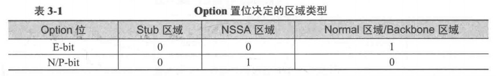
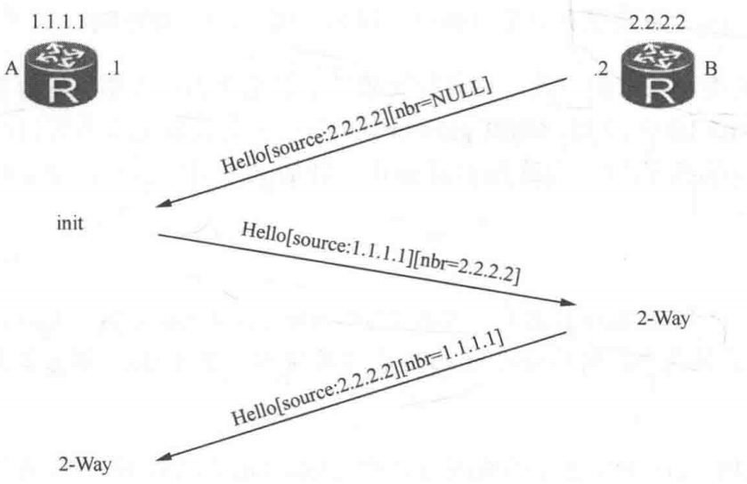
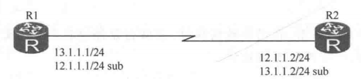
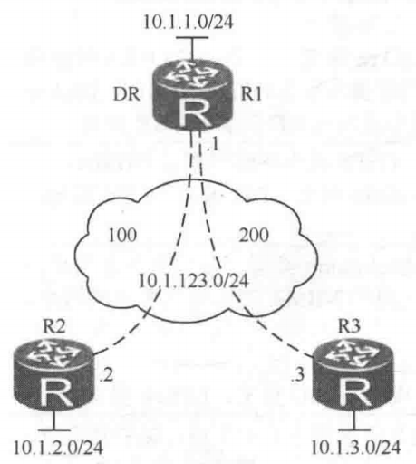
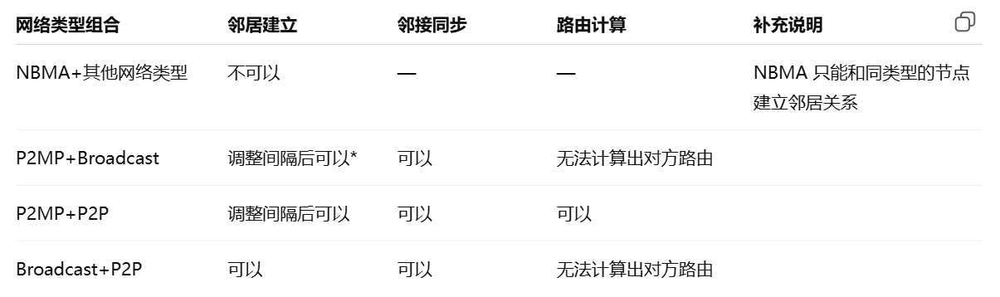

# OSPF 邻居和网络接口类型

## 一、OSPF 邻居关系的建立和握手过程

OSPF ( Open Shortest Path First ) 是由 IETF 开发的链路状态路由协议，广泛应用于各种网络环境中。OSPF 使用 Dijkstra 算法计算最短路径，收敛速度快，具有层次化的多区域设计，常用于大型园区网、企业网或城域网。当前版本为 v2，主要标准为 RFC1583 和 RFC2328。OSPFv3 主要用于 IPv6，参考标准为 RFC5340。

### 1.邻居发现

OSPF 通过 Hello 报文发现并维护邻居关系。邻居关系不同于邻接关系，只有处于 2-Way 状态的路由器才能建立双向邻居关系。

OSPF 通过 Hello 协议发现、维护邻居关系，并验证双方是否具备双向通信能力。严格来说，路由器仅仅收到对端的 Hello 报文，只能说明发现了对方；**<font color="red">只有当本路由器在对端 Hello 报文的邻居列表中看到了自己的 Router ID，才说明双向通信已经建立，邻居状态进入 2-Way</font>**。与此同时，Hello 协议在广播网络和 NBMA 网络上还承担 DR/BDR 选举职责。

在 OSPF 中，邻居关系（neighbor relationship）与邻接关系（adjacency）必须严格区分。邻居关系解决的是双方是否通过 Hello 相互发现并确认双向可达的问题；邻接关系则是在邻居的基础上进一步建立的数据库同步关系，其目的是交换路由信息并同步链路状态数据库（LSDB）。因此，并不是所有邻居都会成为邻接，RFC 2328 明确规定：**_Not every two neighboring routers will become adjacency_**，并不是所有的邻居关系都会变成邻接关系。

从状态机角度看，Init 状态表示已经收到了邻居的 Hello，但尚未确认双向通信；2-Way 状态表示双向通信已经建立。后续需要进一步建立邻接时，**<font color="red">状态才会从 2-Way 继续进入 `ExStart`、`Exchange`、`Loading`，最终达到 Full。在这个过程中，双方先通过 Database Description（DBD）报文交换各自数据库的摘要信息，再通过 Link State Request（LSR）补齐缺失的 LSA，此时双方的数据库才被视为已经同步，路由器才算真正完全邻接（adjacent）</font>**。如果没有建立邻接的必要，邻居状态就会停留在 2-Way，而不会继续进入 Full。

是否需要从 2-Way 继续建立邻接，取决于网络类型以及 DR/BDR 角色。在点到点网络、P2MP 网络和虚链路上，只要邻居可达，通常都会进一步建立邻接；而在广播网络和 NBMA 网络上，并不是所有邻居两两之间都要建立邻接，通常只有与 DR、BDR 之间才建立邻接，其他普通路由器之间往往只保持 2-Way。

所有启用 OSPF 的接口都会发送 Hello 报文，发送间隔和目的地址根据网络类型不同而不同。

- 在广播和点到点网络中: Hello 报文每 10 秒发送一次。
- 在 NBMA 和 P2MP 网络中: Hello 报文每 30 秒发送一次。

在广播、点到点和点到多点网络中，OSPF 使用组播（**`224.0.0.5`** — 所有 OSPF 路由器）自动发现邻居，在 NBMA 网络中，邻居必须手动配置。

>大多数现代网络使用以太网，默认 OSPF 网络类型为 Broadcast。**`PPP/HDLC/FrameRelay`** 点到点链路被视为 OSPF P2P；非广播 FrameRelay（如物理或多点子接口）、X.25、ATM 可配置为 OSPF NBMA 或 P2MP。

### 2.邻居建立条件

路由器必须在 Hello 报文中同意某些参数才能建立邻居关系。参数包括：

- **`Hello/Dead Interval`**: 时间一致性要求。如果 Hello 间隔为 10s，Dead 间隔默认是 4×该值（即 40s）。
- **`Area ID`**: 邻居必须位于同一区域。Area ID 出现在所有 OSPF 报文头部，而不仅仅是 Hello 报文。
- **`Area Type`**: 必须匹配。由 Hello 报文中的 Option 字段确定；**`bits E`** 和 **`N/P`** 有不同含义取决于其位置，具体如下所示：

<div align="center">
    <div align="center" style="color: #F14; font-size:13px; font-weight:bold">图 1 OSPF bits E 和 N/P 置位含义</div>
    
</div>

>Stub 和 Totally Stub 区域类型具有相同的区域位置；同样，NSSA 和 Totally NSSA 具有相同的区域位置。

- 认证类型和密钥必须匹配: 只有当认证通过时，才能建立 OSPF 邻居关系；
- **`Router ID`** 冲突: **<font color="red">OSPF Router ID 可以手动配置或由系统自动选择；优先选择 Loopback 接口</font>**。当直连路由器时，其 Router ID 不能相同；

>说明：Router ID 和 Area ID 认证信息出现在 OSPF 头部；Hello 报文间隔、Dead 间隔和网络掩码出现在 Hello 报文中。

影响 OSPF 邻居关系建立的原因包括：Hello/Dead 间隔不一致、直连路由器 Router ID 冲突、认证失败、区域类型不匹配或 Area ID 不一致。

### 3.邻居关系建立过程

OSPF 邻居的建立过程：

- 三步握手：即 OSPF 用三次 Hello 完成双方双向确认的报文过程；
- **`Down`**、**`Init`**、**`Two-way`** 状态；

邻居之间发送 hello 报文的状态机变化如下所示：

```c{.line-numbers}
                                   +----+
                                   |Down|
                                   +----+
                                     |\
                                     | \Start
                                     |  \      +-------+
                             Hello   |   +---->|Attempt|
                            Received |         +-------+
                                     |             |
                             +----+<-+             |HelloReceived
                             |Init|<---------------+
                             +----+<--------+
                                |           |
                                |2-Way      |1-Way
                                |Received   |Received
                                |           |
              +-------+         |        +-----+
              |ExStart|<--------+------->|2-Way|
              +-------+                  +-----+
```

上图中 **`2-Way Received`** 代表收到含自己 Router ID 的 Hello 报文，根据 RFC 文档，**<font color="red">Bidirectional communication has been realized between the two neighboring routers. This is indicated by the router seeing itself in the neighbor's Hello packet</font>**；**`1-Way Received`** 代表收到不含自己 Router ID 的 Hello 报文，根据 RFC 文档，**<font color="red">An Hello packet has been received from the neighbor, in which the router is not mentioned.  This indicates that communication with the neighbor is not bidirectional.</font>**。

场景：A—B 两台路由器，初始化邻居关系建立过程，A 接收 B 的 Hello 报文过程中，状态变化过程如下。

<div align="center">
    <div align="center" style="color: #F14; font-size:13px; font-weight:bold">图 2 OSPF 邻居关系建立过程</div>
    
</div>

- **`Down`** 状态：邻居的初始状态。但初始时，邻居的 **`Router ID 2.2.2.2`** 还没有出现在 OSPF 邻居列表里；
- **`Init`** 状态：当路由器 A 收到邻居的 Hello 报文，且该 Hello 报文中的 **`Active Neighbor`** 字域中没有包含 A 自己的 **`Router ID (1.1.1.1)`** 时，A 为该邻居设置的状态为 Init；
- **`2-Way`** 状态：当路由器 A 再次收到同一邻居的 Hello 报文，且该 Hello 报文中 **`Active Neighbor`** 字域中包含了 A 自己的 **`Router ID (1.1.1.1)`** 时，A 为该邻居设置的状态为 2-Way。只有当 A、B 双方邻居都进入 2-Way 状态时，才表明 A、B 之间建立了双向邻居关系；

>邻居表中邻居处于 Init 状态仅代表单向邻居建立起来，**`2-Way`** 代表双向邻居已建立起来。

### 4.邻接关系建立过程

**<font color="red">OSPF 路由器在双向邻居关系建立完成后，开始建立邻接关系</font>**。在广播和非广播（NBMA）网络中，邻接关系发生在 DR 和 BDR 选举之后，在其他网络类型中没有 DR/BDR 选举过程，邻居关系建立完成后即开始建立邻接关系。邻接建立过程如下图所示。

根据 RFC 的文档，Adjacencies are established with some subset of the router's neighbors. **<font color="red">Routers connected by point-to-point networks,Point-to-MultiPoint networks and virtual links always become adjacent</font>**. On broadcast and NBMA networks, all routers become adjacent to both the Designated Router and the Backup Designated Router.

对于点对点、点对多点以及虚链路网络类型，邻居关系建立完成后，路由器之间会自动建立邻接关系；对于广播和 NBMA 网络类型，因为这两类网络是多接入网络，一条二层网络上可能挂很多台路由器。如果所有路由器两两都建 Full 邻接，控制平面开销会迅速膨胀。**RFC 2328 规定，在广播和 NBMA 网络上，所有路由器都与 DR、BDR 建立邻接，而不是彼此全部建邻接**。

```c{.line-numbers}
                                  +-------+
                                  |ExStart|
                                  +-------+
                                    |
                     NegotiationDone|
                                    +->+--------+
                                       |Exchange|
                                    +--+--------+
                                    |
                            Exchange|
                              Done  |
                    +----+          |      +-------+
                    |Full|<---------+----->|Loading|
                    +----+<-+              +-------+
                            |  LoadingDone     |
                            +------------------+
```

邻接关系是指邻居路由器之间完成 LSDB 同步的过程，也称为 LSA 泛洪过程。同步完成后，双方邻居进入 FULL 状态。**<font color="red">在广播或非广播（NBMA）网络中，DRother 路由器之间保持 2-Way 状态，而与 DR/BDR 建立 FULL 邻接关系。在其他网络类型中，邻居关系建立为 2-Way 状态后直接开始建立邻接关系，无需 DR/BDR 选举过程</font>**。

邻接关系的状态迁移过程如下所示：

#### 4.1 信息交换初始状态（ExStart）

**<font color="red">首先是信息交换初始状态（ExStart）</font>**：在这一状态下，双方首先交换空的 DD 报文，用于确定：
  - Master/Slave 关系；
  - 初始 DD 的初始序列号；
  - 比较接口 MTU（可选）；

在 ExStart 状态下，路由器互相发送的空 DD 报文中置 I（Initialize），M（More）及 MS（Master/Slave）位。

- I 位：初始化位，仅头两份 DD 报文中置该位，代表同步过程开始；
- M 位：如果 M 位=0，则代表后续 DD 报文中没有 LSA Summary 要传。**<font color="red">任何一方 M 位不为 0，Master 就要继续发送 DD 报文，Slave 收到之后，不论是否还有 LSA Summary 要传递，一定要回应 DD 报文</font>**；
- M/S：初始双方均认定自己是 Master，所以 M/S 均置位。双方收到对方的 DD，**Router ID 高的一方为 Master，其后续 DD 报文中，M/S 会一直置位**。Master 会一直发送 DD 报文，Slave 回应 DD 报文，Slave 回应的 DD 报文是对 Master 发送的 DD 报文的确认。此过程持续到双方的 LSA 头都交换完成。

下面就是空的 DD 报文，I 位、M 位及 M/S 位均置位。图中不协商 MTU，所以 MTU 默认为 0；

```c{.line-numbers}
Open Shortest Path First
    OSPF Header
    OSPF DB Description
        Interface MTU: 0
        Options: 0x02 (E)
            0... .... = DN: Not set
            .0.. .... = O: Not set
            ..0. .... = DC: Demand Circuits are NOT supported
            ...0 .... = L: The packet does NOT contain LLS data block
            .... 0... = NP: NSSA is NOT supported
            .... .0.. = MC: NOT Multicast Capable
            .... ..1. = E: External Routing Capability
            .... ...0 = MT: NO Multi-Topology Routing
        DB Description: 0x07 (I, M, MS)
            .... 0... = R: OOBResync bit is NOT set
            .... .1.. = I: Init bit is SET
            .... ..1. = M: More bit is SET
            .... ...1 = MS: Master/Slave bit is SET
        DD Sequence: 510
```

#### 4.2 信息交换状态（Exchange）

选举出 Master 后，**<font color="red">Slave 路由器向 Master 回送 DD 报文，其中包含 LSDB 中的 LSA 头（LSA summary，LSA 摘要）列表，并使用 Master 的序列号。Master 也把自己的 LSA 头列表用 DD 发送，序列号增加 1，同时，Slave 收到后，会回应相同序列号的 DD 报文</font>**。任何一侧只要还有未传递完的 LSA 头，Master 就一定要产生 DD 报文并由 Slave 回应。Exchange 阶段通过这种可靠的 DD 交互，完成快速交换 LSA 头。

Master 和 Slave 的角色分工不同，Master 是由 RID 高的路由器充当，负责发送序列号递增的 DD 报文，如果 Master 没能收到回应，则 Master 间隔 5s 重传该 DD 报文，直至收到 Slave 的 DD 报文。

下面举例说明 R1 和 R2 之间的 exstart 和 exchange 过程。假设 R1 的 Router ID 相对 R2 较小，并且 R1 最终成为 slave，R2 最终成为 master。R1 和 R2 之间的 DD 交换过程遵守前面所述的 4 条规则：

- ExStart 阶段双方发送的是空 DD 报文，并且 **`I=1、M=1、MS=1`**，目的是协商主从，而不是正式交换 LSA Summary，根据 RFC 文档，**<font color="red">This is the first step in creating an adjacency between the two neighboring routers.  The goal of this step is to decide which router is the master, and to decide upon the initial DD sequence number.</font>**；
- 主从关系一旦确定，后续整个 Exchange 过程以 Master 选定的 DD sequence number 为唯一基准；未当选一方在 ExStart 中自行提出的序列号不再生效。
- 在 Exchange 状态下，Master 负责推进 DD 序列并驱动交换节奏，Slave 负责按 Master 的节奏进行确认性应答，即用相同的序列号回包；
- DD 交换的结束条件是双向收尾完成，而不是某一方已经没有更多摘要可发，根据 RFC 文档，**<font color="red">The Database Exchange Process is over when a router has received and sent Database Description Packets with the M-bit off.</font>**。

**（1）Master 和 Slave 都还有多份摘要要发送**

```c{.line-numbers}
// R1 (RID较小，最终成为 Slave)，R2 (RID较大，最终成为 Master)

ExStart
D-D (Seq=x, I=1, M=1, MS=1, empty)  ----------------------->
<-----------------------  D-D (Seq=y, I=1, M=1, MS=1, empty)


Exchange
D-D (Seq=y, I=0, M=1, MS=0)  ------------->
<------------  D-D (Seq=y+1, I=0, M=1, MS=1)

D-D (Seq=y+1, I=0, M=1, MS=0)  ----------->
<------------  D-D (Seq=y+2, I=0, M=1, MS=1)

D-D (Seq=y+2, I=0, M=1, MS=1) ------------>
<------------ D-D (Seq=y+3, I=0, M=1, MS=1)

D-D (Seq=y+3, I=0, M=1, MS=0, last) ------->

......

<------------ D-D (Seq=y+n, I=0, M=1, MS=1)
D-D (Seq=y+n, I=0, M=1, MS=0) ------------->
```

**（2）Master 还有多份摘要要发送，Slave 没有了**

```c{.line-numbers}
ExStart
RT1 -> RT2 : D-D (Seq=x, I=1,M=1,MS=1, empty)
RT1 <- RT2 : D-D (Seq=y, I=1,M=1,MS=1, empty)

Exchange
RT1 -> RT2 : D-D (Seq=y,   M=0, MS=0, S1-last)     // RT1 发送 LSA 摘要完毕 
RT1 <- RT2 : D-D (Seq=y+1, M=1, MS=1, M1)

RT1 -> RT2 : D-D (Seq=y+1, M=0, MS=0, empty/ack)
RT1 <- RT2 : D-D (Seq=y+2, M=1, MS=1, M2)

RT1 -> RT2 : D-D (Seq=y+2, M=0, MS=0, empty/ack)
RT1 <- RT2 : D-D (Seq=y+3, M=1, MS=1, M3)

RT1 -> RT2 : D-D (Seq=y+3, M=0, MS=0, empty/ack)
RT1 <- RT2 : D-D (Seq=y+4, M=0, MS=1, M4-last)

RT1 -> RT2 : D-D (Seq=y+4, M=0, MS=0, empty/ack)
```

这里从 **`Seq=y`** 开始，slave 自己其实已经没更多 LSA 摘要需要发送了，所以 slave 很早就把 **`M=0`** 置出来了。但交换并不能结束，因为 master 连续发来的 **`y+1/y+2/y+3`** 都还是 **`M=1`**，说明 Master 这边还没发完。所以 slave 还是必须继续回 **`y+1/y+2/y+3`**。因此 slave 回复 DD，不只是为了发自己的 LSA 摘要，还为了确认 master 的上一份 DD，并维持整个主从序列继续前进。

**（3）Master 没有了，Slave 还有多份摘要要发送**

```c{.line-numbers}
ExStart
RT1 -> RT2 : D-D (Seq=x, I=1,M=1,MS=1, empty)
RT1 <- RT2 : D-D (Seq=y, I=1,M=1,MS=1, empty)

Exchange
RT1 -> RT2 : D-D (Seq=y,   M=1, MS=0)
RT1 <- RT2 : D-D (Seq=y+1, M=0, MS=1, last)

RT1 -> RT2 : D-D (Seq=y+1, M=1, MS=0)
RT1 <- RT2 : D-D (Seq=y+2, M=0, MS=1, empty)

RT1 -> RT2 : D-D (Seq=y+2, M=1, MS=0, S3)
RT1 <- RT2 : D-D (Seq=y+3, M=0, MS=1, empty)

RT1 -> RT2 : D-D (Seq=y+3, M=0, MS=0, last)
```

虽然 Master 在 **`Seq=y+1`** 就已经把自己的摘要发完了，但只要它收到 Slave 的报文里 **`M=1`**，就说明 Slave 还没结束，因此 Master 仍要继续发新的 DD 来推进节奏，直到 Slave 也发出自己的最后一个 **`M=0`**。

根据 RFC 文档，Master 和 Slave 的行为如下所示：

- Master：Increments the DD sequence number in the neighbor data structure. If the router has already sent its entire sequence of Database Description Packets, and the just accepted packet has the more bit (M) set to 0, the neighbor event ExchangeDone is generated. Otherwise, it should send a new Database Description to the slave.
- Slave：Sets the DD sequence number in the neighbor data structure to the DD sequence number appearing in the received packet. The slave must send a Database Description Packet in reply. If the received packet has the more bit (M) set to 0, and the packet to be sent by the slave will also have the M-bit set to 0, the neighbor event ExchangeDone is generated.Note that the slave always generates this event before the master.

>ExchangeDone：Both routers have successfully transmitted a full sequence of Database Description packets. Each router now knows what parts of its link state database are out of date.

上述 RT1 和 RT2，都必须在本端确认双方完整的 DBD 交换已经结束之后，才会离开 Exchange；离开后如果还有 LSA 要请求，就进入 Loading，否则直接进入 Full。

**根据上述的讨论可知 Exchange 过程中，DD 交互过程是可靠的。Master 发送 **`seq=y+n`** 的报文，Slave 回应 **`seq=y+n`** 的报文**，Master 和 Slave 的 DD 报文中 M 都不置位，Exchange 过程才结束。

```c{.line-numbers}
            Loading    ------------------------>
                                LS Request                   Full
                       <------------------------
                                LS Update
                       ------------------------>
                                LS Request
            Full       <------------------------
                                LS Update
```

#### 4.3 加载状态（Loading）

在这一状态下，**<font color="red">本地路由器将会向它的邻居路由器发送链路状态请求数据包 LSReq，以请求本地 LSDB 中没有的 LSA</font>**。收到 LSReq 的报文，路由器会用包含完整的被请求的 LSA 的 LSU 做回应。请求方收到 LSU 后，如果无误，则 LSAck 确认该 LSU。一份 LSAck 可同时为多份 LSUpdate 做确认。

#### 4.4 完整状态（Full）

在 FULL 状态下，邻居路由器之间已完成同步过程，建立起完全邻接关系。

### 5.影响邻居/邻接关系建立的问题

以下几种原因可能影响到邻居关系的建立，也可能影响到邻接关系的建立。下面主要介绍主 IP 网络和掩码的影响。

Hello 报文中，携带有接口主 IP 网络的掩码，Hello 报文中通过掩码和报文的源 IP 地址，可判定邻居双方是否在同一个主 IP 网络。**在 OSPF 里，接收方会用收到的 Hello 报文中的 Network Mask 字段，再结合这个 Hello 报文的源 IP 地址（接口的主 IP，相对于从 IP 来说），通过计算，去判断对端接口所在的主 IP 网络是否与自己一致**。

主 IP 网络是接口配置的第一个 IP 地址网络。这里解释一下主 IP 的概念，一般情况下，一个接口只需配置一个主 IP 地址，但在有些特殊情况下需要配置从 IP 地址。比如，一台路由器通过一个接口连接了一个物理网络，但该物理网络的计算机分别属于 2 个不同的网络，为了使路由器与物理网络中的所有计算机通信，就需要在该接口上配置一个主 IP 地址和一个从 IP 地址。**<font color="red">路由器的每个三层接口可以配置多个 IP 地址，其中一个为主 IP 地址，其余为从 IP 地址，每个三层接口最多可配置 31 个从 IP 地址</font>**。

<div align="center">
    <div align="center" style="color: #F14; font-size:13px; font-weight:bold">图 3 主 IP 网络不一致的路由器 R1 和 R2</div>
    
</div>

在上图中，R1 通告的 OSPF 报文的源 IP 地址是 **`13.1.1.1`**，掩码是 24，主 IP 网络是 **`13.1.1.0/24`**，同理 R2 的主 IP 网络是 **`12.1.1.0/24`**。在上图中，R1 的接口有一个主 IP 地址 **`13.1.1.1/24`** 和一个从 IP 地址 **`12.1.1.1/24`**，R2 的接口有一个主 IP 地址 **`12.1.1.1/24`** 和一个从 IP 地址 **`13.1.1.1/24`**。最终计算时均以 R1 和 R2 上的主 IP 网络为准，R1 和 R2 的主 IP 网络不一致。

如果这条链路是点到点链路，则 R1 和 R2 能建立邻居关系。如果是广播网络类型，则不能建立邻居关系。根据 RFC 的文档，**<font color="red">the values of the Network Mask, HelloInterval, and RouterDeadInterval fields in the received Hello packet must be checked against the values configured for the receiving interface.  Any mismatch causes processing to stop and the packet to be dropped. However, there is one exception to the above rule: on point-to-point networks and on virtual links, the Network Mask in the received Hello Packet should be ignored.</font>**。

**（1）NMBA 和广播网络检查掩码**

图 3 中，如果直连链路是以太网，当 R1 收到 R2 的 Hello 报文后，根据报文的源 IP 地址和 Hello 中的接口掩码，可算出 R2 的主 IP 网络和 R1 的主 IP 网络二者不一致，**由于 OSPF 设计要求接在同一个广播网络上的节点的主 IP 网络由虚节点来表达，虚节点不允许网络上有多个主 IP 网络，所以建立邻居关系时，不允许主 IP 网络不一致的网络节点间建立邻居关系**。这里的虚节点不是 RFC 中的正式术语，通常是很多工程师口中的伪节点（pseudonode）。

OSPF 在描述网络拓扑时，会把链路状态数据库抽象成一张有向图，图中的顶点既包括路由器，也包括网络。对于物理点到点链路，OSPF 会把两台路由器看成直接相连；而对于广播网络或 NBMA 这类多接入网络，OSPF 的处理方式不同，OSPF 不会把同一网段上的路由器简单看成两两直连的关系，而是把这整段共享网络看成一个统一的网络节点（network vertex）。这样一来，挂在这段网络上的所有路由器，都是通过这个共同的网络节点彼此关联的。

RFC 2328 的原文就是："The Autonomous System's link-state database describes a directed graph. The vertices of the graph consist of routers and networks" 以及 "When multiple routers are attached to a broadcast network, the link-state database graph shows all routers bidirectionally connected to the network vertex"。

因此在广播网络或 NBMA 网络中，OSPF 并不是把同一网段上的路由器之间都看成独立的点到点关系，而是把整段共享链路抽象成一个统一的 transit network 节点。这个网络节点在链路状态数据库中由 DR 代表该网络生成 Type 2 Network-LSA 来描述，LSA 中携带该网络的掩码，并列出当前连接在这段网络上的路由器集合。同时，LSA 的 Link State ID 使用 DR 的接口地址，结合该唯一的网络掩码，就可以确定这段共享网络对应的 IP 网络。也就是说，在 OSPF 的建模里，同一个广播网络在 LSDB 和 SPF 计算中应当表现为一个统一的网络对象，而不是多个彼此独立、各自属于不同主 IP 网络的对象。

正因为如此，接在同一个广播网络上的路由器，必须对这段共享网络到底属于哪个主 IP 网络有一致的认识。R1 根据自己的主 IP 地址和掩码认为这段以太网属于 **`13.1.1.0/24`**，而 R2 根据自己的主 IP 地址和掩码认为它属于 **`12.1.1.0/24`**，那么双方不在同一个主网段中，OSPF 就不会允许它们建立邻居关系。

总结来说，既然这段广播网络在 OSPF 里被抽象成一个统一的 transit network 节点，并且由 Type 2 Network-LSA 用一个网络掩码来描述，那么它就只能对应一个统一的网络地址/掩码视图。如果同一段广播网络上同时出现多个不同的主 IP 网络，OSPF 就无法把它稳定地表示成一个一致的网络节点，因此会在 Hello 检查阶段直接拒绝建立邻居。

**（2）点到点网络不检查掩码**

图 3 中，默认情况下，R1 和 R2 间是点到点类型的网络，在 OSPF 中，点到点网络类型的节点间都可以独立表达自己接口的所有网络（使用 stub 类型 link），彼此间没有关系，建立邻居关系没有限制，所以 R1 和 R2 间建立邻居关系时既不检查掩码，也不检查源地址，能正常建立邻居关系。

>结论：**<font color="red">OSPF 网络类型，如果是广播或非广播（NBMA）网络，则接在该网络上的所有节点上的主 IP 网络必须一致才能建立邻居关系。如果网络类型是 P2P 或 P2MP，则没有此要求</font>**。

## 二、OSPF 网络类型

OSPF 接口根据链路类型可分成 4 种网络类型：

- Point-to-point networks（点对点网络）；
- Broadcast networks（广播网络）；
- NonBroadcast Multi-Access（NBMA）networks（非广播多接入网络）；
- Point-to-Multipoint networks（点对多点网络）；

网络类型分类如下所示：

### 1.广播类型

当链路层协议是 Ethernet 时，缺省情况下，OSPF 认为网络类型是 Broadcast。**<font color="red">在该类型的网络中，通常以组播形式发送 Hello 报文、LSU 报文和 LSAck 报文</font>**，以单播形式发送 DD 报文和 LSR 报文。

Broadcast 网络是以太网等网络上的默认网络类型。RFC 文档对广播网络的定义是：Networks supporting many (more than two) attached routers, **together with the capability to address a single physical message to all of the attached routers (broadcast)**. Neighboring routers are discovered dynamically on these nets using OSPF's Hello Protocol. The Hello Protocol itself takes advantage of the broadcast capability. The OSPF protocol makes further use of multicast capabilities, if they exist. Each pair of routers on a broadcast network is assumed to be able to communicate directly. An ethernet is an example of a broadcast network。它对网络的要求是接在网络上的所有节点直接建立全互联的邻居，并自动选举 DR，完成和 DR 的同步。选举 DR 需要引入 Wait 时间，所以 Broadcast 网络上的邻居震荡时网络收敛时间较长。故很多园区网络中，如果网段只有两个 OSPF 节点，则使用 Point-to-Point 网络类型去替换需要选择 DR 的 Broadcast 网络类型，以提高收敛速度。

在广播网络中，**`224.0.0.5`** 的组播地址为 OSPF 设备的预留 IP 组播地址，这条链路上所有运行 OSPF 的路由器都要监听；而 **`224.0.0.6`** 这个组播地址是为 **`OSPF DR/BDR (Backup Designated Router)`** 的预留 IP 组播地址，这条链路上只有 DR 和 BDR 要监听。**<font color="red">在广播网络上，所有路由器都向 AllSPFRouters 发送 hello 报文，DR 和 BDR 把 **`LSU/LSAck`** 发到 AllSPFRouters，而其他路由器（DROther）把 **`LSU/LSAck`** 发到 AllDRouters</font>**。另外，LSU 的重传始终是直接发给邻居，不是再发组播。RFC 的原文为：The only packets not sent as unicasts are on broadcast networks; on these networks Hello packets are sent to the multicast destination AllSPFRouters, the Designated Router and its Backup send both Link State Update Packets and Link State Acknowledgment Packets to the multicast address AllSPFRouters, while all other routers send both their Link State Update and Link State Acknowledgment Packets to the multicast address AllDRouters.

LSU（Link State Update，链路状态更新报文） 的主要作用可概括为以下两个方面。

**（1）承载并泛洪新的或更新后的 LSA**

当网络拓扑或路由信息发生变化时，例如链路状态变化、接口开销调整、DR 重新选举，或者外部路由信息发生变更，相关路由器会生成新的 LSA。这些 LSA 会被封装在 LSU 报文中，并按照 OSPF 的 flooding 机制在区域内传播，使各路由器能够及时更新各自的链路状态数据库（LSDB）。根据 RFC 2328 的定义，路由器在收到 LSU 后，会对其中携带的各条 LSA 分别进行检查，并与本地 LSDB 中的对应实例比较新旧。**<font color="red">若接收到的 LSA 更新，则将其安装到本地 LSDB 中，并继续向相应接口泛洪，以保证区域内链路状态信息的一致性</font>**。

作为 DROther，它在该网段上通常会把 LSU 发到 **`224.0.0.6`**（AllDRouters），因此 DR 和 BDR 会收到。随后由 DR 在该广播网段上向 **`224.0.0.5`** 继续泛洪。

**（2）用于响应邻居的 LSR 请求，完成数据库同步**

在邻居建立邻接关系并进行数据库同步的过程中，路由器首先通过 DBD（Database Description）报文获知对端 LSDB 中的 LSA 摘要信息，并据此识别本地缺失或版本落后的 LSA。随后，路由器通过 LSR（Link State Request）报文向邻居请求所需的具体 LSA，而对端则通过 LSU 报文返回这些完整的 LSA 内容。

### 2.NBMA 类型

当链路层协议是帧中继（Frame Relay）、ATM 时，缺省情况下，OSPF 认为网络类型是 NBMA。**<font color="red">在该类型的网络中，以单播形式发送协议报文（包括 Hello 报文、DD 报文、LSR 报文、LSU 报文、LSAck 报文）</font>**。

NBMA 这种网络类型是 OSPF 在 FR/ATM 网络上的默认网络类型。虽然 FR 和 ATM 网络也是一种多点网络，**但却无法像以太网一样，使用组播/广播地址发单份报文给所有其他节点，所以被称为 NBMA 网络**。**<font color="red">这种网络需要使用手工方式来指定邻居，不能使用组播自动发现邻居。使用 Peer 命令相互指定邻居的接口 IP 以建立邻居关系，并仅以单播的形式接收和发送报文（所有报文都是单播）</font>**。NBMA 和 Broadcast 类型网络之间的区别只是发现邻居的方式不一样，LSDB 及计算拓扑的方式是一样的，甚至计算出的路由都是一样的。

在下图中，如果 DR 在 R1，无 BDR，FR 网络上的 OSPF 网络类型是 NBMA 和 Broadcast，在路由计算上没有什么区别，路由表及拓扑表达都一样。R2 和 R3 间没有直连 PVC，所以 R2 和 R3 间没有 OSPF 邻居关系（**OSPF 不能跨路由器建立 OSPF 邻居关系**），但 R2 执行路由计算时，计算出到 **`10.1.3.0/24`** 网络，其下一跳是 **`10.1.123.3`**，这和广播型网络结果一样。

<div align="center">
    <div align="center" style="color: #F14; font-size:13px; font-weight:bold">图 4 FR 下的 OSPF</div>
    
</div>

NBMA 这种网络类型不适宜不规整的非广播网络拓扑，**<font color="red">OSPF 认为使用 P2MP 的多点类型网络是由多个点到点的链路构成</font>**。这明显区别于 OSPF 在 FR 上的其他网络类型 NBMA。NBMA 按广播网络来计算路由，而 P2MP 像对待 P2P 网络一样来计算路由，其不选择 DR，所以建立邻接时速度会快些。图 4 场景中，如果网络类型被改成 P2MP，R2 上看到 R3 后面的网络 **`10.1.3.0/24`**，路由表中的下一跳是 HUB 点，Next-hop 为 **`10.1.123.1`**。**因为中间的 FR 网络被 P2MP 理解成两个 P2P 链路。逻辑拓扑是 R2 连接 R1，R1 连接 R3。R2 访问 R3，一定要经过 R1**。

### 3.点对多点（P2MP）类型

没有一种链路层协议会被缺省地认为是 Point-to-Multipoint 类型。点到多点必须是由其他的网络类型强制更改的，常用做法是将非全连通的 NBMA 改为点到多点的网络。在该类型的网络中：

- 以组播形式（**`224.0.0.5`**）发送 Hello 报文；
- 以单播形式发送其他协议报文（DD 报文、LSR 报文、LSU 报文、LSAck 报文）；

P2MP 网络类型同样是为多点的网络而设计的一种网络类型。它的最大好处就是它可适用于任何不规则的网络。

### 4.点对点（P2P）类型

当链路层协议是 PPP、HDLC 和 FrameRelay（仅 P2P 类型子接口）时，缺省情况下，OSPF 认为网络类型是 P2P。在该类型的网络中，以组播形式（**`224.0.0.5`**）发送协议报文（Hello 报文、DD 报文、LSR 报文、LSU 报文、LSAck 报文）。Point-to-Point 这种网络类型需要工作在只有两个节点的环境中，彼此之间不需要选择 DR，建立邻居关系后，直接开始数据库同步，收敛较快。**<font color="red">在生产网络中，园区网中的核心层和汇聚层之间往往使用多个点到点类型链路来取代 VLAN 中的 Broadcast 类型的以太网链路</font>**。

### 5.各种网络类型互连

OSPF 下不同网络类型的接口间通过 Hello 报文建立邻居关系，**<font color="red">由于 Hello 报文中没有网络类型相应的参数，不同接口网络类型的邻居间是可以正常建立邻居关系的，但需要注意的是调整 Hello 和 Dead 间隔为一致才可以</font>**。默认 NBMA 和 P2MP 的 Hello 时间都为 30s，P2P 和 Broadcast 的 Hello 时间都为 10s。

NBMA 这种网络类型是个例外，它不能同其他几种网络类型来建立邻居关系，原因是 NBMA 这种网络只支持单播形式的报文，而其他几种网络类型的 Hello 报文全是以组播方式工作的。

Broadcast 和 P2P 这两种网络类型可以相互建立邻居关系，可以完成数据库同步，但却无法计算出对方的路由，原因是网络类型不一致，OSPF 在画二者逻辑拓扑时，Broadcast 需要连接到虚节点，而 P2P 网络需要和邻居节点直连，**在逻辑拓扑上，二者无法连接到一起，所以计算路由时，互相都无法算出各自节点后面的路由**。

例如，图 4 中，假如 R1 网络类型为 P2MP，R2 和 R3 都为 P2P，调整计时器后，可以建立 OSPF 邻居关系，网络上可以互相看到彼此的路由。因为二者在逻辑拓扑的表达上都视网络为点到点链路。各种网络互联的类型见表 3-3 所示。

<div align="center">
    <div align="center" style="color: #F14; font-size:13px; font-weight:bold">表 2 OSPF 各网络类型互联情况</div>
    
</div>