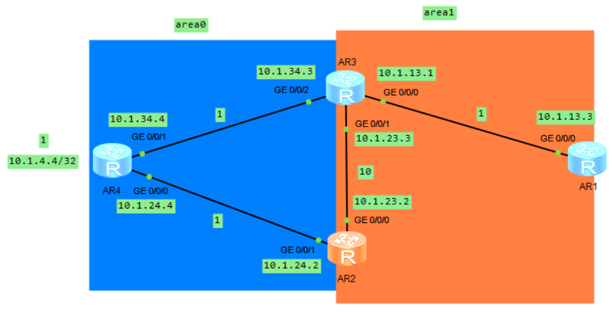
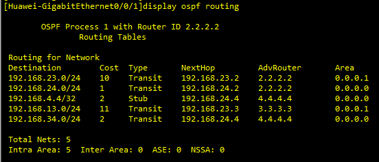
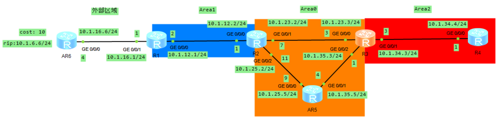
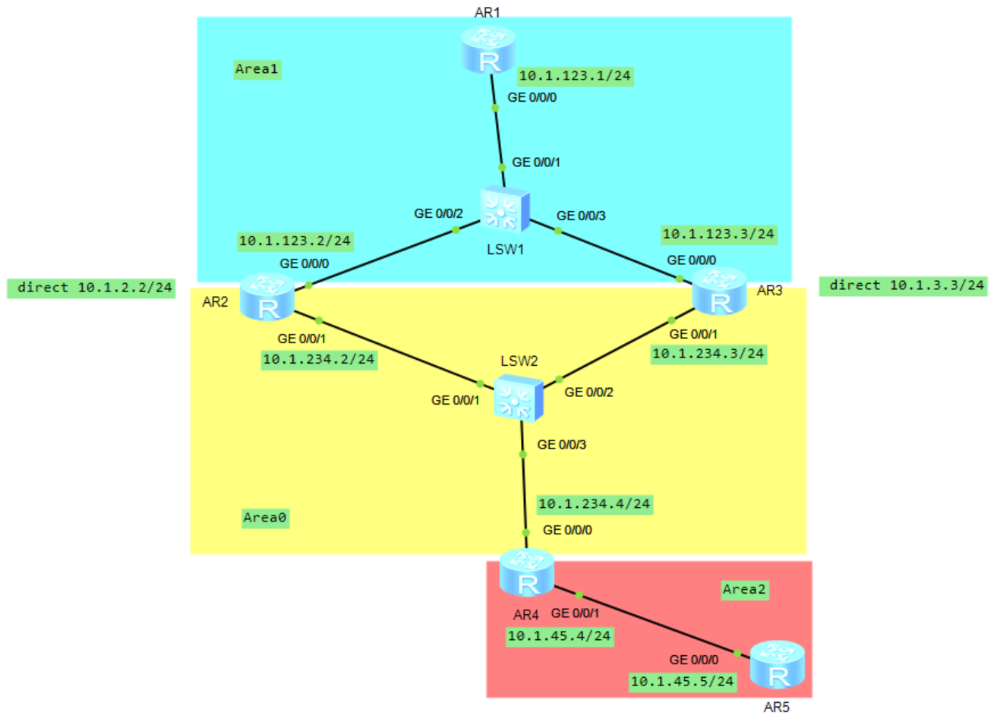
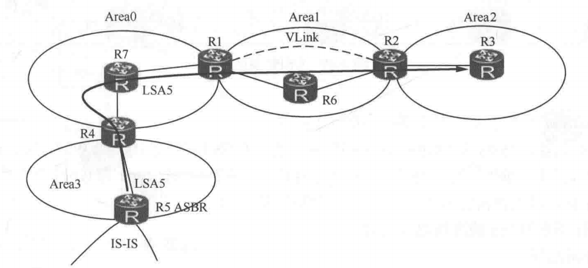
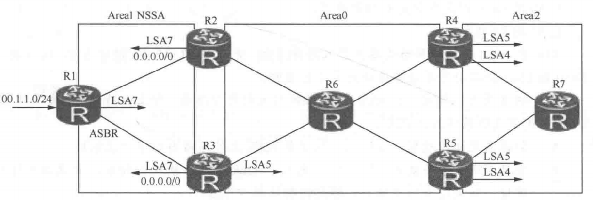
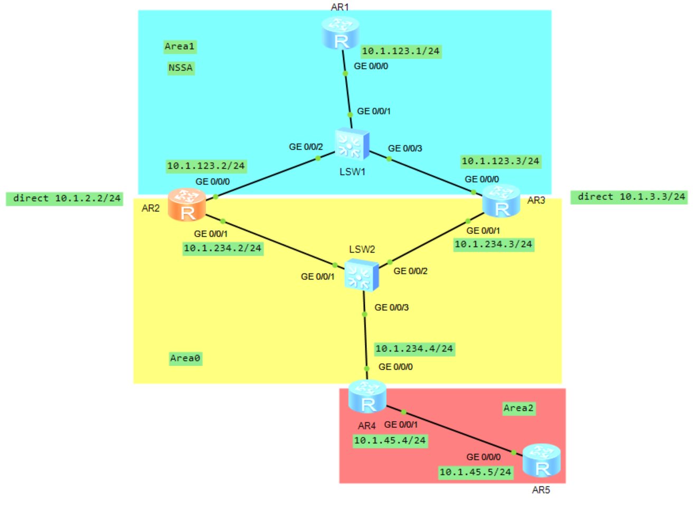
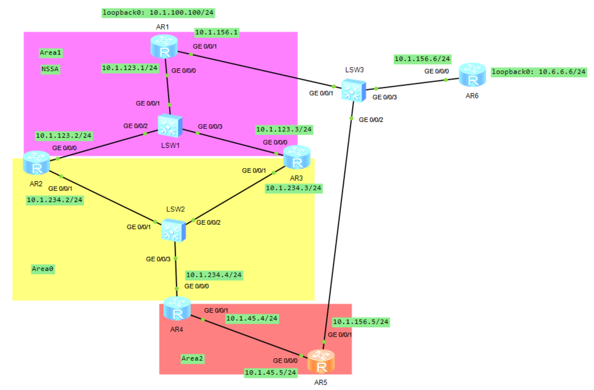
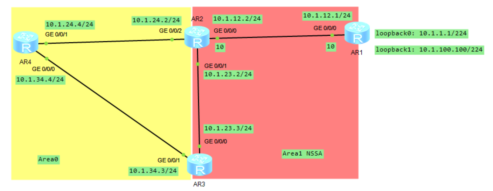

# OSPF 路由协议之 LSA4 和 LSA5

## 1.LSA4

### 1.1 OSPF 选路规则概述

OSPF 的选路规则如下所示：

- OSPF 区域内路由优于区域间;
- OSPF 的域间路由又优于外部路由;
- OSPF 外部路由中 Metric-type1 的路由优于 Metric-type2 的路由;
- 同为 Type1 的外部路由中，优选内部成本和外部成本之和后成本最小的路由，如果路由的成本一样，则负载分担;
- 同为 Type2 的外部路由中，优选外部成本花销小的路由;如果外部成本一致，则优选内部成本小的路由，否则路由负载分担。

>OSPF 外部路由的 Cost 类型有两种，一种是 type1，一种是 type2，这两种类型的不同除体现在计算外部路由时选路的不同，还在于路由表中外部路由 Cost 值的不同，使用 type1 时，路由表中使用内部与外部 Cost 之和；使用 type2 时，路由表中使用外部 Cost。

**OSPF 的路由计算就是把出现在 SPF 树上的叶子路由添加到路由表的过程**，叶子节点有以下三种情况：

- 区域间的 LSA3 路由作为挂在 ABR 节点上的叶子路由；
- ASBR 上的 LSA5 或 LSA7 路由（这里把 LSA5 和 LSA7 均看成是 AS 外部路由）
  - **<font color="red">如果 Root 节点（Root 节点即为当前路由器，也即 SPF 树上的根结点）和 ASBR 在同一区域内，外部路由是 ASBR 上的叶子节点</font>**。
  - **<font color="red">如果 Root 节点和 ASBR 不在同一个区域内，则 Root 在计算 ASBR 的外部路由时，把外部路由作为 ABR 上的叶子路由而执行</font>**。

这个计算 ABR 上或 ASBR 上叶子路由的过程，称为 PRC（Partial Route Caculation，部分路由计算）。叶子路由的增减或 Cost 的变化，并没有触发拓扑的重新计算，执行的计算过程不会消耗太多 CPU 资源。

下面对 OSPF 选路规则进行举例：

例 1：路由 1: LSA3 类型路由 **`10.1.1.0/24`**,成本是 10；路由 2: LSA2 所通告的路由 **`10.1.1.0/24`**，计算后的成本为 1。无论计算结果是多少，只要是 LSA1 或 LSA2 所通告的路由，都优于 LSA3 所通告的路由。

例 2：路由 1：外部路由 LSA5，外部成本是 20，内部成本是 100，cost-type 1；路由 2：外部路由 LSA7，外部成本是 10，内部成本是 110，cost-type 1。两条路由 Cost-type 都是 type1，根据选路规则，比较两条路由的端到端开销之和，内外开销之和都是 120，两条路由负载分担出现在路由表中。

例 3：路由 1：外部路由 LSA5，外部成本 20，内部成本是 100，Cost-type2；路由 2：外部路由 LSA7，外部成本 20，内部成本是 120，Cost-type2。两条路由 Cost-type 都是 type2，依据规则先比较外部成本，值最小者优先。两条路由的外部成本一致都为 20，根据内部成本选择最优路由。路由 1 因其内部成本小而最优。需要说明的是，**虽在选路时比较内部成本，但在路由表中看到该外部路由的 cost 为 20，这是因为 cost-type 为 2 的外部路由，在路由表里仅考虑外部成本**。

<div align="center">
    
</div>

我们使用上述拓扑图中 AR2 到达 **`10.1.13.0/24`** 网段路径来验证 OSPF 选路规则，上述拓扑图中的 area1 是 NSSA 区域。

AR4 上的配置如下所示：

```java{.line-numbers}
#
sysname AR4
#
interface GigabitEthernet0/0/0
 ip address 10.1.24.4 255.255.255.0 
 ospf cost 1
#
interface GigabitEthernet0/0/1
 ip address 10.1.34.4 255.255.255.0 
#
interface LoopBack0
 ip address 10.1.4.4 255.255.255.255 
 ospf cost 1
#
ospf 1 router-id 4.4.4.4 
 import-route direct cost 1 type 2 route-policy IMPORT_AR4_LOOPBACK
 area 0.0.0.0 
  network 10.1.34.4 0.0.0.0 
  network 10.1.24.4 0.0.0.0 
#
route-policy IMPORT_AR4_LOOPBACK permit node 10 
 if-match ip-prefix AR4_LOOPBACK0 
#
ip ip-prefix AR4_LOOPBACK0 index 10 permit 10.1.4.4 32
```

AR2 的 OSPF lsdb 如下所示：

```java{.line-numbers}
<AR2>display ospf lsdb 

	 OSPF Process 1 with Router ID 2.2.2.2
		 Link State Database 

		         Area: 0.0.0.0
 Type      LinkState ID    AdvRouter          Age  Len   Sequence   Metric
 Router    4.4.4.4         4.4.4.4              4  48    80000006       1
 Router    2.2.2.2         2.2.2.2              8  36    80000004       1
 Router    3.3.3.3         3.3.3.3              5  36    80000004       1
 Network   10.1.24.4       4.4.4.4             10  32    80000001       0
 Network   10.1.34.4       4.4.4.4              4  32    80000001       0
 Sum-Net   10.1.23.0       2.2.2.2             46  28    80000001      10
 Sum-Net   10.1.23.0       3.3.3.3             49  28    80000001      10
 Sum-Net   10.1.13.0       3.3.3.3             49  28    80000001       1
 Sum-Net   10.1.13.0       2.2.2.2              3  28    80000001      11
 
		         Area: 0.0.0.1
 Type      LinkState ID    AdvRouter          Age  Len   Sequence   Metric
 Router    2.2.2.2         2.2.2.2              4  36    80000003      10
 Router    1.1.1.1         1.1.1.1             11  36    80000004       1
 Router    3.3.3.3         3.3.3.3              5  48    80000007       1
 Network   10.1.23.3       3.3.3.3              5  32    80000001       0
 Network   10.1.13.1       3.3.3.3              1  32    80000002       0
 Sum-Net   10.1.34.0       2.2.2.2              9  28    80000001       2
 Sum-Net   10.1.34.0       3.3.3.3             47  28    80000001       1
 Sum-Net   10.1.24.0       2.2.2.2             46  28    80000001       1
 Sum-Net   10.1.24.0       3.3.3.3              3  28    80000001       2
 NSSA      0.0.0.0         2.2.2.2              9  36    80000001       1
 NSSA      0.0.0.0         3.3.3.3              4  36    80000001       1
 
		 AS External Database
 Type      LinkState ID    AdvRouter          Age  Len   Sequence   Metric
 External  10.1.4.4        4.4.4.4             49  36    80000001       1
```

在上图中 AR2 会收到 AR3 在 area1 泛洪的 LSA2 类型的 **`10.1.13.0/24`** 路由，计算后的成本为 11，同时也会接收到 R3 和 R2 自己在 area0 泛洪的 LSA3 类型的 **`10.1.13.0/24`** 路由，计算后的成本依次为 1 和 11。**<font color="red">但是根据选路规则，区域内部路由的优先级要远大于区域间路由，因此，R2 只会选择 R3 在 area1 泛洪的 LSA2 路由，而不管度量值为多少</font>**。

同时，从上图中我们可以看出，当一个区域的 ABR 有多个时，此区域的某一个网段会在另外一个区域中泛洪多次。比如 area1 中的 **`10.1.23.0/24`** 被 R2 和 R3 在 area0 中同时使用 LSA3 进行泛洪，**`10.1.13.0/24`** 同理。而 area0 中的 **`10.1.34.0/24`**、**`10.1.4.4/32`** 以及 **`10.1.24.0/24`** 都分别被 R3 和 R2 在 area1 中使用 LSA3 进行泛洪。

<div align="center">
    
</div>

R2 的 OSPF 路由表如上所示，可以验证选路规则，对于 **`10.1.13.0/24`** 网段，下一跳为 R3 的 **`10.1.23.3`** 接口。

### 1.2 LSA4 的报文格式

LSA4（ABR summary）像 LSA3 一样都是由 ABR 产生的，并在 Area 内泛洪的一类 LSA。LSA4 和 LSA3 使用相同的报文格式，区别是 Type 字域是 4，**<font color="red">Link State ID 字域是 ASBR 路由器的 Router ID，LSA4 的内容是 ASBR 到 ABR 的成本，在 LSA4 中，AdvRouter 为 ABR 的 Router ID，并且会随着 ABR 的不同而发生变化</font>**。

我们以下面的 topo 图来分析 LSA4，其中 R1 会引入外部路由 **`10.1.6.0/24`**。

<div align="center">
    
</div>

上述拓扑图中的 AR6 的配置如下所示：

```java{.line-numbers}
#
 sysname AR6
#
interface GigabitEthernet0/0/0
 ip address 10.1.16.6 255.255.255.0 
#
interface LoopBack0
 ip address 10.1.6.6 255.255.255.0 
#
rip 1
 undo summary
 version 2
 peer 10.1.16.1
 network 10.0.0.0
```

AR1 的配置如下所示：

```java{.line-numbers}
#
 sysname AR1
#
firewall zone Local
 priority 15
#
interface GigabitEthernet0/0/0
 ip address 10.1.12.1 255.255.255.0 
 ospf cost 2
#
interface GigabitEthernet0/0/1
 ip address 10.1.16.1 255.255.255.0 
#
ospf 1 router-id 1.1.1.1 
 import-route rip 1 cost 10 type 2 route-policy RIP_TO_OSPF
 area 0.0.0.1 
  network 10.1.12.1 0.0.0.0 
  network 192.168.12.0 0.0.0.255 
#
rip 1
 undo summary
 version 2
 peer 10.1.16.6
 network 10.0.0.0
#
route-policy RIP_TO_OSPF permit node 10 
 if-match ip-prefix RIP_TO_OSPF 
#
ip ip-prefix RIP_TO_OSPF index 20 permit 10.1.6.0 24
```

AR4 在 Area2 上收到的 LSA4 和 AR5 在 Area0 上收到的 LSA4 如下所示。AR4 收到的 LSA4 中 AdvRouter 是 ABR R3 的 Router ID，而 AR5 收到的 LSA4 中 AdvRouter 是 ABR R2 的 Router ID，**<font color="red">同一条 ASBR 路由在不同 Area 内的 LSA4 中 AdvRouter 是不同的</font>**。但是 AR4 和 AR5 收到的 LSA4 中 Link State ID 都是 ASBR R1 的 Router ID，**<font color="red">同一条 ASBR 路由在不同 Area 内的 LSA4 中 Link State ID 是相同的</font>**。**<font color="blue">LSA4 仅当网络中有 ASBR 时，才在区域间由 ABR 产生并泛洪，每个区域可通过 LSA4 计算出到 ASBR 的距离</font>**。

```java{.line-numbers}
<AR4>display ospf lsdb asbr

	 OSPF Process 1 with Router ID 4.4.4.4
		         Area: 0.0.0.2
		 Link State Database 

  Type      : Sum-Asbr
  Ls id     : 1.1.1.1
  Adv rtr   : 3.3.3.3  
  Ls age    : 1038 
  Len       : 28 
  Options   :  E  
  seq#      : 80000005 
  chksum    : 0xf44f
  Tos 0  metric: 4

<AR5>display ospf lsdb asbr

	 OSPF Process 1 with Router ID 5.5.5.5
		         Area: 0.0.0.0
		 Link State Database 

  Type      : Sum-Asbr
  Ls id     : 1.1.1.1
  Adv rtr   : 2.2.2.2  
  Ls age    : 435 
  Len       : 28 
  Options   :  E  
  seq#      : 80000004 
  chksum    : 0xf655
  Tos 0  metric: 1
```

上述两个 LSA4 中的 metric 分别是 4 和 1，**<font color="red">LSA4 中的 metric 是 ABR 到 ASBR 的成本</font>**。在 OSPF 的路由计算中，路由器在执行 Dijkstra（SPF）算法时，会基于全网同步的 LSDB 生成一张有向图，并严格以自身为根节点（Root）构建最短路径树。路径 cost 的累加方向与本路由器到目的地的数据转发方向一致。在每一跳上，使用的是当前节点在其 Router-LSA 中通告的链路输出 cost，也就是该节点把报文发往下一跳时所使用的出接口 cost。**因此，OSPF 计算 A 到 B 的 cost 时，累加的是 `A->...->B` 方向上各节点的出接口 cost，而不是反方向或接收端入接口 cost**。

因此 AR4 收到的 LSA4 中的 metric 是 4，表示 AR3 告诉 Area 2 内部路由器：如果你们要到 ASBR AR1，从我 AR3 这里看过去，cost 是 4。这是因为 AR3 到 AR1 的最优路径是 **`AR3->AR2->AR1`**，因此 cost 值累加为 4。对于 AR5 来说同理。

### 1.3 LSA4 报文实例

<div align="center">
    
</div>

以上述拓扑图为例，在 AR2 和 AR3 上分别引入直连外部路由 **`10.1.2.2/24`** 和 **`10.1.3.3/24`**，AR2 配置如下所示：

```java{.line-numbers}
#
 sysname AR2
#
interface GigabitEthernet0/0/0
 ip address 10.1.123.2 255.255.255.0 
#
interface GigabitEthernet0/0/1
 ip address 10.1.234.2 255.255.255.0 
#
interface LoopBack0
 ip address 10.1.2.2 255.255.255.0 
#
ospf 1 router-id 2.2.2.2 
 import-route direct cost 1 type 2 route-policy AR2_LOOPBACK0
 area 0.0.0.0 
  network 10.1.234.2 0.0.0.0 
 area 0.0.0.1 
  network 10.1.123.2 0.0.0.0 
#
route-policy AR2_LOOPBACK0 permit node 10 
 if-match ip-prefix AR2_LOOPBACK0 
#
ip ip-prefix AR2_LOOPBACK0 index 10 permit 10.1.2.0 24
```

AR3 的配置如下所示：

```java{.line-numbers}
#
 sysname AR3
#
interface GigabitEthernet0/0/0
 ip address 10.1.123.3 255.255.255.0 
#
interface GigabitEthernet0/0/1
 ip address 10.1.234.3 255.255.255.0 
#
ospf 1 router-id 3.3.3.3 
 import-route direct cost 10 type 2 route-policy AR3_LOOPBACK0
 area 0.0.0.0 
  network 10.1.234.3 0.0.0.0 
 area 0.0.0.1 
  network 10.1.123.3 0.0.0.0 
#
route-policy AR3_LOOPBACK0 permit node 10 
 if-match ip-prefix AR3_LOOPBACK0 
#
ip ip-prefix AR3_LOOPBACK0 index 20 permit 10.1.3.0 24
```

在上述拓扑图中，AR2 和 AR3 是 ABR + ASBR，AR2 会向 Area0 和 Area1 中泛洪到 AR3 这个 ASBR 的 LSA4，同理，AR3 会向 Area0 和 Area1 中泛洪到 AR2 这个 ASBR 的 LSA4。根据 RFC 2328 的原文，Only Destination Types of network and AS boundary router are advertised in summary-LSAs. 也就是说只有目的类型为 network 和 ASBR 的路由，才会通过 Summary-LSA 进行通告。同时，Else, if the destination of this route is an AS boundary router, a summary-LSA should be originated if and only if the routing table entry describes the preferred path to the AS boundary router. 否则，如果该路由的目的地是一个 ASBR，则当且仅当该路由表项描述的是到该 ASBR 的首选路径时，才应该为它产生 Summary-LSA。

严格来说，LSA4 和 LSA3 的产生逻辑一样，ABR 发现本区域有 ASBR，就会向骨干区域产生 Type-4 LSA，骨干区域的 ABR 发现骨干区域有 Type-4 LSA, 向非骨干区域重新产生 Type-4 LSA, 修改 advRouter 为自己，ABR 不会把非骨干区域的 Type-4 LSA 向骨干区域产生 Type-4 LSA。ABR 只计算来自骨干区域的 Type-4 LSA 为 ASE 的路由。因此 AR2 引入外部直连路由 **`10.1.2.2/24`** 后，AR3 会向骨干区域中产生 Type-4 LSA，接着向非骨干区域 Area1 中产生 Type-4 LSA。

```java{.line-numbers}
<AR2>display ospf lsdb 

	 OSPF Process 1 with Router ID 2.2.2.2
		 Link State Database 

		         Area: 0.0.0.0
 Type      LinkState ID    AdvRouter          Age  Len   Sequence   Metric
 Router    4.4.4.4         4.4.4.4            600  36    8000000A       1
 Router    2.2.2.2         2.2.2.2            271  36    8000000C       1
 Router    3.3.3.3         3.3.3.3             98  36    8000000A       1
 Network   10.1.234.2      2.2.2.2            611  36    80000008       0
 Sum-Net   10.1.45.0       4.4.4.4            567  28    80000005       1
 Sum-Net   10.1.123.0      2.2.2.2            825  28    80000005       1
 Sum-Net   10.1.123.0      3.3.3.3            704  28    80000005       1
 Sum-Asbr  3.3.3.3         2.2.2.2             97  28    80000004       1     *AR3 向 Area0 通告到 AR2 ASBR 的 LSA4   
 Sum-Asbr  2.2.2.2         3.3.3.3            272  28    80000005       1
 
		         Area: 0.0.0.1
 Type      LinkState ID    AdvRouter          Age  Len   Sequence   Metric
 Router    2.2.2.2         2.2.2.2            271  36    8000000B       1
 Router    1.1.1.1         1.1.1.1            711  36    8000000B       1
 Router    3.3.3.3         3.3.3.3             98  36    8000000B       1
 Network   10.1.123.1      1.1.1.1            711  36    80000008       0
 Sum-Net   10.1.45.0       2.2.2.2            565  28    80000005       2
 Sum-Net   10.1.45.0       3.3.3.3            567  28    80000005       2
 Sum-Net   10.1.234.0      2.2.2.2            825  28    80000005       1
 Sum-Net   10.1.234.0      3.3.3.3            704  28    80000005       1
 Sum-Asbr  3.3.3.3         2.2.2.2             96  28    80000004       1      *AR3 向 Area1 通告到 AR2 ASBR 的 LSA4
 Sum-Asbr  2.2.2.2         3.3.3.3            273  28    80000005       1
 
		 AS External Database
 Type      LinkState ID    AdvRouter          Age  Len   Sequence   Metric
 External  10.1.2.0        2.2.2.2            271  36    80000005       1
```

需要注意的是，**`Type 5 AS-external-LSA`** 由 ASBR 产生，用来描述外部路由；**`Type 4 Summary-LSA`** 由 ABR 产生，用来向其他区域通告"如何到达这个 ASBR"。所以，单纯作为 ASBR 的路由器不会为自己产生 LSA4。但要注意一个特殊点，如果一台路由器同时是 ABR + ASBR，**<font color="red">它作为 ASBR 会产生 Type 5；同时它作为 ABR 时，也可能为 "其他 ASBR" 产生 Type 4</font>**。因此，当 AR3 也引入外部直连路由时，AR2 作为 ABR 也会为 AR3 这个 ASBR 产生 LSA4，如下所示：

```java{.line-numbers}
<AR2>display ospf lsdb asbr self-originate 

	 OSPF Process 1 with Router ID 2.2.2.2
		         Area: 0.0.0.0
		 Link State Database 

  Type      : Sum-Asbr
  Ls id     : 3.3.3.3
  Adv rtr   : 2.2.2.2  
  Ls age    : 408 
  Len       : 28 
  Options   :  E  
  seq#      : 80000004 
  chksum    : 0x9aa9
  Tos 0  metric: 1
		         Area: 0.0.0.1
		 Link State Database 


  Type      : Sum-Asbr
  Ls id     : 3.3.3.3
  Adv rtr   : 2.2.2.2  
  Ls age    : 407 
  Len       : 28 
  Options   :  E  
  seq#      : 80000004 
  chksum    : 0x9aa9
  Tos 0  metric: 1
```

## 2.LSA5

### 2.1 LSA5 的报文格式

LSA5 报文中各个字段的含义如下所示：

- Ls id：引入的外部路由的网络号；
- Adv rtr：**<font color="red">Advertising Router，产生的 LSA5 的路由器 RouterID（在各个 OSPF 区域中都保持一致）</font>**；
- Net mask：引入的外部路由的掩码；
- Forwarding Address：可以是 0.0.0.0，也可以是非 0；**<font color="red">如果是 0.0.0.0，访问外部网络的报文转发给 ASBR，如果是非 0，报文转发给该非 0 地址</font>**；
- Tag：用于标记外部路由的标签，在路由引入时配置给外部路由，默认值是 1；
- Metric：**ASBR 到外部网络的成本**；
- Etype：Metric-type 可以是 1，也可以是 2，默认是 2。**Type1 和 Type2 的区别在路由表中可以看出来，Type2 路由仅考虑外部成本，Type1 路由考虑的是端到端的成本（内外成本之和）**。Type1 和 Type2 的另外一个区别是在外部路由的选路上的差别，详见下节；

AR5 和 AR4 收到的 LSA5 如下所示：

```java{.line-numbers}
<AR5>display ospf lsdb ase

	 OSPF Process 1 with Router ID 5.5.5.5
		 Link State Database

  Type      : External
  Ls id     : 10.1.6.0
  Adv rtr   : 1.1.1.1  
  Ls age    : 568 
  Len       : 36 
  Options   :  E  
  seq#      : 80000007 
  chksum    : 0x5e4e
  Net mask  : 255.255.255.0 
  TOS 0  Metric: 10 
  E type    : 2
  Forwarding Address : 0.0.0.0 
  Tag       : 1 
  Priority  : Low

<AR4>display ospf lsdb ase

	 OSPF Process 1 with Router ID 4.4.4.4
		 Link State Database

  Type      : External
  Ls id     : 10.1.6.0
  Adv rtr   : 1.1.1.1  
  Ls age    : 640 
  Len       : 36 
  Options   :  E  
  seq#      : 80000007 
  chksum    : 0x5e4e
  Net mask  : 255.255.255.0 
  TOS 0  Metric: 10 
  E type    : 2
  Forwarding Address : 0.0.0.0 
  Tag       : 1 
  Priority  : Low
```

在 LSA5 中，metric 值永远表示的是 ASBR 到外部网络的 cost，即外部 cost。因此 AR4 和 AR5 收到的 LSA5 中 metric 都是 10，因为在 AR1 上引入外部 RIP 路由时，配置的 cost 就是 10。

```java{.line-numbers}
ospf 1 router-id 1.1.1.1 
 import-route rip 1 cost 10 type 2 route-policy RIP_TO_OSPF
```

但是在路由表中，如果 Metric-type 为 Type2，那么路由表中显示的 cost 就是外部 cost。AR5 上显示的到外部 RIP 网段的 cost 就是 10，也就是外部 cost 为 10。

```java{.line-numbers}
<AR4>display ip routing-table 
Route Flags: R - relay, D - download to fib
------------------------------------------------------------------------------
Routing Tables: Public
         Destinations : 12       Routes : 12       

Destination/Mask    Proto   Pre  Cost      Flags NextHop         Interface

       10.1.6.0/24  O_ASE   150  10          D   10.1.34.3       GigabitEthernet0/0/0
```

如果 Metric-type 为 Type1，那么路由表中显示的 cost 就是外部 cost 与内部 cost 之和。首先改变 AR1 上引入外部路由的 Metric-type 为 Type1，接着查看 AR5 的路由表，**<font color="red">如果 Forwarding Address 是 **`0.0.0.0`**，那么 AR4 要先算到 ASBR AR1 的内部 cost，否则如果 Forwarding Address 是非 0 的地址，那么 AR4 就要算到 FA 地址的内部 cost</font>**。这里 AR4 收到的 LSA5 中 Forwarding Address 是 0，因此 AR4 到 ASBR AR1 的内部 cost 是 **`1+3+1=5`**，外部 cost 是 10，因此 AR4 到外部网络的总 cost 就是 15。

```java{.line-numbers}
[AR1-ospf-1]import-route rip 1 cost 10 type 1 route-policy RIP_TO_OSPF
<AR4>display ip routing-table 
Route Flags: R - relay, D - download to fib
------------------------------------------------------------------------------
Routing Tables: Public
         Destinations : 12       Routes : 12       

Destination/Mask    Proto   Pre  Cost      Flags NextHop         Interface
       10.1.6.0/24  O_ASE   150  15          D   10.1.34.3       GigabitEthernet0/0/0
```

### 2.2 LSA5 的作用

LSA5 区别于 LSA3/LSA4，LSA5 仅负责通告 OSPF 路由域外其他协议的路由，如 RIP、BGP 等。引入到 OSPF 后，这些外部路由靠 LSA5 将其泛洪到整个 OSPF 路由域。LSA5 具有其他 LSA 所没有的泛洪范围，**<font color="red">LSA5 能够泛洪到所有 Area，除了特殊类型区域（Stub 及 NSSA）</font>**。在上面的拓扑图中，LSA5 由 AR1 产生，在区域间泛洪至 Area2，泛洪期间仅 Age 会增加，其他都没有变化。

LSA5 的作用是除了向路由域中路由器通告外部路由外，还告知其他路由器如何访问该外部网络。**根据 LSA5 中的 FA（Forwarding Address）地址决定访问外部网络是经过 ASBR 还是经过拥有 FA 地址（非 0）的路由器**。

### 2.3 LSA5 泛洪

LSA5 可以在区域间泛洪，这与 LSA3 和 LSA4 不同。在骨干区域分割或普通区域不连接骨干区域的场景下，LSA5 依然可以不经 Virtual Link，直接经 Transit 区域流入其他区域。这与 **`LSA1/2/3/4`** 需要经 Vlink 传递到其他区域不同，这是因为 LSA5 和其他类型 LSA 的泛洪范围不一致，LSA5 没有必要在 Vlink 和 TransitArea1 中重复泛洪。LSA5 不在 Vlink 上传递。

<div align="center">
    
</div>

上图中的 LSA5 在没有 Vlink 的情况下，R5 引入的外部路由依然可以进入 Area2，但却无法进入路由表。LSA5 虽可以直接流入 Area2，**<font color="red">但 LSA5 所通告路由能否进入路由表则依赖于 LSA5 中 FA 地址的可达性</font>**。如果 **`FA=0.0.0.0`**，则 LSA5 依赖于 LSA4；如果 **`FA!=0.0.0.0`**，则依赖于 FA 地址路由（使用 LSA3 通告），由于区域分割，LSA3/LSA4 都不能流入 Area2，所以 LSA5 的路由无法进入路由表。

LSA5 依赖于 LSA4 或 LSA3 来计算 OSPF 路由域内的访问路径。LSA3/LSA4 在区域间有水平分割规则能避免区域间路由所致的环路，LSA3/LSA4 无环，则依赖 LSA3/4 的 LSA5 也无环。这就解释了为什么 LSA5 没有像 LSA3 一样对区域结构有要求，还可以经 ABR 泛洪到任何区域，却不易出现环路的原因。

## 3.NSSA 和 LSA7

### 3.1 NSSA 区域

NSSA（Not So Stubby Area）是一类特殊的区域，区别于 Stub 区域，可以在 NSSA 中部署 ASBR，并引入外部路由，不需要经过 Area0 访问外部目标网络，NSSA 区域如下图所示。OSPF 规定 Stub 区域是不能引入外部路由的，这样可以避免大量外部路由对 Stub 区域路由器带宽和存储资源的消耗。对于既需要引入外部路由又要避免外部路由带来的资源消耗的场景，Stub 区域就不再满足需求了，因此产生了 NSSA 区域。

<div align="center">
    
</div>

OSPF NSSA 区域（Not-So-Stubby Area）是 OSPF 新增的一类特殊的区域类型。NSSA 区域和 Stub 区域有许多相似的地方。两者的差别在于，**<font color="red">NSSA 区域能够将外部路由引入并传播到整个 OSPF 路由域中，同时又不会学习来自 OSPF 网络其他区域的外部路由</font>**。

NSSA 区域连接骨干区域，其区域边界路由器是 ABR，同时也是 ASBR。华为的 NSSA 区域边界路由器默认向 NSSA 区域内泛洪 LSA7 默认路由，如上图所示。

NSSA 区域边界路由器 ABR 的特性：

- ABR 在 Area1 和 Area0 间传递区域间路由。
- LSA7（置 P 位）经 ABR 7/5 翻译后，产生 LSA5 泛洪到 Area0 及其他区域。
- 默认情况下，向 NSSA 区域通告 LSA7 默认路由。
- 如果区域类型为 Totally NSSA，ABR 也可以向 NSSA 区域产生 LSA3 的默认路由。

LSA7 作用：

- Type7 LSA 是为了支持 NSSA 区域而新增的一种 LSA 类型，用于通告引入的外部路由信息。
- **Type7 LSA 由 NSSA 区域的自治域边界路由器（ASBR）产生，其扩散范围仅限于 ASBR 所在的 NSSA 区域**。
- NSSA 区域的区域边界路由器（ABR）收到 Type7 LSA 时，会有选择地将其转化为 Type5 LSA，以便将外部路由信息通告到 OSPF 网络的其他区域。
- LSA5/LSA4 不会流入 NSSA 区域，所以 Area1 的 ABR 会各自注入 LSA7 的默认路由到 Area1，这样区域内路由器可以通过默认路由访问外部网络，ABR 同时也是 ASBR。
- **<font color="red">LSA7 的 FA 一定要为非 0</font>**，用于在区域间选路。

需要强调的一点是 LSA7 的 FA 地址和 LSA5 的 FA 内容上有如下区别：

- LSA5 的 FA 可以是 0 和非 0 两种情况。
- LSA7 的 FA 值如下：
  - 在 NSSA 区域边界路由器上引入外部路由，产生 LSA7，其 FA 地址为 0。协议规定 FA=0 的 LSA7 的路由是不会被通告到骨干区域的。
  - FA 不为 0 的情况。在 NSSA 中，ASBR 引入的外部路由，除上面特例外，都是非 0，LSA5 的 4 条规则同样适用 LSA7。

如果满足 4 条规则，**<font color="red">`FA!=0`，地址是 ASBR 上外部路由的下一跳地址。如果不满足某条规则，**`FA!=0`**，地址是 ASBR 上某个接口 IP 地址，优选【使能 OSPF】的回环接口地址，如果没有回环接口，则选用【使能 OSPF】的物理接口地址</font>**。

### 3.2 LSA7 翻译

在 Area1 中 LSA7 作用和 LSA5 一致，有相同的格式，包括外部路由及掩码、Forwarding-Address Tag、Cost-Type 及 Cost。

LSA7 与 LSA5 的不同之处：

- LSA7 仅在 NSSA 区域里泛洪；
- LSA7 的 FA 为非 0；如果为 0，则不会被 ABR 翻译为 LSA5。
- 外部路由在 NSSA 区域里使用 LSA7 来传递，在其他区域由 LSA5 来传递，ABR 负责做 7/5 翻译。
- LSA7 中选项位 P-bit（Propagate bit）用于告知翻译路由器该条 Type7 LSA 是否需要翻译。
- **<font color="red">缺省情况下，转换路由器是 NSSA 区域中 Router ID 最大的区域边界路由器</font>**。
- **<font color="red">只有 P-bit 置位并且 FA（Forwarding Address）不为 0 的 Type7 LSA 才能转化为 Type5 LSA</font>**。
- 若在 ABR 上引入外部路由，产生的 Type7 LSA 不会置 P-bit，所以不会再被通告到 Area0。

华为为 NSSA 区域中路由器可以使用如下命令：

```java{.line-numbers}
nssa translator-always              // 可以指定 7/5 转换器。
nssa suppress-forwarding-address    // 命令可以指定在 7/5 转换器翻译时，修改默认的 FA 地址为 0。
nssa default-route-advertise        // 可以指定 ABR 或任何 NSSA 区域中路由器产生 LSA7 默认路由。
```

当 NSSA 区域中有多个 ABR 时，系统会根据规则自动选择一个 ABR 作为转换器，缺省情况下 NSSA 区域选择 Router ID 最大的设备。通过在 ABR 上配置 **`translator-always`** 参数，可以将任意一个 ABR 指定为转换器。也可以同时指定两个 ABR 为转换器，可以通过配置 **`translator-always`** 来指定两个转换器同时工作。也可用于固定一台路由器为转换器，防止由于转换器变动而引起的 LSA 重新泛洪。

根据 RFC 3101 的原文，When an NSSA border router originates both a Type-5 LSA and a Type-7 LSA for the same network, then the P-bit must be clear in the Type-7 LSA so that it isn't translated into a Type-5 LSA by another NSSA border router. 当一个 NSSA 边界路由器针对同一个网络同时产生 Type-5 LSA 和 Type-7 LSA 时，那么这个 Type-7 LSA 中的 P-bit 必须清零，这样它就不会被另一个 NSSA ABR 边界路由器再翻译成 Type-5 LSA，造成重复通告甚至潜在选路问题。

If the border router only originates a Type-7 LSA, it may set the P-bit so that the network may be aggregated/propagated during Type-7 translation. 如果该边界路由器只产生 Type-7 LSA，那么它可以设置 P-bit，使该网络可以在 Type-7 翻译过程中被聚合或传播。

同时，The Type-7 default LSA originated by an NSSA border router must have the P-bit clear. 由 NSSA 边界路由器产生的 Type-7 默认 LSA 必须将 P-bit 清零。

因此 ABR 上引入外部路由，产生的 Type7 LSA 是否会置 P-bit：

- NSSA 内部 ASBR 产生 Type-7，想让路由进入整个 OSPF 域：应置 P-bit；
- NSSA ABR 同时为同一网络产生 Type-5 和 Type-7：Type-7 的 P-bit 必须清零；
- NSSA ABR 只产生 Type-7：可以置 P-bit；
- **<font color="red">NSSA ABR 产生 Type-7 默认路由：P-bit 必须清零</font>**；

### 3.3 LSA7 报文实例

<div align="center">
    
</div>

我们以如下的拓扑图为例，其中 Area1 被设置为 NSSA 区域，AR2 上的配置如下所示，在 AR2 上有 2 个 LoopBack 接口，其中 LoopBack0 作为直连外部路由引入到 OSPF 中，产生 LSA7，LoopBack1 是直连路由直接宣告 OSPF。

```java{.line-numbers}
#
 sysname AR2
#
interface GigabitEthernet0/0/0
 ip address 10.1.123.2 255.255.255.0 
#
interface GigabitEthernet0/0/1
 ip address 10.1.234.2 255.255.255.0 
#
interface LoopBack0
 ip address 10.1.2.2 255.255.255.0 
#
interface LoopBack1
 ip address 10.1.22.22 255.255.255.0 
#
ospf 1 router-id 2.2.2.2 
 import-route direct cost 1 type 2 route-policy AR2_LOOPBACK0
 area 0.0.0.0 
  network 10.1.234.2 0.0.0.0 
 area 0.0.0.1 
  network 10.1.22.22 0.0.0.0 
  network 10.1.123.2 0.0.0.0 
  nssa
#
route-policy AR2_LOOPBACK0 permit node 10 
 if-match ip-prefix AR2_LOOPBACK0 
#
ip ip-prefix AR2_LOOPBACK0 index 10 permit 10.1.2.0 24
```

AR3 的配置如下所示，在 AR3 上有 1 个 LoopBack 接口 **`10.1.3.3/24`**，作为直连外部路由引入到 OSPF 中，产生 LSA7。

```java{.line-numbers}
#
 sysname AR3
#
interface GigabitEthernet0/0/0
 ip address 10.1.123.3 255.255.255.0 
#
interface GigabitEthernet0/0/1
 ip address 10.1.234.3 255.255.255.0 
#
interface LoopBack0
 ip address 10.1.3.3 255.255.255.0 
#
ospf 1 router-id 3.3.3.3 
 import-route direct cost 10 type 2 route-policy AR3_LOOPBACK0
 area 0.0.0.0 
  network 10.1.234.3 0.0.0.0 
 area 0.0.0.1 
  network 10.1.123.3 0.0.0.0 
  nssa
#
route-policy AR3_LOOPBACK0 permit node 10 
 if-match ip-prefix AR3_LOOPBACK0 
#
ip ip-prefix AR3_LOOPBACK0 index 20 permit 10.1.3.0 24
```

如前所述，当一个 NSSA 边界路由器针对同一个网络同时产生 Type-5 LSA 和 Type-7 LSA 时，那么这个 Type-7 LSA 中的 P-bit 必须清零，这样它就不会被另一个 NSSA ABR 边界路由器再翻译成 Type-5 LSA。AR2 中的 OSPF LSDB 如下所示，可以看到，AR2 作为 NSSA ABR 同时也是 ASBR，它向 Area1 中产生了 Type-7 LSA 的默认路由，也产生了 Type-7 LSA 来通告 LoopBack0 的外部路由，同时 AR2 也向 Area0 中产生了 Type-5 LSA，**<font color="red">因此 AR2 向 Area1 中产生的 Type-7 LSA 中 P-bit 被清零了，AR3 不会再将其翻译成 Type-5 LSA 泛洪到 Area0 中</font>**。

```java{.line-numbers}
<AR2>display ospf lsdb 

	 OSPF Process 1 with Router ID 2.2.2.2
		 Link State Database 

		         Area: 0.0.0.0
 Type      LinkState ID    AdvRouter          Age  Len   Sequence   Metric
 Router    4.4.4.4         4.4.4.4            852  36    80000006       1
 Router    2.2.2.2         2.2.2.2            851  36    80000006       1
 Router    3.3.3.3         3.3.3.3            858  36    80000005       1
 Network   10.1.234.4      4.4.4.4            852  36    80000003       0
 Sum-Net   10.1.45.0       4.4.4.4            904  28    80000001       1
 Sum-Net   10.1.22.22      2.2.2.2            893  28    80000001       0
 Sum-Net   10.1.22.22      3.3.3.3            846  28    80000001       1
 Sum-Net   10.1.123.0      2.2.2.2            893  28    80000001       1
 Sum-Net   10.1.123.0      3.3.3.3            898  28    80000001       1
 
		         Area: 0.0.0.1
 Type      LinkState ID    AdvRouter          Age  Len   Sequence   Metric
 Router    2.2.2.2         2.2.2.2            846  48    80000007       1
 Router    1.1.1.1         1.1.1.1            847  36    80000005       1
 Router    3.3.3.3         3.3.3.3            846  36    80000007       1
 Network   10.1.123.3      3.3.3.3            850  36    80000003       0
 Sum-Net   10.1.45.0       2.2.2.2            857  28    80000001       2
 Sum-Net   10.1.45.0       3.3.3.3            858  28    80000001       2
 Sum-Net   10.1.234.0      2.2.2.2            893  28    80000001       1
 Sum-Net   10.1.234.0      3.3.3.3            899  28    80000001       1
 NSSA      0.0.0.0         2.2.2.2            860  36    80000001       1
 NSSA      10.1.2.0        2.2.2.2            860  36    80000002       1
 NSSA      0.0.0.0         3.3.3.3            862  36    80000001       1
 NSSA      10.1.3.0        3.3.3.3            862  36    80000003      10
 
		 AS External Database
 Type      LinkState ID    AdvRouter          Age  Len   Sequence   Metric
 External  10.1.2.0        2.2.2.2            897  36    80000001       1
 External  10.1.3.0        3.3.3.3            902  36    80000001      10
<AR2>display ospf lsdb nssa self-originate 

	 OSPF Process 1 with Router ID 2.2.2.2
		         Area: 0.0.0.0
		 Link State Database 

		         Area: 0.0.0.1
		 Link State Database 

  Type      : NSSA
  Ls id     : 0.0.0.0
  Adv rtr   : 2.2.2.2  
  Ls age    : 1179 
  Len       : 36 
  Options   : None             *P-bit 没有置位
  seq#      : 80000001 
  chksum    : 0xc404
  Net mask  : 0.0.0.0 
  TOS 0  Metric: 1 
  E type    : 2
  Forwarding Address : 0.0.0.0 
  Tag       : 1 
  Priority  : Low

  Type      : NSSA
  Ls id     : 10.1.2.0
  Adv rtr   : 2.2.2.2  
  Ls age    : 1179 
  Len       : 36 
  Options   : None             *P-bit 没有置位
  seq#      : 80000002 
  chksum    : 0xec96
  Net mask  : 255.255.255.0 
  TOS 0  Metric: 1 
  E type    : 2
  Forwarding Address : 10.1.22.22 
  Tag       : 1 
  Priority  : Low
```

同时，我们可以看到，AR2 作为 NSSA ABR 向 Area 1 中产生 Type-7 默认路由 **`0.0.0.0/0`**，该默认 Type-7 LSA 的 P-bit 清零。根据 RFC 3101，由 NSSA ABR 产生的 Type-7 默认 LSA 不会被翻译成 Type-5 LSA。

从 **`display ospf lsdb ase self-originate`** 可以看出，AR3 自己只产生了 **`10.1.3.0/24`** 的 Type-5 LSA，并没有以 **`3.3.3.3`** 作为 Advertising Router 产生 **`10.1.2.0/24`** 的 Type-5 LSA。这说明 AR3 没有把 AR2 在 NSSA Area 1 中产生的 **`10.1.2.0/24`** Type-7 LSA 翻译成 Type-5 LSA。

```java{.line-numbers}
<AR3>display ospf lsdb ase self-originate 

	 OSPF Process 1 with Router ID 3.3.3.3
		 Link State Database

  Type      : External
  Ls id     : 10.1.3.0
  Adv rtr   : 3.3.3.3  
  Ls age    : 1180 
  Len       : 36 
  Options   :  E  
  seq#      : 80000001 
  chksum    : 0x4f5e
  Net mask  : 255.255.255.0 
  TOS 0  Metric: 10 
  E type    : 2
  Forwarding Address : 0.0.0.0 
  Tag       : 1 
  Priority  : Low
```

## 4.Forwarding Address 的作用

Forwarding-Address，简称 FA，仅出现在 LSA5 或 LSA7 中，**它是数据包访问外部网络时，在数据报文离开 OSPF 路由域时必须经过的设备地址**。这里仅介绍 LSA5 中的 FA，LSA5 携带外部路由，该外部路由一定要出现在路由表中，数据包才能访问到该外部目的地。**<font color="red">而外部路由能否出现在路由表中，则要依赖于 LSA5 的 FA 的可达性，如果 FA 不可达，则 LSA5 所通告的外部路由不进路由表</font>**（FA 不可达，LSA5 路由进路由表没有意义）。FA 地址可以是全 0，也可以是非 0。

若 **`FA=0`**，数据包要经过 ASBR 访问外部网络。如果 **`FA!=0`**，数据包要转发至拥有 FA 地址的路由设备，再由其转发到外部网络。

华为实现中，如果 **`FA=0`**，LSA5 要判断如何到 ASBR，继而决定该外部路由能否进 IP 路由表。**如果 ASBR 在其他区域，则依赖于 LSA4 来决定如何到达 ASBR。如果 ABSR 在当前区域，则依赖于 LSA1/LSA2 计算到 ASBR 的路径**。

如果 **`FA!=0`**，则要根据 OSPF 路由表（**`display ospf routing`**）中是否有 FA 地址所对应的路由来判断可达性。若不可达，则该外部路由不进 IP 路由表。

### 4.1 FA 是非 0.0.0.0 地址的场景

<div align="center">
    
</div>

在上述拓扑图中，AR1 和 AR6 处在两个 AS 中，AR1 和 AR6 之间运行 RIP 协议，AR1 向 OSPF 区域中通告 **`10.1.6.0/24`** 的 RIP 路由，AR1 收到该 OSPF 路由，并把它放到全局路由表中。

```java{.line-numbers}
<AR2>display ospf lsdb 

	 OSPF Process 1 with Router ID 2.2.2.2
		 Link State Database 

		         Area: 0.0.0.0
 Type      LinkState ID    AdvRouter          Age  Len   Sequence   Metric
 Router    2.2.2.2         2.2.2.2            747  48    80000013       7
 Router    5.5.5.5         5.5.5.5           1307  48    80000010       9
 Router    3.3.3.3         3.3.3.3           1327  48    80000010       3
 Network   10.1.23.2       2.2.2.2            520  32    8000000A       0
 Network   10.1.35.5       5.5.5.5            515  32    8000000A       0
 Network   10.1.25.2       2.2.2.2            630  32    8000000A       0
 Sum-Net   10.1.34.0       3.3.3.3            502  28    80000009       3
 Sum-Net   10.1.12.0       2.2.2.2            738  28    80000009       1
 Sum-Net   10.1.16.0       2.2.2.2            107  28    80000001       2
 Sum-Asbr  1.1.1.1         2.2.2.2            738  28    80000009       1
 
		         Area: 0.0.0.1
 Type      LinkState ID    AdvRouter          Age  Len   Sequence   Metric
 Router    2.2.2.2         2.2.2.2            744  36    8000000E       1
 Router    1.1.1.1         1.1.1.1             66  48    80000012       1
 Network   10.1.12.1       1.1.1.1            742  32    8000000A       0
 Sum-Net   10.1.23.0       2.2.2.2            717  28    8000000A       7
 Sum-Net   10.1.35.0       2.2.2.2            747  28    80000009       8
 Sum-Net   10.1.25.0       2.2.2.2            747  28    80000009      11
 Sum-Net   10.1.34.0       2.2.2.2            747  28    80000009      10

		 AS External Database
 Type      LinkState ID    AdvRouter          Age  Len   Sequence   Metric
 External  10.1.6.0        1.1.1.1            108  36    8000000D      10
<AR2>display ospf lsdb ase

	 OSPF Process 1 with Router ID 2.2.2.2
		 Link State Database

  Type      : External
  Ls id     : 10.1.6.0
  Adv rtr   : 1.1.1.1  
  Ls age    : 17 
  Len       : 36 
  Options   :  E  
  seq#      : 8000000d 
  chksum    : 0xf193
  Net mask  : 255.255.255.0 
  TOS 0  Metric: 10 
  E type    : 2
  Forwarding Address : 10.1.16.6        // AR2 收到的 LSA5 中 FA 地址是外部 RIP 路由的下一跳地址 
  Tag       : 1 
  Priority  : Low
<AR2>display ip routing-table 
Route Flags: R - relay, D - download to fib
------------------------------------------------------------------------------
Routing Tables: Public
         Destinations : 17       Routes : 17       

Destination/Mask    Proto   Pre  Cost      Flags NextHop         Interface

       10.1.6.0/24  O_ASE   150  10          D   10.1.12.1       GigabitEthernet0/0/0      // 去往外部 RIP 路由的下一跳等于去往 FA 地址的下一跳
      10.1.16.0/24  OSPF    10   2           D   10.1.12.1       GigabitEthernet0/0/0      // 去往 FA 地址的下一跳
```

从上面的显示可以看出，AR2 收到的 LSA5 中 FA 地址是 ASBR 上外部 RIP 路由的下一跳地址，**<font color="red">并且在 AR2 的路由表中去往外部 RIP 路由的下一跳等于去往 FA 地址的下一跳</font>**。ASBR 上的接口如果满足以下四个规则，则 ASBR 上外部路由的下一跳地址就是该外部路由 LSA5 的 FA，否则该外部路由 LSA5 中的 FA 为 0。

- **<font color="red">该外部路由的下一跳地址所在网段的接口要发布到 OSPF 中</font>**。
- 该外部路由的下一跳地址所在网段的接口没有被设置成 silent 接口。
- 下一跳地址所在网段的接口 OSPF 网络类型不是 Point-to-Point 网络类型。
- 下一跳地址所在网段的接口 OSPF 网络类型不是 Point-to-Multipoint 网络类型。

>在最开始没有将 AR1 的 **`G0/0/1`** 接口进行 OSPF 宣告发布到 OSPF 中时，AR4/AR5 收到的 LSA5 中 FA 地址是 **`0.0.0.0`**。

根据上述规则，在上面的拓扑图中，AR1 上 RIP 路由是 **`10.1.6.6/24`**，其下一跳为 **`10.1.16.6`**，该下一跳地址所在网段的 ASBR 的接口是图中的 **`G0/0/1`** 接口，该接口已被发布到 OSPF 中；该接口没有被 Silent 掉，默认的 OSPF 网络类型为 Broadcast 类型，满足 FA 非 0 的条件，所以 AR1 产生 LSA5 时把该 RIP 路由的下一跳地址作为 FA 地址。

路由被引入到 OSPF 后，AR5 和 AR4 收到该 LSA5，根据其中的 FA，查各自的 OSPF 路由表（Display OSPF Routing），来判定 LSA5 的 FA 是否可达。

```java{.line-numbers}
[AR5]display ospf routing 

	 OSPF Process 1 with Router ID 5.5.5.5
		  Routing Tables 

 Routing for Network 
 Destination        Cost  Type       NextHop         AdvRouter       Area
 10.1.25.0/24       9     Transit    10.1.25.5       5.5.5.5         0.0.0.0
 10.1.35.0/24       4     Transit    10.1.35.5       5.5.5.5         0.0.0.0
 10.1.12.0/24       8     Inter-area 10.1.35.3       2.2.2.2         0.0.0.0
 10.1.16.0/24       9     Inter-area 10.1.35.3       2.2.2.2         0.0.0.0
 10.1.23.0/24       7     Transit    10.1.35.3       3.3.3.3         0.0.0.0
 10.1.34.0/24       7     Inter-area 10.1.35.3       3.3.3.3         0.0.0.0

 Routing for ASEs
 Destination        Cost      Type       Tag         NextHop         AdvRouter
 10.1.6.0/24        10        Type2      1           10.1.35.3       1.1.1.1

 Total Nets: 7  
 Intra Area: 3  Inter Area: 3  ASE: 1  NSSA: 0 

[AR5]display ip routing-table 
Route Flags: R - relay, D - download to fib
------------------------------------------------------------------------------
Routing Tables: Public
         Destinations : 15       Routes : 15       

Destination/Mask    Proto   Pre  Cost      Flags NextHop         Interface

       10.1.6.0/24  O_ASE   150  10          D   10.1.35.3       GigabitEthernet0/0/1
<AR4>display ospf routing 

	 OSPF Process 1 with Router ID 4.4.4.4
		  Routing Tables 

 Routing for Network 
 Destination        Cost  Type       NextHop         AdvRouter       Area
 10.1.34.0/24       1     Transit    10.1.34.4       4.4.4.4         0.0.0.2
 10.1.12.0/24       5     Inter-area 10.1.34.3       3.3.3.3         0.0.0.2
 10.1.16.0/24       6     Inter-area 10.1.34.3       3.3.3.3         0.0.0.2    *FA 地址对应的路由是区域内或者区域间路由
 10.1.23.0/24       4     Inter-area 10.1.34.3       3.3.3.3         0.0.0.2
 10.1.25.0/24       11    Inter-area 10.1.34.3       3.3.3.3         0.0.0.2
 10.1.35.0/24       2     Inter-area 10.1.34.3       3.3.3.3         0.0.0.2

 Routing for ASEs
 Destination        Cost      Type       Tag         NextHop         AdvRouter
 10.1.6.0/24        10        Type2      1           10.1.34.3       1.1.1.1

 Total Nets: 7  
 Intra Area: 1  Inter Area: 5  ASE: 1  NSSA: 0 

<AR4>display ip routing-table 
Route Flags: R - relay, D - download to fib
------------------------------------------------------------------------------
Routing Tables: Public
         Destinations : 13       Routes : 13       

Destination/Mask    Proto   Pre  Cost      Flags NextHop         Interface

       10.1.6.0/24  O_ASE   150  10          D   10.1.34.3       GigabitEthernet0/0/0
```

只要 Display OSPF Routing 中能看到 FA 地址所对应的路由，则：

- 该外部路由能进入路由表；
- 访问该外部网络的数据将根据 FA 路由来转发；
- 当前路由器在 OSPF 路由域中的成本是根据该 FA 路由计算出来的；
- **<font color="red">FA 地址所对应路由一定要是 OSPF 区域内（Intra-Area）或区域间（Inter-Area）路由，FA 路由不能是其他外部路由，LSA5 不会靠 OSPF 外部路由和非 OSPF 协议路由决定 FA 地址可达性</font>**。

### 4.2 FA 是 0.0.0.0 地址的场景

<div align="center">
    
</div>

根据上面的拓扑图，AR1 上 RIP 路由是 **`10.1.6.6/24`**，其下一跳为 **`10.1.16.6`**，该下一跳地址（FA 地址）所对应的 ASBR AR1 出接口为图中 **`G0/0/1`** 接口。但是这里并没有发布下一跳地址所对应的网段到 OSPF 中，**`10.1.16.0/24`** 路由在 OSPF 中不可达，OSPF 不会把 LSA5 中 FA 地址置为路由不可达的 **`10.1.16.6`**，所以，此场景无法满足 **`FA!=0.0.0.0`** 的规则。以下输出是当 **`10.1.16.0/24`** 没有发布到 OSPF 时的命令输出，可看到 **`FA=0.0.0.0`**。

```java{.line-numbers}
<AR4>display ospf routing 

	 OSPF Process 1 with Router ID 4.4.4.4
		  Routing Tables 

 Routing for Network 
 Destination        Cost  Type       NextHop         AdvRouter       Area
 10.1.34.0/24       1     Transit    10.1.34.4       4.4.4.4         0.0.0.2
 10.1.12.0/24       5     Inter-area 10.1.34.3       3.3.3.3         0.0.0.2
 10.1.23.0/24       4     Inter-area 10.1.34.3       3.3.3.3         0.0.0.2
 10.1.25.0/24       11    Inter-area 10.1.34.3       3.3.3.3         0.0.0.2
 10.1.35.0/24       2     Inter-area 10.1.34.3       3.3.3.3         0.0.0.2    * OSPF 路由表中没有 FA 地址对应的路由，FA 不可达

 Routing for ASEs
 Destination        Cost      Type       Tag         NextHop         AdvRouter
 10.1.6.0/24        10        Type2      1           10.1.34.3       1.1.1.1

 Total Nets: 6  
 Intra Area: 1  Inter Area: 4  ASE: 1  NSSA: 0 

<AR4>display ospf lsdb ase

	 OSPF Process 1 with Router ID 4.4.4.4
		 Link State Database

  Type      : External
  Ls id     : 10.1.6.0
  Adv rtr   : 1.1.1.1  
  Ls age    : 81 
  Len       : 36 
  Options   :  E  
  seq#      : 80000002 
  chksum    : 0x6849
  Net mask  : 255.255.255.0 
  TOS 0  Metric: 10 
  E type    : 2
  Forwarding Address : 0.0.0.0 
  Tag       : 1 
  Priority  : Low

<AR4>display ospf lsdb 

	 OSPF Process 1 with Router ID 4.4.4.4
		 Link State Database 

		         Area: 0.0.0.2
 Type      LinkState ID    AdvRouter          Age  Len   Sequence   Metric
 Router    4.4.4.4         4.4.4.4            115  36    80000005       1
 Router    3.3.3.3         3.3.3.3            116  36    80000004       3
 Network   10.1.34.4       4.4.4.4            115  32    80000002       0
 Sum-Net   10.1.23.0       3.3.3.3            158  28    80000002       3
 Sum-Net   10.1.35.0       3.3.3.3            158  28    80000002       1
 Sum-Net   10.1.25.0       3.3.3.3            115  28    80000002      10
 Sum-Net   10.1.12.0       3.3.3.3            123  28    80000002       4
 Sum-Asbr  1.1.1.1         3.3.3.3            122  28    80000002       4

		 AS External Database
 Type      LinkState ID    AdvRouter          Age  Len   Sequence   Metric
 External  10.1.6.0        1.1.1.1            175  36    80000002      10

<AR4>display ip routing-table 
Route Flags: R - relay, D - download to fib
------------------------------------------------------------------------------
Routing Tables: Public
         Destinations : 12       Routes : 12       

Destination/Mask    Proto   Pre  Cost      Flags NextHop         Interface

       10.1.6.0/24  O_ASE   150  10          D   10.1.34.3       GigabitEthernet0/0/0
```

**<font color="red">在 FA 为 `0.0.0.0` 的场景下，外部路由是否进路由表要依赖于产生 LSA5 的通告路由器（ASBR）是否可达</font>**，在本例中，AR4 收到的 Type-5 LSA 中，外部路由前缀为 **`10.1.6.0/24`**，其 advRouter 为 **`1.1.1.1`**，并且 FA 为 **`0.0.0.0`**。这表示到达该外部网络的流量需要先转发到发布该 LSA 的 ASBR。从 AR4 的 LSDB 可以看到：

```java{.line-numbers}
Sum-Asbr  1.1.1.1  AdvRouter 3.3.3.3  Metric 4
```

这说明 Router ID 为 **`3.3.3.3`** 的 AR3 向 Area 2 通告了到 ASBR **`1.1.1.1`** 的可达路径。因此外部 RIP 路由 **`10.1.6.0/24`** 可以作为 OSPF ASE 路由进入 AR4 的路由表，并且下一跳指向 AR3，即 **`10.1.34.3`**。上述 **`FA!=0.0.0.0`** 的 4 条规则中，只要有任何一条不满足，则 FA 地址就是 **`0.0.0.0`**；这时数据包要经过 ASBR 访问外部目标网络，如何到 ASBR 则依赖于 LSA1/2 或 LSA4。

### 4.3 FA 总结

FA 为 **`0.0.0.0`**，访问外部路由的数据包转发给 ASBR。如果 FA 不为 **`0.0.0.0`**，则访问该外部路由的数据包将被转发给该 FA 地址。

- LSA5 中的 FA 决定外部路由能否进路由表，及转发路径。
- LSA5 中的 FA 的内容。
  - 如果 **`FA=0.0.0.0`**，区域内根据 LSA1/2 计算路由，区域间根据 LSA4 计算路由。
  - 如果 **`FA!=0.0.0.0`**，区域内根据 LSA1/2 计算路由，区域间根据 LSA3 计算路由。

## 5.FA 的意义

### 5.1 防止外部路由的次优路径

#### 5.1.1 FA 是 LOOPBACK 造成次优路径

<div align="center">
    
</div>

我们以上面的拓扑图为例，Area1 是 NSSA 区域，AR1 的配置如下所示，AR1 上有一个 LoopBack0 接口，IP 地址为 **`10.1.100.100`**，并且使能 OSPF 协议。同时 AR1 还运行 RIP 协议，将外部 RIP 路由 **`10.6.6.6/24`** 的信息引入 OSPF 区域中，此时 AR1 是 ASBR。

```java{.line-numbers}
#
 sysname AR1
#
interface GigabitEthernet0/0/0
 ip address 10.1.123.1 255.255.255.0 
#
interface GigabitEthernet0/0/1
 ip address 10.1.156.1 255.255.255.0 
#
interface LoopBack0
 ip address 10.1.100.100 255.255.255.0 
#
ospf 1 router-id 1.1.1.1 
 import-route rip 1 cost 10 type 2 route-policy RIP_TO_OSPF
 area 0.0.0.1 
  network 10.1.100.100 0.0.0.0 
  network 10.1.123.1 0.0.0.0 
  nssa
#
rip 1
 undo summary
 version 2
 network 10.0.0.0
#
route-policy RIP_TO_OSPF permit node 10 
 if-match ip-prefix AR6_LOOPBACK0 
#
ip ip-prefix AR6_LOOPBACK0 index 10 permit 10.6.6.0 24
```

由于 AR1 学到 **`10.6.6.0/24`** 的 RIP 下一跳为 **`10.1.156.6`**，但 **`10.1.156.0/24`** 所在接口 **`GE0/0/1`** 没有作为 Area1 NSSA 的 active OSPF 接口发布，因此 AR1 不能把外部下一跳 **`10.1.156.6`** 作为 Type-7 LSA 的 FA。此时 AR1 被迫从自身 NSSA active interface 地址中选择 FA。华为设备在 NSSA 生成 NSSA LSA 时优先选择 LoopBack 地址作为 FA，因此 FA 被设置为 **`10.1.100.100`**，而不是外部 RIP 路由的下一跳地址。

```java{.line-numbers}
[AR1]display ospf lsdb nssa self-originate 

	 OSPF Process 1 with Router ID 1.1.1.1
		         Area: 0.0.0.1
		 Link State Database 

  Type      : NSSA
  Ls id     : 10.6.6.0
  Adv rtr   : 1.1.1.1  
  Ls age    : 660 
  Len       : 36 
  Options   :  NP  
  seq#      : 80000001 
  chksum    : 0xc809
  Net mask  : 255.255.255.0 
  TOS 0  Metric: 10 
  E type    : 2
  Forwarding Address : 10.1.100.100 
  Tag       : 1 
  Priority  : Low
```

根据 AR1 的 OSPF lsdb 可知，AR2 和 AR3 同时向 NSSA Area1 区域中产生 LSA7 默认路由。根据 AR4 OSPF lsdb 中产生的 Router LSA 可知，AR2 和 AR3 都是 ASBR，这是因为根据 RFC 3101，ALL NSSA border routers set bit E in those router-LSAs originated into directly attached Type-5 capable areas. An NSSA's AS boundary routers also set bit E in their router-LSAs originated into the NSSA. 也就是所有 NSSA ABR 在它们连接的 Type-5-capable area，也就是普通区域/骨干区域里发布 Router-LSA 时，都要设置 E bit（表示 ASBR）。

这里的 **`Type-5 capable areas`** 指能承载 **`Type-5 AS-external-LSA`** 的区域，也就是普通区域和骨干区域，不包括 stub/NSSA 区域。

```java{.line-numbers}
[AR1]display ospf lsdb 

	 OSPF Process 1 with Router ID 1.1.1.1
		 Link State Database 

		         Area: 0.0.0.1
 Type      LinkState ID    AdvRouter          Age  Len   Sequence   Metric
 Router    2.2.2.2         2.2.2.2           1344  36    80000006       1
 Router    1.1.1.1         1.1.1.1           1340  48    8000000A       1
 Router    3.3.3.3         3.3.3.3           1338  36    80000005       1
 Network   10.1.123.1      1.1.1.1           1340  36    80000004       0
 Sum-Net   10.1.45.0       2.2.2.2           1363  28    80000001       2
 Sum-Net   10.1.45.0       3.3.3.3           1346  28    80000001       2
 Sum-Net   10.1.234.0      2.2.2.2           1363  28    80000001       1
 Sum-Net   10.1.234.0      3.3.3.3           1346  28    80000001       1
 NSSA      10.6.6.0        1.1.1.1            683  36    80000001      10
 NSSA      0.0.0.0         2.2.2.2           1363  36    80000001       1
 NSSA      0.0.0.0         3.3.3.3           1346  36    80000001       1
<AR4>display ospf lsdb router 2.2.2.2

	 OSPF Process 1 with Router ID 4.4.4.4
		         Area: 0.0.0.0
		 Link State Database 

  Type      : Router
  Ls id     : 2.2.2.2
  Adv rtr   : 2.2.2.2  
  Ls age    : 1550 
  Len       : 36 
  Options   :  ASBR  ABR  E  
  seq#      : 8000000a 
  chksum    : 0x55f1
  Link count: 1
   * Link ID: 10.1.234.2   
     Data   : 10.1.234.2   
     Link Type: TransNet     
     Metric : 1
		         Area: 0.0.0.2
		 Link State Database 
<AR4>display ospf lsdb router 3.3.3.3

	 OSPF Process 1 with Router ID 4.4.4.4
		         Area: 0.0.0.0
		 Link State Database 

  Type      : Router
  Ls id     : 3.3.3.3
  Adv rtr   : 3.3.3.3  
  Ls age    : 1537 
  Len       : 36 
  Options   :  ASBR  ABR  E  
  seq#      : 80000008 
  chksum    : 0x1b25
  Link count: 1
   * Link ID: 10.1.234.2   
     Data   : 10.1.234.3   
     Link Type: TransNet     
     Metric : 1
		         Area: 0.0.0.2
		 Link State Database 
```

但是根据 AR4 收到的 LSA5 报文，真正负责把 AR1 产生的 NSSA Type-7 LSA 转换成 Type-5 LSA 的，只有 AR3（router-id 较大），这里的 **`AdvRouter = 3.3.3.3`** 已经说明：**`10.6.6.0/24`** 这条 Type-5 外部 LSA 是 AR3 产生的，不是 AR2 产生的。

```java{.line-numbers}
<AR4>display ospf lsdb ase 

	 OSPF Process 1 with Router ID 4.4.4.4
		 Link State Database

  Type      : External
  Ls id     : 10.6.6.0
  Adv rtr   : 3.3.3.3  
  Ls age    : 1687 
  Len       : 36 
  Options   :  E  
  seq#      : 80000001 
  chksum    : 0x3ce
  Net mask  : 255.255.255.0 
  TOS 0  Metric: 10 
  E type    : 2
  Forwarding Address : 10.1.100.100 
  Tag       : 1 
  Priority  : Low
```

由于 AR4 收到的 Type-5 LSA 的 FA 地址是 AR1 的 **`LoopBack0`** 接口地址 **`10.1.100.100`**，因此 AR4 访问该外部网络 **`10.6.6.0/24`** 的流量将被转发给 OSPF 路由表中去往该 FA 地址的下一跳路由，而不是去往 ASBR AR1 的下一跳路由，也就是从 AR2（**`10.1.234.2`**）/AR3（**`10.1.234.3`**）负载均衡。

```java{.line-numbers}
<AR4>display ip routing-table 
Route Flags: R - relay, D - download to fib
------------------------------------------------------------------------------
Routing Tables: Public
         Destinations : 13       Routes : 16       

Destination/Mask    Proto   Pre  Cost      Flags NextHop         Interface

   10.1.100.100/32  OSPF    10   2           D   10.1.234.2      GigabitEthernet0/0/0
                    OSPF    10   2           D   10.1.234.3      GigabitEthernet0/0/0
       10.6.6.0/24  O_ASE   150  10          D   10.1.234.2      GigabitEthernet0/0/0
                    O_ASE   150  10          D   10.1.234.3      GigabitEthernet0/0/0
```

同理，AR5 访问该外部网络 **`10.6.6.0/24`** 的流量将被转发给 OSPF 路由表中去往该 FA 地址的下一跳路由，而不是去往 ASBR AR1 的下一跳路由，也就是从 AR4（**`10.1.45.4`**）前往。这就造成了次优路径。

```java{.line-numbers}
<AR5>display ospf routing 

	 OSPF Process 1 with Router ID 5.5.5.5
		  Routing Tables 

 Routing for Network 
 Destination        Cost  Type       NextHop         AdvRouter       Area
 10.1.45.0/24       1     Transit    10.1.45.5       5.5.5.5         0.0.0.2
 10.1.100.100/32    3     Inter-area 10.1.45.4       4.4.4.4         0.0.0.2
 10.1.123.0/24      3     Inter-area 10.1.45.4       4.4.4.4         0.0.0.2
 10.1.234.0/24      2     Inter-area 10.1.45.4       4.4.4.4         0.0.0.2

 Routing for ASEs
 Destination        Cost      Type       Tag         NextHop         AdvRouter
 10.6.6.0/24        10        Type2      1           10.1.45.4       3.3.3.3

 Total Nets: 5  
 Intra Area: 1  Inter Area: 3  ASE: 1  NSSA: 0 
```

因此总结来说是外部下一跳网段未被 OSPF 以合适路径发布，导致 NSSA Type-7 LSA 使用 AR1 的 LoopBack 作为 FA 地址，**<font color="red">从而使外部路由递归到 AR1 LoopBack 的 OSPF 路径，产生次优转发</font>**。

#### 5.1.2 FA 是外部路由下一跳

当我们将 AR1 的 **`G0/0/1`** 接口发布到 OSPF 中时，满足前面的 4 条规则，**<font color="red">因此 `FA!=0`，地址是 ASBR 上外部路由的下一跳地址，即 AR4 和 AR5 收到的 LSA5 中 FA 地址就变成了外部 RIP 路由的下一跳地址 `10.1.156.6`</font>**。

```java{.line-numbers}
<AR4>display ospf lsdb ase

	 OSPF Process 1 with Router ID 4.4.4.4
		 Link State Database

  Type      : External
  Ls id     : 10.6.6.0
  Adv rtr   : 3.3.3.3  
  Ls age    : 21 
  Len       : 36 
  Options   :  E  
  seq#      : 80000003 
  chksum    : 0xb045
  Net mask  : 255.255.255.0 
  TOS 0  Metric: 10 
  E type    : 2
  Forwarding Address : 10.1.156.6 
  Tag       : 1 
  Priority  : Low
```

同时，我们将 AR5 的 **`G0/0/1`** 接口发布到 OSPF 中,AR4 可以通过 Router LSA 知道该接口网段。此时 AR4 计算外部路由 **`10.6.6.0/24`** 时，会先递归查找到 FA **`10.1.156.6`** 的 OSPF 路由。由于 AR5 在 Area2 中发布了 **`10.1.156.0/24`**，**<font color="red">AR4 到 FA **`10.1.156.6`** 的最优内部路径为下一跳 **`10.1.45.5`**，因此外部路由的实际下一跳也变为 `10.1.45.5`</font>**。这里 AR5 不是 ASBR，它只是到 FA 所在网段的最优 OSPF 内部下一跳。

```java{.line-numbers}
<AR4>display ospf routing 

	 OSPF Process 1 with Router ID 4.4.4.4
		  Routing Tables 

 Routing for Network 
 Destination        Cost  Type       NextHop         AdvRouter       Area
 10.1.45.0/24       1     Transit    10.1.45.4       4.4.4.4         0.0.0.2
 10.1.234.0/24      1     Transit    10.1.234.4      4.4.4.4         0.0.0.0
 10.1.100.100/32    2     Inter-area 10.1.234.2      2.2.2.2         0.0.0.0
 10.1.100.100/32    2     Inter-area 10.1.234.3      3.3.3.3         0.0.0.0
 10.1.123.0/24      2     Inter-area 10.1.234.2      2.2.2.2         0.0.0.0
 10.1.123.0/24      2     Inter-area 10.1.234.3      3.3.3.3         0.0.0.0
 10.1.156.0/24      2     Stub       10.1.45.5       5.5.5.5         0.0.0.2

 Routing for ASEs
 Destination        Cost      Type       Tag         NextHop         AdvRouter
 10.6.6.0/24        10        Type2      1           10.1.45.5       3.3.3.3

 Total Nets: 8  
 Intra Area: 3  Inter Area: 4  ASE: 1  NSSA: 0 
```

对于 AR5 来说也是同理，访问该外部网络 **`10.6.6.0/24`** 的流量将被转发给 OSPF 路由表中去往该 FA 地址 **`10.1.156.6`** 的下一跳路由。对 AR5 来说，FA **`10.1.156.6`** 与 AR5 的 **`GE0/0/1`** 在同一网段，因此 AR5 访问 **`10.6.6.0/24`** 时，外部路由递归到 FA 后，下一跳就是 **`10.1.156.6`**，相当于直接转发给外部 RIP 路由器 AR6。

```java{.line-numbers}
<AR5>display ospf routing 

	 OSPF Process 1 with Router ID 5.5.5.5
		  Routing Tables 

 Routing for Network 
 Destination        Cost  Type       NextHop         AdvRouter       Area
 10.1.45.0/24       1     Transit    10.1.45.5       5.5.5.5         0.0.0.2
 10.1.156.0/24      1     Stub       10.1.156.5      5.5.5.5         0.0.0.2
 10.1.100.100/32    3     Inter-area 10.1.45.4       4.4.4.4         0.0.0.2
 10.1.123.0/24      3     Inter-area 10.1.45.4       4.4.4.4         0.0.0.2
 10.1.234.0/24      2     Inter-area 10.1.45.4       4.4.4.4         0.0.0.2

 Routing for ASEs
 Destination        Cost      Type       Tag         NextHop         AdvRouter
 10.6.6.0/24        10        Type2      1           10.1.156.6      3.3.3.3

 Total Nets: 6  
 Intra Area: 2  Inter Area: 3  ASE: 1  NSSA: 0 
```

### 5.2 防止外部路由的环路

我们以下面的拓扑图为例，Area1 是 NSSA 区域，AR1 是 ASBR，在其上引入外部路由 **`10.1.1.1/24`**。并且将 AR1-AR2 之间链路的 cost 修改为 10。

<div align="center">
    
</div>

#### 5.2.1 FA 地址不为 0（无环路）

AR1 产生的 LSA7 中，**`FA=10.1.100.100`**（**`10.1.100.100`** 是 R1 的 Loopback1 接口 IP），Cost-type=2，External-cost=1。边界路由器 AR2 的 **`RouterID=2.2.2.2`**，AR3 的 **`RouterID=3.3.3.3`**。

```java{.line-numbers}
[AR1-ospf-1]display ospf lsdb nssa self-originate 

	 OSPF Process 1 with Router ID 1.1.1.1
		         Area: 0.0.0.1
		 Link State Database 

  Type      : NSSA
  Ls id     : 10.1.1.0
  Adv rtr   : 1.1.1.1  
  Ls age    : 9 
  Len       : 36 
  Options   :  NP  
  seq#      : 80000002 
  chksum    : 0xdf04
  Net mask  : 255.255.255.0 
  TOS 0  Metric: 1 
  E type    : 2
  Forwarding Address : 10.1.100.100 
  Tag       : 1 
  Priority  : Low
```

NSSA 区域中，R2 和 R3 是 ABR，同时也是 ASBR。其中，R3 的 RouterID 高，OSPF 默认使用 R3 当 LSA7/5 翻译器。R2 和 R3 都收到 Area1 中泛洪的 LSA7，同时向 Area1 中产生 NSSA 默认路由。

```java{.line-numbers}
<AR3>display ospf lsdb 
	 OSPF Process 1 with Router ID 3.3.3.3
		 Link State Database 

		         Area: 0.0.0.1
 Type      LinkState ID    AdvRouter          Age  Len   Sequence   Metric
 NSSA      0.0.0.0         3.3.3.3           1011  36    80000001       1
 NSSA      0.0.0.0         2.2.2.2            893  36    80000001       1
 NSSA      10.1.1.0        1.1.1.1            681  36    80000002       1
 
		 AS External Database
 Type      LinkState ID    AdvRouter          Age  Len   Sequence   Metric
 External  10.1.1.0        3.3.3.3            679  36    80000002       1
<AR2>display ospf lsdb 

	 OSPF Process 1 with Router ID 2.2.2.2
		 Link State Database 
 
		         Area: 0.0.0.1
 Type      LinkState ID    AdvRouter          Age  Len   Sequence   Metric
 NSSA      0.0.0.0         2.2.2.2            927  36    80000001       1
 NSSA      0.0.0.0         3.3.3.3           1047  36    80000001       1
 NSSA      10.1.1.0        1.1.1.1            714  36    80000002       1
 
		 AS External Database
 Type      LinkState ID    AdvRouter          Age  Len   Sequence   Metric
 External  10.1.1.0        3.3.3.3            715  36    80000002       1
```

经计算后，**`10.1.1.0/24`** 路由出现在 AR2 和 AR3 的路由表里，AR2 中路由下一跳指向 AR1，AR3 中 **`10.1.1.0/24`** 路由下一跳指向 AR2。边界路由器 AR3 由于 RouterID 高，执行 LSA7/5 翻译，把出现在路由表里的 **`10.1.1.0/24`** 路由向 Area0 使用 LSA5 通告。Area0 中 AR3 产生 LSA5，其内容中，通告路由器是 **`3.3.3.3`**，**`FA=10.1.100.100`**；cost-type 和 cost 值都和 LSA7 一致。

```java{.line-numbers}
<AR3>display ospf lsdb ase self-originate 

	 OSPF Process 1 with Router ID 3.3.3.3
		 Link State Database

  Type      : External
  Ls id     : 10.1.1.0
  Adv rtr   : 3.3.3.3  
  Ls age    : 814 
  Len       : 36 
  Options   :  E  
  seq#      : 80000002 
  chksum    : 0x1ac9
  Net mask  : 255.255.255.0 
  TOS 0  Metric: 1 
  E type    : 2
  Forwarding Address : 10.1.100.100 
  Tag       : 1 
  Priority  : Low
```

边界路由器 AR2 从 Area0 收到 LSA5（内容为 **`10.1.1.0/24`**，Cost-type=2，**`FA=10.1.100.100`**，External-cost=1）；同时，在 Area1 中收到 LSA7（内容为 **`10.1.1.0/24`**，Cost-type=2，**`FA=10.1.100.100`**，External-cost=1）。这 2 个 LSA 的 **`FA=10.1.100.100`**。当 OSPF 外部路由的 FA（Forwarding Address）不是 **`0.0.0.0`** 时，路由器转发去外部前缀的流量时，不是递归到通告该 LSA 的 Router-ID，而是递归查找到 FA 地址的最优 OSPF 路由，并使用到 FA 的下一跳。在上面的拓扑里，AR2 不管最终依据 LSA7 还是 LSA5 安装 **`10.1.1.0/24`**，由于 FA 都是 **`10.1.100.100`**，AR2 最终都会递归到 **`10.1.100.100`** 的路由，因此下一跳指向 AR1。

```java{.line-numbers}
<AR2>display ospf routing 

	 OSPF Process 1 with Router ID 2.2.2.2
		  Routing Tables 

 Routing for Network 
 Destination        Cost  Type       NextHop         AdvRouter       Area
 10.1.12.0/24       10    Transit    10.1.12.2       2.2.2.2         0.0.0.1
 10.1.23.0/24       1     Transit    10.1.23.2       2.2.2.2         0.0.0.1
 10.1.24.0/24       1     Transit    10.1.24.2       2.2.2.2         0.0.0.0
 10.1.34.0/24       2     Transit    10.1.24.4       4.4.4.4         0.0.0.0
 10.1.100.100/32    10    Stub       10.1.12.1       1.1.1.1         0.0.0.1

 Routing for NSSAs
 Destination        Cost      Type       Tag         NextHop         AdvRouter
 10.1.1.0/24        1         Type2      1           10.1.12.1       1.1.1.1
```

同理，AR4 递归到 **`10.1.100.100`** 的路由，因此下一跳指向 AR2，AR3 的下一跳指向 AR2，在这种情况下没有环路。

```java{.line-numbers}
<AR4>display ospf routing 

	 OSPF Process 1 with Router ID 4.4.4.4
		  Routing Tables 

 Routing for Network 
 Destination        Cost  Type       NextHop         AdvRouter       Area
 10.1.24.0/24       1     Transit    10.1.24.4       4.4.4.4         0.0.0.0
 10.1.34.0/24       1     Transit    10.1.34.4       4.4.4.4         0.0.0.0
 10.1.12.0/24       11    Inter-area 10.1.24.2       2.2.2.2         0.0.0.0
 10.1.23.0/24       2     Inter-area 10.1.34.3       3.3.3.3         0.0.0.0
 10.1.23.0/24       2     Inter-area 10.1.24.2       2.2.2.2         0.0.0.0
 10.1.100.100/32    11    Inter-area 10.1.24.2       2.2.2.2         0.0.0.0

 Routing for ASEs
 Destination        Cost      Type       Tag         NextHop         AdvRouter
 10.1.1.0/24        1         Type2      1           10.1.24.2       3.3.3.3
[AR3]display ospf routing 

	 OSPF Process 1 with Router ID 3.3.3.3
		  Routing Tables 

 Routing for Network 
 Destination        Cost  Type       NextHop         AdvRouter       Area
 10.1.23.0/24       1     Transit    10.1.23.3       3.3.3.3         0.0.0.1
 10.1.34.0/24       1     Transit    10.1.34.3       3.3.3.3         0.0.0.0
 10.1.12.0/24       11    Transit    10.1.23.2       2.2.2.2         0.0.0.1
 10.1.24.0/24       2     Transit    10.1.34.4       4.4.4.4         0.0.0.0
 10.1.100.100/32    11    Stub       10.1.23.2       1.1.1.1         0.0.0.1

 Routing for NSSAs
 Destination        Cost      Type       Tag         NextHop         AdvRouter
 10.1.1.0/24        1         Type2      1           10.1.23.2       1.1.1.1
```

#### 5.2.2 FA 地址为 0（有环路）

Area0 中 AR4 访问外部网络根据 FA 地址来选路，如果场景要求 Area0 中路由器访问外部网络只能经过 AR3，实现这样的需求可以有两种方法，一种是修改 IGP Cost，使 AR4 上 FA 路由的下一跳指向 AR3；另外一种方法是改 LSA5 中 FA 地址为 **`0.0.0.0`**。下面解释一下修改 FA 地址在此种场景中所带来的 OSPF 环路问题。

在 R3 执行 LSA7/5 翻译时，使用如下命令：**`nssa suppress-forwarding-address`** 抑制 FA 地址，该命令将经 NSSA ABR 转换后生成的 Type5 LSA 中的 FA 设置为 **`0.0.0.0`**。这里最关键的变化是：LSA5 不再递归到 FA **`10.1.100.100`**，而是递归到 LSA5 的 ASBR，也就是 AR3。根据 RFC 2328 和 RFC 3101 的外部路由计算逻辑，当 FA 为 **`0.0.0.0`** 时，报文应该发往 ASBR 本身；当 FA 非 0 时，才查 forwarding address。

```java{.line-numbers}
[AR3-ospf-1-area-0.0.0.1]nssa suppress-forwarding-address
[AR3-ospf-1]display ospf lsdb ase self-originate 

	 OSPF Process 1 with Router ID 3.3.3.3
		 Link State Database

  Type      : External
  Ls id     : 10.1.1.0
  Adv rtr   : 3.3.3.3  
  Ls age    : 14 
  Len       : 36 
  Options   :  E  
  seq#      : 80000003 
  chksum    : 0x7af
  Net mask  : 255.255.255.0 
  TOS 0  Metric: 1 
  E type    : 2
  Forwarding Address : 0.0.0.0 
  Tag       : 1 
  Priority  : Low
```

AR2 收到 LSA5 和 LSA7，内容如下：

```java{.line-numbers}
LSA5（FA=0.0.0.0，cost-type=2，cost=1）advRtr=3.3.3.3
LSA7（FA=10.1.100.100，cost-type=2，cost=1）advRtr=1.1.1.1
```

对二者进行比较，R2 在 LSA5 和 LSA7 路由外部成本一致的情况下，根据 FA 选路，

由于 AR2 到 LSA5 的通告路由器 **`3.3.3.3`** 的内部成本（cost=2）低于 LSA7 FA 路由 **`10.1.100.100`** 的内部成本（cost=10）。AR2 最终选择 LSA5 路由，使用 Area0 的转发路径，AR2 路由表中 **`10.1.1.0/24`** 路由的下一跳指向 AR4。

```java{.line-numbers}
[AR2-GigabitEthernet0/0/0]display ospf abr-asbr

	 OSPF Process 1 with Router ID 2.2.2.2
		 Routing Table to ABR and ASBR 

 RtType      Destination       Area       Cost  Nexthop         Type
 Intra-area  3.3.3.3           0.0.0.0    2     10.1.24.4       ABR/ASBR 
 Intra-area  1.1.1.1           0.0.0.1    10    10.1.12.1       ASBR 
 Intra-area  3.3.3.3           0.0.0.1    1     10.1.23.3       ABR/ASBR 
[AR2-GigabitEthernet0/0/0]display ospf routing 

	 OSPF Process 1 with Router ID 2.2.2.2
		  Routing Tables 

 Routing for Network 
 Destination        Cost  Type       NextHop         AdvRouter       Area
 10.1.12.0/24       10    Transit    10.1.12.2       2.2.2.2         0.0.0.1
 10.1.23.0/24       1     Transit    10.1.23.2       2.2.2.2         0.0.0.1
 10.1.24.0/24       1     Transit    10.1.24.2       2.2.2.2         0.0.0.0
 10.1.34.0/24       2     Transit    10.1.24.4       4.4.4.4         0.0.0.0
 10.1.100.100/32    10    Stub       10.1.12.1       1.1.1.1         0.0.0.1

 Routing for ASEs
 Destination        Cost      Type       Tag         NextHop         AdvRouter
 10.1.1.0/24        1         Type2      1           10.1.24.4       3.3.3.3
```

而 AR4 到 **`10.1.1.0/24`** 的下一跳选择 ASBR AR3。AR3 本机的情况与 AR2、AR4 不同。AR3 虽然向 Area0 产生了 FA=0 的 Type-5 LSA，但 AR3 本机计算外部路由时不会使用自己产生的 Type-5 LSA，而是使用 NSSA Area1 中 AR1 产生的 Type-7 LSA。该 LSA7 的 FA 仍为 **`10.1.100.100`**，所以 根据输出，AR3 到 **`10.1.100.100/32`** 的下一跳为 AR2。根据上面的分析结果，数据的转发环路出现：**`AR3-AR2-AR4-AR3`**。

```java{.line-numbers}
<AR4>display ospf routing 

	 OSPF Process 1 with Router ID 4.4.4.4
		  Routing Tables 

 Routing for Network 
 Destination        Cost  Type       NextHop         AdvRouter       Area
 10.1.24.0/24       1     Transit    10.1.24.4       4.4.4.4         0.0.0.0
 10.1.34.0/24       1     Transit    10.1.34.4       4.4.4.4         0.0.0.0
 10.1.12.0/24       11    Inter-area 10.1.24.2       2.2.2.2         0.0.0.0
 10.1.23.0/24       2     Inter-area 10.1.34.3       3.3.3.3         0.0.0.0
 10.1.23.0/24       2     Inter-area 10.1.24.2       2.2.2.2         0.0.0.0
 10.1.100.100/32    11    Inter-area 10.1.24.2       2.2.2.2         0.0.0.0

 Routing for ASEs
 Destination        Cost      Type       Tag         NextHop         AdvRouter
 10.1.1.0/24        1         Type2      1           10.1.34.3       3.3.3.3
<AR3>display ospf routing 

	 OSPF Process 1 with Router ID 3.3.3.3
		  Routing Tables 

 Routing for Network 
 Destination        Cost  Type       NextHop         AdvRouter       Area
 10.1.23.0/24       1     Transit    10.1.23.3       3.3.3.3         0.0.0.1
 10.1.34.0/24       1     Transit    10.1.34.3       3.3.3.3         0.0.0.0
 10.1.12.0/24       11    Transit    10.1.23.2       2.2.2.2         0.0.0.1
 10.1.24.0/24       2     Transit    10.1.34.4       4.4.4.4         0.0.0.0
 10.1.100.100/32    11    Stub       10.1.23.2       1.1.1.1         0.0.0.1

 Routing for NSSAs
 Destination        Cost      Type       Tag         NextHop         AdvRouter
 10.1.1.0/24        1         Type2      1           10.1.23.2       1.1.1.1
```