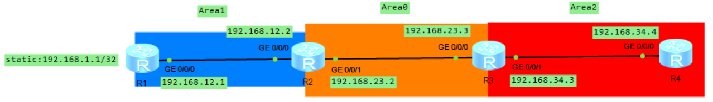

# OSPF 路由协议之 LSA4 和 LSA5

## 1.LSA4

LSA4（ABR summary）像 LSA3 一样都是由 ABR 产生的，并在 Area 内泛洪的一类 LSA。LSA4 和 LSA3 使用相同的报文格式，区别是 Type 字域是 4，**Link State ID 字域是 ASBR 路由器的 Router ID**，LSA4 的内容是 ASBR 到 ABR 的成本，在 LSA4 中，AdvRouter 为 ABR 的 Router ID，并且会随着 ABR 的不同而发生变化。

我们以下面的 topo 图来分析 LSA4，其中 R1 会引入外部路由 192.168.1.1。

    

R2 的 OSPF lsdb 如下所示，LSA4 是 ABR 为非 ASBR 所在区域产生，因此 Area1 中没有 LSA4，但是 Area0 

    

