# OSPF 路由协议之 Vlink

## 1 区域分割

OSPF 对骨干区域 (Area0) 有特定的要求：1，其他区域必须围绕骨干区域；2，骨干区域有且仅有一个，即不能分割；3，所有非骨干区域间的路由及数据流量互访，必须经过骨干区域。区域分割主要分为普通区域分割和骨干区域分割。

### 1.1 普通区域分割

普通区域如果出现分割或断裂而成为两个独立的区域，这种场景下，路由是可以正常在区域间传递且全网可达的。如下 topo 图所示：

    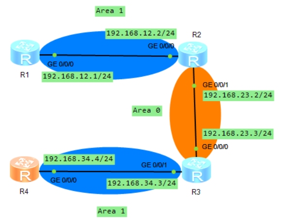

R4 的 OSPF lsdb 如下所示：

    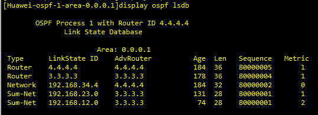

R4 的 OSPF 路由表如下所示：

    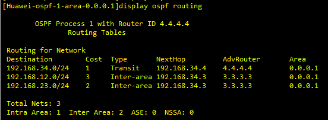

Area1 间可以互相学到对方的路由。如 R1 上 192.168.12.0/24 出现在 Area1 R4 的 OSPF 路由表中，R4 经 R3->R2 访问 R1。原因是 Area0 在区域间传递路由（LSA3），且携带 192.168.12.0/24 的 LSA3 上没有起源区域号的标识，经 Area0 进入 Area1 符合区域结构设计。下面是 R3 在 Area1 中泛洪的 LSA3，包括 12.0 和 23.0 两个路由，可以看到这两个 LSA3 中没有携带任何起源区域号的标识。因此 LSA3 就像在普通的非骨干区域中传播一样。

    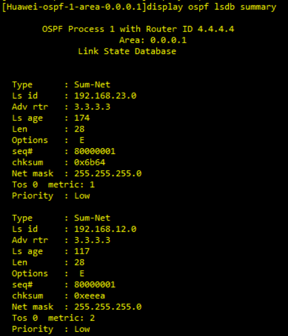

尽管此种设计可以工作，但实际中不要设计多个相同 ID 的普通区域，即使要配置，也要通过 GRE 等方案把相同 ID 的普通区域连接起来，使其看起来是一个完整的区域。vlink 是用于连接分割的骨干区域的，不能用于普通区域分割的场景。

### 1.2 骨干区域分割

如果是骨干区域断开，仍可以使用 GRE 隧道来连通断开的骨干区域，以下是 vlink 解决方案。

## 2.Vlink 原理

vlink 是用来修复骨干区域分割的一种临时的解决方案（但 vlink 不仅仅用来解决骨干区域分割）。在企业环境中，vlink 往往能解决因区域结构设计不合理而致骨干区域断开的场景。

### 2.1 Vlink 实例

#### 2.1.1 Vlink 实例 1

vlink 实例 1 为骨干区域被分割，修复被分割的骨干区域，要在非骨干区域上创建 vlink 来维持骨干区域的连通性。**vlink 被看作骨干区域的点到点的链路，其配置在两个 ABR 间**，即下图所示的 R2 和 R3 之间创建一个 Vlink 虚拟连接。

    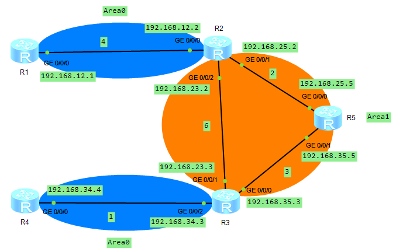

vlink 在两个 ABR 间创建属于骨干区域的邻居关系。这个邻居关系是单播的，穿过区域 Area1， 其单播地址取最小成本链路的 IP 地址当作源地址。承载 vlink 的这个 Area1 称为 Transit Area，vlink 是工作在 Transit Area 上的连接两个 ABR 的虚拟链路，该链路属于区域 0，其 OSPF 链路成本为 Transit Area 内两个 ABR 节点之间的最优路径成本。vlink 仅用来传递 LSA，vlink 并不传递数据。

上图 R2 使用 **`display ospf vlink`** 命令查看 vlink 连接：

    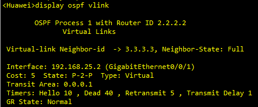

可以看到 vlink 连接的类型为 P-2-P，所以说邻居关系是单播，Cost 为 5，也就符合前面所说的 vlink 的 OSPF 链路成本为 Transit Area 中两个 ABR 节点之间的最优路径，R2 到 R3 之间的链路成本最小为 R2->R5->R3，并且从图中可以看出，Interface 为 192.168.25.2。同理，R3 上使用 **`display ospf vlink`** 命令查看 vlink 连接：

    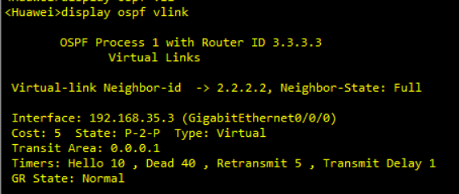

在上面 topo 中，R1 访问 R4 的流量经过 Area1 传递，R1->R2->R5->R3->R4，使用 tracert 命令获得结果如下：

    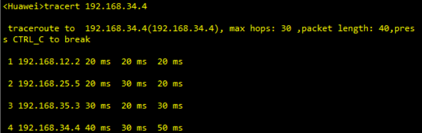

**所以区域间的数据传输要经过 Transit Area 内的最优路径，这个路径由 ABR R2 根据 Transit Area 中的 LSA3 计算决定，ABR R2 先通过 vlink 了解到 Area0 中的网络，再根据 Transit Area (Area1) 中的通告相应网络的 LSA3 确定访问 Area0 中该网络的路径**。

也就是 R2 先通过 vlink 中泛洪的 LSA1 和 LSA2（LSA2 如果有的话）了解到 Area0 中的网络（真正路径计算并不会用到）。也会通过 Area1 中泛洪的 LSA1 和 LSA2 建立 Area1 中各个节点的拓扑，然后再根据 Area1（Transit Area）中的 LSA3 以及 Area1 的节点拓扑，计算出访问 Area0 中网络的真正路径。最后，Transit Area 不能是 Stub 或 NSSA 区域。

接下来，我们分析上述 topo 图中的 R2 的 lsdb，如下图所示：

    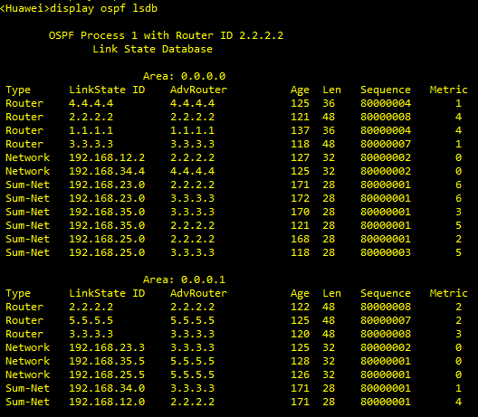

由于 R2 和 R3 之间建立了 vlink 连接，并且 vlink 属于区域 0，骨干区域，因此在 Area0 中，R2 可以收到 R1、R2、R3、R4 四个路由器发送的 Router LSA。又因为 vlink 只是逻辑上存在，实际中并不存在，因此 Network LSA 只有 12.2 和 34.4。最后就是 Summary-Net（LSA3），由于 Area0 中有 R2 和 R3 两个 ABR，因此 Area1 中 3 个网段的每一个都要在 Area0 中被通告两次，AdvRouter 分别为 2.2.2.2 和 3.3.3.3。

#### 2.1.2 Vlink 实例 2

实例 1 是骨干区域被分割时使用 vlink 将两个被分割的骨干区域连接起来，实例 2 是使用 vlink 来修复未连接到 Area0 的普通区域，topo 图如下所示：

    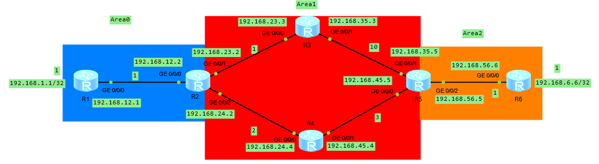

然后我们在 R2 和 R5 之间建立 vlink 虚拟连接，在 R2 上使用 **`display ospf vlink`** 命令查看 vlink 连接：

    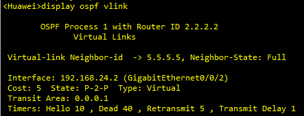

根据前面所述，vlink 的 OSPF 链路成本为 Transit Area 内两个 ABR 节点之间的最优路径成本。即 R2 到 R5 之间的最优路径为 R2->R4->R5，度量值为 5，并且从上图中可以看出，R2 vlink 的接口为 192.168.24.2。

如下图为 R2 上的 OSPF 路由表：

    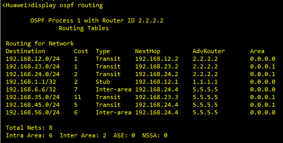

可以看出，R2 到 192.168.6.6 的路径为 R2->R4->R5->R6，Cost 值为 7。在 R1 上使用 traceert 192.168.6.6，返回结果如下所示：

    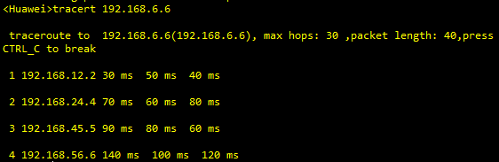

### 2.2 Vlink 应用场景

#### 2.2.1 连接断开的 Area0

场景 1，Area0 分割，如 Vlink 实例 1 所示，其需要 vlink 连接两个断开的 Area0，在 Area1 上创建连接 Area0 的逻辑链路 vlink。

#### 2.2.2 修复 Area2 未连接到 Area0

场景 2，Area2 没有直接连接到 Area0，如 Vlink 实例 2 所示，在 Area1 中创建 Area 0 的逻辑链路 vlink。

#### 2.2.3 解决次优路径问题及增加骨干区域的可靠性

场景 3，在如下 topo 图中，存在次优路径及骨干区域不健壮的问题。

    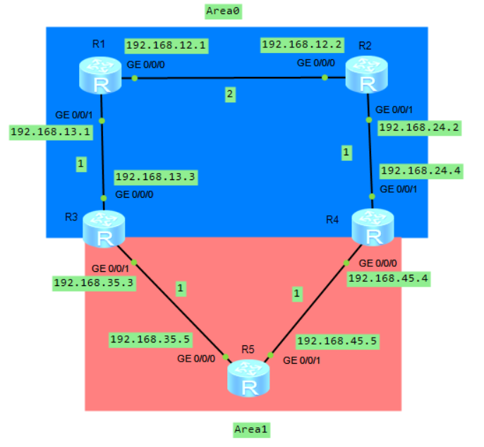

**1）解决次优路径**

在上图中，R4 上的 OSPF lsdb 如下所示，对于 13.0 网段，R4 会收到 Area0 内部（LSA1 和 LSA2）和 Area1 外部（LSA3）的 LSA，并且根据选路规则，OSPF 区域内路由优于区域间，故 R4 访问 13.0 网段需要经过 R2 和 R1，这就是不做 vlink 的情况。

    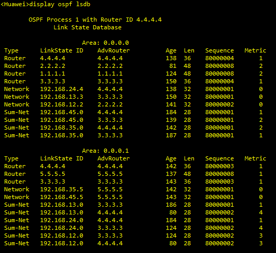

R4 的 OSPF 路由表如下所示，可以看出 R4 去往 192.168.13.0 网段的下一跳为 192.168.24.2，度量值为 4。

    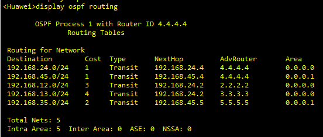

添加 vlink 后，R4 的 OSPF 路由表如下所示，可以看出 R4 访问 192.168.13.0 网段需要经过 R5 到 R3（下一跳为 192.168.45.5），这可解决次优路径问题。即 R4 访问 13.0 网段，路径 R4->R5->R3 优于 R4->R2->R1->R3。

    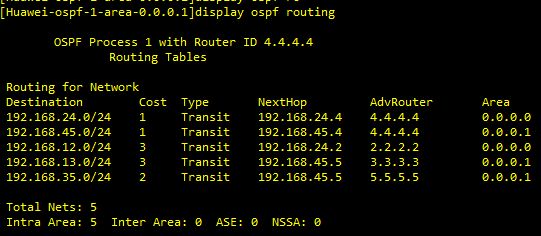

R4 的 OSPF lsdb 如下所示，可以看到，在 Area1 中 192.168.13.0 Sum-Net 只有 R3 向 Area1 泛洪，192.168.24.0 Sum-Net 只有 R4 向 Area1 泛洪，这是因为 R4 去往 13.0 的路径实际上是 R4->R5->R3，经过的为 Area1（可以从 OSPF 路由表中看出），故根据 ABR 矢量特性，不会再向 Area1 中泛洪 192.168.13.0 Sum-Net。同理，R3 去往 192.168.24.0 网段的路径实际为 R3->R5->R4，经过的也为 Area1，所以不会再向 Area1 中泛洪 192.168.24.0 Sum-Net。

    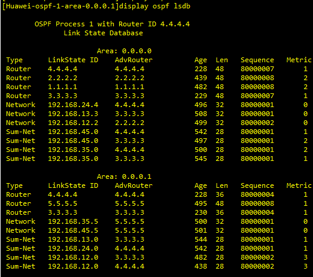

**2）增加骨干区域的可靠性**

R3 和 R4 间在 Area1 上创建 vlink，还可以用于提高 Area0 的健壮性，避免 R1 和 R2 之间链路断开而导致的 Area0 分裂。
