# OSPF 路由协议之 vlink

## 1 区域分割

OSPF 对骨干区域 (Area0) 有特定的要求：1，其他区域必须围绕骨干区域；2，骨干区域有且仅有一个，即不能分割；3，所有非骨干区域间的路由及数据流量互访，必须经过骨干区域。区域分割主要分为普通区域分割和骨干区域分割。

### 1.1 普通区域分割

普通区域如果出现分割或断裂而成为两个独立的区域，这种场景下，路由是可以正常在区域间传递且全网可达的。拓扑图如下所示，并且 R1 上有一个 loopback0，IP 地址为 **`192.168.1.1/24`**，归属于区域 1。

<div align="center">
    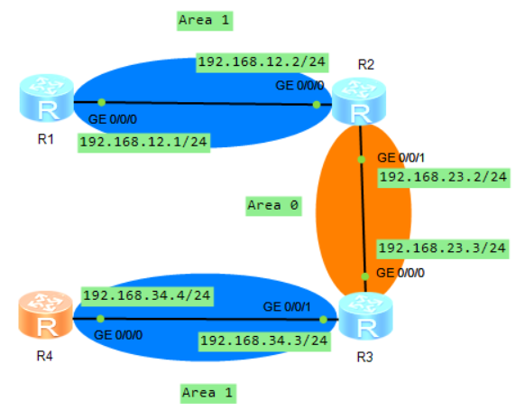
</div>

R2 的向 Area0 骨干区域中泛洪 **`192.168.1.1/24`** 网段的 LSA3，如下所示：

```java{.line-numbers}
<Huawei>display ospf lsdb summary self-originate 

	 OSPF Process 1 with Router ID 2.2.2.2
		         Area: 0.0.0.0
		 Link State Database 

  Type      : Sum-Net
  Ls id     : 192.168.1.1
  Adv rtr   : 2.2.2.2  
  Ls age    : 68 
  Len       : 28 
  Options   :  E  
  seq#      : 80000001 
  chksum    : 0x7276
  Net mask  : 255.255.255.255
  Tos 0  metric: 1
  Priority  : Low
```

R3 向非骨干区域 Area1 中泛洪 **`192.168.1.1/24`** 网段的 LSA3，如下所示：

```java{.line-numbers}
<Huawei>display ospf lsdb summary self-originate 
		         Area: 0.0.0.1
		 Link State Database 

  Priority  : Low

  Type      : Sum-Net
  Ls id     : 192.168.1.1
  Adv rtr   : 3.3.3.3  
  Ls age    : 136 
  Len       : 28 
  Options   :  E  
  seq#      : 80000001 
  chksum    : 0x5e85
  Net mask  : 255.255.255.255
  Tos 0  metric: 2
  Priority  : Low
```

因此 Area1 间可以互相学到对方的路由，根据 LSA3 的泛洪规则，ABR 从非骨干区域发往骨干区时，只能通告 **`intra-area routes`**；从骨干区域发往其他非骨干区时，可以通告 **`intra-area`** 和 **`inter-area routes`**。因此 R1 上 **`192.168.1.1/24`** 网段出现在 Area1 R4 的 OSPF 路由表中。**<font color="red">尽管此种设计可以工作，但实际中不要设计多个相同 ID 的普通区域</font>**，即使要配置，也要通过 GRE 等方案把相同 ID 的普通区域连接起来，使其看起来是一个完整的区域。vlink 是用于连接分割的骨干区域的，不能用于普通区域分割的场景。

### 1.2 骨干区域分割

如果是骨干区域断开，仍可以使用 GRE 隧道来连通断开的骨干区域，以下是 vlink 解决方案。

## 2.vlink 特性

### 2.1 vlink 原理

vlink 是用来修复骨干区域分割的一种临时的解决方案。在企业环境中，vlink 往往能解决因区域结构设计不合理而致骨干区域断开的场景。如果骨干区域被分割，修复被分割的骨干区域，要在非骨干区域上创建 vlink 来维持骨干区域的连通性。

<div align="center">
    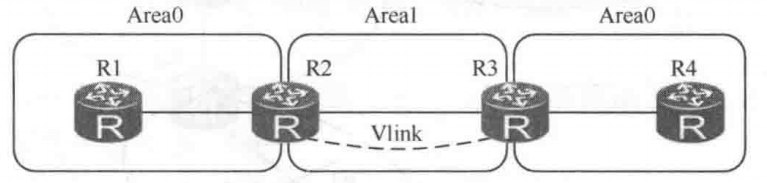
</div>

**<font color="red">vlink 被看作骨干区域的点到点的链路，其配置在两个 ABR 间，即上图中 R2 和 R3 之间</font>**。vlink 在两个 ABR 间创建属于骨干区域的邻居关系。这个邻居关系是单播的穿过区域 1，其单播地址是根据区域 1 中的 R2 和 R3 的 Router LSA 计算出来的。**<font color="red">Router LSA 中用于描述拓扑的 Link 中，Link Data 是本路由器自身的接口 IP，这个 IP 地址就是 vlink 使用的单播地址。Link ID 是 vlink 对端的路由器的 Router-ID</font>**。

承载 vlink 的这个 Area1 称为 Transit Area，当 vlink 创建好后，该区域也像骨干区域一样，在上图中，R1 访问 R4 的流量经过 Area1 传递。Transit Area 不能是 Stub 或 NSSA 区域。

### 2.2 vlink 特性

#### 2.2.1 特性 1

vlink 上可传递 LSA1/2/3/4 类型的 LSA，其他类型不传递。**LSA5 是在整个 OSPF 路由域中泛洪的 LSA，它可以直接在区域间泛洪**，**_vlink_** 不传递 LSA5。我们以 vlink 实例 2 中的 topo 图为例，但是做两处更改，首先将 192.168.1.1/32 作为外部路由引入；其次取消 R2 与 R5 之间的 vlink 连接。此时，R6 上的 OSPF lsdb 如下所示：

#### 2.2.2 特性 2

vlink 是工作在 Transit Area 上的连接两个 ABR 的虚拟链路，该虚链路属于区域 0，其 OSPF 链路成本为 Transit Area 内两个 ABR 节点间的最优路径的成本。

#### 2.2.3 特性 3

vlink 有正常的 OSPF 邻居关系，周期性发送 Hello 及 LSA 刷新，如果连续失去四个 Hello 报文，则 vlink 邻居关系 Down，这和直连链路上判定邻居失效的方式一致。但若两个 ABR 路由器物理直连（之前说的情况可能 ABR 路由器之间不为直连），vlink 建立后，物理链路断开或邻居断开，都会致 vlink 立即中断。

#### 2.2.4 特性 4

vlink 仅用来传递 LSA，vlink 并不传递数据（vlink 是一个虚拟连接）。区域间的数据传输要经过 Transit Area 内的最优路径，这个路径由 ABR 根据 Transit Area 中的 LSA3 计算决定，ABR 先通过 vlink 了解到 Area0 中的网络，再根据 Transit Area (Area1) 中的通告相应网络的 LSA3 确定访问 Area0 中该网络的路径。

## 3.vlink 优势

### 3.1 连接断开的 Area0

下面的拓扑为骨干区域被分割，修复被分割的骨干区域，要在非骨干区域上创建 vlink 来维持骨干区域的连通性。在 R1 上有一个 loopback0 接口，ip 地址为 **`192.168.1.1/24`**，属于区域 0。

<div align="center">
    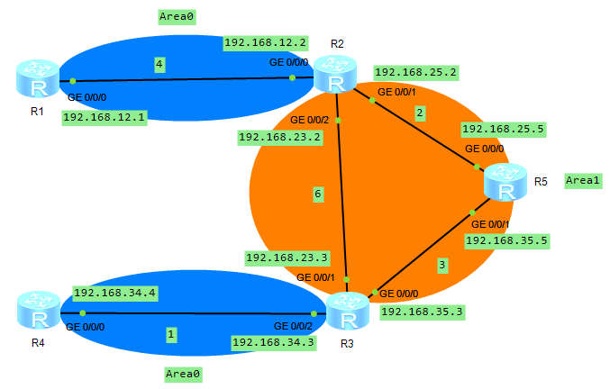
</div>

**vlink 被看作骨干区域的点到点的链路，其配置在两个 ABR 间**，在下图所示的 R2 和 R3 之间创建一个 vlink 虚拟连接。vlink 在两个 ABR 间创建属于骨干区域的邻居关系。承载 vlink 的这个 Area1 称为 Transit Area（上图中的 Area1），**<font color="red">vlink 是工作在 Transit Area 上的连接两个 ABR 的虚拟链路，该链路属于区域 0，其 OSPF 链路成本为 Transit Area 内两个 ABR 节点之间的最优路径成本</font>**。vlink 仅用来传递 LSA，vlink 并不传递数据。

上图 R2 使用 **`display ospf vlink`** 命令查看 vlink 连接：

```java{.line-numbers}
<Huawei>display ospf vlink

	 OSPF Process 1 with Router ID 2.2.2.2
		 Virtual Links 

 Virtual-link Neighbor-id  -> 3.3.3.3, Neighbor-State: Full

 Interface: 192.168.25.2 (GigabitEthernet0/0/1)
 Cost: 5  State: P-2-P  Type: Virtual 
 Transit Area: 0.0.0.1 
 Timers: Hello 10 , Dead 40 , Retransmit 5 , Transmit Delay 1 
 GR State: Normal 
```

可以看到 vlink 连接的类型为 P-2-P，所以说邻居关系是单播，Cost 为 5，也就符合前面所说的 vlink 的 OSPF 链路成本为 Transit Area 中两个 ABR 节点之间的最优路径，R2 到 R3 之间的链路成本最小为 **`R2->R5->R3`**，并且从图中可以看出，Interface 为 **`192.168.25.2`**。同理，R3 上使用 **`display ospf vlink`** 命令查看 vlink 连接：

```java{.line-numbers}
<Huawei>display ospf vlink 

	 OSPF Process 1 with Router ID 3.3.3.3
		 Virtual Links 

 Virtual-link Neighbor-id  -> 2.2.2.2, Neighbor-State: Full

 Interface: 192.168.35.3 (GigabitEthernet0/0/0)
 Cost: 5  State: P-2-P  Type: Virtual 
 Transit Area: 0.0.0.1 
 Timers: Hello 10 , Dead 40 , Retransmit 5 , Transmit Delay 1 
 GR State: Normal 
```

<div align="center">
    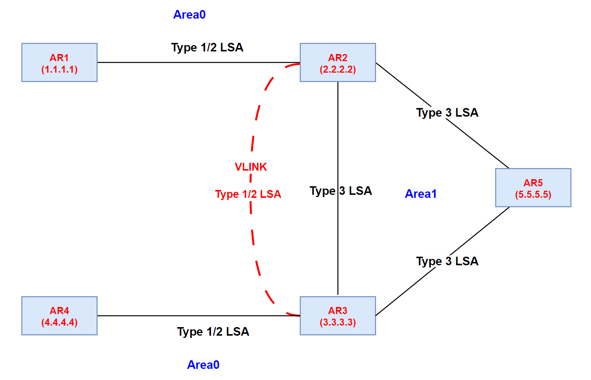
</div>

上述拓扑图的逻辑拓扑图以及 LSA 传递图如上所示，首先，R2 依据 Area 0 的明细拓扑（Type-1/Type-2 LSA），计算出了到达 **`192.168.1.1/24`** 的区域内路由；随后，R2 作为 ABR，将该计算结果转换为 Type-3 LSA 并注入 Area 1（骨干区域可以向非骨干区域泛洪 **`intra-area routes`** 和 **`inter-area routes`**），同时 Area0 中 R1 产生的 **`LSA1/LSA2`** 通过 vlink 传递给 R3 和 R4，因为 vlink 属于 Area0，因此这属于 Area0 内部的 **`LSA1/LSA2`** 泛洪。

因此 R3 上会收到 **`192.168.1.1/24`** 的 LSA1 和 LSA3 报文，如下所示。

```java{.line-numbers}
<Huawei>display ospf lsdb  summary 192.168.1.1

	 OSPF Process 1 with Router ID 3.3.3.3
		         Area: 0.0.0.0
		 Link State Database 

		         Area: 0.0.0.1
		 Link State Database 

  Type      : Sum-Net
  Ls id     : 192.168.1.1
  Adv rtr   : 2.2.2.2  
  Ls age    : 141 
  Len       : 28 
  Options   :  E  
  seq#      : 80000003 
  chksum    : 0x8c57
  Net mask  : 255.255.255.255
  Tos 0  metric: 4
  Priority  : Medium

<Huawei>display ospf lsdb router

	 OSPF Process 1 with Router ID 3.3.3.3
		         Area: 0.0.0.0
		 Link State Database 

  Type      : Router
  Ls id     : 1.1.1.1
  Adv rtr   : 1.1.1.1  
  Ls age    : 173 
  Len       : 48 
  Options   :  E  
  seq#      : 80000007 
  chksum    : 0xa731
  Link count: 2
   * Link ID: 192.168.12.2 
     Data   : 192.168.12.1 
     Link Type: TransNet     
     Metric : 4
   * Link ID: 192.168.1.1  
     Data   : 255.255.255.255 
     Link Type: StubNet      
     Metric : 0 
     Priority : Medium
```

但是 R3 上的 OSPF 路由表如下所示，可见使用了收到的 LSA3 来生成前往 **`192.168.1.1/24`** 网段的路由（因为 advRouter 为 **`2.2.2.2`**）。这是因为区域间的数据传输要经过 Transit Area 内的最优路径，**<font color="red">这个路径由 ABR 根据 Transit Area 中的 LSA3 计算决定</font>**，ABR 先通过 vlink 了解到 Area0 中的网络，**<font color="red">再根据 Transit Area (Area1) 中的通告相应网络的 LSA3 确定访问 Area0 中该网络的路径</font>**。

根据 RFC 文档：This step is only performed by area border routers attached to one or more non-backbone areas that are capable of carrying transit traffic (i.e., "transit areas". The purpose of the calculation below is to examine the transit areas to see whether they provide any better (shorter) paths than the paths previously calculated. Any paths found that are better than or equal to previously discovered paths are installed in the routing table. The calculation also determines the actual next hop(s) for those destinations. **<font color="red">因此如果某个非骨干区具备 TransitCapability（也就是 transit area），ABR 就要额外检查这个 Transit Area 里的 Summary-LSA，而且这一步还专门负责把 virtual link 下一跳解析成真实下一跳</font>**。但是请注意，普通的 ABR 是不检查非骨干区域 Summary-LSA。

所以这里的 R3 通过 LSA1 知道了 **`192.168.1.1/24`** 网段的存在，接着通过 LSA3 来计算真实的路由及下一跳。

```java{.line-numbers}
<Huawei>display ospf routing 

	 OSPF Process 1 with Router ID 3.3.3.3
		  Routing Tables 

 Routing for Network 
 Destination        Cost  Type       NextHop         AdvRouter       Area
 192.168.23.0/24    6     Transit    192.168.23.3    3.3.3.3         0.0.0.1
 192.168.34.0/24    1     Transit    192.168.34.3    3.3.3.3         0.0.0.0
 192.168.35.0/24    3     Transit    192.168.35.3    3.3.3.3         0.0.0.1
 192.168.1.1/32     9     Stub       192.168.35.5    2.2.2.2         0.0.0.1
 192.168.12.0/24    9     Transit    192.168.35.5    2.2.2.2         0.0.0.1
 192.168.25.0/24    5     Transit    192.168.35.5    5.5.5.5         0.0.0.1

 Total Nets: 6  
 Intra Area: 6  Inter Area: 0  ASE: 0  NSSA: 0 
```

由于非骨干区域只能向骨干区域中泛洪 **`intra-area routes`**，而不能泛洪 **`inter-area routes`**，因此 R3 不向 Area0 中泛洪 **`192.168.1.1/24`** 网段的 LSA3。R4 只能通过 R1 产生的 router LSA（沿着 vlink 传递给 R4）来计算到 **`192.168.1.1/24`** 的路由。

```java{.line-numbers}
<R4>display ospf lsdb summary 192.168.1.1

	 OSPF Process 1 with Router ID 4.4.4.4
		         Area: 0.0.0.0
		 Link State Database 

		         Area: 0.0.0.1
		 Link State Database 

<R4>display ospf lsdb router

	 OSPF Process 1 with Router ID 4.4.4.4
		         Area: 0.0.0.0
		 Link State Database 

  Type      : Router
  Ls id     : 1.1.1.1
  Adv rtr   : 1.1.1.1  
  Ls age    : 1278 
  Len       : 48 
  Options   :  E  
  seq#      : 80000007 
  chksum    : 0xa731
  Link count: 2
   * Link ID: 192.168.12.2 
     Data   : 192.168.12.1 
     Link Type: TransNet     
     Metric : 4
   * Link ID: 192.168.1.1  
     Data   : 255.255.255.255 
     Link Type: StubNet      
     Metric : 0 
     Priority : Medium

		         Area: 0.0.0.1
		 Link State Database 
```

在上面 topo 中，R1 访问 R4 的流量经过 Area1 传递，**`R1->R2->R5->R3->R4`**。

最后我们分析上述 topo 图中的 R4 的 lsdb，如下图所示：

```java{.line-numbers}
<Huawei>display ospf lsdb 

	 OSPF Process 1 with Router ID 4.4.4.4
		 Link State Database 

		         Area: 0.0.0.0
 Type      LinkState ID    AdvRouter          Age  Len   Sequence   Metric
 Router    4.4.4.4         4.4.4.4           1781  36    80000006       1
 Router    2.2.2.2         2.2.2.2           1772  48    80000009       4
 Router    1.1.1.1         1.1.1.1           1481  48    80000007       4
 Router    3.3.3.3         3.3.3.3           1771  48    80000008       1
 Network   192.168.12.2    2.2.2.2           1773  32    80000004       0
 Network   192.168.34.4    4.4.4.4           1781  32    80000003       0
 Sum-Net   192.168.23.0    3.3.3.3             23  28    80000004       6
 Sum-Net   192.168.23.0    2.2.2.2             20  28    80000004       6
 Sum-Net   192.168.35.0    3.3.3.3             23  28    80000004       3
 Sum-Net   192.168.35.0    2.2.2.2           1781  28    80000003       5
 Sum-Net   192.168.25.0    3.3.3.3           1781  28    80000003       5
 Sum-Net   192.168.25.0    2.2.2.2             20  28    80000004       2
 
		         Area: 0.0.0.1
```

由于 R2 和 R3 之间建立了 vlink 连接，并且 vlink 属于区域 0，骨干区域，因此在 Area0 中，R4 可以收到 R1、R2、R3、R4 四个路由器发送的 Router LSA。最后就是 Summary-Net（LSA3），由于 Area0 中有 R2 和 R3 两个 ABR，因此 Area1 中 3 个网段的每一个都要在 Area0 中被通告两次，AdvRouter 分别为 **`2.2.2.2`** 和 **`3.3.3.3`**。

### 3.2 修复 Area2 未连接到 Area0

接下来介绍使用 vlink 来修复未连接到 Area0 的普通区域，拓扑图如下所示：

<div align="center">
    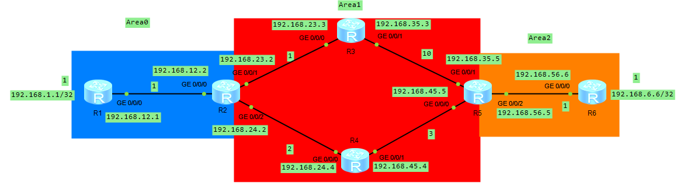
</div>

然后我们在 R2 和 R5 之间建立 vlink 虚拟连接，在 R2 上使用 **`display ospf vlink`** 命令查看 vlink 连接：

```java{.line-numbers}
<R2>display ospf vlink

	 OSPF Process 1 with Router ID 2.2.2.2
		 Virtual Links 

 Virtual-link Neighbor-id  -> 5.5.5.5, Neighbor-State: Full

 Interface: 192.168.24.2 (GigabitEthernet0/0/2)
 Cost: 5  State: P-2-P  Type: Virtual 
 Transit Area: 0.0.0.1 
 Timers: Hello 10 , Dead 40 , Retransmit 5 , Transmit Delay 1 
```

根据前面所述，vlink 的 OSPF 链路成本为 Transit Area 内两个 ABR 节点之间的最优路径成本。即 R2 到 R5 之间的最优路径为 **`R2->R4->R5`**，度量值为 5，并且从上图中可以看出，R2 vlink 的接口为 **`192.168.24.2`**。上述拓扑图的逻辑拓扑图以及 LSA 传递图如下所示：

<div align="center">
    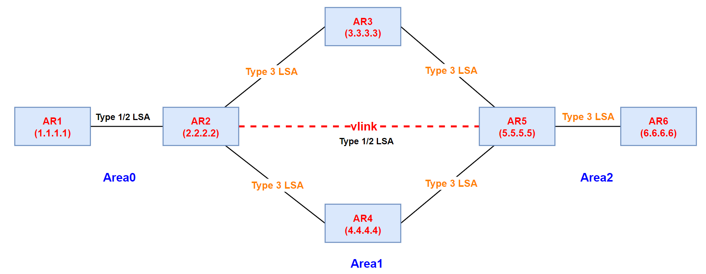
</div>

以 R1 上的 **`192.168.1.1/24`** 网段为例，首先，R2 依据 Area 0 的明细拓扑（Type-1/Type-2 LSA），计算出了到达 **`192.168.1.1/24`** 的区域内路由；随后，R2 作为 ABR，将该计算结果转换为 Type-3 LSA 并注入 Area 1，同时 Area0 中 R1 产生的 **`LSA1/LSA2`** 通过 vlink 传递给 R5，因为 vlink 属于 Area0，因此这属于 Area0 内部的 **`LSA1/LSA2`** 泛洪。因此 R5 上会收到 **`192.168.1.1/24`** 的 LSA1 和 LSA3 报文，并且由于 R5 连接 Area0（vlink）和 Area2，因此会将 **`192.168.1.1/24`** 转换为 Type-3 LSA 并注入 Area 2 中（即骨干区域中的 **`intra-routes`** 向非骨干区域中泛洪）。

R5 上收到的 **`192.168.1.1/24`** 的 LSA3 报文如下（advRouter 为 **`2.2.2.2`**），如前所述 R5 自己还会向 Area2 中泛洪 **`192.168.1.1/24`** 的 LSA3 报文。

```java{.line-numbers}
<Huawei>display ospf lsdb summary 192.168.1.1

	 OSPF Process 1 with Router ID 5.5.5.5
		         Area: 0.0.0.0
		 Link State Database 

		         Area: 0.0.0.1
		 Link State Database 

  Type      : Sum-Net
  Ls id     : 192.168.1.1
  Adv rtr   : 2.2.2.2  
  Ls age    : 374 
  Len       : 28 
  Options   :  E  
  seq#      : 80000001 
  chksum    : 0x7c6b
  Net mask  : 255.255.255.255
  Tos 0  metric: 2
  Priority  : Medium
		         Area: 0.0.0.2
		 Link State Database 

  Type      : Sum-Net
  Ls id     : 192.168.1.1
  Adv rtr   : 5.5.5.5  
  Ls age    : 372 
  Len       : 28 
  Options   :  E  
  seq#      : 80000001 
  chksum    : 0x5482
  Net mask  : 255.255.255.255
  Tos 0  metric: 7
  Priority  : Low
```

R5 上收到的 **`192.168.1.1/24`** 的 LSA1 报文如下（advRouter 为 **`1.1.1.1`**），该 LSA1 报文通过 vlink（属于区域 0）传递给 R5。 

```java{.line-numbers}
<Huawei>display ospf lsdb router 1.1.1.1

	 OSPF Process 1 with Router ID 5.5.5.5
		         Area: 0.0.0.0
		 Link State Database 

  Type      : Router
  Ls id     : 1.1.1.1
  Adv rtr   : 1.1.1.1  
  Ls age    : 877 
  Len       : 48 
  Options   :  E  
  seq#      : 80000005 
  chksum    : 0x9349
  Link count: 2
   * Link ID: 192.168.12.2 
     Data   : 192.168.12.1 
     Link Type: TransNet     
     Metric : 1
   * Link ID: 192.168.1.1  
     Data   : 255.255.255.255 
     Link Type: StubNet      
     Metric : 1 
     Priority : Medium
		         Area: 0.0.0.1
		 Link State Database 

		         Area: 0.0.0.2
		 Link State Database 
```

根据 R5 上 **`192.168.1.1/24`** 的 OSPF 路由，下一跳和 associated area 都属于 Area1，因此 R5 不会反向 Area1 中泛洪 **`192.168.1.1/24`** 的 LSA3 报文，同时非骨干区域只能向骨干区域泛洪 **`intra-routes`** LSA3 报文，因此也不会再将 **`192.168.1.1/24`** 泛洪到 Area0 中。

```java{.line-numbers}
<R5>display ospf lsdb summary self-originate
		         Area: 0.0.0.1
		 Link State Database 

  Type      : Sum-Net
  Ls id     : 192.168.56.0
  Adv rtr   : 5.5.5.5  
  Ls age    : 306 
  Len       : 28 
  Options   :  E  
  seq#      : 80000003 
  chksum    : 0xbee5
  Net mask  : 255.255.255.0
  Tos 0  metric: 1
  Priority  : Low

  Type      : Sum-Net
  Ls id     : 192.168.6.6
  Adv rtr   : 5.5.5.5  
  Ls age    : 306 
  Len       : 28 
  Options   :  E  
  seq#      : 80000003 
  chksum    : 0xb41b
  Net mask  : 255.255.255.255
  Tos 0  metric: 2
  Priority  : Low
```

### 3.3 解决次优路径问题及增加骨干区域的可靠性

场景 3，在如下 topo 图中，存在次优路径及骨干区域不健壮的问题。

<div align="center">
    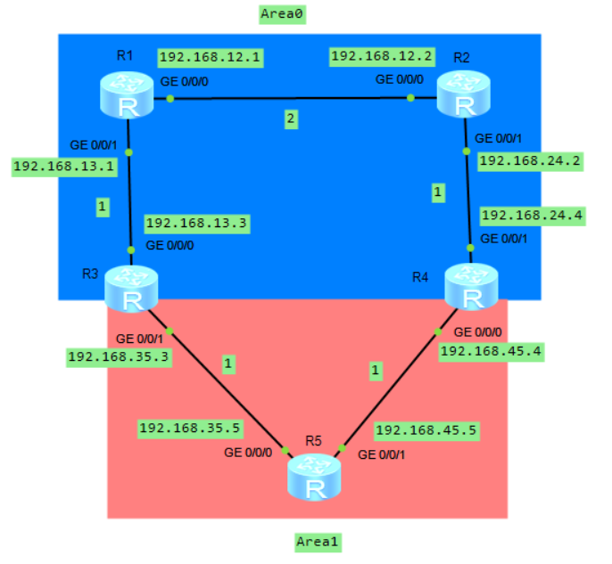
</div>

#### 3.3.1 解决次优路径

在上图中，R3 上有一个 loopback0，并且 ip 地址为 **`192.168.3.3/24`**，属于 Area0。对于 **`192.168.3.3/24`** 网段，R4 会收到 Area0 内部（LSA1 和 LSA2）和 Area1 外部（LSA3）的 LSA，由于 ABR 不检验非骨干区域接收到的 LSA3（即不会使用其计算路由），故 R4 访问 **`192.168.3.3/24`** 网段需要经过 R2 和 R1，这就是不做 vlink 的情况。根据如下 R4 上的 OSPF 路由表可知，R4 到 **`192.168.3.3/24`** 的路径开销为 4，下一跳为 **`192.168.24.2`**。

```java{.line-numbers}
<Huawei>display ospf routing 

	 OSPF Process 1 with Router ID 4.4.4.4
		  Routing Tables 

 Routing for Network 
 Destination        Cost  Type       NextHop         AdvRouter       Area
 192.168.24.0/24    1     Transit    192.168.24.4    4.4.4.4         0.0.0.0
 192.168.45.0/24    1     Transit    192.168.45.4    4.4.4.4         0.0.0.1
 192.168.3.3/32     4     Stub       192.168.24.2    3.3.3.3         0.0.0.0
 192.168.12.0/24    3     Transit    192.168.24.2    2.2.2.2         0.0.0.0
 192.168.13.0/24    4     Transit    192.168.24.2    3.3.3.3         0.0.0.0
 192.168.35.0/24    2     Transit    192.168.45.5    5.5.5.5         0.0.0.1

 Total Nets: 6  
 Intra Area: 6  Inter Area: 0  ASE: 0  NSSA: 0 
```

在 R3 和 R4 之间添加上 vlink 之后，R4 的 OSPF 路由表如下所示，可以看出 R4 访问 **`192.168.3.3/24`** 网段需要经过 R5 到 R3（下一跳为 **`192.168.45.5`**），这可解决次优路径问题。即 R4 访问 **`192.168.3.3/24`** 网段，路径 **`R4->R5->R3`** 优于 **`R4->R2->R1->R3`**。

发生上述改变的原因是在 R4 和 R3 之间添加上 vlink 后，ABR 计算路由的方式发生改变。**<font color="red">正常不使用 vlink 的情况下，ABR R4 只要在 Area0 有邻接，不使用 Area1 中的 LSA3 计算路由。但如果 ABR 是 Vlink 的端点，则其可以根据 Area1 中的 LSA3 计算到骨干区域路由，以寻找更优路径，将 vlink 的另外一端解析</font>**。也就是一旦某个非骨干区承担了虚链路的 Transit Area 角色，这个区域在路由计算时就必须被特殊对待。因此 R4 访问 **`192.168.3.3/24`** 网段的下一跳变为 **`192.168.45.5`**。

```java{.line-numbers}
[Huawei-ospf-1-area-0.0.0.1]display ospf routing 

	 OSPF Process 1 with Router ID 4.4.4.4
		  Routing Tables 

 Routing for Network 
 Destination        Cost  Type       NextHop         AdvRouter       Area
 192.168.24.0/24    1     Transit    192.168.24.4    4.4.4.4         0.0.0.0
 192.168.45.0/24    1     Transit    192.168.45.4    4.4.4.4         0.0.0.1
 192.168.3.3/32     2     Stub       192.168.45.5    3.3.3.3         0.0.0.1
 192.168.12.0/24    3     Transit    192.168.24.2    2.2.2.2         0.0.0.0
 192.168.13.0/24    3     Transit    192.168.45.5    3.3.3.3         0.0.0.1
 192.168.35.0/24    2     Transit    192.168.45.5    5.5.5.5         0.0.0.1

 Total Nets: 6  
 Intra Area: 6  Inter Area: 0  ASE: 0  NSSA: 0 
```

R4 的 OSPF lsdb 如下所示，可以看到，在 Area1 中 **`192.168.3.3`** Sum-Net 只有 R3 向 Area1 泛洪，这是因为根据 R4 上的 OSPF 路由表，R4 去往 **`192.168.3.3`** 的路由条目的 assocaited area 为 1，并且下一跳为 **`192.168.45.5`**（也属于 area1），故根据 ABR 矢量特性，不会再向 Area1 中泛洪 **`192.168.3.3`** Sum-Net。

```java{.line-numbers}
[R4]display ospf lsdb 

	 OSPF Process 1 with Router ID 4.4.4.4
		 Link State Database 

		         Area: 0.0.0.0
 Type      LinkState ID    AdvRouter          Age  Len   Sequence   Metric
 Router    4.4.4.4         4.4.4.4              8  48    8000000C       1
 Router    2.2.2.2         2.2.2.2           1461  48    80000008       2
 Router    1.1.1.1         1.1.1.1           1466  48    80000008       2
 Router    3.3.3.3         3.3.3.3              9  60    8000000D       1
 Network   192.168.24.4    4.4.4.4           1465  32    80000002       0
 Network   192.168.13.3    3.3.3.3           1465  32    80000003       0
 Network   192.168.12.2    2.2.2.2           1461  32    80000003       0
 Sum-Net   192.168.45.0    4.4.4.4           1508  28    80000002       1
 Sum-Net   192.168.45.0    3.3.3.3           1481  28    80000002       2
 Sum-Net   192.168.35.0    4.4.4.4           1472  28    80000002       2
 Sum-Net   192.168.35.0    3.3.3.3           1514  28    80000002       1
 
		         Area: 0.0.0.1
 Type      LinkState ID    AdvRouter          Age  Len   Sequence   Metric
 Router    4.4.4.4         4.4.4.4              8  36    80000008       1
 Router    5.5.5.5         5.5.5.5           1470  48    80000009       1
 Router    3.3.3.3         3.3.3.3             10  36    80000009       1
 Network   192.168.35.5    5.5.5.5           1471  32    80000003       0
 Network   192.168.45.5    5.5.5.5           1476  32    80000002       0
 Sum-Net   192.168.13.0    3.3.3.3           1513  28    80000002       1
 Sum-Net   192.168.24.0    4.4.4.4           1508  28    80000002       1
 Sum-Net   192.168.12.0    4.4.4.4           1464  28    80000002       3
 Sum-Net   192.168.12.0    3.3.3.3           1467  28    80000002       3
 Sum-Net   192.168.3.3     3.3.3.3           1375  28    80000002       0
```


#### 3.3.2 增加骨干区域的可靠性

R3 和 R4 间在 Area1 上创建 vlink，还可以用于提高 Area0 的健壮性，避免 R1 和 R2 之间链路断开而导致的 Area0 分裂。

## 4.vlink 的缺陷

### 4.1 vlink 形成次优路径

### 4.2 vlink 设计不当，会导致网络出现环路

<div align="center">
    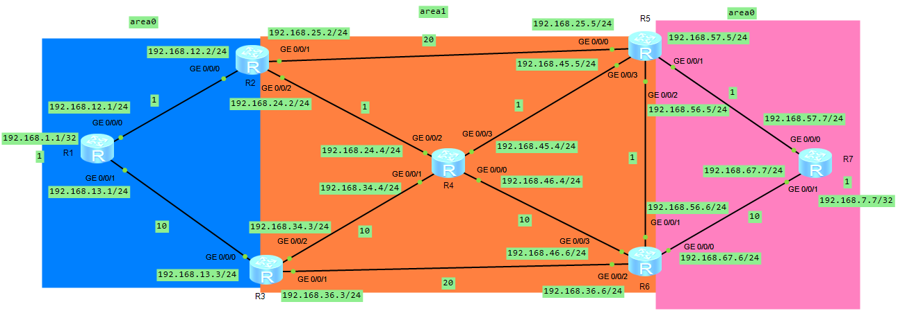
</div>

我们使用如上的 topo 图来进行实验，分析 R1 与 R7 之间流量互相访问的情况，先分析没有在 R3 与 R6 之间建立 vlink 的情况。

**（1）没有创建 vlink 连接之前**

OSPF 区域结构要求非 0 区域必须连接骨干区域，上图中，Area0 被分割为两处，192.168.1.1/32 路由经 ABR 路由器（R2 和 R3）进入 Area1，R5 和 R6 连接 Area0，根据规则，**R5 和 R6 由于有 Area0 的 OSPF 邻居，所以不接收非骨干区域学到的 LSA3 路由 192.168.1.1/32**。区域间的 LSA3 不会流向右侧 Area0，所以右侧 Area0 中没有该路由。如果不做 vlink，全网左右两侧的 Area0 不能互访。

R1 上的 OSPF lsdb 如下所示，可以看到只有左侧 Area0 中泛洪的 LSA1 和 LSA2，以及 Area1 泛洪过来的 LSA3，没有右侧 Area0 的路由信息，所以左右两侧处于被分割的状态，无法进行通信。

<div align="center">
    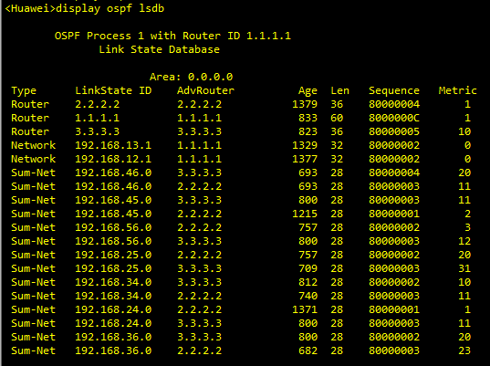
</div>

R1 上的 OSPF 路由表如下所示：

<div align="center">
    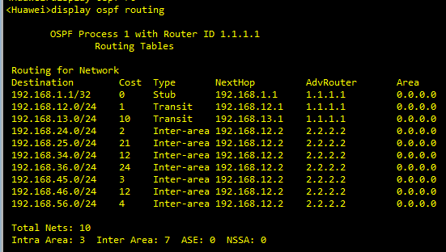
</div>

R5 和 R6 不接收非骨干区域的 LSA3 路由，若在 R5 和／或 R6 上配置 vlink 后，R5／R6 可以通过 vlink 学到骨干区域泛洪过来的路由（vlink 属于区域 0），再根据 Area1 中泛洪的 LSA3 路由计算访问路径。

**（2）在 R3 和 R6 之间建立 vlink 连接后**

在介绍 R3 与 R6 之间建立 vlink 连接之前，先明确以下三点：

1. ABR 只要在 Area0 有邻接，其不收 Area1 中的 LSA3 路由，使用 Area0 中置 V 的路由器作为访问其他非直连区域的出口。**但如果 ABR 是 vlink 的端点，则其可以根据 Area1 中的 LSA3 计算到骨干区域路由**，也就是此 ABR 可以根据非骨干区域中的 LSA3 来计算 OSPF 路由。

2. vlink 在 R3 和 R6 间建立，但数据转发不代表一定要经过 R3 和 R6 路径，控制平面和数据平面是分开的。

3. ABR 路由器是否向另外一个区域（假设为 Area1）泛洪 LSA3 路由，不仅仅看 OSPF 路由表中是否有路由，还需要看此路由的下一跳地址，如果下一跳地址就在 Area1 中，那么不会向 Area1 中泛洪 LSA3。

<div align="center">
    
</div>

#### 讨论 R1 访问 R7 的去程流量

首先如前所述，R3 变为 vlink 的端点之后，就可以根据非骨干区域（Area1）中的 LSA3 来计算到右侧 Area0 区域的路由。R3 的 OSPF 路由表如下所示，可以看到有到右侧 Area0 的路由。

<div align="center">
    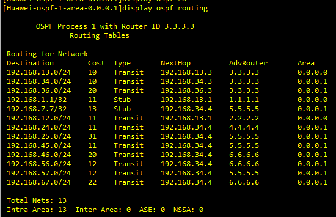
</div>

R3 的 OSPF lsdb 如下所示（Area1），主要关注 Summary-Net，其中 192.168.67.0 网段只有 R2、R5 和 R6，这是因为 R3 去往 67.0 网段的下一跳为 192.168.34.4，本身位于 Area1 中，所以不会向 Area1 泛洪 67.0 网段路由。同理，192.168.57.0 网段只有 R2 和 R5 向 Area1 中泛洪 LSA3，这是因为 R3 去往 57.0 网段的下一跳为 192.168.34.4，R6 去往 57.0 网段的下一跳为 192.168.56.5，均位于 Area1 中，所以不会向 Area1 泛洪。

<div align="center">
    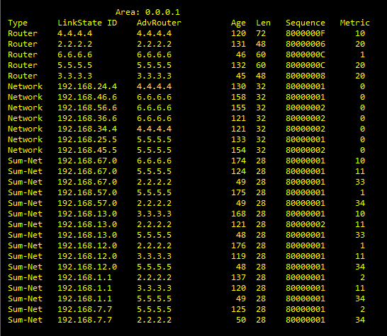
</div>

R3 的 OSPF lsdb（Area0）部分如下所示，可以看到，R3 和 R6 之间建立好 vlink 连接之后，R1、R2、R3、R5、R6、R7 都属于 Area0，在骨干区域中泛洪 LSA1（Router LSA），以及 4 条 LSA2（Network LSA）。

<div align="center">
    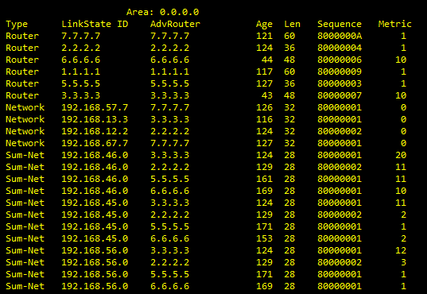
</div>

但是 R2 不是 vlink 端点，因此不能接收非骨干区域中的 LSA3，因此只能根据 Area0 中泛洪的 LSA1 和 LSA2 来确定去往 192.167.7.7 的下一跳地址。R2 的 OSPF 路由表如下，去往 7.7 的下一跳为 192.168.12.1.

<div align="center">
    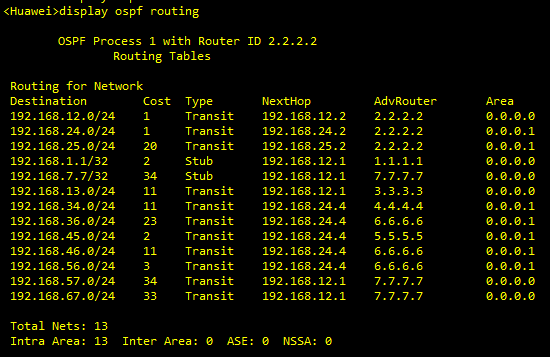
</div>

因此，R1 通过 R3 通告的置 V-bit 的 Router LSA，R1 把访问远端 Area0 的数据包路由到 R3。

R1 访问 R7 上网络，数据包仍然要路由到下一跳 R3。R3 是 ABR，它有 Area0（R1 所在 Area0 和 R7 所在 Area0）的全部 LSA 及 TransitArea (Area1) 的 LSA，所以它在计算访问路径时考虑 Area0 和 Area1 中 LSA，R3 根据 R5 和 R6 通告的 LSA3(192.168.7.7)，其路由成本分别是 2 和 11，再结合 Area1 中的拓扑计算，R3 到 R5 的最短路径为 11，R3 到 R6 的最短路径为 12。因此 R3 到 192.168.7.7 的端到端最优路径是经 R5 的 R3-R4-R5-R7，这样数据包被 R3 路由到 R4。

R4 选路根据区域间的到 192.168.7.7/32 的 LSA3，根据最小成本选择 R5 作为下一跳。综上，R1 访问 R7 数据包的转发路径是 R1-R3-R4-R5-R7。

#### 讨论 R7 访问 R1 的回程流量

R7 处在 Area0 内，计算到 Area0 中 R1 上的网络，路由指向 V 置位的 ABR R6。原因一样，R5 不为 vlink 的端点，因此不能接收非骨干区域中的路由 LSA3，R5 在 Area0 中的 OSPF lsdb 如下所示：

<div align="center">
    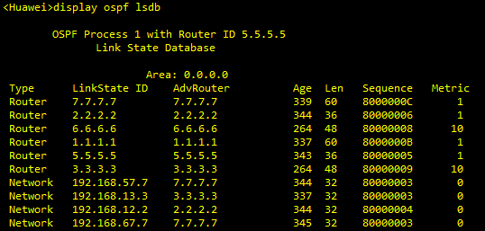
</div>

R5 在 Area1 中的 OSPF lsdb 如下所示：

<div align="center">
    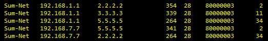
</div>

R5 只选择 Area0 中的 Router LSA 来计算到达 192.168.1.1 的路由，其 OSPF 路由表如下所示，去往 192.168.1.1 的下一跳为 192.168.57.7，转发给 R7。

<div align="center">
    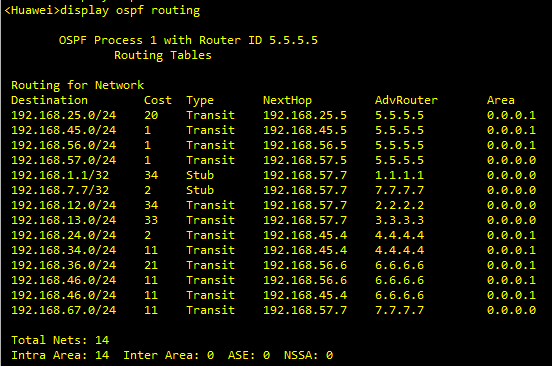
</div>

R6 是 ABR，通过 vlink 学到包含 192.168.1.1/32 的 LSA1，R6 到达这个目的路由必然通过 Transit Area（Area1），所以同上面去程的分析过程类似，R6 计算路径，同时考虑 Area0 和 Areal，数据转发路径是成本最小的路径，得出的回程路径是成本最小的端到端路径 R6->R5->R4->R2->R1。这里就形成了环路，因为 R5 在收到去往 192.168.1.1 的数据包时，会转发给 R7，R7 又会转发给 R6，形成了 R7->R6->R5->R7 的环路。

### 4.3 vlink 使 Transit Area 不能对 Area0 路由做聚合

<div align="center">
    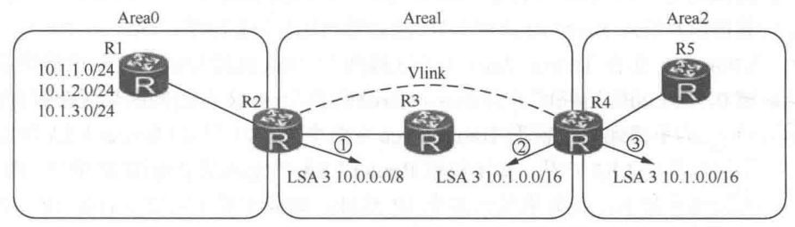
</div>

Area0 中的路由通过 ABR R2 通告到 Area1 中，为减少 Area1 中路由的数量，在边界 ABR R2 上做路由的聚合。但由于在 Area1（Transit Area）上创建 vlink 后，R2 无法再对骨干区域路由做聚合，原因是为了避免在 Transit Area 内出现路由环路。

原因说明：

如果能聚合成功的话，在上面的 topo 图中，Area1 的边界路由器 R2 执行聚合，产生 LSA3（包含路由 10.0.0.0/8），R4 执行路由聚合，产生 LSA3（包含路由 10.1.0.0/16），Area1 的网络结构是一个线性的网络，R3 上会收到 R2 和 R4 通告的聚合路由，所以 R3 上 10.0.0.0/8 路由下一跳指向 R2，而 10.1.0.0/16 路由下一跳指向 R4。

若 R3 收到访问 10.1.3.1 的数据包，R3 路由报文到 R4（最长前缀匹配），R4 上有 vlink，所以 Area0 中会泛洪 R1、R2、R4 的 Router LSA。**因此路由表中有到达 10.1.1.0/24、10.1.2.0/24、10.1.3.0/24 的 Area0 的路由并指向 R3（在 Transit Area 中的数据传输只能通过 R4->R3->R2 这一条路径），R4 会送流量到 R3，R3 会送流量到 R4，路由环路出现**。

若 vlink 邻居不存在，则 R4 不是 ABR，不能执行路由聚合，仅 R2 上可以执行路由聚合，环路不会发生。