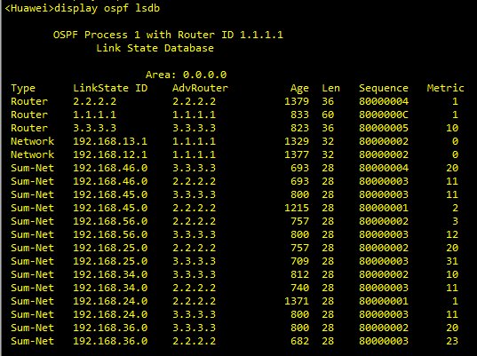
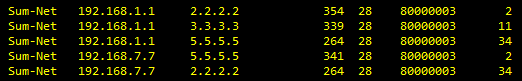

# OSPF 路由协议之 Vlink

## 1 区域分割

OSPF 对骨干区域 (Area0) 有特定的要求：1，其他区域必须围绕骨干区域；2，骨干区域有且仅有一个，即不能分割；3，所有非骨干区域间的路由及数据流量互访，必须经过骨干区域。区域分割主要分为普通区域分割和骨干区域分割。

### 1.1 普通区域分割

普通区域如果出现分割或断裂而成为两个独立的区域，这种场景下，路由是可以正常在区域间传递且全网可达的。如下 topo 图所示：

    

R4 的 OSPF lsdb 如下所示：

    

R4 的 OSPF 路由表如下所示：

    

Area1 间可以互相学到对方的路由。如 R1 上 192.168.12.0/24 出现在 Area1 R4 的 OSPF 路由表中，R4 经 R3->R2 访问 R1。原因是 Area0 在区域间传递路由（LSA3），且携带 192.168.12.0/24 的 LSA3 上没有起源区域号的标识，经 Area0 进入 Area1 符合区域结构设计。下面是 R3 在 Area1 中泛洪的 LSA3，包括 12.0 和 23.0 两个路由，可以看到这两个 LSA3 中没有携带任何起源区域号的标识。因此 LSA3 就像在普通的非骨干区域中传播一样。

    

尽管此种设计可以工作，但实际中不要设计多个相同 ID 的普通区域，即使要配置，也要通过 GRE 等方案把相同 ID 的普通区域连接起来，使其看起来是一个完整的区域。vlink 是用于连接分割的骨干区域的，不能用于普通区域分割的场景。

### 1.2 骨干区域分割

如果是骨干区域断开，仍可以使用 GRE 隧道来连通断开的骨干区域，以下是 vlink 解决方案。

## 2.Vlink 原理

vlink 是用来修复骨干区域分割的一种临时的解决方案（但 vlink 不仅仅用来解决骨干区域分割）。在企业环境中，vlink 往往能解决因区域结构设计不合理而致骨干区域断开的场景。

### 2.1 Vlink 实例

#### 2.1.1 Vlink 实例 1

vlink 实例 1 为骨干区域被分割，修复被分割的骨干区域，要在非骨干区域上创建 vlink 来维持骨干区域的连通性。**vlink 被看作骨干区域的点到点的链路，其配置在两个 ABR 间**，即下图所示的 R2 和 R3 之间创建一个 Vlink 虚拟连接。

    

vlink 在两个 ABR 间创建属于骨干区域的邻居关系。这个邻居关系是单播的，穿过区域 Area1， 其单播地址取最小成本链路的 IP 地址当作源地址。承载 vlink 的这个 Area1 称为 Transit Area，vlink 是工作在 Transit Area 上的连接两个 ABR 的虚拟链路，该链路属于区域 0，其 OSPF 链路成本为 Transit Area 内两个 ABR 节点之间的最优路径成本。vlink 仅用来传递 LSA，vlink 并不传递数据。

上图 R2 使用 **`display ospf vlink`** 命令查看 vlink 连接：

    

可以看到 vlink 连接的类型为 P-2-P，所以说邻居关系是单播，Cost 为 5，也就符合前面所说的 vlink 的 OSPF 链路成本为 Transit Area 中两个 ABR 节点之间的最优路径，R2 到 R3 之间的链路成本最小为 R2->R5->R3，并且从图中可以看出，Interface 为 192.168.25.2。同理，R3 上使用 **`display ospf vlink`** 命令查看 vlink 连接：

    

在上面 topo 中，R1 访问 R4 的流量经过 Area1 传递，R1->R2->R5->R3->R4，使用 tracert 命令获得结果如下：

    

**所以区域间的数据传输要经过 Transit Area 内的最优路径，这个路径由 ABR R2 根据 Transit Area 中的 LSA3 计算决定，ABR R2 先通过 vlink 了解到 Area0 中的网络，再根据 Transit Area (Area1) 中的通告相应网络的 LSA3 确定访问 Area0 中该网络的路径**。

也就是 R2 先通过 vlink 中泛洪的 LSA1 和 LSA2（LSA2 如果有的话）了解到 Area0 中的网络（真正路径计算并不会用到）。也会通过 Area1 中泛洪的 LSA1 和 LSA2 建立 Area1 中各个节点的拓扑，然后再根据 Area1（Transit Area）中的 LSA3 以及 Area1 的节点拓扑，计算出访问 Area0 中网络的真正路径。最后，Transit Area 不能是 Stub 或 NSSA 区域。

接下来，我们分析上述 topo 图中的 R2 的 lsdb，如下图所示：

    

由于 R2 和 R3 之间建立了 vlink 连接，并且 vlink 属于区域 0，骨干区域，因此在 Area0 中，R2 可以收到 R1、R2、R3、R4 四个路由器发送的 Router LSA。又因为 vlink 只是逻辑上存在，实际中并不存在，因此 Network LSA 只有 12.2 和 34.4。最后就是 Summary-Net（LSA3），由于 Area0 中有 R2 和 R3 两个 ABR，因此 Area1 中 3 个网段的每一个都要在 Area0 中被通告两次，AdvRouter 分别为 2.2.2.2 和 3.3.3.3。

#### 2.1.2 Vlink 实例 2

实例 1 是骨干区域被分割时使用 vlink 将两个被分割的骨干区域连接起来，实例 2 是使用 vlink 来修复未连接到 Area0 的普通区域，topo 图如下所示：

    

然后我们在 R2 和 R5 之间建立 vlink 虚拟连接，在 R2 上使用 **`display ospf vlink`** 命令查看 vlink 连接：

    

根据前面所述，vlink 的 OSPF 链路成本为 Transit Area 内两个 ABR 节点之间的最优路径成本。即 R2 到 R5 之间的最优路径为 R2->R4->R5，度量值为 5，并且从上图中可以看出，R2 vlink 的接口为 192.168.24.2。

如下图为 R2 上的 OSPF 路由表：

    

可以看出，R2 到 192.168.6.6 的路径为 R2->R4->R5->R6，Cost 值为 7。在 R1 上使用 traceert 192.168.6.6，返回结果如下所示：

    

### 2.2 Vlink 应用场景

#### 2.2.1 连接断开的 Area0

场景 1，Area0 分割，如 Vlink 实例 1 所示，其需要 vlink 连接两个断开的 Area0，在 Area1 上创建连接 Area0 的逻辑链路 vlink。

#### 2.2.2 修复 Area2 未连接到 Area0

场景 2，Area2 没有直接连接到 Area0，如 Vlink 实例 2 所示，在 Area1 中创建 Area 0 的逻辑链路 vlink。

#### 2.2.3 解决次优路径问题及增加骨干区域的可靠性

场景 3，在如下 topo 图中，存在次优路径及骨干区域不健壮的问题。

    

**1）解决次优路径**

在上图中，R4 上的 OSPF lsdb 如下所示，对于 13.0 网段，R4 会收到 Area0 内部（LSA1 和 LSA2）和 Area1 外部（LSA3）的 LSA，并且根据选路规则，OSPF 区域内路由优于区域间，故 R4 访问 13.0 网段需要经过 R2 和 R1，这就是不做 vlink 的情况。

    

R4 的 OSPF 路由表如下所示，可以看出 R4 去往 192.168.13.0 网段的下一跳为 192.168.24.2，度量值为 4。

    

添加 vlink 后，R4 的 OSPF 路由表如下所示，可以看出 R4 访问 192.168.13.0 网段需要经过 R5 到 R3（下一跳为 192.168.45.5），这可解决次优路径问题。即 R4 访问 13.0 网段，路径 R4->R5->R3 优于 R4->R2->R1->R3。

    

R4 的 OSPF lsdb 如下所示，可以看到，在 Area1 中 192.168.13.0 Sum-Net 只有 R3 向 Area1 泛洪，192.168.24.0 Sum-Net 只有 R4 向 Area1 泛洪，这是因为 R4 去往 13.0 的路径实际上是 R4->R5->R3，经过的为 Area1（可以从 OSPF 路由表中看出），故根据 ABR 矢量特性，不会再向 Area1 中泛洪 192.168.13.0 Sum-Net。同理，R3 去往 192.168.24.0 网段的路径实际为 R3->R5->R4，经过的也为 Area1，所以不会再向 Area1 中泛洪 192.168.24.0 Sum-Net。

    

**2）增加骨干区域的可靠性**

R3 和 R4 间在 Area1 上创建 vlink，还可以用于提高 Area0 的健壮性，避免 R1 和 R2 之间链路断开而导致的 Area0 分裂。

### 2.3 Vlink 特性

#### 2.3.1 特性 1

vlink 上可传递 LSA1/2/3/4 类型的 LSA，其他类型不传递。**LSA5 是在整个 OSPF 路由域中泛洪的 LSA，它可以直接在区域间泛洪**，**_vlink_** 不传递 LSA5。我们以 Vlink 实例 2 中的 topo 图为例，但是做两处更改，首先将 192.168.1.1/32 作为外部路由引入；其次取消 R2 与 R5 之间的 vlink 连接。此时，R6 上的 OSPF lsdb 如下所示：

    

可以看到，LSA5 可以直接在区域间泛洪，这是因为 LSA5 没有任何防环措施，LSA5 防环主要依赖 LSA3 和 LSA4 完成。所以 R5 虽然不是 ABR，但是 LSA5 依然可以在 Area2 中泛洪。因此若 Area0 中有 LSA5，其可以直接经 Area1 泛洪到 R6， 没必要再经 Vlink 泛洪一次。

#### 2.3.2 特性 2

vlink 是工作在 Transit Area 上的连接两个 ABR 的虚拟链路，该虚链路属于区域 0，其 OSPF 链路成本为 Transit Area 内两个 ABR 节点间的最优路径的成本。

#### 2.3.3 特性 3

vlink 有正常的 OSPF 邻居关系，周期性发送 Hello 及 LSA 刷新，如果连续失去四个 Hello 报文，则 vlink 邻居关系 Down，这和直连链路上判定邻居失效的方式一致。但若两个 ABR 路由器物理直连（之前说的情况可能 ABR 路由器之间不为直连），vlink 建立后，物理链路断开或邻居断开，都会致 vlink 立即中断。

#### 2.3.4 特性 4

vlink 仅用来传递 LSA，vlink 并不传递数据（vlink 是一个虚拟连接）。区域间的数据传输要经过 Transit Area 内的最优路径，这个路径由 ABR 根据 Transit Area 中的 LSA3 计算决定，ABR 先通过 vlink 了解到 Area0 中的网络，再根据 Transit Area (Area1) 中的通告相应网络的 LSA3 确定访问 Area0 中该网络的路径。

### 2.4 Vlink 的缺陷

### 2.4.1 Vlink 设计不当，会导致网络出现环路

    

我们使用如上的 topo 图来进行实验，分析 R1 与 R7 之间流量互相访问的情况，先分析没有在 R3 与 R6 之间建立 vlink 的情况。

**（1）没有创建 vlink 连接之前**

OSPF 区域结构要求非 0 区域必须连接骨干区域，上图中，Area0 被分割为两处，192.168.1.1/32 路由经 ABR 路由器（R2 和 R3）进入 Area1，R5 和 R6 连接 Area0，根据规则，**R5 和 R6 由于有 Area0 的 OSPF 邻居，所以不接收非骨干区域学到的 LSA3 路由 192.168.1.1/32**。区域间的 LSA3 不会流向右侧 Area0，所以右侧 Area0 中没有该路由。如果不做 vlink，全网左右两侧的 Area0 不能互访。

R1 上的 OSPF lsdb 如下所示，可以看到只有左侧 Area0 中泛洪的 LSA1 和 LSA2，以及 Area1 泛洪过来的 LSA3，没有右侧 Area0 的路由信息，所以左右两侧处于被分割的状态，无法进行通信。

    

R1 上的 OSPF 路由表如下所示：

    

R5 和 R6 不接收非骨干区域的 LSA3 路由，若在 R5 和／或 R6 上配置 vlink 后，R5／R6 可以通过 vlink 学到骨干区域泛洪过来的路由（vlink 属于区域 0），再根据 Area1 中泛洪的 LSA3 路由计算访问路径。

**（2）在 R3 和 R6 之间建立 vlink 连接后**

在介绍 R3 与 R6 之间建立 vlink 连接之前，先明确以下三点：

1. ABR 只要在 Area0 有邻接，其不收 Area1 中的 LSA3 路由，使用 Area0 中置 V 的路由器作为访问其他非直连区域的出口。**但如果 ABR 是 vlink 的端点，则其可以根据 Area1 中的 LSA3 计算到骨干区域路由**，也就是此 ABR 可以根据非骨干区域中的 LSA3 来计算 OSPF 路由。

2. vlink 在 R3 和 R6 间建立，但数据转发不代表一定要经过 R3 和 R6 路径，控制平面和数据平面是分开的。

3. ABR 路由器是否向另外一个区域（假设为 Area1）泛洪 LSA3 路由，不仅仅看 OSPF 路由表中是否有路由，还需要看此路由的下一跳地址，如果下一跳地址就在 Area1 中，那么不会向 Area1 中泛洪 LSA3。

    

#### 讨论 R1 访问 R7 的去程流量（192.168.1.1 -> 192.168.7.7）

首先如前所述，R3 变为 vlink 的端点之后，就可以根据非骨干区域（Area1）中的 LSA3 来计算到右侧 Area0 区域的路由。R3 的 OSPF 路由表如下所示，可以看到有到右侧 Area0 的路由。

    

R3 的 OSPF lsdb 如下所示（Area1），主要关注 Summary-Net，其中 192.168.67.0 网段只有 R2、R5 和 R6，这是因为 R3 去往 67.0 网段的下一跳为 192.168.34.4，本身位于 Area1 中，所以不会向 Area1 泛洪 67.0 网段路由。同理，192.168.57.0 网段只有 R2 和 R5 向 Area1 中泛洪 LSA3，这是因为 R3 去往 57.0 网段的下一跳为 192.168.34.4，R6 去往 57.0 网段的下一跳为 192.168.56.5，均位于 Area1 中，所以不会向 Area1 泛洪。

    

R3 的 OSPF lsdb（Area0）部分如下所示，可以看到，R3 和 R6 之间建立好 vlink 连接之后，R1、R2、R3、R5、R6、R7 都属于 Area0，在骨干区域中泛洪 LSA1（Router LSA），以及 4 条 LSA2（Network LSA）。

    

但是 R2 不是 vlink 端点，因此不能接收非骨干区域中的 LSA3，因此只能根据 Area0 中泛洪的 LSA1 和 LSA2 来确定去往 192.167.7.7 的下一跳地址。R2 的 OSPF 路由表如下，去往 7.7 的下一跳为 192.168.12.1.

    

因此，R1 通过 R3 通告的置 V-bit 的 Router LSA，R1 把访问远端 Area0 的数据包路由到 R3。

R1 访问 R7 上网络，数据包仍然要路由到下一跳 R3。R3 是 ABR，它有 Area0（R1 所在 Area0 和 R7 所在 Area0）的全部 LSA 及 TransitArea (Area1) 的 LSA，所以它在计算访问路径时考虑 Area0 和 Area1 中 LSA，R3 根据 R5 和 R6 通告的 LSA3(192.168.7.7)，其路由成本分别是 2 和 11，再结合 Area1 中的拓扑计算，R3 到 R5 的最短路径为 11，R3 到 R6 的最短路径为 12。因此 R3 到 192.168.7.7 的端到端最优路径是经 R5 的 R3-R4-R5-R7，这样数据包被 R3 路由到 R4。

R4 选路根据区域间的到 192.168.7.7/32 的 LSA3，根据最小成本选择 R5 作为下一跳。综上，R1 访问 R7 数据包的转发路径是 R1-R3-R4-R5-R7。

#### 讨论 R7 访问 R1 的回程流量（192.168.7.7 -> 192.168.1.1）

R7 处在 Area0 内，计算到 Area0 中 R1 上的网络，路由指向 V 置位的 ABR R6。原因一样，R5 不为 vlink 的端点，因此不能接收非骨干区域中的路由 LSA3，R5 在 Area0 中的 OSPF lsdb 如下所示：

    

R5 在 Area1 中的 OSPF lsdb 如下所示：

    

R5 只选择 Area0 中的 Router LSA 来计算到达 192.168.1.1 的路由，其 OSPF 路由表如下所示，去往 192.168.1.1 的下一跳为 192.168.57.7，转发给 R7。

    

R6 是 ABR，通过 vlink 学到包含 192.168.1.1/32 的 LSA1，R6 到达这个目的路由必然通过 Transit Area（Area1），所以同上面去程的分析过程类似，R6 计算路径，同时考虑 Area0 和 Areal，数据转发路径是成本最小的路径，得出的回程路径是成本最小的端到端路径 R6->R5->R4->R2->R1。这里就形成了环路，因为 R5 在收到去往 192.168.1.1 的数据包时，会转发给 R7，R7 又会转发给 R6，形成了 R7->R6->R5->R7 的环路。

### 2.4.2 Vlink 使 Transit Area 不能对 Area0 路由做聚合

    

Area0 中的路由通过 ABR R2 通告到 Area1 中，为减少 Area1 中路由的数量，在边界 ABR R2 上做路由的聚合。但由于在 Area1（Transit Area）上创建 vlink 后，R2 无法再对骨干区域路由做聚合，原因是为了避免在 Transit Area 内出现路由环路。

原因说明：

如果能聚合成功的话，在上面的 topo 图中，Area1 的边界路由器 R2 执行聚合，产生 LSA3（包含路由 10.0.0.0/8），R4 执行路由聚合，产生 LSA3（包含路由 10.1.0.0/16），Area1 的网络结构是一个线性的网络，R3 上会收到 R2 和 R4 通告的聚合路由，所以 R3 上 10.0.0.0/8 路由下一跳指向 R2，而 10.1.0.0/16 路由下一跳指向 R4。

若 R3 收到访问 10.1.3.1 的数据包，R3 路由报文到 R4（最长前缀匹配），R4 上有 vlink，所以 Area0 中会泛洪 R1、R2、R4 的 Router LSA。**因此路由表中有到达 10.1.1.0/24、10.1.2.0/24、10.1.3.0/24 的 Area0 的路由并指向 R3（在 Transit Area 中的数据传输只能通过 R4->R3->R2 这一条路径），R4 会送流量到 R3，R3 会送流量到 R4，路由环路出现**。

若 vlink 邻居不存在，则 R4 不是 ABR，不能执行路由聚合，仅 R2 上可以执行路由聚合，环路不会发生。