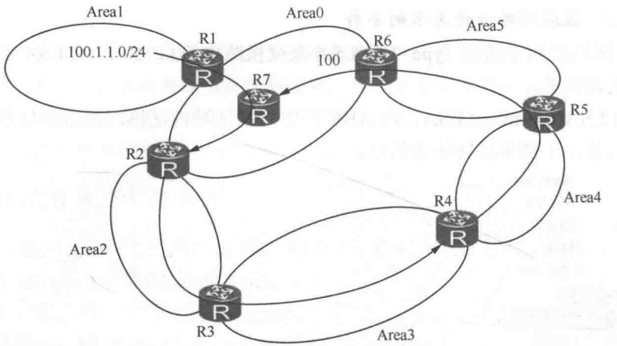

# OSPF 路由协议之区域结构设计

OSPF 把整个路由域划分为多个区域以减少区域泛洪的影响，继而减少 LSDB 的大小及计算开销。每个区域包含多台 OSPF 路由器，不同区域使用不同区域 ID 来标识。任何区域都使用区域 ID 标识，区域 ID 是 32 位数，例如：区域 0.0.0.0、区域 0.0.1.2、区域 3 等。区域 0 是骨干区域。

**OSPF 划分区域是以路由器为边界的，每条链路（网段）只能属于一个区域**。所以边界路由器上可能有多条链路分属于不同区域，运行 OSPF 的接口必须指明属于哪一个区域。

## 1.OSPF 区域结构设计

OSPF 定义区域类型为四种：骨干区域（Area0）、普通区域（Normal Area）、Stub 区域（包括 Totally Stub 区域）及 NSSA 区域（包括 Totally NSSA 区域）。

**骨干区域有且只有一个，所有其他区域必须同骨干区域相连，如果没有连接到骨干区域，将不会学到其他区域路由，OSPF 中所有区域间路由必须经骨干区域传递**。其他区域若没有连接到骨干区域，要使用 Vlink 连接到骨干区域。

骨干区域不能被分割，一旦分割，必须使用 Vlink 连接分割的骨干区域使之连续。也可以使用 GRE 隧道连接被分割的区域， OSPF 这种特殊的分层的设计结构用来避免区域间的路由所致的环路。

## 2.LSA3 及区域间路由通告

### 2.1 LSA3 的特性

<div align="center">
    
</div>

上图为区域间路由示意图，在 Area3 中，区域内的网络通过 LSA1 (StubNet 类型 Link) 和 LSA2 在区域内泛洪。ABR R1 产生 LSA3 向 Area0 通告 Area3 的路由，R2 和 R3 产生 LSA3，把各自学到的 Area0 里的区域间路由继续向区域 Area1 和 Area2 通告。

LSA3 的特性如下所示：

- 边界路由器 ABR 为区域内的每条 OSPF 路由各产生一份 LSA3 并向其他区域通告。
- 边界若有多个 ABR，则每个 ABR 都产生 LSA3 来通告区域间路由。R2 和 R3 是 Area0 和 Area2 的 ABR，两个 ABR 都产生 LSA3 通告路由进入 Area2，**所以在 Area2 中每条区域间路由在 LSDB 中都有两份 LSA3，分别由两个 ABR 产生。_这两份 LSA3 通过 `Adveritsing Router` 字域来区分_**。
- 区域间传递的是**路由**，LSA3 是由每个区域的 ABR 产生的，并仅在该区域内泛洪的一类 LSA。路由进入其他区域后，再由该区域的 ABR 产生 LSA3 继续泛洪。
- **OSPF 在区域边界上具备矢量特性，只有出现在 ABR 路由表里的路由才会被通告给邻居区域**。
- 计算路由时，路由器计算自己区域内到 ABR 的成本加上 LSA3 传递的区域间成本，得到的是当前路由器到目标网络端到端的成本。
- 如果 ABR 路由器上路由表中的某条 OSPF 路由不再可达，则 ABR 会立即产生一份 Age 为 3600s 的 LSA3 向区域内泛洪，用于在区域内撤销该网络。

### 2.2 区域间路由计算

OSPF 区域之间是通过 Type3 的 LSA 来交换路由信息的，这类 LSA 不携带拓扑信息，结构比较简单。Type3 LSA: Sum-net LSA，由 ABR 产生，在区域内泛洪，携带的信息是到其他区域的网络信息，不携带任何拓扑信息。

<div align="center">
    
</div>

其中，Ls id（Link State ID）为网络号，而 Adv rtr 表示产生 LSA3 的路由器，而 Net Mask 为子网掩码，Metric 为开销值（为 ABR 到 LSA3 中指示的目标网段的最小开销值）。下面我们以下图为例来对区域间路由进行分析。

<div align="center">
    
</div>

在上图中，R2 和 R3 在这个网络中属于 ABR，R1 会收到 R2 和 R3 产生的 LSA3，R2 上产生的 LSA3 开销值为 11，R3 上产生的 LSA3 开销值为 21。R1 做路由计算时，**把 ABR 产生的 LSA3 的路由当作节点 R2 和 R3 上的"叶子"路由**，所以 Area0 中 R1 计算去往 100.1.1.0/24 这个网段的路径是两条路径进行负载分担，下一跳分别是 R2 和 R3，路径开销是 31。

R1 计算其他区域的 LSA3 路由，是把 LSA3 路由直接挂在通告路由器 ABR 上，当成 ABR 节点上的叶子节点，所以区域间路由的任何变化，如成本变化或路由出现、消失都是 ABR 节点上所挂的叶子节点的变化，并没有影响到 Area0 内 SPF 树形拓扑的变化。仅叶子节点的变化所引起的计算称为 PRC（Partial Route Calculate），这种变化对网络的影响比较小。

## 3.OSPF 防环

### 3.1 Type1 LSA 和 Type2 LSA 防环

我们都知道，每台运行 OSPF 的路由器都会产生 Type-1 LSA，Type-1 LSA 用于描述路由器的直连接口状态（接口 IP 信息或所连接的邻居，另外还有接口的 Cost 值），而且只在接口所属的区域内泛洪。

Type-1 LSA 使用各种类型的 Link 来描述路由器直连接口。Type-2 LSA 则只出现在 MA 网络，由DR 产生，用于描述接入该 MA 网络的所有路由器的 Router-ID，以及该 MA 网络的掩码信息。

**得益于区域内泛洪的 Type-1 LSA 及 Type-2 LSA，OSPF 路由器能够"在自己的脑海中"还原区域内的网络拓扑及网段信息**。路由器为每个区域维护一个独立的 LSDB，并且运行一套独立的 SPF 算法，**同一个区域内的路由器，拥有针对该区域的相同 LSDB**，大家都基于这个 LSDB 计算出一颗以自己为根的、无环的最短路径树。之所以能做到无环，是因为路由器能够通过 LSA 描绘出区域的完整拓扑（包括所有接口的 Cost）及网段信息。

### 3.2 区域间的路由防环

#### 3.2.1 规则 1

**_OSPF 要求所有的非 0 区域必须与骨干区域直接相连，区域间路由需经由骨干区域中转_**。

OSPF 这种特殊的分层设计结构是用来避免区域间的路由所导致的环路。我们以下面这个图来举例说明：

<div align="center">
    
</div>

如果没有其他区域围着 Area0 的这一设计要求，为使每个区域在上图的区域结构中可以互相学到路由，**必然要求 LSA3 路由可以在各个区域间流动，这样就会出现离开个区域的 LSA3 路由，_经过其他区域再流回来的可能性_**。Area1 中 100.1.1.0/24 的路由，进入 Area0，并由 R7 继续以 LSA3 通告到其他区域。

最终，R7 除收到经 Area1 方向学来的 100.1.1.0/24 路由，也可能收到经 Area2->Area3->Area4->Area5 方向学到的路由，如果 R7 选择 R6 通告的路由，则路由环路出现，即 R7 如果收到去往 100.1.1.0/24 的路由，那么就会有如下转发路径：**_`R7->R6->R5->R4->R3->R2->R7`_**。

为了避免上述环路，限定 LSA3 路由的流动规则:不允许非 ABR 产生 LSA3（这也就变相规定了所有的非 0 区域必须与骨干区域直接相连）。所以，Area3、Area4 无法学到其他区域 Area0、Area1 的路由，只能把 Area3 和 Area4 直接连接到 Area0 才可以。

基于这样的 LSA3 的设计，路由只能通过上图中的 R2 和 R6 在区域间传递。图中 R3、R4 和 R5 不是 ABR (同 Area0 无连接)，无法在区域间相互传递路由。OSPF 的这种区域结构设计用于避免区域间环路。

#### 3.2.2 规则 2

前面的规则 1 以 area0 为中心，采用星型结构已经在一定程度上避免了区域间环路，但是无法完全避免，**_还是可能会出现经一个 ABR 进入普通区域的路由再经其他 ABR 进入其他区域（骨干或者普通）的情况_**。因此还需要引入规则 2。

<div align="center">
    
</div>

在介绍规则 2 之前，先详细分析一下 ABR，以上面的 topo 图为例，区域间路由器可以分为以下 3 类：

- 区域间路由器——处在 Area1 和 Area2 间的路由器，如 R5
- 区域间路由器——在 Area0 中有接口，但没有邻居的路由器，如 R3
- 区域间路由器——在 Area0 中有邻居的路由器，如 R4，R4 可以称得上为 ABR

规则 2 有如下子规则：

- ABR 只能够将其所连接的区域的区域内部路由注入到 Area0，但是 ABR 可以将区域内部路由及区域间的路由注入到非 0 常规区域（规则 2.1）
- 通过 ABR1 进入非骨干区域的 LSA3 路由，若 ABR2 在骨干区域有 OSPF 邻居，则该 LSA3 路由不进 ABR2 的路由表。此处 ABR1 和 ABR2 是处在骨干区域 0 和非骨干区域 1 间的两台边界路由器（规则 2.2）
- 若 ABR2 在骨干区域没有邻居，仅有一个网络出现在骨干区域，则 ABR1 所通告的 LSA3 路由可以进入其路由表（规则 2.3）
- 没有出现在 ABR 路由表的路由是不会通告到其他区域的，这是边界上的矢量特性（规则 2.4）

OSPF 对 ABR 有着严苛的要求，区域间的路由传递的关键点在于 ABR 对 Summary LSA 的处理。我们以下图为例：

<div align="center">
    
</div>

在上图中，如果 R3 是一台普通的 OSPF 路由器（不是 ABR），例如当它与 R2 没有 OSPF 邻居关系时，它会根据 R4 在 Area2 中泛洪的 Type-3 LSA 计算出 1.1.1.0/24 路由并将路由加载进路由表中。但是当 R3 与 R2 建立起 OSPF 邻接关系后，R3 在 Area0 中就有了一个活跃的全毗邻连接，此时如果它把描述 1.1.1.0/24 路由的 Type-3 LSA 再注入回 Area0，那么就会带来潜在环路的风险。

因此就有了规则 2.1，如果不满足规则 2.1，那么就有可能 ABR 将其所连接的区域（假设为 Area2）的区域间路由注入到 Area0 内，由于 Area2 中的区域间路由一定是通过 Area0 转发的，因此相当于 ABR 将 Area0 转发的区域间路由倒灌回 Area0，有可能会引发环路。因此，规则 2.1 对应到上面的拓扑中，就是 R3 作为 ABR，只能将其所连接的 Area2 内的区域内部路由注入到 Area0（而不能将其在 Area2 内收到的 3 类 LSA，也就是区域间路由注入 Area0），但是可以将Area0 的区域内部路由，以及 R2 注入到 Area0 的、用于描述 Area1 的区域间路由注入到非 0 常规区域 Area2。

故当一台 ABR 在非 Area0 的区域中收到 Type-3 LSA 时，**虽然它会将其装载进 LSDB，但是该路由器不会使用这些 Type-3 LSA 进行路由计算（不会进 OSPF 路由表）**，当然它更不会将这些 Type-3 LSA 再注入回 Area0中。

这里有一个有意思的细节，就是如果 R3 连接 R2 的接口虽然激活了 OSPF（而且属于 Area0），但是不与 R2 形成邻接关系（例如 R2 连接 R3 的接口不激活 OSPF），那么此时 R3 其实并不算是严格意义上的 ABR（虽然它产生的 Type-1 LSA 中 B-bit 会被置位，但是它在 Area0 中并没有全毗邻的邻居），因此它会将 Area2 内收到的 Type-3 LSA 用于区域间路由的计算，所以在 R3 的路由表中能看到 1.1.1.0/24 的区域间路由。

但是一旦 R2-R3 之间的邻接关系建立起来，R3 便不能再使用 R4 下发的 Type-3 LSA 计算区域间的路由，而只能使用在 Area0 中收到的、R2 下发的 Type-3 LSA 进行路由计算，**所以 R3 的路由表中，1.1.1.0/24 的路由的下一跳将变为 R2，即使从 R2 到 1.1.1.0/24 网络的 Cost 大于从 R4走的路径，也不会切到 R4 上来**。

**_总结来说，规则 2.1 和 规则 2.2—2.4 描述的都是同一种事情，也就是通过 Area0 进入普通区域的 LSA3 路由不能再被倒灌回 Area0 内部_**。对于规则 2.1 来说，ABR 不能将其所连接的区域的区域间路由注入到 Area0 内，区域间路由根据规则 1 肯定是通过 Area0 传入普通区域的。对于规则 2.2—2.4 来说，如果通过 ABR1 进入非骨干区域的 LSA3 路由，若该 LSA3 路由进入了 ABR2 的路由表，根据矢量规则，ABR2 会把此 LSA3 路由再通告回 Area0。

#### 3.2.3 规则 3

**_ABR 不会将描述一个 Area 内部的路由信息的 Type-3 LSA 再注入回该区域中_**。

实际上，OSPF 区域间路由的传递行为，很有点距离矢量路由协议的味道。以下图为例，在 Area1 中，R1 及 R2 都会泛洪 Type-1 LSA、Type-2 LSA，两台路由器都能够根据这些 LSA 计算区域内路由，而 R2 作为 ABR 还担负着另一个责任，就是向 Area0 通告区域间的路由，实际上它是向Area0 中注入用于描述 Area1 内路由的 Type-3 LSA，而这些 Type-3 LSA 是不会发回 Area1 的——是的，类似水平分割行为对吧？接下来 R3 利用这些 Type-3 LSA 计算出了区域间的路由，并且为Area2 注入新的 Type-3 LSA 用于描述区域间的路由，而这些 Type-3 LSA 同样的不会被注入回Area0。

<div align="center">
    
</div>

R2 在向 Area0 通告 Type-3 LSA，为每条区域间路由携带上 Cost 值，这个值就是它自己到达各个目标网段的 Cost，而 R3 收到这些 Type-3 LSA 并计算路由时，路由的 Cost 就是在 R2 所通告的Cost 值的基础上，加上 R3 自己到 R2 的 Cost 值，然后，R3 向 R4 通告这些区域间的路由时也携带者自己到达目标网段的 Cost，而 R4 到达目标网段的 Cost 则是在 R3 的通告值基础上累加自己到 R3 的 Cost ——典型的距离矢量行为。

### 3.3 外部路由的防环

当一台 OSPF 路由器将外部路由引入 OSPF 域后，它就成为了一台 ASBR，被引入的外部路由以Type-5 LSA 在整个 OSPF 域内泛洪。一台路由器使用 Type-5 LSA 计算出路由的前提是两个，其一是要收到 Type-5 LSA，其二是要知道产生这个 Type-5 LSA 的 ASBR 在哪里。与 ASBR 接入同一个区域的路由器能够根据该区域内泛洪的 Type-1 LSA 及 Type-2 LSA 计算出到达该 ASBR 的最短路径，从而计算出外部路由。

而其他区域的路由器就没有这么幸运了，因为 ASBR 产生的 Type-1 LSA 只能在其所在的区域内泛洪，所以才需要 Type-4 LSA。因此其他区域的路由器在获取 Type-4 LSA 后便能计算出到达 ASBR 的最短路径，进而利用该 ASBR 产生的 Type-5 LSA 计算出外部路由。Type-5 LSA 将会被泛洪到整个 OSPF 域，**表面上看，它本身并不具有什么防环的能力，但是实际上，它并不需要，因为它可以依赖 Type-1 LSA 及 Type-4 LSA 来实现防环**。

Type-4 LSA 的防环机制和 Type-3 LSA 机制一样，因此路由器到 Type-4 LSA 指明的 ASBR 的路径不存在环路，故最后到外部路由的路径也就不会存在环路。

### 3.4 举例分析

#### 3.4.1 例 1

<div align="center">
    
</div>

1.在上图场景中，Area0 中 10.1.2.0/24 网络能否出现在 R3 的路由表中？为什么？

答：10.1.2.0/24 的路由可以进入 R3 的路由表，根据规则 2.3 得到。因为 R3 不算上 ABR（在 Area0 中没有全毗邻的邻居）。

2.上图场景中，R3 在 Area0 中 10.1.3.0/24 网络能否出现在 R2 及 R4 的路由表中？为什么？

答：R4 的路由表中没有该路由，根据规则 2.2。原因是 R3 通告 LSA3（10.1.3.0/24）到 R4，R4 是 ABR，且 R4 在骨干区域中有 OSPF 邻居，R4 只接收骨干区域的 LSA3 路由，所以不会计算出一条经过 Area1 访问骨干区域的路由。

R2 的路由表中，也不会有该路由，根据规则 2.4，由于矢量特性，R4 没有该路由，R2 也不会有该路由，骨干区域内没有对应的 LSA3 的泛洪。

3.图 3-36 场景中，R5 路由表中是否有 10.1.2.0/24 网络?

答：R5 路由表中有该路由，原因是 R5 不是真正意义上的 ABR。所以可以接收源自其他区域的路由。但 R5 不会继续向区域 2 通告该路由，原因是 R5 不是 ABR，不能在区域间传递路由。同理，图中 R6 上的 10.1.6.0/24 的路由虽能出现在 R5 的路由表里，但同样进不到区域 1 里。

#### 例 2

如下图所示为 R4 选路访问 100.1.1.0/24 网络的示意图：

<div align="center">
    
</div>

**1.问:在上图中，R4 访问 100.1.1.0/24 的访问路径是什么？**

答: R1 的 100.1.1.0/24 路由在 Area0 中以 LSA3 泛洪，R3/R4 收到后，在 R4 的 LSDB 中，**有从 Area2 收到的 R3 产生的 LSA3 路由，还有 Area0 中 R2 产生的 LSA3 路由**。R4 在计算路由时，仅考虑 Area0 中的 LSA3，所以，R4 访问 100.1.1.0/24 网络，路由下一跳是 R2。这根据规则 1 得到。原因是 R4 是 ABR，直接连着骨干区域，不会考虑经过 Area2 访问骨干区域的路由。

**2.问:上图中，R4 访问 100.1.1.0/24 网络是否有明显的次优路径问题？在不改动物理拓扑的情况下，如何解决次优路径问题？**

答：存在次优路径，为使 R4 访问 100.1.1.0/24 的流量经过 R3 进入骨干区域，在 R3 和 R4 间添加 Vlink，**Vlink 是处在两个 ABR R3 和 R4 间、经过 Area2 （Transit Area）的一条属于 Area0 的逻辑链路**。Vlink 建好后，数据报文将按 Area0 中 Vlink 链路学来的路由经 R3 进入骨干区域，这是 Area0 中成本最小的路径。

## 4.Area 类型及特殊区域

### 4.1 Area 分类

Area 类型分为四种，普通（Normal）区域、骨干区域、Stub 区域及 NSSA 区域。骨干区域就一个，Area0，其他区域连接该骨干区域，在其他区域间传递路由和数据。普通区域，Area 号不等于 0，承载 Vlink，是最通用的区域，它传输区域内路由（LSA1、LSA2）、区域间路由（LSA3）和外部路由（LSA4、LSA5）。

Stub 是一类特殊的区域，这个区域 LSA 4/5 不能接收，访问 OSPF 外部网络仅能通过 ABR，所有的流量及路由通过 ABR 进入 Stub 区域。Stub 区域有一个变体，Totally Stub 区域，比 Stub 区域添加了对区域间 LSA3 的过滤，Stub 区域仅可通过 ABR 访问区域外任何目的地，不支持 Vlink。

NSSA 区域可以有 LSA7，可以有 ASBR，访问任何外部 OSPF 区域可以通过本区域 ASBR，也可通过 ABR 访问。Totally NSSA 在上述机制的基础之上，在 ABR 上过滤区域间 LSA3。下图列出了各种特殊类型区域内产生的 LSA 以及区域的配置命令。

<div align="center">
    
</div>

### 4.2 Stub 区域

Stub 区域是一些特定的区域，Stub 区域的 ABR 不传播它们接收到的自治系统外部路由，在这些区域中路由器的路由表规模以及路由信息传递的数量都会大大减少。Stub 区域是一种可选的配置属性，但并不是每个区域都符合配置的条件（比如骨干区域不能被配置成 Stub 区域）。

**通常来说，Stub 区域位于自治系统的边界，是那些只有一个 ABR 的非骨干区域**。为保证到自治系统外的路由依旧可达，该区域的 ABR 将生成一条默认路由，并发布给 Stub 区域中的其他非 ABR 路由器。配置 Stub 区域时需要注意下列几点：

- 骨干区域不能配置成 Stub 区域。
- 如果要将一个区域配置成 Stub 区域，则该区域中的所有路由器都要配置 Stub 区域属性。
- Stub 区域内不能存在 ASBR，即自治系统外部的路由不能在本区域内传播。
- 虚连接不能穿过 Stub 区域。

我们可以使用如下命令来进行配置：

```java
#配置 Stub 区域
[R3] OSPF 1
[R3-OSPF-1] Area 25
[R3-OSPF-1-Area-0.0.0.25] Stub ?
no-summary  Do not send summary LSA into Stub Area 
<cr>        Please press ENTER to execute command [R 3-OSPF-1-Area-0.0.0.25] Stub
#边界路由器 ABR 配置 Stub no-summary 会将区域类型改为 totally Stub
```

### 4.3 NSSA 区域

NSSA (Not-So-Stubby Area) 区域是 OSPF 特殊的区域类型。NSSA 区域与 Stub 区域有许多相似的地方，两者都不传播来自 OSPF 网络其他区域的外部路由。差别在于 Stub 区域不能引入外部路由，NSSA 区域能够将 OSPF 外部路由引入并传播到整个 OSPF 中。

当区域配置为 NSSA 区域后，为保证到自治系统外的路由可达，NSSA 区域的 ABR 将自动生成一条默认路由 (LSA7 的默认路由)，并发布给 NSSA 区域中的其他路由器。配置 NSSA 区域时需要注意下列几点：

- 骨干区域不能配置成 NSSA 区域
- 如果要将一个区域配置成 NSSA 区域，则该区域中的所有路由器都要配置 NSSA
- 虚连接不能穿过 NSSA 区域

NSSA 区域的配置如下所示：

```java
＃配置 NSSA 区域
[R3]OSPF 1
[R3-OSPF-1]Area 25
[R3-OSPF-1-Area-0.0.0.25]nssa
＃同理，NSSA 区域边界路由器如果配置 nssa no-summary，则区域类型为 Totally NSSA
```

