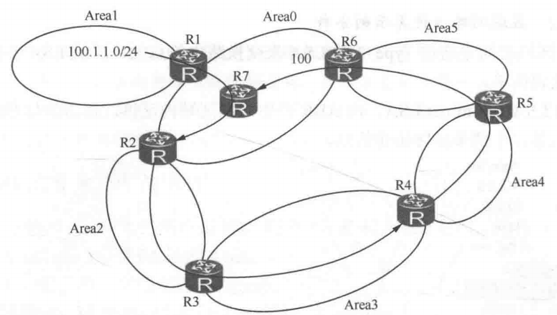
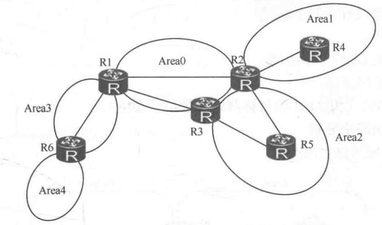
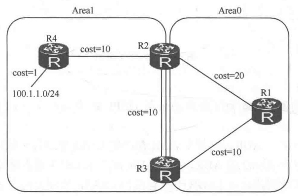
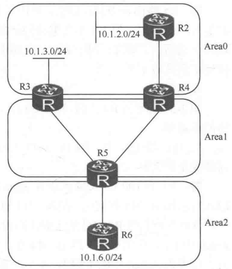
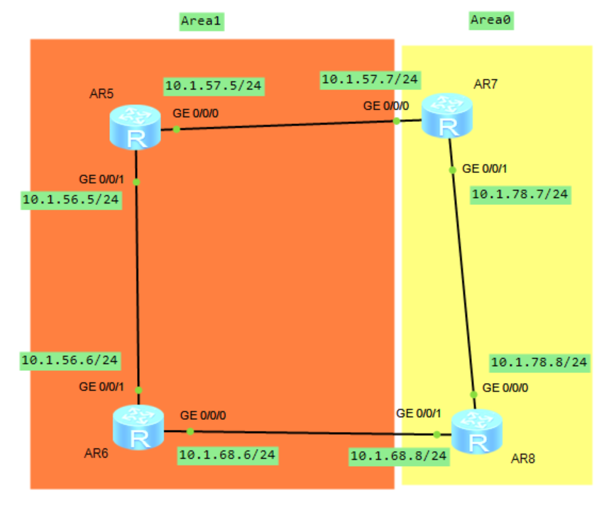
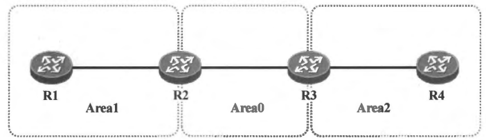
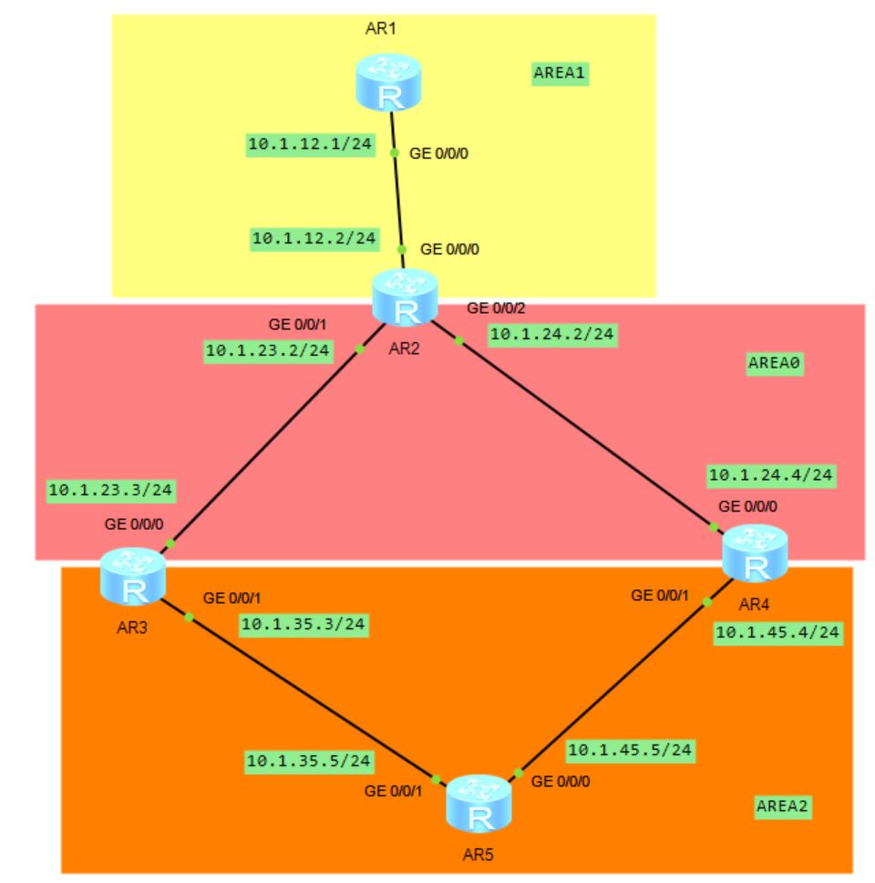
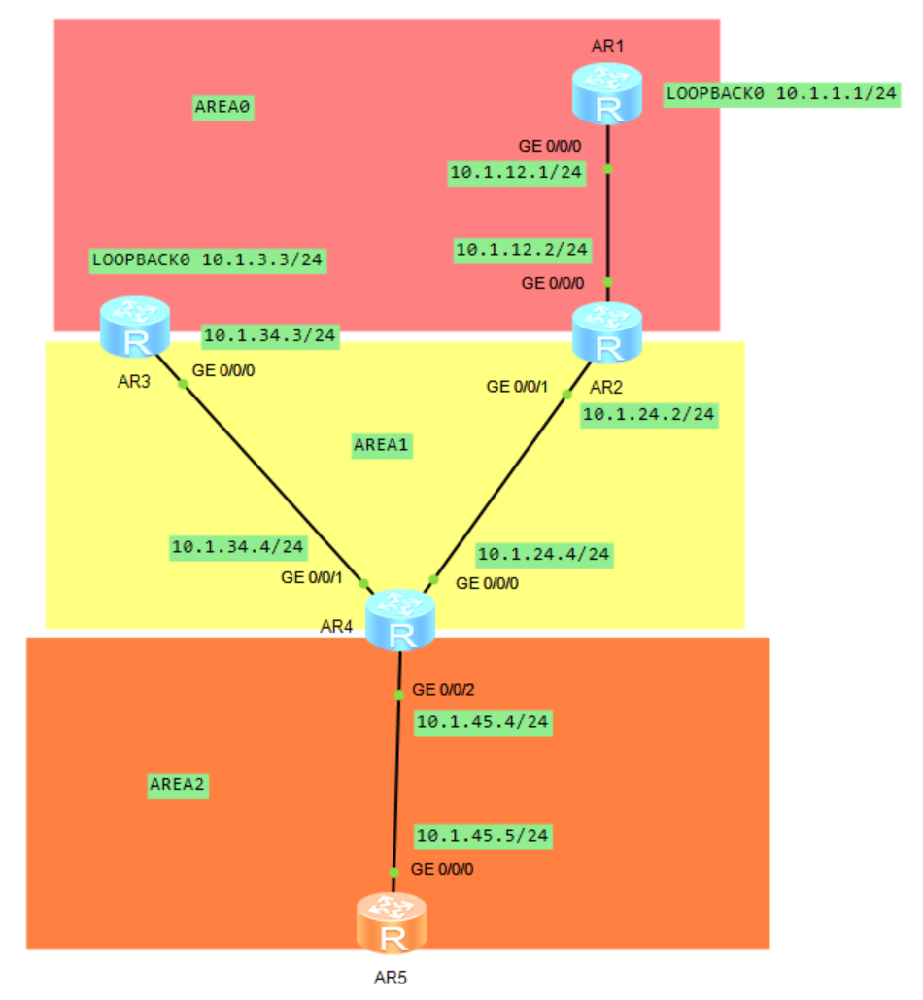
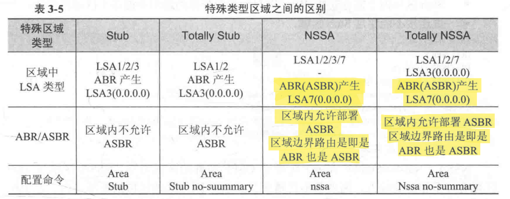

# OSPF 路由协议之区域结构设计

OSPF 把整个路由域划分为多个区域以减少区域泛洪的影响，继而减少 LSDB 的大小及计算开销。每个区域包含多台 OSPF 路由器，不同区域使用不同区域 ID 来标识。任何区域都使用区域 ID 标识，区域 ID 是 32 位数，例如：区域 **`0.0.0.0`**、区域 **`0.0.1.2`**、区域 3 等。区域 0 是骨干区域。

**OSPF 划分区域是以路由器为边界的，每条链路（网段）只能属于一个区域**。所以边界路由器上可能有多条链路分属于不同区域，运行 OSPF 的接口必须指明属于哪一个区域。

## 1.OSPF 区域结构设计

OSPF 定义区域类型为四种：骨干区域（Area0）、普通区域（Normal Area）、Stub 区域（包括 Totally Stub 区域）及 NSSA 区域（包括 Totally NSSA 区域）。

**骨干区域有且只有一个，所有其他区域必须同骨干区域相连，如果没有连接到骨干区域，将不会学到其他区域路由，OSPF 中所有区域间路由必须经骨干区域传递**。其他区域若没有连接到骨干区域，要使用 Vlink 连接到骨干区域。

骨干区域不能被分割，一旦分割，必须使用 Vlink 连接分割的骨干区域使之连续。也可以使用 GRE 隧道连接被分割的区域， OSPF 这种特殊的分层的设计结构用来避免区域间的路由所致的环路。

如果没有其他区域围着 Area0 的这一设计要求，为使每个区域在下图的区域结构中可以互相学到路由，必然要求 LSA3 路由可以在各个区域间流动，这样就会出现离开一个区域的 LSA3 路由，经过其他区域再流回来的可能性。如下图所示，Area1 中 **`100.1.1.0/24`** 的路由，进入 Area0，并由 R7 继续以 LSA3 通告到其他区域。最终，R7 除收到经 Area1 方向学来的 **`100.1.1.0/24`** 路由，也可能收到经 **`Area2-Area3-Area4-Area5`** 方向学到的路由，如果 R7 选择 R6 通告的路由，则路由环路出现。

<div align="center">
    
</div>

为了避免上述环路，**<font color="red">限定 LSA3 路由的流动规则：不允许非 ABR 产生 LSA3（规则 1）</font>**。所以，Area3、Area4 无法学到其他区域 Area0、Area1 的路由，只能把 Area3 和 Area4 直接连接到 Area0 才可以。基于这样的 LSA3 的设计，路由只能通过上图中的 R2 和 R6 在区域间传递。图中 R3、R4 和 R5 不是 ABR（同 Area0 无连接），无法在区域间相互传递路由。

## 2.LSA3 及区域间路由通告

### 2.1 LSA3 的特性

<div align="center">
    
</div>

上图为区域间路由示意图，在 Area3 中，区域内的网络通过 LSA1 (StubNet 类型 Link) 和 LSA2 在区域内泛洪。ABR R1 产生 LSA3 向 Area0 通告 Area3 的路由，R2 和 R3 产生 LSA3，把各自学到的 Area0 里的区域间路由继续向区域 Area1 和 Area2 通告。

LSA3 的特性如下所示：

- 边界路由器 ABR 为区域内的每条 OSPF 路由各产生一份 LSA3 并向其他区域通告。
- 边界若有多个 ABR，则每个 ABR 都产生 LSA3 来通告区域间路由。R2 和 R3 是 Area0 和 Area2 的 ABR，两个 ABR 都产生 LSA3 通告路由进入 Area2，**<font color="red">所以在 Area2 中每条区域间路由在 LSDB 中都有两份 LSA3，分别由两个 ABR 产生。_这两份 LSA3 通过 `Adveritsing Router` 字域来区分_</font>**。
- 区域间传递的是**路由**，**<font color="blue">LSA3 是由每个区域的 ABR 产生的，并仅在该区域内泛洪的一类 LSA</font>**。路由进入其他区域后，再由该区域的 ABR 产生 LSA3 继续泛洪。
- **OSPF 在区域边界上具备矢量特性，只有出现在 ABR 路由表里的路由才会被通告给邻居区域**。
- 计算路由时，路由器计算自己区域内到 ABR 的成本加上 LSA3 传递的区域间成本，得到的是当前路由器到目标网络端到端的成本。
- 如果 ABR 路由器上路由表中的某条 OSPF 路由不再可达，则 ABR 会立即产生一份 Age 为 3600s 的 LSA3 向区域内泛洪，用于在区域内撤销该网络。

在单一区域内部，OSPF 严格遵循链路状态机制，通过泛洪的拓扑信息 LSA1/LSA2 交由各节点独立进行 SPF 树构建；但在跨区域路由交互时，OSPF 为典型的距离矢量模式。ABR 负责屏蔽区域内的拓扑细节，仅将自身通过 SPF 算法计算得出的路由条目以 LSA3 的形式向邻居区域进行通告。为了避免距离矢量模式可能引发的黑洞或环路风险，ABR 在收集区域内 LSA1/LSA2 并完成本地 SPF 计算后，**<font color="red">只有当某条路由被安装进全局路由表后，它才能以 LSA3 的形式被通告给其他区域</font>**。

在此架构下，Area 0 内的路由器无需也无法感知其他区域的真实物理拓扑，只能无条件信任 ABR 传递过来的路由信息。

### 2.2 区域间路由计算

OSPF 区域之间是通过 Type3 的 LSA 来交换路由信息的，这类 LSA 不携带拓扑信息。**`Type3 LSA: Sum-net LSA`**，由 ABR 产生，在区域内泛洪，携带的信息是到其他区域的网络信息，不携带任何拓扑信息。

```java{.line-numbers}
Type      : Sum-Net
Ls id     : 192.168.23.0
Adv rtr   : 3.3.3.3
Ls age    : 69
Len       : 28
Options   : E
seq#      : 80000001
chksum    : 0x6b64
Net mask  : 255.255.255.0
Tos 0  metric: 1
Priority  : Low
```

其中，**`Ls id (Link State ID)`** 为网络号，而 **`Adv rtr`** 表示产生 LSA3 的路由器，而 **`Net Mask`** 为子网掩码，**`Metric`** 为开销值（为 ABR 到 LSA3 中指示的目标网段的最小开销值）。下面我们以下图为例来对区域间路由进行分析。

<div align="center">
    
</div>

在上图中，R2 和 R3 在这个网络中属于 ABR，R1 会收到 R2 和 R3 产生的 LSA3，R2 上产生的 LSA3 开销值为 11，R3 上产生的 LSA3 开销值为 21。R1 做路由计算时，**<font color="red">把 ABR 产生的 LSA3 的路由当作节点 R2 和 R3 上的叶子路由</font>**，所以 Area0 中 R1 计算去往 **`100.1.1.0/24`** 这个网段的路径是两条路径进行负载分担，下一跳分别是 R2 和 R3，路径开销是 31。

## 3.OSPF Type1 LSA 和 Type2 LSA 防环

我们都知道，每台运行 OSPF 的路由器都会产生 Type-1 LSA，Type-1 LSA 用于描述路由器的直连接口状态（接口 IP 信息或所连接的邻居，另外还有接口的 Cost 值），而且只在接口所属的区域内泛洪。

Type-1 LSA 使用各种类型的 Link 来描述路由器直连接口。Type-2 LSA 则只出现在 MA 网络，由DR 产生，用于描述接入该 MA 网络的所有路由器的 Router-ID，以及该 MA 网络的掩码信息。

**得益于区域内泛洪的 Type-1 LSA 及 Type-2 LSA，OSPF 路由器能够"在自己的脑海中"还原区域内的网络拓扑及网段信息**。路由器为每个区域维护一个独立的 LSDB，并且运行一套独立的 SPF 算法，**同一个区域内的路由器，拥有针对该区域的相同 LSDB**，大家都基于这个 LSDB 计算出一颗以自己为根的、无环的最短路径树。之所以能做到无环，是因为路由器能够通过 LSA 描绘出区域的完整拓扑（包括所有接口的 Cost）及网段信息。

## 4.OSPF Type3 LSA 防环

### 4.1 ABR 定义及路由通告

如下图所示，区域间的路由器 R4，处于 Area1 和 Area0 之间，是 ABR，R5 虽处于 Area1 和 Area2 之间，但 R5 不是 ABR。

从定义上，**<font color="red">至少有一个接口连接 Area0，这样的区域间路由器称为 ABR</font>**。其他位置的路由器，如下图中的 R5 虽在其 Router LSA 中置 ABR 位，但 R5 并未在区域间转发路由，所以它不是一台真正意义上的 ABR。按上面的定义，区域间路由器可分为三类。

- 区域间路由器——处在 Area1 和 Area2 间的路由器，如 R5。
- 区域间路由器——在 Area0 中有接口，但没有邻居的路由器，如 R3。
- 区域间路由器——在 Area0 中有邻居的路由器，如 R4，R4 可以称得上为 ABR。

<div align="center">
    
</div>

根据 RFC 2328 的定义，Area border routers: A router that attaches to multiple areas. 也就是连接到多个区域的路由器，就是 ABR。不过 RFC 3509 专门对 ABR 这个问题做了澄清，Though the definition of the Area Border Router (ABR) in the OSPF specification does not require a router with multiple attached areas to have a backbone connection, it is actually necessary to provide successful routing to the inter-area and external destinations. 虽然 OSPF 规范里对 ABR 的定义，本身没有强制多区域路由器必须真的连到骨干区上的别的 OSPF 路由器，但如果没有这种骨干连接，它就无法正确提供区域间和外部路由，**<font color="red" 也就是只有连接到骨干区域的 ABR 才能真正产生并泛洪 LSA3 到其他区域中（也就是前面的规则 1）</font>**。

### 4.2 Type3 LSA 防环规则

总结 Type3 LSA 的特性，我们可以得出以下 6 条规则：

1. 如果全局路由表中该路由条目的关联区域就是 Area A 本身，ABR 不往 Area A 里生成并泛洪 LSA3；
2. 如果全局路由表中该路由条目的下一跳就属于 Area A，ABR 也不往 Area A 里生成并泛洪 LSA3；
3. 如果 ABR 在非骨干区域收到 Type-3 LSA，虽然它会将其装载进 LSDB，但是该路由器不会使用这些 Type-3 LSA 进行路由计算（不会进全局路由表），当然它更不会将这些 Type-3 LSA 再注入回 Area0中；
4. 只有连接到骨干区域的 ABR 才能真正产生并泛洪 LSA3 到其他区域中；
5. ABR 从非骨干区域发往骨干区时，只能通告 **`intra-area routes`**；从骨干区域发往其他非骨干区时，可以通告 **`intra-area`** 和 **`inter-area routes`**；
6. 没有出现在 ABR 全局路由表的路由是不会通告到其他区域的，这是边界上的矢量特性；

#### 4.2.1 规则 1 和规则 2

规则 1 和规则 2 在 RFC 2328 中是分开描述的，规则 1 对应的原文是：Else, if the area associated with this set of paths is the Area A itself, do not generate a summary-LSA for the route. 规则 2 对应的原文是：Else, if the next hops associated with this set of paths belong to Area A itself, do not generate a summary-LSA for the route. **<font color="red">规则 1 和规则 2 本质上是同一件事，都是为了避免 ABR 把某条路由从一个区域宣告到另一个区域后，又把它反过来带回原区域，从而引发环路（类似于 RIP 的水平分割）</font>**。以下面的拓扑为例，在 AR5 上配置了一个 LoopBack0 接口，IP 地址为 **`10.1.5.5/24`**，并且把该接口加入到 OSPF 中。

下面测试当 AR5-AR6 之间的链路正常时，AR8 是否会把 **`10.1.5.5/24`** 网络宣告到 Area 1 中去；当 AR5-AR6 之间的链路断开时，AR8 是否会把相同网段的路由再宣告到 Area 1 中去。

<div align="center">
    
</div>

R5 的配置如下所示：

```java{.line-numbers}
 sysname AR5
#
interface GigabitEthernet0/0/0
 ip address 10.1.57.5 255.255.255.0 
 ospf network-type p2p
#
interface GigabitEthernet0/0/1
 ip address 10.1.56.5 255.255.255.0 
 ospf network-type p2p
#
interface LoopBack0
 ip address 10.1.5.5 255.255.255.0 
#
ospf 1 router-id 5.5.5.5 
 area 0.0.0.1 
  network 10.1.5.5 0.0.0.0 
  network 10.1.56.5 0.0.0.0 
  network 10.1.57.5 0.0.0.0 
 area 0.0.0.2 
```

R6 的配置如下所示：

```java{.line-numbers}
 sysname AR6
#
interface GigabitEthernet0/0/0
 ip address 10.1.68.6 255.255.255.0 
 ospf network-type p2p
#
interface GigabitEthernet0/0/1
 shutdown
 ip address 10.1.56.6 255.255.255.0 
 ospf network-type p2p
#
ospf 1 router-id 6.6.6.6 
 area 0.0.0.1 
  network 10.1.56.6 0.0.0.0 
  network 10.1.68.6 0.0.0.0 
```

R7 的配置如下所示：

```java{.line-numbers}
 sysname AR7
#
interface GigabitEthernet0/0/0
 ip address 10.1.57.7 255.255.255.0 
 ospf network-type p2p
#
interface GigabitEthernet0/0/1
 ip address 10.1.78.7 255.255.255.0 
 ospf network-type p2p
#
ospf 1 router-id 7.7.7.7 
 area 0.0.0.0 
  network 10.1.78.7 0.0.0.0 
 area 0.0.0.1 
  network 10.1.57.7 0.0.0.0 
```

R8 的配置如下所示：

```java{.line-numbers}
#
 sysname AR8
#
interface GigabitEthernet0/0/0
 ip address 10.1.78.8 255.255.255.0 
 ospf network-type p2p
#
interface GigabitEthernet0/0/1
 ip address 10.1.68.8 255.255.255.0 
 ospf network-type p2p
#
ospf 1 router-id 8.8.8.8 
 area 0.0.0.0 
  network 10.1.78.8 0.0.0.0 
 area 0.0.0.1 
  network 10.1.68.8 0.0.0.0 
```

在做实验前，对规则 1 和规则 2 进行扩展，规则 1 中的 associated area 也就是 RFC 2328 对 Area 字段定义，This field indicates the area whose link state information has led to the routing table entry's collection of paths. This is called the entry's associated area. 即 OSPF 内部路由表中的 Area 字段，精确标识了该路由条目是基于哪个特定区域内的链路状态信息使用 SPF 计算得出，该源区域便被定义为该路由项的 associated area。

因此 AR8 是否会把 **`10.1.5.5/32`** 再作为 LSA3 发布回 Area 1，**<font color="red">判断依据是 AR8 当前路由表中这条路由条目归属于哪个区域或者下一跳属于哪个区域</font>**。

当 AR5-AR6 之间的链路正常时，根据 AR8 上的 OSPF 路由表可以看出，AR8 上的 **`10.1.5.5/32`**、**`10.1.56.0/24`**、**`10.1.57.0/24`**、**`10.1.68.0/24`** 路由条目归属于 Area 1，而 **`10.1.78.0/24`** 路由条目归属于 Area 0。**`10.1.5.5/32`**、**`10.1.56.0/24`**、**`10.1.57.0/24`**、**`10.1.68.0/24`** 路由条目归属于 Area 1 也是因为 AR8 的 **`G0/0/1`** 口属于 Area1，通过接收并且学习 Area1 中的 LSA1/LSA2 这些 intra-area 路由并执行了SPF 树解析。基于 OSPF 选路法则，区域内路由（Intra-area Route，即 O 路由）优先级高于 Type-3 LSA 的区域间路由（Inter-area Route，即 OIA 路由）。因此，AR8 最终优选了 Area 1 的区域内路径。

因此，ABR8 不会把 **`10.1.5.5/32`**、**`10.1.56.0/24`**、**`10.1.57.0/24`**、**`10.1.68.0/24`** 路由再通过 LSA3 宣告泛洪到 Area 1 中去。而是会把属于 Area 0 的 **`10.1.78.0/24`** 路由条目宣告泛洪到 Area 1 中去。

```java{.line-numbers}
<AR8>display ip routing-table 
Route Flags: R - relay, D - download to fib
------------------------------------------------------------------------------
Routing Tables: Public
         Destinations : 13       Routes : 13       

Destination/Mask    Proto   Pre  Cost      Flags NextHop         Interface

       10.1.5.5/32  OSPF    10   2           D   10.1.68.6       GigabitEthernet0/0/1
      10.1.56.0/24  OSPF    10   2           D   10.1.68.6       GigabitEthernet0/0/1
      10.1.57.0/24  OSPF    10   3           D   10.1.68.6       GigabitEthernet0/0/1
      10.1.68.0/24  Direct  0    0           D   10.1.68.8       GigabitEthernet0/0/1
      10.1.68.8/32  Direct  0    0           D   127.0.0.1       GigabitEthernet0/0/1
    10.1.68.255/32  Direct  0    0           D   127.0.0.1       GigabitEthernet0/0/1
      10.1.78.0/24  Direct  0    0           D   10.1.78.8       GigabitEthernet0/0/0
      10.1.78.8/32  Direct  0    0           D   127.0.0.1       GigabitEthernet0/0/0
    10.1.78.255/32  Direct  0    0           D   127.0.0.1       GigabitEthernet0/0/0

<AR8>display ospf routing 

	 OSPF Process 1 with Router ID 8.8.8.8
		  Routing Tables 

 Routing for Network 
 Destination        Cost  Type       NextHop         AdvRouter       Area
 10.1.68.0/24       1     Stub       10.1.68.8       8.8.8.8         0.0.0.1
 10.1.78.0/24       1     Stub       10.1.78.8       8.8.8.8         0.0.0.0
 10.1.5.5/32        2     Stub       10.1.68.6       5.5.5.5         0.0.0.1
 10.1.56.0/24       2     Stub       10.1.68.6       6.6.6.6         0.0.0.1
 10.1.57.0/24       3     Stub       10.1.68.6       5.5.5.5         0.0.0.1

 Total Nets: 5  
 Intra Area: 5  Inter Area: 0  ASE: 0  NSSA: 0 

<AR8>display ospf lsdb summary self-originate 

	 OSPF Process 1 with Router ID 8.8.8.8
		         Area: 0.0.0.0
		 Link State Database 

  Type      : Sum-Net
  Ls id     : 10.1.56.0
  Adv rtr   : 8.8.8.8  
  Ls age    : 346 
  Len       : 28 
  Options   :  E  
  seq#      : 80000003 
  chksum    : 0x9164
  Net mask  : 255.255.255.0
  Tos 0  metric: 2
  Priority  : Low

  Type      : Sum-Net
  Ls id     : 10.1.68.0
  Adv rtr   : 8.8.8.8  
  Ls age    : 776 
  Len       : 28 
  Options   :  E  
  seq#      : 80000003 
  chksum    : 0x3e7
  Net mask  : 255.255.255.0
  Tos 0  metric: 1
  Priority  : Low

  Type      : Sum-Net
  Ls id     : 10.1.5.5
  Adv rtr   : 8.8.8.8  
  Ls age    : 336 
  Len       : 28 
  Options   :  E  
  seq#      : 80000003 
  chksum    : 0x9291
  Net mask  : 255.255.255.255
  Tos 0  metric: 2
  Priority  : Low

  Type      : Sum-Net
  Ls id     : 10.1.57.0
  Adv rtr   : 8.8.8.8  
  Ls age    : 337 
  Len       : 28 
  Options   :  E  
  seq#      : 80000003 
  chksum    : 0x9063
  Net mask  : 255.255.255.0
  Tos 0  metric: 3
  Priority  : Low
		         Area: 0.0.0.1
		 Link State Database 
  Type      : Sum-Net
  Ls id     : 10.1.78.0
  Adv rtr   : 8.8.8.8  
  Ls age    : 778 
  Len       : 28 
  Options   :  E  
  seq#      : 80000003 
  chksum    : 0x944c
  Net mask  : 255.255.255.0
  Tos 0  metric: 1
  Priority  : Low
```

当 AR5-AR6 之间的链路断开时，AR8 上的 G0/0/1 接口无法通过学习 Area1 中的 LSA1/LSA2 来计算出 **`10.1.57.0`**、**`10.1.5.5`** 等路由条目，所以 AR8 上的 **`10.1.57.0/24`**、**`10.1.5.5/32`**、**`10.1.78.0/24`** 路由条目归属于 Area0，而 **`10.1.68.0/24`** 路由条目归属于 Area 1。而且还有一个原因就是 AR6 无法再产生一个区域内的 **`10.1.5.5/32`** 路由，因此 AR8 只得选择优先级相对较低的区域间 **`10.1.5.5/32`** 路由（OIA 路由），这条路由由 AR7 在 Area0 中泛洪产生，因此最终 **`10.1.5.5/32`** 归属于 Area0。

因此 ABR8 会把 **`10.1.57.0/24`**、**`10.1.5.5/32`**、**`10.1.78.0/24`** 路由条目通过 LSA3 宣告泛洪到 Area 1 中去。
 
```java{.line-numbers}
<AR8>display ip routing-table 
Route Flags: R - relay, D - download to fib
------------------------------------------------------------------------------
Routing Tables: Public
         Destinations : 12       Routes : 12       

Destination/Mask    Proto   Pre  Cost      Flags NextHop         Interface

       10.1.5.5/32  OSPF    10   2           D   10.1.78.7       GigabitEthernet0/0/0
      10.1.57.0/24  OSPF    10   2           D   10.1.78.7       GigabitEthernet0/0/0
      10.1.68.0/24  Direct  0    0           D   10.1.68.8       GigabitEthernet0/0/1
      10.1.68.8/32  Direct  0    0           D   127.0.0.1       GigabitEthernet0/0/1
    10.1.68.255/32  Direct  0    0           D   127.0.0.1       GigabitEthernet0/0/1
      10.1.78.0/24  Direct  0    0           D   10.1.78.8       GigabitEthernet0/0/0
      10.1.78.8/32  Direct  0    0           D   127.0.0.1       GigabitEthernet0/0/0
    10.1.78.255/32  Direct  0    0           D   127.0.0.1       GigabitEthernet0/0/0

<AR8>display ospf routing 

	 OSPF Process 1 with Router ID 8.8.8.8
		  Routing Tables 

 Routing for Network 
 Destination        Cost  Type       NextHop         AdvRouter       Area
 10.1.68.0/24       1     Stub       10.1.68.8       8.8.8.8         0.0.0.1
 10.1.78.0/24       1     Stub       10.1.78.8       8.8.8.8         0.0.0.0
 10.1.5.5/32        2     Inter-area 10.1.78.7       7.7.7.7         0.0.0.0
 10.1.57.0/24       2     Inter-area 10.1.78.7       7.7.7.7         0.0.0.0

 Total Nets: 4  
 Intra Area: 2  Inter Area: 2  ASE: 0  NSSA: 0 

<AR8>display ospf lsdb summary self-originate 

	 OSPF Process 1 with Router ID 8.8.8.8
		         Area: 0.0.0.0
		 Link State Database 

  Type      : Sum-Net
  Ls id     : 10.1.68.0
  Adv rtr   : 8.8.8.8  
  Ls age    : 1525 
  Len       : 28 
  Options   :  E  
  seq#      : 80000003 
  chksum    : 0x3e7
  Net mask  : 255.255.255.0
  Tos 0  metric: 1
  Priority  : Low
		         Area: 0.0.0.1
		 Link State Database 

  Type      : Sum-Net
  Ls id     : 10.1.78.0
  Adv rtr   : 8.8.8.8  
  Ls age    : 1525 
  Len       : 28 
  Options   :  E  
  seq#      : 80000003 
  chksum    : 0x944c
  Net mask  : 255.255.255.0
  Tos 0  metric: 1
  Priority  : Low

  Type      : Sum-Net
  Ls id     : 10.1.5.5
  Adv rtr   : 8.8.8.8  
  Ls age    : 75 
  Len       : 28 
  Options   :  E  
  seq#      : 80000001 
  chksum    : 0x968f
  Net mask  : 255.255.255.255
  Tos 0  metric: 2
  Priority  : Low

  Type      : Sum-Net
  Ls id     : 10.1.57.0
  Adv rtr   : 8.8.8.8  
  Ls age    : 77 
  Len       : 28 
  Options   :  E  
  seq#      : 80000001 
  chksum    : 0x8a6c
  Net mask  : 255.255.255.0
  Tos 0  metric: 2
  Priority  : Low
```

这也就是其他教材所说的，**<font color="red">_ABR 不会将描述一个 Area 内部的路由信息的 Type-3 LSA 再注入回该区域中_</font>**。

OSPF 区域间路由的传递行为，很有点距离矢量路由协议的味道。以下图为例，在 Area1 中，R1 及 R2 都会泛洪 LSA1/LSA2，两台路由器可以根据这些 LSA 计算区域内路由（intra-routes），而 R2 作为 ABR 还需要向 Area0 通告 Area1 区域间的路由，而这些 Type-3 LSA 是不会发回 Area1 的。

<div align="center">
    
</div>

#### 4.2.2 规则 3

接下来介绍规则 3，如果 ABR 在非骨干区域收到 Type-3 LSA，虽然它会将其装载进 LSDB，但是该路由器不会使用这些 Type-3 LSA 进行路由计算（不会进全局路由表），当然它更不会将这些 Type-3 LSA 再注入回 Area0中。根据 RFC 2328 的文档，If the router has active attachments to multiple areas, only backbone summary-LSAs are examined. 以下面的拓扑进行实验验证。

在 AR1 上有一个 loopback0 接口，IP 地址为 **`10.1.1.1/24`**，并且把该接口加入到 OSPF 中。AR1 的 **`10.1.1.1/24`** 路由在 Area0 中以 LSA3 泛洪，AR3/AR4 收到后，在 AR4 的 LSDB 中，**<font color="red">有从 Area2 收到的 AR3 产生的 LSA3 路由，还有 Area0 中 AR2 产生的 LSA3 路由</font>**。R4 在计算路由时，仅考虑 Area0 中的 LSA3，不考虑非骨干区域的 LSA3，所以，AR4 访问 **`10.1.1.1/24`** 网络，路由下一跳是 R2。

<div align="center">
    
</div>

AR1 的配置如下所示：

```java{.line-numbers}
 sysname AR1
#
interface GigabitEthernet0/0/0
 ip address 10.1.12.1 255.255.255.0 
 ospf network-type p2p
#
interface LoopBack0
 ip address 10.1.1.1 255.255.255.0 
#
ospf 1 router-id 1.1.1.1 
 area 0.0.0.1 
  network 10.1.1.1 0.0.0.0 
  network 10.1.12.1 0.0.0.0 
 area 1.1.1.1 
```

AR2 的配置如下所示：

```java{.line-numbers}
#
 sysname AR2
#
interface GigabitEthernet0/0/0
 ip address 10.1.12.2 255.255.255.0 
 ospf network-type p2p
#
interface GigabitEthernet0/0/1
 ip address 10.1.23.2 255.255.255.0 
 ospf network-type p2p
#
interface GigabitEthernet0/0/2
 ip address 10.1.24.2 255.255.255.0 
 ospf network-type p2p
#
ospf 1 router-id 2.2.2.2 
 area 0.0.0.0 
  network 10.1.23.2 0.0.0.0 
  network 10.1.24.2 0.0.0.0 
 area 0.0.0.1 
  network 10.1.12.2 0.0.0.0 
```

AR3 的配置如下所示：

```java{.line-numbers}
#
 sysname AR3
#
interface GigabitEthernet0/0/0
 ip address 10.1.23.3 255.255.255.0 
 ospf network-type p2p
#
interface GigabitEthernet0/0/1
 ip address 10.1.35.3 255.255.255.0 
 ospf network-type p2p
#
ospf 1 router-id 3.3.3.3 
 area 0.0.0.0 
  network 10.1.23.3 0.0.0.0 
 area 0.0.0.2 
  network 10.1.35.3 0.0.0.0 
```

AR4 的配置如下所示：

```java{.line-numbers}
#
 sysname AR4
#
interface GigabitEthernet0/0/0
 ip address 10.1.24.4 255.255.255.0 
 ospf network-type p2p
#
interface GigabitEthernet0/0/1
 ip address 10.1.45.4 255.255.255.0 
 ospf network-type p2p
#
ospf 1 router-id 4.4.4.4 
 area 0.0.0.0 
  network 10.1.24.4 0.0.0.0 
 area 0.0.0.2 
  network 10.1.45.4 0.0.0.0 
```

AR5 的 配置如下所示：

```java{.line-numbers}
#
 sysname AR5
#
interface GigabitEthernet0/0/0
 ip address 10.1.45.5 255.255.255.0 
 ospf network-type p2p
#
interface GigabitEthernet0/0/1
 ip address 10.1.35.5 255.255.255.0 
 ospf network-type p2p
#
ospf 1 router-id 5.5.5.5 
 area 0.0.0.2 
  network 10.1.35.5 0.0.0.0 
  network 10.1.45.5 0.0.0.0 
```

首先我们查看一下 AR4 的 LSDB，可以看到同时存在两份 Type 3，一份来自 Area 0（由 AR2 产生），一份来自 Area 2（由 AR3 产生）。

```java{.line-numbers}
<AR4>display ospf lsdb summary 10.1.1.1

	 OSPF Process 1 with Router ID 4.4.4.4
		         Area: 0.0.0.0
		 Link State Database 

  Type      : Sum-Net
  Ls id     : 10.1.1.1
  Adv rtr   : 2.2.2.2  
  Ls age    : 953 
  Len       : 28 
  Options   :  E  
  seq#      : 80000001 
  chksum    : 0x95b1
  Net mask  : 255.255.255.255
  Tos 0  metric: 1
  Priority  : Medium
		         Area: 0.0.0.2
		 Link State Database 

  Type      : Sum-Net
  Ls id     : 10.1.1.1
  Adv rtr   : 4.4.4.4  
  Ls age    : 947 
  Len       : 28 
  Options   :  E  
  seq#      : 80000001 
  chksum    : 0x63da
  Net mask  : 255.255.255.255
  Tos 0  metric: 2
  Priority  : Low

  Type      : Sum-Net
  Ls id     : 10.1.1.1
  Adv rtr   : 3.3.3.3  
  Ls age    : 953 
  Len       : 28 
  Options   :  E  
  seq#      : 80000001 
  chksum    : 0x81c0
  Net mask  : 255.255.255.255
  Tos 0  metric: 2
  Priority  : Medium
```

查看 AR4 的 OSPF 路由表，可以看到 **`10.1.1.1/24`** 这条路由的下一跳是 **`10.1.24.2`**，也就是 AR2，而不是 AR3，而且这条路由的 associated area 是 Area0，而不是 Area2。

```java{.line-numbers}
<AR4>display ospf routing 

	 OSPF Process 1 with Router ID 4.4.4.4
		  Routing Tables 

 Routing for Network 
 Destination        Cost  Type       NextHop         AdvRouter       Area
 10.1.24.0/24       1     Stub       10.1.24.4       4.4.4.4         0.0.0.0
 10.1.45.0/24       1     Stub       10.1.45.4       4.4.4.4         0.0.0.2
 10.1.1.1/32        2     Inter-area 10.1.24.2       2.2.2.2         0.0.0.0
 10.1.12.0/24       2     Inter-area 10.1.24.2       2.2.2.2         0.0.0.0
 10.1.23.0/24       2     Stub       10.1.24.2       2.2.2.2         0.0.0.0
 10.1.35.0/24       2     Stub       10.1.45.5       5.5.5.5         0.0.0.2

 Total Nets: 6  
 Intra Area: 4  Inter Area: 2  ASE: 0  NSSA: 0 
```

查看 AR4 的全局路由表，可以看到 **`10.1.1.1/24`** 这条路由的下一跳是 **`10.1.24.2`**。

```java{.line-numbers}
<AR4>display ip routing-table 
Route Flags: R - relay, D - download to fib
------------------------------------------------------------------------------
Routing Tables: Public
         Destinations : 14       Routes : 14       

Destination/Mask    Proto   Pre  Cost      Flags NextHop         Interface

       10.1.1.1/32  OSPF    10   2           D   10.1.24.2       GigabitEthernet0/0/0
      10.1.12.0/24  OSPF    10   2           D   10.1.24.2       GigabitEthernet0/0/0
      10.1.23.0/24  OSPF    10   2           D   10.1.24.2       GigabitEthernet0/0/0
      10.1.24.0/24  Direct  0    0           D   10.1.24.4       GigabitEthernet0/0/0
      10.1.24.4/32  Direct  0    0           D   127.0.0.1       GigabitEthernet0/0/0
    10.1.24.255/32  Direct  0    0           D   127.0.0.1       GigabitEthernet0/0/0
      10.1.35.0/24  OSPF    10   2           D   10.1.45.5       GigabitEthernet0/0/1
      10.1.45.0/24  Direct  0    0           D   10.1.45.4       GigabitEthernet0/0/1
      10.1.45.4/32  Direct  0    0           D   127.0.0.1       GigabitEthernet0/0/1
    10.1.45.255/32  Direct  0    0           D   127.0.0.1       GigabitEthernet0/0/1
```

但是，根据 RFC 3509 文档对 ABR 定义的进一步阐述，**`inter-area routes`** 是通过学习各类 LSA3 计算出来的。若该路由器是 ABR，并且具备 Active Backbone Connection，则只检查骨干区域中的 LSA3 用来计算 **`inter-area routes`**（当然这些 LSA3 会被装载进该 ABR 的 LSDB 中）。**<font color="red">否则，也就是该路由器不是 ABR，或者它没有 Active Backbone Connection，该路由器就会考虑检查所有区域的 LSA3 用来计算</font>** **`inter-area routes`**，具体的例子见下一节。

>RFC 3509 的原文：The inter-area routes are calculated by examining summary-LSAs. If the router is an ABR and has an Active Backbone Connection, only backbone summary-LSAs are examined. Otherwise (either the router is not an ABR or it has no Active Backbone Connection), the router should consider summary-LSAs from all Actively Attached areas. 
>Active Backbone Connection: A router is considered to have an active backbone connection if the backbone area is actively attached and there is at least one fully adjacent neighbor in it.

#### 4.2.3 规则 4—6

对于规则 5，RFC 2328 的原文是：only intra-area routes are advertised into the backbone, while both intra-area and inter-area routes are advertised into the other areas. 但是根据 RFC 3509 文档的进一步阐述，For Cisco ABR approach, the algorithm for the summary-LSAs origination is changed to prevent loops of summary-LSAs in situations where the router considers itself an ABR but doesn't have an Active Backbone Connection (and, consequently, examines summaries from all attached areas). The algorithm is changed to allow an ABR to announce only intra-area routes in such a situation. 

所以 RFC 2328 中的规则被修改为：Summary-LSAs are originated by area border routers. The precise summary routes to advertise into an area are determined by examining the routing table structure in accordance with the algorithm described below. **<font color="red">Note that while only intra-area routes are advertised into the backbone, if the router has an Active Backbone Connection, both intra-area and inter-area routes are advertised into the other areas; otherwise, the router only advertises intra-area routes into non-backbone areas</font>**.

对于规则 4 至规则 6，我们可以使用如下拓扑图进行说明。

<div align="center">
    
</div>

AR1 的 配置如下所示：

```java{.line-numbers}
#
 sysname AR1
#
interface GigabitEthernet0/0/0
 ip address 10.1.12.1 255.255.255.0 
 ospf network-type p2p
#
interface LoopBack0
 ip address 10.1.1.1 255.255.255.0 
#
ospf 1 router-id 1.1.1.1 
 area 0.0.0.0 
  network 10.1.1.1 0.0.0.0 
  network 10.1.12.1 0.0.0.0 
```

AR2 的配置如下所示：

```java{.line-numbers}
#
 sysname AR2
#
interface GigabitEthernet0/0/0
 ip address 10.1.12.2 255.255.255.0 
 ospf network-type p2p
#
interface GigabitEthernet0/0/1
 ip address 10.1.24.2 255.255.255.0 
 ospf network-type p2p
#
ospf 1 router-id 2.2.2.2 
 area 0.0.0.0 
  network 10.1.12.2 0.0.0.0 
 area 0.0.0.1 
  network 10.1.24.2 0.0.0.0 
```

AR3 的配置如下所示：

```java{.line-numbers}
#
 sysname AR3
#
interface GigabitEthernet0/0/0
 ip address 10.1.34.3 255.255.255.0 
 ospf network-type p2p
#
interface LoopBack0
 ip address 10.1.3.3 255.255.255.0 
#
ospf 1 router-id 3.3.3.3 
 area 0.0.0.0 
  network 10.1.3.3 0.0.0.0 
 area 0.0.0.1 
  network 10.1.34.3 0.0.0.0 
```

AR4 的配置如下所示：

```java{.line-numbers}
#
 sysname AR4
#
interface GigabitEthernet0/0/0
 ip address 10.1.24.4 255.255.255.0 
 ospf network-type p2p
#
interface GigabitEthernet0/0/1
 ip address 10.1.34.4 255.255.255.0 
 ospf network-type p2p
#
interface GigabitEthernet0/0/2
 ip address 10.1.45.4 255.255.255.0 
 ospf network-type p2p
#
ospf 1 router-id 4.4.4.4 
 area 0.0.0.1 
  network 10.1.24.4 0.0.0.0 
  network 10.1.34.4 0.0.0.0 
 area 0.0.0.2 
  network 10.1.45.4 0.0.0.0 
```

AR5 的配置如下所示：

```java{.line-numbers}
#
 sysname AR5
#
interface GigabitEthernet0/0/0
 ip address 10.1.45.5 255.255.255.0 
 ospf network-type p2p
#
ospf 1 router-id 5.5.5.5 
 area 0.0.0.2 
  network 10.1.45.5 0.0.0.0 
```

在上述拓扑中，Area0 中 **`10.1.1.1/24`** 可以出现在 AR3 的路由表中，这是因为 AR3 虽然是 ABR，但是根据前面所说的，AR3 没有 Active Backbone Connection，因此该路由器 AR3 就会考虑检查所有区域的 LSA3 用来计算 **`inter-area routes`**。而因为 AR2 会将骨干区域中的 **`10.1.1.1/24`** 路由包装成 LSA3 向非骨干区域 Area1 中泛洪，因此 **`10.1.1.1/24`** 可以出现在 AR3 的路由表中。

```java{.line-numbers}
<AR3>display ospf lsdb summary 10.1.1.1

	 OSPF Process 1 with Router ID 3.3.3.3
		         Area: 0.0.0.0
		 Link State Database 

		         Area: 0.0.0.1
		 Link State Database 

  Type      : Sum-Net
  Ls id     : 10.1.1.1
  Adv rtr   : 2.2.2.2  
  Ls age    : 824 
  Len       : 28 
  Options   :  E  
  seq#      : 80000005 
  chksum    : 0x8db5
  Net mask  : 255.255.255.255
  Tos 0  metric: 1
  Priority  : Medium
 
<AR3>display ospf routing 

	 OSPF Process 1 with Router ID 3.3.3.3
		  Routing Tables 

 Routing for Network 
 Destination        Cost  Type       NextHop         AdvRouter       Area
 10.1.3.3/32        0     Stub       10.1.3.3        3.3.3.3         0.0.0.0
 10.1.34.0/24       1     Stub       10.1.34.3       3.3.3.3         0.0.0.1
 10.1.1.1/32        3     Inter-area 10.1.34.4       2.2.2.2         0.0.0.1
 10.1.12.0/24       3     Inter-area 10.1.34.4       2.2.2.2         0.0.0.1
 10.1.24.0/24       2     Stub       10.1.34.4       4.4.4.4         0.0.0.1

 Total Nets: 5  
 Intra Area: 3  Inter Area: 2  ASE: 0  NSSA: 0 
```

但是注意，**<font color="red">AR3 在 Area0 中 **`10.1.3.0/24`** 网络不会出现在 AR2 及 AR1 路由表中</font>**。根据 RFC 3509 文档的要求，AR3 因为没有 Active Backbone Connection，因此 AR3 只能向 Area1 中泛洪 **`intra-area routes`**，也就是其在 Area0 中的 **`10.1.3.3/24`** 网络。但是 AR2 有 Active Backbone Connection 并且是 ABR，因此只会学习骨干区域中的 LSA3 并最终计算路由，因此 AR3 的 **`10.1.3.3/24`** 网络不会出现在 AR2 中，并且根据矢量特性，没有出现在 ABR 全局路由表的路由是不会通告到其他区域的，因此 AR1 的 LSDB 中没有 **`10.1.3.3/24`** 的 LSA3 也没有相关路由。

其实也可以这么理解，AR3 向 Area1 中产生的 LSA3，因为非骨干区域的只能向骨干区域宣告 **`intra-area routes`**，因此 **`10.1.3.3/24`** 网段的 LSA3 作为 Area1 中的 **`inter-area routes`** 无法被宣告进行 Area0，因此 AR1 的 LSDB 中没有 **`10.1.3.3/24`** 的 LSA3 也没有相关路由。

AR4 的 LSDB 和 OSPF 路由表中都有 **`10.1.3.3/24`** 网络。

```java{.line-numbers}
<AR4>display ospf lsdb summary 10.1.3.3

	 OSPF Process 1 with Router ID 4.4.4.4
		         Area: 0.0.0.1
		 Link State Database 

  Type      : Sum-Net
  Ls id     : 10.1.3.3
  Adv rtr   : 3.3.3.3  
  Ls age    : 273 
  Len       : 28 
  Options   :  E  
  seq#      : 80000005 
  chksum    : 0x3b01
  Net mask  : 255.255.255.255
  Tos 0  metric: 0
  Priority  : Medium
		         Area: 0.0.0.2
		 Link State Database 

<AR4>display ospf routing 

	 OSPF Process 1 with Router ID 4.4.4.4
		  Routing Tables 

 Routing for Network 
 Destination        Cost  Type       NextHop         AdvRouter       Area
 10.1.24.0/24       1     Stub       10.1.24.4       4.4.4.4         0.0.0.1
 10.1.34.0/24       1     Stub       10.1.34.4       4.4.4.4         0.0.0.1
 10.1.45.0/24       1     Stub       10.1.45.4       4.4.4.4         0.0.0.2
 10.1.1.1/32        2     Inter-area 10.1.24.2       2.2.2.2         0.0.0.1
 10.1.3.3/32        1     Inter-area 10.1.34.3       3.3.3.3         0.0.0.1
 10.1.12.0/24       2     Inter-area 10.1.24.2       2.2.2.2         0.0.0.1

 Total Nets: 6  
 Intra Area: 3  Inter Area: 3  ASE: 0  NSSA: 0 
```

AR2 的 LSDB 中有 **`10.1.3.3/24`** 网络的 LSA3，但是没有相关路由。

```java{.line-numbers}
<AR2>display ospf lsdb summary 10.1.3.3

	 OSPF Process 1 with Router ID 2.2.2.2
		         Area: 0.0.0.0
		 Link State Database 

		         Area: 0.0.0.1
		 Link State Database 

  Type      : Sum-Net
  Ls id     : 10.1.3.3
  Adv rtr   : 3.3.3.3  
  Ls age    : 398 
  Len       : 28 
  Options   :  E  
  seq#      : 80000005 
  chksum    : 0x3b01
  Net mask  : 255.255.255.255
  Tos 0  metric: 0
  Priority  : Medium

<AR2>display ospf routing 

	 OSPF Process 1 with Router ID 2.2.2.2
		  Routing Tables 

 Routing for Network 
 Destination        Cost  Type       NextHop         AdvRouter       Area
 10.1.12.0/24       1     Stub       10.1.12.2       2.2.2.2         0.0.0.0
 10.1.24.0/24       1     Stub       10.1.24.2       2.2.2.2         0.0.0.1
 10.1.1.1/32        1     Stub       10.1.12.1       1.1.1.1         0.0.0.0
 10.1.34.0/24       2     Stub       10.1.24.4       4.4.4.4         0.0.0.1

 Total Nets: 4  
 Intra Area: 4  Inter Area: 0  ASE: 0  NSSA: 0 
```

AR1 中则连 **`10.1.3.3/24`** 网络的 LSA3 没有。

```java{.line-numbers}
<AR1>display ospf lsdb summary 10.1.3.3

	 OSPF Process 1 with Router ID 1.1.1.1
		         Area: 0.0.0.0
		 Link State Database 
```

AR5 路由表中没有 **`10.1.1.1/24`** 网络，原因是 AR4 不是真正意义上的 ABR，所以可以接收源自其他区域的路由。但 AR4 不会继续向 Area2 通告该网络 **`10.1.1.1/24`**。因此，AR5 中 LSDB 中没有任何 LSA3。

```java{.line-numbers}
<AR5>display ospf lsdb summary 

	 OSPF Process 1 with Router ID 5.5.5.5
		         Area: 0.0.0.2
		 Link State Database 
```

## 5.外部路由的防环

当一台 OSPF 路由器将外部路由引入 OSPF 域后，它就成为了一台 ASBR，被引入的外部路由以 Type-5 LSA 在整个 OSPF 域内泛洪。一台路由器使用 Type-5 LSA 计算出路由的前提是两个，其一是要收到 Type-5 LSA，其二是要知道产生这个 Type-5 LSA 的 ASBR 在哪里。与 ASBR 接入同一个区域的路由器能够根据该区域内泛洪的 Type-1 LSA 及 Type-2 LSA 计算出到达该 ASBR 的最短路径，从而计算出外部路由。

而其他区域的路由器就没有这么幸运了，因为 ASBR 产生的 Type-1 LSA 只能在其所在的区域内泛洪，所以才需要 Type-4 LSA。因此其他区域的路由器在获取 Type-4 LSA 后便能计算出到达 ASBR 的最短路径，进而利用该 ASBR 产生的 Type-5 LSA 计算出外部路由。Type-5 LSA 将会被泛洪到整个 OSPF 域，**表面上看，它本身并不具有什么防环的能力，但是实际上，它并不需要，因为它可以依赖 Type-1 LSA 及 Type-4 LSA 来实现防环**。

Type-4 LSA 的防环机制和 Type-3 LSA 机制一样，因此路由器到 Type-4 LSA 指明的 ASBR 的路径不存在环路，故最后到外部路由的路径也就不会存在环路。

## 6.Area 类型及特殊区域

### 6.1 Area 分类

Area 类型分为四种，普通（Normal）区域、骨干区域、Stub 区域及 NSSA 区域。骨干区域就一个，Area0，其他区域连接该骨干区域，在其他区域间传递路由和数据。普通区域，Area 号不等于 0，承载 Vlink，是最通用的区域，它传输区域内路由（LSA1、LSA2）、区域间路由（LSA3）和外部路由（LSA4、LSA5）。

Stub 是一类特殊的区域，这个区域 LSA 4/5 不能接收，**<font color="red">访问 OSPF 外部网络仅能通过 ABR，所有的流量及路由通过 ABR 进入 Stub 区域</font>**。Stub 区域有一个变体，Totally Stub 区域，比 Stub 区域添加了对区域间 LSA3 的过滤，**Stub 区域仅可通过 ABR 访问区域外任何目的地**，不支持 Vlink。

NSSA 区域可以有 LSA7，可以有 ASBR，访问任何外部 OSPF 区域可以通过本区域 ASBR，也可通过 ABR 访问。Totally NSSA 在上述机制的基础之上，在 ABR 上过滤区域间 LSA3。下图列出了各种特殊类型区域内产生的 LSA 以及区域的配置命令。

<div align="center">
    
</div>

### 6.2 Stub 区域

Stub 区域是一些特定的区域，Stub 区域的 ABR 不传播它们接收到的自治系统外部路由，在这些区域中路由器的路由表规模以及路由信息传递的数量都会大大减少。Stub 区域是一种可选的配置属性，但并不是每个区域都符合配置的条件（比如骨干区域不能被配置成 Stub 区域）。

**通常来说，Stub 区域位于自治系统的边界，是那些只有一个 ABR 的非骨干区域**。为保证到自治系统外的路由依旧可达，该区域的 ABR 将生成一条默认路由，并发布给 Stub 区域中的其他非 ABR 路由器。配置 Stub 区域时需要注意下列几点：

- 骨干区域不能配置成 Stub 区域。
- 如果要将一个区域配置成 Stub 区域，则该区域中的所有路由器都要配置 Stub 区域属性。
- Stub 区域内不能存在 ASBR，即自治系统外部的路由不能在本区域内传播。
- 虚连接不能穿过 Stub 区域。

我们可以使用如下命令来进行配置：

```java
#配置 Stub 区域
[R3] OSPF 1
[R3-OSPF-1] Area 25
[R3-OSPF-1-Area-0.0.0.25] Stub ?
no-summary  Do not send summary LSA into Stub Area 
<cr>        Please press ENTER to execute command [R 3-OSPF-1-Area-0.0.0.25] Stub
#边界路由器 ABR 配置 Stub no-summary 会将区域类型改为 totally Stub
```

### 6.3 NSSA 区域

NSSA (Not-So-Stubby Area) 区域是 OSPF 特殊的区域类型。NSSA 区域与 Stub 区域有许多相似的地方，两者都不传播来自 OSPF 网络其他区域的外部路由。差别在于 Stub 区域不能引入外部路由，NSSA 区域能够将 OSPF 外部路由引入并传播到整个 OSPF 中。

当区域配置为 NSSA 区域后，为保证到自治系统外的路由可达，NSSA 区域的 ABR 将自动生成一条默认路由 (LSA7 的默认路由)，并发布给 NSSA 区域中的其他路由器。配置 NSSA 区域时需要注意下列几点：

- 骨干区域不能配置成 NSSA 区域
- 如果要将一个区域配置成 NSSA 区域，则该区域中的所有路由器都要配置 NSSA
- 虚连接不能穿过 NSSA 区域

NSSA 区域的配置如下所示：

```java
＃配置 NSSA 区域
[R3]OSPF 1
[R3-OSPF-1]Area 25
[R3-OSPF-1-Area-0.0.0.25]nssa
＃同理，NSSA 区域边界路由器如果配置 nssa no-summary，则区域类型为 Totally NSSA
```

