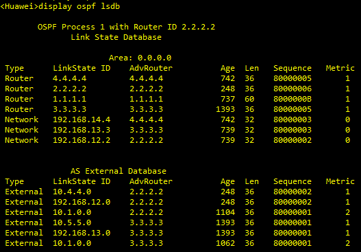

# OSPF 协议之路由聚合

## 1.路由聚合

路由聚合是指将多条具有相同 IP 前缀的路由聚合成一条路由。如果被聚合的 IP 地址范围内的某条链路频繁 Up 和 Down，该变化并不会通告到被聚合的 IP 地址范围外的设备（也就是网络出现抖动，不会影响已经通告的聚合路由）。因此，可以避免网络中的路由振荡，在一定程度上提高了网络的稳定性。

**OSPF 聚合仅能发生在 ABR 及 ASBR 上，即发生在区域边界或路由域的边界上**。

### 1.1 OSPF 路由聚合优点

- 抑制明细路由，并向外通告聚合路由：
- 减少路由表的大小，降低更新的大小，系统消耗降低：
- 至少有一条明细路由存在，路由器才能通告聚合路由，否则不会产生聚合路由；
- 出现在聚合路由范围内的明细路由的变化，如路由抖动，不影响已通告的聚合路由；
- 聚合行为只能发生在矢量行为的边界路由器上，如 ABR、ASBR。

### 1.2 OSPF 路由聚合的缺点：

路由聚合设计不当，易出现环路。

## 2.ABR 上聚合路由

ABR-summary 命令用来设置 ABR 对区域内明细路由进行聚合。ABR 向其他区域发送路由信息时，会通告明细路由。**当区域中存在连续的明细路由网络（具有相同前缀的路由信息）时，可以通过 ABR-summary 命令将这些网络聚合成一个大网络**，ABR 只向其他区域发送一条聚合后的大网络，不再通告明细网络路由，从而减小路由表的规模，提高路由器的性能。

<div align="center">
    
</div>

在 R1 上配置如下命令，将 Area1 中的 10.1.1.0/24、10.1.2.0/24、10.1.3.0/24 的路由聚合成一条聚合路由 10.1.0.0/22 向其他区域发布。

```java
<R1>system-view
[R1-OSPF-1]area 1
[R1-OSPF-1-0.0.0.1] ABR-summary 10.1.0.0 255.255.252.0
```

未作聚合前，R1 向 Area0 及 Area2 通告 10.1.1.0/24——10.1.4.0/24 四条路由，产生四份 LSA3 路由，而执行完聚合后，R1 向 Area0 及 Area2 通告 10.1.4.0/24 及聚合路由 10.1.0.0/22，产生两份 LSA3 路由。ABR-summary 路由聚合有以下注意点：

1. OSPF 对区域 Areal 通告的路由做聚合，仅发生在 ABR R1 上。**ABR-summary 命令只能在路由起源的 Area 边界上做聚合**。图中 10.1.X.0/24 路由起源于 Area1，因此聚合 ABR-summary 命令只能在 R1 上发生（起源 Area 边界上的 ABR），其他位置都无法对 10.1.X.0/24 路由做聚合。例如，R5 无法对 10.1.X.0/24 路由做聚合。
2. 华为在执行聚合时，并不会自动在路由表中添加一条避免环路的指向 Null0 接口的路由。
3. 设置聚合路由的开销，**当此 cost 参数缺省时，则取所有被聚合的路由中最大的那个开销值作为聚合路由的开销**。

## 3.外部路由聚合

ASBR-summary 命令用来设置自治系统边界路由器（ASBR）对 OSPF 引入的路由进行路由聚合。对引入的路由进行聚合后，有以下几种情况：

- 如果本地设备是 ASBR 且处于普通区域中，本地设备将对引入的聚合地址范围内的所有 Type-5 LSA 进行路由聚合
- 如果本地设备是 ASBR 且处于 NSSA 区域中，本地设备对引入的聚合地址范围内的所有 Type-7 LSA 进行路由聚合。
- **如果本地设备既是 ASBR 又是 ABR 且处于 NSSA 区域中，本地设备还将对由 Type-7 LSA 转化成的 Type-5 LSA 也进行路由聚合**。
  
另外，对于 ASBR-summary 还需要注意以下几点：

- 只要是 ASBR，无论是 NSSA 还是普通区域，只要引入外部路由成功，都可以使用上述命令对其聚合，在聚合路由范围内的路由都将被抑制。**同样适用于执行 7/5 翻译的 NSSA ABR (ABR=ASBR)**（这个可以从路由过滤那一章的实验得出）
- 设置聚合路由的开销 (cost)。当此 cost 参数缺省时，对于 Type1 外部路由，取所有被聚合路由中的最大开销值作为聚合路由的开销；对于 Type2 外部路由，则取所有被聚合路由中的最大开销值再加上 1 作为聚合路由的开销。

## 4.路由聚合产生环路

我们以下面的网络 topo 图来验证路由聚合设计不当会产生环路。

<div align="center">
    
</div>

在上图中，R2 和 R3 分别引入外部直连路由，然后在 R2 和 R3 上执行路由聚合 `Asbr-summary 10.1.0.0/16`，执行完聚合后，R2 上的 OSPF lsdb 如下所示：

<div align="center">
    
</div>

可以看到，在 area0 中泛洪着 LSA1（Router）、LSA2（Network），LSA1 每一个路由器都要产生，而 LSA2 是由每一个网段的 DR 产生（因此是 3 个）。R2 将 10.1.1.0/32——10.1.3.0/32 聚合成 10.1.0.0/16 路由，又引入了 10.4.4.0 和 192.168.12.0 网段的外部路由。这里需要注意，R2 收到了两个 192.168.12.0 网段的路由，一个外部路由 LSA5，另外一个就是内部路由 LSA2，R2 根据选路规则直接选择 LSA2。所以 R2 的 OSPF 路由表如下所示：

<div align="center">
    
</div>

R2 将外部三条路由聚合成 10.1.0.0/16，但是自己的 OSPF 路由表中没有这条路由，这是因为 R2 只是引入外部路由，并没有将这些外部路由进行宣告，所以 OSPF 路由表中不会有这些外部路由（所有的外部路由，不仅仅是聚合路由）。R2 的 OSPF 路由表中只有 R3 引入的 10.5.5.0 和 10.1.0.0。R2 的全局路由表如下所示：

<div align="center">
    
</div>

R2 的全局路由表中有聚合的 10.1.0.0/16 路由（使用 LSA5 泛洪到 area0 中），也有直连的路由 10.1.1.0——10.1.3.0 等等。R3 的 OSPF 路由表、OSPF lsdb 和全局路由表和 R2 类似。R1 的 OSPF lsdb 如下所示：

<div align="center">
    
</div>

R1 的 LSDB 和 R2、R3 一样，R1 的 OSPF 路由表如下所示：

<div align="center">
    
</div>

从这里可以看出，R1 到 R2、R3 引入的外部路由 10.1.0.0/16 的度量值一样，均为 2，根据选路规则，R1 进行负载分担，R1 的全局路由表如下所示：

<div align="center">
    
</div>

从这里可以看出，R1 到 10.1.0.0/16 的路由被负载分担到 R2 和 R3。因此，当 R1 转发目的路由为 10.1.3.0 的数据包时，可能会被转发到 R2，也会被转发到 R3。假设被转发到 R2，根据 R2 的全局路由表，有两条路由表项匹配，根据最长前缀匹配，会将数据包转发给 Loopback2，这时不会出现环路；如果 R1 转发目的路由为 10.1.4.0 的数据包时，假设被转发到 R2，根据 R2 的全局路由表，只会将其转发给 192.168.12.1，也就是再转发给 R1，这样就形成了环路。

**总结就是，R2 和 R3 互相学到对方的聚合路由，R3 上看到 R2 的聚合路由，R2 上看到 R3 的聚合路由，路由均指向 R1，而 R1 看到源自 R2 和 R3 的聚合路由 10.1.0.0/16 是负载分担的，R1 和 R2/R3 的路由互指而形成环路。访问 10.1.4.0 这个未知目的地时，报文转发形成环路**。

华为 OSPF 解决聚合路由环路的问题可以在 R2 和 R3 的路由表中手工插入 preference 值低于 10 的指向 NULL0 接口的路由。

```java
ip route-static 10.1.0.0 16 NULL 0 preference 9
```

此种方法实现简单，因为这条 NULL0 路由的 preference 值低，所以 R3 不再接收 R2 通告的 10.1.0.0/16 的聚合路由。同理，R2 也不再接收 R3 通告的聚合路由，如果 R1 访问 10.1.4.0，数据报文到 R2 后，匹配 NULL0 接口的路由（手工插入配置的静态聚合路由 10.1.0.0/16）而被丢弃，实现了环路避免。此种方法是推荐的方法。