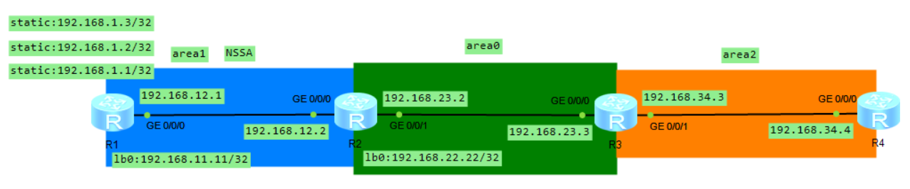

# OSPF 协议之路由过滤

## 1.OSPF 选路规则

### 1.1 OSPF 选路规则概述

OSPF 的选路规则如下所示：

- OSPF 区域内路由优于区域间;
- OSPF 的域间路由又优于外部路由;
- OSPF 外部路由中 Metric-type1 的路由优于 Metric-type2 的路由;
- 同为 Type1 的外部路由中，优选内部成本和外部成本之和后成本最小的路由，如果路由的成本一样，则负载分担;
- 同为 Type2 的外部路由中，优选外部成本花销小的路由;如果外部成本一致，则优选内部成本小的路由，否则路由负载分担。
  
**OSPF 的路由计算就是把出现在 SPF 树上的叶子路由添加到路由表的过程**，叶子节点有以下三种情况：

- 区域间的 LSA3 路由作为挂在 ABR 节点上的叶子路由， ASBR 上的 LSA5 或 LSA7 路由（这里把 LSA5 和 LSA7 均看成是 AS 外部路由）
- **如果 Root 节点（Root 节点即为当前路由器，也即 SPF 树上的根结点）和 ASBR 在同一区域内，外部路由是 ASBR 上的叶子节点**。
- **如果 Root 节点和 ASBR 不在同一个区域内，则 Root 在计算 ASBR 的外部路由时，把外部路由作为 ABR 上的叶子路由而执行**。

这个计算 ABR 上或 ASBR 上叶子路由的过程，称为 PRC（Partial Route Caculation，部分路由计算）。叶子路由的增减或 Cost 的变化，并没有触发拓扑的重新计算，执行的计算过程不会消耗太多 CPU 资源。

下面对 OSPF 选路规则进行举例：

- **例 1：路由 1: LSA3 类型路由 10.1.1.0/24,成本是 10；路由 2: LSA2 所通告的路由 10.1.1.0/24，计算后的成本为 1**。无论计算结果是多少，只要是 LSA1 或 LSA2 所通告的路由，都优于 LSA3 所通告的路由。

- **例 2：路由 1：外部路由 LSA5，外部成本是 20，内部成本是 100，cost-type 1；路由 2：外部路由 LSA7，外部成本是 10，内部成本是 110，cost-type 1**。两条路由 Cost-type 都是 type1，根据选路规则，比较两条路由的端到端开销之和，内外开销之和都是 120，两条路由负载分担出现在路由表中。

- **例 3：路由 1：外部路由 LSA5，外部成本 20，内部成本是 100，Cost-type2；路由 2：外部路由 LSA7，外部成本 20，内部成本是 120，Cost-type2**。两条路由 Cost-type 都是 type2，依据规则先比较外部成本，值最小者优先。两条路由的外部成本一致都为 20，根据内部成本选择最优路由。路由 1 因其内部成本小而最优。**需要说明的是，虽在选路时比较内部成本，但在路由表中看到该外部路由的 cost 为 20，这是因为 cost-type 为 2 的外部路由，在路由表里仅考虑外部成本**。
  
### 1.2 选路规则实验

<div align="center">
    
</div>

我们使用上述拓扑图中 R2 到达 192.168.13.0/24 网段路径来验证 OSPF 选路规则。R2 的 OSPF lsdb 如下所示：

<div align="center">
    
</div>

在上图中 R2 会收到 R3 在 area1 泛洪的 LSA2 类型的 192.168.13.0/24 路由，计算后的成本为 11，同时也会接收到 R3 和 R2 自己在 area0 泛洪的 LSA3 类型的 192.168.13.0/24 路由，计算后的成本依次为 3 和 11。**但是根据选路规则，区域内部路由的优先级要远大于区域间路由，因此，R2 只会选择 R3 在 area1 泛洪的 LSA2 路由，而不管度量值为多少**。

同时，从上图中我们可以看出，当一个区域的 ABR 有多个时，此区域的某一个网段会在另外一个区域中泛洪多次。比如 area1 中的 23.0 被 R2 和 R3 在 area0 中同时使用 LSA3 进行泛洪，13.0 同理。而 area0 中的 34.0、4.4 以及 24.0 都分别被 R3 和 R2 在 area1 中使用 LSA3 进行泛洪。

<div align="center">
    
</div>

R2 的 OSPF 路由表如上所示，可以验证选路规则，对于 13.0/24 网段，下一跳为 R3 的 192.168.23.3 接口。

## 2.OSPF 路由过滤

### 2.1 路由过滤方式概述

我们以如下的网络拓扑图来介绍 OSPF 协议中路由器的矢量特性：

<div align="center">
    
</div>

华为数通路由器提供了如下控制和过滤路由的工具：

**1).filter-policy import (在 ospf 进程中配置)**

在任何路由器上，对进 ip 路由表（全局路由表）的路由进行过滤，此命令只能抑制生成路由条目，但不能阻止 LSA 泛洪。filter-policy import 不能阻止 LSA1、LSA2 的泛洪，但是由于 LSA3 本身就用来在区域间传递网段路由信息，并且 LSA3 的产生依赖于全局路由表中的路由，因此当 filter-policy import 过滤掉了路由，LSA3 也被过滤掉了。

但是对于 LSA5，如果 LSA5 已经在 OSPF 区域中泛洪时，由于 LSA5 不需要路由表就可以产生，OSPF 路由器对于 LSA5 只是进行转发，不会更改任何字段（除了 age 字段会增加），所以如果在上面 topo 中 R3 上配置 filter-policy import 命令，LSA5 还是会泛洪到 area2 中。但是由于 R2 会把 NSSA 区域的 LSA7 转换成 LSA5（ABR 中 router-id 最大的会被选出来翻译 LSA7 -> LSA5），即 R2 会接收到 LSA7 所代表的外部路由，然后将其添加到路由表中，再根据路由表中的路由生成 LSA5 进行泛洪（泛洪的范围为整个 OSPF 域，并且泛洪的过程中，其它路由器只需要对 LSA5 进行转发即可，不需要更改），所以如果在 R2 上配置 filter-policy import 即可过滤掉进入路由表中的路由，最终抑制 LSA5 的产生。

但是如果 filter-policy import 用在 ASBR 上（不管是 NSSA 或者是普通区域）还是会将外部路由引入到 OSPF 域中，必须要使用 filter-policy export 来过滤从外部引入 OSPF 域的路由。

**2).filter-policy export（在 ospf 进程中配置）**

filter-policy 只能够用在 ASBR 上，**用来过滤从其它协议进程进入 OSPF 域的路由，只将满足条件的外部路由引入 OSPF 域**。该命令用来在 ASBR 上过滤 ASE(LSA 5)/NSSA(LSA 7)，其实是抑制 LSA 的生成。

如上的 topo 图，我们在 R1 上配置 filter-policy export 可以过滤掉 R1 产生的 LSA7 和 LSA5，但是注意，filter-policy export 只能用在 ASBR 上，如果用在其它的路由器（比如 R2、R3）无法过滤掉目标路由。

**3).filter export**

在 ABR 上，对离开 Area 的 LSA3 路由过滤

**4).filter import**

在 ABR 上，对进入 Area 的 LSA3 路由过滤

**5).filter-LSA-out**

在接口视图下，对泛洪的全部 LSA 或者 LSA3/5/7 做过滤

**6).ABR-Summary not advertise**

在 ABR 上对聚合路由范围内的所有明细路由进行过滤

**7).ASBR-Summary not advertise**

在 ASBR 上对聚合路由范围内的所有明细路由进行过滤

接下来，我们以上面的拓扑图为例，来验证上述路由过滤方式。

### 2.2 filter-policy import

<div align="center">
    
</div>

OSPF 路由设备通过 filter-policy import 命令对本地计算出来的路由执行过滤，只有被过滤策略允许的路由才能最终被添加到路由表中，没有通过过滤策略的路由不会被添加进路由表中，**此命令不影响路由器之间通告和接收 LSA**。

该命令若应用在 ABR 上，路由表里过滤掉的路由，ABR 不会为之产生 LSA3。**如果该命令应用在区域内部的某台路由器上，则仅该路由器的路由表受到影响，区域中其他路由器的路由表没有变化**。这是因为 filter-policy import 对于 LSA1、LSA2 不会进行过滤，因此一个区域中的其它路由器仍然可以使用 LSA1 和 LSA2 获取到这个区域的拓扑结构，然后使用 SPF 算法计算出到达个点的最短路径，所以路由表不会发生变化。

#### 2.2.1 在 R3 上配置 filter-policy import 过滤 LSA3

我们在 R3 上配置 filter-policy import 来过滤 LSA3 路由，即 192.168.11.11/32，在上述 topo 中，192.168.1.1/32 是一条外部的静态路由，而 192.168.11.11/32 是 area1 中的内部路由。配置之前，R3 的 OSPF Routing 如下所示：

<div align="center">
    
</div>

可以看到 R3 的 OSPF 路由表中有 192.168.11.11/32 路由，R3 的 OSPF Lsdb 如下所示：

<div align="center">
    
</div>

在 area0 和 area2 中都有 LSA3 类型（包含 192.168.11.11/32 路由）在泛洪，R3 的全局路由表如下所示：

<div align="center">
    
</div>

接下来在 R3 上进行如下配置：

```java
<Huawei>system-view 
[Huawei]acl 2001
[Huawei-acl-basic-2001]rule deny source 192.168.11.11 0
[Huawei-acl-basic-2001]rule permit 
[Huawei-acl-basic-2001]quit
[Huawei]osp	
[Huawei]ospf 1
[Huawei-ospf-1]filter-policy 2001 import 
```

R3 进行配置之后，其 OSPF 全局路由表如下所示：

<div align="center">
    
</div>

可以看到 192.168.11.11 路由已经被从全局路由表中删除，R3 OSPF lsdb 如下所示：

<div align="center">
    
</div>

可以看到，area0 中还有 192.168.11.11 类型的 LSA3 在泛洪，而 area2 中则没有，说明配置了 filter-policy import 之后，对应的路由已经被从全局路由表中删除，而 LSA3 的产生依赖于路由表中的路由，所以 R3 不产生 192.168.11.11 类型的 LSA3。不过 R3 的 OSPF route 如下所示：

<div align="center">
    
</div>

因为 area0 中 R2 会泛洪 192.168.11.11 类型的 LSA3，因此 R3 的 OSPF 路由表中也存在 192.168.11.11 路由（可以从 AdvRouter 为 2.2.2.2 看出）。

#### 2.2.2 R2 上配置 filter-policy import 过滤 LSA5

我们在 R2 上配置 filter-policy import 来过滤 LSA5 路由，即 192.168.1.1/32（R1 引入的外部静态路由）配置之前，R2 的 OSPF 路由表如下所示。

<div align="center">
    
</div>

R2 的 OSPF LSDB 如下所示，可以看出在 area1 中，R1 泛洪 192.168.1.1/32 类型的 LSA7 路由，R2 将其翻译成 LSA5 类型的路由，泛洪到 area0 中。

<div align="center">
    
</div>

R2 的全局路由表如下所示：

<div align="center">
    
</div>

接下来在 R2 上进行如下配置：

```java
<Huawei>system-view 
[Huawei]acl 2001
[Huawei-acl-basic-2001]rule deny source 192.168.1.1 0
[Huawei-acl-basic-2001]rule permit 
[Huawei-acl-basic-2001]quit
[Huawei]osp	
[Huawei]ospf 1
[Huawei-ospf-1]filter-policy 2001 import 
```

R2 进行配置之后，其 OSPF 全局路由表如下所示：

<div align="center">
    
</div>

可以看到 192.168.1.1 路由已经被从全局路由表中删除，R2 OSPF lsdb 如下所示：

<div align="center">
    
</div>

可以看到，R2 的 OSPF lsdb 中已经没有 LSA5 类的外部路由。不过 R2 的 OSPF route 如下所示：

<div align="center">
    
</div>

因为 area1 中 R1 会泛洪 192.168.1.1 类型的 LSA7，因此 R2 的 OSPF 路由表中也存在 192.168.1.1 路由（从 AdvRouter 为 1.1.1.1 可以看出）。

**在上述拓扑图中，如果在 R3 上配置 filter-policy import 无法过滤掉 LSA5，以及在 R1 上配置 filter-policy import 无法过滤外部路由 LSA7，可以自行实验验证，这里不再赘述。** 

#### 2.2.3 R1 配置 filter-policy export 过滤 LSA7

我们在 R1 上配置 filter-policy export 来过滤 LSA7 路由，即 192.168.1.1/32（R1 引入的外部静态路由），配置之前，R1 的 OSPF 路由表如下所示，由于只是通过 `import-route static` 指令引入外部路由，泛洪 LSA7，此外部路由 192.168.1.1/32 没有被宣告进 OSPF 域，故 OSPF 路由表中没有 1.1/32 的路由。

虽然 OSPF 路由表中没有关于 192.168.1.1/32 路由，但是可以从 static 静态路由表加载到全局路由中。

<div align="center">
    
</div>

R1 的 OSPF LSDB 如下所示，可以看出在 area1 中，R1 泛洪 192.168.1.1/32 类型的 LSA7 路由。

<div align="center">
    
</div>

R1 的全局路由表如下所示：

<div align="center">
    
</div>

接下来在 R1 上进行如下配置：

```java
<Huawei>system-view 
[Huawei]acl 2001
[Huawei-acl-basic-2001]rule deny source 192.168.1.1 0
[Huawei-acl-basic-2001]rule permit 
[Huawei-acl-basic-2001]quit
[Huawei]osp	
[Huawei]ospf 1
[Huawei-ospf-1]filter-policy 2001 export 
```

R1 进行配置之后，其 OSPF 全局路由表如下所示：

<div align="center">
    
</div>

可以看到 192.168.1.1 路由已经被从全局路由表中删除，R1 OSPF lsdb 如下所示：

<div align="center">
    
</div>

可以看到，R1 的 OSPF lsdb 中已经没有 LSA7 类（NSSA）的外部路由。R1 的 OSPF route 如下所示，没有发生变化。

<div align="center">
    
</div>

所以在 R1 这个 ASBR 上配置 `filter-policy export` 可以过滤掉外部 LSA7 路由。配置 OSPF 对引入的 static 静态路由在发布时进行过滤，执行过滤前，一定要先使用 import-route static 命令引入静态路由。在 OSPF 下，filter-policy export 命令仅用在 ASBR 下对引入到 OSPF 的外部路由做过滤。export 后面接协议进程名字，表示 filter-policy 是对从引入的静态路由执行过滤。如果未加协议进程名字，则代表对 ASBR 上任何协议进程引入的路由都执行过滤。如下所示：

```java
<Huawei>system-view
[Huawei]OSPF 1
[Huawei-OSPF-1]import-route static
[Huawei-OSPF-1]filter-policy 2001 export static
```

#### 2.2.4 在 R3 上配置 abr-summary not advertise 过滤 LSA3

ABR-summary not-advertise 和 ASBR-summary not-advertise 这一对命令分别可用于过滤 LSA3 或 LSA5/7 的路由。
ABR/ASBR-summary not-advertise 命令仅对处在聚合路由范围内的明细路由做过滤，该命令利用聚合自动抑制明细成员路由的能力（也就是将多条明细路由聚合成一条路由，比如把 10.1.1.0/24、10.1.2.0/24、10.1.3.0/24 聚合成 10.1.0.0/22），再添加 not-advertise 关键词后，使聚合路由不再产生。我们使用如下 topo 图来测试：

<div align="center">
    
</div>

在上面的拓扑图中，R2 有一个 loopback0/1/2 接口，IP 地址为 22.22/32、22.23/32、22.24/32，我们在 R3 上配置 abr-summary not advertise 命令，不让这三个 loopback 接口 IP 地址对应的 LSA3 在 area2 中泛洪。

在配置之前，R2 的 OSPF 路由表如下所示，可以看到有 22.22/32、22.23/32、22.24/32 这三个网段，并且网段的类型为 stub，表示为末端网路。

<div align="center">
    
</div>

R2 的 OSPF lsdb 如下所示，从 LSDB 中可以看出，在 area1 中，上述三个路由是以 LSA3 的形式泛洪的.

<div align="center">
    
</div>

在 area0 中，R2 是以 router 类型的 LSA（1 类）在 area0 中泛洪上面 3 个类型的路由（AdvRouter=2.2.2.2），如下所示，可以看到 Link ID 分别为 22.22/32、22.23/32、22.24/32 三条路由，Data 表示这三个网段的掩码。

<div align="center">
    
</div>

最后，在 R2 的全局路由表中也包含这三个网段，这里不再贴出截图。接下来，我们在 R3 上进行如下配置：

```java
[Huawei-ospf-1-area-0.0.0.0]abr-summary 192.168.22.16 255.255.255.240 not-advertise 
```

在 R3 上进行如下配置之后，R3 的 OSPF LSDB 如下所示：

<div align="center">
    
</div>

可以看到 R3 在 area2 中没有再去泛洪 22.22/32、22.23/32、22.24/32 这三条路由对应的 LSA3，这样 R4 中的 OSPF 路由表、全局路由表以及 OSPF LSDB 中都没有这三条路由信息。但是在 R3 的 OSPF 路由表和全局路由表中还是存在这三条路由，这是因为 R2 会不断向 area0 中泛洪这三条路由（通过 router 类型的 LSA，也就是 1 类 LSA）。

需要说明的是：

- ABR-summary 对出现在此范围内的路由做过滤。例如，如果要过滤 10.1.4.0／24，使用 ABR-summary 10.1.4.0 255.255.255.0 not-advertise 不起作用；
- ABR-summary not-advertise 过滤命令不如其他过滤命令强大，如 filter export／import 命令，ABR-summary not-advertise 只能对可聚合的路由做过滤，如果要实现仅过滤 10.1.1.0／24 和 10.1.3.0／24，并不过滤 10.1.2.0／24，ABR-summary 命令则无法实现；
- ABR-summary 命令只能在图中的 R3 处（LSA3 路由起源的位置）执行过滤，无法在 R4 处对以上三个路由做过滤。

#### 2.2.5 在 R2 上配置 asbr-summary not advertise 命令过滤 LSA5

ASBR-summary not-advertise 命令应用在 ASBR 上，效果同 ABR-summary not-advertise 命令，仅对处在聚合范围内的路由做过滤。该命令只能对 ASBR 产生的 LSA5 或 LSA7 的外部路由做过滤，执行过滤可以在任何一个 ASBR，甚至是 NSSA 区域边界上的 7/5 转换器，其向骨干区域通告路由时，同样可以使用该命令做明细路由的过滤。

我们使用如下的 topo 图来进行实验：

<div align="center">
    
</div>

在 R1 上有三个外部路由 1.1/32、1.2/32、1.3/32，R1 将这三条路由引入到 OSPF 域之后，产生三条对应的 LSA7 进行泛洪。我们在 R2 上配置 `asbr-summary not advertise` 这条命令，将会使得 R2 不会将这三条 LSA7 路由翻译成对应的 LSA5 泛洪到 area0 中。

配置之前，R2 的 OSPF 路由表如下所示：

<div align="center">
    
</div>

R2 的 OSPF LSDB 如下所示，可以看出，R2 把这三条路由对应的 LSA7 翻译成 LSA5（ASE） 泛洪到 area0 中，R1 在 area1 中泛洪 LSA7。

<div align="center">
    
</div>

 R2 的全局路由表中也有这三条外部路由，这里不再贴出截图。接下来，我们进行如下配置：

 ```java
 [Huawei-ospf-1]asbr-summary 192.168.1.0 255.255.255.252 not-advertise 
 ```

 配置完毕之后 R2 的 OSPF lsdb 如下所示：

<div align="center">
    
</div>

可以看到 R2 的 OSPF lsdb 中没有这三条路由对应的 LSA5，因此 R3 的 OSPF 路由表、OSPF Lsdb 以及全局路由表中没有这三条路由信息。但是在 R2 的 OSPF 路由表以及全局路由表中还是存在这三条路由，这是因为 R1 不断在 area1 中泛洪这三条路由对应的 LSA7 信息。

#### 2.2.6 在 ABR 上配置使用 filter ip-prefix import/export 过滤 LSA3

在 ABR 上使用 filter ip-prefix import/export 过滤 LSA3。filter export 命令用来对从本区域通告出去的 Type 3 LSA 路由进行过滤；filter import 命令对进入本区域的 Type 3 LSA 路由执行过滤。默认情况下，ABR 不对区域间路由做任何过滤，所有出现在 ABR 路由表里面的 area1 路由都将被 R2 通过 LSA3 通告到 area0，但是可以使用 filter import/export 对其进行过滤。

filter import 和 export 的区别在于，import 在路由进入某区域时执行过滤，不影响其他区域路由的学习。export 在路由离开某区域时执行路由过滤，导致所有其他区域都学不到该路由。二者都仅对 LSA3 做过滤。

<div align="center">
    
</div>

如上图，使 ABR R2 仅向其他区域通告 10.1.4.4/32 和 10.1.4.5/32 路由。如果在 R2 上配置 filter-import，那么仅仅在 4.6/32 路由进入 area0 时会进行过滤，而 area2 中还是会存在。如果在 R2 上配置 filter-export，那么当 4.6/32 离开 area1 时，就会被过滤掉，那么 area0 和 area2 都不会接收到 4.6/32，达到了目的。
