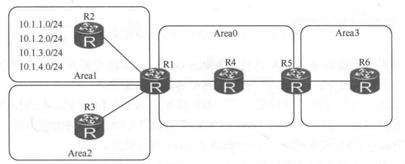
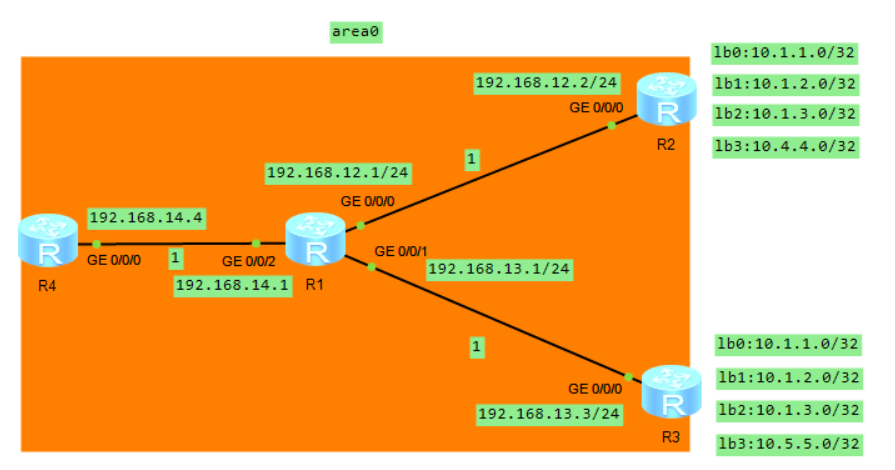
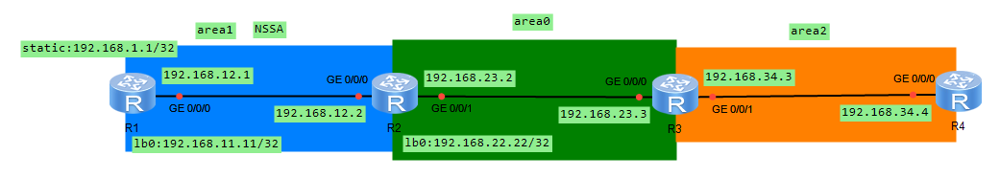
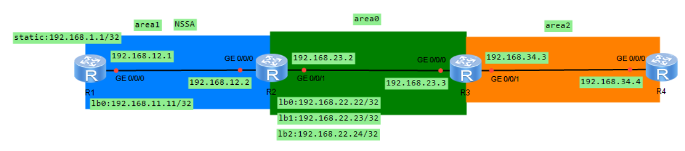
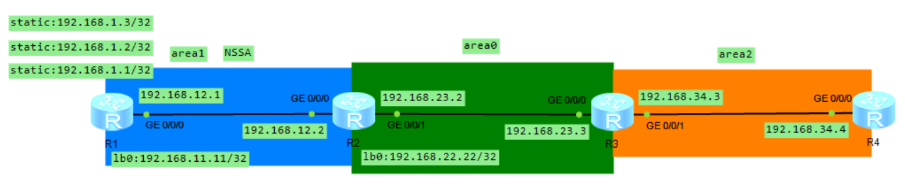
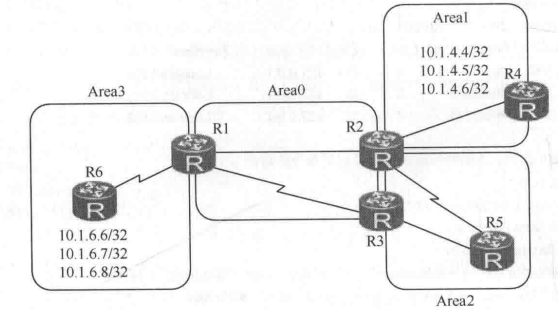

# OSPF 协议之路由过滤

## 一、路由聚合

### 1.概述

路由聚合是指将多条具有相同 IP 前缀的路由聚合成一条路由。如果被聚合的 IP 地址范围内的某条链路频繁 Up 和 Down，该变化并不会通告到被聚合的 IP 地址范围外的设备（也就是网络出现抖动，不会影响已经通告的聚合路由）。因此，可以避免网络中的路由振荡，在一定程度上提高了网络的稳定性。**<font color="red">OSPF 聚合仅能发生在 ABR 及 ASBR 上，即发生在区域边界或路由域的边界上</font>**。

#### 1.1.OSPF 路由聚合优点

- 抑制明细路由，并向外通告聚合路由：
- 减少路由表的大小，降低更新的大小，系统消耗降低：
- **至少有一条明细路由存在，路由器才能通告聚合路由，否则不会产生聚合路由**；
- 出现在聚合路由范围内的明细路由的变化，如路由抖动，不影响已通告的聚合路由；
- 聚合行为只能发生在矢量行为的边界路由器上，如 ABR、ASBR。

#### 1.2.OSPF 路由聚合的缺点

路由聚合设计不当，易出现环路。

### 2.ABR 上聚合路由

ABR-summary 命令用来设置 ABR 对区域内明细路由进行聚合。ABR 向其他区域发送路由信息时，会通告明细路由。**当区域中存在连续的明细路由网络（具有相同前缀的路由信息）时，可以通过 ABR-summary 命令将这些网络聚合成一个大网络**，ABR 只向其他区域发送一条聚合后的大网络，不再通告明细网络路由，从而减小路由表的规模，提高路由器的性能。

<div align="center">
    
</div>

在 R1 上配置如下命令，将 Area1 中的 **`10.1.1.0/24`**、**`10.1.2.0/24`**、**`10.1.3.0/24`** 的路由聚合成一条聚合路由 **`10.1.0.0/22`** 向其他区域发布。

```java
<R1>system-view
[R1-OSPF-1]area 1
[R1-OSPF-1-0.0.0.1] ABR-summary 10.1.0.0 255.255.252.0
```

未作聚合前，R1 向 Area0 及 Area2 通告 **`10.1.1.0/24—10.1.4.0/24`** 四条路由，产生四份 LSA3 路由，而执行完聚合后，R1 向 Area0 及 Area2 通告 **`10.1.4.0/24`** 及聚合路由 **`10.1.0.0/22`**，产生两份 LSA3 路由。ABR-summary 路由聚合有以下注意点：

1. OSPF 对区域 Areal 通告的路由做聚合，仅发生在 ABR R1 上。**ABR-summary 命令只能在路由起源的 Area 边界上做聚合**。图中 **`10.1.X.0/24`** 路由起源于 Area1，因此聚合 ABR-summary 命令只能在 R1 上发生（起源 Area 边界上的 ABR），其他位置都无法对 **`10.1.X.0/24`** 路由做聚合。例如，R5 无法对 **`10.1.X.0/24`** 路由做聚合。
2. 华为在执行聚合时，并不会自动在路由表中添加一条避免环路的指向 Null0 接口的路由。
3. 设置聚合路由的开销，**<font color="red">当此 cost 参数缺省时，则取所有被聚合的路由中最大的那个开销值作为聚合路由的开销</font>**。

### 3.外部路由聚合

ASBR-summary 命令用来设置自治系统边界路由器（ASBR）对 OSPF 引入的路由进行路由聚合。对引入的路由进行聚合后，有以下几种情况：

- 如果本地设备是 ASBR 且处于普通区域中，本地设备将对引入的聚合地址范围内的所有 Type-5 LSA 进行路由聚合
- 如果本地设备是 ASBR 且处于 NSSA 区域中，本地设备对引入的聚合地址范围内的所有 Type-7 LSA 进行路由聚合。
- **<font color="red">如果本地设备既是 ASBR 又是 ABR 且处于 NSSA 区域中, 本地设备对引入的聚合地址范围内的所有 Type-5 LSA 和 Type-7 LSA 进行路由聚合外, 还将对由 Type-7 LSA 转化成的 Type-5 LSA 也进行路由聚合</font>**。

另外，对于 ASBR-summary 还需要注意以下几点：

- 只要是 ASBR，无论是 NSSA 还是普通区域，只要引入外部路由成功，都可以使用上述命令对其聚合，在聚合路由范围内的路由都将被抑制。**同样适用于执行 7/5 翻译的 NSSA ABR (ABR=ASBR)**（这个可以从路由过滤那一章的实验得出）。
- 设置聚合路由的开销 (cost)。当此 cost 参数缺省时，对于 Type1 外部路由，取所有被聚合路由中的最大开销值作为聚合路由的开销；对于 Type2 外部路由，则取所有被聚合路由中的最大开销值再加上 1 作为聚合路由的开销。

### 4.路由聚合产生环路

我们以下面的网络 topo 图来验证路由聚合设计不当会产生环路。

<div align="center">
    
</div>

上述拓扑图中 R2 的配置如下所示：

```java{.line-numbers}
#
 sysname R2
#
interface GigabitEthernet0/0/0
 ip address 192.168.12.2 255.255.255.0 
#
interface LoopBack0
 ip address 10.1.1.0 255.255.255.255 
#
interface LoopBack1
 ip address 10.1.2.0 255.255.255.255 
#
interface LoopBack2
 ip address 10.1.3.0 255.255.255.255 
#
interface LoopBack3
 ip address 10.4.4.0 255.255.255.255 
#
ospf 1 router-id 2.2.2.2 
 asbr-summary 10.1.0.0 255.255.0.0
 import-route direct route-policy R2_TO_OSPF
 area 0.0.0.0 
  network 192.168.12.2 0.0.0.0 
#
route-policy R2_TO_OSPF deny node 10 
 if-match ip-prefix R2_IMPORT 
#
route-policy R2_TO_OSPF permit node 20 
#
ip ip-prefix R2_IMPORT index 10 permit 192.168.12.0 24
```

R3 的配置如下所示：

```java{.line-numbers}
#
 sysname R3
#
interface GigabitEthernet0/0/0
 ip address 192.168.13.3 255.255.255.0 
#
interface LoopBack0
 ip address 10.1.1.0 255.255.255.255 
#
interface LoopBack1
 ip address 10.1.2.0 255.255.255.255 
#
interface LoopBack2
 ip address 10.1.3.0 255.255.255.255 
#
interface LoopBack3
 ip address 10.5.5.0 255.255.255.255 
#
ospf 1 router-id 3.3.3.3 
 asbr-summary 10.1.0.0 255.255.0.0
 import-route direct route-policy R3_TO_OSPF
 area 0.0.0.0 
  network 192.168.13.3 0.0.0.0 
#
route-policy R3_TO_OSPF deny node 10 
 if-match ip-prefix R3_IMPORT 
#
route-policy R3_TO_OSPF permit node 20 
#
ip ip-prefix R3_IMPORT index 10 permit 192.168.13.0 24
```

在上图中，R2 和 R3 分别引入外部直连路由，这段逻辑可以这么理解，这段配置的逻辑是：先用 **`ip ip-prefix R2_IMPORT`** 精确匹配需要禁止引入直连路由 **`192.168.12.0/24`**，然后在 **`route-policy R2_TO_OSPF`** 的 **`deny node 10`** 中调用这个前缀列表，因此当引入直连路由时，凡是匹配 **`192.168.12.0/24`** 的路由都会命中 **`deny node 10`**，从而被拒绝引入 OSPF。对于其它直连路由，例如 LoopBack 口的 **`10.1.1.0/32`** 等，由于它们不匹配 **`R2_IMPORT`**，所以不会命中 **`deny node 10`**，会继续向下匹配后面的 **`permit node 20`**。而 **`permit node 20`** 没有配置任何条件，表示默认匹配所有剩余路由，因此这些没有被前面拒绝的直连路由都会被允许引入 OSPF。


然后在 R2 和 R3 上执行路由聚合 **`Asbr-summary 10.1.0.0/16`**，执行完聚合后，R2 上的 OSPF lsdb 如下所示：

```java{.line-numbers}
<R2>display ospf lsdb 
	 OSPF Process 1 with Router ID 2.2.2.2
		 Link State Database 
		         Area: 0.0.0.0
 Type      LinkState ID    AdvRouter          Age  Len   Sequence   Metric
 Router    4.4.4.4         4.4.4.4            804  36    80000006       1
 Router    2.2.2.2         2.2.2.2            176  36    80000009       1
 Router    1.1.1.1         1.1.1.1            123  60    80000016       1
 Router    3.3.3.3         3.3.3.3            131  36    80000009       1
 Network   192.168.14.4    4.4.4.4            804  32    80000003       0
 Network   192.168.13.1    1.1.1.1            123  32    80000004       0
 Network   192.168.12.1    1.1.1.1            170  32    80000004       0
		 AS External Database
 Type      LinkState ID    AdvRouter          Age  Len   Sequence   Metric
 External  10.4.4.0        2.2.2.2            886  36    80000001       1
 External  10.1.0.0        2.2.2.2            886  36    80000001       2
 External  10.5.5.0        3.3.3.3            411  36    80000003       1
 External  10.1.0.0        3.3.3.3            411  36    80000003       2
```

可以看到，在 Area0 中泛洪着 LSA1（Router）、LSA2（Network），LSA1 每一个路由器都要产生，而 LSA2 是由每一个网段的 DR 产生（因此是 3 个）。R2 将 **`10.1.1.0/32—10.1.3.0/32`** 聚合成 **`10.1.0.0/16`** 路由，又引入了 **`10.4.4.0`** 的外部路由。

R2 将外部三条路由聚合成 **`10.1.0.0/16`**，但是自己的 OSPF 路由表中没有这条路由，这是因为在计算区域间路由和外部路由的时候，如果 LSA 是由计算路由器自己产生的，那么就不再使用此 LSA 计算路由。R2 的 OSPF 路由表中只有 R3 引入的 **`10.5.5.0`** 和 **`10.1.0.0`**，因此 R2 的全局路由表中只有 R3 产生的 **`10.1.0.0/16`** 聚合路由，下一跳为 **`192.168.12.1`**。R2 的全局路由表和 OSPF 路由表如下所示：

```java{.line-numbers}
<R2>display ospf routing 
	 OSPF Process 1 with Router ID 2.2.2.2
		  Routing Tables 
 Routing for Network 
 Destination        Cost  Type       NextHop         AdvRouter       Area
 192.168.12.0/24    1     Transit    192.168.12.2    2.2.2.2         0.0.0.0
 192.168.13.0/24    2     Transit    192.168.12.1    1.1.1.1         0.0.0.0
 192.168.14.0/24    2     Transit    192.168.12.1    4.4.4.4         0.0.0.0

 Routing for ASEs
 Destination        Cost      Type       Tag         NextHop         AdvRouter
 10.1.0.0/16        2         Type2      1           192.168.12.1    3.3.3.3
 10.5.5.0/32        1         Type2      1           192.168.12.1    3.3.3.3

 Total Nets: 5  
 Intra Area: 3  Inter Area: 0  ASE: 2  NSSA: 0 
<R2>display ip routing-table 
Route Flags: R - relay, D - download to fib
------------------------------------------------------------------------------
Routing Tables: Public
         Destinations : 15       Routes : 15       
Destination/Mask    Proto   Pre  Cost      Flags NextHop         Interface
       10.1.0.0/16  O_ASE   150  2           D   192.168.12.1    GigabitEthernet0/0/0
       10.1.1.0/32  Direct  0    0           D   127.0.0.1       LoopBack0
       10.1.2.0/32  Direct  0    0           D   127.0.0.1       LoopBack1
       10.1.3.0/32  Direct  0    0           D   127.0.0.1       LoopBack2
       10.4.4.0/32  Direct  0    0           D   127.0.0.1       LoopBack3
       10.5.5.0/32  O_ASE   150  1           D   192.168.12.1    GigabitEthernet0/0/0
```

R3 的 OSPF 路由表、OSPF lsdb 和全局路由表和 R2 类似，如下所示：

```java{.line-numbers}
<R3>display ospf routing 

	 OSPF Process 1 with Router ID 3.3.3.3
		  Routing Tables 

 Routing for Network 
 Destination        Cost  Type       NextHop         AdvRouter       Area
 192.168.13.0/24    1     Transit    192.168.13.3    3.3.3.3         0.0.0.0
 192.168.12.0/24    2     Transit    192.168.13.1    1.1.1.1         0.0.0.0
 192.168.14.0/24    2     Transit    192.168.13.1    4.4.4.4         0.0.0.0

 Routing for ASEs
 Destination        Cost      Type       Tag         NextHop         AdvRouter
 10.1.0.0/16        2         Type2      1           192.168.13.1    2.2.2.2
 10.4.4.0/32        1         Type2      1           192.168.13.1    2.2.2.2

 Total Nets: 5  
 Intra Area: 3  Inter Area: 0  ASE: 2  NSSA: 0 
<R3>display ip routing-table 
Route Flags: R - relay, D - download to fib
------------------------------------------------------------------------------
Routing Tables: Public
         Destinations : 15       Routes : 15       
Destination/Mask    Proto   Pre  Cost      Flags NextHop         Interface
       10.1.0.0/16  O_ASE   150  2           D   192.168.13.1    GigabitEthernet0/0/0
       10.1.1.0/32  Direct  0    0           D   127.0.0.1       LoopBack0
       10.1.2.0/32  Direct  0    0           D   127.0.0.1       LoopBack1
       10.1.3.0/32  Direct  0    0           D   127.0.0.1       LoopBack2
       10.4.4.0/32  O_ASE   150  1           D   192.168.13.1    GigabitEthernet0/0/0
       10.5.5.0/32  Direct  0    0           D   127.0.0.1       LoopBack3
```

R1 的 OSPF 路由表以及全局路由表如下所示，从这里可以看出，R1 到 R2、R3 引入的外部路由 **`10.1.0.0/16`** 的度量值一样，均为 2，根据选路规则，R1 进行负载分担。

```java{.line-numbers}
[R1]display ospf routing 

	 OSPF Process 1 with Router ID 1.1.1.1
		  Routing Tables 

 Routing for Network 
 Destination        Cost  Type       NextHop         AdvRouter       Area
 192.168.12.0/24    1     Transit    192.168.12.1    1.1.1.1         0.0.0.0
 192.168.13.0/24    1     Transit    192.168.13.1    1.1.1.1         0.0.0.0
 192.168.14.0/24    1     Transit    192.168.14.1    1.1.1.1         0.0.0.0

 Routing for ASEs
 Destination        Cost      Type       Tag         NextHop         AdvRouter
 10.1.0.0/16        2         Type2      1           192.168.12.2    2.2.2.2
 10.1.0.0/16        2         Type2      1           192.168.13.3    3.3.3.3
 10.4.4.0/32        1         Type2      1           192.168.12.2    2.2.2.2
 10.5.5.0/32        1         Type2      1           192.168.13.3    3.3.3.3

 Total Nets: 7  
 Intra Area: 3  Inter Area: 0  ASE: 4  NSSA: 0 
[R1]display ip routing-table 
Route Flags: R - relay, D - download to fib
------------------------------------------------------------------------------
Routing Tables: Public
         Destinations : 16       Routes : 17       
Destination/Mask    Proto   Pre  Cost      Flags NextHop         Interface
       10.1.0.0/16  O_ASE   150  2           D   192.168.13.3    GigabitEthernet0/0/1
                    O_ASE   150  2           D   192.168.12.2    GigabitEthernet0/0/0
       10.4.4.0/32  O_ASE   150  1           D   192.168.12.2    GigabitEthernet0/0/0
       10.5.5.0/32  O_ASE   150  1           D   192.168.13.3    GigabitEthernet0/0/1
```

从这里可以看出，R1 到 **`10.1.0.0/16`** 的路由被负载分担到 R2 和 R3。因此，当 R1 转发目的路由为 **`10.4.4.0`** 的数据包时。

如果当 R1 收到访问 **`10.1.4.1`** 的报文时，会根据聚合路由把报文转发给 R2 或 R3。假设报文先被转发给 R3，R3 查表时发现自己只有 **`10.1.1.0/24-10.1.3.0/24`** 的真实明细路由，并没有 **`10.1.4.0/24`**，不过 R3 又从 OSPF 中学到了 R2 发布的 **`10.1.0.0/16`** 聚合路由，并且到这条路由的下一跳指向 R1，于是 R3 会把报文重新发回 R1。R1 再次收到同一个报文后，仍然根据聚合路由把它发给 R3 或 R4。如果又发给 R3，就形成 **`R2 -> R3 -> R2 -> R3`** 的环路，如果发给 R2，R2 的处理逻辑也一样，会匹配到从 R3 学来的 **`10.1.0.0/16`** 聚合路由，并把报文再送回 R1。这样报文就在 R1、R2、R3 之间来回转发，直到 TTL 减为 0 后被丢弃。

**<font color="red">总结就是，R2 和 R3 互相学到对方的聚合路由，R3 上看到 R2 的聚合路由，R2 上看到 R3 的聚合路由，路由均指向 R1，而 R1 看到源自 R2 和 R3 的聚合路由 `10.1.0.0/16` 是负载分担的，R1 和 R2/R3 的路由互指而形成环路。访问 10.1.4.0 这个未知目的地时，报文转发形成环路</font>**。

华为 OSPF 解决聚合路由环路的问题可以在 R2 和 R3 的路由表中手工插入 preference 值低于 10 的指向 NULL0 接口的路由。

```java
ip route-static 10.1.0.0 16 NULL 0 preference 9
```

此种方法实现简单，因为这条 NULL0 路由的 preference 值低，所以 R3 不再将收到 R2 通告的 **`10.1.0.0/16`** 的 OSPF 聚合路由放到全局路由表中。同理，R2 也不再将接收 R3 通告的聚合路由放进全局路由表，如果 R1 访问 **`10.1.4.0`**，数据报文到 R2 后，匹配 NULL0 接口的路由（手工插入配置的静态聚合路由 **`10.1.0.0/16`**）而被丢弃，实现了环路避免。此种方法是推荐的方法。

可以看到 R2 配置之后，OSPF 路由表中有 R3 产生的 **`10.1.0.0/16`** 的 OSPF 聚合路由，但是全局路由表中没有该 OSPF 聚合路由。

```java{.line-numbers}
[R2]display ospf routing 
	 OSPF Process 1 with Router ID 2.2.2.2
		  Routing Tables 
 Routing for Network 
 Destination        Cost  Type       NextHop         AdvRouter       Area
 192.168.12.0/24    1     Transit    192.168.12.2    2.2.2.2         0.0.0.0
 192.168.13.0/24    2     Transit    192.168.12.1    1.1.1.1         0.0.0.0
 192.168.14.0/24    2     Transit    192.168.12.1    4.4.4.4         0.0.0.0

 Routing for ASEs
 Destination        Cost      Type       Tag         NextHop         AdvRouter
 10.1.0.0/16        2         Type2      1           192.168.12.1    3.3.3.3
 10.5.5.0/32        1         Type2      1           192.168.12.1    3.3.3.3

 Total Nets: 5  
 Intra Area: 3  Inter Area: 0  ASE: 2  NSSA: 0 
[R2]display ip routing-table 
Route Flags: R - relay, D - download to fib
------------------------------------------------------------------------------
Routing Tables: Public
         Destinations : 15       Routes : 15       

Destination/Mask    Proto   Pre  Cost      Flags NextHop         Interface

       10.1.0.0/16  Static  9    0           D   0.0.0.0         NULL0
       10.1.1.0/32  Direct  0    0           D   127.0.0.1       LoopBack0
       10.1.2.0/32  Direct  0    0           D   127.0.0.1       LoopBack1
       10.1.3.0/32  Direct  0    0           D   127.0.0.1       LoopBack2
       10.4.4.0/32  Direct  0    0           D   127.0.0.1       LoopBack3
       10.5.5.0/32  O_ASE   150  1           D   192.168.12.1    GigabitEthernet0/0/0
```

## 二、OSPF 路由过滤

### 2.1.路由过滤方式概述

我们以如下的网络拓扑图来介绍 OSPF 协议中路由器的矢量特性：

<div align="center">
    
</div>

华为数通路由器提供了如下控制和过滤路由的工具：

**（1）filter-policy import (在 ospf 进程中配置)**

**`filter-policy import`** **<font color="red">不直接过滤 OSPF LSA，它过滤的是 OSPF 计算出来后准备进入路由表的路由。如果配置在普通路由器上，只影响本机是否安装路由，不影响 LSA 泛洪</font>**。**`filter-policy import`** 不能阻止 LSA1、LSA2 的泛洪，对于 LSA3，ABR 是否产生 Type-3 Summary LSA 依赖其本地 OSPF 路由计算结果。所以在 ABR 上过滤掉某条路由，可能导致该 ABR 不再向其它区域产生对应 LSA3。

但是对于 LSA5，如果 LSA5 已经在 OSPF 区域中泛洪时，由于 LSA5 不需要路由表就可以产生，OSPF 路由器对于 LSA5 只是进行转发，不会更改任何字段（除了 age 字段会增加），**<font color="red">所以如果在上面 topo 中 R3 上配置 **`filter-policy import`** 命令，LSA5 还是会泛洪到 Area2 中</font>**。

但是由于 R2 会把 NSSA 区域的 LSA7 转换成 LSA5（ABR 中 router-id 最大的会被选出来翻译 **`LSA7 -> LSA5`**），即 R2 会接收到 LSA7 所代表的外部路由，然后将其添加到路由表中，再根据路由表中的路由生成 LSA5 进行泛洪（泛洪的范围为整个 OSPF 域，并且泛洪的过程中，其它路由器只需要对 LSA5 进行转发即可，不需要更改），所以如果在 R2 上配置 **`filter-policy import`** 即可过滤掉进入路由表中的路由，最终抑制 LSA5 的产生。因此，也就是如果在 R2 这个 **`NSSA ABR/translator`** 上配置 **`filter-policy import`**，**<font color="red">使某条 Type-7 外部路由没有成为 R2 上的已安装 OSPF 外部路由，那么 R2 后续就不会把这条 Type-7 LSA 翻译成 Type-5 LSA，因此可以间接抑制 LSA5 的产生</font>**。

但是如果 **`filter-policy import`** 用在 ASBR 上（不管是 NSSA 或者是普通区域）还是会将外部路由引入到 OSPF 域中，必须要使用 **`filter-policy export`** 来过滤从外部引入 OSPF 域的路由。

**（2）filter-policy export（在 ospf 进程中配置）**

**`filter-policy export`** 只能够用在 ASBR 上，**用来过滤从其它协议进程进入 OSPF 域的路由，只将满足条件的外部路由引入 OSPF 域**。该命令用来在 ASBR 上过滤 **`ASE(LSA 5)/NSSA(LSA 7)`**，其实是抑制 LSA 的生成。

如上的 topo 图，我们在 R1 上配置 **`filter-policy export`** 可以过滤掉 R1 产生的 LSA7 和 LSA5，但是注意，**`filter-policy export`** 只能用在 ASBR 上，如果用在其它的路由器（比如 R2、R3）无法过滤掉目标路由。

**（3）filter export**

在 ABR 上，对离开 Area 的 LSA3 路由过滤

**（4）filter import**

在 ABR 上，对进入 Area 的 LSA3 路由过滤

**（5）filter-LSA-out**

在接口视图下，对泛洪的全部 LSA 或者 LSA3/5/7 做过滤

**（6）ABR-Summary not advertise**

在 ABR 上对聚合路由范围内的所有明细路由进行过滤

**（7）ASBR-Summary not advertise**

在 ASBR 上对聚合路由范围内的所有明细路由进行过滤

接下来，我们以上面的拓扑图为例，来验证上述路由过滤方式。

### 2.2.路由过滤实验

<div align="center">
    
</div>

#### 2.2.1 R3 上配置 filter-policy import 过滤 LSA3

OSPF 路由设备通过 **`filter-policy import`** 命令对本地计算出来的路由执行过滤，只有被过滤策略允许的路由才能最终被添加到路由表中，没有通过过滤策略的路由不会被添加进路由表中，**<font color="red">此命令不影响路由器之间通告和接收 LSA</font>**。

该命令若应用在 ABR 上，路由表里过滤掉的路由，ABR 不会为之产生 LSA3。**<font color="red">如果该命令应用在区域内部的某台路由器上，则仅该路由器的路由表受到影响，区域中其他路由器的路由表没有变化</font>**。这是因为 **`filter-policy import`** 对于 LSA1、LSA2 不会进行过滤，因此一个区域中的其它路由器仍然可以使用 LSA1 和 LSA2 获取到这个区域的拓扑结构，然后使用 SPF 算法计算出到达个点的最短路径，所以路由表不会发生变化。

我们在 R3 上配置 **`filter-policy import`** 来过滤 LSA3 路由，即 **`192.168.11.11/32`**，在上述 topo 中，**`192.168.1.1/32`** 是一条外部的静态路由，而 **`192.168.11.11/32`** 是 Area1 中的内部路由。配置之前，R3 的 OSPF Routing 如下所示：

```java{.line-numbers}
[R3]display ospf routing 

	 OSPF Process 1 with Router ID 3.3.3.3
		  Routing Tables 

 Routing for Network 
 Destination        Cost  Type       NextHop         AdvRouter       Area
 192.168.23.0/24    1     Transit    192.168.23.3    3.3.3.3         0.0.0.0
 192.168.34.0/24    1     Transit    192.168.34.3    3.3.3.3         0.0.0.2
 192.168.11.11/32   2     Inter-area 192.168.23.2    2.2.2.2         0.0.0.0
 192.168.12.0/24    2     Inter-area 192.168.23.2    2.2.2.2         0.0.0.0
 192.168.22.22/32   1     Stub       192.168.23.2    2.2.2.2         0.0.0.0

 Total Nets: 5  
 Intra Area: 3  Inter Area: 2  ASE: 0  NSSA: 0 
```

可以看到 R3 的 OSPF 路由表中有 **`192.168.11.11/32`** 路由，R3 的 OSPF Lsdb 如下所示：

```java{.line-numbers}
[R3]display ospf lsdb 

	 OSPF Process 1 with Router ID 3.3.3.3
		 Link State Database 

		         Area: 0.0.0.0
 Type      LinkState ID    AdvRouter          Age  Len   Sequence   Metric
 Router    2.2.2.2         2.2.2.2             90  48    80000007       1
 Router    3.3.3.3         3.3.3.3             82  36    80000004       1
 Network   192.168.23.3    3.3.3.3             82  32    80000002       0
 Sum-Net   192.168.11.11   2.2.2.2             96  28    80000001       1
 Sum-Net   192.168.34.0    3.3.3.3            123  28    80000001       1
 Sum-Net   192.168.12.0    2.2.2.2            136  28    80000001       1
 
		         Area: 0.0.0.2
 Type      LinkState ID    AdvRouter          Age  Len   Sequence   Metric
 Router    4.4.4.4         4.4.4.4             76  36    80000004       1
 Router    3.3.3.3         3.3.3.3             84  36    80000004       1
 Network   192.168.34.4    4.4.4.4             76  32    80000002       0
 Sum-Net   192.168.23.0    3.3.3.3            123  28    80000001       1
 Sum-Net   192.168.11.11   3.3.3.3             89  28    80000001       2
 Sum-Net   192.168.22.22   3.3.3.3             89  28    80000001       1
 Sum-Net   192.168.12.0    3.3.3.3             89  28    80000001       2
 Sum-Asbr  2.2.2.2         3.3.3.3             89  28    80000001       1
```

在 Area0 和 Area2 中都有 LSA3 类型（包含 **`192.168.11.11/32`** 路由）在泛洪，R3 的全局路由表如下所示：

```java{.line-numbers}
[R3]display ip routing-table 
Route Flags: R - relay, D - download to fib
------------------------------------------------------------------------------
Routing Tables: Public
         Destinations : 13       Routes : 13       
Destination/Mask    Proto   Pre  Cost      Flags NextHop         Interface
      127.0.0.0/8   Direct  0    0           D   127.0.0.1       InLoopBack0
      127.0.0.1/32  Direct  0    0           D   127.0.0.1       InLoopBack0
127.255.255.255/32  Direct  0    0           D   127.0.0.1       InLoopBack0
  192.168.11.11/32  OSPF    10   2           D   192.168.23.2    GigabitEthernet0/0/0
   192.168.12.0/24  OSPF    10   2           D   192.168.23.2    GigabitEthernet0/0/0
  192.168.22.22/32  OSPF    10   1           D   192.168.23.2    GigabitEthernet0/0/0
```

接下来在 R3 上进行如下配置：

```java
[R3]acl 2001
[R3-acl-basic-2001]rule deny source 192.168.11.11 0	
[R3-acl-basic-2001]rule permit 
[R3-acl-basic-2001]q
[R3]ospf 1
[R3-ospf-1]filter-policy 2001 import 
```

R3 进行配置之后，其 OSPF 全局路由表如下所示：

```java{.line-numbers}
[R3-ospf-1]display ip routing-table 
Route Flags: R - relay, D - download to fib
------------------------------------------------------------------------------
Routing Tables: Public
         Destinations : 12       Routes : 12       

Destination/Mask    Proto   Pre  Cost      Flags NextHop         Interface

      127.0.0.0/8   Direct  0    0           D   127.0.0.1       InLoopBack0
      127.0.0.1/32  Direct  0    0           D   127.0.0.1       InLoopBack0
127.255.255.255/32  Direct  0    0           D   127.0.0.1       InLoopBack0
   192.168.12.0/24  OSPF    10   2           D   192.168.23.2    GigabitEthernet0/0/0
  192.168.22.22/32  OSPF    10   1           D   192.168.23.2    GigabitEthernet0/0/0
```

可以看到 **`192.168.11.11`** 路由已经被从全局路由表中删除，R3 OSPF lsdb 如下所示：

```java{.line-numbers}
[R3-ospf-1]display ospf lsdb 
	 OSPF Process 1 with Router ID 3.3.3.3
		 Link State Database 
		         Area: 0.0.0.0
 Type      LinkState ID    AdvRouter          Age  Len   Sequence   Metric
 Router    2.2.2.2         2.2.2.2            181  48    80000006       1
 Router    3.3.3.3         3.3.3.3            180  36    80000004       1
 Network   192.168.23.3    3.3.3.3            180  32    80000001       0
 Sum-Net   192.168.11.11   2.2.2.2            189  28    80000001       1
 Sum-Net   192.168.34.0    3.3.3.3            223  28    80000001       1
 Sum-Net   192.168.12.0    2.2.2.2            232  28    80000001       1
 
		         Area: 0.0.0.2
 Type      LinkState ID    AdvRouter          Age  Len   Sequence   Metric
 Router    4.4.4.4         4.4.4.4            177  36    80000004       1
 Router    3.3.3.3         3.3.3.3            176  36    80000003       1
 Network   192.168.34.4    4.4.4.4            177  32    80000001       0
 Sum-Net   192.168.23.0    3.3.3.3            223  28    80000001       1
 Sum-Net   192.168.22.22   3.3.3.3            179  28    80000001       1
 Sum-Net   192.168.12.0    3.3.3.3            179  28    80000001       2
 Sum-Asbr  2.2.2.2         3.3.3.3            179  28    80000001       1
```

可以看到 Area0 中还有 **`192.168.11.11`** 类型的 LSA3 在泛洪，而 Area2 中则没有，说明配置了 **`filter-policy import`** 之后，对应的路由已经被从全局路由表中删除，而 LSA3 的产生依赖于路由表中的路由，所以 R3 不在 Area2 中产生 **`192.168.11.11`** 路由的 LSA3。不过 R3 的 OSPF route 如下所示：

```java{.line-numbers}
[R3-ospf-1]display ospf routing 

	 OSPF Process 1 with Router ID 3.3.3.3
		  Routing Tables 

 Routing for Network 
 Destination        Cost  Type       NextHop         AdvRouter       Area
 192.168.23.0/24    1     Transit    192.168.23.3    3.3.3.3         0.0.0.0
 192.168.34.0/24    1     Transit    192.168.34.3    3.3.3.3         0.0.0.2
 192.168.11.11/32   2     Inter-area 192.168.23.2    2.2.2.2         0.0.0.0
 192.168.12.0/24    2     Inter-area 192.168.23.2    2.2.2.2         0.0.0.0
 192.168.22.22/32   1     Stub       192.168.23.2    2.2.2.2         0.0.0.0

 Total Nets: 5  
 Intra Area: 3  Inter Area: 2  ASE: 0  NSSA: 0 
```

因为 Area0 中 R2 会泛洪 **`192.168.11.11`** 类型的 LSA3，因此 R3 的 OSPF 路由表中也存在 **`192.168.11.11`** 路由（可以从 AdvRouter 为 **`2.2.2.2`** 看出）。

#### 2.2.2 R2 上配置 filter-policy export 过滤 LSA5

OSPF 下对引入的外部路由做过滤，如限制 LSA5 或 LSA7 的产生，使用命令 **`filter-policy export`**。OSPF 通过命令 **`import-route`** 引入外部路由后，再通过 **`filter-policy export`** 命令对引入的外部路由进行过滤，**<font color="red">只将满足条件的外部路由引入 OSPF，此命令仅在 ASBR 上配置</font>**。

配置 OSPF 对引入的 RIP 协议的路由在发布时进行过滤，执行过滤前，一定要先使用 **`import-route rip`** 命令引入 RIP 路由。在 OSPF 下，**`filter-policy export`** 命令仅用在 ASBR 下对引入到 OSPF 的外部路由做过滤。上述命令还可以修改为：

```java{.line-numbers}
<Huawei> system-view
[Huawei] OSPF 1
[Huawei-OSPF-1] import-route rip
[Huawei-OSPF-1] filter-policy 2001 export rip
```

export 后面接协议进程名字，表示 **`filter-policy`** 是对从 RIP 引入的路由执行过滤。如果未加协议进程名字，则代表对 ASBR 上任何协议进程引入的路由都执行过滤。上述两种过滤命令的效果等价于下面命令的过滤效果。

```java{.line-numbers}
[Huawei]route-policy abc permit node 10
[Huawei-route-policy] if-match acl 2000
[Huawei-route-policy]quit
[Huawei] OSPF 1
[Huawei-OSPF-1] import-route rip route-policy abc
```

**`import-route rip route-policy abc`** 命令是在引入外部路由的同时执行过滤功能。**而 **`filter-policy export`** 命令是在引入外部路由后，再执行过滤**。两种命令有同样的过滤结果，但过滤逻辑发生时间不同。亦可同时使用两种过滤命令。根据上面的描述，**`filter-policy export`** 仅能用在 ASBR 上，用来过滤从其他协议进程进入 OSPF 的路由，此处依然是矢量行为，只有被引入的路由表里的路由才能被过滤。

我们在 R2 上配置 **`filter-policy import`** 来过滤 LSA5 路由，即 **`192.168.1.1/32`**（R1 引入的外部静态路由）配置之前，R2 的 OSPF 路由表如下所示。

```java{.line-numbers}
[R2]display ospf routing 

	 OSPF Process 1 with Router ID 2.2.2.2
		  Routing Tables 

 Routing for Network 
 Destination        Cost  Type       NextHop         AdvRouter       Area
 192.168.12.0/24    1     Transit    192.168.12.2    2.2.2.2         0.0.0.1
 192.168.22.22/32   0     Stub       192.168.22.22   2.2.2.2         0.0.0.0
 192.168.23.0/24    1     Transit    192.168.23.2    2.2.2.2         0.0.0.0
 192.168.11.11/32   1     Stub       192.168.12.1    1.1.1.1         0.0.0.1
 192.168.34.0/24    2     Inter-area 192.168.23.3    3.3.3.3         0.0.0.0

 Total Nets: 5  
 Intra Area: 4  Inter Area: 1  ASE: 0  NSSA: 0 
```

R2 的 OSPF LSDB 如下所示，可以看出在 Area1 中，R1 泛洪 **`192.168.1.1/32`** 类型的 LSA7 路由，R2 将其翻译成 LSA5 类型的路由，泛洪到 Area0 中。

```java{.line-numbers}
[R2]display ospf lsdb
	 OSPF Process 1 with Router ID 2.2.2.2
		 Link State Database 
		         Area: 0.0.0.0
 Type      LinkState ID    AdvRouter          Age  Len   Sequence   Metric
 Router    2.2.2.2         2.2.2.2            514  48    80000006       1
 Router    3.3.3.3         3.3.3.3            515  36    80000004       1
 Network   192.168.23.3    3.3.3.3            515  32    80000001       0
 Sum-Net   192.168.11.11   2.2.2.2            522  28    80000001       1
 Sum-Net   192.168.34.0    3.3.3.3            558  28    80000001       1
 Sum-Net   192.168.12.0    2.2.2.2            565  28    80000001       1
		         Area: 0.0.0.1
 Type      LinkState ID    AdvRouter          Age  Len   Sequence   Metric
 Router    2.2.2.2         2.2.2.2            522  36    80000004       1
 Router    1.1.1.1         1.1.1.1              4  48    80000006       1
 Network   192.168.12.2    2.2.2.2            522  32    80000001       0
 Sum-Net   192.168.23.0    2.2.2.2            561  28    80000001       1
 Sum-Net   192.168.22.22   2.2.2.2            565  28    80000001       0
 Sum-Net   192.168.34.0    2.2.2.2            513  28    80000001       2
 NSSA      0.0.0.0         2.2.2.2            514  36    80000001       1
 NSSA      192.168.1.1     1.1.1.1              4  36    80000001       1
		 AS External Database
 Type      LinkState ID    AdvRouter          Age  Len   Sequence   Metric
 External  192.168.1.1     2.2.2.2              3  36    80000001       1
```

R2 的全局路由表如下所示：

```java{.line-numbers}
[R2]display ip routing-table 
Route Flags: R - relay, D - download to fib
------------------------------------------------------------------------------
Routing Tables: Public
         Destinations : 14       Routes : 14       
Destination/Mask    Proto   Pre  Cost      Flags NextHop         Interface
      127.0.0.0/8   Direct  0    0           D   127.0.0.1       InLoopBack0
      127.0.0.1/32  Direct  0    0           D   127.0.0.1       InLoopBack0
127.255.255.255/32  Direct  0    0           D   127.0.0.1       InLoopBack0
    192.168.1.1/32  O_NSSA  150  1           D   192.168.12.1    GigabitEthernet0/0/0
```

接下来在 R2 上进行如下配置：

```java
[Huawei]acl 2001
[Huawei-acl-basic-2001]rule deny source 192.168.1.1 0
[Huawei-acl-basic-2001]rule permit 
[Huawei-acl-basic-2001]quit
[Huawei]osp	
[Huawei]ospf 1
[Huawei-ospf-1]filter-policy 2001 import 
```

R2 进行配置之后，其 OSPF 全局路由表如下所示:

```java{.line-numbers}
[R2-ospf-1]display ip routing-table 
Route Flags: R - relay, D - download to fib
------------------------------------------------------------------------------
Routing Tables: Public
         Destinations : 13       Routes : 13       

Destination/Mask    Proto   Pre  Cost      Flags NextHop         Interface

      127.0.0.0/8   Direct  0    0           D   127.0.0.1       InLoopBack0
      127.0.0.1/32  Direct  0    0           D   127.0.0.1       InLoopBack0
127.255.255.255/32  Direct  0    0           D   127.0.0.1       InLoopBack0
  192.168.11.11/32  OSPF    10   1           D   192.168.12.1    GigabitEthernet0/0/0
   192.168.12.0/24  Direct  0    0           D   192.168.12.2    GigabitEthernet0/0/0
```

可以看到 **`192.168.1.1/32`** 路由已经被从全局路由表中删除，R2 OSPF lsdb 如下所示：

```java{.line-numbers}
[R2-ospf-1]display ospf lsdb 
	 OSPF Process 1 with Router ID 2.2.2.2
		 Link State Database 
		         Area: 0.0.0.0
 Type      LinkState ID    AdvRouter          Age  Len   Sequence   Metric
 Router    2.2.2.2         2.2.2.2            841  48    80000006       1
 Router    3.3.3.3         3.3.3.3            842  36    80000004       1
 Network   192.168.23.3    3.3.3.3            842  32    80000001       0
 Sum-Net   192.168.11.11   2.2.2.2            849  28    80000001       1
 Sum-Net   192.168.34.0    3.3.3.3            885  28    80000001       1
 Sum-Net   192.168.12.0    2.2.2.2            892  28    80000001       1
		         Area: 0.0.0.1
 Type      LinkState ID    AdvRouter          Age  Len   Sequence   Metric
 Router    2.2.2.2         2.2.2.2            849  36    80000004       1
 Router    1.1.1.1         1.1.1.1            331  48    80000006       1
 Network   192.168.12.2    2.2.2.2            849  32    80000001       0
 Sum-Net   192.168.23.0    2.2.2.2            888  28    80000001       1
 Sum-Net   192.168.22.22   2.2.2.2            892  28    80000001       0
 Sum-Net   192.168.34.0    2.2.2.2            840  28    80000001       2
 NSSA      0.0.0.0         2.2.2.2            841  36    80000001       1
 NSSA      192.168.1.1     1.1.1.1            331  36    80000001       1
```

可以看到，R2 的 OSPF lsdb 中已经没有 LSA5 类的外部路由。**在上述拓扑图中，如果在 R3 上配置 `filter-policy import` 无法过滤掉 LSA5，以及在 R1 上配置 `filter-policy import` 无法过滤外部路由 LSA7，可以自行实验验证，这里不再赘述。** 

#### 2.2.3 R1 上配置 filter-policy export 过滤 LSA7

我们在 R1 上配置 **`filter-policy export`** 来过滤 LSA7 路由，即 **`192.168.1.1/32`**（R1 引入的外部静态路由），配置之前，R1 的 OSPF 路由表如下所示，由于只是通过 **`import-route static`** 指令引入外部路由，泛洪 LSA7，在计算区域间路由和外部路由的时候，如果 LSA 是由计算路由器自己产生的，那么就不再使用此 LSA 计算路由。故 OSPF 路由表中没有 **`1.1/32`** 的路由。虽然 OSPF 路由表中没有关于 **`192.168.1.1/32`** 路由，但是可以从 static 静态路由表加载到全局路由中。

```java{.line-numbers}
[R1]display ospf routing 

	 OSPF Process 1 with Router ID 1.1.1.1
		  Routing Tables 

 Routing for Network 
 Destination        Cost  Type       NextHop         AdvRouter       Area
 192.168.11.11/32   0     Stub       192.168.11.11   1.1.1.1         0.0.0.1
 192.168.12.0/24    1     Transit    192.168.12.1    1.1.1.1         0.0.0.1
 192.168.22.22/32   1     Inter-area 192.168.12.2    2.2.2.2         0.0.0.1
 192.168.23.0/24    2     Inter-area 192.168.12.2    2.2.2.2         0.0.0.1
 192.168.34.0/24    3     Inter-area 192.168.12.2    2.2.2.2         0.0.0.1

 Routing for NSSAs
 Destination        Cost      Type       Tag         NextHop         AdvRouter
 0.0.0.0/0          1         Type2      1           192.168.12.2    2.2.2.2

 Total Nets: 6  
 Intra Area: 2  Inter Area: 3  ASE: 0  NSSA: 1 
[R1]display ip routing-table 
Route Flags: R - relay, D - download to fib
------------------------------------------------------------------------------
Routing Tables: Public
         Destinations : 13       Routes : 13       
Destination/Mask    Proto   Pre  Cost      Flags NextHop         Interface
        0.0.0.0/0   O_NSSA  150  1           D   192.168.12.2    GigabitEthernet0/0/0
      127.0.0.0/8   Direct  0    0           D   127.0.0.1       InLoopBack0
      127.0.0.1/32  Direct  0    0           D   127.0.0.1       InLoopBack0
127.255.255.255/32  Direct  0    0           D   127.0.0.1       InLoopBack0
    192.168.1.1/32  Static  60   0           D   0.0.0.0         NULL0
  192.168.11.11/32  Direct  0    0           D   127.0.0.1       LoopBack0
```

R1 的 OSPF LSDB 如下所示，可以看出在 area1 中，R1 泛洪 **`192.168.1.1/32`** 类型的 LSA7 路由。

```java{.line-numbers}
[R1]display ospf lsdb 

	 OSPF Process 1 with Router ID 1.1.1.1
		 Link State Database 

		         Area: 0.0.0.1
 Type      LinkState ID    AdvRouter          Age  Len   Sequence   Metric
 Router    2.2.2.2         2.2.2.2           1432  36    80000004       1
 Router    1.1.1.1         1.1.1.1            912  48    80000006       1
 Network   192.168.12.2    2.2.2.2           1432  32    80000001       0
 Sum-Net   192.168.23.0    2.2.2.2           1471  28    80000001       1
 Sum-Net   192.168.22.22   2.2.2.2           1475  28    80000001       0
 Sum-Net   192.168.34.0    2.2.2.2           1423  28    80000001       2
 NSSA      192.168.1.1     1.1.1.1            912  36    80000001       1
 NSSA      0.0.0.0         2.2.2.2           1424  36    80000001       1
```

接下来在 R1 上进行如下配置：

```java
[R1]acl 2001
[R1-acl-basic-2001]rule deny source 192.168.1.1 0
[R1-acl-basic-2001]rule permit 
[R1-acl-basic-2001]q
[R1]ospf 1
[R1-ospf-1]filter-policy 2001 export 
```

R1 进行配置之后，其 OSPF lsdb 如下所示：

```java{.line-numbers}
[R1-ospf-1]display ospf lsdb 

	 OSPF Process 1 with Router ID 1.1.1.1
		 Link State Database 

		         Area: 0.0.0.1
 Type      LinkState ID    AdvRouter          Age  Len   Sequence   Metric
 Router    2.2.2.2         2.2.2.2              2  36    80000005       1
 Router    1.1.1.1         1.1.1.1           1282  48    80000006       1
 Network   192.168.12.2    2.2.2.2              2  32    80000002       0
 Sum-Net   192.168.23.0    2.2.2.2             42  28    80000002       1
 Sum-Net   192.168.22.22   2.2.2.2             46  28    80000002       0
 Sum-Net   192.168.34.0    2.2.2.2           1793  28    80000001       2
 NSSA      0.0.0.0         2.2.2.2           1794  36    80000001       1
```

可以看到，R1 的 OSPF lsdb 中已经没有 LSA7 类（NSSA）的外部路由。

所以在 R1 这个 ASBR 上配置 **`filter-policy export`** 可以过滤掉外部 LSA7 路由。配置 OSPF 对引入的 static 静态路由在发布时进行过滤，执行过滤前，一定要先使用 **`import-route static`** 命令引入静态路由。在 OSPF 下，**`filter-policy export`** 命令仅用在 ASBR 下对引入到 OSPF 的外部路由做过滤。

#### 2.2.4 在 R3 上配置 abr-summary not advertise 过滤 LSA3

**`ABR-summary not-advertise`** 和 **`ASBR-summary not-advertise`** 这一对命令分别可用于过滤 LSA3 或 LSA5/7 的路由。**`ABR/ASBR-summary not-advertise`** 命令仅对处在聚合路由范围内的明细路由做过滤，该命令利用聚合自动抑制明细成员路由的能力（也就是将多条明细路由聚合成一条路由，比如把 **`10.1.1.0/24、10.1.2.0/24、10.1.3.0/24`** 聚合成 **`10.1.0.0/22`**），再添加 **`not-advertise`** 关键词后，使聚合路由不再产生。我们使用如下 topo 图来测试：

<div align="center">
    
</div>

在上面的拓扑图中，R2 有一个 **`loopback0/1/2`** 接口，我们在 R3 上配置 **`abr-summary not advertise`** 命令，不让这三个 loopback 接口 IP 地址对应的 LSA3 在 area2 中泛洪。在配置之前，R3 的 OSPF 路由表如下所示，可以看到有 **`22.22/32`**、**`22.23/32`**、**`22.24/32`** 这三个网段，并且网段的类型为 stub，表示为末端网路。

```java{.line-numbers}
<R3>display ospf routing 
	 OSPF Process 1 with Router ID 3.3.3.3
		  Routing Tables 
 Routing for Network 
 Destination        Cost  Type       NextHop         AdvRouter       Area
 192.168.23.0/24    1     Transit    192.168.23.3    3.3.3.3         0.0.0.0
 192.168.34.0/24    1     Transit    192.168.34.3    3.3.3.3         0.0.0.2
 192.168.11.11/32   2     Inter-area 192.168.23.2    2.2.2.2         0.0.0.0
 192.168.12.0/24    2     Inter-area 192.168.23.2    2.2.2.2         0.0.0.0
 192.168.22.22/32   1     Stub       192.168.23.2    2.2.2.2         0.0.0.0
 192.168.22.23/32   1     Stub       192.168.23.2    2.2.2.2         0.0.0.0
 192.168.22.24/32   1     Stub       192.168.23.2    2.2.2.2         0.0.0.0

 Total Nets: 7  
 Intra Area: 5  Inter Area: 2  ASE: 0  NSSA: 0 
```

R3 的 OSPF lsdb 如下所示，从 LSDB 中可以看出，在 Area2 中，上述三个路由是以 LSA3 的形式泛洪的.

```java{.line-numbers}
<R3>display ospf lsdb 
	 OSPF Process 1 with Router ID 3.3.3.3
		 Link State Database 
		         Area: 0.0.0.0
 Type      LinkState ID    AdvRouter          Age  Len   Sequence   Metric
 Router    2.2.2.2         2.2.2.2            253  72    80000009       1
 Router    3.3.3.3         3.3.3.3            610  36    80000005       1
 Network   192.168.23.3    3.3.3.3            610  32    80000002       0
 Sum-Net   192.168.11.11   2.2.2.2            617  28    80000002       1
 Sum-Net   192.168.34.0    3.3.3.3            654  28    80000002       1
 Sum-Net   192.168.12.0    2.2.2.2            661  28    80000002       1
		         Area: 0.0.0.2
 Type      LinkState ID    AdvRouter          Age  Len   Sequence   Metric
 Router    4.4.4.4         4.4.4.4            606  36    80000005       1
 Router    3.3.3.3         3.3.3.3            606  36    80000004       1
 Network   192.168.34.4    4.4.4.4            606  32    80000002       0
 Sum-Net   192.168.23.0    3.3.3.3            654  28    80000002       1
 Sum-Net   192.168.22.24   3.3.3.3            252  28    80000001       1
 Sum-Net   192.168.22.23   3.3.3.3            256  28    80000001       1
 Sum-Net   192.168.22.22   3.3.3.3            610  28    80000002       1
 Sum-Net   192.168.12.0    3.3.3.3            610  28    80000002       2
 Sum-Asbr  2.2.2.2         3.3.3.3            610  28    80000002       1
```

在 Area0 中，R2 是以 router 类型的 LSA（1 类）在 area0 中泛洪上面 3 个类型的路由（**`AdvRouter=2.2.2.2`**），如下所示，可以看到 Link ID 分别为 **`22.22/32、22.23/32、22.24/32`** 三条路由，Data 表示这三个网段的掩码。

```java{.line-numbers}
<R3>display ospf lsdb router 2.2.2.2
	 OSPF Process 1 with Router ID 3.3.3.3
		         Area: 0.0.0.0
		 Link State Database 
  Type      : Router
  Ls id     : 2.2.2.2
  Adv rtr   : 2.2.2.2  
  Ls age    : 396 
  Len       : 72 
  Options   :  ASBR  ABR  E  
  seq#      : 80000009 
  chksum    : 0xf449
  Link count: 4
   * Link ID: 192.168.23.3 
     Data   : 192.168.23.2 
     Link Type: TransNet     
     Metric : 1
   * Link ID: 192.168.22.22 
     Data   : 255.255.255.255 
     Link Type: StubNet      
     Metric : 0 
     Priority : Medium
   * Link ID: 192.168.22.23 
     Data   : 255.255.255.255 
     Link Type: StubNet      
     Metric : 0 
     Priority : Medium
   * Link ID: 192.168.22.24 
     Data   : 255.255.255.255 
     Link Type: StubNet      
     Metric : 0 
     Priority : Medium
```

最后，在 R3 的全局路由表中也包含这三个网段，这里不再贴出截图。接下来，我们在 R3 上进行如下配置：

```java
[Huawei-ospf-1-area-0.0.0.0]abr-summary 192.168.22.16 255.255.255.240 not-advertise 
```

在 R3 上进行如下配置之后，R3 的 OSPF LSDB 如下所示：

```java{.line-numbers}
[R3-ospf-1-area-0.0.0.0]display ospf lsdb 
	 OSPF Process 1 with Router ID 3.3.3.3
		 Link State Database 
		         Area: 0.0.0.0
 Type      LinkState ID    AdvRouter          Age  Len   Sequence   Metric
 Router    2.2.2.2         2.2.2.2            125  72    80000006       1
 Router    3.3.3.3         3.3.3.3            124  36    80000004       1
 Network   192.168.23.3    3.3.3.3            124  32    80000001       0
 Sum-Net   192.168.11.11   2.2.2.2            120  28    80000001       1
 Sum-Net   192.168.34.0    3.3.3.3            167  28    80000001       1
 Sum-Net   192.168.12.0    2.2.2.2            163  28    80000001       1
		         Area: 0.0.0.2
 Type      LinkState ID    AdvRouter          Age  Len   Sequence   Metric
 Router    4.4.4.4         4.4.4.4            129  36    80000004       1
 Router    3.3.3.3         3.3.3.3            128  36    80000003       1
 Network   192.168.34.4    4.4.4.4            129  32    80000001       0
 Sum-Net   192.168.23.0    3.3.3.3            167  28    80000001       1
 Sum-Net   192.168.12.0    3.3.3.3            124  28    80000001       2
 Sum-Asbr  2.2.2.2         3.3.3.3            124  28    80000001       1
```

可以看到 R3 在 Area2 中没有再去泛洪 **`22.22/32、22.23/32、22.24/32`** 这三条路由对应的 LSA3，这样 R4 中的 OSPF 路由表、全局路由表以及 OSPF LSDB 中都没有这三条路由信息。但是在 R3 的 OSPF 路由表和全局路由表中还是存在这三条路由，这是因为 R2 会不断向 area0 中泛洪这三条路由（通过 router 类型的 LSA，也就是 1 类 LSA）。

需要说明的是：

- **`ABR-summary`** 对出现在此范围内的路由做过滤。例如，如果要过滤 **`10.1.4.0/24`**，使用 **`ABR-summary 10.1.4.0 255.255.255.0 not-advertise`** 不起作用；
- **`ABR-summary not-advertise`** 过滤命令不如其他过滤命令强大，如 **`filter export/import`** 命令，**`ABR-summary not-advertise`** 只能对可聚合的路由做过滤，如果要实现仅过滤 **`10.1.1.0/24`** 和 **`10.1.3.0/24`**，并不过滤 **`10.1.2.0/24`**，ABR-summary 命令则无法实现；
- **`ABR-summary`** 命令只能在图中的 R3 处（LSA3 路由起源的位置）执行过滤，无法在 R4 处对以上三个路由做过滤。

#### 2.2.5 在 R2 上配置 asbr-summary not advertise 命令过滤 LSA5

**`ASBR-summary not-advertise`** 命令应用在 ASBR 上，效果同 **`ABR-summary not-advertise`** 命令，仅对处在聚合范围内的路由做过滤。该命令只能对 ASBR 产生的 LSA5 或 LSA7 的外部路由做过滤，执行过滤可以在任何一个 ASBR，甚至是 NSSA 区域边界上的 7/5 转换器，其向骨干区域通告路由时，同样可以使用该命令做明细路由的过滤。

我们使用如下的 topo 图来进行实验：

<div align="center">
    
</div>

在 R1 上有三个外部路由 **`1.1/32`**、**`1.2/32`**、**`1.3/32`**，R1 将这三条路由引入到 OSPF 域之后，产生三条对应的 LSA7 进行泛洪。我们在 R2 上配置 **`asbr-summary not advertise`** 这条命令，将会使得 R2 不会将这三条 LSA7 路由翻译成对应的 LSA5 泛洪到 area0 中。

配置之前，R2 的 OSPF 路由表如下所示：

```java{.line-numbers}
<R2>display ospf routing 
	 OSPF Process 1 with Router ID 2.2.2.2
		  Routing Tables 
 Routing for Network 
 Destination        Cost  Type       NextHop         AdvRouter       Area
 192.168.12.0/24    1     Transit    192.168.12.2    2.2.2.2         0.0.0.1
 192.168.22.22/32   0     Stub       192.168.22.22   2.2.2.2         0.0.0.0
 192.168.22.23/32   0     Stub       192.168.22.23   2.2.2.2         0.0.0.0
 192.168.22.24/32   0     Stub       192.168.22.24   2.2.2.2         0.0.0.0
 192.168.23.0/24    1     Transit    192.168.23.2    2.2.2.2         0.0.0.0
 192.168.11.11/32   1     Stub       192.168.12.1    1.1.1.1         0.0.0.1
 192.168.34.0/24    2     Inter-area 192.168.23.3    3.3.3.3         0.0.0.0
 Routing for NSSAs
 Destination        Cost      Type       Tag         NextHop         AdvRouter
 192.168.1.1/32     1         Type2      1           192.168.12.1    1.1.1.1
 192.168.1.2/32     1         Type2      1           192.168.12.1    1.1.1.1
 192.168.1.3/32     1         Type2      1           192.168.12.1    1.1.1.1
 Total Nets: 10 
 Intra Area: 6  Inter Area: 1  ASE: 0  NSSA: 3 
```

R2 的 OSPF LSDB 如下所示，可以看出，R2 把这三条路由对应的 LSA7 翻译成 LSA5（ASE） 泛洪到 area0 中，R1 在 area1 中泛洪 LSA7。

```java{.line-numbers}
[R2-ospf-1]display ospf lsdb

	 OSPF Process 1 with Router ID 2.2.2.2
		 Link State Database 
		         Area: 0.0.0.1
 Type      LinkState ID    AdvRouter          Age  Len   Sequence   Metric
 Router    2.2.2.2         2.2.2.2            650  36    80000004       1
 Router    1.1.1.1         1.1.1.1            651  48    80000005       1
 Network   192.168.12.2    2.2.2.2            650  32    80000001       0
 Sum-Net   192.168.23.0    2.2.2.2            692  28    80000001       1
 Sum-Net   192.168.22.24   2.2.2.2            692  28    80000001       0
 Sum-Net   192.168.22.23   2.2.2.2            692  28    80000001       0
 Sum-Net   192.168.22.22   2.2.2.2            692  28    80000001       0
 Sum-Net   192.168.34.0    2.2.2.2            654  28    80000001       2
 NSSA      0.0.0.0         2.2.2.2            654  36    80000001       1
 NSSA      192.168.1.1     1.1.1.1            108  36    80000001       1
 NSSA      192.168.1.3     1.1.1.1            200  36    80000001       1
 NSSA      192.168.1.2     1.1.1.1            206  36    80000001       1
		 AS External Database
 Type      LinkState ID    AdvRouter          Age  Len   Sequence   Metric
 External  192.168.1.1     2.2.2.2              5  36    80000001       1
 External  192.168.1.3     2.2.2.2            199  36    80000001       1
 External  192.168.1.2     2.2.2.2            205  36    80000001       1
```

R2 的全局路由表中也有这三条外部路由，这里不再贴出截图。接下来，我们进行如下配置：

 ```java
 [Huawei-ospf-1]asbr-summary 192.168.1.0 255.255.255.252 not-advertise 
 ```

配置完毕之后 R2 的 OSPF lsdb 如下所示：

```java{.line-numbers}
[R2-ospf-1]display ospf lsdb 

	 OSPF Process 1 with Router ID 2.2.2.2
		 Link State Database 
		         Area: 0.0.0.1
 Type      LinkState ID    AdvRouter          Age  Len   Sequence   Metric
 Router    2.2.2.2         2.2.2.2            732  36    80000004       1
 Router    1.1.1.1         1.1.1.1            733  48    80000005       1
 Network   192.168.12.2    2.2.2.2            732  32    80000001       0
 Sum-Net   192.168.23.0    2.2.2.2            774  28    80000001       1
 Sum-Net   192.168.22.24   2.2.2.2            774  28    80000001       0
 Sum-Net   192.168.22.23   2.2.2.2            774  28    80000001       0
 Sum-Net   192.168.22.22   2.2.2.2            774  28    80000001       0
 Sum-Net   192.168.34.0    2.2.2.2            736  28    80000001       2
 NSSA      0.0.0.0         2.2.2.2            736  36    80000001       1
 NSSA      192.168.1.1     1.1.1.1            190  36    80000001       1
 NSSA      192.168.1.3     1.1.1.1            282  36    80000001       1
 NSSA      192.168.1.2     1.1.1.1            288  36    80000001       1
```

可以看到 R2 的 OSPF lsdb 中没有这三条路由对应的 LSA5，因此 R3 的 OSPF 路由表、OSPF Lsdb 以及全局路由表中没有这三条路由信息。但是在 R2 的 OSPF 路由表以及全局路由表中还是存在这三条路由，这是因为 R1 不断在 area1 中泛洪这三条路由对应的 LSA7 信息。

#### 2.2.6 在 ABR 上配置使用 filter ip-prefix import/export 过滤 LSA3

在 ABR 上使用 filter ip-prefix import/export 过滤 LSA3。filter export 命令用来对从本区域通告出去的 Type 3 LSA 路由进行过滤；filter import 命令对进入本区域的 Type 3 LSA 路由执行过滤。默认情况下，ABR 不对区域间路由做任何过滤，所有出现在 ABR 路由表里面的 area1 路由都将被 R2 通过 LSA3 通告到 area0，但是可以使用 filter import/export 对其进行过滤。

filter import 和 export 的区别在于，import 在路由进入某区域时执行过滤，不影响其他区域路由的学习。export 在路由离开某区域时执行路由过滤，导致所有其他区域都学不到该路由。二者都仅对 LSA3 做过滤。

<div align="center">
    
</div>

如上图，使 ABR R2 仅向其他区域通告 10.1.4.4/32 和 10.1.4.5/32 路由。如果在 R2 上配置 filter-import，那么仅仅在 4.6/32 路由进入 area0 时会进行过滤，而 area2 中还是会存在。如果在 R2 上配置 filter-export，那么当 4.6/32 离开 area1 时，就会被过滤掉，那么 area0 和 area2 都不会接收到 4.6/32，达到了目的。

最后，对于最开始的 topo 图（非 2.2.6 中的 topo 图）可以总结如下：

- R2 上配置 filter-policy import 可以过滤外部路由 LSA5
- R3 上使用 filter-policy import 无法过滤掉 LSA5
- R2 上配置 filter-policy export 无法过滤掉 LSA5 路由
- R1 上配置 filter-policy import 无法过滤外部路由 LSA7 
- R1，R2 上配置 asbr-summary not advertise 可以过滤外部路由