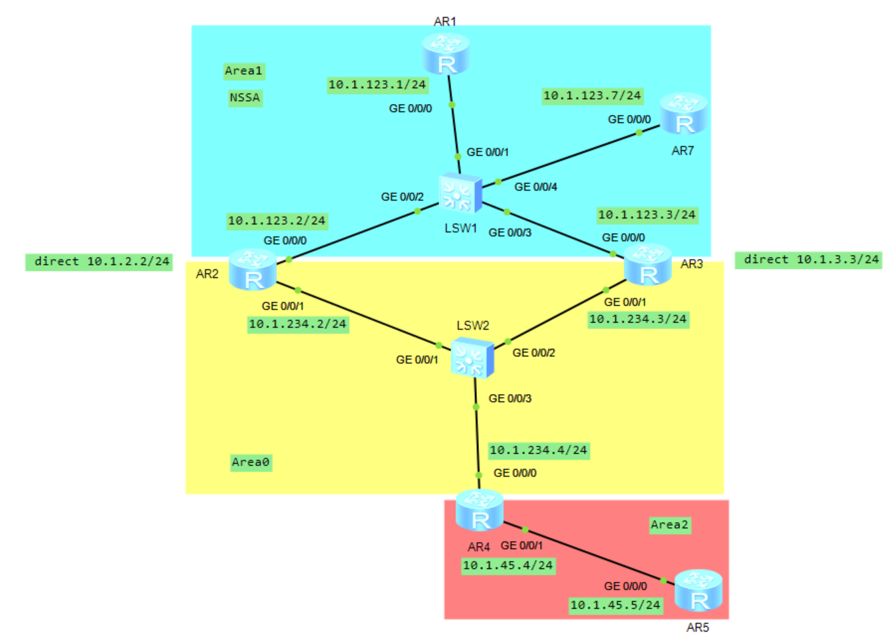
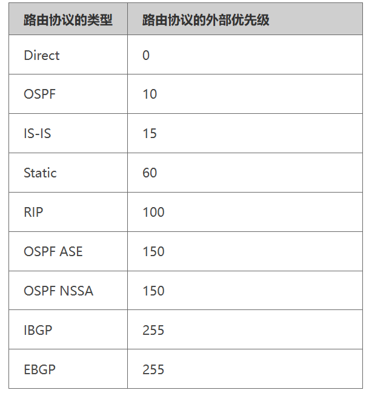
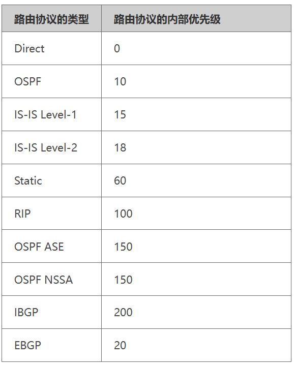
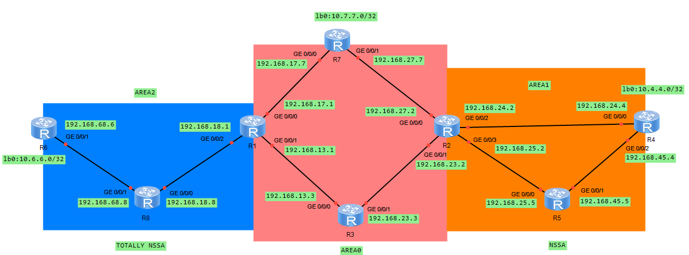

# OSPF 路由协议之默认路由

默认路由是指目的地址和掩码都是 0 的路由。当设备无精确匹配的路由时，就可以通过默认路由进行报文转发。一般多用于网络边界路由器访问互联网所需要的一条路由。如果出现内部路由器有默认路由指向边界路由器，而边界路由器也有条默认路由指向内部路由器，即默认路由互指，会出现环路。**<font color="red">所以 OSPF 中不允许产生默认路由的路由器也接收其他路由器产生的默认路由（非常重要）</font>**。我们以下面的拓扑图为例来分析 OSPF 中默认路由的产生和传播。

<div align="center">
    
</div>

## 1.骨干以及普通区域中的默认路由

### 1.1 规则

缺省情况下，在普通和骨干 OSPF 区域内的 OSPF 路由器是不会产生默认路由的，即使它有默认路由。这个时候要想产生默认路由必须在 ASBR/普通路由器上手动通过命令 **`default-route-advertise always`** 进行配置。使用了该命令后会**产生一个 Link State ID 为 `0.0.0.0`、网络掩码为 `0.0.0.0` 的 LSA5**，并且通告到整个 OSPF 域中。

```java{.numberLines}
// 将产生的默认路由的 LSA5 通告到 OSPF路由区域，本地设备没有默认路由 
<Huawei>system-view 
[Huawei] OSPF 1
[Huawei-OSPF-1]default-route-advertise always 
// 无条件产生一条默认路由
```

在骨干和普通区域中也存在 ASBR 路由器，注意 **`import-route`** (OSPF)命令不能引入外部路由的缺省路由。**<font color="red">当需要引入其他协议产生的缺省路由时，必须在 ASBR 上配置 `default-route-advertise` 命令，发布缺省路由到整个普通 OSPF 区域</font>**。

骨干和普通区域产生 LSA5 默认路由使用 **`default-route-advertise`** 命令，如果加 always 参数， 则无条件产生默认路由，如果没有加 always 参数，则是有条件的，仅当路由表里有条默认路由（**其他协议或外部默认路由**）才可以产生 LSA5 的默认路由。

ASBR 没有缺省路由，执行 **`default-route-advertise`** 命令时按照以下需求选择是否配置 always 参数：

- 如果配置 always 参数，无论 ASBR 是否有缺省路由都将在整个 OSPF 区域中通告缺省路由 **`0.0.0.0`**，**并且不再计算来自其他设备的缺省路由**。
- 如果没有配置 always 参数，ASBR 的路由表中必须有**激活的非 OSPF (BGP 除外) 缺省路由**时才生成缺省路由的 LSA。这就是前面一段话所说的**其它协议或外部默认路由**，如果 ASBR 路由表中的默认路由还是 OSPF 类型的，即使加了 always 参数，仍然无法产生默认路由。

路由器中不同类型的路由协议（OSPF、ISIS、BGP、静态、直连等）都有自己对应的路由表，但是路由器是根据全局路由表来转发 IP 数据包的，对于某一个目的 IP 地址，如果不同类型的路由协议均有对应的路由，还需要根据优先级、度量值等进行优选，最后被选中的路由才会被加入到全局路由表中。

因此，如果在某台 OSPF 设备上同时存在静态缺省路由和 OSPF 学到的缺省路由，最终哪条缺省路由加入全局路由表，取决于两条路由的协议优先级 preference。华为设备中 preference 数值越小优先级越高。若希望 OSPF 学到的缺省路由优先进入当前路由表，则静态缺省路由的 preference 必须配置得比该 OSPF 缺省路由更大，也就是静态缺省路由的优先级更低。

### 1.2 路由优先级

对于相同的目的地，不同的路由协议（包括静态路由）可能会发现不同的路由，但这些路由并不都是最优的。事实上，在某一时刻，到某一目的地的当前路由仅能由唯一的路由协议来决定。为了判断最优路由，各路由协议（包括静态路由）都被赋予了一个优先级，当存在多个路由信息源时，具有较高优先级（取值较小）的路由协议发现的路由将成为最优路由，并将最优路由放入本地路由表中。

路由器分别定义了外部优先级和内部优先级。外部优先级是指用户可以手工为各路由协议配置的优先级，缺省情况下如下所示。

<div align="center">
    <div align="center" style="color: #F14; font-size:13px; font-weight:bold">路由协议缺省时的外部优先级</div>
    
</div>

>除直连路由（DIRECT）外，各种路由协议的优先级都可由用户手工进行配置。另外，每条静态路由的优先级都可以不相同。

路由协议的内部优先级则不能被用户手工修改，如下所示：

<div align="center">
    <div align="center" style="color: #F14; font-size:13px; font-weight:bold">路由协议内部优先级</div>
    
</div>

**<font color="red">选择路由时先比较路由的外部优先级，当不同的路由协议配置了相同的优先级后，系统会通过内部优先级决定哪个路由协议发现的路由将成为最优路由</font>**。例如，到达同一目的地 **`10.1.1.0/24`** 有两条路由可供选择，一条静态路由，另一条是 OSPF 路由，且这两条路由的外部优先级都被配置成 5。这时路由器系统将根据上面所示的内部优先级进行判断。因为 OSPF 协议的内部优先级是 10，高于静态路由的内部优先级 60。所以系统选择 OSPF 协议发现的路由作为最优路由。

### 1.3 实验分析

Area2 是一个普通区域，AR5 上的 OSPF lsdb 如下所示，即在普通和骨干 OSPF 区域内的 OSPF 路由器是不会产生默认路由的。并且根据此时 AR5 产生的 Router LSA 可知，AR5 不是 ASBR，只是 Area2 中内部一个普通的路由器。

```java{.line-numbers}
<AR5>display ospf lsdb 

	 OSPF Process 1 with Router ID 5.5.5.5
		 Link State Database 

		         Area: 0.0.0.2
 Type      LinkState ID    AdvRouter          Age  Len   Sequence   Metric
 Router    4.4.4.4         4.4.4.4           1664  36    80000004       1
 Router    5.5.5.5         5.5.5.5           1653  36    80000004       1
 Network   10.1.45.5       5.5.5.5           1653  32    80000002       0
 Sum-Net   10.1.22.22      4.4.4.4           1659  28    80000001       1
 Sum-Net   10.1.123.0      4.4.4.4           1659  28    80000001       2
 Sum-Net   10.1.234.0      4.4.4.4           1703  28    80000001       1
 Sum-Asbr  3.3.3.3         4.4.4.4           1650  28    80000001       1
 Sum-Asbr  2.2.2.2         4.4.4.4           1659  28    80000001       1
 
		 AS External Database
 Type      LinkState ID    AdvRouter          Age  Len   Sequence   Metric
 External  10.1.2.0        2.2.2.2           1698  36    80000001       1
 External  10.1.3.0        3.3.3.3           1693  36    80000001      10
[AR5]display ospf routing 

	 OSPF Process 1 with Router ID 5.5.5.5
		  Routing Tables 

 Routing for Network 
 Destination        Cost  Type       NextHop         AdvRouter       Area
 10.1.45.0/24       1     Transit    10.1.45.5       5.5.5.5         0.0.0.2
 10.1.22.22/32      2     Inter-area 10.1.45.4       4.4.4.4         0.0.0.2
 10.1.123.0/24      3     Inter-area 10.1.45.4       4.4.4.4         0.0.0.2
 10.1.234.0/24      2     Inter-area 10.1.45.4       4.4.4.4         0.0.0.2

 Routing for ASEs
 Destination        Cost      Type       Tag         NextHop         AdvRouter
 10.1.2.0/24        1         Type2      1           10.1.45.4       2.2.2.2
 10.1.3.0/24        10        Type2      1           10.1.45.4       3.3.3.3

 Total Nets: 6  
 Intra Area: 1  Inter Area: 3  ASE: 2  NSSA: 0 
[AR5-ospf-1]display ospf lsdb router 5.5.5.5 self-originate 

	 OSPF Process 1 with Router ID 5.5.5.5
		         Area: 0.0.0.2
		 Link State Database 

  Type      : Router
  Ls id     : 5.5.5.5
  Adv rtr   : 5.5.5.5  
  Ls age    : 7 
  Len       : 36 
  Options   :  E  
  seq#      : 80000007 
  chksum    : 0x6743
  Link count: 1
   * Link ID: 10.1.45.5    
     Data   : 10.1.45.5    
     Link Type: TransNet     
     Metric : 1
```

如果没有配置 always 参数，ASBR 的路由表中必须有**激活的非 OSPF (BGP 除外) 缺省路由**时才生成缺省路由的 LSA。我们在配置好 **`default-route-advertise`** 命令后，AR5 的 lsdb 数据库如下所示，由于 AR5 的 OSPF 路由表中没有默认路由，因此 AR5 不会产生默认路由的 LSA5 泛洪到整个 OSPF 域中。

```java{.line-numbers}
[AR5-ospf-1]default-route-advertise 
[AR5-ospf-1]display ospf lsdb 
	 OSPF Process 1 with Router ID 5.5.5.5
		 Link State Database  
		 AS External Database
 Type      LinkState ID    AdvRouter          Age  Len   Sequence   Metric
 External  10.1.2.0        2.2.2.2            528  36    80000002       1
 External  10.1.3.0        3.3.3.3            523  36    80000002      10
```

但是在 AR5 上配置了 **`default-route-advertise always`** 命令后，AR5 的 lsdb 数据库如下所示，**<font color="red">可以看出 AR5 产生了一条 LSA5 的默认路由，并且泛洪到整个 OSPF 域中。此时 AR5 变为了 ASBR，并且在 Router LSA 中也有了 ASBR 的标志</font>**。

```java{.line-numbers}
[AR5-ospf-1]display ospf lsdb 
	 OSPF Process 1 with Router ID 5.5.5.5
		 Link State Database 
		 AS External Database
 Type      LinkState ID    AdvRouter          Age  Len   Sequence   Metric
 External  0.0.0.0         5.5.5.5              6  36    80000001       1
 External  10.1.2.0        2.2.2.2            552  36    80000002       1
 External  10.1.3.0        3.3.3.3            547  36    80000002      10
[AR5-ospf-1]display ospf lsdb router 5.5.5.5 self-originate 

	 OSPF Process 1 with Router ID 5.5.5.5
		         Area: 0.0.0.2
		 Link State Database 

  Type      : Router
  Ls id     : 5.5.5.5
  Adv rtr   : 5.5.5.5  
  Ls age    : 95 
  Len       : 36 
  Options   :  ASBR  E  
  seq#      : 80000008 
  chksum    : 0x6b3c
  Link count: 1
   * Link ID: 10.1.45.5    
     Data   : 10.1.45.5    
     Link Type: TransNet     
     Metric : 1
```

但是，AR5 自己的 OSPF 路由表中不会出现由自己产生的这条 **`0.0.0.0/0`** 外部路由。原因是 RFC 2328 的 AS-external route 计算规则规定：如果某条 AS-external LSA 是计算路由的路由器自己产生的，则计算时跳过该 LSA。并且，AR5 产生默认 LSA 是为了让其他 OSPF 路由器学习默认路由，不是为了让 AR5 自己通过 OSPF 学到默认路由。但是 AR4 收到 LSA5 的默认路由之后，就将此默认路由添加到 OSPF 路由表中。

```java{.line-numbers}
[AR5-ospf-1]display ospf routing 
	 OSPF Process 1 with Router ID 5.5.5.5
		  Routing Tables 

 Routing for Network 
 Destination        Cost  Type       NextHop         AdvRouter       Area
 10.1.45.0/24       1     Transit    10.1.45.5       5.5.5.5         0.0.0.2
 10.1.22.22/32      2     Inter-area 10.1.45.4       4.4.4.4         0.0.0.2
 10.1.123.0/24      3     Inter-area 10.1.45.4       4.4.4.4         0.0.0.2
 10.1.234.0/24      2     Inter-area 10.1.45.4       4.4.4.4         0.0.0.2

 Routing for ASEs
 Destination        Cost      Type       Tag         NextHop         AdvRouter
 10.1.2.0/24        1         Type2      1           10.1.45.4       2.2.2.2
 10.1.3.0/24        10        Type2      1           10.1.45.4       3.3.3.3

 Total Nets: 6  
 Intra Area: 1  Inter Area: 3  ASE: 2  NSSA: 0 
<AR4>display ospf routing 

	 OSPF Process 1 with Router ID 4.4.4.4
		  Routing Tables 

 Routing for Network 
 Destination        Cost  Type       NextHop         AdvRouter       Area
 10.1.45.0/24       1     Transit    10.1.45.4       4.4.4.4         0.0.0.2
 10.1.234.0/24      1     Transit    10.1.234.4      4.4.4.4         0.0.0.0
 10.1.22.22/32      1     Inter-area 10.1.234.2      2.2.2.2         0.0.0.0
 10.1.123.0/24      2     Inter-area 10.1.234.2      2.2.2.2         0.0.0.0
 10.1.123.0/24      2     Inter-area 10.1.234.3      3.3.3.3         0.0.0.0

 Routing for ASEs
 Destination        Cost      Type       Tag         NextHop         AdvRouter
 0.0.0.0/0          1         Type2      1           10.1.45.5       5.5.5.5
 10.1.2.0/24        1         Type2      1           10.1.234.2      2.2.2.2
 10.1.3.0/24        10        Type2      1           10.1.234.3      3.3.3.3

 Total Nets: 8  
 Intra Area: 2  Inter Area: 3  ASE: 3  NSSA: 0 
```

## 2.Stub 区域的默认路由

由于 Stub 区域不允许外部 LSA4、LSA5 在其内部泛洪，所以该区域内的路由器除了 ABR 外没有自治系统外部路由，如果它们想到自治系统外部时应该怎么办？在 Stub 区域里的路由器将本区域内 ABR 作为出口，**<font color="red">ABR 会自动产生 LSA3 型的缺省路由 `0.0.0.0/0` 通告给整个 Stub 区域内的路由器</font>**，这样的话到达自治系统外部的路由可以通过 ABR 到达。配置了 Stub 区域之后，ABR 自动会产生一条 Link ID 为 **`0.0.0.0/0`** 的 SUMMARY LSA(3类)，并且通告到整个 Stub 区域内。

## 3.Totally Stub 区域的默认路由

Totally Stub 区域不仅不允许外部 LSA4、LSA5 在其内部泛洪，连区域间的 LSA3 路由也不允许携带，所以在 Totally Stub 区域里的路由器要想到别的区域或自治系统外部时应该怎么办呢？同样的，在 Totally Stub 区域里的路由器也将本区域内 ABR 作为出口，**<font color="red">ABR 会自动产生 LSA3 型缺省路由 `0.0.0.0/0` 通告给整个 Totally Stub 区域内的路由器</font>**，这样的话到达本区域外部的路由都通过 ABR 到达就可以了。配置了完全 Stub 区域之后，ABR 自动会产生一条 Link ID 为 **`0.0.0.0/0`** 的 SUMMARY LSA (3类)，并且通告到整个 Totally Stub 区域内。

## 4.NSSA/Totally NSSA 区域的默认路由

### 4.1 规则

NSSA 区域允许少量外部路由通过本区域的 ASBR 通告进来，它不允许携带其他区域的 LSA4、LSA5 外部路由。在华为的数通设备上，**NSSA 区域的 ABR 路由器会自动产生一条 LSA7 类型的默认路由泛洪给整个 NSSA 区域**。这样的话除了某少部分路由通过 NSSA 的 ASBR 到达，其它都可以通过 NSSA ABR 到达其它区域的 ASBR 出去。

如果想在 NSSA 区域中除了 ABR 之外的其它路由器（包括 ASBR）上产生缺省路由 **`0.0.0.0/0`**，可以在路由器上手动配置：

```java
[Router-ospf-1-area-0.0.0.1]nssa default-route-advertise（NSSA区域视图）
```

与 NSSA ABR 不同的是，**<font color="red">NSSA ASBR 或者其它路由器必须是在自身已经有一条其它协议的缺省路由情况下才会产生一条 Link ID 为 `0.0.0.0/0` 的 NSSA LSA（7类）</font>**，在 NSSA 区域内泛洪缺省路由 **`0.0.0.0/0`**。而 NSSA ABR 是无论路由表中是否存在默认路由 **`0.0.0.0/0`**，都会产生 LSA7 默认路由。

NSSA 区域产生默认路由，因为 LSA7 默认路由只在 NSSA 区域内泛洪，并没有泛洪到整个 OSPF 域中， 所以本 NSSA 区域内的路由器在找不到明细路由之后可以按默认路由离开本区域。**LSA7 默认路由不会在 ABR 上转换成 LSA5 默认路由**。

Totally NSSA 区域和 NSSA 区域不同的是，它不允许携带区域间路由 LSA3，如果要到其他区域的时候应该怎么办呢？同样的，缺省路由又出场了，**<font color="red">在该区域 ABR 上会自动产生两条缺省路由 LSA7 和 LSA3</font>**，通告给整个 Totally NSSA 区域，所有的域间路由都将 NSSA ABR 作为出口。同理，也可以在 Totally NSSA 区域中除了 ABR 的其它路由器（包括 ASBR）上配置发布默认路由，命令如下所示：

```java
[Router-ospf-1-area-0.0.0.1]nssa default-route-advertise（NSSA 区域视图）
```

与 NSSA 区域一样，其它路由器在发布默认路由的时候，自己的路由表中也必须存在其它协议的默认路由。而 NSSA ABR 则无论路由表中是否存在默认路由 **`0.0.0.0/0`**，都会产生 LSA7 与 LSA3 默认路由。

### 4.2 实验分析

在上述拓扑图中，Area1 是 NSSA 区域，AR7 是 NSSA 区域中的普通路由器，并且 AR7 的 OSPF LSDB 中只有 AR2 和 AR3 这 2 个 NSSA ABR 路由器产生的 LSA7 类型的默认路由，AR7 的 OSPF LSDB 如下所示，并且此时 AR7 的 Router LSA 中没有 ASBR 的标志，说明 AR7 不是 ASBR。

```java{.line-numbers}
[AR7-ospf-1]display ospf lsdb 

	 OSPF Process 1 with Router ID 7.7.7.7
		 Link State Database 
		         Area: 0.0.0.1
 Type      LinkState ID    AdvRouter          Age  Len   Sequence   Metric
 NSSA      0.0.0.0         3.3.3.3           1377  36    80000003       1
 NSSA      0.0.0.0         2.2.2.2           1386  36    80000003       1
 NSSA      10.1.2.0        2.2.2.2           1386  36    80000004       1
 NSSA      10.1.3.0        3.3.3.3           1377  36    80000005      10
[AR7-ospf-1]display ospf lsdb router 7.7.7.7 self-originate 
	 OSPF Process 1 with Router ID 7.7.7.7
		         Area: 0.0.0.1
		 Link State Database 
  Type      : Router
  Ls id     : 7.7.7.7
  Adv rtr   : 7.7.7.7  
  Ls age    : 489 
  Len       : 36 
  Options   : None 
  seq#      : 8000000b 
  chksum    : 0x936a
  Link count: 1
   * Link ID: 10.1.123.1   
     Data   : 10.1.123.7   
     Link Type: TransNet     
     Metric : 1
```

接下来在 AR7 上配置 **`nssa default-route-advertise`** 命令后，AR7 的 OSPF LSDB 如下所示，**<font color="red">可以看出 AR7 没有产生 LSA7 类型的默认路由，因为此时 AR7 的路由表中没有其他协议的默认路由，只有 AR2 和 AR3 产生的 LSA7 默认路由</font>**。这是因为 AR7 当时虽然通过 OSPF NSSA 学到了 AR2、AR3 发布的 Type-7 默认 LSA，但这类 OSPF 学到的默认路由不作为本机再次发布 Type-7 默认 LSA 的触发来源。只有当 AR7 本地存在其他非 OSPF 默认路由时，才满足该设备上 **`nssa default-route-advertise`** 的默认发布条件。不过 AR7 的 Router LSA 中有了 ASBR 的标志，说明 AR7 变为了 ASBR。

```java{.line-numbers}
[AR7-ospf-1-area-0.0.0.1]nssa default-route-advertise 
[AR7-ospf-1-area-0.0.0.1]display ospf lsdb 

	 OSPF Process 1 with Router ID 7.7.7.7
		 Link State Database 
		         Area: 0.0.0.1
 Type      LinkState ID    AdvRouter          Age  Len   Sequence   Metric
 NSSA      0.0.0.0         3.3.3.3           1521  36    80000003       1
 NSSA      0.0.0.0         2.2.2.2           1530  36    80000003       1
 NSSA      10.1.2.0        2.2.2.2           1530  36    80000004       1
 NSSA      10.1.3.0        3.3.3.3           1521  36    80000005      10
		         Area: 0.0.0.2
[AR7-ospf-1-area-0.0.0.1]display ospf lsdb router 7.7.7.7 self-originate
	 OSPF Process 1 with Router ID 7.7.7.7
		         Area: 0.0.0.1
		 Link State Database 
  Type      : Router
  Ls id     : 7.7.7.7
  Adv rtr   : 7.7.7.7  
  Ls age    : 10 
  Len       : 36 
  Options   :  ASBR  
  seq#      : 8000000c 
  chksum    : 0x9763
  Link count: 1
   * Link ID: 10.1.123.1   
     Data   : 10.1.123.7   
     Link Type: TransNet     
     Metric : 1
		         Area: 0.0.0.2
		 Link State Database 
[AR7-ospf-1-area-0.0.0.1]display ospf routing 

	 OSPF Process 1 with Router ID 7.7.7.7
		  Routing Tables 

 Routing for NSSAs
 Destination        Cost      Type       Tag         NextHop         AdvRouter
 0.0.0.0/0          1         Type2      1           10.1.123.3      3.3.3.3
 0.0.0.0/0          1         Type2      1           10.1.123.2      2.2.2.2
 10.1.2.0/24        1         Type2      1           10.1.123.2      2.2.2.2
 10.1.3.0/24        10        Type2      1           10.1.123.3      3.3.3.3

 Total Nets: 10 
 Intra Area: 2  Inter Area: 4  ASE: 0  NSSA: 4 
[AR7-ospf-1-area-0.0.0.1]display ip routing-table 
Route Flags: R - relay, D - download to fib
Routing Tables: Public
         Destinations : 13       Routes : 16       

Destination/Mask    Proto   Pre  Cost      Flags NextHop         Interface

        0.0.0.0/0   O_NSSA  150  1           D   10.1.123.3      GigabitEthernet0/0/0
                    O_NSSA  150  1           D   10.1.123.2      GigabitEthernet0/0/0
```

接下来，在 AR7 上配置一条静态默认路由，此时 AR7 的 OSPF LSDB 如下所示，**<font color="red">可以看出 AR7 产生了一条 LSA7 类型的默认路由，并且泛洪到整个 NSSA 区域中</font>**。不过，此时 AR7 的 OSPF 路由表中没有任何默认路由，这是因为如果 OSPF 路由器已经发布了默认路由 LSA，**那么不再学习其他路由器发布的相同类型默认路由。即路由计算时不再计算其他路由器发布的相同类型的默认路由 LSA**，但数据库 LSDB 中存有对应的 LSA。因此 AR7 不再学习 AR2 和 AR3 产生的 LSA7 默认路由了，OSPF 路由表也就没有默认路由了。但是在 AR7 上的静态默认路由被添加到全局路由表中。

```java{.line-numbers}
[AR7]ip route-static 0.0.0.0 0.0.0.0 NULL0
[AR7]display ospf lsdb 
	 OSPF Process 1 with Router ID 7.7.7.7
		 Link State Database 
		         Area: 0.0.0.1
 Type      LinkState ID    AdvRouter          Age  Len   Sequence   Metric
 NSSA      0.0.0.0         7.7.7.7              4  36    80000001       1
 NSSA      0.0.0.0         3.3.3.3            148  36    80000001       1
 NSSA      0.0.0.0         2.2.2.2            148  36    80000001       1
 NSSA      10.1.2.0        2.2.2.2            148  36    80000002       1
 NSSA      10.1.3.0        3.3.3.3            148  36    80000003      10
<AR7>display ospf routing 

	 OSPF Process 1 with Router ID 7.7.7.7
		  Routing Tables 

 Routing for Network 
 Destination        Cost  Type       NextHop         AdvRouter       Area
 10.1.123.0/24      1     Transit    10.1.123.7      7.7.7.7         0.0.0.1
 10.1.22.22/32      1     Stub       10.1.123.2      2.2.2.2         0.0.0.1
 10.1.45.0/24       3     Inter-area 10.1.123.3      3.3.3.3         0.0.0.1
 10.1.45.0/24       3     Inter-area 10.1.123.2      2.2.2.2         0.0.0.1
 10.1.234.0/24      2     Inter-area 10.1.123.3      3.3.3.3         0.0.0.1
 10.1.234.0/24      2     Inter-area 10.1.123.2      2.2.2.2         0.0.0.1

 Routing for NSSAs
 Destination        Cost      Type       Tag         NextHop         AdvRouter
 10.1.2.0/24        1         Type2      1           10.1.123.2      2.2.2.2
 10.1.3.0/24        10        Type2      1           10.1.123.3      3.3.3.3

 Total Nets: 8  
 Intra Area: 2  Inter Area: 4  ASE: 0  NSSA: 2 
<AR7>display ip routing-table 
Route Flags: R - relay, D - download to fib
------------------------------------------------------------------------------
Routing Tables: Public
         Destinations : 13       Routes : 15       
Destination/Mask    Proto   Pre  Cost      Flags NextHop         Interface
        0.0.0.0/0   Static  60   0           D   0.0.0.0         NULL0
```

同时，AR7 产生的 LSA7 类型的默认路由的 P-bit 为 0，并且 FA 也是 0，根据 RFC 3101 文档，If the Type-7 LSA has the P-bit clear, or its forwarding address is set to 0.0.0.0, then do nothing with this Type-7 LSA and consider the next one in the list. Otherwise term the LSA as translatable and proceed with step. 因此 AR7 产生的 LSA7 类型的默认路由不会被 ABR 翻译成 LSA5 类型的默认路由，而且 NSSA border router，也就是 NSSA ABR，自己产生的 Type-7 默认路由也永远不会被翻译成 Type-5 默认路由。

总结就是，**<font color="red">LSA7 类型的默认路由只在 NSSA 区域内泛洪，不会在 ABR 上转换成 LSA5 类型的默认路由</font>**。

```java{.line-numbers}
<AR7>display ospf lsdb nssa self-originate 
	 OSPF Process 1 with Router ID 7.7.7.7
		         Area: 0.0.0.2
		 Link State Database 
  Type      : NSSA
  Ls id     : 0.0.0.0
  Adv rtr   : 7.7.7.7  
  Ls age    : 1215 
  Len       : 36 
  Options   : None 
  seq#      : 80000001 
  chksum    : 0x2e86
  Net mask  : 0.0.0.0 
  TOS 0  Metric: 1 
  E type    : 2
  Forwarding Address : 0.0.0.0 
  Tag       : 1 
  Priority  : Low
```

## 5.默认路由总结

OSPF 中默认路由的种类有三种：LSA 3 的默认路由、LSA 5 及 LSA 7 的默认路由。

(1) 由区域边界路由器 (ABR) 产生 LSA3 默认路由，用来指导区域内设备进行区域之间报文的转发。这是自动产生的默认路由，由特定的区域设置而触发产生。Stub/totally Stub 及 Totally NSSA 类型区域内都会存在由 ABR 产生的 LSA3 的默认路由，默认 Cost=1。**区域类型为 `stub no-summary` 或 `nssa no-summary` 会触发产生 LSA3 默认路由**。

```java
# 将区域 1 设置成 Sub 区域，使发送到该 Stub 区域的 Type3 默认路由的开销为 20
<Huawei>system-view 
[Huawei]OSPF 1
[Huawei-OSPF-1]Area 1
[Huawei-OSPF-1-Area-0.0.0.1]Stub
[Huawei-OSPF-1-Area-0.0.0.1]default-cost 20
# 修改缺省开销 1 为 20
```

(2) ASBR 能引入外部路由，ASBR 同样也能产生默认路由，类型为 LSA5 或 LSA7。**普通或骨干区域产生 LSA5 外部默认路由，而 NSSA 区域产生 LSA7 外部默认 NSSA 路由**，用来指导自治系统 (AS) 内设备进行自治系统外报文的转发。

OSPF 默认路由的发布原则如下：

- 如果 OSPF 路由器已经发布了默认路由 LSA，**<font color="red">那么不再学习其他路由器发布的相同类型默认路由。即路由计算时不再计算其他路由器发布的相同类型的默认路由 LSA</font>**，但数据库 LSDB 中存有对应的 LSA。
- 如果一台路由器同时收到多种类型默认路由，则根据选路规则，Type3 默认路由的优先级高于 Type5 或 Type7 路由。
- OSPF 路由器只具有对区域外的出口时，才能够发布默认路由 LSA。

第一点是最重要的，比如 NSSA ABR 自动发布了一条 LSA7 类型的默认路由，如果再手动配置，在 NSSA ASBR 上泛洪 LSA7 类型的默认路由，那么 ABR 不会使用和学习此 LSA7 类型路由（不会添加到 OSPF 路由表中），但是会保存到链路数据库中。

(3) 骨干及普通区域中的默认路由。缺省情况下，在普通 OSPF 区域内的 OSPF 路由器是不会产生默认路由的，即使它有默认路由。这个时候要想产生默认路由必须在 ASBR 上手动通过命令进行配置。使用了该命令后会产生一个 Link State ID 为 **`0.0.0.0/0`** 的 LSA5，**并且通告到整个 OSPF 域中**。

(4) NSSA 区域中的默认路由。**`NSSA default-route-advertise`** 用来在 ASBR 上配置产生 LSA7 默认路由到 NSSA 区域。华为实现在 NSSA 及 Totally NSSA 边界路由器 ABR 上自动产生 LSA7 默认路由。ABR 既然能产生 LSA7 默认路由，所以 NSSA 区域的 ABR 同时也是 ASBR。

- 在 ABR 上无论路由表中是否存在默认路由 **`0.0.0.0/0`**，都会产生 LSA7 默认路由。
- 在 ASBR 上只有当路由表中存在默认路由 **`0.0.0.0/0`**，才会产生 Type7 LSA 默认路由。

如果希望到达自治系统外部网络是通过本区域的 ASBR 出去，而访问其他外部网络则是通过骨干区域出去。此时，可在 ABR 上产生一条 LSA7 的默认路由，通告到 NSSA 区域内。**<font color="red">这样，访问明细路由所对应的外部网络通过 NSSA ASBR，而其他路由都可通过 NSSA ABR 产生的 LSA7 类型默认路由到达其他区域的 ASBR 出去</font>**。LSA7 默认路由不会在 ABR 上转换成 LSA5 默认路由。

## 6.默认路由综合实验

<div align="center">
    
</div>

### 6.1.Totally NSSA 区域

在上面这个拓扑图中，area0 为骨干区域，R1 和 R2 为 ABR，R7 为 ASBR；area2 被配置为 Totally NSSA 区域，R6 为 ASBR；area1 为 NSSA 区域，R4 为 ASBR。对于 area2，R1 会产生 LSA7 和 LSA3 这两种类型的默认路由泛洪到 area2 中。我们可以通过查看 R1 和 R6 的 lsdb 数据库，均有 Sum-Net（3 类 LSA）和 NSSA（7 类 LSA）两种类型的默认路由在 area2 中泛洪。

```java{.line-numbers}
[AR6-ospf-1-area-0.0.0.2]display ospf lsdb 
	 OSPF Process 1 with Router ID 6.6.6.6
		 Link State Database 
		         Area: 0.0.0.2
 Type      LinkState ID    AdvRouter          Age  Len   Sequence   Metric
 Router    6.6.6.6         6.6.6.6             14  36    80000005       1
 Router    1.1.1.1         1.1.1.1            370  36    80000003       1
 Router    8.8.8.8         8.8.8.8             12  48    8000000D       1
 Network   192.168.18.8    8.8.8.8            369  32    80000001       0
 Network   192.168.68.8    8.8.8.8             12  32    80000002       0
 Sum-Net   0.0.0.0         1.1.1.1            374  28    80000001       1
 NSSA      0.0.0.0         1.1.1.1            374  36    80000001       1
[AR1]display ospf lsdb 
	 OSPF Process 1 with Router ID 1.1.1.1
		 Link State Database  
		         Area: 0.0.0.2
 Type      LinkState ID    AdvRouter          Age  Len   Sequence   Metric
 Router    6.6.6.6         6.6.6.6             71  36    80000005       1
 Router    1.1.1.1         1.1.1.1            424  36    80000003       1
 Router    8.8.8.8         8.8.8.8             68  48    8000000D       1
 Network   192.168.18.8    8.8.8.8            425  32    80000001       0
 Network   192.168.68.8    8.8.8.8             68  32    80000002       0
 Sum-Net   0.0.0.0         1.1.1.1            428  28    80000001       1
 NSSA      0.0.0.0         1.1.1.1            428  36    80000001       1
```

但是对于 LSA3 和 LSA7 类型的默认路由，不管是 R6 还是 R8 都选择将 LSA3 通告的默认路由添加到 OSPF 的路由表中，最终添加到全局路由表中。R6 的 OSPF 路由表和全局路由表如下。这是因为 **<font color="red">如果一台路由器同时收到多种类型默认路由，则根据选路规则，Type3 默认路由的优先级高于 Type5 或 Type7 路由</font>**。这个优先级差异是因为根据 RFC 2328，同一目的前缀下，OSPF 内部/区域间路由优于外部路由，同时华为设备中 OSPF 内部路由，包括 Type-1/2/3，默认 preference 是 10；OSPF ASE/NSSA 外部路由默认 preference 是 150。

```java{.line-numbers}
[AR6-ospf-1-area-0.0.0.2]display ospf routing 

	 OSPF Process 1 with Router ID 6.6.6.6
		  Routing Tables 

 Routing for Network 
 Destination        Cost  Type       NextHop         AdvRouter       Area
 192.168.68.0/24    1     Transit    192.168.68.6    6.6.6.6         0.0.0.2
 0.0.0.0/0          3     Inter-area 192.168.68.8    1.1.1.1         0.0.0.2
 192.168.18.0/24    2     Transit    192.168.68.8    8.8.8.8         0.0.0.2

 Total Nets: 3  
 Intra Area: 2  Inter Area: 1  ASE: 0  NSSA: 0 
[AR6-ospf-1-area-0.0.0.2]display ip routing-table 
Route Flags: R - relay, D - download to fib
------------------------------------------------------------------------------
Routing Tables: Public
         Destinations : 10       Routes : 10       
Destination/Mask    Proto   Pre  Cost      Flags NextHop         Interface
        0.0.0.0/0   OSPF    10   3           D   192.168.68.8    GigabitEthernet0/0/1
```

从上面可以看出，**<font color="red">OSPF 路由表中优选了 LSA3 型作为路由（Type 为 Inter-area）</font>**。而在全局路由表中，由于只有 OSPF 协议通告了默认路由，因此就将此 OSPF 默认路由添加到全局路由表中。从优先级可以看出，全局路由表中的路由为 LSA3 类型的，Pre=10。这是因为 OSPF 内部路由的优先级（LSA1、LSA2、LSA3）就为 10，而 OSPF ASE（LSA5）和 OSPF NSSA（LSA7）优先级为 150。

但是 R1 的 OSPF 路由表和全局路由表有一些不同，根据 RFC 2328 的文档，when calculating the inter-area routes, If the LSA was originated by the calculating router itself, examine the next LSA. when Calculating AS external routes, If the LSA was originated by the calculating router itself, examine the next LSA. 也就是在计算区域间路由和外部路由的时候，如果 LSA 是由计算路由器自己产生的，那么就不再使用此 LSA 计算路由。

因此 R1 的 lsdb 中存在这两个 LSA，但是不会使用 LSA3 和 LSA7 来计算默认路由并保存到 OSPF 路由表中。因此 R1 的 OSPF 路由表中没有默认路由，而 R1 上其它协议的路由表（静态、直连以及 RIP 等）中也没有默认路由，故全局路由表中也没有默认路由。

```java{.line-numbers}
<AR1>display ospf routing 
	 OSPF Process 1 with Router ID 1.1.1.1
		  Routing Tables 
 Routing for Network 
 Destination        Cost  Type       NextHop         AdvRouter       Area
 192.168.13.0/24    1     Transit    192.168.13.1    1.1.1.1         0.0.0.0
 192.168.17.0/24    1     Transit    192.168.17.1    1.1.1.1         0.0.0.0
 192.168.18.0/24    1     Transit    192.168.18.1    1.1.1.1         0.0.0.2
 192.168.23.0/24    2     Transit    192.168.13.3    3.3.3.3         0.0.0.0
 192.168.24.0/24    3     Inter-area 192.168.13.3    2.2.2.2         0.0.0.0
 192.168.24.0/24    3     Inter-area 192.168.17.7    2.2.2.2         0.0.0.0
 192.168.25.0/24    3     Inter-area 192.168.13.3    2.2.2.2         0.0.0.0
 192.168.25.0/24    3     Inter-area 192.168.17.7    2.2.2.2         0.0.0.0
 192.168.27.0/24    2     Transit    192.168.17.7    7.7.7.7         0.0.0.0
 192.168.45.0/24    4     Inter-area 192.168.13.3    2.2.2.2         0.0.0.0
 192.168.45.0/24    4     Inter-area 192.168.17.7    2.2.2.2         0.0.0.0
 192.168.68.0/24    2     Transit    192.168.18.8    8.8.8.8         0.0.0.2

 Total Nets: 12 
 Intra Area: 6  Inter Area: 6  ASE: 0  NSSA: 0 
<AR1>display ip routing-table 
Route Flags: R - relay, D - download to fib
------------------------------------------------------------------------------
Routing Tables: Public
         Destinations : 19       Routes : 22       
Destination/Mask    Proto   Pre  Cost      Flags NextHop         Interface
      127.0.0.0/8   Direct  0    0           D   127.0.0.1       InLoopBack0
      127.0.0.1/32  Direct  0    0           D   127.0.0.1       InLoopBack0
127.255.255.255/32  Direct  0    0           D   127.0.0.1       InLoopBack0
   192.168.13.0/24  Direct  0    0           D   192.168.13.1    GigabitEthernet0/0/1
// 省略.....
```

接下来，我们在 R6 上配置一条静态默认路由，并且将路由的优先级设置为 9（静态路由的优先级默认为 60）。如果不设置优先级的话，此条静态路由的优先级由于低于 OSPF 内部路由，不会被保存到全局路由表中，全局路由表中仍然是 OSPF 默认路由。**<font color="red">而 NSSA ASBR 或者其它路由器必须是在自身已经有一条其它协议的缺省路由情况下才会产生一条 Link ID 为 `0.0.0.0/0` 的 NSSA LSA（7类）</font>**，在 NSSA 区域内泛洪缺省路由 **`0.0.0.0/0`**。因此如果优先级使用静态路由的默认优先级，那么仍然无法产生默认路由，如下所示。

```java
[AR6]ip route-static 0.0.0.0 0 NULL0
[AR6]ospf 1 
[AR6-ospf-1]area 2
[AR6-ospf-1-area-0.0.0.2]nssa default-route-advertise 
[AR6-ospf-1-area-0.0.0.2]display ospf lsdb 
	 OSPF Process 1 with Router ID 6.6.6.6
		 Link State Database 
		         Area: 0.0.0.2
 Type      LinkState ID    AdvRouter          Age  Len   Sequence   Metric
 Sum-Net   0.0.0.0         1.1.1.1           1421  28    80000002       1
 NSSA      0.0.0.0         1.1.1.1           1421  36    80000002       1
```

将静态默认路由的优先级修改为 9，然后使用 **`nssa default-route-advertise`** 让 R6 产生一个 LSA7 泛洪到整个区域中，因此 R6 产生了 LSA7 类型的默认路由，因此 R6 不再使用 R1 产生的 LSA7 来计算默认路由，但是会接受 LSA3 类型的默认路由添加进行 OSPF 路由表中，如下所示：

```java{.line-numbers}
[AR6]ip route-static 0.0.0.0 0.0.0.0 NULL0 preference 9
[AR6]display ospf lsdb 
	 OSPF Process 1 with Router ID 6.6.6.6
		 Link State Database 
		         Area: 0.0.0.2
 Type      LinkState ID    AdvRouter          Age  Len   Sequence   Metric
 Sum-Net   0.0.0.0         1.1.1.1           1649  28    80000002       1
 NSSA      0.0.0.0         6.6.6.6              4  36    80000001       1
 NSSA      0.0.0.0         1.1.1.1           1649  36    80000002       1
[AR6]display ospf routing 

	 OSPF Process 1 with Router ID 6.6.6.6
		  Routing Tables 

 Routing for Network 
 Destination        Cost  Type       NextHop         AdvRouter       Area
 192.168.68.0/24    1     Transit    192.168.68.6    6.6.6.6         0.0.0.2
 0.0.0.0/0          3     Inter-area 192.168.68.8    1.1.1.1         0.0.0.2
 192.168.18.0/24    2     Transit    192.168.68.8    8.8.8.8         0.0.0.2

 Total Nets: 3  
 Intra Area: 2  Inter Area: 1  ASE: 0  NSSA: 0 
```

而我们添加到 AR6 的静态路由优先级为 9，高于 OSPF 中默认路由的优先级，因此全局路由表优选静态默认路由，如下所示：

```java{.line-numbers}
[AR6]display ip routing-table 
Route Flags: R - relay, D - download to fib
------------------------------------------------------------------------------
Routing Tables: Public
         Destinations : 10       Routes : 10       
Destination/Mask    Proto   Pre  Cost      Flags NextHop         Interface
        0.0.0.0/0   Static  9    0           D   0.0.0.0         NULL0
       10.6.6.0/32  Direct  0    0           D   127.0.0.1       LoopBack0
      127.0.0.0/8   Direct  0    0           D   127.0.0.1       InLoopBack0
      127.0.0.1/32  Direct  0    0           D   127.0.0.1       InLoopBack0
127.255.255.255/32  Direct  0    0           D   127.0.0.1       InLoopBack0
```

由于 AR1 泛洪了 LSA3 和 LSA7 类型的路由，因此不再使用 AR6 泛洪的 LSA7 来计算路由，同时 AR1 自己计算路由时不会使用自己产生的这些默认 LSA3。因此 AR1 的 OSPF 路由表中不会因为这些 LSA 出现 **`0.0.0.0/0`**。**<font color="red">另外，如果 AR1 本机没有其他协议、静态路由或其他 OSPF 邻居提供的可用默认路由，则全局路由表中也不会有默认路由</font>**。

### 6.2.NSSA 区域

当我们将 area1 配置为 NSSA 区域时，R2 会默认发布 LSA7 类型（NSSA）的默认路由泛洪到 area1 中。R2 和 R4 的 lsdb 分别如下所示：

```java{.line-numbers}
[AR2]display ospf lsdb 
	 OSPF Process 1 with Router ID 2.2.2.2
		 Link State Database 
		         Area: 0.0.0.1
 Type      LinkState ID    AdvRouter          Age  Len   Sequence   Metric
 Router    4.4.4.4         4.4.4.4             10  48    80000004       1
 Router    2.2.2.2         2.2.2.2              4  48    8000000E       1
 Router    5.5.5.5         5.5.5.5              6  48    8000000F       1
 Network   192.168.24.2    2.2.2.2              4  32    80000002       0
 Network   192.168.25.5    5.5.5.5            376  32    80000004       0
 Network   192.168.45.5    5.5.5.5              6  32    80000002       0
 NSSA      0.0.0.0         2.2.2.2            374  36    80000003       1
[AR4-ospf-1]display  ospf lsdb 
	 OSPF Process 1 with Router ID 4.4.4.4
		 Link State Database 
		         Area: 0.0.0.1
 Type      LinkState ID    AdvRouter          Age  Len   Sequence   Metric
 Router    4.4.4.4         4.4.4.4             25  48    80000004       1
 Router    2.2.2.2         2.2.2.2             22  48    8000000E       1
 Router    5.5.5.5         5.5.5.5             23  48    8000000F       1
 NSSA      0.0.0.0         2.2.2.2            390  36    80000003       1
```

和 Totally NSSA 的边界路由器 R1 类似的原因，即在计算区域间路由和外部路由的时候，如果 LSA 是由计算路由器自己产生的，那么就不再使用此 LSA 计算路由，AR2 的 OSPF 路由表中也没有默认路由，故而全局路由表中也没有默认路由。如下所示：

```java{.line-numbers}
[AR2]display ospf routing 
	 OSPF Process 1 with Router ID 2.2.2.2
		  Routing Tables 
 Routing for Network 
 Destination        Cost  Type       NextHop         AdvRouter       Area
 192.168.23.0/24    1     Transit    192.168.23.2    2.2.2.2         0.0.0.0
 192.168.24.0/24    1     Transit    192.168.24.2    2.2.2.2         0.0.0.1
 192.168.25.0/24    1     Transit    192.168.25.2    2.2.2.2         0.0.0.1
 192.168.27.0/24    1     Transit    192.168.27.2    2.2.2.2         0.0.0.0
 192.168.13.0/24    2     Transit    192.168.23.3    3.3.3.3         0.0.0.0
 192.168.17.0/24    2     Transit    192.168.27.7    7.7.7.7         0.0.0.0
 192.168.18.0/24    3     Inter-area 192.168.23.3    1.1.1.1         0.0.0.0
 192.168.18.0/24    3     Inter-area 192.168.27.7    1.1.1.1         0.0.0.0
 192.168.45.0/24    2     Transit    192.168.25.5    5.5.5.5         0.0.0.1
 192.168.45.0/24    2     Transit    192.168.24.4    5.5.5.5         0.0.0.1
 192.168.68.0/24    4     Inter-area 192.168.23.3    1.1.1.1         0.0.0.0
 192.168.68.0/24    4     Inter-area 192.168.27.7    1.1.1.1         0.0.0.0
 Total Nets: 12 
 Intra Area: 8  Inter Area: 4  ASE: 0  NSSA: 0 
[AR2]display ip routing-table 
Route Flags: R - relay, D - download to fib
------------------------------------------------------------------------------
Routing Tables: Public
         Destinations : 15       Routes : 18       

Destination/Mask    Proto   Pre  Cost      Flags NextHop         Interface

      127.0.0.0/8   Direct  0    0           D   127.0.0.1       InLoopBack0
      127.0.0.1/32  Direct  0    0           D   127.0.0.1       InLoopBack0
   192.168.13.0/24  OSPF    10   2           D   192.168.23.3    GigabitEthernet0/0/1
```

AR4 会将 NSSA Area1 区域中泛洪的 LSA7 默认路由添加到自己 OSPF 路由表中，最终添加到自己的全局路由表里面，如下所示：

```java{.line-numbers}
<AR4>display ospf routing 
	 OSPF Process 1 with Router ID 4.4.4.4
		  Routing Tables 
 Routing for NSSAs
 Destination        Cost      Type       Tag         NextHop         AdvRouter
 0.0.0.0/0          1         Type2      1           192.168.24.2    2.2.2.2
 Total Nets: 11 
 Intra Area: 4  Inter Area: 6  ASE: 0  NSSA: 1 
<AR4>display ip routing-table 
Route Flags: R - relay, D - download to fib
------------------------------------------------------------------------------
Routing Tables: Public
         Destinations : 19       Routes : 20       
Destination/Mask    Proto   Pre  Cost      Flags NextHop         Interface
        0.0.0.0/0   O_NSSA  150  1           D   192.168.24.2    GigabitEthernet0/0/0
```

现在在 AR4 上配置静态默认路由，并且使用 **`nssa default-route-advertise`** 将此静态默认路由泛洪到 NSSA Area1 中。

```java
[AR4]ip route-static 0.0.0.0 0 NULL0
[AR4]ospf 1 
[AR4-ospf-1]area 1
[AR4-ospf-1-area-0.0.0.1]nssa default-route-advertise 
```

这次在 AR4 上配置静态默认路由时，没有指定优先级，但是和 AR1 不同的是，可以将静态默认路由泛洪到 NSSA Area1 中。**<font color="red">这是因为静态路由的优先级为 60，高于 OSPF NSSA 路由的优先级 150，因此会被优选到 AR4 全局路由表中</font>**，并通过 **`nssa default-route-advertise`** 命令进行泛洪。另外，由于 AR4 也泛洪了 LSA7 类型的默认路由，它不会再使用 AR1 的 LSA7 来计算并安装默认路由，故 AR4 的 OSPF 路由表中不会再有默认路由。

```java{.line-numbers}
[AR4-ospf-1-area-0.0.0.1]display ospf lsdb 
	 OSPF Process 1 with Router ID 4.4.4.4
		 Link State Database 
		         Area: 0.0.0.1
 Type      LinkState ID    AdvRouter          Age  Len   Sequence   Metric
 NSSA      0.0.0.0         4.4.4.4             42  36    80000001       1
 NSSA      0.0.0.0         2.2.2.2            952  36    80000003       1
[AR4-ospf-1-area-0.0.0.1]display ospf routing 

	 OSPF Process 1 with Router ID 4.4.4.4
		  Routing Tables 

 Routing for Network 
 Destination        Cost  Type       NextHop         AdvRouter       Area
 192.168.24.0/24    1     Transit    192.168.24.4    4.4.4.4         0.0.0.1
 192.168.45.0/24    1     Transit    192.168.45.4    4.4.4.4         0.0.0.1
 192.168.13.0/24    3     Inter-area 192.168.24.2    2.2.2.2         0.0.0.1
 192.168.17.0/24    3     Inter-area 192.168.24.2    2.2.2.2         0.0.0.1
 192.168.18.0/24    4     Inter-area 192.168.24.2    2.2.2.2         0.0.0.1
 192.168.23.0/24    2     Inter-area 192.168.24.2    2.2.2.2         0.0.0.1
 192.168.25.0/24    2     Transit    192.168.24.2    5.5.5.5         0.0.0.1
 192.168.25.0/24    2     Transit    192.168.45.5    5.5.5.5         0.0.0.1
 192.168.27.0/24    2     Inter-area 192.168.24.2    2.2.2.2         0.0.0.1
 192.168.68.0/24    5     Inter-area 192.168.24.2    2.2.2.2         0.0.0.1

 Total Nets: 10 
 Intra Area: 4  Inter Area: 6  ASE: 0  NSSA: 0 
[AR4-ospf-1-area-0.0.0.1]display ip routing-table 
Route Flags: R - relay, D - download to fib
------------------------------------------------------------------------------
Routing Tables: Public
         Destinations : 19       Routes : 20       
Destination/Mask    Proto   Pre  Cost      Flags NextHop         Interface
        0.0.0.0/0   Static  60   0           D   0.0.0.0         NULL0
```

R5 会同时接收到 R2 和 R4 泛洪的 LSA7 类型默认路由，并且进行负载均衡，下面是 R5 的 OSPF 路由表，有两条默认路由。

```java{.line-numbers}
[AR5]display ospf routing 
	 OSPF Process 1 with Router ID 5.5.5.5
		  Routing Tables 
 Routing for NSSAs
 Destination        Cost      Type       Tag         NextHop         AdvRouter
 0.0.0.0/0          1         Type2      1           192.168.25.2    2.2.2.2
 0.0.0.0/0          1         Type2      1           192.168.45.4    4.4.4.4
 Total Nets: 12 
 Intra Area: 4  Inter Area: 6  ASE: 0  NSSA: 2 
```

R5 的全局路由表如下所示，对默认路由 **`0.0.0.0/0`** 进行了负载均衡。

```java{.line-numbers}
[AR5]display ip routing-table 
Route Flags: R - relay, D - download to fib
------------------------------------------------------------------------------
Routing Tables: Public
         Destinations : 18       Routes : 20       
Destination/Mask    Proto   Pre  Cost      Flags NextHop         Interface
        0.0.0.0/0   O_NSSA  150  1           D   192.168.25.2    GigabitEthernet0/0/0
                    O_NSSA  150  1           D   192.168.45.4    GigabitEthernet0/0/1
```

由于 R2 发布了 LSA7 类型的默认路由，因此，R2 不接受 R4 发布的默认路由，故 R2 的 OSPF 路由表和全局路由表还是没有默认路由。

### 6.3.骨干和普通区域默认路由

Area0 为骨干区域，在骨干区域的路由器（ASBR 或者普通路由器）都可以通过 **`default-route-advertise`** 泛洪 LSA5 默认路由。

```java
[AR3]ospf 1 router-id 3.3.3.3
[AR3-ospf-1]default-route-advertise always
```

在输入上述命令之后，AR3 中 lsdb 如下所示，确定 AR3 使用 LSA5 来发送默认路由。

```java{.line-numbers}
[AR3-ospf-1]display ospf lsdb
	 OSPF Process 1 with Router ID 3.3.3.3
		 Link State Database  
		 AS External Database
 Type      LinkState ID    AdvRouter          Age  Len   Sequence   Metric
 External  0.0.0.0         3.3.3.3              2  36    80000001       1
```

但是和 Area2 中 AR1 相同的原因，AR3 的 OSPF 路由表和全局路由表都没有默认路由。另外，AR1 的 lsdb 如下所示，AR1 也收到了 AR3 泛洪的 LSA5 默认路由，并且添加到 OSPF 路由表和全局路由表中。AR1 的 lsdb 如下所示：

```java{.line-numbers}
[AR1]display ospf lsdb 
		 AS External Database
 Type      LinkState ID    AdvRouter          Age  Len   Sequence   Metric
 External  0.0.0.0         3.3.3.3            211  36    80000001       1
```

AR1 的 OSPF 路由表如下所示：

```java{.line-numbers}
<AR1>display ospf routing 
 Routing for ASEs
 Destination        Cost      Type       Tag         NextHop         AdvRouter
 0.0.0.0/0          1         Type2      1           192.168.13.3    3.3.3.3

 Total Nets: 13 
 Intra Area: 6  Inter Area: 6  ASE: 1  NSSA: 0 
```

AR1 的全局路由表如下所示：

```java{.line-numbers}
<AR1>display ip routing-table 
Route Flags: R - relay, D - download to fib
------------------------------------------------------------------------------
Routing Tables: Public
         Destinations : 20       Routes : 23       
Destination/Mask    Proto   Pre  Cost      Flags NextHop         Interface
        0.0.0.0/0   O_ASE   150  1           D   192.168.13.3    GigabitEthernet0/0/1
```