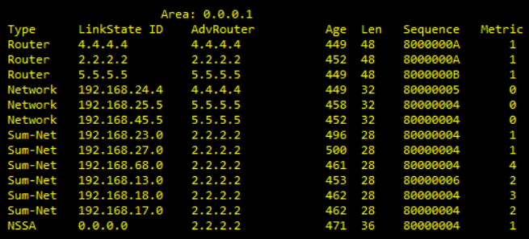
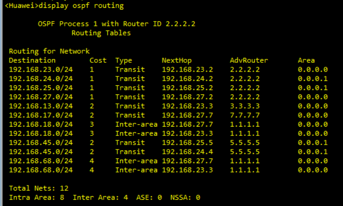

# OSPF 路由协议

## 1.OSPF 默认路由 

默认路由是指目的地址和掩码都是 0 的路由。当设备无精确匹配的路由时，就可以通过默认路由进行报文转发。一般多用于网络边界路由器访问互联网所需要的一条路由。

如果出现内部路由器有默认路由指向边界路由器，而边界路由器也有条默认路由指向内部路由器，即默认路由互指，会出现环路。**所以 OSPF 中不允许产生默认路由的路由器也接收其他路由器产生的默认路由（非常重要）**。

### 1.1 骨干以及普通区域中的默认路由

缺省情况下，在普通和骨干 OSPF 区域内的 OSPF 路由器是不会产生默认路由的，即使它有默认路由。这个时候要想产生默认路由必须在 ASBR/普通路由器上手动通过命令进行配置。使用了该命令后会**产生一个 Link State ID 为 0.0.0.0、网络掩码为 0.0.0.0 的 LSA5**，并且通告到整个 OSPF 域中（因为会通告到整个 OSPF 域，除了一些特殊区域，所以类型只能是 LSA5，LSA3 只能在某一个区域中泛洪）。

```shell
#命令格式，用来将默认路由通告到普通 OSPF 区域
default-route-advertise always permit-calculate-other costcost typetype route-policy route-policy-name match-any]

#将产生的默认路由的 LSA5 通告到 OSPF路由区域，本地设备没有默认路由 
<Huawei>system-view 
[Huawei] OSPF 1
[Huawei-OSPF-1]default-route-advertise always 
#无条件产生一条默认路由
```

在骨干和普通区域中也存在 ASBR 路由器，注意 `import-route` (OSPF)命令不能引入外部路由的缺省路由。当需要引入其他协议产生的缺省路由时，必须在 ASBR 上配置 `default-route-advertise` 命令，发布缺省路由到整个普通 OSPF 区域。

骨干和普通区域产生 LSA5 默认路由使用 default-route-advertise 命令，如果加 always 参数， 则无条件产生默认路由，如果没有加 always 参数，则是有条件的，仅当路由表里有条默认路由(**其他协议或外部默认路由**)才可以产生 LSA5 的默认路由。

ASBR 没有缺省路由，执行 `default-route-advertise` 命令时按照以下需求选择是否配置 always 参数：

- 如果配置 always 参数，无论 ASBR 是否有缺省路由都将在整个 OSPF 区域中通告缺省路由 0.0.0.0，**并且不再计算来自其他设备的缺省路由**。
- 如果没有配置 always 参数，ASBR 的路由表中必须有**激活的非 OSPF (BGP 除外) 缺省路由**时才生成缺省路由的 LSA。这就是前面一段话所说的**其它协议或外部默认路由**，如果 ASBR 路由表中的默认路由还是 OSPF 类型的，即使加了 always 参数，仍然无法产生默认路由。

路由器中不同类型的路由协议（OSPF、ISIS、BGP、静态、直连等）都有自己对应的路由表，但是路由器是根据全局路由表来转发 IP 数据包的，对于某一个目的 IP 地址，如果不同类型的路由协议均有对应的路由，还需要根据优先级、度量值等进行优选，最后被选中的路由才会被加入到全局路由表中。因此，如果在某 OSPF 设备上同时配置了静态缺省路由，要使 OSPF 通告的缺省路由加入到当前的路由表中，则必须保证所配置的静态缺省路由的优先级比 OSPF 通告的缺省路由的优先级低。

### 1.2 Stub 区域的默认路由

由于 STUB 区域不允许外部 LSA4、LSA5 在其内部泛洪，所以该区域内的路由器除了 ABR 外没有自治系统外部路由，如果它们想到自治系统外部时应该怎么办？在 STUB 区域里的路由器将本区域内 ABR 作为出口，**ABR 会自动产生 LSA3 型的缺省路由** 0.0.0.0 通告给整个 STUB 区域内的路由器，这样的话到达自治系统外部的路由可以通过 ABR 到达。

配置了 STUB 区域之后，ABR 自动会产生一条 Link ID 为 0.0.0.0，网络掩码为 0.0.0.0 的 SUMMARY LSA(3类)，并且通告到整个 STUB 区域内。

### 1.3 Totally Stub 区域的默认路由

完全 STUB 区域不仅不允许外部 LSA4、LSA5 在其内部泛洪，连区域间的 LSA3 路由也不允许携带，所以在完全 STUB 区域里的路由器要想到别的区域或自治系统外部时应该怎么办呢？同样的，在完全 STUB 区域里的路由器也将本区域内 ABR 作为出口，**ABR 会自动产生 LSA3 型缺省路由** 0.0.0.0 通告给整个完全 STUB 区域内的路由器，这样的话到达本区域外部的路由都通过 ABR 到达就可以了。

配置了完全 STUB 区域之后，ABR 自动会产生一条 Link ID 为 0.0.0.0，网络掩码为 0.0.0.0 的 SUMMARY LSA (3类)，并且通告到整个完全 STUB 区域内。

### 1.4 NSSA 区域的默认路由

NSSA 区域允许少量外部路由通过本区域的 ASBR 通告进来，它不允许携带其他区域的 LSA4、LSA5 外部路由。在华为的数通设备上，**NSSA 区域的 ABR 路由器会自动产生一条 LSA7 类型的默认路由泛洪给整个 NSSA 区域**。这样的话除了某少部分路由通过 NSSA 的 ASBR 到达，其它都可以通过NSSA ABR 到达其它区域的 ASBR 出去。

如果想在 NSSA 区域中除了 ABR 之外的其它路由器（包括 ASBR）上产生缺省路由 0.0.0.0，可以在 NSSA ABR 上手动配置：

```java
[Router-ospf-1-area-0.0.0.1]nssa default-route-advertise（NSSA区域视图）
```

与 NSSA ABR 不同的是，**NSSA ASBR 或者其它路由器必须是在自身已经有一条其它协议的缺省路由情况下才会产生一条 Link ID 为 0.0.0.0，网络掩码为 0.0.0.0 的 NSSA LSA（7类）**，在 NSSA 区域内泛洪缺省路由 0.0.0.0。而 NSSA ABR 是无论路由表中是否存在默认路由 0.0.0.0/0，都会产生 LSA7 默认路由。

NSSA 区域产生默认路由，因为 LSA7 默认路由只在 NSSA 区域内泛洪，并没有泛洪到整个 OSPF 域中， 所以本 NSSA 区域内的路由器在找不到明细路由之后可以按默认路由离开本区域。**LSA7 默认路由不会在 ABR 上转换成 LSA5 默认路由**。

### 1.5 Totally NSSA 区域的默认路由

完全 NSSA 区域和 NSSA 区域不同的是，它不允许携带区域间路由 LSA3，如果要到其他区域的时候应该怎么办呢？同样的，缺省路由又出场了，**在该区域 ABR 上会自动产生两条缺省路由 LSA7 和 LSA3**，通告给整个完全 NSSA 区域，所有的域间路由都将 NSSA ABR 作为出口。

同理，也可以在 Totally NSSA 区域中除了 ABR 的其它路由器（包括 ASBR）上配置发布默认路由，命令如下所示：

```java
[Router-ospf-1-area-0.0.0.1]nssa default-route-advertise（NSSA 区域视图）
```

与 NSSA 区域一样，其它路由器在发布默认路由的时候，自己的路由表中也必须存在其它协议的默认路由。而 NSSA ABR 则无论路由表中是否存在默认路由 0.0.0.0/0，都会产生 LSA7 与 LSA3 默认路由。

### 1.6 默认路由总结

OSPF 中默认路由的种类有三种：LSA 3 的默认路由、LSA 5 及 LSA 7 的默认路由。

(1) 由区域边界路由器 (ABR) 产生 LSA3 默认路由，用来指导区域内设备进行区域之间报文的转发。这是自动产生的默认路由，由特定的区域设置而触发产生。Stub/totally Stub 及 Totally NSSA 类型区域内都会存在由 ABR 产生的 LSA3 的默认路由，默认 Cost=1。**区域类型为 Stub no-summary 或 nssa no-summary 会触发产生 LSA3 默认路由**。

```java
# 将区域 1 设置成 Sub 区域，使发送到该 Stub 区域的 Type3 默认路由的开销为 20
<Huawei>system-view 
[Huawei]OSPF 1
[Huawei-OSPF-1]Area 1
[Huawei-OSPF-1-Area-0.0.0.1]Stub
[Huawei-OSPF-1-Area-0.0.0.1]default-cost 20
# 修改缺省开销 1 为 20
```

(2) ASBR 能引入外部路由，ASBR 同样也能产生默认路由，类型为 LSA5 或 LSA7。**普通或骨干区域产生 LSA5 外部默认路由，而 NSSA 区域产生 LSA7 外部默认 NSSA 路由**，用来指导自治系统 (AS) 内设备进行自治系统外报文的转发。

OSPF 默认路由的发布原则如下：

- 如果 OSPF 路由器已经发布了默认路由 LSA，**那么不再学习其他路由器发布的相同类型默认路由。即路由计算时不再计算其他路由器发布的相同类型的默认路由 LSA**，但数据库 LSDB 中存有对应的 LSA。
- 如果一台路由器同时收到多种类型默认路由，则根据选路规则，Type3 默认路由的优先级高于 Type5 或 Type7 路由。

第一点是最重要的，比如 NSSA ABR 自动发布了一条 LSA7 类型的默认路由，如果再手动配置，在 NSSA ASBR 上泛洪 LSA7 类型的默认路由，那么 ABR 不会使用和学习此 LSA7 类型路由（不会添加到 OSPF 路由表中），但是会保存到链路数据库中。

(3) 骨干及普通区域中的默认路由。缺省情况下，在普通 OSPF 区域内的 OSPF 路由器是不会产生默认路由的，即使它有默认路由。这个时候要想产生默认路由必须在 ASBR 上手动通过命令进行配置。使用了该命令后会产生一个 Link State ID 为 0.0.0.0、网络掩码为 0.0.0.0 的 LSA5，**并且通告到整个 OSPF 域中**。

### 1.7 默认路由实验————NSSA 和 Totally NSSA 区域

<div align="center">
    
</div>

#### 1.7.1 Totally NSSA 区域

在上面这个拓扑图中，area0 为骨干区域，R1 和 R2 为 ABR，R7 为 ASBR；area2 被配置为 Totally NSSA 区域，R6 为 ASBR；area1 为 NSSA 区域，R4 为 ASBR。对于 area2，R1 会产生 LSA7 和 LSA3 这两种类型的默认路由泛洪到 area2 中。我们可以通过查看 R1 和 R6 的 lsdb 数据库得出：

<div align="center">
    
</div>

R1 的 lsdb 数据库如上所示，有 Sum-Net（3 类 LSA）和 NSSA（7 类 LSA）两种类型的默认路由在 area2 中泛洪，R6 的 lsdb 数据库如下所示，可以看出，在 R6 的 lsdb 数据库中，也有两种类型的默认路由。

<div align="center">
    
</div>

但是对于 LSA3 和 LSA7 类型的默认路由，不管是 R6 还是 R8 都选择将 LSA3 通告的默认路由添加到 OSPF 的路由表中，最终添加到全局路由表中。R6 的 OSPF 路由表和全局路由表如下所示：

<div align="center">
    
</div>
<center><p2 style="font-size:12px">OSPF 路由表</p2></center>

<div align="center">
    
</div>
<center><p2 style="font-size:12px">全局路由表</p2></center>

从上面可以看出，OSPF 路由表中优选了 LSA3 型作为路由，而在全局路由表中，由于只有 OSPF 协议通告了默认路由，因此就将此 OSPF 默认路由添加到全局路由表中。从优先级可以看出，全局路由表中的路由为 LSA3 类型的，Pre=10，而 OSPF 内部路由的优先级（LSA1、LSA2、LSA3）就为 10，而 OSPF ASE（LSA5）和 OSPF NSSA（LSA7）优先级为 150。

R8 的 OSPF 路由表和全局路由表和 R6 基本一致，下面只显示全局路由表：

<div align="center">
    
</div>

但是 R1 的 OSPF 路由表和全局路由表有一些不同，由于 R1 只是泛洪 LSA3 和 LSA7 默认路由到 area2 中，因此 R1 的 lsdb 中存在这两个 LSA，但是由于 area2 中没有其它路由器向 R1 泛洪默认路由，R1 也没有将这些默认路由（LSA5 和 LSA7）宣告到 OSPF 域中，因此 R1 的 OSPF 路由表中没有默认路由，而 R1 上其它协议的路由表（静态、直连以及 RIP 等）中也没有默认路由，故全局路由表中也没有默认路由。如下所示：

<div align="center">
    
</div>
<center><p2 style="font-size:12px">OSPF 路由表</p2></center>

<div align="center">
    
</div>
<center><p2 style="font-size:12px">全局路由表</p2></center>

R1 的全局路由表和 OSPF 路由表中均没有默认路由。

接下来，我们在 R6 上配置一条静态默认路由，并且将路由的优先级设置为 9（静态路由的优先级默认为 60）。如果不设置优先级的话，此条静态路由的优先级由于低于 OSPF 内部路由，不会被保存到全局路由表中，全局路由表中仍然是 OSPF 默认路由，因此按照前面所说，如果 ASBR 路由表中的默认路由还是 OSPF 类型的，即使加了 always 参数，仍然无法产生默认路由（即产生对应的 LSA 泛洪到区域中）。

```java
[Huawei]ip route-static 0.0.0.0 0 NULL0 preference 9
[Huawei]ospf 1 
[Huawei-ospf-1]area 2
[Huawei-ospf-1-area-0.0.0.2]nssa default-route-advertise 
```

然后使用 `nssa default-route-advertise` 让 R6 产生一个 LSA7 泛洪到整个区域中，因此 R6 产生了 LSA7 类型的默认路由，因此 R6 不再接受 R1 产生的 LSA7 默认路由，但是会接受 LSA3 类型的默认路由添加进行 OSPF 路由表中，如下所示：

<div align="center">
    
</div>

而我们添加到 R6 的静态路由优先级为 9，高于 OSPF 中默认路由的优先级，因此全局路由表优选静态默认路由，如下所示：

<div align="center">
    
</div>

最后 R6 的 lsdb 如下所示，可以看到有三个 LSA，分别是 R1 泛洪的 LSA7 和 LSA3，以及 R6 泛洪的 LSA7。

<div align="center">
    
</div>

由于 R1 泛洪了 LSA3 和 LSA7 类型的路由，因此不再接收 R6 泛洪的 LSA7 类型的路由，不会将其添加到 OSPF 路由表中，故 R1 的 OSPF 路由表中没有默认路由，全局路由表中也没有默认路由。

### 1.7.2 NSSA 区域

当我们将 area1 配置为 NSSA 区域时，R2 会默认发布 LSA7 类型（NSSA）的默认路由泛洪到 area1 中。R2 和 R4 的 lsdb 分别如下所示：

<div align="center">
    
</div>
<center><p2 style="font-size:12px">R4 LSDB</p2></center>

<div align="center">
    
</div>
<center><p2 style="font-size:12px">R2 LSDB</p2></center>

和 Totally NSSA 的边界路由器 R1 类似的原因，R2 的 OSPF 路由表中也没有默认路由，故而全局路由表中也没有默认路由。如下所示：

<div align="center">
    
</div>
<center><p2 style="font-size:12px">R2 OSPF 路由表</p2></center>

<div align="center">
    
</div>
<center><p2 style="font-size:12px">R2 全局路由表</p2></center>

R4 会将泛洪的 LSA7 默认路由添加到自己 OSPF 路由表中，最终添加到自己的全局路由表里面，如下所示：

<div align="center">
    
</div>
<center><p2 style="font-size:12px">R4 OSPF 路由表</p2></center>

<div align="center">
    
</div>
<center><p2 style="font-size:12px">R4 全局路由表</p2></center>

现在在 R4 上配置静态默认路由，并且使用 `nssa default-route-advertise` 将此静态默认路由泛洪到 area1 中。

```java
[Huawei]ip route-static 0.0.0.0 0 NULL0
[Huawei]ospf 1 
[Huawei-ospf-1]area 1
[Huawei-ospf-1-area-0.0.0.1]nssa default-route-advertise 
```

这次在 R4 上配置静态默认路由时，没有指定优先级，但是和 R1 不同的是，可以将静态默认路由泛洪到 area1 中，这是因为静态路由的优先级为 60，高于 OSPF NSSA 路由的优先级 150，因此会被优选到 R4 全局路由表中，并通过 `nssa default-route-advertise` 命令进行泛洪。另外，由于 R4 也泛洪了 LSA7 类型的默认路由，它不会再接收 R1 的 LSA7 默认路由，故 R4 的 OSPF 路由表中不会再有默认路由，如下所示：

<div align="center">
    
</div>
<center><p2 style="font-size:12px">R4 OSPF 路由表</p2></center>

<div align="center">
    
</div>
<center><p2 style="font-size:12px">R4 全局路由表</p2></center>

R5 会同时接收到 R2 和 R4 泛洪的 LSA7 类型默认路由，并且进行负载均衡，下面是 R5 的 OSPF 路由表，有两条默认路由。

<div align="center">
    
</div>

R5 的全局路由表如下所示，对默认路由 0.0.0.0/0 进行了负载均衡。

<div align="center">
    
</div>

由于 R2 发布了 LSA7 类型的默认路由，因此，R2 不接受 R4 发布的默认路由，故 R2 的 OSPF 路由表和全局路由表还是没有默认路由。

#### 1.7.3 骨干和普通区域默认路由

area0 为骨干区域，在骨干区域的路由器（ASBR 或者普通路由器）都可以通过 `default-route-advertise` 泛洪 LSA5 默认路由。

```java
[Huawei]ospf 1
[Huawei-ospf-1]area 0
[Huawei-ospf-1-area-0.0.0.0]default-route-advertise always
```

在输入上述命令之后，R3 中 lsdb 如下所示，确定 R3 使用 LSA5 来发送默认路由。

<div align="center">
    
</div>

但是和 area2 中 R1 相同的原因，R1 的 OSPF 路由表和全局路由表都没有默认路由。另外，R1 的 lsdb 如下所示，R1 也收到了 R3 泛洪的 LSA5 默认路由，并且添加到 OSPF 路由表和全局路由表中。

<div align="center">
    
</div>
<center><p2 style="font-size:12px">R1 LSDB</p2></center>

<div align="center">
    
</div>
<center><p2 style="font-size:12px">R1 OSPF route</p2></center>

<div align="center">
    
</div>
<center><p2 style="font-size:12px">R1 全局路由表</p2></center>

R2 与 R7 的 lsdb、OSPF 路由表以及全局路由表均与 R1 一致，这里不再赘述。