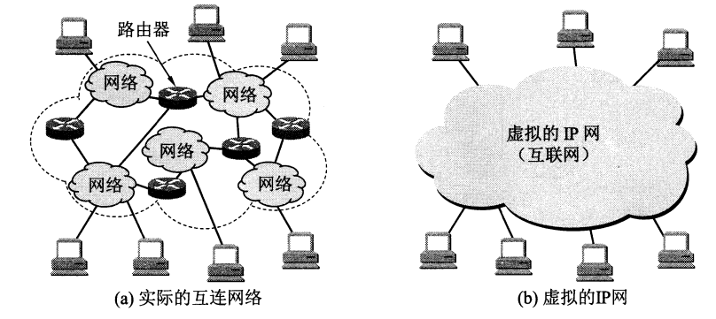

## 网络路由 IP Routing

## 1.网络基础

### 1.1 认识交换机

    

由一个交换机连接的多台设备处在同一个网段中，一个网段也称为一个广播域，广播可以简单理解为一对多的通信，而与之相对的单播就是一对一的通信。不同交换机连接的网段上的 PC 之间不能进行通信，必须要通过路由器将两个网段连接起来，才能进行通信和消息转发。交换机具有如下功能：

- 终端设备的接入
- 数据帧的寻址和转发
- 基本的接入安全功能
- 广播域的隔离（VLAN）

### 1.2 认识路由器

    

如上图所示，由交换机相连的两个网段 LAN1 和 LAN2 中的主机是不能进行通信的，但是如果加上一台路由器，就可以将这两个网段连接起来，实现两个网段的通信功能。路由器具有如下功能：

- 隔绝广播
- 路由协议的支持，路由选择：路由器上的路由协议（比如 OSPF、RIP 等）会生成路由表
- 网络层寻址和数据转发：查找路由表条目，然后从相应的接口中转发出去
- 广域网的接入、地址转换以及特定的安全功能

### 1.3. OSI 网际互联

    

- OSI 的概念：Open System Interconnect 开放系统互连参考模型，是由 ISO（国际标准化组织）定义的。它是个灵活的、稳健的和可互操作的模型
- OSI 模型的目的：规范不同系统的互联标准，使两个不同的系统能够较容易的通信，而不需要改变底层的硬件或软件的逻辑
- OSI 模型分为七层：OSI 把网络按照层次分为七层，由下到上分别为物理层、数据链路层、网络层、传输层、会话层、表示层、应用层

OSI 网络各层模型的功能如下所示：

- 应用层：运行各种应用程序协议，为应用软件提供接口，使应用程序能够使用网络服务
- 表示层：数据的格式化、数据加密解密、数据的压缩解压缩
- 会话层：建立、管理、终止实体之间的会话连接，它在系统之间协调通信过程，并提供 3 种不同的方式来组织它们之间的通信：单工、半双工和全双工
- 传输层：数据的分段及重组；提供端到端的数据服务（可靠或不可靠），具体的功能包括：分段与重组、连接控制、流量控制、差错控制
- 网络层：将分组从源端传送到目的端；逻辑寻址，将数据分组从源传输到目的；路由选择，路由发现、维护路由表
- 数据链路层：将分组数据封装成帧；实现两个相邻结点之间的通信；差错检测
- 物理层：在介质上传输比特；提供机械的和电气的规约

OSI 参考模型中，每层都有自己的功能集，层与层之间相互独立又相互依靠，上层依赖于下层，下层为上层提供服务。在这里我们主要研究网络层，主要是路由协议、路由表的生成，以及根据路由表对数据的转发。

## 2. 网络层详解

### 2.1 网络层概述

网络层采用的设计思路是这样的：**网络层向上只提供简单灵活的、无连接的、尽最大努力交付的数据报服务**。网络在发送分组时不需要先建立连接。每一个分组（即 IP 数据报）独立发送，与其前后的分组无关（不进行编号）。网络层不提供服务质量的承诺。即所传送的分组可能**出错、丢失、重复和失序（不按序到达终点），当然也不保证分组传送的时限**。

如果主机中的进程之间的通信需要是可靠的，那么就由网络主机中的运输层负责。采用这种设计思路的好处是：网络造价大大降低，运行方式灵活，能够适应多种不同的应用。

### 2.2 网际协议 IP

与 IP 协议配套使用的还有三个协议：

- 地址解析协议：ARP（Address Resolution Protocol）
- 网际控制报文协议：ICMP（Internet Control Message Protocol）
- 网际组管理协议：IGMP（Internet Group Management Protocol）

    

上图画出了这三个协议和网际协议 IP 的关系，在网络层中，ARP 画在最下面，因为 IP 经常要使用这个协议。ICMP 和 IGMP 画在这一层的上部，因为它们要使用 IP 协议。由于网际协议 IP 是用来使互连起来的许多计算机网络能够进行通信的，因此 TCP/IP 体系中的网络层常常被称为网际层(internet layer)，或 IP 层。使用"网际层"这个名词的好处是强调这是由很多网络构成的互连网络。

    

IP 协议存在的目就是屏蔽掉底层不同网络协议的细节（比如不同的寻址方案，不同的最大分组长度等）。因为用户的需求是多种多样的，没有一种单一的网络能够适应所有用户的需求。但是如果参加互连的计算机网络都使用相同的网际协议 IP，那么我们可以利用 IP 协议使得这些性能各异的网络在网络层上看起来好像是一个统一的网络。如果在这种覆盖全球的 IP 网的上层使用 TCP 协议，就是现在的互联网（Internet）。

### 2.3 分类的 IP 地址

整个的互联网就是一个单一的、抽象的网络。IP 地址就是给互联网上的每一台主机(或路由器)的每一个接口分配一个在全世界范围内是唯一的 32 位的标识符。IP 地址的结构使我们可以在互联网上很方便地进行寻址。IP 地址现在由互联网名字和数字分配机构 ICANN (Internet Corporation for Assigned Names and Numbers)进行分配。

IP 地址的编址方法经过了三个历史阶段：
- 分类的 IP 地址：最基本的编址方法
- 子网的划分
- 构成超网：比较新的无分类编址方法

所谓"分类的 IP 地址"就是将 IP 地址划分为若干个固定类，每一类地址都由两个固定长度的字段组成，其中**第一个字段是网络号(net-id)**，它标志主机（或路由器）所连接到的网络。一个网络号在整个互联网范围内必须是唯一的。**第二个字段是主机号(host-id)**，它标志该主机（或路由器）。一台主机号在它前面的网络号所指明的网络范围内必须是唯一的。由此可见，一个 IP 地址在整个互联网范围内是唯一的。

这种两级的 IP 地址可以记为：**IP 地址 = {<网络号>, <主机号>}**

在下面给出了各种 IP 地址的网络号字段和主机号字段，这里 A 类、B 类和 C 类都是单播地址（一对一通信），是最常用的。

    

从上图中可以看出：

- A 类、B 类和 C 类地址的网络号字段分别为 1 个、2 个和 3 个字节长，而在网络号字段最前面有 1-3 位的**类别位**，其数值分别规定为 0，10，110
- A 类、B 类和 C 类地址的主机号字段分别为 3 个、2 个和 1 个字段长
- D 类地址用于多播（一对多通信），也就是第一个字节的值在 224 - 239 区间内，说明这是一个多播地址
- E 类地址保留为今后使用

从以上 IP 地址的结构来看，IP 地址并不仅仅指明一台主机，而是还指明了主机所连接到的网络。不过这里要注意，这里要指出，由于近年来已经广泛使用无分类 IP 地址进行路由选择，A 类、B 类和 C 类地址的区分已成为历史。从 IP 地址的结构来看，IP 地址并不仅仅指明一台主机，还指明了主机所连接到的网络。

### 2.4 常用的 IP 地址

#### 2.4.1 A 类地址

**1）A 类地址的网络号**

A 类地址的网络号字段占 1 个字节，只有 7 位可供使用（该字段的第一位已固定为0)，但是可指派的网络号是 126 个（即 27-2）。有两个地址作为特殊用途：
1. 网络号字段为全 0 的 IP 地址是个保留地址，意思是"本网络"，例如 0.0.0.35 表示这个网络上主机号为 35 的主机；
2. 网络号为 127（即 01111111）保留作为本地软件环回测试（loopback test）本主机的进程之间的通信之用。若主机发送一个目的地址为环回地址（例如 127.0.0.1) 的 IP 数据报，则本主机中的协议软件就处理数据报中的数据，而不会把数据报发送到任何网络。目的地址为环回地址的 IP 数据报永远不会出现在任何网络上，因为网络号为 127 的地址根本不是一个网络地址。

**2）A 类地址的主机号**

A 类地址的主机号占 3 个字节，因此每一个 A 类网络中的最大主机数是 224-2，即 16777214。这里减 2 的原因也是有两个地址作为特殊用途

1. 全 0 的主机号字段表示该 IP 地址是"本主机"所连接到的单个网络地址（例如，一台主机的 IP 地址为 5.6.7.8，则该主机所在的网络地址就是 5.0.0.0）;
2. 而全 1 表示"所有的"，因此全 1 的主机号字段表示该网络上的所有主机，例如 128.255.255.255，表示网络号 128 所指明的网段上的所有主机。

#### 2.4.2 B 类地址

**1）B 类地址的网络号**

B 类地址的网络号字段有 2 个字节，但前面两位(10)已经固定了，只剩下 14 位可以进行分配。因为网络号字段后面的 14 位无论怎样取值也不可能出现使整个 2 字节的网络号字段成为全 0 或全 1，因此这里不存在网络总数减 2 的问题。但实际上 B 类网络地址 128.0.0.0 是不指派的，而可以指派的 B 类最小网络地址是 128.1.0.0。因此 B 类地址可指派的网络数为 $2^{14}-1$，即16383。

**2）B 类地址的主机号**

B 类地址的每一个网络上的最大主机数是 2162，即 65534。这里需要减 2 是因为要扣除全 0 和全 1 的主机号。同样全 0 表示该主机所处的网络号，全 1 表示该网络上的所有主机。

#### 2.4.3 C 类地址

**1) C 类地址的网络号**

C 类地址有 3 个字节的网络号字段，最前面的 3 位是 (110)，还有 21 位可以进行分配。同样，也是因为 C 类网络号字段后面的 18 位怎么取值也不可能全为 0 或者全为 1。C 类网络地址 192.0.0.0 也是不指派的，可以指派的 C 类最小网络地址是 192.0.1.0，因此 C 类地址可指派的网络总数是 $2^{21}-1$，即 2097151。

**2）C 类地址的主机号**

每一个 C 类地址的最大主机数是 $2^8-2$，即 254。整个 C 类地址空间共约有 229 个地址，占整个 IP 地址的 12.5%。

综上，我们可以总结一般不使用的特殊 IP 地址如下表所示：

    

对于传统的分类 IP 地址，可以总结以下两点：

- 实际上 IP 地址是标志一台主机(或路由器)和一条链路的接口。当一台主机同时连接到两个网络上时，该主机就必须同时具有两个相应的 IP 地址，其网络号必须是不同的。这种主机称为多归属主机(multihomed host)。由于一个路由器至少应当连接到两个网络，因比一个路由器至少应当有两个不同的 IP 地址。
- 按照互联网的观点，一个网络是指具有相同网络号 net-id 的主机的集合，因此，**用转发器或网桥连接起来的若干个局域网仍为一个网络**，因为这些局域网都具有同样的网络号。具有不同网络号的局域网必须使用路由器进行互连。

### 2.5 IP 地址与硬件地址

    

上图说明了这两种地址的区别。从层次的角度看，物理地址是数据链路层和物理层使用的地址，而 IP 地址是网络层和以上各层使用的地址，是一种逻辑地址(称 IP 地址为逻辑地址是因为 IP 地址是用软件实现的)。

在发送数据时，数据从高层下到低层，然后才到通信链路上传输。使用的 IP 地址的 IP 数据报一旦交给了数据链路层，就被封装成 MAC 帧了。MAC 帧在传送时使用的源地址和目的地址都是硬件地址，这两个硬件地址都写在 MAC 帧的首部中。

连接在通信链路上的设备（主机或路由器）在收到 MAC 帧时，根据 MAC 帧首部中的硬件地址决定收下或丢弃。只有在剥去 MAC 帧的首部和尾部后把 MAC 层的数据上交给网络层后，网络层才能在 IP数据报的首部中找到源 IP 地址和目的 IP 地址。

总之，IP 地址放在 IP 数据报的首部，而硬件地址则放在 MAC 帧的首部。在网络层和网络层以上使用的是 IP 地址，而数据链路层及以下使用的是硬件地址。

    

上图中画的是三个局域网用两个路由器 R1 和 R2 互连起来，现在主机 H1 要和主机 H2 通信。这两台主机的 IP 地址分别是 IP1 和 IP2，而它们的硬件地址分别为 HA1 和 HA2 (HA 表示 Hardware Address)，通信的路径是: H1 -> 经过R1转发 -> 再经过R2转发 -> H2。路由器 R1 因同时连接到两个局域网上，因此它有两个硬件地址，即 HA3 和 HA4。同理，路由器 R2 也有两个硬件地址 HA5 和 HA6。

这里需要注意以下几点：

1. 在 IP 层抽象的互联网上只能看到 IP 数据报。虽然 IP 数据报要经过路由器 R1 和 R2 的两次转发，但在它的首部中的源地址和目的地址始终分别是 IP1 和 IP2。数据报中间经过的两个路由器的 IP 地址并不出现在 IP 数据报的首部中。
2. 虽然在 IP 数据报首部有源站 IP 地址，但路由器只根据目的站的 IP 地址的网络号进行路由选择。
3. 在局域网的链路层，只能看见 MAC 帧。IP 数据报被封装在 MAC 帧中。MAC 帧在不同网络上传送时，其 MAC 帧首部中的源地址和目的地址要发生变化。开始在 H1 到 R1 间传送时，MAC 帧首部中写的是从硬件地址 HA1 发送到硬件地址 HA3。路由器 R1 收到此 MAC 帧后，在数据链路层，要丢弃原来的 MAC 帧的首部和尾部。在转发时，在数据链路层，要重新添加上 MAC 帧的首部和尾部。这时首部中的源地址和目的地址分别便成为 HA4 和 HA5。路由器 R2 收到此帧后，再次更换 MAC 帧的首部和尾部，首部中的源地址和目的地址分别变成为 HA6 和 HA2。MAC 帧的首部的这种变化，在上面的 IP 层上是看不见的。

### 2.6 ARP 协议

由于我们在链路上传输数据报时，真正使用的是硬件地址，而如果已经知道了一个机器（主机或路由器）的 IP 地址，如何找出其相应的硬件地址？地址解析协议 ARP 就是用来解决这样的问题的。

    

我们知道，网络层使用的是 IP 地址，但在实际网络的链路上传送数据帧时，最终还是必须使用该网络的硬件地址。但是 IP 地址和硬件地址之间不存在简单的映射关系，同时，在一个网络上可能经常会有新的主机加入进来，或者撤走一些主机。更换网络适配器也会使主机的硬件地址发生变化。也就是说，网络中的各主机的硬件地址可能是动态变化的。ARP 协议解决这个问题的办法是在每一个主机都设有一个 ARP 高速缓存(ARP cache)，里面有主机所在的局域网上的各主机和路由器的 IP 地址到硬件地址的映射表。

下面讲解一下该映射表是如何生成的，当主机 A 欲向本局域网上的某个主机 B 发送 IP 数据报时，就先在其 ARP 高速缓存中查看有无主机 B 的 IP 地址。如有，就可查出其对应的硬件地址，再将此硬件地址写入 MAC 帧，然后通过局域网将该 MAC 帧发往此硬件地址。如没有， ARP 进程进入以下步骤：

- **ARP 进程在本局域网上广播发送一个 ARP 请求分组**。下图(a)是主机 A 广播发送 ARP 请求分组的示意图，ARP 请求分组的主要内容为："我的 IP 地址为 209.0.0.5，硬件地址是 00-00-C0-15-AD-18。我想知道 IP 地址为 209.0.0.6 的主机硬件地址"
- **在本局域网上的所有主机上运行的 ARP 进程都收到此 ARP 请求分组**
- 若主机 B 的 IP 地址就是209.0.0.6，就收下这个 ARP 请求分组，并向主机 A 发送 ARP 响应分组（这个响应分组是单播），在这个响应分组中包含了自己的硬件地址
- 主机 A 收到后 ARP 响应分组后，在主机 A 的 ARP 高速缓存中写入主机 B 的 IP 地址到硬件地址的映射

    

ARP 是解决同一个局域网上的主机或路由器的 IP 地址和硬件地址的映射问题。如果所要找的主机和源主机不在同一个局域网上，那么就要通过 ARP 找到一个位于本局域网上的某个路由器的硬件地址，然后把分组发送给这个路由器，让这个路由器把分组转发给下一个网络。剩下的工作就由下一个网络来做。从 IP 地址到硬件地址的解析是自动进行的，主机的用户对这种地址解析过程是不知道的。

### 2.7 IP 数据报转发流程

首先，路由器都是根据 IP 数据报中目的 IP 地址进行转发，这样做可以得出以下结果：
1. IP 数据报最终一定可以找到目的主机所在目的网络上的路由器（可能要通过多次间接交付）。
2. 只有到达最后一个路由器时，才试图向目的主机进行直接交付。

虽然互联网所有的分组转发都是基于目的主机所在的网络，但在大多数情况下都允许有这样的特例，**即对特定的目的主机指明一个路由。这种路由叫做特定主机路由**。

**路由器还可采用默认路由 (default route) 以减小路由表所占用的空间和搜索路由表所用的时间**。这种转发方式在一个网络只有很少的对外连接时是很有用的。实际上，默认路由在主机发送 IP 数据报时往往更能显示出它的好处。主机在发送每一个 IP 数据报时都要查找自己的路由表，如果一台主机连接在一个小网络上，而这个网络只用一个路由器和互联网连接，那么在这种情况下使用默认路由是非常合适的。

例如，在下图的互联网中，H 主机上路由表的第一个项目就是到本网络主机的路由，其目的网络就是本网络 N1，因而不需要路由器转发，而是直接交付。第二个项目是到网络 N2 的路由，对应的下一跳路由器是 R2。第三个项目就是默认路由，只要目的网络是其他网络(不是 N1 或 N2)，就一律选择默认路由，把数据报先间接交付路由器 R1，让 R1 再转发给互联网中的下一个路由器，一直转发到目的网络上的路由器，最后进行直接交付。在实际上的路由器中，**像下图路由表中所示的"其他"的几个字符并没有出现在路由表中，而是被记为 0.0.0.0**，表示和任意路由匹配。

    

根据以上所述，可归纳出分组转发算法如下:

1. 从数据报的首部提取目的主机的 IP 地址 D，得出目的网络地址为 N。
2. 若 N 就是与此路由器直接相连的某个网络地址，则进行直接交付，不需要再经过其他的路由器，直接把数据报交付目的主机(这里包括把目的主机地址 D 转换为具体的硬件地址，把数据报封装为 MAC 帧，再发送此帧);否则就是间接交付，执行(3)。
3. 若路由表中有目的地址为 D 的特定主机路由，则把数据报传送给路由表中所指明的下一跳路由器;否则，执行(4)。
4. 若路由表中有到达网络 N 的路由，则把数据报传送给路由表中所指明的下一跳路由器；否则，执行(5)。
5. 若路由表中有一个默认路由，则把数据报传送给路由表中所指明的默认路由器;否则，执行(6)。
6. 报告转发分组出错。

### 2.8 划分子网

#### 2.8.1 划分子网

划分子网的基本思路如下：

1. 一个拥有许多物理网络的单位，可将所属的物理网络划分为若干个子网(subnet)。划分子网纯属一个单位内部的事情。**本单位以外的网络看不见这个网络是由多少个子网组成，因为这个单位对外仍然表现为一个网络**。
2. 划分子网的方法是**从网络的主机号借用若干位作为子网号(subnet-id)**，当然主机号也就相应减少了同样的位数。于是两级 IP 地址在本单位内部就变为三级 IP 地址：网终号、子网号和主机号。
3. 凡是从其他网络发送给本单位某台主机的 IP 数据报，仍然是根据 IP 数据报的目的网络号找到连接在本单位网络上的路由器。但此路由器在收到 IP 数据报后，**再按目的网络号和子网号找到目的子网，把 IP 数据报交付目的主机**。

下面举例说明，下图表示某单位拥有一个 B 类的 IP 地址，网络地址是 145.13.0.0（网络号是 145.13）。凡目的地址为 145.13.X.X 的数据报都被送到这个网络上的路由器 R1。

    

现把下图的网络划分为三个子网。这里假定子网号占用 8 位，因此在增加了子网号后，主机号就只有 8 位。所划分的三个子网分别是: 145.13.3.0，145.13.7.0 和 145.13.21.0。在划分子网后，整个网络对外部仍表现为一个网络，其网络地址仍为145.13.0.0。但网络 145.13.0.0 上的路由器 R1 在收到外来的数据报后，再根据数据报的目的地址把它转发到相应的子网。

    

#### 2.8.2 子网掩码

我们知道，从 IP 数据报的首部无法看出源主机或目的主机所连接的网络是否进行了子网的划分。这是因为 32 位的 IP 地址本身以及数据报的首部都没有包含任何有关子网划分的信息。因此必须另外想办法，这就是使用子网掩码(subnet mask)，如下所示：

    

R1 把三级 IP 地址的子网掩码和收到的数据报的目的 IP 地址 145.13.3.10 逐位相与，既可以得出网络地址来。**现在互联网的标准规定：所有的网络都必须使用子网掩码，同时在路由器的路由表中也必须有子网掩码这一栏**。如果一个网络不划分子网，那么该网络的子网掩码就使用默认子网掩码。默认子网掩码中 1 的位置和 IP 地址中的网络号字段 net-id 正好相对应。因此，若用默认子网掩码和某个不划分子网的 IP 地址逐位相"与"(AND)，就应当能够得出该 IP 地址的网络地址来。这样做可以不用查找该地址的类别位就能知道这是哪一类的 IP 地址。

子网掩码是一个网络或一个子网的重要属性。在 RFC 950 成为互联网的正式标准后，路由器在和相邻路由器交换路由信息时，必须把自己所在网络(或子网)的子网掩码告诉相邻路由器。

我们应当注意，在使用了子网划分后，路由表必须包含以下三个内容：目的网络地址、子网掩码和下一跳地址。在划分子网的情况下，路由器转发分组算法如下：

1. 从收到的数据报的首部提取目的 IP 地址 D。
2. 先判断是否为直接交付。对路由器直接相连的网络逐个进行检查：用各网络的子网掩码和 D 逐位相"与"（AND 操作)，看结果是否和相应的网络地址匹配。若匹配，则把分组进行直接交付（当然还需要把 D 转换成物理地址，把数据报封装成帧发送出去)，转发任务结束。否则就是间接交付，执行(3)。
3. 若路由表中有目的地址为 D 的特定主机路由，则把数据报传送给路由表中所指明的下一跳路由器；否则，执行(4）。
4. 对路由表中的每一行（目的网络地址，子网掩码，下一跳地址），用其中的子网掩码和 D 逐位相"与"(AND 操作)，其结果为 N。若 N 与该行的目的网络地址匹配，则把数据报传送给该行指明的下一跳路由器；否则，执行（5）。
5. 若路由表中有一个默认路由，则把数据报传送给路由表中所指明的默认路由器；否则，执行(6)。
6. 报告转发分组出错。

### 2.9 无分类编址 CIDR

#### 2.9.1 网络前缀

使用变长子网掩码 VLSM（Variable Length Subnet Mask）可以进一步提高 IP 地址资源的利用率。在 VLSM 的基础上又进一步研究出无分类编址的方法，它的正式名称是无分类域间路由选择 CIDR（Classless Inter-Domain Routing）。其特点如下：

CIDR 消除了传统的 A 类、B 类和 C 类地址以及划分子网的概念。CIDR 把 32 位的 IP 地址划分为前后两个部分。前面部分是"网络前缀" (network-prefix) ，用来指明网络，后面部分则用来指明主机。因此 CIDR 使 IP 地址从三级编址(使用子网掩码)又回到了两级编址，但这己是无分类的两级编址。其记法是：IP={<网络前缀>，<主机号>}。

CIDR 还使用"斜线记法"(slash notation)，即在 IP 地址后面加上斜线"/"，然后写上网络前缀所占的位数。例如，已知 IP 地址 128.14.35.7/20 是某 CIDR 地址块中的一个地址，其中的前 20 位是网络前缀，而前缀后面的 12 位是主机号。

#### 2.9.2 最长前缀匹配

在使用 CIDR 时，由于采用了网络前缀这种记法，IP 地址由网络前缀和主机号这两个部分组成。这时，每个项目由"网络前缀"和"下一跳地址"组成。但是在查找路由表时可能会得到不止一个匹配结果。这样就带来一个问题:我们应当从这些匹配结果中选择哪一条路由呢?

正确的答案是：应当从匹配结果中选择具有最长网络前缀的路由。这叫做最长前缀匹配(longest-prefix matching)，这是因为网络前缀越长，其地址块就越小，因而路由就越具体(more specific)。最长前缀匹配又称为最长匹配或最佳匹配。

## 3. ICMP 报文

