## 网络路由 IP Routing

## 1.网络基础

### 1.1 认识交换机
<div align="center">
    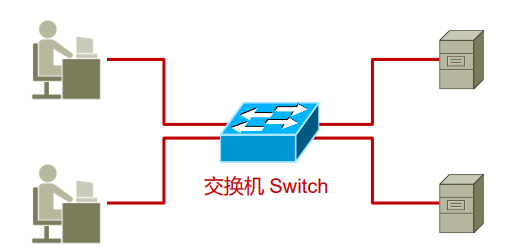
</div>

由一个交换机连接的多台设备处在同一个网段中，一个网段也称为一个广播域，广播可以简单理解为一对多的通信，而与之相对的单播就是一对一的通信。不同交换机连接的网段上的 PC 之间不能进行通信，必须要通过路由器将两个网段连接起来，才能进行通信和消息转发。交换机具有如下功能：

- 终端设备的接入
- 数据帧的寻址和转发
- 基本的接入安全功能
- 广播域的隔离（VLAN）

### 1.2 认识路由器

<div align="center">
    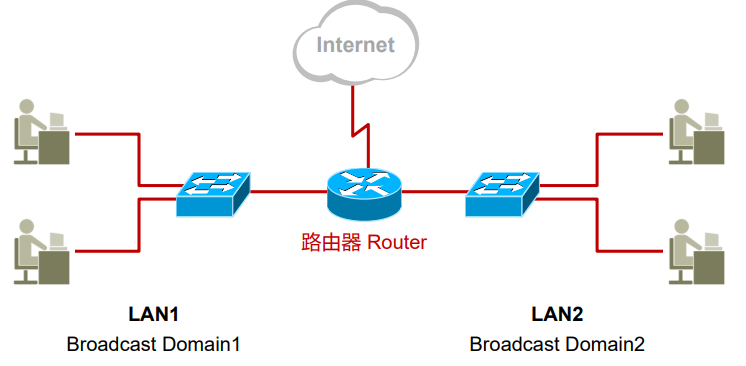
</div>

如上图所示，由交换机相连的两个网段 LAN1 和 LAN2 中的主机是不能进行通信的，但是如果加上一台路由器，就可以将这两个网段连接起来，实现两个网段的通信功能。路由器具有如下功能：

- 隔绝广播
- 路由协议的支持，路由选择：路由器上的路由协议（比如 OSPF、RIP 等）会生成路由表
- 网络层寻址和数据转发：查找路由表条目，然后从相应的接口中转发出去
- 广域网的接入、地址转换以及特定的安全功能

## 2. OSI 网际互联

### 2.1 OSI 参考模型

<div align="center">
    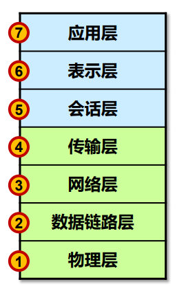
</div>

- OSI 的概念：Open System Interconnect 开放系统互连参考模型，是由 ISO（国际标准化组织）定义的。它是个灵活的、稳健的和可互操作的模型
- OSI 模型的目的：规范不同系统的互联标准，使两个不同的系统能够较容易的通信，而不需要改变底层的硬件或软件的逻辑
- OSI 模型分为七层：OSI 把网络按照层次分为七层，由下到上分别为物理层、数据链路层、网络层、传输层、会话层、表示层、应用层

OSI 网络各层模型的功能如下所示：

- 应用层：运行各种应用程序协议，为应用软件提供接口，使应用程序能够使用网络服务
- 表示层：数据的格式化、数据加密解密、数据的压缩解压缩
- 会话层：建立、管理、终止实体之间的会话连接，它在系统之间协调通信过程，并提供 3 种不同的方式来组织它们之间的通信：单工、半双工和全双工
- 传输层：数据的分段及重组；提供端到端的数据服务（可靠或不可靠），具体的功能包括：分段与重组、连接控制、流量控制、差错控制
- 网络层：将分组从源端传送到目的端；逻辑寻址，将数据分组从源传输到目的；路由选择，路由发现、维护路由表
- 数据链路层：将分组数据封装成帧；实现两个相邻结点之间的通信；差错检测
- 物理层：在介质上传输比特；提供机械的和电气的规约

OSI 参考模型中，每层都有自己的功能集，层与层之间相互独立又相互依靠，上层依赖于下层，下层为上层提供服务。

## 3. IP 路由概述

### 3.1 关于 IP 路由

<div align="center">
    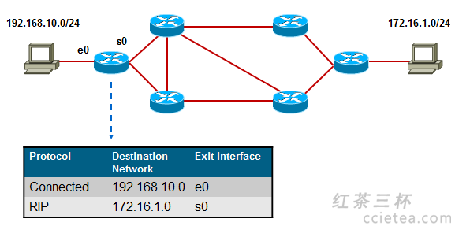
</div>

在一个 IP 网络中，路由(Routing)是个非常基本的概念。网络的基本功能，就是使得处于网络中的两个 IP 节点能够进行通信，而通信实际上就是数据交互的过程，数据交互则需要网络设备帮助我们来将数据在两个通信节点之间进行传输。

当路由器（或者其他三层设备）收到一个 IP 数据包，路由器会找出 IP 包三层头中的目的 IP 地址，然后拿着目的 IP 地址到自己的路由表中进行查找，找到"最匹配"的条目后，将数据包根据路由条目所指示的出接口或下一跳 IP 转发出去，这就是 IP 路由（IP routing）。

而每台路由器都会在本地维护一个路由表（Routing Table），路由表中装载着路由器获知的路由条目（Routes），路由条目由路由前缀（路由所关联的目的地)路由信息来源、出接口或下一跳 IP 等元素构成。路由器通过静态的或者动态的方式获取路由条目并维护自己的路由表。

### 3.2 IP 路由表（IP Routing Table）

<div align="center">
    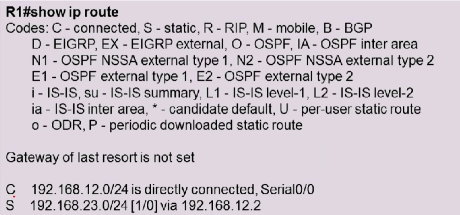
</div>

上面就是一张典型的 IP 路由表，最上面的 Codes 是路由条目的获取来源（路由协议类型），下面两行就是真正的路由条目。第一个字母缩写表示的是路由信息的来源，也就是本条路由从哪儿获取到，C 表示是此路由器直连的网段，S 表示管理员手动配置，然后就是目的网络号和掩码长度，最后就是下一跳路由器的地址，如果是直连网段的话，就指明出接口。

综上所述，每个路由表项最少必须包括下面三个字段：

- 目标地址（路由前缀）：这是路由条目所关联的目的网络号。一条完整的路由前缀由：网络号+前缀长度构成，两者缺一不可。匹配遵循最长前缀匹配原则，比如有 A:192.168.1.0/24 和 B:192.168.1.0/25 这两个路由条目，这时路由器收到一个 IP 数据包地址为 192.168.1.1，那么它和 A、B 两条路由都匹配，但是 B 路由的前缀更长，因此按照 B 路由进行转发。
- 指向目标的指针：指针的值只有两种情况：
  - 第一种是目的网段和当前路由器直接相连，如上图第一条路由所示，目的网段 192.168.12.0/24 直接和此路由器相连，这时指针指明到这个链路的本地接口；
  - 第二种是目的网段和当前路由器不直接相连，指针指向直连网络内的另一台路由器（更接近目标网络）地址，称为下一跳(next hop) 路由器。
- 路由信息的来源：本条路由是通过什么途径学习到的，例如是静态的，或者是通过 OSPF、IS-IS、EIGRP、BGP 等动态路由学习到的。

### 3.3 路由信息的来源

路由信息的来源有以下三种：

- 直连路由：路由器的直连接口所在的网络
- 静态路由：手工为路由器配置的路由条目
- 动态路由：路由器动态学习到的路由

#### 3.3.1. 直连路由

<div align="center">
    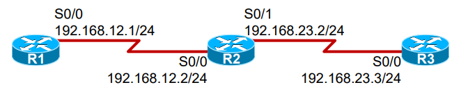
</div>

初始化情况下，路由器所知的网络只有其直连接口所在的网络。直连网络在路由表中的标记为 C（Connected），直连路由被加载到路由表中的前提是该网络的接口物理状态、协议状态均为 UP。上图中 R2 路由器的路由表如下所示：

<div align="center">
    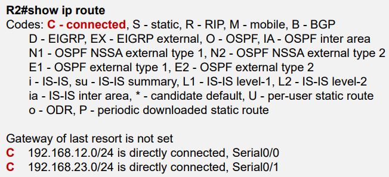
</div>

其中，R2 和 192.168.12.0/24 和 192.168.23.0/24 这两个网段直接相连，路由来源简写为 C，出接口分别为 S0/0 和 S0/1。

在上图的网络拓扑图中，R1 能够和 R2 的 S0/0 接口进行数据通信，因为这是直连网络；然而 R1 无法和 R3 进行通信，因为当目前为止，它只知道直连网络，并不知道 192.168.23.0/24 网络。

#### 3.3.2 静态路由

<div align="center">
    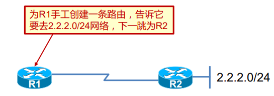
</div>

手工为路由器添加路由条目

#### 3.3.3 动态路由协议

<div align="center">
    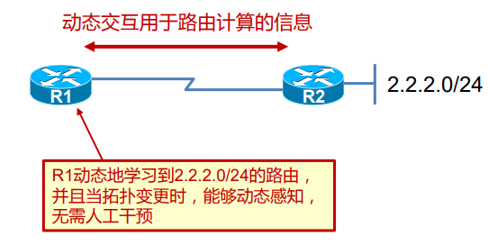
</div>

通过在路由器上运行动态路由协议，使得路由器之间能够交互"用于路由计算的信息"，从而路由器动态的"学习"到网络中的路由。

## 4. 静态路由

### 4.1 什么是静态路由

<div align="center">
    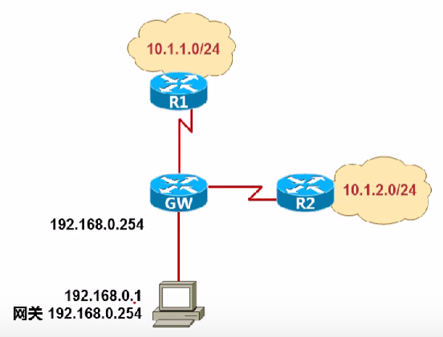
</div>

PC 要出外网，将数据丢给自己的网关 GW，可是网关除了自己本地直连的路由外，并不知道远程的网络（没有路由）。可以在 GW 上，通过手工配置的方式为其创建静态路由，"告诉" GW 去往远端网络的路径。静态路由有如下特点：
- 需要通过手工的方式进行添加及维护
- 适用于组网规模较小的场景，如果网络规模较大，则配置及维护的成本就会很高
- 无法根据拓扑的变化进行动态的响应（各厂商开发了扩展特性，以便弥补静态路由在这点上的不足）
- 在大型的网络中，往往采用动、静态路由结合的方式进行部署

### 4.2 静态路由的配置

静态路由配置命令：
```shell
R1(config)# ip route network-address subnet-mask {ip-add | exit-interface}
```
配置示例：
```shell
R1(config)# ip route 192.168.1.0 255.255.255.0 192.168.12.2
R1(config)# ip route 192.168.1.0 255.255.255.0 serial 0
```
在配置 R1 的静态路由时，可以直接指明下一跳路由器的 IP 地址，也可以直接指明出接口（但是这两者有一定的区别）。如示例所示，如果 IP 数据包的目的网络为 192.168.1.0，R1 会把它发送给下一跳路由器 192.168.12.2，或者把它从接口 0 中发出。

<div align="center">
    
</div>

如上图所示，当 R1、R2 和 R3 启动时，会学习直连的网络地址，但是 R1 不知道 192.168.23.0/24 网络的存在，R3 不知道 192.168.12.0/24 网络的存在。为了让 R1 能够和 R3 进行通信，我们可以手动配置路由，如下所示：
```shell
R1(config)# ip route 192.168.23.0 255.255.255.0 192.168.12.2
R3(config)# ip route 192.168.12.0 255.255.255.0 serial0/0
```
注意，通信是双向的，因此要留意往返的流量（的路由）。为了使 R1 和 R3 能够互相通信，只配置 R1 或者只配置 R3 是不够的。

### 4.3 缺省路由（默认路由）

<div align="center">
    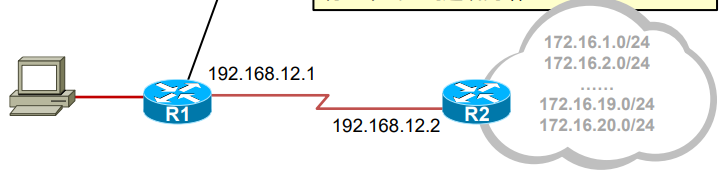
</div>

R1 路由表里的路由太多，路由表规模过于庞大，这加重了路由器的负担，而且实际上也没有必要维护这么多条路由，毕竟 R1 只有一个出口到远端网络。在 R1 上配置默认路由，既可减少 R1 所维护的路由条目数量，又可以保证路由可达。
```shell
R1(config)# ip route 0.0.0.0 0.0.0.0 192.168.12.2
```
在 R1 上配置默认路由之后，只要 IP 数据包的目的网络地址 R1 的路由表中没有，就会把 IP 数据包发送给默认路由指明的下一跳路由器。

### 4.4 Loopback 接口

<div align="center">
    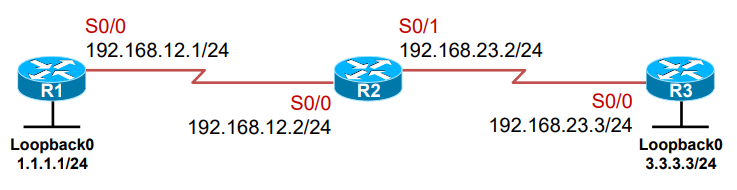
</div>

Loopback 接口，也叫环回口，是一个逻辑的、虚拟的接口。在上图中，分别给 R1 和 R3 配置了 Loopback 接口，因此 R1 可以看成通过 S0/0 接口连接到 192.168.12.0/24 网段，也通过 Looback0 接口连接到 1.1.1.0/24 网段。我们可以使用全局配置命令 interface loopback 加上接口编号可创建一个 Loopback 接口，创建完成后即可为接口配置 IP 地址。Loopback 接口在手工创建后，除非人为 shutdown，否则不会 down 掉。配置命令如下所示：

```shell
R1(config)#Interface loopback 0
R1(config-if)#ip address 1.1.1.1 255.255.255.0
```
Loopback接口常用于：
- 模拟路由器的直连网段，可用于测试；
- 可用于设备管理（Loopback 接口比较稳定）；
- 供其他协议使用，例如 OSPF、BGP、MPLS 等；
- SNMP Traps 消息的源地址；
- 其他用途（Loopback 接口的用途十分广泛）。

最后再介绍一下路由器中常用的命令：

- ping：测试连通性
- traceroute：追踪到达目标沿途中的每一跳
- show ip route：显示路由表
- show ip interface brief：接口信息摘要
- show cdp neighbors detail：用于收集 CDP 邻居信息

