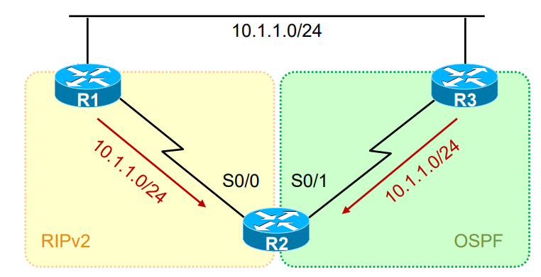

## 网络路由 IP Routing

## 1.网络基础

### 1.1 认识交换机
<div align="center">
    
</div>

由一个交换机连接的多台设备处在同一个网段中，一个网段也称为一个广播域，广播可以简单理解为一对多的通信，而与之相对的单播就是一对一的通信。不同交换机连接的网段上的 PC 之间不能进行通信，必须要通过路由器将两个网段连接起来，才能进行通信和消息转发。交换机具有如下功能：

- 终端设备的接入
- 数据帧的寻址和转发
- 基本的接入安全功能
- 广播域的隔离（VLAN）

### 1.2 认识路由器

<div align="center">
    
</div>

如上图所示，由交换机相连的两个网段 LAN1 和 LAN2 中的主机是不能进行通信的，但是如果加上一台路由器，就可以将这两个网段连接起来，实现两个网段的通信功能。路由器具有如下功能：

- 隔绝广播
- 路由协议的支持，路由选择：路由器上的路由协议（比如 OSPF、RIP 等）会生成路由表
- 网络层寻址和数据转发：查找路由表条目，然后从相应的接口中转发出去
- 广域网的接入、地址转换以及特定的安全功能

## 2. OSI 网际互联

### 2.1 OSI 参考模型

<div align="center">
    
</div>

- OSI 的概念：Open System Interconnect 开放系统互连参考模型，是由 ISO（国际标准化组织）定义的。它是个灵活的、稳健的和可互操作的模型
- OSI 模型的目的：规范不同系统的互联标准，使两个不同的系统能够较容易的通信，而不需要改变底层的硬件或软件的逻辑
- OSI 模型分为七层：OSI 把网络按照层次分为七层，由下到上分别为物理层、数据链路层、网络层、传输层、会话层、表示层、应用层

OSI 网络各层模型的功能如下所示：

- 应用层：运行各种应用程序协议，为应用软件提供接口，使应用程序能够使用网络服务
- 表示层：数据的格式化、数据加密解密、数据的压缩解压缩
- 会话层：建立、管理、终止实体之间的会话连接，它在系统之间协调通信过程，并提供 3 种不同的方式来组织它们之间的通信：单工、半双工和全双工
- 传输层：数据的分段及重组；提供端到端的数据服务（可靠或不可靠），具体的功能包括：分段与重组、连接控制、流量控制、差错控制
- 网络层：将分组从源端传送到目的端；逻辑寻址，将数据分组从源传输到目的；路由选择，路由发现、维护路由表
- 数据链路层：将分组数据封装成帧；实现两个相邻结点之间的通信；差错检测
- 物理层：在介质上传输比特；提供机械的和电气的规约

OSI 参考模型中，每层都有自己的功能集，层与层之间相互独立又相互依靠，上层依赖于下层，下层为上层提供服务。

## 3. IP 路由概述

### 3.1 关于 IP 路由

<div align="center">
    
</div>

在一个 IP 网络中，路由(Routing)是个非常基本的概念。网络的基本功能，就是使得处于网络中的两个 IP 节点能够进行通信，而通信实际上就是数据交互的过程，数据交互则需要网络设备帮助我们来将数据在两个通信节点之间进行传输。

当路由器（或者其他三层设备）收到一个 IP 数据包，路由器会找出 IP 包三层头中的目的 IP 地址，然后拿着目的 IP 地址到自己的路由表中进行查找，找到"最匹配"的条目后，将数据包根据路由条目所指示的出接口或下一跳 IP 转发出去，这就是 IP 路由（IP routing）。

而每台路由器都会在本地维护一个路由表（Routing Table），路由表中装载着路由器获知的路由条目（Routes），路由条目由路由前缀（路由所关联的目的地)路由信息来源、出接口或下一跳 IP 等元素构成。路由器通过静态的或者动态的方式获取路由条目并维护自己的路由表。

### 3.2 IP 路由表（IP Routing Table）

<div align="center">
    
</div>

上面就是一张典型的 IP 路由表，最上面的 Codes 是路由条目的获取来源（路由协议类型），下面两行就是真正的路由条目。第一个字母缩写表示的是路由信息的来源，也就是本条路由从哪儿获取到，C 表示是此路由器直连的网段，S 表示管理员手动配置，然后就是目的网络号和掩码长度，最后就是下一跳路由器的地址，如果是直连网段的话，就指明出接口。

综上所述，每个路由表项最少必须包括下面三个字段：

- 目标地址（路由前缀）：这是路由条目所关联的目的网络号。一条完整的路由前缀由：网络号+前缀长度构成，两者缺一不可。匹配遵循最长前缀匹配原则，比如有 A:192.168.1.0/24 和 B:192.168.1.0/25 这两个路由条目，这时路由器收到一个 IP 数据包地址为 192.168.1.1，那么它和 A、B 两条路由都匹配，但是 B 路由的前缀更长，因此按照 B 路由进行转发。
- 指向目标的指针：指针的值只有两种情况：
  - 第一种是目的网段和当前路由器直接相连，如上图第一条路由所示，目的网段 192.168.12.0/24 直接和此路由器相连，这时指针指明到这个链路的本地接口；
  - 第二种是目的网段和当前路由器不直接相连，指针指向直连网络内的另一台路由器（更接近目标网络）地址，称为下一跳(next hop) 路由器。
- 路由信息的来源：本条路由是通过什么途径学习到的，例如是静态的，或者是通过 OSPF、IS-IS、EIGRP、BGP 等动态路由学习到的。

### 3.3 路由信息的来源

路由信息的来源有以下三种：

- 直连路由：路由器的直连接口所在的网络
- 静态路由：手工为路由器配置的路由条目
- 动态路由：路由器动态学习到的路由

#### 3.3.1. 直连路由

<div align="center">
    
</div>

初始化情况下，路由器所知的网络只有其直连接口所在的网络。直连网络在路由表中的标记为 C（Connected），直连路由被加载到路由表中的前提是该网络的接口物理状态、协议状态均为 UP。上图中 R2 路由器的路由表如下所示：

<div align="center">
    
</div>

其中，R2 和 192.168.12.0/24 和 192.168.23.0/24 这两个网段直接相连，路由来源简写为 C，出接口分别为 S0/0 和 S0/1。

在上图的网络拓扑图中，R1 能够和 R2 的 S0/0 接口进行数据通信，因为这是直连网络；然而 R1 无法和 R3 进行通信，因为当目前为止，它只知道直连网络，并不知道 192.168.23.0/24 网络。

#### 3.3.2 静态路由

<div align="center">
    
</div>

手工为路由器添加路由条目

#### 3.3.3 动态路由协议

<div align="center">
    
</div>

通过在路由器上运行动态路由协议，使得路由器之间能够交互"用于路由计算的信息"，从而路由器动态的"学习"到网络中的路由。

动态路由协议按照工作区域可以分为如下两类：
- IGP（Interior Gateway Protocols）内部网关协议：RIP、OSPF、EIGRP、ISIS
- EGP（Exterior Gateway Protocols）外部网关协议：BGP

按照工作机制以及算法可以分为如下两类：
- 距离矢量路由协议（Distance Vector Routing Protocols）:RIP、IGRP、EIGRP
- 链路状态路由协议（Link-State Routing Protocol）：OSPF、ISIS

## 4. 静态路由

### 4.1 什么是静态路由

<div align="center">
    
</div>

PC 要出外网，将数据丢给自己的网关 GW，可是网关除了自己本地直连的路由外，并不知道远程的网络（没有路由）。可以在 GW 上，通过手工配置的方式为其创建静态路由，"告诉" GW 去往远端网络的路径。静态路由有如下特点：
- 需要通过手工的方式进行添加及维护
- 适用于组网规模较小的场景，如果网络规模较大，则配置及维护的成本就会很高
- 无法根据拓扑的变化进行动态的响应（各厂商开发了扩展特性，以便弥补静态路由在这点上的不足）
- 在大型的网络中，往往采用动、静态路由结合的方式进行部署

### 4.2 静态路由的配置

静态路由配置命令：
```shell
R1(config)# ip route network-address subnet-mask {ip-add | exit-interface}
```
配置示例：
```shell
R1(config)# ip route 192.168.1.0 255.255.255.0 192.168.12.2
R1(config)# ip route 192.168.1.0 255.255.255.0 serial 0
```
在配置 R1 的静态路由时，可以直接指明下一跳路由器的 IP 地址，也可以直接指明出接口（但是这两者有一定的区别）。如示例所示，如果 IP 数据包的目的网络为 192.168.1.0，R1 会把它发送给下一跳路由器 192.168.12.2，或者把它从接口 0 中发出。

<div align="center">
    
</div>

如上图所示，当 R1、R2 和 R3 启动时，会学习直连的网络地址，但是 R1 不知道 192.168.23.0/24 网络的存在，R3 不知道 192.168.12.0/24 网络的存在。为了让 R1 能够和 R3 进行通信，我们可以手动配置路由，如下所示：
```shell
R1(config)# ip route 192.168.23.0 255.255.255.0 192.168.12.2
R3(config)# ip route 192.168.12.0 255.255.255.0 serial0/0
```
注意，通信是双向的，因此要留意往返的流量（的路由）。为了使 R1 和 R3 能够互相通信，只配置 R1 或者只配置 R3 是不够的。

### 4.3 缺省路由（默认路由）

<div align="center">
    
</div>

R1 路由表里的路由太多，路由表规模过于庞大，这加重了路由器的负担，而且实际上也没有必要维护这么多条路由，毕竟 R1 只有一个出口到远端网络。在 R1 上配置默认路由，既可减少 R1 所维护的路由条目数量，又可以保证路由可达。
```shell
R1(config)# ip route 0.0.0.0 0.0.0.0 192.168.12.2
```
在 R1 上配置默认路由之后，只要 IP 数据包的目的网络地址 R1 的路由表中没有，就会把 IP 数据包发送给默认路由指明的下一跳路由器。

### 4.4 Loopback 接口

<div align="center">
    
</div>

Loopback 接口，也叫环回口，是一个逻辑的、虚拟的接口。在上图中，分别给 R1 和 R3 配置了 Loopback 接口，因此 R1 可以看成通过 S0/0 接口连接到 192.168.12.0/24 网段，也通过 Looback0 接口连接到 1.1.1.0/24 网段。我们可以使用全局配置命令 interface loopback 加上接口编号可创建一个 Loopback 接口，创建完成后即可为接口配置 IP 地址。Loopback 接口在手工创建后，除非人为 shutdown，否则不会 down 掉。配置命令如下所示：

```shell
R1(config)#Interface loopback 0
R1(config-if)#ip address 1.1.1.1 255.255.255.0
```
Loopback接口常用于：
- 模拟路由器的直连网段，可用于测试；
- 可用于设备管理（Loopback 接口比较稳定）；
- 供其他协议使用，例如 OSPF、BGP、MPLS 等；
- SNMP Traps 消息的源地址；
- 其他用途（Loopback 接口的用途十分广泛）。

最后再介绍一下路由器中常用的命令：

- ping：测试连通性
- traceroute：追踪到达目标沿途中的每一跳
- show ip route：显示路由表
- show ip interface brief：接口信息摘要
- show cdp neighbors detail：用于收集 CDP 邻居信息

## 5.RIP 协议

### 5.1 距离矢量路由选择协议

使用距离矢量路由协议的路由器并不了解网络的拓扑结构。该路由器只知道：
- 自身与目的网络之间的距离
- 应该往哪个方向或者使用哪个接口转发数据包

下面以 RIP 协议为例，分析路由器中路由表的生成。

<div align="center">
    
</div>

**1）直连路由写入路由表**

首先，当路由器启动时，会根据自己直连的网络，增加路由条目，这样 R1、R2 和 R3 都会有两个路由条目。如下所示：

<div align="center">
    
</div>

**2）初次交换路由信息**

接着，R1 和 R2、R2 和 R3 之间彼此交换路由信息，R1 学习到了 R2 中的 192.168.23.0/24 这条路由，同时将距离由 0 再加上 1 得到 1，这是因为 R2 与 23.0 这个网络是直接相连的，距离为 0，但是 R1 距离这个网络还需要再经过 R2 转发，所以距离为 1。路由表如下所示：

<div align="center">
    
</div>

**3）下一个更新周期到来**

在初次交换路由信息之后，R1 和 R3 还没有所有网络的路由信息，因此只有在下一次更新周期时，再次交换路由表，才能得到整个网络的信息。最终生成的路由表如下所示：

<div align="center">
    
</div>

当所有的路由表包含相同网络可达性信息时，网络（路由）进入了一个稳态，说明路由器收敛完成，或者说当无新路由信息被更新时收敛结束。注意，网络在达到收敛前无法完全正常工作。

RIP 是应用及开发较早的路由协议，是典型的距离矢量路由协议，适用于小型网络，最大跳数 15 跳（16 跳视为不可达），另外 RIP 是基于 UDP 的，使用端口号 520。

### 5.2 Metric 路由度量值

RIP 路由选择协议只以跳数（Hops）作为 metric，如下图所示：

<div align="center">
    
</div>

A 经过 C 路由器到 5.5.5.0/24 这个目的网络跳数为 3，而经过 B 路由器到 5.5.5.0/24 这个目的网络的跳数为 2，因此在 A 的路由表中把 B 作为去往 5.5.5.0/24 这个目的网络的下一跳路由。

我们可以在路由表中查看 RIP 协议的度量值：

```shell
C 192.168.12.0/24 is directly connected, Serial0/0
R 192.168.23.0/24 [120/1] via 192.168.12.2, 00:00:08, Serial0/0
```

其中，第二条路由中的 **[120/1]** 中的 1 就是 RIP 协议中的跳数，而 120 是 RIP 协议的**管理距离（Administrative Distance，AD）**。只有由同一种路由协议给出的到同一个目的网络的多个 metric 值，才有比较意义。如果这些 metric 值是由不同路由协议给出的，那么就无法进行比较，这时必须引入 AD 值。

路由器可以通过多种途径获知路由条目：如静态手工配置、各种动态路由协议等等。当路由器从两种不用的途径获知去往同一个目的地的两条路由，那么路由器会比较这两条路由的 AD 值，也就是管理距离，优选 AD 值小的路由。如果 AD 值相等，例如是同种路由协议，则进一步比较 metric 值。

如下图所示，R2 同时运行 RIPv2 协议和 OSPF 协议，它收到了 R1 和 R3 发送给它的到 10.1.1.0/24 这个网络的路由，但是 R2 只选取其中 AD 值比较小的（协议不同，路由中的 metric 度量比较无意义），又因为 RIPv2 的度量值为 120，而 OSPF 的度量值为 110，因此选择 R3 给出的路由。

<div align="center">
    
</div>

总结如下：

- 一台路由器，当它从两种不同的动态路由选择协议中，学习到去往同一个目的地的路由，比较 AD 值，取信小的，将路由装入路由表，进行数据转发；另外一条路径，只有当优选的路径 DOWN 掉的时候，才会出现和使用。AD 值类似于不同协议给出路由的可信度，或者说权重，值越小，权重越大。
- 一台路由器，当它从同种动态路由协议，但不同方向（邻居）学习去往同一个目的地的路由，则比较 metric 度量值，选择优的，装入路由表，进行数据转发使用。

### 5.3 环路的产生

距离矢量路由选择协议是周期性地泛洪整张路由表，并且是依照传闻进行更新，逐跳更新。但是这样距离矢量路由选择协议很不稳定，可能会产生环路，并且收敛很慢。。如下所示：

#### 5.3.1 链路出现故障

<div align="center">
    
</div>

R3 右侧的链路出现故障，然后 R3 将网络号 192.168.3.0/24 从路由表中删除。

#### 5.3.2 RIP 路由更新（R2->R3）

<div align="center">
    
</div>

在更新周期到来时，R2向R3发送了更新的路由表，其中包括到达 192.168.3.0/2 4网络的路由条目。因此 R3 误以为通过 R2 可以到达 192.168.3.0/24 网络，将其添加到自身的路由表中，度量值加一，变成 2，下一跳路由器变为 R2。这样就形成了一个环路，比如一台 PC 发送一个 IP 数据包到目的网络 192.168.3.0/24，当这个 IP 数据包送到 R2 时，它会被转发给 R3，当被送达 R3 时，又会被转发给 R2，这样不断循环。

#### 5.3.3 RIP 路由更新（R3->R2，R2->R1）

<div align="center">
    
</div>

在下一个更新周期到来时，R3 会将自己的路由表发给 R2，R2 会将路由表中 192.168.3.0/24 条目中的度量值由 1 变为 3，然后 R2 再把自己的路由表发送给 R1，同理，R1 会将 192.168.3.0/24 条目中的度量值由 2 变为 4，然后 R2 又把自己的路由表信息发送给 R3，这样 R3 中 3.0/24 网络的度量值变为 3，R3 再依次向 R2 和 R1 发送路由表，这样不断循环，使得三台路由器中 3.0/24 网络的度量值不断变大。

### 5.4 RIP 协议消除环路机制

#### 5.4.1 定义最大跳数

在 RIP 协议中，定义跳数的最大值为 15 跳，16 跳表示不可达，以避免路由选择环路。

#### 5.4.2 水平分割（split horizon）

水平分割是距离矢量路由协议的特征之一，它可以防止路由环路。 此功能可防止路由器将路由通告回其获悉的接口。

即从一个接口学习到的路由不会再广播回该接口，cisco 可以对每个接口关闭水平分割功能。如上图所示，R3 将 3.0/24 网络的路由信息发送给 R2，那么当 3.0/24 网络出现故障时，R2 就不会再把这条路由发回给 R3，让 R3 误以为通过 R2 可以到达 3.0/24，这样就从一开始避免了形成环路。

#### 5.4.3 毒性路由（route posion）

毒性路由是距离矢量路由协议采用的另一种防止路由环路的方法。当路由器检测到其直接的网络之一出现故障时，它会为该路由发送具有无穷大度量值（毒性路由）的通告（泛洪）。收到更新的路由器知道此条路由失效而不再使用它。

<div align="center">
    
</div>

当 10.4.0.0 挂掉的时候，C 会立即发一条路由中毒消息（10.4.0.0 16 跳）然后通告出去；B 收到这条中毒消息后，将 10.4.0.0 从路由表里抹去，但仍存在在 rip database 里，状态是 possible down，垃圾收集时间（Garbage colletion CISCO 默认 60S）到后，路由被从 B 的 database 抹去。

#### 5.4.4 毒性逆转（poison reverse）

同上图，4.0 挂掉后，C 会发送中毒消息消息，理论上 4.0 的路由是 C 通告给 B 的，根据水平分割原则，B 不能向 C 通告 4.0 的信息，但是带毒性逆转的水平分割打破了这个原则。B 在收到了中毒消息之后，会定期向 C 发送 4.0 的毒性逆转消息，以让 C 知道，他的邻居知道了 4.0 挂掉的消息并且在等待着 4.0 恢复正常。

这样做让 C 也知道从 B 不可以到达 4.0 网络，从而避免了环路。另外，毒性路由指的就是度量值为 16 的路由信息，毒性路由一般是由直连的网络出现故障的路由器 C 发送给其它路由器 B，但是在这里，是由 B 发送给 C，这就是毒性逆转了。

#### 5.4.5 触发更新（trigger update）

一旦检测到路由崩溃，立即广播路由刷新报文，而不是等到下一个刷新周期。要实现触发更新，只需添加一条规则，每当路由器中某一个路由条目的度量值发生改变时，路由器都需要立即发送更新消息，即使还没有到下一个更新周期（时间细节因协议而异，一些距离矢量协议（包括 RIP）指定了一个小的时间延迟，以避免触发更新产生过多的网络流量）。

假设路由器到目的地 N 的路由经过路由器 G。如果更新来自 G 本身，则接收路由器会相信新信息，无论信息中新的度量值高于还是低于旧的度量值。如果度量值发生变化，则接收路由器将向所有直接连接到它的主机和路由器发送触发更新，他们又可以各自向他们的邻居发送更新。

#### 5.4.6 抑制计时器（holdown timer）

抑制定时器是距离矢量路由协议采用的另外一种防止路由环路的方法。为了降低接受错误路由选择信息的可能性，**抑制计时器（Holddown Timer）引入某种程度的怀疑量**。如果到一个目标的距离增加 (例如，跳数由 2 增加到 4，或者增加到 16，表示不可达)，那么路曲器将为该路由设置抑制计时器。直到计时器超时，路由器才可以接受有关此路由的更新信息。显然，这也是一种折衷办法。错误路由选择信息进入路由表的可能性被减小了，但是重新收敛的时间也被耗费了。

<div align="center">
    
</div>

假设上面 5 台路由器都已经运行 RIP（RIP 版本无所谓，假设为 V1)，R5 的 loopback1上 为 9.9.9.9/24。在网络收敛后，R2 上会看到 R1 发过来的 9.0.0.0 的路由并且开销为 2。如果此时在R1 与 R2 的链路上出了问题，导致不能在无效计时器（默认 180 秒）内发送更新给 R2，那么 R2 会认为 9.0.0.0 这个网络可能不可达了（在路由表里可以看到 9.0.0.0/8 is possibly down），紧接着如果 R2 在另一个接口 S1 上收到 9.0.0.0 这个路由（这条路由的度量值大于先前的度量值 2），那么抑制计时器就会被立即触发，并且开始计时。

一旦计时，R2 会将从任何接口收到的 9.0.0.0 路由更新，不管开销大小，在抑制计时器超时前都会忽略。只有抑制计时器超时后，才会选择一个最佳 9.0.0.0 的路由放在路由表里（也就是直到计时器超时，路由器才可以接受有关此路由的更新信息）。

## 6.ICMP 协议

### 6.1 ICMP 重定向

ICMP 重定向被路由器用于通知主机去往指定目标的网关，是数据链路上的另外一台路由器。

<div align="center">
    
</div>

R3 的网关为 R1，R1 本身又有静态路由到 2.2.2.2，下一跳为 R2，注意这是个 MA 网络，三个接口都是同网段的，这个很关键。R3 将去往 2.2.2.2 时，将数据丢给自己的网关 192.168.123.1，这时 R1 经过路由表查找后，发现数据的下一跳是与本地入接口同一个网段的 123.2，因此他认为 123.2（也就是 R2）比自己距离目标更近。因此 R3 要发送去往 2.2.2.2 的数据包时，应该交给 R2 让其进行转发。

因此给源也就是 R3 发送了一个 ICMP 重定向消息（要求 R1 的以太网接口开启 ip redirects），告诉 R3 所 192.168.123.2 为更优的下一跳，那么 R3 后续的报文将发给 R2。

R1 的配置如下，给 R1 上的路由表添加了一条静态路由，到 2.2.2.0/24 网络的 IP 数据包被转发给 192.168.123.2：
```shell
ip route 2.2.2.0 255.255.255.0 192.168.123.2
```
R2 的配置如下，给 R3 上的路由表添加了一个默认网关，0.0.0.0 表示和任何 IP 地址相匹配，即发往任意网络地址的 IP 数据包都会被转发给 192.168.123.1：
```shell
ip route 0.0.0.0 0.0.0.0 192.168.123.1
```
在 R3 上开启 debug ip icmp，现在 R3 去 ping 2.2.2.2：
```shell
*Mar 1 00:11:47.887: ICMP: redirect rcvd from 192.168.123.1- for 2.2.2.2 use gw 192.168.123.2
*Mar 1 00:11:47.891: ICMP: echo reply rcvd, src 2.2.2.2, dst 192.168.123.3
*Mar 1 00:11:47.951: ICMP: echo reply rcvd, src 2.2.2.2, dst 192.168.123.3
*Mar 1 00:11:47.999: ICMP: echo reply rcvd, src 2.2.2.2, dst 192.168.123.3
*Mar 1 00:11:48.023: ICMP: echo reply rcvd, src 2.2.2.2, dst 192.168.123.3
*Mar 1 00:11:48.043: ICMP: echo reply rcvd, src 2.2.2.2, dst 192.168.123.3
```
另一方面，我们抓包 ICMP 重定向报文可得：

<div align="center">
    
</div>

ICMP 报文是封装在 IP 数据包的载荷（pay load）部分，从第一行可以看出，此 ICMP 重定向报文是 R1 （192.168.123.1）发给 R3 （192.168.123.3）的。并且在 ICMP 报文中的 Gateway address 指明了比自己（R1）距离目的地更近的下一跳 IP（R2）。如果需要关闭 ICMP 重定向，需要在接口上，使用 no ip redirects。
