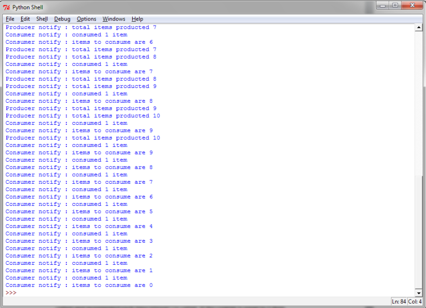

## 条件变量

### 1.条件变量介绍

解释条件机制最好的例子还是生产者-消费者问题。在本例中，**只要缓存不满，生产者一直向缓存生产；只要缓存不空，消费者一直从缓存取出（之后销毁）。当缓冲队列不为空的时候，生产者将通知消费者；当缓冲队列不满的时候，消费者将通知生产者**。

为了演示条件机制，我们将再一次使用生产者——消费者的例子：

```python{.line-numbers}
from threading import Thread, Condition
import time

items = []
condition = Condition()

class consumer(Thread):

    def __init__(self):
        Thread.__init__(self)

    def consume(self):
        global condition
        global items
        condition.acquire()
        while len(items) == 0:
            condition.wait()
            print("Consumer notify : no item to consume")
        items.pop()
        print("Consumer notify : consumed 1 item")
        print("Consumer notify : items to consume are " + str(len(items)))

        condition.notify()
        condition.release()

    def run(self):
        for i in range(0, 20):
            time.sleep(2)
            self.consume()

class producer(Thread):

    def __init__(self):
        Thread.__init__(self)

    def produce(self):
        global condition
        global items
        condition.acquire()
        while len(items) == 10:
            condition.wait()
            print("Producer notify : items producted are " + str(len(items)))
            print("Producer notify : stop the production!!")
        items.append(1)
        print("Producer notify : total items producted " + str(len(items)))
        condition.notify()
        condition.release()

    def run(self):
        for i in range(0, 20):
            time.sleep(1)
            self.produce()

if __name__ == "__main__":
    producer = producer()
    consumer = consumer()
    producer.start()
    consumer.start()
    producer.join()
    consumer.join()
```

运行的结果如下：

<div align="center">
    
</div>

乍一看这段代码好像会死锁，因为 condition.acquire() 之后就在 .wait() 了，好像会一直持有锁。**其实 .wait() 会将锁释放，然后等待其他线程 .notify() 之后会重新尝试获得锁**。但是要注意 .notify() 并不会自动释放锁，所以代码中有两行，先 .notify() 然后再 .release()（release() 之后才会完全释放重入锁）。wait() 里面实际有一个释放锁重新获得锁的过程。

Python 对条件同步的实现很有趣。如果没有已经存在的锁传给构造器的话，内部的 _Condition 会创建一个 RLock() 对象。同时，这个 RLock 也会通过 acquire() 和 release() 管理：

```python{.line-numbers}
class _Condition(_Verbose):
    def __init__(self, lock=None, verbose=None):
        _Verbose.__init__(self, verbose)
        if lock is None:
           lock = RLock()
        self.__lock = lock
```

最近看到一道面试题是这样的，开 3 个线程按照顺序打印 ABC 10 次。正好是 Condition 的使用场景，代码如下所示：

```python{.line-numbers}
"""
Three threads print A B C in order.
"""

from threading import Thread, Condition

condition = Condition()
current = "A"

class ThreadA(Thread):
    def run(self):
        global current
        for _ in range(10):
            with condition:
                while current != "A":
                    condition.wait()
                print("A")
                current = "B"
                condition.notify_all()


class ThreadB(Thread):
    def run(self):
        global current
        for _ in range(10):
            with condition:
                while current != "B":
                    condition.wait()
                print("B")
                current = "C"
                condition.notify_all()


class ThreadC(Thread):
    def run(self):
        global current
        for _ in range(10):
            with condition:
                while current != "C":
                    condition.wait()
                print("C")
                current = "A"
                condition.notify_all()


a = ThreadA()
b = ThreadB()
c = ThreadC()

a.start()
b.start()
c.start()

a.join()
b.join()
c.join()
```

原理很简单，就是线程拿到锁先检查是不是自己渴望的状态。比如打印"B"的线程，渴望的状态 current = 'B' 然后打印出B，将状态改成 C，这样就成了打印 "C" 的线程渴望的状态。但是这里不能唤醒指定的线程，只好唤醒所有的线程，让他们自己再检查一遍状态了。

### 2.条件变量源代码

```python{.line-numbers}
def Condition(*args, **kwargs):
    return _Condition(*args, **kwargs)

class _Condition(_Verbose):
    # 条件变量允许一个或多个线程进入到等待状态，直到它们被其他线程唤醒
    """Condition variables allow one or more threads to wait until they are
       notified by another thread.
    """

    def __init__(self, lock=None, verbose=None):
        ...
        if lock is None:
            lock = RLock()
        # Condition 的底层锁，默认是 RLock
        self.__lock = lock
        # 将 Condition 的 acquire() 和 release() 方法设置为底层锁的 acquire() 和 release() 方法
        self.acquire = lock.acquire
        self.release = lock.release

        try:
            self._release_save = lock._release_save
        except AttributeError:
            pass
        try:
            self._acquire_restore = lock._acquire_restore
        except AttributeError:
            pass

        try:
            # 当 lock 拥有 _is_owned 方法属性时，才会将其赋值给 Condition 的 _is_owned 方法
            # 当 lock 不拥有时，会抛出 AttributeError 异常
            self._is_owned = lock._is_owned
        except AttributeError:
            pass
        # waiting池
        self.__waiters = []

    def _is_owned(self):
        # 如果当前线程持有锁，则返回 True，否则返回 False
        # 说明 2
        # 其过程是：使用非阻塞的方式获取锁，如果获取成功，则表明当前线程，
        # + 没有持有锁，那么释放获取到的锁，并返回 False；
        # + + 否则，认为当前线程持有锁，返回 True。

        # 只有当底层锁没有 _is_owned() 方法时，才会用这种方式判断当前线程是否拥有底层锁，
        # 因为 RLock 具有 _is_owned() 方法，所以，它的对象不会使用这里的 _is_owned() 方法，
        # RLock 只会根据锁的 _owner 属性以及当前线程的 pid 是否相等来判断当前线程是否持有锁，
        # 而对于普通的 lock 对象，其没有 _is_owned() 方法，所以会调用此方法通过是否可以获取锁来判断当前
        # 线程是否持有锁（lock 不可重入）
        if self.__lock.acquire(0):
            self.__lock.release()
            return False
        else:
            return True

    # Condition也支持上下文管理。
    # + 当进入到Condtion对象时，会获取底层锁
    # + 当离开到Condtion对象时，会释放底层锁
    def __enter__(self):
        return self.__lock.__enter__()

    def __exit__(self, *args):
        return self.__lock.__exit__(*args)


    # 对于 RLock 而言，调用 release() 方法，并不一定会真正的释放锁。
    # + 因此，它提供了 _release_save() 方法，该方法会真正的释放锁，
    # + + 并且将 RLock 内部维护的状态，返回给调用方。
    # 之后，线程再次获取到底层锁之后，再将状态重置回去
    # RLock 内部会维护两个状态：owner——拥有锁的线程的 id，count——该线程获取了多少次锁

    # 只有底层锁没有 _release_save() 和 _acquire_restore() 方法时，才用下面的实现
    def _release_save(self):
        self.__lock.release()           # No state to save

    def _acquire_restore(self, x):
        self.__lock.acquire()           # Ignore saved state


    def wait(self, timeout=None):
        # 1，如果当前线程，没有获取到底层锁，那么抛出异常
        if not self._is_owned():
            raise RuntimeError("cannot wait on un-acquired lock")

        # 2，创建一个锁对象，并获取它，然后把它放到 waiting 池
        waiter = _allocate_lock()
        waiter.acquire()
        self.__waiters.append(waiter)

        # 3，释放底层锁，并保存锁对象的内部状态
        saved_state = self._release_save()
        try:    # restore state no matter what (e.g., KeyboardInterrupt)
            if timeout is None:
                # 3.1，如果 timeout 是 None，那么再次以阻塞的方式获取锁对象
                #  + 因此当前线程已经获取了一次该锁，因此当前线程会阻塞，直到其他线程释放该锁
                waiter.acquire()
                if __debug__:
                    self._note("%s.wait(): got it", self)
            else:
                # 3.2，如果 timeout 不是 None，那么重复下面的流程：
                #  + 1，以非阻塞方式获取锁
                #  + + 1.1，如果获取成功，说明其他线程释放了该锁，那么退出循环
                #  + + 1.2，如果获取失败，那么看是否达到了超时时间，如果达到了，那么退出循环；否则，继续
                #  + 2，sleep 一小段时间，然后回到步骤1
                #  + + 每次循环 sleep 的时长，是从 0.0005 秒开始，指数增长，最多增长到 0.05 秒
                #  + + + 第一次是：0.0005，第二次是：0.001，...
                endtime = _time() + timeout
                delay = 0.0005 # 500 us -> initial delay of 1 ms
                while True:
                    gotit = waiter.acquire(0)
                    if gotit:
                        break
                    remaining = endtime - _time()
                    if remaining <= 0:
                        break
                    delay = min(delay * 2, remaining, .05)
                    _sleep(delay)
                if not gotit:
                    ...
                    try:
                        # 3.3，如果因为超时，而不是被唤醒，退出的 wait()，那么将锁从 waiting 池中移除
                        # 如果 timeout 不为 None，就说明不需要一直阻塞在 waiter.lock 上，只需要阻塞特定的时间段即可，那么也就不需要被 notify
                        # 唤醒，因此可以将 waiter 从 __waiters 集合中移除。gotit 为 True，说明已经有线程调用 notify 来 release 此 waiter，
                        # 后续肯定也会将此 waiter 从 __waiters 集合中移除，这里不再需要重复移除，但是如果 gotit 为 False，则需要自己手动移除，
                        # 但是注意，他有可能会和下面的 notify() 函数同时尝试从 __waiters 集合中删除 waiter，报错的话 pass 就行
                        self.__waiters.remove(waiter)
                    except ValueError:
                        pass
                else:
                    ...
        finally:
            # 4，获取底层锁，并重置锁对象的内部状态
            self._acquire_restore(saved_state)

    def notify(self, n=1):
        # 1，如果当前线程，没有获取到底层锁，那么抛出异常
        if not self._is_owned():
            raise RuntimeError("cannot notify on un-acquired lock")

        __waiters = self.__waiters
        waiters = __waiters[:n]
        if not waiters:
            if __debug__:
                self._note("%s.notify(): no waiters", self)
            return
        self._note("%s.notify(): notifying %d waiter%s", self, n,
                   n!=1 and "s" or "")

        # 2，唤醒 waiting 池中前 n 个线程，并将他们从 waiting 池中移除
        for waiter in waiters:
            waiter.release()
            try:
                __waiters.remove(waiter)
            except ValueError:
                pass

    def notifyAll(self):
        self.notify(len(self.__waiters))

    notify_all = notifyAll
```

总结来说，通过调用条件变量 condition 的 wait 方法，可以让多个线程阻塞在 condition 上，在 wait 阻塞的过程中，每一个线程会创建一个 waiter 锁，先获取此 waiter 锁一次，然后将此 waiter 添加到 __waiters 集合中。然后再释放底层锁，让其它线程也可以调用 condition 的 wait 和 notify 方法。释放底层锁之后，线程会再次调用 waiter 的 acquire 方法直接阻塞。然后其它线程可以调用 notify 方法，
遍历 __waiters 集合，唤醒阻塞在每一个 waiter 上的线程。但是其它线程被唤醒之后，还得通过 _acquire_restore 重新获取底层锁，否则不能继续往下执行。