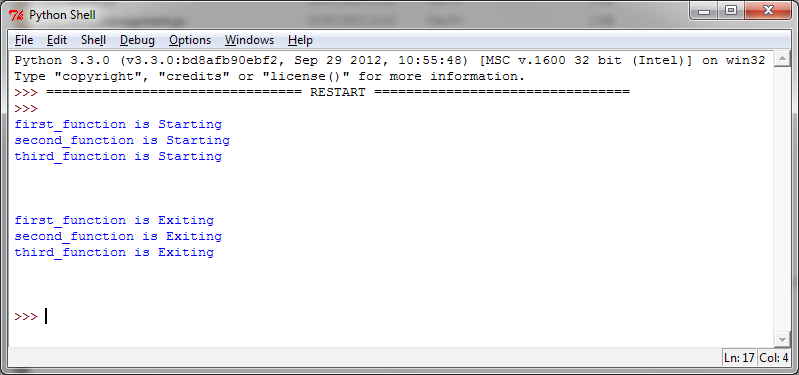
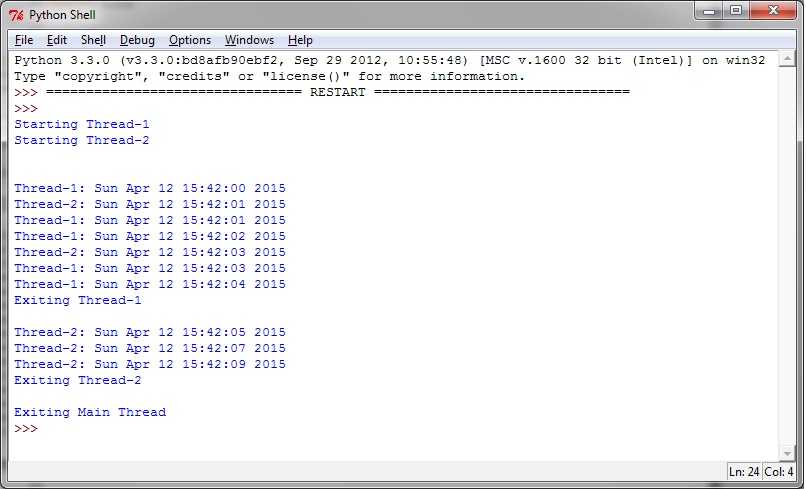
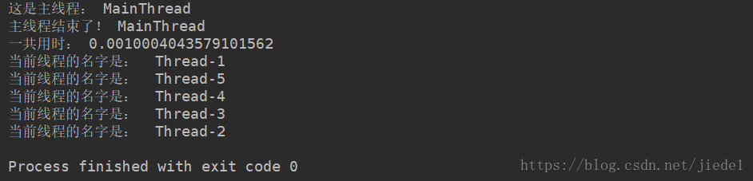
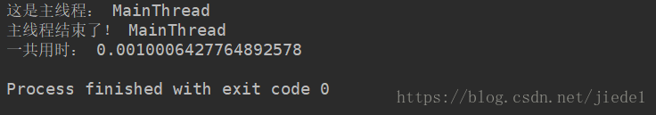
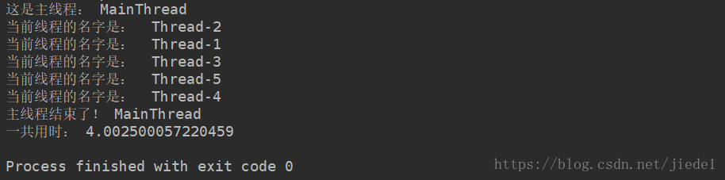

# 线程

### 1.介绍线程

线程是独立的处理流程，可以和系统的其他线程并行或并发地执行。多线程可以共享数据和资源，利用所谓的共享内存空间。线程和进程的具体实现取决于你要运行的操作系统，但是总体来讲，我们可以说线程是包含在进程中的，同一进程的多个不同的线程可以共享相同的资源。相比而言，进程之间不会共享资源。

每一个线程基本上包含3个元素：程序计数器，寄存器和栈。与同一进程的其他线程共享的资源基本上包括数据和系统资源。每一个线程也有自己的运行状态，可以和其他线程同步，这点和进程一样。线程的状态大体上可以分为 ready，running，blocked。**线程的典型应用是应用软件的并行化——为了充分利用现代的多核处理器，使每个核心可以运行单个线程**。相比于进程，使用线程的优势主要是性能。相比之下，在进程之间切换上下文要比在统一进程的多线程之间切换上下文要重的多。

**多线程编程一般使用共享内容空间进行线程间的通讯。这就使管理内容空间成为多线程编程的重点和难点**。

### 2.如何定义一个线程

使用线程最简单的一个方法是，用一个目标函数实例化一个 Thread 然后调用 start() 方法启动它。Python 的 threading 模块提供了 Thread() 方法在不同的线程中运行函数或处理过程等。

```python
class threading.Thread(group=None, target=None, name=None, args=(), kwargs={})
```

上面的代码中：

- group: 一般设置为 `None`，这是为以后的一些特性预留的
- target: 当线程启动的时候要执行的函数
- name: 线程的名字，默认会分配一个唯一名字 Thread-N
- args: 传递给 target 的参数，要使用tuple类型
- kwargs: 同上，使用字典类型dict

创建线程的方法非常实用，通过`target`参数、`arg`和`kwarg`告诉线程应该做什么。下面这个例子传递一个数字给线程（这个数字正好等于线程号码），目标函数会打印出这个数字。

让我们看一下如何通过 threading 模块创建线程，只需要几行代码就可以了：

```python{.line-numbers}
import threading

def function(i):
    print ("function called by thread %i\n" % i)
    return

threads = []

for i in range(5):
    t = threading.Thread(target=function , args=(i, ))
    threads.append(t)
    t.start()
    t.join()
```

因为写了 t.join() ，这意味着，t 线程结束之前并不会看到后续的线程，换句话说，主线程会调用 t 线程，然后等待 t 线程完成再执行 for 循环开启下一个 t 线程，事实上，这段代码是顺序运行的，实际运行顺序永远是 01234 顺序出现。

线程被创建之后并不会马上运行，需要手动调用 start() ， join() 让调用它的线程一直等待直到执行结束（即阻塞调用它的主线程， t 线程执行结束，主线程才会继续执行）。

```python
t.start()
t.join()
```

### 3 线程命名

每一个 Thread 实例创建的时候都有一个带默认值的名字，并且可以修改。在服务端通常一个服务进程都有多个线程服务，负责不同的操作，这时候命名线程是很实用的。为了演示如何确定正在运行的线程，我们创建了三个目标函数，并且引入了 time 在运行期间挂起 2s，让结果更明显。

```python{.line-numbers}
import threading
import time

def first_function():
    print(threading.currentThread().getName() + str(' is Starting '))
    time.sleep(2)
    print (threading.currentThread().getName() + str(' is Exiting '))
    return

def second_function():
    print(threading.currentThread().getName() + str(' is Starting '))
    time.sleep(2)
    print (threading.currentThread().getName() + str(' is Exiting '))
    return

def third_function():
    print(threading.currentThread().getName() + str(' is Starting '))
    time.sleep(2)
    print(threading.currentThread().getName() + str(' is Exiting '))
    return

if __name__ == "__main__":
    t1 = threading.Thread(name='first_function', target=first_function)
    t2 = threading.Thread(name='second_function', target=second_function)
    t3 = threading.Thread(name='third_function', target=third_function)
    t1.start()
    t2.start()
    t3.start()
```

输出如下图所示：

<div align="center">
    
</div>

我们使用目标函数实例化线程。同时，我们传入 name 参数作为线程的名字，如果不传这个参数，将使用默认的参数：

```python
t1 = threading.Thread(name='first_function', target=first_function)
t2 = threading.Thread(name='second_function', target=second_function)
t3 = threading.Thread(target=third_function)
```

如果改为这里的代码，那么线程3将会输出的是 `Thread-1 is Starting` 以及 `Thread-1 is Exiting`

### 4.实现线程

使用 threading 模块实现一个新的线程，需要下面 3 步：

- 定义一个 Thread 类的子类
- 重写 `__init__(self [,args])` 方法，可以添加额外的参数
- 最后，需要重写 `run(self, [,args])` 方法来实现线程要做的事情

当你创建了新的 Thread 子类的时候，你可以实例化这个类，调用 start() 方法来启动它。线程启动之后将会执行 run() 方法。

为了在子类中实现线程，我们定义了 myThread 类。其中有两个方法需要手动实现：

```python
import threading
import time
import _thread

exitFlag = 0

class myThread (threading.Thread):
    def __init__(self, threadID, name, counter):
        threading.Thread.__init__(self)
        self.threadID = threadID
        self.name = name
        self.counter = counter

    def run(self):
        print("Starting " + self.name)
        print_time(self.name, self.counter, 5)
        print("Exiting " + self.name)

    def print_time(threadName, delay, counter):
        while counter:
            if exitFlag:
                _thread.exit()
            time.sleep(delay)
            print("%s: %s" % (threadName, time.ctime(time.time())))
            counter -= 1

# Create new threads
thread1 = myThread(1, "Thread-1", 1)
thread2 = myThread(2, "Thread-2", 2)

# Start new Threads
thread1.start()
thread2.start()

# 以下两行为译者添加，如果要获得和图片相同的结果，
# 下面两行是必须的。疑似原作者的疏漏
thread1.join()
thread2.join()
print("Exiting Main Thread")
```

上面的代码输出结果如下：

<div align="center">
    
</div>

threading 模块是创建和管理线程的首选形式。每一个线程都通过一个继承 Thread 类，重写 run() 方法来实现逻辑，这个方法是线程的入口。在主程序中，我们创建了多个 myThread 的类型实例，然后执行 start() 方法启动它们。调用 `Thread.__init__` 构造器方法是必须的，通过它我们可以给线程定义一些名字或分组之类的属性。调用 start() 之后线程变为活跃状态，并且持续直到 run() 结束，或者中间出现异常。所有的线程都执行完成之后，程序结束。

join() 命令控制主线程的终止。

### 5.线程的 join 和 setDaemon 方法

当一个进程启动之后，会默认产生一个主线程，因为线程是程序执行流的最小单元，当设置多线程时，主线程会创建多个子线程，在 python 中，默认情况下（其实就是 setDaemon(False)），**主线程执行完自己的任务以后，就退出了，此时子线程会继续执行自己的任务，直到自己的任务结束**，例子见下面一。

当我们使用 setDaemon(True) 方法，设置子线程为守护线程时，**主线程一旦执行结束，则全部线程全部被终止执行，可能出现的情况就是，子线程的任务还没有完全执行结束，就被迫停止**，例子见下面二。

此时 join 的作用就凸显出来了，join 所完成的工作就是线程同步，**即主线程任务结束之后，进入阻塞状态，一直等待其他的子线程执行结束之后，主线程在终止**，例子见下面三。

join 有一个 timeout 参数：**当设置守护线程时，含义是主线程对于子线程等待 timeout 的时间将会杀死该子线程，最后退出程序**。所以说，如果有 10 个子线程，全部的等待时间就是每个 timeout 的累加和。简单的来说，就是给每个子线程一个 timeout 的时间，让他去执行，时间一到，不管任务有没有完成，直接杀死。

没有设置守护线程时，主线程将会等待 timeout 的累加和这样的一段时间，**时间一到，主线程结束，但是并没有杀死子线程，子线程依然可以继续执行，直到子线程全部结束**，程序退出。

#### 5.1 Python 多线程的默认情况

```python{.line-numbers}
import threading
import time

def run():
    time.sleep(2)
    print('当前线程的名字是： ', threading.current_thread().name)
    time.sleep(2)


if __name__ == '__main__':

    start_time = time.time()

    print('这是主线程：', threading.current_thread().name)
    thread_list = []
    for i in range(5):
        t = threading.Thread(target=run)
        thread_list.append(t)

    for t in thread_list:
        t.start()

    print('主线程结束！' , threading.current_thread().name)
    print('一共用时：', time.time()-start_time)
```

其执行结果如下：

<div align="center">
    
</div>

我们的计时是对主线程计时，主线程结束，计时随之结束，打印出主线程的用时。主线程的任务完成之后，主线程随之结束，子线程继续执行自己的任务，直到全部的子线程的任务全部结束，程序结束。

#### 5.2 设置守护线程

```python{.line-numbers}
import threading
import time

def run():

    time.sleep(2)
    print('当前线程的名字是： ', threading.current_thread().name)
    time.sleep(2)


if __name__ == '__main__':

    start_time = time.time()

    print('这是主线程：', threading.current_thread().name)
    thread_list = []
    for i in range(5):
        t = threading.Thread(target=run)
        thread_list.append(t)

    for t in thread_list:
        t.setDaemon(True)
        t.start()

    print('主线程结束了！' , threading.current_thread().name)
    print('一共用时：', time.time()-start_time)
```

其执行结果如下，注意请确保 setDaemon() 在 start() 之前。非常明显的看到，主线程结束以后，子线程还没有来得及执行，整个程序就退出了。

<div align="center">
    
</div>

#### 5.3 join 的作用

```python{.line-numbers}
import threading
import time

def run():

    time.sleep(2)
    print('当前线程的名字是： ', threading.current_thread().name)
    time.sleep(2)


if __name__ == '__main__':

    start_time = time.time()

    print('这是主线程：', threading.current_thread().name)
    thread_list = []
    for i in range(5):
        t = threading.Thread(target=run)
        thread_list.append(t)

    for t in thread_list:
        t.setDaemon(True)
        t.start()

    for t in thread_list:
        t.join()

    print('主线程结束了！' , threading.current_thread().name)
    print('一共用时：', time.time()-start_time)
```

其执行结果如下，可以看到，主线程一直等待全部的子线程结束之后，主线程自身才结束，程序退出。

<div align="center">
    
</div>