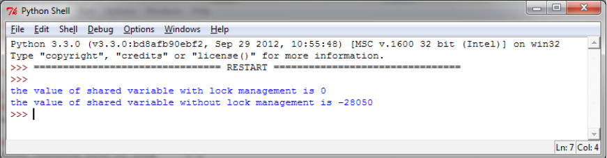
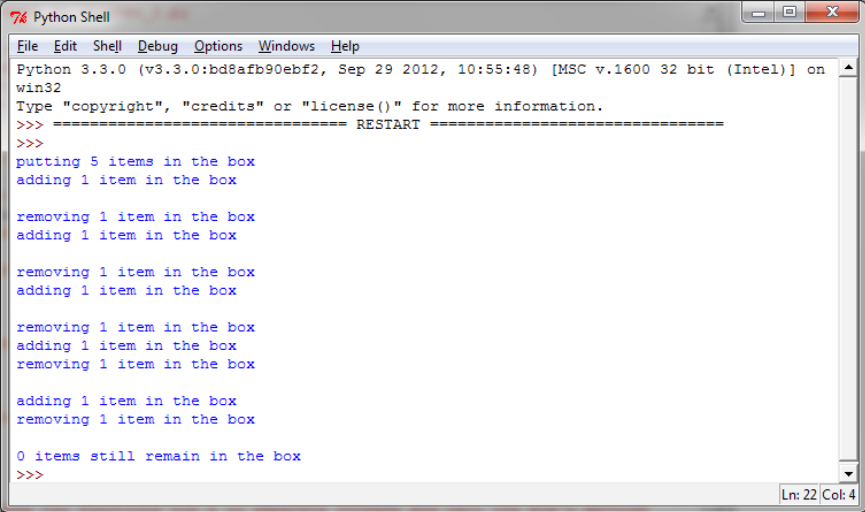

## 1.锁（Lock）

当两个或以上对共享内存的操作发生在并发线程中，并且至少有一个可以改变数据，又没有同步机制的条件下，就会产生竞争条件，可能会导致执行无效代码、bug、或异常行为。竞争条件最简单的解决方法是使用锁。锁的操作非常简单，当一个线程需要访问部分共享内存时，它必须先获得锁才能访问。此线程对这部分共享资源使用完成之后，该线程必须释放锁，然后其他线程就可以拿到这个锁并访问这部分资源了。

很显然，避免竞争条件出现是非常重要的，所以我们要保证，在同一时刻只有一个线程允许访问共享内存。尽管原理很简单，但是这样使用是 work 的。然而，在实际使用的过程中，我们发现这个方法经常会导致一种糟糕的死锁现象。当不同的线程要求得到一个锁时，死锁就会发生，这时程序不可能继续执行，因为它们互相拿着对方需要的锁。

在这里，我们描述了 Python 的线程同步机制，lock()。**通过它我们可以将共享资源某一时刻的访问限制在单一线程或单一类型的线程上，线程必须得到锁才能使用资源，并且之后必须允许其他线程使用相同的资源**。

下面的例子展示了如何通过 lock() 管理线程。在下面的代码中，我们有两个函数：increment() 和 decrement()。第一个函数对共享资源执行加1的操作，另一个函数执行减 1，两个函数分别使用线程封装。除此之外，每一个函数都有一个循环重复执行操作。我们想要保证，通过对共享资源的管理，执行结果是共享资源最后等于初始值 0。

```python{.line-numbers}
# -*- coding: utf-8 -*-

import threading

shared_resource_with_lock = 0
shared_resource_with_no_lock = 0
COUNT = 100000
shared_resource_lock = threading.Lock()

# 有锁的情况
def increment_with_lock():
    global shared_resource_with_lock
    for i in range(COUNT):
        shared_resource_lock.acquire()
        shared_resource_with_lock += 1
        shared_resource_lock.release()

def decrement_with_lock():
    global shared_resource_with_lock
    for i in range(COUNT):
        shared_resource_lock.acquire()
        shared_resource_with_lock -= 1
        shared_resource_lock.release()

# 没有锁的情况
def increment_without_lock():
    global shared_resource_with_no_lock
    for i in range(COUNT):
        shared_resource_with_no_lock += 1

def decrement_without_lock():
    global shared_resource_with_no_lock
    for i in range(COUNT):
        shared_resource_with_no_lock -= 1

if __name__ == "__main__":
    t1 = threading.Thread(target=increment_with_lock)
    t2 = threading.Thread(target=decrement_with_lock)
    t3 = threading.Thread(target=increment_without_lock)
    t4 = threading.Thread(target=decrement_without_lock)
    t1.start()
    t2.start()
    t3.start()
    t4.start()
    t1.join()
    t2.join()
    t3.join()
    t4.join()
    print ("the value of shared variable with lock management is %s" % shared_resource_with_lock)
    print ("the value of shared variable with race condition is %s" % shared_resource_with_no_lock)
```

代码的执行结果如下：

<div align="center">
    
</div>

可以看出，如果有锁来管理线程的话，我们会得到正确的结果。这里要注意，没有锁的情况下并不一定会得到错误的结果，但是重复执行多次，总会出现错误的结果。而有锁的情况结果总会是正确的。

让我们总结一下：

- 锁有两种状态： locked（被某一线程拿到）和 unlocked（可用状态）
- 我们有两个方法来操作锁： acquire() 和 release()

需要遵循以下规则：

- 如果状态是 unlocked，可以调用 acquire() 将状态改为 locked
- 如果状态是 locked，acquire() 会被 block 直到另一线程调用 release() 释放锁
- 如果状态是 unlocked，调用 release() 将导致 RuntimError 异常
- 如果状态是 locked，可以调用 release() 将状态改为 unlocked

## 2.可重入锁（Reetrant Lock）

### 2.1 可重入锁使用

RLock 其实叫做 "Reentrant Lock"，就是可以重复进入的锁，也叫做"递归锁"。这种锁对比 Lock 有是三个特点：

1. 谁拿到谁释放。如果线程 A 拿到锁，线程 B 无法释放这个锁，只有 A 可以释放；
2. 同一线程可以多次拿到该锁，即可以 acquire 多次；
3. acquire 多少次就必须 release 多少次，只有最后一次 release 才能改变 RLock 的状态为 unlocked.

在示例代码中，我们引入了 Box 类，有 add() 方法和 remove() 方法，提供了进入 execute() 方法的入口。execute() 的执行由 Rlock() 控制：

```python{.line-numbers}
import threading
import time

class Box(object):
    lock = threading.RLock()

    def __init__(self):
        self.total_items = 0

    def execute(self, n):
        Box.lock.acquire()
        self.total_items += n
        Box.lock.release()

    def add(self):
        Box.lock.acquire()
        self.execute(1)
        Box.lock.release()

    def remove(self):
        Box.lock.acquire()
        self.execute(-1)
        Box.lock.release()

## These two functions run n in separate
## threads and call the Box's methods
def adder(box, items):
    while items > 0:
        print("adding 1 item in the box")
        box.add()
        time.sleep(1)
        items -= 1

def remover(box, items):
    while items > 0:
        print("removing 1 item in the box")
        box.remove()
        time.sleep(1)
        items -= 1

## the main program build some
## threads and make sure it works
if __name__ == "__main__":
    items = 5
    print("putting %s items in the box " % items)
    box = Box()
    t1 = threading.Thread(target=adder, args=(box, items))
    t2 = threading.Thread(target=remover, args=(box, items))
    t1.start()
    t2.start()

    t1.join()
    t2.join()
    print("%s items still remain in the box " % box.total_items)
```

运行结果如下：

<div align="center">
    
</div>

### 2.2 可重入锁源码

可重入锁 RLock 的源码在 threading.py 文件中，如下所示：

```python{.line-numbers}
def RLock(*args, **kwargs):
    """
    该工厂函数返回一个新的可重入锁。
    一个可重入锁必须由创建它的线程释放。一旦一个线程获得了一个可重入锁，该线程可用无阻塞的再次获取。每次获取锁后必须进行释放。
    Python支持用C语言实现的 RLock 锁和用Python本身实现的 RLock 锁，默认使用的是C语言版本的
    """
    if _CRLock is None:
        return _PyRLock(*args, **kwargs)
    return _CRLock(*args, **kwargs)

class _RLock:
    # RLock 的核心即 acquire 和 release 这两个方法

    def __init__(self):
        # 分配一个锁
        self._block = _allocate_lock()  
        # RLock 对象所属的线程 pid
        self._owner = None  
        # 锁计数器，对于 RLock 对象所在线程，每获取一次就加一，相对的每次释放就减一，当减到零时，就会释放内部创建的锁，这样其他线程就可以继续获得这个锁。
        self._count = 0     

    def acquire(self, blocking=True, timeout=-1):
        # 获取当前线程的 pid
        me = get_ident()    
        # 如果当前线程的 pid 是 RLock 对象所在的线程，那么对计数器进行加一操作
        if self._owner == me:   
            self._count += 1
            return 1
        # 如果不满足上述条件：
        # 1. 当前线程非RLock对象所在线程
        # 2. RLock 对象还未持有锁，即 self.owner = None
        # 那么当 blocking=True 时，当前线程被阻塞，直到持有锁的线程将锁释放后，rc = True
        # 当 blocking=False 时，可以非阻塞的获取。如果获取锁成功，rc = True；获取失败，rc = False
        rc = self._block.acquire(blocking, timeout)
        if rc:
            # 记录持有锁的线程的 pid
            self._owner = me    
            # 将计数器重置到 1
            self._count = 1     
        return rc

    def release(self):
        # 如果持有锁的线程非当前线程，则抛异常
        if self._owner != get_ident():  
            raise RuntimeError("cannot release un-acquired lock")
        # 每次释放对计数器进行减一
        self._count = count = self._count - 1
        # 如果计数器减到 0，那么释放 RLock 内部的锁，此时其他线程就可以获取到锁   
        if not count:   
            # 还原 RLock 对象持有锁的拥有者 None
            self._owner = None    
            # 释放锁
            self._block.release() 
```

