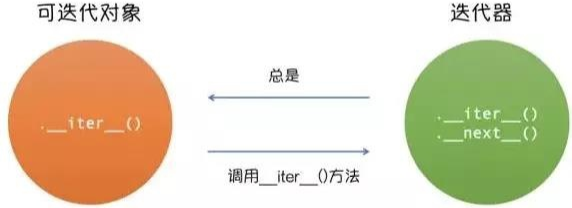

# 迭代器

## 1.绪论

事实上，Python、C++、JAVA 等语言中都有**迭代器**的概念，用法相近，均旨在解决"**如何在复杂场景下尽可能简便地获取数据**"的问题。迭代器的含义类似于遍历链表时所用到的 cur 指针 —— 总是指向当前位置并知道下一个位置 next。

<div align="center">
    
</div>

上面的图片较好地展现了 Python 可迭代对象 (iterable)、迭代器 (iterator)、生成器 (generator) 等概念的基本联系。

## 2.可迭代对象（Iterable）

可迭代对象 (Iterable) 是一种能逐一返回其成员项的对象，常包括：

- 所有内置序列对象 (字符串、列表、元组)
- 部分内置非序列对象 (字典、集合、文件对象等)
- 其他支持迭代协议的对象 (定义有 **`__iter__()`** 方法)
- 其他支持序列协议的对象 (定义有 **`__getitem__()`** 方法)

既可用内置函数 hasattr() 检查一个对象是否支持迭代协议 (定义有 **`__iter__()`** 方法)，以判断其是否为可迭代对象：

```python
# 可见以下常见的内置类型均支持迭代协议 —— 为可迭代对象
>>> hasattr([], "__iter__"), hasattr({}, "__iter__"), hasattr('', "__iter__"), hasattr(set(), "__iter__"), hasattr((), "__iter__")
(True, True, True, True, True)
```

也可用内置函数 `isinstance()` 并结合 collections 模块中的抽象基类 (ABC) Iterable，以判断一个对象是否为可迭代对象：

```python
>>> from collections import Iterable
# 测试常见数据类型的对象, 可见均为可迭代对象(iterable)
>>> isinstance([], Iterable), isinstance({}, Iterable), isinstance('', Iterable), isinstance(set(), Iterable), isinstance((), Iterable)
(True, True, True, True, True)
```

可迭代对象可用于 for 循环 及各种 以 iterable 为形参的函数/方法 中 (如 zip()、map()、enumerate() 等)，例如：

```python
>>> help(map)
Help on class map in module builtins:
 
class map(object)
 |  map(func, *iterables) --> map object
 |  
 |  Make an iterator that computes the function using arguments from
 |  each of the iterables.  Stops when the shortest iterable is exhausted.
 |  
 |  Methods defined here:
 |  
 |  __getattribute__(self, name, /)
 |      Return getattr(self, name).
 |  
 |  __iter__(self, /)
 |      Implement iter(self).
 |  
 |  __new__(*args, **kwargs) from builtins.type
 |      Create and return a new object.  See help(type) for accurate signature.
 |  
 |  __next__(self, /)
 |      Implement next(self).
 |  
 |  __reduce__(...)
 |      Return state information for pickling.
```

由此可知，map 派生自 object，其形参包含了可迭代对象 iterables。不仅如此，map 内部定义了 `__iter__()` 方法 (支持迭代协议)，因此 map 对象也是可迭代对象。而 zip()、enumerate() 等函数亦复如是。

可迭代对象 作为 **实参** 传递给 **内置函数 iter()** 时，将 **返回一个该可迭代对象的迭代器 (irerator)**。这种迭代器适用于对值/数据成员/元素的集合的一次性遍历。使用可迭代对象时，通常无需自行调用 iter() 或自行处理迭代器对象，for 语句会在内部处理好这些操作 —— 创建一个临时量 (临时的未命名变量) 用于在循环/迭代/遍历期间保存迭代器。

关于 for 语句，简要回顾如下：

- for 语句用于对序列 (str、list、tuple) 等**可迭代对象中的元素执行顺序迭代**。
- for 语句在迭代前，先**调用 `__iter__()` 或者 `iter()` 创建一个该可迭代对象的迭代器 (iterator)，并用一个临时量 (临时的未命名变量) 保存该迭代器**。迭代过程即**调用 `__next__()` 或者 `next()` 顺序遍历和操作迭代器的元素**。当**迭代器元素耗尽**时 (包括序列为空 或 迭代器引发 StopIteration 异常等)，执行 else 语句 (如果有)，然后结束 for 循环 (每次 for 循环都会有一个**内部计数器**用于跟踪下一个元素，每次迭代都会使计数器递增，当计数器值增至迭代器元素总数时循环就会终止)。
- 若 for 语句中执行了**break**，则直接跳过 (for 循环的) else 语句并结束 for 循环。
- 若 for 语句中执行了**continue**，则跳过本次迭代，直接进行下一次。
- for 语句的内部机制**确保不因迭代器元素耗尽引发 StopIteration 异常** (例如使用 try-except 语句 详见下节)。

例如，经常使用 for 语句对 range() 函数对象迭代，**而 range() 函数对象就是一个可迭代对象 (但不是迭代器)**，不过我们可以调用 range() 函数对象的 `__iter()__` 方法，获取对应的迭代器：

```python
>>> for i in range(1):
	    pass
 
>>> isinstance(range(1), Iterable), isinstance(range(1), Iterator)
(True, False)
>>> isinstance(range(1)__iter__(), Iterator)
True
```

## 3.迭代器

### 3.1 介绍

迭代器 (iterator) 是一种用于表示**一连串数据流**的对象。迭代器对象要求支持**迭代器协议 —— 对象须同时支持/实现 `__iter__()` 方法和 `__next__()` 方法**。协议规定：

- `iterator.__iter__()` 方法**返回迭代器对象本身**(对可迭代对象使用内置函数 `iter()` 将返回迭代器)，这是同时允许容器和迭代器配合 `for .. in ...` 语句使用所必须的。
- `iterator.__next__()` 方法**返回容器的下一项元素**。重复调用迭代器的 `__next__()` 方法 (或用内置函数 next()) 将依次返回数据流中的元素，并在元素耗尽 (无数据项/元素) 时引发 StopIteration 异常。**迭代器对象中的数据项/元素耗尽后，再次调用 `__next__()` 或 `next()` 只会再次引发 StopIteration 异常**。

迭代器必须具有 `__iter__()` 方法用来返回该迭代器对象自身，因此**迭代器必为可迭代对象 (但可迭代对象不一定是迭代器)**。换言之，只有迭代器有 `__next__()` 方法，而可迭代对象没有。

<div align="center">
    
</div>

迭代器可用于其他可迭代对象适用的大部分场合 (比如 map 同时实现了 `__iter__()` 和 `__next__()` 方法，故其亦为迭代器)。

```python
>>> from collections import Iterable, Iterator  # 导入两个抽象基类, 可用于检查对象类型
 
>>> lst = [0, 1, 2]  # 创建示例列表 lst
>>> isinstance(lst, Iterable), isinstance(lst, Iterator)  # lst 是可迭代对象, 但还不是迭代器
(True, False)
 
 
>>> iterator = iter(lst)  # 返回可迭代对象 lst 的迭代器, 并由变量 iterator 指向/保存该迭代器
>>> isinstance(iterator, Iterable), isinstance(iterator, Iterator)  # iterator 既是可迭代对象, 也是迭代器
(True, True)
>>> type(iterator)  # 更具体地, 这是一个 “列表迭代器 (list_iterator)”  
<class 'list_iterator'>
 
 
>>> next(iterator)  # 使用内置函数 next(), 输出一个元素
0
>>> iterator.__next__()  # 等价于使用成员方法 __next__(), 输出一个元素
1
>>> next(iterator)  # next() 和 __next__() 效果完全相同
2
>>> next(iterator)  # 迭代器元素耗尽, 调用 next() 引发 StopIteration 异常
Traceback (most recent call last):
  File "<pyshell#32>", line 1, in <module>
    next(iterator)
StopIteration
>>> next(iterator)  # 迭代器元素耗尽, 再次调用 next() 仍会引发 StopIteration 异常
Traceback (most recent call last):
  File "<pyshell#33>", line 1, in <module>
    next(iterator)
StopIteration
```

综上可知，迭代器表示一个数据流，可被 next() 函数不断调用，从首项开始不断返回下一项数据/元素 (**而不能回退**) 直至耗尽，并抛出 StopIteration。

事实上，不断调用 next() 函数，内部指针随之后移并依次访问各元素；当遍历尽所有元素时，意味着指针移到了最后一个元素后，故不论怎么调用 next() 函数，都无法访问到元素，于是引发 StopIteration 异常；若想要从头访问，须再次载入迭代器对象。

而该**数据流**可视为一个未知长度的"有序序列"(比喻)，只能通过不断调用 next() 按需计算下一项数据/元素。因此，迭代器是惰性的，需要返回下一个项时才会计算。

事实上，若有必要，迭代器甚至可表示为一个 无限大的数据流，例如全体自然数。而有限长度的序列/非序列等是无法做到存储全体自然数的。 

由此可知，for 循环的本质即：**对可迭代对象调用 iter() 返回一个关于该对象的迭代器，然后不断调用 next() 迭代/遍历元素**。例如：

```python
>>> for i in [0, 1, 2]:
	print(i)
 
0
1
2
 
# --------------------------------------- 等价于 ----------------------------------------
 
>>> iterator = iter([0, 1, 2])  # 将从可迭代对象(list)返回一个迭代器
>>> while True:
	    try:                    # 使用 try-except 语句捕获异常, 避免抛出 StopIteration 异常并正常结束循环
		    j = next(iterator)  # 返回迭代器的下一个元素
		    print(j)
	    except StopIteration:   # 当元素耗尽时, 捕获 StopIteration 异常并退出循环/迭代
		    break  
 
0
1
2
```

这就是为什么我们 从未见过 for 语句引发 StopIteration 异常 —— 它可以使用 try-except 语句 或其他相关代码实现 异常捕获、处理与自动结束。

### 3.2 文件迭代器

设 test.txt 文件的内容为：

```text
First Line
Last Line
```

通常使用 read() / readline() / readlines() 等方式读取文件内容，例如：

```python
>>> fin = open('test.txt')
>>> fin.readline()
'First Line\n'
>>> fin.readline()
'Last Line'
>>> fin.readline()  # fin.readline() 若返回一个空字符串, 说明已经已经读取到最后一行
''
>>> fin.close()
```

当然，用 for 循环更便捷：

```python
>>> fin = open('test.txt')
>>> for line in fin:
	print(line, end='')  # print() 函数默认结尾是换行符 \n , 这里手动改成 ''
 
First Line
Last Line
>>> fin.close()
```

其实，还可以使用 文件迭代器，例如：

```python
>>> fin = open('test.txt')  # 文件对象
>>> fin.__next__()
'First Line\n'
>>> fin.__next__()
'Last Line'
>>> fin.__next__()
Traceback (most recent call last):
  File "<pyshell#8>", line 1, in <module>
    fin.__next__()
StopIteration
>>> fin.close()
```

可见，还可使用 `__next__()` 方法 (当然 next() 亦可) 逐行读取文件内容，这说明文件对象是迭代器：

```python
>>> from collections import Iterable, Iterator  # 抽象基类
>>> fin = open('test.txt')
>>> isinstance(fin, Iterable), isinstance(fin, Iterator)  # 文件对象 fin 也是迭代器
(True, True)
```

正如 3.1 节结尾所述：**for 循环本质就是对可迭代对象调用 `iter()` 返回一个迭代器，然后不断调用 `next()` 迭代/遍历元素**。

### 3.3 自定义类实现迭代器

除了 Python 内置迭代器对象，更主要的用法还是自定义迭代器 —— 自定义类并在其成员方法中同时实现 `__iter__()` 方法和 `__next__()` 方法 (以支持迭代器协议) 创建迭代器。例如：

```python
>>> class Counter:
    ''' 自定义一个示例迭代器类 (简化到甚至构造方法 __init__() 都不实现) '''
	def __iter__(self):  # __iter__() 方法用于初始化并返回迭代器
		self.num = 0
		return self      # 只需返回自身
	def __next__(self):
		i = self.num
		self.num += 1
		return i
 
>>> counter = Counter()  # 实例化一个类对象
>>> isinstance(counter, Iterable), isinstance(counter, Iterator)  # 支持迭代器协议, 是迭代器
(True, True)
 
>>> count_iter = iter(counter)  # 返回一个迭代器
>>> isinstance(count_iter, Iterable), isinstance(count_iter, Iterator)  # 迭代器
(True, True)
 
>>> next(count_iter)  # 理论上可以无限迭代所有的自然数
0
>>> next(count_iter)
1
>>> next(count_iter)
2
```

StopIteration 异常用于**标识迭代的完成，防止出现无限循环的情况**，在 `__next__()` 方法中可以自行设置在完成指定循环次数后触发 StopIteration 异常以结束迭代：

```python
>>> class Counter2:
	def __iter__(self):
		self.num = 0
		return self
	def __next__(self):
		if self.num <= 3:  # 自定义上迭代上限/停止迭代条件
			i = self.num
			self.num += 1
			return i
		else:
			raise StopIteration  # 主动抛出异常
 
>>> counter2 = Counter2()
>>> count_iter2 = iter(counter2)
>>> next(count_iter2)
0
>>> next(count_iter2)
1
>>> next(count_iter2)
2
>>> next(count_iter2)
3
>>> next(count_iter2)
Traceback (most recent call last):
  File "<pyshell#84>", line 1, in <module>
    next(count_iter2)
  File "<pyshell#77>", line 11, in __next__
    raise StopIteration
StopIteration
```

## 4.相关内置函数

### 4.1 返回迭代器对象——iter()

内置函数 `iter()` 通过可迭代对象返回一个关于可迭代对象的迭代器对象，其函数原型为：

```python
iter(object[, sentinel])
```

其中，**第一个参数 object 必须是支持迭代协议 (有 `__iter__()` 方法)或支持序列协议 (有 `__getitem__()` 方法，且数字参数从 0 开始) 的集合对象**。若不支持这些协议，会引发 TypeError。只传入第一个参数 object 并返回一个迭代器的用法十分常见，上文例子很多不再赘述。

注意，若还传入第二个参数 sentinel，则**参数 object 必须是一个可调用 (callable) 的对象 (如函数)**。这种情况下生成的迭代器对象，每次调用其 `__next__()` 方法时，都会不带实参地调用 object。若返回的结果是 sentinel 则触发 StopIteration，否则返回调用结果。例如：

```python
>>> callable(list)  # 使用内置 callable() 函数判断是否为可调用对象 (callable object)
True
# ------------------------------------------------------------------------------
>>> reader1 = iter(list, '')  # 参数 sentinel='', 迭代器只有返回 '' 时才会停止
>>> next(reader)
[]
>>> next(reader)
[]
# ------------------------------------------------------------------------------
>>> reader2 = iter(list, [])  # 参数 sentinel='', 迭代器只有返回 [] 时才会停止
>>> next(reader2)
Traceback (most recent call last):
  File "<pyshell#128>", line 1, in <module>
    next(reader2)
StopIteration
```

可见，使用内置 `callable()` 函数可判断对象是否可调用。而若类实现了 `__callable__()` 方法，则其实例是可调用的。

当然，上例仅是说明语法，而非正常用法。有一个经典用法是：读取文件的行直至到达某一特定行为止。下例读取一个文件，直到 readline() 方法返回一个空字符串：

```python
>>> with open('test.txt') as file:  # with 语句下的上下文管理器
	for line in iter(file.readline, ''):  # 逐行读取并迭代
		process_line(line)  # 处理该行的统称/笼统表示方式
```

### 4.2 调用下一个元素 next()

内置函数 next() 通过 调用迭代器的 `__next__()` 方法返回下一项元素，其函数原型为：

```python
next(iterator[, default])
```

其中，第一个参数 **iterator 为迭代器对象**。第二个参数 **default** 可选，用于设置**在没有下一项元素时返回的默认值/缺省值**，以避免抛出异常中断程序。若不设置参数 default，且调用 next() 时无下一项元素则会触发 StopIteration 异常。例如：

```python
>>> list_iter1 = iter([0, 1, 2])
>>> next(list_iter1)
0
>>> next(list_iter1)
1
>>> next(list_iter1)
2
>>> next(list_iter1)  # 不指定 default 且迭代器元素耗尽, 将引发 StopIteration 异常
Traceback (most recent call last):
  File "<pyshell#117>", line 1, in <module>
    next(list_iter1)
StopIteration
>>> next(list_iter1, 'stop')  # 指定 default, 则迭代器元素耗尽, 将输出 default
'stop'
```

上例不仅说明了 迭代器元素耗尽时抛出 StopIteration 异常的原因，还给出了 next() 函数的另一种用法来避免引发异常。

# 生成器

## 1.绪论

在诸如 C、C++、JAVA 等主流语言中，并无生成器的概念。而在 Python 中，生成器则与迭代器相辅相成 —— **迭代器是生成一个遍历数据的迭代工具，而生成器则是一个数据生成工具**。

举个典例：已知，斐波那契数列从第三个数开始等于前两数之和。假设想获取 1024 万个斐波那契数列，按传统方法需开辟一个长度为 1024 万的数组，再按照斐波那契数列定义逐个计算 —— 显然内存限制下，不可能同时创建如此多元素。即便可以创建，也会占用大量存储空间。而且倘若仅需访问其中几个元素，那么大部分元素的空间都浪费了。

那么，可否像迭代器那样构建一个生成数据的方法，每次调用才获取下一个结果，而不是将所有结果都存在内存中呢？**这就是生成器 —— 一种惰性序列，需要多少就调用多少次 —— 按需生成，以从根本上解决存储问题**。

## 2.生成器（generator）

### 2.1 说明 

生成器 (generator) 用于返回生成器迭代器 (generator iterator)。已知：

- 可迭代对象(iterable)：支持迭代协议 (实现了`__iter__()`方法)
- 迭代器(iterator)：支持 迭代器协议 (实现了`__iter__()`和`__next__()`方法)

生成器无需显式定义 `__iter__()` 和 `__next__()` 方法，因为实例化生成器对象后将 自动支持迭代器协议，故 生成器也是一种迭代器，是实现迭代器协议的便捷方式，写法更为紧凑。

通常，使用两种方式创建生成器：生成器函数及生成(器)表达式。(生成器通常默认指前者)

### 2.2 生成器

#### 2.2.1 原理概述

生成器函数用于创建**生成器迭代器(generator iterator)**。与普通函数的区别在于：普通函数使用 **return** 返回结果，而生成器函数使用 **yield** 返回结果。

使用了 **yield 表达式** 的生成器函数**返回一个迭代器对象**，以便于通过 for 循环或 next() 函数等逐项获取元素/数据/值/成员 (以下统称元素)。换言之，**使用了 yield 表达式的函数就是生成器函数**。

更具体地，在调用生成器函数时，每次遇到 yield 表达式，生成器函数就会暂停并保存当前位置的执行状态 (包括局部变量和挂起的 try 语句)，然后返回 yield 表达式的值，并在下一次对生成器函数执行 next() 方法时，从上次离开的位置继续执行 (有别于每次调用普通函数都重新从头开始)。

例如，生成斐波那契数列前 max 个数，使用普通函数：

```python
>>> def fib_common(max):
	a, b, counter = 0, 1, 0
	while counter < max:
		print(a)
		a, b = b, a + b
		counter += 1
	return
 
>>> fib_common(8)  # max=8
0 
1 
1 
2 
3 
5 
8 
13 
```

此时，将 print(a) 改成 yield a 即得 生成器函数：

```python
>>> def fib_gen(max):
	a, b, counter = 0, 1, 0
	while counter < max:
		yield a  # fib_gen() 因此变为生成器函数
		a, b = b, a + b
		counter += 1
	return
```

定义一个生成器对象 fg，检验其性质：

```python
>>> fg = fib_gen(8)  # max=8
>>> fg
<generator object fib_gen at 0x0000020E3F704780>
 
>>> from collections import Iterable, Iterator, Generator  # 导入抽象基类检验
>>> isinstance(fg, Iterable), isinstance(fg, Iterator), isinstance(fg, Generator)  # 可见生成器对象也是一种可迭代对象
(True, True, True)
```

可见，含有 yield 表达式的生成器函数，其实例是生成器 (generator)，也是迭代器 (iterator)，更为可迭代对象 (iterable)。这时，要想迭代生成器的各项元素，就必须显式或隐式地调用 next() 函数，一个一个地计算结果：

```python
>>> import sys
>>> while True:  
        try:
			# 显式调用 next() 获取生成器对象的元素
            print(next(fg))  
        except StopIteration:
            sys.exit()
        
0
1
1
2
3
5
8
13
```

#### 2.2.2 yield 表达式

自定义一个生成器函数：

```python
>>> def num_gen():  # 因为包含 yield 表达式, 所以该函数是生成器函数
	index = 0
	print('index=', index)
	yield 0
 
	index += 1
	print('index=', index)
	yield 1
 
	index += 1
	print('index=', index)
	yield 2
 
>>> hasattr(num_gen, '__next__')  # 生成器函数 num_gen 并未显式支持迭代器协议
False
```

调用该生成器函数时，需要先实例化一个生成器 (迭代器) 对象：

```python
>>> ng = num_gen()
>>> hasattr(ng, '__iter__'), hasattr(ng, '__next__')  # 实例化后的对象自动支持迭代器协议, 而无需显式定义
(True, True)                                          # 可见生成器也是迭代器 (自然也是可迭代对象)
```

可见，**生成器函数的实例对象自动支持迭代器协议 (自动创建 `__iter__()` 和 `__next__()` 方法)**。再使用 `next()` 函数或调用 `__next__()` 方法依次获取下一项：

```python
>>> next(ng)
index=0
0
>>> ng.__next__()  # 可见每次重新调用, 都会从上一次执行中断的位置状态继续
index=1
1
>>> next(ng)  # index 的变化就证明了上述结论
index=2
2
>>> next(ng)  # 生成器作为迭代器, 同样会因为迭代元素的耗尽而引发 StopIteration 异常
Traceback (most recent call last):
  File "<pyshell#126>", line 1, in <module>
    next(ng)
StopIteration
```

根据 print() 函数的打印结果可知，函数每次遇到 yield 就返回 yield 表达值中的值 (和 return 一样会将 yield 后的内容返回给调用方)，**然后中断执行退出函数，保存当前位置状态，并在下一次调用 next() 时恢复所保存的位置状态，继续往下执行**。可以说，每次调用 next() 都相当于执行一个代码块，而代码块之间的是由 yield 表达式分隔的。生成器作为迭代器，同样会因为迭代元素的耗尽而引发 StopIteration 异常，以避免无限迭代。

注意，上述解读提到了 每次 yield 中断执行都会保存当前位置状态，而 num_gen() 函数的局部变量 index 状态变化就证明了这一点。

#### 2.2.3 生成器表达式

事实上，除了用生成器函数来创建生成器，还可以通过另一种简洁的方式 —— 生成器表达式。

**形式上，生成器表达式类似于列表推导式，但使用的是圆括号 () 而非方括号 []**；结果上，生成器表达式不会像列表推导式一样一次性返回所有计算结果，而是通过延迟计算，按需生成。可以说，生成器表达式结合了迭代功能和解析功能。

```python
>>> [i for i in range(4)]  # 列表推导式 / 列表解析式
[0, 1, 2, 3]  # 返回完整列表对象
 
>>> (j for j in range(4))  # 生成器表达式
<generator object <genexpr> at 0x0000020E3F704888>  # 返回一个生成器对象
```

生成器表达式可认为是一种特殊的生成器函数，类似于 lambda 表达式之于普通函数的关系。**虽然形式上更简洁、紧凑，但生成器表达式同样能够返回一个生成器(迭代器)**。因为生成器也是迭代器、可迭代对象，所以适用于后者的函数同样适用于前者并常配合使用，例如：

```python
>>> sum(j for j in range(4))  # sum(iterable, start=0, /)
6
>>> min(j for j in range(4))  # min(iterable, *[, default=obj, key=func])
0 
>>> max(j for j in range(4))  # max(iterable, *[, default=obj, key=func])
3
# -----------------------------------------------------------------------------------
>>> x = [1, 2, 3]
>>> y = [4, 5, 6]
>>> list(i+j for i, j in zip(x, y))  # zip(iter1 [,iter2 [...]])
[5, 7, 9]
```

事实上，生成器表达器比列表推导式更高效，例如：

```python
>>> sum((j for j in range(4)))  # 为方便, 也可省略生成器表达式的内层圆括号
6
 
>>> sum([j for j in range(4)])  # 列表推导式写法
6
```

上述两个例子中，生成器表达式一边生成元素一边求和，而列表推导式却先计算出一个完整列表再求和，从而后者多出的操作引起了时间效率的落后。

此外，要逐个输出元素，需要先实例化生成器对象(使用变量保存生成器对象的引用/指向生成器对象)，再使用 `__next__()` 方法或 `next()` 函数获取下一项元素，例如：

```python
>>> str_gen = (s for s in 'abc')
>>> str_gen
<generator object <genexpr> at 0x0000020E3F704888>
 
>>> str_gen.__next__()
'a'
>>> next(str_gen)
'b'
>>> str_gen.__next__()
'c'
>>> next(str_gen)
Traceback (most recent call last):
  File "<pyshell#167>", line 1, in <module>
    next(str_gen)
StopIteration
```

总而言之，生成器不会将所有的元素一次性加载到内存中，而是延迟计算，一次计算一个结果。