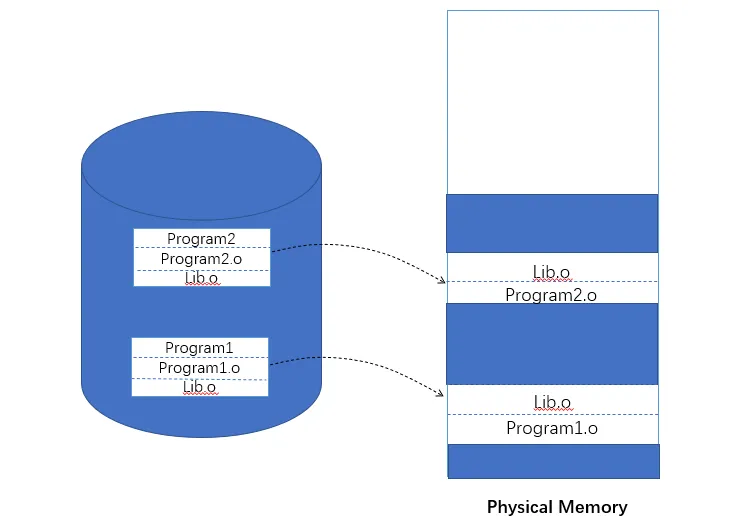
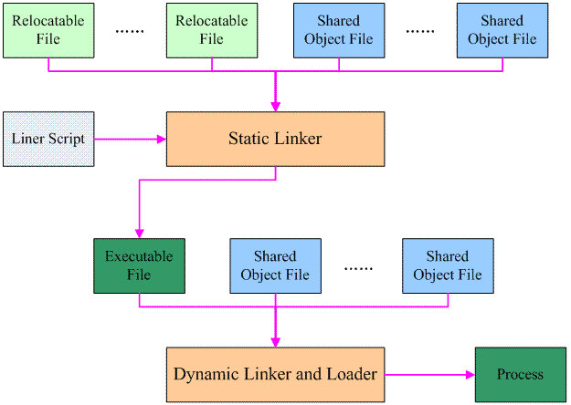
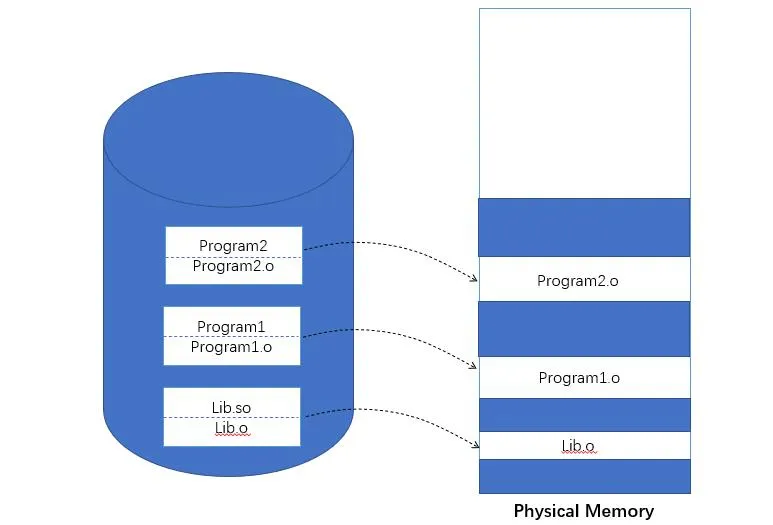
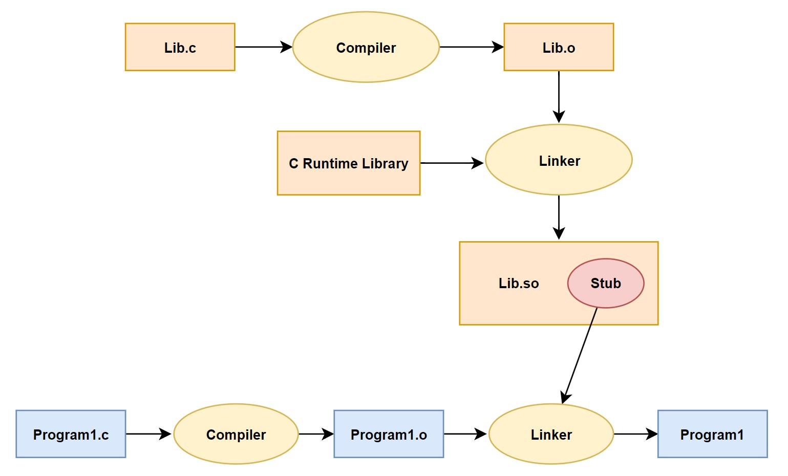
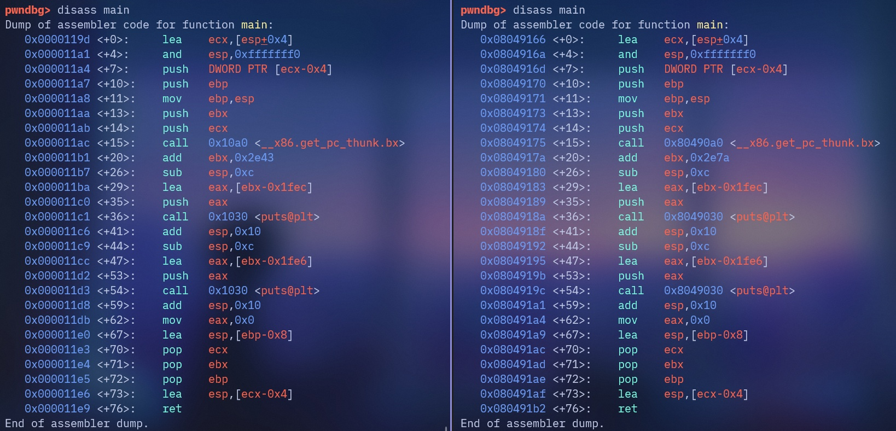

# 动态链接之一

## 一、为什么要使用动态链接

### 1.内存和磁盘空间

在操作系统和硬件不发达的早期，绝大部分系统采用静态链接的方案。随着计算机软件的发展，**<font color="red">这种方法的缺点很快就暴露出来了，那就是静态连接的方式对于计算机内存和磁盘的空间浪费非常严重</font>**。特别是多进程操作系统情况下，比如每个程序内部除了都保留着 **`printf()`** 函数、**`scanf()`** 函数、**`strlen()`** 等这样的公用库函数，还有数量相当可观的其他库函数及它们所需要的辅助数据结构。

比如下面的 Program1 和 Program2 分别包含 Programl.o 和 Program2.o 两个模块，他们都需要 Lib.o 模块。静态链接情况下，两个目标文件都用到 Lib.o 这个模块，所以这两个目标文件同时在链接输出的可执行文件 Program1 和 program2 中都有 Lib.o 副本，同时运行时，Lib.o 在磁盘和内存中有两份副本，当系统中有大量类似 Lib.o 的多个程序共享目标文件时，就会浪费很大空间。

<div align="center">
    
</div>

### 2.程序开发和发布

假设程序 Program1 所使用的 Lib.o 是由一个第三方厂商提供的，当该厂商更新了 Lib.o 的时候 (比如修正了 lib.o 里面包含的一个 Bug)，那么 Program1 的厂商就需要拿到最新版的 Lib.o，然后将其与 Program1.o 链接后，将新的 Program1 整个发布给用户。**<font color="red">因此即一旦程序中有任何模块更新，整个程序就要重新链接、发布给用户</font>**。

比如一个程序有 20 个模块，每个模块 1MB，那么每次更新任何一个模块，用户就得重新获取这个 20MB 的程序。因此，静态链接对程序的更新、部署和发布也会带来很多麻烦。

### 3.动态链接

要解决空间浪费和更新困难这两个问题最简单的办法就是把程序的模块相互分割开来，形成独立的文件。**<font color="red">简单地讲，就是等到程序要运行时才对程序需要的目标文件进行链接。也就是说，也就是把链接这个过程推迟到了运行时再进行，这就是动态链接 (Dynamic Linking) 的基本思想</font>**。动态链接的基本过程如下所示：

<div align="center">
    
</div>

还是以 Program1 和 Program2 为例，假设我们保留 Program1.o、Program2.o 和 Lib.o 三个目标文件。当我们要运行 Program1 这个程序时，系统首先加载 Program1.o，当系统发现 Program1.o 中用到了 Lib.o，即 Program1.o 依赖于 Lib.o，那么系统接着加载 Lib.o，如果 Program1.o 或 Lib.o 还依赖于其他目标文件，系统会按照这种方法将它们全部加载至内存。

所有需要的目标文件加载完毕之后，如果依赖关系满足，即所有依赖的目标文件都存在于磁盘，系统开始进行链接工作，包括符号解析、地址重定位等。完成这些步骤之后，系统开始把控制权交给 Program1.o 的程序入口处，程序开始运行。这时如果我们需要运行 Program2，那么系统只需要加载 Program2，而不需要重新加载 Lib.o，因为内存中已经存在了一份 Lib.o 的副本，系统要做的只是将 Program2.o 和 Lib.o 链接起来。

<div align="center">
    
</div>

可以看到，磁盘和内存中只存在一份 Lib.o，而不是两份。另外在内存中共享一个目标文件模块的好处不仅仅是节省内存，它还有如下两个好处：

**（1）减少物理页面的换入换出**

当进程 A 运行后，libc.so 的代码页被加载到物理内存中。不久后进程 B 也需要 libc.so。由于代码页已经在内存中了，操作系统完全避免了从磁盘再次读取 libc.so 文件的需要，也就是避免了一次代价高昂的"换入"操作。**<font color="red">由于多个进程都在频繁访问同一份物理内存页（libc 的代码页），操作系统会认为这些页是“热点”页</font>**，非常重要。因此，在内存紧张时，OS 会尽可能地将这个被广泛共享的库代码保留在物理内存中，从而减少了它被"换出"的几率。

**（2）增加 CPU 缓存的命中率**

进程 A 调用了 **`libc.so`** 中的 **`printf`** 函数，**`printf`** 函数的机器码从物理内存被加载到了 CPU 的指令缓存中（L1、L2、L3 Cache）。接着操作系统进行了上下文切换，轮到进程 B 执行，进程 B 也恰好要调用 **`printf`** 函数。此时 CPU 去取指令时，有极大的概率发现这些指令已经在高速缓存里了（是刚才进程 A 留下的），这就发生了一次缓存命中，因此可以增加 CPU 缓存命中率。

### 4.动态链接的基本实现

动态链接的基本思想是**把程序按照模块拆分成各个相对独立部分，在程序运行时才将它们链接在一起形成一个完整的程序**，而不是像静态链接一样把所有的程序模块都链接成一个个单独的可执行文件，然后才运行。

目前主流的操作系统几乎都支持动态链接这种方式，在 Linux 系统中，ELF 动态链接文件被称为动态共享对象 (DSO，Dynamic Shared Objects)，简称共享对象，**<font color="red">它们一般都是以 ".so" 为扩展名的一些文件</font>**；而在 Windows 系统中，动态链接文件被称为动态链接库(Dynamical Linking Library)，**<font color="red">它们通常就是我们平时很常见的以 ".dll" 为扩展名的文件</font>**。

>从本质上讲，普通可执行程序和动态链接库中都包含指令和数据，这一点没有区别。在使用动态链接库的情况下，程序本身被分为了程序主要模块 (Program1) 和动态链接库(Lib.so)，但实际上它们都可以看作是整个程序的一个模块，**所以当我们提到程序模块时可以指程序主模块也可以指动态链接库**。

在 Linux 中，常用的 C 语言库的运行库 glibc，它的动态链接形式的版本保存在 **`/lib`** 目录下，文件名叫做 **`libc.so`**。整个系统只保留一份 C 语言库的动态链接文件 **`libc.so`**，而所有的 C 语言编写的、动态链接的程序都可以在运行时使用它。当程序被装载的时候，系统的动态链接器会将程序所需要的所有动态链接库 (最基本的就是 **`libc.so`**) 装载到进程的地址空间，并且将程序中所有未决议的符号绑定到相应的动态链接库中，并进行重定位工作。

程序与 **`libc.so`** 之间真正的链接工作是由动态链接器完成的，而不是由我们前面看到过的静态链接器 ld 完成的。也就是说，动态链接是把链接这个过程从本来的程序装载前被推迟到了装载的时候。

## 二、简单的动态链接的例子

### 1.动态链接举例说明

```c{.line-numbers}
/* Program1.c */
#include "Lib.h"

int main() {
   foobar(1);
   return 0;
}

/* Program2.c */
#include "Lib.h"

int main() {
   foobar(2);
   return 0;
}

/* Lib.c */
#include <stdio.h>

void foobar(int i) {
   printf("Printing from Lib.so %d\n", i);
}

/* Lib.h */
#ifndef LIB_H
#define LIB_H

void foobar(int i);

#endif
```

然后我们使用 gcc 将 Lib.c 编译成一个共享对象文件：

```c{.line-numbers}
gcc -fPIC -shared -o Lib.so Lib.c
```

其中，**`-shared`** 表示产生共享对象，**`-fPIC`** 选项用于在 gcc 编译时生成位置无关代码。共享库（动态链接库）需要在内存中不同的进程之间共享，所以它们的代码必须能够在不同的地址空间中运行。**<font color="red">如果代码中有绝对地址引用，那么在不同进程中加载到不同的地址时就会出问题（也就是把共享对象加载到不同进程的虚拟地址空间中不同地址）</font>**。位置无关代码通过使用相对地址而不是绝对地址来解决这个问题。动态库需要被加载到不同进程的随机地址空间（ASLR），绝对地址会失效，必须通过相对地址访问资源。

这个时候我们得到了一个 Lib.so 文件，这就是包含了 Lib.c 的 **`foobar()`** 函数的共享对象文件。然后我们分别编译 Program1.c 和 Program2.c：

```c{.line-numbers}
gcc -o Program1 Program1.c ./Lib.so
gcc -o Program2 Program2.c ./Lib.so
```

这样两个程序 Program1 和 Program2 都使用了 Lib.so 里面的 foobar() 函数，从 Program1 的角度来看，整个编译和连接的过程如下所示：

<div align="center">
    
</div>

>在静态链接时，整个程序最终只有一个可执行文件，它是一个不可以分割的整体；但是在动态链接下，一个程序被分成了若干个文件，**有程序的主要部分，即可执行文件 (Program1) 和程序所依赖的共享对象 (Lib.so)**，很多时候我们也把这些部分称为模块，即动态链接下的可执行文件和共享对象都可以看作是程序的一个模块。

让我们再回到动态链接的机制上来，当程序模块 Programl.c 被编译成为 Program1.o 时，编译器还不不知道 **`foobar()`** 函数的地址。这是 **<font color="red">因为编译器采用分离编译（separate compilation）模式处理源文件，每个 **`.c/.cpp`** 文件作为独立的翻译单元进行处理</font>**。在这种模式下，编译器面临三个核心限制：

- **地址空间隔离**：编译器只能看到当前翻译单元内的符号定义，完全无法获知其他模块中函数和变量的内存布局。当 Program1.c 被编译时，编译器对 **`foobar()`** 函数一无所知——不知道它定义在哪个文件、占用多少内存空间，更不知道最终的运行时地址。
- **地址基准未确定**：**<font color="red">编译阶段所有 section 都从地址 0 开始分配，这只是临时的相对地址</font>**。最终的运行时地址要等到链接阶段合并所有模块后才能确定。即使编译器知道 **`foobar()`** 在某个模块的相对位置，也无法计算出它的最终地址。
- **外部依赖的符号引用**：当遇到 extern 声明或未在当前模块定义的符号时，编译器只能创建符号引用（symbol reference），在生成的机器码中留下占位符，等待后续的链接过程填充。

当链接器将 Program1.o 链接成可执行文件时，这时候链接器必须确定 Programl.o 中所引用的 **`foobar()`** 函数的性质。如果 **`foobar()`** 是一个定义与其他静态目标模块中的函数，那么链接器将会按照静态链接的规则，将 Program1.o 中的 foobar 地址引用重定位; 如果 **`foobar()`** 是一个定义在某个动态共享对象中的函数，那么链接器就会将这个符号的引用标记为一个动态链接的符号，不对它进行地址重定位，把这个过程留到装载时再进行。

那么这里就有个问题，链接器如何知道 foobar 的引用是一个静态符号还是一个动态符号? 这实际上就是我们要用到 Lib.so 的原因。Lib.so 中保存了完整的符号信息( 因为运行时进行动态链接还须使用符号信息)，把 Lib.so 也作为链接的输入文件之一，链接器在解析符号时就可以知道：foobar 是一个定义在 Lib.so 的动态符号。这样链接器就可以对 foobar 的引用做特殊的处理，使它成为一个对动态符号的引用。

这里解释一下所谓的特殊处理，在 ELF 格式的目标文件中，未解析的外部符号通过精确的数据结构——动态符号表 **`.dynsym`** 表示：

```c{.line-numbers}
typedef struct {
   Elf32_Word   st_name;
   Elf32_Addr   st_value;
   Elf32_Word   st_size;
   unsigned char   st_info;
   unsigned char   st_other;
   Elf32_Half   st_shndx;
} Elf32_Sym;

typedef struct {
   Elf64_Word   st_name; // 4 B (B for bytes)
   unsigned char   st_info; // 1 B
   unsigned char   st_other; // 1 B
   Elf64_Half   st_shndx; // 2 B
   Elf64_Addr   st_value; // 8 B
   Elf64_Xword   st_size; // 8 B
} Elf64_Sym; // total size = 24 B
```

未解析符号的关键特征：

- **`st_shndx = SHN_UNDEF(0)`**：表示符号未在当前目标文件中定义；
- **`st_value = 0`**：未定义符号的值为 0；
- 重定位表条目：为每个符号引用创建重定位条目，包含偏移量、重定位类型和符号索引信息；

### 2.动态链接程序运行时地址空间分布

我们在上述的 Lib.c 程序的 **`foobar()`** 函数中加入 **`sleep()`** 函数：

```c{.line-numbers}
/* Lib.c */
#include <stdio.h>
#include <stdlib.h>

void foobar(int i) {
    printf("Printing from Lib.so %d\n", i);
    sleep(-1);
}
```

然后查看 Program1 进程的虚拟地址空间分布：

```c{.line-numbers}
monica@monica-virtual-machine:~/linkers_loaders$ cat /proc/3963/maps
6638e000-6638f000 r--p 00000000 08:03 949163                             /home/monica/linkers_loaders/Program1
6638f000-66390000 r-xp 00001000 08:03 949163                             /home/monica/linkers_loaders/Program1
66390000-66391000 r--p 00002000 08:03 949163                             /home/monica/linkers_loaders/Program1
66391000-66392000 r--p 00002000 08:03 949163                             /home/monica/linkers_loaders/Program1
66392000-66393000 rw-p 00003000 08:03 949163                             /home/monica/linkers_loaders/Program1
6658f000-665b1000 rw-p 00000000 00:00 0                                  [heap]
f144c000-f146c000 r--p 00000000 08:03 1312958                            /usr/lib32/libc.so.6
f146c000-f15ea000 r-xp 00020000 08:03 1312958                            /usr/lib32/libc.so.6
f15ea000-f166f000 r--p 0019e000 08:03 1312958                            /usr/lib32/libc.so.6
f166f000-f1670000 ---p 00223000 08:03 1312958                            /usr/lib32/libc.so.6
f1670000-f1672000 r--p 00223000 08:03 1312958                            /usr/lib32/libc.so.6
f1672000-f1673000 rw-p 00225000 08:03 1312958                            /usr/lib32/libc.so.6
f1673000-f167d000 rw-p 00000000 00:00 0 
f168d000-f168e000 r--p 00000000 08:03 917573                             /home/monica/linkers_loaders/Lib.so
f168e000-f168f000 r-xp 00001000 08:03 917573                             /home/monica/linkers_loaders/Lib.so
f168f000-f1690000 r--p 00002000 08:03 917573                             /home/monica/linkers_loaders/Lib.so
f1690000-f1691000 r--p 00002000 08:03 917573                             /home/monica/linkers_loaders/Lib.so
f1691000-f1692000 rw-p 00003000 08:03 917573                             /home/monica/linkers_loaders/Lib.so
f1692000-f1694000 rw-p 00000000 00:00 0 
f1694000-f1698000 r--p 00000000 00:00 0                                  [vvar]
f1698000-f169a000 r-xp 00000000 00:00 0                                  [vdso]
f169a000-f169b000 r--p 00000000 08:03 1312016                            /usr/lib32/ld-linux.so.2
f169b000-f16c0000 r-xp 00001000 08:03 1312016                            /usr/lib32/ld-linux.so.2
f16c0000-f16cf000 r--p 00026000 08:03 1312016                            /usr/lib32/ld-linux.so.2
f16cf000-f16d1000 r--p 00034000 08:03 1312016                            /usr/lib32/ld-linux.so.2
f16d1000-f16d2000 rw-p 00036000 08:03 1312016                            /usr/lib32/ld-linux.so.2
ffbfb000-ffc1c000 rw-p 00000000 00:00 0                                  [stack]
```

**`Lib.so`** 与 Program1 一样都是被操作系统用同样的方法映射至进程的虚拟地址空间，Program1 除了使用 **`Lib.so`** 以外，它还用到了动态链接形式的 C 语言运行库 libc.so.6。另外还有一个共享对象就是 ld-linux.so.2，它实际上是 Linux 下的 32 位动态链接器，**<font color="red">动态链接器与普通共享对象一样被映射到了进程的地址空间。</font>**。动态链接器的简要工作流程如下所示：

1. 内核加载可执行文件 Program1 到内存中，接着内核读取可执行文件的头部信息，找到动态链接器路径，如 **`ld-linux.so.2`**，并且把动态链接器也加载到内存中；
2. 内核将控制权交给动态链接器：
    a. 加载动态链接器和程序所依赖的共享库到内存中；
    b. 解析符号（函数、变量）地址，修复重定位条目；
3. 跳转到程序入口点：将控制权交给程序的 **`main()`** 函数；

首先使用 readelf 工具来查看 Lib.so 的段表，如下所示：

```c{.line-numbers}
monica@monica-virtual-machine:~/linkers_loaders$ readelf -S Lib.so 
There are 28 section headers, starting at offset 0x34b8:

节头：
  [Nr] Name              Type            Addr     Off    Size   ES Flg Lk Inf Al
  [ 0]                   NULL            00000000 000000 000000 00      0   0  0
  [ 1] .note.gnu.bu[...] NOTE            00000154 000154 000024 00   A  0   0  4
  [ 2] .gnu.hash         GNU_HASH        00000178 000178 000020 04   A  3   0  4
  [ 3] .dynsym           DYNSYM          00000198 000198 000080 10   A  4   1  4
  [ 4] .dynstr           STRTAB          00000218 000218 000089 00   A  0   0  1
  [ 5] .gnu.version      VERSYM          000002a2 0002a2 000010 02   A  3   0  2
  [ 6] .gnu.version_r    VERNEED         000002b4 0002b4 000030 00   A  4   1  4
  [ 7] .rel.dyn          REL             000002e4 0002e4 000038 08   A  3   0  4
  [ 8] .rel.plt          REL             0000031c 00031c 000010 08  AI  3  21  4
  [ 9] .init             PROGBITS        00001000 001000 000024 00  AX  0   0  4
  [10] .plt              PROGBITS        00001030 001030 000030 04  AX  0   0 16
  [11] .plt.got          PROGBITS        00001060 001060 000008 08  AX  0   0  8
  [12] .text             PROGBITS        00001070 001070 000137 00  AX  0   0 16
  [13] .fini             PROGBITS        000011a8 0011a8 000018 00  AX  0   0  4
  [14] .rodata           PROGBITS        00002000 002000 000019 00   A  0   0  1
  [15] .eh_frame_hdr     PROGBITS        0000201c 00201c 000024 00   A  0   0  4
  [16] .eh_frame         PROGBITS        00002040 002040 000078 00   A  0   0  4
  [17] .init_array       INIT_ARRAY      00003f08 002f08 000004 04  WA  0   0  4
  [18] .fini_array       FINI_ARRAY      00003f0c 002f0c 000004 04  WA  0   0  4
  [19] .dynamic          DYNAMIC         00003f10 002f10 0000e0 08  WA  4   0  4
  [20] .got              PROGBITS        00003ff0 002ff0 000010 04  WA  0   0  4
  [21] .got.plt          PROGBITS        00004000 003000 000014 04  WA  0   0  4
  [22] .data             PROGBITS        00004014 003014 000004 00  WA  0   0  4
  [23] .bss              NOBITS          00004018 003018 000004 00  WA  0   0  1
  [24] .comment          PROGBITS        00000000 003018 00002b 01  MS  0   0  1
  [25] .symtab           SYMTAB          00000000 003044 0001d0 10     26  22  4
  [26] .strtab           STRTAB          00000000 003214 0001b4 00      0   0  1
  [27] .shstrtab         STRTAB          00000000 0033c8 0000ef 00      0   0  1
Key to Flags:
  W (write), A (alloc), X (execute), M (merge), S (strings), I (info),
  L (link order), O (extra OS processing required), G (group), T (TLS),
  C (compressed), x (unknown), o (OS specific), E (exclude),
  D (mbind), p (processor specific)
```

接着使用 readelf 工具来查看 **`Lib.so`** 的装载属性，就如我们在前面查看普通程序一样，注意 PHT 中的 **`Offset`**、**`VirtAddr`** 和 SHT 中的 **`Off`**、**`Addr`** 的值相互对应。也就是说，**链接器决定了文件的最终布局和偏移，而加载器会严格按照链接器定义的各个段的文件偏移和大小，将它们映射到内存中，并保持它们之间的相对偏移不变**。

```c{.line-numbers}
monica@xvm:~/linkers_loaders$ readelf -l Lib.so

Elf 文件类型为 DYN (共享目标文件)
Entry point 0x0
There are 9 program headers, starting at offset 52

程序头：
  Type           Offset   VirtAddr   PhysAddr   FileSiz MemSiz  Flg Align
  LOAD           0x000000 0x00000000 0x00000000 0x0032c 0x0032c R   0x1000
  LOAD           0x001000 0x00001000 0x00001000 0x001c0 0x001c0 R E 0x1000
  LOAD           0x002000 0x00002000 0x00002000 0x000b8 0x000b8 R   0x1000
  LOAD           0x002f08 0x00003f08 0x00003f08 0x00110 0x00114 RW  0x1000
  DYNAMIC        0x002f10 0x00003f10 0x00003f10 0x000e0 0x000e0 RW  0x4
  NOTE           0x000154 0x00000154 0x00000154 0x00024 0x00024 R   0x4
  GNU_EH_FRAME   0x00201c 0x0000201c 0x0000201c 0x00024 0x00024 R   0x4
  GNU_STACK      0x000000 0x00000000 0x00000000 0x00000 0x00000 RW  0x10
  GNU_RELRO      0x002f08 0x00003f08 0x00003f08 0x000f8 0x000f8 R   0x1

 Section to Segment mapping:
  段节...
   00     .note.gnu.build-id .gnu.hash .dynsym .dynstr .gnu.version .gnu.version_r .rel.dyn .rel.plt 
   01     .init .plt .plt.got .text .fini 
   02     .rodata .eh_frame_hdr .eh_frame 
   03     .init_array .fini_array .dynamic .got .got.plt .data .bss 
   04     .dynamic 
   05     .note.gnu.build-id 
   06     .eh_frame_hdr 
   07     
   08     .init_array .fini_array .dynamic .got 
```

从程序头表（Program Headers Table）中可以看出，动态链接模块的装载地址是从地址 0x00000000 开始的（即程序头表中第一个 **`PT_LOAD`** 段的虚拟地址）。我们知道这个地址是无效地址，并且从上面的进程虚拟空间分布看到，Lib.so 的最终装载地址并不是 0x00000000，而是 0xf168d000。**<font color="red">从这一点我们可以推断，共享对象的最终装载地址在编译时是不确定的，而是在装载时，装载器根据当前地址空间的空闲情况，动态分配一块足够大小的虚拟地址空间给相应的共享对象</font>**。

#### 2.1 GNU_RELRO 段

GNU_RELRO 技术用于增强二进制程序在运行时的安全性，它通过将动态链接所需的关键数据区域（尤其是 GOT）在加载后设置为只读，来防止攻击者通过内存写入漏洞篡改函数指针，从而有效挫败 GOT 覆写这类攻击。

在动态链接的程序中，当代码第一次调用一个外部共享库（如 libc.so）中的函数时（例如 printf），程序需要先找到这个函数在内存中的真实地址。这个解析过程由动态链接器（ld.so）完成，而解析后的地址会存储在一个叫做 **全局偏移表（Global Offset Table, GOT）** 的数据结构中。如果一个攻击者通过某种漏洞（例如缓冲区溢出）获得了向任意内存地址写入数据的能力，他就可以覆写 GOT 表中某个函数指针。比如，他可以将 printf 在 GOT 中的条目修改为恶意代码（shellcode）的地址。**这样一来，当程序下一次调用 printf 时，实际上执行的却是攻击者的恶意代码，从而导致程序被劫持**。

**1）部分 RELRO**

当使用部分 RELRO 编译时，链接器会执行以下操作：

- **重排 ELF 段的顺序：** 它会把一些在加载后就不应再改变的数据段（如 **`.init_array`**, **`.fini_array`**, **`.dynamic`**, **`.got`**）放在其他可写数据段（如 **`.data`**, **`.bss`**）之前。
- **创建 GNU_RELRO 段：** 链接器会创建一个 **`PT_GNU_RELRO`** 类型的程序头（Program Header）。这个程序头会覆盖从 **`.got`** 开始的这部分区域。比如上面的 **`GNU_RELRO`** 段的起始虚拟地址为 **`0x00003f08`**，和第 4 个 LOAD 段的起始地址相同，覆盖了第 4 个 LOAD 段中 **`.got`**、**`.got.plt`** 段的空间（大小为 0xf8）。另外，这也说明了部分 RELRO 确实会将一些不再改变的数据段放到 **`.data`** 和 **`.bss`** 段的前面。

```c{.line-numbers}
// 默认情况下，是 Full RELRO
gcc -o test test.c						
// 开启 Partial RELRO
gcc -o -Wl,-z,relro test test.c / gcc -o -z relro test test.c 
// 开启 Full RELRO
gcc -o -Wl,-z,relro,-z,now test test.c / gcc -o -z relro -z now test test.c
```

在程序启动时，动态链接器（ld.so）会解析 **`PT_GNU_RELRO`** 程序头，并将它所覆盖的内存页面的权限从"可读可写"修改为"只读"。但是部分 RELRO 只保护了 **`.got`** 表的一部分。具体来说，是那些用于存储非函数指针数据的条目。为了保证延迟绑定（Lazy Binding）能正常工作，存储函数地址的 **`.got.plt`** 节必须保持可写。因为动态链接器需要在运行时填充这些地址。因此，**`.got.plt`** 区域仍然是可写的，GOT 覆写攻击依然可能成功。

使用 checksec 来进行检查得到的结果如下：

```c{.line-numbers}
monica@monica-virtual-machine:~/linkers_loaders$ checksec Lib.so
[*] '/home/monica/linkers_loaders/Lib.so'
    Arch:       i386-32-little
    RELRO:      Partial RELRO
    Stack:      No canary found
    NX:         NX enabled
    PIE:        PIE enabled
    Stripped:   No
```

**2）完全 RELRO**

完全 RELRO 提供了更强大的保护。当使用完全 RELRO 编译时会发生以下变化：

- **禁用延迟绑定：**-z,now 选项告诉动态链接器立即解析所有外部函数和变量的地址，不要延迟；
- **在启动时解析所有符号：** 程序启动时，动态链接器会花费稍长一点的时间，一次性找到所有需要的外部函数和变量的地址，并全部填充到 **`.got`** 和 **`.got.plt`** 中；
- **将整个 GOT 设置为只读：** 因为所有的地址都已经在启动时解析完毕，程序运行期间不再需要修改 GOT 表。因此，动态链接器可以将整个 GNU_RELRO 段（现在包含了完整的 **`.got`** 和 **`.got.plt`**）全部设置为只读；

完全 RELRO 可以彻底防御 GOT 覆写攻击，攻击者无法再修改 GOT 表中的任何条目，因为整个内存区域都是只读的。使用 checksec 来进行检查得到的结果如下：

```c{.line-numbers}
monica@monica-virtual-machine:~/linkers_loaders$ checksec Program1
[*] '/home/monica/linkers_loaders/Program1'
    Arch:       i386-32-little
    RELRO:      Full RELRO
    Stack:      No canary found
    NX:         NX enabled
    PIE:        PIE enabled
    Stripped:   No
```

#### 2.2 GNU_STACK 段

PT_GNU_STACK 段主要用于指示操作系统内核或动态链接器关于程序栈 (stack) 的可执行权限。这是一个 GNU 扩展，主要用于增强安全性。传统上，为了简化某些编程技术（如蹦床函数、JIT 编译的早期形式），栈可能是可执行的。然而，可执行的栈是一个严重的安全隐患，因为它使得缓冲区溢出等漏洞更容易被利用来执行恶意代码（通过将代码注入栈中并跳转执行）。

>**`PT_GNU_STACK`**：The p_flags member specifies the permissions on the segment containing the stack and is used to indicate wether the stack should be executable. The absense of this header indicates that the stack will be executable. This marking is done through the p_flags field in the **`PT_GNU_STACK`** program header entry. If the marking is missing, kernel or dynamic linker need to assume it might need executable stack. 

## 三、地址无关代码

现在我们也得到了一个问题，那就是共享对象在被装载时，如何确定它在进程虚拟地址空间中的位置？为了实现动态链接，我们首先会遇到的问题就是共享对象地址的冲突问题。

很明显，在动态链接的情况下，如果不同的模块目标装载地址都一样是不行的。而对于单个程序来讲，我们可以手工指定进程虚拟地址空间中各个模块的地址，比如把 0x1000 到 0x2000 分配给模块 A，把地址 0x2000 到 0x3000 分配给模块 B。但是，如果某个模块被多个程序使用，甚至多个模块被多个程序使用，那么管理这些模块的地址将是一件无比繁琐的事情。

比如一个很简单的情况，一个人制作了一个程序，该程序需要用到模块 B，但是不需要用到模块 A，所以他以为地址 0x1000 到 0x2000 是空闲的，于是分配给了另外一个模块 C。这样 C 和原先的模块 A 的目标地址就冲突了，任何人以后将不能在同一个程序里面使用模块 A 和 C。想象一个有着成千上万个并且由不同公司和个人开发的共享对象的系统中，采用这种手工分配的方式几乎是不可行的。

因此，为了解决这个模块装载地址固定的问题，我们设想是否可以让共享对象在任意地址加载? 这个问题另一种表述方法就是: 共享对象在编译时不能假设自己在进程虚拟地址空间中的位置。与此不同的是，**<font color="red">可执行文件基本可以确定自己在进程虚拟空间中的起始位置，因为可执行文件往往是第一个被加载的文件</font>**，它可以选择一个固定空闲的地址，比如 Linux 下一般都是 0x08040000，Windows 下一般都是 0x0040000。

共享对象（.so）的位置不可假定是 **<font color="red">由于共享库（shared object，也就是 .so 文件）是被可执行文件或其它模块动态加载进来的</font>**，它们的加载地址要等到运行时由动态链接器来决定，因此在编译阶段无法为它们选定一个固定的虚拟地址。它们必须编译成位置无关代码（Position-Independent Code，PIC）。

可执行文件（而非共享库）在进程启动时通常是第一个映射进虚拟地址空间的二进制模块，所以链接器在把它打包时就可以给它一个"默认基址"（default load base），并让操作系统把它按这个地址加载进去——因为此时地址空间还是空闲的，不会与别的映射冲突。

### 1.装载时重定位

装载时重定位的基本思路就是，**<font color="red">在链接时，对所有绝对地址的引用不作重定位，而把这一步推迟到装载时再完成</font>**。一旦模块装载地址确定，即目标地址确定，那么系统就对程序中所有的绝对地址引用进行重定位。假设函数 foobar 相对于代码段的起始地址是 0x100，当模块被装载到 0x10000000 时，我们假设代码段位于模块的最开始，即代码段的装载地址也是 0x10000000，那么我们就可以确定 foobar 的地址为 0x10000100。这时候，系统遍历模块中的重定位表，把所有对 foobar 的地址引用都重定位至 0x10000100。

>在 Windows 中，这种装载时重定位又被叫做基址重置（Rebasing）。

但是装载时重定位的方法并不适合用来解决上面的共享对象中所存在的问题。可以想象，动态链接模块被装载映射至虚拟空间后，指令部分是在多个进程之间共享的，由于装载时重定位的方法需要修改指令，所以没有办法做到同一份指令被多个进程共享，因为指令被重定位后对于每个进程来讲是不同的。当然，动态连接库中的可修改数据部分对于不同的进程来说有多个副本，所以它们可以采用装载时重定位的方法来解决。

>如果使用装载时重定位修改指令部分的地址，那么每个进程加载库的基址可能不同，**<font color="red">导致同一份指令在内存中有不同的副本，这样就无法实现真正的共享，失去了动态链接库可以节省内存的优势</font>**。
>**<font color="red">而数据段每个进程需要有自己的副本，因为这些数据是进程私有的</font>**。因此，数据部分可以使用装载时重定位，每个进程的数据段根据加载地址进行调整，而代码段保持不变，从而实现共享。

### 2.地址无关代码

装载时重定位是解决动态模块中有绝对地址引用的办法之一，但是它有一个很大的缺点是指令部分无法在多个进程之间共享，这样就失去了动态链接节省内存的一大优势。我们还需要有一种更好的方法解决共享对象指令中对绝对地址的重定位问题。其实我们的目的很简单，希望程序模块中共享的指令部分在装载时不需要因为装载地址的改变而改变，所以实现的 **<font color="blue">基本想法就是把指令中那些需要被修改的部分分离出来，跟数据部分放在一起，这样指令部分就可以保持不变，而数据部分可以在每个进程中拥有一个副本</font>**。这种方案就是目前被称为地址无关代码 (PIC，Position-independent Code) 的技术。

PIC 的实现原理很简单，在代码中对所有全局数据和函数引用添加一个额外的中间层（GOT 和 PLT）。通过巧妙地利用链接和加载过程中的结果，使共享库的代码部分实现位置无关。

为了支撑动态链接这一工作过程，在 ELF 文件中有 3 个 Section 与之相关：

- **`.got`**：全局偏移表（Global Offset Table），用于存储外部符号的绝对地址，由链接器进行填充。
- **`.plt`**：过程链接表（Procedure Linkage Table），存有从 **`.got.plt`** 中查找外部函数地址的代码，若是第一次调用该函数，则会触发链接器解析函数地址并填充在 **`.got.plt`** 相应的位置；若函数地址已经存储在 **`.got.plt`** 中则直接跳转到对应地址继续执行。
- **`.got.plt`**：GOT 中专用于 PLT 存储外部函数地址的部分，是属于 GOT 的一部分。

类似的概念同样存在于可执行文件上，被称为位置无关可执行文件（Position-independent Executable，PIE）。上述编译指令中 **`-no-pie`** 参数的意义即为关闭 PIE。当 PIE 关闭时，链接器会默认将其加载到 OS 虚拟地址空间的代码段（Text Segment）中，此时可执行文件将会有一个固定的地址前缀（如 x86-32 下为 **`0x08048000`**，x86-64 下为 **`0x0000000000400000`**），这也正是代码段的起始地址。使用 GDB 分别对开启 PIE 和未开启 PIE 的程序进行反编译，**<font color="red">可以看见开启 PIE 的代码地址以及函数调用地址均为相对的偏移量，而未开启 PIE 的程序则全部为绝对地址</font>**：

<div align="center">
    
</div>