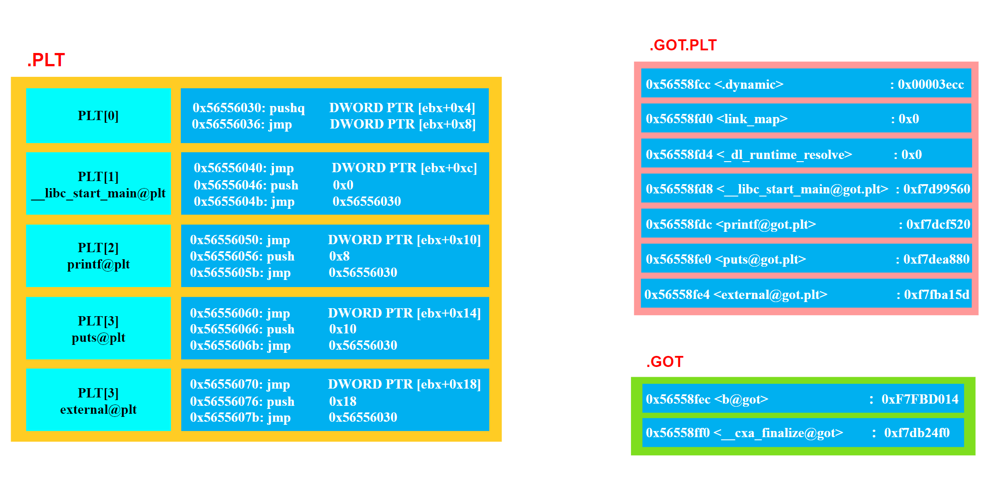

## 五、GOT 表

### 1.GOT 介绍

PIC 的一个关键点是**利用链接时已知的代码段和数据段之间的偏移**。当链接器合并多个目标文件时，它会整合它们的各个部分，形成一个大的代码段。因此，链接器了解各个部分的大小和它们的相对位置。举例来说，代码段可能在数据段前面，这意味着从代码部分中的**任意指令到数据段开头的偏移量等于代码部分的大小减去指令距离代码部分开头的偏移量**。这两个量都是链接器已知的。

<div align="center">
    
</div>

如上图所示，代码段被加载到某个地址，假设是 **`0xXXXX0000`**，紧随其后的是偏移为 **`0xXXXXF000`** 的数据段。如果代码段中偏移为 0x80 的某个指令需要引用数据部分的内容，链接器知道相对偏移量（在上图中为 **`0xEF80`**），所以可以将此偏移量编码到指令中。

>注意：如果在代码段和数据段之间放置了别的段，或者如果数据段在代码段之前，都不会影响结果。**因为链接器分配了它们放置的位置，并且知道所有段的大小**。

全局偏移表 GOT 可以帮我们实现位置无关数据寻址。**<font color="red">实际上 GOT 就是一个地址表，存储在数据段中</font>**。假设代码段中的某个指令想要引用一个变量。它会引用 GOT 中的一个条目，而不是直接使用绝对地址引用 (这将需要进行重定位)。由于 GOT 位于数据段的一个已知位置，这个引用是相对的，并且在链接器中是已知的，而 GOT 条目本身将包含变量的绝对地址：

>在动态链接的可执行文件或共享库中，有一个特殊的节，名为 **`.dynamic`**。这个节本质上是一个键值对数组，为动态链接器（ld.so）提供了所有它需要的信息，比如依赖哪些共享库、符号表在哪里、以及 GOT 的地址在哪里。记录 GOT 位置的关键“字段”就是 **`.dynamic`** 节中的一个特定条目（entry），其类型标记为 **`DT_PLTGOT`**，其值 d_ptr 直接指向了 **`.got`** 的起始虚拟地址。

<div align="center">
    
</div>

我们前面提到要使得代码地址无关，**<font color="red">基本的思想就是把跟地址相关的部分放到数据段里面</font>**，很明显，这些其他模块的全局变量的地址是跟模块装载地址有关的。ELF 的做法是在数据段里面专门建立一个指向这些变量的指针数组，也被称为全局偏移表 (Global Offset Table，GOT)，当代码需要引用该全局变量时，可以通过 GOT 中相对应的项间接引用。

通过将变量引用重定向到 GOT，我们避免了在代码段中直接使用绝对地址，而是通过 GOT 中的条目进行引用，从而减少了需要在加载时进行的具体地址修正（只需要对 GOT 修正一次）。但是我们在数据段中引入的 GOT，因为全局偏移表中仍然包含变量的绝对地址，所以需要重定位。那么这样做的优点有哪些呢？

- 加载时重定位需要对每个变量的引用都进行重定位，而在全局偏移表中，只需要对每个变量进行一次重定位；
- 数据段是可写的，并且在进程之间不共享；

举一个实际例子来说，GOT 中每个条目都有一个重定位条目，当可执行文件加载时，会根据重定位条目对全局变量进行重定位，将条目的内容设置为全局变量重定位后的地址，如下图所示：

```c{.line-numbers}
int addcnt = 0;
void addvec(int *x,int *y,int *z, int n) 
{
    int i;
    addcnt++;
    for(i = 0; i < n; i++){
        z[i] = x[i] + y[i];
    }
}
```

由下图和上述代码可以看出，addvec 函数引用了全局变量 addcnt，在 addvec 函数中执行指令 **`mov 0x2008b9(%rip)，%rax`** 时，**`0x2008b9`** 是当前执行指令的下条指令和 **`GOT[3]`** 的距离，**<font color="red">这个距离是固定的，与内存无关的</font>**，**`mov 0x2008b9(%rip)，%rax`** 指令通过访问 **`GOT[3]`** 来间接获取 addcnt 的全局变量的地址，当 addcnt 全局变量的内存地址发生变化时，只需要将 **`GOT[3]`** 的内容进行调整，addvec 的所有指令不需要进行调整，这就实现了全局变量引用的位置无关。**`add $0x1, (%rax)`** 指令将 addcnt 全局变量的值增加 1。

<div align="center">
    
</div>

### 2.实例：通过 GOT 进行数据引用 (位置无关)

#### 2.1 反汇编既 ELF 头分析

首先编写一个简单的函数，其中有一个全局变量 myglob，在函数中取全局变量的值然后加上 a 和 b 返回。然后使用 **`-fPIC`** 和 **`-shared`** 将这个代码编译成动态链接库：

```c{.line-numbers}
int my_glob = 42;

int ml_func(int a, int b) {
   return my_glob + a + b;
}
```

接下来使用 **`gcc ml_fun.c -shared -o libreloc.so -fPIC -m32`** 命令将 **`ml_func.c`** 编译成动态共享库 **`libreloc.so`**，然后查看此动态库的汇编代码：
 
```c{.line-numbers}
monica@monica-virtual-machine:~/linkers_loaders$ gcc ml_fun.c -shared -o libreloc.so -fPIC -m32
monica@monica-virtual-machine:~/linkers_loaders$ objdump -d libreloc.so 
0000114d <ml_func>:
    114d:	55                   	push   %ebp
    114e:	89 e5                	mov    %esp,%ebp
    1150:	e8 19 00 00 00       	call   116e <__x86.get_pc_thunk.ax>
    1155:	05 ab 2e 00 00       	add    $0x2eab,%eax
    115a:	8b 80 f0 ff ff ff    	mov    -0x10(%eax),%eax
    1160:	8b 10                	mov    (%eax),%edx
    1162:	8b 45 08             	mov    0x8(%ebp),%eax
    1165:	01 c2                	add    %eax,%edx
    1167:	8b 45 0c             	mov    0xc(%ebp),%eax
    116a:	01 d0                	add    %edx,%eax
    116c:	5d                   	pop    %ebp
    116d:	c3                   	ret 
```

**`call   116e <__x86.get_pc_thunk.ax>`** 指令将下一条指令的地址（即 **`0x1155`**）保存到 **`%eax`** 寄存器中，接下来 **`add    $0x2eab,%eax`** 和 **`mov    -0x10(%eax),%eax`** 两条指令将 %eax 中寄存器的值分别加上 **`0x2eab`** 和减去 0x10，最后等于 **`0x3ff0`**。

接下来查看一下 libreloc.so 库的 GOT 表：

```c{.line-numbers}
monica@monica-virtual-machine:~/linkers_loaders$ readelf -S libreloc.so 
  [16] .got              PROGBITS        00003fec 002fec 000014 04  WA  0   0  4
  [17] .got.plt          PROGBITS        00004000 003000 00000c 04  WA  0   0  4
  [18] .data             PROGBITS        0000400c 00300c 000008 00  WA  0   0  4
```

我们用 readelf 看到 .got 表格的首地址为 **`0x3fec`**，那 **`0x3ff0`** 肯定就是 .got 表格的内容了，里面保存着 myglob 全局变量的地址。接下来查看一下 libreloc.so 的重定位表：

```c{.line-numbers}
monica@monica-virtual-machine:~/linkers_loaders$ readelf -r libreloc.so 

重定位节 '.rel.dyn' at offset 0x274 contains 8 entries:
 偏移量     信息    类型              符号值      符号名称
00003f3c  00000008 R_386_RELATIVE   
00003f40  00000008 R_386_RELATIVE   
0000400c  00000008 R_386_RELATIVE   
00003fec  00000106 R_386_GLOB_DAT    00000000   __cxa_finalize
00003ff0  00000506 R_386_GLOB_DAT    00004010   my_glob
00003ff4  00000206 R_386_GLOB_DAT    00000000   _ITM_registerTMCl[...]
00003ff8  00000306 R_386_GLOB_DAT    00000000   _ITM_deregisterTM[...]
00003ffc  00000406 R_386_GLOB_DAT    00000000   __gmon_start__
```

我们可以看到 myglob 在 **`0x3fe0`** 处。该重定位的类型是 **`R_386_GLOB_DAT`**，它告诉动态加载器，要将符号的实际地址放入该偏移量。

#### 2.2 GDB 分析

我们先来写一个 driver.c，在这里面来调用库中的 **`ml_func()`** 函数：

```c{.line-numbers}
#include <stdio.h>

extern int ml_func(int a, int b);

int main() {
   int result = ml_func(10, 20);
   printf("ml_func result: %d\n", result);
   return 0;
}
```

接下来将 driver.c 和 **`libreloc.so`** 动态链接，并且使用 gdb 进行调试：

```c{.line-numbers}
monica@monica-virtual-machine:~/linkers_loaders$ gcc -o driver driver.c ./libreloc.so -m32
monica@monica-virtual-machine:~/linkers_loaders$ gdb driver
Reading symbols from driver...
(No debugging symbols found in driver)
(gdb) break ml_func
Breakpoint 1 at 0x1060
(gdb) r
Starting program: /home/monica/linkers_loaders/driver 
[Thread debugging using libthread_db enabled]
Using host libthread_db library "/lib/x86_64-linux-gnu/libthread_db.so.1".

Breakpoint 1, 0xf7fba150 in ml_func () from ./libreloc.so
(gdb) disas ml_func
Dump of assembler code for function ml_func:
   0xf7fba14d <+0>:	push   %ebp
   0xf7fba14e <+1>:	mov    %esp,%ebp
=> 0xf7fba150 <+3>:	call   0xf7fba16e <__x86.get_pc_thunk.ax>
   0xf7fba155 <+8>:	add    $0x2eab,%eax
   0xf7fba15a <+13>:	mov    -0x10(%eax),%eax
   0xf7fba160 <+19>:	mov    (%eax),%edx
   0xf7fba162 <+21>:	mov    0x8(%ebp),%eax
   0xf7fba165 <+24>:	add    %eax,%edx
   0xf7fba167 <+26>:	mov    0xc(%ebp),%eax
   0xf7fba16a <+29>:	add    %edx,%eax
   0xf7fba16c <+31>:	pop    %ebp
   0xf7fba16d <+32>:	ret    
End of assembler dump.
(gdb) x/wx 0xf7fbcff0
0xf7fbcff0:	0xf7fbd010
(gdb) p &my_glob
$1 = (<data variable, no debug info> *) 0xf7fbd010 <my_glob>
(gdb) 
```

在执行 **`call  0xf7fba16e <__x86.get_pc_thunk.ax>`** 命令后，同样将下一条指令的地址 **`0xf7fba155`** 保存到 %eax 中，接着同样将 %eax 中寄存器的值分别加上 **`0x2eab`** 和减去 0x10，最后得到 **`0xf7fbcff0`** 地址。根据前面的分析，我们知道这个地址里保存的应该是全局变量 myglob 的地址 **`0xf7fbd010`**。

>在这里我们发现 my_glob 虽然是一个全局变量，但是本模块内的函数对其的访问还是通过 GOT 来实现的，因此实际上，**<font color="red">对于当前动态共享库内部静态数据变量的访问，采用相对地址的方式来访问。但是对于同一个动态共享库内全局变量的访问，还是采用 GOT 方式来访问</font>**。

## 六、延迟绑定（PLT）

### 1.PLT 介绍

据统计 ELF 程序在静态链接下要比动态库稍微快点，大约为 1%~5%，因此动态链接是以牺牲一部分性能为代价的。我们知道动态链接比静态链接慢的主要原因是动态链接下对于**全局和静态的数据访问都要进行复杂的 GOT 定位，然后间接寻址**；对于模块间的调用也要先定位 GOT，然后再进行间接跳转，如此一来，程序的运行速度必定会减慢。

另外一个减慢运行速度的原因是动态链接的链接工作在运行时完成，即程序开始执行时，动态链接器都要进行一次链接工作，**这时动态链接器会寻找并装载所需要的共享对象，然后进行符号查找地址重定位等工作**，这些工作势必减慢程序的启动速度。接下来介绍的 PLT 可以优化动态链接的性能。

在动态链接下，程序模块之间包含了大量的函数引用 (全局变量往往比较少，因为大量的全局变量会导致模块之间耦合度变大)，所以在程序开始执行前，动态链接会耗费不少时间用于解决模块之间的函数引用的符号查找以及重定位，这也是我们上面提到的减慢动态链接性能的第二个原因。不过在一个程序运行过程中，会有很多函数在程序执行完时都不会被用到，所以如果一开始就把所有函数都链接好实际上是一种浪费。

所以 ELF 采用了一种叫做延迟绑定(Lazy Binding) 的做法，**<font color="red">基本的思想就是当函数第一次被用到时才进行绑定 (符号查找、重定位等)，如果没有用到则不进行绑定</font>**。这样的做法可以大大加快程序的启动速度，特别有利于一些有大量函数引用和大量模块的程序。

当我们调用某个外部模块的函数时，如果按照通常的做法应该是通过 GOT 中相应的项进行间接跳转。PLT 为了实现延迟绑定，在这个过程中间又增加了一层间接跳转。调用函数并不直接通过 GOT 进行跳转，而是通过一个叫做 PLT 项的结构进行跳转。**<font color="red">每个外部函数在 PLT 中都有一个相应的项，比如</font>** **`addvec()`** **<font color="red">函数在 PLT 中的项地址我们称之为 **`addvec@plt`**。下面是 **`addvec@plt`** 的实现</font>**：

```armasm{.line-numbers}
;addvec@plt:
jmp *(addvec@GOT)
; n 表示调用的函数在重定位表 .rel.plt 中的偏移量
push n
; moduleID 为当前共享库、模块或可执行文件 ID，实际上就是一个 link_map 结构指针。link_map 结构链表第一个结点表示的是可执行文件
push moduleID
; _dl_runtime_resolve 查找需要解析函数的绝对地址，并对 .got.plt 中的 GOT 表项进行重定位
jump _dl_runtime_resolve
```

**`addvec@plt`** 的第一条指令是一条通过 GOT 间接跳转的指令。**`addvec@GOT`** 表示 GOT 中保存 **`addvec()`** 这个函数相应的项。如果链接器在初始化阶段已经初始化该项，并且将 **`addvec()`** 的地址填入该项，那么这个跳转指令的结果就是我们所期望的，跳转到 **`addvec()`**，实现函数正确调用。

<div align="center">
    
</div>

但是为了实现延迟绑定，链接器在初始化阶段并没有将 **`addvec()`** 的地址填入到对应 GOT 条目中，而是将上面代码中第二条指令 **`push n`** 的地址填入到 **`addvec@GOT`** 中（即对应的 **`.got.plt`** 表中），这个步骤不需要查找任何符号，所以代价很低。延迟绑定机制下，GOT 和 PLT 之间的关系如上图所示，当一个目标文件第一次调用 addvec 函数时，调用过程如下：

- 执行指令 **`call 0x4005c0`**，**`0x4005c0`** 为 PLT[2] 表项的地址；
- **`PLT[2]`** 表项中第一条指令的效果是跳转到 **`GOT[4]`** 指向的地址，这个地址在第一次调用时，刚好是 **`PLT[2]`** 表项中第二条指令的地址，相当于跳转到 **`pushq 0x01`**；
- 第二条指令将一个数字 1 压入堆栈中，**这个数字是 addvec 这个符号引用在重定位表 **`.rel.plt`** 中的下标/偏移量**，然后跳转到 **`PLT[0]`** 表项；
- **`pushq *GOT[1]`** 指令将模块的 ID 压入到堆栈；
- 第四条指令跳转到 **`_dl_runtime_resolve()`** 函数，**`dl_runtime_resolve()`** 函数来完成符号解析和重定位工作，**<font color="red">`_dl_runtime_resolve()` 在进行一系列工作以后将 `addvec()` 的真正地址填入到 `addvec@GOT` 中</font>**。

一旦 **`addvec()`** 这个函数被解析完毕，**<font color="blue">当我们再次调用 `addvec@plt` 时，第一条 jmp 指令就能够跳转到真正的 `addvec()` 函数中，而不会再继续执行 `addvec@plt` 中第二条指令开始的那段代码，那段代码只会在符号未被解析时执行一次</font>**。

ELF 将 GOT 拆分成了两个表叫做 .got 和 .got.plt。其中 **.got 用来保存全局变量引用的地址，.got.plt 用来保存函数引用的地址**，也就是说，所有对于外部函数的引用全部被分离出来放到了 .got.plt 中。另外 .got.plt 还有一个特殊的地方是它的前三项是有特殊意义的：

- 第一项保存的是 .dynamic 段的地址，这个段描述了本模块动态链接相关的信息；
- 第二项保存的是本模块的 ID；
- 第三项保存的是 **`_dl_runtime_resolve()`** 的地址；

<div align="center">
    
</div>

其中第二项和第三项由动态链接器在装载共享模块的时候负责将它们初始化，**`.got.plt`** 的其余项分别对应每个外部函数的引用。在实际的 PLT 中，为了减少代码的重复，ELF 把上面例子中的最后两条指令放到 PLT 中的第一项（**`PLT[0]`**）。并且规定 PLT 表每项的长度是 16 个字节，刚好用来存放 3 条指令。

>每个动态链接的共享库 (.so 文件) 和主可执行文件一样，都有其自己独立的 PLT (Procedure Linkage Table) 和 GOT (Global Offset Table)。

实际的 PLT 基本结构代码如下：

```armasm{.line-numbers}
PLT0:
;moduleID 本模块的 ID
push *(GOT + 4)
;_dl_runtime_resolve 函数的地址
jump *(GOT + 8)

addvec@plt:
jmp *(addvec@GOT)
push n
jump PLT0
```

### 2.调试 PLT 函数调用过程

#### 2.1 准备工作

下面将对基于 GOT 和 PLT 来进行外部符号地址重定向的工作方式进行分析。为了便于演示过程，编写了两个 C 文件，一个编译为共享的动态链接库，另一个是可执行程序。代码和编译命令如下：

```c{.line-numbers}
// plt.c
// gcc -g -m32 -no-pie -L. plt.c libplt.so -o plt
#include <stdio.h>

static int a;
extern int b;
extern void external();

void internal() {
    printf("[*] INT\n");
}

int main(void) {
    printf("a = %d, b = %d\n", a, b);
    internal();
    external();
    return 0;
}

// libplt.c
// gcc -g -m32 -shared -fPIC libplt.c -o libplt.so
#include <stdio.h>
int b = 0xdeadbeef;
void external() {
    printf("[*] EXT\n");
}
```

```c{.line-numbers}
monica@monica-virtual-machine:~/linkers_loaders$ gcc -m32  plt.c ./libplt.so -o plt
monica@monica-virtual-machine:~/linkers_loaders$ objdump -d plt | grep main
00001030 <__libc_start_main@plt-0x10>:
00001040 <__libc_start_main@plt>:
    10b6:	e8 85 ff ff ff       	call   1040 <__libc_start_main@plt>
000011e8 <main>:
monica@monica-virtual-machine:~/linkers_loaders$ gcc -m32  plt.c ./libplt.so -o plt -no-pie
monica@monica-virtual-machine:~/linkers_loaders$ objdump -d plt | grep main
08049030 <__libc_start_main@plt-0x10>:
08049040 <__libc_start_main@plt>:
 80490a7:	e8 94 ff ff ff       	call   8049040 <__libc_start_main@plt>
080491c1 <main>:
```

如果我们使用 **`gcc -g -m32 -no-pie plt.c ./libplt.so -o plt`** 编译 **`plt.c`** 文件，注意这里是生成一个单一的、完整的、可执行的程序。链接器可以全面分析这些组件内部的符号定义和引用关系。它知道哪些符号是在这个模块内部定义的，哪些符号是未定义的（需要从外部共享库解析），反汇编 plt 部分二进制程序如下所示，使用相对偏移就可以跳转到 internal 函数内部去执行。

```armasm{.line-numbers}
80491f5:	e8 56 fe ff ff       	call   8049050 <printf@plt>
80491fa:	83 c4 10             	add    $0x10,%esp
80491fd:	e8 94 ff ff ff       	call   8049196 <internal>
8049202:	e8 69 fe ff ff       	call   8049070 <external@plt>
```

如果我们使用 **`gcc -g -m32 plt.c ./libplt.so -o plt -fPIC -shared`** 编译 **`plt.c`** 文件，注意这里链接器正在执行 **中间链接（Intermediate Linking）** 来创建一个可重用的共享库。它的目标是生成一个独立的、位置无关的、必须严格遵守动态链接 ABI（应用二进制接口）规则的模块。根据 ELF 动态链接的规范，这样一个符号是可被抢占的（Preemptible）。这意味着，当这个库被加载时，主程序或一个通过 **`LD_PRELOAD`** 加载的更高优先级的库，可以提供一个同名的 internal 函数来覆盖库中的版本。

为了保证这个规则有效，库内部对 internal 的调用必须通过一个能够被动态链接器在运行时重定向的机制。这个机制就是 PLT (Procedure Linkage Table)。如果链接器此时擅自优化，生成了一条直接的 PC 相对调用，那么这个调用就会被"写死"，永远指向当前库内部的 internal 版本。这将破坏符号抢占机制，导致严重的行为不一致和错误。

因此，链接器必须生成 **`call <internal@plt>`**。这个指令将调用引向 PLT 的一个桩（stub），这个桩再通过 GOT 间接跳转。在程序运行时，由动态链接器（ld.so）负责决定到底将哪个 internal 函数（库内部的，还是外部抢占的）的地址填入 GOT，从而保证了动态链接的灵活性和正确性。

反汇编 plt 部分二进制程序如下所示，此时使用 **`call <internal@plt>`** 指令来调用 internal 函数。

```armasm{.line-numbers}
11ec:	e8 4f fe ff ff       	call   1040 <printf@plt>
11f1:	83 c4 10             	add    $0x10,%esp
11f4:	e8 67 fe ff ff       	call   1060 <internal@plt>
11f9:	e8 72 fe ff ff       	call   1070 <external@plt>
```

#### 2.2 函数调用流程（Lazy Binding）

动态链接下第一次调用 glibc 的函数需要通过 PLT 表中的一段代码解析函数的真实地址，这也是 ELF 的延迟绑定的特点。具体的解析方式就是通过调用 **`_dl_runtime_resolve(link_map_obj, reloc_arg)`**，如果我们可以控制整个解析过程中的参数，那么就能解析我们想要的函数地址。以调用 printf 函数为例，回顾一下整个流程：

1. **`call printf@PLT`**
2. **`jmp *(printf@GOT)`** -> (第一次会 jmp 回来，解析之后就直接 jmp 到解析出来的地址了) -> **`push n`** -> **`jmp &PLT[0]`** (跳到公共表项)
3. **`push GOT[1]`** (**`link_map`** 可以理解为模块 ID) -> **`jmp *GOT[2]`** (跳转到 **`_dl_runtime_resolve`** 函数)
以上步骤相当于调用了 **`_dl_runtime_resolve(link_map_obj, reloc_arg)`**
4. 解析完毕后会把解析出来的地址写回通过 reloc_arg 定位到的 **`.rel.plt`** 表项的 **`r_offset`** 指向的位置 (其实就是 **`.got.plt`** 表中的对应项)

#### 2.3 **`link_map`** 结构体定义

```c{.line-numbers}
#include <link_map.h>
/* 描述加载的共享库的结构体。“l_next”和“l_prev”成员构成了启动时加载的所有共享对象的链表。
   这些数据结构存在于运行时动态链接器使用的空间中。 修改它们可能会导致灾难性的后果。 如有
   必要，此数据结构将来可能会更改。 用户级程序必须避免定义这种类型的对象。 */
struct link_map {
    /* 这些最初的几个成员是调试器协议的一部分。 这与SVR4中使用的格式相同。 */
    /* 运行时加载地址 - 链接时加载地址 即为 link_map 数据结构中 l_addr 字段的值，对于共享文件来说，可以简单理解为文件加载基地址 */
    ElfW(Addr) l_addr;
    char *l_name;       /* 绝对文件名 */
    ElfW(Dyn) *l_ld;    /* 共享对象的动态节 */
    struct link_map *l_next, *l_prev;  /* 加载的共享对象链表指针 */
    /* 以下所有成员都是动态链接器的内部组件，可能随时改变不受提醒 */
    /* 当在多个名称空间中使用ld.so时，该元素与指向该类型的相同副本的指针不同。 */
    struct link_map *l_real;
    /* 该link map所属的命名空间个数 */
    Lmid_t l_ns;
    struct libname_list *l_libname;
    /* 指向“.dynamic”节的索引指针。
    这个数组用于快速访问动态节的信息，在lookup系列函数中会频繁使用。
    它的有关定义还包含了一系列用于访问信息的功能宏。 */
    ElfW(Dyn) *l_info[DT_NUM + DT_THISPROCNUM + DT_VERSIONTAGNUM
                    + DT_EXTRANUM + DT_VALNUM + DT_ADDRNUM];
    const ElfW(Phdr) *l_phdr;  /* 指向程序头表的指针。 */
    ElfW(Addr) l_entry;        /* 入口点位置。 */
    ElfW(Half) l_phnum;        /* 程序头条目的数量。 */
    ElfW(Half) l_ldnum;        /* dynamic节条目数量 */
    /* DT_NEEDED依存项及其依存项的数组，按依赖关系查找符号（包含和不包含重复项）。 在加载依赖项之前，没有任何条目。 */
    struct r_scope_elem l_searchlist;
    /* 我们需要一个特殊的搜索列表来处理标记有DT_SYMBOLIC的对象。 */
    struct r_scope_elem l_symbolic_searchlist;
    /* 第一次导致该对象被加载的对象。  */
    struct link_map *l_loader;
    /* 版本名称的数组。 */
    struct r_found_version *l_versions;
    unsigned int l_nversions;
    /* 符号Hash表 */
    Elf_Symndx l_nbuckets;
    Elf32_Word l_gnu_bitmask_idxbits;
    Elf32_Word l_gnu_shift;
    const ElfW(Addr) *l_gnu_bitmask;
    union {
        const Elf32_Word *l_gnu_buckets;
        const Elf_Symndx *l_chain;
    };
    union {
        const Elf32_Word *l_gnu_chain_zero;
        const Elf_Symndx *l_buckets;
    };
    unsigned int l_direct_opencount; /* dlopen/dlclose的引用计数。  */
    enum {                    /* 该对象来自何处。 */
        lt_executable,        /* 主要的可执行程序。 */
        lt_library,           /* 主可执行文件需要的库。 */
        lt_loaded             /* 额外的运行时加载的共享库。 */
    } l_type:2;

    //.....
};
```

这里主要说一下 **`l_addr`** 字段，**<font color="red">对于非 PIE 主可执行文件，该差异始终为 0。对于非预链接的共享库，该差异始终为加载地址 (因为非预链接的 ELF 共享库已链接到地址 0)</font>**。

```c{.line-numbers}
#ifndef _GNU_SOURCE
#define _GNU_SOURCE // 确保 dl_iterate_phdr 可用
#endif

#include <link.h>    // 包含 dl_iterate_phdr 和 ElfW 宏
#include <stdio.h>
#include <stdlib.h>

// 回调函数，由 dl_iterate_phdr 为每个加载的 ELF 对象（主程序和所有 .so）调用
static int callback(struct dl_phdr_info *info, size_t size, void *data) {
    // (void)size 和 (void)data 是一种明确的写法，告诉编译器和阅读者：
    // “我们知道这些参数存在，但在这个函数中有意不使用它们”，可以避免编译器警告。
    (void)size;
    (void)data;

    // dlpi_addr 是动态链接器计算出的重定位偏移 (slide)，即 l_addr。
    // l_addr = 运行时基地址 - 链接时基地址。
    ElfW(Addr) relocation_offset = info->dlpi_addr;

    // callback_addr 保存 callback 函数的运行时绝对地址。
    const void *callback_addr = (const void *)&callback;

    // 遍历程序头表 (Program Header Table)
    for (int i = 0; i < info->dlpi_phnum; i++) {
        const ElfW(Phdr) *phdr = &info->dlpi_phdr[i];

        // 我们只关心类型为 PT_LOAD 的段，因为它们是实际被加载到内存中的内容。
        if (phdr->p_type != PT_LOAD) {
            continue;
        }

        // 计算当前 PT_LOAD 段在运行时的起始和结束地址。
        // p_vaddr 是链接时地址，加上重定位偏移后得到运行时地址。
        const char *segment_start = (const char *)relocation_offset + phdr->p_vaddr;
        const char *segment_end = segment_start + phdr->p_memsz;

        // 检查 callback 函数的地址是否落在当前段的地址范围内，这个判断的目的是只打印主模块的运行时基地址等信息
        if ((const void *)segment_start <= callback_addr && callback_addr < (const void *)segment_end) {
            // 找到了！这个 PT_LOAD 段就是包含了我们代码的段。
            // ELF 对象的链接时基地址通常是第一个 PT_LOAD 段的 p_vaddr。对于 PIE 可执行文件和共享库，这个值通常是 0。
            // 对于非 PIE 可执行文件，它是一个固定的地址（如 0x400000）。
            const ElfW(Addr) link_time_base = info->dlpi_phdr[2].p_vaddr;

            // 运行时基地址 = 重定位偏移 + 链接时基地址
            const void *run_time_base = (const char *)relocation_offset + link_time_base;
			
            printf("模块名称: %s\n", info->dlpi_name);
            printf("  > 运行时基地址 (Runtime Base):   %p\n", run_time_base);
            printf("  > 链接时基地址 (Link-time Base):   0x%jx\n", (uintmax_t)link_time_base);
            printf("  > 重定位偏移 (Relocation/l_addr): 0x%jx\n\n", (uintmax_t)relocation_offset);
            
            // 返回一个非零值，告诉 dl_iterate_phdr 可以停止遍历了。
            return 1;
        }
    }

    // 如果在这个 ELF 对象中没找到，返回 0 继续遍历下一个。
    return 0;
}

int main(void) {
    // dl_iterate_phdr 会遍历当前进程加载的所有 ELF 对象（包括主程序和所有共享库），
    // 并对每一个对象调用一次 callback 函数。
    if (!dl_iterate_phdr(callback, NULL)) {
        fprintf(stderr, "错误：未能找到包含目标代码的内存段。\n");
        return EXIT_FAILURE;
    }

    return EXIT_SUCCESS;
}
```

**`dl_iterate_phdr()`** 函数允许一个应用程序在运行时进行查询，以找出它加载了哪些共享对象，以及它们被加载的顺序。**`dl_iterate_phdr()`** 函数会遍历一个应用程序的共享对象列表，并为每一个对象调用一次 callback 函数，这个过程会一直持续，直到所有的共享对象都已被处理完毕，或者 callback 函数返回一个非零值。

每一次对 callback 函数的调用都会接收到三个参数：

- info：它是一个指向结构体的指针，该结构体包含了关于（当前正在被遍历的）那个共享对象的信息。
- size：它是 info 所指向的结构体的大小。
- data：它是调用程序在调用 **`dl_iterate_phdr()`** 时作为第二个参数（同样也名为 data）所传入的任何值的副本。

**`info`** 指针所指向的结构体如下所示：

```c{.line-numbers}
struct dl_phdr_info {
    // dlpi_addr 的确切含义是重定位偏移 (Relocation Offset)
    // dlpi_addr = 运行时加载地址 - 链接时加载地址
    ElfW(Addr)         dlpi_addr;
    // 共享对象的（以空字符结尾的）名称
    // 如果这个字符串为空，那么表示主可执行程序本身
    const char         *dlpi_name;
    // 指向该对象的 ELF 程序头数组的指针
    const ElfW(Phdr)   *dlpi_phdr;
    // dlpi_phdr 数组中的项目（条目）数量
    ElfW(Half)         dlpi_phnum; 

    /* The following fields were added in glibc 2.4, after the first
       version of this structure was available.  Check the size
       argument passed to the dl_iterate_phdr callback to determine
       whether or not each later member is available.  */
    unsigned long long dlpi_adds;
    unsigned long long dlpi_subs;
    size_t dlpi_tls_modid;
    void  *dlpi_tls_data;
};
```

**`dlpi_phdr`** 字段是一个指针，指向由该共享对象的程序头组成的数组。**`dlpi_phnum`** 字段则指明了这个数组的大小。这些程序头的结构体形式如下：

```c{.line-numbers}
typedef struct {
    Elf32_Word  p_type;    // 段类型
    Elf32_Off   p_offset;  // 段在文件中的偏移
    Elf32_Addr  p_vaddr;   // 段的虚拟地址
    Elf32_Addr  p_paddr;   // 段的物理地址
    Elf32_Word  p_filesz;  // 段在文件中的大小
    Elf32_Word  p_memsz;   // 段在内存中的大小
    Elf32_Word  p_flags;   // 段标志
    Elf32_Word  p_align;   // 段对齐
} Elf32_Phdr;

// p_type 的取值如下：
#define PT_LOAD         1          /* Loadable program segment */
#define PT_DYNAMIC      2          /* Dynamic linking information */
#define PT_INTERP       3          /* Program interpreter */
#define PT_NOTE         4          /* Auxiliary information */
#define PT_SHLIB        5          /* Reserved */
#define PT_PHDR         6          /* Entry for header table itself */
#define PT_TLS          7          /* Thread-local storage segment */
#define PT_GNU_EH_FRAME 0x6474e550 /* GCC .eh_frame_hdr segment */
#define PT_GNU_STACK    0x6474e551 /* Indicates stack executability */
#define PT_GNU_RELRO    0x6474e552 /* Read-only after relocation */
```

我们使用 **`gcc -g l_addr.c -ldl -m32 -no-pie`** 选项将 **`l_addr.c`** 编译成非 PIE 程序 a.out，调试结果如下所示，程序运行显示的链接时基地址是 **`0x8048000`**，而在调试时使用 **`info proc mappings`** 命令显示的程序运行时基地址为 **`0x8048000`**，因此最后的重定位偏移为 0。

```c{.line-numbers}
monica@monica-virtual-machine:~/linkers_loaders$ gdb a.out
GNU gdb (Ubuntu 12.1-0ubuntu1~22.04.2) 12.1
Reading symbols from a.out...
(gdb) b 39
Breakpoint 1 at 0x8049200: file l_addr.c, line 39.
(gdb) r
Starting program: /home/monica/linkers_loaders/a.out 
[Thread debugging using libthread_db enabled]
Using host libthread_db library "/lib/x86_64-linux-gnu/libthread_db.so.1".

Breakpoint 1, callback (info=0xffffd034, size=40, data=0x0) at l_addr.c:39
39	        if ((const void *)segment_start <= callback_addr && callback_addr < (const void *)segment_end) {
(gdb) info proc mappings
process 5702
Mapped address spaces:

	Start Addr   End Addr       Size     Offset  Perms   objfile
	0x8048000  0x8049000     0x1000        0x0  r--p   /home/monica/linkers_loaders/a.out
	0x8049000  0x804a000     0x1000     0x1000  r-xp   /home/monica/linkers_loaders/a.out
	0x804a000  0x804b000     0x1000     0x2000  r--p   /home/monica/linkers_loaders/a.out
	0x804b000  0x804c000     0x1000     0x2000  r--p   /home/monica/linkers_loaders/a.out
--Type <RET> for more, q to quit, c to continue without paging--q
Quit
(gdb) c
Continuing.
模块名称: 
  > 运行时基地址 (Runtime Base):   0x8048000
  > 链接时基地址 (Link-time Base):   0x8048000
  > 重定位偏移 (Relocation/l_addr): 0x0
[Inferior 1 (process 5702) exited normally]
```

我们使用 **`gcc -g l_addr.c -ldl -m32 -pie`** 命令将其 **`l_addr.c`** 编译成 PIE 程序，调试结果如下所示，程序运行显示的链接时基地址是 **`0`**，而在调试时使用 **`info proc mappings`** 命令显示的程序运行时基地址为 **`0x56555000`**，因此最后的重定位偏移为 **`0x56555000`**，也就是程序运行时被加载的地址。

```c{.line-numbers}
monica@monica-virtual-machine:~/linkers_loaders$ gdb a.out
GNU gdb (Ubuntu 12.1-0ubuntu1~22.04.2) 12.1
Reading symbols from a.out...
(gdb) b 39
Breakpoint 1 at 0x1227: file l_addr.c, line 39.
(gdb) r
Starting program: /home/monica/linkers_loaders/a.out 
[Thread debugging using libthread_db enabled]
Using host libthread_db library "/lib/x86_64-linux-gnu/libthread_db.so.1".

Breakpoint 1, callback (info=0xffffd034, size=40, data=0x0) at l_addr.c:39
39	        if ((const void *)segment_start <= callback_addr && callback_addr < (const void *)segment_end) {
(gdb) info proc mappings 
process 5722
Mapped address spaces:

	Start Addr   End Addr       Size     Offset  Perms   objfile
	0x56555000 0x56556000     0x1000        0x0  r--p   /home/monica/linkers_loaders/a.out
	0x56556000 0x56557000     0x1000     0x1000  r-xp   /home/monica/linkers_loaders/a.out
	0x56557000 0x56558000     0x1000     0x2000  r--p   /home/monica/linkers_loaders/a.out
	0x56558000 0x56559000     0x1000     0x2000  r--p   /home/monica/linkers_loaders/a.out
	0x56559000 0x5655a000     0x1000     0x3000  rw-p   /home/monica/linkers_loaders/a.out
--Type <RET> for more, q to quit, c to continue without paging--q
Quit
(gdb) c
Continuing.
模块名称: 
  > 运行时基地址 (Runtime Base):   0x56555000
  > 链接时基地址 (Link-time Base):   0x0
  > 重定位偏移 (Relocation/l_addr): 0x56555000
[Inferior 1 (process 5722) exited normally]
```

#### 2.4 静态分析—GOT/PLT

##### 2.4.1 使用 -NO-PIE 选项编译

使用 **`gcc -g -m32 -no-pie plt.c ./libplt.so -o plt`** 编译 **`plt.c`** 文件，反汇编的结果如下所示：

```armasm{.line-numbers}
080491c1 <main>:
 80491c1:	8d 4c 24 04          	lea    0x4(%esp),%ecx
 80491c5:	83 e4 f0             	and    $0xfffffff0,%esp
 80491c8:	ff 71 fc             	push   -0x4(%ecx)
 80491cb:	55                   	push   %ebp
 80491cc:	89 e5                	mov    %esp,%ebp
 80491ce:	53                   	push   %ebx
 80491cf:	51                   	push   %ecx
 80491d0:	e8 fb fe ff ff       	call   80490d0 <__x86.get_pc_thunk.bx>
 80491d5:	81 c3 2b 2e 00 00    	add    $0x2e2b,%ebx
 80491db:	8b 83 f8 ff ff ff    	mov    -0x8(%ebx),%eax
 80491e1:	8b 10                	mov    (%eax),%edx
 80491e3:	8b 83 28 00 00 00    	mov    0x28(%ebx),%eax
 80491e9:	83 ec 04             	sub    $0x4,%esp
 80491ec:	52                   	push   %edx
 80491ed:	50                   	push   %eax
 80491ee:	8d 83 10 e0 ff ff    	lea    -0x1ff0(%ebx),%eax
 80491f4:	50                   	push   %eax
 80491f5:	e8 56 fe ff ff       	call   8049050 <printf@plt>
 80491fa:	83 c4 10             	add    $0x10,%esp
 80491fd:	e8 94 ff ff ff       	call   8049196 <internal>
 8049202:	e8 69 fe ff ff       	call   8049070 <external@plt>
 8049207:	b8 00 00 00 00       	mov    $0x0,%eax
 804920c:	8d 65 f8             	lea    -0x8(%ebp),%esp
 804920f:	59                   	pop    %ecx
 8049210:	5b                   	pop    %ebx
 8049211:	5d                   	pop    %ebp
 8049212:	8d 61 fc             	lea    -0x4(%ecx),%esp
 8049215:	c3                   	ret   
```

出现了 4 个 call 指令，其中 **`__x86.get_pc_thunk.bx`** **<font color="red">函数是用于获取当前 PC 的值并存储在对应寄存器里</font>**（这里是 %ebx，同理还有 **`__x86.get_pc_thunk.ax`** 是保存到 %eax 中，效果都是类似的）。由于在 32 位下不支持直接访问 PC 寄存器，所以采用这样的实现方式，64 位则是直接取 PC 的值。

剩余三个函数则分别是 C 代码中调用的三个函数。其中 **`internal()`** 函数直接指向对应的代码（对应地址在 **`.text`** 段），其余两个外部函数直接标注出了这是指向 PLT 的地址。接下来使用 **`readelf -S plt`** 查看 plt 程序中各个节的分布：

```c{.line-numbers}
monica@monica-virtual-machine:~/linkers_loaders$ readelf -S plt
There are 35 section headers, starting at offset 0x3994:

节头：
  [Nr] Name              Type            Addr     Off    Size   ES Flg Lk Inf Al
  [ 0]                   NULL            00000000 000000 000000 00      0   0  0
  [ 1] .interp           PROGBITS        08048194 000194 000013 00   A  0   0  1
  [ 2] .note.gnu.bu[...] NOTE            080481a8 0001a8 000024 00   A  0   0  4
  [ 3] .note.ABI-tag     NOTE            080481cc 0001cc 000020 00   A  0   0  4
  [ 4] .gnu.hash         GNU_HASH        080481ec 0001ec 000020 04   A  5   0  4
  [ 5] .dynsym           DYNSYM          0804820c 00020c 000080 10   A  6   1  4
  [ 6] .dynstr           STRTAB          0804828c 00028c 000073 00   A  0   0  1
  [ 7] .gnu.version      VERSYM          08048300 000300 000010 02   A  5   0  2
  [ 8] .gnu.version_r    VERNEED         08048310 000310 000030 00   A  6   1  4
  [ 9] .rel.dyn          REL             08048340 000340 000010 08   A  5   0  4
  [10] .rel.plt          REL             08048350 000350 000020 08  AI  5  22  4
  [11] .init             PROGBITS        08049000 001000 000024 00  AX  0   0  4
  [12] .plt              PROGBITS        08049030 001030 000050 04  AX  0   0 16
  [13] .text             PROGBITS        08049080 001080 00019a 00  AX  0   0 16
  [14] .fini             PROGBITS        0804921c 00121c 000018 00  AX  0   0  4
  [15] .rodata           PROGBITS        0804a000 002000 000020 00   A  0   0  4
  [16] .eh_frame_hdr     PROGBITS        0804a020 002020 00003c 00   A  0   0  4
  [17] .eh_frame         PROGBITS        0804a05c 00205c 0000d4 00   A  0   0  4
  [18] .init_array       INIT_ARRAY      0804bf00 002f00 000004 04  WA  0   0  4
  [19] .fini_array       FINI_ARRAY      0804bf04 002f04 000004 04  WA  0   0  4
  [20] .dynamic          DYNAMIC         0804bf08 002f08 0000f0 08  WA  6   0  4
  [21] .got              PROGBITS        0804bff8 002ff8 000008 04  WA  0   0  4
  [22] .got.plt          PROGBITS        0804c000 003000 00001c 04  WA  0   0  4
  [23] .data             PROGBITS        0804c01c 00301c 000008 00  WA  0   0  4
  [24] .bss              NOBITS          0804c024 003024 000008 00  WA  0   0  4
  [25] .comment          PROGBITS        00000000 003024 00002b 01  MS  0   0  1
  [26] .debug_aranges    PROGBITS        00000000 00304f 000020 00      0   0  1
  [27] .debug_info       PROGBITS        00000000 00306f 0000e7 00      0   0  1
  [28] .debug_abbrev     PROGBITS        00000000 003156 0000c6 00      0   0  1
  [29] .debug_line       PROGBITS        00000000 00321c 000067 00      0   0  1
  [30] .debug_str        PROGBITS        00000000 003283 0000ef 01  MS  0   0  1
  [31] .debug_line_str   PROGBITS        00000000 003372 00003a 01  MS  0   0  1
  [32] .symtab           SYMTAB          00000000 0033ac 0002a0 10     33  19  4
  [33] .strtab           STRTAB          00000000 00364c 0001f5 00      0   0  1
  [34] .shstrtab         STRTAB          00000000 003841 000151 00      0   0  1
```

可以看到 plt 程序的 **`.plt`** 节的地址是 **`0x08049030`**，接下来可以 dump 出 **`.plt`** 段的具体数据：

```c{.line-numbers}
monica@monica-virtual-machine:~/linkers_loaders$ gdb plt
GNU gdb (Ubuntu 12.1-0ubuntu1~22.04.2) 12.1
Copyright (C) 2022 Free Software Foundation, Inc.
Reading symbols from plt...
(gdb) b main
Breakpoint 1 at 0x80491db: file plt.c, line 14.
(gdb) r
Starting program: /home/monica/linkers_loaders/plt 
[Thread debugging using libthread_db enabled]
Using host libthread_db library "/lib/x86_64-linux-gnu/libthread_db.so.1".

Breakpoint 1, main () at plt.c:14
14	    printf("a = %d, b = %d\n", a, b);
(gdb) x/16i 0x08049030
   0x8049030:	push   DWORD PTR ds:0x804c004
   0x8049036:	jmp    DWORD PTR ds:0x804c008
   0x804903c:	add    BYTE PTR [eax],al
   0x804903e:	add    BYTE PTR [eax],al
   0x8049040 <__libc_start_main@plt>:	jmp    DWORD PTR ds:0x804c00c
   0x8049046 <__libc_start_main@plt+6>:	push   0x0
   0x804904b <__libc_start_main@plt+11>:	jmp    0x8049030
   0x8049050 <printf@plt>:	jmp    DWORD PTR ds:0x804c010
   0x8049056 <printf@plt+6>:	push   0x8
   0x804905b <printf@plt+11>:	jmp    0x8049030
   0x8049060 <puts@plt>:	jmp    DWORD PTR ds:0x804c014
   0x8049066 <puts@plt+6>:	push   0x10
   0x804906b <puts@plt+11>:	jmp    0x8049030
   0x8049070 <external@plt>:	jmp    DWORD PTR ds:0x804c018
   0x8049076 <external@plt+6>:	push   0x18
   0x804907b <external@plt+11>:	jmp    0x8049030
```

经过 GDB 的标注，可以发现 PLT 表可以通过每 0x10 个字节来进行划分。首先是第一部分，这段代码是 PLT 的公共代码，用于调用动态链接器中的 **`_dl_runtime_resolve`** 函数来装填外部函数的地址。**<font color="red">但是在程序尚未运行的时候，这两个地址（`0x804c004` 和 `0x804c008`，位于 `.got.plt`）对应的值为 0，是因为这两个值同样是由动态链接器进行填充</font>**。

>在早期的 16 位实模式（如 DOS）下，物理地址是通过 **`段基址 * 16 + 偏移`** 计算的。但在现代 32 位/64 位保护模式（Protected Mode）下，操作系统（如 Linux、Windows）采用了平坦内存模型（Flat Memory Model），在平坦模型中，ds 寄存器里存的 0x2b 不再是一个地址，而是一个段选择子（Segment Selector）。它是一个索引，指向一个名为 **全局描述符表（GDT）** 的系统表。这里的 **`jmp DWORD PTR ds:0x804c010`** 可以简单理解成 **`jmp DWORD PTR [0x804c010]`**。

剩余的每 0x10 个字节分别对应各个外部函数的处理代码。下面以 **`printf()`** 函数为例，读取对应的数据，可以发现对应的地址恰好是函数的处理代码中的第二条 push 指令：

```c{.line-numbers}
(gdb) x/wx 0x804c010
0x804c010 <printf@got.plt>:  0x08049056
```

也就是说，在默认状态下（也就是函数第一次调用时），第一条 jmp 指令的作用等效于继续向下执行。很容易发现不同函数中，push 的值也不尽相同，这个值是由什么来确定的呢？可以在重定向表 **`.rel.plt`** 中找到答案。如下所示，可以看见每个重定位的函数表项所占用的空间都是 4 个字节，**<font color="red">所以 push 的值也就相当于对应函数在重定位表初始位置的偏移量，链接器也就可以通过这个偏移量来定位到要解析的函数信息</font>**。对于 **`__libc_start_main`** 这个函数，偏移值就是 0（因为它位于重定位表中的第一项）。

```c{.line-numbers}
monica@monica-virtual-machine:~/linkers_loaders$ readelf -r plt

重定位节 '.rel.dyn' at offset 0x340 contains 2 entries:
 偏移量     信息    类型              符号值      符号名称
0804bff8  00000306 R_386_GLOB_DAT    00000000   b
0804bffc  00000506 R_386_GLOB_DAT    00000000   __gmon_start__

重定位节 '.rel.plt' at offset 0x350 contains 4 entries:
 偏移量     信息    类型              符号值      符号名称
0804c00c  00000107 R_386_JUMP_SLOT   00000000   __libc_start_main@GLIBC_2.34
0804c010  00000207 R_386_JUMP_SLOT   00000000   printf@GLIBC_2.0
0804c014  00000407 R_386_JUMP_SLOT   00000000   puts@GLIBC_2.0
0804c018  00000607 R_386_JUMP_SLOT   00000000   external
```

在 PIE 文件中，**`r_offset`** 可以直接认为是需要定位的存储单元在模块中的偏移量；对于非 PIE 可执行文件而言，**<font color="red">`r_offset` 不是一个偏移量，而是直接指向 **`.got/.got.plt`** 表中某个位置的、完整的虚拟地址</font>**。因此，这里重定位表中的偏移量分别是 **`.got/.got.plt`** 中对应符号的虚拟地址，**`_dl_runtime_resolve`** 函数可以直接根据这里的虚拟地址将重定位后的变量/函数地址写入到 **`.got/.got.plt`** 中。

在 push 指令之后，所有的函数处理代码最终都会跳转到一个一样的地址，对应的也就是 PLT 的第一项公共代码，也就是交由链接器进行地址的解析和装填。第一条指令 **`push  DWORD PTR ds:0x804c004`** 将 link_map 的指针值 **`0xf7ffda40`** 保存到栈中，第二条指令 **`jmp  DWORD PTR ds:0x804c008`** 跳转到 **`_dl_runtime_resolve`** 函数，函数地址为 **`0xf7fd8f80`**。

```c{.line-numbers}
(gdb) x/x 0x804c004
0x804c004:  0xf7ffda40
(gdb) x/x 0x804c008
0x804c008:  0xf7fd8f80
```

接下来查看 **`link_map`** 结构体的内容如下所示，**`link_map`** 结构体的前三项分别为：

- **`l_addr`**：运行时加载地址 - 链接时加载地址，对于共享文件来说，可以简单理解为文件运行时加载基地址（共享 **`.so`** 文件和 PIE 文件的链接时加载基地址总是为 0）；
- **`l_name`**：绝对文件名；
- **`l_ld`**：共享对象的动态节；

```c{.line-numbers}
(gdb) x/20wx 0xf7ffda40
0xf7ffda40:	0x00000000	0xf7ffdd40	0x0804bf08	0xf7fbe000
0xf7ffda50:	0x00000000	0xf7ffda40	0x00000000	0xf7ffdd34
0xf7ffda60:	0x00000000	0x0804bf10	0x0804bf80	0x0804bf78
0xf7ffda70:	0x00000000	0x0804bf50	0x0804bf58	0x00000000
0xf7ffda80:	0x00000000	0x00000000	0x0804bf60	0x0804bf68
```

从这里可以看出，**`l_addr`** 的值（运行时加载地址 - 链接时加载地址）为 0，**`l_name`** 的值为 **`0xf7ffdd40`**，**`l_ld`** 的值为 **`0x0804bf08`**（**`.dynamic`** 的起始地址）。由于 plt 是非 PIE 程序，如前所述，对于非 PIE 主可执行文件，**`l_addr`** 表示的链接时地址和运行时地址之间的差异始终为 0，所以这里 **`l_addr`** 就是 0。

接下来查看 GOT 中的数据排布。查询 ELF 的节信息可以知道，**`.got`** 段只包括前面的 8 个字节，后面的数据均属于 **`.got.plt`** 段，在 **`.got`** 段中，第一个是变量 b 的地址，接着是 0x0。

```c{.line-numbers}
(gdb) x/20xw 0x0804bff8
0x804bff8:	0xf7fbd014	0x00000000	0x0804bf08	0xf7ffda40
0x804c008:	0xf7fd8f80	0xf7d99560	0xf7dcf520	0xf7dea880
0x804c018 <external@got.plt>:	0xf7fba15d	0x00000000	0x00000000	0x00000000
(gdb) p &b
$1 = (int *) 0xf7fbd014 <b>
(gdb) p __libc_start_main
$5 = {<text variable, no debug info>} 0xf7d99560 <__libc_start_main>
(gdb) p printf
$6 = {<text variable, no debug info>} 0xf7dcf520 <printf>
(gdb) p puts
$7 = {<text variable, no debug info>} 0xf7dea880 <puts>
(gdb) p external
$8 = {void ()} 0xf7fba15d <external>
```

然后是 **`.got.plt`** 中的 **`.dynamic`** 节地址、**`link_map`** 的地址、**`_dl_runtime_resolve`** 函数的地址、**`__libc_start_main`** 函数地址、**`printf`** 函数地址、**`puts`** 函数地址、**`external`** 函数地址。

基于上面的分析，可以画出这个可执行程序中的 GOT 和 PLT 布局图。

<div align="center">
    
</div>

##### 2.4.2 使用 -PIE 选项编译

使用 **`gcc -g -m32 -pie plt.c ./libplt.so -o plt_pie`** 编译 **`plt.c`** 文件，反汇编的结果如下所示：

```c{.line-numbers}
000011e8 <main>:
    11e8:	8d 4c 24 04          	lea    0x4(%esp),%ecx
    11ec:	83 e4 f0             	and    $0xfffffff0,%esp
    11ef:	ff 71 fc             	push   -0x4(%ecx)
    11f2:	55                   	push   %ebp
    11f3:	89 e5                	mov    %esp,%ebp
    11f5:	53                   	push   %ebx
    11f6:	51                   	push   %ecx
    11f7:	e8 c4 fe ff ff       	call   10c0 <__x86.get_pc_thunk.bx>
    11fc:	81 c3 d0 2d 00 00    	add    $0x2dd0,%ebx
    1202:	8b 83 20 00 00 00    	mov    0x20(%ebx),%eax
    1208:	8b 10                	mov    (%eax),%edx
    120a:	8b 83 40 00 00 00    	mov    0x40(%ebx),%eax
    1210:	83 ec 04             	sub    $0x4,%esp
    1213:	52                   	push   %edx
    1214:	50                   	push   %eax
    1215:	8d 83 44 e0 ff ff    	lea    -0x1fbc(%ebx),%eax
    121b:	50                   	push   %eax
    121c:	e8 2f fe ff ff       	call   1050 <printf@plt>
    1221:	83 c4 10             	add    $0x10,%esp
    1224:	e8 94 ff ff ff       	call   11bd <internal>
    1229:	e8 42 fe ff ff       	call   1070 <external@plt>
    122e:	b8 00 00 00 00       	mov    $0x0,%eax
    1233:	8d 65 f8             	lea    -0x8(%ebp),%esp
    1236:	59                   	pop    %ecx
    1237:	5b                   	pop    %ebx
    1238:	5d                   	pop    %ebp
    1239:	8d 61 fc             	lea    -0x4(%ecx),%esp
    123c:	c3                   	ret   
```

接下来使用 **`readelf -S plt_pie`** 查看 **`plt_pie`** 程序中各个节的分布（省略了一部分无关的节区），因为使用 **`-pie`** 选项意味着开启了 FULL RELRO 保护，**`.got.plt`** 节会被合并到 **`.got`** 中，因此你将看不到这个节区的名称。

```c{.line-numbers}
There are 35 section headers, starting at offset 0x39f4:

节头：
  [Nr] Name              Type            Addr     Off    Size   ES Flg Lk Inf Al
  [ 0]                   NULL            00000000 000000 000000 00      0   0  0
  [ 1] .interp           PROGBITS        00000194 000194 000013 00   A  0   0  1
  [ 9] .rel.dyn          REL             000003d8 0003d8 000048 08   A  5   0  4
  [10] .rel.plt          REL             00000420 000420 000020 08  AI  5  22  4
  [11] .init             PROGBITS        00001000 001000 000024 00  AX  0   0  4
  [12] .plt              PROGBITS        00001030 001030 000050 04  AX  0   0 16
  [13] .plt.got          PROGBITS        00001080 001080 000008 08  AX  0   0  8
  [19] .init_array       INIT_ARRAY      00003ec4 002ec4 000004 04  WA  0   0  4
  [20] .fini_array       FINI_ARRAY      00003ec8 002ec8 000004 04  WA  0   0  4
  [21] .dynamic          DYNAMIC         00003ecc 002ecc 000100 08  WA  6   0  4
  [22] .got              PROGBITS        00003fcc 002fcc 000034 04  WA  0   0  4
  [23] .data             PROGBITS        00004000 003000 000008 00  WA  0   0  4
  [24] .bss              NOBITS          00004008 003008 000008 00  WA  0   0  4
Key to Flags:
  W (write), A (alloc), X (execute), M (merge), S (strings), I (info),
  L (link order), O (extra OS processing required), G (group), T (TLS),
  C (compressed), x (unknown), o (OS specific), E (exclude),
  D (mbind), p (processor specific)
```

接下来使用 **`readelf -r plt_pie`** 查看 **`plt_pie`** 程序中重定位表，从这里可以看到对于 PIE 程序而言，**`r_offset`** 可以直接认为是需要定位的存储单元在模块中的偏移量。

```c{.line-numbers}
重定位节 '.rel.dyn' at offset 0x3d8 contains 9 entries:
 偏移量     信息    类型              符号值      符号名称
00003ec4  00000008 R_386_RELATIVE   
00003ec8  00000008 R_386_RELATIVE   
00003ff8  00000008 R_386_RELATIVE   
00004004  00000008 R_386_RELATIVE   
00003fe8  00000206 R_386_GLOB_DAT    00000000   _ITM_deregisterTM[...]
00003fec  00000406 R_386_GLOB_DAT    00000000   b
00003ff0  00000506 R_386_GLOB_DAT    00000000   __cxa_finalize@GLIBC_2.1.3
00003ff4  00000706 R_386_GLOB_DAT    00000000   __gmon_start__
00003ffc  00000906 R_386_GLOB_DAT    00000000   _ITM_registerTMCl[...]

重定位节 '.rel.plt' at offset 0x420 contains 4 entries:
 偏移量     信息    类型              符号值      符号名称
00003fd8  00000107 R_386_JUMP_SLOT   00000000   __libc_start_main@GLIBC_2.34
00003fdc  00000307 R_386_JUMP_SLOT   00000000   printf@GLIBC_2.0
00003fe0  00000607 R_386_JUMP_SLOT   00000000   puts@GLIBC_2.0
00003fe4  00000807 R_386_JUMP_SLOT   00000000   external
```

使用 gdb 调试 **`plt_pie`** 程序，并且使用 **`info proc mappings`** 命令查看程序运行时的起始地址为 **`0x56555000`**，因此 **`.got`** 段的起始地址为 **`0x56555000 + 0x3fcc = 0x56558fcc`**。

这里重定位表中的 **`r_offset`** 分别是 **`.got/.got.plt`** 中对应符号的相对于模块或者说程序运行时基地址的偏移量，**<font color="red">`_dl_runtime_resolve` 函数可以直接根据 `程序运行时基地址 + r_offset` 得到 `.got/.got.plt` 中需要重定位条目的地址，然后将重定位后的变量/函数地址写入到 `.got/.got.plt` 中</font>**。

```c{.line-numbers}
monica@monica-virtual-machine:~/linkers_loaders$ gdb plt_pie
GNU gdb (Ubuntu 12.1-0ubuntu1~22.04.2) 12.1
(gdb) b 17
Breakpoint 1 at 0x122e: file plt.c, line 17.
(gdb) r
Starting program: /home/monica/linkers_loaders/plt_pie 
Breakpoint 1, main () at plt.c:14
14	    printf("a = %d, b = %d\n", a, b);
(gdb) info proc mappings
process 5943
Mapped address spaces:

	Start Addr   End Addr       Size     Offset  Perms   objfile
	0x56555000 0x56556000     0x1000        0x0  r--p   /home/monica/linkers_loaders/plt_pie
	0x56556000 0x56557000     0x1000     0x1000  r-xp   /home/monica/linkers_loaders/plt_pie
	0x56557000 0x56558000     0x1000     0x2000  r--p   /home/monica/linkers_loaders/plt_pie
	0x56558000 0x56559000     0x1000     0x2000  r--p   /home/monica/linkers_loaders/plt_pie
	0x56559000 0x5655a000     0x1000     0x3000  rw-p   /home/monica/linkers_loaders/plt_pie
--Type <RET> for more, q to quit, c to continue without paging--q
(gdb) x/20xw 0x56558fcc
0x56558fcc:	0x00003ecc	0x00000000	0x00000000	0xf7d99560
0x56558fdc <printf@got.plt>:	0xf7dcf520	0xf7dea880	0xf7fba15d	0x00000000
0x56558fec:	0xf7fbd014	0xf7db24f0	0x00000000	0x565561e8
0x56558ffc:	0x00000000	0x00000000	0x56559004	0x00000000
(gdb) p __libc_start_main
$2 = {<text variable, no debug info>} 0xf7d99560 <__libc_start_main>
(gdb) p printf
$3 = {<text variable, no debug info>} 0xf7dcf520 <printf>
(gdb) p puts
$4 = {<text variable, no debug info>} 0xf7dea880 <puts>
(gdb) p external
$5 = {void ()} 0xf7fba15d <external>
(gdb) p &b
$1 = (int *) 0xf7fbd014 <b>
(gdb) p &__cxa_finalize
$6 = (<text variable, no debug info> *) 0xf7db24f0 <__cxa_finalize>
```

使用 **`x/20xw 0x56558fcc`** 打印出 **`.got`** 段中 **`.got.plt`** 的数据，前三项分别是 **`.dynamic`** 节地址、**`link_map`** 的地址、**`_dl_runtime_resolve`** 函数地址。然后分别是 **`__libc_start_main`**、printf、puts、external 函数的地址。

后面接着就是 .got 中的数据，比如 **`0x56558fec`** 地址处保存的是变量 b 的地址 **`0xf7fbd014`**，**`0x56558ff0`** 地址处保存的是 **`__cxa_finalize`** 变量的地址 **`0xf7db24f0`**。

可以看到 plt 程序的 **`.plt`** 节的地址是 **`0x56555000 + 0x1030 = 0x56556030`**，接下来可以 dump 出 **`.plt`** 段的具体数据：

```c{.line-numbers}
(gdb) x/16i 0x56556030
   0x56556030:    push   DWORD PTR [ebx+0x4]
   0x56556036:    jmp    DWORD PTR [ebx+0x8]
   0x5655603c:    add    BYTE PTR [eax],al
   0x5655603e:    add    BYTE PTR [eax],al
   0x56556040 <__libc_start_main@plt>:      jmp    DWORD PTR [ebx+0xc]
   0x56556046 <__libc_start_main@plt+6>:    push   0x0
   0x5655604b <__libc_start_main@plt+11>:   jmp    0x56556030
   0x56556050 <printf@plt>:                 jmp    DWORD PTR [ebx+0x10]
   0x56556056 <printf@plt+6>:               push   0x8
   0x5655605b <printf@plt+11>:              jmp    0x56556030
   0x56556060 <puts@plt>:                   jmp    DWORD PTR [ebx+0x14]
   0x56556066 <puts@plt+6>:                 push   0x10
   0x5655606b <puts@plt+11>:                jmp    0x56556030
   0x56556070 <external@plt>:               jmp    DWORD PTR [ebx+0x18]
   0x56556076 <external@plt+6>:             push   0x18
   0x5655607b <external@plt+11>:            jmp    0x56556030
(gdb) p/x $ebx
$8 = 0x56558fcc
```

基于上面的分析，可以画出这个 **`plt_pie`** 可执行程序中的 GOT 和 PLT 布局图。

<div align="center">
    
</div>

#### 2.5 动态分析—**`_dl_runtime_resolve()`**

##### 2.5.1 **`_dl_runtime_resolve()`** 函数源码分析

函数 **`_dl_runtime_resolve()`** 调用了 **`_dl_fixup(link_map，reloc_arg)`**，后续操作都是在这个函数中完成的。**`_dl_fixup()`** 的实现位于 **`glibc/elf/dl-runtime.c`**，其内容如下：

```c{.line-numbers}
#define LOOKUP_VALUE(map) map
#define LOOKUP_VALUE_ADDRESS(map, set) ((set) || (map) ? (map)->l_addr : 0)

/* Calculate the address of symbol REF using the base address from map MAP,
   if non-NULL.  Don't check for NULL map if MAP_SET is TRUE.  */
#define SYMBOL_ADDRESS(map, ref, map_set)				\
  ((ref) == NULL ? 0							\
   : (__glibc_unlikely ((ref)->st_shndx == SHN_ABS) ? 0			\
      : LOOKUP_VALUE_ADDRESS (map, map_set)) + (ref)->st_value)

#ifndef reloc_offset
# define reloc_offset reloc_arg
# define reloc_index  reloc_arg / sizeof (PLTREL)
#endif

#define ELF_RTYPE_CLASS_PLT 1
#ifndef DL_NO_COPY_RELOCS
# define ELF_RTYPE_CLASS_COPY 2
#else
# define ELF_RTYPE_CLASS_COPY 0
#endif


/*
 * 本函数是延迟绑定（Lazy Binding）的核心实现。
 * 当一个外部函数通过其 PLT 存根被首次调用时，此函数会被动态链接器触发。
 *
 * 它的核心任务是：
 * 1.找出被调用函数的名称。
 * 2.在所有已加载的共享对象中搜索该函数的真实定义。
 * 3.将找到的真实函数地址“回填”到全局偏移表（.got.plt）中对应的条目。
 * 4.将控制权转交（返回）给该真实函数地址，完成本次调用。
 *
 * 经过此次“修复”后，后续对该函数的调用将直接从 PLT 跳转到真实地址，不再进入本函数。
 */
DL_FIXUP_VALUE_TYPE
attribute_hidden __attribute ((noinline)) ARCH_FIXUP_ATTRIBUTE
_dl_fixup (
# ifdef ELF_MACHINE_RUNTIME_FIXUP_ARGS
           ELF_MACHINE_RUNTIME_FIXUP_ARGS,
# endif
           // @param l 指向发起调用的那个共享对象（可执行文件或.so）的 link_map 结构体，它是查找所有动态链接信息（如 .dynsym, .dynstr等）的上下文入口
           // @param reloc_arg 为待解析函数在重定位表 .rel.plt 中的字节偏移量
           struct link_map *l, ElfW(Word) reloc_arg)  
{
    /* 第一步：利用 link_map 定位关键的动态链接表。*/
    // D_PTR 是一个宏定义，位于 glibc/sysdeps/generic/ldsodefs.h 中，用于通过 link_map 结构体寻址。
    // 通过 link_map 结构获取动态链接符号表 .dynsym 的地址
    // ELFW 宏用来拼接字符串，在这里实际上是为了自动兼容 32 和 64 位，Elf32_Sym 或 Elf64_Sym
    const ElfW(Sym) *const symtab = (const void *) D_PTR (l, l_info[DT_SYMTAB]);  
    // 通过 link_map 结构获取动态链接字符串表 .dynstr 的地址
    const char *strtab = (const void *) D_PTR (l, l_info[DT_STRTAB]); 
    // 通过 link_map 结构获取重定位表 .rel.plt 中所求函数的重定位项的地址，并且根据 reloc_offset 定位到本次需要处理的具体重定位条目 ElfW(Rel)。
    const PLTREL *const reloc = (const void *) (D_PTR (l, l_info[DT_JMPREL]) + reloc_offset); 
    
    /* 第二步：从重定位条目中提取符号信息 */
    // 为求出待解析函数在动态链接符号表 .dynsym 中对应符号项的地址，将它的第二个成员 r_info 存储的内容算术右移 8 位作为下标
    // 从而定位到描述该函数的符号结构体 ElfW(Sym)
    const ElfW(Sym) *sym = &symtab[ELFW(R_SYM) (reloc->r_info)];  
    const ElfW(Sym) *refsym = sym;
    // l_addr 对于 PIE 或者共享文件，可以理解成模块的加载基址，对于非 PIE 文件，l_addr 一般为 0
    // r_offset 对于 PIE 或者共享文件，可以理解成相对于模块的偏移量，对于非 PIE 文件，r_offset 一般为解析后的函数地址需要回填的虚拟地址
    // rel_addr 是计算出的需要被“回填”的目标地址，即该函数在全局偏移表 (.got.plt) 中的条目地址。
    void *const rel_addr = (void *)(l->l_addr + reloc->r_offset);

    // 用于存储查找到的、定义了目标函数的那个共享对象的 link_map 指针。
    lookup_t result;
    // DL_FIXUP_VALUE_TYPE 是 fixup/profile_fixup 返回值的类型。用于存储目标函数最终的、可执行的运行时绝对地址。
    DL_FIXUP_VALUE_TYPE value;

    /* 安全性检查：确认这是一个合法的 PLT 跳转槽（JUMP_SLOT）重定位类型 */
    assert (ELFW(R_TYPE)(reloc->r_info) == ELF_MACHINE_JMP_SLOT);

    /* 查找目标符号。核心逻辑：根据符号的可见性（Visibility）决定查找策略。 */
    // st_other 定义了符号的可见性，__builtin_expect 返回值为第一个参数
    if (__builtin_expect (ELFW(ST_VISIBILITY) (sym->st_other), 0) == 0) 
    {
        /*
         * 分支一：标准符号（默认可见性）。
         * 该符号需要在一个更广阔的全局范围（Global Scope）内进行搜索，因为它的定义可能存在于任何一个已加载的依赖库中。
         */
        // 当前符号的版本，用于处理符号版本控制。
        const struct r_found_version *version = NULL;   
        if (l->l_info[VERSYMIDX (DT_VERSYM)] != NULL)   
        {
            // 获取动态符号版本表 .gnu.version 的地址
            const ElfW(Half) *vernum = (const void *) D_PTR (l, l_info[VERSYMIDX (DT_VERSYM)]);
            ElfW(Half) ndx = vernum[ELFW(R_SYM) (reloc->r_info)] & 0x7fff;
            // 得到当前所解析符号的版本
            version = &l->l_versions[ndx];
            if (version->hash == 0)
                version = NULL;
        }

        /* 为保证多线程环境下的查找安全，可能需要加锁。*/
        int flags = DL_LOOKUP_ADD_DEPENDENCY;
        if (!RTLD_SINGLE_THREAD_P)
        {
            THREAD_GSCOPE_SET_FLAG ();
            flags |= DL_LOOKUP_GSCOPE_LOCK;
        }
        #ifdef RTLD_ENABLE_FOREIGN_CALL
            RTLD_ENABLE_FOREIGN_CALL;
        #endif

        // _dl_lookup_symbol_x 查找定义该符号的模块的装载地址，result 的类型为 link_map，注意这里调用后，sym 变为 libc.so.6 中的 printf 的符号 Sym 结构
        // 对于 PIE 可执行文件和共享对象文件，sym->st_value 为 printf 符号在 libc.so.6 中的偏移
        // 对于非 PIE 可执行文件，sym->st_value 为 printf 符号的绝对虚拟地址
        // strtab + sym->st_name为所解析函数的符号在字符串表中的地址，result为定义函数的共享对象的加载基地址
        // 如果找到的是弱符号 STB_WEAK，则保存第一次找到的结果，然后继续循环查找，如果后面没有找到可以覆盖该结果的符号，则返回的就是该第一次保存的结果。
        // 如果找到的是全局符号 STB_GLOBAL，则直接返回该结果。
        result = _dl_lookup_symbol_x (strtab + sym->st_name, l, &sym, l->l_scope, version, ELF_RTYPE_CLASS_PLT, flags, NULL);
        /* 我们已经完成了全局范围的工作。 */
        if (!RTLD_SINGLE_THREAD_P)
            THREAD_GSCOPE_RESET_FLAG ();
        #ifdef RTLD_FINALIZE_FOREIGN_CALL
            RTLD_FINALIZE_FOREIGN_CALL;
        #endif

        // result 现在是定义该符号的模块的 link_map，sym->st_value 是符号在该模块内的偏移。
        // 两者相加计算出符号的最终运行时绝对地址。
        value = DL_FIXUP_MAKE_VALUE(result,SYMBOL_ADDRESS (result, sym, false));
    }
    else
    {
        /*
         * 分支二：受限符号（如 protected 或 hidden）
         * 这类符号的定义被限定在当前模块 (link_map) 内部，无需进行全局搜索，可以直接在本模块内计算其地址。
         */
        /* 我们已经找到了符号。 模块（及其加载地址）也是已知的。 */
        value = DL_FIXUP_MAKE_VALUE (l, SYMBOL_ADDRESS (l, sym, true));
        result = l;
    }

    // elf_machine_plt_value 返回 PLT 重定位的最终值。在 x86-64 上 JUMP_SLOT 重定位忽略 addend
    value = elf_machine_plt_value (l, reloc, value);
    if (sym != NULL && __builtin_expect (ELFW(ST_TYPE) (sym->st_info) == STT_GNU_IFUNC, 0))
        value = elf_ifunc_invoke (DL_FIXUP_VALUE_ADDR (value));
    /* 最后，修复 PLT 本身 */
    if (__glibc_unlikely (GLRO(dl_bind_not)))
        return value;
    
    // 最后一步，也是最关键的一步：将解析出的真实函数地址 value 永久地写入到 .got.plt 表中对应的条目 (rel_addr)，这样，后续对该函数的调用将直接跳转，不再进入 _dl_fixup。
    return elf_machine_fixup_plt (l, result, refsym, sym, reloc, rel_addr, value);
}
```

##### 2.5.2 gdb 调试

这里分析 **`_dl_runtime_resolve`** 函数时使用 **`-no-pie`** 编译的 plt 程序版本。下面是 **`link_map`** 内存的数据，其中第三个 **`0x0804bf08`** 就是 **`.dynamic`** 节的地址。

```c{.line-numbers}
(gdb) x/20wx 0xf7ffda40
0xf7ffda40:	0x00000000	0xf7ffdd40	0x0804bf08	0xf7fbe000
0xf7ffda50:	0x00000000	0xf7ffda40	0x00000000	0xf7ffdd34
0xf7ffda60:	0x00000000	0x0804bf10	0x0804bf80	0x0804bf78
0xf7ffda70:	0x00000000	0x0804bf50	0x0804bf58	0x00000000
0xf7ffda80:	0x00000000	0x00000000	0x0804bf60	0x0804bf68
```

在找到 **`.dynamic`** 节的地址之后，我们现在需要分别取出 **`.dynstr`**、**`.dynsym`**、**`.rel.plt`** 的地址，我们先用 **`readelf -d`** 看一下 **`.dynamic`** 段的内容，发现了 **`.dynstr`**、**`.dynsym`** 和 **`rel.plt`** 的位置，分别是位于了偏移 10，偏移 11，和偏移 18 的位置，又结合最前面提到的结构体 **`Elf32_Dyn`** 为 8 字节，并且实际的值或者指针应该处于后四字节，因此这里去看下 **`.dynamic`** 段的内容，然后取出对应偏移的内容就是我们要找的对应节区的地址。

```c{.line-numbers}
monica@monica-virtual-machine:~/linkers_loaders$ readelf -d plt

Dynamic section at offset 0x2f08 contains 25 entries:
  标记        类型                         名称/值
 0x00000001 (NEEDED)                     共享库：[./libplt.so]
 0x00000001 (NEEDED)                     共享库：[libc.so.6]
 0x0000000c (INIT)                       0x8049000
 0x0000000d (FINI)                       0x804921c
 0x00000019 (INIT_ARRAY)                 0x804bf00
 0x0000001b (INIT_ARRAYSZ)               4 (bytes)
 0x0000001a (FINI_ARRAY)                 0x804bf04
 0x0000001c (FINI_ARRAYSZ)               4 (bytes)
 0x6ffffef5 (GNU_HASH)                   0x80481ec
 // STRTAB 条目就是 .dynstr 的地址
 0x00000005 (STRTAB)                     0x804828c
 // SYMTAB 条目就是 .dynsym 的地址
 0x00000006 (SYMTAB)                     0x804820c
 0x0000000a (STRSZ)                      115 (bytes)
 0x0000000b (SYMENT)                     16 (bytes)
 0x00000015 (DEBUG)                      0x0
 0x00000003 (PLTGOT)                     0x804c000
 0x00000002 (PLTRELSZ)                   32 (bytes)
 0x00000014 (PLTREL)                     REL
 // JMPREL 条目就是 .rel.plt 的地址
 0x00000017 (JMPREL)                     0x8048350
 0x00000011 (REL)                        0x8048340
 0x00000012 (RELSZ)                      16 (bytes)
 0x00000013 (RELENT)                     8 (bytes)
 0x6ffffffe (VERNEED)                    0x8048310
 0x6fffffff (VERNEEDNUM)                 1
 0x6ffffff0 (VERSYM)                     0x8048300
 0x00000000 (NULL)                       0x0
```

可以看到，**<font color="red">`.dynstr` 的地址就是 `0x804828c`，`.dynsym` 的地址是 `0x804820c`，`.rel.plt` 的地址是 `0x8048350`</font>**。下面是 **`rel.plt`** 节中的内存数据，因为对于非 pie 程序来说，**`r_offset`** 直接就是需要重定位的内存地址，且 **`l_addr`** 为 0，因此最终需要重定位的地址为 **`l_addr + r_offset = r_offset`**。例如，对于 printf 函数来说，**`_dl_runtime_resolve()`** 函数直接将 printf 的真实地址保存到 **`0x0804c010`** 内存处。

```c{.line-numbers}
monica@monica-virtual-machine:~/linkers_loaders$ readelf -r plt

重定位节 '.rel.dyn' at offset 0x340 contains 2 entries:
 偏移量     信息    类型              符号值      符号名称
0804bff8  00000306 R_386_GLOB_DAT    00000000   b
0804bffc  00000506 R_386_GLOB_DAT    00000000   __gmon_start__

重定位节 '.rel.plt' at offset 0x350 contains 4 entries:
 偏移量     信息    类型              符号值      符号名称
0804c00c  00000107 R_386_JUMP_SLOT   00000000   __libc_start_main@GLIBC_2.34
0804c010  00000207 R_386_JUMP_SLOT   00000000   printf@GLIBC_2.0
0804c014  00000407 R_386_JUMP_SLOT   00000000   puts@GLIBC_2.0
0804c018  00000607 R_386_JUMP_SLOT   00000000   external

(gdb) x/20xw 0x08048350
0x8048350:	0x0804c00c	0x00000107	0x0804c010	0x00000207
0x8048360:	0x0804c014	0x00000407	0x0804c018	0x00000607
0x8048370:	0x00000000	0x00000000	0x00000000	0x00000000
0x8048380:	0x00000000	0x00000000	0x00000000	0x00000000
0x8048390:	0x00000000	0x00000000	0x00000000	0x00000000
```

printf 函数的 **`r_info`** 值是 **`0x00000207`**，**`r_info`** 其高 24 位表示该重定位项在动态链接符号表 **`.dynsym`** 中对应项的下标。

>Elf32_Word 为 32 位（4 字节）的无符号整数。Elf32_Addr 为 32 位（4 字节）的无符号地址类型。Elf32_Section 为 16 位（2 字节）的无符号整数。unsigned char 为 8 位（1 字节）的无符号字符，最终 Elf32_Sym 结构体大小为 16 字节。

```c{.line-numbers}
monica@monica-virtual-machine:~/linkers_loaders$ readelf -sD plt

Symbol table for image contains 8 entries:
   Num:    Value  Size Type    Bind   Vis      Ndx Name
     0: 00000000     0 NOTYPE  LOCAL  DEFAULT  UND 
     1: 00000000     0 FUNC    GLOBAL DEFAULT  UND _[...]@GLIBC_2.34 (2)
     2: 00000000     0 FUNC    GLOBAL DEFAULT  UND printf@GLIBC_2.0 (3)
     3: 00000000     0 OBJECT  GLOBAL DEFAULT  UND b
     4: 00000000     0 FUNC    GLOBAL DEFAULT  UND puts@GLIBC_2.0 (3)
     5: 00000000     0 NOTYPE  WEAK   DEFAULT  UND __gmon_start__
     6: 00000000     0 FUNC    GLOBAL DEFAULT  UND external
     7: 0804a004     4 OBJECT  GLOBAL DEFAULT   15 _IO_stdin_used

(gdb) x/20xw  0x804820c
0x804820c:	0x00000000	0x00000000	0x00000000	0x00000000
0x804821c:	0x0000002a	0x00000000	0x00000000	0x00000012
0x804822c:	0x00000041	0x00000000	0x00000000	0x00000012
0x804823c:	0x00000019	0x00000000	0x00000000	0x00000011
0x804824c:	0x0000003c	0x00000000	0x00000000	0x00000012
```

而 **`0x00000207 >> 8 = 2`**，因此 printf 函数位于 **`.dynsym`** 下标/索引为 2 的条目，又由于 Elf32_Sym 结构体的大小为 16 字节，因此 printf 函数对应的 sym 为 **`0x804822c:	0x00000041	0x00000000	0x00000000	0x00000012`**，而 Elf32_Sym 结构体中 **`st_name`** 表示符号在字符串表 **`.dynstr`** 中的偏移，而 sym 显示 printf 的偏移量为 0x41，因此最终的 **`st_name`** 的地址为 **`.dynstr`** 的地址加上之前拿到的 **`.dynstr`** 的偏移量，即 **`0x804828c + 0x41 = 0x080482cd`**。最终也是成功找到 printf 函数名字的存储地址。

```c{.line-numbers}
(gdb) x/s 0x80482cd
0x80482cd:	"printf"
```

在找到 printf 函数名字之后，从以下 printf 在 **`.dynsym`** 中的信息可知，其 Ndx 为 未定义 **`UND`**，并且 value 为 0x0。这是因为如果在你的 .o 文件中调用了 printf，但没有定义它，那么符号表中会有一个 printf 的条目。它的 **`st_shndx`** 字段会是 **`SHN_UNDEF`** (表示未定义)，而 **`st_value`** 通常是 0，没有实际意义。**<font color="red">链接器看到这个条目后，就知道需要从其他文件（如 libc 库）中寻找 printf 的定义</font>**。

因此链接器最终在 libc 库的 **`.dynsym`** 表中找到了 printf 的条目，获知了其 **`st_value`** 值。对于非 PIE 程序来说，**`st_value`** 就是这个函数的虚拟地址，而 **`l_addr`** 总是为 0，因此最终 printf 的运行时地址为 **`l_addr + st_value = st_value`**，**`_dl_runtime_resolve`** 函数将这个地址写回到之前确定的重定位地址 **`l_addr + r_offset = r_offset`** 处，重定位的整体流程结束。

以上流程总结如下：

- 我们需要拿到我们要找的函数名字（它是个字符串，而我们要拿到这个字符串的首地址），然后把它交给 **`_dl_lookup_symbol_x`** 函数，让这个函数去动态库里面搜索，找到我们想延迟绑定的函数，找到之后将装载地址 **`l_addr`** 加上 **`st_value`** 即得到函数的最终运行时地址，然后把此函数的运行时地址再填写到 **`.got.plt`** 里面，完成重定位；
- 那现在唯一的问题就是我们怎么拿到这个函数的名字的字符串？这个字符串放在 **`.dynstr`**（动态符号字符串表）里面，那我们现在需要两个东西，一个是 **`.dynstr`** 的首地址，另外一个是我们所需要的字符串距离 **`.dynstr`** 首地址的偏移，这样才能准确的去找到我们需要的函数名字；
- 在 **`.dynamic`** 段里存储了动态链接器所需要的基本信息，而这其中就包含了 **`.dynstr`** 的位置，也就是说如果现在找到了 **`.dynamic`** 的地址，查看里面的内容即可找到 **`.dynstr`** 的位置；
- 观察了 **`link_map`** 的结构，发现 **`link_map`** 结构体中第三个内容存放的就是 **`.dynamic`** 的地址，而 **`link_map`** 的地址我们是知道的，因为它就是执行 **`_dl_runtime_resolve`** 函数时的第一个参数 **`link_map_obj`**。如此再推回去，就可以知道 **`.dynstr`** 的地址了；
- 通过阅读 **`Elf32_Sym`** 的源码，发现它这个结构体中第一个成员 **`st_name`** 存储的就是我们要找的偏移，而这个结构又存储在 **`.dynsym`**（动态符号表）中，因此我们可以在 **`.dynsym`** 中找到我们想要的 **`Elf32_Sym`** 结构，可是又出现了两个问题。每个函数都有一个这个结构，那我们怎么去 **`.dynsym`** 中找到我们要找的这个函数的结构？并且 **`.dynsym`** 的地址怎么找？
- **`.dynsym`** 的地址也在上面提到的 **`.dynamic`** 段中存储了，而上面我们已经说了怎么找 **`.dynamic`** 段的地址，因此这个 **`.dynsym`** 的地址已经被我们知道了；
- 然后解决第一个问题，我们怎么在 **`.dynsym`** 中找到我们要找的那个函数的结构？找到这个结构其实也只是需要拿到它距离 **`.dynsym`** 首地址的偏移即可，而这个偏移需要去找到 **`rel.plt`** 表，这个表是由 Elf32_Rel 结构体组成，而将它的第二个成员 r_info 存储的内容算术右移 8 位，得到的数值就是我们要找的结构距离 **`.dynsym`** 的偏移；
- 现在的问题又是要去找 **`rel.plt`** 表，不过好在 **`rel.plt`** 也位于 **`.dynamic`** 段，由于每个 Elf32_Rel 的结构体又都对应一个函数，因此怎么去找到我们需要的那个 Elf32_Rel 呢？又要用到偏移，而这个偏移我们不需要找了，因为这个偏移就是 **`_dl_runtime_resolve`** 的第二个参数 **`reloc_index`**，如此推回去，也就知道了我们需要的.**`dynstr`** 首地址的偏移了。

流程图如下所示：

<div align="center">
    
</div>