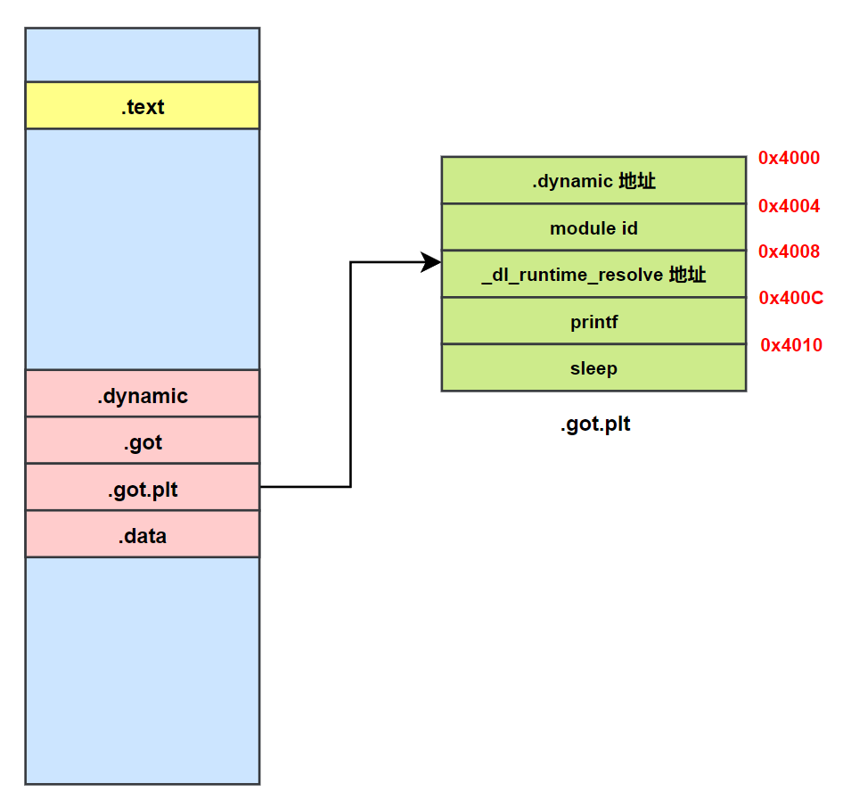
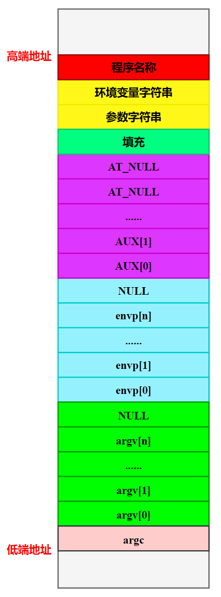

## 四、动态链接相关的结构

动态链接在不同的系统上有不同的实现方式，ELF 的动态链接实现方式比 PE 稍微简单一点。动态链接的可执行文件的装载与静态链接情况基本一样。首先操作系统会读取可执行文件的头部，检查文件的合法性，然后从头部中的程序头部表（Program Header Table，PHT）中读取每个 Segment 的虚拟地址、文件地址和属性，并将它们映射到进程虚拟空间的相应位置，这些步骤跟前面的静态链接情况下的装载基本无异。

- 在静态链接情况下，操作系统接着就可以把控制权转交给可执行文件的入口地址，然后程序开始执行，一切看起来非常直观。
- 在动态链接情况下，操作系统还不能在装载完可执行文件之后就把控制权交给可执行文件，因为我们知道可执行文件依赖于很多共享对象。这时候，可执行文件里对于很多外部符号的引用还处于无效地址的状态，即还没有跟相应的共享对象中的实际位置链接起来。所以在映射完可执行文件之后，操作系统会先启动一个动态链接器 (Dynamic Linker)。

在 Linux 下，**<font color="red">动态链接器 `ld.so` 实际上也是一个共享对象，操作系统同样通过映射的方式将它加载到进程的地址空间中。操作系统在加载完动态链接器之后，就将控制权交给动态链接器的入口地址（与可执行文件一样，共享对象也有入口地址）</font>**。当动态链接器得到控制权之后，它开始执行一系列自身的初始化操作，然后根据当前的环境参数，开始对可执行文件进行动态链接工作。当所有动态链接工作完成以后，动态链接器会将控制权转交到可执行文件的入口地址，程序开始正式执行。

### 1.标准 ELF 变量类型

```c{.line-numbers}
/* Standard ELF types.  */

/* Type for a 16-bit quantity.  */
typedef uint16_t Elf32_Half;
typedef uint16_t Elf64_Half;
/* Types for signed and unsigned 32-bit quantities.  */
typedef uint32_t Elf32_Word;
typedef int32_t  Elf32_Sword;
typedef uint32_t Elf64_Word;
typedef int32_t  Elf64_Sword;
/* Types for signed and unsigned 64-bit quantities.  */
typedef uint64_t Elf32_Xword;
typedef int64_t  Elf32_Sxword;
typedef uint64_t Elf64_Xword;
typedef int64_t  Elf64_Sxword;
/* Type of addresses.  */
typedef uint32_t Elf32_Addr;
typedef uint64_t Elf64_Addr;
/* Type of file offsets.  */
typedef uint32_t Elf32_Off;
typedef uint64_t Elf64_Off;
/* Type for section indices, which are 16-bit quantities.  */
typedef uint16_t Elf32_Section;
typedef uint16_t Elf64_Section;
/* Type for version symbol information.  */
typedef Elf32_Half Elf32_Versym;
typedef Elf64_Half Elf64_Versym;
```

### 2.**`.interp`** 节

动态链接器的位置既不是由系统配置指定，也不是由环境参数决定，而是由 ELF 可执行文件决定。在动态链接的 ELF 可执行文件中，有一个专门的节叫做 **`.interp`** 节（interp 是 interpreter (解释器) 的缩写）。如果我们使用 objdump 工具来查看，可以看到 **`.interp`** 内容：

```c{.line-numbers}
monica@monica-virtual-machine:~/linkers_loaders$ objdump -s Program1 

Program1：     文件格式 elf32-i386

Contents of section .interp:
 0194 2f6c6962 2f6c642d 6c696e75 782e736f  /lib/ld-linux.so
 01a4 2e3200 

monica@monica-virtual-machine:~/linkers_loaders$ objdump -s Program1 | grep .interp
Contents of section .interp:
monica@monica-virtual-machine:~/linkers_loaders$ objdump -s Lib.so | grep .interp

monica@monica-virtual-machine:~/linkers_loaders$ ll /lib/ | grep ld-linux
lrwxrwxrwx   1 root root    20  1月 29 04:25 ld-linux.so.2 -> /lib32/ld-linux.so.2*
```

.interp 的内容很简单，里面保存的就是一个字符串，这个字符串就是可执行文件所需要的动态链接器的路径，在 Linux 下，可执行文件所需要的动态链接器的路径几乎都是 **`/lib/ld-linux.so`**，其他的 *nix 操作系统可能会有不同的路径。

在 Linux 的系统中，**`/lib/ld-linux.so`** 通常是一个软链接，比如在我的机器上，它指向 **`/lib32/ld-linux.so.2`**，这个才是真正的动态链接器。在 Linux 中，操作系统在对可执行文件的进行加载的时候，它会去寻找装载该可执行文件所需要相应的动态链接器，即 .interp 节指定的路径的共享对象。

>注意，在二进制可执行程序中才有 .interp 节，而在共享库比如 Lib.so 中没有 **`.interp`** 节，这个可以从上面的命令行中看出。这是因为 **`.interp`** 节的作用是指定程序的解释器，也就是动态链接器（如 **`/lib64/ld-linux-x86-64.so.2`**）。这个信息只有在一个文件作为新进程的起点被操作系统内核加载时才需要。共享库的生命周期完全不同。它永远不会被用户或内核作为新进程的起点来直接执行。

### 3.**`.dynamic`** 节

动态链接 ELF 中最重要的结构应该是 **`.dynamic`** 节，这个节里面保存了动态链接器所需要的基本信息，比如依赖于哪些共享对象、动态链接符号表的位置、动态链接重定位表的位置、共享对象初始化代码的地址等。**`.dynamic`** 节的结构很经典，结构定义在 elf.h 中：

```c{.line-numbers}
typedef struct {
    Elf32_Sword d_tag;
    union {
        Elf32_Word d_val;
        Elf32_Addr d_ptr;
    } d_un;
} Elf32_Dyn;

typedef struct {
    Elf64_Sxword d_tag;
    union {
        Elf64_Xword d_val;  
        Elf64_Addr d_ptr;    
    } d_un;
} Elf64_Dyn;
```

**`Elf32_Dyn`** 结构 **<font color="red">由一个类型值加上一个附加的数值或指针，对于不同的类型，后面附加的数值或者指针有着不同的含义</font>**。我们这里列举几个比较常见的类型值 (这些值都是定义在 **`elf.h`** 里面的宏)，如下表所示：

<div align="center">
    
</div>

查看 Lib.so 和 Program1 的 **`.dynamic`** 节信息如下所示，可以看到 Program1 二进制程序有 2 个依赖的动态共享库 **`Lib.so`** 和 **`libc.so.6`**。

```c{.line-numbers}
monica@monica-virtual-machine:~/linkers_loaders$ readelf -d Lib.so

Dynamic section at offset 0x2f10 contains 24 entries:
  标记        类型                         名称/值
 0x00000001 (NEEDED)                     共享库：[libc.so.6]
 0x0000000c (INIT)                       0x1000
 0x0000000d (FINI)                       0x11a8
 0x00000019 (INIT_ARRAY)                 0x3f08
 0x0000001b (INIT_ARRAYSZ)               4 (bytes)
 0x0000001a (FINI_ARRAY)                 0x3f0c
 0x0000001c (FINI_ARRAYSZ)               4 (bytes)
 0x6ffffef5 (GNU_HASH)                   0x178
 0x00000005 (STRTAB)                     0x218
 0x00000006 (SYMTAB)                     0x198
 0x0000000a (STRSZ)                      137 (bytes)
 0x0000000b (SYMENT)                     16 (bytes)
 0x00000003 (PLTGOT)                     0x4000
 0x00000002 (PLTRELSZ)                   16 (bytes)
 0x00000014 (PLTREL)                     REL
 0x00000017 (JMPREL)                     0x31c
 0x00000011 (REL)                        0x2e4
 0x00000012 (RELSZ)                      56 (bytes)
 0x00000013 (RELENT)                     8 (bytes)
 0x6ffffffe (VERNEED)                    0x2b4
 0x6fffffff (VERNEEDNUM)                 1
 0x6ffffff0 (VERSYM)                     0x2a2
 0x6ffffffa (RELCOUNT)                   3
 0x00000000 (NULL)                       0x0
monica@monica-virtual-machine:~/linkers_loaders$ readelf -d Program1

Dynamic section at offset 0x2ed8 contains 28 entries:
  标记        类型                         名称/值
 0x00000001 (NEEDED)                     共享库：[./Lib.so]
 0x00000001 (NEEDED)                     共享库：[libc.so.6]
 0x0000000c (INIT)                       0x1000
 0x0000000d (FINI)                       0x11d8
 0x00000019 (INIT_ARRAY)                 0x3ed0
 0x0000001b (INIT_ARRAYSZ)               4 (bytes)
 0x0000001a (FINI_ARRAY)                 0x3ed4
 0x0000001c (FINI_ARRAYSZ)               4 (bytes)
 0x6ffffef5 (GNU_HASH)                   0x1ec
 0x00000005 (STRTAB)                     0x28c
 0x00000006 (SYMTAB)                     0x20c
 0x0000000a (STRSZ)                      167 (bytes)
 0x0000000b (SYMENT)                     16 (bytes)
 0x00000015 (DEBUG)                      0x0
 0x00000003 (PLTGOT)                     0x3fd8
 0x00000002 (PLTRELSZ)                   16 (bytes)
 0x00000014 (PLTREL)                     REL
 0x00000017 (JMPREL)                     0x3b4
 0x00000011 (REL)                        0x374
 0x00000012 (RELSZ)                      64 (bytes)
 0x00000013 (RELENT)                     8 (bytes)
 0x0000001e (FLAGS)                      BIND_NOW
 0x6ffffffb (FLAGS_1)                    标志： NOW PIE
 0x6ffffffe (VERNEED)                    0x344
 0x6fffffff (VERNEEDNUM)                 1
 0x6ffffff0 (VERSYM)                     0x334
 0x6ffffffa (RELCOUNT)                   4
 0x00000000 (NULL)                       0x0
```

### 4.动态符号表 **`.dynsym`**

动态链接的符号表示实际上它跟静态链接十分相似，比如前面例子中的 Program1 程序依赖于 Lib.so，引用到了里面的 foobar() 函数。那么对于 Program1 来说，我们往往称 **<font color="red">Program1 导入 (Import) 了 foobar 函数，foobar 是 Program1 的导入函数</font>**; 而站在 Lib.so 的角度来看，它实际上定义了 foobar() 函数，并且提供给其他模块使用，**<font color="red">我们往往称 Lib.so 导出 (Export) 了 `foobar()` 函数，foobar 是 Lib.so 的导出函数</font>**。把这种导入导出关系放到静态链接的情形下，我们可以把它们看作普通的函数定义和引用。

为了表示动态链接这些模块之间的符号导入导出关系，ELF 专门有一个叫做动态符号表 (Dynamic Symbol Table) 的段用来保存这些信息，这个段的段名通常叫做 **`.dynsym`** (Dynamic Symbol)。与 **`.symtab`** 不同的是，**`.dynsym` 只保存了与动态链接相关的符号，对于那些模块内部的符号，比如模块私有变量则不保存**。很多时候动态链接的模块同时拥有 **`.dynsym`** 和 **`.symtab`** 两个表，**`.symtab`** 中往往保存了所有符号，包括 **`.dynsym`** 中的符号。

与 **`.symtab`** 类似，动态符号表也需要一些辅助的表，比如用于保存符号名的字符串表。静态链接时叫做符号字符串表 **`.strtab`** (String Table)，在这里就是动态符号字符串表 **`.dynstr`**；由于动态链接下，我们需要在程序运行时查找符号，为了加快符号的查找过程，往往还有辅助的符号哈希表（**`.hash`**）。

.dynsym 结构体的数组如下所示：

```c{.line-numbers}
/* Symbol table entry.  */
typedef struct {
    Elf32_Word    st_name;  /* 符号名，符号在字符串表中的偏移 */
    Elf32_Addr    st_value; /* 符号的值，可能是地址或偏移 */
    Elf32_Word    st_size;  /* 符号的大小 */
    unsigned char st_info;  /* 符号类型及绑定属性 */
    unsigned char st_other; /* 符号的可见性 */
    Elf32_Section st_shndx; /* 节头表索引 */
} Elf32_Sym;

typedef struct {
  Elf64_Word    st_name;  /* 符号名，符号在字符串表中的偏移 */
  unsigned char st_info;  /* 符号类型及绑定属性 */
  unsigned char st_other; /* 符号的可见性 */
  Elf64_Section st_shndx; /* 节头表索引 */
  Elf64_Addr    st_value; /* 符号的值，可能是地址或偏移 */
  Elf64_Xword   st_size;  /* 符号的大小 */
} Elf64_Sym;

/* st_info 字段中符号类型和绑定属性的提取 */
/* 高 4 位表示符号的绑定类型 */
#define ELF32_ST_BIND(val) (((unsigned char) (val)) >> 4)
/* 低 4 位表示符号的类型 */
#define ELF32_ST_TYPE(val) ((val) & 0xf)
#define ELF32_ST_INFO(bind, type) (((bind) << 4) + ((type) & 0xf))
/* Elf32_Sym 和 Elf64_Sym 都使用相同的一字节的 st_info 字段 */
#define ELF64_ST_BIND(val) ELF32_ST_BIND (val)
#define ELF64_ST_TYPE(val) ELF32_ST_TYPE (val)
#define ELF64_ST_INFO(bind, type) ELF32_ST_INFO ((bind), (type))
```

#### 4.1 st_name

**`st_name`** 成员保存着符号在 **`.dynstr`** 表（动态链接字符串表）中的偏移。

#### 4.2 st_value

Symbol table entries for different object file types have slightly different interpretations for the **`st_value`** member.

**（1）.o 文件**

In relocatable files（.o 文件）, st_value holds a offset for a defined symbol. **<font color="red">`st_value` is an offset from the beginning of the module</font>**. 也就是在可重定位文件 (.o 目标文件) 中，**`st_value`** 表示该符号相对于其 **<font color="red">模块起始位置</font>** 的字节偏移量。

当链接器最终把这个模块放置到最终文件的某个位置后，就可以通过 **`模块的运行时基地址 + st_value`** 来计算出 **`my_func`** 在最终文件中的新地址。

>位于可重定位文件且符号是 SHN_COMMON 时，st_value 表示对齐要求。

**（2）共享对象或者位置无关可执行文件**

**<font color="red">In executable and shared object files（二进制 PIE 可执行文件或者共享库 .so 文件）, `st_value` holds a virtual address.</font>** To make these files' symbols more useful for the dynamic linker, the section offset (file interpretation) gives way to a virtual address (memory interpretation) for which the section number is irrelevant.

链接器在创建 .so 文件时，通常假设其链接时加载基地址为 0（第一个 **`PT_LOAD`** 段的 **`p_vaddr`** 字段为 0）。如果 **`my_func`** 函数位于 0x1500，那么 **`my_func`** 的 **`st_value`** 就是 0x1500。假设 .so 文件被实际加载/运行时加载的地址为 A，那么 **`my_func`** 的真实绝对地址为：

```c{.line-numbers}
// ELF 程序头中第一个 PT_LOAD 段的 p_vaddr 即为链接时加载地址
// 运行时加载地址 - 链接时加载地址 即为 link_map 数据结构中 l_addr 字段的值
/* l_addr: Difference between the address in the ELF file and the address in memory */
// 0x1500 - 0 表示 my_func 函数距离模块起始的偏移量，只是因为模块链接时加载基地址为 0，所以 st_value（值为 0x1500）可以直接简单理解成模块起始偏移量
A + 0x1500 - 0 = A - 0 + 0x1500 = 运行时加载地址 - 链接时加载地址 + st_value = l_addr + 0x1500
```

链接器在创建 PIE 时，通常假设其链接时加载基地址为 0（第一个 **`PT_LOAD`** 段的 **`p_vaddr`** 字段为 0）。如果 **`my_func`** 函数位于 0x401122，那么 **`my_func`** 的 **`st_value`** 就是 0x401122。假设 PIE 二进制可执行文件被实际加载/运行时加载的地址为 A，那么 **`my_func`** 的真实绝对地址为:

```c{.line-numbers}
A + 0x401122 - 0 = A - 0 + 0x401122 = 运行时加载地址 - 链接时加载地址 + st_value = l_addr + 0x401122
```

>运行时加载地址是指模块（如共享库）被加载到当前进程的虚拟地址空间中的起始虚拟地址。链接时基地址 (**`p_vaddr`**) 也是一个虚拟地址，是链接器在创建 ELF 文件时假想的一个虚拟地址。整个计算过程完全发生在虚拟地址的层面。动态链接器、你的程序代码以及所有用户空间的库，它们所操作和看到的一切地址，都是虚拟地址。

对于共享对象（.so）和位置无关可执行文件（PIE），其链接时加载地址一般默认为 0，因此 **`l_addr = 运行时加载地址 - 链接时加载地址 = 运行时加载地址`** 一般可以直接理解为模块的装载地址。因此对于共享对象和位置无关可执行文件，**`st_value`** 可以当做是该符号相对于其所在模块起始位置的字节偏移量。

>对于现代的 PIE 可执行文件和共享库，l_addr 实际上就是它在运行时的随机基地址。对于非 PIE 可执行文件，由于其加载地址是固定的，所以 l_addr 几乎总是 0。

在现代 Linux 系统上，一个 PIE 可执行文件在结构上几乎就是一个共享库（.so）。对于任何 **`ET_DYN`** 类型的对象，链接器在创建它时都会遵循一个标准约定，将其链接时的基地址（vaddr）设置为 0。但是为什么 PIE 还是一个可执行文件？**<font color="red">因为它虽然是 **`ET_DYN`** 类型，但它比普通的共享库多了一个关键的部分 **`PT_INTERP`** 段</font>**。

假设有一个 **`hello.c`** 文件：

```c{.line-numbers}
#include <stdio.h>

int main() {
    printf("hello world\n");
}
```

使用 **`gcc hello.c -o hello -m32`** 将上述 hello.c 文件编译链接成可执行文件，gcc 默认将其编译为 PIE 位置无关的可执行文件。可以看到，hello 程序的 ELF 头中 type 为 DYN (Position-Independent Executable file)，使用 checksec 命令，发现 hello 程序的 PIE 是开启的，并且有 **`.interp`** 节。PIE 程序的第一个 **`PT_LOAD`** 段的起始地址为 0。

```c{.line-numbers}
monica@monica-virtual-machine:~/linkers_loaders$ LC_ALL=C readelf -h hello
ELF Header:
  Magic:   7f 45 4c 46 01 01 01 00 00 00 00 00 00 00 00 00 
  Class:                             ELF32
  Data:                              2's complement, little endian
  Version:                           1 (current)
  OS/ABI:                            UNIX - System V
  ABI Version:                       0
  Type:                              DYN (Position-Independent Executable file)
  Machine:                           Intel 80386
  Version:                           0x1
  Entry point address:               0x1070

monica@monica-virtual-machine:~/linkers_loaders$ checksec hello
[*] '/home/monica/linkers_loaders/hello'
    Arch:       i386-32-little
    RELRO:      Full RELRO
    Stack:      No canary found
    NX:         NX enabled
    PIE:        PIE enabled
    Stripped:   No

monica@monica-virtual-machine:~/linkers_loaders$ readelf -S hello | grep interp
  [ 1] .interp           PROGBITS        00000194 000194 000013 00   A  0   0  1

monica@monica-virtual-machine:~/linkers_loaders$ readelf -l hello

Elf 文件类型为 DYN (Position-Independent Executable file)
Entry point 0x1070
There are 11 program headers, starting at offset 52

程序头：
  Type           Offset   VirtAddr   PhysAddr   FileSiz MemSiz  Flg Align
  PHDR           0x000034 0x00000034 0x00000034 0x00160 0x00160 R   0x4
  INTERP         0x000194 0x00000194 0x00000194 0x00013 0x00013 R   0x1
                 [Requesting program interpreter: /lib/ld-linux.so.2]
  LOAD           0x000000 0x00000000 0x00000000 0x003d4 0x003d4 R   0x1000
  LOAD           0x001000 0x00001000 0x00001000 0x001f8 0x001f8 R E 0x1000
  LOAD           0x002000 0x00002000 0x00002000 0x000f8 0x000f8 R   0x1000
  LOAD           0x002ed8 0x00003ed8 0x00003ed8 0x00130 0x00134 RW  0x1000
```

使用 **`gcc hello.c -o hello -m32 -no-pie`** 将上述 hello.c 文件编译链接成可执行文件（不开启 PIE）。可以看到，hello 程序的 ELF 头中 type 为 EXEC (Executable file)，使用 checksec 命令，发现 hello 程序的 PIE 是关闭的，并且也有 **`.interp`** 节。此非 PIE 程序的第一个 **`PT_LOAD`** 段的起始地址为 **`0x08048000`**。

```c{.line-numbers}
monica@monica-virtual-machine:~/linkers_loaders$ LC_ALL=C readelf -h hello
ELF Header:
  Magic:   7f 45 4c 46 01 01 01 00 00 00 00 00 00 00 00 00 
  Class:                             ELF32
  Data:                              2's complement, little endian
  Version:                           1 (current)
  OS/ABI:                            UNIX - System V
  ABI Version:                       0
  Type:                              EXEC (Executable file)
  Machine:                           Intel 80386
  Version:                           0x1
  Entry point address:               0x8049060

monica@monica-virtual-machine:~/linkers_loaders$ checksec hello
[*] '/home/monica/linkers_loaders/hello'
    Arch:       i386-32-little
    RELRO:      Partial RELRO
    Stack:      No canary found
    NX:         NX enabled
    PIE:        No PIE (0x8048000)
    Stripped:   No

monica@monica-virtual-machine:~/linkers_loaders$ readelf -S hello | grep interp
  [ 1] .interp           PROGBITS        08048194 000194 000013 00   A  0   0  1

monica@monica-virtual-machine:~/linkers_loaders$ readelf -l hello

Elf 文件类型为 EXEC (可执行文件)
Entry point 0x8049060
There are 11 program headers, starting at offset 52

程序头：
  Type           Offset   VirtAddr   PhysAddr   FileSiz MemSiz  Flg Align
  PHDR           0x000034 0x08048034 0x08048034 0x00160 0x00160 R   0x4
  INTERP         0x000194 0x08048194 0x08048194 0x00013 0x00013 R   0x1
                 [Requesting program interpreter: /lib/ld-linux.so.2]
  LOAD           0x000000 0x08048000 0x08048000 0x00304 0x00304 R   0x1000
  LOAD           0x001000 0x08049000 0x08049000 0x001d0 0x001d0 R E 0x1000
  LOAD           0x002000 0x0804a000 0x0804a000 0x000f8 0x000f8 R   0x1000
  LOAD           0x002f0c 0x0804bf0c 0x0804bf0c 0x00110 0x00114 RW  0x1000
```

对于 Lib.so 来说，类型为 DYN (Shared object file)，并且没有 **`.interp`** 节，这个也可以从 ELF 头中没有程序执行入口地址看出来。因为 Lib.so 是 DYN 类型的对象，其第一个 **`PT_LOAD`** 段的 **`p_vaddr`** 为 0。

```c{.line-numbers}
monica@monica-virtual-machine:~/linkers_loaders$ LC_ALL=C readelf -h Lib.so
ELF Header:
  Magic:   7f 45 4c 46 01 01 01 00 00 00 00 00 00 00 00 00 
  Class:                             ELF32
  Data:                              2's complement, little endian
  Version:                           1 (current)
  OS/ABI:                            UNIX - System V
  ABI Version:                       0
  Type:                              DYN (Shared object file)
  Machine:                           Intel 80386
  Version:                           0x1
  Entry point address:               0x0

monica@monica-virtual-machine:~/linkers_loaders$ readelf -S Lib.so | grep interp
空

monica@monica-virtual-machine:~/linkers_loaders$ readelf -l Lib.so

Elf 文件类型为 DYN (共享目标文件)
Entry point 0x0
There are 9 program headers, starting at offset 52

程序头：
  Type           Offset   VirtAddr   PhysAddr   FileSiz MemSiz  Flg Align
  LOAD           0x000000 0x00000000 0x00000000 0x0032c 0x0032c R   0x1000
  LOAD           0x001000 0x00001000 0x00001000 0x001c0 0x001c0 R E 0x1000
  LOAD           0x002000 0x00002000 0x00002000 0x000b8 0x000b8 R   0x1000
  LOAD           0x002f08 0x00003f08 0x00003f08 0x00110 0x00114 RW  0x1000
```

但是有一个特例，对于 C 标准库 Libc.so 来说，其类型为 DYN (Shared object file)，但是它拥有 **`.interp`** 节，这是因为 glibc 的开发者希望让 **`libc.so.6`** 自身能够被执行，以便打印出它的版本号和一些帮助信息。因为 Libc.so 是 DYN 类型的对象，其第一个 **`PT_LOAD`** 段的 **`p_vaddr`** 为 0。

```c{.line-numbers}
monica@monica-virtual-machine:~/linkers_loaders$ LC_ALL=C readelf -h /lib32/libc.so.6
ELF Header:
  Magic:   7f 45 4c 46 01 01 01 03 00 00 00 00 00 00 00 00 
  Class:                             ELF32
  Data:                              2's complement, little endian
  Version:                           1 (current)
  OS/ABI:                            UNIX - GNU
  ABI Version:                       0
  Type:                              DYN (Shared object file)
  Machine:                           Intel 80386
  Version:                           0x1
  Entry point address:               0x21760

monica@monica-virtual-machine:~/linkers_loaders$ readelf -S /lib32/libc.so.6 | grep interp
  [18] .interp           PROGBITS        001c38a0 1c38a0 000013 00   A  0   0  4

monica@monica-virtual-machine:~/linkers_loaders$ /lib32/libc.so.6
GNU C Library (Ubuntu GLIBC 2.35-0ubuntu3.9) stable release version 2.35.
Copyright (C) 2022 Free Software Foundation, Inc.
This is free software; see the source for copying conditions.
There is NO warranty; not even for MERCHANTABILITY or FITNESS FOR A
PARTICULAR PURPOSE.
Compiled by GNU CC version 11.4.0.
libc ABIs: UNIQUE IFUNC ABSOLUTE
For bug reporting instructions, please see:
<https://bugs.launchpad.net/ubuntu/+source/glibc/+bugs>.

monica@monica-virtual-machine:~/linkers_loaders$ readelf -l /lib32/libc.so.6 

Elf 文件类型为 DYN (共享目标文件)
Entry point 0x21760
There are 13 program headers, starting at offset 52

程序头：
  Type           Offset   VirtAddr   PhysAddr   FileSiz MemSiz  Flg Align
  PHDR           0x000034 0x00000034 0x00000034 0x001a0 0x001a0 R   0x4
  INTERP         0x1c38a0 0x001c38a0 0x001c38a0 0x00013 0x00013 R   0x4
                 [Requesting program interpreter: /lib/ld-linux.so.2]
  LOAD           0x000000 0x00000000 0x00000000 0x1f864 0x1f864 R   0x1000
  LOAD           0x020000 0x00020000 0x00020000 0x17ddd2 0x17ddd2 R E 0x1000
  LOAD           0x19e000 0x0019e000 0x0019e000 0x84b88 0x84b88 R   0x1000
  LOAD           0x223314 0x00224314 0x00224314 0x02c04 0x0c4a8 RW  0x1000
```

**（3）非 PIE 程序**

对于非 PIE 程序 **`st_value`** 就是这个全局变量或静态变量的虚拟地址。例如，如果 **`.data`** 段从 0x404000 开始，一个全局变量 my_var 位于 **`.data`** 段的开头，那么它的 **`st_value`** 就是 0x404000。由于非 PIE 程序的加载地址是固定的，这个 **`st_value`** 在链接时、加载时和运行时都是有效的、可以直接使用的内存地址。

**（4）未定义**

对于未定义的符号，**`st_value`** 通常为 0。如果你在重定位文件（.o 文件）、二进制文件和共享库文件（.so 文件）中调用了 printf，但没有定义它，那么符号表中会有一个 printf 的条目。它的 **`st_shndx`** 字段会是 **`SHN_UNDEF`** (表示未定义)，而 **`st_value`** 通常是 0，没有实际意义。链接器看到这个条目后，就知道需要从其他文件和模块中寻找 printf 的定义。

#### 4.3 st_info

**`st_info`** 指定符号类型及绑定属性。st_info 的低四位表示符号类型，高四位表示绑定属性。符号类型以 STT 开头，符号绑定以 STB 开头。符号类型的值如下所示：

- **`STT_NOTYPE(0)`**：符号类型未定义。
- **`STT_OBJECT(1)`**：表示该符号与数据目标文件关联。
- **`STT_FUNC(2)`**：表示该符号与函数或者其他可执行代码关联。

绑定属性分为 STB_LOCAL、STB_GLOBAL、STB_WEAK，Binding attributes determine the linkage visibility and behavior when a given symbol is referenced by an external object. 也就是说绑定属性告诉链接器如何处理同名的多个符号，以及一个符号是否局限于单个文件，**<font color="red">它的作用域是静态链接时</font>**。

- **`STB_LOCAL`**：这是最严格的绑定。LOCAL 符号严格限制在单个目标文件 (.o) 内部，链接器在处理完这个目标文件后，就会"忘记"这个符号的存在。不同目标文件中的 LOCAL 符号即使同名，也完全不会相互干扰，因为它们彼此不可见。**在 C/C++ 中，所有用 static 关键字修饰的全局变量和函数都是 LOCAL 符号**。
- **`STB_GLOBAL`**：这是最常见的绑定类型。GLOBAL 符号意图被整个程序（包括所有目标文件和库）访问，链接器会在所有输入的目标文件和库中寻找 GLOBAL 符号的唯一定义。**如果链接器发现多个同名的 GLOBAL 定义（非 WEAK），就会产生一个"多重定义 (multiple definition)"的链接错误**。在 C/C++ 中，所有未用 static 修饰的全局变量和函数默认都是 GLOBAL 符号。
- **`STB_WEAK`**：WEAK 符号是 GLOBAL 的一个变体，它允许被同名的 GLOBAL 符号覆盖。当链接器遇到多个同名符号时，如果有一个 GLOBAL 符号，所有 WEAK 符号都会被忽略，并链接到这个 GLOBAL 符号上。如果没有 GLOBAL 符号，但有多个 WEAK 符号，链接器会任意选择其中一个（行为未定义，但通常不会报错）。主要用于提供可被用户重载的库函数默认实现。

#### 4.4 st_other

st_other 表示符号的可见性，Symbol visibility defines how a given symbol may be accessed once the symbol has become part of an executable or shared object. 可见性主要用于控制动态链接时符号的导出行为，即一个符号在生成共享库 (.so) 后，是否能被主程序或其他共享库看到和使用。

- **`STV_DEFAULT`**：这是 GLOBAL 和 WEAK 符号的默认可见性。符号的定义被导出到共享库的动态符号表 (**`.dynsym`**) 中，它可以被其他模块引用。**<font color="red">可以被抢占 (Preemptible) 或者介入</font>**，这是最关键的特性。如果主程序或者另一个共享库（在链接顺序上更早）也定义了一个同名的 DEFAULT 符号，那么在运行时，当前模块对这个符号的引用会被重定向到外部那个定义上。
- **`STV_HIDDEN`**：符号在当前的共享库或者可执行文件外不可见，但可以通过间接的方式访问到该符号（比如通过地址访问）。
- **`STV_PROTECTED`**：符号在当前的共享库或者可执行文件外可见，但不能被覆盖（就是不能被介入）。不可被抢占，这是与 DEFAULT 的核心区别。即使外部模块定义了同名符号，在本模块内部对该符号的引用仍然会解析到模块内部自己的版本。

>符号抢占/介入与多重定义之间的区别
>**<font color="red">多重定义错误发生在静态链接时 (Link Time)</font>**，由静态链接器 ld 发现，这可以被视为一种编程错误。**<font color="red">符号抢占发生在运行时 (Runtime)</font>**，由动态链接器 ld.so 执行，这是一种预期的、定义好的特性。
>在静态链接时，静态链接器的作用是将多个目标文件（.o）链接合并成一个独立的、自洽的模块（一个可执行文件或一个共享库）。在单一模块内部，对于任何一个非 weak 的全局符号（**`STB_GLOBAL`**），只允许存在一个定义。
>在运行时，程序已经成功编译和链接。当你执行它时，动态链接器 ld.so 的任务是把可执行文件和它依赖的所有共享库 (.so) 组装成一个完整的进程。动态链接器在解析符号时，会按照一个明确的、分优先级的搜索顺序来查找符号。当动态链接器需要解析一个符号（比如 printf）时，它会按一定顺序查找。它找到的第一个定义就会被使用，后续找到的任何其他同名定义都会被忽略。这就提供了一种强大的覆盖机制，**<font color="red">可以使用 `LD_PRELOAD` 加载一个自定义的库，故意提供某个函数的特定实现，以覆盖其依赖的库中的默认实现</font>**。

#### 4.5 st_shndx

每个符号表条目的定义都与某些节对应。st_shndx 变量保存了相关节头表的索引。

- 当 **`st_shndx`** 的值为 **`SHN_UNDEF`** 时：未定义的、丢失的、不相关的或其他没有意义的节引用。例如，相对于节号 SHN_UNDEF 定义的符号是未定义的符号。该符号在本目标文件中被引用到，但是定义在其他目标文件中。
- 当 **`st_shndx`** 的值为 **`SHN_ABS`** 时：此节中所定义的符号有绝对的值，这个值不会因重定位而改变。对于 SHN_ABS 符号，其符号表条目中的 st_value 成员包含的就是这个符号的绝对值本身。这可能是一个内存地址，也可能是一个不代表地址的常量。

### 5.**`.rel.dyn`** 和 **`.rel.plt`** 节

共享对象需要重定位的主要原因是导入符号的存在。动态链接下，无论是可执行文件或共享对象，一旦它依赖于其他共享对象，也就是说有导入的符号时，那么它的代码或数据中就会有对于导入符号的引用。在编译时这些导入符号的地址未知，在静态链接中，这些未知的地址引用在最终链接时被修正。**但是在动态链接中，导入符号的地址在运行时才确定，所以需要在运行时将这些导入符号的引用修正，即需要重定位**。

即使动态链接的可执行文件/ 共享库使用的是 PIC 技术，但是这不能改变它需要重定位的本质。对于使用 PIC 技术的可执行文件或共享对象来说，虽然它们的代码段不需要重定位 (因为地址无关)，但是代码段中绝对地址相关的部分被分离了出来，变成了 GOT。而 GOT 实际上是数据段的一部分，除了 GOT 以外，数据段还可能包含绝对地址引用。

总结来说，共享对象中，代码段由于地址无关，所以不需要进行重定位。对于数据段来说，则需要进行重定位，主要包含两个部分，第一个部分是 GOT，GOT 中包含数据变量的绝对地址，因此需要在运行时重定位；第二部分则是：

```c{.line-numbers}
static int a;
static int* p = &a;
```

p 变量的值就是 a 变量的地址，但是 a 的地址会随着共享对象装载地址的变化而变化，因此除了 GOT 之外，数据段还有可能包含绝对地址的引用，这种情况需要采用装载时重定位来解决。

动态链接的文件中，重定位表分别叫做 **`.rel.dyn`** 和 **`.rel.plt`**。

```c{.line-numbers}
monica@monica-virtual-machine:~/linkers_loaders$ readelf -r Lib.so

重定位节 '.rel.dyn' at offset 0x2e4 contains 7 entries:
 偏移量     信息    类型              符号值      符号名称
00003f08  00000008 R_386_RELATIVE   
00003f0c  00000008 R_386_RELATIVE   
00004014  00000008 R_386_RELATIVE   
00003ff0  00000106 R_386_GLOB_DAT    00000000   _ITM_deregisterTM[...]
00003ff4  00000406 R_386_GLOB_DAT    00000000   __cxa_finalize@GLIBC_2.1.3
00003ff8  00000506 R_386_GLOB_DAT    00000000   __gmon_start__
00003ffc  00000606 R_386_GLOB_DAT    00000000   _ITM_registerTMCl[...]

重定位节 '.rel.plt' at offset 0x31c contains 2 entries:
 偏移量     信息    类型              符号值      符号名称
0000400c  00000207 R_386_JUMP_SLOT   00000000   printf@GLIBC_2.0
00004010  00000307 R_386_JUMP_SLOT   00000000   sleep@GLIBC_2.0

monica@monica-virtual-machine:~/linkers_loaders$ readelf -S Lib.so
There are 28 section headers, starting at offset 0x34b8:

节头：
  [Nr] Name              Type            Addr     Off    Size   ES Flg Lk Inf Al
  [19] .dynamic          DYNAMIC         00003f10 002f10 0000e0 08  WA  4   0  4
  [20] .got              PROGBITS        00003ff0 002ff0 000010 04  WA  0   0  4
  [21] .got.plt          PROGBITS        00004000 003000 000014 04  WA  0   0  4
  [22] .data             PROGBITS        00004014 003014 000004 00  WA  0   0  4
Key to Flags:
  W (write), A (alloc), X (execute), M (merge), S (strings), I (info),
  L (link order), O (extra OS processing required), G (group), T (TLS),
  C (compressed), x (unknown), o (OS specific), E (exclude),
  D (mbind), p (processor specific)
```

#### 5.1 **`.rel.dyn`** 节

**`.rel.dyn`** 实际上是对数据引用的修正，它所修正的位置位于 **`.got`** 以及数据段。**`.rel.dyn`** 中主要处理对象如下：

- 全局变量的地址：如果你的代码引用了 **<font color="red">定义在其他共享库中的全局变量，或者引用了自身模块中的全局变量（引用自身模块中的全局变量也需要通过 GOT 表）</font>**，相关的重定位条目会放在这里。
- 指向数据的指针：任何在数据段中初始化的、需要运行时解析其地址的指针。

这些重定位通常在程序或共享库加载时立即处理 (eagerly resolved) 由动态链接器完成。因为数据引用的地址在代码执行前通常就需要确定。

#### 5.2 **`.rel.plt`** 节

**`.rel.plt`** 是对函数引用的修正，它所修正的位置位于 **`.got.plt`**。这个节区专门包含用于解析外部函数调用的重定位信息。这些函数调用通常是通过 PLT (Procedure Linkage Table) 和 GOT (Global Offset Table) 机制来实现的。

PLT 的每个条目（除了 **`PLT[0]`**）都对应一个外部函数。当一个外部函数第一次被调用时，会通过 PLT 触发动态链接器来解析该函数的真实地址。动态链接器会使用 **`.rel.plt`** 中的信息找到对应的符号，并将解析到的真实函数地址回填到 GOT 中该函数对应的条目（通常是 **`.got.plt`** 节区中的一个条目）。简单来说，**`.rel.plt`** 专门服务于 PLT，用于在运行时解析外部函数的地址，支持延迟绑定。

#### 5.3 重定位表结构体

32 位和 64 位 ELF 使用的重定位表有一点区别，但都是结构体数组。一般 32 位使用 Elf32_Rel，64 位使用 **`Elf32_Rela`**。结构体定义如下：

```c{.line-numbers}
/* Relocation table entry without addend (in section of type SHT_REL).  */
typedef struct {
    Elf32_Addr r_offset; /* 表示重定位所作用的虚拟地址或相对基地址的偏移 */
    Elf32_Word r_info;   /* 重定位类型和符号表下标 */
} Elf32_Rel;

/* The following, at least, is used on Sparc v9, MIPS, and Alpha.  */
typedef struct {
    Elf64_Addr r_offset; /* 表示重定位所作用的虚拟地址或相对基地址的偏移 */
    Elf64_Xword r_info;  /* 重定位类型和符号表下标 */
} Elf64_Rel;

/* Relocation table entry with addend (in section of type SHT_RELA).  */
typedef struct {
    Elf32_Addr r_offset;  /* 表示重定位所作用的虚拟地址或相对基地址的偏移 */
    Elf32_Word r_info;    /* 重定位类型和符号表下标 */
    Elf32_Sword r_addend; /* Addend */
} Elf32_Rela;

typedef struct {
    Elf64_Addr r_offset;  /* 表示重定位所作用的虚拟地址或相对基地址的偏移 */
    Elf64_Xword r_info;   /* 重定位类型和符号表下标 */
    Elf64_Sxword r_addend; /* Addend */
} Elf64_Rela;

/* How to extract and insert information held in the r_info field.  */
// 获得高 24 位，表示在符号表中的下标
#define ELF32_R_SYM(val)  ((val) >> 8) 
// 获得低 8 位，表示重定位类型
#define ELF32_R_TYPE(val)  ((val) & 0xff) 
// 通过 R_SYM 和 R_Type 重组 r_info
#define ELF32_R_INFO(sym, type)  (((sym) << 8) + ((type) & 0xff)) 

// 获得高 32 位，表示在符号表中的下标
#define ELF64_R_SYM(i)  ((i) >> 32)
// 获得低 32 位，表示重定位类型
#define ELF64_R_TYPE(i)  ((i) & 0xffffffff)
// 通过 R_SYM 和 R_Type 重组 r_info
#define ELF64_R_INFO(sym,type)  ((((Elf64_Xword) (sym)) << 32) + (type))
```

32 位 ELF 一般使用的重定位表项的结构体是 Elf32_Rel，其中包含 **`r_offset`** 和 **`r_info`** 两个成员，都是 4byte 类型的变量。

**`r_offset`** 表示重定位所作用的位置。和前面的 **`st_value`** 一样，对于重定位文件(.o) 来说，**`r_offset`** 表示需要重定位的存储单元在其所在模块的字节偏移量。

对于可执行文件（PIE）或共享目标文件(.so) 来说，**`r_offset`** 表示需要重定位作用的存储单元的虚拟地址，但是正如前面所说，链接器在创建 PIE 或者共享目标文件时，因为编译器不知道代码最终会被加载到内存的哪个随机地址，所以通常假设该模块的加载基地址为 0，**<font color="red">因此 **`r_offset`** 可以直接认为也是需要定位的存储单元在模块中的偏移量</font>**。

对于非 PIE 可执行文件而言，编译器和链接器假定程序总是会被加载到一个固定的、已知的基地址，因此，ELF 文件中的所有地址引用都是基于这个固定的虚拟地址空间。**`r_offset`** 表示一个绝对的虚拟地址 (Absolute Virtual Address)。**<font color="red">`r_offset` 不是一个偏移量，而是直接指向 **`.got/.got.plt`** 表中某个位置的、完整的虚拟地址</font>**。

>**`r_offset`** This member gives the location at which to apply the relocation action. Different object files have slightly different interpretations for this member.
For a relocatable file, the value indicates a section offset. The relocation section itself describes how to modify another section in the file. Relocation offsets designate a storage unit within the second section.
For an executable or shared object, the value indicates the virtual address of the storage unit affected by the relocation. This information makes the relocation entries more useful for the runtime linker.
Although the interpretation of the member changes for different object files to allow efficient access by the relevant programs, the meanings of the relocation types stay the same.

**`r_info`** 其高 24 位表示该重定位项在动态链接符号表 **`.dynsym`** 中对应项的下标，低 8 位表示该重定位项的重定向类型。

#### 5.4 重定位类型

32 位 ELF 一般用来函数重定位的重定位类型就是 **`R_386_JUMP_SLOT`** 类型，64 位 ELF 函数重定位的重定位类型就是 **`R_X86_64_JUMP_SLOT`** 类型，源码对其的注释是 Create PLT entry。这种类型的函数重定位都会在 ELF 中创建一个 PLT 入口。

```c{.line-numbers}
/* i386 relocs.  */
#define R_386_NONE     0  /* No reloc */
#define R_386_32       1  /* Direct 32 bit  */
#define R_386_PC32     2  /* PC relative 32 bit */
#define R_386_GOT32    3  /* 32 bit GOT entry */
#define R_386_PLT32    4  /* 32 bit PLT address */
#define R_386_COPY     5  /* Copy symbol at runtime */
#define R_386_GLOB_DAT 6  /* Create GOT entry */
#define R_386_JUMP_SLOT 7  /* Create PLT entry */
#define R_386_RELATIVE 8  /* Adjust by program base */
```

**（1）R_386_JUMP_SLOT**

这种重定位类型专门用于支持过程链接表 (PLT, Procedure Linkage Table) 的延迟绑定 (lazy binding) 机制，主要用于解析和设置对外部函数的调用。

1. 当代码调用一个定义在其他共享库中的函数时，编译器会生成一个指向 PLT 中对应条目的调用。
2. PLT 的每个条目（除了第一个特殊条目 **`PLT[0]`**）通常包含一条间接跳转指令，该指令通过 GOT 中的一个条目（通常在 **`.got.plt`** 节区）进行间接跳转。
3. **<font color="red">链接器会在 **`.rel.plt`** 重定位节区中为每个这样的 PLT 条目生成一个 **`R_386_JUMP_SLOT`** 类型的重定位条目</font>**。
4. 默认情况下，这些 GOT 条目初始时并不包含函数的真实地址。它们通常指向 PLT 条目内部的一段代码，这段代码会负责调用动态链接器的符号解析程序。
5. 当该外部函数第一次被调用时，PLT 代码执行，最终调用动态链接器。动态链接器使用 **`R_386_JUMP_SLOT`** 重定位条目中的信息，执行 **`_dl_runtime_resolve`** 函数，查找并获取该外部函数的真实内存地址。然后，动态链接器将这个真实的函数地址写入到 **`r_offset`** 所指向的 GOT 条目（即跳转槽）中。
6. 后续对同一个函数的调用，PLT 中的间接跳转指令就会直接跳转到已解析的函数真实地址，不再需要动态链接器介入。

从前面可以看到，**`.got.plt`** 的起始地址（虚拟地址）为 **`0x00004000`**，而 **`.got.plt`** 的前三项分别是 **`.dynamic`** 段的起始地址、moduleID、**`_dl_runtime_resolve`** 函数的地址，第 4 项开始才是 printf 函数的地址 **`0x4000 + 4*3 = 0x400c`**，后面第 5 项 sleep 函数的地址就是 **`0x00004010`**。Lib.so 的 **`.got.plt`** 结构如下所示。

<div align="center">
    
</div>

**（2）R_386_GLOB_DAT**

这种重定位类型主要用于解析和设置指向全局数据符号 (Global Data Symbols) 的地址。当你的代码（共享对象或位置无关可执行文件 PIE）需要访问定义在其他模块中的全局变量时，或者需要获取本模块中某个全局变量的绝对地址时，就会用到这种重定位。

工作方式：

1. 在编译链接时，如果代码引用了一个外部全局变量，链接器会在全局偏移表 GOT 中为这个变量创建一个条目（一个指针大小的空间）。
2. **<font color="red">链接器会在 **`.rel.dyn`** 重定位节区中生成一个 **`R_386_GLOB_DAT`** 类型的重定位条目</font>**。
3. 在程序加载时，动态链接器会查找符号表中对应的全局数据符号，获取其在内存中的真实绝对地址。
4. 然后，动态链接器将这个真实的绝对地址写入到 **`r_offset`** 所指向的 GOT 条目中。

**`R_386_GLOB_DAT`** 类型的重定位通常在程序或共享库加载时立即 (eagerly) 由动态链接器处理。这是因为程序在执行代码之前可能就需要访问这些全局数据。通常位于 **`.rel.dyn`** 节区。通常在外部函数首次被调用时 (lazily) 处理，这是延迟绑定的核心，通常位于 **`.rel.plt`** 节区。

**（3）R_386_RELATIVE**

**`R_386_RELATIVE`** 这种类型的重定位实际上就是基址重置 (Rebasing)。前面分析过，共享对象的数据段是没有办法做到地址无关的，它可能会包含绝对地址的引用，对于这种绝对地址的引用，我们必须在装载时将其重定位。比如前面例子中，有一个全局指针变量被初始化为一个静态变量的地址：

```c{.line-numbers}
static int a;
static int* p = &a;
```

在编译时，共享对象的地址是从 0 开始的，我们假设该静态变量 a 相对于起始地址 0 的偏移为 B，即 p 的值为 B。一旦共享对象被装载到地址 A，那么实际上该变量 a 的地址为 A+B，即 p 的值需要加上一个装载地址 A。**`R_386_RELATIVE`** **<font color="red">类型的重定位入口就是专门用来重定位指针变量 p 这种类型的，变量 p 在装载时需要加上一个装载地址值 A，才是正确的结果</font>**。

### 6.**`.gnu.hash`** 表

**`libc.so`** 包含了大量导出供外部使用的动态符号（在我的机器上，执行 **`nm -D /lib/libc.so.6 | wc -l`** 命令会得到 2246 个符号）。在任何一个相对较大的程序中，都会导入其中相当一部分符号。

显然，在这种情况下进行线性搜索的效率会非常低下。为了优化成千上万个字符串的搜索过程，我们可以使用某种哈希表。这里有两种选择：第一种是在二进制文件加载期间，根据一个普通的符号列表来动态创建哈希表。但这会在动态链接时引入大量的计算和内存分配，因此并不是一个很好的解决方案。**<font color="red">第二种选择则是在静态链接期间就创建好哈希表，并以某种序列化的格式将其保存在二进制文件内部。这正是 ELF 文件所采用的方式</font>**。

The hashing function is "hard-coded" in the standard so every compiler, static linker, and dynamic linker can use the same one. Otherwise, nothing would work. Here's what the function looks like:

```c{.line-numbers}
#include <stdint.h>

uint32_t elf_hash(const uint8_t* name) {
    uint32_t h = 0, g;
    for (; *name; name++) {
        h = (h << 4) + *name;
        if (g = h & 0xf0000000) {
            h ^= g >> 24;
        }
        h &= ~g;
    }
    return h;
}

elf_hash("")                // 0x00000000
elf_hash("printf")          // 0x077905a6
elf_hash("exit")            // 0x0006cf04
elf_hash("syscall")         // 0x0b09985c
elf_hash("flapenguin.me")   // 0x03987915
```

Once the string, symbol, and hash tables are located via section headers (or program headers, or _DYNAMIC) they can be used to find a symbol by its name.

The hash table looks like this (this is of course not a valid C structure declaration, but it should give an idea of how things are stored):

```c{.line-numbers}
struct elf_hash_table {
    uint32_t nbucket;
    uint32_t nchain;
    uint32_t bucket[nbucket];
    uint32_t chain[nchain];
};
```

The bucket array contains nbucket entries, and the chain array contains nchain entries; indexes start at 0. Both bucket and chain hold symbol table indexes. Chain table entries parallel the symbol table. The number of symbol table entries should equal nchain; so symbol table indexes also select chain table entries. A hashing function accepts a symbol name and returns a value that may be used to compute a bucket index.

Consequently, **<font color="red">if the hashing function returns the value x for some name, **`bucket[x%nbucket]`** gives an index, y, into both the symbol table and the chain table</font>**. If the symbol table entry is not the one desired, **`chain[y]` gives the next symbol table entry with the same hash value**. One can follow the chain links until either the selected symbol table entry holds the desired name or the chain entry contains the value **`STN_UNDEF`**.

**`chain`** array contains chains of symbol indexes within the same bucket. A chain starts at **`bucket[hash % nbucket]`** index. You should walk through the chain by interpreting **`chain[ix]`** value as the index of the next symbol and the next chain element. Finally you’ll bump into the **`STN_UNDEF`** symbol (dummy "undefined" symbol), which is always the last symbol of any chain.

Since the **`chain`** array values are indexes for not only the **`chain`** array itself, but also for the symbol table, the **`chain`** array must be the same size as the symbol table. This makes **`nchain`** equal to the length of the symbol table, which designers of the ELF seem to have forgotten to add to the dynamic program information.

To visualize a hash table I've taken the first 15 definitely public (not beginning with an underscore) symbols from libc.so and constructed a hash table from them.

```c{.line-numbers}
nbucket = 4   (because I decided that there will be four buckets)
nchain  = 16  (16 symbols, including the SHT_UNDEF at index 0)

ix  bucket[ix]  name of first symbol in chain
--  ----------  -----------------------------
 0  2           freelocal
 1  8           setrlimi
 2  1           isnan
 3  3           hcreate_

Two asterisks ** and parens () indicate the start of a chain, so it's easier to see.

       SYMBOL TABLE    |                HASH TABLE
                       |
    name =             | hash =          hash %
ix  symtab[ix].st_name | elf_hash(name)  nbucket     chain[ix]
--  ------------------ | --------------  -------     ---------
 0  <STN_UNDEF>        |
 1 isnan               | 0x0070a47e      2 **    /------(5)
 2 freelocal           | 0x0bc334fc      0 **    | /----(4)
 3 hcreate_            | 0x0a8b8c4f      3 **    | |    (6)-----\
 4 getopt_long_onl     | 0x0f256dbc      0       | \--> 12 -----|-\
 5 endrpcen            | 0x04b96f7e      2       \-----> 7 ---\ | |
 6 pthread_mutex_lock  | 0x0de6a18b      3               0 <--|-/ |
 7 isinf               | 0x0070a046      2          /--- 9 <--/   |
 8 setrlimi            | 0x0cb929a9      1 **       |  (11)-----\ |
 9 getspen             | 0x0dcba6de      2          \-> 10 ---\ | |
10 umoun               | 0x007c46be      2        /---- 13 <--/ | |
11 strsigna            | 0x0b99fbe1      1        |      0 <----/ |
12 listxatt            | 0x00abef84      0        | /-- 15 <------/
13 getttyen            | 0x0cbbb96e      2        \-|-> 14 ---\
14 uselib              | 0x07c9c2f2      2          |    0 <--/
15 cfsetispeed         | 0x0b63b274      0          \--> 0
```

在 **`HASH TABLE`** 中的第二列，**`hash % nbucket`** 表示函数名称经过 hash 之后分布在哪个 bucket 中，然后相同 **`hash % bucket`** 值的函数名称在同一个 chain 中，形成一个链表。**`bucket[hash % nbucket] = y`** 的值既表示 symtab 中的函数名称，也表示同一个 bucket 的 chain 中下一个函数符号的索引 **`chain[y]`**。

Now that we have this table, let's try to find some symbols by hand:

首先是查找 **`freelocal`** 函数符号的过程：

```c{.line-numbers}
hash = elf_hash("freelocal") = 0x0bc334fc
chain starts at bucket[0x0bc334fc % 4] = bucket[0] = 2

symbols[2] (= "freelocal") == "freelocal"? yep => found at index 2
```

其次是查找 **`getspen`** 函数符号的过程：

```c{.line-numbers}
hash = elf_hash("getspen") = 0x0dcba6de
chain starts at bucket[0x0dcba6de % 4] = bucket[2] = 1

symbols[2] (= "isnan")    == "getspen"? nope => chain continues at 5
symbols[5] (= "endrpcen") == "getspen"? nope => chain continues at 7
symbols[7] (= "isinf")    == "getspen"? nope => chain continues at 9
symbols[9] (= "getspen")  == "getspen"? yep  => found at index 9
```

最后是查找 **`foobar`** 函数符号的过程：

```c{.line-numbers}
hash = elf_hash("foobar") = 0x06d65882
chain starts at bucket[0x06d65882 % 4] = bucket[2] = 1

symbols[ 1] (= "isnan")    == "foobar"? nope => chain continues at  5
symbols[ 5] (= "endrpcen") == "foobar"? nope => chain continues at  7
symbols[ 7] (= "isinf")    == "foobar"? nope => chain continues at  9
symbols[ 9] (= "getspen")  == "foobar"? nope => chain continues at 10
symbols[10] (= "umoun")    == "foobar"? nope => chain continues at 13
symbols[13] (= "getttyen") == "foobar"? nope => chain continues at 14
symbols[14] (= "uselib")   == "foobar"? nope => chain continues at  0
symbols[ 0] is STN_UNDEF                     => not found
```

I want to mention that while **`DT_HASH`** is very good at finding existing symbols, it performs badly with the missing ones. As you could see in the example with searching for "foobar", you need to walk through a random chain and compare strings only to bump into the **`STN_UNDEF`**. This becomes even worse in real life because symbols are searched in multiple shared libraries, so you'll have to walk multiple random chains.

Smart people noticed that problem and created a new hash table called **`DT_GNU_HASH`**, which is nowadays used almost everywhere instead of **`DT_HASH`**. The sad part is that **`DT_GNU_HASH`** is not in fact standardized, nor is it even described anywhere but in the BFD (Binary File Descriptor library) source code.

### 7.动态链接时进程堆栈初始化信息

站在动态链接器的角度看，当操作系统把控制权交给它的时候，它将开始做链接工作，那么至少它需要知道关于可执行文件和本进程的一些信息，比如可执行文件有几个段 (Segment)、每个段的属性、程序的入口地址 (因为动态链接器到时候需要把控制权交给可执行文件) 等。**<font color="red">这些信息往往由操作系统传递给动态链接器，保存在进程的堆栈里面</font>**。我们在前面提到过，进程初始化的时候，堆栈里面保存了关于进程执行环境和命令行参数等信息。事实上，堆栈里面还保存了动态链接器所需要的一些辅助信息数组 (Auxiliary Vector)。

**<font color="red">ELF auxiliary vectors are a mechanism to transfer certain kernel level information to the user processes</font>**. An example of such an information is the pointer to the system call entry point in the memory (**`AT_SYSINFO`**); this information is dynamic in nature and is only known after kernel has finished loading.

The information is passed on to the user processes by binary loaders which are part of the kernel subsystem itself; either built-in the kernel or a kernel module. Binary loaders convert a binary file, a program, into a process on the system. Usually there is a different loader for each binary format; thankfully there are not many binary formats - most of the linux based systems now use ELF binaries. ELF binary loader is defined in the following file **`/usr/src/linux/fs/binfmt_elf.c`**.

辅助信息的格式也是一个结构数组，它的结构被定义在 "elf.h":

```c{.line-numbers}
typedef struct
{
  uint32_t a_type;              /* Entry type */
  union
    {
      uint32_t a_val;           /* Integer value */
      /* We use to have pointer elements added here.  We cannot do that,
         though, since it does not work when using 32-bit definitions
         on 64-bit platforms and vice versa.  */
    } a_un;
} Elf32_auxv_t;
```

这个结构和 **`.dynamic`** 段结构相似，先是一个 32 位的类型值，后面是一个 32 位的数值部分。你可能会很奇怪为什么要用一个 union 把后面的 32 位数值包装起来，事实上这个 union 没什么用，只是历史遗留而已可以当作不存在。比较重要的类型值如下所示：

- **`AT_NULL`**：表示辅助信息数组的结束；
- **`AT_EXEFD`**：表示可执行文件的文件句柄。正如前面提到的，动态连接器需要知道一些关于可执行文件的信息。当进程开始执行可执行文件时，操作系统会先将文件打开，这时候就会产生文件句柄。**那么操作系统可以将文件句柄传递给动态链接器，动态链接器可以通过操作系统的文件读写操作来访问可执行文件**。
- **`AT_PHDR`**：可执行文件中程序头表（Program Header）在进程中的地址。正如前面 **`AT_EXEFD`** 所提到的，动态链接器可以通过操作系统的文件读写功能来访问可执行文件。但事实上，很多操作系统会把可执行文件映射到进程的虚拟空间里面，从而动态链接器不需要通过读写文件，而是可以直接访问内存中的文件映像。所以操作系统要么选择前面的文件句柄方式，要么选择这种映像的方式。**当选择映像的方式时，操作系统必须提供后面的 `AT_PHENT`、`AT_PHNUM` 和 `AT_ENTRY` 这几个类型**。
- **`AT_PHENT`**：可执行文件头中程序头表中每一个 Entry 的大小。
- **`AT_PHNUM`**：可执行文件头中程序头表中 Entry 的数量。
- **`AT_BASE`**：表示动态链接器本身的装载地址。
- **`AT_ENTRY`**：可执行文件的入口地址，即启动地址。

The ELF loader parses the ELF file, maps the various program segments in the memory, sets up the entry point and initializes the process stack. It puts ELF auxiliary vectors on the process stack along with other information like argc, argv, envp. After initialization, a process' stack looks something like this:

```c{.line-numbers}
position            content                     size (bytes) + comment
------------------------------------------------------------------------
stack pointer ->  [ argc = number of args ]     4
                  [ argv[0] (pointer) ]         4   (program name)
                  [ argv[1] (pointer) ]         4
                  [ argv[..] (pointer) ]        4
                  [ argv[n - 1] (pointer) ]     4
                  [ argv[n] (pointer) ]         4   (= NULL)

                  [ envp[0] (pointer) ]         4
                  [ envp[1] (pointer) ]         4
                  [ envp[..] (pointer) ]        4
                  [ envp[term] (pointer) ]      4   (= NULL)

                  [ auxv[0] (Elf32_auxv_t) ]    8
                  [ auxv[1] (Elf32_auxv_t) ]    8
                  [ auxv[..] (Elf32_auxv_t) ]   8
                  [ auxv[term] (Elf32_auxv_t) ] 8   (= AT_NULL vector)

                  [ padding ]                   0 - 16

                  [ argument ASCIIZ strings ]   >= 0
                  [ environment ASCIIZ strings ]   >= 0

                  [ program name ]

(0xbffffffc)      [ end marker ]                4   (= NULL)

(0xc0000000)      < bottom of stack >           0   (virtual)
------------------------------------------------------------------------
```

在初始化之后，一个进程的栈布局如下所示：

<div align="center">
    
</div>

接下来我们以 hello world 程序来进行验证，使用 **`gcc hello.c -o hello -g -m32`** 将 hello.c 编译成 32 位的可执行程序，接着使用 **`gdb -q hello --args aaa bbb ccc ddd`** 进行调试，并且传入 4 个参数 **`aaa`**、**`bbb`**、**`ccc`** 和 **`ddd`**。

```c{.line-numbers}
monica@monica-virtual-machine:~/linkers_loaders$ gcc hello.c -o hello -g -m32
monica@monica-virtual-machine:~/linkers_loaders$ gdb -q --args hello aaa bbb ccc ddd
Reading symbols from hello...
(gdb) b main
Breakpoint 1 at 0x11b6: file ok.c, line 4.
(gdb) r
Starting program: /home/monica/linkers_loaders/hello aaa bbb ccc ddd
[Thread debugging using libthread_db enabled]
Using host libthread_db library "/lib/x86_64-linux-gnu/libthread_db.so.1".

Breakpoint 1, main (argc=5, argv=0xffffd144, envp=0xffffd15c) at ok.c:4
4		printf("hello world\n");
(gdb) x/65s *((char**) argv)
0xffffd31f:	"/home/monica/linkers_loaders/hello"
0xffffd344:	"aaa"
0xffffd348:	"bbb"
0xffffd34c:	"ccc"
0xffffd350:	"ddd"
0xffffd354:	"SHELL=/bin/bash"
0xffffd364:	"SESSION_MANAGER=local/monica-virtual-machine:@/tmp/.ICE-unix/1254,unix/monica-virtual-machine:/tmp/.ICE-unix/1254"
0xffffd3da:	"QT_ACCESSIBILITY=1"
0xffffd3ed:	"COLORTERM=truecolor"
0xffffd401:	"XDG_CONFIG_DIRS=/etc/xdg/xdg-ubuntu:/etc/xdg"
0xffffd42e:	"SSH_AGENT_LAUNCHER=gnome-keyring"
0xffffd44f:	"XDG_MENU_PREFIX=gnome-"
0xffffd466:	"GNOME_DESKTOP_SESSION_ID=this-is-deprecated"
0xffffd492:	"LANGUAGE=zh_CN:zh"
0xffffd4a4:	"GNOME_SHELL_SESSION_MODE=ubuntu"
0xffffd4c4:	"SSH_AUTH_SOCK=/run/user/1000/keyring/ssh"
0xffffd4ed:	"XMODIFIERS=@im=ibus"
0xffffd501:	"DESKTOP_SESSION=ubuntu"
0xffffd518:	"GTK_MODULES=gail:atk-bridge"
0xffffd534:	"DBUS_STARTER_BUS_TYPE=session"
0xffffd552:	"PWD=/home/monica/linkers_loaders"
0xffffd575:	"XDG_SESSION_DESKTOP=ubuntu"
0xffffd590:	"LOGNAME=monica"
0xffffd5a1:	"XDG_SESSION_TYPE=wayland"
0xffffd5ba:	"SYSTEMD_EXEC_PID=1254"
0xffffd5d0:	"_=/usr/bin/gdb"
0xffffd5df:	"XAUTHORITY=/run/user/1000/.mutter-Xwaylandauth.K9XO82"
0xffffd615:	"LINES=27"
0xffffd61e:	"HOME=/home/monica"
0xffffd632:	"USERNAME=monica"
0xffffd644:	"IM_CONFIG_PHASE=1"
0xffffd656:	"LANG=zh_CN.UTF-8"
0xffffd667:	"LS_COLORS=rs=0:di=01;34:ln=01;36:mh=00:pi=40;33:so=01;35:do=01;35:bd=40;33;01:cd=40;33;01:or=40;31;01:mi=00:su=37;41:sg=30;43:ca=30;41:tw=30;42:ow=34;42:st=37;44:ex=01;32:*.tar=01;31:*.tgz=01;31:*.arc"...
0xffffd72f:	"=01;31:*.arj=01;31:*.taz=01;31:*.lha=01;31:*.lz4=01;31:*.lzh=01;31:*.lzma=01;31:*.tlz=01;31:*.txz=01;31:*.tzo=01;31:*.t7z=01;31:*.zip=01;31:*.z=01;31:*.dz=01;31:*.gz=01;31:*.lrz=01;31:*.lz=01;31:*.lzo"...
0xffffd7f7:	"=01;31:*.xz=01;31:*.zst=01;31:*.tzst=01;31:*.bz2=01;31:*.bz=01;31:*.tbz=01;31:*.tbz2=01;31:*.tz=01;31:*.deb=01;31:*.rpm=01;31:*.jar=01;31:*.war=01;31:*.ear=01;31:*.sar=01;31:*.rar=01;31:*.alz=01;31:*."...
0xffffd8bf:	"ace=01;31:*.zoo=01;31:*.cpio=01;31:*.7z=01;31:*.rz=01;31:*.cab=01;31:*.wim=01;31:*.swm=01;31:*.dwm=01;31:*.esd=01;31:*.jpg=01;35:*.jpeg=01;35:*.mjpg=01;35:*.mjpeg=01;35:*.gif=01;35:*.bmp=01;35:*.pbm=0"...
0xffffd987:	"1;35:*.pgm=01;35:*.ppm=01;35:*.tga=01;35:*.xbm=01;35:*.xpm=01;35:*.tif=01;35:*.tiff=01;35:*.png=01;35:*.svg=01;35:*.svgz=01;35:*.mng=01;35:*.pcx=01;35:*.mov=01;35:*.mpg=01;35:*.mpeg=01;35:*.m2v=01;35:"...
0xffffda4f:	"*.mkv=01;35:*.webm=01;35:*.webp=01;35:*.ogm=01;35:*.mp4=01;35:*.m4v=01;35:*.mp4v=01;35:*.vob=01;35:*.qt=01;35:*.nuv=01;35:*.wmv=01;35:*.asf=01;35:*.rm=01;35:*.rmvb=01;35:*.flc=01;35:*.avi=01;35:*.fli="...
0xffffdb17:	"01;35:*.flv=01;35:*.gl=01;35:*.dl=01;35:*.xcf=01;35:*.xwd=01;35:*.yuv=01;35:*.cgm=01;35:*.emf=01;35:*.ogv=01;35:*.ogx=01;35:*.aac=00;36:*.au=00;36:*.flac=00;36:*.m4a=00;36:*.mid=00;36:*.midi=00;36:*.m"...
0xffffdbdf:	"ka=00;36:*.mp3=00;36:*.mpc=00;36:*.ogg=00;36:*.ra=00;36:*.wav=00;36:*.oga=00;36:*.opus=00;36:*.spx=00;36:*.xspf=00;36:"
0xffffdc56:	"XDG_CURRENT_DESKTOP=ubuntu:GNOME"
0xffffdc77:	"COLUMNS=132"
0xffffdc83:	"VTE_VERSION=6800"
0xffffdc94:	"WAYLAND_DISPLAY=wayland-0"
0xffffdcae:	"GNOME_TERMINAL_SCREEN=/org/gnome/Terminal/screen/7bdca491_b6bb_4c4c_82d0_41593c1383cb"
0xffffdd04:	"GNOME_SETUP_DISPLAY=:1"
0xffffdd1b:	"LESSCLOSE=/usr/bin/lesspipe %s %s"
0xffffdd3d:	"XDG_SESSION_CLASS=user"
0xffffdd54:	"TERM=xterm-256color"
0xffffdd68:	"LESSOPEN=| /usr/bin/lesspipe %s"
0xffffdd88:	"USER=monica"
0xffffdd96:	"GNOME_TERMINAL_SERVICE=:1.95"
0xffffddb3:	"DISPLAY=:0"
0xffffddbe:	"SHLVL=1"
0xffffddc6:	"QT_IM_MODULE=ibus"
0xffffddd8:	"DBUS_STARTER_ADDRESS=unix:path=/run/user/1000/bus,guid=89f81c9763f43fdc516ae86d6856a4cf"
0xffffde30:	"LD_LIBRARY_PATH=/usr/local/lib"
0xffffde4f:	"XDG_RUNTIME_DIR=/run/user/1000"
0xffffde6e:	"XDG_DATA_DIRS=/usr/share/ubuntu:/usr/local/share/:/usr/share/:/var/lib/snapd/desktop"
0xffffdec3:	"PATH=/home/monica/.local/bin:/usr/local/sbin:/usr/local/bin:/usr/sbin:/usr/bin:/sbin:/bin:/usr/games:/usr/local/games:/snap/bin:/snap/bin"
0xffffdf4f:	"GDMSESSION=ubuntu"
0xffffdf61:	"DBUS_SESSION_BUS_ADDRESS=unix:path=/run/user/1000/bus,guid=89f81c9763f43fdc516ae86d6856a4cf"
0xffffdfbd:	"OLDPWD=/home/monica"
0xffffdfd3:	"/home/monica/linkers_loaders/hello"
0xffffdff8:	""
0xffffdff9:	""
0xffffdffa:	""
0xffffdffb:	""
(gdb) info auxv
32   AT_SYSINFO           Special system info/entry points 0xf7fc4570
33   AT_SYSINFO_EHDR      System-supplied DSO ELF header   0xf7fc4000
51   AT_MINSIGSTKSZ       Minimum stack size for signal delivery 0x6f0
16   AT_HWCAP             Machine-dependent CPU capability hints 0x78bfbff
6    AT_PAGESZ            System page size               4096
17   AT_CLKTCK            Frequency of times()           100
3    AT_PHDR              Program headers for program    0x56555034
4    AT_PHENT             Size of program header entry   32
5    AT_PHNUM             Number of program headers      11
7    AT_BASE              Base address of interpreter    0xf7fc6000
8    AT_FLAGS             Flags                          0x0
9    AT_ENTRY             Entry point of program         0x56556070
11   AT_UID               Real user ID                   1000
12   AT_EUID              Effective user ID              1000
13   AT_GID               Real group ID                  1000
14   AT_EGID              Effective group ID             1000
23   AT_SECURE            Boolean, was exec setuid-like? 0
25   AT_RANDOM            Address of 16 random bytes     0xffffd2fb
26   AT_HWCAP2            Extension of AT_HWCAP          0x2
31   AT_EXECFN            File name of executable        0xffffdfd3 "/home/monica/linkers_loaders/hello"
15   AT_PLATFORM          String identifying platform    0xffffd30b "i686"
27   ???                                                 0x1c
28   ???                                                 0x20
0    AT_NULL              End of vector                  0x0
(gdb) p &argc
$1 = (int *) 0xffffd090
(gdb) p argv
$2 = (char **) 0xffffd144
(gdb) x/200xw &argc
0xffffd090:	0x00000005	0xffffd144	0xffffd15c	0xffffd0b0
0xffffd0a0:	0xf7fa3000	0x5655619d	0x00000005	0xffffd144
0xffffd0b0:	0xf7fa3000	0xffffd144	0xf7ffcb80	0xf7ffd020
0xffffd0c0:	0x9a01d1c8	0xd6695bd8	0x00000000	0x00000000
0xffffd0d0:	0x00000000	0xf7ffcb80	0xf7ffd020	0x63f99000
0xffffd0e0:	0xf7ffda40	0xf7d9e4a6	0xf7fa3000	0xf7d9e5f3
0xffffd0f0:	0x00000000	0x56558edc	0xffffd15c	0xf7ffd020
0xffffd100:	0x00000000	0x00000000	0xf7d9e56d	0x56558fd8
0xffffd110:	0x00000005	0x56556070	0x00000000	0x5655609b
0xffffd120:	0x5655619d	0x00000005	0xffffd144	0x00000000
0xffffd130:	0x00000000	0xf7fcaaa0	0xffffd13c	0xf7ffda40
0xffffd140:	0x00000005	0xffffd31f	0xffffd344	0xffffd348
0xffffd150:	0xffffd34c	0xffffd350	0x00000000	0xffffd354
0xffffd160:	0xffffd364	0xffffd3da	0xffffd3ed	0xffffd401
0xffffd170:	0xffffd42e	0xffffd44f	0xffffd466	0xffffd492
0xffffd180:	0xffffd4a4	0xffffd4c4	0xffffd4ed	0xffffd501
0xffffd190:	0xffffd518	0xffffd534	0xffffd552	0xffffd575
0xffffd1a0:	0xffffd590	0xffffd5a1	0xffffd5ba	0xffffd5d0
0xffffd1b0:	0xffffd5df	0xffffd615	0xffffd61e	0xffffd632
0xffffd1c0:	0xffffd644	0xffffd656	0xffffd667	0xffffdc56
0xffffd1d0:	0xffffdc77	0xffffdc83	0xffffdc94	0xffffdcae
0xffffd1e0:	0xffffdd04	0xffffdd1b	0xffffdd3d	0xffffdd54
0xffffd1f0:	0xffffdd68	0xffffdd88	0xffffdd96	0xffffddb3
0xffffd200:	0xffffddbe	0xffffddc6	0xffffddd8	0xffffde30
0xffffd210:	0xffffde4f	0xffffde6e	0xffffdec3	0xffffdf4f
0xffffd220:	0xffffdf61	0xffffdfbd	0x00000000	0x00000020
0xffffd230:	0xf7fc4570	0x00000021	0xf7fc4000	0x00000033
0xffffd240:	0x000006f0	0x00000010	0x078bfbff	0x00000006
0xffffd250:	0x00001000	0x00000011	0x00000064	0x00000003
0xffffd260:	0x56555034	0x00000004	0x00000020	0x00000005
0xffffd270:	0x0000000b	0x00000007	0xf7fc6000	0x00000008
0xffffd280:	0x00000000	0x00000009	0x56556070	0x0000000b
0xffffd290:	0x000003e8	0x0000000c	0x000003e8	0x0000000d
0xffffd2a0:	0x000003e8	0x0000000e	0x000003e8	0x00000017
0xffffd2b0:	0x00000000	0x00000019	0xffffd2fb	0x0000001a
0xffffd2c0:	0x00000002	0x0000001f	0xffffdfd3	0x0000000f
0xffffd2d0:	0xffffd30b	0x0000001b	0x0000001c	0x0000001c
0xffffd2e0:	0x00000020	0x00000000	0x00000000	0x00000000
0xffffd2f0:	0x00000000	0x00000000	0xaf000000	0x7863f990
0xffffd300:	0xd01bb2d0	0x73b4fd6d	0x6996b178	0x00363836
0xffffd310:	0x00000000	0x00000000	0x00000000	0x2f000000
0xffffd320:	0x656d6f68	0x7775782f	0x696c6965	0x696c2f6e
0xffffd330:	0x72656b6e	0x6f6c5f73	0x72656461	0x65682f73
0xffffd340:	0x006f6c6c	0x00616161	0x00626262	0x00636363
0xffffd350:	0x00646464	0x4c454853	0x622f3d4c	0x622f6e69
0xffffd360:	0x00687361	0x53534553	0x5f4e4f49	0x414e414d
0xffffd370:	0x3d524547	0x61636f6c	0x75782f6c	0x6c696577
0xffffd380:	0x762d6e69	0x75747269	0x6d2d6c61	0x69686361
0xffffd390:	0x403a656e	0x706d742f	0x43492e2f	0x6e752d45
0xffffd3a0:	0x312f7869	0x2c343532	0x78696e75	0x7775782f
```

使用 gdb 调试 main 程序时，使用 **`x/65s *((char**) argv)`** 打印出程序栈中的参数字符串、环境变量字符串以及程序名称。接下来使用 **`info auxv`** 打印出程序栈中的辅助变量以及他们的值。最后使用 **`x/200xw &argc`** 命令打印出从 main 函数的 argc 参数开始，200 个 4 字节内存的值。

注意，从 **`0xffffd090`** 地址开始，分别是 argc、argv 和 envp 的值，也就是 main 函数三个参数的值。其中，位于 **`0xffffd090`** 地址处的 **`0x00000005`** 是 main 函数栈帧中的 argc 副本，表示参数的个数，即 aaa、bbb、ccc、ddd 以及程序名称这 5 个参数。位于 **`0xffffd094`** 地址处的 **`0xffffd144`** 是 main 函数栈帧中的 argv 副本，argv 是 **`char**`** 类型的，**`argv[0]`** 的值是 **`0xffffd31f`**，即程序名称的地址，**`argv[1]`** 的值是 **`0xffffd15c`**，即 aaa 参数，依次类推。位于 **`0xffffd098`** 地址处的 **`0xffffd15c`** 是 main 函数栈帧中的 envp 副本，envp 也是 **`char**`** 类型的，**`envp[0]`** 的值是 **`0xffffd354`**，即第一个环境变量字符串的地址，**`envp[1]`** 的值是 **`0xffffd364`**，即第二个环境变量字符串的地址，依次类推。而从 **`0xffffd09c~0xffffd13f`** 是 **`__libc_start_main`** 等函数的栈帧。

```c{.line-numbers}
0xffffd31f:	"/home/monica/linkers_loaders/hello"
0xffffd344:	"aaa"
0xffffd348:	"bbb"
0xffffd34c:	"ccc"
0xffffd350:	"ddd"
..........
0xffffd354:	"SHELL=/bin/bash"
0xffffd364:	"SESSION_MANAGER=local/monica-virtual-machine:@/tmp/.ICE-unix/1254,unix/monica-virtual-machine:/tmp/.ICE-unix/1254"
0xffffd3da:	"QT_ACCESSIBILITY=1"
..........
0xffffd090:	0x00000005	0xffffd144	0xffffd15c	0xffffd0b0
0xffffd0a0:	0xf7fa3000	0x5655619d	0x00000005	0xffffd144
0xffffd0b0:	0xf7fa3000	0xffffd144	0xf7ffcb80	0xf7ffd020
0xffffd0c0:	0x9a01d1c8	0xd6695bd8	0x00000000	0x00000000
0xffffd0d0:	0x00000000	0xf7ffcb80	0xf7ffd020	0x63f99000
0xffffd0e0:	0xf7ffda40	0xf7d9e4a6	0xf7fa3000	0xf7d9e5f3
0xffffd0f0:	0x00000000	0x56558edc	0xffffd15c	0xf7ffd020
0xffffd100:	0x00000000	0x00000000	0xf7d9e56d	0x56558fd8
0xffffd110:	0x00000005	0x56556070	0x00000000	0x5655609b
0xffffd120:	0x5655619d	0x00000005	0xffffd144	0x00000000
0xffffd130:	0x00000000	0xf7fcaaa0	0xffffd13c	0xf7ffda40
0xffffd140:	0x00000005	0xffffd31f	0xffffd344	0xffffd348
0xffffd150:	0xffffd34c	0xffffd350	0x00000000	0xffffd354
0xffffd160:	0xffffd364	0xffffd3da	0xffffd3ed	0xffffd401
```

在 **`0xffffd140~0xffffd157`** 范围内，先是 argc，再是 5 个函数参数的地址，接着是 NULL。

```c{.line-numbers}
0xffffd140:	0x00000005	0xffffd31f	0xffffd344	0xffffd348
0xffffd150:	0xffffd34c	0xffffd350	0x00000000	0xffffd354
```

在 **`0xffffd15c~0xffffd227`** 范围内，是各个环境变量的地址，接着是 NULL。

```c{.line-numbers}
0xffffd150:	0xffffd34c	0xffffd350	0x00000000	0xffffd354
0xffffd160:	0xffffd364	0xffffd3da	0xffffd3ed	0xffffd401
0xffffd170:	0xffffd42e	0xffffd44f	0xffffd466	0xffffd492
0xffffd180:	0xffffd4a4	0xffffd4c4	0xffffd4ed	0xffffd501
0xffffd190:	0xffffd518	0xffffd534	0xffffd552	0xffffd575
0xffffd1a0:	0xffffd590	0xffffd5a1	0xffffd5ba	0xffffd5d0
0xffffd1b0:	0xffffd5df	0xffffd615	0xffffd61e	0xffffd632
0xffffd1c0:	0xffffd644	0xffffd656	0xffffd667	0xffffdc56
0xffffd1d0:	0xffffdc77	0xffffdc83	0xffffdc94	0xffffdcae
0xffffd1e0:	0xffffdd04	0xffffdd1b	0xffffdd3d	0xffffdd54
0xffffd1f0:	0xffffdd68	0xffffdd88	0xffffdd96	0xffffddb3
0xffffd200:	0xffffddbe	0xffffddc6	0xffffddd8	0xffffde30
0xffffd210:	0xffffde4f	0xffffde6e	0xffffdec3	0xffffdf4f
0xffffd220:	0xffffdf61	0xffffdfbd	0x00000000	0x00000020
```

在 **`0xffffd22c~0xffffd2e3`** 范围内，是辅助变量数组以及他们的值，接着是 **`AT_NULL`**。

```c{.line-numbers}
0xffffd220:	0xffffdf61	0xffffdfbd	0x00000000	0x00000020
0xffffd230:	0xf7fc4570	0x00000021	0xf7fc4000	0x00000033
0xffffd240:	0x000006f0	0x00000010	0x078bfbff	0x00000006
0xffffd250:	0x00001000	0x00000011	0x00000064	0x00000003
0xffffd260:	0x56555034	0x00000004	0x00000020	0x00000005
0xffffd270:	0x0000000b	0x00000007	0xf7fc6000	0x00000008
0xffffd280:	0x00000000	0x00000009	0x56556070	0x0000000b
0xffffd290:	0x000003e8	0x0000000c	0x000003e8	0x0000000d
0xffffd2a0:	0x000003e8	0x0000000e	0x000003e8	0x00000017
0xffffd2b0:	0x00000000	0x00000019	0xffffd2fb	0x0000001a
0xffffd2c0:	0x00000002	0x0000001f	0xffffdfd3	0x0000000f
0xffffd2d0:	0xffffd30b	0x0000001b	0x0000001c	0x0000001c
0xffffd2e0:	0x00000020	0x00000000	0x00000000	0x00000000
0xffffd2f0:	0x00000000	0x00000000	0xaf000000	0x7863f990
0xffffd300:	0xd01bb2d0	0x73b4fd6d	0x6996b178	0x00363836
0xffffd310:	0x00000000	0x00000000	0x00000000	0x2f000000
```

从 **`0xffffd31f`** 开始，分别表示函数参数、环境变量以及程序名称的字符串值。