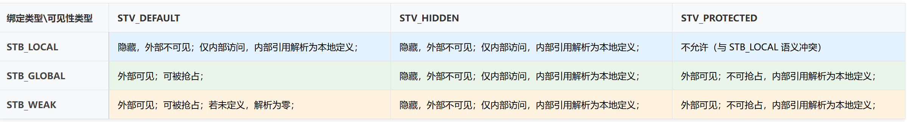

## 八、不同类型地址引用方式

对于现代的机器来说，产生的地址无关的代码并不麻烦。我们先来分析模块中各种类型的地址引用方式，这里我们把共享对象模块中的地址引用按照是否为跨模块分成两类：模块内部引用和模块外部引用；按照不同的引用方式又可以分为指令引用和数据访问。这样我们就得到了下面的 4 种情况：

- 第一种是模块内部的函数调用、跳转等；
- 第二种是模块内部的数据访问，比如模块中定义的全局变量、静态变量；
- 第三种是模块外部的函数调用、跳转等；
- 第四种是模块外部的数据访问，比如其他模块中定义的全局变量；

在解析上面 4 种情况之前，需要先解析和深入 C 语言中的 **`STB_LOCAL`**、**`STB_GLOBAL`**、**`STB_WEAK`** 这三种绑定属性以及 **`STV_DEFAULT`**、**`STV_HIDDEN`**、**`STV_PROTECTED`** 这三种可见性属性。

### 1.绑定属性

符号绑定属性是 ELF 文件中的一个基本特性，**<font color="red">它决定了链接器在静态链接阶段如何处理和解析符号</font>**。这些属性定义了符号的范围和优先级，尤其是在多个目标文件被合并时，**<font color="red">它们决定了哪个符号定义将被选中以满足引用</font>**。

#### 1.1 **`STB_LOCAL`** 属性

**`STB_LOCAL`** 绑定属性表示符号是本地的，其作用域仅限于定义它的目标文件内部。这意味着，即使在不同的目标文件中存在同名的 **`STB_LOCAL`** 符号，它们也不会相互干扰。对于 C 语言而言，在文件作用域内使用 static 关键字声明的函数或全局变量通常会被编译器赋予 **`STB_LOCAL`** 绑定 。

例如，一个 C 文件中的 **`static int counter;`** 或 **`static void helper_function();`** 都会生成 **`STB_LOCAL`** 符号。这种本地化特性确保了模块内部的封装性，防止了命名冲突，并允许编译器进行优化，**因为编译器/链接器知道这些符号不会在模块外部被引用或重写**。

在共享库中，使用文件作用域 static 关键字声明的函数和全局变量（即具有 **`STB_LOCAL`** 绑定）通常不需要 **`PLT/GOT`** 机制进行内部访问。相反，它们使用 PC 相对寻址（在 x86-64 上称为 RIP 相对寻址）进行访问。编译器计算静态符号相对于当前指令指针（PC/RIP）的固定偏移量。这允许直接跳转到静态函数或直接加载静态变量的值，无论共享库在内存中加载到何处。

#### 1.2 **`STB_GLOBAL`** 属性

**`STB_GLOBAL`** 绑定属性表示符号是全局的，它在所有被链接的目标文件之间都是可见的。一个目标文件中对 **`STB_GLOBAL`** 符号的定义可以满足另一个目标文件中对该符号的未定义引用。**<font color="red">在 C 语言中，在文件作用域内声明的非 static 函数和全局变量默认具有 **`STB_GLOBAL`** 绑定</font>**。

#### 1.3 **`STB_WEAK`** 属性

**`STB_WEAK`** 绑定属性的符号与 **`STB_GLOBAL`** 符号类似，也对所有被连接的目标文件可见，但其定义具有较低的优先级。这意味着，如果存在一个同名的 **`STB_GLOBAL`** 符号定义，链接器将优先选择 **`STB_GLOBAL`** 定义而忽略 **`STB_WEAK`** 定义。如果只有多个 **`STB_WEAK`** 定义而没有 **`STB_GLOBAL`** 定义，链接器的行为通常是选择第一个遇到的弱定义。

**`STB_WEAK`** 符号在 C 语言中可以通过 GCC 的 **`__attribute__((weak))`** 属性或 **`#pragma weak`** 指令来声明 。弱符号的一个主要用途是提供可被覆盖的默认实现。

### 2.ELF 符号的可见性

符号可见性属性，主要定义了符号一旦成为可执行文件或共享对象的一部分后，在运行时如何被访问。它是一种运行时访问控制机制，用于精细地管理软件组件的外部接口和运行时可访问性。

#### 2.1 **`STV_DEFAULT`** 可见性

The visibility of symbols with the **`STV_DEFAULT`** attribute is as specified by the symbol's binding type. That is, global and weak symbols are visible outside of their defining component (executable file or shared object). Local symbols are hidden, as described below. Global and weak symbols are also preemptable, that is, they may by interposed by definitions of the same name in another component.

**`STV_DEFAULT`** 属性表示符号的运行时可见性由其绑定类型决定。具体来说，具有 **`STB_GLOBAL`** 或 **`STB_WEAK`** 绑定的符号，如果其可见性为 **`STV_DEFAULT`**，**则在运行时对其他组件（可执行文件或共享对象）是可见的，并可能被抢占（即被同名的其他定义覆盖）**。相反，**`STB_LOCAL`** 符号，无论其 **`STV_DEFAULT`** 设置如何，本质上都是隐藏的，在定义它们的目标文件外部不可见。

这是大多数符号的默认可见性设置，除非通过编译器标志（例如 **`-fvisibility=hidden`**）或特定属性（例如 **`__attribute__((visibility("hidden")))`**）明确更改。**`STV_DEFAULT`** 代表了"正常"的操作状态，允许标准的动态链接行为和符号抢占的可能性。

#### 2.2 **`STV_HIDDEN`** 可见性

A symbol defined in the current component is hidden if its name is not visible to other components. Such a symbol is necessarily protected. This attribute is used to control the external interface of a component. Note that an object named by such a symbol may still be referenced from another component if its address is passed outside.

**`STV_HIDDEN`** 符号明确标记为在运行时对其他组件不可见。**<font color="red">其名称被有意地从动态符号表中排除，有效地使其成为定义组件内部的私有符号</font>**。此属性主要用于精确控制和限制共享库的外部应用程序编程接口（API）。

其他模块无法直接引用、链接或动态加载隐藏符号，这强制了严格的内部封装。开发者可以使用 GCC 特有的 **`__attribute__((visibility("hidden")))`** 属性来明确标记单个函数或全局变量为隐藏。或者，使用 **`-fvisibility=hidden`** 标志编译整个模块将默认隐藏所有符号，此时需要对任何旨在成为公共 API 的符号进行显式的 **`__attribute__((visibility("default")))`** 注释。

A hidden symbol contained in a relocatable object is either removed or converted to **`STB_LOCAL`** binding by the link-editor when the relocatable object is included in an executable file or shared object.这句话其实还不严谨，可以看后面的解析。

当使用链接器（ld）将一个或多个 **`.o`** 文件链接成一个最终产物（共享库 **`.so`**）时，链接器会扫描所有 **`.o`** 文件中的符号表，对于那个被标记为 **`STV_HIDDEN`** 的 foo 符号将其绑定属性从 **`STB_GLOBAL`** 转换为 **`STB_LOCAL`**。**`STB_LOCAL`** 属性的符号是纯粹的内部符号，它们的作用域仅限于当前模块，并且永远不会被放入到用于动态链接的 **`.dynsym`** 符号表中，因此由于链接器在链接时就已经知道了 foo 的最终地址，对它的调用可以被优化为直接的、高效的内部调用，而不需要通过 PLT/GOT 机制。

假设有下面的代码：

```c{.line-numbers}
// file2.c
#include <stdio.h>

__attribute__((visibility("hidden")))
long aa = 2;
int initialized_var = 3;
static int cc = 44;

int foo() {
    return initialized_var;
}

int bar() {
    foo();
}
```

将上述 **`file2.c`** 文件编译成 **`file2.o`** 文件，可以看到此时 file2.o 的文件中，变量 aa 的可见性是 **`STV_HIDDEN`**。

```c{.line-numbers}
monica@monica-virtual-machine:~/linkers_loaders$ gcc file2.c -c -o file2.o -m32
monica@monica-virtual-machine:~/linkers_loaders$ readelf -s file2.o | grep aa
     4: 00000000     4 OBJECT  GLOBAL HIDDEN     4 aa
```

继续将 **`file2.c`** 文件编译成 **`.so`** 共享库文件，此时变量 aa 的可见性是 **`STV_DEFAULT`**，正好印证了我们所说的，当使用链接器（ld）将一个或多个 **`.o`** 文件链接成一个最终产物（共享库 **`.so`**）时，对于那个被标记为 **`STV_HIDDEN`** 的符号，会将其绑定属性转换为 **`STB_LOCAL`**，转变为一个 static 类型的变量，并且从用于动态链接的 **`.dynsym`** 符号表中删除。

```c{.line-numbers}
monica@monica-virtual-machine:~/linkers_loaders$ gcc file2.c -o file2.so -fPIC -shared -m32
monica@monica-virtual-machine:~/linkers_loaders$ readelf -s file2.so | grep aa
   20: 00004014     4 OBJECT  LOCAL  DEFAULT   19 aa
monica@monica-virtual-machine:~/linkers_loaders$ readelf -s file2.so | grep cc
    10: 0000401c     4 OBJECT  LOCAL  DEFAULT   19 cc
monica@monica-virtual-machine:~/linkers_loaders$ readelf -sD file2.so

Symbol table for image contains 8 entries:
   Num:    Value  Size Type    Bind   Vis      Ndx Name
     0: 00000000     0 NOTYPE  LOCAL  DEFAULT  UND 
     1: 00000000     0 NOTYPE  WEAK   DEFAULT  UND __cxa_finalize
     2: 00000000     0 NOTYPE  WEAK   DEFAULT  UND _ITM_registerTMC[...]
     3: 00000000     0 NOTYPE  WEAK   DEFAULT  UND _ITM_deregisterT[...]
     4: 00000000     0 NOTYPE  WEAK   DEFAULT  UND __gmon_start__
     5: 0000115d    23 FUNC    GLOBAL DEFAULT   10 foo
     6: 00001174    30 FUNC    GLOBAL DEFAULT   10 bar
     7: 00004018     4 OBJECT  GLOBAL DEFAULT   19 initialized_var
```

将 **`file1.c`** 和 **`file2.so`** 一起编译成可执行程序 file，发现绑定属性为 **`STB_LOCAL`** 的变量 aa（可见性为 **`STV_HIDDEN`**，链接器将其转换为 **`STB_LOCAL`**）和 cc（static 类型的变量）都不在最终生成的可执行程序的符号表中。aa/cc 是 file2.so 的 LOCAL 符号，它属于 file2.so 的内部实现细节，并没有被导出。当链接器构建 file 可执行文件时，它只关心 file 所需的外部符号，而 aa/cc 并不在其中，因此链接器完全没有理由将 aa/cc 的符号信息包含到 file 的符号表中。

```c{.line-numbers}
// file1.c 代码
#include <stdio.h>

int initialized_var;
int bb = 5;

extern int foo();

int main() {
    foo();
    printf("func1: my_var = %d\n", initialized_var);
}

monica@monica-virtual-machine:~/linkers_loaders$ gcc file1.c ./file2.so -o file -m32
monica@monica-virtual-machine:~/linkers_loaders$ readelf -s file | grep aa
monica@monica-virtual-machine:~/linkers_loaders$ readelf -s file | grep cc
```

当使用 **`gcc file1.c file2.o -o file -m32`** 命令编译 **`file1.c`** 和 **`file2.o`** 文件，会报 multiple definition of 'initialized_var' 错误，**<font color="red">这是因为此时链接器对 `file1.c` 和 `file2.o` 执行的是静态链接操作</font>**，链接器会把 **`file1.o`** 和 **`file2.o`** 中的代码段、数据段等所有部分物理上合并在一起，形成一个单一的、完整的可执行文件 file。

```c{.line-numbers}
monica@monica-virtual-machine:~/linkers_loaders$ gcc file1.c file2.o -o file -m32
/usr/bin/ld: file2.o:(.data+0x4): multiple definition of `initialized_var'; /tmp/ccIwDGag.o:(.bss+0x0): first defined here
collect2: error: ld returned 1 exit status
```

假设将 file1.c 中的代码修改如下，可以看到，最终静态链接生成的 file 文件中正常包含了 aa 和 cc 变量。因为执行静态链接时，是将所有文件原封不动地进行合并，所以可以在 file 中找到 aa 和 cc 变量。

```c{.line-numbers}
// file1.c
#include <stdio.h>

__attribute__((weak))
int initialized_var;
int bb = 5;

extern int foo();

int main() {
    foo();
    printf("func1: my_var = %d\n", initialized_var);
}

monica@monica-virtual-machine:~/linkers_loaders$ gcc file1.c file2.o -o file -m32
monica@monica-virtual-machine:~/linkers_loaders$ readelf -s file | grep cc
    13: 00004014     4 OBJECT  LOCAL  DEFAULT   23 cc
monica@monica-virtual-machine:~/linkers_loaders$ readelf -s file | grep aa
    31: 0000400c     4 OBJECT  GLOBAL HIDDEN    23 aa
```

**`GLOBAL+HIDDEN`** normally happens in unlinked .o files (incl. static libs) for hidden functions (while unit-local static functions are **`LOCAL+DEFAULT`** there already). Then during linking, **`GLOBAL+HIDDEN`** converts to **`LOCAL+DEFAULT`**, always for normal functions when creating shared libraries.

However, for non-library executables, these internals are not fully converted, remaining **`GLOBAL+HIDDEN`** for a reason that might be pure convenience. As it is not a library that is linked to anywhere, it doesn't do any harm. 因为这个可执行文件已经是程序的“终点”了，不会再作为库被别人链接。所以，即使它内部的某些符号没有从 **`GLOBAL+HIDDEN`** 彻底转为 **`LOCAL+DEFAULT`**，也没有任何实际影响。外部世界根本没有机会来访问这些符号。链接器可能为了节省一点点处理时间或简化逻辑，就“偷懒”不去做这个最后的转换了。

假设有下面的代码，将 file2.c 直接编译成 file2 可执行程序之后，发现 aa 变量还是 **`GLOBAL+HIDDEN`**，没有被转变成 **`LOCAL+DEFAULT`**，验证了这个说法。

```c{.line-numbers}
// file2.c
#include <stdio.h>

__attribute__((visibility("hidden")))
long aa = 2;
int initialized_var = 3;
static int cc = 44;

int foo() {
    return initialized_var;
}

int bar() {
    foo();
}

int main() {
    bar();
}

monica@monica-virtual-machine:~/linkers_loaders$ gcc file2.c -o file2 -m32
monica@monica-virtual-machine:~/linkers_loaders$ readelf -s file2 | grep aa
    29: 00004008     4 OBJECT  GLOBAL HIDDEN    23 aa
```

#### 2.3 **`STV_PROTECTED`** 可见性

A symbol defined in the current component is protected if it is visible in other components but not preemptable, meaning that any reference to such a symbol from within the defining component must be resolved to the definition in that component, even if there is a definition in another component that would interpose by the default rules. A symbol with **`STB_LOCAL`** binding will not have **`STV_PROTECTED`** visibility.

**`STV_PROTECTED`** 符号对其他组件是可见的（即其名称被导出），但当从其定义组件内部引用时，它不能被来自其他组件的同名定义抢占。此属性保证了共享对象内部对该符号的任何内部引用都将始终解析为该组件内部的定义，即使外部库试图进行抢占（覆盖）。

**<font color="red">此属性确保了库对其自身受保护函数或变量的内部调用将始终使用其自身的定义，无论是否通过 **`LD_PRELOAD`** 加载了同名函数或存在于另一个动态链接的共享对象中</font>**。与 **`STV_HIDDEN`** 类似，此属性可以应用于 C/C++ 源代码中的单个函数或全局变量 。

### 3.符号绑定与可见性的交互机制

None of the visibility attributes affects the resolution of symbols within an executable or shared object during link-editing. Such resolution is controlled by the binding type. Once the link-editor has chosen its resolution, these attributes impose two requirements. 也就是说在链接期间，任何可见性属性都不会影响可执行文件或共享对象内部的符号解析，符号解析是由绑定类型（强/弱）控制的。一旦链接器完成了它的解析选择，这些可见性属性才会施加额外的要求。

在符号解析（Symbol Resolution）阶段，链接器查看所有 .o 文件，为每个符号引用找到一个唯一的定义。这个过程主要由符号的绑定类型（Binding Type）——即 STB_GLOBAL（强符号）和 STB_WEAK（弱符号）——来决定。例如，强定义会覆盖弱定义。可见性属性（protected, hidden 等）在这个阶段不起作用。

在符号解析完成，确定了用哪个定义之后，链接器才开始检查和强制执行可见性属性。

可见性属性并非替代符号绑定，而是作为符号行为的关键细化，主要影响 **`STB_GLOBAL`** 和 **`STB_WEAK`** 符号。绑定决定了符号 **<font color="red">在静态链接期间如何解析（即在合并目标文件时哪个定义胜出）</font>**，而可见性则管理 **<font color="red">它们一旦成为动态链接的可执行文件或共享对象的一部分后的运行时可访问性和抢占行为</font>**。**`STV_DEFAULT`** 属性明确地说明了这种依赖关系，因为其最终可见性直接来源于符号的基础绑定类型。

#### 3.1 传播规则

If any reference to or definition of a name is a symbol with a non-default visibility attribute, the visibility attribute must be propagated to the resolving symbol in the linked object. If different visibility attributes are specified for distinct references to or definitions of a symbol, the most constraining visibility attribute must be propagated to the resolving symbol in the linked object. The attributes, ordered from least to most constraining, are: **`STV_PROTECTED`**, **`STV_HIDDEN`** and **`STV_INTERNAL`**.

如果对一个名字的任何引用或定义，是一个带有非默认可见性属性的符号，那么这个可见性属性必须被传播给链接后对象中的最终解析符号。当链接器遇到一个符号的多个引用或定义，并且每个都可能带有不同的可见性属性时，会应用特定的传播规则：**<font color="red">最严格的可见性属性将被继承并应用于链接对象中最终解析的符号</font>**。约束的层次结构，从最不严格到最严格，定义为：**`STV_PROTECTED`** < **`STV_HIDDEN`** < **`STV_INTERNAL`**。

假设有 aa.c 和 bb.c 两个文件如下所示，my_func 在这 2 个文件中的可见性分别是 **`STV_PROTECTED`** 和 **`STV_DEFAULT`**，最后可以看到符号表中的 **`my_func`** 函数的可见性为 **`STV_PROTECTED`**，也就是 my_func 函数所有引用和定义中可见性最低的那一个。

```c{.line-numbers}
// aa.c
#include <stdio.h>
// 定义 my_func，并明确标记为 protected
__attribute__((visibility("protected")))
void my_func() {
    printf("hello world\n");
}

void helper() {
    my_func();
}

// bb.c
// 只是引用 my_func，但声明为 default
__attribute__((visibility("default"))) 
extern void my_func();

void func_b() {
    my_func(); // 编译器可能基于 hidden 属性进行优化
}

monica@monica-virtual-machine:~/linkers_loaders$ gcc aa.c bb.c -o aa -fPIC -shared -m32
monica@monica-virtual-machine:~/linkers_loaders$ readelf -s aa

Symbol table '.dynsym' contains 9 entries:
   Num:    Value  Size Type    Bind   Vis      Ndx Name
     8: 0000115d    43 FUNC    GLOBAL PROTECTED   12 my_func

Symbol table '.symtab' contains 32 entries:
   Num:    Value  Size Type    Bind   Vis      Ndx Name
     0: 00000000     0 NOTYPE  LOCAL  DEFAULT  UND 
    25: 0000115d    43 FUNC    GLOBAL PROTECTED   12 my_func
```

假设 aa.c 中 my_func 的可见性变为 **`__attribute__((visibility("hidden")))`**，最后可以看到 my_func 的绑定属性变为 **`STB_LOCAL`**。这就是前面说的，在链接并生成 .so 文件时，链接器会将 **`GLOBAL+HIDDEN`** 彻底转为 **`LOCAL+DEFAULT`**。

```c{.line-numbers}
 monica@ monica-virtual-machine:~/linkers_loaders$ gcc aa.c bb.c -o aa -fPIC -shared -m32
 monica@ monica-virtual-machine:~/linkers_loaders$ readelf -s aa | grep my_func
    16: 0000115d    43 FUNC    LOCAL  DEFAULT   12 my_func
```

#### 3.2 限制

ELF 规范中一个值得注意且逻辑一致的限制是：具有 **`STB_LOCAL`** 绑定的符号不能被赋予 **`STV_PROTECTED`** 可见性。这是因为 **`STB_LOCAL`** 符号本质上是私有的，在定义它们的目标文件外部不可见。而“保护”可见性的概念，意味着外部可见性但内部不可抢占，对于一个已经完全封装的符号来说是多余和矛盾的。

**`STB_LOCAL`** 从根本上意味着完全的内部封装，即符号的作用域严格受限，并且不会在外部可见。相反，**`STV_PROTECTED`** 则预设了外部可见性，同时强制执行内部不可抢占性。对于单个符号而言，这两个概念本质上是相互排斥的。ELF 规范强制执行这种逻辑一致性，防止可能导致不可预测的链接器行为或运行时错误的矛盾符号状态。

#### 3.3 内部非静态符号

一个常见的困惑是，即使是共享库内部对同一共享库内的 **`STB_GLOBAL`** 或 **`STB_WEAK`** 函数的调用，默认情况下也可能使用 **`PLT/GOT`** 机制 。这种看似低效的间接寻址之所以存在，主要是因为在 Linux 系统上，除非明确指定，所有函数都被赋予 **`STV_DEFAULT`** 可见性。这种默认可见性隐式地允许符号抢占在运行时发生。

如果另一个共享库（例如，通过 **`LD_PRELOAD`** 环境变量加载的库）提供了同名函数，动态链接器可能会"抢占"原始函数，这意味着它会将调用重定向到外部的、抢占性的定义。**`PLT/GOT`** 机制旨在通过提供一个动态链接器可以轻松更新以指向抢占符号的单点间接寻址来促进这种抢占。 

为了避免这种开销并防止对仅供共享库内部使用的函数进行抢占，开发者可以显式地将其可见性设置为 **`STV_HIDDEN`**，使用 **`__attribute__((visibility("hidden")))`** 属性。或者，使用 **`-fvisibility=hidden`** 标志编译整个模块将默认隐藏所有符号。当符号被标记为隐藏时，它们成为共享库的私有符号，不再受外部抢占的影响，从而允许编译器生成直接的 PC 相对调用，类似于处理 static 函数的方式。

符号抢占是在动态链接环境中发生的一种现象，当在加载到单个进程的不同动态对象（例如，主可执行文件和各种共享库）中存在多个同名符号定义时。**<font color="red">在默认的符号搜索模型下，对这种符号的引用将解析为动态链接器搜索路径中找到的第一个定义</font>**。这个第一个符号随后被称为"抢占"（或覆盖）任何其他同名定义。

#### 3.4 定义必须在组件内部

First, all of the non-default visibility attributes, when applied to a symbol reference, imply that a definition to satisfy that reference must be provided within the current executable or shared object. If this type of symbol reference has no definition within the component being linked, then the reference must have **`STB_WEAK`** binding and is resolved to zero.

所有非默认（**`STV_DEFAULT`**）的可见性属性（**`STV_PROTECTED`**，**`STV_HIDDEN`**），当应用于一个符号引用时，都意味着满足该引用的定义必须在当前正在链接的可执行文件或共享对象内部提供。这是对编译器优化的承诺保证，编译器在编译 **`libfoo.c`** 时，代码里调用了 **`my_func()`**，并且 **`my_func`** 被声明为 **`__attribute__((visibility("hidden")))`**。

编译器认为 **`my_func`** 必然和调用者在同一个 .so 文件里，于是直接生成了一个高效的、直接的相对跳转指令。现在链接器在链接生成 **`libfoo.so`** 时，它必须在 **`libfoo.so`** 内部找到 **`my_func`** 的定义。如果找不到，或者发现唯一的定义在另一个库 **`libbar.so`** 里，那么编译器的优化就错了，程序会崩溃。这个规则就是为了防止这种情况，链接器会直接报错。

假设有如下代码，只有对 **`my_func`** 函数的引用，没有实际定义，并且 **`my_func`** 函数的可见性被声明为 **`STV_HIDDEN`**，因此在编译生成共享库的时候报了错，**`undefined reference to 'my_func'`**。

```c{.line-numbers}
// bb.c
// 只是引用 my_func，但声明为 hidden
__attribute__((visibility("hidden"))) 
extern void my_func();

void func_b() {
    my_func(); // 编译器可能基于 hidden 属性进行优化
}

monica@monica-virtual-machine:~/linkers_loaders$ gcc bb.c -o libb.so -fPIC -shared -m32
/usr/bin/ld: /tmp/ccdJ0Hbf.o: in function `func_b':
bb.c:(.text+0x11): undefined reference to `my_func'
/usr/bin/ld: libb.so: hidden symbol `my_func' isn't defined
/usr/bin/ld: 最后的链结失败: bad value
collect2: error: ld returned 1 exit status
```

假设将上述代码中 **`my_func`** 函数的可见性修改为 **`STV_DEFAULT`**，那么 gcc 在编译生成共享库时没有报错。

```c{.line-numbers}
// bb.c
// 只是引用 my_func，但声明为 hidden
__attribute__((visibility("default"))) 
extern void my_func();

void func_b() {
    my_func();
}

monica@monica-virtual-machine:~/linkers_loaders$ gcc bb.c -o libb.so -fPIC -shared -m32
```

If this type of symbol reference has no definition within the component being linked, then the reference must have **`STB_WEAK`** binding and is resolved to zero. 

如果这种类型的符号引用在被链接的组件内部没有定义，那么该引用必须是 **`STB_WEAK`**（弱）绑定，并且它会被解析为 0，否则链接器就会报错。这是上述规则的一个例外情况，它允许你创建一个"可选的"内部函数。你可以声明一个弱的、hidden 的函数指针。**`__attribute__((weak, visibility("hidden"))) void optional_func();`**。如果在链接 **`libfoo.so`** 时，链接器找不到 **`optional_func`** 的定义，因为它是一个弱引用，所以链接器不会报错。它会合法地将所有对 **`optional_func`** 的引用解析为一个空地址（0 或 NULL）。

假设有如下代码，**`my_func`** 函数的可见性为 **`STV_HIDDEN`**，但是此时可见性为 **`STB_WEAK`**，现在将 bb.c 编译成可执行程序 bb 时，链接器就不会报错。并且运行 bb 程序，发现 my_func 函数的引用被解析为一个 NULL 地址。

```c{.line-numbers}
// bb.c
#include <stdio.h>
// 只是引用 my_func，但声明为 hidden
__attribute__((weak, visibility("hidden"))) 
extern void my_func();

void func_b() {
    my_func(); // 编译器可能基于 hidden 属性进行优化
}

int main() {
    if (my_func == NULL) {
        printf("my_func value is nil\n");
    }
    return 0;
}

monica@monica-virtual-machine:~/linkers_loaders$ gcc bb.c -o bb -m32
monica@monica-virtual-machine:~/linkers_loaders$ ./bb
my_func value is nil
```

### 4.符号绑定与可见性如何决定模块内符号引用

下表展示了 ELF 符号绑定和可见性属性结合后的行为：

<div align="center">
    
</div>

**下面就以上面表格中符号的各个绑定性和可见性相互组合，<font color="red">来研究模块内部的符号（包括全局变量和函数）如何被引用</font>**。模块外部的全局变量是通过 GOT 访问，而模块外部的函数则是通过 PLT/GOT 访问的。

#### 4.1 **`LOCAL+DEFAULT`**

假设有如下代码，可以看到编译成共享库 libfoo.so 之后，**`helper`** 函数中对 **`my_func`** 的调用直接通过相对跳转进行，而不是 PLT/GOT，这是因为内部引用只能被解析为本地定义，即不可被抢占，使得编译器可以安全地生成直接相对地址调用的优化代码。同时从 .dynsym 节中可以看出，my_func 函数不在其中，因此外部不可见。

```c{.line-numbers}
// aa.c
#include <stdio.h>

static int aa_s = 2;
static void my_func() {
    printf("hello world\n");
}

void helper() {
    my_func();
    aa_s += 2;
    printf("%d\n", aa_s);
}

monica@monica-virtual-machine:~/linkers_loaders$ gcc aa.c -o libfoo.so -fPIC -shared -m32
monica@monica-virtual-machine:~/linkers_loaders$ objdump -d libfoo.so --disassemble=helper
libfoo.so：     文件格式 elf32-i386
Disassembly of section .text:

00001198 <helper>:
    1198:    55                       push   %ebp
    1199:    89 e5                    mov    %esp,%ebp
    119b:    53                       push   %ebx
    119c:    83 ec 04                 sub    $0x4,%esp
    119f:    e8 cc fe ff ff           call   1070 <__x86.get_pc_thunk.bx>
    11a4:    81 c3 5c 2e 00 00        add    $0x2e5c,%ebx
    11aa:    e8 be ff ff ff           call   116d <my_func>
    11af:    8b 83 18 00 00 00        mov    0x18(%ebx),%eax
    11b5:    83 c0 02                 add    $0x2,%eax
    11b8:    89 83 18 00 00 00        mov    %eax,0x18(%ebx)
    11be:    8b 83 18 00 00 00        mov    0x18(%ebx),%eax
    11c4:    83 ec 08                 sub    $0x8,%esp
    11c7:    50                       push   %eax
    11c8:    8d 83 0c e0 ff ff        lea    -0x1ff4(%ebx),%eax
    11ce:    50                       push   %eax
    11cf:    e8 6c fe ff ff           call   1040 <printf@plt>
    11d4:    83 c4 10                 add    $0x10,%esp
    11d7:    90                       nop
    11d8:    8b 5d fc                 mov    -0x4(%ebp),%ebx
    11db:    c9                       leave  
    11dc:    c3                       ret    
monica@monica-virtual-machine:~/linkers_loaders$ readelf -s libfoo.so 

Symbol table '.dynsym' contains 8 entries:
   Num:    Value  Size Type    Bind   Vis      Ndx Name
     0: 00000000     0 NOTYPE  LOCAL  DEFAULT  UND 
     7: 00001198    54 FUNC    GLOBAL DEFAULT   12 helper

Symbol table '.symtab' contains 32 entries:
   Num:    Value  Size Type    Bind   Vis      Ndx Name
     0: 00000000     0 NOTYPE  LOCAL  DEFAULT  UND 
     9: 00000000     0 FILE    LOCAL  DEFAULT  ABS aa.c
    10: 00004018     4 OBJECT  LOCAL  DEFAULT   22 aa_s
    11: 0000116d    43 FUNC    LOCAL  DEFAULT   12 my_func
```

解释一下为什么可抢占会导致函数调用通过 PLT/GOT 方式进行：

>假设 **`foo()`** 直接用相对地址跳转可抢占函数 **`bar()`** 会发生什么？
假设编译器把 **`bar()`** 当作"完全在本模块内部"的函数处理，产生的相对跳转调用，这意味着编译器在生成指令时，直接写死了 **`call bar_local_offset`** 之类的指令——这是一个在编译/ 链接阶段就确定好的偏移量。但是，一旦在运行时外部真正覆盖了 **`bar()`**（即另一个库里有同名 **`bar()`** 函数并且符号优先级更高），那么就需要让 **`foo()`** 调用到那个外部 **`bar()`**。此时，如果代码指令里写死了相对偏移，就意味着这条调用指令得被修改——这需要对代码段（.text 段）做重定位补丁：
>- **<font color="red">如果要修改 `.text` 段，就会违反“共享库的代码段通常是只读”的设计</font>**；
>- 即使可以改写，也会导致内存页写时复制（Copy on Write），影响共享；
>- 并且真正的“位置无关”就被破坏了，因为我们需要对指令的立即数做修改（代码有了文本重定位 TEXTREL）；

接下来看一下对静态变量 **`aa_s`** 的访问。首先可以看到 **`aa_s`** 的 **`st_value`** 值为 0x4018，对于共享库（libfoo.so）来说，**`st_value`** 可以当做是该符号相对于其所在模块起始位置的字节偏移量，且 **`l_addr`** 直接表示 libfoo.so 的运行时加载基地址。并且从共享库 libfoo.so 的重定位表中可以看出，aa_s 不需要进行重定位，**<font color="red">也就是说链接器认为 aa_s 的地址可以在模块内部通过相对寻址解决，不需要动态加载器在加载共享库时进行修正/重定位</font>**。

```c{.line-numbers}
monica@monica-virtual-machine:~/linkers_loaders$ readelf -S libfoo.so
  [19] .dynamic          DYNAMIC         00003f10 002f10 0000e0 08  WA  4   0  4
  [20] .got              PROGBITS        00003ff0 002ff0 000010 04  WA  0   0  4
  [21] .got.plt          PROGBITS        00004000 003000 000014 04  WA  0   0  4
  [22] .data             PROGBITS        00004014 003014 000008 00  WA  0   0  4
  [23] .bss              NOBITS          0000401c 00301c 000004 00  WA  0   0  1
  [24] .comment          PROGBITS        00000000 00301c 00002b 01  MS  0   0  1
monica@monica-virtual-machine:~/linkers_loaders$ readelf -s libfoo.so | grep aa_s
    10: 00004018     4 OBJECT  LOCAL  DEFAULT   22 aa_s
monica@monica-virtual-machine:~/linkers_loaders$ readelf -r libfoo.so 

重定位节 '.rel.dyn' at offset 0x2e0 contains 7 entries:
 偏移量     信息    类型              符号值      符号名称
00003f08  00000008 R_386_RELATIVE   
00003f0c  00000008 R_386_RELATIVE   
00004014  00000008 R_386_RELATIVE   
00003ff0  00000106 R_386_GLOB_DAT    00000000   _ITM_deregisterTM[...]
00003ff4  00000306 R_386_GLOB_DAT    00000000   __cxa_finalize@GLIBC_2.1.3
00003ff8  00000506 R_386_GLOB_DAT    00000000   __gmon_start__
00003ffc  00000606 R_386_GLOB_DAT    00000000   _ITM_registerTMCl[...]

重定位节 '.rel.plt' at offset 0x318 contains 2 entries:
 偏移量     信息    类型              符号值      符号名称
0000400c  00000207 R_386_JUMP_SLOT   00000000   printf@GLIBC_2.0
00004010  00000407 R_386_JUMP_SLOT   00000000   puts@GLIBC_2.0
```

接下来调试一下对 aa_s 变量的访问过程，假设有如下的 bb.c 代码，我们使用 gdb 调试，在 helper 函数处设置断点。然后运行程序，它会在 helper 函数的开头停下来，接着直接打印 aa_s 的地址，可以看到 aa_s 的运行时实际地址为 **`0xf7fbd018`**。然后在断点处，查看 helper 函数的汇编代码，找到访问 aa_s 的指令。单步执行到 **`aa_s += 2`** 这条指令之后，以便让 %ebx 的值被正确设置好。

**`call   0xf7fba070 <__x86.get_pc_thunk.bx>`** 指令执行之后，%ebx 寄存器的值被设置为 **`0xf7fba1a4`**，接着增加 2 个偏移量 **`0x2e5c`** 和 **`0x18`**，最后得到 aa_s 的实际地址为 **`0xf7fbd018`**，和上面的实际运行时地址一样（且位于 **`.data`** 段）。并且由于 libfoo.so 在运行时被加载的地址（**`l_addr`**）位于 **`0xf7fb9000`**，aa_s 的 **`st_value`** 偏移量为 0x4018，两者相加刚好等于 **`0xf7fbd018`**。**<font color="red">在访问 `aa_s` 变量的过程中，没有经过 GOT 表，直接通过相对地址来进行访问</font>**。

```c{.line-numbers}
// bb.c
#include <stdio.h>

extern void helper();

int main() {
    helper();
    return 0;
}

monica@monica-virtual-machine:~/linkers_loaders$ gcc aa.c -o libfoo.so -fPIC -shared -m32 -g
monica@monica-virtual-machine:~/linkers_loaders$ gcc -g -m32 bb.c ./libfoo.so -o bb
monica@monica-virtual-machine:~/linkers_loaders$ gdb bb
(gdb) b helper
Breakpoint 1 at 0x1050
(gdb) r
Starting program: /home/monica/linkers_loaders/bb 
[Thread debugging using libthread_db enabled]
Using host libthread_db library "/lib/x86_64-linux-gnu/libthread_db.so.1".

Breakpoint 1, helper () at aa.c:9
warning: Source file is more recent than executable.
9        my_func();
(gdb) p &aa_s
$1 = (int *) 0xf7fbd018 <aa_s>
(gdb) disa helper
Bad breakpoint number 'helper'
(gdb) disas helper
Dump of assembler code for function helper:
   0xf7fba198 <+0>:    push   %ebp
   0xf7fba199 <+1>:    mov    %esp,%ebp
   0xf7fba19b <+3>:    push   %ebx
   0xf7fba19c <+4>:    sub    $0x4,%esp
   0xf7fba19f <+7>:    call   0xf7fba070 <__x86.get_pc_thunk.bx>
   0xf7fba1a4 <+12>:    add    $0x2e5c,%ebx
=> 0xf7fba1aa <+18>:    call   0xf7fba16d <my_func>
   0xf7fba1af <+23>:    mov    0x18(%ebx),%eax
   0xf7fba1b5 <+29>:    add    $0x2,%eax
   0xf7fba1b8 <+32>:    mov    %eax,0x18(%ebx)
   0xf7fba1be <+38>:    mov    0x18(%ebx),%eax
   0xf7fba1c4 <+44>:    sub    $0x8,%esp
   0xf7fba1c7 <+47>:    push   %eax
   0xf7fba1c8 <+48>:    lea    -0x1ff4(%ebx),%eax
   0xf7fba1ce <+54>:    push   %eax
   0xf7fba1cf <+55>:    call   0xf7fba040 <printf@plt>
   0xf7fba1d4 <+60>:    add    $0x10,%esp
   0xf7fba1d7 <+63>:    nop
   0xf7fba1d8 <+64>:    mov    -0x4(%ebp),%ebx
   0xf7fba1db <+67>:    leave  
   0xf7fba1dc <+68>:    ret    
End of assembler dump.
(gdb) n
hello world
10        aa_s += 2;
(gdb) n
11        printf("%d\n", aa_s);
(gdb) info registers ebx
ebx            0xf7fbd000          -134492160
(gdb) info proc mappings
process 10220
Mapped address spaces:

    Start Addr   End Addr       Size     Offset  Perms   objfile
    0x56555000 0x56556000     0x1000        0x0  r--p   /home/monica/linkers_loaders/bb
    0x56556000 0x56557000     0x1000     0x1000  r-xp   /home/monica/linkers_loaders/bb
    0x56557000 0x56558000     0x1000     0x2000  r--p   /home/monica/linkers_loaders/bb
    0x56558000 0x56559000     0x1000     0x2000  r--p   /home/monica/linkers_loaders/bb
    0x56559000 0x5655a000     0x1000     0x3000  rw-p   /home/monica/linkers_loaders/bb
    0x5655a000 0x5657c000    0x22000        0x0  rw-p   [heap]
    0xf7d78000 0xf7d98000    0x20000        0x0  r--p   /usr/lib32/libc.so.6
    0xf7d98000 0xf7f16000   0x17e000    0x20000  r-xp   /usr/lib32/libc.so.6
    0xf7f16000 0xf7f9b000    0x85000   0x19e000  r--p   /usr/lib32/libc.so.6
    0xf7f9b000 0xf7f9c000     0x1000   0x223000  ---p   /usr/lib32/libc.so.6
    0xf7f9c000 0xf7f9e000     0x2000   0x223000  r--p   /usr/lib32/libc.so.6
    0xf7f9e000 0xf7f9f000     0x1000   0x225000  rw-p   /usr/lib32/libc.so.6
    0xf7f9f000 0xf7fa9000     0xa000        0x0  rw-p   
    0xf7fb9000 0xf7fba000     0x1000        0x0  r--p   /home/monica/linkers_loaders/libfoo.so
    0xf7fba000 0xf7fbb000     0x1000     0x1000  r-xp   /home/monica/linkers_loaders/libfoo.so
    0xf7fbb000 0xf7fbc000     0x1000     0x2000  r--p   /home/monica/linkers_loaders/libfoo.so
    0xf7fbc000 0xf7fbd000     0x1000     0x2000  r--p   /home/monica/linkers_loaders/libfoo.so
    0xf7fbd000 0xf7fbe000     0x1000     0x3000  rw-p   /home/monica/linkers_loaders/libfoo.so
    0xf7fbe000 0xf7fc0000     0x2000        0x0  rw-p   
    0xf7fc0000 0xf7fc4000     0x4000        0x0  r--p   [vvar]
    0xf7fc4000 0xf7fc6000     0x2000        0x0  r-xp   [vdso]
    0xf7fc6000 0xf7fc7000     0x1000        0x0  r--p   /usr/lib32/ld-linux.so.2
```

#### 4.2 **`LOCAL+HIDDEN`**

这里和 4.1 一样，不再赘述。

```c{.line-numbers}
// aa.c
#include <stdio.h>

static int aa_s = 4;
__attribute__((visibility("hidden")))
static void my_func() {
    printf("hello world\n");
}

void helper() {
    my_func();
    printf("%d\n", aa_s);
}

monica@monica-virtual-machine:~/linkers_loaders$ gcc aa.c -o libfoo.so -fPIC -shared -m32
aa.c:5:1: warning: ‘visibility’ attribute ignored [-Wattributes]
    5 | static void my_func() {
      | ^~~~~~
monica@monica-virtual-machine:~/linkers_loaders$ objdump -d libfoo.so --disassemble=helper
libfoo.so：     文件格式 elf32-i386
Disassembly of section .text:
00001198 <helper>:
    1198:    55                       push   %ebp
    1199:    89 e5                    mov    %esp,%ebp
    119b:    53                       push   %ebx
    119c:    83 ec 04                 sub    $0x4,%esp
    119f:    e8 cc fe ff ff           call   1070 <__x86.get_pc_thunk.bx>
    11a4:    81 c3 5c 2e 00 00        add    $0x2e5c,%ebx
    11aa:    e8 be ff ff ff           call   116d <my_func> <相对跳转>
    11af:    8b 83 18 00 00 00        mov    0x18(%ebx),%eax
    11b5:    83 ec 08                 sub    $0x8,%esp
    11b8:    50                       push   %eax
    11b9:    8d 83 0c e0 ff ff        lea    -0x1ff4(%ebx),%eax
    11bf:    50                       push   %eax
    11c0:    e8 7b fe ff ff           call   1040 <printf@plt>
    11c5:    83 c4 10                 add    $0x10,%esp
    11c8:    90                       nop
    11c9:    8b 5d fc                 mov    -0x4(%ebp),%ebx
    11cc:    c9                       leave  
    11cd:    c3                       ret    
monica@monica-virtual-machine:~/linkers_loaders$ readelf -s libfoo.so 

Symbol table '.dynsym' contains 8 entries:
   Num:    Value  Size Type    Bind   Vis      Ndx Name
     0: 00000000     0 NOTYPE  LOCAL  DEFAULT  UND 
     7: 00001198    54 FUNC    GLOBAL DEFAULT   12 helper

Symbol table '.symtab' contains 32 entries:
   Num:    Value  Size Type    Bind   Vis      Ndx Name
     0: 00000000     0 NOTYPE  LOCAL  DEFAULT  UND 
     9: 00000000     0 FILE    LOCAL  DEFAULT  ABS aa.c
    10: 00004018     4 OBJECT  LOCAL  DEFAULT   22 aa_s
    11: 0000116d    43 FUNC    LOCAL  DEFAULT   12 my_func
    31: 00001198    54 FUNC    GLOBAL DEFAULT   12 helper
```

#### 4.3 **`GLOBAL+DEFAULT`**

假设有如下代码，可以看到编译成共享库 libfoo.so 之后，**`helper`** 函数中对 **`my_func`** 的调用通过 PLT/GOT 进行，这是因为 **`my_func`** 函数的绑定性和可见性分别为 **`STB_GLOBAL`** 和 **`STV_DEFAULT`**，因此可以被外部库函数抢占，因此需要使用 PLT/GOT 进行间接跳转。同时在 **`.dynsym`** 节中可以看到存在 my_func 函数，因此外部可见，可以引用。

```c{.line-numbers}
// aa.c
#include <stdio.h>

int aa_s = 4;
void my_func() {
    printf("hello world\n");
}

void helper() {
    my_func();
    aa_s += 2;
    printf("%d\n", aa_s);
}

monica@monica-virtual-machine:~/linkers_loaders$ gcc aa.c -o libfoo.so -fPIC -shared -m32
monica@monica-virtual-machine:~/linkers_loaders$ objdump -d libfoo.so --disassemble=helper
Disassembly of section .text:
000011a8 <helper>:
    11a8:    55                       push   %ebp
    11a9:    89 e5                    mov    %esp,%ebp
    11ab:    53                       push   %ebx
    11ac:    83 ec 04                 sub    $0x4,%esp
    11af:    e8 cc fe ff ff           call   1080 <__x86.get_pc_thunk.bx>
    11b4:    81 c3 4c 2e 00 00        add    $0x2e4c,%ebx
    11ba:    e8 91 fe ff ff           call   1050 <my_func@plt>
    11bf:    8b 83 f8 ff ff ff        mov    -0x8(%ebx),%eax
    11c5:    8b 00                    mov    (%eax),%eax
    11c7:    8d 50 02                 lea    0x2(%eax),%edx
    11ca:    8b 83 f8 ff ff ff        mov    -0x8(%ebx),%eax
    11d0:    89 10                    mov    %edx,(%eax)
    11d2:    8b 83 f8 ff ff ff        mov    -0x8(%ebx),%eax
    11d8:    8b 00                    mov    (%eax),%eax
    11da:    83 ec 08                 sub    $0x8,%esp
    11dd:    50                       push   %eax
    11de:    8d 83 0c e0 ff ff        lea    -0x1ff4(%ebx),%eax
    11e4:    50                       push   %eax
    11e5:    e8 56 fe ff ff           call   1040 <printf@plt>
    11ea:    83 c4 10                 add    $0x10,%esp
    11ed:    90                       nop
    11ee:    8b 5d fc                 mov    -0x4(%ebp),%ebx
    11f1:    c9                       leave  
    11f2:    c3                       ret    
monica@monica-virtual-machine:~/linkers_loaders$ readelf -s libfoo.so 

Symbol table '.dynsym' contains 9 entries:
   Num:    Value  Size Type    Bind   Vis      Ndx Name
     0: 00000000     0 NOTYPE  LOCAL  DEFAULT  UND 
     7: 0000401c     4 OBJECT  GLOBAL DEFAULT   22 aa_s
     8: 000011a8    56 FUNC    GLOBAL DEFAULT   12 helper
     9: 0000117d    43 FUNC    GLOBAL DEFAULT   12 my_func

Symbol table '.symtab' contains 32 entries:
   Num:    Value  Size Type    Bind   Vis      Ndx Name
     0: 00000000     0 NOTYPE  LOCAL  DEFAULT  UND 
     9: 00000000     0 FILE    LOCAL  DEFAULT  ABS aa.c
    25: 00000000     0 FUNC    GLOBAL DEFAULT  UND printf@GLIBC_2.0
    25: 0000117d    43 FUNC    GLOBAL DEFAULT   12 my_func
    29: 0000401c     4 OBJECT  GLOBAL DEFAULT   22 aa_s
    31: 000011a8    54 FUNC    GLOBAL DEFAULT   12 helper
```

接下来看一下对全局变量 **`aa_s`** 的访问。首先可以看到 **`aa_s`** 的 **`st_value`** 值为 0x401c。并且从共享库 libfoo.so 的重定位表中可以看出，aa_s 需要进行重定位，**<font color="red">也就是说链接器认为 `aa_s` 的地址需要在加载共享库时进行修正/重定位</font>**。

```c{.line-numbers}
monica@monica-virtual-machine:~/linkers_loaders$ readelf -r libfoo.so 

重定位节 '.rel.dyn' at offset 0x320 contains 8 entries:
 偏移量     信息    类型              符号值      符号名称
00003f04  00000008 R_386_RELATIVE   
00003f08  00000008 R_386_RELATIVE   
00004018  00000008 R_386_RELATIVE   
00003fec  00000106 R_386_GLOB_DAT    00000000   _ITM_deregisterTM[...]
00003ff0  00000306 R_386_GLOB_DAT    00000000   __cxa_finalize@GLIBC_2.1.3
00003ff4  00000506 R_386_GLOB_DAT    00000000   __gmon_start__
00003ff8  00000706 R_386_GLOB_DAT    0000401c   aa_s
00003ffc  00000606 R_386_GLOB_DAT    00000000   _ITM_registerTMCl[...]

重定位节 '.rel.plt' at offset 0x360 contains 3 entries:
 偏移量     信息    类型              符号值      符号名称
0000400c  00000207 R_386_JUMP_SLOT   00000000   printf@GLIBC_2.0
00004010  00000907 R_386_JUMP_SLOT   0000117d   my_func
00004014  00000407 R_386_JUMP_SLOT   00000000   puts@GLIBC_2.0

monica@monica-virtual-machine:~/linkers_loaders$ readelf -S libfoo.so
  [20] .got              PROGBITS        00003fec 002fec 000014 04  WA  0   0  4
  [21] .got.plt          PROGBITS        00004000 003000 000018 04  WA  0   0  4
  [22] .data             PROGBITS        00004018 003018 000008 00  WA  0   0  4
```

接下来调试一下对 aa_s 变量的访问过程，假设有如下的 bb.c 代码，我们使用 gdb 调试，在 helper 函数处设置断点。然后运行程序，它会在 helper 函数的开头停下来。可以看到 libfoo.so 共享库运行时加载基地址为 **`0xf7fb9000`**，而 **`.got`** 和 **`.got.plt`** 的偏移量分别为 0x3fec 和 0x4000，因此 **`.got`** 和 **`.got.plt`** 的实际运行时地址分别为 **`0xf7fbcfec`** 和 **`0xf7fbd000`**。

```c{.line-numbers}
monica@monica-virtual-machine:~/linkers_loaders$ gcc aa.c -o libfoo.so -fPIC -shared -m32 -g
monica@monica-virtual-machine:~/linkers_loaders$ gcc bb.c ./libfoo.so  -m32 -g -o bb
monica@monica-virtual-machine:~/linkers_loaders$ gdb bb
(gdb) b helper
Breakpoint 1 at 0x1050
(gdb) r
Starting program: /home/monica/linkers_loaders/bb 
[Thread debugging using libthread_db enabled]
Using host libthread_db library "/lib/x86_64-linux-gnu/libthread_db.so.1".

Breakpoint 1, helper () at aa.c:9
9        my_func();
(gdb) disas helper
Dump of assembler code for function helper:
   0xf7fba1a8 <+0>:    push   %ebp
   0xf7fba1a9 <+1>:    mov    %esp,%ebp
   0xf7fba1ab <+3>:    push   %ebx
   0xf7fba1ac <+4>:    sub    $0x4,%esp
   0xf7fba1af <+7>:    call   0xf7fba080 <__x86.get_pc_thunk.bx>
   0xf7fba1b4 <+12>:    add    $0x2e4c,%ebx
   0xf7fba1ba <+18>:    call   0xf7fba050 <my_func@plt>
   0xf7fba1bf <+23>:    mov    -0x8(%ebx),%eax
   0xf7fba1c5 <+29>:    mov    (%eax),%eax
   0xf7fba1c7 <+31>:    lea    0x2(%eax),%edx
   0xf7fba1ca <+34>:    mov    -0x8(%ebx),%eax
   0xf7fba1d0 <+40>:    mov    %edx,(%eax)
=> 0xf7fba1d2 <+42>:    mov    -0x8(%ebx),%eax
   0xf7fba1d8 <+48>:    mov    (%eax),%eax
   0xf7fba1da <+50>:    sub    $0x8,%esp
   0xf7fba1dd <+53>:    push   %eax
   0xf7fba1de <+54>:    lea    -0x1ff4(%ebx),%eax
   0xf7fba1e4 <+60>:    push   %eax
   0xf7fba1e5 <+61>:    call   0xf7fba040 <printf@plt>
   0xf7fba1ea <+66>:    add    $0x10,%esp
   0xf7fba1ed <+69>:    nop
   0xf7fba1ee <+70>:    mov    -0x4(%ebp),%ebx
   0xf7fba1f1 <+73>:    leave  
   0xf7fba1f2 <+74>:    ret    
End of assembler dump.
(gdb) info proc mappings 
process 10412
Mapped address spaces:

    Start Addr   End Addr       Size     Offset  Perms   objfile
    0x56555000 0x56556000     0x1000        0x0  r--p   /home/monica/linkers_loaders/bb
    0x56556000 0x56557000     0x1000     0x1000  r-xp   /home/monica/linkers_loaders/bb
    0x56557000 0x56558000     0x1000     0x2000  r--p   /home/monica/linkers_loaders/bb
    0x56558000 0x56559000     0x1000     0x2000  r--p   /home/monica/linkers_loaders/bb
    0x56559000 0x5655a000     0x1000     0x3000  rw-p   /home/monica/linkers_loaders/bb
    0x5655a000 0x5657c000    0x22000        0x0  rw-p   [heap]
    0xf7d78000 0xf7d98000    0x20000        0x0  r--p   /usr/lib32/libc.so.6
    0xf7d98000 0xf7f16000   0x17e000    0x20000  r-xp   /usr/lib32/libc.so.6
    0xf7f16000 0xf7f9b000    0x85000   0x19e000  r--p   /usr/lib32/libc.so.6
    0xf7f9b000 0xf7f9c000     0x1000   0x223000  ---p   /usr/lib32/libc.so.6
    0xf7f9c000 0xf7f9e000     0x2000   0x223000  r--p   /usr/lib32/libc.so.6
    0xf7f9e000 0xf7f9f000     0x1000   0x225000  rw-p   /usr/lib32/libc.so.6
    0xf7f9f000 0xf7fa9000     0xa000        0x0  rw-p   
    0xf7fb9000 0xf7fba000     0x1000        0x0  r--p   /home/monica/linkers_loaders/libfoo.so
    0xf7fba000 0xf7fbb000     0x1000     0x1000  r-xp   /home/monica/linkers_loaders/libfoo.so
    0xf7fbb000 0xf7fbc000     0x1000     0x2000  r--p   /home/monica/linkers_loaders/libfoo.so
    0xf7fbc000 0xf7fbd000     0x1000     0x2000  r--p   /home/monica/linkers_loaders/libfoo.so
    0xf7fbd000 0xf7fbe000     0x1000     0x3000  rw-p   /home/monica/linkers_loaders/libfoo.so
    0xf7fbe000 0xf7fc0000     0x2000        0x0  rw-p   
    0xf7fc0000 0xf7fc4000     0x4000        0x0  r--p   [vvar]
    0xf7fc4000 0xf7fc6000     0x2000        0x0  r-xp   [vdso]
    0xf7fc6000 0xf7fc7000     0x1000        0x0  r--p   /usr/lib32/ld-linux.so.2
```

接着单步调试，发现 %ebx 的值为 **`0xf7fba1b4+0x2e4c=0xf7fbd000`**，也就是 **`.got.plt`** 的起始地址，**`mov -0x8(%ebx),%eax`** 将 %ebx 的值减 8 之后，得到 aa_s 的 GOT 条目为 **`0xf7fbcff8`**，这个 GOT 条目中保存的就是 aa_s 变量的运行时地址 **`0xf7fbd01c`**。所以 **`mov -0x8(%ebx),%eax`** 指令将 aa_s 变量的真实地址赋值给 %eax，然后 **`mov  (%eax),%eax`** 指令将 aa_s 变量的值（4）赋值给 %eax 寄存器。从这个调试过程可以看出，对于模块内普通全局变量的访问也是通过 GOT 实现的。

```c{.line-numbers}
(gdb) n
hello world
10        aa_s += 2;
(gdb) n
11        printf("%d\n", aa_s);
(gdb) info registers ebx
ebx            0xf7fbd000          -134492160
(gdb) p &aa_s
$1 = (int *) 0xf7fbd01c <aa_s>
(gdb) x/xw 0xf7fbcff8
0xf7fbcff8:    0xf7fbd01c
(gdb) x/xw 0xf7fbd01c
0xf7fbd01c <aa_s>:    0x00000004
```

不使用特殊选项时，链接器会假定所有默认可见的全局符号都是可抢占的。**<font color="red">因此，本共享库对自身全局变量的引用也被视作可能在别处定义</font>**。链接器不会在构建时将引用绑定到库内定义上，而是保留一个可重定位的引用，让动态链接器决策最终地址。**<font color="red">这正是编译器生成 GOT 间接访问的另一个重要原因——通过 GOT，可以在运行时将该符号引用重定向到外部定义（如果有的话）</font>**。

#### 4.4 **`GLOBAL+HIDDEN`**

假设有如下代码，可以看到编译成共享库 **`libfoo.so`** 之后，**`helper`** 函数中对 **`my_func`** 的调用是通过相对跳转进行的，而不是 PLT/GOT，这是因为内部引用只能被解析为本地定义，即不可被抢占，使得编译器可以安全地生成直接相对地址调用的优化代码。同时从 **`.dynsym`** 节中可以看出，my_func 函数不在其中，因此外部不可见。并且可以看到，可见性为 **`STV_HIDDEN`** 的符号在编译成共享库后，变为 **`STB_LOCAL`** 符号了。

```c{.line-numbers}
// aa.c
#include <stdio.h>

static int aa_s = 4;
__attribute__((visibility("hidden")))
void my_func() {
    printf("hello world\n");
}

void helper() {
    my_func();
    printf("%d\n", aa_s);
}

monica@monica-virtual-machine:~/linkers_loaders$ gcc aa.c -o libfoo.so -fPIC -shared -m32
monica@monica-virtual-machine:~/linkers_loaders$ objdump -d libfoo.so --disassemble=helper
libfoo.so：     文件格式 elf32-i386
Disassembly of section .text:

00001198 <helper>:
    1198:    55                       push   %ebp
    1199:    89 e5                    mov    %esp,%ebp
    119b:    53                       push   %ebx
    119c:    83 ec 04                 sub    $0x4,%esp
    119f:    e8 cc fe ff ff           call   1070 <__x86.get_pc_thunk.bx>
    11a4:    81 c3 5c 2e 00 00        add    $0x2e5c,%ebx
    11aa:    e8 be ff ff ff           call   116d <my_func>
    11af:    8b 83 18 00 00 00        mov    0x18(%ebx),%eax
    11b5:    83 ec 08                 sub    $0x8,%esp
    11b8:    50                       push   %eax
    11b9:    8d 83 0c e0 ff ff        lea    -0x1ff4(%ebx),%eax
    11bf:    50                       push   %eax
    11c0:    e8 7b fe ff ff           call   1040 <printf@plt>
    11c5:    83 c4 10                 add    $0x10,%esp
    11c8:    90                       nop
    11c9:    8b 5d fc                 mov    -0x4(%ebp),%ebx
    11cc:    c9                       leave  
    11cd:    c3                       ret    
monica@monica-virtual-machine:~/linkers_loaders$ readelf -s libfoo.so 

Symbol table '.dynsym' contains 8 entries:
   Num:    Value  Size Type    Bind   Vis      Ndx Name
     0: 00000000     0 NOTYPE  LOCAL  DEFAULT  UND 
     7: 00001198    54 FUNC    GLOBAL DEFAULT   12 helper

Symbol table '.symtab' contains 32 entries:
   Num:    Value  Size Type    Bind   Vis      Ndx Name
     0: 00000000     0 NOTYPE  LOCAL  DEFAULT  UND 
     9: 00000000     0 FILE    LOCAL  DEFAULT  ABS aa.c
    10: 00004018     4 OBJECT  LOCAL  DEFAULT   22 aa_s
    16: 0000116d    43 FUNC    LOCAL  DEFAULT   12 my_func
    31: 00001198    54 FUNC    GLOBAL DEFAULT   12 helper
```

#### 4.5 **`GLOBAL+PROTECTED`**

假设有如下代码，可以看到编译成共享库 **`libfoo.so`** 之后，**`helper`** 函数中对 **`my_func`** 的调用是通过相对跳转进行的，而不是 PLT/GOT，这是因为内部引用只能被解析为本地定义，即不可被抢占，使得编译器可以安全地生成直接相对地址调用的优化代码。同时从 **`.dynsym`** 节中可以看出，**`my_func`** 函数在其中，因此外部可见。

```c{.line-numbers}
// aa.c
#include <stdio.h>

static int aa_s = 4;
__attribute__((visibility("protected")))
void my_func() {
    printf("hello world\n");
}

void helper() {
    my_func();
    printf("%d\n", aa_s);
}

monica@monica-virtual-machine:~/linkers_loaders$ gcc aa.c -o libfoo.so -fPIC -shared -m32
monica@monica-virtual-machine:~/linkers_loaders$ objdump -d libfoo.so --disassemble=helper
libfoo.so：     文件格式 elf32-i386
Disassembly of section .text:

00001198 <helper>:
    1198:    55                       push   %ebp
    1199:    89 e5                    mov    %esp,%ebp
    119b:    53                       push   %ebx
    119c:    83 ec 04                 sub    $0x4,%esp
    119f:    e8 cc fe ff ff           call   1070 <__x86.get_pc_thunk.bx>
    11a4:    81 c3 5c 2e 00 00        add    $0x2e5c,%ebx
    11aa:    e8 be ff ff ff           call   116d <my_func>
    11af:    8b 83 18 00 00 00        mov    0x18(%ebx),%eax
    11b5:    83 ec 08                 sub    $0x8,%esp
    11b8:    50                       push   %eax
    11b9:    8d 83 0c e0 ff ff        lea    -0x1ff4(%ebx),%eax
    11bf:    50                       push   %eax
    11c0:    e8 7b fe ff ff           call   1040 <printf@plt>
    11c5:    83 c4 10                 add    $0x10,%esp
    11c8:    90                       nop
    11c9:    8b 5d fc                 mov    -0x4(%ebp),%ebx
    11cc:    c9                       leave  
    11cd:    c3                       ret    
monica@monica-virtual-machine:~/linkers_loaders$ readelf -s libfoo.so 

Symbol table '.dynsym' contains 8 entries:
   Num:    Value  Size Type    Bind   Vis        Ndx Name
     0: 00000000     0 NOTYPE  LOCAL  DEFAULT    UND 
     7: 0000116d    43 FUNC    GLOBAL PROTECTED  12 my_func
     8: 00001198    54 FUNC    GLOBAL DEFAULT    12 helper

Symbol table '.symtab' contains 32 entries:
   Num:    Value  Size Type    Bind   Vis        Ndx Name
     0: 00000000     0 NOTYPE  LOCAL  DEFAULT    UND 
     9: 00000000     0 FILE    LOCAL  DEFAULT    ABS aa.c
    10: 00004018     4 OBJECT  LOCAL  DEFAULT    22 aa_s
    26: 0000116d    43 FUNC    GLOBAL PROTECTED  12 my_func
    31: 00001198    54 FUNC    GLOBAL DEFAULT    12 helper
```

#### 4.6 **`WEAK+DEFAULT`**

假设有如下代码，可以看到编译成共享库 libfoo.so 之后，**`helper`** 函数中对 **`my_func`** 的调用通过 PLT/GOT 进行，这是因为 **`my_func`** 函数的绑定性和可见性分别为 **`STB_WEAK`** 和 **`STV_DEFAULT`**，因此可以被外部库函数抢占，因此需要使用 PLT/GOT 进行间接跳转。同时在 **`.dynsym`** 节中可以看到存在 my_func 函数，因此外部可见，可以引用。

```c{.line-numbers}
// aa.c
#include <stdio.h>

static int aa_s = 4;
__attribute__((weak))
void my_func() {
    printf("hello world\n");
}

void helper() {
    my_func();
    printf("%d\n", aa_s);
}

monica@monica-virtual-machine:~/linkers_loaders$ gcc aa.c -o libfoo.so -fPIC -shared -m32
monica@monica-virtual-machine:~/linkers_loaders$ objdump -d libfoo.so --disassemble=helper
Disassembly of section .text:

000011a8 <helper>:
    11a8:    55                       push   %ebp
    11a9:    89 e5                    mov    %esp,%ebp
    11ab:    53                       push   %ebx
    11ac:    83 ec 04                 sub    $0x4,%esp
    11af:    e8 cc fe ff ff           call   1080 <__x86.get_pc_thunk.bx>
    11b4:    81 c3 4c 2e 00 00        add    $0x2e4c,%ebx
    11ba:    e8 91 fe ff ff           call   1050 <my_func@plt>
    11bf:    8b 83 1c 00 00 00        mov    0x1c(%ebx),%eax
    11c5:    83 ec 08                 sub    $0x8,%esp
    11c8:    50                       push   %eax
    11c9:    8d 83 0c e0 ff ff        lea    -0x1ff4(%ebx),%eax
    11cf:    50                       push   %eax
    11d0:    e8 6b fe ff ff           call   1040 <printf@plt>
    11d5:    83 c4 10                 add    $0x10,%esp
    11d8:    90                       nop
    11d9:    8b 5d fc                 mov    -0x4(%ebp),%ebx
    11dc:    c9                       leave  
    11dd:    c3                       ret  
monica@monica-virtual-machine:~/linkers_loaders$ readelf -s libfoo.so 

Symbol table '.dynsym' contains 9 entries:
   Num:    Value  Size Type    Bind   Vis      Ndx Name
     0: 00000000     0 NOTYPE  LOCAL  DEFAULT  UND 
     7: 0000117d    43 FUNC    WEAK   DEFAULT   12 my_func
     8: 000011a8    54 FUNC    GLOBAL DEFAULT   12 helper

Symbol table '.symtab' contains 32 entries:
   Num:    Value  Size Type    Bind   Vis      Ndx Name
     0: 00000000     0 NOTYPE  LOCAL  DEFAULT  UND 
     9: 00000000     0 FILE    LOCAL  DEFAULT  ABS aa.c
    10: 0000401c     4 OBJECT  LOCAL  DEFAULT   22 aa_s
    26: 0000117d    43 FUNC    WEAK   DEFAULT   12 my_func
    31: 000011a8    54 FUNC    GLOBAL DEFAULT   12 helper
```

#### 4.7 **`WEAK+HIDDEN`**

假设有如下代码，可以看到编译成共享库 **`libfoo.so`** 之后，**`helper`** 函数中对 **`my_func`** 的调用是通过相对跳转进行的，而不是 PLT/GOT，这是因为内部引用只能被解析为本地定义，即不可被抢占，使得编译器可以安全地生成直接相对地址调用的优化代码。同时从 **`.dynsym`** 节中可以看出，my_func 函数不在其中，因此外部不可见。并且可以看到，可见性为 **`STV_HIDDEN`** 的符号在编译成共享库后，变为 **`STB_LOCAL`** 符号了。

```c{.line-numbers}
#include <stdio.h>

static int aa_s = 4;
__attribute__((weak, visibility("hidden")))
void my_func() {
    printf("hello world\n");
}

void helper() {
    my_func();
    printf("%d\n", aa_s);
}

monica@monica-virtual-machine:~/linkers_loaders$ gcc aa.c -o libfoo.so -fPIC -shared -m32
monica@monica-virtual-machine:~/linkers_loaders$ objdump -d libfoo.so --disassemble=helper
Disassembly of section .text:
00001198 <helper>:
    1198:    55                       push   %ebp
    1199:    89 e5                    mov    %esp,%ebp
    119b:    53                       push   %ebx
    119c:    83 ec 04                 sub    $0x4,%esp
    119f:    e8 cc fe ff ff           call   1070 <__x86.get_pc_thunk.bx>
    11a4:    81 c3 5c 2e 00 00        add    $0x2e5c,%ebx
    11aa:    e8 be ff ff ff           call   116d <my_func>
    11af:    8b 83 18 00 00 00        mov    0x18(%ebx),%eax
    11b5:    83 ec 08                 sub    $0x8,%esp
    11b8:    50                       push   %eax
    11b9:    8d 83 0c e0 ff ff        lea    -0x1ff4(%ebx),%eax
    11bf:    50                       push   %eax
    11c0:    e8 7b fe ff ff           call   1040 <printf@plt>
    11c5:    83 c4 10                 add    $0x10,%esp
    11c8:    90                       nop
    11c9:    8b 5d fc                 mov    -0x4(%ebp),%ebx
    11cc:    c9                       leave  
    11cd:    c3                       ret    
Disassembly of section .fini:
monica@monica-virtual-machine:~/linkers_loaders$ readelf -s libfoo.so 

Symbol table '.dynsym' contains 8 entries:
   Num:    Value  Size Type    Bind   Vis      Ndx Name
     0: 00000000     0 NOTYPE  LOCAL  DEFAULT  UND 
     7: 00001198    54 FUNC    GLOBAL DEFAULT   12 helper

Symbol table '.symtab' contains 32 entries:
   Num:    Value  Size Type    Bind   Vis      Ndx Name
     0: 00000000     0 NOTYPE  LOCAL  DEFAULT  UND 
     9: 00000000     0 FILE    LOCAL  DEFAULT  ABS aa.c
    10: 00004018     4 OBJECT  LOCAL  DEFAULT   22 aa_s
    16: 0000116d    43 FUNC    LOCAL  DEFAULT   12 my_func
    31: 00001198    54 FUNC    GLOBAL DEFAULT   12 helper
```

#### 4.8 **`WEAK+PROTECTED`**

假设有如下代码，可以看到编译成共享库 **`libfoo.so`** 之后，**`helper`** 函数中对 **`my_func`** 的调用是通过相对跳转进行的，而不是 PLT/GOT，这是因为内部引用只能被解析为本地定义，即不可被抢占，使得编译器可以安全地生成直接相对地址调用的优化代码。同时从 **`.dynsym`** 节中可以看出，**`my_func`** 函数在其中，因此外部可见。

```c{.line-numbers}
#include <stdio.h>

static int aa_s = 4;
__attribute__((weak, visibility("protected")))
void my_func() {
    printf("hello world\n");
}

void helper() {
    my_func();
    printf("%d\n", aa_s);
}

monica@monica-virtual-machine:~/linkers_loaders$ gcc aa.c -o libfoo.so -fPIC -shared -m32
monica@monica-virtual-machine:~/linkers_loaders$ objdump -d libfoo.so --disassemble=helper
Disassembly of section .text:
00001198 <helper>:
    1198:    55                       push   %ebp
    1199:    89 e5                    mov    %esp,%ebp
    119b:    53                       push   %ebx
    119c:    83 ec 04                 sub    $0x4,%esp
    119f:    e8 cc fe ff ff           call   1070 <__x86.get_pc_thunk.bx>
    11a4:    81 c3 5c 2e 00 00        add    $0x2e5c,%ebx
    11aa:    e8 be ff ff ff           call   116d <my_func>
    11af:    8b 83 18 00 00 00        mov    0x18(%ebx),%eax
    11b5:    83 ec 08                 sub    $0x8,%esp
    11b8:    50                       push   %eax
    11b9:    8d 83 0c e0 ff ff        lea    -0x1ff4(%ebx),%eax
    11bf:    50                       push   %eax
    11c0:    e8 7b fe ff ff           call   1040 <printf@plt>
    11c5:    83 c4 10                 add    $0x10,%esp
    11c8:    90                       nop
    11c9:    8b 5d fc                 mov    -0x4(%ebp),%ebx
    11cc:    c9                       leave  
    11cd:    c3                       ret    
Disassembly of section .fini:
monica@monica-virtual-machine:~/linkers_loaders$ readelf -s libfoo.so 

Symbol table '.dynsym' contains 9 entries:
   Num:    Value  Size Type    Bind   Vis      Ndx Name
     0: 00000000     0 NOTYPE  LOCAL  DEFAULT  UND 
     7: 0000116d    43 FUNC    WEAK   PROTECTED   12 my_func
     8: 00001198    54 FUNC    GLOBAL DEFAULT   12 helper

Symbol table '.symtab' contains 32 entries:
   Num:    Value  Size Type    Bind   Vis      Ndx Name
     0: 00000000     0 NOTYPE  LOCAL  DEFAULT  UND 
     9: 00000000     0 FILE    LOCAL  DEFAULT  ABS aa.c
    10: 00004018     4 OBJECT  LOCAL  DEFAULT   22 aa_s
    26: 0000116d    43 FUNC    WEAK   PROTECTED   12 my_func
    31: 00001198    54 FUNC    GLOBAL DEFAULT   12 helper
```